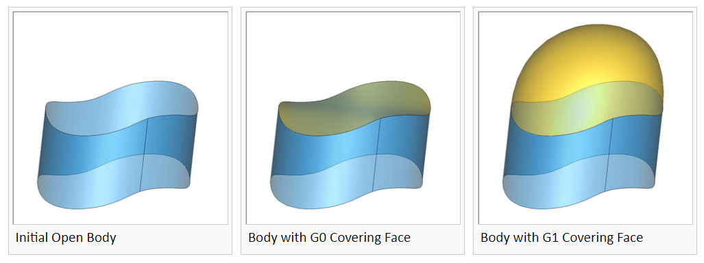
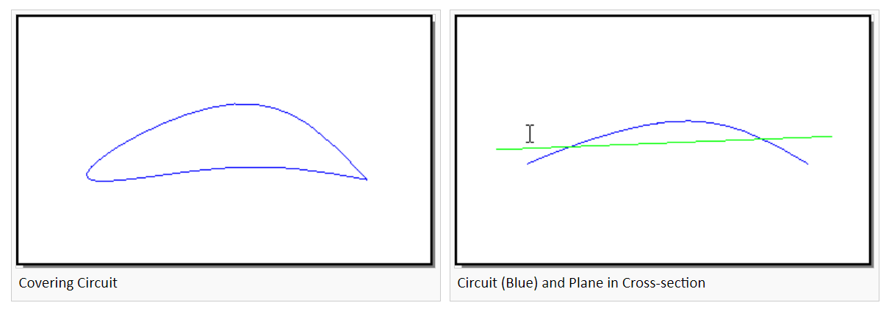
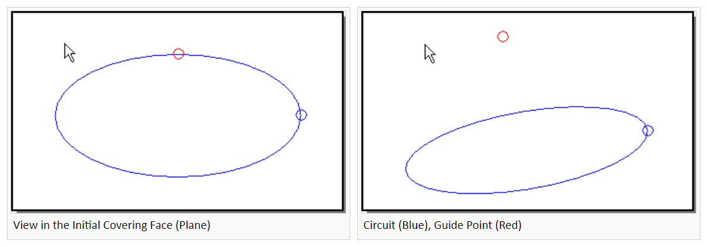
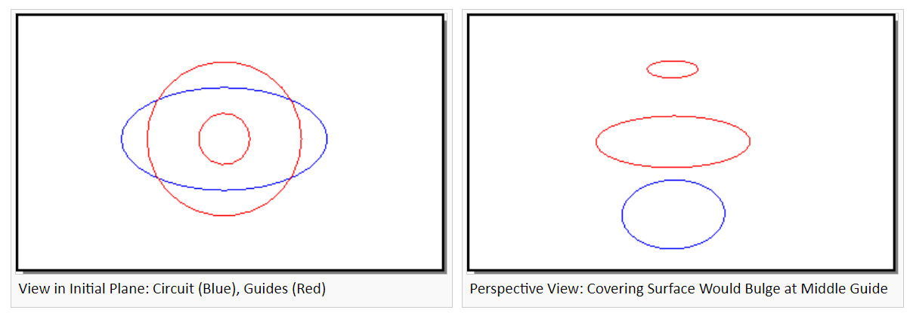
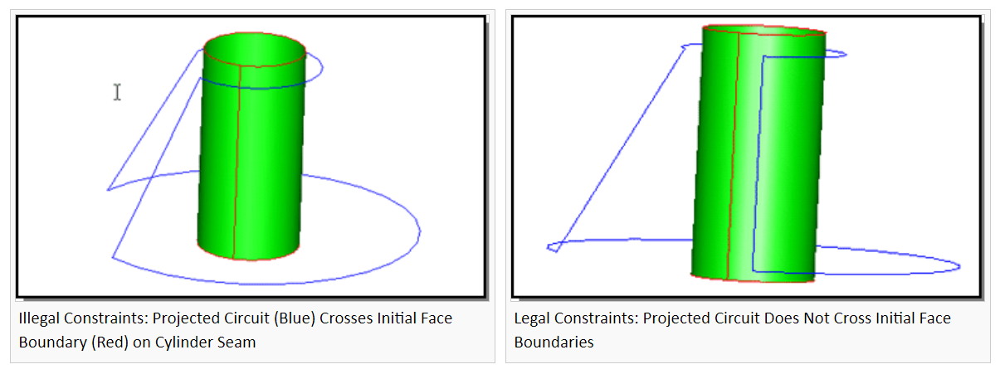

# [Advanced Covering](https://doc.spatial.com/get_doc_page/articles/a/d/v/Advanced_Covering_e42a.html)

## 基本介绍

高级覆盖 Advanced Covering 包将强大的可变形建模技术 [Deformable Modeling](https://doc.spatial.com/get_doc_page/articles/a/c/i/Component~ACIS_Deformable_Modeling_a9a6.html) 集成到一个简单易用的高级界面中。使用高级覆盖可以以满足约束的方式将 face 放在 edge 的回路上。该算法使初始曲面（默认情况下为平面）变形，直到它位于指定的边上。高级覆盖可以生成沿边界与相邻面 $G^1$ 连续的覆盖。




### 术语

#### Circuit

电路 circuit 是形成封闭 loop 的 edge 的集合。对于高级覆盖，loop 不能自相交。

* 对于 `api_advanced_cover` ，电路上的边可以位于一组面上，也可以位于一组 wire 上。电路中的每个边必须是 wire 或 sheet 边界；也就是说，它必须只有一个 coedge 。给定一个明确电路（即每个顶点有且只有两个有效边的电路）上的边，`api_advanced_cover` 将自动找到要覆盖的电路。
* 对于 `api_advanced_cover_no_stitch`，它将覆盖包括 wire 和 face 边界的边的电路。它在电路中创建复制边，并且不会将生成的面缝合到原始边上。


#### $G^n$ Boundaries

符号 $G^n$ 描述跨越边界的光滑度。对于曲面，边界通常是一组曲线。对于曲线，边界始终是一组点。电路中两条边界曲线之间的交点至少是 $G^0$ 连续。


#### Guide Points and Guide Curves

引导点和引导曲线是不属于 covering 边界的约束，它们不是最终模型拓扑的一部分。引导约束只能约束位置，属于 $G^0$ 约束。


#### Position and Tangency Gaps

间隙 Gaps 是边界处的跳跃。位置跳跃是坐标的跳跃，而切线跳跃是斜率的跳跃。


#### Tolerance

公差是用户指定的边界处的允许间隙或引导约束。与间隙一样，位置和切线有单独的公差。


#### Conflict (constraint)

边界约束可能会发生冲突 Conflict，这可能会妨碍满足容差。例如，如果两个相邻边界约束在其交汇处具有不同的切线，则生成的曲面法线必须与两者正交，因此可以唯一确定。这可能与其他切线约束冲突。


#### Flattening

平整 flattening 参数用来控制 $G^1$ 约束对覆盖曲面的影响。例如，切除锥体顶部，进行 $G^1$ 覆盖来产生光滑的“鼻锥”。当平整参数为零，得到的横截面大致为抛物线；当平整参数较大（0.4 至 0.7）时，横截面的中心将是平坦的，靠近外部产生尖锐的“肩部”满足切向约束。


#### Initial Projection Plane

高级覆盖算法从初始投影平面开始。要覆盖的边界将投影到此平面中，以确定覆盖曲面中的哪些点应与相应的边界点相关联。初始平面会影响约束引起的 $G^1$ 形状；通常 $G^1$ 约束使覆盖面沿着初始平面的法线方向凸起。通过选择不同的初始平面，可以调整生成的覆盖曲面的形状。可以用初始曲面来替代初始投影平面。


#### Initial Surface

可以指定初始曲面形状，而不是初始投影平面。高级覆盖算法会将此曲面变形到边界几何图形上，同时尝试保持其粗略形状。指定初始曲面对于覆盖不可投影的边界电路或会导致“双值”覆盖曲面（相对于初始平面）也很有用。从与所需覆盖曲面大致相同的初始曲面开始，高级覆盖能够产生最佳效果。


### 基本步骤

使用高级覆盖的基本步骤是：

1. 在电路中查找要覆盖的边或要重新覆盖的面。
2. 创建一个选项对象 `acovr_options`，包含约束连续性、约束容差、最大 B 样条 spans、投影平面或曲面以及平整参数（仅限 $G^1$）
3. 使用适当的签名调用 `api_advanced_cover`


高级覆盖使用的一般算法是：

1. 用户指定可投影到平面的边界电路。
2. 高级覆盖计算一张投影平面，用它作为 `acovr_options` 中的覆盖曲面的初始猜测。
3. 或者，可以通过 `set_initial_face` 设置样条曲面。初始样条曲面通过投影平面或指定的曲面创建。在每个方向上至多添加 `max_spans` 个节点，此参数通过 `set_max_spans` 设置。
4. 边界和引导几何投影到初始曲面上，并使覆盖曲面变形，以便投影点被拉到边界和引导几何上。当满足容差时，或者达到用户指定的最大 spans 数，或者当边界电路约束冲突阻止进一步减小间隙时，算法终止。覆盖曲面是 B 样条，最多具有用户指定的 `max_spans` 节点数。
5. 覆盖曲面被缝合回 ACIS 模型中。位置跳跃大于 `SPAresabs` 的边被转换为容差边。
6. 作为 sheet 边界的边的几何将会变为覆盖面的 coedge 的集合。这将同时更改边和顶点几何，但是确保 edge 和 face 没有间隙。


### 高级覆盖指导

覆盖的工作原理是将初始覆盖面变形到用户输入的电路和引导上。引导点和引导曲线以及覆盖电路必须按照一定规则布局，这些规则控制它们在初始覆盖曲面上的投影。默认的初始覆盖面是最佳拟合平面。大多数情况下，覆盖电路的平面是显然的。下文用约束来指代引导和覆盖电路。




#### 投影约束不交

在初始曲面上，引导不能投影相交或者投影到覆盖电路上。如下图要求覆盖曲面同时通过引导点和电路。如果引导几乎位于电路边界，则在投影到电路中心的辅助引导能更好地反映设计意图。




#### 投影约束具有一致控制

按 $z$ 深度对初始面、引导曲线和覆盖电路进行排序约束不应产生中间覆盖凸起。




#### 投影约束不越过初始面边界

此规则仅适用于用户指定的初始面。覆盖电路平面中的默认初始面或用户指定的初始平面会自动计算适当的边界。




#### 在覆盖电路投影内修剪初始面

使用初始面时，在要覆盖的电路投影的 5-10% 内修剪初始面。这导致更快的性能和更小的覆盖面边缘的间隙。但是，请确保不要在电路投影边界内进行修剪。


## acovr

### acovr_enum

#### 头文件

```cpp
******************************************************************* /

/*    Copyright (c) 1989-2020 by Spatial Corp.                     */
/*    All rights reserved.                                         */
/*    Protected by U.S. Patents 5,257,205; 5,351,196; 6,369,815;   */
/*                              5,982,378; 6,462,738; 6,941,251    */
/*    Protected by European Patents 0503642; 69220263.3            */
/*    Protected by Hong Kong Patent 1008101A                       */
/*******************************************************************/
// bmt 07-Feb-03 Naming consitency: acover ==> acovr in enums
//
// bmt 22-Oct-03 extend enums acovr_continuity_level, acovr_tol_type for G2
//
// bmt 29-Oct-03 add acovr_conflict_type enum
//
#ifndef ACOVR_ENUM_H
#define ACOVR_ENUM_H
    enum acovr_continuity_level {
        acovr_default_continuity,
        acovr_G0,
        acovr_G1
    };
enum acovr_tol_type
{
    acovr_pos,
    acovr_tan
};

enum acovr_conflict_type
{
    unknown_conflict,
    G1_edge_edge_conflict,
    G2_edge_edge_conflict
};

#endif // ACOVR_ENUM_H
```


#### acovr_conflict_type

指定用于指定引用的冲突类型。

| 类型                    | 含义                                       |
| ----------------------- | ------------------------------------------ |
| `unknown_conflict`      | 未知冲突                                   |
| `G1_edge_edge_conflict` | 相邻边不是 $G^1$，与用户输入的切向数据冲突 |
| `G2_edge_edge_conflict` | 相邻边不是 $G^2$，与用户输入的切向数据冲突 |


#### acovr_continuity_level

指定将由边约束强制施加的连续性（$G^0$ 或 $G^1$）约束。

| 类型                       | 含义         |
| -------------------------- | ------------ |
| `acovr_default_continuity` | 默认连续性   |
| `acovr_G0`                 | $G^0$ 连续性 |
| `acovr_G1`                 | $G^1$ 连续性 |


#### acovr_tol_type

指定间隙 gap 的类型。

| 类型        | 含义 |
| ----------- | ---- |
| `acovr_pos` | 位置 |
| `acovr_tan` | 切向 |


### acover_opts

使用高级覆盖的选项。此类用于配置覆盖。它允许指定约束连续性、约束公差、样条覆盖曲面跨度的最大数量以及覆盖算法的形状参数。在问题配置期间，可以查询 `acovr_options` 对象以确定其当前状态。覆盖后，可以查询对象以确定约束的满足程度。在对 `acovr_options` 对象进行任何更改之前，必须调用 `set_default_constraint` 。


#### 头文件

```cpp
/*******************************************************************/
/*    Copyright (c) 1989-2020 by Spatial Corp.                     */
/*    All rights reserved.                                         */
/*    Protected by U.S. Patents 5,257,205; 5,351,196; 6,369,815;   */
/*                              5,982,378; 6,462,738; 6,941,251    */
/*    Protected by European Patents 0503642; 69220263.3            */
/*    Protected by Hong Kong Patent 1008101A                       */
/*******************************************************************/
// bmt 07-Feb-03  1. Doc templates
//                2. num_spans ==> max_spans
//                3. remove default_tolerance method (never released)
//                4. add set_boundary_constraint() methods taking acovr_continuity_level
//
// bmt 10-Feb-03  1. name change: acover_options ==> acovr_options
//                2. Doc revisions
//
// bmt 24-Feb-03  1. add set_guide() & set_guides() methods which take a tol
//                2. add get_guide_tol() method
//
// bmt 24-Jun-04 add get/set methods for final check
//
#if !defined(AC_INT_OPTIONS_CLASS)
#define AC_INT_OPTIONS_CLASS

#include "logical.h"
#include "dcl_adm.h" // DECL_COVR           // DECL_COVR

#include "acis.hxx"
#include "acovr_enum.hxx"

class acovr_edge_constraint;
class acovr_gap_report;
class adv_cover_options;
class FACE;
class EDGE;
class ENTITY;
class ENTITY_LIST;
class SPAunit_vector;

class DECL_ADM acovr_options : public ACIS_OBJECT
{
private:
    adv_cover_options *m_ac_opts;
    // users should call clone method instead of copy constuctor or operator =
    acovr_options(acovr_options const &acovr_options);
    acovr_options &operator=(acovr_options const &acovr_options);

public:
    acovr_options();
    ~acovr_options();

    acovr_options *clone() const;
    int operator==(acovr_options &in_ac_opt);
    int operator!=(acovr_options &in_ac_opt);
    // user options
    void set_max_spans(int max_spans);

    int get_max_spans() const;

    void set_flattening(double flattening);

    double get_flattening() const;

    // advanced user options
    void set_initial_face(const FACE *face);

    const FACE *get_initial_face() const;

    // constraint specifications
    void set_default_constraint(const acovr_edge_constraint &default_values);

    acovr_edge_constraint get_default_constraint() const;

    void set_boundary_constraint(EDGE *bdry_edge, const acovr_edge_constraint &constraint);

    void set_boundary_constraint(EDGE *bdry_edge, acovr_continuity_level continuity);

    void set_boundary_constraints(const ENTITY_LIST &bdry_edges, const acovr_edge_constraint &constraint);

    void set_boundary_constraints(const ENTITY_LIST &bdry_edges, acovr_continuity_level continuity);

    void set_guides(const ENTITY_LIST &constraining_ents);

    void set_guides(const ENTITY_LIST &constraining_ents, double tolerance);

    void set_guide(const ENTITY *constraining_ent); // use default tolerance

    void set_guide(const ENTITY *constraining_ent, double tolerance);

    double get_guide_tol(const ENTITY *constraining_ent) const;

    void get_constrained_boundaries(ENTITY_LIST &oboundaries) const; // Get boundary edges

    acovr_edge_constraint get_boundary_constraint(const EDGE *bdy_ent) const;

    void get_guide_curves(ENTITY_LIST &guide_edges) const; // Get edges defining guide curves

    void get_guide_points(ENTITY_LIST &guide_vertices) const; // Get vertices defining guide points

    void report_max_gap(acovr_gap_report &gr) const; // Report max gap of all boundary constraints

    logical input_plane_specified() const;

    void set_plane_normal(const SPAunit_vector &dir);

    SPAunit_vector get_plane_normal() const;

    int get_num_conflicts() const;

    void get_conflict(int n, EDGE *&ed1, EDGE *&ed2, acovr_conflict_type &type) const;

    logical get_final_surf_check() const;
    void set_final_surf_check(logical new_final_check);

    // for internal use only
    adv_cover_options *get_adv_cover_options() const;

    void set_use_R10_algorithm(logical use);

    logical get_use_R10_algorithm() const;
};

#endif // AC_INT_OPTIONS_CLAS
```


#### 成员函数

| acover_opts.hxx                                              |                                                              |                                                              |
| ------------------------------------------------------------ | ------------------------------------------------------------ | ------------------------------------------------------------ |
| 返回类型                                                     | 名称                                                         | 功能                                                         |
|                                                              | [acovr_options](https://doc.spatial.com/get_doc_page/qref/ACIS/html/classacovr__options.html#aaccdc4fe6d32688cc982df6b9de8d44e) () | 构造函数                                                     |
| [acovr_options](https://doc.spatial.com/get_doc_page/qref/ACIS/html/classacovr__options.html) * | [clone](https://doc.spatial.com/get_doc_page/qref/ACIS/html/classacovr__options.html#a1604ea683f5446f80b46eb48c911f78d) () const | 深拷贝方法                                                   |
| [acovr_edge_constraint](https://doc.spatial.com/get_doc_page/qref/ACIS/html/classacovr__edge__constraint.html) | [get_boundary_constraint](https://doc.spatial.com/get_doc_page/qref/ACIS/html/classacovr__options.html#a01b976be5b546108a5cf7ca24e33fbde) (const [EDGE](https://doc.spatial.com/get_doc_page/qref/ACIS/html/classEDGE.html) *bdy_ent) const | 返回边界 edge 的约束                                         |
| void                                                         | [get_conflict](https://doc.spatial.com/get_doc_page/qref/ACIS/html/classacovr__options.html#af45eaaeef28a690ec68afd525750b525) (int n, [EDGE](https://doc.spatial.com/get_doc_page/qref/ACIS/html/classEDGE.html) *&ed1, [EDGE](https://doc.spatial.com/get_doc_page/qref/ACIS/html/classEDGE.html) *&ed2, [acovr_conflict_type](https://doc.spatial.com/get_doc_page/qref/ACIS/html/group__ACISADVCOVR.html#gac987d4b873fd766172d2463d5990082f) &type) const | 返回第 n 个约束冲突的说明                                    |
| void                                                         | [get_constrained_boundaries](https://doc.spatial.com/get_doc_page/qref/ACIS/html/classacovr__options.html#a0acfc9000ccdb39156cde51a49742a20) ([ENTITY_LIST](https://doc.spatial.com/get_doc_page/qref/ACIS/html/classENTITY__LIST.html) &oboundaries) const | 检索边界边的列表                                             |
| [acovr_edge_constraint](https://doc.spatial.com/get_doc_page/qref/ACIS/html/classacovr__edge__constraint.html) | [get_default_constraint](https://doc.spatial.com/get_doc_page/qref/ACIS/html/classacovr__options.html#a699d5e441b7423b7b7b159f126e982c1) () const | 返回默认约束的副本                                           |
| logical                                                      | [get_final_surf_check](https://doc.spatial.com/get_doc_page/qref/ACIS/html/classacovr__options.html#ad1d739a0ea86f288e7cc882ff5a9a719) () const | 返回高级覆盖是否检查候选覆盖曲面的正确性                     |
| double                                                       | [get_flattening](https://doc.spatial.com/get_doc_page/qref/ACIS/html/classacovr__options.html#afcd6194b83684c3387877d22d16143c1) () const | 返回平展参数的值                                             |
| void                                                         | [get_guide_curves](https://doc.spatial.com/get_doc_page/qref/ACIS/html/classacovr__options.html#a17067cfc4f8c128b551846af4a38226f) ([ENTITY_LIST](https://doc.spatial.com/get_doc_page/qref/ACIS/html/classENTITY__LIST.html) &guide_edges) const | 检索定义引导曲线的边                                         |
| void                                                         | [get_guide_points](https://doc.spatial.com/get_doc_page/qref/ACIS/html/classacovr__options.html#a1a6496b92ff247b92f1ae0a6f8027c23) ([ENTITY_LIST](https://doc.spatial.com/get_doc_page/qref/ACIS/html/classENTITY__LIST.html) &guide_vertices) const | 检索定义引导点的顶点                                         |
| double                                                       | [get_guide_tol](https://doc.spatial.com/get_doc_page/qref/ACIS/html/classacovr__options.html#ab6c298cf35853ad9bc28ac67e2ecd1b6) (const [ENTITY](https://doc.spatial.com/get_doc_page/qref/ACIS/html/classENTITY.html) *constraining_ent) const | 返回引导点（顶点）或引导曲线（边）的 $G^0$ 容差              |
| const [FACE](https://doc.spatial.com/get_doc_page/qref/ACIS/html/classFACE.html) * | [get_initial_face](https://doc.spatial.com/get_doc_page/qref/ACIS/html/classacovr__options.html#adc18074047e1dd709aad8e27ad56f803) () const | 返回指向初始 face 的指针                                     |
| int                                                          | [get_max_spans](https://doc.spatial.com/get_doc_page/qref/ACIS/html/classacovr__options.html#a06ed8e559f0e90f412d729a0ea767b52) () const | 返回指定的最大范围数                                         |
| int                                                          | [get_num_conflicts](https://doc.spatial.com/get_doc_page/qref/ACIS/html/classacovr__options.html#ac779ace0bc42fb0cb88fa75f2d3e3299) () const | 返回找到的约束冲突数                                         |
| [SPAunit_vector](https://doc.spatial.com/get_doc_page/qref/ACIS/html/classSPAunit__vector.html) | [get_plane_normal](https://doc.spatial.com/get_doc_page/qref/ACIS/html/classacovr__options.html#a70f6fbfb1f17cffe51b2a78e56407e86) () const | 返回 `plane_normal` 参数的当前值                             |
| logical                                                      | [input_plane_specified](https://doc.spatial.com/get_doc_page/qref/ACIS/html/classacovr__options.html#ab24281563c47e1d718deee509baf4059) () const | 如果已设置 `plane_normal` 参数返回 `TRUE` ，否则返回 `FALSE` |
| void                                                         | [report_max_gap](https://doc.spatial.com/get_doc_page/qref/ACIS/html/classacovr__options.html#acec329e1f0da2eb0eca473b56d6aa0a0) ([acovr_gap_report](https://doc.spatial.com/get_doc_page/qref/ACIS/html/classacovr__gap__report.html) &gr) const | 检索位置 （$G^0$） 和角度 （$G^1$） 的最大间隙               |
| void                                                         | [set_boundary_constraint](https://doc.spatial.com/get_doc_page/qref/ACIS/html/classacovr__options.html#a1801efa64acdae67a76e9108158e4375) ([EDGE](https://doc.spatial.com/get_doc_page/qref/ACIS/html/classEDGE.html) *bdry_edge, const [acovr_edge_constraint](https://doc.spatial.com/get_doc_page/qref/ACIS/html/classacovr__edge__constraint.html) &constraint) | 覆盖特定边界边的默认连续性和公差规范                         |
| void                                                         | [set_boundary_constraint](https://doc.spatial.com/get_doc_page/qref/ACIS/html/classacovr__options.html#af4b072a72b78bd9ef4911ce4fcbf5e91) ([EDGE](https://doc.spatial.com/get_doc_page/qref/ACIS/html/classEDGE.html) *bdry_edge, [acovr_continuity_level](https://doc.spatial.com/get_doc_page/qref/ACIS/html/group__ACISADVCOVR.html#ga7203bcafee47a949c53a13d3706e4872) continuity) | 覆盖特定边界边的默认连续性规范                               |
| void                                                         | [set_boundary_constraints](https://doc.spatial.com/get_doc_page/qref/ACIS/html/classacovr__options.html#afffeabf5ee5437cbed871d9632e7f09e) (const [ENTITY_LIST](https://doc.spatial.com/get_doc_page/qref/ACIS/html/classENTITY__LIST.html) &bdry_edges, const [acovr_edge_constraint](https://doc.spatial.com/get_doc_page/qref/ACIS/html/classacovr__edge__constraint.html) &constraint) | 覆盖边界边列表的默认连续性和公差规范                         |
| void                                                         | [set_boundary_constraints](https://doc.spatial.com/get_doc_page/qref/ACIS/html/classacovr__options.html#aee42c03e03ff8f0b16ff9600d4f541f7) (const [ENTITY_LIST](https://doc.spatial.com/get_doc_page/qref/ACIS/html/classENTITY__LIST.html) &bdry_edges, [acovr_continuity_level](https://doc.spatial.com/get_doc_page/qref/ACIS/html/group__ACISADVCOVR.html#ga7203bcafee47a949c53a13d3706e4872) continuity) | 覆盖边界边列表的默认连续性规范                               |
| void                                                         | [set_default_constraint](https://doc.spatial.com/get_doc_page/qref/ACIS/html/classacovr__options.html#a54290fad55f102cd9e13029a261a8003) (const [acovr_edge_constraint](https://doc.spatial.com/get_doc_page/qref/ACIS/html/classacovr__edge__constraint.html) &default_values) | 指定默认连续性和容差                                         |
| void                                                         | [set_final_surf_check](https://doc.spatial.com/get_doc_page/qref/ACIS/html/classacovr__options.html#af5c2dfad2ff6de87672039dc16c6ba46) (logical new_final_check) | 设置高级覆盖是否检查候选覆盖曲面的正确性                     |
| void                                                         | [set_flattening](https://doc.spatial.com/get_doc_page/qref/ACIS/html/classacovr__options.html#a7e583f31089e094fb0d795b0f917e70b) (double flattening) | 设置平展参数的值                                             |
| void                                                         | [set_guide](https://doc.spatial.com/get_doc_page/qref/ACIS/html/classacovr__options.html#a10eee059d7be3c89e66ac7af499c7e99) (const [ENTITY](https://doc.spatial.com/get_doc_page/qref/ACIS/html/classENTITY.html) *constraining_ent) | 指定引导点（顶点）或引导曲线（边）。使用默认 $G^0$ 容差。指定的任何边都必须包含在 ACIS 实体中 |
| void                                                         | [set_guide](https://doc.spatial.com/get_doc_page/qref/ACIS/html/classacovr__options.html#a87a5791b21b1ff0889a8e8c3aedcc516) (const [ENTITY](https://doc.spatial.com/get_doc_page/qref/ACIS/html/classENTITY.html) *constraining_ent, double tolerance) | 指定引导点（顶点）或引导曲线（边）。指定的任何边都必须包含在 ACIS 实体中 |
| void                                                         | [set_guides](https://doc.spatial.com/get_doc_page/qref/ACIS/html/classacovr__options.html#abe566a582d035c286af5d556b72edada) (const [ENTITY_LIST](https://doc.spatial.com/get_doc_page/qref/ACIS/html/classENTITY__LIST.html) &constraining_ents) | 指定引导点（顶点）或引导曲线（边）的列表。使用默认 $G^0$ 容差。指定的任何边都必须包含在 ACIS 实体中 |
| void                                                         | [set_guides](https://doc.spatial.com/get_doc_page/qref/ACIS/html/classacovr__options.html#af0816326a137a0802dfb67652ef7f590) (const [ENTITY_LIST](https://doc.spatial.com/get_doc_page/qref/ACIS/html/classENTITY__LIST.html) &constraining_ents, double tolerance) | 指定引导点（顶点）或引导曲线（边）的列表。指定的任何边都必须包含在 ACIS 实体中 |
| void                                                         | [set_initial_face](https://doc.spatial.com/get_doc_page/qref/ACIS/html/classacovr__options.html#a0edf96056fc24b9f7e31a1784872b69f) (const [FACE](https://doc.spatial.com/get_doc_page/qref/ACIS/html/classFACE.html) *face) | 选取初始样条曲面                                             |
| void                                                         | [set_max_spans](https://doc.spatial.com/get_doc_page/qref/ACIS/html/classacovr__options.html#a20a1bac42706338cc1b28428da9cd7d1) (int max_spans) | 设置覆盖曲面中的最大跨度数                                   |
| void                                                         | [set_plane_normal](https://doc.spatial.com/get_doc_page/qref/ACIS/html/classacovr__options.html#aa35342ca86d29ca69dfdff694c7d11bd) (const [SPAunit_vector](https://doc.spatial.com/get_doc_page/qref/ACIS/html/classSPAunit__vector.html) &dir) | 定义初始投影平面                                             |
|                                                              | [~acovr_options](https://doc.spatial.com/get_doc_page/qref/ACIS/html/classacovr__options.html#a2de157cab06d794bee4a5fc7d937daf0) () | 析构函数                                                     |


#### clone

此方法为 `acovr_options` 工厂提供基础，它使用用户指定的设置。

```cpp
acovr_options * clone () const;
```


#### get_conflict

边界约束几何可能会无意中与用户输入的相切或曲率数据发生冲突。此函数返回第 n 个此类冲突的描述

```cpp
void  get_conflict (
    int n, 						// 要查询的冲突
    EDGE *&ed1, 				// 第一条边;在连接两条边的顶点处发生冲突
    EDGE *&ed2, 				// 第二条边;在连接两条边的顶点处发生冲突
    acovr_conflict_type &type	// 冲突类型
) const;
```


#### get_constrained_boundaries

此方法使用通过 `set_edge_constraint` 或 `set_edge_constraints` 方法应用约束到所有边的列表来覆盖“边界”列表。 由于在高级覆盖过程中，边通常替换为容错边，因此在 `acovr_options` 对象用于 `api_advanced_cover` 调用后，此方法将“边界”设置为空列表。

```cpp
void  get_constrained_boundaries (ENTITY_LIST &oboundaries) const;
```


#### get_final_surf_check

默认情况下，将检查候选覆盖面，如果损坏，则会拒绝。如果 final_surf_check 标志为 false，则不会进行此检查；如果此标志为假，则高级覆盖可能会产生不良曲面。

```cpp
logical get_final_surf_check () const;
```


#### *_initial_face

初始面通过复制 face 的几何来获得。通过 `NULL` 参数调用，可以取消设置初始面。返回 `NULL` 表示未设置 ，此时 `initial_face` 将从投影平面获得初始表面。如果设置了初始面，则会忽略 `plane_normal` 参数。

```cpp
const FACE* get_initial_face () const;
void set_initial_face (const FACE * face);
```


#### *_max_spans

这是一个整数，用于控制覆盖曲面在每个方向上可以具有的最大 B 样条跨度数。较小的值会导致缺少自由度的曲面，可能产生较大的间隙，而较大的值可能会导致具有许多控制点的曲面，从而对性能产生负面影响。

```cpp
int get_max_spans () const;
void set_max_spans (int max_spans);
```


#### get_num_conflicts

边界约束几何可能会无意中与用户输入的相切或曲率数据发生冲突。此函数返回找到的冲突数。

```cpp
int get_num_conflicts () const;
```


#### *_plane_normal

仅当设置了 `plane_normal` 参数时，即 `input_plane_specified` 返回 `TRUE`，才应调用此方法。

```cpp
SPAunit_vector get_plane_normal	()	const;
void set_plane_normal (const SPAunit_vector & dir);
```

由于边界电路将投影到该平面中，因此只需要一个法向，与平面的绝对位置无关。高级覆盖根据边界电路的形状自动计算默认初始平面；如果此默认平面不令人满意，则应设置 `plane_normal` 参数。通常，发生这种情况是因为默认算法选取的平面将导致双值覆盖曲面，或者因为包含边界电路的模型具有边界电路不遵守的对称性（仅限 $G^1$ 覆盖）。例如，考虑对被平面斜切片的圆柱执行 $G^1$ 覆盖。高级覆盖尝试通过在初始曲面的法线方向上向上推覆盖曲面来满足 $G^1$ 约束。切片圆柱体的默认平面将与切片平面具有相同的法线；在这种情况下$G^1$ 约束将导致覆盖面沿圆柱轴线凸起。当法线向量设置为与轴重合时，形状会更自然；在这种情况下，凸起沿轴线，曲面之间的过渡非常平滑。


#### report_max_gap

不考虑引导曲线间隙。出于性能原因，报告的间隙 gap 是高级覆盖试图重合的点之间的间隙 gap 。

```cpp
void report_max_gap	(acovr_gap_report & gr)	const;
```


#### set_final_surf_check

默认情况下，将检查候选覆盖面，如果损坏，则会拒绝。如果 final_surf_check 标志为 false，则不会进行此检查；如果此标志为假，则高级覆盖可能会产生不良曲面。该选项主要对覆盖失败情况进行诊断；用户可以放宽容差，检查输入约束（切线与位置）是否存在冲突，或两者兼而有之。

```cpp
void set_final_surf_check (logical new_final_check);
```


#### set_flattening

平整参数是正数，控制 $G^1$ 约束对覆盖面形状的影响。当 $G^1$ 约束强制覆盖面和初始曲面的形状发生较大变化时，平整参数控制 $G^1$ 约束的影响区域。较大的（0.7左右）平整参数将导致覆盖面的“旋转”（斜率与初始表面的偏差）控制在 $G^1$ 约束边缘附近，从而产生平整的内部，其形状接近 $G^0$ 覆盖。较小的平整参数将导致 $G^1$ 约束的效果扩散，产生更圆的内部。当在圆柱顶部执行 $G^1$ 覆盖时，圆顶的高度完全由平整参数控制。较小的值产生高而圆的圆顶，较大的值产生短而平的圆顶。通常，当所有 $G^1$ 约束的支撑面已经接近于初始曲面相切时，应使用较小的值（0.1 左右），而当支撑面接近垂直时，应使用较大的值（0.4 到 0.7）（如圆柱顶部的情况）。

```cpp
void set_flattening	(double flattening);
```


### acovr_edge_cstrn

此头文件定义高级覆盖的边约束，用于指定特定边上的连续性要求。


#### 头文件

```cpp
/*******************************************************************/
/*    Copyright (c) 1989-2020 by Spatial Corp.                     */
/*    All rights reserved.                                         */
/*    Protected by U.S. Patents 5,257,205; 5,351,196; 6,369,815;   */
/*                              5,982,378; 6,462,738; 6,941,251    */
/*    Protected by European Patents 0503642; 69220263.3            */
/*    Protected by Hong Kong Patent 1008101A                       */
/*******************************************************************/
// bmt 07-Feb-03  added set_tol(), get_tol() methods to acovr_edge_constraint
// bmt 10-Feb-03 Fix sentry
// bmt 11-Feb-03 Doc revision
//
#ifndef ACOVR_EDGE_CSTRN_H
#define ACOVR_EDGE_CSTRN_H

#include "dcl_adm.h"      // DECL_ADM              // DECL_ADM
#include "acovr_enum.hxx" // acovr enumerations  // acovr enumerations

#define ACOVR_DEFAULT_POS_GAP_SPEC 1.e-3
#define ACOVR_DEFAULT_TAN_GAP_SPEC 0.00872664625997164788 // radians = 0.5 degrees
class DECL_ADM acovr_edge_constraint
{

private:
    acovr_continuity_level cty_level;
    double pos_tol;
    double tan_tol;

public:
    ~acovr_edge_constraint();

    acovr_edge_constraint();

    acovr_continuity_level get_continuity() const;

    double get_pos_tol() const;

    double get_tan_tol() const;

    double get_tol(acovr_tol_type type) const;

    void set_continuity(acovr_continuity_level icl);

    void set_pos_tol(double gap_tol);

    void set_tan_tol(double gap_tol);

    void set_tol(acovr_tol_type type, double gap_tol);
};

#endif // ADVCOVR_EDGE_CSTRN_H
```


#### 成员函数

| acovr_edge_cstrn.hxx                                         |                                                              |                                              |
| ------------------------------------------------------------ | ------------------------------------------------------------ | -------------------------------------------- |
| 返回类型                                                     | 名称                                                         | 功能                                         |
|                                                              | [acovr_edge_constraint](https://doc.spatial.com/get_doc_page/qref/ACIS/html/classacovr__edge__constraint.html#ad6cd26567fe2c4ac44c2a3958ad77905) () | 构造函数                                     |
| [acovr_continuity_level](https://doc.spatial.com/get_doc_page/qref/ACIS/html/group__ACISADVCOVR.html#ga7203bcafee47a949c53a13d3706e4872) | [get_continuity](https://doc.spatial.com/get_doc_page/qref/ACIS/html/classacovr__edge__constraint.html#a315c81bb5366092a0f8fff2f28a978a5) () const | 获得连续性                                   |
| double                                                       | [get_pos_tol](https://doc.spatial.com/get_doc_page/qref/ACIS/html/classacovr__edge__constraint.html#a2179fd8aa111ab12023974df83335183) () const | 获得位置间隙容差                             |
| double                                                       | [get_tan_tol](https://doc.spatial.com/get_doc_page/qref/ACIS/html/classacovr__edge__constraint.html#a8ca7f99eade7185dc89eff505652ce53) () const | 获得切向间隙容差                             |
| double                                                       | [get_tol](https://doc.spatial.com/get_doc_page/qref/ACIS/html/classacovr__edge__constraint.html#a283b8f1da9a140bf78cc93cc8dc03dea) ([acovr_tol_type](https://doc.spatial.com/get_doc_page/qref/ACIS/html/group__ACISADVCOVR.html#ga23b8d44f574cd7857d8c81fb127dddc8) type) const | 返回指定间隙公差类型（位置或切线）的公差值   |
| void                                                         | [set_continuity](https://doc.spatial.com/get_doc_page/qref/ACIS/html/classacovr__edge__constraint.html#adbe9509a82dbfa424086d54ac19eae56) ([acovr_continuity_level](https://doc.spatial.com/get_doc_page/qref/ACIS/html/group__ACISADVCOVR.html#ga7203bcafee47a949c53a13d3706e4872) icl) | 设置连续性级别                               |
| void                                                         | [set_pos_tol](https://doc.spatial.com/get_doc_page/qref/ACIS/html/classacovr__edge__constraint.html#a42a219964ff3e7e751bf3afc684b7263) (double gap_tol) | 设置位置间隙容差值                           |
| void                                                         | [set_tan_tol](https://doc.spatial.com/get_doc_page/qref/ACIS/html/classacovr__edge__constraint.html#a423ad7aeb368787e84ce755d03dd57f5) (double gap_tol) | 设置切线间隙容差值                           |
| void                                                         | [set_tol](https://doc.spatial.com/get_doc_page/qref/ACIS/html/classacovr__edge__constraint.html#a14c5365d5f4f8e2403768c144b81593c) ([acovr_tol_type](https://doc.spatial.com/get_doc_page/qref/ACIS/html/group__ACISADVCOVR.html#ga23b8d44f574cd7857d8c81fb127dddc8) type, double gap_tol) | 为指定的间隙公差类型（位置或切线）设置公差值 |
|                                                              | [~acovr_edge_constraint](https://doc.spatial.com/get_doc_page/qref/ACIS/html/classacovr__edge__constraint.html#a70fe885face0bad554e3f9f9c562a3da) () | 析构函数                                     |


### acovr_gap_report

此头文件定义用于存储测量一个或多个边上的间隙的查询结果。


#### 头文件

```cpp
/*******************************************************************/
/*    Copyright (c) 1989-2020 by Spatial Corp.                     */
/*    All rights reserved.                                         */
/*    Protected by U.S. Patents 5,257,205; 5,351,196; 6,369,815;   */
/*                              5,982,378; 6,462,738; 6,941,251    */
/*    Protected by European Patents 0503642; 69220263.3            */
/*    Protected by Hong Kong Patent 1008101A                       */
/*******************************************************************/
// bmt 11-Feb-03 Doc revision
//
#ifndef ADVCOVR_GAPREPORT_H
#define ADVCOVR_GAPREPORT_H

#include "dcl_adm.h" // DECL_ADM           // DECL_ADM
#include "acovr_enum.hxx"
class DECL_ADM acovr_gap_report
{

private:
    double pos_gap;
    double tan_gap;

public:
    ~acovr_gap_report();

    acovr_gap_report();

    double get_pos_gap() const;

    double get_tan_gap() const;

    double get_gap(acovr_tol_type type) const;

    // for internal use only
    void set_pos_gap(double gap_size);

    void set_tan_gap(double gap_size);

    void set_gap(acovr_tol_type type, double gap_size);
};

#endif // ADVCOVR_GAPREPORT_H
```


#### 成员函数

| acovr_gap_report.hxx |                                                              |                                      |
| -------------------- | ------------------------------------------------------------ | ------------------------------------ |
| 返回类型             | 名称                                                         | 功能                                 |
|                      | [acovr_gap_report](https://doc.spatial.com/get_doc_page/qref/ACIS/html/classacovr__gap__report.html#a7419d84c331360765cb131d5f816de64) () | 构造函数                             |
| double               | [get_gap](https://doc.spatial.com/get_doc_page/qref/ACIS/html/classacovr__gap__report.html#a85b2acf3de739aa1d3cd3ffa8cb98835) ([acovr_tol_type](https://doc.spatial.com/get_doc_page/qref/ACIS/html/group__ACISADVCOVR.html#ga23b8d44f574cd7857d8c81fb127dddc8) type) const | 返回指定间隙（位置、切线或曲率）的值 |
| double               | [get_pos_gap](https://doc.spatial.com/get_doc_page/qref/ACIS/html/classacovr__gap__report.html#ad6de3155fd577855a97fdbbc82e9cbe2) () const | 返回位置间隙                         |
| double               | [get_tan_gap](https://doc.spatial.com/get_doc_page/qref/ACIS/html/classacovr__gap__report.html#a7fdb321f0891acc8ff9c8b6f523e4bc4) () const | 返回切线间隙                         |
|                      | [~acovr_gap_report](https://doc.spatial.com/get_doc_page/qref/ACIS/html/classacovr__gap__report.html#a72ac4938ed801973da8e6e4c5e2e2633) () | 析构函数                             |


### acovrapi

高级覆盖方法具有如下限制：

* 覆盖电路必须可以投影到初始曲面上
* 电路中的每个边都必须有单个 coedge
* 电路不能有分支
* 电路不能自相交
* 不能创建双值覆盖曲面，即覆盖曲面上任何两个点都不能投影到初始曲面上的同一点


#### 头文件

```cpp
// $Id: acovrapi.hxx,v 1.5 2002/07/29 15:44:52 btomas Exp $

/*******************************************************************/
/*    Copyright (c) 1989-2020 by Spatial Corp.                     */
/*    All rights reserved.                                         */
/*    Protected by U.S. Patents 5,257,205; 5,351,196; 6,369,815;   */
/*                              5,982,378; 6,462,738; 6,941,251    */
/*    Protected by European Patents 0503642; 69220263.3            */
/*    Protected by Hong Kong Patent 1008101A                       */
/*******************************************************************/
// bmt 11-Feb-03 - Doc revision + name change: acover_options ==> acovr_options
// bmt 31-Oct-03 - added api_advanced_cover_no_stitch()
//
#ifndef ADV_COVER_API
#define ADV_COVER_API
// For user convenience, we #include all required header files here
#include "acover_opts.hxx"
#include "acovr_enum.hxx"
#include "acovr_gap_report.hxx"

#include "dcl_adm.h"

class outcome;
class EDGE;
class FACE;
class AcisOptions;

#ifndef NULL
#define NULL 0
#endif

DECL_ADM outcome api_advanced_cover(FACE *&result_face, EDGE *edge_in_circuit, acovr_options *aco = NULL, AcisOptions *opts = NULL);

DECL_ADM outcome api_advanced_cover(FACE *target_face, acovr_options *aco = NULL, AcisOptions *opts = NULL);

DECL_ADM outcome
api_advanced_cover_no_stitch(FACE *&result_face, ENTITY_LIST const &edges, acovr_options *aco = NULL, AcisOptions *opts = NULL);

// global function to report all gaps on an edge
/*
// tbrv.
*/
DECL_ADM void acover_report_gaps(const EDGE *ed, acovr_gap_report &gr); // Report the gaps on this edge

#endi
```


#### api_advanced_cover

| 1                                                            | [outcome](https://doc.spatial.com/get_doc_page/qref/ACIS/html/classoutcome.html) [api_advanced_cover](https://doc.spatial.com/get_doc_page/qref/ACIS/html/group__ACISADVCOVR.html#ga1fe94a2ada0e6cfc0ac692c8a4c34f9e) ([FACE](https://doc.spatial.com/get_doc_page/qref/ACIS/html/classFACE.html) *&result_face, [EDGE](https://doc.spatial.com/get_doc_page/qref/ACIS/html/classEDGE.html) *edge_in_circuit, [acovr_options](https://doc.spatial.com/get_doc_page/qref/ACIS/html/classacovr__options.html) *aco=NULL, [AcisOptions](https://doc.spatial.com/get_doc_page/qref/ACIS/html/classAcisOptions.html) *opts=NULL) |
| ------------------------------------------------------------ | ------------------------------------------------------------ |
| 函数名                                                       | api_advanced_cover                                           |
| 函数说明                                                     | 计算覆盖边电路的新曲面并将其添加到实体中                     |
| 函数归类                                                     | 高级 Cover 接口函数                                          |
| 优先级                                                       | 1                                                            |
| 返回类型                                                     | outcome                                                      |
| 返回说明                                                     | 保存 API 运行错误码                                          |
| 参数                                                         | 说明                                                         |
| [FACE](https://doc.spatial.com/get_doc_page/qref/ACIS/html/classFACE.html) *&result_face | 返回新的 face                                                |
| [EDGE](https://doc.spatial.com/get_doc_page/qref/ACIS/html/classEDGE.html) *edge_in_circuit | 要覆盖的电路中的 edge                                        |
| [acovr_options](https://doc.spatial.com/get_doc_page/qref/ACIS/html/classacovr__options.html) *aco=NULL | acovr 选项                                                   |
| [AcisOptions](https://doc.spatial.com/get_doc_page/qref/ACIS/html/classAcisOptions.html) *opts=NULL | ACIS 选项                                                    |
| 访问权限                                                     | public                                                       |
| 补充说明                                                     | 指定的电路形成给定 face 中的洞。ACIS 使用输入 edge 找到包含它的自由边或 wire 的电路。然后计算包含其中边的覆盖曲面。使用此曲面创建新 face，将其放入模型。这个 face 通过 `result_face` 参数返回。注意必须传入 `NULL` 作为参数。如果有需要，边界电路中的边将根据需要具有容差性，以避免间隙误差。 |


| 2                                                            | [outcome](https://doc.spatial.com/get_doc_page/qref/ACIS/html/classoutcome.html) [api_advanced_cover](https://doc.spatial.com/get_doc_page/qref/ACIS/html/group__ACISADVCOVR.html#ga67829ae368dc2925e6936f0e4e2451de) ([FACE](https://doc.spatial.com/get_doc_page/qref/ACIS/html/classFACE.html) *target_face, [acovr_options](https://doc.spatial.com/get_doc_page/qref/ACIS/html/classacovr__options.html) *aco=NULL, [AcisOptions](https://doc.spatial.com/get_doc_page/qref/ACIS/html/classAcisOptions.html) *opts=NULL) |
| ------------------------------------------------------------ | ------------------------------------------------------------ |
| 函数名                                                       | api_advanced_cover                                           |
| 函数说明                                                     | 计算覆盖边电路的新曲面并将其添加到实体中                     |
| 函数归类                                                     | 高级 Cover 接口函数                                          |
| 优先级                                                       | 1                                                            |
| 返回类型                                                     | outcome                                                      |
| 返回说明                                                     | 保存 API 运行错误码                                          |
| 参数                                                         | 说明                                                         |
| [FACE](https://doc.spatial.com/get_doc_page/qref/ACIS/html/classFACE.html) *target_face | 要重新覆盖的 face                                            |
| [acovr_options](https://doc.spatial.com/get_doc_page/qref/ACIS/html/classacovr__options.html) *aco=NULL | acovr 选项                                                   |
| [AcisOptions](https://doc.spatial.com/get_doc_page/qref/ACIS/html/classAcisOptions.html) *opts=NULL | ACIS 选项                                                    |
| 访问权限                                                     | public                                                       |
| 补充说明                                                     | 通过计算新表面重新覆盖现有 face 的外边界环路。找到外环后，ACIS 计算包含边的覆盖曲面，并替换 `target_face` 中的现有几何。将新曲面添加到模型后，边界电路中的边将根据需要具有容差性，以避免间隙误差。 |


#### api_advanced_cover_no_stitch

| 3                                                                                                       | [outcome](https://doc.spatial.com/get_doc_page/qref/ACIS/html/classoutcome.html) [api_advanced_cover_no_stitch](https://doc.spatial.com/get_doc_page/qref/ACIS/html/group__ACISADVCOVR.html#ga91cf80e75ca10dd660954ddc3bb15409) ([FACE](https://doc.spatial.com/get_doc_page/qref/ACIS/html/classFACE.html) *&result_face, [ENTITY_LIST](https://doc.spatial.com/get_doc_page/qref/ACIS/html/classENTITY__LIST.html) const &edges, [acovr_options](https://doc.spatial.com/get_doc_page/qref/ACIS/html/classacovr__options.html) *aco=NULL, [AcisOptions](https://doc.spatial.com/get_doc_page/qref/ACIS/html/classAcisOptions.html) *opts=NULL) |
| ------------------------------------------------------------------------------------------------------- | ------------------------------------------------------------------------------------------------------------------------------------------------------------------------------------------------------------------------------------------------------------------------------------------------------------------------------------------------------------------------------------------------------------------------------------------------------------------------------------------------------------------------------------------------------------------------------------------------------------------------------------------------ |
| 函数名                                                                                                     | api_advanced_cover_no_stitch                                                                                                                                                                                                                                                                                                                                                                                                                                                                                                                                                                                                                     |
| 函数说明                                                                                                    | 计算覆盖边电路的新曲面并将其添加到实体中                                                                                                                                                                                                                                                                                                                                                                                                                                                                                                                                                                                                                             |
| 函数归类                                                                                                    | 高级 Cover 接口函数                                                                                                                                                                                                                                                                                                                                                                                                                                                                                                                                                                                                                                    |
| 优先级                                                                                                     | 1                                                                                                                                                                                                                                                                                                                                                                                                                                                                                                                                                                                                                                                |
| 返回类型                                                                                                    | outcome                                                                                                                                                                                                                                                                                                                                                                                                                                                                                                                                                                                                                                          |
| 返回说明                                                                                                    | 保存 API 运行错误码                                                                                                                                                                                                                                                                                                                                                                                                                                                                                                                                                                                                                                     |
| 参数                                                                                                      | 说明                                                                                                                                                                                                                                                                                                                                                                                                                                                                                                                                                                                                                                               |
| [FACE](https://doc.spatial.com/get_doc_page/qref/ACIS/html/classFACE.html) *&result_face                | 返回新的 face                                                                                                                                                                                                                                                                                                                                                                                                                                                                                                                                                                                                                                        |
| [ENTITY_LIST](https://doc.spatial.com/get_doc_page/qref/ACIS/html/classENTITY__LIST.html) const &edges  | 构成电路的边的列表（按任意顺序排列）                                                                                                                                                                                                                                                                                                                                                                                                                                                                                                                                                                                                                               |
| [acovr_options](https://doc.spatial.com/get_doc_page/qref/ACIS/html/classacovr__options.html) *aco=NULL | acovr 选项                                                                                                                                                                                                                                                                                                                                                                                                                                                                                                                                                                                                                                         |
| [AcisOptions](https://doc.spatial.com/get_doc_page/qref/ACIS/html/classAcisOptions.html) *opts=NULL     | ACIS 选项                                                                                                                                                                                                                                                                                                                                                                                                                                                                                                                                                                                                                                          |
| 访问权限                                                                                                    | public                                                                                                                                                                                                                                                                                                                                                                                                                                                                                                                                                                                                                                           |
| 补充说明                                                                                                    | 新产生的 face 独立于所有现有拓扑。此函数通过覆盖指定电路的边来创建 face 。边必须形成闭合电路。如果两个顶点直接的距离小于相应边的两个位置约束容差，则视为重合，以确定电路闭合。输入边可以来自任意所有者 owner，产生的 face 不会被缝合到任何现有拓扑：所有输入边都会被复制。                                                                                                                                                                                                                                                                                                                                                                                                                                                                                                |


#### acover_report_gaps

| 4                    | outcome acover_report_gaps (const EDGE *ed, acovr_gap_report &gr) |
| -------------------- | ----------------------------------------------------------------- |
| 函数名                  | acover_report_gaps                                                |
| 函数说明                 | /                                                                 |
| 函数归类                 | 高级 Cover 接口函数                                                     |
| 优先级                  | 1                                                                 |
| 返回类型                 | outcome                                                           |
| 返回说明                 | 保存 API 运行错误码                                                      |
| 参数                   | 说明                                                                |
| const EDGE *ed       | \                                                                 |
| acovr_gap_report &gr | \                                                                 |
| 访问权限                 | public                                                            |
| 补充说明                 |                                                                   |
