# [Qt](https://download.qt.io/archive/qt/)

## 基本介绍

### 安装流程

可以在 [Qt Downloads](https://download.qt.io/official_releases/online_installers/) 网页中下载在线安装包，或者在 [清华镜像网站](https://mirrors.tuna.tsinghua.edu.cn/qt/official_releases/online_installers/) 下载。由于新版 Qt Creator 的汉化非常糟糕，我们提前下载了一个汉化正常的包，将

```
D:\Qt\Qt5.14.2\Tools\QtCreator\share\qtcreator\translations
```

目录下的同名文件 `qtcreator_zh_CN.qm` 用 `qtcreator_zh_CN.4.5.0.qm` 替换，后者重命名为前者。


### 帮助手册

直接打开 Qt Creator 的“帮助界面”，最上角“目录”下拉框和靠右边的按钮里可以调整视窗，这里我们显示两个最常用的内容：目录和索引。前者方便我们查找不同类型的文档，后者可以快速搜索类的成员和继承关系。

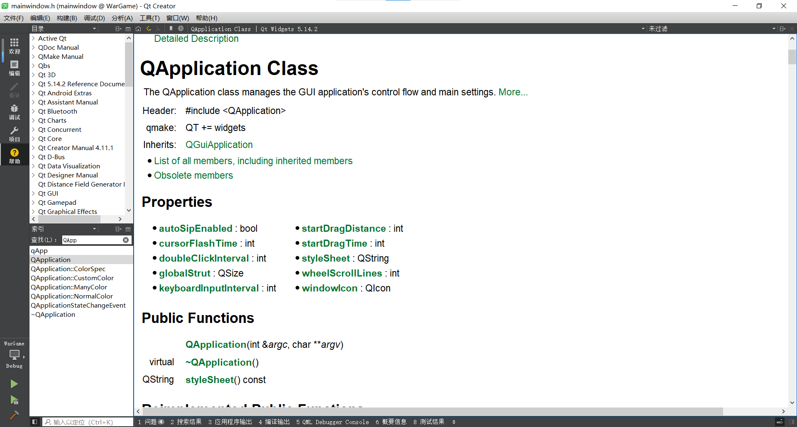


我们主要关注前两个目录的内容：

* Contents 分类列出了不同成员变量和函数
    * 成员变量
    * 公有成员函数
    * 公有虚函数
    * 公有槽
    * 信号
    * 静态公有成员
    * 保护虚函数
    * 宏
    * 细节介绍
* Class 给出类的介绍，所属头文件、编译命令、父类名称等

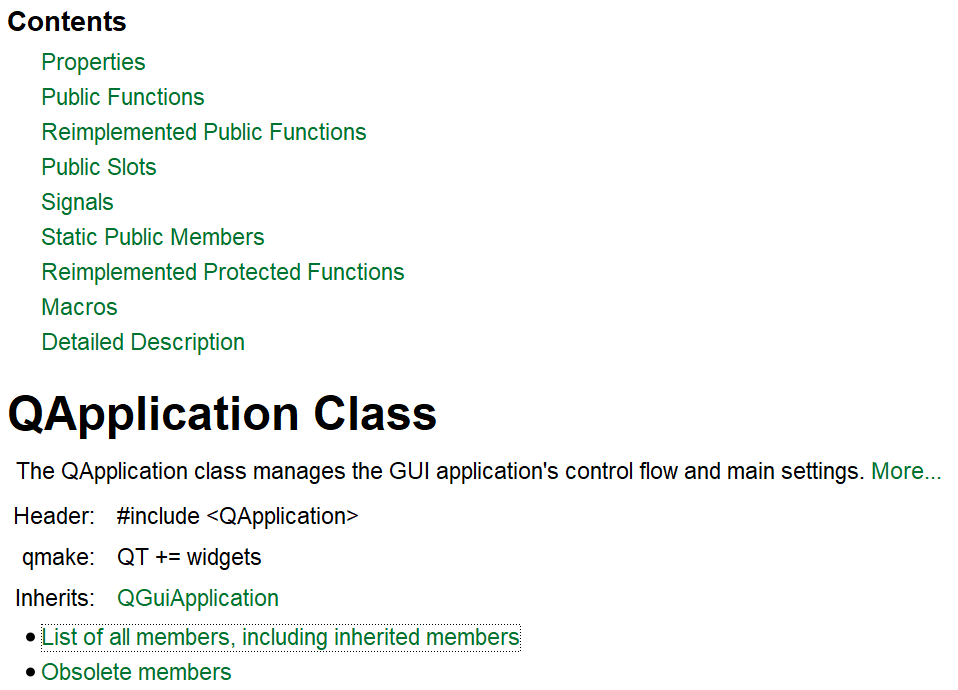

Qt 中最基本的基类是 QObject，其余大部分类都继承自此类。例如 QAppliaction 类继承自 QGuiApplication 类。沿着此类向上，可以得到继承关系


通过帮助文档，我们可以看到类所属的头文件；点击 List of all members 可以查看包括继承成员在内的成员函数列表；Obsolete members 表示过时的成员，一般不需要看。

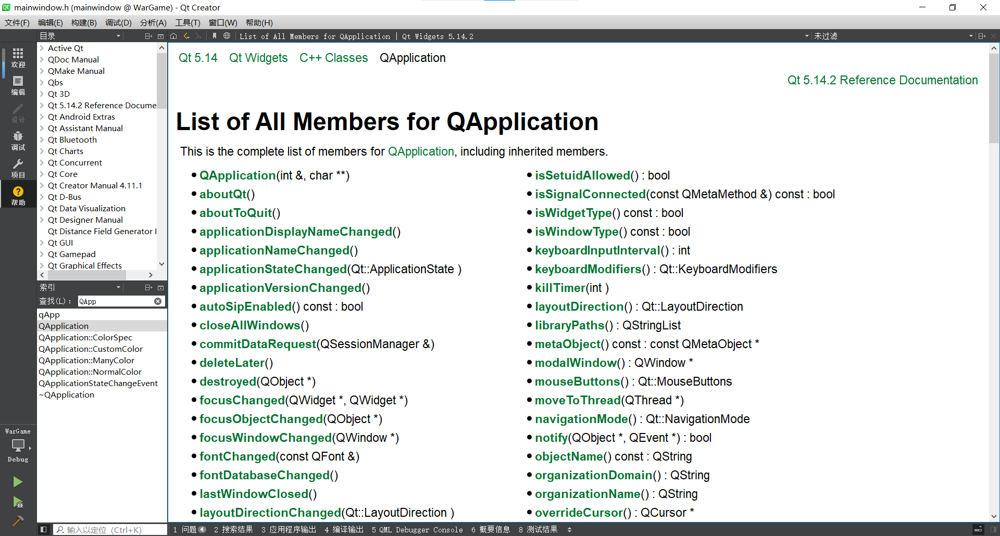


### 常用工具

三个常用的工具 assistant(Qt 助手)、qmake(Qt 构建器)、designer(Qt 设计师)都综合在 Qt Creator 界面中，分别就是“帮助”、编辑界面的 .pro 文件和“设计”界面，可以很容易地直接使用，作为项目构建的一部分。因此主要提及以下工具

* uic(Qt 转换器) 可以将设计师产生的 .ui 文件转换为 c++ 源文件
* rcc(Qt 资源编译器) 用于将图片、音频等资源编译为 c++ 可读取的形式
* moc(Qt 元对象编译器) 将带有语法扩展的 qt 文件转换成可以用 c++ 编译的文件


### 构建流程

选择生成 Qt application ，并选择项目目录，调整基本类名，就能自动产生窗口代码

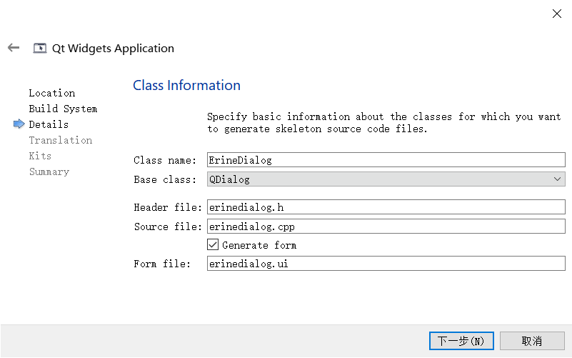

进入项目后，在项目栏点击 Configure Project 配置项目文件

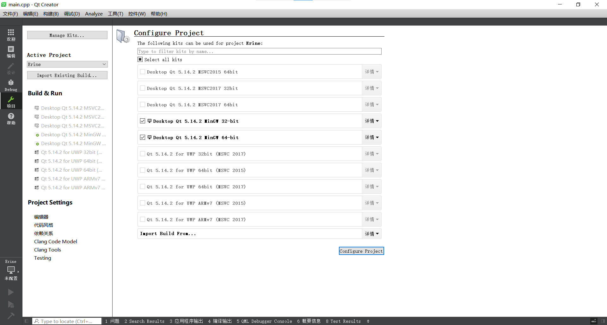

打开 .ui 文件进入设计师模式，进行窗口框架设计

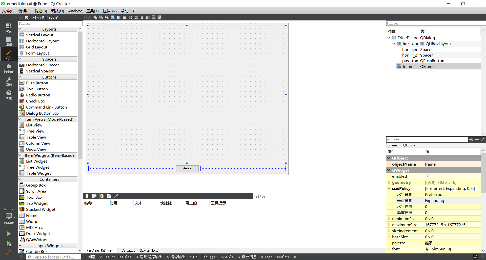

设计完成后，右击需要槽函数的控件，选择 “转到槽” ，确定需要的信号或槽函数，直接跳转到槽函数编辑界面

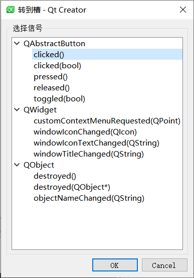

每次双击下面的 .ui 文件就可以回到设计模式。


此时已经在类中自动添加了相关函数的声明和定义，之后根据需求补全代码


点击左下角运行按钮或者 Ctrl + r 可以编译运行项目文件。


### Ui 界面

在界面文件夹下可以右键创建新的 .ui 文件

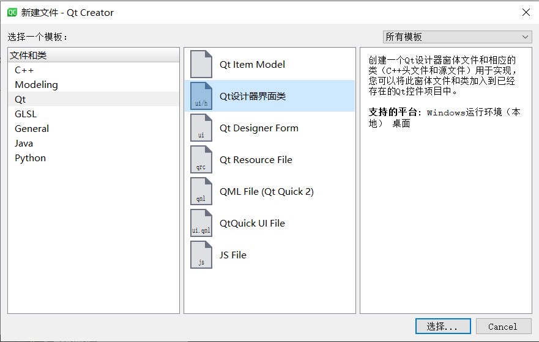

选择 Qt 设计界面类进行创建，会得到自动连接 .ui 和对应的类的各种文件；如果要对已经存在的类添加 ui 界面，就使用 Qt Designer Form 进行创建。


### 资源文件

右键创建 Qt Resource File，设置文件名称后直接创建完成。首先要添加前缀 Add Prefix，用于对资源进行分类划分

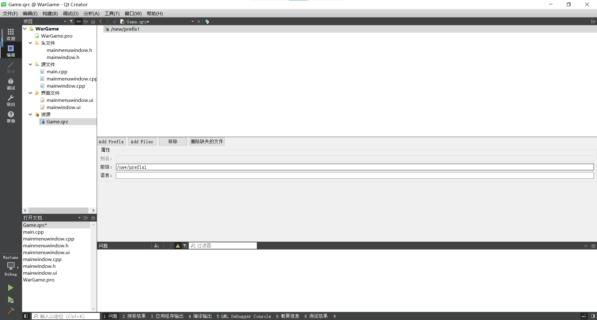


### 配置文件

配制文件 .pro 中保存了项目引用的头文件、源文件、资源文件以及库文件等路径设置，例如

```cpp
QT       += core gui

greaterThan(QT_MAJOR_VERSION, 4): QT += widgets

CONFIG += c++11

# The following define makes your compiler emit warnings if you use
# any Qt feature that has been marked deprecated (the exact warnings
# depend on your compiler). Please consult the documentation of the
# deprecated API in order to know how to port your code away from it.
DEFINES += QT_DEPRECATED_WARNINGS

# You can also make your code fail to compile if it uses deprecated APIs.
# In order to do so, uncomment the following line.
# You can also select to disable deprecated APIs only up to a certain version of Qt.
#DEFINES += QT_DISABLE_DEPRECATED_BEFORE=0x060000    # disables all the APIs deprecated before Qt 6.0.0

SOURCES += \
    Event/GameEvent.cpp \
    GameMusic.cpp \
    GameTimer.cpp \
    Hero/GameHero.cpp \
    Map/GameMap.cpp \
    Object/GameDoor.cpp \
    Object/GameEnemy.cpp \
    Object/GameGround.cpp \
    Object/GameNPC.cpp \
    Object/GameObject.cpp \
    Object/GameStair.cpp \
    Object/GameStore.cpp \
    Object/GameSuper.cpp \
    Object/GameTool.cpp \
    Object/GameWall.cpp \
    main.cpp \
    GameWindow.cpp

HEADERS += \
    Event/GameEvent.h \
    GameMusic.h \
    GameTimer.h \
    GameWindow.h \
    Hero/GameHero.h \
    Map/GameMap.h \
    Object/GameDoor.h \
    Object/GameEnemy.h \
    Object/GameGround.h \
    Object/GameNPC.h \
    Object/GameObject.h \
    Object/GameStair.h \
    Object/GameStore.h \
    Object/GameSuper.h \
    Object/GameTool.h \
    Object/GameWall.h \
    json.hpp

FORMS += \
    GameWindow.ui

# 导入静态库 winmm.lib
LIBS += -lwinmm

RC_ICONS = MagicTower.ico

# Default rules for deployment.
qnx: target.path = /tmp/$${TARGET}/bin
else: unix:!android: target.path = /opt/$${TARGET}/bin
!isEmpty(target.path): INSTALLS += target

DISTFILES += \
    MagicTower.ico \
    images/characters.jpg \
    images/characters.png \
    images/doors.png \
    images/fight.png \
    images/hero.png

RESOURCES += \
    MagicTower.qrc

```


如果要设置窗口的 ICON 图标以及应用程序 .exe 的图标，需要在项目配置文件中添加一行

```py
RC_ICONS = XXX.ico	# 图标文件名
```


### 文件路径

在使用不是资源文件中记录的文件时，需要注意文件的路径问题。默认情况下，使用的是工作目录，即项目所在的目录。然而，为了方便打包，更好的方式是使用运行目录，即 exe 文件所在的目录路径。例如

```cpp
#include <QDir>
#include <fstream>

QString name = "test";
QString fname = QDir::cleanPath(QCoreApplication::applicationDirPath() + "/file/" + name + ".txt");
std::fstream fp(fname.toStdString(), std::ios::in);
```

这样就只需要在 Build 文件夹下找到 exe 文件，将资源目录复制到该文件目录下即可。


### 中文编码

有时需要调整编码用于正确显示汉语，Qt 中使用 unicode 编码，因此可以避免乱码；程序源代码中使用的字面值形式的字符和字符串、用户通过程序界面输入的字符和字符串，以及程序通过文件、网络、进程间通讯或其它媒介读取的字符和字符串，受系统环境影响，通常会是各种不同的编码格式，统称为外部编码。


Qt 默认的源代码文件使用 utf-8 编码，而 Qt 会自动将代码转换为 unicode 编码，因此在 Qt 当中直接使用中文输出不会有编码问题；但是如果文件使用的是 gbk 编码，在显示时就会产生问题，这就需要通过编码库转换

```cpp
#include <QApplication>
#include <QLabel>
#include <QPushButton>

// 需要引入编码库
#include <QTextCodeC>

int main(int argc, char* argv[])
{
    QApplication app(argc, argv);
    
	// 创建 gbk 编码对象
    QTextCodec* coder = QTextCodec::codecForName("gbk");

    // 将要显示的 gbk 编码字符串转换为 unicode
    QLabel label(coder->toUnicode("我是标签"));
    label.show();

    QPushButton button(coder->toUnicode("我是按钮"));
    button.show();   
    
    return app.exec();
}
```


## 窗口

创建控件时，可以指定停靠在某个父窗口上面，这时**控件将作为子窗口被束缚在其父窗口的内部**，并伴随父窗口一起移动、隐藏、显示和关闭；否则该控件将作为独立窗口显示在屏幕上，且游离于其它窗口之外。

* QWidget 及其子类的对象可以作为其它控件的父窗口
* 常用的父窗口类有
    *  QWidget
    *  QMainWindow （主窗口）： QWidget 的直接子类（适合复杂窗口功能，例如菜单、工具栏）
    *  QDialog （对话框）： QWidget 的直接子类（适合简单对话框功能）

这些父窗口类是差不多的。


### 窗口函数

很多窗口属性可以通过可视化界面 UI 进行设计，我们这里整理常用的函数

```cpp
QRect rect();	// 获得窗口矩形
void show();	// 显示窗口，注意如果父窗口显示，那么子窗口也会随之显示
void hide();	// 父窗口隐藏、关闭也是同理
void move(int x, int y);			// 设置窗口位置；父窗口的位置相对于整个屏幕左上角，子窗口的位置相对于父窗口左上角
void resize(int w, int h);			// 设置窗口大小
void setWindowTitle(QString s);		// 设置窗口标题
void repaint(const QRect &rect);	// 重绘指定区域
void update(const QRect &rect);		// 更新指定区域
```


### 窗口 UI

在设计师界面进行窗口设计时，如果需要控制窗口大小不变，可以设置窗口的最大、最小尺寸相同

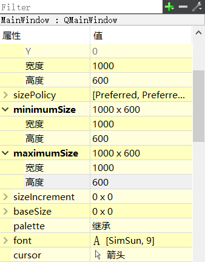

虽然窗口已经不能改变尺寸，但是右下角还是有一个状态栏表示可以拖拽，只需右键移除状态栏

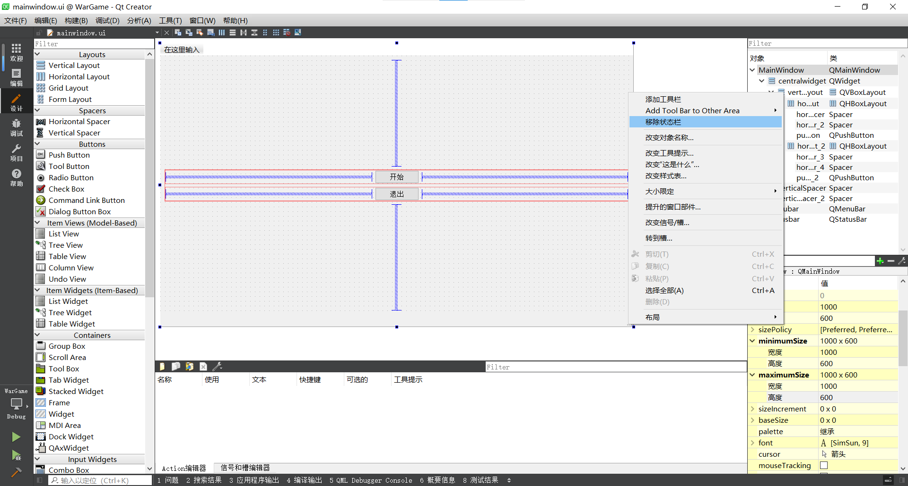

左上角的菜单栏也同样可以移除。在使用弹簧时，可以在 sizePolicy 中设置弹簧的“弹性”，设置水平策略、垂直策略。


### 窗口层级

有些窗口或控件会相互覆盖，我们需要指定它们的覆盖关系，可以通过 lower() 和 raise() 函数降低或提升到最低/最高层级。但是这种指定非常模糊，通常在 UI 界面中右键直接设置窗口层级

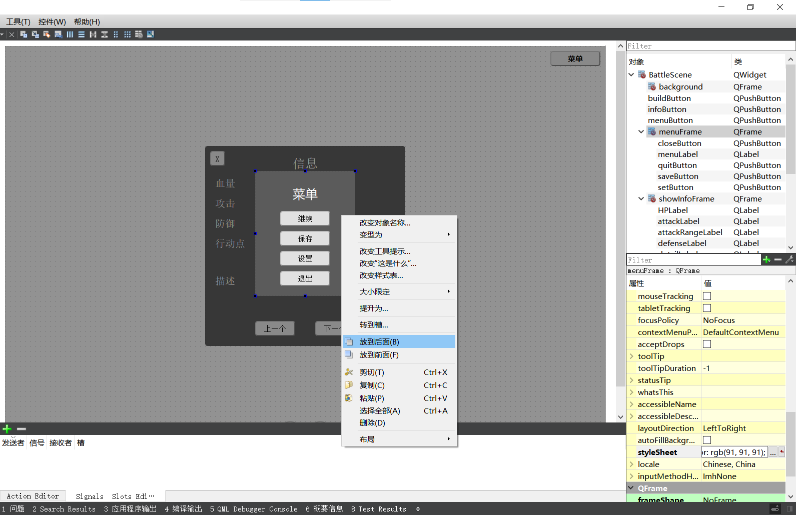

对于一些被覆盖而无法选择的窗口，在右上方直接点击对象进行设置。


### 使用范例

父窗口的析构函数会自动销毁其所有的子窗口对象，因此即使子窗口对象是通过 new 操作符动态创建的，也可以不显式地执行 delete 操作，而且不用担心内存泄露的问题； **new 对象如果指定了父窗口指针，可以不用 delete ，因此可以通过为窗口提供父窗口指针来实现在父窗口销毁时的自动销毁**

```cpp
#include "mainwindow.h"

#include <QApplication>
#include <QLabel>
#include <QPushButton>
#include <QMainWindow>

int main(int argc, char *argv[])
{
    // 创建Qt应用程序
    QApplication app(argc, argv);

    // 创建父窗口
    QMainWindow parent;
    parent.resize(320,240);

    // 一个子窗口标签
    QLabel label("我是标签", &parent);
    label.move(20,40);

    // 一个子窗口按钮
    QPushButton button("我是按钮", &parent);
    button.move(20,100);
    button.resize(80,80);

    // 通过 new 得到的子窗口
    QPushButton* button2 = new QPushButton("我是按钮", &parent);
    button2->move(170,100);
    button2->resize(80,80);

    // 在父窗口显示时，子窗口也会通过显示
    parent.show();

    //让应用程序进入事件
    return app.exec();
}
```


## 信号和槽

信号和槽是 Qt 自定义的一种通信机制，实现对象之间的数据交互。

* 当用户或系统触发了一个动作，导致某个控件的状态发生了改变，该控件就会发射一个信号，即调用其类中的一个特定的成员函数（信号），同时还可能携带有必要的参数；
* 槽和普通的成员函数差不多，可以是公有的、保护的或私有的，可以重载，也可以被覆盖，其参数可以是任意类型，并可以像普通成员一样调用。槽函数与普通成员函数的差别并不在于其语法特性，而在于其功能。槽函数更多体现为对某种特定信号的处理，可以将槽和其它对象信号建立连接，这样当发射信号时，槽函数将被触发和执行，进而来完成具体功能。


### 基本定义

信号函数只需声明，不能写定义

```cpp
class XX:pubilc QObject
{
	Q_OBJECT
signals:
    void signal_func() {}; // 信号函数
};
```


槽函数可以连接到某个信号上，当信号被发射时，槽函数将被触发和执行，另外槽函数也可以当做普通的成员函数直接调用

```cpp
class XX:pubilc QObject
{
	Q_OBJECT
public slots:
    void slot_func() {}; // 槽函数
};
```


通过 connect 函数将信号和槽连接

```cpp
QObject::connect(
    const QObject * sender, 	// 信号发送对象指针
    const char * signal, 		// 要发送的信号函数，可以使用 SIGNAL(...) 宏进行类型转换
    const QObject * receiver, 	// 信号的接收对象指针
    const char * method			// 接收信号后要执行的槽函数，可以使用 SLOT(...) 宏进行类型转换
);
```

需要注意：**如果信号函数或者槽函数的名称写错了，程序依然能够编译通过，不会报错**。


信号和槽参数要一致

```cpp
QObject::connect(A,SIGNAL(sigfun(int)),B,SLOT(slotfun(int)));
```

可以带有默认参数

```cpp
QObject::connect(A,SIGNAL(sigfun(int)),B,SLOT(slotfun(int,int=0)));
```

信号函数的参数可以多于槽函数，多余参数将被忽略

```cpp
QObject::connect(A,SIGNAL(sigfun(int,int)),B,SLOT(slotfun(int)));
```

一个信号可以被连接到多个槽

```cpp
QObject::connect(A,SIGNAL(sigfun(int)),B,SLOT(slotfun1(int)));
QObject::connect(A,SIGNAL(sigfun(int)),C,SLOT(slotfun2(int)));
```

注意：连接到的槽函数的触发顺序与连接顺序无关；多个信号也可以连接到同一个槽

```cpp
QObject::connect(A,SIGNAL(sigfun1(int)),B,SLOT(slotfun(int)));
QObject::connect(B,SIGNAL(sigfun2(int)),B,SLOT(slotfun(int)));
```

两个信号可以直接连接（信号级联），这样 sigfun1 会触发 sigfun2 信号

```cpp
QObject::connect(A1,SIGNAL(sigfun1(int)),A2,SIGNAL(sigfun2(int)));
```


### 使用范例

#### 按钮信号

根据具体的功能，在帮助手册中查找类发射的信号和槽，如果当前类中没有，可以在它的基类中查找。我们实现**点击按钮关闭标签**的功能：首先需要按钮点击的信号：QPushButton 类没有信号相关内容，在它的基类 QAbstractButton 中查找相关信号

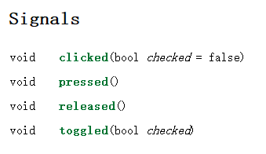

这里我们找到了与点击按钮相关的信号 clicked() ；紧接着，我们需要接受该信号的槽： QLabel 类虽然有槽相关内容，但是没有我们想要的关闭槽，于是在它的基类 QFrame 中查找；然而， QFrame 没有槽相关内容，于是在基类 QWidget 中查找

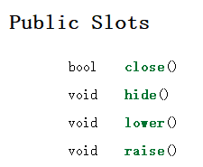

找到了关闭的槽函数 close() ；最后给出实现的代码

```cpp
#include "mainwindow.h"

#include <QApplication>
#include <QLabel>
#include <QPushButton>
#include <QMainWindow>

int main(int argc, char *argv[])
{
    // 创建 Qt 应用程序
    QApplication app(argc, argv);

    QMainWindow parent;
    parent.resize(320,240);

    QLabel label("我是标签", &parent);
    label.move(50,40);

    QPushButton button("我是按钮", &parent);
    button.move(50,140);

    // 点击按钮关闭标签
    QObject::connect(&button,SIGNAL(clicked(void)),&label,SLOT(close(void)));

    parent.show();

    // 让应用程序进入事件
    return app.exec();
}
```


我们再给出点击按钮退出程序的功能：在 QApplicaiton 类的槽函数中找到 closeAllWindows() 将其与 clicked 信号绑定

```cpp
QObject::connect(&button,SIGNAL(clicked(void)),&app,SLOT(closeAllWindows(void)));
```

也可以在它的基类 QGuiApplication 的基类 QCoreApplication 的槽函数中找到 quit()

```cpp
QObject::connect(&button,SIGNAL(clicked(void)),&app,SLOT(quit(void)));
```

还可以直接关闭父窗口

```cpp
QObject::connect(&button,SIGNAL(clicked(void)),&parent,SLOT(close(void)));
```

两者实现的是相同的操作。


#### 滚动条信号

我们实现水平滚动条和数值显示同步。首先找到滑块 QSlider 的构造函数

```cpp
QSlider::QSlider(Qt::Orientation orientation, QWidget *parent = nullptr);
```

注意到需要一个类型 Orientation ，在点击构造函数看到


则 Qt::Orientation 有两种取值

```cpp
Qt::Horizontal	// 水平
Qt::Vertical	// 竖直
```


在其基类 QAbstractSlider 中查找得到

```cpp
void setRange(int min, int max);	// Public slots
void setValue(int);					// Public slots
void valueChanged(int value);		// Signals
```


选值框 QSpinBox 的构造函数

```cpp
QSpinBox::QSpinBox(QWidget *parent = nullptr);
```

直接查找所需的函数

```cpp
void setValue(int val);						// Public slots
void setRange(int minimum, int maximum);	// Public functions
void valueChanged(int i);					// Signals
```


实现的代码

```cpp
#include "mainwindow.h"

#include <QApplication>
#include <QSpinBox>
#include <QSlider>
#include <QMainWindow>

int main(int argc, char *argv[])
{
    // 创建Qt应用程序
    QApplication app(argc, argv);

    QMainWindow parent;
    parent.resize(320,240);

    // 创建水平滑块
    QSlider slider(Qt::Horizontal,&parent);
    slider.move(20,100);
    slider.setRange(0,200);

    // 创建选值框
    QSpinBox spin(&parent);
    spin.move(220,100);
    spin.setRange(0,200);

    // 滑块滑动让选值框数值随之改变
    QObject::connect(&slider,SIGNAL(valueChanged(int)),&spin,SLOT(setValue(int)));

    // 选值框数值改变让滑块随之滑动
    QObject::connect(&spin,SIGNAL(valueChanged(int)),&slider,SLOT(setValue(int)));

    parent.show();

    //让应用程序进入事件
    return app.exec();
}
```


## 自定义 Qt 编程

通过编写自定义的窗口类实现多个功能。


### 自定义窗口类

```cpp
class XXX : public XXX // 通常需要继承一个窗口类 QMainWindow / QDialog / QWidget
{
    // 需要这一宏，表示这是 Qt 类，需要转换为标准 C++ 代码
	Q_OBJECT
public:
    // 公共函数
    
public slots:
    // 自定义公共槽函数
    
signals:
    // 自定义信号函数
    
private:
    // 私有函数和成员控件
};
```


#### 构造函数

用于类的初始化，其中进行窗口调整，定义包含的控件，实现信号与槽的连接

```cpp
XXX::XXX()
{
    // 窗口设置。窗口函数是继承自父窗口的成员函数，可以直接调用
    setWindowText("XXX");
    // ...
    
	// 成员控件定义和设置
    QXXX XXX = new QXXX(...);
    
    // 连接不同的信号和槽
    connect(...);
}
```


#### 槽函数

在类中自定义的槽函数成为类的成员函数

```cpp
class XXX : public XXX // 通常需要继承一个窗口类 QMainWindow / QDialog / QWidget
{
    // 需要这一宏，表示这是 Qt 类，需要转换为标准 C++ 代码
	Q_OBJECT
public:
    // 公共函数
    
public slots:
    // 自定义公共槽函数
    void mySlot(...);
};
```


通过连接方式调用槽函数，接收信号的指针应当为父窗口指针 this 

```cpp
connect(A, SIGNAL(sigfun(int)), this, SLOT(mySlot(...)));
```


#### 信号函数

在类中自定义的信号函数成为类的成员函数，可以连接类的信号函数和其它控件的槽函数

```cpp
class XXX : public XXX // 通常需要继承一个窗口类 QMainWindow / QDialog / QWidget
{
    // 需要这一宏，表示这是 Qt 类，需要转换为标准 C++ 代码
	Q_OBJECT
public:
    // 公共函数
    
public slots:
    // 自定义公共槽函数
    
signals:
    // 自定义信号函数
    void mySignal(...);
};
```


通过连接方式调用信号函数，发射信号的指针应当为父窗口指针 this 

```cpp
connect(this, SIGNAL(mySignal(...)), B, SLOT(slotfun(int)));
```


自定义信号函数需要自行发射

```cpp
emit mySignal(...);
```

emit 是一个标记宏，仅仅用于说明这是一个信号发射，并没有实际用途。


由于自定义信号函数很少用，在这里简单示例

```cpp
// .h

class TimeDialog : public QDialog
{
    Q_OBJECT
public:
    TimeDialog();
    
public slots:
    void getTime(); // 获取系统时间的槽函数
    
signals:
    // 只需声明，不能定义
    void mySignal(const QString &);
};

// .cpp
TimeDialog::TimeDialog()
{
    // ...
    connect(m_button, SIGNAL(clicked()), this, SLOT(getTime()));				// 信号和槽函数连接
    connect(this, SIGNAL(mySignal(QString)), m_label, SLOT(setText(QString)));	// 自定义信号函数的连接
}

void TimeDialog::getTime()
{
    QTime time = QTime::currentTime();			// 获取当前系统时间
    QString str = time.toString("hh:mm:ss");	// 将时间对象转换为字符串
    emit mySignal(str);							// 发射信号
}
```


### 使用范例

我们以几个案例说明如何构建面向对象的 Qt 程序。


#### 加法器

设计一个窗口，显示两个输入框和输出框，点击按钮计算输入框的数字和，显示在输出框中。


在头文件 CalculatorDialog.h 中构建类

```cpp
#ifndef __CALCULATORDIALOG_H
#define __CALCULATORDIALOG_H

#include <QDialog>
#include <QLabel>
#include <QPushButton>
#include <QLineEdit>        // 行编辑控件
#include <QHBoxLayout>      // 水平布局器
#include <QDoubleValidator> // 验证器

// 继承对话框类
class CalculatorDialog : public QDialog
{
    Q_OBJECT    // 宏 moc ：转换为标准 C++ 代码
public:
    CalculatorDialog();
    
// 公共槽函数声明
public slots:
    void enableButton();	// 是否能按下等号按钮的槽操作数
    void calClicked();		// 计算结果和显示的槽函数
    
private:
    QLineEdit* m_editX; 	// 左操作数
    QLineEdit* m_editY; 	// 右操作数
    QLineEdit* m_editZ; 	// 显示结果
    QLabel* m_label;    	// "+" 号
    QPushButton* m_button; 	// "=" 号
};

#endif // __CALCULATORDIALOG_H
```


在 CalculatorDialog.cpp 中实现成员函数

```cpp
#include "CalculatorDialog.h"
#include "ui_mainwindow.h"

// 构造函数
CalculatorDialog::CalculatorDialog()
{
    // 界面初始化
    setWindowTitle("计算器");								// 设置窗口标题
    m_editX = new QLineEdit(this);						  // 左操作数，指向父窗口
    m_editX->setAlignment(Qt::AlignRight);				  // 设置文本对齐方式：右对齐
    m_editX->setValidator(new QDoubleValidator(this));	  // 设置数字验证器，只能输入数字形式内容

    // 右操作数
    m_editY = new QLineEdit(this);
    m_editY->setAlignment(Qt::AlignRight);
    m_editY->setValidator(new QDoubleValidator(this));

    // 显示结果
    m_editZ = new QLineEdit(this);
    m_editZ->setAlignment(Qt::AlignRight);
    m_editZ->setReadOnly(true); // 设置只读

    // "+" 号
    m_label = new QLabel("+", this);

    // "=" 号
    m_button = new QPushButton("=", this);
    m_button->setEnabled(false); // 设置禁用

    // 创建布局器：自动调用每个控件的大小和位置
    QHBoxLayout* layout = new QHBoxLayout(this);
    // 按水平方向，依次将控件添加到布局器中
    // 布局器会按照添加的顺序排列控件
    layout->addWidget(m_editX);
    layout->addWidget(m_label);
    layout->addWidget(m_editY);
    layout->addWidget(m_button);
    layout->addWidget(m_editZ);
    // 设置布局器
    setLayout(layout);

    // 信号和槽函数连接
    // 左右操作数文本改变时，发送信号 textChanged()
    // 注意：这里选择的接收对象是当前的父窗口，因为 enableButton 是其成员函数
    connect(m_editX,SIGNAL(textChanged(QString)),this,SLOT(enableButton(void)));
    connect(m_editY,SIGNAL(textChanged(QString)),this,SLOT(enableButton(void)));

    // 点击按钮，发送信号 clicked()
    connect(m_button,SIGNAL(clicked(void)),this,SLOT(calClicked(void)));
}

void CalculatorDialog::enableButton()
{
    bool bXOk, bYOk;
    // text() ：获取输入文本 QString
    // toDouble() ： QString 转换为 double ，参数保存转换是否成功的结果
    m_editX->text().toDouble(&bXOk);
    m_editY->text().toDouble(&bYOk);

    // 当左右操作数都输入有效数据，则允许按下等号按钮，否则禁用按钮
    m_button->setEnabled(bXOk && bYOk);
}

void CalculatorDialog::calClicked()
{
    double res = m_editX->text().toDouble() + m_editY->text().toDouble();
    // double 转换为 QString
    QString str = QString::number(res);
    // 显示字符串形式结果
    m_editZ->setText(str);
}
```


在主函数 main.cpp 中调用

```cpp
#include "CalculatorDialog.h"
#include <QApplication>

int main(int argc, char *argv[])
{
    // 创建Qt应用程序
    QApplication app(argc, argv);

    // 定义显示加法器即可
    CalculatorDialog calc;
    calc.show();

    //让应用程序进入事件
    return app.exec();
}
```


#### 显示时间

设计一个窗口，包含一个显示时间的控件和一个按钮，点击按钮获取并显示当前时间。


在头文件中定义类

```cpp
#ifndef __TIMEDIALOG_H
#define __TIMEDIALOG_H

#include <QDialog>
#include <QLabel>
#include <QPushButton>
#include <QVBoxLayout>  // 垂直布局器
#include <QTime>        // 时间
#include <QDebug>       // 打印调试

class TimeDialog : public QDialog
{
    Q_OBJECT
public:
    TimeDialog();
    
public slots:
    void getTime(); // 获取系统时间的槽函数
    
private:
    QLabel* m_label; 		// 显示时间 label
    QPushButton* m_button;	// 获取时间 button
};

#endif // __TIMEDIALOG_H
```


在 TimeDialog.cpp 中实现成员函数

```cpp
#include "TimeDialog.h"
#include "ui_mainwindow.h"
#include <QFont>

// 构造函数
TimeDialog::TimeDialog()
{
    // 初始化界面
    m_label = new QLabel(this);
    m_label->setFrameStyle(QFrame::Panel | QFrame::Sunken);		// 设置 label 边框消息：凹陷面板
    m_label->setAlignment(Qt::AlignHCenter | Qt::AlignVCenter);	// 设置 label 文本对齐方式：水平/垂直居中
    
    // 设置 label 字体大小
    QFont font;
    font.setPointSize(20);
    m_label->setFont(font);

    // 获取系统时间的按钮
    m_button = new QPushButton("获取当前时间", this);
    m_button->setFont(font);

    // 创建垂直布局器
    QVBoxLayout* layout = new QVBoxLayout(this);
    layout->addWidget(m_label);
    layout->addWidget(m_button);
    // 设置布局器
    setLayout(layout);

    // 信号和槽函数连接
    connect(m_button, SIGNAL(clicked()), this, SLOT(getTime()));
}

void TimeDialog::getTime()
{
    // 两种输出调试信息的方法
    qDebug("getTime");
    qDebug() << "getTime";
    
    QTime time = QTime::currentTime();			// 获取当前系统时间
    QString str = time.toString("hh:mm:ss");	// 将时间对象转换为字符串
    m_label->setText(str);						// 显示时间
}
```


主函数中直接使用

```cpp
#include "TimeDialog.h"
#include <QApplication>

int main(int argc, char *argv[])
{
    // 创建Qt应用程序
    QApplication app(argc, argv);

	// 调用对话框
    TimeDialog time;
    time.show();

    //让应用程序进入事件
    return app.exec();
}
```


## Qt 设计师

直接在 Qt Creator 中双击 .ui 文件即可进入设计师界面

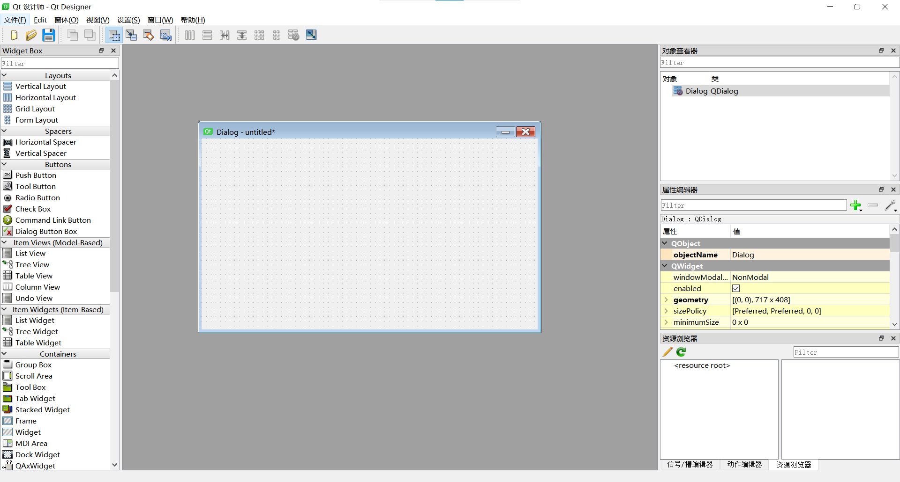


### 项目构建

左侧工具栏

*  Layouts 布局器：通常不需要额外添加，通过拖选需要的控件，右键选择布局即可
*  Spacers 间隔器：一种弹簧，在控件两端使用
*  Buttons 按钮
*  Item 用于列表布局
*  Containers 容器
*  Input 输入控件
*  Display 显示控件


对象查看器中查看不同的对象和其对应的类，点击后在下方的属性编辑器修改控件属性；右击窗口可以调整布局

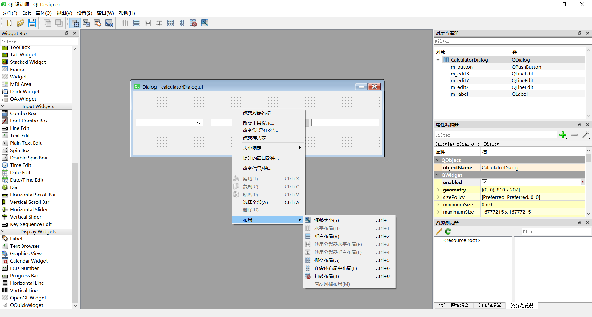

从而实现自动控制控件位置的功能；其它更多的属性根据实际情况调整。


构建完毕后，点击“窗体-预览”进行预览调试

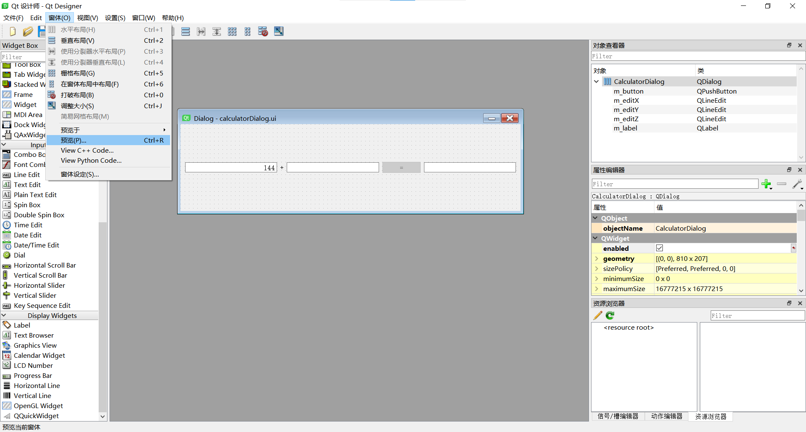


确认无误后保存为 .ui 文件，可以通过 VSCode 打开看到详细内容

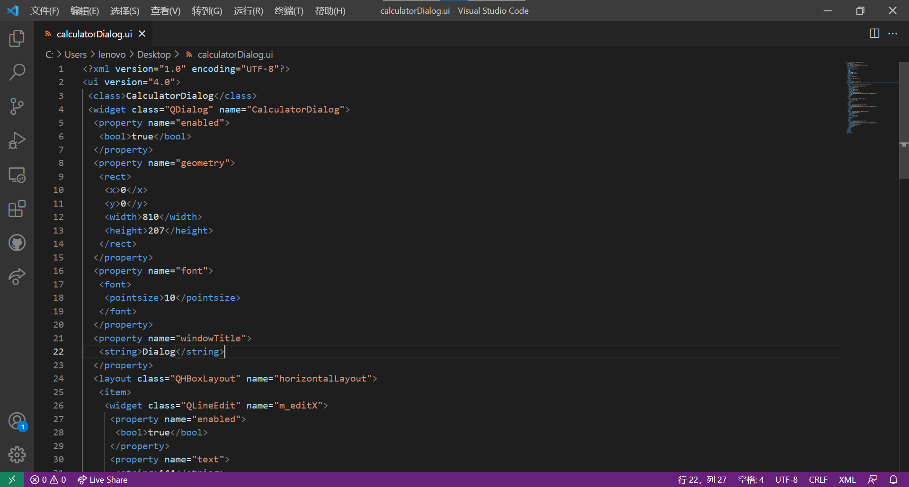


### 转换器

* 使用转换器 uic 将生成的 .ui(xml) 文件转换为 .h(c++) 文件

```shell
uic XXX.ui -o ui_XXX.h
```

如果不进行手动转换，可以在 Makefile 中自动完成

* 使用生成的头文件中的界面相关代码
    * 可以通过继承方式，直接将相关代码继承到父窗口
    * 也可以通过组合方式，添加一个界面类的成员变量，再通过该成员访问界面相关代码（推荐使用）
* 构建和测试


#### 生成结果

这里演示的是重构加法器的案例

```cpp
/********************************************************************************
** Form generated from reading UI file 'TimeDialog.ui'
**
** Created by: Qt User Interface Compiler version 5.9.7
**
** WARNING! All changes made in this file will be lost when recompiling UI file!
********************************************************************************/

#ifndef UI_TIMEDIALOG_H
#define UI_TIMEDIALOG_H

#include <QtCore/QVariant>
#include <QtWidgets/QAction>
#include <QtWidgets/QApplication>
#include <QtWidgets/QButtonGroup>
#include <QtWidgets/QDialog>
#include <QtWidgets/QHBoxLayout>
#include <QtWidgets/QHeaderView>
#include <QtWidgets/QLabel>
#include <QtWidgets/QLineEdit>
#include <QtWidgets/QPushButton>

QT_BEGIN_NAMESPACE

class Ui_CalculatorDialog
{
public:
    QHBoxLayout *horizontalLayout;
    QLineEdit *m_editX;
    QLabel *m_label;
    QLineEdit *m_editY;
    QPushButton *m_button;
    QLineEdit *m_editZ;

    // 初始化函数
    void setupUi(QDialog *CalculatorDialog)
    {
        if (CalculatorDialog->objectName().isEmpty())
            CalculatorDialog->setObjectName(QStringLiteral("CalculatorDialog"));
        CalculatorDialog->setEnabled(true);
        CalculatorDialog->resize(810, 207);
        QFont font;
        font.setPointSize(10);
        CalculatorDialog->setFont(font);
        horizontalLayout = new QHBoxLayout(CalculatorDialog);
        horizontalLayout->setObjectName(QStringLiteral("horizontalLayout"));
        m_editX = new QLineEdit(CalculatorDialog);
        m_editX->setObjectName(QStringLiteral("m_editX"));
        m_editX->setEnabled(true);
        m_editX->setAlignment(Qt::AlignRight|Qt::AlignTrailing|Qt::AlignVCenter);

        horizontalLayout->addWidget(m_editX);

        m_label = new QLabel(CalculatorDialog);
        m_label->setObjectName(QStringLiteral("m_label"));

        horizontalLayout->addWidget(m_label);

        m_editY = new QLineEdit(CalculatorDialog);
        m_editY->setObjectName(QStringLiteral("m_editY"));
        m_editY->setAlignment(Qt::AlignRight|Qt::AlignTrailing|Qt::AlignVCenter);

        horizontalLayout->addWidget(m_editY);

        m_button = new QPushButton(CalculatorDialog);
        m_button->setObjectName(QStringLiteral("m_button"));
        m_button->setEnabled(false);

        horizontalLayout->addWidget(m_button);

        m_editZ = new QLineEdit(CalculatorDialog);
        m_editZ->setObjectName(QStringLiteral("m_editZ"));
        m_editZ->setAlignment(Qt::AlignRight|Qt::AlignTrailing|Qt::AlignVCenter);
        m_editZ->setReadOnly(true);

        horizontalLayout->addWidget(m_editZ);


        retranslateUi(CalculatorDialog);

        QMetaObject::connectSlotsByName(CalculatorDialog);
    } // setupUi

    void retranslateUi(QDialog *CalculatorDialog)
    {
        CalculatorDialog->setWindowTitle(QApplication::translate("CalculatorDialog", "Dialog", Q_NULLPTR));
        m_editX->setText(QString());
        m_label->setText(QApplication::translate("CalculatorDialog", "+", Q_NULLPTR));
        m_button->setText(QApplication::translate("CalculatorDialog", "=", Q_NULLPTR));
    } // retranslateUi

};

// 使用 Ui::CalculatorDialog 即可
namespace Ui {
    class CalculatorDialog: public Ui_CalculatorDialog {};
} // namespace Ui

QT_END_NAMESPACE

#endif // UI_TIMEDIALOG_H
```


#### 继承方式

按顺序继承 `QDialog` 和自动生成的 `Ui::CalculatorDialog` ，不需要再定义成员变量，因为已经继承了；在构造函数中关于控件初始化的内容可以省略，由 `setupUi()` 完成；数字验证器无法通过设计师添加，需要手动设置

```cpp
// CalculatorDialog.h

#ifndef __CALCULATORDIALOG_H
#define __CALCULATORDIALOG_H

#include "ui_CalculatorDialog.h"

// 继承对话框类
class CalculatorDialog : public QDialog, public Ui::CalculatorDialog
{
    Q_OBJECT    // 宏 moc ：转换为标准 C++ 代码
public:
    CalculatorDialog();
// 公共槽函数声明
public slots:
    // 是否能按下等号按钮的槽操作数
    void enableButton();
    // 计算结果和显示的槽函数
    void calClicked();
};

#endif // __CALCULATORDIALOG_H

// CalculatorDialog.cpp
#include "CalculatorDialog.h"
#include "ui_mainwindow.h"

// 构造函数
CalculatorDialog::CalculatorDialog()
{
    // 界面初始化
    setupUi(this);
    
    // 设置数字验证器，只能输入数字形式内容
    m_editX->setValidator(new QDoubleValidator(this));
    m_editY->setValidator(new QDoubleValidator(this));

    // 信号和槽函数连接
    // 左右操作数文本改变时，发送信号 textChanged()
    // 注意：这里选择的接收对象是当前的父窗口，因为 enableButton 是其成员函数
    connect(m_editX,SIGNAL(textChanged(QString)),this,SLOT(enableButton(void)));
    connect(m_editY,SIGNAL(textChanged(QString)),this,SLOT(enableButton(void)));

    // 点击按钮，发送信号 clicked()
    connect(m_button,SIGNAL(clicked(void)),this,SLOT(calClicked(void)));
}

void CalculatorDialog::enableButton()
{
    bool bXOk, bYOk;
    // text() ：获取输入文本 QString
    // toDouble() ： QString 转换为 double ，参数保存转换是否成功的结果
    m_editX->text().toDouble(&bXOk);
    m_editY->text().toDouble(&bYOk);

    // 当左右操作数都输入有效数据，则允许按下等号按钮，否则禁用按钮
    m_button->setEnabled(bXOk && bYOk);
}

void CalculatorDialog::calClicked()
{
    double res = m_editX->text().toDouble() + m_editY->text().toDouble();
    // double 转换为 QString
    QString str = QString::number(res);
    // 显示字符串形式结果
    m_editZ->setText(str);
}
```


#### 组合方式

不是继承，而是通过定义一个私有的成员变量来调用界面相关代码，每次使用控件都需要通过 `ui->` 进行，但因此也要添加一个析构函数

```cpp
// CalculatorDialog.h

#ifndef __CALCULATORDIALOG_H
#define __CALCULATORDIALOG_H

#include "ui_CalculatorDialog.h"

class CalculatorDialog : public QDialog
{
    Q_OBJECT    // 宏 moc ：转换为标准 C++ 代码
public:
    CalculatorDialog();
    ~CalculatorDialog();
// 公共槽函数声明
public slots:
    // 是否能按下等号按钮的槽操作数
    void enableButton();
    // 计算结果和显示的槽函数
    void calClicked();
private:
    // 通过 ui-> 访问和界面相关的代码
    Ui::CalculatorDialog* ui;
};

#endif // __CALCULATORDIALOG_H

// CalculatorDialog.cpp
#include "CalculatorDialog.h"
#include "ui_mainwindow.h"

// 构造函数
CalculatorDialog::CalculatorDialog() : ui(new Ui::CalculatorDialog)
{
    // 界面初始化
    ui->setupUi(this);
    
    // 设置数字验证器，只能输入数字形式内容
    ui->m_editX->setValidator(new QDoubleValidator(this));
    ui->m_editY->setValidator(new QDoubleValidator(this));

    // 信号和槽函数连接
    // 左右操作数文本改变时，发送信号 textChanged()
    // 注意：这里选择的接收对象是当前的父窗口，因为 enableButton 是其成员函数
    connect(ui->m_editX,SIGNAL(textChanged(QString)),this,SLOT(enableButton(void)));
    connect(ui->m_editY,SIGNAL(textChanged(QString)),this,SLOT(enableButton(void)));

    // 点击按钮，发送信号 clicked()
    connect(ui->m_button,SIGNAL(clicked(void)),this,SLOT(calClicked(void)));
}

void CalculatorDialog::enableButton()
{
    bool bXOk, bYOk;
    // text() ：获取输入文本 QString
    // toDouble() ： QString 转换为 double ，参数保存转换是否成功的结果
    ui->m_editX->text().toDouble(&bXOk);
    ui->m_editY->text().toDouble(&bYOk);

    // 当左右操作数都输入有效数据，则允许按下等号按钮，否则禁用按钮
    ui->m_button->setEnabled(bXOk && bYOk);
}

void CalculatorDialog::calClicked()
{
    double res = ui->m_editX->text().toDouble() + ui->m_editY->text().toDouble();
    // double 转换为 QString
    QString str = QString::number(res);
    // 显示字符串形式结果
    ui->m_editZ->setText(str);
}

// 析构函数
CalculatorDialog::~CalculatorDialog()
{
    // 释放 ui 变量
    delete ui;
}
```


### 样式列表

设计师界面提供了对控件方便的样式调整方法，即右边表格中的 styleSheet

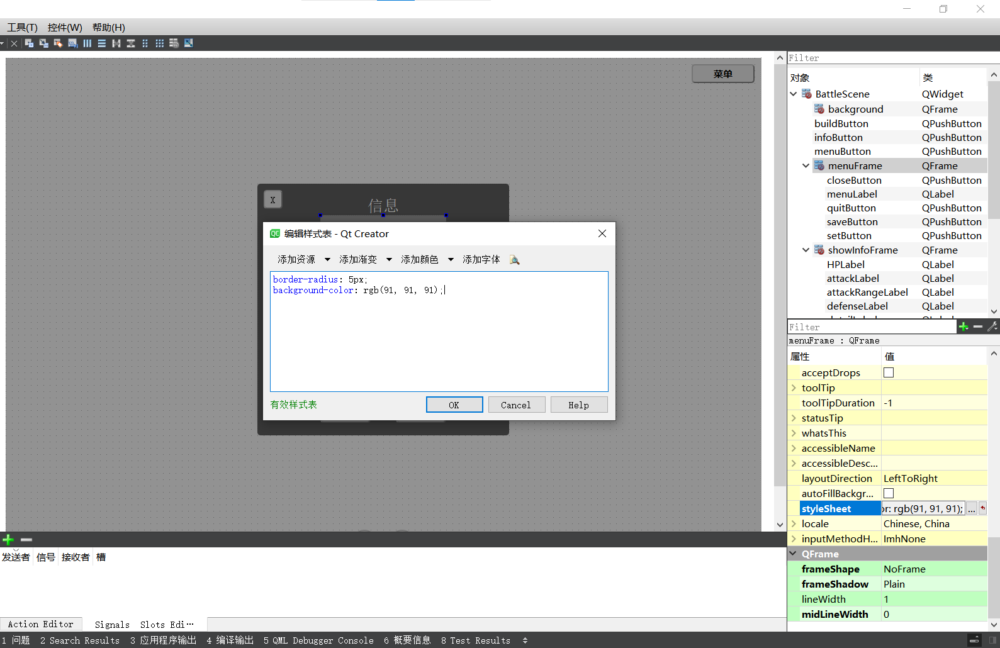

例如可以对按钮的样式进行复杂的设计，这里我们给出一个有效的样式表

```cpp
QPushButton
{
background-color: rgb(225, 225, 225);
border:2px groove gray;
border-radius:5px;
padding:2px 4px;
border-style: outset;
}

QPushButton:hover
{
background-color:rgb(229, 241, 251); 
color: black;
}

QPushButton:pressed
{
background-color:rgb(204, 228, 247);
border-style: inset;
}
```

基于此可以将按钮调整为圆形，注意首先要将其调整为正方形，然后设置边界半径为边长的一半，如果半径太大是无效的。


## 事件

在 Qt 中，是以事件驱动 UI 工具集，包括信号和槽都依赖于 Qt 的事件处理机制。事件被封装成对象，所有事件对象类型都继承自抽象类 QEvent ，当事件发生时，首先被调用的是 QObject 类中的虚函数 event() ，其参数 QEvent 标识了具体的事件类型。

所有事件处理函数都是虚函数，可以被 QWidget 的子类覆盖，以提供针对不同窗口控件类型的事件处理。如果希望在窗口中自定义处理事件，可以继承 QWidget 或者其子类，在自定义的窗口子类中重写事件处理函数


### 绘图事件

定义在库 QPainter 中，通过绘图事件实现自定义的图像绘制，触发窗口绘制事件，即 QWidget 类的 paintEvent() 虚函数被调用：

* 窗口创建时显示
* 窗口由隐藏变为可见
* 窗口由最小化变为正常或最大化
* 窗口尺寸大小变化需要呈现更多内容
* QWidget 类的 update() / repaint() 成员函数被调用

**由于 QPianter 对象在绘制完成后可能会自动销毁，如果需要绘制多个图元，最好在每次绘制前重新产生新的 QPainter 对象。**


如果希望在自己的窗口中显示某个图像，在 QWidget 的窗口子类中可以重写绘图事件函数 paintEvent ，在其中可用 QPainter 实现指定的图像绘制、渲染等操作。例如

```cpp
void ShowImageDialog::paintEvent(QPaintEvent *)
{
    QPainter painter(this);					// 创建画家对象
    QRect rect = ui->frame->frameRect();	// 获取绘图所在矩形区域
    // frame 控件的坐标原点和 painter 使用的窗口坐标原点不同，需要移动
    // 坐标值平移，让 rect 和 painter 使用相同坐标系
    rect.translate(ui->frame->pos());

    // 构建要绘制的图形对象，: 表示在项目目录而非系统目录中查找
    QImage image(":/pictures/Lv" + QString::number(m_index) + ".png");
    // 使用 painter 将 image 图片画到 rect
    painter.drawImage(rect, image);
}
```

注意这里图片的路径是在资源文件夹下给定前缀 / 下的文件夹 pictures 中的图片。


当需要主动重绘操作时，需要调用 update 函数

```cpp
this->update();
```

另外，在窗口控件上绘图也需要注意，**必须重载控件的 paintEvent 函数才能进行绘图操作**。


#### 画笔画刷

Qt 提供默认的几种画笔画刷，也可自定义。QPainter 对象自身保存了画笔画刷对象，例如

```cpp
#include <QBrush>
#include <QPen>

QBrush brush = painter.brush();
brush.setColor({255, 255, 255, 100});	// 使用 RGBA 颜色
painter.setBrush(brush);

QPen pen = painter.pen();
pen.setColor(Qt::white);	// 白色画笔
painter.setPen(pen);
```

在绘制多边形等图元时，我们可能希望不要绘制边缘，这时候可以使用无画笔

```cpp
painter.setPen(Qt::NoPen);
```


#### 绘制图元

QPainter 提供了大量绘图成员函数，从而不仅仅实现基本图元的绘制，还包括图片的绘制、裁剪显示等等。例如绘制六边形

```cpp
#include <QPolygonF>
#include <QPointF>

// 使用浮点多边形
QPolygonF polygon(6);
polygon[0] = QPointF(0, -radius);
polygon[1] = QPointF(-radius * sqrt(3) / 2, -radius / 2);
polygon[2] = QPointF(-radius * sqrt(3) / 2, radius / 2);
polygon[3] = QPointF(0, radius);
polygon[4] = QPointF(radius * sqrt(3) / 2, radius / 2);
polygon[5] = QPointF(radius * sqrt(3) / 2, -radius / 2);

painter.drawPolygon(polygon);
```


#### 渐变色

在 Qt 中，目前支持三种渐变填充方式，这三种方式都是 QGradient 的子类，它可以与画刷 QBrush 组合使用，来指定特定对象图形的填充方式。这三种填充方式是：

- QLinearGradient 显示从起点到终点的直线渐变；
- QRadialGradient 显示以圆心为中心的圆形渐变；
- QConicalGradient 显示围绕一个中心点的锥形渐变；

以线性渐变为例，在构造时指定窗口中的两个点指定渐变方向和范围；通过 setColorAt 来指定 0-1 之间的过渡颜色，这里从不透明的黑色渐变到透明白色

```cpp
// 设置渐变色
QLinearGradient linear(QPointF(0, 0), QPointF(200, 0));
linear.setColorAt(0, QColor(0, 0, 0, 255));
linear.setColorAt(1, QColor(255, 255, 255, 0));

// 设置显示模式
linear.setSpread(QGradient::PadSpread);
painter.setBrush(linear);
painter.setPen(Qt::NoPen);

// 绘制渐变框
QRect rect(0, 0, 200, 110);
painter.drawRect(rect);
```

显示模式指在渐变区域以外的绘制方式，默认情况下 QGradient::PadSpread 是对指定的渐变线性延拓。


#### 字体

通过修改字体对象 QFont 可以调整 QPainter 绘制时文字的样式。例如

```cpp
// 白色字体
QFont font;
font.setPointSize(10);
painter.setFont(font);
painter.setPen(Qt::white);
```

在绘制时经常需要计算字符串绘制的结果，通过 QFontMetrics 对象获得字体绘制信息

```cpp
QString name = "Hello"
QFontMetrics m(painter.font());
QRect rect = m.boundingRect(name);
```


### 定时器事件

Qt 有两套定时机制

* 定时器事件，由 QObject 提供
* 定时器信号，由 QTimer 提供，需要引用库 QTimer

通过定时器事件实现定时器

```cpp
int QObject::startTimer(int interval);				// 启动定时器，同时设置间隔（毫秒），返回定时器 ID
void QObject::timerEvent(QTimerEvent *) [virtual]; 	// 定时器事件处理函数
void QObject::killTimer(int id);					// 关闭参数 id 所标识的定时器
```


#### 创建定时器

有两种使用定时器的方式：

* 使用系统提供的定时器

```cpp
int timer_id = startTimer(interval);	// 启动一个定时器，储存它的 id
killTimer(timer_id);					// 根据 id 关闭定时器

// 重载 timerEvent 事件处理函数
void timerEvent(QTimerEvent *)
{
    // ... 处理不同的定时器事件
    
    // 刷新定时器
    update();
}
```


* 自定义创建定时器变量

```cpp
QTimer timer;			// 定时器变量
timer.start(interval);	// 启动定时器
timer.stop();			// 关闭定时器

// 在构造函数中连接信号和槽
XXX::XXX()
{
    // ...
    // 连接 QTimer 的信号函数和自定义的槽函数
    connect(&timer, SIGNAL(timeout()), this, SLOT(onTimeout()));
}

// 定义槽函数
void onTimeout()
{
    // ... 处理定时器事件
    
    // 刷新定时器
    update();
}
```


#### 使用范例

设计一个摇奖窗口，包含一个按钮和图像框，点击按钮开始摇奖，读取目录中的图片，定时不断切换图片显示，再次点击按钮停止摇奖。因为要自动读取，目录要放在 build 文件夹中

```cpp
#ifndef ERINEDIALOG_H
#define ERINEDIALOG_H

#include <QDialog>
#include <QTimer>
#include <QPainter>
#include <QDir>
#include <QTime>
#include <QVector>
#include <QImage>
#include <QDebug>

QT_BEGIN_NAMESPACE
namespace Ui { class ErineDialog; }
QT_END_NAMESPACE

class ErineDialog : public QDialog
{
    Q_OBJECT

public:
    ErineDialog(QWidget *parent = nullptr);
    ~ErineDialog();

private slots:
    void on_pushButton_clicked();

private:
    void loadPhotos(const QString &path);   // 加载图片容器功能
    void timerEvent(QTimerEvent *);     // 定时器事件处理函数
    void paintEvent(QPaintEvent *);     // 绘图事件处理函数

private:
    Ui::ErineDialog *ui;
    QVector<QImage> m_vecPhotos;    // 保存图片的容器
    int m_index;    // 图片在容器索引
    int m_timer;    // 定时器 ID
    bool isStarted; // 标记是否在摇奖
};
#endif // ERINEDIALOG_H
```


实现函数

```cpp
#include "erinedialog.h"
#include "ui_erinedialog.h"

ErineDialog::ErineDialog(QWidget *parent)
    : QDialog(parent)
    , ui(new Ui::ErineDialog)
{
    ui->setupUi(this);

    m_index = 0;
    isStarted = false;
    // 设置随机数种子
    qsrand(QTime::currentTime().msec());
    // 加载其中所有图片到容器的功能
    loadPhotos("./pictures");
    qDebug() << "加载图片个数：" << m_vecPhotos.size();
}

ErineDialog::~ErineDialog()
{
    delete ui;
}


void ErineDialog::on_pushButton_clicked()
{
    if (!isStarted)
    {
        isStarted = true;   // 开始摇奖
        m_timer = startTimer(50);	// 存放定时器 ID
        ui->pushButton->setText("停止");
    }
    else
    {
        isStarted = false;  // 摇奖结束
        killTimer(m_timer);	// 关闭定时器
        ui->pushButton->setText("开始");
    }
}

void ErineDialog::loadPhotos(const QString &path)
{
    QDir dir(path);
    // 遍历当前目录所有图片
    QStringList list1 = dir.entryList(QDir::Files);
    qDebug() << list1.size();
    for (int i=0;i<list1.size();i++)
    {
        QImage image(path + "\\" + list1.at(i));
        m_vecPhotos << image;
    }

    // 遍历子目录中的图片（不包含当前目录和父目录 No . And ..）
    QStringList list2 = dir.entryList(QDir::Dirs | QDir::NoDotAndDotDot);
    for (int i=0;i<list2.size();i++)
    {
        loadPhotos(path + "/" + list2.at(i));
    }
}

void ErineDialog::timerEvent(QTimerEvent *)
{
    // 随机改变显示图片的序号
    m_index = qrand() % m_vecPhotos.size();
    update();	// 刷新定时器
}

void ErineDialog::paintEvent(QPaintEvent *)
{
    QPainter painter(this);
    QRect rect = ui->frame->frameRect();
    // 调整坐标系
    rect.translate(ui->frame->pos());
    painter.drawImage(rect, m_vecPhotos[m_index]);
}
```


### 鼠标事件

定义在库 QMouseEvent 中，需要重载定义好的虚函数接口

```cpp
void mousePressEvent(QMouseEvent *);    // 按下
void mouseReleaseEvent(QMouseEvent *);  // 抬起
void mouseMoveEvent(QMouseEvent *);     // 移动
void wheelEvent(QWheelEvent *);     	// 滚轮
```

需要注意移动事件默认情况下只有在鼠标按下后才会触发，如果需要持续跟踪，需要使用

```cpp
this->setMouseTracking(true);
```

开启鼠标追踪。另外，这一操作只对 QWidget 类有效，QDialog 和 QMainWindow 都不能使用鼠标追踪。


#### 内部检测

Qt 提供了判断一个点是否在多边形内部的方法，以此为例检查鼠标点击位置是否位于一个六边形中

```cpp
void BattleScene::mousePressEvent(QMouseEvent *event)
{
    // 只检测左键
    if (event->button() == Qt::LeftButton)
    {
        // 略去初始化过程
        QPointF pos = event->pos();
        QPolygonF polygon;	
		polygon.containsPoint(pos, Qt::OddEvenFill);
    }
}
```

其中 Qt::OddEvenFill 是奇偶检测法，从指定位置画一条射线计算与多边形的交点数来判断内外。


#### 使用范例

设计一个可以用鼠标拖动的标签

```cpp
#ifndef MOUSEDIALOG_H
#define MOUSEDIALOG_H

#include <QDialog>
#include <QMouseEvent>

QT_BEGIN_NAMESPACE
namespace Ui { class MouseDialog; }
QT_END_NAMESPACE

class MouseDialog : public QDialog
{
    Q_OBJECT

public:
    MouseDialog(QWidget *parent = nullptr);
    ~MouseDialog();

private:
    void mousePressEvent(QMouseEvent *);    // 按下
    void mouseReleaseEvent(QMouseEvent *);  // 抬起
    void mouseMoveEvent(QMouseEvent *);     // 移动

private:
    Ui::MouseDialog *ui;
    bool m_drag;
    QPoint m_pos;
};
#endif // MOUSEDIALOG_H
```


函数实现

```cpp
#include "mousedialog.h"
#include "ui_mousedialog.h"

MouseDialog::MouseDialog(QWidget *parent)
    : QDialog(parent)
    , ui(new Ui::MouseDialog)
{
    ui->setupUi(this);
    m_drag = false;
}

MouseDialog::~MouseDialog()
{
    delete ui;
}

void MouseDialog::mousePressEvent(QMouseEvent *event)
{
    // 是否为鼠标左键
    if (event->button() == Qt::LeftButton)
    {
        QRect rect = ui->label->frameRect();	// 获取 label 所在矩形区域
        rect.translate(ui->label->pos());		// 使用相同坐标系
        
        // 判断鼠标点击位置是否在 rect 矩形区域中
        if (rect.contains(event->pos()))
        {
            m_drag = true;
            // 鼠标和 label 的相对位置
            m_pos = ui->label->pos() - event->pos();
        }
    }
}

void MouseDialog::mouseReleaseEvent(QMouseEvent *event)
{
    if (event->button() == Qt::LeftButton)
        m_drag = false;
}

void MouseDialog::mouseMoveEvent(QMouseEvent *event)
{
    if (m_drag)
    {
        // 计算 label 新位置
        QPoint newPos = event->pos() + m_pos;

        // 限制 label 移动的位置
        QSize s1 = size();  			// 获取父窗口大小
        QSize s2 = ui->label->size();   // 获取 label 大小

        if (newPos.x() < 0)
            newPos.setX(0);
        else if (newPos.x() > s1.width() - s2.width())
            newPos.setX(s1.width() - s2.width());

        if (newPos.y() < 0)
            newPos.setY(0);
        else if (newPos.y() > s1.height() - s2.height())
            newPos.setY(s1.height() - s2.height());

        // 移动到新位置
        ui->label->move(newPos);
    }
}
```


### 键盘事件

定义在 QKeyEvent 中，需要重载定义好的虚函数接口

```cpp
void QWidget::keyPressEvent(QKeyEvent *event);		// 按下
void QWidget::keyReleaseEvent(QKeyEvent *event);	// 释放
```

需要注意 Qt 中每个按下事件都会紧跟一个释放事件，无论实际上是否释放了按键。


#### 使用范例

设计一个用方向键控制移动的标签

```cpp
#ifndef KEYBOARDDAILOG_H
#define KEYBOARDDAILOG_H

#include <QDialog>
#include <QKeyEvent>

QT_BEGIN_NAMESPACE
namespace Ui { class KeyboardDailog; }
QT_END_NAMESPACE

class KeyboardDailog : public QDialog
{
    Q_OBJECT

public:
    KeyboardDailog(QWidget *parent = nullptr);
    ~KeyboardDailog();

private:
    void keyPressEvent(QKeyEvent *);    // 按下

private:
    Ui::KeyboardDailog *ui;
};
#endif // KEYBOARDDAILOG_H
```


函数实现

```cpp
#include "keyboarddailog.h"
#include "ui_keyboarddailog.h"

KeyboardDailog::KeyboardDailog(QWidget *parent)
    : QDialog(parent)
    , ui(new Ui::KeyboardDailog)
{
    ui->setupUi(this);
}

KeyboardDailog::~KeyboardDailog()
{
    delete ui;
}

void KeyboardDailog::keyPressEvent(QKeyEvent *event)
{
    int x = ui->label->pos().x();
    int y = ui->label->pos().y();
    if (event->key() == Qt::Key_Up)
        ui->label->move(x, y-10);
    else if (event->key() == Qt::Key_Down)
        ui->label->move(x, y+10);
    else if (event->key() == Qt::Key_Left)
        ui->label->move(x-10, y);
    else if (event->key() == Qt::Key_Right)
        ui->label->move(x+10, y);
}
```


## Qt 控件

### QLabel

标签控件，用于显示**文本或图片**，常用的构造函数如下

```cpp
QLabel::QLabel(
    const QString &text, 						// 标签名
    QWidget *parent = nullptr, 				 	// 父窗口，默认为空
    Qt::WindowFlags f = Qt::WindowFlags()	  	// 窗口样式
);
```

例如直接构造一个标签控件

```cpp
QLabel label("Hello");
label.show();
```


### QPushButton

按钮控件，是最简单的点击按钮

```cpp
QPushButton::QPushButton(
    const QString &text, 					// 标签名
    QWidget *parent = nullptr				// 父窗口，默认为空
);

QPushButton::QPushButton(
    const QIcon &icon, 						// 图标
    const QString &text, 					// 标签名
    QWidget *parent = nullptr				// 父窗口，默认为空
);
```

如果要修改按钮的文本颜色和背景颜色，可以在 styleSheet 选项中设置

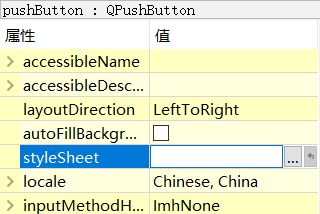

点击添加颜色，可以设置 color(文本颜色)、background-color(背景颜色)等

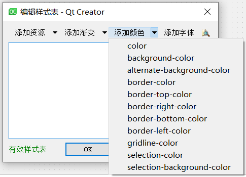

另一种通过代码设置的方式是

```cpp
ui->pushButton->setStyleSheet("color:red");						// 设置文本颜色为红色
ui->pushButton->setStyleSheet("background-color:rgb(0,255,0)");	// 设置背景颜色为绿色
```


### QSlider

滑块控件，是一种滚动条

```cpp
QSlider::QSlider(
    Qt::Orientation orientation, 	// 滑块方向
    QWidget *parent = nullptr		// 父窗口，默认为空
);

QSlider::QSlider(
    QWidget *parent = nullptr		// 父窗口，默认为空
);
```


### QSpinBox

选值框，显示数值，允许修改和复制数值

```cpp
QSpinBox::QSpinBox(
    QWidget *parent = nullptr		// 父窗口，默认为空
);
```


### QLineEdit

行编辑控件，作为水平编辑框使用

```cpp
QLineEdit::QLineEdit(
    const QString &contents, 	// 编辑框内容
    QWidget *parent = nullptr
);

QLineEdit::QLineEdit(
    QWidget *parent = nullptr
);
```


### QHBoxLayout

水平布局器，可以自动调整挂载其上的控件布局

```cpp
QHBoxLayout::QHBoxLayout(
    QWidget *parent		// 父窗口
);

QHBoxLayout::QHBoxLayout();
```


### QDoubleValidator

验证器，用于检验输入的有效性

```cpp
QDoubleValidator::QDoubleValidator(
    double bottom, 				// 最小值
    double top, 				// 最大值
    int decimals, 				// 进制
    QObject *parent = nullptr
);

QDoubleValidator::QDoubleValidator(
    QObject *parent = nullptr
);
```


### QComboBox

组合框控件，内部可以添加参数，最后得到一个表格

```cpp
QComboBox::QComboBox(
    QWidget *parent = nullptr
);
```

例如下图中的表格


### QMessageBox

一种模态对话框，常用于提示等简单窗口过程，基本窗口化：

```cpp
QMessageBox::QMessageBox(
    QWidget *parent = nullptr
);
```

可以构建更复杂的对话框

```cpp
QMessageBox::QMessageBox(
    QMessageBox::Icon icon, 											// 图标
    const QString &title, 												// 标题
    const QString &text, 												// 内容
    QMessageBox::StandardButtons buttons = NoButton, 					// 按钮
    QWidget *parent = nullptr, 											// 父窗口
    Qt::WindowFlags f = Qt::Dialog | Qt::MSWindowsFixedSizeDialogHint	// 窗口风格
);
```


## 程序打包

与 VS 编写的程序不同，Qt 应用程序需要大量使用 Qt 的动态库等文件，必须使用其自带的打包软件打包。首先要将项目在 Release 模式下编译运行，然后将生成的 exe 文件单独拿出来。在开始菜单找到 Qt 的命令行程序打开

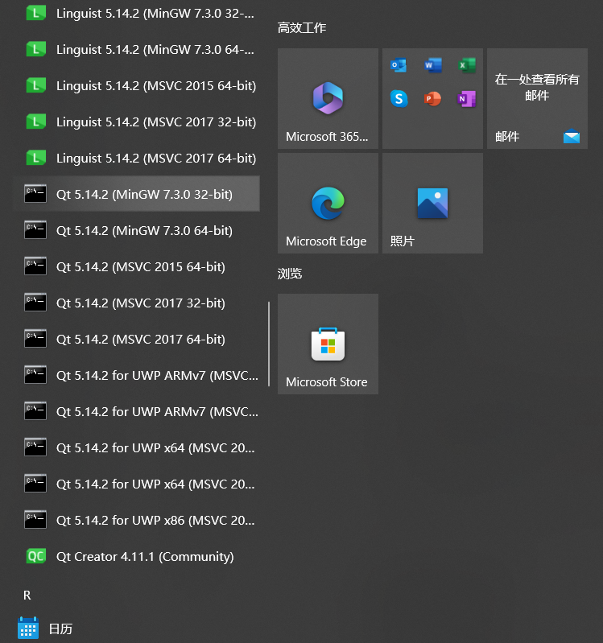

然后在命令行中使用 windeployqt 对 exe 文件进行打包，注意这里 exe 文件要提供绝对路径，并且**一定要使用英文路径！！！**

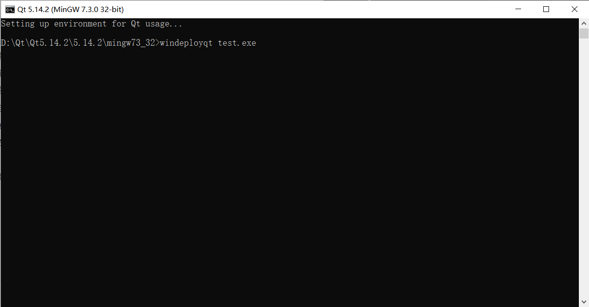

打包后就可以运行 exe 文件。如果出现程序运行错误的问题，可能是使用的打包程序的版本与项目编译的版本不同，可以尝试使用不同版本的命令行进行打包。


## 数据库

我们使用 sqlite 数据库，在 Qt 中通过 QSqlDatabase 建立应用程序和数据库连接，简单流程如下：

```cpp
db = QsqlDatabase::addDatabase("QSQLITE");	 	// 添加数据库驱动
db.setDatabaseName("menu.db");					// 设置数据库名称
dp.open();								  		// 打开数据库
```

使用 Qt 数据库模块需要在工程文件中添加 `QT += sql` 参数。


### 建立默认连接

#### QSqlDatabase

QSqlDatabase 类提供了一个建立与数据库连接的接口，一个 QsqlDatabase 实例代表一个连接。这种连接提供数据库驱动——继承自 QSqlDriver 类——以访问数据库。如下是建立默认数据库连接的示例：

```cpp
QSqlDatabase db = QSqlDatabase::addDatabase("QSQLITE");	// 添加数据库驱动
db.setHostName("acidalia");							  	// 设置主机名
db.setDatabaseName("customdb");						  	// 设置数据库名
db.setUserName("mojito");							  	// 用户名
db.setPassword("J0a1m8");							 	// 密码
bool ok = db.open();
```

实际使用时，由于 SQLite 在本地运行，不需要指定主机名等操作


#### QSqlQuery

QSqlQuery 封装了从 SQL 查询中创建、导航和查询数据等涉及到的功能，它可以用于执行 DML 语句，例如 SELECT、INSERT、UPDATE 和 DELETE ，同时还有 DDL 语句，例如 CREATE TABLE ，同时可以执行非标准 SQL 的数据库命令。如下是通过 QSqlQuery 进行数据库执行操作的示例：

```cpp
QSqlQuery query("SELECT country FROM artist");
while (query.next()) 
{
    QString country = query.value(0).toString();
    doSomething(country);
}
```

为了效率，没有通过名称访问一个块的函数，除非你准备带有名称的查询，例如：

```cpp
QSqlQuery query("SELECT * FROM artist");
int fieldNo = query.record().indexOf("country");		// 获取指定块的索引
while (query.next()) 
{
    QString country = query.value(fieldNo).toString();	// 获取对应的值
    doSomething(country);
}
```


几种绑定数据的方法：预先给出要绑定的数据

```cpp
QSqlQuery query;
query.prepare("INSERT INTO person (id, forename, surname) "
              "VALUES (:id, :forename, :surname)");
```

按照名称使用占位符绑定，即

```cpp
query.bindValue(":id", 1001);
query.bindValue(":forename", "Bart");
query.bindValue(":surname", "Simpson");
query.exec();
```

按照位置使用占位符绑定，即

```cpp
query.bindValue(0, 1001);
query.bindValue(1, "Bart");
query.bindValue(2, "Simpson");
query.exec();
```

如果不给出列名称，例如

```cpp
query.prepare("INSERT INTO person (id, forename, surname) "
              "VALUES (?, ?, ?)");
```

那么绑定有两种方法：同样按照位置绑定

```cpp
query.bindValue(0, 1001);
query.bindValue(1, "Bart");
query.bindValue(2, "Simpson");
query.exec();
```

或者通过 addBindValue 直接添加

```cpp
query.addBindValue(1001);
query.addBindValue("Bart");
query.addBindValue("Simpson");
query.exec();
```


关于 QSqlQuery 的构造函数，我们使用

```cpp
QSqlQuery::QSqlQuery(const QString &query = QString(), QSqlDatabase db = QSqlDatabase());
```

如果 db 未被指定，或是无效的，那么会使用默认数据库。如果查询 query 不是一个空字符串，它会被执行。


#### QSqlQueryModel

QSqlQueryModel 提供一个只读的数据集，用于储存查询结果集，它是一个执行 SQL 语句的高级接口，建立在 QSqlQuery 的基础上，可以用于提供数据以查看类，例如：

```cpp
QSqlQueryModel *model = new QSqlQueryModel;
model->setQuery("SELECT name, salary FROM employee");
model->setHeaderData(0, Qt::Horizontal, tr("Name"));
model->setHeaderData(1, Qt::Horizontal, tr("Salary"));

QTableView *view = new QTableView;
view->setModel(model);
view->show();
```


### 学生信息管理系统

新建 Qt 项目，然后在 .pro 文件中添加

```makefile
Qt += core gui sql
```

然后设计窗口界面，这里我们使用了组合框控件 Combo Box ，双击该空间可以编辑组合框

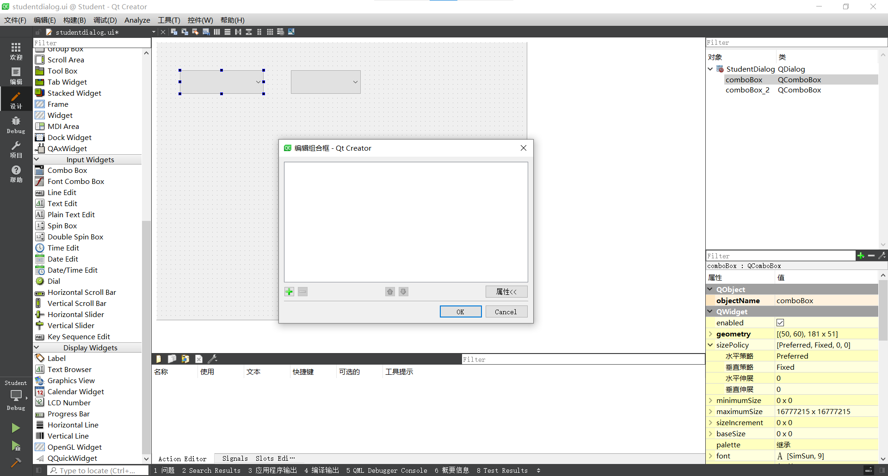

在其中添加各种属性；接着我们使用 Table View 控件，直接拖放即可，最终效果为

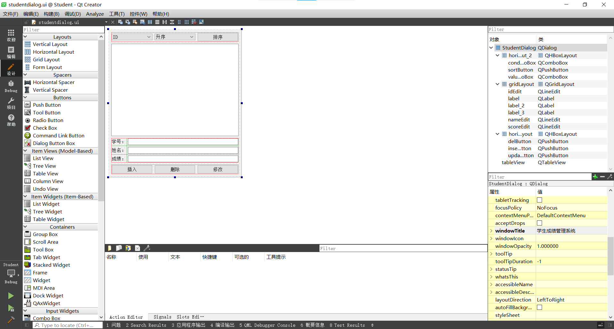


得到的 .ui 文件如下

```xml
<?xml version="1.0" encoding="UTF-8"?>
<ui version="4.0">
 <class>StudentDialog</class>
 <widget class="QDialog" name="StudentDialog">
  <property name="geometry">
   <rect>
    <x>0</x>
    <y>0</y>
    <width>416</width>
    <height>462</height>
   </rect>
  </property>
  <property name="windowTitle">
   <string>学生成绩管理系统</string>
  </property>
  <layout class="QVBoxLayout" name="verticalLayout">
   <item>
    <layout class="QHBoxLayout" name="horizontalLayout_2">
     <item>
      <widget class="QComboBox" name="valueComboBox">
       <item>
        <property name="text">
         <string>ID</string>
        </property>
       </item>
       <item>
        <property name="text">
         <string>Score</string>
        </property>
       </item>
      </widget>
     </item>
     <item>
      <widget class="QComboBox" name="condComboBox">
       <item>
        <property name="text">
         <string>升序</string>
        </property>
       </item>
       <item>
        <property name="text">
         <string>降序</string>
        </property>
       </item>
      </widget>
     </item>
     <item>
      <widget class="QPushButton" name="sortButton">
       <property name="text">
        <string>排序</string>
       </property>
      </widget>
     </item>
    </layout>
   </item>
   <item>
    <widget class="QTableView" name="tableView"/>
   </item>
   <item>
    <layout class="QGridLayout" name="gridLayout">
     <item row="0" column="0">
      <widget class="QLabel" name="label_2">
       <property name="text">
        <string>学号：</string>
       </property>
      </widget>
     </item>
     <item row="0" column="1">
      <widget class="QLineEdit" name="idEdit"/>
     </item>
     <item row="1" column="0">
      <widget class="QLabel" name="label">
       <property name="text">
        <string>姓名：</string>
       </property>
      </widget>
     </item>
     <item row="1" column="1">
      <widget class="QLineEdit" name="nameEdit"/>
     </item>
     <item row="2" column="0">
      <widget class="QLabel" name="label_3">
       <property name="text">
        <string>成绩：</string>
       </property>
      </widget>
     </item>
     <item row="2" column="1">
      <widget class="QLineEdit" name="scoreEdit"/>
     </item>
    </layout>
   </item>
   <item>
    <layout class="QHBoxLayout" name="horizontalLayout">
     <item>
      <widget class="QPushButton" name="insertButton">
       <property name="text">
        <string>插入</string>
       </property>
      </widget>
     </item>
     <item>
      <widget class="QPushButton" name="delButton">
       <property name="text">
        <string>删除</string>
       </property>
      </widget>
     </item>
     <item>
      <widget class="QPushButton" name="updateButton">
       <property name="text">
        <string>修改</string>
       </property>
      </widget>
     </item>
    </layout>
   </item>
  </layout>
 </widget>
 <resources/>
 <connections/>
</ui>
```


头文件设计如下：

```cpp
#ifndef STUDENTDIALOG_H
#define STUDENTDIALOG_H

#include <QDialog>
#include <QSqlDatabase>
#include <QSqlQuery>
#include <QSqlQueryModel>
#include <QSqlError>
#include <QDebug>
#include <QMessageBox>

QT_BEGIN_NAMESPACE
namespace Ui { class StudentDialog; }
QT_END_NAMESPACE

class StudentDialog : public QDialog
{
    Q_OBJECT

public:
    StudentDialog(QWidget *parent = nullptr);
    ~StudentDialog();
private:
    // 创建数据库
    void createDB();
    // 创建数据表
    void createTable();
    // 查询
    void queryTable();
private slots:
    // 插入
    void on_insertButton_clicked();
    // 删除
    void on_delButton_clicked();
    // 修改
    void on_updateButton_clicked();
    // 排序
    void on_sortButton_clicked();

private:
    Ui::StudentDialog *ui;
    QSqlDatabase db;        // 建立 Qt 和数据库连接
    QSqlQueryModel model;   // 保存结果集
};
#endif // STUDENTDIALOG_H
```


函数和类的实现

```cpp
#include "studentdialog.h"
#include "ui_studentdialog.h"

StudentDialog::StudentDialog(QWidget *parent)
    : QDialog(parent)
    , ui(new Ui::StudentDialog)
{
    ui->setupUi(this);
    createDB();
    createTable();
    queryTable();
}

StudentDialog::~StudentDialog()
{
    delete ui;
}

// 创建数据库
void StudentDialog::createDB()
{
    // 添加数据库驱动库
    db = QSqlDatabase::addDatabase("QSQLITE");
    // 设置数据库名（文件名）
    db.setDatabaseName("student.db");
    // 打开数据库
    if (db.open()==true)
    {
        qDebug() << "创建/打开数据库成功！";
    }
    else
    {
        qDebug() << "创建/打开数据库失败！";
    }
}

// 创建数据表
void StudentDialog::createTable()
{
    QSqlQuery query;
    QString str = QString("CREATE TABLE student ("
                          "id INT PRIMARY KEY NOT NULL,"
                          "name TEXT NOT NULL,"
                          "score REAL NOT NULL)");
    if (query.exec(str)==false)
    {
        qDebug() << str;
    }
    else
    {
        qDebug() << "创建数据表成功！";
    }
}

// 查询
void StudentDialog::queryTable()
{
    QString str = QString("SELECT * FROM student");
    model.setQuery(str);
    ui->tableView->setModel(&model);
}


// 插入
void StudentDialog::on_insertButton_clicked()
{
    QSqlQuery query;
    int id = ui->idEdit->text().toInt();
    if (id == 0)
    {
        QMessageBox::critical(this, "Error", "ID 输入错误！");
        return;
    }
    QString name = ui->nameEdit->text();
    if (name == "")
    {
        QMessageBox::critical(this, "Error", "姓名输入错误！");
        return;
    }
    double score = ui->scoreEdit->text().toDouble();
    if (score < 0 || score > 100)
    {
        QMessageBox::critical(this, "Error", "成绩输入错误！");
        return;
    }
    // 注意需要对第二个参数加 '' ，因为是字符串
    QString str = QString("INSERT INTO student VALUES(%1,'%2',%3)").arg(id).arg(name).arg(score);
    if (query.exec(str)==false)
    {
        qDebug() << str;
    }
    else
    {
        qDebug() << "插入数据成功！";
        queryTable();
    }
}

// 删除
void StudentDialog::on_delButton_clicked()
{
    QSqlQuery query;
    int id = ui->idEdit->text().toInt();
    QString str = QString("DELETE FROM student WHERE id = %1").arg(id);

    if (QMessageBox::question(this, "删除", "确定要删除吗？",
                              QMessageBox::Yes | QMessageBox::No)==QMessageBox::No)
    {
        return;
    }

    if (query.exec(str)==false)
    {
        qDebug() << str;
    }
    else
    {
        qDebug() << "删除成功！";
        queryTable();
    }
}

// 修改：根据 ID ，根据成绩
void StudentDialog::on_updateButton_clicked()
{
    QSqlQuery query;
    int id = ui->idEdit->text().toInt();
    double score = ui->scoreEdit->text().toDouble();
    QString str = QString("UPDATE student SET score=%1 WHERE id=%2").arg(score).arg(id);
    if (query.exec(str)==false)
    {
        qDebug() << str;
    }
    else
    {
        qDebug() << "修改成功！";
        queryTable();
    }
}

// 排序
void StudentDialog::on_sortButton_clicked()
{
    // 获取排序列名
    QString value = ui->valueComboBox->currentText();
    // 获取排序方式
    QString condition;
    if (ui->condComboBox->currentIndex()==0)
    {
        condition = "ASC"; // 升序
    }
    else
    {
        condition = "DESC"; // 降序
    }
    QString str = QString("SELECT * FROM student ORDER BY %1 %2").arg(value).arg(condition);
    // 查询和显示
    model.setQuery(str);                // 保存结果
    ui->tableView->setModel(&model);    // 排序
}
```


## 网络 TCP

### 构建流程

服务器设计概要

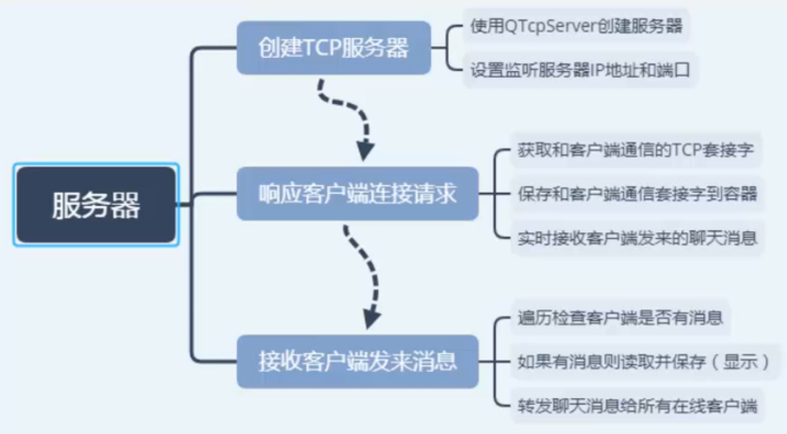


客户端设计概要

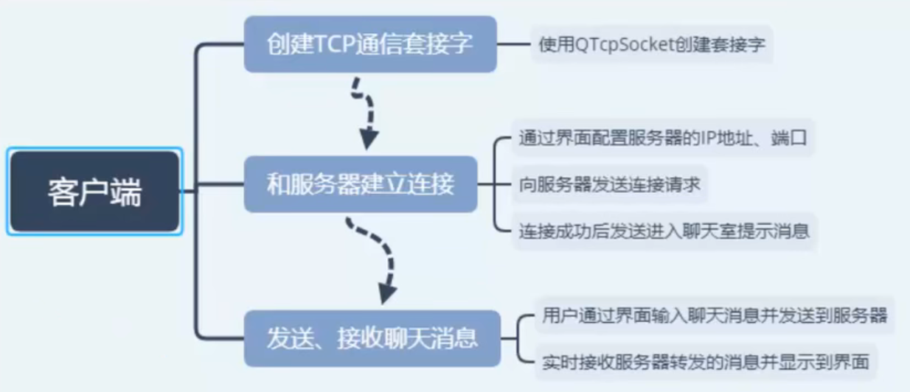


#### 服务器

聊天室服务器（QTcpServer） 类提供了一个基于 TCP 的服务器，通过该类可以快速建立 TCP 服务器，并接受客户端的连接请求。

QTcpServer::listen() 函数可以指定服务器的端口号，如果用户没指定，也可以由 QTcpServer 自动选择一个可用的端口，同时该函数可以监听当前主机指定的 IP 地址（QHostAddress），或者设置为 QHostAddress::Any 监听所有地址。设置监听后，每当检测到客户端发来连接请求，将会发送信号 newConnection() ，可以自定义槽函数，在其中调用 nextPendingConnection() 获取和客户端通信的套接字


使用 QTcpServer 创建 TCP 服务器

```cpp
QTcpServer tcpServer;															// 创建 QTcpServer 对象
tcpServer.listen(QHostAddress::Any, port);									  	// 开启 TCP 服务器，监听所有地址
connect(&tcpServer, SIGNAL(newConnection()), this, SLOT(onNewConnection()));	// 连接客户端连接时的槽函数
```


服务器响应客户端连接请求

```cpp
void Server::onNewConnection()
{
    QTcpSocket* tcpClientSocket = tcpServer.nextPendingConnection();		    // 获取和客户端通信的套接字
    tcpClientList.append(tcpClientSocket);									 	// 保存客户端套接字到容器
    connect(tcpClientSocket, SIGNAL(readyRead()), this, SLOT(onReadyRead()));	// 客户端有消息时，将触发 readyRead 信号
}
```


服务器接收客户端消息

```cpp
void ServerDialog::onReadyRead()
{
    // 遍历检查哪个客户端有消息到来
    for (int i=0;i<clientList.size();i++)
    {
        if (clientList.at(i)->bytesAvailable())
        {
            QByteArray buf = clientList.at(i)->readAll();	// 读取消息并保存
            ui->listWidget->addItem(buf);				   	// 显示消息到界面
            sendMessage(buf);							  	// 转发消息给其它在线客户端
        }
    }
}
```


#### 客户端

基于 QTcpSocket 建立客户端

```cpp
QTcpSocket tcpSocket;													// 和服务器通信的 tcp 套接字
tcpSocket.connectToHost(serverIP, serverPort);						  	// 向服务器发送连接请求
connect(&tcpSocket, SIGNAL(connected()), this, SLOT(onConnected()));	// 和服务器连接时发送信号 connected
connect(&tcpSocket, SIGNAL(readyRead()), this, SLOT(onReadyRead()));	// 收到服务器消息时，将触发 readyRead 信号
```


发送聊天消息

```cpp
void ClientDialog::on_sendButton_clicked()
{
    QString msg = ui->messageEdit->text();		// 获取用户输入的聊天内容
    msg = username + ":" + msg;				    // 消息前面加上用户名
    tcpSocket.write(msg.toUtf8());				// 向服务器发送聊天消息
    ui->messageEdit->clear();				    // 清空输入的消息
}
```


接收聊天消息

```cpp
void ClientDialog::onReadyRead()
{
    // 获取等待读取的消息字节数，不为 0 则处理
    if (tcpSocket.bytesAvailable())
    {
        QByteArray buf = tcpSocket.readAll();	// 读取消息并保存
        ui->listWidget->addItem(buf);			// 显示消息
    }
}
```


### 网络聊天室

新建 Qt 项目，然后在 .pro 文件中添加

```makefile
Qt += core gui network
```

然后设计窗口界面，这里使用 List Widget 控件用以显示聊天内容。当创建完成服务器和客户端后，可以同时打开两个项目，然后右击项目分别运行

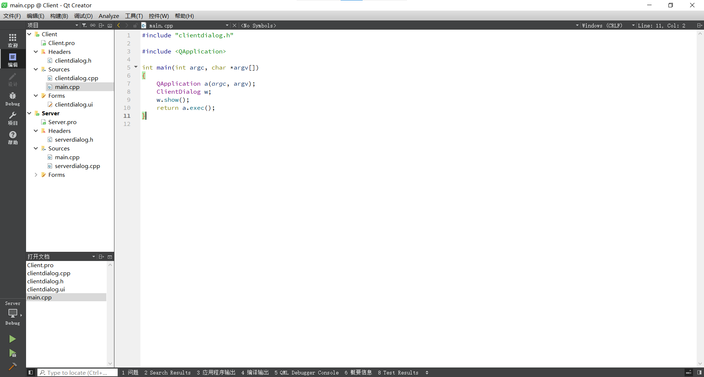


#### 服务器

得到的 .ui 文件

```xml
<?xml version="1.0" encoding="UTF-8"?>
<ui version="4.0">
 <class>ServerDialog</class>
 <widget class="QDialog" name="ServerDialog">
  <property name="geometry">
   <rect>
    <x>0</x>
    <y>0</y>
    <width>273</width>
    <height>426</height>
   </rect>
  </property>
  <property name="windowTitle">
   <string>聊天室服务器</string>
  </property>
  <layout class="QVBoxLayout" name="verticalLayout">
   <item>
    <widget class="QListWidget" name="listWidget"/>
   </item>
   <item>
    <layout class="QHBoxLayout" name="horizontalLayout">
     <item>
      <widget class="QLabel" name="label">
       <property name="text">
        <string>服务器端口：</string>
       </property>
      </widget>
     </item>
     <item>
      <widget class="QLineEdit" name="portEdit">
       <property name="text">
        <string>8080</string>
       </property>
      </widget>
     </item>
    </layout>
   </item>
   <item>
    <widget class="QPushButton" name="createButton">
     <property name="text">
      <string>创建服务器</string>
     </property>
    </widget>
   </item>
  </layout>
 </widget>
 <resources/>
 <connections/>
</ui>
```


头文件

```cpp
#ifndef SERVERDIALOG_H
#define SERVERDIALOG_H

#include <QDialog>
#include <QTcpServer>
#include <QTcpSocket>
#include <QDebug>
#include <QTimer>

QT_BEGIN_NAMESPACE
namespace Ui { class ServerDialog; }
QT_END_NAMESPACE

class ServerDialog : public QDialog
{
    Q_OBJECT

public:
    ServerDialog(QWidget *parent = nullptr);
    ~ServerDialog();

private slots:
    // 创建服务器按钮
    void on_createButton_clicked();
    // 响应客户端连接请求
    void onNewConnection();
    // 接收客户端消息的函数
    void onReadyRead();
    // 转发消息
    void sendMessage(const QByteArray& buf);
    // 定时器到时执行槽函数
    void onTimeout();

private:
    Ui::ServerDialog *ui;
    QTcpServer tcpServer;
    quint16 port;                       // 服务器端口
    QList<QTcpSocket*> tcpClientList;   // 容器，保存所有和客户端通信的套接字
    QTimer timer;                       // 定时器
};
#endif // SERVERDIALOG_H
```


函数和类的实现

```cpp
#include "serverdialog.h"
#include "ui_serverdialog.h"

ServerDialog::ServerDialog(QWidget *parent)
    : QDialog(parent)
    , ui(new Ui::ServerDialog)
{
    ui->setupUi(this);
    // 当有客户端向服务器发送连接请求，发送信号 newConnection
    connect(&tcpServer, SIGNAL(newConnection()), this, SLOT(onNewConnection()));
    // 定时检查连接状态
    connect(&timer, SIGNAL(timeout()), this, SLOT(onTimeout()));
}

ServerDialog::~ServerDialog()
{
    delete ui;
}

// 创建服务器按钮
void ServerDialog::on_createButton_clicked()
{
    // 获取服务器端口
    port = ui->portEdit->text().toShort();
    // 设置服务器 IP 和端口
    if (tcpServer.listen(QHostAddress::Any, port)==true)
    {
        qDebug() << "创建服务器成功！";
        // 禁用“创建服务器按钮”和“端口输入”
        ui->createButton->setEnabled(false);
        ui->portEdit->setEnabled(false);
        // 开启定时器
        timer.start(3000);
    }
    else
    {
        qDebug() << "创建服务器失败";
    }
}

// 响应客户端连接请求
void ServerDialog::onNewConnection()
{
    // 获取和客户端通信的套接字
    QTcpSocket* tcpClient = tcpServer.nextPendingConnection();
    // 保存套接字到容器
    tcpClientList.append(tcpClient);
    // 当客户端向服务器发送消息时，通信套接字发送信号
    connect(tcpClient, SIGNAL(readyRead()), this, SLOT(onReadyRead()));
}

// 接收客户端消息的函数
void ServerDialog::onReadyRead()
{
    // 遍历容器，哪个客户端向服务器发送消息
    for (int i=0;i<tcpClientList.size();i++)
    {
        // 获取当前套接字等待读取消息字节数
        // 返回 0 则没有消息
        if (tcpClientList.at(i)->bytesAvailable())
        {
            // 读取消息并保存
            QByteArray buf = tcpClientList.at(i)->readAll();
            // 显示聊天消息，同时显示到最底部
            ui->listWidget->addItem(buf);
            ui->listWidget->scrollToBottom();
            // 转发消息给所有在线客户端
            sendMessage(buf);
        }
    }
}

// 转发消息
void ServerDialog::sendMessage(const QByteArray& buf)
{
    for (int i=0;i<tcpClientList.size();i++)
    {
        tcpClientList.at(i)->write(buf);
    }
}

// 定时器到时执行槽函数
void ServerDialog::onTimeout()
{
    // 遍历检查容器中保存的客户端通信套接字是否断开连接，如果是则删除
    for (int i=0;i<tcpClientList.size();i++)
    {
        if (tcpClientList.at(i)->state()==QAbstractSocket::UnconnectedState)
        {
            tcpClientList.removeAt(i);
            // 注意到如果移除此元素，则容器下标会整体减少，因此需要调整下标
            i--;
        }
    }
}
```


#### 客户端

.ui 文件

```xml
<?xml version="1.0" encoding="UTF-8"?>
<ui version="4.0">
 <class>ClientDialog</class>
 <widget class="QDialog" name="ClientDialog">
  <property name="geometry">
   <rect>
    <x>0</x>
    <y>0</y>
    <width>378</width>
    <height>481</height>
   </rect>
  </property>
  <property name="windowTitle">
   <string>聊天室客户端</string>
  </property>
  <layout class="QVBoxLayout" name="verticalLayout">
   <item>
    <widget class="QListWidget" name="listWidget"/>
   </item>
   <item>
    <layout class="QHBoxLayout" name="horizontalLayout">
     <item>
      <widget class="QLineEdit" name="messageEdit"/>
     </item>
     <item>
      <widget class="QPushButton" name="sendButton">
       <property name="enabled">
        <bool>false</bool>
       </property>
       <property name="text">
        <string>发送</string>
       </property>
      </widget>
     </item>
    </layout>
   </item>
   <item>
    <layout class="QGridLayout" name="gridLayout">
     <item row="0" column="0">
      <widget class="QLabel" name="label">
       <property name="text">
        <string>服务器地址：</string>
       </property>
      </widget>
     </item>
     <item row="0" column="1">
      <widget class="QLineEdit" name="serverIpEdit">
       <property name="text">
        <string>127.0.0.1</string>
       </property>
      </widget>
     </item>
     <item row="1" column="0">
      <widget class="QLabel" name="label_2">
       <property name="text">
        <string>服务器端口：</string>
       </property>
      </widget>
     </item>
     <item row="1" column="1">
      <widget class="QLineEdit" name="serverPortEdit">
       <property name="text">
        <string>8080</string>
       </property>
      </widget>
     </item>
     <item row="2" column="0">
      <widget class="QLabel" name="label_3">
       <property name="text">
        <string>聊天室昵称：</string>
       </property>
      </widget>
     </item>
     <item row="2" column="1">
      <widget class="QLineEdit" name="usernameEdit">
       <property name="text">
        <string>Jerry</string>
       </property>
      </widget>
     </item>
    </layout>
   </item>
   <item>
    <widget class="QPushButton" name="connectButton">
     <property name="text">
      <string>连接服务器</string>
     </property>
    </widget>
   </item>
  </layout>
 </widget>
 <resources/>
 <connections/>
</ui>
```


头文件

```cpp
#ifndef CLIENTDIALOG_H
#define CLIENTDIALOG_H

#include <QDialog>
#include <QTcpSocket>
#include <QHostAddress>
#include <QMessageBox>
#include <QDebug>

QT_BEGIN_NAMESPACE
namespace Ui { class ClientDialog; }
QT_END_NAMESPACE

class ClientDialog : public QDialog
{
    Q_OBJECT

public:
    ClientDialog(QWidget *parent = nullptr);
    ~ClientDialog();

private slots:
    // 连接
    void on_connectButton_clicked();
    // 发送
    void on_sendButton_clicked();
    // 连接成功时执行
    void onConnected();
    // 断开连接时执行
    void onDisconnected();
    // 接收聊天消息
    void onReadyRead();
    // 网络异常时执行
    void onError();

private:
    Ui::ClientDialog *ui;
    bool status;            // 表示客户端的在线和离线状态
    QTcpSocket tcpSocket;   // 和服务器通信套接字
    QHostAddress serverIP;  // 服务器地址
    quint16 serverPort;     // 服务器端口
    QString username;       // 聊天室昵称
};
#endif // CLIENTDIALOG_H
```


函数和类的实现

```cpp
#include "clientdialog.h"
#include "ui_clientdialog.h"

ClientDialog::ClientDialog(QWidget *parent)
    : QDialog(parent)
    , ui(new Ui::ClientDialog)
{
    ui->setupUi(this);
    status = false;    // 离线
    connect(&tcpSocket, SIGNAL(connected()), this, SLOT(onConnected()));
    connect(&tcpSocket, SIGNAL(disconnected()), this, SLOT(onDisconnected()));
    connect(&tcpSocket, SIGNAL(readyRead()), this, SLOT(onReadyRead()));
    connect(&tcpSocket, SIGNAL(error(QAbstractSocket::SocketError)), this, SLOT(onError()));
}

ClientDialog::~ClientDialog()
{
    delete ui;
}

// 发送按钮
void ClientDialog::on_sendButton_clicked()
{
    // 获取用户输入的聊天消息
    QString msg = ui->messageEdit->text();
    if (msg=="")
    {
        return;
    }
    msg = username + ":" + msg;
    // 发送消息
    tcpSocket.write(msg.toUtf8());
    // 清空消息输入框
    ui->messageEdit->clear();
}

// 连接服务器
void ClientDialog::on_connectButton_clicked()
{
    // 如果离线，则建立连接
    if (status==false)
    {
        // 获取服务器 IP
        serverIP.setAddress(ui->serverIpEdit->text());
        // 获取服务器端口
        serverPort = ui->serverPortEdit->text().toShort();
        // 获取聊天室昵称
        username = ui->usernameEdit->text();
        // 发送连接请求，成功发送 connected 失败发送 error
        tcpSocket.connectToHost(serverIP, serverPort);
    }
    // 如果在线，则断开连接
    else
    {
        // 发送离开消息
        QString msg = username + ":离开了聊天室";
        tcpSocket.write(msg.toUtf8());
        // 关闭连接，发送信号 disconnected
        tcpSocket.disconnectFromHost();
    }
}

// 连接成功时执行
void ClientDialog::onConnected()
{
    // 进入在线状态
    status = true;
    // 恢复发送按钮状态，禁用 IP ，禁用 Port ，禁用昵称
    ui->sendButton->setEnabled(true);
    ui->serverIpEdit->setEnabled(false);
    ui->serverPortEdit->setEnabled(false);
    ui->usernameEdit->setEnabled(false);
    ui->connectButton->setText("离开聊天室");

    // 向服务器发送进入聊天室提示消息
    QString msg = username + ":进入了聊天室";
    // 转换编码
    tcpSocket.write(msg.toUtf8());
}

// 断开连接时执行
void ClientDialog::onDisconnected()
{
    // 进入离线状态
    status = false;
    // 禁用发送按钮状态，恢复 IP ，恢复 Port ，恢复昵称
    ui->sendButton->setEnabled(false);
    ui->serverIpEdit->setEnabled(true);
    ui->serverPortEdit->setEnabled(true);
    ui->usernameEdit->setEnabled(true);
    ui->connectButton->setText("连接服务器");
}

// 接收聊天消息
void ClientDialog::onReadyRead()
{
    if (tcpSocket.bytesAvailable())
    {
        // 接收消息
        QByteArray buf = tcpSocket.readAll();
        // 显示消息
        ui->listWidget->addItem(buf);
        ui->listWidget->scrollToBottom();
    }
}

// 网络异常时执行
void ClientDialog::onError()
{
    // 获取网络异常并显示
    QMessageBox::critical(this, "ERROR", tcpSocket.errorString());
}
```

