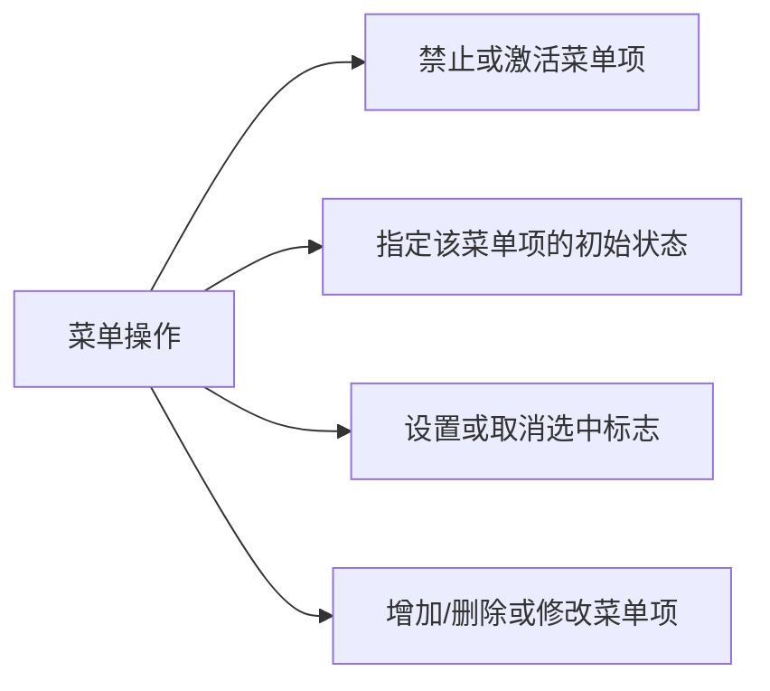
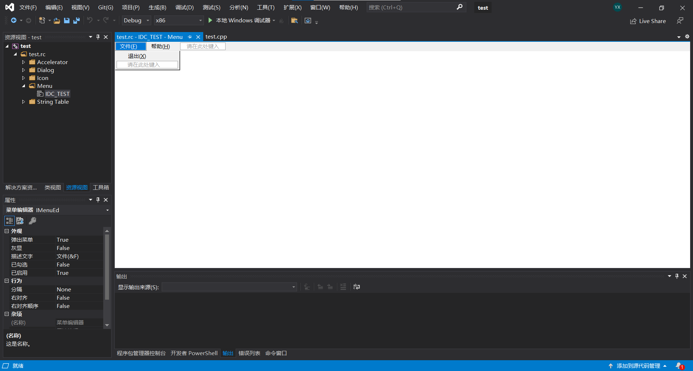
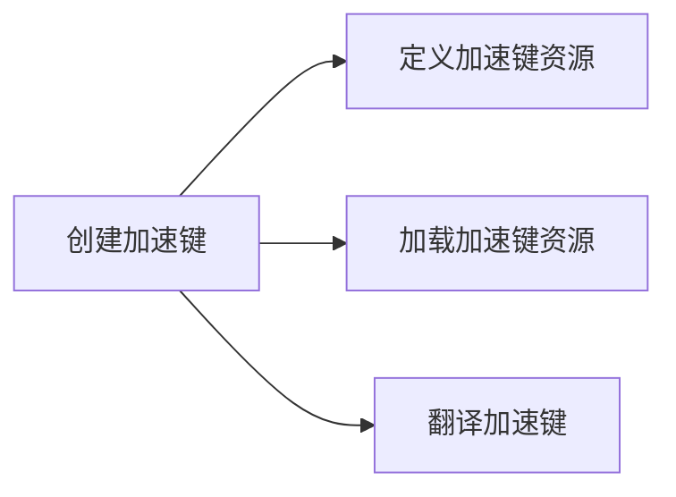
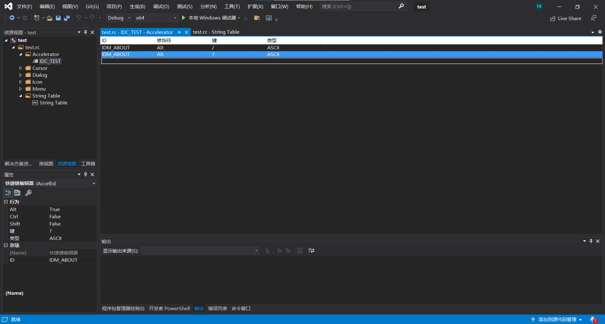
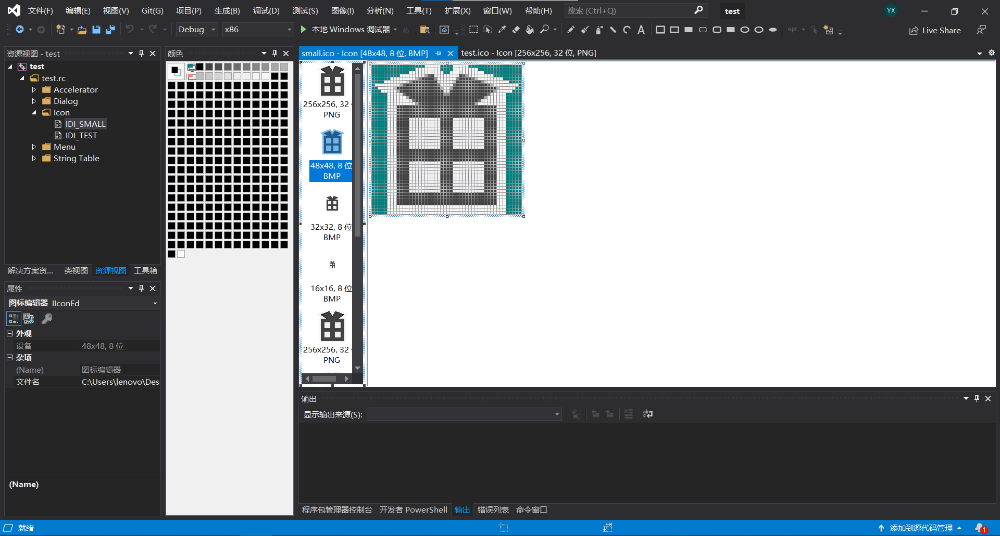
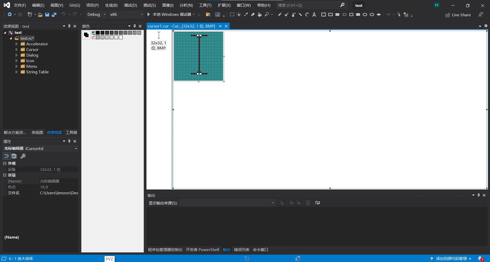
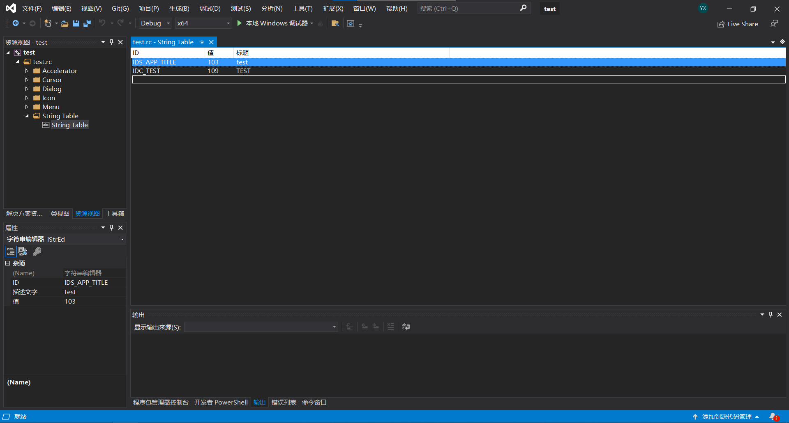

# Win32 API

[Win32 API](http:// www.office-cn.net/t/api/api_content.htm) 即为 Microsoft 32 位平台的[应用程序编程接口](https:// baike.baidu.com/item/应用程序编程接口/3350958)（Application Programming Interface），所有在 [Win32](https:// baike.baidu.com/item/Win32) 平台上运行的应用程序都可以调用这些函数。


## 基本知识

```shell
# 使用 g++ 编译窗口程序时，要在加入 -mwindows 参数
g++ -o main main.cpp -mwindows
```


### SAL批注

用于有助于识别可能未初始化的值，无效的空指针将以正式准确的方式使用

SAL定义了四种基本类型的参数

* \_In_ 数据将床底给被调用的函数，并视为只读
* \_Inout_ 可用数据传递到函数中，并可能被修改
* \_Out_ 调用方只为所调用的函数提供空间来写入，被调用函数将数据写入该空间
* \_Outptr_ 类似于\_Out_，被调用函数返回一个指针


### 数据类型

句柄：一个4字节的数值，用于表示程序中不同类和相同类中的不同实例；应用程序通过句柄访问相同对象的信息

|  数据类型   |                          说明                          |
| :-----: | :--------------------------------------------------: |
|  WORD   |                       16位无符号整型                       |
|  LONG   |                       32位有符号整型                       |
|  DWORD  |                       32位无符号整型                       |
| HANDLE  |                          句柄                          |
|  UINT   |                       32位无符号整型                       |
|  BOOL   |                         布尔值                          |
| LPTSTR  |                  指向字符串的32位指针 CHAR*                   |
| LPCTSTR |              指向字符串常量的32位指针 const CHAR*               |
|  TCHAR  | 当定义了 UNICODE 宏，则表示 const wchar_t *，否则表示 const char * |
| LPCWSTR |                   宽字符指针 wchar_t *                    |

当在项目中使用 unicode 字符集，则默认定义了 UNICODE 宏，使用多字节字符集则不会有这一宏；如果需要添加 UNICODE 宏，应该在 windows.h 头文件之前定义该宏

```cpp
TCHAR* tcText = _TEXT("Hello"); // 使用_TEXT转换，应对两种不同的情况
```


### 窗口创建过程

1. 定义入口函数
2. 定义窗口处理函数（自定义处理消息）
3. 注册窗口类（向操作系统写入一些数据）
4. 创建窗口（内存中创建窗口）
5. 显示窗口（绘制窗口图像）
6. 消息循环（获取/翻译/派发消息）
7. 消息处理


程序自动调用的入口函数

```cpp
int WINAPI WinMain(
    HINSTANCE hInstance,  	 // 当前应用程序实例句柄
    HINSTANCE hPreInstance,  // 前一个应用程序实例句柄，32位程序以后不再使用只保留形式
    LPSTR lpCmdLine, 		// 命令行的字符串的指针
    int nCmdShow  		    // 窗口显示方式（最大化、最小化、隐藏、正常显示），默认为SW_SHOWDEFAULT
);
// 可以在编译出的.exe文件的属性中修改窗口显示

// WINAPI：#define WINAPI __stdcall 标准调用约定
// HINSTANCE：实例句柄类型指针
// LPSTR：char* 字符指针
// HANDLE：void类型指针
// HWND：Handle Window 窗口句柄类型

// 头文件
#include <windows.h>
// 这一行设置入口选项/subsystem参数：console/windows/native/posix，如果值为console，则表示该程序运行时需要控制台
#pragma comment(linker,"/subsystem:\"console\" /entry:\"WinMainCRTStartup\"")
```


### 基本窗口程序

```cpp
#include <windows.h>

// 自定义窗口过程 
LRESULT CALLBACK MyWindowProc(HWND hwnd, UINT uMsg, WPARAM wParam, LPARAM lParam) 
{
	switch (uMsg) 
    {
	case WM_CREATE:
		// Initialize the window
		return 0;
	case WM_DESTROY:
		// 提交退出信息 
		PostQuitMessage(0);
		// Clean up window-specific data objects
		return 0;
	default:
		return DefWindowProc(hwnd, uMsg, wParam, lParam);
	}
	return 0;
}

int WINAPI WinMain(_In_ HINSTANCE hInstance, _In_opt_ HINSTANCE hPrevInstance, _In_ LPSTR lpCmdLine, _In_ int nCmdShow) 
{
	// 注册窗口类 
	WNDCLASS wnd;
	wnd.cbClsExtra = 0;
	wnd.cbWndExtra = 0;

	wnd.hbrBackground = (HBRUSH)(GetStockObject(GRAY_BRUSH));	  // 设置背景色
	wnd.hCursor = LoadCursor(NULL, IDC_ARROW); 					 // 设置光标
	wnd.hIcon = LoadIcon(NULL, IDI_APPLICATION); 				 // 图标
	// wnd.lpfnWndProc = DefWindowProc; 							// 默认窗口过程函数，用于处理消息
	wnd.lpfnWndProc = MyWindowProc; 							// 自定义窗口过程函数 
	wnd.lpszClassName = "MyWindow"; 							// 窗口类名
	wnd.lpszMenuName = NULL; 								   // 菜单资源名称
	wnd.style = CS_HREDRAW; 								   // 窗口类样式 
	wnd.hInstance = hInstance; 								   // 实例句柄 
	// 注册函数
	RegisterClass(&wnd);

	// 创建窗口（返回之前发送的WM_CREATE） 
	HWND hWnd = CreateWindow("MyWindow", "第一个窗口程序", WS_OVERLAPPEDWINDOW, 
                             100, 100, 300, 300, NULL, NULL, hInstance, NULL);

	// 显示窗口
	ShowWindow(hWnd, nCmdShow);

	// 更新窗口（发送WM_PAINT） 
	UpdateWindow(hWnd);

	// 消息循环（收到WM_QUIT消息后退出） 
	MSG msg;
	while (GetMessage(&msg, NULL, 0, 0)) 
    {
		TranslateMessage(&msg); 							 // 翻译消息 
		DispatchMessage(&msg); 								 // 分发消息 
	}

	return 0;
}
```


## 打印调试

由于 wprintf 对汉字输出的支持性不好，需要使用 WriteConsole 函数进行输出

```cpp
wchar_t * wcText = L"Hello";
HANDLE hOut = GetStdHandle(STD_OUTPUT_HANDLE); 			// 获取标准输出句柄
WriteConsole(hOut, wcText, wcslen(wcText), NULL, NULL); // 通过标准输出句柄打印
```

在 visual studio 的终端中输出

```cpp
// 使用方法与printf相同
char * str[64];
int number = 10;
sprintf(str, "Hello");
OutputDegbugStringA("Hello%d", number);
```


### 自定义输出终端

```cpp
HANDLE ghOut = 0; // 定义全局变量，接收标准输出句柄

int WINAPI WinMain(_In_ HINSTANCE hInstance, _In_opt_ HINSTANCE hPrevInstance, _In_ LPSTR lpCmdLine, _In_ int nCmdShow) 
{
    AllocConsole(); // 增加DOS
    ghOut = GetStdHandle(STD_OUTPUT_HANDLE);
    // 在终端输出
    wchar_t * wcText = L"Hello";
    WriteConsole(ghOut, wcText, wcslen(wcText), NULL, NULL); 
}
```


## 窗口

### 字符编码

非常令人头疼的问题就是编程过程中的字符编码。我们在此对不同的窗口函数和其接受的参数加以分别：对于一些以 W 结尾的函数或变量，例如 CreateWindowW ， WNDCLASSW 等，它们接收的是宽字符版本，这些是在 Unicode 字符集下使用的；相对的，以 A 结尾的函数或变量，例如 CreateWindowA ， WNDCLASSA 等，它们接收的是普通字符版本，这些是在多字节字符集下使用的。下面这些是宽字符内容：

```cpp
LPCWSTR pName = L"123456";
WCHAR Name[100]={0};
```

这些是多字节字符的内容：

```cpp
LPCSTR pName = "123456";
CHAR Name[100]={0};
```

值得一提的是，在 VS 中默认使用的是 Unicode 字符集，其给出的模板使用宽字符的版本，因此如果要改为多字节字符，就应当将其中的函数和变量重新设置。另外，注册窗口时，其中使用的是 ExW 版本，应当改为 Ex 版本

```cpp
ATOM MyRegisterClass(HINSTANCE hInstance)
{
	WNDCLASSEX wcex;

	wcex.cbSize = sizeof(WNDCLASSEX);

	wcex.style = CS_HREDRAW | CS_VREDRAW;
	wcex.lpfnWndProc = WndProc;
	wcex.cbClsExtra = 0;
	wcex.cbWndExtra = 0;
	wcex.hInstance = hInstance;
	wcex.hIcon = LoadIcon(hInstance, MAKEINTRESOURCE(IDI_MAN));
	wcex.hCursor = LoadCursor(nullptr, IDC_ARROW);
	wcex.hbrBackground = (HBRUSH)(COLOR_WINDOW + 1);
	wcex.lpszMenuName = NULL;
	wcex.lpszClassName = szWindowClass;
	wcex.hIconSm = LoadIcon(wcex.hInstance, MAKEINTRESOURCE(IDI_MAN));

	return RegisterClassEx(&wcex);
}
```

当然也可以选择去掉其中的 Ex ，不过这样就会损失扩充版本 Ex 的一些结构变量，例如 cbSize 不是 WNDCLASS 的成员。


### 窗口类

* 系统窗口类：系统自定义的窗口类，可以直接使用
* 自定义窗口类

```cpp
typedef struct tagWNDCLASS {
    UINT style; 			  // 窗口类风格
    WNDPROC lpfnWndProc; 	   // 窗口过程函数，处理窗口消息
    int cbClsExtra; 		  // 指定窗口类结构之后要分配的额外字节数，初始化为0
    int cbWndExtra; 		  // 指定窗口实例之后要分配的额外字节数，初始化为0
    HINSTANCE hInstance; 	  // 窗口实例句柄
    HICON hIcon; 			 // 该窗口类使用的图标
    HCURSOR hCursor; 		 // 该窗口类所用的光标
    HBRUSH hbrBackground; 	 // 该窗口类所用的背景刷
    LPCSTR lpszMenuName; 	 // 该窗口类所用的菜单资源名称
    LPCSTR lpszClassName; 	 // 该窗口类名称
} WNDCLASS; // 定义窗口类
```

style窗口类风格

* CS_GLOBALCLASS 全局窗口类（没有改参数则为局部窗口类）
* CS_HREDRAW 窗口水平变化时，重绘窗口
* CS_VREDRAW 窗口垂直变化时，重绘窗口
* CS_DBLCLKS 允许接收鼠标双击
* CS_NOCLOSE 没有关闭按钮


### 注册窗口

使用RegisterClass函数注册一个窗口类（将定义的窗口类传入该函数）

```cpp
// ATOM：unsigned short 类型
ATOM WINAPI RegisterClass(
	const WNDCLASS *lpWndClass // 指向WNDCLASS结构的长指针
);
```

返回值：如果函数成功，返回唯一标识已注册的类的一个原子数；失败返回0

 

```cpp
int WINAPI WinMain(HINSTANCE hInstance, HINSTANCE hPreInstance, LPSTR lpCmdLine, int nCmdShow)
{
    // 注册窗口
    WNDCLASS wnd;
    wnd.cbClsExtra = 0;
    wnd.cbWndExtra = 0;
    
    wnd.hbrBackground = (HBRUSH)(GetStockObject(GRAY_BRUSH));	// 设置背景色
    wnd.hCursor = LoadCursor(NULL, IDC_ARROW); 				  // 设置光标
    wnd.hIcon = LoadIcon(NULL, IDI_APPLICATION); 			  // 图标
    // wnd.lpfnWndProc = DefWindowProc; 						// 默认窗口过程函数，用于处理消息
    wnd.lpfnWndProc = MyWindowProc; 						// 自定义窗口过程函数 
    // 注意开启多字节字符集选项
    wnd.lpszClassName = "MyWindow"; 						// 窗口类名
    wnd.lpszMenuName = NULL; 								// 菜单资源名称
    wnd.style = CS_HREDRAW; 								// 窗口类样式 
    wnd.hInstance = hInstance; 								// 实例句柄 
    
    // 调用注册函数
    RegisterClass(&wnd);
    
    return 0;
}
```


### 创建窗口

WNDCLASS 结构体包含一个窗口类的全部信息

```cpp
// 创建窗口
HWND WINAPI CreateWindow(
    LPCTSTR lpClassName, 		  // 窗口类名称
    LPCTSTR lpWindowName, 		  // 窗口名称
    DWORD dwStyle, 				 // 窗口样式
    int x, 						// 初始x坐标（窗口左上角起始位置）
    int y, 						// 初始y坐标
    int nWidth, 				// 窗口宽度，CW_USEDEFAULT表示默认宽度和高度
    int nHeight, 				// 窗口高度，CW_USEDEFAULT表示默认宽度和高度
    HWND hWndParent, 			// 父窗口句柄
    HMENU hMenu, 				// 窗口菜单的句柄
    HINSTANCE hInstance, 		 // 模块实例的句柄
    LPVOID lpParam 				// 通过WM_CREATE消息的lpParam参数指向的CREATESTRUCT结构
);

// 创建层叠的、自动弹出的扩展风格窗口
HWND WINAPI CreateWindowEx(
    DWORD DdwExStyle, 			  // 窗口扩展风格
    LPCTSTR lpClassName, 		  // 窗口类名称
    LPCTSTR lpWindowName, 		  // 窗口名称
    DWORD dwStyle, 				 // 窗口样式
    int x, 						// 初始x坐标（窗口左上角起始位置）
    int y, 						// 初始y坐标
    int nWidth, 				// 窗口宽度，CW_USEDEFAULT表示默认宽度和高度
    int nHeight, 				// 窗口高度，CW_USEDEFAULT表示默认宽度和高度
    HWND hWndParent, 			// 父窗口句柄
    HMENU hMenu, 				// 窗口菜单的句柄
    HINSTANCE hInstance, 		// 模块实例的句柄
    LPVOID lpParam 				// 通过WM_CREATE消息的lpParam参数指向的CREATESTRUCT结构
);
```

返回值：如果成功，返回新窗口的实例句柄；如果失败，返回NULL

```cpp
int WINAPI WinMain(HINSTANCE hInstance, HINSTANCE hPreInstance, LPSTR lpCmdLine, int nCmdShow)
{
    // 注册窗口
    // ...
    
    // 创建窗口（返回之前发送的WM_CREATE） 
	HWND hWnd = CreateWindow("MyWindow", "第一个窗口程序", WS_OVERLAPPEDWINDOW, 
                             100, 100, 300, 300, NULL, NULL, hInstance, NULL);
    
    return 0;
}
```


**默认窗口类名**

- Listbox （列表框）
- ComboBox （下拉组合框）
- ScrollBar （滚动条）
- Button （按钮）
- Static （静态标签）
- Edit （编辑框）


[**窗口样式**](https:// blog.csdn.net/jadeshu/article/details/70477539)

顺便一提，一个调整窗口样式的技巧是：如果需要使用多个样式，就用 `|` 进行按位或运算；相反的，如果想去除某个样式，可以 `^` 进行按位异或运算，例如：

```cpp
WS_OVERLAPPEDWINDOW ^ WS_THICKFRAME
```

这意味着使用去除了 WS_THICKFRAME 风格的 WS_OVERLAPPEDWINDOW 风格，从而禁止调整窗口

|       设置值        |                             解说                             |
| :-----------------: | :----------------------------------------------------------: |
| WS_OVERLAPPEDWINDOW | 层叠式窗口，有边框、标题栏、系统菜单、最大最小化按钮，是以下几种风格的集合：WS_OVERLAPPED, WS_CAPTION, WS_SYSMENU, WS_THICKFRAME, WS_MINIMIZEBOX, WS_MAXIMIZEBOX |
|   WS_POPUPWINDOW    | 弹出式窗口，是以下几种风格的集合： WS_BORDER,WS_POPUP,WS_SYSMENU。WS_CAPTION 与 WS_POPUPWINDOW 风格一起使用时窗口菜单才能可见 |
|    WS_OVERLAPPED    |       层叠式窗口，有标题栏和边框，与 WS_TILED 风格类似       |
|      WS_POPUP       |             弹出式窗口，与 WS_CHILD 不能同时使用             |
|      WS_BORDER      |                        窗口有单线边框                        |
|     WS_CAPTION      |                         窗口有标题栏                         |
|      WS_CHILD       |               子窗口，不能与 WS_POPUP 同时使用               |
|     WS_DISABLED     |                          为无效窗口                          |
|     WS_HSCROLL      |                          水平滚动条                          |
|      WS_ICONIC      |                        初始化为最小化                        |
|     WS_MAXIMIZE     |                        初始化为最大化                        |
|   WS_MAXIMIZEBOX    |                         有最大化按钮                         |
|     WS_MINIMIZE     |                     与 WS_MAXIMIZE 一样                      |
|   WS_MINIMIZEBOX    |                       窗口有最小化按钮                       |
|     WS_SIZEBOX      |                   边框可进行大小控制的窗口                   |
|     WS_SYSMENU      |   创建一个有系统菜单的窗口，必须与 WS_CAPTION 风格同时使用   |
|    WS_THICKFRAME    |       创建一个大小可控制的窗口，与 WS_SIZEBOX 风格一样       |
|      WS_TILED       |                 创建一个层叠式窗口，有标题栏                 |
|     WS_VISIBLE      |                          窗口为可见                          |
|     WS_VSCROLL      |                       窗口有垂直滚动条                       |


### 窗口结构

```cpp
typedef struct tagCREATESTRUCT {
    LPVOID lpCreateParams; 		   // 创建窗口的基本参数
    HANDLE hInstance; 			  // 拥有将创建的窗口的模块实例句柄
    HMENU hMenu; 				 // 新窗口的菜单句柄
    HWND hwndParent; 			 // 新窗口的父窗口句柄
    int cy; 					// 高度
    int cx; 					// 宽度
    int y; 						// 左上角y坐标
    int x; 						// 左上角x坐标
    LONG style; 				// 风格
    LPCSTR lpszName; 			// 名称
    LPCSTR lpszClass; 			// 窗口类名
    DWORD dwExStyle; 			// 扩展参数
} CREATESTRUCT;
```

窗口创建先后发送 WM_NCCREATE 和 WM_CREATE 消息

注意：获取 WM_NCCREATE（非客户区域消息）后 return true ;否则不会触发 WM_CREATE 消息


### 窗口函数

#### ShowWindow

显示窗口

```cpp
BOOL WINAPI ShowWindow(
    HWND hWnd, // 窗口句柄
    int nCmdShow // 控制如何显示窗口
);
```

nCmdShow 参数：在第一次调用 ShowWindow 函数时，该值应为在函数 WinMain 中 nCmdShow 参数

|         参数         |                             作用                             |
| :------------------: | :----------------------------------------------------------: |
|   SW_FORCEMINIMIZE   | 在 WindowNT 5.0 中最小化窗口，即使拥有窗口的线程被挂起也会最小化。在从其他线程最小化窗口时才使用这个参数 |
|       SW_MIOE        |                    隐藏窗口并激活其他窗口                    |
|     SW_MAXIMIZE      |                       最大化指定的窗口                       |
|     SW_MINIMIZE      |       最小化指定的窗口并且激活在Z序中的下一个顶层窗口        |
|      SW_RESTORE      | 激活并显示窗口。如果窗口最小化或最大化，则系统将窗口恢复到原来的尺寸和位置。在恢复最小化窗口时，应用程序应该指定这个标志 |
|       SW_SHOW        |          在窗口原来的位置以原来的尺寸激活和显示窗口          |
|    SW_SHOWDEFAULT    | 依据在 STARTUPINFO 结构中指定的 SW_FLAG 标志设定显示状态，STARTUPINFO 结构是由启动应用程序的程序传递给 CreateProcess 函数的 |
|   SW_SHOWMAXIMIZED   |                     激活窗口并将其最大化                     |
|   SW_SHOWMINIMIZED   |                     激活窗口并将其最小化                     |
| SW_SHOWMINNOACTIVATE |             窗口最小化，激活窗口仍然维持激活状态             |
|      SW_SHOWNA       |      以窗口原来的状态显示窗口。激活窗口仍然维持激活状态      |
|  SW_SHOWNOACTIVATE   | 以窗口最近一次的大小和状态显示窗口。激活窗口仍然维持激活状态 |
|     SW_SHOWNOMAL     | 激活并显示一个窗口。如果窗口被最小化或最大化，系统将其恢复到原来的尺寸和大小。应用程序在第一次显示窗口的时候应该指定此标志 |

返回值：如果窗口以前可见，则返回值为非零。如果窗口以前被隐藏，则返回值为零


#### MoveWindow

移动窗口，还可以用来调整窗口大小

```cpp
BOOL MoveWindow(
    HWND hWnd,
    int X,
    int Y,
    int nWidth,
    int nHeight,
    BOOL bRepaint	// 是否重绘
);
```


#### SetWindowPos

设置窗口位置，也可用来调整窗口大小

```cpp
BOOL SetWindowPos(
    HWND hWnd,
    HWND hWndInsertAfter,
    int X,
    int Y,
    int cx,
    int cy,
    UINT uFlags
);
```

hWndInsertAfter 参数可选值：

> HWND_TOP 									前置窗口
>
> HWND_BOTTOM 							后置窗口
>
> HWND_TOPMOST 						  在前面，位于任何顶部窗口的前面
>
> HWND_NOTOPMOST					  在前面，位于其他顶部窗口的后面

uFlags 参数可选值：

> SWP_NOSIZE								  忽略 cx、cy，保持大小
>
> SWP_NOMOVE						   	忽略 X、Y，不改变位置
>
> SWP_NOZORDER					  	忽略 hWndInsertAfter ，保持 Z 顺序
>
> SWP_NOREDRAW						 不重绘
>
> SWP_NOACTIVATE						不激活
>
> SWP_FRAMECHANGED				强制发送 WM_NCCALCSIZE 消息，一般只是在改变大小时才发送此消息
>
> SWP_SHOWWINDOW					显示窗口
>
> SWP_HIDEWINDOW					  隐藏窗口
>
> SWP_NOCOPYBITS					   丢弃客户区
>
> SWP_NOOWNERZORDER			忽略 hWndInsertAfter ，不改变 Z 序列的所有者
>
> SWP_NOSENDCHANGING			不发出 WM_WINDOWPOSCHANGING 消息
>
> SWP_DRAWFRAME						画边框
>
> SWP_DEFERERASE						防止产生 WM_SYNCPAINT 消息
>
> SWP_ASYNCWINDOWPOS			若调用进程不拥有窗口, 系统会向拥有窗口的线程发出需求}


#### EnableWindow

禁止或激活窗口

```cpp
BOOL EnableWindow(
    HWND hWnd,
    BOOL bEnable
);
```


#### InvalidateRect

**窗口被另一个窗口覆盖的区域称为无效区域**

添加一个矩形（无效区域）到指定窗口的更新区域（必须重绘的窗口客户区域部分），当消息队列为空时，发送 WM_PAINT 消息

```cpp
BOOL InvalidateRect(
    HWND hWnd, 				// 窗口句柄
    const RECT * lpRect, 	// 矩形区域，若为NULL则将整个客户区添加到更新区域
    BOOL bErase 			// 指定更新区域内的背景在处理更新区域时是否要擦除，当为true时发送WM_ERASEBKGND消息
);
```


#### UpdateWindow

若更新区域不为空，会立即发送 WM_PAINT 消息，该消息直接发送到指定窗口的窗口过程，绕过应用程序队列
使用 UpdateWindow 时要先指定更新区域，如使用 InvalidateRect 函数添加更新区域

```cpp
BOOLWIN UpdateWindow(
	HWND hWnd // 窗口句柄
);
```


#### RedrawWindow

更新窗口的客户区指定的矩形或区域，相当于 UpdateWindow 和 InvalidateRect 两个函数的组合

```cpp
BOOL RedrawWindow(
    HWND hWnd, 				// 窗口句柄，若为NULL则更新桌面窗口
    const RECT * lprcUpdate, // 矩形区域
    HRGN hrgnUpdate, 		// 更新区域的句柄，若两个...Update参数都为NULL，则将整个客户区添加到更新区域
    UINT flags 				// 一个或多个重绘标志
);
```

flags 参数

* RDW_ERASE 窗口收到 WM_ERASEBKGND 消息，必须同时指定 RDW_INVALIDATE
* RDW_FRAME 与更新区域相交的窗口非客户区域收到 WM_NCPAINT 消息，必须同时指定 RDW_INVALIDATE
* RDW_INTERNALPAINT 窗口收到 WM_PAINT 消息
* RDW_INVALIDATE 使 lprcUpdate 或 hrgnUpdate 无效


#### DestroyWindow

销毁窗口

```cpp
BOOL WINAPI DestroyWindow(
	HWND hWnd // 要销毁的窗口句柄
);
```


#### SetWindowText

改变指定窗口句柄的窗口名

```cpp
BOOL SetWindowText(
    HWND hWnd,
    LPCSTR lpString
);
```


#### GetWindowText

获取指定窗口标题或文本

```cpp
int GetWindowText(
    HWND hWnd,
    LPWSTR lpString,	// 缓冲区
    int nMaxCount		// 最大长度
);
```


#### GetWindowTextLength

获取指定窗口标题或文本长度

```cpp
int GetWindowTextLengthW(
    HWND hWnd
);
```


#### GetWindowRect

获取窗口尺寸，结果存放在矩形指针中

```cpp
BOOL GetWindowRect(
    HWND hWnd,
    LPRECT lpRect	// 矩形指针
);
```


#### GetClientRect

获取客户区尺寸，结果存放在矩形指针中

```cpp
BOOL GetClientRect(
    HWND hWnd,
    LPRECT lpRect	// 矩形指针
);
```


#### SetFocus

设置具有输入焦点的窗口

```cpp
HWND SetFocus(
    HWND hWnd
);
```


### 窗口处理函数

每个窗口都必须有窗口处理函数

```cpp
LRESULT CALLBACK WindowProc(
	HWND hwnd, 		// 窗口句柄
    UINT uMsg, 		// 消息ID
    WPARAM wParam,  // 消息参数
    LPARAM lParam   // 消息参数
);
```

标准的自定义窗口处理函数

```cpp
// 自定义窗口过程 
LRESULT CALLBACK MyWindowProc(HWND hwnd, UINT uMsg, WPARAM wParam, LPARAM lParam) 
{
	switch (uMsg) 
    {
	case WM_CREATE:
		// Initialize the window
		return 0;
	case WM_DESTROY:
		// 提交退出信息 
		PostQuitMessage(0);
		// Clean up window-specific data objects
		return 0;
	default:
		return DefWindowProc(hwnd, uMsg, wParam, lParam);
	}
	return 0;
}
```


## 消息

### 消息类

当系统通知窗口工作时，就采用消息方式派发给窗口

```cpp
typedef struct tagMSG {
    HWND hwnd;		// 窗口句柄
    UINT message;	// 消息ID
    WPARAM wParam;	// 附加消息参数
    LPARAM lParam;	// 附加消息参数
    DWORD time;		// 消息时间
    POINT pt;		// 鼠标位置
} MSG;
```


### 消息队列

#### 概念

* 消息队列是用于存放消息的队列
* 消息在队列中先入先出
* 所有窗口程序都具有消息队列
* 程序可以从队列中获取消息


#### 消息与消息队列

* 当鼠标、键盘产生消息，会将消息存放到系统消息队列
* 系统根据存放的消息，找到对应程序的消息队列
* 将消息投递到程序的消息队列中


#### 消息分类

* 队列消息：消息发送后，首先放入队列，然后通过消息循环，从队列中获取
    * GetMessage 从消息队列中获取消息
    * PostMessage 将消息投递到消息队列
    * 常见队列消息：WM_PAINT、键盘、鼠标、定时器
* 非队列消息：消息发送时，首先查找消息接收窗口的窗口处理函数，直接调用处理函数，完成消息
    * SendMessage 直接将消息发送给窗口处理函数，并等待处理结果
    * 常见消息：WM_CREATE、WM_SIZE

注意：WM_CREATE 必须在队列之外，因为 GetMessage 在窗口创建之后，不能在此时获得队列消息；WM_QUIT 必须在队列中，否则 GetMessage 不能获取退出消息，进程不能退出


### 消息函数

#### GetMessage

```cpp
BOOL WINAPI GetMessage(
    LPMSG lpMsg, 		// 指向MSG结构的指针
    HWND hWnd, 			// 窗口句柄，其消息将被检索
    UNIT wMsgFilterMin,  // 检索的最小消息ID
    UNIT wMsgFilterMax   // 检索的最大消息ID
);
```

* 当获取到消息后，消息信息存放到 lpMsg 中
* hWnd 指定获得该窗口的消息，如果为NULL，则获取所有窗口消息以及通过 PostThreadMessage 投递的消息
* 只获取从 Min 到 Max 范围的 ID 的消息，如果都为0，则抓取所有消息
* 获取消息后会删除消息（ WN_PAINT 除外）
* 当系统无消息时会停止等待下一条消息
* 当检索到 WM_QUIT 消息，返回值为0

 

函数流程

1. 在本程序消息队列中抓取消息
2. 如果没有，向系统消息队列询问并转发本程序消息
3. 如果没有，寻找绘图消息，产生 WM_PAINT
4. 如果没有，寻找定时消息，产生 WM_TIMER
5. 如果没有，整理程序资源、内存
6. 等待消息


#### PeekMessage

```cpp
BOOL WINAPI PeekMessage(
    LPMSG lpMsg, 		// 指向MSG结构的指针
    HWND hWnd, 			// 窗口句柄，其消息将被检索
    UNIT wMsgFilterMin,  // 检索的最小消息ID
    UNIT wMsgFilterMax,  // 检索的最大消息ID
    UINT wRemoveMsg
);
```

* 可选是否删除消息
* 当系统无消息时返回 FALSE，然后继续执行后续代码
* 有消息返回 TRUE，无消息返回 FALSE

wRemoveMsg 参数：

* PM_NOREMOVE 消息处理后不删除
* PM_REMOVE 消息处理后从队列中删除
* PM_NOYIELD 防止系统释放任何等待主叫方空闲的进程


####  TranslateMessage

将虚拟键消息转换为字符消息

```cpp
BOOL WINAPI TranslateMessage(
	const MSG *lpMsg // 指向MSG结构的指针
);
```


#### DispatchMessage

与窗口无关的消息不能由 DispatchMessage 分派；它分发一个消息给窗口程序，消息被分发到窗口过程函数，作用时消息传递给操作系统，然后操作系统调用窗口过程函数来处理消息

```cpp
LRESULT WINAPI DispatchMessage(
	const MSG *lpmsg // 该结构从线程的消息队列接收消息信息
);
```


#### SendMessage

将指定消息发送到一个或多个窗口，该函数调用指定的窗口过程，将会一直阻塞等待，直到窗口过程已经处理了该消息（该消息直接处理，不进入消息队列）

```cpp
LRESULT WINAPI SendMessage(
    HWND hWnd, 		// 接收消息的窗口句柄
    UINT Msg, 		// 消息ID
    WPARAM wParam,  // 附加的消息特定信息
    LPARAM lParam   // 附加的消息特定信息
);
```

 

#### PostMessage

将指定消息发送到指定窗口的消息队列中，并且立即返回，消息队列中的消息需要通过 GetMessage 和 PeekMessage 取得该消息

```cpp
LRESULT WINAPI PostMessage(
    HWND hWnd, 		// 接收消息的窗口句柄
    UINT Msg, 		// 消息ID
    WPARAM wParam,  // 附加的消息特定信息
    LPARAM lParam   // 附加的消息特定信息
);
```

 

#### PostThreadMessage

将消息发送到指定线程的消息队列中，不与窗口关联，不进入窗口过程；通过 GetMessage 和 PeekMessage 取得该消息，返回的 MSG 结构的 hwnd 成员是 NULL

```cpp
LRESULT WINAPI PostThreadMessage(
    DWORD idThread,  // 线程标识符ID
    UINT Msg, 		// 消息ID
    WPARAM wParam,  // 附加的消息特定信息
    LPARAM lParam   // 附加的消息特定信息
);
```

 

#### PostQuitMessage

给线程队列发送一个 WM_QUIT 消息并立即返回，通常用于响应 WM_DESTROY 消息

```cpp
VOID WINAPI PostQuitMessage(
	int nExitCode // 退出码，用作WM_QUIT消息的wParam参数
);

PostQuitMessage(0); // 退出窗口
```


### 消息分类

* 标准消息：所有以WM_开头的消息（WM_COMMAND除外）
* 命令消息：来自菜单、工具栏按钮或者加速键的消息，以WM_COMMAND呈现
* 通告消息：由控件产生的消息，如按钮单击、列表选择，目的是向父窗口通知事件发生

 

按照前缀识别消息附属的分类

| 前缀 |          分类          |
| :--: | :--------------------: |
|  BM  |      按钮控制消息      |
|  CB  |     组合框控制消息     |
|  DM  | 默认下压式按钮控制消息 |
|  EM  |      编辑控制消息      |
|  LB  |     列表框控制消息     |
| SBM  |     滚动条控制消息     |
|  WM  |        窗口消息        |


### 标准消息

|    消息宏     |                    触发条件                     |
| :-----------: | :---------------------------------------------: |
|    WM_NULL    |             空消息，窗口忽略该消息              |
|   WM_CREATE   |                    创建窗口                     |
|  WM_DESTROY   |                    销毁窗口                     |
|    WM_MOVE    |                    移动窗口                     |
|    WM_SIZE    |                  改变窗口大小                   |
|  WM_ACTIVATE  |              窗口被激活或失去激活               |
|  WM_SETFOCUS  |                    获得焦点                     |
| WM_KILLFOCUS  |                    失去焦点                     |
|   WM_PAINT    |                    窗口重绘                     |
|   WM_CLOSE    |                 关闭窗口或程序                  |
|    WM_QUIT    | 结束消息循环，可调用PostQuitMessage()产生此消息 |
| WM_ERASEBKGND |       窗口背景被擦除（如改变窗口大小时）        |
|   WM_SIZING   |             调整窗口大小，持续监视              |
|   WM_MOVING   |               移动窗口，持续监视                |
|   WM_HOTKEY   |     当用户按下由RegisterHitKey()注册的热键      |


#### WM_CREATE

窗口创建但未产生的消息，常用于初始化窗口参数、资源

* wParam 0
* lParam CREATESTRUCT 类型的指针

```cpp
// 通过lpParam来访问窗口信息CREATESTRUCT
// 强制转换得到CREATESTRUCT指针，从而可以访问该结构体
CREATESTRUCT* psc = (CREATESTRUCT*)lpParam; // (LPCREATESTRUCT) lpParam; 两个等价
```

注意：获取 WM_NCCREATE（非客户区域消息）后 return true; 否则不会触发 WM_CREATE 消息


#### WM_QUIT

程序发送，用于结束消息循环

* wParam PostQuitMessage 函数参数
* lParam 0


#### WM_DISTROY

窗口被销毁时的消息，常用于在窗口被销毁之前，做相应的善后处理

* wParam 0
* lParam 0


#### WM_SYSCOMMAND

点击窗口最大化、最小化、关闭的消息

* wParam 具体点击的位置
* lParam 鼠标位置
    * LOWORD(lParam) 水平位置
    * HIWORD(lParam) 垂直位置


#### WM_SIZE

窗口大小变化消息，常用于窗口大小变化后，调整窗口布局

* wParam 窗口大小变化原因
* lParam 窗口变化后的大小
    * LOWORD(lParam) 变化后的宽度
    * HIWORD(lParam) 变化后的高度


#### WM_PAINT

窗口绘制消息

* wParam 0, lParam 0
* 用于绘图


### 鼠标消息

#### 携带参数

鼠标消息携带的参数：

* wParam 其它按键的状态
* lParam 鼠标位置（客户区坐标系）
    * LOWORD(LPARAM)  获取x坐标
    * HIWORD(LPARAM)  获取y坐标


**wParam 包含的值**

|     值     |     含义      |
| :--------: | :-----------: |
| MK_CONTROL | 按下 Ctrl 键  |
| MK_LBUTTON | 按下鼠标左键  |
| MK_MBUTTON | 按下鼠标中键  |
| MK_RBUTTON | 按下鼠标右键  |
|  MK_SHIFT  | 按下 Shift 键 |


滚轮消息携带的参数

* wPARAM 
    * LOWORD 其它按键的状态
    * HIWORD 滚轮偏移量，正值向前，负值向后
* lPRARM 鼠标当前位置，以整个屏幕为坐标系
    * LOWORD 获取x坐标
    * HIWORD 获取y坐标


#### 消息处理

监测 Shift 和 Ctrl 键

```cpp
case WM_LBUTTONDOWN:
	if ((wParam & MK_CONTROL) && (wParam & MK_SHIFT))
    {
        // Shift 和 Ctrl 键都被按下
    }
	break;
```


不监测

```cpp
case WM_LBUTTONDOWN:
	...
	break;
```


#### 消息宏

|        消息宏         |  触发条件  |
| :----------------: | :----: |
|   `WM_MOUSEMOVE`   |  鼠标移动  |
|  `WM_LBUTTONDOWN`  | 按下鼠标左键 |
|   `WM_LBUTTONUP`   | 抬起鼠标左键 |
|  `WM_RBUTTONDOWN`  | 按下鼠标右键 |
|   `WM_RBUTTONUP`   | 抬起鼠标右键 |
| `WM_RBUTTONDBLCLK` | 双击鼠标右键 |
| `WM_LBUTTONDBLCLK` | 双击鼠标左键 |
|  `WM_MOUSEWHEEL`   |  鼠标滚轮  |

**按下和抬起一般成对出现；在鼠标移动过程中，会根据移动速度产生一系列 WM_MOUSEMOVE 消息**

 

#### 鼠标双击

Windows 系统默认的时间间隔为0.5秒，也可以调用 SetDoubleClickTime() 重新设定间隔值

```cpp
BOOL SetDoubleClickTime(
    _In_ UINT
);
```

**双击事件需要设置窗口风格为 CS_DBLCLKS 才可以获得**

双击消息的产生顺序（以左键双击为例）

1. WM_LBUTTONDOWN 左键按下
2. WM_LBUTTONUP 左键抬起
3. WM_LBUTTONDBLCLK 左键双击
4. WM_LBUTTONUP 左键抬起


#### 捕获鼠标

由于鼠标移动的随机性，如果要使某一个窗口能不间断地捕获鼠标消息，就必须对鼠标加以捕获。一旦从窗口捕获了鼠标，系统的键盘功能就暂时失效，其它窗口也无法得到鼠标消息
$$
用户区以外的地方产生的鼠标事件\rightarrow产生一个非用户区鼠标消息\rightarrow不由应用程序处理，而是送往函数\ \mathrm{DefWindowProc}
$$

```cpp
// 向句柄为 hWnd 的窗口发送所有的鼠标消息
HWND SetCapture(
    _In_ HWND hWnd
);
```

当该窗口不再需要捕获鼠标消息时，应及时调用 ReleaseCapture() 以释放鼠标，否则其它窗口无法接收鼠标信息

```cpp
// 直接调用即可
BOOL ReleaseCapture(
    VOID
);
```


### 键盘消息

键盘上的键对应一个位的标识值，按下或释放某键时产生扫描码。扫描码是依赖与具体设备的，为达到设备无关性的要求，往往使用与具体设备无关的虚拟码，虚拟码是由 Windows 系统定义的与设备无关的键的标识
$$
设备驱动程序截取键的扫描码\stackrel{翻译}{\longrightarrow}虚拟码\stackrel{键盘输入}{\Longrightarrow}产生一条消息（包含扫描码、虚拟码和与击键相关的信息）
$$

$$
消息\stackrel{设备驱动程序}{\longrightarrow}把消息放到系统消息队列中\longrightarrow\mathrm{\small{Windows}}\ 从系统消息队列中取出消息\\ \longrightarrow发送到相应的线程消息队列中\stackrel{窗口过程}{\longrightarrow}获取键盘消息进行处理
$$

操作系统在接收到键盘输入后，把消息发送给具有输入焦点的窗口

窗口函数通过捕获 WM_SETFOCUS （正在接收输入焦点）和 WM_KILLFOCUS （失去输入焦点）消息确定当前窗口是否具有输入焦点


#### 按键消息

一个按键的组合产生了一个可以显示的字符时，就产生了一个字符消息；按下或松开一个键时就产生了一个按键消息
$$
键盘消息\left\{
	\begin{aligned}
	&字符消息\\ 
	&按键消息\left\{
		\begin{aligned}
			&非系统按键消息\\ 
			&系统按键消息
		\end{aligned}
	\right.
	\end{aligned}
\right.
$$
**系统按键消息**

一般由 Windows 系统内部直接处理，应用程序不处理

* WM_SYSKEYDOWN
* WM_SYSKEYUP
* 与 Alt 键、F10 相组合的组合键

若应用程序处理了这些系统键消息，还要调用 DefWindowsProc() 函数，以便不影响系统对它们的处理


**非系统按键消息**

* WM_KEYDOWN 
* WM_KEYUP

**附带信息**

* WPARAM 按键的虚拟键码值
* LPARAM 按键的参数，如按下次数

**除 Print 键外都有按下消息；所有键都有弹起消息；按下消息可以持续出现，弹起消息每个键只有一次**


#### 多个消息

有时我们希望能获取多个按键消息，这时应当使用 GetKeyState 函数，其用法与之前在 EasyX 中介绍的 GetAsyncKeyState 类似

```cpp
SHORT GetKeyState(
    int nVirtKey		// 虚拟码
);
```

只不过我们可以根据返回的长整型来判断按键按下或弹起

* 如果高位字节为 1 ，则是按下的，否则是弹起的
* 如果低位字节为 1 ，则按键被切换，例如大写锁定按下时，按键被切换为大写；否则没有被切换。

不过感觉 GetAsyncKeyState 似乎更好用。


#### 虚拟码

[虚拟码](https:// www.cnblogs.com/xiangyuliu/p/5868636.html)是一种与设备无关的键盘编码，它的值存放在键盘消息的 wParam 参数中，用以标识哪一个键被按下或释放

|       消息宏        |    触发键    |
| :--------------: | :-------: |
|      0 ~ 9       |   0 ~ 9   |
|      A ~ Z       |   A ~ Z   |
|  VK_F1 ~ VK_F12  | F1 ~ F12  |
|    VK_RETURN     |    回车     |
|    VK_CONTROL    |   Ctrl    |
|   VK_SUBTRACT    |     -     |
|  VK_BACK_SPACE   |    空格     |
|   VK_CAPS_LOCK   | Caps Lock |
| VK_CLOSE_BRACKET |     ]     |
|    VK_COMMAN     |     ,     |
|    VK_DECIMAL    |     .     |
|    VK_DIVIDE     |     /     |
|     VK_DOWN      |    下键     |
|      VK_END      |    End    |
|      VK_ADD      |     +     |
|    VK_EQUALS     |     =     |
|    VK_ESCAPE     |    ESC    |
|     VK_SHIFT     |   Shift   |
|     VK_MENU      |    Alt    |
|     VK_PRIOR     |  Page Up  |
|     VK_BACK      |    退格     |
|      VK_TAB      |    制表键    |


#### 字符消息

TranslateMessage 会将按键消息转化为字符消息，但只有当键盘驱动程序把键盘字符映射成 ASCII 码后才能产生 WM_CHAR 消息

$$
字符消息\left\{
	\begin{aligned}
		&系统\leftarrow \mathrm{\small{WM\_SYSKEYDOWN}}\ 和\ \mathrm{\small{WM\_SYSKEYUP}}\ 按键消息只能产生系统消息\\ 
		&非系统\leftarrow \mathrm{\small{WM\_KEYDOWN}}\ 和\ \mathrm{\small{WM\_KEYUP}}\ 按键消息只能产生非系统消息
	\end{aligned}
\right.
$$

|      消息      |  类型  |     含义     |
| :------------: | :----: | :----------: |
|    WM_CHAR     | 非系统 |  非系统字符  |
|  WM_DEADCHAR   | 非系统 | 死字符非系统 |
|   WM_SYSCHAR   |  系统  |   系统字符   |
| WM_SYSDEADCHAR |  系统  |  系统死字符  |


**附带消息**

* WPARAM 输入字符的 ASCII 字符编码值
* LPARAM 按键的相关参数

**只有下面这些键才会产生字符消息**

* 任何字符键
* 回退键 (BACKSPACE)
* 回车键 (carriage return)
* ESC
* SHIFT + ENTER（换行）
* TAB


### 定时器消息

**定时器**

```cpp
// 创建成功，返回非0
UINT_PTR SetTimer(
	HWND hWnd, 				 // 定时器窗口句柄
    UINT_PTR nIDEvent, 		 // 定时器ID，自定义
    UINT uElapse, 			 // 时间间隔，毫秒
    TIMERPROC lpTimerFunc 	 // 定时器处理函数指针（一般不使用，为NULL）
);

// 关闭定时器
BOOL KillTimer(
	HWND hWnd, 				// 定时器窗口句柄
    UINT_PTR uIDEvent 	 	// 定时器ID
);
```

* 在程序中创建定时器，当到达时间间隔时，定时器会向程序发送一个WM_TIMER消息
* 定时器的精度是毫秒，但准确度很低

**附带消息**

* wPARAM 定时器ID
* lPARAM 定时器处理函数的指针


### 自定义消息

为防止用户定义消息ID与系统消息ID冲突，存在宏WM_USER，小于它的ID被系统使用，大于它的ID被用户使用

```cpp
#define WM_USER 0x0400（1024）
```

* 0到 WM_USER - 1 用于系统使用
* WM_USER 到 0x7FFF 用于私有窗口类的整型消息
* WM_APP（0x8000）到 0xBFFF 用于应用程序
* 0xC000 到 0xFFFF 字符串消息供应用程序使用
* 大于 0xFFFF 由系统保留


## 菜单

菜单是 Windows 图形用户界面窗口的重要组成部分，加速键可使菜单的操作更灵活快捷


### 定义菜单

菜单在资源描述文件中定义
$$
菜单定义结构\left\{
	\begin{aligned}
	&菜单名\\ 
	&\mathrm{\small{MENU}}\ 关键字\\ 
	&载入特性选项（用以标识菜单具有的载入特性）\\ 
	&菜单项
	\end{aligned}
\right.
$$

```cpp
// 定义形式
菜单名 MENU[, 选项]
{
    菜单项列表
}
```

菜单名：可以是一个字符串，也可以是1到65535之间的整数


菜单项是菜单的组成部分。应用程序在资源描述文件中使用关键字 POPUP 和 MENUITEM 定义菜单项

|    选项     |             说明             |
| :---------: | :--------------------------: |
| DISCARDABLE |    当不再需要菜单时可丢弃    |
|    FIXED    | 将菜单保存在内存中的固定位置 |
| LOADONCALL  |        需要时加载菜单        |
|  MOVEALBE   |      菜单在内存中可移动      |
|   PRELOAD   |         立即加载菜单         |


#### POPUP

POPUP 语句定义弹出式菜单，还包含子菜单

```cpp
// 定义形式
POPUP "菜单项名" [, 选项];
```

在菜单项名中加入符号`&`可定义该菜单项的热键

```cpp
// 使用 Alt + E 作为热键
POPUP "编辑(&E)"
```

常用选项

|     选项     |             说明             |
| :----------: | :--------------------------: |
| MENUBARBREAK |      菜单项纵向分隔标志      |
|   CHECKED    |         显示选中标志         |
|   INACTIVE   |        禁止一个菜单项        |
|    GRAYED    | 禁止一个菜单项并使其变灰显示 |


#### MENUITEM

MENUITEM 语句用于定义菜单项

```cpp
// 定义形式
MENUITEM "菜单项名" 菜单项标识(ID) [, 选项]
```

ID 为菜单项标识

* 应用程序通过此标识值确认每一个菜单项消息
* 标识值可为 0 到 65535 之间的整数
* 每个菜单项的标识必须唯一

创建菜单水平分隔符

```cpp
MENUITEM SEPARATOR;
```


#### 使用范例

资源描述文件 .rc

```cpp
IDI_PROGRAM             ICON                    "program.ico"

//// //// //// //// //// //// //// //// //// //// //// //// //// //// //// //// //// //// //// /
// 
// Menu
// 

IDC_PROGRAM MENU
BEGIN
    POPUP "文件(&F)"
    BEGIN
        MENUITEM "打开",                         IDM_EXIT
        MENUITEM "保存",                         ID_32771
        MENUITEM "另存为",                       ID_32772
        MENUITEM SEPARATOR
        MENUITEM "退出",                          ID_32773
    END
    POPUP "计算"
    BEGIN
        MENUITEM "计算总和",                        IDM_ABOUT
        MENUITEM "计算方差",                        ID_32774
        MENUITEM "计算均方差",                       ID_32775
    END
    POPUP "帮助"
    BEGIN
        MENUITEM "计算总和帮助",                   ID_32776
        MENUITEM "计算方差帮助",                   ID_32777
        MENUITEM "计算均方差帮助",                  ID_32778
        MENUITEM "关于",                          ID_32779
    END
END
```


### 加载菜单

```cpp
// 加载菜单资源
HMENU LoadMenu(
	HINSTANCE hInstance,  	// 实例句柄
    LPCTSTR lpMenuName		// 菜单名或资源名
);

// 向指定菜单动态加载菜单
BOOL WINAPI SetMenu(
    HWND hWnd, // 窗口句柄
    HMENU hMenu // 菜单句柄
);
```


定义菜单标识符

```cpp
// IDC_TEST定义在Resource.h当中
#include "Resource.h"
```


在窗口类中加载菜单

```cpp
// 注册窗口类 ...

// 在注册窗口时添加菜单变量进行菜单添加
wnd.lpszMenuName = (char*)IDC_TEST; 	// 菜单资源名称
```


在创建窗口时加载菜单

```cpp
// 在创建窗口时添加菜单
// 加载菜单资源
HMENU hMenu = LoadMenu(hInstance, MAKEINTRESOURCE(IDC_TEST));
// 创建窗口时添加参数
HWND hWnd = CreateWindow("MyWindow", "第一个窗口程序", WS_OVERLAPPEDWINDOW, 
                             100, 100, 300, 300, NULL, hMenu, hInstance, NULL);
```


在 WM_CREATE 消息中动态加载菜单

```cpp
// 处理WM_CREATE时使用SetMenu添加菜单
case WM_CREATE:
	// 加载菜单资源
	HMENU hMenu = LoadMenu(hInstance, MAKEINTRESOURCE(IDC_TEST));
	// 向 hWnd 添加菜单资源
	SetMenu(hWnd, hMenu);
```


### 菜单消息

属于命令消息WM_COMMAND类型

**附带消息**

* wPARAM
    * HIWORD 为1表示加速键，为0表示菜单
    * LOWORD 菜单项ID
* lPARAM 0


### 菜单函数

#### GetMenu

获取窗口主菜单的句柄

 ```cpp
HMENU GetMenu(
    HWND hwnd	// 窗口句柄
);
 ```

 

#### GetSubMenu

获取主菜单窗口的子菜单的句柄

```cpp
HMENU GetMenu(
    HWND hMenu,	// 主菜单句柄
    int pos		// 子菜单的位置
);
```


#### DrawMenuBar

重新显示主菜单

```cpp
BOOL DrawMenuBar(
    HWND hwnd	// 窗口句柄
);
```


#### TrackPopupMenu

在指定位置弹出菜单

```cpp
BOOL TrackPopupMenu(
    HMENU hMenu,			// 菜单句柄
    UINT uFlags,			// 风格
    int x, int y,			// 坐标		
    int nReserved,			// 保留，通常为 0
    HWND hWnd,				// 窗口句柄
    CONST RECT *prcRect		// 矩形指针，取 NULL 即可
);
```

可用风格：

* TPM_LEFTALIGN 左对齐
* TPM_CENTERALIGN 居中
* TPM_RIGHTALIGN 右对齐

更多的风格通过查找上面风格的定义位置可以看到。


### 菜单项操作




#### EnableMenuItem

创建菜单时，调用 EnableMenuItem 改变初始状态

```cpp
BOOL EnableMenuItem(
    HMENU hMenu,
    UINT uIDEnableItem, // 菜单项标识（ID/在菜单中的位置）
    UINT uEnable		// 菜单项操作标识
);
```

操作标识

* MF_BYCOMMAND 以 ID 值标识菜单项
* MF_ENABLED 激活菜单项
* MF_BYPOSITION 以位置标识菜单项
* MF_GRAYED 禁止菜单项并使其变灰
* MF_DISABLED 禁止菜单项


#### CheckMenuItem

1. 在资源描述文件中设置菜单项为 CHECKED
2. 调用函数 CheckMenuItem 设置或取消选中标志

```cpp
DWORD CheckMenuItem(
    HMENU hMenu,
    UINT uIDCheckItem, 	// 菜单项标识（ID/在菜单中的位置）
    UINT uCheck 		// 菜单项操作标识
);
```

操作标识

* MF_BYCOMMAND 以 ID 值标识菜单项
* MF_CHECKED 添加选中标志
* MF_BYPOSITION 以位置标识菜单项
* MF_UNCHECKED 删除选中标志


#### AppendMenu

在菜单尾部增加菜单项

```cpp
// 添加菜单项
BOOL AppendMenu (
    HMENU hMenu, 			// 要添加项的菜单句柄
    UINT uFlags, 			// 控制新菜单项的外观和行为（一个或多个值的组合）
    UINT_PTR uIDNewItem, 	// 菜单项的标识符，如果uFlags为 MF_POPUP，则为下拉菜单或子菜单的句柄
    LPCTSTR lpNewItem 		// 菜单项内容（字符串、位图句柄或自定义的值）
);
```

uFlags 参数

* MF_POPUP 弹出式菜单
* MF_SEPARATOR 分割线
* MF_STRING 字符串


#### InsertMenu

在菜单中插入菜单项

```cpp
// 插入菜单项到指定位置
// 已被InsertMenuItem取代
BOOL InsertMenu(
    HMENU hMenu, 			// 要添加项的菜单句柄
    UINT uPosition, 		// 插入索引或菜单项的标识符
    UINT uFlags, 			// 控制新菜单项的外观和行为（一个或多个值的组合）
    UINT_PTR uIDNewItem, 	// 菜单项的标识符，如果uFlags为 MF_POPUP，则为下拉菜单或子菜单的句柄
    LPCTSTR lpNewItem 		// 菜单项内容（字符串、位图句柄或自定义的值）
);
```

uFlags 参数

* MF_BYCOMMAND wPosition 为插入位置的下一个菜单项的 ID 值
* MF_BYPOSITION wPosition 为插入的位置号


#### DeleteMenu

若删除的菜单项含有弹出式菜单，则同时被删除

```cpp
// 删除菜单项
BOOL DeleteMenu(
    HMENU hmenu,
    UINT wPosition,		// 指定删除的菜单项位置
    UINT dwFlag			// 对wPosition的解释
);
```

dwFlag 参数

* MF_BYCOMMAND 按 ID 值删除
* MF_BYPOSITION 按位置号删除


#### ModifyMenu

修改菜单项

```cpp
BOOL ModifyMenu(
    HMENU hmenu,
    UINT wPosition,		// 指定需修改的菜单项位置
    UINT dwFlag,
    UINT dwIDNewItem,	// 一般为修改后菜单项的标识
    LPCTSTR lpNewItem	// 一般为修改后的菜单项名
);
```


### 可视化菜单

在文件列表中添加.rc文件即可创建资源，然后再该文件中创建菜单资源，双击菜单资源即可看到可视化菜单界面



在该界面中添加菜单项，同时右击弹出的菜单项，可以在左下角进行编辑菜单属性，调整菜单ID等操作

**在创建资源时，会配套产生Resource.h文件，其中保存着资源ID**


### 动态创建菜单

* 顶层菜单：CreateMenu 创建水平菜单，通常是放置在顶级窗口中
* 弹出菜单：CreatePopupMenu 创建一个竖立的弹出菜单，通常作为子菜单或右键菜单的顶级菜单

```cpp
// 创建一个空菜单，返回菜单句柄
HMENU CreateMenu(void); 

// 创建空的下拉菜单、子菜单或快捷菜单
HMENU CreatePopupMenu(void);

// 销毁菜单
BOOL WINAPI DestroyMenu(
	HMENU hMenu // 菜单句柄
);
```


### 使用案例

创建窗口一个菜单

```cpp
// 创建顶层菜单
HMENU hTop = CreateMenu(); // 空菜单
AppendMenu(hTop, MF_STRING, 111, "文件");
InsertMenu(hTop, 0, MF_STRING | MF_BYPOSITION, 201, "工具"); 

// 创建弹出菜单
HMENU hPopUp = CreatePopupMenu(); // 空子菜单
AppendMenu(hPopUp, MF_STRING, 101, "文件");
InsertMenu(hPopUp, 0, MF_STRING | MF_BYPOSITION, 202, "工具"); 

// 将子菜单添加到顶层菜单上
AppendMenu(hTop, MF_POPUP, (UINT_PTR)hPopUp, "打开");

// 创建窗口时添加hTop
HWND hWnd = CreateWindow("MyWindow", "第一个窗口程序", WS_OVERLAPPEDWINDOW, 
                             100, 100, 300, 300, NULL, hTop, hInstance, NULL);
```


## 加速键




### 定义加速键

```cpp
加速键名 加速键标识(ID), [类型][NOINVERT][ALT][SHIFT][CONTROL]
```

* 加速键标识：对应的菜单项标识
* 类型：标识该键为标准键还是虚拟键
* NOINVERT：使用加速键时，菜单项不高亮显示
* ALT SHIFT CONTROL：组合键的组合方式


常用加速键的形式

```cpp
// 菜单 ID 绑定组合键
"^char", id
    
// 使用虚拟键作为加速键
nCOde, id VIRTKEY
```


加速键表定义

```cpp
Menu ACCELERATORS
BEGIN
	"^P", IDM_ADDMENU, ASCII,NOINVERT
	"^D", IDM_ADDMENU, ASCII,NOINVERT	// 绑定组合键
	VK_F1, IDM_HELP, ASCII,NOINVERT	// 直接绑定虚拟键
END
```


### 加速键消息

属于命令消息WM_COMMAND类型

**附带信息**

* wPARAM
    * HIWORD 为1表示加速键，为0表示菜单
    * LOWORD 命令ID
* lPARAM 0

一般的，不去区分消息是加速键消息还是菜单消息，通过将加速键和菜单项设置相同ID来绑定加速键和菜单


### 加速键函数

#### LoadAccelerators

加载加速键表

```cpp
// 返回加速键表句柄
HACCEL LoadAccelerators(
	HINSTANCE hInstance, 	// 实例句柄
    LPCTSTR lpTableName 	// 加速键表名
);
```


#### TranslateAccelerator

TranslateAccelerator 是翻译操作的核心，作用是对照加速键表，将相关的按键消息 WM_KEYDOWN 和 WM_KEYUP 翻译成 WM_COMMAND 或 WM_SYSCOMMAND 的消息

特点：翻译后的消息直接发往窗口，不在消息队列中等待

```cpp
// 翻译加速键，如果是加速键，返回非0，同时产生WM_COMMAND消息
int TranslateAccelerator(
    HWND hWnd, 			// 消息处理窗口句柄
    HACCEL hAccTable, 	 // 加速键表句柄
    LPMSG lpMsg 		// 消息
);
```


### 可视化加速键

同理于字符串表，添加加速键表编辑加速键ID和内容




### 加速键表的使用

在消息循环中添加翻译加速键

```cpp
// 加载加速键表
HACCEL hAccel = LoadAccelerator(hInstance, (char*)IDR_ACCELERATOR);
// 消息循环
MSG msg;
while (GetMessage(&msg, NULL, 0, 0)) 
{
    // 如果不是加速键消息，则正常执行
    if (!TranslateAccelerator(hwnd, hAccel, &msg))
    {
       TranslateMessage(&msg); 
       DispatchMessage(&msg); 
    }
}
```


## 图标

图标是代表应用程序的特殊的最小位图。图标资源可以由 VC 自带的图标资源编辑器来创建。图标资源的操作类似于前面提到的位图操作，也要经历图标的创建、在资源文件中的定义、图标的加载等过程。


### 创建图标

用户可以利用系统提供的图标，也可通过图形编辑器自定义图标形式，并保存在扩展名为 .ico 的文件中。


系统默认的图标

|      标识       |    形状    |
| :-------------: | :--------: |
| IDI_APPLICATION |  默认图标  |
|  IDI_ASTERISK   |  信息图标  |
| IDI_EXCLAMATION | 惊叹号图标 |
|    IDI_HAND     |  停止图标  |
|  IDI_QUESTION   |  问号图标  |


### 定义图标

当采用自定义图标时，必须在资源文件中定义该图标

```cpp
图标名 ICON 图标文件名(.ico)
```


### 加载图标

```cpp
HICON LoadIcon(
	HINSTANCE hInstance,  	// 实例句柄
    LPCTSTR lpIconName		// 资源名
);
```

调用函数 LoadIcon 可进行图标资源的加载，此过程经常是在定义窗口类时进行

```cpp
WNDCLASS wndclass;
...
wndclass.hicon = LoadIcon(hInstance, (char*)IDI_APPLICATION); // 加载默认图标
```


### 可视化图标

同理于菜单创建，可以在资源文件中直接创建图标并编辑




## 光标

### 概念

鼠标作为定位输入设备，通过鼠标单击、双击和拖动功能，用户可以很容易地操作基于 Windows 图形界面的应用程序

**预定义光标**

|    光标宏    |         光标属性         |
| :----------: | :----------------------: |
|  IDC_ARROW   |         箭头光标         |
|  IDC_CROSS   |         十字光标         |
|  IDC_IBEAM   |       I形文本光标        |
|   IDC_ICON   |          空图标          |
| IDC_SIZEALL  |       十字箭头光标       |
| IDC_SIZENESW | 指向东北和西南箭头的光标 |
|  IDC_SIZENS  |   指向北和南箭头的光标   |
| IDC_SIZENWSE | 指向西北和东南箭头的光标 |
|  IDC_SIZEWE  |   指向东和西箭头的光标   |
| IDC_UPARROW  |       垂直箭头光标       |
|   IDC_WAIT   |   计时光标（沙漏光标）   |


### 光标流程

自定义光标保存在扩展名为 .cur 的文件中

采用自定义光标时，需在资源文件中定义光标资源

```cpp
光标名 CURSOR 光标文件(.cur)
```


* 添加光标资源：光标大小默认为32 x 32像素，每个光标有唯一的 HotSpot，是当前鼠标的热点（即该点的位置决定了鼠标是否能点击）
* 加载光标资源

```cpp
// 加载光标，返回光标句柄
HCURSOR LoadCursor(
	HINSTANCE hInstance,  // 实例句柄，为NULL则获取默认Cursor
    LPCTSTR lpCursorName  // 资源名
);
```


当鼠标消息移动时，触发 WM_MOUSEMOVE 和 WM_SETCURSOR 消息

* 设置光标资源
    * 在注册窗口时，设置光标
    * 使用 SetCursor 设置光标

```cpp
// 在窗口类定义中添加光标
WNDCLASS wndclass;
...
wndclass.hCursor = LoadCursor(hInstance, IDC_WAIT);

// 设置光标，只有当 WM_SETCURCOR 消息触发时才能调用
HCURSOR SetCuror(
	HCURSOR hCursor // 光标句柄
);
```


WM_SETCURSOR 消息参数

* wPARAM 当前使用的光标句柄
* lPARAM
    * LOWORD 当前区域的代码
        * HTCLIENT 客户区
        * HTCAPTION 边缘区
    * HIWORD 当前鼠标消息 ID


### 可视化光标

同理于光标资源，直接创建产生可视化编辑界面，其中窗口上方的一排绘制工具中可以设置光标的热点位置，双击光标中的像素即可设为热点




### 使用案例

```cpp
wnd.hCursor = LoadCursor(hInstance, (char*)IDC_ARROW); 	// 设置光标

// 在消息处理时设置光标
case WM_SETCURSOR:
	HCURSOR hCursor = LoadCursor(hInstance, (char*)IDC_ARROW); 	// 设置光标
	SetCursor(hCursor);

// 默认的消息处理函数会将光标改回注册时设置的光标
DefWindowProc(hwnd, uMsg, wParam, lParam);

// 在客户区更改光标，其它位置使用默认光标
// ...
case WM_SETCURSOR:
	HCURSOR hCursor = LoadCursor(hInstance, (char*)IDC_ARROW); 	// 设置光标
	if (LOWORD(lParam) == HTCLIENT)
    {
        // 客户区修改，然后立即返回
        SetCursor(hCursor);
        return 0;
    }
	else
    {
        // 非客户区
    }
// ...
// 默认消息处理改回默认光标
return DefWindowProc(hwnd, uMsg, wParam, lParam);
```


## 字符串

### 字符串资源

* 添加字符串资源：添加字符串表，在表中增加字符串
* 加载字符串资源

```cpp
// 成功返回字符串长度，失败为0
int LoadString(
	HINSTANCE hInstance, // 实例句柄
    UINT uID,			// 字符串ID
    LPTSTR lpBuffer,	 // 存放字符串BUFF
    int nBufferMax 		 // 字符串BUFF长度
);
```


### 可视化字符串

添加字符串表，在表中编辑字符串ID和内容




### 字符串资源的使用

```cpp
char szTitle[255];
LoadString(hInstance, IDS_WND, szTitle, 255);
HWND hWnd = CreateWindow("MyWindow", szTitle, WS_OVERLAPPEDWINDOW, 
                             100, 100, 300, 300, NULL, NULL, hInstance, NULL);
```


## GDI 绘图

### 概念

Windows 图形设备接口（GDI）是为与设备无关的图形设计的。所谓设备的无关性，就是操作系统屏蔽了硬件设备的差异，因而设备无关性能使用户编程时无需考虑特殊的硬件设置。 GDI 负责系统与用户或绘图程序之间的信息交换，并控制在输出设备上显示图形或文字，是 Windows 系统的重要组成部分

设备描述表即为设备环境的属性的集合

* 绘图设备 DC（Device Context），绘图上下文/绘图描述表
* HDC - DC 句柄，表示绘图设备
* GDI - Windows graphics device interface（绘图 API ）


**刷新**

1. 窗口移动后的刷新
2. 被覆盖区域的刷新
3. 对象穿越后的刷新（系统自动完成）


### 颜色

```cpp
// 使用 RGB 宏定义绘图颜色
COLORREF color = RGB(
    nRed,
    nGreen,
    nBlue
);
```


* 颜色 RGB
    * COLORREF - 实际DWORD
    * COLORREF nColor = 0;
* 赋值使用 RGB 宏
    * nColor = RGB(0, 0, 255);
* 获取 RGB 值
    * GetRValue / GetGValue / GetBValue
    * BYTE nRed = GetRValue(nColor);


### 设备函数

#### 绘图结构

```cpp
typedef struct tagPAINTSTRUCT {
    HDC hdc; 				// 用于绘制的显示器DC的句柄
    BOOL fErase; 			// 是否擦除背景
    RECT rcPaint; 			// 指定客户区的矩形
    BOOL fRestore; 			// 保留，由系统内部使用
    BOOL fIncUpdate; 		// 保留，由系统内部使用
    BYTE rgbReserved[32]; 	// 保留，由系统内部使用
} PAINTSTRUCT, *PPAINTSTRUCT;
```


#### BeginPaint

应用程序响应 WM_PAINT 消息进行图形刷新时，主要通过调用 BeginPaint 函数获取设备环境

```cpp
HDC BeginPaint(
    _In_ HWND hWnd,
    _Out_ LPPAINTSTRUCT lpPaint // ps 结构指针
);
```


#### EndPaint

结束绘图

```cpp
BOOL EndPaint(
    HWND hwnd, 					   // 窗口句柄
    const PAINTSTRUCT * lpPaint 	// 绘制信息
);
```


#### GetDC

如果绘图工作并非由 WM_PAINT 消息驱动，则调用 GetDC 函数获取设备环境

```cpp
HDC GetDC(
    _In_opt_ HWND hWnd
);
```


#### ReleaseDC

释放设备环境

```cpp
void ReleaseDC(
    _In_opt_ HWND hWnd
);
```


#### 设备函数的异同

|          BeginPaint          |        GetDC         |
| :--------------------------: | :------------------: |
| 只用于图形刷新时获取设备环境 |      使用较广泛      |
|      操作区域为无效区域      | 操作区域为整个客户区 |
|      使用 EndPaint 释放      | 使用 ReleaseDC 释放  |


#### 绘图流程

```cpp
PAINTSTRUCT ps;  				 // 绘图结构
HDC hdc = BeginPaint(hWnd, &ps);  // 获取DC句柄，开始绘图
EndPaint(hWnd, &ps); 			 // 结束绘图
```


### 绘图函数

#### MoveToEx

指定当前点

```cpp
BOOL MoveToEx(
    HDC hdc,     // DC句柄
    int x, 		 // x坐标
    int y, 		 // y坐标
    LPPOINT lppt
);
```


#### SetPixel

设置点的颜色，然后绘制点，返回点原来的颜色

```cpp
COLORREF SetPixel(
	HDC hdc,  		// DC 句柄
    int x, 			// x 坐标
    int y, 			// y 坐标
    COLORREF crColor // 设置颜色
);
```


#### LineTo

从窗口当前点到指定点绘制一条直线

* 线的使用（直线、弧线）
    * MoveToEx 指明窗口当前点
    * LineTo 从窗口当前点到指定点绘制一条直线
* 当前点：上一次绘图时的最后一点，初始为(0, 0)

```cpp
BOOL LineTo(
    HDC hdc, 	// DC 句柄
    int x,		// x 坐标
    int y		// y 坐标
);
```


#### Polyline

从当前位置开始，依次用线段链接lpPoints中指定各点

```cpp
BOOL Polyline(
    HDC hdc,
    LPPOINT lpPoints,	// POINT结构数组的指针
    int nCount		    // 点的个数
);
```


#### Arc

绘制椭圆弧线

```cpp
BOOL Arc(
    HDC hdc,
    int left, int top, 
    int right, int bottom,
    int start_x, int start_y,	// 椭圆弧起始径线位置（用于确定角度）
    int end_x, int end_y		// 椭圆弧结束径线位置（用于确定角度）
);
```


#### Rectangle

绘制矩形和圆角矩形

```cpp
// 绘制矩形
BOOL Rectangle(
    HDC hdc,
    int left, int top, 
    int right, int bottom
);

// 绘制圆角矩形
BOOL Rectangle(
    HDC hdc,
    int left, int top, 
    int right, int bottom,
    int nWidth,		// 圆角宽度
    int nHeight		// 圆角高度
);
```


#### Ellipse

绘制椭圆

```cpp
BOOL Ellipse(
    HDC hdc, 
    int left, int top, 
    int right, int bottom
);
```


#### Pie

绘制饼图

```cpp
BOOL Pie(
    HDC hdc,
    int left, int top, 
    int right, int bottom,
    int start_x, int start_y,	// 椭圆弧起始径线位置（用于确定角度）
    int end_x, int end_y		// 椭圆弧结束径线位置（用于确定角度）
);
```


#### Polygon

绘制多边形

```cpp
BOOL Polygon(
    HDC hdc,
    LPPOINT lpPoints,	// POINT结构数组的指针
    int nCount		    // 点的个数
);
```


### 画笔

* 画笔的作用
    * 线的颜色、线型、线粗
    * HPEN 画笔句柄
* 画笔的使用
    1. 创建画笔
    2. 使用 SelectObject 将画笔应用到 DC ，保存旧画笔
    3. 绘图
    4. 取出画笔：使用 SelectObject 应用旧画笔
    5. 释放画笔


#### GetStockObject

获取系统默认的画笔

```cpp
// 强制转换为 HPEN
HGDIOBJ GetStockObject(int i);
// i: BLACK_PEN
```


#### CreatePen

创建画笔句柄

```cpp
HPEN CreatePen(
	int fnPenStyle, // 画笔样式
	int nWidth, 	// 画笔粗细
	COLORREF crColor // 画笔颜色
);
// PS_SOLID 实心线，可以支持多像素宽，其它则只能1像素宽
```


#### SelectObject

选入绘图设备

```cpp
HGDIOBJ SelectObject(
    HDC hdc, 		// 绘图设备句柄
    HGDIOBJ hgdiobj  // GDI 绘图对象句柄，画笔句柄
);
```


#### DeleteObject

释放画笔，只能删除不被 DC 使用的画笔

```cpp
BOOL DeleteObject(
	HGDIOBJ hObject // GDI 绘图对象句柄，画笔句柄
);
```


### 画刷

* 画刷相关
    * 封闭图形的填充颜色、图案
    * HBRUSH 画刷句柄
* 画刷的使用（同理于画笔）
    1. 创建画刷
        * CreateSolidBrush 创建实心画刷
        * CreateHatchBrush 创建纹理画刷应用画刷 
    2. SelectObject
    3. 绘图
    4. 取出画刷 SelectObject
    5. 删除画刷 DeleteObject
* 获取GDI对象
    * GetStockObject 函数获取系统维护的画刷、画笔
    * 如果不使用画刷填充，需要使用 NULL_BRUSH 参数，获取不填充的画刷
    * GetStockObject 返回的画刷不需要删除


#### GetStockObject

获取系统默认的画刷

```cpp
// 强制转换为 HBRUSH
HGDIOBJ GetStockObject(
    int i
);
// i: BLACK_BRUSH
```

* BLACK_BRUSH 黑色画刷
* DKGRAY_BRUSH 深灰色画刷
* GRAY_BRUSH 灰色画刷
* HOLLOW_BRUSH 虚画刷
* LTGRAY_BRUSH 亮灰色画刷
* NULL_BRUSH 空画刷
* WHITE_BRUSH 白色画刷


#### CreateSolidBrush

创建实心画刷

```cpp
HBRUSH CreateSolidBrush(
    COLORREF color 	// 画刷颜色
);
```


#### CreateHatchBrush

创建纹理画刷

```cpp
HBRUSH CreateHatchBrush(
    int iHatch, 	// 纹理样式
    COLORREF color 	// 画刷颜色
);
```

**纹理**

* HS_BDIAGONAL 45度左上到右下
* HS_DIAGCROSS 45度叉线
* HS_FDIAGONAL 45度左下到右上
* HS_CROSS 垂直相交的阴影线
* HS_HORIZONTAL 水平阴影线
* HS_VERTICAL 垂直阴影线


### 映射模式

#### 基本结构

映射模式定义了讲逻辑单位转化为设备度量单位以及设备的X方向和Y方向，程序员可在一个统一的逻辑坐标系中操作而不必考虑输出设备的坐标系情况

* 窗口是对应逻辑坐标系上程序员设定的一个区域
* 视口对应于实际输出设备上程序员设定的一个区域

$$
坐标系统\left\{
    \begin{aligned}
    &逻辑坐标系统\\ 
    &设备坐标系统
    \left\{
    	\begin{aligned}
    	&屏幕坐标系统\\ 
    	&窗口坐标系统\\ 
    	&用户区坐标系统
    	\end{aligned}
    \right.
    \end{aligned}
\right.
$$


#### 映射类型

|    映射模式    |              将一个逻辑单位映射为              |      坐标系设定       |
| :------------: | :--------------------------------------------: | :-------------------: |
| MM_ANISOTROPIC | 由 SetWindowExtEx 或 SetViewportExtEx 函数确定 |         可选          |
|  MM_ISOTROPIC  | 由 SetWindowExtEx 或 SetViewportExtEx 函数确定 | 可选，但X, Y比例为1:1 |
|  MM_HIENGLISH  |                   0.001英寸                    |     Y向上，X向右      |
|  MM_HIMETRIC   |                    0.01毫米                    |     Y向上，X向右      |
|  MM_LOENGLISH  |                    0.01英寸                    |     Y向上，X向右      |
|  MM_LOMETRIC   |                    0.1毫米                     |     Y向上，X向右      |
|  **MM_TEXT**   |                   **一像素**                   |   **Y向下，X向右**    |
|    MM_TWIPS    |                   1/1440英寸                   |     Y向上，X向右      |

**MM_TEXT 为默认的映射模式**


#### 映射函数

```cpp
// 设置环境的映射模式
int SetMapMode(
    _In_ HDC hdc, 
    _In_ int iMode  // 映射模式
);

// 获取当前设备环境的映射模式
int GetMapMode( 
    _In_ HDC hdc
);
```


#### 窗口区域

```cpp
// 窗口区域的定义
BOOL SetWindowExtEx(
    HDC hdc,
    int nHeight,	// 以逻辑单位表示的新窗口区域高度
    int nWidth,		// 以逻辑单位表示的新窗口区域宽度
    LPSIZE lpSize,	// 保存函数调用前窗口区域尺寸的SIZE结构地址，如果取NULL，表示忽略
);

// 视口区域的定义
BOOL SetViewportExtEx(
    HDC hdc,
    int nHeight,	// 以物理设备单位表示的新视口区域高度
    int nWidth,		// 以物理设备单位表示的新视口区域宽度
    LPSIZE lpSize	// 保存函数调用前视口区域尺寸的SIZE结构地址，如果取NULL，表示忽略
);
// 视口和窗口的默认原点均为(0,0)

// 设置窗口原点
BOOL SetWindowOrgEx(
    HDC hdc,
    int X,				// 新原点坐标
    int Y,
    LPPOINT lpPoint		// 保存函数调用前原点坐标的POINT结构地址，如果取NULL，表示忽略
);

// 设置视口原点
BOOL SetViewportOrgEx(
    HDC hdc,
    int X,				// 新原点坐标
    int Y,
    LPPOINT lpPoint		// 保存函数调用前原点坐标的POINT结构地址，如果取NULL，表示忽略
);
```


### GDIplus

除了上述常用的绘图方法， Windows 还提供了第三方库来实现更多的绘图功能

```cpp
#include <comdef.h>
#include <gdiplus.h>
#pragma comment( lib, "gdiplus.lib" )  		  // 加载 GDI 静态库
```

调用 gdiplus 库可以用于绘制 png 等多样的图片类型。其函数和变量定义在命名空间中

```cpp
using namespace Gdiplus;
```


#### 绘图流程

首先需要初始化 GDI ：先定义全局变量

```cpp
Gdiplus::GdiplusStartupInput m_gdiplusStartupInput;
ULONG_PTR m_gdiplusToken;
```

然后执行初始化函数

```cpp
GdiplusStartup(&m_gdiplusToken, &m_gdiplusStartupInput, NULL);
```

进行资源加载

```cpp
Image *m_pImage; // 图片对象
m_pImage = Image::FromFile(_T("Test03.jpg"));

// 错误判断
if ((m_pImage == NULL) || (m_pImage->GetLastStatus() != Ok))
{
	if (m_pImage)
	{
		delete m_pImage;
		m_pImage = NULL;
	}
	return FALSE;
}
```

绘制图片，使用 [Graphics 类](https:// docs.microsoft.com/zh-cn/dotnet/api/system.drawing.graphics?view=dotnet-plat-ext-6.0) 进行绘图

```cpp
Graphics graphics(hdc);
graphics.DrawImage(m_pImage, 0, 0, m_pImage->GetWidth(), m_pImage->GetWidth());
```

关闭 GDIplus

```cpp
GdiplusShutdown(m_gdiplusToken); 
```


#### FromFile

用于加载图片，它是 Image 类的静态函数

```cpp
static Image* FromFile(
    IN const WCHAR* filename,					// 文件名
    IN BOOL useEmbeddedColorManagement = FALSE
);
```


#### FromImage

从指定的 Graphics 创建新的 Image

```cpp
static Graphics* FromImage(IN Image *image)
{
    return new Graphics(image);
}
```


#### DrawImage

绘制图像，该函数是 Graphisc 对象的成员函数，有多个重载：在指定位置绘制图像

```cpp
Status DrawImage(
    IN Image* image,
    IN INT x,
    IN INT y
);
```

在指定位置绘制指定宽高的图像

```cpp
Status DrawImage(
    IN Image* image,
    IN INT x,
    IN INT y,
    IN INT width,
    IN INT height
);
```

在指定位置绘制指定范围的图像

```cpp
Status DrawImage(
    IN Image* image,
    IN INT x,			// 目标 x
    IN INT y,			// 目标 y
    IN INT srcx,		// 源 x
    IN INT srcy,		// 源 y
    IN INT srcwidth,	// 源宽
    IN INT srcheight,	// 源高
    IN Unit srcUnit		// 源长度单位
);
```

其中 Unit 是一个枚举类型

```cpp
enum Unit
{
    UnitWorld,      // 0 -- World coordinate (non-physical unit)
    UnitDisplay,    // 1 -- Variable -- for PageTransform only
    UnitPixel,      // 2 -- Each unit is one device pixel.	// 我们应该用这个
    UnitPoint,      // 3 -- Each unit is a printer's point, or 1/72 inch.
    UnitInch,       // 4 -- Each unit is 1 inch.
    UnitDocument,   // 5 -- Each unit is 1/300 inch.
    UnitMillimeter  // 6 -- Each unit is 1 millimeter.
};
```


## 位图

### 设备环境

#### CreateCompatibleDC

为提高显示刷新速度，位图操作需在内存中进行。用于位图操作的设备环境为内存设备环境。用函数 CreateCompatibleDC 向系统申请获取内存设备环境

```cpp
// 创建内存DC
HDC CreateCompatibleDC(
	HDC hdc // 当前DC句柄，可以为NULL（使用屏幕DC）
);
```


#### DeleteDC

内存设备环境也有设备描述表，获取内存设备环境后，还要调用 SelectObject 将位图文件选入内存设备环境，才可在内存设备环境中操作位图，操作位图结束后，应用程序需调用 DeleteDC 释放内存设备环境

```cpp
// 释放内存设备环境
BOOL DeleteDC(
    _In_ HDC hdc
);
```


### 操作过程

$$
位图操作过程\left\{
	\begin{aligned}
	&定义\\ 
	&加载或创建\\ 
	&选入内存设备环境\\ 
	&输出
	\end{aligned}
\right.
$$

#### 定义位图句柄

```cpp
// BITMAP结构
typedef struct tagBITMAP
{
    LONG        bmType;			// 位图类型
    LONG        bmWidth;		// 位图宽度
    LONG        bmHeight;		// 位图高度
    LONG        bmWidthBytes;	// 每一光栅行的字节数
    WORD        bmPlanes;		// 位图中位面的数目
    WORD        bmBitsPixel;	// 位图中每个像素的位数
    LPVOID      bmBits;			// 位图位值的地址
} BITMAP;

HBITMAP hBm;
```


#### LoadBitmap

加载位图

```cpp
HBITMAP LoadBitmap(
    HINSTANCE hInstance, // 实例句柄
    LPCWSTR lpBitmapName // 位图名
);
```


#### CreateCompatibleBitmap

创建位图

```cpp
HBITMAP CreateCompatibleBitmap( 
    HDC hdc, 
    int cx, 	// 位图高度
    int cy		// 位图宽度
);
```


在 WM_CREATE 消息中完成加载或创建位图操作

```cpp
HDC hdc = GetDC(hwnd);					// 获取设备环境
HDC hMemdc = CreateCompatibleDC(hdc); 	// 获取内存设备环境
ReleaseDC(hWnd, hdc); 					// 释放设备环境
```


#### 输出位图

获取位图尺寸

```cpp
// 函数原型
int GetObject(
    HANDLE hObject,	// 对象句柄
    int nCount,		// 拷贝到缓冲区的字节数
    LPVOID lpObject	// 接收信息的缓冲区地址
);

// 获取位图尺寸
int GetObject(
	hBitmap,		// 位图句柄
    sizeof(BITMAP),	// BITMAP结构大小
    (LPVOID) &bm	// BITMAP结构地址
);
```


将位图从内存设备环境中拷贝到设备环境中

```cpp
// 1:1 成像
BOOL BitBlt(
    HDC hdcDest, 	// 目的DC
    int nXDest, 	// 目的左上x坐标
    int nYDest, 	// 目的左上y坐标
    int nWidth, 	// 目的宽度
    int nHeight, 	// 目的高度
    HDC hdcSrc, 	// 源DC
    int nXSrc, 		// 源左上X坐标
    int nYSrc, 		// 源左上y坐标
    DWORD dwRop 	// 成像方法 SRCCOPY 直接复制
);

// 缩放成像
BOOL StretchBlt(
	HDC hdcDest, 	// 目的DC
    int nXDest, 	// 目的左上x坐标
    int nYDest, 	// 目的左上y坐标
    int nWidth, 	// 目的宽度
    int nHeight, 	// 目的高度
    HDC hdcSrc, 	// 源DC
    int nXOriginSrc, // 源左上X坐标
    int nYOriginSrc, // 源左上y坐标
    int nWidthSrc, 	// 源DC宽
    int nHeightSrc, // 源DC高
    DWORD dwRop 	// 成像方法 SRCCOPY 直接复制
);
```


### 使用流程

需要注意，应当在资源文件中导入位图后使用；最好通过 PS 来获取 bmp 文件

```cpp
// 定义静态变量
static HDC hMemdc;		// 绘图DC
static HBITMAP hBmp;	// 位图句柄
static BITMAP bmp;		// 位图结构

case WM_CREATE:
	// 获取 DC
	HDC hdc = GetDC(hWnd);
	// 加载位图资源
	hBmp = LoadBitmap(hInst, MAKEINTRESOURCE(IDB_BITMAP));
	// 获取位图结构
	GetObject(hBmp, sizeof(BITMAP), &bmp);
	// 创建内存 DC，并构建虚拟区域
	hMemdc = CreateCompatibleDC(hdc);
	// 选入绘图 DC
	SelectObject(hMemdc, hBmp);
	// 释放 DC
	ReleaseDC(hWnd, hdc);

case WM_PAINT:
	PAINTSTRUCT ps;
	HDC hdc = BeginPaint(hWnd, &ps);
	GetClientRect(hWnd, &rect);		// 获取客户区尺寸
	// 按一定比例绘图
	StretchBlt(hdc, 125, y, 250, 250, hMemdc, 0, 0, bmp.bmWidth, bmp.bmHeight, SRCCOPY);
	EndPaint(hWnd, &ps);

case WM_DESTROY:
	// 释放位图
	DeleteObject(hBmp);
	// 释放匹配的DC
	ReleaseDC(hWnd, hMemdc);
```


### 封装图片类

这里保存我自定义的图像类

```cpp
// 图片封装类
class Image
{
public:
	Image(HWND hWnd, HINSTANCE hInstance, LPCSTR lpBitmapName) : hWnd(hWnd)
	{
		// 获取 DC
		HDC hdc = GetDC(hWnd);
		// 加载位图资源
		hBmp = LoadBitmap(hInstance, lpBitmapName);
		// 创建内存 DC，并构建虚拟区域
		hMemdc = CreateCompatibleDC(hdc);
		// 选入绘图 DC
		SelectObject(hMemdc, hBmp);
		// 释放 DC
		ReleaseDC(hWnd, hdc);
	}
	// 绘图 dc 目的 x y width height 图像中的 x y 位置
	void draw(HDC hdcDest, RECT rect, POINT pos) const
	{
		BitBlt(hdcDest, rect.left, rect.top, rect.right - rect.left,
			rect.bottom - rect.top, hMemdc, pos.x, pos.y, SRCCOPY);
	}
	~Image()
	{
		// 释放位图
		DeleteObject(hBmp);
		// 释放匹配的DC
		ReleaseDC(hWnd, hMemdc);
	}

private:
	HWND hWnd;
	HDC hMemdc;		// 绘图DC
	HBITMAP hBmp;	// 位图句柄
};
```

使用时，只需传入绘图 DC ，图像矩形和位置即可绘图。


## 文本

### 概念

Windows 经常使用 GDI 进行文本输出。在一定意义上，任何内容都可以看成图形实体（图形和文本并没有明显的界限）
$$
文本操作\left\{
	\begin{aligned}
	&获得文本句柄\\ 
	&设置字体、字符大小、字体颜色等有关属性\\ 
	&将这些属性选入设备环境
	\end{aligned}
\right.
$$


#### 字体

字体描述所要显示的文本的大小、类型和外形
$$
字体\left\{
	\begin{aligned}
	&物理字体是为特殊设备设计的，因而是设备相关的\\ 
	&逻辑字体定义的字符集是设备无关的，它可以精确标度
	\end{aligned}
\right.
$$

```cpp
// 获取系统默认的字体，强制转换为HFONT
HGDIOBJ GetStockObject(
    int i
);

HFONT hFont = CreateFont(30, 0, 45, 0, 900, 1, 1, 1, GB2312_CHARSET, 0, 0, 0, 0, "黑体");
HGDIOBJ nOldFont = SelectObject(hdc, hFont); // 应用旧字体
SelectObject(hdc, nOldFont); // 归还旧字体
DeleteObject(hFont); // 删除旧字体
```

|      字体      |             说明             |
| :------------: | :--------------------------: |
|   ANSI_FIXED   |  ANSI 标准的固定宽度的字体   |
|    ANSI_VAR    |  ANSI 标准的可变宽度的字体   |
|  DEFAULT_GUI   |     当前 GUI 的默认字体      |
|   OEM_FIXED    |    由标准原设备制造商提供    |
| DEVICE_DEFAULT |      当前图形设备的字体      |
|  SYSTEM_FIXED  | Windows 的标准固定宽度的字体 |
|     SYSTEM     | Windows 的标准可变宽度的字体 |


#### 字体结构

```c++
// SIZE数据结构
typedef struct tagSIZE
{
    LONG cx;
    LONG cy;
} SIZE;

// TEXTMETRIC结构
typedef struct tagTEXTMETRICW
{
    LONG        tmHeight;				// 字符高度
    LONG        tmAscent;
    LONG        tmDescent;
    LONG        tmInternalLeading;
    LONG        tmExternalLeading;		// 行间距
    LONG        tmAveCharWidth;
    LONG        tmMaxCharWidth;
    LONG        tmWeight;				// 字重
    LONG        tmOverhang;
    LONG        tmDigitizedAspectX;
    LONG        tmDigitizedAspectY;
    WCHAR       tmFirstChar;
    WCHAR       tmLastChar;
    WCHAR       tmDefaultChar;
    WCHAR       tmBreakChar;
    BYTE        tmItalic;
    BYTE        tmUnderlined;
    BYTE        tmStruckOut;
    BYTE        tmPitchAndFamily;
    BYTE        tmCharSet;
} TEXTMETRIC;
```


#### 字体设置

```cpp
// 设置字体颜色
COLORREF SetTextColor(
    HDC hdc, 
    COLORREF color
);  

// 设置背景颜色
COLORREF SetBkColor(
    HDC hdc, 
    COLORREF color
);	 

// 设置背景模式（OPAQUE / TRANSPARENT）
int SetBkMode(
    HDC hdc, 
    int mode
); 				
```


### 输出流程

$$
文本输出过程\left\{
	\begin{aligned}
		&获取字体信息\\ 
		&格式化文本
		\left\{
			\begin{aligned}
			&确定后续文本坐标\\ 
			&确定换行时文本坐标
			\end{aligned}
		\right.\\ 
		&调用函数输出
	\end{aligned}
\right.
$$


#### GetTextExtentPoint32

获取文字宽度

```cpp
BOOL GetTextExtentPoint32(
    HDC hdc,
    LPCWSTR lpString,
    int c,
    LPSIZE lpsize
);
```


#### GetTextMetrics

获取字体信息

```cpp
BOOL GetTextMetrics(
    HDC hdc, 
    LPTEXTMETRICW lptm	// TEXTMETRIC 指针
);
```


使用范例

```cpp
TEXTMETRIC tm; // 定义TEXTMETRIC结构
GetTextMetrics(dc, &tm);	// 获取字体信息

TextOut(hdc, left, 10, szText, wcslen(szText));	// 输出文字
SIZE size = { 0, 0 };
GetTextExtentPoint32(hdc, szText, wcslen(szText), &size);	// 获取文字宽高
```


#### TextOut

在指定位置绘制文字

```cpp
BOOL TextOut(
    HDC hdc, 			// DC句柄
    int x, 				// x坐标
    int y, 				// y坐标
    LPCWSTR lpString, 	 // 字符串
    int c				// 字符数量
);
```


#### DrawText

在指定的矩形中绘制文字

```cpp
// 矩形结构
typedef struct tagRECT
{
    LONG    left;
    LONG    top;
    LONG    right;
    LONG    bottom;
} RECT, *PRECT, NEAR *NPRECT, FAR *LPRECT;

int DrawText(
	HDC hDC,			// DC句柄
    LPCTSTR lpString,	 // 字符串
    int nCount,			// 字符数量
    LPRECT lpRect,		// 绘制文字的矩形对象
    UINT uFormat		// 绘制方式
);
// uFormat参数见EasyX文字部分
```


### 自定义字体

```cpp
// 创建字体，返回字体句柄
HFONT CreateFont(
    int cHeight,			// 字高
    int cWidth, 			// 字宽，如果为0则根据高度调整
    int cEscapement,		// 倾斜角
    int cOrientation,		// 旋转角度，向内
    int cWeight, 			// 字重
    DWORD bItalic,           // 斜体
    DWORD bUnderline, 		// 下划线
    DWORD bStrikeOut,		// 删除线
    DWORD iCharSet, 		// 字符集
    
    // 废弃参数
    DWORD iOutPrecision,
    DWORD iClipPrecision, 
    DWORD iQuality, 
    DWORD iPitchAndFamily,
    
    LPCWSTR pszFaceName		// 字体名称
);
```


## 对话框

对话框资源常有如下功能

* 发送消息如警告消息、提示框消息
* 接收输入如用户输入的信息
* 提供消息如常见的“关于”对话框


### 对话框原理

与窗口处理函数不同，自定义窗口处理函数调用默认窗口处理函数；而默认对话框处理函数会调用自定义对话框处理函数

对话框分类

* 模式对话框：当对话框显示时，窗口其它部分禁止交互
* 无模式对话框：在对话框显示后，窗口仍可以交互


### 对话框函数

#### GetDlgItem

获取对话框中控件的句柄

```cpp
HWND GetDlgItem(
    HWND hDlg,	// 对话框句柄
    int nIDDlgItem	// 对话框中控件的标识 ID
);
```


#### SetDlgItemText

修改对话框中控件的内容

```cpp
BOOL SetDlgItemText(
    HWND hDlg,		// 对话框句柄
    int nIDDlgItem,	// 需要修改的对话框中控件的标识 ID
    LPCWSTR lpString	// 字符串
);
```


### 模态对话框

模态对话框编程方法

1. 定义对话框资源
2. 显示对话框
3. 构造对话框消息处理函数
4. 关闭对话框


#### 定义对话框资源

创建对话框首先应在应用程序的资源描述文件中定义对话框

```cpp
对话框名 DIALOG[载入特性选项]X, Y, Width, Height[设置选项]{对话框的控件定义}
```


#### 显示对话框

DialogBox 是一个阻塞函数，只有当对话框关闭后，才会返回，继续运行代码

```cpp
// 模式对话框创建
INT DialogBox(
    HINSTANCE hInstance, // 实例句柄
    LPCTSTR lpTemplate, // 对话框资源ID
    HWND hWndParent, 	// 对话框父窗口
    DLGPROC lpDialogFunc // 自定义函数
);
// 返回值通过EndDialog设置
```


#### 消息处理函数

对话框接收的消息都在相应的对话框消息处理函数中处理

```cpp
// 对话框窗口处理函数（并非真正的对话框窗口处理函数）
INT CALLBACK DialogProc(
    HWND hwndDlg, 	// 窗口句柄
    UINT uMsg, 		// 消息ID
    WPARAM wParam, 	// 消息参数
    LPARAM lParam 	// 消息参数
);
```

* 返回 TRUE，默认处理函数不需要处理
* 返回 FALSE，交给默认处理函数处理


|                                 |           对话框处理函数           |     主窗口函数     |
| :-----------------------------: | :--------------------------------: | :----------------: |
|           函数返回值            |              BOOL 值               |     LRESULT 值     |
| WM_PAINT、WM_DESTROY、WM_CREATE |               不处理               |        处理        |
|    未定义处理过程的默认处理     | 若收到此消息，返回 FALSE(return 0) | 调用 DefWindowProc |


对话框消息处理函数常响应以下两类消息

* WN_INITDIALOG 完成初始化操作，在功能上与主窗口函数的 WM_CREATE 类似
* WM_COMMAND 通过查看消息字参数（wParam）中的低位字节，与控件标识（ID）相比较，以确定产生交互请求的控件


#### 关闭对话框

只能使用 EndDialog 关闭模式对话框，DistroyWindow 只能销毁窗口，不能解除阻塞

```cpp
// 关闭对话框，同时解除阻塞
BOOL EndDialog(
    HWND hDlg,		// 对话框窗口句柄
    INT_PTR nResult	// 关闭的返回值
);
```

nResult 就是从对话框返回到 DialogBox 函数的值。


#### MessageBox 消息框

消息框是模态对话框的特殊形式，调用 MessageBox 生成消息框

```cpp
int MessageBox(
    HWND hWnd,				// 拥有消息框的窗口
    LPCWSTR lpText,			// 显示的字符串
    LPCWSTR lpCaption,		// 作为标题的字符串
    UINT uType				// 指定消息框的内容
);
```

uType 标识

* MB_ABORTRETRYIGNORE 含有 Abort、Retry 和 Ignore 按钮的消息框
* MB_ICONSTOP 含有停止图标的消息框
* MB_OK 含有一个 OK 按钮的消息框
* MB_OKCANCLE 含有 OK 和 CANCEL 按钮的消息框
* MB_YESNOCANCLE 含有 YES、NO 和 CANCLE 按钮的消息框


#### 使用范例

```cpp
// 在 Resource.h 中定义了对话框标识 IDD_DIALOG

// 在 WM_CREATE 时创建模态对话框
case WM_CREATE:
{
    // 创建模式对话框
    DialogBox(hInstance, MAKEINTRESOURCE(IDD_DIALOG), hWnd, (DLGPROC)DlgProc);
    break;
}

// 自定义对话框处理函数
BOOL DlgProc(
    HWND hwndDlg, 	// 窗口句柄
    UINT uMsg, 		// 消息ID
    WPARAM wParam, 	// 消息参数
    LPARAM lParam )
{
    switch (uMsg)
    {
    // 创建对话框并显示后产生的消息，用于初始化        
    case WM_INITDIALOG:
        break;
    // 点击关闭的消息
    case WM_SYSCOMMAND:
        if (wParam == SC_CLOSE)
        {
            // 销毁模式对话框，返回100
            EndDialog(hwndDlg, 100);
        }
    // 命令消息
    case WM_COMMAND:
        // 这里的情况由对话框中的控件 ID 决定是点击了哪个控件
        int wmId = LOWORD(wParam);
    	switch (wmId)
        {
                
        }
    	break;
    // 关闭
    case WM_CLOSE:
    	EndDialog(hwndDlg, 0);
    	return 1;
	}
    return 0;
}
```


### 非模态对话框

模态对话框编程方法

1. 定义对话框样式
2. 创建对话框函数
3. 消息处理
4. 关闭对话框


#### 定义对话框样式

非模态对话框的定义一般形式

```cpp
STYLE WS_POPUP | WS_CAPTION | WS_VISIBLE
```

非模态对话框允许与应用程序的其它窗口之间进行切换，因此标识该对话框内容的标题一般不可省略。


#### 创建对话框

CreateDialog 是非阻塞函数，创建成功返回窗口句柄，需要使用 ShowWindow 函数显示对话框

```cpp
// 无模式对话框创建
HWND CreateDialog(
    HINSTANCE hInstance, // 实例句柄
    LPCTSTR lpTemplate, // 对话框资源ID
    HWND hWndParent, 	// 对话框父窗口
    DLGPROC lpDialogFunc // 自定义函数
);
```


#### 消息处理

由于非模态对话框允许应用程序向其它窗口发送消息，因此消息循环中必须具备截获发往非模态对话框的消息的能力，并送到相应的对话框处理函数进行处理

```cpp
// 需要截获发往非模式对话框的消息
while (GetMessage(&Msg, NULL, 0, 0))
{
    // 判断是否为非模式对话框的消息
    if (!IsDialogMessage(hdlg, &Msg))
    {
        TranslateMessage(&Msg);
        DispatchMessage(&Msg);
    }
}
```


#### 关闭对话框

使用 DistroyWindow 销毁窗口，不能使用 EndDialog

```cpp
// 关闭模式对话框
BOOL DestroyWindow(
    HWND hdlg
);
```


#### 使用范例

```cpp
// 在 Resource.h 中定义了对话框标识 IDD_DIALOG

// 在 WM_CREATE 时创建模态对话框
case WM_CREATE:
{
    // 创建模式对话框
    CreateDialog(hInstance, MAKEINTRESOURCE(IDD_DIALOG), hWnd, (DLGPROC)DlgProc);
    break;
}

// 自定义对话框处理函数
BOOL DlgProc(
    HWND hwndDlg, 	// 窗口句柄
    UINT uMsg, 		// 消息ID
    WPARAM wParam, 	// 消息参数
    LPARAM lParam )
{
    switch (uMsg)
    {
    // 创建对话框并显示后产生的消息，用于初始化        
    case WM_INITDIALOG:
        break;
    // 点击关闭的消息
    case WM_SYSCOMMAND:
        if (wParam == SC_CLOSE)
        {
            // 销毁模式对话框
            DestroyWindow(hwndDlg);
        }
    // 命令消息
    case WM_COMMAND:
        // 这里的情况由对话框中的控件 ID 决定是点击了哪个控件
        int wmId = LOWORD(wParam);
    	switch (wmId)
        {
			
        }
    	break;
    // 关闭
    case WM_CLOSE:
		DestroyWindow(hwndDlg);
		return 1;
	}
    return 0;
}
```


### 通用对话框

Windows 系统提供了一系列常用的通用对话框，其模板在系统提供的`commdlg.h`头文件。


**创建过程**

1. 填充对话框模板结构
2. 调用函数显示对话框


#### 数据结构

* OPENFILENAME 打开文件
* CHOOSECOLOR 选择颜色
* CHOOSEFONT 选择字体
* PRINTDLG 打印
* PAGESETUPDLG 页面设置
* FINDREPLACE 查找


#### 调用函数

Windows 系统提供一系列 API 函数用以显示通用对话框

|      函数       |         作用         |
| :-------------: | :------------------: |
|   ChooseFont    |   显示“字体”对话框   |
| GetSaveFileName |   显示“保存”对话框   |
|   ChooseColor   |   显示“颜色”对话框   |
|  PageSetupDlg   | 显示“页面设置”对话框 |
|    FindText     |   显示“查找”对话框   |
|    PrintDlg     |   显示“打印”对话框   |
| GetOpenFileName |   显示“文件”对话框   |
|   ReplaceText   |   显示“替换”对话框   |


#### “打开”通用对话框

API 函数

```cpp
// 打开
BOOL GetOpenFileName(
    LPOPENFILENAME lpofn	// “打开”指针结构
);

// 保存
BOOL GetSaveFileName(
    LPOPENFILENAME lpofn
);
```


应用实例

```cpp
OPENFILENAME ofn;							// “打开”结构
TCHAR ext[] = TEXT(".dat");					// 文件后缀
TCHAR szFile[MAX_PATH] = TEXT("default");	// 文件路径
TCHAR szFilter[] = TEXT("Text file (*.txt)\0*.txt\0")TEXT("Data file (*.dat)\0*.dat\0")TEXT("All Files (*.*)\0*.*\0\0");							// 文件类型

// 清空重新设置 ofn
ZeroMemory(&ofn, sizeof(ofn));
ofn.lStructSize = sizeof(ofn);
ofn.hwndOwner = hWnd;
ofn.lpstrFilter = szFilter;
ofn.nFilterIndex = 1; // 1 to default show *.txt type file; 2 to default show *.dat type file.
ofn.lpstrFile = szFile;
ofn.nMaxFile = MAX_PATH;
ofn.lpstrDefExt = ext;
ofn.Flags = OFN_PATHMUSTEXIST | OFN_OVERWRITEPROMPT;

if (GetOpenFileName(&ofn)) // GetOpenFileName, GetSaveFileName
{
    // 将选择的文件输出到窗口
    LPTSTR file = ofn.lpstrFile; // file就是保存或者打开的文件名
    HDC hDC = GetDC(hWnd);
    TextOut(hDC, 200, 50, ofn.lpstrFile, _tcslen(ofn.lpstrFile));
    ReleaseDC(hWnd, hDC);
}
```


#### “颜色”通用对话框

API 函数

```cpp
BOOL ChooseColor(
    LPCHOOSECOLOR lpcc	// “选择颜色”指针结构
);
```


应用实例

```cpp
CHOOSECOLOR cc; // “选择颜色”结构
static COLORREF acrCustClr[16];

ZeroMemory(&cc, sizeof(cc));
cc.lStructSize = sizeof(cc);
cc.hwndOwner = hWnd;
cc.lpCustColors = (LPDWORD)acrCustClr;
if (ChooseColor(&cc))
{
    // 用选择的颜色画一个实心矩形
    RECT rect = {240, 100, 340, 140};
    HDC hDC = GetDC(hWnd);
    HBRUSH hBrush = CreateSolidBrush(cc.rgbResult);
    SelectObject(hDC, hBrush);
    FillRect(hDC, &rect, hBrush);
    DeleteObject(hBrush);
    ReleaseDC(hWnd, hDC);
}
```


#### “字体”通用对话框

API 函数

```cpp
BOOL ChooseFont(
    LPCHOOSEFONT lpcf	// “选择字体”指针结构
);
```


[应用实例](https:// www.cnblogs.com/yangdanny/p/4709381.html)

```cpp
CHOOSEFONT cf;	// “选择字体”结构
LOGFONT lf;	// 字体结构
ZeroMemory(&cf, sizeof(cf));
cf.lStructSize = sizeof(cf);
cf.hwndOwner = hWnd;
cf.lpLogFont = &lf;
cf.Flags = CF_SCREENFONTS | CF_EFFECTS;
if (ChooseFont(&cf))
{
    // 用选择的字体输出一行测试文本
    TCHAR str[] = TEXT("Font test!");
    HFONT hFont = CreateFontIndirect(cf.lpLogFont);
    DWORD rgbCurrent = cf.rgbColors;
    HDC hDC = GetDC(hWnd);
    SelectObject(hDC, hFont);
    SetTextColor(hDC, cf.rgbColors);
    TextOut(hDC, 200, 170, str, _tcslen(str));
    DeleteObject(hFont);
    ReleaseDC(hWnd, hDC);
}
```


## 控件

控件具有通用的窗口属性，可以调用窗口函数进行操作

* Windows 图形用户界面的主要组成部分之一
* 用户通过操作控件对象完成与应用程序之间的交互
* 体现了 Windows 系统面向对象的特点


### 创建控件

$$
创建方式\left\{
	\begin{aligned}
	&创建控件型的子窗口\left\{
		\begin{aligned}
		&创建并注册一个窗口类的实例\\ 
		&创建并显示窗口实例
		\end{aligned}
	\right.\\ 
	&在对话框中定义控件
	\end{aligned}
\right.
$$

在对话框定义中创建控件

```cpp
Control-type [Title,] ID, X, Y, nWidth, nHeight[, Style]
```

* Control-type 控件类型
* Title 控件标题或内容
* Style 控件样式


### 按钮控件

#### 分类和样式

* 按钮 PUSHBUTTON
* 默认按钮 DEFPUSHBUTTON
* 复选框 CHECKBOX
* 圆按钮 RADIOBUTTON
* 组合框 GROUPBOX
* 左对齐静态控件 LTEXT


使用 CreateWindow 创建按钮控件，其中 IDB_RADIO 为自定义 ID

```cpp
// BS_RADIOBUTTON 创建单选按钮
HWND hwndRadio = CreateWindow(
    L"Button", 	// 窗口类型
    L"NAME", 	// 窗口名
    BS_RADIOBUTTON | WS_VISIBLE | WS_CHILD, // 按钮样式
    10, 10, 100, 30, 
    hWnd, 
    (HMENU)IDB_RADIO, 	// 按钮 ID
    hInst, 
    nullptr
);
```

**按钮样式**

* BS_PUSHBUTTON 普通按钮
* BS_DEFPUSHBUTTON 缺省普通按钮
* BS_CHECKBOX 复选框
* BS_AUTOCHECKBOX 自动复选框
* BS_RADIOBUTTON 圆按钮
* BS_AUTORADIOBUTTON 自动圆按钮
* BS_GROUPBOX 组框
* BS_LTEXT


#### 消息处理

1. 按钮控件向父窗口发送 WM_COMMAND 消息

* wParam
    * LOWORD 控件 ID
    * HIWORD 通知代码
* lParam


2. 向按钮控件发送消息

```cpp
// 选中/取消选中
// 使用 SendMessage 从窗口发送到按钮控件，使其选中/取消选中
SendMessage(hWnd, BM_SETCHECK, 1, 0);
SendMessage(hWnd, BM_SETCHECK, 0, 0);

// 使用 SendDlgItemMessage 从对话框发送到按钮控件，使其选中/取消选中
SendDlgItemMessage(hWnd, BM_SETCHECK, 1, 0);
SendDlgItemMessage(hWnd, BM_SETCHECK, 0, 0);
```


#### 按钮分组

在第一个按钮样式中添加 WS_GROUP 直到下一个 WS_GROUP 出现为一组

```cpp
// 第一组
CreateWindow(L"Button", L"NAME1", BS_AUTORADIOBUTTON | WS_VISIBLE | WS_CHILD | WS_GROUP, 10, 10, 100, 30, hWnd, (HMENU)IDB_RADIO1, hInst, nullptr);

CreateWindow(L"Button", L"NAME2", BS_AUTORADIOBUTTON | WS_VISIBLE | WS_CHILD, 10, 10, 100, 30, hWnd, (HMENU)IDB_RADIO2, hInst, nullptr);

// 第二组
CreateWindow(L"Button", L"NAME3", BS_AUTORADIOBUTTON | WS_VISIBLE | WS_CHILD | WS_GROUP, 10, 10, 100, 30, hWnd, (HMENU)IDB_RADIO3, hInst, nullptr);

CreateWindow(L"Button", L"NAME4", BS_AUTORADIOBUTTON | WS_VISIBLE | WS_CHILD, 10, 10, 100, 30, hWnd, (HMENU)IDB_RADIO4, hInst, nullptr);
```


### 滚动条控件

#### 创建滚动条

1. 创建窗口滚动条
2. 创建滚动条子窗口控件
3. 创建对话框中的滚动条控件


* 创建窗口时使用 WS_VSCROLL 或 WS_HSCROLL 样式，从而给主窗口添加滚动条

```cpp
HWND hWnd = CreateWindow(L"MyWindow", L"窗口程序", WS_OVERLAPPEDWINDOW | WS_VSCROLL | WS_HSCROLL, 100, 100, 300, 300, NULL, NULL, hInstance, NULL);
```


* 创建滚动条子窗口

```cpp
CreateWindow(
    L"ScrollBar", 	// 窗口类型
    NULL, 
    WS_VISIBLE | WS_CHILD, 	// 滚动条样式
    10, 10, 100, 30, 
    hWnd, 
    (HMENU)IDB_SCROLL, 	// 滚动条 ID
    hInst, 
    nullptr
);
```

除窗口样式外，滚动条样式还有 SBS_VERT 和 SBS_HORZ


* 创建对话框中的滚动条控件

```cpp
SCROLLBAR ID, X, Y, nWidth, nHeight[, Style]
```


#### 滚动条结构体

```cpp
typedef struct tagSCROLLINFO
{
    UINT    cbSize;	// 内存大小
    UINT    fMask;	// 特性参数
    int     nMin;	// 最小位置
    int     nMax;	// 最大位置
    UINT    nPage;	// 页数
    int     nPos;	// 初始位置
    int     nTrackPos;	// 轨道位置
} SCROLLINFO;
```

fMask 参数

* SIF_POS 带有位置信息
* SIF_RANGE 带有范围信息
* SIF_PAGE 带有页数信息


#### 操作函数

获取滚动条信息

```cpp
BOOL GetScrollInfo(
    HWND hwnd,	// 滚动条句柄
    int nBar,	// 滚动条特性标识
    LPSCROLLINFO lpsi	// 滚动条结构指针
);
```

nBar 参数

* SB_CTL 控件滚动条
* SB_HORZ 窗口水平滚动条
* SB_VERT 窗口垂直滚动条


设置滚动条信息

```cpp
int SetScrollInfo(
    HWND hwnd,	// 滚动条句柄
    int nBar,	// 滚动条特性标识
    LPCSCROLLINFO lpsi, // 滚动条结构指针
    BOOL redraw	// 是否重绘
);
```


设置滚动条的滚动范围

```cpp
BOOL SetScrollRange(
    HWND hWnd,
    int nBar,	// 滚动条特性标识
    int nMinPos,	// 滚动条最大滚动位置
    int nMaxPos,	// 滚动条最小滚动位置
    BOOL bRedraw	// 滚动条改变时是否重绘，非0表示重绘
);
```


设置滚动块位置

```cpp
int SetScrollPos(
    HWND hWnd,
    int nBar,	// 滚动条特性标识
    int nPos,	// 滚动块的位置
    BOOL bRedraw	// 滚动条改变时是否重绘，非0表示重绘
);
```


获取系统提供的滚动条尺寸

```cpp
int GetSystemMetrics(
    int nIndex
);
```

nIndex

* SM_CXVSCROLL 系统垂直滚动条宽度参数
* SM_CYHSCROLL 系统水平滚动条高度参数


获取滚动块位置

```cpp
int SetScrollPos(
    HWND hWnd,
    int nBar,	// 滚动条特性标识
);
```


获取滚动条滚动范围

```cpp
BOOL GetScrollRange(
    HWND hWnd,
    int nBar,
    LPINT lpMinPos,	// 接收最小位置的整型变量指针
    LPINT lpMaxPos	// 接收最大位置的整型变量指针
);
```


#### 滚动条消息

当滚动条被用户操作时，将产生事件并向它的主窗口发送通知消息

* WM_HSCROLL 水平滚动条消息
* WM_VSCROLL 垂直滚动条消息


消息参数

* lParam 滚动条句柄
* wParam
    * LOWORD 动作标识
    * HIWORD 0


滚动条动作标识

|       标识       |        说明        |
| :--------------: | :----------------: |
|      SB_TOP      |    滚动到最顶端    |
|     SB_LEFT      |      向左滚动      |
|    SB_PAGEUP     |    向上滚动一页    |
|   SB_LINEDOWN    |    向下滚动一行    |
| SB_THUMBPOSITION | 滚动框移动到新位置 |
|  SB_THUMBTRACK   |    滚动框被拖动    |
|   SB_ENDSCROLL   |   滚动到最终位置   |


#### 使用范例

```cpp
static HWND hwndScroll;
static SCROLLINFO scInfo; // 定义滚动条结构
// ...

case WM_CREATE:
	{
        // 设置滚动条结构
		scInfo.cbSize = sizeof(SCROLLINFO);
		scInfo.fMask = SIF_POS | SIF_RANGE;
		scInfo.nMin = 0;
		scInfo.nMax = 255;
		scInfo.nPos = 1;

        // 创建滚动条
		hwndScroll = CreateWindow(L"ScrollBar", NULL, WS_VISIBLE | WS_CHILD, 10, 10, 100, 30, hWnd, (HMENU)IDB_SCROLL, hInst, nullptr);
		// 设置滚动条
		SetScrollInfo(hwndScroll1, SB_CTL, &scInfo, false);

		break;
	}
	// 水平滚动事件
	case WM_HSCROLL:
	{
        // 判断为滚动条控件句柄
		if ((HWND)lParam == hwndScroll)
		{
            // 获取滚动条信息
			GetScrollInfo(hwndScroll1, SB_CTL, &scInfo);
			switch (LOWORD(wParam))
			{
			case SB_LINELEFT:
			{
				scInfo.nPos -= 5;
				break;
			}
			}
            // 重新设置拖动后的滚动条
			SetScrollInfo(hwndScroll1, SB_CTL, &scInfo, true);
		}
```


### 静态控件

静态控件是一种包含正文或图形的小窗口


#### 创建静态控件

创建静态控件子窗口

```cpp
hStatic = CreateWindow(
    L"Static", 
    L"Name", 
    WS_CHILD | WS_VISIBLE, 
    100, 100, 100, 30, 
    hWnd, 
    (HMENU)IDS_STATIC, 
    hInst, 
    NULL
);
```


创建对话框中的静态控件

```cpp
Static-Type Title, ID, X, Y, nWidth, nHeight[, style]
```


#### 强制消息

通过 SS_NOTIFY 风格允许静态控件强制发送 WM_COMMAND 消息

```cpp
hStatic = CreateWindow(
    L"Static", 
    L"Name", 
    WS_CHILD | WS_VISIBLE | SS_BITMAP | SS_NOTIFY, // 在静态控件区显示特定位图 | 向父窗口发送消息
    100, 100, 100, 30, 
    hWnd, 
    (HMENU)IDS_STATIC, 
    hInst, 
    NULL
);
```


消息参数

* wParam
    * LOWORD 控件 ID
    * HIWORD 通知码

|   通知码    |   说明   |
| :---------: | :------: |
| STN_CLICKED | 单击控件 |
| STN_ENABLE  | 激活控件 |
| STN_DBLCLK  | 双击控件 |
| STN_DISABLE | 禁止控件 |


#### 使用范例

```cpp
case WM_COMMAND:
	switch (LOWORD(wParam))
    {
		// 识别控件消息
		case IDS_STATIC:
		{
            // ...
			break;
		}
    }
```


### 列表框控件

列表框常用于集中显示同种类型的内容，如同类型文件等，列表框具有如下特点：

* 可提供大量可选项
* 可设置单选或多选
* 单选时，单击列表项，被选的项以“反相”显示表示被选中；再次单击该选项，恢复为非选中状态


#### 列表框样式

|         样式          |                             说明                             |
| :-------------------: | :----------------------------------------------------------: |
|  LBS_DISABLENOSCROLL  |                 当不需要滚动条时，滚动条无效                 |
|     LBS_EXTENDSEL     |             允许使用鼠标及特殊键组合进行多项选择             |
|    LBS_HASSTRINGS     | 指明一个自绘的列表框，其中包括字符串选项，列表框负责为字符串分配内存 |
|    LBS_MULTICOLUMN    |           指明一个多列列表框，它含有一个水平滚动条           |
|    LBS_MULTIPLESEL    |           用户通过单击或双击一项进行选择或取消选择           |
| LBS_NOINTERGRALHEIGHT |                将列表框设置为创建时指定的大小                |
|     LBS_NOREDRAW      | 列表框在变化时不重绘，用户可以在任何时候发送 WM_SETREDRAW 消息改变这种模式 |
|       LBS_NOSEL       |               指明列表框包含只能看不能选择的项               |
|    **LBS_NOTIFY**     |            **当用户单击或双击时向父窗口发送消息**            |
|  LBS_OWNERDRAWFIXED   |   指明列表框的所有者负责填写列表项，且列表框具有相同的高度   |
| LBS_OWNERDRAWVARIABLE |     指明列表框的所有者负责填写列表项，且列表框可以不同高     |
|       LBS_SORT        |                     列表项按字母顺序排列                     |
|     LBS_STANDARD      | 此样式是 LBS_NOTIFY、LBS_SORT、WS_VSCROLL、WS_BORDER 的组合  |
|    LBS_USETABSTOPS    |         告知列表框在加入字符串列表项时加入 TAB 字符          |
| LBS_WANTKEYBOARDINPUT | 允许应用程序发送 WM_VKEYTOITEM 和 WM_CHARTOITEM 消息给列表框的所有者来处理键盘输入 |


#### 消息传递

1. 列表框向应用程序发送消息

当用户与列表框交互时，列表框向应用程序发出 WM_COMMAND 消息


消息参数

* wParam
    * HIWORD 通知码
    * LOWORD 控件 ID

|    通知码     |           说明           |
| :-----------: | :----------------------: |
| LBN_SELCHANGE | 列表框中用户选择发生改变 |
|   LBN_DBCLK   |           双击           |
| LBN_SELCANCLE |   列表框中的选择被取消   |
| LBN_SETFOCUS  |    列表框收到输入焦点    |
| LBN_KILLFOCUS |    列表框失去输入焦点    |


2. 应用程序向列表框发送消息

应用程序对列表框的操作通过调用函数 SendMessage 或 SendDlgItemMessage 向其发送各种消息来完成

```cpp
// 设置列表框中所列文件类型
SendMessage(hwndList, LB_DIR, FILE_LIST, (LPARAM)"*.*");

// 获取当前选中项的索引
index = SendMessage(hwndList, LB_GETCURSEL, 0, 0L);

// 删除该列表项
SendMessage(hwndList, LB_DELETESTRING, index, 0L);
```


|      消息       |               说明               |
| :-------------: | :------------------------------: |
|   LB_ADDFILE    |     在文件列表中加入指定文件     |
|   LB_GETTEXT    |          获取指定项文本          |
|  LB_ADDSTRING   |       在列表框中加入列表项       |
|  LB_GETTEXTLEN  |          获取指定项长高          |
| LB_DELETESTRING |       在列表框中删除列表项       |
| LB_GETTOPINDEX  |      获取列表中第一项的索引      |
|     LB_DIR      |      在列表框中列出指定文件      |
| LB_INSERTSTRING |     在列表框指定位置加入一项     |
|  LB_FINDSTRING  |       在列表框中查找指定项       |
| LB_RESETCONTENT |            清空列表框            |
|   LB_GETCOUNT   |      获取多选列表框中的项数      |
|    LB_SETSEL    | 设置多选列表框中指定项的选中状态 |
|  LB_GETCURSEL   |   获取列表框中当前选中项的索引   |
|  LB_SETCURSEL   | 设置单选列表框中指定项的选中状态 |
|    LB_GETSEL    |   获取列表框中指定项的选中状态   |
| LB_SETTOPINDEX  |     设置列表框中第一项的索引     |
| LB_GETSELCOUNT  |    获取多选列表框中选中的项数    |


注意

- 索引号的使用
    - 应用程序通过列表框中项的索引操作指定项，第一项默认索引为0，最后一项为-1
    - 应用程序常通过向列表框发送 LB_GETCURSEL 消息获取当前选中的索引号
- 多选列表框消息发送
    - 当列表框样式为 LBS_EXTENDEDSEL 和 LBS_MULTIPLSEL 时，可在该列表框中选取多个项。此时通过向列表框发送 LB_GETELCOUNT 消息获取选中的项数
    - 应用程序向列表框发送 LB_GETSEL 消息获取指定项的选中状态
- 发送 LB_DIR 消息
    - 应用程序向列表框发出此消息以显示一系列文件名、目录或驱动器


### 编辑框控件

编辑框的主要作用在于接收用户键盘输入


#### 创建编辑框

使用 CreateWindow 创建编辑框子窗口

```cpp
HWND hwndRadio = CreateWindow(
    L"Edit", 	// 窗口类型
    L"NAME", 	// 窗口名
    ES_LEFT | WS_VISIBLE | WS_CHILD, // 编辑框样式
    10, 10, 100, 30, 
    hWnd, 
    (HMENU)IDE_EDIT, 	// 编辑框 ID
    hInst, 
    nullptr
);
```


创建对话框中编辑框控件

```cpp
EDITTEXT ID, X, Y, nWidth, nHeight,[, style]
```


编辑框样式

|      样式      |                             说明                             |
| :------------: | :----------------------------------------------------------: |
| ES_AUTOHSCROLL | 当用户在行尾输入一个字符时，文本自动向右滚动10个字符，当用户按 Enter 键时，控件文本滚动回到零位置 |
| ES_AUTOVSCROLL |    当用户在最后一行按 Enter 键时，自动将文本向上滚动一页     |
|   ES_CENTER    |                   在多行编辑器中将文本置中                   |
|    ES_LEFT     |                         将文本左对齐                         |
|  ES_LOWERCASE  |         在编辑框控件中输入时自动将所有字符转换成小写         |
|  ES_MULTILINE  |       指定编辑框控件是一个多行编辑框控件（默认为单行）       |
|  ES_NOHIDESEL  | 不做编辑框的默认动作，该动作为：当控件失去输入光标时，隐藏所选文本，当控件接收输入光标时，显示所有文本 |
|   ES_NUMBER    |      只适用于 Windows 95，只允许在编辑框控件中输入数字       |
|  ES_PASSWORD   |                编辑框所有输入的字符显示为 `*`                |
|  ES_READONLY   |                          只读编辑框                          |
|    ES_RIGHT    |               在多行文本编辑框控件中文本右对齐               |
|  ES_UPPERCASE  |          将编辑框控件中输入的所有字符转换成大写字符          |
| ES_WANTRETURN  | 在一个对话框的单行编辑框控件中当用户按 Enter 键时插入回车符`\r`，如果不指定此样式，则按 Enter 键时，相当于按对话框的默认按钮，此样式对单行编辑框控件无效 |


#### 消息传递

应用程序创建编辑框控件后，可通过接收控件发出的消息得知用户请求，并可通过向编辑框发送消息对其进行操作


编辑框向应用程序发送 WM_COMMAND 消息

* wParam
    * LOWORD 控件 ID
    * HIWORD 通知码

|    通知码    |             说明             |
| :----------: | :--------------------------: |
| EN_SETFOCUS  |         获取输入焦点         |
| EN_KILLFOCUS |         失去输入焦点         |
|  EN_CHANGE   |         内容发生改变         |
|  EN_UPDATE   |           内容更新           |
|  EN_MAXTEXT  | 用户输入达到允许的最大字节数 |
|  EN_HSCROLL  |         内容水平滚动         |
|  EN_VSCROLL  |         内容垂直滚动         |


应用程序通过调用函数 SendMessage 或 SendDlgItemMessage 向编辑框发送各种消息

|        消息        |            说明            |
| :----------------: | :------------------------: |
|     EM_GETRECT     |     获取编辑框矩形尺寸     |
|     EM_SETRECT     |     设置编辑框矩形尺寸     |
|   EM_LINESCROLL    |     设置滚动条滚动步长     |
|    EM_SETHANDLE    |   设置输入内容缓冲区句柄   |
|    EM_GETHANDLE    |   获取输入内容缓冲区句柄   |
|   EM_LINELENGTH    |       获取文本行长度       |
|     EM_GETFONT     |       获取编辑框字体       |
|  EM_GETLINECOUNT   |  获取多行编辑框的文本行数  |
|   EM_REPLACESEL    |   替换编辑框中的选中文本   |
| EM_SETPASSWORDCHAR | 设置密码编辑框中的替代字符 |
| EM_GETPASSWORDCHAR | 获取密码编辑框中的替代字符 |
|   EM_SETREADONLY   |      设置编辑框为只读      |
|     EM_GETSEL      |   获取编辑框中的选中文本   |
|     EM_SETSEL      |   设置编辑框中的选中文本   |


### 组合框控件

组合框是两种预定义窗口的组合形式，在 Windows 编程中使用单一控件往往不能满足用户交互的需要，最常见的组合框是对话框以及静态文本的编辑框


#### 创建组合框

需要注意，创建组合框生成的句柄并不能操作组合框中的任一部分，只能操作整个组合框

```cpp
hwndBox = CreateWindow(
    L"Name", NULL, 
    CBS_DROPDOWNLIST | WS_CHILD | WS_VISIBLE, // 创建有列表框和静态文本组成的组合框
    160, 50, 120, 150, 
    hwnd, 
    (HMENU)IDC_SAMPLE, 
    hInst, NULL
);
```


组合框样式

|       样式       |                   说明                   |
| :--------------: | :--------------------------------------: |
|   CBS_DROPDOWN   |  由列表框和编辑框组成，列表框平时不可见  |
| CBS_DROPDOWNLIST | 由列表框和静态文本组成，列表框平时不可见 |
| CBS_AUTOHSCROLL  |           编辑框中自动水平滚动           |
|     CBS_SORT     |        列表框中各项按字母顺序排列        |
|    CBS_SIMPLE    |                列表框可见                |


#### 消息传递

组合框向应用程序发送 WM_COMMAND 消息

wParam

* LOWORD 控件 ID
* HIWORD 通知码

|     通知码     |               说明               |
| :------------: | :------------------------------: |
|  CBN_SELCHANG  |  组合框中列表部分所选项发生改变  |
|   CBN_DBLCLK   |               双击               |
|  CBN_SETFOCUS  |             获得焦点             |
| CBN_KILLFOCUS  |             失去焦点             |
| CBN_EDITCHANGE |     组合框中编辑框的文本改变     |
| CBN_EDITUPDATE | 组合框中编辑框将显示修改过的文本 |
|  CBN_DROPDOWN  |       组合框中列表框将下拉       |
|  CBN_CLOSEUP   |       组合框中列表框将隐藏       |


应用程序通过调用函数 SendMessage 或 SendDlgItemMessage 向组合框发送各种消息

|     通知码      |                  说明                  |
| :-------------: | :------------------------------------: |
| CB_SHOWDROPDOWN |             显示下拉列表框             |
|  CB_ADDSTRING   |            在列表框加入新项            |
| CB_DELETESTRING |            在列表框删除新项            |
| CB_INSERTSTRING |             列表框插入新项             |
|  CB_FINDSTRING  |           列表框中查询列表项           |
| CB_RESETCONTENT |               清空列表框               |
|     CB_DIR      |      在列表框中显示指定目录及文件      |
|  CB_SETCURSEL   | 设置列表框选中项，该项将在编辑框中显示 |
|  CB_GETCURSEL   |        获取列表框中的选中项索引        |
|   CB_GETCOUNT   |          获取列表框中项的数目          |
|  CB_GETLBTEXT   |        获取列表框中指定项的文本        |
| CB_GETLBTEXTLEN |      获取列表框中指定项的文本长度      |
|  CB_LIMITTEXT   |        限制编辑框中的字符串长度        |
|  CB_GETEDITSEL  |           获取编辑框中的选择           |
|  CB_SETEDITSEL  |           设置编辑框中的选择           |


