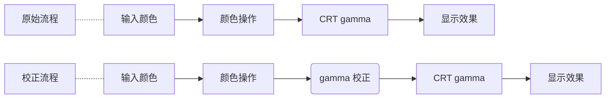

# LearnOpenGL

## 基本介绍

### 立即渲染模式

早期的 OpenGL 使用立即渲染模式（Immediate mode，也就是固定渲染管线），这个模式下绘制图形很方便。OpenGL 的大多数功能都被库隐藏起来，开发者很少有控制 OpenGL 如何进行计算的自由。而开发者迫切希望能有更多的灵活性。随着时间推移，规范越来越灵活，开发者对绘图细节有了更多的掌控。立即渲染模式确实容易使用和理解，但是效率太低。因此从 `OpenGL 3.2` 开始，规范文档开始废弃立即渲染模式，并鼓励开发者在 OpenGL 的核心模式 (Core-profile) 下进行开发，这个分支的规范完全移除了旧的特性。


### 核心模式

当使用 OpenGL 的核心模式时，OpenGL 迫使我们使用现代的函数。当我们试图使用一个已废弃的函数时，OpenGL 会抛出一个错误并终止绘图。现代函数的优势是更高的灵活性和效率，然而也更难于学习。立即渲染模式从 OpenGL **实际**运作中抽象掉了很多细节，因此它在易于学习的同时，也很难让人去把握 OpenGL 具体是如何运作的。现代函数要求使用者真正理解 OpenGL 和图形编程，它有一些难度，然而提供了更多的灵活性，更高的效率，更重要的是可以更深入的理解图形编程。


### 状态机

OpenGL 自身是一个巨大的状态机：一系列的变量描述 OpenGL 此刻应当如何运行。OpenGL 的状态通常被称为 OpenGL 上下文 (Context)。我们通常使用如下途径去更改 OpenGL 状态：**设置选项，操作缓冲**。最后，我们使用当前 OpenGL 上下文来渲染。


### 函数名格式

前缀 gl 表示属于 GL 库的函数。例如

```cpp
glVertex3f(x, y, z);
glVertex3fv(p);
```

分解为

* gl：属于 GL 库
* Vertex：函数功能
* 3：参数个数
* f：浮点型
* v：向量类型，其实就是指针
* p：p 为指向 float 的指针

常用的变量类型后缀有

* b - byte
* ub - unsigned byte
* s - short
* us - unsigned short
* i - int
* ui - unsigned int
* f - float
* d - double


### 错误处理

当 OpenGL 发现错误时，就在内部记录一个出错编码，造成错误的子程序会被忽略。但是 OpenGL 每次只记录一个出错编码，一旦出现一个出错编码，在程序明确查询 OpenGL 出错状态之前不会再记录其它出错编码。

```cpp
GLenum glGetError(void);	// 获得出错编码
```

此函数返回出错编码并清空出错标记，返回值通常有

* `GL_NO_ERROR` - 没有错误
* `GL_INVALID_ENUM` - GLenum 的参数超出范围
* `GL_INVALID_VALUE` - 数值参数超出范围
* `GL_INVALID_OPERATION` - 有一个操作非法
* `GL_STACK_OVERFLOW` - 栈向上溢出
* `GL_STACK_UNDERFLOR` - 栈向下溢出
* `GL_OUT_OF_MEMORY` - 没有足够的内存执行命令

我们可以预定义用于获得错误信息的函数和宏

```cpp
__declspec(noinline) std::string opengl_errno_name(int err) {
  switch (err) {
#define PRE_GL_ERROR(name)                                                     \
  case GL_##name:                                                              \
    return #name;

    PRE_GL_ERROR(NO_ERROR)
    PRE_GL_ERROR(INVALID_ENUM)
    PRE_GL_ERROR(INVALID_VALUE)
    PRE_GL_ERROR(INVALID_OPERATION)
    PRE_GL_ERROR(STACK_OVERFLOW)
    PRE_GL_ERROR(STACK_UNDERFLOW)
    PRE_GL_ERROR(OUT_OF_MEMORY)
#undef PRE_GL_ERROR
  }
  return "Unknown error" + std::to_string(err);
}

void check_gl_error(const char *filename, int lineno, const char *expr) {
  int err = glGetError();
  if (err != 0) [[unlikely]] {
    std::cerr << filename << ":" << lineno << ": " << expr
              << " failed: " << opengl_errno_name(err) << std::endl;
    std::terminate();
  }
}

#if NDEBUG
#define CHECK_GL(x)                                                            \
  do {                                                                         \
    (x);                                                                       \
  } while (0)
#else
#define CHECK_GL(x)                                                            \
  do {                                                                         \
    (x);                                                                       \
    check_gl_error(__FILE__, __LINE__, #x);                                    \
  } while (0)
#endif
```


## 立即渲染模式

### 基本窗口

首先我们给出源文件

```cpp
#include <GLFW/glfw3.h>
#include <iostream>

int main()
{
	// 初始化
    if (!glfwInit())
    {
        std::cerr << "Failed to initialize GLFW" << std::endl;
        return -1;
    }

	// 创建窗口，设置上下文
    GLFWwindow *window = glfwCreateWindow(800, 600, "Hello World", nullptr, nullptr);
    if (!window)
    {
        std::cerr << "Failed to create GLFW window" << std::endl;
        glfwTerminate();
        return -1;
    }
    glfwMakeContextCurrent(window);

	// 事件循环
    while (!glfwWindowShouldClose(window))
    {
        glClear(GL_COLOR_BUFFER_BIT);

        glBegin(GL_TRIANGLES);
        glVertex2f(-0.5f, -0.5f);
        glVertex2f(0.5f, -0.5f);
        glVertex2f(0.0f, 0.5f);
        glEnd();

        glfwSwapBuffers(window);
        glfwPollEvents();
    }

	// 销毁资源
    glfwTerminate();

    return 0;
}
```

对应的 cmake 文件

```cmake
cmake_minimum_required(VERSION 3.27)

set(CMAKE_CXX_STANDARD 20)
set(CMAKE_CXX_STANDARD_REQUIRED True)

project(three VERSION 1.0.0 LANGUAGES C CXX)

# 获得源文件
set(SOURCE)
set(SOURCE_DIR "hello")

foreach(dir ${SOURCE_DIR})
  file(GLOB SRC CONFIGURE_DEPENDS ${dir}/*.cpp)
  file(GLOB INC CONFIGURE_DEPENDS ${CMAKE_SOURCE_DIR}/include/${PROJECT_NAME}/${dir}/*.h)

  source_group(${dir} FILES ${SRC} ${INC})
  set(SOURCE ${SOURCE} ${SRC} ${INC})
endforeach()

add_executable(${PROJECT_NAME} main.cpp ${SOURCE})

target_include_directories(${PROJECT_NAME} PRIVATE ${CMAKE_SOURCE_DIR}/include)

set_target_properties(${PROJECT_NAME} PROPERTIES WIN32_EXECUTABLE OFF)

# 链接 glfw3 和 glm
set(glfw3_DIR "D:/lib/GLFW/lib/cmake/glfw3")
find_package(glfw3 REQUIRED)

set(glm_DIR "D:/lib/glm/cmake/glm")
find_package(glm REQUIRED)

# 注意链接系统的 opengl32 库
target_link_libraries(${PROJECT_NAME} PRIVATE opengl32.lib glfw)
target_link_libraries(${PROJECT_NAME} PRIVATE glm::glm)

set(BINARY_DIR ${PROJECT_BINARY_DIR})

# 移动 dll 文件
set(OUTPUT_DIR
    "$<$<CONFIG:Debug>:"
    "${BINARY_DIR}/Debug"
    ">"
    "$<$<CONFIG:Release>:"
    "${BINARY_DIR}/Release"
    ">"
    "$<$<CONFIG:RelWithDebInfo>:"
    "${BINARY_DIR}/RelWithDebInfo"
    ">")
string(REPLACE ";" " " OUTPUT_DIR ${OUTPUT_DIR})

file(GLOB DEPS_DLL CONFIGURE_DEPENDS "D:/lib/GLFW/bin/*.dll")

add_custom_command(
  TARGET ${PROJECT_NAME}
  POST_BUILD
  COMMAND ${CMAKE_COMMAND} -E copy ${DEPS_DLL} ${OUTPUT_DIR})

```

现在我们编译运行将会得到下面的窗口

![[image-20241019135539209.png]]


### 绘图函数

#### 绘制背景

使用 glClearColor 函数清空背景

```cpp
glClearColor(red, green, blue, alpha);
```


#### 绘制流程

渲染流程一般为

```cpp
void render()
{
    glClear(GL_COLOR_BUFFER_BIT);
    
    // 填充背景色
    glClearColor(1, 1, 1, 0);
    
    // 绘图内容
    glBegin(Geometry type);
    // 图元顶点
    glEnd();
    
    // 强制刷新
    glFlush();
}
```

其中 glClear 函数接收一个描述缓冲的宏，决定将清空哪些缓冲。例如

* `GL_COLOR_BUFFER_BIT` 清空颜色缓冲
* `GL_DEPTH_BUFFER_BIT` 清空深度缓冲
* `GL_STENCIL_BUFFER_BIT` 清空模板缓冲

如果想清空多个缓冲，使用按位或运算连接即可。函数 glFlush 强制刷新缓冲，实现绘图。但是我们更推荐使用

```cpp
glfwSwapBuffers(window);
```

即双缓冲绘图，能够避免绘制过程中的闪烁问题。


#### 绘制顶点

使用 glVertex 相关的函数可以绘制二维和三维点，例如

```cpp
// 在指定位置绘制二维点
void glVertex2f(
    GLfloat x, 
    GLfloat y
);

// 在指定位置绘制三维点
void glVertex3f(
    GLfloat x, 
    GLfloat y, 
    GLfloat z
);
```

也可以通过传入指针绘制

```cpp
// 传入指针绘制二维点
void glVertex2fv(
    const GLfloat *v
);

// 传入指针绘制三维点
void glVertex3fv(
    const GLfloat *v
);
```

这种方法的好处是便于以数组形式传入点。


#### 绘图模式

使用 glBegin 开启绘图时需要指定具体的绘图模式，OpenGL 提供了基本的绘图形状

```cpp
#define GL_POINTS			// 只是绘制点
#define GL_LINES			// 两两配对点连线
#define GL_LINE_LOOP		// 循环连接所有点
#define GL_LINE_STRIP		// 依次连接点
#define GL_TRIANGLES		// 三个点配对绘制三角形
#define GL_TRIANGLE_STRIP	// 依次选三个点绘制三角形
#define GL_TRIANGLE_FAN		// 以第一个顶点为公共顶点绘制三角形
#define GL_QUADS			// 四个点配对绘制四边形
#define GL_QUAD_STRIP		// 依次选四个点绘制四边形
#define GL_POLYGON			// 绘制多边形
```

绘图示例如下

![[图形开发/渲染框架/Glut.assets/image-20221110200041156.png|500]]

![[图形开发/渲染框架/Glut.assets/image-20221110200052218.png|500]]


#### 裁剪平面

OpenGL 中处理视景体的 6 个裁剪平面以外，还可以最多指定 6 个其它裁剪平面，进一步限制视景体。


我们通过如下函数指定裁剪平面

```cpp
void glClipPlane(
    GLenum plane, 
    const GLdouble *equation
);
```

其中 plane 是裁剪平面的编号，形如 `GL_CLIP_PLANEi`，i 是具体编号，只能取 0 到 5 之间；equation 是平面方程的 4 个参数的数组。


指定裁剪平面后需要手动启用/禁用对应编号的裁剪平面

```cpp
void glEnable(GLenum cap);
void glDisable(GLenum cap);
```

参数就是裁剪平面的变换。


不同系统中支持的裁剪平面数可能不同，使用

```cpp
glGetIntegerv(GL_MAX_CLIP_PLANES);
```

获得支持的其它裁剪平面的最大数目。


### 显示列表

把要绘制的对象描述为一个命名的语句序列并储存更加高效。通过

```cpp
glNewList(listID, listMode);
// ...
glEndList();
```

创建 ID 为 listID，模式 listMode 可选

- `GL_COMPILE` 储存列表
- `GL_COMPILE_AND_EXECUTE` 储存列表同时立即执行表中的命令


#### 生成显示表

一个显示表可以嵌套在另一个显示表内。但如果一个显示表使用了另一个显示表的 ID，它会覆盖前者。为了防止错误重用导致显示表丢失，可以让程序自动产生 ID

```cpp
listID = glGenLists(1);
```

它产生一个未使用的正整数标识 ID 。传入参数表示保留连续的整数，例如传入 6 会保留连续 6 个未使用的正整数并返回第一个。我们可以查询一个正整数是否已经使用

```cpp
glIsList(listID);
```

返回值为 `GL_TRUE` 或 `GL_FALSE` 。


#### 执行显示表

我们可以创建任意多显示表，并调用

```cpp
glCallList(listID);
```

执行显示表。例如

```cpp
constexpr float TWO_PI = 6.2831853f;

GLuint regHex;

void init()
{
    // 注册显示表
    regHex = glGenLists(1);
    glNewList(regHex, GL_COMPILE);

    // 显示表内容
    glBegin(GL_POLYGON);
    for (int i = 0; i < 6; i++)
    {
        double theta = TWO_PI * i / 6.0;
        double x = 0.8 * cos(theta);
        double y = 0.8 * sin(theta);
        glVertex3f(x, y, 0);
    }
    glEnd();

    // 结束命令
    glEndList();
}

void render()
{
    // 调用显示表
    glCallList(regHex);
}
```


可以执行多个显示表

```cpp
// 设置初始位置
void glListBase(GLuint base);

// 调用多个显示表
void glCallLists(
    GLsizei n, 				// 要执行的显示表数量
    GLenum type, 			// 数据类型：GL_BYTE, GL_INT, GL_FLOAT
    const GLvoid *lists		// 显示表数组
);
```

调用多个显示表时，从 base (默认为 0) 指定的显示表开始依次调用 n 个表。


#### 删除显示表

如果不需要显示表，可以删除连续的一组

```cpp
glDeleteLists(startID, nLists);
```

从 startID 开始依次删除 nLists 个显示表。


### Bezier

#### 绘制曲线

我们需要激活绘制曲线的子程序

```cpp
void glMap1f(
    GLenum target, 			// 绘制目标
    GLfloat u1, 			// 最小参数
    GLfloat u2, 			// 最大参数
    GLint stride, 			// 跳跃值（点的维数）
    GLint order, 			// 点的数量
    const GLfloat *points	// 控制点数组
);
```

如果使用三维点描述，激活一个三次 Bezier 曲线的方法为

```cpp
glMap1f(GL_MAP1_VERTEX_3, 0, 1, 3, 4, *ctrlPts);
glEnable(GL_MAP1_VERTEX_3);
```

如果要用四维齐次坐标表示，则使用 `GL_MAP1_VERTEX_4`，并将 stride 改为 4 即可。设定参数后，需要计算沿路径的位置

```cpp
void glEvalCoord1f(GLfloat u);
```

传入曲线参数值即可绘制曲线对应参数值的点。例如

```cpp
// 控制点数组
float ctrlPts[4][3] = {{-0.75, 0, 0}, {-0.5, 0.5, 0}, {0.5, 0.5, 0}, {0.75, 0, 0}};

void init()
{
    // 激活绘图子程序
    glMap1f(GL_MAP1_VERTEX_3, 0, 1, 3, 4, *ctrlPts);
    glEnable(GL_MAP1_VERTEX_3);
}

void render()
{
    glColor3f(0, 0, 1);
    glPointSize(1);

    // 绘制 Bezier 曲线
    glBegin(GL_LINE_STRIP);
    for (int k = 0; k <= 50; k++)
    {
        glEvalCoord1f(float(k) / 50);
    }
    glEnd();

    glColor3f(1, 0, 0);
    glPointSize(5);

    // 绘制控制点
    glBegin(GL_POINTS);
    for (int k = 0; k < 4; k++)
    {
        glVertex3fv(&ctrlPts[k][0]);
    }
    glEnd();
}
```


由于我们使用的是均匀间隔的参数，可以直接调用函数产生这类参数

```cpp
void glMapGrid1f(
    GLint un, 		// 分割份数
    GLfloat u1, 	// 起始参数
    GLfloat u2		// 最终参数
);

void glEvalMesh1(
    GLenum mode, 	// 绘制模式
    GLint i1, 		// 起始点的索引
    GLint i2		// 终止点的索引
);
```

因此上面绘制过程可以替换为

```cpp
void render()
{
    glColor3f(0, 0, 1);
    glPointSize(1);

	// 均匀绘制
	glMapGrid1f(50, 0, 1);			// (0,1) 划分成 50 份
    glEvalMesh1(GL_LINE, 0, 50);	// 从 0 到 50 绘制连线

    glColor3f(1, 0, 0);
    glPointSize(5);

    // 绘制控制点
    glBegin(GL_POINTS);
    for (int k = 0; k < 4; k++)
    {
        glVertex3fv(&ctrlPts[k][0]);
    }
    glEnd();
}
```

划分成 50 份，意味着有 51 个点，索引范围就是 0 到 50；另外，如果绘制模式为 `GL_POINT`，就会只绘制参数点。


除了显示 Bezier 曲线，还可以用 `glMap1` 函数指定其它类数据的值。使用 `GL_MAP1_COLOR_4` 时，数组 ctrlPts 用于指定 RGBA 颜色列表，然后可以为应用生成一组线性插值的颜色

```cpp
// 控制点数组
float ctrlPts[4][3] = {{-0.75, 0, 0}, {-0.5, 0.5, 0}, {0.5, 0.5, 0}, {0.75, 0, 0}};

// 颜色数组
float colorPts[4][4] = {{1, 0, 0, 1}, {0, 1, 0, 1}, {0, 0, 1, 1}, {1, 1, 1, 1}};

void init()
{
    // 激活绘图子程序
    glMap1f(GL_MAP1_VERTEX_3, 0, 1, 3, 4, *ctrlPts);
    glEnable(GL_MAP1_VERTEX_3);

    // 激活颜色插值
    glMap1f(GL_MAP1_COLOR_4, 0, 1, 4, 4, *colorPts);
    glEnable(GL_MAP1_COLOR_4);
}

void render()
{
    glPointSize(1);

    // 均匀绘制
    glMapGrid1f(50, 0, 1);       // (0,1) 划分成 50 份
    glEvalMesh1(GL_LINE, 0, 50); // 从 0 到 50 绘制连线

    glColor3f(1, 0, 0);
    glPointSize(5);

    // 绘制控制点
    glBegin(GL_POINTS);
    for (int k = 0; k < 4; k++)
    {
        glVertex3fv(&ctrlPts[k][0]);
    }
    glEnd();
}
```

> [!note] 
> 同一时刻只能存在一个曲面纹理生成器，并且不能同时激活 `GL_MAP1_VERTEX_3` 和 `GL_MAP1_VERTEX_4` 。

![[image-20241020170808545.png]]


#### 绘制曲面

需要激活子程序

```cpp
void glMap2f(
    GLenum target, 
    GLfloat u1, GLfloat u2, GLint ustride, GLint uorder, 
    GLfloat v1, GLfloat v2, GLint vstride, GLint vorder, 
    const GLfloat *points
);
```

使用方法类似于前，只不过要指定两个参数值的信息。


指定参数信息计算对应曲面上的值

```cpp
void glEvalCoord2f (GLfloat u, GLfloat v);
```

并且也有指定均匀间隔参数的函数

```cpp
void glMapGrid2f(
    GLint un, GLfloat u1, GLfloat u2, 
    GLint vn, GLfloat v1, GLfloat v2
);

void glEvalMesh2(
    GLenum mode, 
    GLint i1, GLint i2, 
    GLint j1, GLint j2
);
```

这里模式除了 `GL_POINT` 和 `GL_LINE` 外，还可选 `GL_FILL` 来填充曲面。


### 图元属性

属性是 OpenGL 状态的一部分，确定对象的外观，包括

* 颜色（点、线、多边形）
* 点的大小
* 线段宽度与实线/虚线模式
* 多边形模式
    * 前后面
    * 填充模式
    * 显示为实心多边形或只显示边界


#### 着色规则

颜色的每个分量在帧缓冲区中分开存储，通常每个分量占用 8 字节。使用 `glColor3f` 和 `glColor3ub` 来设定 RGB 颜色值

```cpp
// 浮点型输入，范围为 0 到 1
void glColor3f(
    GLfloat red, 
    GLfloat green, 
    GLfloat blue
);

// 整型输入，范围为 0 到 255
void glColor3ub(
    GLubyte red, 
    GLubyte green, 
    GLubyte blue
);
```

颜色值一旦设定，在后续的构造过程中将一直使用这一颜色，直到被修改为止。


当绘制多边形时，OpenGL 默认会根据多边形顶点的颜色插值出内部点的颜色。当然，也可以只根据第一个顶点的颜色确定填充颜色。当需要修改填充模式时，使用 glShadeModel 调整

```cpp
void glShadeModel(GLenum mode);
```

可选模式有

* `GL_SMOOTH` 颜色连续插值填充
* `GL_FLAT` 根据第一个顶点颜色填充

例如考虑下面的绘制函数

```cpp
constexpr float TWO_PI = 6.2831853f;

GLuint regHex;

void init()
{
    // 注册显示表
    regHex = glGenLists(1);
    glNewList(regHex, GL_COMPILE);

    // 显示表内容
    glBegin(GL_POLYGON);
    for (int i = 0; i < 6; i++)
    {
        double theta = TWO_PI * i / 6.0;
        double x = 0.8 * cos(theta);
        double y = 0.8 * sin(theta);
        glColor3f((x + 1) / 2, (y + 1) / 2, 0);
        glVertex3f(x, y, 0);
    }
    glEnd();

    // 结束命令
    glEndList();
}

void render()
{
    // 调用显示表
    glCallList(regHex);
}
```

设置不同的填充模式会得到不同的渲染效果

![[image-20241020173120207.png]]

![[image-20241020173224939.png]]


#### 颜色调和

有时我们需要将重叠对象的颜色或对象与背景颜色调和。首先要开启此特性

```cpp
glEnable(GL_BLEND);
```

如果没有开启，那么会直接用新的颜色替换旧的颜色。


OpenGL 中通过指定两组调和因子生成不同的颜色效果
$$
(S_rR_s+D_rR_d,S_gG_s+D_gG_d,S_bB_s+D_bB_d,S_aA_s+D_aA_d)
$$
其中 RGBA 源颜色为 $(R_s,G_s,B_s,A_s)$，目标颜色分量为 $(R_d,G_d,B_d,A_d)$，源调和因子为 $(S_r,S_g,S_b,S_a)$，而目标调和因子为 $(D_r,D_g,D_b,D_a)$ 。计算出的组合颜色分量归一到 0 到 1 之间，即任何大于 1 的和设为 1，小于 0 的和设为 0 。


使用下列函数设置调和因子

```cpp
glBlendFunc(sFactor, dFactor);
```

其中 sFactor 和 dFactor 分别是源和目标因子，通常直接通过 OpenGL 预定义的常量设置。例如

* `GL_ZERO` 表示 $(0,0,0,0)$，是 dFactor 的默认选项
* `GL_ONE` 表示 $(1,1,1,1)$，是 sFactor 的默认选项


#### 点和线宽

通过函数

```cpp
void glPointSize(GLfloat size);		// 舍入到整数，大小按照像素设置
void glLineWidth(GLfloat width);	// 舍入到整数，宽度为像素
```

分别设定绘制顶点的大小和绘制直线的宽度。


默认情况下，直线段设为实线。但也可以显示划线、点线或短划和点混合的线段。首先要开启特性

```cpp
glEnable(GL_LINE_STIPPLE);
```

通过此函数设定线型

```cpp
void glLineStipple(
    GLint factor, 		// 说明模式中每一位重复应用多少次才轮到下一位。默认为 1
    GLushort pattern	// 描述如何显示线段的 16 位整数
);
```

第一个参数设置划线之间的距离，第二个参数中值为 1 的位对应一个开像素，值为 0 的位对应一个关像素。例如

```cpp
void init()
{
	// 设置线型
    glEnable(GL_LINE_STIPPLE);
    glLineStipple(1, 0xff);

    // 注册显示表
    regHex = glGenLists(1);
    glNewList(regHex, GL_COMPILE);

    // 显示表内容
    glBegin(GL_LINE_LOOP);
    for (int i = 0; i < 6; i++)
    {
        double theta = TWO_PI * i / 6.0;
        double x = 0.8 * cos(theta);
        double y = 0.8 * sin(theta);
        glColor3f((x + 1) / 2, (y + 1) / 2, 0);
        glVertex3f(x, y, 0);
    }
    glEnd();

    // 结束命令
    glEndList();
}
```

由于 `0xff` 是 255，即有连续 8 位为 1，因此产生相同长度的线段和空隙。

![[image-20241020173434883.png]]


#### 反走样

OpenGL 提供三类图元支持反走样。首先激活反走样

```cpp
glEnable(primitiveType);
```

可选参数

* `GL_POINT_SMOOTH`
* `GL_LINE_SMOOTH`
* `GL_POLYGON_SMOOTH`

如果我们用 RGBA 模式指定颜色，反走样还需要我们激活颜色操作用于边界模糊

```cpp
glEnable(GL_BLEND);
```

然后指定调和颜色的方法

```cpp
glBlendFunc(GL_SRC_ALPHA, GL_ONE_MINUS_SRC_ALPHA);
```

还可以调整反走样的质量

```cpp
glHint(GL_POINT_SMOOTH, GL_NICEST);
```

可选参数为

* `GL_NICEST` 图像质量优先
* `GL_FASTEST` 运行速度优先


#### 查询与保存

通过查询函数可以获得包括属性设定在内的任意状态参数的当前值。

```cpp
glGetBooleanv();
glGetFloatv();
glGetIntegerv();
glGetDoublev();
```

每个函数需要指定一个标识常量和一个对应数据类型的数组用于储存。


我们可以将当前属性保存起来，只需要

```cpp
glPushAttrib(attrGroup);
```

其中 attrGroup 用常量标识，如 `GL_POINT_BIT`、`GL_LINE_BIT` 等，使用 `GL_CURRENT_BIT` 可以保存当前颜色信息。此函数将指定信息放进属性栈保存。通过按位或操作可以同时保存多个属性。


通过函数

```cpp
glPopAttrib();
```

弹出最后一个推入的保存属性，将其恢复。


### 批量绘制

#### 顶点数组

OpenGL 提供了顶点数组来快速绘制图元，首先启用数组

```cpp
void glEnableClientState(GLenum array);
```

可选参数有

* `GL_VERTEX_ARRAY`
* `GL_COLOR_ARRAY`
* `GL_INDEX_ARRAY`
* `GL_NORMAL_ARRAY`

更多参数查阅头文件即可。


使用顶点数组传入颜色

```cpp
void glColorPointer(
    GLint size, 			// 每组颜色占用的大小，RGB 每个分量占 1，因此 size = 3
    GLenum type, 			// 分量的数据类型
    GLsizei stride, 		// 跳跃值，在存在多种数据时用于区分
    const GLvoid *pointer	// 储存颜色数据的数组
);
```

例如考虑数组

```cpp
pointer[] = {
	r1,g1,b1, v1x,v1y,v1z,
	r2,g2,b2, v2x,v2y,v2z
};
```

我们用连续 6 个浮点数保存一个顶点和它的颜色，这时 stride 设为 `6 * sizeof(float)`；一般每个数组只存放同一种数据，这时候只需要设为 0 即可。类似地还有

```cpp
void glVertexPointer(
    GLint size, 			// 每个顶点占用的大小，例如三维点 size = 3
    GLenum type, 			// 分量的数据类型
    GLsizei stride, 		// 跳跃值，在存在多种数据时用于区分
    const GLvoid *pointer	// 储存顶点数据的数组
);
```

假设我们定义了三维顶点数组和它们对应的颜色数组，则可以调用

```cpp
glVertexPointer(3, GL_FLOAT, 0, vertices);
glColorPointer(3, GL_FLOAT, 0, colors);
```

这样我们就一次性传入了所有顶点和颜色，现在要开始绘制过程。


#### 绘制索引点

通过如下函数**绘制**对应索引的点

```cpp
void glArrayElement(GLint i);
```

此函数必须被包围在 glBegin 和 glEnd 之间

```cpp
glBegin(GL_TRIANGLES);
    glArrayElement(0);
    glArrayElement(1);
    glArrayElement(2);
glEnd();
```

例如给出顶点和颜色数组，使用 glArrayElement 绘制三角形

```cpp
GLfloat vertices[] = {-0.5, -0.5, 0.0, 0.5, 0.0, 0.0, 0.0, 0.5, 0.0};
GLfloat color[] = {1, 0, 0, 0, 1, 0, 0, 0, 1};

void init()
{
    // 注意这两步不能合并
    glEnableClientState(GL_VERTEX_ARRAY);
    glEnableClientState(GL_COLOR_ARRAY);

	// 传入顶点数组和颜色数组
    glVertexPointer(3, GL_FLOAT, 0, vertices);
    glColorPointer(3, GL_FLOAT, 0, color);
}

void render()
{
    // 通过索引图元绘制
    glBegin(GL_TRIANGLES);
    glArrayElement(0);
    glArrayElement(1);
    glArrayElement(2);
    glEnd();
}
```

绘制效果为

![[image-20241020193641458.png]]


#### 绘制图元

上面这种做法省去了多次传入顶点的麻烦，但是还不够。我们可以直接完成一个图元的绘制

```cpp
void glDrawElements(
    GLenum mode, 			// 绘图模式
    GLsizei count, 			// 使用点的数量
    GLenum type, 			// 数组的类型
    const GLvoid *indices	// 点的索引的数组
);
```

这里最后 indices 传入点的索引列表，函数将会绘制这些索引对应的点；此函数包含了 glBegin 和 glEnd 的内容，因此可以直接调用。例如

```cpp
// 直接绘制
int ind[] = {0, 1, 2};
glDrawElements(GL_TRIANGLES, 3, GL_UNSIGNED_INT, ind);
```

>[!note]
>注意对于核心模式，必须绑定 EBO 或者传入 `ind` 才能使用 `glDrawElements`，否则会报错。


#### 混合数组

之前提到顶点数组和颜色数组可以指定跳跃值，我们可以通过这一值将顶点和颜色数据混合存放

```cpp
GLfloat mixed[] = {-0.5, -0.5, 0.0, 1, 0, 0, 0.5, 0.0, 0.0, 0, 1, 0, 0.0, 0.5, 0.0, 0, 0, 1};

void init()
{
    glEnableClientState(GL_VERTEX_ARRAY);
    glEnableClientState(GL_COLOR_ARRAY);

    glVertexPointer(3, GL_FLOAT, 6 * sizeof(GLfloat), &mixed[0]);
    glColorPointer(3, GL_FLOAT, 6 * sizeof(GLfloat), &mixed[3]);
}

void render()
{
    // 直接绘制
    int ind[] = {0, 1, 2};
    glDrawElements(GL_TRIANGLES, 3, GL_UNSIGNED_INT, ind);
}
```


#### 连续数据

如果我们使用的是连续数据，那么可以使用

```cpp
void glDrawArrays(
    GLenum mode, 	// 绘图模式
    GLint first, 	// 第一个数据索引
    GLsizei count	// 点的数量
);
```

此函数会绘制从 first 开始一共 count 个点的图元。


#### 指定间隔

OpenGL 提供一个可以一次性指定所有顶点和颜色或其它信息的函数

```cpp
void glInterleavedArrays(
    GLenum format, 			// 数组格式
    GLsizei stride, 		// 元素偏移量
    const GLvoid *pointer	// 混合数组
);
```

其中数组格式可以指定 `GL_C3F_V3F`，即三个颜色分量加三个顶点分量配对；偏移量就是指定相邻数据的间隔。


### 多边形绘制

我们可以直接绘制一个矩形

```cpp
void glRectd(
    GLdouble x1, GLdouble y1,	// 左上角顶点位置
    GLdouble x2, GLdouble y2	// 右下角顶点位置
);
```

我们将会介绍，根据顶点的绘制顺序，会显示前面和后面。尽管在二维绘制时，前后面一般相同处理，但是仍然需要注意这一点。


#### 两面绘制

从三维的角度来看，一个多边形具有两个面。每一个面都可以设置不同的绘制方式：填充、只绘制边缘轮廓线、只绘制顶点，默认绘制方式是填充。通过如下函数设置

```cpp
void glPolygonMode(GLenum face, GLenum mode);
```

其中 face 可选参数

* `GL_FRONT` 前面
* `GL_BACK` 后面
* `GL_FRONT_AND_BACK` 前面和后面

Mode 可选参数

* `GL_FILL` 填充
* `GL_LINE` 边缘绘制
* `GL_POINT` 顶点绘制


#### 多边形偏移

当我们只绘制三维多边形的边，可能会在边之间产生缝隙。这种称为**缝线**的效果由扫描填充算法和边的画线算法的计算差别造成。在对一个多边形进行填充时，深度值按每一 $(x,y)$ 计算，但是边上的深度值计算与画线算法可能不同。消除缝隙的方法是移动填充子程序计算的深度值，使它们与多边形的边深度值不重叠

```cpp
glEnable(GL_POLYGON_OFFSET_FILL);
glPolygonOffset(factor1, factor2);
```

第一个函数激活特性，第二个函数设定位移总量
$$
depthOffset = factor1\cdot maxSlope + factor2\cdot const
$$
其中 $maxSlope$ 是多边形的最大斜率，$const$ 是实现常数。两个因子常用的值是 0.75 和 1 。例如

```cpp
// 对于 GL_FILL GL_POINT GL_LINE 三种模式都开启偏移
glEnable(GL_POLYGON_OFFSET_LINE | GL_POLYGON_OFFSET_POINT | GL_POLYGON_OFFSET_FILL);
glPolygonOffset(1, 1);
```


#### 消除选定边

当我们绘制凸多边形时，需要将其分割为三角形绘制，这在填充绘制时不会有问题。但是，如果我们只需要绘制外边框，那么绘制三角形就会导致内部顶点连线被显示出来。例如


为了消去这些连线，可以通过标记函数

```cpp
glEdgeFlag(flag);
```

指定 `GL_FALSE` 从现在开始不显示边。例如

```cpp
glPolygonMode(GL_FRONT_AND_BACK, GL_LINE);

glBegin(GL_POLYGON);
glVertex3f(-0.5, 0.5, 0.5);
glEdgeFlag(GL_FALSE);			// 前一个顶点开始之后所有连线不显示
glVertex3f(-0.5, -0.5, 0.5);
glEdgeFlag(GL_TRUE);			// 前一个顶点开始之后所有连线显示
glVertex3f(0.5, -0.5, 0.5);
glVertex3f(0.5, 0.5, 0.5);
glEnd();
```


也可以在一个数组中指定标记，其使用思路和顶点数组相同，首先要开启特性

```cpp
glEnableClientState(GL_EDGE_FLAG_ARRAY);
```

然后创建边界标记数组

```cpp
void glEdgeFlagPointer(GLsizei stride, const GLvoid *pointer);
```

其中 stride 是两个数据之间的跳跃值。边界标记也可以和顶点、颜色数组混合使用。


#### 确定正面

一般约定“顶点以逆时针顺序出现在屏幕上的面”为“正面”，另一个面即成为“反面”。我们可以交换正反

```cpp
void glFrontFace(GLenum mode);
```

其中 mode 可选参数

* `GL_CCW` 逆时针方向为正面
* `GL_CW` 顺时针方向为正面


#### 多边形剔除

用于去除多边形物体本身的不可见面，例如面与视线方向正交的情况。

```cpp
glEnable(GL_CULL_FACE);
glCullFace(face);
```

其中 face 可选参数与前面一致。


### 视图变换

#### 坐标系

在 glVertex 中的单位由应用程序确定，称为世界坐标系。视景体相对于世界坐标系指定，它确定出现在图像中的对象。在 OpenGL 内部会把世界坐标转化为照相机（视点）坐标，然后转化为屏幕坐标。


默认情况下，照相机被放置在世界坐标系的原点，**指向 z 轴的负方向**。默认视景体是一个中心在原点，边长为 2 的立方体。

![[图形开发/渲染框架/Glut.assets/image-20221110135125560.png|500]]

默认的正交视图中，点沿着 z 轴投影到 $z=0$ 的平面上。

![[image-20221110135256414.png|500]]

其中投影是利用投影矩阵乘法进行的。OpenGL 是一个状态机，拥有模型视点 modelview、矩阵栈和投影 projection 矩阵栈。


使用 glMatrixMode 设置矩阵模式，有三种矩阵模式

* `GL_MODELVIEW` 模型视图矩阵，确定从局部坐标系到世界坐标系的转换矩阵
* `GL_PROJECTION` 投影矩阵，确定从观察者坐标系到屏幕坐标的转换矩阵
* `GL_TEXTURE` 纹理矩阵

其中模型视图用于提供对模型矩阵的变换。由于移动的相对性，改变观察点位置和改变物体本身位置等效，即相机的移动和物体的移动可以等价地看待，因此 OpenGL 用同样的函数实现两种功能。


#### 视图变换

模型视图变换涉及三个函数

```cpp
// 对物体进行位移，当前矩阵将乘上此位移矩阵
void glTranslatef(
    GLfloat x, 
    GLfloat y, 
    GLfloat z
);

// 旋转物体，当前矩阵将乘上此旋转矩阵。物体绕 (0,0,0) 到 (x,y,z) 的直线以逆时针旋转 angle 度
void glRotatef(
    GLfloat angle, 
    GLfloat x, 
    GLfloat y, 
    GLfloat z
);

// 伸缩物体，当前矩阵将乘上此伸缩矩阵。在 x,y,z 方向上分别以比例 x,y,z 伸缩 
void glScalef(
    GLfloat x, 
    GLfloat y, 
    GLfloat z
);
```

由于每次调用函数都会**右乘上变换矩阵**，最后作用于坐标时的变换顺序与函数调用顺序相反。例如依次作用 $T,R,S$ 做平移、旋转和伸缩变换，最终的变换为 $(TRS)v$，其中 $v$ 是坐标。实际产生的变换是伸缩、旋转，最后平移。


#### 变换矩阵 

我们可以直接载入变换矩阵，例如对不同的矩阵模式载入单位阵

```cpp
glMatrixMode(GL_MODELVIEW);
glLoadIdentity();

glMatrixMode(GL_PROJECTION);
glLoadIdentity();
```

上传程序中定义的矩阵

```cpp
void glLoadMatrixf(
    const GLfloat *m
);
```

它接收 16 个元素的一维数组，按列定义了 `4 x 4` 矩阵。此函数将会用我们上传的矩阵**覆盖**当前矩阵。可以附加一个变换矩阵，使用

```cpp
void glMultMatrixf(
    const GLfloat *m
);
```

将矩阵乘在当前矩阵的右边。


许多时候需要保存变换矩阵，以供以后使用。OpenGL 为每种类型的矩阵维持一个堆栈，应用如下函数处理相应堆栈中的矩阵

```cpp
void glPushMatrix(void);	// 将当前矩阵压入堆栈
void glPopMatrix(void);		// 弹出最后一个压入堆栈的矩阵
```

这里堆栈是根据 glMatrixMode 设置的矩阵类型来区分的。弹出矩阵会将当前矩阵替换为弹出的矩阵。


如果想要获取当前的变换矩阵，利用查询函数

```cpp
void glGetDoublev(
    GLenum pname, 		// 堆栈名
    GLdouble *params	// 输出地址
);
```

输入代表堆栈名的宏，查询函数将会把变换矩阵存放到 params 开头的数组中。例如

```cpp
double m[16];
glGetDoublev(GL_MODELVIEW_MATRIX, m);
```

我们可以获得栈中有多少矩阵

```cpp
glGetIntegerv(GL_MODELVIEW_STACK_DEPTH, numMats);
```

最初模型视图矩阵栈中只有单位矩阵。


#### 视口尺寸

当要将投影完成的图像绘制到窗口上时，我们可以决定将其绘制到窗口的哪个部分。使用 glViewport 来定义视口

```cpp
void glViewport(
    GLint x, 		// 视口左下角 x 坐标
    GLint y, 		// 视口左下角 y 坐标
    GLsizei width,	// 视口宽度
    GLsizei height	// 视口高度
);	
```

单位均为像素。决定视口后，OpenGL 会将视景体中的内容按照视口比例投影绘制到视口当中。


#### 计算变换

利用 GLM 库计算矩阵变换

```embed
title: "OpenGL Mathematics"
image: "https://glm.g-truc.net/common/logo.png"
description: "OpenGL Mathematics (GLM) is a header only C++ mathematics library for graphics software based on the OpenGL Shading Language (GLSL) specifications."
url: "https://glm.g-truc.net/0.9.8/index.html"
```

可以给出通用相机类

```cpp
#pragma once

#include <glm/glm.hpp>
#include <glm/gtc/matrix_transform.hpp>
#include <glm/gtc/type_ptr.hpp>

namespace details
{

class GL_Camera
{
  public:
    glm::vec3 front;   // 指向原点的方向
    glm::vec3 up;      // 正交于向前方向的上方
    glm::vec3 right;   // 正交于向前方向的右方
    glm::vec3 worldUp; // 世界上方项，固定不变 (0, 0, 1)

    // 欧拉角：俯仰角(Pitch)、偏航角(Yaw)和滚转角(Roll)，我们不需要用到滚转角
    float distance; // 到原点的距离
    float pitch;    // 与 z 轴的夹角
    float yaw;      // 与 x 轴的夹角

  public:
    GL_Camera(float distance = 10.0f, float pitch = 90.0f, float yaw = 0.0f)
        : distance(distance), pitch(pitch), yaw(yaw)
    {
        worldUp = {0, 0, 1};
        UpdateCameraVectors();
    }

    glm::mat4 GetViewMatrix() const
    {
        glm::mat4 view = glm::mat4(1.0f);
        glm::vec3 position = front * distance;
        view = glm::lookAt(position, {0, 0, 0}, up);
        return view;
    }

    glm::vec3 GetPosition() const
    {
        return front * distance;
    }

    void SetDistance(float d)
    {
        distance = std::max(d, 0.01f);
        UpdateCameraVectors();
    }

    void SetPitch(float pitch)
    {
        // 设置角度范围
        if (pitch < 0)
            pitch += 360.0f;
        if (pitch > 360.f)
            pitch -= 360.0f;

        // 根据角度设置世界方向
        int n = static_cast<int>(pitch / 180.f);
        if (n % 2 == 0)
            worldUp = {0, 0, 1};
        else
            worldUp = {0, 0, -1};

        this->pitch = pitch;
        UpdateCameraVectors();
    }

    void SetYaw(float yaw)
    {
        this->yaw = yaw;
        UpdateCameraVectors();
    }

  protected:
    // 通过欧拉角计算方向向量
    void UpdateCameraVectors()
    {
        float ryaw = glm::radians(yaw);
        float rpitch = glm::radians(pitch);

        // 先算出方向，然后规范化
        front = glm::normalize(glm::vec3(cos(ryaw) * sin(rpitch), sin(ryaw) * sin(rpitch), cos(rpitch)));

        // 然后叉乘计算另外两个方向
        right = glm::normalize(glm::cross(front, worldUp));
        up = glm::normalize(glm::cross(right, front));
    }
};

} // namespace details

```

然后按照如下流程分别载入模型视图矩阵和投影矩阵

```cpp
#pragma once

#include <learn/interact/camera.hpp>

inline void gl_transform(GLFWwindow *window)
{
    glMatrixMode(GL_PROJECTION);

    int width, height;
    glfwGetWindowSize(window, &width, &height);

    float ratio = 1.0 * width / height;
    glLoadMatrixf(glm::value_ptr(glm::perspective(45.0f, ratio, 0.01f, 1000.0f)));

    glMatrixMode(GL_MODELVIEW);

    glLoadMatrixf(glm::value_ptr(details::gl_camera.GetViewMatrix()));
}
```


#### 消息处理

GLFW 通过注册回调函数来实现不同类型的消息处理。例如

```cpp
#pragma once

#include <GLFW/glfw3.h>

#include <iostream>
#include <learn/interact/camera.hpp>

namespace details
{

inline float gl_angle_rate = 0.25f;
inline float gl_scale_rate = 1.0f;
inline bool gl_moving = false;
inline GL_Camera gl_camera;

} // namespace details

inline void GLFWWindowResize(GLFWwindow *window, int width, int height)
{
    glViewport(0, 0, width, height);
}

inline void GLFWMouseButtonCallback(GLFWwindow *window, int button, int action, int mode)
{
    if (button == GLFW_MOUSE_BUTTON_LEFT)
    {
        if (action == GLFW_PRESS)
            details::gl_moving = true;
        if (action == GLFW_RELEASE)
            details::gl_moving = false;
    }
}

inline void GLFWCursorPosCallback(GLFWwindow *window, double xpos, double ypos)
{
    static float px, py;

    if (details::gl_moving)
    {
        float angleX = details::gl_camera.yaw - (xpos - px) * details::gl_angle_rate;
        float angleY = details::gl_camera.pitch - (ypos - py) * details::gl_angle_rate;

        details::gl_camera.SetYaw(angleX);
        details::gl_camera.SetPitch(angleY);
    }

    px = xpos;
    py = ypos;
}

inline void GLFWScrollCallback(GLFWwindow *window, double xoffset, double yoffset)
{
    details::gl_camera.SetDistance(details::gl_scale_rate * (details::gl_camera.distance - yoffset));
}

inline void GLFWKeyCallback(GLFWwindow *window, int key, int scancode, int action, int mods)
{
    if (key == GLFW_KEY_ESCAPE && action == GLFW_PRESS)
        glfwSetWindowShouldClose(window, GLFW_TRUE);
}
```

然后将这些自定义回调函数注册到消息循环中

```cpp
glfwSetFramebufferSizeCallback(window, GLFWWindowResize);
glfwSetScrollCallback(window, GLFWScrollCallback);
glfwSetMouseButtonCallback(window, GLFWMouseButtonCallback);
glfwSetCursorPosCallback(window, GLFWCursorPosCallback);
glfwSetKeyCallback(window, GLFWKeyCallback);
```


### 光照渲染

#### 点光源

首先要激活光源

```cpp
glEnable(GL_LIGHTING);
```


通过如下函数设置点光源

```cpp
void glLightf(
    GLenum light,	// 标识符 
    GLenum pname, 	// 符号属性
    GLfloat param	// 特性值
);
```

标识符可选 `GL_LIGHT0`, `GL_LIGHT1` 等，符号属性例如

```cpp
float posType[] = {0, 0, 1, 0.0f};
glLightfv(GL_LIGHT0, GL_POSITION, posType);
```

这里 `GL_POSITION` 用于指定光源位置，如果第四个分量设为零，则得到方向光源，否则是点光源。如果不指定位置，默认为负 $z$ 方向的方向光源。


#### 光源颜色

另一些属性，例如设置光源颜色。可以指定

* `GL_AMBIENT` 环境光
* `GL_DIFFUSE` 漫反射光
* `GL_SPECULAR` 镜面反射光

例如设置三种光源的颜色

```cpp
float ambientColor[] = {0.2f, 0.2f, 0.3f, 1.0f};
float diffuseColor[] = {1.0f, 1.0f, 1.0f, 1.0f};
float specularColor[] = {1.0f, 1.0f, 1.0f, 1.0f};

glLightfv(GL_LIGHT0, GL_AMBIENT, ambientColor);
glLightfv(GL_LIGHT0, GL_DIFFUSE, diffuseColor);
glLightfv(GL_LIGHT0, GL_SPECULAR, specularColor);
```


#### 距离衰减

设置光源的辐射强度衰减系数

* `GL_CONSTANT_ATTENUATION`
* `GL_LINEAR_ATTENUATION`
* `GL_QUADRATIC_ATTENUATION`

三个系数分别对应 $a+bd+cd^2$ 中不同次项的系数。例如

```cpp
glLightf(GL_LIGHT0, GL_CONSTANT_ATTENUATION, 0.1f);
glLightf(GL_LIGHT0, GL_LINEAR_ATTENUATION, 0.05f);
glLightf(GL_LIGHT0, GL_QUADRATIC_ATTENUATION, 0.01f);
```


#### 投射光源

对于点光源可以指定投射效果，将光线限制在一个圆锥形空间中

* `GL_SPOT_DIRECTION` 方向
* `GL_SPOT_CUTOFF` 圆锥角
* `GL_SPOT_EXPONENT` 衰减因子

衰减系数为 $\cos^{a_l}\theta$，其中 $\theta$ 是圆锥角，当入射光线与中心方向夹角超过圆锥角，则光源没有照射该点。


#### 表面特征

表面反射系数可以指定

```cpp
void glMaterialfv(GLenum face, GLenum pname, GLfloat param);
```

其中 face 参数可设定 `GL_FRONT, GL_BACK, GL_FRONT_AND_BACK` 等；pname 则用于标识表面参数，例如

* `GL_EMISSION` 设定表面散射颜色，默认是黑色
* `GL_AMBIENT, GL_DIFFUSE, GL_SEPCULAR` 等设定环境光、漫反射和镜面反射系数

注意这些系数设定使用 4 个分量，而高光系数 `GL_SHININESS` 只需要一个分量

```cpp
GLfloat modelDiffuse[] = {1.0f, 1.0f, 1.0f, 1.0f};
GLfloat modelSpecular[] = {0.2f, 0.2f, 0.3f, 1.0f};
GLfloat modelShininess = 100.0f;

glMaterialfv(GL_FRONT, GL_DIFFUSE, modelDiffuse);
glMaterialfv(GL_FRONT, GL_SPECULAR, modelSpecular);
glMaterialf(GL_FRONT, GL_SHININESS, modelShininess);
```


#### 指定法向

应用于网格曲面时，OpenGL 会使用多边形顶点的法向计算颜色。可以指定

```cpp
void glNormal3f(GLfloat nx, GLfloat ny, GLfloat nz);
```

来控制表面法向的值。对于平面多边形，只需要指定一次法向，而三角形网格需要对每个顶点指定法向。


虽然法向不一定需要指定为单位向量，但是后者可以减少计算。使用

```cpp
glEnable(GL_NORMALIZE);
```

自动规范化程序中的各种表面向量。


#### 法向数组

我们也可以指定一个法向量数组，类似于顶点数组，首先要激活数组

```cpp
glEnableClientState(GL_NORMAL_ARRAY);
```

然后指定法向量数组

```cpp
void glNormalPointer(
    GLenum type, 
    GLsizei stride, 
    const GLvoid *pointer
);
```

使用方式和顶点数组相同。


#### 全局光照

可以指定若干全局光照参数

```cpp
void glLightModelf(GLenum pname, GLfloat param);
```

例如设定 `GL_LIGHT_MODEL_AMBIENT` 参数控制总的环境光。


当在光照计算中加入表面纹理时，表面高光叠加可能导致图案变形。作为一个选项，纹理图案可仅仅应用于对表面颜色有贡献的非镜面反射项上。使用这一选项，在对每一表面进行光照计算时会产生镜面反射颜色和非镜面反射颜色。纹理图案先和非镜面反射颜色混合，然后再和镜面反射颜色混合。

```cpp
glLightModeli(GL_LIGHT_MODEL_COLOR_CONTROL, GL_SEPARATE_SPECULAR_COLOR);
```


#### 表面绘制

OpenGL 使用常数强度表面绘制或 Gouraud 表面绘制。

```cpp
void glShadeModel(GLenum mode);
```

设为 `GL_FLAT` 使用常数强度，`GL_SMOOTH` 指定 Gouraud 绘制（默认）。此函数在“着色规则”中有介绍。


使用 Gouraud 绘制立方体，构造 36 个顶点和对应的法向坐标的混合数组，使用 `glDrawElements` 批量化绘制

```cpp
GLfloat vertices[] = {
	// positions          // normals           
	-0.5f, -0.5f, -0.5f,  0.0f,  0.0f, -1.0f,  
	 0.5f, -0.5f, -0.5f,  0.0f,  0.0f, -1.0f,  
	 0.5f,  0.5f, -0.5f,  0.0f,  0.0f, -1.0f,  
	 0.5f,  0.5f, -0.5f,  0.0f,  0.0f, -1.0f,  
	-0.5f,  0.5f, -0.5f,  0.0f,  0.0f, -1.0f,  
	-0.5f, -0.5f, -0.5f,  0.0f,  0.0f, -1.0f,  
	-0.5f, -0.5f,  0.5f,  0.0f,  0.0f, 1.0f,   
	 0.5f, -0.5f,  0.5f,  0.0f,  0.0f, 1.0f,   
	 0.5f,  0.5f,  0.5f,  0.0f,  0.0f, 1.0f,   
	 0.5f,  0.5f,  0.5f,  0.0f,  0.0f, 1.0f,   
	-0.5f,  0.5f,  0.5f,  0.0f,  0.0f, 1.0f,   
	-0.5f, -0.5f,  0.5f,  0.0f,  0.0f, 1.0f,   
	-0.5f,  0.5f,  0.5f, -1.0f,  0.0f,  0.0f,  
	-0.5f,  0.5f, -0.5f, -1.0f,  0.0f,  0.0f,  
	-0.5f, -0.5f, -0.5f, -1.0f,  0.0f,  0.0f,  
	-0.5f, -0.5f, -0.5f, -1.0f,  0.0f,  0.0f,  
	-0.5f, -0.5f,  0.5f, -1.0f,  0.0f,  0.0f,  
	-0.5f,  0.5f,  0.5f, -1.0f,  0.0f,  0.0f,  
	 0.5f,  0.5f,  0.5f,  1.0f,  0.0f,  0.0f,  
	 0.5f,  0.5f, -0.5f,  1.0f,  0.0f,  0.0f,  
	 0.5f, -0.5f, -0.5f,  1.0f,  0.0f,  0.0f,  
	 0.5f, -0.5f, -0.5f,  1.0f,  0.0f,  0.0f,  
	 0.5f, -0.5f,  0.5f,  1.0f,  0.0f,  0.0f,  
	 0.5f,  0.5f,  0.5f,  1.0f,  0.0f,  0.0f,  
	-0.5f, -0.5f, -0.5f,  0.0f, -1.0f,  0.0f,  
	 0.5f, -0.5f, -0.5f,  0.0f, -1.0f,  0.0f,  
	 0.5f, -0.5f,  0.5f,  0.0f, -1.0f,  0.0f,  
	 0.5f, -0.5f,  0.5f,  0.0f, -1.0f,  0.0f,  
	-0.5f, -0.5f,  0.5f,  0.0f, -1.0f,  0.0f,  
	-0.5f, -0.5f, -0.5f,  0.0f, -1.0f,  0.0f,  
	-0.5f,  0.5f, -0.5f,  0.0f,  1.0f,  0.0f,  
	 0.5f,  0.5f, -0.5f,  0.0f,  1.0f,  0.0f,  
	 0.5f,  0.5f,  0.5f,  0.0f,  1.0f,  0.0f,  
	 0.5f,  0.5f,  0.5f,  0.0f,  1.0f,  0.0f,  
	-0.5f,  0.5f,  0.5f,  0.0f,  1.0f,  0.0f,  
	-0.5f,  0.5f, -0.5f,  0.0f,  1.0f,  0.0f,  
};

void init()
{
    // 启用点光源
    glEnable(GL_LIGHTING);
    glEnable(GL_NORMALIZE);
    glShadeModel(GL_SMOOTH);
    glLightModeli(GL_LIGHT_MODEL_COLOR_CONTROL, GL_SEPARATE_SPECULAR_COLOR);

    glEnableClientState(GL_VERTEX_ARRAY);
    glEnableClientState(GL_NORMAL_ARRAY);

    glVertexPointer(3, GL_FLOAT, 6 * sizeof(GLfloat), &vertices[0]);
    glNormalPointer(GL_FLOAT, 6 * sizeof(GLfloat), &vertices[3]);

    glEnable(GL_DEPTH_TEST);
    glClearColor(0.0f, 0.0f, 0.0f, 1.0f);

    // 设置点光源
    glEnable(GL_LIGHT0);

    GLfloat posType[] = {0, 0, 1, 0.0f};
    GLfloat ambientColor[] = {0.2f, 0.2f, 0.3f, 1.0f};
    GLfloat diffuseColor[] = {1.0f, 1.0f, 1.0f, 1.0f};
    GLfloat specularColor[] = {1.0f, 1.0f, 1.0f, 1.0f};

    glLightfv(GL_LIGHT0, GL_POSITION, posType);
    glLightfv(GL_LIGHT0, GL_AMBIENT, ambientColor);
    glLightfv(GL_LIGHT0, GL_DIFFUSE, diffuseColor);
    glLightfv(GL_LIGHT0, GL_SPECULAR, specularColor);

    glLightf(GL_LIGHT0, GL_CONSTANT_ATTENUATION, 0.1f);
    glLightf(GL_LIGHT0, GL_LINEAR_ATTENUATION, 0.05f);
    glLightf(GL_LIGHT0, GL_QUADRATIC_ATTENUATION, 0.01f);

    GLfloat modelDiffuse[] = {1.0f, 1.0f, 1.0f, 1.0f};
    GLfloat modelSpecular[] = {0.2f, 0.2f, 0.3f, 1.0f};
    GLfloat modelShininess = 100.0f;
    glMaterialfv(GL_FRONT, GL_DIFFUSE, modelDiffuse);
    glMaterialfv(GL_FRONT, GL_SPECULAR, modelSpecular);
    glMaterialf(GL_FRONT, GL_SHININESS, modelShininess);
}

void render()
{
    glClear(GL_COLOR_BUFFER_BIT | GL_DEPTH_BUFFER_BIT);

    std::vector<GLuint> ind(sizeof(vertices) / (6 * sizeof(GLfloat)));
    std::iota(ind.begin(), ind.end(), 0);
    glDrawElements(GL_TRIANGLES, ind.size(), GL_UNSIGNED_INT, ind.data());
}
```

绘制效果为

![[image-20241105204925633.png]]


### 像素阵列

矩形的网格图案可以通过数字化一张图片或其它图形来获得，也可以使用图形程序来生成。阵列中每一颜色值映射到一个或多个屏幕像素位置。一个彩色像素阵列称为一个像素图。


#### 内存对齐

字长 32 位的计算机上，如果数据在内存中按照 4 字节的边界对齐，那么硬件提取数据的速度就会快得多，类似的在 64 位计算机上，如果数据地址按照 8 字节对齐，数据存取效率会非常高。


我们可以指定像素存储方式

```cpp
void glPixelStoref(GLenum pname, GLfloat param);
```

例如设置字节边界对齐

```cpp
glPixelStorei(GL_UNPACK_ALIGNMENT, 1);
```


#### 位图函数

如下函数定义一个二值的阵列

```cpp
void glBitmap(
    GLsizei width, 			// 像素宽度
    GLsizei height, 		// 像素高度
    GLfloat xorig, 			// 位图中原点 x 位置，从左下角开始
    GLfloat yorig, 			// 位图中原点 y 位置，从左下角开始
    GLfloat xmove, 			// 绘制位图后，对光栅位置 x 的偏移量
    GLfloat ymove, 			// 绘制位图后，对光栅位置 x 的偏移量
    const GLubyte *bitmap	// 位图地址
);
```

此函数将位图显示在**当前光栅位置**，然后产生指定的光栅位置偏移。


我们可以预先指定光栅位置，即确定位图的输出位置

```cpp
void glRasterPos2f(float x, float y);
void glRasterPos3f(float x, float y, float z);
```


例如我们绘制一个箭头形状

```cpp
void init()
{
    glEnable(GL_DEPTH_TEST);
    glClearColor(0.0f, 0.0f, 0.0f, 1.0f);
}

void render()
{
    glClear(GL_COLOR_BUFFER_BIT | GL_DEPTH_BUFFER_BIT);

    GLubyte bitShape[] = {0x1c, 0x00, 0x1c, 0x00, 0x1c, 0x00, 0x1c, 0x00, 0x1c, 0x00,
                          0xff, 0x80, 0x7f, 0x00, 0x3e, 0x00, 0x1c, 0x00, 0x08, 0x00};

    // 指定位图储存模式，参数 1 表示数据用字节边界对齐
    glPixelStorei(GL_UNPACK_ALIGNMENT, 1);

    // 在 (0,0) 位置输出位图，位图阵列有 9 列 10 行
    glRasterPos2i(0, 0);
    glBitmap(9, 10, 0, 0, 20, 15, bitShape);
}
```

我们一共提供了 10 行数据，每行是有两个 16 进制**两位数**，共 16 位，但是由于我们指定列数为 9，因此之后的列都被忽略。下图给出了我们提供的形状，注意填充顺序是**从下层到上层**，右边两列是像素数据，与上面的列表数组对应。

![[image-20221115201845887.png]]

![[image-20241105205625948.png]]


#### 像素图函数

可以用彩色阵列定义图案绘制

```cpp
void glDrawPixels(
    GLsizei width, 			// 像素宽度
    GLsizei height, 		// 像素高度
    GLenum format, 			// 像素数据格式
    GLenum type, 			// 像素的数据类型
    const GLvoid *pixels	// 数据指针
);

// 指定要绘制到哪一个缓存中
void glDrawBuffer(GLenum mode);
```

其中 format 参数可接受的部分格式如下

* `GL_COLOR_INDEX` 每个像素是一个颜色索引
* `GL_RGBA` 每个像素顺序为红色、绿色、蓝色、alpha
* `GL_RGB` 每个像素顺序为红色、绿色、蓝色

Type 参数指定像素格式

* `GL_BYTE` 8 位整数
* `GL_UNSIGNED_BYTE` 无符号 8 位整数
* `GL_INT` 32 位整数
* `GL_UNSIGNED_INT` 无符号 32 位整数
* `GL_FLOAT` 单精度浮点数

例如绘制 `100 x 100` 规模的随机颜色像素

```cpp
void init()
{
    glEnable(GL_DEPTH_TEST);
    glClearColor(0.0f, 0.0f, 0.0f, 1.0f);
}

void render()
{
    glClear(GL_COLOR_BUFFER_BIT | GL_DEPTH_BUFFER_BIT);

    // 指定位图储存模式，参数 1 表示数据用字节边界对齐
    glPixelStorei(GL_UNPACK_ALIGNMENT, 1);

	// 生成随机像素
    std::vector<GLfloat> bitShapeFloat(100 * 100 * 3);
    std::generate(bitShapeFloat.begin(), bitShapeFloat.end(), [gen = std::mt19937(std::random_device{}())]() mutable {
        std::uniform_real_distribution<float> dis(0.0f, 1.0f);
        return dis(gen);
    });

    glRasterPos2i(0, 0);
    glDrawPixels(100, 100, GL_RGB, GL_FLOAT, bitShapeFloat.data());
}
```

![[image-20241105210700181.png]]


#### 光栅操作

除了将像素阵列存入缓存，还可以反过来读取缓存。光栅操作用于描述以某种方式处理一个像素阵列的任何功能。

```cpp
void glReadPixels(
    GLint x, GLint y, 				// 相对窗口左下角的位置
    GLsizei width, GLsizei height, 	// 读取尺寸
    GLenum format, GLenum type, 	// 与前面相同
    GLvoid *pixels
);

// 指定要读取哪个缓存
void glReadBuffer(GLenum mode);
```

使用此函数在指定缓存中选择一个矩形块的像素值存入 pixels 列表。


我们可以将一块像素数据从源缓存复制到目标缓存

```cpp
void glCopyPixels(
    GLint x, GLint y, 
    GLsizei width, GLsizei height, 
    GLenum type
);
```

其中 type 可选 `GL_COLOR, GL_DEPTH, GL_STENCIL` 。通过 `glReadBuffer` 和 `glDrawBuffer` 分别指定源缓存和目标缓存。


如果不希望直接覆盖目标缓存，可以开启位逻辑操作进行更细致的设置

```cpp
// 开启逻辑操作
glEnable(GL_COLOR_LOGIC_OP);

// 设置使用的逻辑操作
glLogicOp(logicOp);
```

其中 logicOp 可选 `GL_AND, GL_OR, GL_XOR` 等。


我们还可以放缩图像

```cpp
void glPixelZoom(Glfloat zoomx, Glfloat zoomy);
```

此函数指定 `glDrawPixels` 和 `glCopyPixels` 时对 x, y 方向的放缩比例。


#### 填充图案

默认时，凸多边形用当前颜色显示一个实心区域。我们可以用掩膜中值为 1 表示填充为当前颜色，值为 0 表示不改变缓冲中的颜色，通过设置不同尺寸的掩膜，实现不同的纹理。首先开启填充

```cpp
glEnable(GL_POLYGON_STIPPLE);
```


填充图案用 OpenGL 数据类型 GLubyte 以无符号字节进行描述，例如这里我们提供了两行两列数据，共 32 x 32 位掩膜

```cpp
GLfloat mixed[] = {-0.5, -0.5, 0.0, 1, 0, 0, 0.5, 0.0, 0.0, 0, 1, 0, 0.0, 0.5, 0.0, 0, 0, 1};

void init()
{
    glEnable(GL_DEPTH_TEST);
    glClearColor(0.0f, 0.0f, 0.0f, 1.0f);

    // 附加掩模
    glEnable(GL_POLYGON_STIPPLE);
    GLubyte fillPartten[] = { 0xff, 0x00, 0xff, 0x00, 0xff, 0x00, 0xff, 0x00,
    						0xff, 0x00, 0xff, 0x00, 0xff, 0x00, 0xff, 0x00,
    						0xff, 0x00, 0xff, 0x00, 0xff, 0x00, 0xff, 0x00,
    						0xff, 0x00, 0xff, 0x00, 0xff, 0x00, 0xff, 0x00,
    						0xff, 0x00, 0xff, 0x00, 0xff, 0x00, 0xff, 0x00,
    						0xff, 0x00, 0xff, 0x00, 0xff, 0x00, 0xff, 0x00,
    						0xff, 0x00, 0xff, 0x00, 0xff, 0x00, 0xff, 0x00,
    						0xff, 0x00, 0xff, 0x00, 0xff, 0x00, 0xff, 0x00,
    						0xff, 0x00, 0xff, 0x00, 0xff, 0x00, 0xff, 0x00,
    						0xff, 0x00, 0xff, 0x00, 0xff, 0x00, 0xff, 0x00,
    						0xff, 0x00, 0xff, 0x00, 0xff, 0x00, 0xff, 0x00,
    						0xff, 0x00, 0xff, 0x00, 0xff, 0x00, 0xff, 0x00,
    						0xff, 0x00, 0xff, 0x00, 0xff, 0x00, 0xff, 0x00,
    						0xff, 0x00, 0xff, 0x00, 0xff, 0x00, 0xff, 0x00,
    						0xff, 0x00, 0xff, 0x00, 0xff, 0x00, 0xff, 0x00,
    						0xff, 0x00, 0xff, 0x00, 0xff, 0x00, 0xff, 0x00 };
    glPolygonStipple(fillPartten);

    glEnableClientState(GL_VERTEX_ARRAY);
    glEnableClientState(GL_COLOR_ARRAY);

    glVertexPointer(3, GL_FLOAT, 6 * sizeof(GLfloat), &mixed[0]);
    glColorPointer(3, GL_FLOAT, 6 * sizeof(GLfloat), &mixed[3]);
}

void render()
{
    glClear(GL_COLOR_BUFFER_BIT | GL_DEPTH_BUFFER_BIT);

    // 指定位图储存模式，参数 1 表示数据用字节边界对齐
    glPixelStorei(GL_UNPACK_ALIGNMENT, 1);

    int ind[] = {0, 1, 2};
    glDrawElements(GL_TRIANGLES, 3, GL_UNSIGNED_INT, ind);
}
```

注意每两个 16 进制数占 16 位，因为每个 16 进制数都使用了两位数，最大是 $255=2^8-1$，因此占 8 位。绘制三角形的效果如下

![[image-20241105211157998.png]]


### 纹理映射

#### 线纹理

使用一维纹理之前需要激活纹理

```cpp
glEnable(GL_TEXTURE_1D);
```


用单下标颜色数组指定的一维 RGBA 纹理图案参数指定为

```cpp
void glTexImage1D(
    GLenum target, 			// 指定宏常量
    GLint level, 			// 表示纹理层级
    GLint internalformat, 	// 颜色模式
    GLsizei width, 			// 颜色数量
    GLint border, 			// 边界参数
    GLenum format,
    GLenum type, 
    const GLvoid *pixels	// 像素数组
);
```

* target 设为 `GL_TEXTURE_1D` 指出正在为一个一维对象定义一个纹理数组，如果不清楚系统是否支持该参数指定的纹理图案，则可以设为 `GL_PROXY_TEXTURE_1D` 询问系统
* level 指定纹理层级，设为 0 表示该数组不是某个大数组的缩减
* internalformat 指定为 `GL_RGBA`
* width 指定纹理图案的颜色数量
* border 设为 0 则颜色数量是 2 的幂，设为 1 则颜色数量是 2 加上 2 的幂，多出的 2 中颜色用于与相邻图案进行调和
* format 和 type 与前面像素图函数中的相同


#### 纹理过滤

当一组纹理元素映射到一个或多个像素区域时，纹理元素的边界通常与像素边界位置不对齐。使用下列函数给出每一像素的**最接近**纹理元素的颜色

```cpp
glTexParameteri(GL_TEXTURE_1D, GL_TEXTURE_MAG_FILTER, GL_NEAREST);
glTexParameteri(GL_TEXTURE_1D, GL_TEXTURE_MIN_FILTER, GL_NEAREST);
```

> [!note] 
> 纹理子程序在必须放大纹理图案的一部分以适应指定的场景坐标时使用第一个函数，在必须缩减纹理图案时使用第二个函数。尽管这样可以加快计算，但可能导致走样。


我们可以把周围一组纹素计算加权平均值，并把结果作为映射到的纹理值，这种方法称为线性滤波，可以用 `GL_LINEAR` 替换 `GL_NEAREST` 进行线性混合

```cpp
glTexParameteri(GL_TEXTURE_1D, GL_TEXTURE_MAG_FILTER, GL_LINEAR);
glTexParameteri(GL_TEXTURE_1D, GL_TEXTURE_MIN_FILTER, GL_LINEAR);
```

在 `glTexImage1D` 中可以指定边界颜色，也可以由 `glTexParameterfv` 指定边界

```cpp
glTexParameterfv(GL_TEXTURE_1D, GL_TEXTURE_BORDER_COLOR, borderColor);
```

默认的边界颜色是黑色。


#### 纹理坐标

对于一个一维纹理空间，颜色值用跨越纹理空间的 0 到 1 之间的单个 $s$ 坐标指定，通过将纹理坐标赋给对象位置应用纹理。

```cpp
void glTexCoord1f(GLfloat s);
```

此函数指定具体的 $s$ 值，默认 $s$ 为 0，通过指定 $s$ 来获得纹理空间中的颜色。


例如我们指定红绿交替的一维纹理图案

```cpp
void init()
{
    glEnable(GL_DEPTH_TEST);
    glClearColor(0.0f, 0.0f, 0.0f, 1.0f);

	// 指定 4 种颜色纹理
 	float texLine[] = {0, 1, 0, 1, 1, 0, 0, 1, 0, 1, 0, 1, 1, 0, 0, 1};
 
 	// 指定边界混合模式
 	glTexParameteri(GL_TEXTURE_1D, GL_TEXTURE_MAG_FILTER, GL_NEAREST);
 	glTexParameteri(GL_TEXTURE_1D, GL_TEXTURE_MIN_FILTER, GL_NEAREST);
 
 	// 指定一维纹理图像
 	glTexImage1D(GL_TEXTURE_1D, 0, GL_RGBA, 4, 0, GL_RGBA, GL_FLOAT, texLine);
 
 	// 激活纹理
 	glEnable(GL_TEXTURE_1D);
}

void render()
{
    glClear(GL_COLOR_BUFFER_BIT | GL_DEPTH_BUFFER_BIT);

    // 绘制纹理线段
    glBegin(GL_LINES);
    glTexCoord1f(0);
    glVertex3f(0, 0, 0);
    glTexCoord1f(1);
    glVertex3f(1, 1, 0);
    glEnd();
}
```

这里我们指定端点颜色分别是 $s=0,s=1$，会**将纹理坐标 0 到 1 之间的颜色映射到线段上**，得到交替的绿色和红色。

![[image-20241105212531093.png]]


#### 环绕模式

可以使用超出单位区间的 $s$ 值，此时超出部分的整数部分被忽略，只考虑小数部分。通过指定超出范围的 $s$ 值，可以实现对纹理图案的压缩和拉伸，例如

```cpp
glBegin(GL_LINES);
glTexCoord1f(0);	glVertex3f(0, 0, 0);
glTexCoord1f(n);	glVertex3f(1, 1, 0);
glEnd();
```

将 0 到 n 映射到线段上，这会使得整个纹理图案被重复 n 次。如果取 `0.5`，则会只映射一半的纹理图案。也可以实现对纹理的平移

```cpp
glBegin(GL_LINES);
glTexCoord1f(v);		glVertex3f(0, 0, 0);
glTexCoord1f(1 + v);	glVertex3f(1, 1, 0);
glEnd();
```


默认情况下，一维纹理坐标放大会像前面所说的重复纹理图案，即默认设定为

```cpp
glTexParameteri(GL_TEXTURE_1D, GL_TEXTURE_WRAP_S, GL_REPEAT);
```

如果我们不希望重复，则可以设为截取模式，超出纹理范围将按照边界值截取：超过 1 按照 1 截取，小于 0 按照 0 截取

```cpp
glTexParameteri(GL_TEXTURE_1D, GL_TEXTURE_WRAP_S, GL_CLAMP);
```

对于二维纹理，可在 $s,t$ 两个方向上设定为

```cpp
glTexParameteri(GL_TEXTURE_2D, GL_TEXTURE_WRAP_S, GL_CLAMP);
glTexParameteri(GL_TEXTURE_2D, GL_TEXTURE_WRAP_T, GL_CLAMP);
```

其中 `S, T, R` 分别对应 `x, y, z` 方向。可用的环绕方式包括

| 环绕方式           | 描述                     |
| ------------------ | ------------------------ |
| GL_REPEAT          | 默认方式，重复纹理图像   |
| GL_MIRRORED_REPEAT | 重复镜像图像             |
| GL_CLAMP_TO_EDGE   | 超出部分重复边缘         |
| GL_CLAMP_TO_BORDER | 超出坐标为指定的边缘颜色 |


#### 纹理坐标数组

类似于顶点数组、颜色数组，我们也可以指定纹理数组批量指定**纹理坐标**。首先激活纹理数组

```cpp
glEnableClientState(GL_TEXTURE_COORD_ARRAY);
```

指定纹理数组的函数和指定顶点数组类似

```cpp
void glTexCoordPointer(
    GLint size, 			// 坐标尺寸，默认为 4，即四维齐次坐标
    GLenum type, 			// 坐标值类型
    GLsizei stride, 		// 跳跃值
    const GLvoid *pointer	// 坐标数组
);
```

使用时先确定一个纹理图案，然后建立坐标数组实现纹理映射。


#### 表面纹理

我们可以用类似的函数建立二维纹理

```cpp
glTexImage2D(GL_TEXTURE_2D, 0, GL_RGBA, texWidth, texHeight, 0, 
		dataFormat, dataType, surfTexArray);
glEnable(GL_TEXTURE_2D);
```

区别在于需要指定宽高，它们在没有边界时必须是 2 的幂，有边界时必须是 2 加 2 的幂。注意 surfTexArray 要使用三维数组。


同理给出边界混合函数

```cpp
glTexParameteri(GL_TEXTURE_2D, GL_TEXTURE_MAG_FILTER, GL_NEAREST);
glTexParameteri(GL_TEXTURE_2D, GL_TEXTURE_MIN_FILTER, GL_NEAREST);
```

以及使用二维坐标指定纹理映射

```cpp
glTexCoord2f(sCoord, tCoord);
```


我们设定一个 16 x 16 的棋盘纹理，将其映射到四边形表面

```cpp
void init()
{
    glEnable(GL_DEPTH_TEST);
    glClearColor(0.0f, 0.0f, 0.0f, 1.0f);

    // 指定 16 x 16 颜色纹理
    float texArray[16][16][4];
    for (int i = 0; i < 16; i++)
    {
        for (int j = 0; j < 16; j++)
        {
            if ((i + j) % 2 == 0)
            {
                texArray[i][j][0] = 1;
                texArray[i][j][1] = 1;
                texArray[i][j][2] = 1;
                texArray[i][j][3] = 1;
            }
            else
            {
                texArray[i][j][0] = 0;
                texArray[i][j][1] = 0;
                texArray[i][j][2] = 0;
                texArray[i][j][3] = 1;
            }
        }
    }

    // 指定边界混合模式
    glTexParameteri(GL_TEXTURE_2D, GL_TEXTURE_MAG_FILTER, GL_NEAREST);
    glTexParameteri(GL_TEXTURE_2D, GL_TEXTURE_MIN_FILTER, GL_NEAREST);

    // 指定二维纹理图像
    glTexImage2D(GL_TEXTURE_2D, 0, GL_RGBA, 16, 16, 0, GL_RGBA, GL_FLOAT, texArray);

    // 激活纹理
    glEnable(GL_TEXTURE_2D);
}

void render()
{
    glClear(GL_COLOR_BUFFER_BIT | GL_DEPTH_BUFFER_BIT);

    glBegin(GL_QUADS);
    glTexCoord2f(0, 0);
    glVertex3f(0, 0, 0);
    glTexCoord2f(1, 0);
    glVertex3f(1, 0, 0);
    glTexCoord2f(1, 1);
    glVertex3f(1, 1, 0);
    glTexCoord2f(0, 1);
    glVertex3f(0, 1, 0);
    glEnd();
}
```

绘制效果为

![[image-20241106143939238.png]]

同理可以指定体纹理，方法类似，不再赘述。


#### 映射选项

纹理元素映射到对象上时，其值可以与对象颜色混合，或者取代对象颜色。

```cpp
glTexEnvi(GL_TEXTURE_ENV, GL_TEXTURE_ENV_MODE, method);
```

如果 method 设为 `GL_REPLACE` 就会直接取代，设为 `GL_MODULATE` 会用纹理颜色调制当前颜色，这是默认应用方法。


默认设为 `GL_MODULATE` 会用纹理颜色调制当前颜色。在绘制纹理时提供顶点颜色，就会得到顶点颜色与纹理的混合效果

```cpp
glBegin(GL_QUADS);

glTexCoord2f(0, 0);
glColor3f(1, 0, 0);
glVertex3f(0, 0, 0);

glTexCoord2f(1, 0);
glColor3f(0, 1, 0);
glVertex3f(1, 0, 0);

glTexCoord2f(1, 1);
glColor3f(0, 0, 1);
glVertex3f(1, 1, 0);

glTexCoord2f(0, 1);
glColor3f(1, 1, 0);
glVertex3f(0, 1, 0);

glEnd();
```

绘制效果为

![[image-20241106144348883.png]]


当指定 `GL_BLEND` 时，可以指定一种或多种颜色进行混合

```cpp
glTexEnvf(GL_TEXTURE_ENV, GL_TEXTURE_ENV_MODE, blendingColor);
```


#### 帧缓存纹理

可以从当前帧缓存中截取图案作为纹理

```cpp
void glCopyTexImage2D(
    GLenum target, 					// 目标缓存
    GLint level, 					// 是否缩减
    GLenum internalFormat, 			// 颜色模式
    GLint x, GLint y, 				// 左下角位置
    GLsizei width, GLsizei height, 	// 宽高
    GLint border					// 是否有边界
);
```

例如截取不缩减且没有边界的二维纹理

```cpp
glCopyTexImage2D(GL_TEXTURE_2D, 0, GL_RGBA, x0, y0, texWidth, texHeight, 0);
```

我们可以截取一块子图案，然后将其附加到当前纹理图案中

```cpp
glCopyTexSubImage2D(GL_TEXTURE_2D, 0, xTexElement, yTexElement, x0, y0, texWidth, texHeight);
```

此函数将截取的图案放在纹理图案的 `xTexElement, yTexElement` 位置。


#### 纹理子图

我们可以定义一个纹理图案的子图案，从而修改原始图案中的部分，这会比重新创建整个纹理图案更方便。

```cpp
void glTexSubImage2D(
    GLenum target, // 目标纹理
    GLint level, 
    GLint xoffset, GLint yoffset, 	// 相对纹理图案左下角的坐标
    GLsizei width, GLsizei height, 	// 子图案尺寸
    GLenum format, GLenum type, 
    const GLvoid *pixels
);
```


#### 缩减图案

当纹理对象远离观察者位置时，对应的纹理要随之缩减。可以通过反复使用 glTexImage 函数，指定不同层级的纹理。必须要指定所有从原始图案开始除以 2 的缩略图，例如 16 x 16 必须指定 8 x 8, 4 x 4, 2 x 2, 1 x 1 的所有缩略图，否则不能显示效果。

> [!note]
> 需要设定 `GL_TEXTURE_MIN_FILTER` 常量选择从缩略图案确定像素颜色。


指定使用匹配像素尺寸 `MIPMAP_NEAREST` 的缩减图案，然后将图案中靠近纹理元素 `GL_NEAREST` 的颜色赋给像素。

```cpp
glTexParameteri(GL_TEXTURE_2D, GL_TEXTURE_MIN_FILTER, GL_NEAREST_MIPMAP_NEAREST);
```

我们也可以使用 `MIPMAP_LINEAR` 或者 `GL_LINEAR` 等选项。


指定不同层级使用不同颜色的缩略图，绘制一个迅速远离观察点的四边形

```cpp
void init()
{
    glEnable(GL_DEPTH_TEST);
    glClearColor(0.0f, 0.0f, 0.0f, 1.0f);

    // 纹理图案和缩略图案
    float texArray16[16][16][4];
    float texArray8[8][8][4];
    float texArray4[4][4][4];
    float texArray2[2][2][4];
    float texArray1[1][1][4];

    // 激活纹理
    glEnable(GL_TEXTURE_2D);

    // 16 x 16
    for (int i = 0; i < 16; i++)
    {
        for (int j = 0; j < 16; j++)
        {
            texArray16[i][j][0] = 1;
            texArray16[i][j][1] = 0;
            texArray16[i][j][2] = 0;
            texArray16[i][j][3] = 1;
        }
    }
    for (int i = 0; i < 8; i++)
    {
        for (int j = 0; j < 8; j++)
        {
            texArray8[i][j][0] = 1;
            texArray8[i][j][1] = 1;
            texArray8[i][j][2] = 0;
            texArray8[i][j][3] = 1;
        }
    }
    for (int i = 0; i < 4; i++)
    {
        for (int j = 0; j < 4; j++)
        {
            texArray4[i][j][0] = 0;
            texArray4[i][j][1] = 1;
            texArray4[i][j][2] = 0;
            texArray4[i][j][3] = 1;
        }
    }
    for (int i = 0; i < 2; i++)
    {
        for (int j = 0; j < 2; j++)
        {
            texArray2[i][j][0] = 0;
            texArray2[i][j][1] = 0;
            texArray2[i][j][2] = 1;
            texArray2[i][j][3] = 1;
        }
    }
    for (int i = 0; i < 1; i++)
    {
        for (int j = 0; j < 1; j++)
        {
            texArray1[i][j][0] = 1;
            texArray1[i][j][1] = 1;
            texArray1[i][j][2] = 1;
            texArray1[i][j][3] = 1;
        }
    }

    // 指定用缩略图纹理填充的边界过滤模式
    glTexParameteri(GL_TEXTURE_2D, GL_TEXTURE_MIN_FILTER, GL_NEAREST_MIPMAP_NEAREST);
    glTexParameteri(GL_TEXTURE_2D, GL_TEXTURE_MAG_FILTER, GL_NEAREST);

    // 指定纹理层级
    glTexImage2D(GL_TEXTURE_2D, 0, GL_RGBA, 16, 16, 0, GL_RGBA, GL_FLOAT, texArray16);
    glTexImage2D(GL_TEXTURE_2D, 1, GL_RGBA, 8, 8, 0, GL_RGBA, GL_FLOAT, texArray8);
    glTexImage2D(GL_TEXTURE_2D, 2, GL_RGBA, 4, 4, 0, GL_RGBA, GL_FLOAT, texArray4);
    glTexImage2D(GL_TEXTURE_2D, 3, GL_RGBA, 2, 2, 0, GL_RGBA, GL_FLOAT, texArray2);
    glTexImage2D(GL_TEXTURE_2D, 4, GL_RGBA, 1, 1, 0, GL_RGBA, GL_FLOAT, texArray1);
}

void render()
{
    glClear(GL_COLOR_BUFFER_BIT | GL_DEPTH_BUFFER_BIT);

    // 这里纹理映射从 0 到 10 是为了让纹理更密集，从而使缩略纹理能够更快出现
    glBegin(GL_QUADS);
    glTexCoord2f(0, 0);
    glVertex3f(-2.0, -1.0, 0);
    
    glTexCoord2f(10, 0);
    glVertex3f(-2.0, 1.0, 0);
    
    glTexCoord2f(10, 10);
    glVertex3f(2000.0, 1.0, -6000.0);
    
    glTexCoord2f(0, 10);
    glVertex3f(2000.0, -1.0, -6000.0);
    glEnd();
}
```

绘制效果为

![[image-20241106151433586.png]]


#### 纹理命名

OpenGL 允许创建多个命名的纹理图案，例如将纹理编号为 3

```cpp
glBindTexture(GL_TEXTURE_1D, 3);
glTexImage1D(GL_TEXTURE_1D, 0, GL_RGBA, 4, 0, GL_RGBA, GL_FLOAT, texLine);
```

当我们需要使用这一纹理时，只要再次调用绑定函数

```cpp
glBindTexture(GL_TEXTURE_1D, 3);
```

将该图案指定为当前纹理状态。如果创建了多个纹理图案，只需调用对应编号的绑定函数即可应用新的纹理。


为了避免重复使用定义纹理名，可以查询一个纹理名是否已经使用

```cpp
glIsTextures(texName);
```

返回 `GL_TRUE` 或 `GL_FALSE` 。


更好的方法是让 OpenGL 自动生成命名，例如

```cpp
GLuint texName;
glGenTextures(1, &texName);
glBindTexture(GL_TEXTURE_2D, texName);
```

其中 glGenTextures 产生了一个纹理名，我们可以一次产生多个纹理名

```cpp
GLuint texNameArray[4];
glGenTextures(4, texNameArray);
```


当纹理使用完毕后，需要释放内存空间

```cpp
glDeleteTextures(nTextures, texNameArray);
```

指定释放的纹理数和纹理名的首地址。


#### 自动纹理

OpenGL 可以自动生成纹理坐标，而不需要再用 glTexCoord 显式指定

```cpp
void glTexGeni(
    GLenum coord, 
    GLenum pname, 
    GLint param
);
```

其中参数 coord 可选 `GL_S, GL_T` 确定坐标方向，pname 可选

* `GL_TEXTURE_GEN_MODE`
* `GL_OBJECT_PLANE`
* `GL_EYE_PLANE`

我们使用第一个纹理生成模式，此时 param 可设为

* `GL_OBJECT_LINEAR` 物体模式，纹理会跟随物体的转动而转动
* `GL_EYE_LINEAR` 视觉模式，纹理不会跟随物体转动，始终保持原状
* `GL_SPHERE_MAP` 环境纹理（球体贴图）具有很好的反射效果
* `GL_NORMAL_MAP` 环境纹理（反射纹理）可替换 `GL_SPHERE_MAP`
* `GL_REFLECTION_MAP` 常用于立方体贴图，或者散射与反射的场景

于是我们产生纹理图像的过程如下，免去了设置纹理坐标的过程

```cpp
void init_chess()
{
    // 指定 16 x 16 颜色纹理
    float texArray[16][16][4];
    for (int i = 0; i < 16; i++)
    {
        for (int j = 0; j < 16; j++)
        {
            if ((i + j) % 2 == 0)
            {
                texArray[i][j][0] = 1;
                texArray[i][j][1] = 1;
                texArray[i][j][2] = 1;
                texArray[i][j][3] = 1;
            }
            else
            {
                texArray[i][j][0] = 0;
                texArray[i][j][1] = 0;
                texArray[i][j][2] = 0;
                texArray[i][j][3] = 1;
            }
        }
    }

    // 指定边界混合模式
    glTexParameteri(GL_TEXTURE_2D, GL_TEXTURE_MAG_FILTER, GL_NEAREST);
    glTexParameteri(GL_TEXTURE_2D, GL_TEXTURE_MIN_FILTER, GL_NEAREST);

    // 指定二维纹理图像
    glTexImage2D(GL_TEXTURE_2D, 0, GL_RGBA, 16, 16, 0, GL_RGBA, GL_FLOAT, texArray);

    // 激活纹理
    glEnable(GL_TEXTURE_2D);

    // 设置纹理为重复模式
    glTexParameteri(GL_TEXTURE_2D, GL_TEXTURE_WRAP_S, GL_REPEAT);
    glTexParameteri(GL_TEXTURE_2D, GL_TEXTURE_WRAP_T, GL_REPEAT);

	// 设置生成纹理模式 + 物体模式
    glTexGeni(GL_S, GL_TEXTURE_GEN_MODE, GL_OBJECT_LINEAR);
    glTexGeni(GL_T, GL_TEXTURE_GEN_MODE, GL_OBJECT_LINEAR);

	// 启动自动生成
    glEnable(GL_TEXTURE_GEN_S);
    glEnable(GL_TEXTURE_GEN_T);
}

void render_chess()
{
    // 绘制四边形
    glBegin(GL_QUADS);
    glVertex3f(0, 0, 0);
    glVertex3f(1, 0, 0);
    glVertex3f(1, 2, 0);
    glVertex3f(0, 2, 0);
    glEnd();
}

void init()
{
    glEnable(GL_DEPTH_TEST);
    glClearColor(0.0f, 0.0f, 0.0f, 1.0f);

    init_chess();
}

void render()
{
    glClear(GL_COLOR_BUFFER_BIT | GL_DEPTH_BUFFER_BIT);

    render_chess();
}
```

绘制效果为

![[image-20241106151921344.png]]


### 三体运动

利用立即渲染模式，简单地给出三体运动模拟的代码

```cpp
#include <array>
#include <glm/ext.hpp>
#include <glm/glm.hpp>
#include <learn/check_gl.h>
#include <random>

struct Star
{
    glm::vec2 pos;
    glm::vec2 vel;
};

constexpr int n_stars = 3;
std::array<Star, n_stars> stars;
std::array<glm::vec3, n_stars> colors;
std::array<float, n_stars> masses;

// 万有引力常数
constexpr float G = 1e-11f;

void init()
{
    CHECK_GL(glEnable(GL_POINT_SMOOTH));
    CHECK_GL(glEnable(GL_BLEND));
    CHECK_GL(glBlendFunc(GL_SRC_ALPHA, GL_ONE_MINUS_SRC_ALPHA));

    std::random_device rd;
    std::mt19937 gen(rd());
    std::uniform_real_distribution<float> dis(-0.8f, 0.8f);
    std::uniform_real_distribution<float> vel(-0.1f, 0.1f);
    std::uniform_real_distribution<float> color(0.2f, 1.0f);

    for (auto &star : stars)
    {
        star.pos = glm::vec2(dis(gen), dis(gen));
        star.vel = glm::vec2(vel(gen), vel(gen));
    }

    for (auto &c : colors)
    {
        c = glm::vec3(color(gen), color(gen), color(gen));
    }

    // 分配质量
    masses[0] = 1e10f;
    masses[1] = 1e10f;
    masses[2] = 1e2f;
}

void render(float dt)
{
    // 每次渲染一个根据时间变化的背景色
    const float fade = 1.5f;
    CHECK_GL(glColor4f(0.0f, 0.0f, 0.1f, 1.0f - std::exp(-fade * dt)));
    CHECK_GL(glRectf(-1.0f, -1.0f, 1.0f, 1.0f));

    for (std::size_t i = 0; i < stars.size(); ++i)
    {
        CHECK_GL(glPointSize(std::max(2.0f, std::min(20.0f, std::log(masses[i])))));

        glBegin(GL_POINTS);
        glm::vec2 pos = stars[i].pos;
        glm::vec3 color = colors[i];
        glColor3fv(&color[0]);
        glVertex2f(pos.x, pos.y);
        CHECK_GL(glEnd());
    }
}

void free(float dt)
{
    // 反弹阻尼 + 空气阻力
    const float bounce = 0.7f;
    const float friction = 0.99f;
    const float gravity = 0.8f;

    for (auto &star : stars)
    {
        star.pos += star.vel * dt;
        star.vel.y -= gravity * dt;

        if (star.pos.x < -1.0f && star.vel.x < 0.0f || star.pos.x > 1.0f && star.vel.x > 0.0f)
        {
            // 反弹阻尼
            star.vel.x = -star.vel.x * bounce;
        }

        if (star.pos.y < -1.0f && star.vel.y < 0.0f || star.pos.y > 1.0f && star.vel.y > 0.0f)
        {
            star.vel.y = -star.vel.y * bounce;
        }

        // 空气阻力
        star.vel *= std::exp(-friction * dt);
    }
}

void euler(float dt)
{
    for (auto &star : stars)
    {
        star.pos += star.vel * dt;
    }

    // 计算万有引力
    for (std::size_t i = 0; i < stars.size(); ++i)
    {
        for (std::size_t j = 0; j < stars.size(); ++j)
        {
            if (i == j)
                continue;

            glm::vec2 dist = stars[j].pos - stars[i].pos;
            float dist_sq = std::max(0.05f, glm::dot(dist, dist));
            float mag = G * masses[i] * masses[j] / dist_sq;
            glm::vec2 force = glm::normalize(dist) * mag;
            stars[i].vel += force * dt / masses[i];
            stars[j].vel -= force * dt / masses[j];
        }
    }

    // 碰撞反弹
    for (auto &star : stars)
    {
        if (star.pos.x < -1.0f && star.vel.x < 0.0f || star.pos.x > 1.0f && star.vel.x > 0.0f)
        {
            star.vel.x = -star.vel.x;
        }

        if (star.pos.y < -1.0f && star.vel.y < 0.0f || star.pos.y > 1.0f && star.vel.y > 0.0f)
        {
            star.vel.y = -star.vel.y;
        }
    }
}

float energy()
{
    // 引力势能
    auto potE = 0.0f;
    for (std::size_t i = 0; i < stars.size(); ++i)
    {
        for (std::size_t j = 0; j < stars.size(); ++j)
        {
            if (i == j)
                continue;

            glm::vec2 dist = stars[j].pos - stars[i].pos;
            float dist_sq = glm::dot(dist, dist);
            float mag = G * masses[i] * masses[j] / dist_sq;
            potE += mag;
        }
    }

    // 动能
    auto movE = 0.0f;
    for (std::size_t i = 0; i < stars.size(); ++i)
    {
        glm::vec2 vel = stars[i].vel;
        movE += 0.5f * masses[i] * glm::dot(vel, vel);
    }

    // 总能量
    return movE - potE;
}

void advance(float dt)
{
    // 细分提高 Euler 法精度
    constexpr int n = 100;
    for (int i = 0; i < n; ++i)
    {
        euler(dt / n);
    }
    // std::cout << "Energy: " << energy() << std::endl;
}

int main()
{
    if (!glfwInit())
    {
        std::cerr << "Failed to initialize GLFW" << std::endl;
        return -1;
    }

    GLFWwindow *window = glfwCreateWindow(800, 600, "Three Stars", nullptr, nullptr);
    if (!window)
    {
        std::cerr << "Failed to create GLFW window" << std::endl;
        glfwTerminate();
        return -1;
    }
    glfwMakeContextCurrent(window);

    init();
    double t0 = glfwGetTime();
    while (!glfwWindowShouldClose(window))
    {
        // glClear(GL_COLOR_BUFFER_BIT);

        // 根据时间更新，即使渲染卡顿也能保持一致的动画效果
        double t1 = glfwGetTime();
        render(t1 - t0);
        advance(t1 - t0);
        t0 = t1;

        glfwSwapBuffers(window);
        glfwPollEvents();
    }

    glfwTerminate();

    return 0;
}

```

运行效果图

![[image-20241020163313757.png]]


## 核心模式

### 基本窗口

给出 cmake 配置

```cmake
cmake_minimum_required(VERSION 3.27)

set(CMAKE_CXX_STANDARD 20)
set(CMAKE_CXX_STANDARD_REQUIRED True)

get_filename_component(CURRENT_DIR_NAME ${CMAKE_CURRENT_SOURCE_DIR} NAME)

project(
  ${CURRENT_DIR_NAME}
  VERSION 1.0.0
  LANGUAGES C CXX)

add_executable(${PROJECT_NAME} main.cpp "D:/lib/GLFW/glad.c")

target_include_directories(${PROJECT_NAME} PRIVATE ${CMAKE_SOURCE_DIR}/include)

find_package(glfw3 REQUIRED PATHS "D:/lib/GLFW/lib/cmake/glfw3")
find_package(glm REQUIRED PATHS "D:/lib/glm/cmake/glm")

target_link_libraries(${PROJECT_NAME} PRIVATE opengl32.lib glfw)
target_link_libraries(${PROJECT_NAME} PRIVATE glm::glm)
target_link_libraries(${PROJECT_NAME} PRIVATE Shader::rc)

foreach(dep ${DEP_MODS})
  target_link_libraries(${PROJECT_NAME} PRIVATE ${dep})
endforeach()

set(EXECUTABLE_OUTPUT_PATH ${BINARY_DIR})

file(GLOB DEPS_DLL CONFIGURE_DEPENDS "D:/lib/GLFW/bin/*.dll")

add_custom_command(
  TARGET ${PROJECT_NAME}
  POST_BUILD
  COMMAND ${CMAKE_COMMAND} -E copy_if_different ${DEPS_DLL} ${BINARY_DIR}/Debug
  COMMAND ${CMAKE_COMMAND} -E copy_if_different ${DEPS_DLL}
          ${BINARY_DIR}/Release
  COMMAND ${CMAKE_COMMAND} -E copy_if_different ${DEPS_DLL}
          ${BINARY_DIR}/RelWithDebInfo)

```

> [!note]
> 项目语言要同时选择 C/C++，否则无法链接到 `glad.c` 导致无法解析符号的错误。

绘制三角形的源文件

```cpp
#include <glad/glad.h>
//
#include <GLFW/glfw3.h>
#include <iostream>


int createVertexShader(); // 创建顶点着色器
int createFragShader();   // 创建片段着色器
int createProgram();      // 创建着色器程序
void generateVertex();    // 生成要渲染的点

void resize(GLFWwindow *window, int width, int height);
void processInput(GLFWwindow *window);

// 记录顶点缓冲，顶点数组，着色器程序
GLuint VBO, VAO, shaderProgram;

// 顶点着色器资源
const char *vertexShaderSource = "#version 330 core\n"
                                 "layout (location = 0) in vec3 aPos;\n"
                                 "void main()\n"
                                 "{\n"
                                 "   gl_Position = vec4(aPos.x, aPos.y, aPos.z, 1.0);\n"
                                 "}\0";

// 片段着色器资源
const char *fragmentShaderSource = "#version 330 core\n"
                                   "out vec4 FragColor;\n"
                                   "void main()\n"
                                   "{\n"
                                   "   FragColor = vec4(1.0f, 0.5f, 0.2f, 1.0f);\n"
                                   "}\n\0";

int main()
{
    // 初始化
    glfwInit();

    // 配置版本信息，启用核心模式
    glfwWindowHint(GLFW_CONTEXT_VERSION_MAJOR, 3);
    glfwWindowHint(GLFW_CONTEXT_VERSION_MINOR, 3);
    glfwWindowHint(GLFW_OPENGL_PROFILE, GLFW_OPENGL_CORE_PROFILE);

    // 创建窗口
    GLFWwindow *window = glfwCreateWindow(800, 600, "LearnOpenGL", 0, 0);
    if (window == NULL)
    {
        std::cout << "Failed to create GLFW window" << std::endl;
        glfwTerminate();
        return -1;
    }
    glfwMakeContextCurrent(window);

    // 初始化 GLAD 来管理 OpenGL 函数指针
    if (!gladLoadGLLoader((GLADloadproc)glfwGetProcAddress))
    {
        std::cout << "Failed to initialize GLAD" << std::endl;
        return -1;
    }

    // 设置视口
    glViewport(0, 0, 800, 600);

    // 注册视口 resize 函数
    glfwSetFramebufferSizeCallback(window, resize);

    // 创建着色器程序
    shaderProgram = createProgram();

    // 创建顶点数据
    generateVertex();

    // 开启消息循环
    while (!glfwWindowShouldClose(window))
    {
        // 自定义键盘消息处理
        processInput(window);

        // 渲染指令
        glClearColor(0.2f, 0.3f, 0.3f, 1.0f);
        glClear(GL_COLOR_BUFFER_BIT);

        // 启用着色器程序，绑定顶点数组，绘制三角形
        glUseProgram(shaderProgram);
        glBindVertexArray(VAO);
        glDrawArrays(GL_TRIANGLES, 0, 3);

        // 交换缓冲，处理并调用事件
        glfwSwapBuffers(window);
        glfwPollEvents();
    }

    // 销毁数组和着色器
    glDeleteVertexArrays(1, &VAO);
    glDeleteBuffers(1, &VBO);
    glDeleteProgram(shaderProgram);

    // 销毁资源
    glfwTerminate();

    return 0;
}

int createVertexShader()
{
    // 创建顶点着色器，载入 1 个着色器程序，然后编译
    unsigned int vertexShader = glCreateShader(GL_VERTEX_SHADER);
    glShaderSource(vertexShader, 1, &vertexShaderSource, NULL);
    glCompileShader(vertexShader);

    // 检查编译错误
    int success;
    char infoLog[512];
    glGetShaderiv(vertexShader, GL_COMPILE_STATUS, &success);
    if (!success)
    {
        glGetShaderInfoLog(vertexShader, 512, NULL, infoLog);
        std::cout << "ERROR::SHADER::VERTEX::COMPILATION_FAILED\n" << infoLog << std::endl;
    }

    return vertexShader;
}

int createFragShader()
{
    // 创建片段着色器，载入 1 个片段着色器程序，然后编译
    unsigned int fragmentShader = glCreateShader(GL_FRAGMENT_SHADER);
    glShaderSource(fragmentShader, 1, &fragmentShaderSource, NULL);
    glCompileShader(fragmentShader);

    // 检查编译错误
    int success;
    char infoLog[512];
    glGetShaderiv(fragmentShader, GL_COMPILE_STATUS, &success);
    if (!success)
    {
        glGetShaderInfoLog(fragmentShader, 512, NULL, infoLog);
        std::cout << "ERROR::SHADER::FRAGMENT::COMPILATION_FAILED\n" << infoLog << std::endl;
    }

    return fragmentShader;
}

int createProgram()
{
    // 创建着色器程序
    unsigned int shaderProgram = glCreateProgram();
    unsigned int vertexShader = createVertexShader();
    unsigned int fragmentShader = createFragShader();

    // 链接着色器和程序
    glAttachShader(shaderProgram, vertexShader);
    glAttachShader(shaderProgram, fragmentShader);
    glLinkProgram(shaderProgram);

    // 检查链接错误
    int success;
    char infoLog[512];
    glGetProgramiv(shaderProgram, GL_LINK_STATUS, &success);
    if (!success)
    {
        glGetProgramInfoLog(shaderProgram, 512, NULL, infoLog);
        std::cout << "ERROR::SHADER::PROGRAM::LINKING_FAILED\n" << infoLog << std::endl;
    }

    // 销毁着色器
    glDeleteShader(vertexShader);
    glDeleteShader(fragmentShader);

    return shaderProgram;
}

void generateVertex()
{
    // 配置顶点数据
    float vertices[] = {
        -0.5f, -0.5f, 0.0f, // left
        0.5f,  -0.5f, 0.0f, // right
        0.0f,  0.5f,  0.0f  // top
    };

    // 创建顶点缓冲 VBO, 顶点数组 VAO
    glGenVertexArrays(1, &VAO);
    glGenBuffers(1, &VBO);

    // 绑定到创建的 VAO
    glBindVertexArray(VAO);

    // 绑定 VBO，然后载入顶点数据和属性
    glBindBuffer(GL_ARRAY_BUFFER, VBO);
    glBufferData(GL_ARRAY_BUFFER, sizeof(vertices), vertices, GL_STATIC_DRAW);

    // 指定数据读取方式，启用顶点属性数组
    glVertexAttribPointer(0, 3, GL_FLOAT, GL_FALSE, 3 * sizeof(float), (void *)0);
    glEnableVertexAttribArray(0);

    // 解除顶点数组的绑定
    glBindVertexArray(0);

    // 解除顶点缓冲的绑定
    glBindBuffer(GL_ARRAY_BUFFER, 0);
}

void resize(GLFWwindow *window, int width, int height)
{
    glViewport(0, 0, width, height);
}

void processInput(GLFWwindow *window)
{
    // 检查键盘输入，如果为 ESC 就退出
    if (glfwGetKey(window, GLFW_KEY_ESCAPE) == GLFW_PRESS)
        glfwSetWindowShouldClose(window, true);
}
```

绘制效果为

![[image-20241113223236931.png]]


### 扩展 GLFW

为了让 GLFW 能够嵌入到 MFC 窗口，需要对源码进行扩展。首先在 `glfw3.h` 中的 `glfwCreateWindow` 下方创建一个新的扩展函数，最后一个参数就是父窗口句柄

```cpp
GLFWAPI GLFWwindow* glfwCreateWindowEx(int width, int height, const char* title, GLFWmonitor* monitor, GLFWwindow* share, int hParent);
```

在 `win32_platform.h` 中修改 `_GLFWwindowWin32` 结构，最后添加一个父窗口句柄

```cpp
// Win32-specific per-window data
//
typedef struct _GLFWwindowWin32
{
    HWND                handle;
    HICON               bigIcon;
    HICON               smallIcon;

    GLFWbool            cursorTracked;
    GLFWbool            frameAction;
    GLFWbool            iconified;
    GLFWbool            maximized;
    // Whether to enable framebuffer transparency on DWM
    GLFWbool            transparent;
    GLFWbool            scaleToMonitor;
    GLFWbool            keymenu;
    GLFWbool            showDefault;

    // Cached size used to filter out duplicate events
    int                 width, height;

    // The last received cursor position, regardless of source
    int                 lastCursorPosX, lastCursorPosY;
    // The last received high surrogate when decoding pairs of UTF-16 messages
    WCHAR               highSurrogate;

    // add parent handle
    HWND                handleParent;
} _GLFWwindowWin32;
```

在 `window.c` 文件中创建 `glfwCreateWindowEx` 的定义

```cpp
GLFWAPI GLFWwindow* glfwCreateWindowEx(int width, int height,
    const char* title,
    GLFWmonitor* monitor,
    GLFWwindow* share, int hParent)
{
    _GLFWfbconfig fbconfig;
    _GLFWctxconfig ctxconfig;
    _GLFWwndconfig wndconfig;
    _GLFWwindow* window;

    assert(title != NULL);
    assert(width >= 0);
    assert(height >= 0);

    _GLFW_REQUIRE_INIT_OR_RETURN(NULL);

    if (width <= 0 || height <= 0)
    {
        _glfwInputError(GLFW_INVALID_VALUE,
            "Invalid window size %ix%i",
            width, height);

        return NULL;
    }

    fbconfig = _glfw.hints.framebuffer;
    ctxconfig = _glfw.hints.context;
    wndconfig = _glfw.hints.window;

    wndconfig.width = width;
    wndconfig.height = height;
    wndconfig.title = title;
    ctxconfig.share = (_GLFWwindow*)share;

    if (!_glfwIsValidContextConfig(&ctxconfig))
        return NULL;

    window = _glfw_calloc(1, sizeof(_GLFWwindow));
    window->next = _glfw.windowListHead;
    _glfw.windowListHead = window;

    window->videoMode.width = width;
    window->videoMode.height = height;
    window->videoMode.redBits = fbconfig.redBits;
    window->videoMode.greenBits = fbconfig.greenBits;
    window->videoMode.blueBits = fbconfig.blueBits;
    window->videoMode.refreshRate = _glfw.hints.refreshRate;

    window->monitor = (_GLFWmonitor*)monitor;
    window->resizable = wndconfig.resizable;
    window->decorated = wndconfig.decorated;
    window->autoIconify = wndconfig.autoIconify;
    window->floating = wndconfig.floating;
    window->focusOnShow = wndconfig.focusOnShow;
    window->mousePassthrough = wndconfig.mousePassthrough;
    window->cursorMode = GLFW_CURSOR_NORMAL;

    window->doublebuffer = fbconfig.doublebuffer;

    window->minwidth = GLFW_DONT_CARE;
    window->minheight = GLFW_DONT_CARE;
    window->maxwidth = GLFW_DONT_CARE;
    window->maxheight = GLFW_DONT_CARE;
    window->numer = GLFW_DONT_CARE;
    window->denom = GLFW_DONT_CARE;
    window->title = _glfw_strdup(title);

    // set parent
    window->win32.handleParent = hParent;
    if (!_glfw.platform.createWindow(window, &wndconfig, &ctxconfig, &fbconfig))
    {
        glfwDestroyWindow((GLFWwindow*)window);
        return NULL;
    }

    return (GLFWwindow*)window;
}
```

最后在 `win32_window.c` 中修改 `createNativeWindow` 函数，检查父窗口存在性，以及修改 `CreateWindowExW` 的 `parent window` 参数

```cpp
// Creates the GLFW window
//
static int createNativeWindow(_GLFWwindow* window,
    const _GLFWwndconfig* wndconfig,
    const _GLFWfbconfig* fbconfig)
{
   // ...

    wideTitle = _glfwCreateWideStringFromUTF8Win32(wndconfig->title);
    if (!wideTitle)
        return GLFW_FALSE;

    // check if parent exists
    if (NULL != window->win32.handleParent) {
        exStyle = 0;
        style = WS_CHILDWINDOW | (wndconfig->visible ? WS_VISIBLE : 0);
    }
	
    window->win32.handle = CreateWindowExW(exStyle,
        MAKEINTATOM(_glfw.win32.mainWindowClass),
        wideTitle,
        style,
        frameX, frameY,
        frameWidth, frameHeight,
        window->win32.handleParent, // No parent window
        NULL, // No window menu
        _glfw.win32.instance,
        (LPVOID)wndconfig);
    
	// ...
}
```

现在编译生成 glfw 库，得到扩展的 `glfw3.lib` 库文件。


### 嵌入 MFC

首先给出 cmake 文件

```cmake
cmake_minimum_required(VERSION 3.27)

set(CMAKE_CXX_STANDARD 20)
set(CMAKE_CXX_STANDARD_REQUIRED True)

get_filename_component(CURRENT_DIR_NAME ${CMAKE_CURRENT_SOURCE_DIR} NAME)

project(
  ${CURRENT_DIR_NAME}
  VERSION 1.0.0
  LANGUAGES C CXX)

# 增加 AFX 动态库
add_definitions(-D_AFXDLL)

# 设置 MFC 库类型
set(CMAKE_MFC_FLAG 2)
# 0 不使用 1 静态库 2 动态库 当在 x64 环境下编译，应当使用动态库。

add_executable(${PROJECT_NAME} main.cpp frame.cpp mfc.rc "D:/lib/GLFW/glad.c")

target_include_directories(${PROJECT_NAME} PRIVATE ${CMAKE_SOURCE_DIR}/include)

find_package(glfw3 REQUIRED PATHS "D:/lib/GLFW/lib/cmake/glfw3")
find_package(glm REQUIRED PATHS "D:/lib/glm/cmake/glm")

target_link_libraries(${PROJECT_NAME} PRIVATE opengl32.lib glfw)
target_link_libraries(${PROJECT_NAME} PRIVATE glm::glm)
target_link_libraries(${PROJECT_NAME} PRIVATE Shader::rc)

foreach(dep ${DEP_MODS})
  target_link_libraries(${PROJECT_NAME} PRIVATE ${dep})
endforeach()

set(EXECUTABLE_OUTPUT_PATH ${BINARY_DIR})

file(GLOB DEPS_DLL CONFIGURE_DEPENDS "D:/lib/GLFW/bin/*.dll")

add_custom_command(
  TARGET ${PROJECT_NAME}
  POST_BUILD
  COMMAND ${CMAKE_COMMAND} -E copy_if_different ${DEPS_DLL} ${BINARY_DIR}/Debug
  COMMAND ${CMAKE_COMMAND} -E copy_if_different ${DEPS_DLL}
          ${BINARY_DIR}/Release
  COMMAND ${CMAKE_COMMAND} -E copy_if_different ${DEPS_DLL}
          ${BINARY_DIR}/RelWithDebInfo)

set_target_properties(${PROJECT_NAME} PROPERTIES WIN32_EXECUTABLE TRUE)

```

框架头文件

```cpp
#include "resource.h"

// 指定兼容版本，移除不需要的头文件
#define _WIN32_WINNT 0x0601
#define WIN32_LEAN_AND_MEAN

#include <afxext.h>
#include <afxwin.h>

#include <glad/glad.h>
//
#include <GLFW/glfw3.h>

// glfw 窗口指针
inline GLFWwindow *glfwWindow = nullptr;

// 文档类，管理数据的类，封装了对数据的管理，并和视图类进行数据交互
class GLDoc : public CDocument
{
    DECLARE_DYNCREATE(GLDoc)
};

// 视图类，负责显示数据
class GLView : public CView
{
    DECLARE_DYNCREATE(GLView)
    DECLARE_MESSAGE_MAP()
  public:
    // 重载纯虚函数
    virtual void OnDraw(CDC *pDC);

  public:
    afx_msg void OnPaint();
};

// 框架类，作为文档显示的框架
class GLFrame : public CFrameWnd
{
    DECLARE_DYNCREATE(GLFrame)
};
```

实现代码

```cpp
#include "frame.h"

IMPLEMENT_DYNCREATE(GLDoc, CDocument)
IMPLEMENT_DYNCREATE(GLView, CView)
IMPLEMENT_DYNCREATE(GLFrame, CFrameWnd)

BEGIN_MESSAGE_MAP(GLView, CView)
ON_WM_PAINT()
END_MESSAGE_MAP()

void GLView::OnDraw(CDC *pDC)
{
    if (glfwWindow != nullptr)
    {
        // 设置视口大小
        CRect rect;
        GetClientRect(&rect);
        glfwSetWindowSize(glfwWindow, rect.Width(), rect.Height());
        glViewport(0, 0, rect.Width(), rect.Height());

        glClearColor(0.2f, 0.2f, 0.2f, 1.0f);
        glClear(GL_COLOR_BUFFER_BIT);

        glfwSwapBuffers(glfwWindow);
        glfwPollEvents();
    }
}

void GLView::OnPaint()
{
    CPaintDC dc(this); // 创建用于绘制的设备上下文
    OnDraw(&dc);       // 调用 OnDraw 绘制内容
}
```

主程序

```cpp
#include "frame.h"

// 应用程序类
class GLApp : public CWinApp
{
  public:
    virtual BOOL InitInstance()
    {
#ifndef NDEBUG
        AllocConsole();
        FILE *pCout;
        freopen_s(&pCout, "CONOUT$", "w", stdout);
        freopen_s(&pCout, "CONOUT$", "w", stderr);

        SetConsoleOutputCP(CP_UTF8);
#endif

        // 初始化
        glfwInit();

        // 配置版本信息，启用核心模式
        glfwWindowHint(GLFW_CONTEXT_VERSION_MAJOR, 3);
        glfwWindowHint(GLFW_CONTEXT_VERSION_MINOR, 3);
        glfwWindowHint(GLFW_OPENGL_PROFILE, GLFW_OPENGL_CORE_PROFILE);

        // 创建流程
        CSingleDocTemplate *pTemplate =
            new CSingleDocTemplate(IDR_MENU1, RUNTIME_CLASS(GLDoc), RUNTIME_CLASS(GLFrame), RUNTIME_CLASS(GLView));

        // 添加模板
        AddDocTemplate(pTemplate);

        // 创建新的窗口
        OnFileNew();
        m_pMainWnd->ShowWindow(SW_SHOW);
        m_pMainWnd->UpdateWindow();
        m_pMainWnd->SetWindowText(L"GLFW");
        m_pMainWnd->SetWindowPos(NULL, 0, 0, 800, 600, SWP_NOZORDER | SWP_NOMOVE | SWP_NOACTIVATE);

        glfwWindow = glfwCreateWindowEx(1, 1, "GLFW", 0, 0, (int)m_pMainWnd->GetSafeHwnd());

        if (glfwWindow == NULL)
        {
            glfwTerminate();
            return FALSE;
        }
        glfwMakeContextCurrent(glfwWindow);

        // 初始化 GLAD 来管理 OpenGL 函数指针
        if (!gladLoadGLLoader((GLADloadproc)glfwGetProcAddress))
            return FALSE;

        return TRUE;
    }

    ~GLApp()
    {
#ifndef NDEBUG
        FreeConsole();
#endif

        // 销毁资源
        glfwTerminate();
    }
};

// 应用程序对象的全局变量
GLApp theApp;
```

绘制效果为

![[image-20241113225439087.png]]


### 渲染三角形

在 OpenGL 中，任何事物都在 3D 空间中。3D 坐标转换为 2D 坐标的处理过程由图形渲染管线 Graphics Pipeline 管理，主要包括

* 把 3D 坐标转换为 2D 坐标
* 把 2D 坐标转化为有实际颜色的像素

OpenGL 中只有 $[-1,1]^3$ 范围内的坐标会被处理，此范围内的坐标称为标准化设备坐标 (NDC)。例如要渲染一个 2D 三角形，指定

```cpp
float vertices[] = {
    -0.5f, -0.5f, 0.0f,
     0.5f, -0.5f, 0.0f,
     0.0f,  0.5f, 0.0f
};
```

与之前常用的屏幕坐标不同，这里 $(0,0)$ 是窗口中心位置，使用 $x$ 向右、$y$ 向上为正方向。

> [!note]
> 2 D 坐标是精确的，而实际像素是对坐标的近似。


图形渲染管线包括几个阶段：

* 顶点着色器 Vertex Shader：把一个单独顶点作为输入，把 3D 坐标转化为另一种 3D 坐标，同时允许对顶点属性进行处理
* 图元装配 Primitive Assembly：将前者的输出作为输入，把所有点装配成指定图元形状。例如
    * GL_POINTS
    * GL_TRIANGLES
    * GL_LINE_STRIP
* 几何着色器 Geometry Shader：将前者的输出作为输入，通过产生新顶点构造新的图元来生成其它形状
* 光栅化阶段 Rasterization Stage：把图元映射为相应像素，生成片段——渲染一个像素的数据，然后裁剪视图以外的像素
* 片段着色器 Fragment Shader：计算像素的最终颜色
* Alpha 测试和混合 Blending 阶段：检测片段深度 Depth 和模板 Stencil 值，判断像素在前方还是后方，决定是否丢弃。检测 alpha 值——透明度，并对物体进行混合 Blend

大多数场合只需要配置**顶点着色器**和**片段着色器**，其余使用默认即可。

![[pipeline.png]]


#### 顶点缓冲对象 VBO

我们需要将渲染的顶点数据存放到顶点缓冲对象 VBO 中，使用流程如下

```cpp
unsigned int VBO;

// 生成 1 个顶点缓冲对象
glGenBuffers(1, &VBO);

// 绑定 VBO，然后载入顶点数据和属性
glBindBuffer(GL_ARRAY_BUFFER, VBO);
glBufferData(GL_ARRAY_BUFFER, sizeof(vertices), vertices, GL_STATIC_DRAW);
```

其中 GL_STATIC_DRAW 表示这是一个几乎不会改变的数据。

```cpp
void glBufferData(
    GLenum target, 				// 目标缓冲
    qopengl_GLsizeiptr size, 	// 数据规模
    const void *data, 			// 数据指针
    GLenum usage				// 数据管理方式
);
```

还可以选择

* GL_DYNAMIC_DRAW 数据经常改变
* GL_STREAM_DRAW 数据每次绘制时改变

当需要经常修改数据时，最好使用后两种。


#### 顶点数组对象 VAO

通过 VBO 传入的数据需要进行解析和储存。首先创建 VAO 变量

```cpp
unsigned int VAO;

// 生成 1 个顶点数组对象
glGenVertexArrays(1, &VAO);

// 绑定 VAO
glBindVertexArray(VAO);
```

通常 VAO 储存

* glEnableVertexAttribArray 和 glDisableVertexAttribArray 的调用
* glVertexAttribPointer 设置的顶点属性配置
* 关联顶点缓冲对象

![[vertex_array_objects.png]]

因此每次绘制之前，都需要绑定到对应的 VAO 才能进行绘制。


然后就可以指定解析方式

```cpp
void glVertexAttribPointer(
    GLuint indx, 			// 头部索引
    GLint size, 			// 顶点数据大小
    GLenum type, 			// 数据类型
    GLboolean normalized, 	// 是否规范化
    GLsizei stride, 		// 读取步长
    const void *ptr			// 指定指向阵列中第一个通用顶点属性的指针
);
```

例如连续三个浮点数据表示一个顶点的坐标，因此每次读取需要跳过三个浮点宽度

```cpp
glVertexAttribPointer(0, 3, GL_FLOAT, GL_FALSE, 3 * sizeof (float), (void*)0);
```

最后启用顶点数组

```cpp
glEnableVertexAttribArray(0);
```


#### 顶点着色器

我们需要自定义顶点着色器，通过着色器语言 GLSL 变形，然后编译着色器。例如

```c++
#version 330 core						// 定义版本号 3.3 -> 330，使用核心模式
layout (location = 0) in vec3 aPos;		// 用 in 声明输入变量 aPos，类型为 vec3，layout 设定输入变量的位置值

void main()
{
    // 使用 4 维向量保存 aPos 中的数据，gl_Position 会作为着色器的输出
    gl_Position = vec4(aPos.x, aPos.y, aPos.z, 1.0);
}
```

通常顶点着色器是用来做坐标变换的。


先用字符串编码上面的源代码

```cpp
const char *vertexShaderSource =
        "#version 330 core\n"
        "layout (location = 0) in vec3 aPos;\n"
        "void main()\n"
        "{\n"
        "   gl_Position = vec4(aPos.x, aPos.y, aPos.z, 1.0);\n"
        "}\0";
```

然后创建一个着色器对象

```cpp
GLuint vertexShader = glCreateShader(GL_VERTEX_SHADER);         // 创建着色器
glShaderSource(vertexShader, 1, &vertexShaderSource, NULL);     // 载入 1 个着色器资源
glCompileShader(vertexShader);                                  // 编译着色器
```


#### 片段着色器

片段着色器负责计算最后的颜色输出。例如我们可以让像素一直输出橘黄色

```c++
#version 330 core		// 定义版本号
out vec4 FragColor;		// 用 out 声明输出变量 FragColor，类型为 vec4

void main()
{
    // 保存颜色信息，FragColor 将会成为着色器的输出
    FragColor = vec4(1.0f, 0.5f, 0.2f, 1.0f);
} 
```

这里使用的是 RGBA 颜色表示，每个分量在 0 到 1 之间，分别表示红、绿、蓝和透明度。


同样地用字符串编码

```cpp
const char *fragmentShaderSource =
        "#version 330 core\n"
        "out vec4 FragColor;\n"
        "void main()\n"
        "{\n"
        " FragColor = vec4(1.0f, 0.5f, 0.2f, 1.0f);\n"
        "}\0";
```

然后创建一个着色器对象

```cpp
GLuint fragmentShader = glCreateShader(GL_FRAGMENT_SHADER);         // 创建着色器
glShaderSource(fragmentShader, 1, &fragmentShaderSource, NULL);     // 载入 1 个着色器资源
glCompileShader(fragmentShader);                                    // 编译着色器
```


#### 着色器程序

有了顶点着色器和片段着色器，现在需要创建着色程序

```cpp
GLuint shaderProgram = glCreateProgram();		// 创建着色器程序
glAttachShader(shaderProgram, vertexShader);    // 附加顶点着色器
glAttachShader(shaderProgram, fragmentShader);  // 附加片段着色器
glLinkProgram(shaderProgram);					// 链接着色器

// 删除着色器
glDeleteShader(vertexShader);
glDeleteShader(fragmentShader);

// 使用着色程序
glUseProgram(shaderProgram);
```


### 索引缓冲对象 EBO

索引缓冲对象通过索引获取顶点，避免不必要的**重复顶点**。例如如果要绘制矩形，我们需要依次绘制两个三角形，但是它们有两个重复顶点，如果按照之前的方式，就浪费了多余的缓冲。

```cpp
// 需要 6 个顶点
float vertices[] = {
    // 第一个三角形
    0.5f, 0.5f, 0.0f,
    0.5f, -0.5f, 0.0f,
    -0.5f, 0.5f, 0.0f,

    // 第二个三角形
    0.5f, -0.5f, 0.0f,
    -0.5f, -0.5f, 0.0f,
    -0.5f,  0.5f, 0.0f
};
```

如果使用索引缓冲，就可以简化顶点，只需要按照顺序提供顶点索引

```cpp
float vertices[] = {
    0.5f, 0.5f, 0.0f,
    0.5f, -0.5f, 0.0f,
    -0.5f, -0.5f, 0.0f,
    -0.5f, 0.5f, 0.0f
};

// 指定获取顶点的索引
unsigned int indices[] = {
    0, 1, 3,
    1, 2, 3
};
```

类似于 VBO 和 VAO，需要绑定 EBO 对象。这部分代码插入指定数据格式之前即可

```cpp
unsigned int EBO;
glGenBuffers(1, &EBO);
glBindBuffer(GL_ELEMENT_ARRAY_BUFFER, EBO);
glBufferData(GL_ELEMENT_ARRAY_BUFFER, sizeof (indices), indices, GL_STATIC_DRAW);
```

注意这里绑定的是 `GL_ELEMENT_ARRAY_BUFFER`，因此绘制时需要使用 `glDrawElements` 代替 `glDrawArrays`

```cpp
glUseProgram(shaderProgram);
glBindVertexArray(VAO);
glDrawElements(GL_TRIANGLES, 6, GL_UNSIGNED_INT, 0);
```

另外，最好先解绑 VAO 然后解绑 VBO 和 EBO，其中 VBO 和 VAO 的解绑顺序不影响结果，但是 EBO 必须在 VAO 之后解绑，否则它会被取消。

>[!note]
>注意只有绑定并指定 EBO 数据后才可以使用 `glDrawElements`，否则会报错。


### 创建多个对象

之前我们建立 VAO, VBO 等对象时使用

```cpp
unsigned int VAO, VBO;

glGenVertexArrays(1, &VAO);
glGenBuffers(1, &VBO);
```

是创建一个对象；如果需要一次创建多个对象，使用

```cpp
unsigned int VAOs[2], VBOs[2];

glGenVertexArrays(2, VAOs);
glGenBuffers(2, VBOs);
```

此时绑定操作变为

```cpp
glBindVertexArray(VAOs[0]);
glBindBuffer(GL_ARRAY_BUFFER, VBOs[0]);
```


## 着色器

GLSL 即 OpenGL Shading Language 是一种着色器语言，用于对 GPU 编程。标准的 shader 程序结构是

```c++
#version version_number
in type in_variable_name;
in type in_variable_name;
out type out_variable_name;
uniform type uniform_name;

void main()
{
    // 对输入变量进行处理，赋值给输出变量作为结果
    out_variable_name = weird_stuff_we_processed;
}
```

我们能声明的顶点属性数量有上限，可以通过下面代码获取

```cpp
int nrAttributes;
glGetIntegerv(GL_MAX_VERTEX_ATTRIBS, &nrAttributes);
```

OpenGL 确保至少有 16 个包含 4 分量的顶点属性可用。


### 基础类型

GLSL 中包含 C 等其它语言大部分的默认基础数据类型：

* int, float, double, uint 和 bool
* 两种容器类型
    * Vector
    * Matrix

其中 Vector 包括

* vecn: 默认 n 维浮点
* bvecn: n 维布尔
* ivecn: n 维整型
* uvecn: n 维无符号整型
* dvecn: n 维双精度浮点

向量允许重组操作

```cpp
vec2 vect = vec2(0.5, 0.7);
vec4 res = vec4(vect, 0.0, 0.0);	// 用 2 维向量重组
vec4 res2 = vec4(res.xyz, 1.0);		// 用分量重组
```


### In out

当类型和名称一致，OpenGL 将把变量链接到一起，使得顶点着色器的输出成为片段着色器的输入。例如

```c++
// 顶点着色器
#version 330 core
layout (location = 0) in vec3 aPos;
out vec4 vertexColor;	// 作为输出

void main()
{
    gl_Position = vec4(aPos, 1.0);
    vertexColor = vec4(0.5, 0.0, 0.0, 1.0);
}

// 片段着色器
#version 330 core
out vec4 FragColor;
in vec4 vertexColor;	// 获得输入

void main()
{
    FragColor = vertexColor;
}
```

上面顶点着色器的 vertexColor 变量会与片段着色器中的 vertexColor 链接，后者可以获得前者的输出。


### Layout

顶点着色器接收的是一种特殊形式的输入，否则就会效率低下。为了定义顶点数据如何管理，我们使用 location 这一**元数据** metadata 指定输入变量，这样才可以在 CPU 上配置顶点属性。例如

```cpp
layout (location = 0)
```

其中 layout 标记使得我们可以把它链接到顶点数据，location 是一个索引，说明这是第几个属性。


例如绑定到第 2 个属性值

```c++
#version 330 core
layout (location = 2) in vec3 aPos;

void main()
{
    gl_Position = vec4(aPos, 1.0);
}
```

对应的修改解析位置和属性位置

```cpp
// 设为 2
glVertexAttribPointer(2, 3, GL_FLOAT, GL_FALSE, 3 * sizeof (float), (void*)0);
glEnableVertexAttribArray(2);
```


### Uniform

另一种从 CPU 向 GPU 中的着色器发送数据的方式。Uniform 是全局的，**可以被任意着色器程序在任意阶段访问**。如果声明了 uniform 却没有使用，编译器会自动移除该变量。

```c++
#version 330 core
out vec4 FragColor;
uniform vec4 ourColor;

void main()
{
    FragColor = ourColor;
}
```

这里 ourColor 变量可以在任何阶段访问。因此我们可以随时修改

```cpp
// 根据时间修改颜色
float timeValue = glfwGetTime();
float greenValue = (sin(timeValue) / 2.0f) + 0.5f;

// 获得 uniform 变量的位置
int vertexColorLocation = glGetUniformLocation(shaderProgram, "ourColor");

// 启用着色程序，修改对应位置变量的值
glUseProgram(shaderProgram);
glUniform4f(vertexColorLocation, 0.0f, greenValue, 0.0f, 1.0f);
```

注意后缀 `4f` 要与变量类型对应。


### 混合类型

#### 顶点和颜色

我们可以用一个顶点数组同时保存顶点位置和颜色信息，这时候就用到了多重属性。我们在顶点着色器中设置

```c++
#version 330 core
layout (location = 0) in vec3 aPos;		// 第一个属性：位置
layout (location = 1) in vec3 aColor;	// 第二个属性：颜色
out vec3 ourColor;						// 输出颜色

void main()
{
    gl_Position = vec4(aPos, 1.0);
    ourColor = aColor;
}
```

然后在片段着色器中接收

```c++
#version 330 core
out vec4 FragColor;
in vec3 ourColor;

void main()
{
    FragColor = vec4(ourColor, 1.0);
}
```

这样就完成了着色器的设置。


同时在 OpenGL 代码中，我们将顶点位置和颜色混合在一起

```cpp
// 给出顶点颜色和位置的混合数组
float vertices[] = {
    0.5f, 0.5f, 0.0f, 0.0f, 1.0f, 0.0f,
    0.5f, -0.5f, 0.0f, 1.0f, 0.0f, 0.0f,
    -0.5f, -0.5f, 0.0f, 0.0f, 0.0f, 1.0f,
    -0.5f, 0.5f, 0.0f, 1.0f, 1.0f, 1.0f
};
```

然后分别启用两种属性

```cpp
// 位置属性，第 0 个属性
glVertexAttribPointer(0, 3, GL_FLOAT, GL_FALSE, 6 * sizeof (float), (void*)0);
glEnableVertexAttribArray(0);

// 颜色属性，第 1 个属性
glVertexAttribPointer(1, 3, GL_FLOAT, GL_FALSE, 6 * sizeof (float), (void*)(3 * sizeof (float)));
glEnableVertexAttribArray(1);
```

两种属性的步长都是 6 个浮点字节，颜色属性从第 3 个浮点字节开始。


#### 纹理坐标

在顶点数组中指定位置、颜色和纹理坐标

```cpp
float vertices[] = {
    //     ---- 位置 ----       ---- 颜色 ----     - 纹理坐标 -
         0.5f,  0.5f, 0.0f,   1.0f, 0.0f, 0.0f,   1.0f, 1.0f,   // 右上
         0.5f, -0.5f, 0.0f,   0.0f, 1.0f, 0.0f,   1.0f, 0.0f,   // 右下
        -0.5f, -0.5f, 0.0f,   0.0f, 0.0f, 1.0f,   0.0f, 0.0f,   // 左下
        -0.5f,  0.5f, 0.0f,   1.0f, 1.0f, 0.0f,   0.0f, 1.0f    // 左上
};

// 指定获取顶点的索引
unsigned int indices[] = {
    0, 1, 3,
    1, 2, 3
};

glBufferData(GL_ARRAY_BUFFER, sizeof(vertices), vertices, GL_STATIC_DRAW);
glBufferData(GL_ELEMENT_ARRAY_BUFFER, sizeof(indices), indices, GL_STATIC_DRAW);

glVertexAttribPointer(0, 3, GL_FLOAT, GL_FALSE, 8 * sizeof(float), (void*)0);
glEnableVertexAttribArray(0);

glVertexAttribPointer(1, 3, GL_FLOAT, GL_FALSE, 8 * sizeof(float), (void*)(3 * sizeof(float)));
glEnableVertexAttribArray(1);

glVertexAttribPointer(2, 2, GL_FLOAT, GL_FALSE, 8 * sizeof(float), (void*)(6 * sizeof(float)));
glEnableVertexAttribArray(2);
```

对应地调整着色器中的顶点属性

```c++
// 顶点着色器
#version 330 core
layout (location = 0) in vec3 aPos;
layout (location = 1) in vec3 aColor;
layout (location = 2) in vec2 aTexCoord;

out vec3 ourColor;
out vec2 TexCoord;

void main()
{
    gl_Position = vec4(aPos, 1.0);
    ourColor = aColor;
    TexCoord = aTexCoord;
}

// 片段着色器
#version 330 core
out vec4 FragColor;

in vec3 ourColor;
in vec2 TexCoord;

uniform sampler2D texture1;
uniform sampler2D texture2;

void main()
{
    FragColor = mix(texture(texture1, TexCoord), texture(texture2, TexCoord), 0.2);
}
```

其中 `uniform sampler2D` 变量就是纹理变量，需要在外部进行设置

```cpp
// 注意还要先应用 program

glUniform1i(glGetUniformLocation(programID, "texture1"), 0);
glUniform1i(glGetUniformLocation(programID, "texture2"), 1);
```

先获得 `texture1` 变量的位置，然后设置其对应 `GL_TEXTURE0` 纹理。


然后绘制时绑定纹理即可

```cpp
glActiveTexture(GL_TEXTURE0);
glBindTexture(GL_TEXTURE_2D, texture1);

glActiveTexture(GL_TEXTURE1);
glBindTexture(GL_TEXTURE_2D, texture2);

glDrawElements(GL_TRIANGLES, 6, GL_UNSIGNED_INT, 0);
```


## 光照

不借助立即渲染模式提供的光照函数，我们需要自行在着色器中编写光照代码。


### 基础光照

这里使用 Phong 光照模型，它由 3 个分量构成

* 环境光 Ambient
* 漫反射光 Diffuse
* 镜面光 Specular

最终的光照效果是它们的总和与物体颜色的乘积。


我们预先传入所需的信息：物体位置、法向、相机位置、光照位置、光照颜色、物体颜色等。

```c++
in vec3 FragPos;
in vec3 Normal;

uniform vec3 viewPos;
uniform vec3 lightPos;
uniform vec3 lightColor;
uniform vec3 objectColor;
```

传入数据如下，可以根据实际需要进行修改

```cpp
float vertices[] = {
	// positions          // normals           // texture coords
	-0.5f, -0.5f, -0.5f,  0.0f,  0.0f, -1.0f,  0.0f, 0.0f,
	 0.5f, -0.5f, -0.5f,  0.0f,  0.0f, -1.0f,  1.0f, 0.0f,
	 0.5f,  0.5f, -0.5f,  0.0f,  0.0f, -1.0f,  1.0f, 1.0f,
	 0.5f,  0.5f, -0.5f,  0.0f,  0.0f, -1.0f,  1.0f, 1.0f,
	-0.5f,  0.5f, -0.5f,  0.0f,  0.0f, -1.0f,  0.0f, 1.0f,
	-0.5f, -0.5f, -0.5f,  0.0f,  0.0f, -1.0f,  0.0f, 0.0f,

	-0.5f, -0.5f,  0.5f,  0.0f,  0.0f, 1.0f,   0.0f, 0.0f,
	 0.5f, -0.5f,  0.5f,  0.0f,  0.0f, 1.0f,   1.0f, 0.0f,
	 0.5f,  0.5f,  0.5f,  0.0f,  0.0f, 1.0f,   1.0f, 1.0f,
	 0.5f,  0.5f,  0.5f,  0.0f,  0.0f, 1.0f,   1.0f, 1.0f,
	-0.5f,  0.5f,  0.5f,  0.0f,  0.0f, 1.0f,   0.0f, 1.0f,
	-0.5f, -0.5f,  0.5f,  0.0f,  0.0f, 1.0f,   0.0f, 0.0f,

	-0.5f,  0.5f,  0.5f, -1.0f,  0.0f,  0.0f,  1.0f, 0.0f,
	-0.5f,  0.5f, -0.5f, -1.0f,  0.0f,  0.0f,  1.0f, 1.0f,
	-0.5f, -0.5f, -0.5f, -1.0f,  0.0f,  0.0f,  0.0f, 1.0f,
	-0.5f, -0.5f, -0.5f, -1.0f,  0.0f,  0.0f,  0.0f, 1.0f,
	-0.5f, -0.5f,  0.5f, -1.0f,  0.0f,  0.0f,  0.0f, 0.0f,
	-0.5f,  0.5f,  0.5f, -1.0f,  0.0f,  0.0f,  1.0f, 0.0f,

	 0.5f,  0.5f,  0.5f,  1.0f,  0.0f,  0.0f,  1.0f, 0.0f,
	 0.5f,  0.5f, -0.5f,  1.0f,  0.0f,  0.0f,  1.0f, 1.0f,
	 0.5f, -0.5f, -0.5f,  1.0f,  0.0f,  0.0f,  0.0f, 1.0f,
	 0.5f, -0.5f, -0.5f,  1.0f,  0.0f,  0.0f,  0.0f, 1.0f,
	 0.5f, -0.5f,  0.5f,  1.0f,  0.0f,  0.0f,  0.0f, 0.0f,
	 0.5f,  0.5f,  0.5f,  1.0f,  0.0f,  0.0f,  1.0f, 0.0f,

	-0.5f, -0.5f, -0.5f,  0.0f, -1.0f,  0.0f,  0.0f, 1.0f,
	 0.5f, -0.5f, -0.5f,  0.0f, -1.0f,  0.0f,  1.0f, 1.0f,
	 0.5f, -0.5f,  0.5f,  0.0f, -1.0f,  0.0f,  1.0f, 0.0f,
	 0.5f, -0.5f,  0.5f,  0.0f, -1.0f,  0.0f,  1.0f, 0.0f,
	-0.5f, -0.5f,  0.5f,  0.0f, -1.0f,  0.0f,  0.0f, 0.0f,
	-0.5f, -0.5f, -0.5f,  0.0f, -1.0f,  0.0f,  0.0f, 1.0f,

	-0.5f,  0.5f, -0.5f,  0.0f,  1.0f,  0.0f,  0.0f, 1.0f,
	 0.5f,  0.5f, -0.5f,  0.0f,  1.0f,  0.0f,  1.0f, 1.0f,
	 0.5f,  0.5f,  0.5f,  0.0f,  1.0f,  0.0f,  1.0f, 0.0f,
	 0.5f,  0.5f,  0.5f,  0.0f,  1.0f,  0.0f,  1.0f, 0.0f,
	-0.5f,  0.5f,  0.5f,  0.0f,  1.0f,  0.0f,  0.0f, 0.0f,
	-0.5f,  0.5f, -0.5f,  0.0f,  1.0f,  0.0f,  0.0f, 1.0f
};
```


#### 环境光照

环境光照可以直接看做是光源的一部分，由环境因子确定

```c++
// 环境光反射
float ambientStrenth = 0.1;
vec3 ambient = ambientStrenth * objectColor;
```


#### 漫反射光照

漫反射光照由入射光与物体表面法向的夹角确定，斜射会削弱漫反射的强度
$$
I_d = k_d(l\cdot n)L_d
$$
其中 $k_d$ 表示漫反射系数。

```c++
// 漫反射
vec3 norm = normalize(Normal);
vec3 lightDir = normalize(lightPos - FragPos);

float diff = max(dot(norm, lightDir), 0.0);
float diffuseStrength = 0.8;
vec3 diffuse = diffuseStrength * diff * lightColor;
```

其中 diff 就是夹角余弦，作为反射因子。

![[image-20221117122619285-1691161719204-16.png|500]]


#### 镜面反射

考虑镜面反射分量时，认为表面是光滑的。观察者所看到的光线强度取决于出射方向 $r$ 和观察者方向 $v$ 的夹角 $\phi$，我们让反射强度随着角度衰减，就得到
$$
I_s = k_sL_s\cos^\alpha\phi = k_sL_s\max((r\cdot v)^\alpha,0)
$$
其中 $0\le k_s\le 1$ 表示镜面反射系数，$\alpha$ 是高光系数，随着 $\alpha$ 增大，反射光会逐渐靠近出射方向，无限大的 $\alpha$ 对应镜面。

```c++
// 镜面反射
vec3 viewDir = normalize(viewPos - FragPos);
vec3 reflectDir = reflect(-lightDir, norm);

// 其中 256 是高光的反光度
float spec = pow(max(dot(viewDir, reflectDir), 0.0), 256);
float sepcularStrength = 0.8;
vec3 specular = sepcularStrength * spec * lightColor;
```

注意 reflect 计算反射向量需要先将光源向量反向得到入射向量。


#### 修正法向

在顶点数组中传入法向量，在顶点着色器中处理

```c++
#version 330 core
layout (location = 0) in vec3 aPos;
layout (location = 1) in vec3 aNormal;

out vec3 FragPos;
out vec3 Normal;

uniform mat4 model;
uniform mat4 view;
uniform mat4 projection;
uniform mat4 fix;

void main()
{
    gl_Position = projection * view * model * vec4(aPos, 1.0);

    // 对物体坐标使用模型矩阵，注意修正法向，避免模型不等比缩放产生的问题
    FragPos = vec3(model * vec4(aPos, 1.0));
    Normal = mat3(fix) * aNormal;
}
```


#### Phong 光照

将三个分量合并就得到 Phong 光照效果

```c++
#version 330 core
out vec4 FragColor;

in vec3 FragPos;
in vec3 Normal;

uniform vec3 viewPos;
uniform vec3 lightPos;
uniform vec3 lightColor;
uniform vec3 objectColor;

void main()
{
    // 环境光反射
    float ambientStrength = 0.1;
    vec3 ambient = ambientStrength * objectColor;

    // 漫反射
    vec3 norm = normalize(Normal);
    vec3 lightDir = normalize(lightPos - FragPos);

    float diff = max(dot(norm, lightDir), 0.0);
    float diffuseStrength = 0.8;
    vec3 diffuse = diffuseStrength * diff * lightColor;

    // 镜面反射
    vec3 viewDir = normalize(viewPos - FragPos);
    vec3 reflectDir = reflect(-lightDir, norm);

    // 其中 32 是高光的反光度
    float spec = pow(max(dot(viewDir, reflectDir), 0.0), 256);
    float sepcularStrength = 0.8;
    vec3 specular = sepcularStrength * spec * lightColor;

    vec3 result = (ambient + diffuse + specular) * objectColor;
    FragColor = vec4(result, 1.0);
}
```

绘图代码为

```cpp
void init()
{
    auto shader = Shader::LoadShader(SOURCE_PATH "test.vert", SOURCE_PATH "test.frag", nullptr);
    shader->enable();

    // 启用深度测试
    glEnable(GL_DEPTH_TEST);
    glPolygonMode(GL_FRONT_AND_BACK, GL_FILL);

    // 创建顶点数组对象和缓冲区对象
    unsigned int VAO, VBO;
    glGenVertexArrays(1, &VAO);
    glGenBuffers(1, &VBO);

    glBindVertexArray(VAO);
    glBindBuffer(GL_ARRAY_BUFFER, VBO);

    glBufferData(GL_ARRAY_BUFFER, sizeof(vertices), vertices, GL_STATIC_DRAW);

    glVertexAttribPointer(0, 3, GL_FLOAT, GL_FALSE, 8 * sizeof(float), (void *)0);
    glEnableVertexAttribArray(0);

    glVertexAttribPointer(1, 3, GL_FLOAT, GL_FALSE, 8 * sizeof(float), (void *)(3 * sizeof(float)));
    glEnableVertexAttribArray(1);

    glVertexAttribPointer(2, 2, GL_FLOAT, GL_FALSE, 8 * sizeof(float), (void *)(6 * sizeof(float)));
    glEnableVertexAttribArray(2);

    // 载入光照信息
    shader->set_value("projection", camera->projection());

    shader->set_value("lightPos", Vec3f(10.0f, 10.0f, 10.0f));
    shader->set_value("lightColor", Vec3f(1.0f, 1.0f, 1.0f));
    shader->set_value("objectColor", Vec3f(1.0f, 0.5f, 0.31f));
}

void render()
{
    // 刷新视图矩阵
    auto shader = Shader::LoadShader();
    shader->set_value("model", Mat4x4<float>::identity());
    shader->set_value("fix", Mat4x4<float>::identity());
    shader->set_value("view", camera->view());
    shader->set_value("viewPos", camera->position());

    glClear(GL_COLOR_BUFFER_BIT | GL_DEPTH_BUFFER_BIT);

    // 由于未使用 EBO，所以用 glDrawArrays 绘制
    glDrawArrays(GL_TRIANGLES, 0, 36);
}
```

绘制效果如下

![[image-20250322180632888.png]]


### 贴图

#### 加载贴图

使用 [stb_image.h](https://github.com/nothings/stb/blob/master/stb_image.h) 库来载入图像数据。在 Cpp 文件中输入

```cpp
#define STB_IMAGE_IMPLEMENTATION
#include <stb_image.h>
```

其中 `STB_IMAGE_IMPLEMENTATION` 宏会将头文件变成 `.cpp` 文件，因此这部分代码不能放在头文件中。


加载函数定义为

```cpp
void loadTexture(const char *file)
{
    // 加载图片前翻转图片
    stbi_set_flip_vertically_on_load(true);

    // glTexImage2D 生成纹理，然后 glGenerateMipmap 产生多级渐远纹理
    int width, height, nrComponents;
    unsigned char *data = stbi_load(file, &width, &height, &nrComponents, 0);
    if (data)
    {
        // 判定图像数据类型
        GLenum format = GL_RGB;
        if (nrComponents == 1)
            format = GL_RED;
        else if (nrComponents == 3)
            format = GL_RGB;
        else if (nrComponents == 4)
            format = GL_RGBA;

        glTexImage2D(GL_TEXTURE_2D, 0, format, width, height, 0, format, GL_UNSIGNED_BYTE, data);
        glGenerateMipmap(GL_TEXTURE_2D);

        glTexParameteri(GL_TEXTURE_2D, GL_TEXTURE_WRAP_S, GL_CLAMP_TO_EDGE);
        glTexParameteri(GL_TEXTURE_2D, GL_TEXTURE_WRAP_T, GL_CLAMP_TO_EDGE);
        glTexParameteri(GL_TEXTURE_2D, GL_TEXTURE_MIN_FILTER, GL_LINEAR_MIPMAP_LINEAR);
        glTexParameteri(GL_TEXTURE_2D, GL_TEXTURE_MAG_FILTER, GL_LINEAR);

        stbi_image_free(data);
    }
    else
    {
        std::cerr << "Texture failed to load at path: " << file;
        stbi_image_free(data);
    }
}
```


#### 创建贴图

整个纹理创建流程为

```cpp
unsigned int texture;
glGenTextures(1, &texture);

glActiveTexture(GL_TEXTURE0);
glBindTexture(GL_TEXTURE_2D, texture);
loadTexture(SOURCE_PATH "container2.png");
```


#### 传递贴图

现在将手动设定的物体材质替换为纹理贴图。首先要在顶点着色器中传入并传出纹理坐标

```cpp
#version 330 core
layout (location = 0) in vec3 aPos;
layout (location = 1) in vec3 aNormal;
layout (location = 2) in vec2 aTexCoord;

out vec3 FragPos;
out vec3 Normal;
out vec2 TexCoord;

uniform mat4 model;
uniform mat4 view;
uniform mat4 projection;
uniform mat4 fix;

void main()
{
    gl_Position = projection * view * model * vec4(aPos, 1.0);

    // 对物体坐标使用模型矩阵，注意修正法向，避免模型不等比缩放产生的问题
    FragPos = vec3(model * vec4(aPos, 1.0));
    Normal = mat3(fix) * aNormal;
    TexCoord = aTexCoord;
}
```

在片段着色器中，用材质纹理直接替换掉环境光和漫反射颜色，用镜面纹理替换掉镜面反射

```c++
#version 330 core
out vec4 FragColor;

in vec3 FragPos;
in vec3 Normal;
in vec2 TexCoord;

uniform vec3 viewPos;

struct Light
{
    vec3 position;
    vec3 ambient;
    vec3 diffuse;
    vec3 specular;
};

uniform Light light;

struct Material
{
    sampler2D diffuse;
    sampler2D specular;
    float shininess;
};

uniform Material material;

void main()
{
    // 环境光反射
    vec3 ambient = light.ambient * vec3(texture(material.diffuse, TexCoord));

    // 漫反射
    vec3 norm = normalize(Normal);
    vec3 lightDir = normalize(light.position - FragPos);

    float diff = max(dot(norm, lightDir), 0.0);
    vec3 diffuse = light.diffuse * diff * vec3(texture(material.diffuse, TexCoord));

    // 镜面反射
    vec3 viewDir = normalize(viewPos - FragPos);
    vec3 reflectDir = reflect(-lightDir, norm);

    float spec = pow(max(dot(viewDir, reflectDir), 0.0), material.shininess);
    vec3 specular = light.specular * spec * vec3(texture(material.specular, TexCoord));

    vec3 result = ambient + diffuse + specular;
    FragColor = vec4(result, 1.0);
}
```

绘图代码改为

```cpp
void init()
{
	// 前面不变

    // 载入光照信息
    shader->set_value("projection", camera->projection());

    shader->set_value("light.position", Vec3f(1.0f, 1.0f, 1.0f));
    shader->set_value("light.ambient", Vec3f(0.2f, 0.2f, 0.2f));
    shader->set_value("light.diffuse", Vec3f(0.5f, 0.5f, 0.5f));
    shader->set_value("light.specular", Vec3f(1.0f, 1.0f, 1.0f));

    // 配置材质
    unsigned int diffuseTexture, specularTexture;
    glGenTextures(1, &diffuseTexture);
    glGenTextures(1, &specularTexture);

    glActiveTexture(GL_TEXTURE0);
    glBindTexture(GL_TEXTURE_2D, diffuseTexture);
    loadTexture(SOURCE_PATH "container2.png");

    glActiveTexture(GL_TEXTURE1);
    glBindTexture(GL_TEXTURE_2D, specularTexture);
    loadTexture(SOURCE_PATH "container2_specular.png");

    shader->set_value("material.diffuse", 0);
    shader->set_value("material.specular", 1);
    shader->set_value("material.shininess", 32.0f);
}
```

绘图效果如下

![[image-20250324125817235.png]]


### 投光物

之前讨论的都是点光源，即从一个距离有限的点发出的光照。现在我们考虑不同类型的发光物体，即投光物。


#### 平行光

当光源来自很远的地方时，物体接收到的光线近似为平行光。当使用一个无限远处光源的模型时，就得到定向光。利用齐次坐标表示，最后一个分量用来区分点光源和平行光。

```c++
struct Light {
    vec4 position;

    vec3 ambient;
    vec3 diffuse;
    vec3 specular;
};
```

对应的修改入射方向

```c++
// 区分定向光和点光源
if (light.position.w == 0.0)
    lightDir = normalize(-position);
else if (light.position.w == 1.0)
    lightDir = normalize(position - FragPos);
```

然后计算对应的漫反射和镜面反射。


#### 衰减

真实情况下光照强度会随着距离快速衰减，为了模拟这一效果，我们需要提供随距离衰减的函数
$$
F(d) = \frac{1}{a+bd+cd^2}
$$
通常 $a=1$ 以确保衰减因子不大于 1，其余的参数选取通常如下：

| 距离   | 常数项 | 一次项    | 二次项      |
| :--- | :-- | :----- | :------- |
| 7    | 1.0 | 0.7    | 1.8      |
| 13   | 1.0 | 0.35   | 0.44     |
| 20   | 1.0 | 0.22   | 0.20     |
| 32   | 1.0 | 0.14   | 0.07     |
| 50   | 1.0 | 0.09   | 0.032    |
| 65   | 1.0 | 0.07   | 0.017    |
| 100  | 1.0 | 0.045  | 0.0075   |
| 160  | 1.0 | 0.027  | 0.0028   |
| 200  | 1.0 | 0.022  | 0.0019   |
| 325  | 1.0 | 0.014  | 0.0007   |
| 600  | 1.0 | 0.007  | 0.0002   |
| 3250 | 1.0 | 0.0014 | 0.000007 |

这表示覆盖特定半径的光源应该具有的衰减参数。


计算衰减系数后，作用于点光源的光照结果

```c++
struct Light {
    vec4 position;
    
    vec3 ambient;
    vec3 diffuse;
    vec3 specular;

    float constant;
    float linear;
    float quadratic;
};

float dis = length(position - FragPos);
attenuation = 1.0 / (light.constant + light.linear * dis + light.quadratic * (dis * dis));
```

> [!note]
> 虽然环境光理论上不应该衰减，但是如果有多个点光源，它们的环境光会相互叠加。需要根据实际情况进行取舍。


#### 聚光

聚光灯只朝向给定的方向发射光线，因此只有在其发光方向的特定角度内才能接收到光线。因此可以设置一个夹角 $\phi$ 与入射角 $\theta$ 进行比较，如果超出夹角范围就不能接收光线。

![[light_casters_spotlight_angles.png]]

但是这样会导致边缘缺少过渡，所以还需要添加一个外圆锥，在内外夹角之间对进行插值。需要传入 3 个参数

```c++
struct Light {
    vec4 position;
    vec3 direction;	// 发光方向

    vec3 ambient;
    vec3 diffuse;
    vec3 specular;

    float constant;
    float linear;
    float quadratic;

    float cutOff;		// 内圆锥余弦
    float outerCutOff;	// 外圆锥余弦
};
```

比较入射角余弦和内、外圆锥余弦，进行范围插值。使用 clamp 函数限制 $[0,1]$ 值域

```c++
// 计算入射角余弦，比较内、外圆锥余弦
float theta = dot(lightDir, normalize(-light.direction));
float epsilon = light.cutOff - light.outerCutOff;

// clamp 函数约束取值范围
float insensity = clamp((theta - light.outerCutOff) / epsilon, 0.0, 1.0);
```

最后得到的 insensity 作用于漫反射和镜面反射分量，保留环境光不变。


# 高级 OpenGL

## 深度测试

### 基本介绍

当我们开启深度测试

```cpp
glEnable(GL_DEPTH_TEST);
```

激活隐藏面消除算法，需要在渲染函数中清空深度缓冲

```cpp
glClear(GL_COLOR_BUFFER_BIT | GL_DEPTH_BUFFER_BIT);
```

如果不清空缓冲，新的深度会在原先缓冲的基础上计算；如果不希望更新深度缓冲，而是使用原先计算好的缓冲，调用

```cpp
glDepthMask(GL_FALSE);
```


深度缓冲是在片段着色器运行之后在屏幕空间中运行的。我们可以在片段着色器中通过

```cpp
gl_FragCoord.z
```

变量直接访**问片段的深度**。其 x, y 坐标表示屏幕空间坐标，而 z 坐标表示深度值。


### 提前深度测试

现在大部分的 GPU 都提供提前深度测试 Early Depth Testing，它允许深度测试在片段着色器之前运行。这是因为片段着色器的开销很大，如果能在此之间根据深度来判定这个片段不会被绘制，那么就**可以提前丢弃**它，避免不必要的计算。然而，如果我们在片段着色器中修改了深度值，那么此功能就会被禁用。


### 深度测试函数

深度测试函数用来设置 OpenGL 过滤深度的方法，默认为

```c++
glDepthFunc(GL_LESS);
```

表示保留深度小的片段。这个函数接受下面表格中的比较运算符：

| 函数            | 描述                     |
| :------------ | :--------------------- |
| `GL_ALWAYS`   | 永远通过深度测试               |
| `GL_NEVER`    | 永远不通过深度测试              |
| `GL_LESS`     | 在片段深度值小于缓冲的深度值时通过测试    |
| `GL_EQUAL`    | 在片段深度值等于缓冲区的深度值时通过测试   |
| `GL_LEQUAL`   | 在片段深度值小于等于缓冲区的深度值时通过测试 |
| `GL_GREATER`  | 在片段深度值大于缓冲区的深度值时通过测试   |
| `GL_NOTEQUAL` | 在片段深度值不等于缓冲区的深度值时通过测试  |
| `GL_GEQUAL`   | 在片段深度值大于等于缓冲区的深度值时通过测试 |


### 深度值精度

深度缓冲使用 0 到 1 之间的深度值，因此物体坐标深度会变换到 $[0,1]$ 范围内进行比较。例如线性变换
$$
d = \frac{z-z_{near}}{z_{far}-z_{near}}
$$
然而实践中通常不使用线性变换，这是因为在远处的物体不需要较高的显示精度，应当主要考虑较近的物体。于是有非线性变换
$$
d = \frac{1/z-1/z_{near}}{1/z_{far}-1/z_{near}}
$$
在此变换下，距离很近的物体的深度可以得到较好的区分，而远处的物体的深度就不需要精确区分。


### 深度冲突

当两个物体之间距离很近时，深度缓冲可能没有足够的精度来区分它们。例如在平面上放置一个立方体，则平面和立方体底面重合，此时很难区分到底应该显示哪个面，于是就会发生闪烁，例如下面的情况。这种现象就是深度冲突。

![[image-20230809212501034.png|450]]

要防止深度冲突有 3 种主要的方法

1. 设置微小偏移值，使两个物体实际上不重合
2. 设置更远的近平面，即更大的 $z_{near}$ 值。不过近平面太远会导致近处的物体被裁剪，因此需要进行实验调整
3. 使用更高精度的深度缓冲


## 模板测试

模板测试用来配置需要丢弃的片段的位置，在片段着色器之后执行，然后进入深度测试。例如先将模板缓冲清空，然后填入 1，则只有处在填入 1 的位置的片段才会被渲染。

![[stencil_buffer.png]]


要启用模板测试，调用

```c++
glEnable(GL_STENCIL_TEST);
```

和颜色和深度缓冲一样，也需要在每次迭代之前清除模板缓冲

```c++
glClear(GL_COLOR_BUFFER_BIT | GL_DEPTH_BUFFER_BIT | GL_STENCIL_BUFFER_BIT);
```


我们可以通过 `glStencilMask` 函数设置位掩码。

```c++
glStencilMask(0xFF); // 每一位写入模板缓冲时都保持原样
glStencilMask(0x00); // 每一位在写入模板缓冲时都会变成 0（禁用写入）
```

通常只会用到这两种位掩码。当**模板测试通过后**，位掩码的每一位会与将要写入缓存的内容进行与运算，不为 0 的位才会写入。


### 模板函数

可以使用 `glStencilFunc` 来控制模板的过滤方式

```cpp
glStencilFunc(GL_EQUAL, 1, 0xFF)
```

其中 `GL_EQUAL` 的效果与深度测试函数类似，1 表示参考值，`0xFF` 表示掩码。测试时会先将**参考值与掩码**进行 AND 运算，然后将结果与**储存的缓冲**进行比较，判断是否丢弃。


使用 `glStencilOp` 控制模板测试的效果，默认情况是

```cpp
glStencilOp(GL_KEEP, GL_KEEP, GL_KEEP);
```

三个参数分别对应模板测试失败、模板测试通过但是深度测试失败、模板测试和深度测试都通过的情况。每个参数可选

| 行为             | 描述                                  |
| :------------- | :---------------------------------- |
| `GL_KEEP`      | 保持当前储存的模板值                          |
| `GL_ZERO`      | 将模板值设置为 0                           |
| `GL_REPLACE`   | 将模板值设置为 `glStencilFunc` 函数设置的参考值    |
| `GL_INCR`      | 如果模板值小于最大值则将模板值加 1                  |
| `GL_INCR_WRAP` | 与 `GL_INCR` 一样，但如果模板值超过了最大值则归零      |
| `GL_DECR`      | 如果模板值大于最小值则将模板值减 1                  |
| `GL_DECR_WRAP` | 与 `GL_DECR` 一样，但如果模板值小于 0 则将其设置为最大值 |
| `GL_INVERT`    | 按位翻转当前的模板缓冲值                        |


### 物体轮廓

模板使用的过程是

1. 根据 `glStencilFunc` 的设置，比较**当前模板缓冲**中的值与**参考值**，满足条件就通过，否则丢弃；
2. 如果通过，并且 `glStencilMask` 允许写入（`0xFF`），那么对应位置的缓冲更新为 1；如果不允许写入（`0x00`），则不变；
3. 如果丢弃，什么都不做；

只有通过模板缓冲和深度缓冲后才会进行渲染。


利用这一过程，可以绘制物体的轮廓。使用单色片段着色器

```cpp
#version 330 core
out vec4 FragColor;

void main()
{
    FragColor = vec4(0.0, 0.0, 1.0, 1.0);
}
```

现在按照如下流程绘制

1. 禁用模板写入，这样其它物体不会写入模板缓冲
2. 启用模板写入，绘制需要轮廓的物体
3. 设置只允许不为 1 的模板通过
4. 绘制放大的单色物体，由于之前绘制部分的缓冲已经为 1，只有多出来的部分能够通过
5. 恢复默认设置

绘制代码为

```cpp
std::shared_ptr<Shader> basicShader, singleShader;

void init()
{
    basicShader = std::make_shared<Shader>(SOURCE_PATH "test.vert", SOURCE_PATH "test.frag", nullptr);
    singleShader = std::make_shared<Shader>(SOURCE_PATH "test.vert", SOURCE_PATH "single.frag", nullptr);

    // 启用深度测试和模板测试
    glEnable(GL_DEPTH_TEST);
	glEnable(GL_STENCIL_TEST);
 	glStencilOp(GL_KEEP, GL_KEEP, GL_REPLACE);

	// 载入顶点

    // 载入光照信息
    basicShader->enable();
    basicShader->set_value("projection", camera->projection());
    basicShader->set_value("lightPos", Vec3f(10.0f, 10.0f, 10.0f));
    basicShader->set_value("lightColor", Vec3f(1.0f, 1.0f, 1.0f));
    basicShader->set_value("objectColor", Vec3f(1.0f, 0.5f, 0.31f));

    singleShader->enable();
    singleShader->set_value("projection", camera->projection());
}

void render()
{
    // 刷新视图矩阵
    basicShader->enable();
    basicShader->set_value("view", camera->view());
    basicShader->set_value("viewPos", camera->position());

    singleShader->enable();
    singleShader->set_value("view", camera->view());
    singleShader->set_value("viewPos", camera->position());

    glClear(GL_COLOR_BUFFER_BIT | GL_DEPTH_BUFFER_BIT | GL_STENCIL_BUFFER_BIT);

    // 禁用写入，此后绘制不参与模板缓冲
    glStencilMask(0x00);

    // 绘制其它物体

    // 允许所有模板通过，允许写入缓冲
    glStencilFunc(GL_ALWAYS, 1, 0xFF);
    glStencilMask(0xFF);

    // 绘制立方体
    basicShader->enable();
    basicShader->set_value("model", Mat4x4<float>::identity());
    basicShader->set_value("fix", Mat4x4<float>::identity());
    glDrawArrays(GL_TRIANGLES, 0, 36);

    // 只允许不为 1 的模板通过
    glStencilFunc(GL_NOTEQUAL, 1, 0xFF);

    // 绘制立方体
    singleShader->enable();
    singleShader->set_value("model", scale(Vec3f{}, Vec3f(1.1f)));
    singleShader->set_value("fix", scale(Vec3f{}, Vec3f(1 / 1.1f)));
    glDrawArrays(GL_TRIANGLES, 0, 36);

    // 恢复初始设置
    glStencilMask(0xFF);
    glStencilFunc(GL_ALWAYS, 1, 0xFF);
}
```

绘制效果如下

![[image-20250324125917577.png]]


## 混合

混合是实现物体透明度的一种技术。物体的 Alpha 值决定了其不透明度，OpenGL 对于透明部分没有启动默认的处理方法。我们可以在着色器中根据不透明度判定是否进行渲染，例如当不透明度非常小时就不进行渲染

```cpp
vec4 texColor = texture(material.diffuse, TexCoords);
if (texColor.a < 0.1)
	discard;
```

其中 discard 命令将会丢弃当前片段。


由于我们一般使用 `GL_REPEAT` 作为环绕方式，对于具有 Alpha 通道和完全透明部分的纹理，如果透明部分位于边界，则边框颜色会与相对边框的颜色插值，产生半透明边框。因此应该使用

```cpp
glTexParameteri(GL_TEXTURE_2D, GL_TEXTURE_WRAP_S, GL_CLAMP_TO_EDGE);
glTexParameteri(GL_TEXTURE_2D, GL_TEXTURE_WRAP_T, GL_CLAMP_TO_EDGE);
```


如果不想简单地丢弃片段，而是渲染半透明图像，修改着色器

```cpp
vec4 texColor = texture(material.diffuse, TexCoords);
FragColor = vec4(result, texColor.a);
```

然后启用混合功能

```cpp
glEnable(GL_BLEND)
```

OpenGL 中的混合是对纹理颜色和缓冲中的颜色进行插值，使用函数

```cpp
glBlendFunc(GLenum sfactor, GLenum dfactor)
```

分别设置纹理颜色和缓冲颜色的影响因子，混合方程为
$$
C = Color_{src}\cdot Factor_{src} + Color_{dest}\cdot Factor_{dest}
$$
可选值为

| 选项                            | 值                               |
| :---------------------------- | :------------------------------ |
| `GL_ZERO`                     | 0                               |
| `GL_ONE`                      | 1                               |
| `GL_SRC_COLOR`                | $Color_{src}$                   |
| `GL_ONE_MINUS_SRC_COLOR`      | $1-Color_{src}$                 |
| `GL_DST_COLOR`                | $Color_{dest}$                  |
| `GL_ONE_MINUS_DST_COLOR`      | $1-Color_{dest}$                |
| `GL_SRC_ALPHA`                | $Color_{src}\cdot \alpha$       |
| `GL_ONE_MINUS_SRC_ALPHA`      | $1-Color_{src}\cdot \alpha$     |
| `GL_DST_ALPHA`                | $Color_{dest}\cdot\alpha$       |
| `GL_ONE_MINUS_DST_ALPHA`      | $1-Color_{dest}\cdot\alpha$     |
| `GL_CONSTANT_COLOR`           | $Color_{constant}$              |
| `GL_ONE_MINUS_CONSTANT_COLOR` | $1-Color_{constant}$            |
| `GL_CONSTANT_ALPHA`           | $Color_{constant}\cdot\alpha$   |
| `GL_ONE_MINUS_CONSTANT_ALPHA` | $1-Color_{constant}\cdot\alpha$ |

其中 $Color_{constant}$ 可通过 `glBlendColor` 函数设置。


例如根据不透明度 Alpha 进行混合，取 $\alpha,1-\alpha$ 作为混合因子

```cpp
glEnable(GL_BLEND);
glBlendFunc(GL_SRC_ALPHA, GL_ONE_MINUS_SRC_ALPHA);
```

> [!note]
> 在进行混合时，要按照物体远近顺序进行绘制才不会有问题。这是因为混合不会影响深度测试，位于远处的物体如果被前方物体遮挡，尽管我们开启混合，深度测试也会将其丢弃。


## 面剔除

在绘制过程中，如果一个面位于物体的后方，那么它就可以不用绘制，从而节省开销。OpenGL 能够检查所有面向观察者的面，丢弃背向的面。这一过程通过环绕顺序完成，在顶点着色器运行之后，会得到观察者视角的顶点环绕顺序，OpenGL 将顺时针的面作为反面，逆时针的面作为正面。

![[faceculling_windingorder-1691660487055-4.png]]


对于立方体，我们就可以开启面剔除

```cpp
glEnable(GL_CULL_FACE);
```

默认情况下会去掉所有背面。然而也可以修改剔除选项

```cpp
glCullFace(face);
```

其中 face 可选参数

- `GL_BACK`：只剔除背向面
- `GL_FRONT`：只剔除正向面
- `GL_FRONT_AND_BACK`：剔除正向面和背向面

也可以重新定义正面和背面

```cpp
void glFrontFace(GLenum mode);
```

其中 mode 可选参数

* `GL_CCW` 逆时针方向为正面
* `GL_CW` 顺时针方向为正面


## 帧缓冲

颜色缓冲、深度缓冲、模板缓冲等结合起来叫做**帧缓冲**，它被储存在内存中。OpenGL 允许我们定义我们自己的帧缓冲，也就是说我们能够定义我们自己的颜色缓冲，甚至是深度缓冲和模板缓冲。GLFW 在创建窗口时自动配置了默认帧缓冲。


### 创建帧缓冲

使用 `glGenFramebuffers` 创建帧缓冲对象 FBO

```c++
unsigned int fbo;
glGenFramebuffers(1, &fbo);
```

它与其它缓冲非常类似，需要绑定缓冲

```cpp
glBindFramebuffer(GL_FRAMEBUFFER, fbo);
```

绑定到 `GL_FRAMEBUFFER` 目标之后，所有的**读取**和**写入**帧缓冲的操作将会影响当前绑定的帧缓冲。也可以绑定到

* `GL_READ_FRAMEBUFFER` 对应的帧缓冲用于 `glReadPixels` 等**读取**操作
* `GL_DRAW_FRAMEBUFFER` 对应的帧缓冲用于渲染、清除等**写入**操作

大部分情况使用 `GL_FRAMEBUFFER` 就足够了。


要使用帧缓冲，还需要创建一些附件，将其附加到帧缓冲上。当完成附加条件后，进行检查

```cpp
if(glCheckFramebufferStatus(GL_FRAMEBUFFER) == GL_FRAMEBUFFER_COMPLETE)
{
    // 帧缓冲完整，可以进一步操作
}
```

之后所有的渲染操作将会渲染到当前绑定帧缓冲的附件中。


使用非默认的帧缓冲称为离屏渲染，其中的渲染指令对窗口视觉没有影响。需要再渲染完成后重新绑定到默认帧缓冲

```cpp
glBindFramebuffer(GL_FRAMEBUFFER, 0);
```

完成所有的帧缓冲操作之后，删除帧缓冲对象

```c++
glDeleteFramebuffers(1, &fbo);
```


### 纹理附件

当一个纹理附加到帧缓冲后，之后的渲染指令都会写入这个纹理图像。首先要创建一个**空的纹理**

```c++
unsigned int texture;
glGenTextures(1, &texture);
glBindTexture(GL_TEXTURE_2D, texture);

// 指定了纹理的尺寸，但是传入空指针
glTexImage2D(GL_TEXTURE_2D, 0, GL_RGB, 800, 600, 0, GL_RGB, GL_UNSIGNED_BYTE, NULL);

glTexParameteri(GL_TEXTURE_2D, GL_TEXTURE_MIN_FILTER, GL_LINEAR);
glTexParameteri(GL_TEXTURE_2D, GL_TEXTURE_MAG_FILTER, GL_LINEAR);
```

我们并不关心环绕方式或多级渐远纹理，我们在大多数情况下都不会需要它们。


最后将它附加到帧缓冲上

```c++
glFramebufferTexture2D(GL_FRAMEBUFFER, GL_COLOR_ATTACHMENT0, GL_TEXTURE_2D, texture, 0);
```

其参数分别为

- `target`：帧缓冲的目标
- `attachment`：附加的附件类型，这里是颜色缓冲
- `textarget`：希望附加的纹理类型
- `texture`：要附加的纹理本身
- `level`：多级渐远纹理的级别，保留为 0


还可以附加深度和模板缓冲，例如深度缓冲设为

```cpp
glTexImage2D(GL_TEXTURE_2D, 0, GL_DEPTH_COMPONENT, 800, 600, 0, GL_DEPTH_COMPONENT, GL_UNSIGNED_BYTE, NULL);
glFramebufferTexture2D(GL_FRAMEBUFFER, GL_DEPTH_ATTACHMENT, GL_TEXTURE_2D, texture, 0);
```

模板缓冲设为

```cpp
glTexImage2D(GL_TEXTURE_2D, 0, GL_STENCIL_INDEX, 800, 600, 0, GL_STENCIL_INDEX, GL_UNSIGNED_BYTE, NULL);
glFramebufferTexture2D(GL_FRAMEBUFFER, GL_STENCIL_ATTACHMENT, GL_TEXTURE_2D, texture, 0);
```


### 渲染缓冲对象附件

渲染缓冲对象 RBO 在纹理之后引入到 OpenGL 中，作为一个帧缓冲附件类型。所有渲染数据直接存储到其中，不会进行纹理格式转换，因此写入速度更快，但是不能读取。可以使用 `glReadPixels` 读取当前帧缓冲中的像素。


可以类似地创建渲染缓冲对象，然后绑定到该对象

```cpp
unsigned int rbo;
glGenRenderbuffers(1, &rbo);
glBindRenderbuffer(GL_RENDERBUFFER, rbo);
```

渲染缓冲对象常用于深度和模板附件，因为不需要经常读取值。


通过渲染缓冲对象来创建深度和模板附件，例如 24 位深度和 8 位模板缓冲

```cpp
glRenderbufferStorage(GL_RENDERBUFFER, GL_DEPTH24_STENCIL8, 800, 600);
```

然后将渲染缓冲对象附加到当前帧缓冲

```cpp
glFramebufferRenderbuffer(GL_FRAMEBUFFER, GL_DEPTH_STENCIL_ATTACHMENT, GL_RENDERBUFFER, rbo);
```


### 渲染到纹理

通常对于需要经常读写的内容，使用纹理附件；对于只需要写入的内容，使用渲染缓冲对象附件。现在我们可以创建一个帧缓冲对象，然后将纹理附加上去，将场景渲染到该纹理中，之后绘制这个纹理。


首先给出在左下角绘制纹理的顶点数组

```cpp
// 平面位置，处于左下角
float quadVertices[] = {
    // positions	// textures
    -1.0f, 0.0f, 0.0f, 1.0f, -1.0f, -1.0f, 0.0f, 0.0f, 0.0f, -1.0f, 1.0f, 0.0f,
    -1.0f, 0.0f, 0.0f, 1.0f, 0.0f,  -1.0f, 1.0f, 0.0f, 0.0f, 0.0f,  1.0f, 1.0f};
```

以及用于绘制纹理的顶点着色器

```cpp
#version 330 core
layout(location = 0) in vec2 aPos;
layout(location = 1) in vec2 aTexCoord;

out vec2 TexCoord;

void main()
{
    gl_Position = vec4(aPos, 0.0, 1.0);
    TexCoord = aTexCoord;
}
```

片段着色器

```cpp
#version 330 core
out vec4 FragColor;

in vec2 TexCoord;

uniform sampler2D tex;
uniform float alpha;

void main()
{
    FragColor = vec4(texture(tex, TexCoord).xyz, alpha);
}
```

最后给出绘制代码

```cpp

int width = 800, height = 600;
std::shared_ptr<Shader> basicShader, frameShader;
unsigned int basicVAO, basicVBO, frameVAO, frameVBO, frameID, textureID;

void init()
{
    basicShader = std::make_shared<Shader>(SOURCE_PATH "test.vert", SOURCE_PATH "test.frag", nullptr);
    frameShader = std::make_shared<Shader>(SOURCE_PATH "frame.vert", SOURCE_PATH "frame.frag", nullptr);

    // 启用深度测试
    glEnable(GL_DEPTH_TEST);
    glPolygonMode(GL_FRONT_AND_BACK, GL_FILL);

    // basic shader
    {
        glGenVertexArrays(1, &basicVAO);
        glGenBuffers(1, &basicVBO);

        glBindVertexArray(basicVAO);
        glBindBuffer(GL_ARRAY_BUFFER, basicVBO);

        glBufferData(GL_ARRAY_BUFFER, sizeof(vertices), vertices, GL_STATIC_DRAW);

        glVertexAttribPointer(0, 3, GL_FLOAT, GL_FALSE, 8 * sizeof(float), (void *)0);
        glEnableVertexAttribArray(0);

        glVertexAttribPointer(1, 3, GL_FLOAT, GL_FALSE, 8 * sizeof(float), (void *)(3 * sizeof(float)));
        glEnableVertexAttribArray(1);

        glVertexAttribPointer(2, 2, GL_FLOAT, GL_FALSE, 8 * sizeof(float), (void *)(6 * sizeof(float)));
        glEnableVertexAttribArray(2);
    }

    // frame shader
    {
        glGenVertexArrays(1, &frameVAO);
        glGenBuffers(1, &frameVBO);

        glBindVertexArray(frameVAO);
        glBindBuffer(GL_ARRAY_BUFFER, frameVBO);

        glBufferData(GL_ARRAY_BUFFER, sizeof(quadVertices), quadVertices, GL_STATIC_DRAW);

        glVertexAttribPointer(0, 2, GL_FLOAT, GL_FALSE, 4 * sizeof(float), (void *)0);
        glEnableVertexAttribArray(0);

        glVertexAttribPointer(1, 2, GL_FLOAT, GL_FALSE, 4 * sizeof(float), (void *)(2 * sizeof(float)));
        glEnableVertexAttribArray(1);
    }

    // 创建帧缓冲、和要附加的纹理以及渲染缓冲对象
    unsigned int RBO;
    glGenFramebuffers(1, &frameID);
    glGenTextures(1, &textureID);
    glGenRenderbuffers(1, &RBO);

    // 绑定到当前帧缓冲
    glBindFramebuffer(GL_FRAMEBUFFER, frameID);

    // 创建纹理附件
    glBindTexture(GL_TEXTURE_2D, textureID);
    glTexImage2D(GL_TEXTURE_2D, 0, GL_RGBA, width, height, 0, GL_RGBA, GL_UNSIGNED_BYTE, NULL);
    glTexParameteri(GL_TEXTURE_2D, GL_TEXTURE_MIN_FILTER, GL_LINEAR);
    glTexParameteri(GL_TEXTURE_2D, GL_TEXTURE_MAG_FILTER, GL_LINEAR);
    glBindTexture(GL_TEXTURE_2D, 0);

    // 创建渲染缓冲对象
    glBindRenderbuffer(GL_RENDERBUFFER, RBO);
    glRenderbufferStorage(GL_RENDERBUFFER, GL_DEPTH24_STENCIL8, width, height);
    glBindRenderbuffer(GL_RENDERBUFFER, 0);

    // 将纹理和渲染缓冲对象附加到帧缓冲
    glFramebufferTexture2D(GL_FRAMEBUFFER, GL_COLOR_ATTACHMENT0, GL_TEXTURE_2D, textureID, 0);
    glFramebufferRenderbuffer(GL_FRAMEBUFFER, GL_DEPTH_STENCIL_ATTACHMENT, GL_RENDERBUFFER, RBO);

    // 检查帧缓冲是否完整
    if (glCheckFramebufferStatus(GL_FRAMEBUFFER) != GL_FRAMEBUFFER_COMPLETE)
        std::cerr << "ERROR::FRAMEBUFFER:: Framebuffer is not complete!" << std::endl;

    // 解绑帧缓冲，恢复默认状态
    glBindFramebuffer(GL_FRAMEBUFFER, 0);

    // 载入光照信息
    basicShader->enable();
    basicShader->set_value("projection", camera->projection());

    basicShader->set_value("lightPos", Vec3f(10.0f, 10.0f, 10.0f));
    basicShader->set_value("lightColor", Vec3f(1.0f, 1.0f, 1.0f));
    basicShader->set_value("objectColor", Vec3f(1.0f, 0.5f, 0.31f));
}

void render()
{
    // 刷新视图矩阵
    basicShader->enable();
    basicShader->set_value("model", Mat4x4<float>::identity());
    basicShader->set_value("fix", Mat4x4<float>::identity());
    basicShader->set_value("view", camera->view());
    basicShader->set_value("viewPos", camera->position());

	// 绑定帧缓冲，绘制立方体
    glBindFramebuffer(GL_FRAMEBUFFER, frameID);
    glClear(GL_COLOR_BUFFER_BIT | GL_DEPTH_BUFFER_BIT);

    glBindVertexArray(basicVAO);
    glDrawArrays(GL_TRIANGLES, 0, 36);

	// 绘制完成解除绑定
    glBindFramebuffer(GL_FRAMEBUFFER, 0);

	// 开始将绘制好的 frame 中的纹理绘制到屏幕
    frameShader->enable();
    frameShader->set_value("tex", 0);
    frameShader->set_value("alpha", 1.0f);

    glClear(GL_COLOR_BUFFER_BIT | GL_DEPTH_BUFFER_BIT);

    glBindVertexArray(frameVAO);
    glBindTexture(GL_TEXTURE_2D, textureID);

    glDrawArrays(GL_TRIANGLES, 0, 6);
}
```

绘制效果如下

![[image-20250324130001911.png]]


### 后期处理

#### 反相

使用帧缓冲的一个重要目的是可以进行后期处理。例如在新建立的片段着色器中，直接修改纹理颜色。这里我们进行**反相**操作

```c++
void main()
{
    FragColor = vec4(vec3(1.0 - texture(tex, TexCoord)), 1.0);
}
```


#### 灰度

另外一个很有趣的效果是，移除场景中除了黑白灰以外所有的颜色，让整个图像灰度化。直接的方法是将 RGB 分量平均

```c++
void main()
{
    FragColor = texture(tex, TexCoord);
    float average = (FragColor.r + FragColor.g + FragColor.b) / 3.0;
    FragColor = vec4(average, average, average, 1.0);
}
```

人眼会对绿色更加敏感一些，而对蓝色不那么敏感，所以为了获取物理上更精确的效果，我们需要使用加权平均

```c++
void main()
{
    FragColor = texture(tex, TexCoord);
    float average = 0.2126 * FragColor.r + 0.7152 * FragColor.g + 0.0722 * FragColor.b;
    FragColor = vec4(average, average, average, 1.0);
}
```


#### 核效果

使用卷积核对图像进行处理来实现特殊效果。例如锐化核
$$
\begin{bmatrix}
2 & 2 & 2\\
2 & -15 & 2\\
2 & 2 & 2
\end{bmatrix}
$$
需要稍微修改一下片段着色器，让它能够支持核。我们假设使用的核都是 3 x 3 核（实际上大部分核都是）：

```c++
const float offset = 1.0 / 300.0;  

void main()
{
    vec2 offsets[9] = vec2[](
        vec2(-offset,  offset), // 左上
        vec2( 0.0f,    offset), // 正上
        vec2( offset,  offset), // 右上
        vec2(-offset,  0.0f),   // 左
        vec2( 0.0f,    0.0f),   // 中
        vec2( offset,  0.0f),   // 右
        vec2(-offset, -offset), // 左下
        vec2( 0.0f,   -offset), // 正下
        vec2( offset, -offset)  // 右下
    );

    float kernel[9] = float[](
        -1, -1, -1,
        -1,  9, -1,
        -1, -1, -1
    );

	// 从纹理中采样
    vec3 sampleTex[9];
    for(int i = 0; i < 9; i++)
    {
        sampleTex[i] = vec3(texture(tex, TexCoord.st + offsets[i]));
    }
    vec3 col = vec3(0.0);
    for(int i = 0; i < 9; i++)
        col += sampleTex[i] * kernel[i];

    FragColor = vec4(col, 1.0);
}
```

这里使用的也是一个锐化核。我们定义了 offsets 来偏移纹理坐标 `TexCoord.st`，从而对周围的纹理像素采样，然后作用核矩阵。


还有边缘检测核
$$
\begin{bmatrix}
1 & 1 & 1\\
1 & -8 & 1\\
1 & 1 & 1
\end{bmatrix}
$$
它将颜色平坦的位置完全消除为零，而尖锐的线条会被保留。

> [!note]
> 如果我们设置 GL_REPEAT 会使得纹理边界处采样到对边的纹理，可能导致奇怪的花纹。最好改为 GL_CLAMP_TO_EDGE 环绕方式。


## 立方体贴图

立方体贴图就是包含 6 个 `2D` 纹理的纹理，可以**通过方向向量**进行采样。例如对于单位立方体纹理，只要给出方向，OpenGL 就可以获取击中的纹理，返回采样纹理值。

![[cubemaps_sampling.png]]


### 加载贴图

OpenGL 提供了 6 个特殊的纹理目标，专门对应立方体贴图的一个面。

| 纹理目标                         | 方位 |
| :------------------------------- | :--- |
| `GL_TEXTURE_CUBE_MAP_POSITIVE_X` | 右   |
| `GL_TEXTURE_CUBE_MAP_NEGATIVE_X` | 左   |
| `GL_TEXTURE_CUBE_MAP_POSITIVE_Y` | 上   |
| `GL_TEXTURE_CUBE_MAP_NEGATIVE_Y` | 下   |
| `GL_TEXTURE_CUBE_MAP_POSITIVE_Z` | 后   |
| `GL_TEXTURE_CUBE_MAP_NEGATIVE_Z` | 前   |

上述纹理目标值是递增的，因此可以从 `GL_TEXTURE_CUBE_MAP_POSITIVE_X` 开始进行遍历载入

```cpp
void loadCubeTexture(const std::vector<const char *> &files)
{
    // 取消纹理翻转
    stbi_set_flip_vertically_on_load(false);

    // glTexImage2D 生成纹理，然后 glGenerateMipmap 产生多级渐远纹理
    int width, height, nrComponents;
    for (unsigned int i = 0; i < files.size(); i++)
    {
        unsigned char *data = stbi_load(files[i], &width, &height, &nrComponents, 0);

        if (data)
        {
            // 判定图像数据类型
            GLenum format = GL_RGB;
            if (nrComponents == 1)
                format = GL_RED;
            else if (nrComponents == 3)
                format = GL_RGB;
            else if (nrComponents == 4)
                format = GL_RGBA;

            glTexImage2D(GL_TEXTURE_CUBE_MAP_POSITIVE_X + i, 0, format, width, height, 0, format, GL_UNSIGNED_BYTE,
                         data);
            glGenerateMipmap(GL_TEXTURE_CUBE_MAP);

            stbi_image_free(data);
        }
        else
        {
            std::cerr << "Texture failed to load at path: " << files[i];
            stbi_image_free(data);
        }
    }

	// 纹理环绕方式 GL_TEXTURE_WRAP_R 设置 z 坐标
    glTexParameteri(GL_TEXTURE_CUBE_MAP, GL_TEXTURE_WRAP_S, GL_CLAMP_TO_EDGE);
    glTexParameteri(GL_TEXTURE_CUBE_MAP, GL_TEXTURE_WRAP_T, GL_CLAMP_TO_EDGE);
    glTexParameteri(GL_TEXTURE_CUBE_MAP, GL_TEXTURE_WRAP_R, GL_CLAMP_TO_EDGE);
    glTexParameteri(GL_TEXTURE_CUBE_MAP, GL_TEXTURE_MIN_FILTER, GL_LINEAR_MIPMAP_LINEAR);
    glTexParameteri(GL_TEXTURE_CUBE_MAP, GL_TEXTURE_MAG_FILTER, GL_LINEAR);
}
```


### 创建贴图

生成纹理的方式与之前相同

```cpp
unsigned int texture;
glGenTextures(1, &texture);
glBindTexture(GL_TEXTURE_CUBE_MAP, texture);
```


### 天空盒

首先给出顶点着色器

```cpp
#version 330 core
layout(location = 0) in vec3 aPos;

out vec3 TexCoord;

uniform mat4 projection;
uniform mat4 view;

void main()
{
    // 位置向量直接作为纹理坐标
    TexCoord = aPos;
    vec4 pos = projection * view * vec4(aPos, 1.0);
    gl_Position = pos.xyww;
}
```

由于可以直接通过位置向量对纹理进行采样，因此不用传入纹理坐标。

>[!note]
>由于天空盒作为背景，为了节省开销，应该放到最后再绘制空白部分。要确保它绘制在所有物体的后面，所以我们直接令 $z=w$，这样进行齐次除法后 $z=1$，则它具有最大深度。**这样就可以利用提前深度测试丢掉被覆盖的内容，避免浪费性能**。


然后是片段着色器

```cpp
#version 330 core
out vec4 FragColor;

in vec3 TexCoord;

uniform samplerCube tex;

void main()
{    
    FragColor = texture(tex, TexCoord);
}
```

通过方向向量对三维纹理采样。


绘制代码为

```cpp
std::shared_ptr<Shader> basicShader, skyboxShader;
unsigned int basicVAO, basicVBO, skyboxVAO, skyboxVBO, textureID;

void init()
{
    basicShader = std::make_shared<Shader>(SOURCE_PATH "test.vert", SOURCE_PATH "test.frag", nullptr);
    skyboxShader = std::make_shared<Shader>(SOURCE_PATH "skybox.vert", SOURCE_PATH "skybox.frag", nullptr);

    // 启用深度测试
    glEnable(GL_DEPTH_TEST);
    glPolygonMode(GL_FRONT_AND_BACK, GL_FILL);

    // 载入顶点

    // 载入光照信息
    basicShader->enable();
    basicShader->set_value("projection", camera->projection());

    basicShader->set_value("lightPos", Vec3f(10.0f, 10.0f, 10.0f));
    basicShader->set_value("lightColor", Vec3f(1.0f, 1.0f, 1.0f));
    basicShader->set_value("objectColor", Vec3f(1.0f, 0.5f, 0.31f));

    skyboxShader->enable();
    skyboxShader->set_value("projection", camera->projection());

    // 载入天空盒纹理
    // #define GL_TEXTURE_CUBE_MAP_POSITIVE_X 0x8515
    // #define GL_TEXTURE_CUBE_MAP_NEGATIVE_X 0x8516
    // #define GL_TEXTURE_CUBE_MAP_POSITIVE_Y 0x8517
    // #define GL_TEXTURE_CUBE_MAP_NEGATIVE_Y 0x8518
    // #define GL_TEXTURE_CUBE_MAP_POSITIVE_Z 0x8519
    // #define GL_TEXTURE_CUBE_MAP_NEGATIVE_Z 0x851A
    std::vector<const char *> faces{
        SOURCE_PATH "skybox/right.jpg",  SOURCE_PATH "skybox/left.jpg",  SOURCE_PATH "skybox/top.jpg",
        SOURCE_PATH "skybox/bottom.jpg", SOURCE_PATH "skybox/front.jpg", SOURCE_PATH "skybox/back.jpg",
    };
    glGenTextures(1, &textureID);
    glBindTexture(GL_TEXTURE_CUBE_MAP, textureID);
    loadCubeTexture(faces);
}

void render()
{
    // 刷新视图矩阵
    basicShader->enable();
    basicShader->set_value("model", Mat4x4<float>::identity());
    basicShader->set_value("fix", Mat4x4<float>::identity());
    basicShader->set_value("view", camera->view());
    basicShader->set_value("viewPos", camera->position());

    skyboxShader->enable();

    // 移除位移部分，确保天空盒的位置向量不变
    auto view = camera->view();
    for (int i = 0; i < 3; i++)
        view(i, 3) = 0;
    skyboxShader->set_value("view", view);

    glClear(GL_COLOR_BUFFER_BIT | GL_DEPTH_BUFFER_BIT);

    // 绘制其它物体
    basicShader->enable();
    glBindVertexArray(basicVAO);

    glDrawArrays(GL_TRIANGLES, 0, 36);

    // 修改深度测试函数，让深度等于 1 的背景可以绘制
    glDepthFunc(GL_LEQUAL);

    // 绑定天空盒顶点和纹理
    skyboxShader->enable();
    glBindVertexArray(skyboxVAO);
    glBindTexture(GL_TEXTURE_CUBE_MAP, textureID);

    // 绘制立方体贴图
    glDrawArrays(GL_TRIANGLES, 0, 36);

    // 恢复深度函数
    glDepthFunc(GL_LESS);
}
```

值得注意的是，2 维纹理与立方体纹理的 uniform 变量类型不同，因此不会相互干扰。如果只定义了一个立方体纹理，那么可以省略绘制过程中的激活和绑定操作。因为在前面初始化过程中 0 号纹理自动激活，立方体纹理自动绑定到 skybox 变量。

![[image-20250324140845068.png]]


### 反射与折射

借助立方体贴图，可以实现对环境纹理的反射与折射。直接计算反射向量和折射向量，用它们在天空盒纹理上采样即可。


标准顶点着色器为

```cpp
#version 330 core
layout (location = 0) in vec3 aPos;
layout (location = 1) in vec3 aNormal;
layout (location = 2) in vec2 aTexCoord;

out vec3 FragPos;
out vec3 Normal;
out vec2 TexCoord;

uniform mat4 model;
uniform mat4 view;
uniform mat4 projection;
uniform mat4 fix;

void main()
{
    gl_Position = projection * view * model * vec4(aPos, 1.0);

    // 对物体坐标使用模型矩阵，注意修正法向，避免模型不等比缩放产生的问题
    FragPos = vec3(model * vec4(aPos, 1.0));
    Normal = mat3(fix) * aNormal;
    TexCoord = aTexCoord;
}
```

标准片段着色器为

```cpp
#version 330 core
out vec4 FragColor;

in vec3 FragPos;
in vec3 Normal;
in vec2 TexCoord;

uniform samplerCube skyboxTex; // 天空盒纹理

uniform vec3 viewPos;

void main()
{
    vec3 norm = normalize(Normal);

    // 计算反射
    vec3 I = normalize(FragPos - viewPos);
    vec3 R = reflect(I, norm);
    vec3 result = texture(skyboxTex, R).rgb;

    // 计算折射
    // float ratio = 1.00 / 1.52;
    // R = refract(I, norm, ratio);
    // vec3 result = texture(skyboxTex, R).rgb;

    FragColor = vec4(result, 1.0);
}
```

其中 ratio 是材质折射率的倒数。


绘图代码为

```cpp

std::shared_ptr<Shader> basicShader, skyboxShader;
unsigned int basicVAO, basicVBO, skyboxVAO, skyboxVBO, skyboxTex;

void init()
{
    basicShader = std::make_shared<Shader>(SOURCE_PATH "test.vert", SOURCE_PATH "test.frag", nullptr);
    skyboxShader = std::make_shared<Shader>(SOURCE_PATH "skybox.vert", SOURCE_PATH "skybox.frag", nullptr);

    // 启用深度测试
    glEnable(GL_DEPTH_TEST);
    glEnable(GL_BLEND);
    glBlendFunc(GL_SRC_ALPHA, GL_ONE_MINUS_SRC_ALPHA);
    glPolygonMode(GL_FRONT_AND_BACK, GL_FILL);

	// 载入顶点

    // 载入光照信息
    basicShader->enable();
    basicShader->set_value("projection", camera->projection());

    skyboxShader->enable();
    skyboxShader->set_value("projection", camera->projection());

    // 载入天空盒纹理
    // #define GL_TEXTURE_CUBE_MAP_POSITIVE_X 0x8515
    // #define GL_TEXTURE_CUBE_MAP_NEGATIVE_X 0x8516
    // #define GL_TEXTURE_CUBE_MAP_POSITIVE_Y 0x8517
    // #define GL_TEXTURE_CUBE_MAP_NEGATIVE_Y 0x8518
    // #define GL_TEXTURE_CUBE_MAP_POSITIVE_Z 0x8519
    // #define GL_TEXTURE_CUBE_MAP_NEGATIVE_Z 0x851A
    std::vector<const char *> faces{
        SOURCE_PATH "skybox/right.jpg",  SOURCE_PATH "skybox/left.jpg",  SOURCE_PATH "skybox/top.jpg",
        SOURCE_PATH "skybox/bottom.jpg", SOURCE_PATH "skybox/front.jpg", SOURCE_PATH "skybox/back.jpg",
    };
    glGenTextures(1, &skyboxTex);
    glBindTexture(GL_TEXTURE_CUBE_MAP, skyboxTex);
    loadCubeTexture(faces);
}

void render()
{
    // 刷新视图矩阵
    basicShader->enable();
    basicShader->set_value("model", Mat4x4<float>::identity());
    basicShader->set_value("fix", Mat4x4<float>::identity());
    basicShader->set_value("view", camera->view());
    basicShader->set_value("viewPos", camera->position());
    basicShader->set_value("skyboxTex", 0);

    skyboxShader->enable();

    // 移除位移部分，确保天空盒的位置向量不变
    auto view = camera->view();
    for (int i = 0; i < 3; i++)
        view(i, 3) = 0;
    skyboxShader->set_value("view", view);

    glClear(GL_COLOR_BUFFER_BIT | GL_DEPTH_BUFFER_BIT);

    // 绘制其它物体
    basicShader->enable();
    glBindVertexArray(basicVAO);
    glBindTexture(GL_TEXTURE_CUBE_MAP, skyboxTex);

    glDrawArrays(GL_TRIANGLES, 0, 36);

    // 修改深度测试函数，让深度等于 1 的背景可以绘制
    glDepthFunc(GL_LEQUAL);

    // 绑定天空盒顶点和纹理
    skyboxShader->enable();
    glBindVertexArray(skyboxVAO);
    glBindTexture(GL_TEXTURE_CUBE_MAP, skyboxTex);

    // 绘制立方体贴图
    glDrawArrays(GL_TRIANGLES, 0, 36);

    // 恢复深度函数
    glDepthFunc(GL_LESS);
}
```

注意需要启用混合功能。绘图效果如下

![[image-20250324143442538.png]]


## 高级数据

### 更新部分数据

我们现在介绍一些特殊的传入数据的方法。之前使用 `glBufferData` 来填充内存，如果我们传入空指针，例如

```cpp
glBufferData(GL_ARRAY_BUFFER, 10 * sizeof(float), NULL, GL_STATIC_DRAW);
```

则我们预留出 10 个 float 的储存空间不传入数据。然后使用 `glBufferSubData` 更新部分空间

```cpp
float data[] = { ... };
glBufferSubData(GL_ARRAY_BUFFER, 5 * sizeof(float), sizeof(data), data);
```

表示偏移 5 个 float 后写入 data 数组的数据。


### 获得缓冲区指针

绑定到缓冲数组后，我们可以获得当前缓冲数组的指针

```cpp
glBindBuffer(GL_ARRAY_BUFFER, arrayID);
void *ptr = glMapBuffer(GL_ARRAY_BUFFER, GL_WRITE_ONLY);
```

然后将数据一次性全部复制到内存中

```cpp
// 复制数据到内存
float data[] = { ... };
memcpy(ptr, data, sizeof(data));
```

最后丢弃缓冲数组的指针，说明已经完成了指针操作

```cpp
glUnmapBuffer(GL_ARRAY_BUFFER);
```

执行这一步后，缓冲数组指针将会无效，并且如果数据传入成功，该函数返回 `GL_TRUE` 。


### 分批顶点属性

之前我们将顶点位置、法线、纹理坐标放在顶点数组中传入缓冲，然后通过 `glVertexAttribPointer` 指定属性的内存布局。但我们也可以用另一种方法传入：将顶点位置、法线、纹理坐标分别放在三个数组中传入。这可以通过 `glBufferSubData` 实现

```cpp
float positions[] = { ... };
float normals[] = { ... };
float tex[] = { ... };

// 填充缓冲
glBufferSubData(GL_ARRAY_BUFFER, 0, sizeof(positions), positions);
glBufferSubData(GL_ARRAY_BUFFER, sizeof(positions), sizeof(normals), normals);
glBufferSubData(GL_ARRAY_BUFFER, sizeof(positions) + sizeof(normals), sizeof(tex), tex);
```

先用 `glBufferData` 分配空内存，然后重新制定属性的内存布局

```cpp
glVertexAttribPointer(0, 3, GL_FLOAT, GL_FALSE, 3 * sizeof(float), 0);  
glVertexAttribPointer(1, 3, GL_FLOAT, GL_FALSE, 3 * sizeof(float), (void*)(sizeof(positions)));  
glVertexAttribPointer(2, 2, GL_FLOAT, GL_FALSE, 2 * sizeof(float), (void*)(sizeof(positions) + sizeof(normals)));
```

注意偏移值现在变成了整个数组的大小。


### 复制缓冲

有时候不同的缓冲中可能需要填入相同的数据，这时候可以直接复制内容

```cpp
void glCopyBufferSubData(
    GLenum readtarget, 		// 源缓冲
    GLenum writetarget, 	// 目标缓冲
    GLintptr readoffset,	// 源偏移值
    GLintptr writeoffset, 	// 目标偏移值
    GLsizeiptr size			// 数据大小
);
```

使用时先绑定读和写缓冲目标

```cpp
glBindBuffer(GL_COPY_READ_BUFFER, array1);
glBindBuffer(GL_COPY_WRITE_BUFFER, array2);
```

然后进行复制操作

```cpp
float vertexData[] = { ... };
glCopyBufferSubData(GL_COPY_READ_BUFFER, GL_COPY_WRITE_BUFFER, 0, 0, sizeof(vertexData));
```


## 高级 GLSL

### 内建变量

在 GLSL 中有一些有用的内建变量，其中一些我们已经使用过，例如 `gl_Position` 是顶点着色器的输出向量，`gl_FragCoord` 是片段着色器的输出向量。


#### 顶点着色器变量

在渲染顶点也就是 `GL_POINTS` 绘制图元时，可以使用

```cpp
void glPointSize(GLfloat size);
```

设置点的大小。但是也可以在顶点着色器中修改，首先要启用这个功能

```cpp
glEnable(GL_PROGRAM_POINT_SIZE);
```

然后就可以修改变量

```c++
gl_PointSize = gl_Position.z
```

这样点的大小会随着距离增加而增加。


#### 片段着色器变量

首先是 `gl_FrontFacing` 变量，它是一个布尔值，如果当前片段是正向面的部分就为 true，否则为 false 。通过这个变量，我们可以为物体的正面和背面设置不同的渲染效果。

> [!note]
> 如果开启了面剔除，那 `gl_FrontFacing` 就没有用了。


虽然 `gl_FragCoord` 保存了片段的 `(x, y, z)` 坐标，但是它是**只读变量**。如果要修改深度值，就需要使用 `gl_FragDepth` 变量。例如

```c++
gl_FragDepth = 0.0;
```

如果没有设置 `gl_FragDepth` 的值，则它默认等于 `gl_FragCoord` 的 z 分量。


但是，如果我们修改了深度值，那么默认 OpenGL 就会禁用**提前深度测试**，导致性能下降。然而，从 `4.2` 版本开始，就可以使用深度条件进行声明

```c++
layout (<condition>) out float gl_FragDepth;
```

其中 `<condition>` 可设为

| 条件              | 描述                                         |
| :---------------- | :------------------------------------------- |
| `depth_any`       | 默认值。提前深度测试是禁用的，会损失很多性能 |
| `depth_greater`   | 只能让深度值比 `gl_FragCoord.z` 更大         |
| `depth_less`      | 只能让深度值比 `gl_FragCoord.z` 更小         |
| `depth_unchanged` | 只能写入 `gl_FragCoord.z` 的值               |

只要设为 `depth_less` 条件，就能确保深度变化不影响提前深度测试，就能够保证性能

```c++
#version 420 core // 注意 GLSL 的版本！
out vec4 FragColor;
layout (depth_greater) out float gl_FragDepth;

void main()
{             
    FragColor = vec4(1.0);
    gl_FragDepth = gl_FragCoord.z + 0.1;
}  
```


### 接口块

目前为止，从顶点着色器向片段着色器发送数据都是通过单个变量对应。但是如果程序规模非常大，就可能需要发送数组或结构体。这时候就需要创建接口块。例如在顶点着色器中创建一个 MyBlock 类型的块，命名为 my_out

```c++
out MyBlock
{
    vec2 TexCoords;
} my_out;
```

然后在片段着色器中创建接收 MyBlock 类型的变量 my_in

```c++
in MyBlock
{
    vec2 TexCoords;
} my_in;

// 通过 . 访问成员
my_in.TexCoords;
```


### Uniform 缓冲对象

当使用多个着色器时，可能大部分 uniform 变量都相同，如果还一个一个地传入就非常麻烦。OpenGL 提供了 Uniform 缓冲对象 UBO 用来定义全局的 Uniform 变量。其创建方法与其它缓冲对象类似

```cpp
unsigned int UBO;
glGenBuffers(1, &UBO);
glBindBuffer(GL_UNIFORM_BUFFER, UBO);
```

在绘制过程中，通常只有模型矩阵需要频繁修改，因此我们将视图矩阵和投影矩阵打包

```c++
layout (std140) uniform Matrices
{
    mat4 projection;
    mat4 view;
};
```

这里 `layout (std140)` 表示一种内存布局格式，Matrices 是块的名称。


#### 内存布局

Uniform 块的内容存放在缓冲对象中，例如下面的块

```c++
layout (std140) uniform ExampleBlock
{
    float value;
    vec3  vector;
    mat4  matrix;
    float values[3];
    bool  boolean;
    int   integer;
};
```

因为 OpenGL 没有给出变量之间的艰巨，因此其中的变量可能保存在不同的位置。默认情况下 GLSL 使用共享 Shared 布局，共享是因为一旦硬件定义了偏移量，它们在多个程序中是**共享**并一致的。使用共享布局时，GLSL 可以为了优化而移动 uniform 变量的位置。


为了方便起见，我们使用 `std140` 布局，它按照规则给定了变量之间的偏移量。基准对齐量是每个变量占据的内存，对齐偏移量是访问该变量需要进行的偏移量。下面每 4 个字节用一个 `N` 来表示

| 类型               | 布局规则                                  |
| :--------------- | :------------------------------------ |
| 标量，比如 int 和 bool | 每个标量的基准对齐量为 N                         |
| 向量               | `2N` 或者 `4N`。这意味着 `vec3` 的基准对齐量为 `4N` |
| 标量或向量的数组         | 每个元素的基准对齐量与 `vec4` 的相同                |
| 矩阵               | 储存为列向量的数组，每个向量的基准对齐量与 `vec4` 的相同      |
| 结构体              | 等于所有元素根据规则计算后的大小，但会填充到 `vec4` 大小的倍数   |

并且**一个变量的对齐字节偏移量必须等于基准对齐量的倍数**。这样我们可以写出之前那个 uniform 块的布局

```c++
layout (std140) uniform ExampleBlock
{
                     // 基准对齐量        // 对齐偏移量
    float value;     // 4               // 0 
    vec3 vector;     // 16              // 16  (必须是 16 的倍数，所以 4->16)
    mat4 matrix;     // 16              // 32  (列 0)
                     // 16              // 48  (列 1)
                     // 16              // 64  (列 2)
                     // 16              // 80  (列 3)
    float values[3]; // 16              // 96  (values[0])
                     // 16              // 112 (values[1])
                     // 16              // 128 (values[2])
    bool boolean;    // 4               // 144
    int integer;     // 4               // 148
}; // 总占用 152 字节
```


#### 使用 Uniform 缓冲

使用时先创建并绑定，然后分配内存就解绑

```cpp
unsigned int uboExampleBlock;
glGenBuffers(1, &uboExampleBlock);
glBindBuffer(GL_UNIFORM_BUFFER, uboExampleBlock);

// 分配 152 字节的内存
glBufferData(GL_UNIFORM_BUFFER, 152, NULL, GL_STATIC_DRAW); 

glBindBuffer(GL_UNIFORM_BUFFER, 0);
```

现在我们有了足够字节数的内存空间，每当需要更新数据，就绑定缓冲，然后使用 `glBufferSubData` 更新

```cpp
glBindBuffer(GL_UNIFORM_BUFFER, uboExampleBlock);

// 注意 GLSL 中 bool 变量内存占用 4 字节
int boolean = true;
glBufferSubData(GL_UNIFORM_BUFFER, 144, sizeof(boolean), &boolean);

glBindBuffer(GL_UNIFORM_BUFFER, 0);
```


还有一个需要解决的问题：如何将 UBO 与着色器中的块绑定在一起？这就需要获得**绑定点**，通过着色器获得块的索引，然后指定将它绑定到某个点位。例如绑定 ExampleBlock 到 2 号位

```cpp
unsigned int index = glGetUniformBlockIndex(shaderID, "ExampleBlock");   
glUniformBlockBinding(shaderID, index, 2);
```

在 `4.2` 版本以后，可以在着色器中显式地指定点位，例如

```c++
layout(std140, binding = 2) uniform ExampleBlock { ... };
```

这样就不需要上面两行代码。


然后将 UBO 也绑定到 2 号位

```cpp
glBindBufferBase(GL_UNIFORM_BUFFER, 2, uboExampleBlock); 
```

也可以使用

```cpp
glBindBufferRange(GL_UNIFORM_BUFFER, 2, uboExampleBlock, 0, 152);
```

它需要指定内存范围，其中 `0` 表示偏移量，`152` 表示内存大小。

>[!note]
>指定 uniform 缓冲偏移量必须为 `GL_UNIFORM_BUFFER_OFFSET_ALIGNMENT` 的倍数。


#### 绘制流程

对片段着色器中的变量分块

```cpp
#version 420 core
out vec4 FragColor;

in vec3 FragPos;
in vec3 Normal;

layout(std140, binding = 2) uniform Light
{
    vec3 viewPos;
    vec3 lightPos;
    vec3 lightColor;
}; // 48 bytes

uniform vec3 objectColor;
```

>[!note]
>注意使用 `420` 及以上版本。


初始化代码为

```cpp
auto viewPos = Vec3f(10.0f, 0.0f, 0.0f);
auto lightPos = Vec3f(10.0f, 10.0f, 10.0f);
auto lightColor = Vec3f(1.0f, 1.0f, 1.0f);

void init()
{
    shader = std::make_shared<Shader>(SOURCE_PATH "test.vert", SOURCE_PATH "test.frag", nullptr);
    shader->enable();

    // 启用深度测试
    glEnable(GL_DEPTH_TEST);
    glPolygonMode(GL_FRONT_AND_BACK, GL_FILL);

    // 创建顶点数组对象和缓冲区对象

    // 创建并绑定 uniform 缓冲区对象
    unsigned int uboExampleBlock;
    glGenBuffers(1, &uboExampleBlock);
    glBindBuffer(GL_UNIFORM_BUFFER, uboExampleBlock);

    // 分配 48 字节的内存
    glBufferData(GL_UNIFORM_BUFFER, 48, NULL, GL_STATIC_DRAW);

    // 绑定点位
    glBindBufferBase(GL_UNIFORM_BUFFER, 2, uboExampleBlock);

    // 载入 uniform 变量
    glBufferData(GL_UNIFORM_BUFFER, 48, NULL, GL_STATIC_DRAW);

    // 批量传入数据
    glBufferSubData(GL_UNIFORM_BUFFER, 0, 16, viewPos.data);
    glBufferSubData(GL_UNIFORM_BUFFER, 16, 16, lightPos.data);
    glBufferSubData(GL_UNIFORM_BUFFER, 32, 16, lightColor.data);

    shader->set_value("objectColor", Vec3f(1.0f, 0.5f, 0.31f));
}
```


## 几何着色器

### 标准着色过程

几何着色器位于顶点和片段着色器之间，它可以通过顶点着色器传入的顶点来进行变换，进而生成更复杂的图元。首先给出一组标准的着色器：顶点着色器接收**二维数据**，绘制平面点

```c++
#version 330 core
layout (location = 0) in vec2 aPos;

void main()
{
    gl_Position = vec4(aPos.x, aPos.y, 0.0, 1.0); 
}
```

几何着色器将接收到的点直接发送出去

```c++
#version 330 core
layout (points) in;
layout (points, max_vertices = 1) out;

void main() {    
    gl_Position = gl_in[0].gl_Position; 
    EmitVertex();
    EndPrimitive();
}
```

片段着色器绘制单色点

```c++
#version 330 core
out vec4 FragColor;

void main()
{
    FragColor = vec4(1.0, 1.0, 0.0, 1.0);   
}
```

将这三个着色器编译链接到着色器程序。


### 几何着色器语法

#### 输入变量

首先是输入变量

```c++
layout (points) in;
```

其中 points 表示输入的图元是**点**，它与绘制代码

```cpp
glDrawArrays(GL_POINTS, 0, 4);
```

其中的 `GL_POINTS` 对应。类似地

* lines 与 `GL_LINES` 或 `GL_LINE_STRIP` 对应
* lines_adjacency 与 `GL_LINES_ADJACENCY` 或 `GL_LINE_STRIP_ADJACENCY` 对应
* triangles 与 `GL_TRIANGLES`、`GL_TRIANGLE_STRIP` 或 `GL_TRIANGLE_FAN` 对应
* triangles_adjacency 与 `GL_TRIANGLES_ADJACENCY` 或 `GL_TRIANGLE_STRIP_ADJACENCY` 对应


#### 输出变量

然后是输出变量

```c++
layout (points, max_vertices = 1) out;
```

第一个参数指定输出图元的类型，可以是

* points
* line_strip
* triangle_strip

第二个参数指定最多能输出多少个顶点，多余的顶点不会绘制。


#### 内建变量

为了获得顶点着色器的部分数据，需要使用内建变量

```c++
in gl_Vertex
{
    vec4  gl_Position;
    float gl_PointSize;
    float gl_ClipDistance[];
} gl_in[];
```

注意到 **gl_in** 是一个接口块数组，它**包含一个图元的所有输入顶点**。例如图元是 `GL_POINTS`，那么就只有一个输入顶点，我们可以访问它的位置数据，然后提交给 gl_Position 作为输出

```c++
gl_Position = gl_in[0].gl_Position; 
```


#### 提交图元

每当我们调用

```c++
EmitVertex();
```

就会提交出一个顶点，将接口块的数据提交出去。当我们提交完所有顶点，调用

```c++
EndPrimitive();
```

表示**完成一个图元**的所有操作。例如设置输入三角形，输出线段

```c++
layout (triangles) in;
layout (line_strip, max_vertices = 6) out;
```

那么每次提交两个点，就调用一次 EndPrimitive 表示一条线段完成。重复 3 次输出全部 6 个顶点。


### 绘制房子

了解了这些基本操作，我们可以对输入的图元进行编辑，从而实现更复杂的效果。我们接收一个顶点，然后提交出一系列三角形，通过不断提交顶点位置，构造一个小房子。


在顶点着色器中接收颜色，并发送出去

```c++
#version 330 core
layout (location = 0) in vec2 aPos;
layout (location = 1) in vec3 aColor;

// 发送颜色
out vec3 vColor;

void main()
{
    gl_Position = vec4(aPos.x, aPos.y, 0.0, 1.0); 
    vColor = aColor;
}
```

在几何着色器中接收颜色，由于它接收一个图元的所有顶点，因此也就需要接收每个顶点对应的颜色，所以要用一个数组接收

```c++
#version 330 core
layout (points) in;
layout (triangle_strip, max_vertices = 5) out;

// 用数组接收颜色
in vec3 vColor[];

// 发送颜色
out vec3 fColor;

void build_house(vec4 position)
{   
    // 传入的顶点颜色 
    fColor = vColor[0];

    gl_Position = position + vec4(-0.2, -0.2, 0.0, 0.0);    // 1:左下
    EmitVertex();   
    gl_Position = position + vec4( 0.2, -0.2, 0.0, 0.0);    // 2:右下
    EmitVertex();
    gl_Position = position + vec4(-0.2,  0.2, 0.0, 0.0);    // 3:左上
    EmitVertex();
    gl_Position = position + vec4( 0.2,  0.2, 0.0, 0.0);    // 4:右上
    EmitVertex();
    gl_Position = position + vec4( 0.0,  0.4, 0.0, 0.0);    // 5:顶部
    EmitVertex();
    EndPrimitive();
}

void main() 
{    
    build_house(gl_in[0].gl_Position);
}
```

不过这里每个图元只有一个顶点，因此只处理一个颜色，然后发送出去。最后由片段着色器接收

```c++
#version 330 core
out vec4 FragColor;

// 接收颜色
in vec3 fColor;

void main()
{
    FragColor = vec4(fColor, 1.0);   
}
```

绘制代码为

```cpp
float vertices[] = {
    // positions          // colors
    -0.5f, 0.5f,  1.0f, 0.0f, 0.0f, // 左上
    0.5f,  0.5f,  0.0f, 1.0f, 0.0f, // 右上
    0.5f,  -0.5f, 0.0f, 0.0f, 1.0f, // 右下
    -0.5f, -0.5f, 1.0f, 1.0f, 0.0f  // 左下
};

std::shared_ptr<Shader> shader;

void init()
{
    shader = std::make_shared<Shader>(SOURCE_PATH "test.vert", SOURCE_PATH "test.frag", SOURCE_PATH "test.geom");
    shader->enable();

    // 启用深度测试
    glEnable(GL_DEPTH_TEST);
    glPolygonMode(GL_FRONT_AND_BACK, GL_FILL);

    // 创建顶点数组对象和缓冲区对象
    unsigned int VAO, VBO;
    glGenVertexArrays(1, &VAO);
    glGenBuffers(1, &VBO);

    glBindVertexArray(VAO);
    glBindBuffer(GL_ARRAY_BUFFER, VBO);

    glBufferData(GL_ARRAY_BUFFER, sizeof(vertices), vertices, GL_STATIC_DRAW);

    glVertexAttribPointer(0, 2, GL_FLOAT, GL_FALSE, 5 * sizeof(float), (void *)0);
    glEnableVertexAttribArray(0);

    glVertexAttribPointer(1, 3, GL_FLOAT, GL_FALSE, 5 * sizeof(float), (void *)(2 * sizeof(float)));
    glEnableVertexAttribArray(1);
}

void render()
{
    glClear(GL_COLOR_BUFFER_BIT | GL_DEPTH_BUFFER_BIT);

    // 由于未使用 EBO，所以用 glDrawArrays 绘制
    glDrawArrays(GL_POINTS, 0, 5);
}
```

渲染效果如下

![[image-20250326110238194.png]]


### 标准渲染物体

现在我们考虑在之前渲染立方体的着色过程中加入几何着色器。首先修改顶点着色器中的变量名

```c++
#version 330 core
layout (location = 0) in vec3 aPos;
layout (location = 1) in vec3 aNormal;
layout (location = 2) in vec2 aTexCoord;

out vec3 vFragPos;
out vec3 vNormal;
out vec2 vTexCoord;

uniform mat4 model;
uniform mat4 view;
uniform mat4 projection;
uniform mat4 fix;

void main()
{
    gl_Position = projection * view * model * vec4(aPos, 1.0);

    // 对物体坐标使用模型矩阵，注意修正法向，避免模型不等比缩放产生的问题
    vFragPos = vec3(model * vec4(aPos, 1.0));
    vNormal = mat3(fix) * aNormal;
    vTexCoord = aTexCoord;
}

```

然后在几何着色器中接收，以片段着色器中的变量名发送出去

```c++
#version 330 core
layout (triangles) in;
layout (triangle_strip, max_vertices = 3) out;

in vec3 vFragPos[];
in vec3 vNormal[];
in vec2 vTexCoord[];

out vec3 FragPos;
out vec3 Normal;
out vec2 TexCoord;

void main() {    
    gl_Position = gl_in[0].gl_Position;
    FragPos = vFragPos[0];
    Normal = vNormal[0];
    TexCoord = vTexCoord[0];
    EmitVertex();

    gl_Position = gl_in[1].gl_Position;
    FragPos = vFragPos[1];
    Normal = vNormal[1];
    TexCoord = vTexCoord[1];
    EmitVertex();

    gl_Position = gl_in[2].gl_Position;
    FragPos = vFragPos[2];
    Normal = vNormal[2];
    TexCoord = vTexCoord[2];
    EmitVertex();
    EndPrimitive();
}
```

这样就可以实现和原来一模一样的渲染效果。


### 法向量可视化

几何着色器极为有用的一个效果是显示物体的法向量。在光照渲染时，可能出现一些错误的效果，但是不知道是哪里出现了问题。这时候就可以通过法向量确认是否是模型错误。


#### 标准流程

首先给出顶点着色器，只计算模型变换

```cpp
#version 330 core
layout (location = 0) in vec3 aPos;
layout (location = 1) in vec3 aNormal;

out vec3 vNormal;

uniform mat4 model;
uniform mat4 fix;

void main()
{
    gl_Position = model * vec4(aPos, 1.0);

    // 对物体坐标使用模型矩阵，注意修正法向，避免模型不等比缩放产生的问题
    vNormal = normalize(mat3(fix) * aNormal);
}
```

在几何着色器中，将传入的三角形顶点沿着法向平移绘制线段，在这里计算视图和投影变换，是因为要对平移后的顶点计算变换

```cpp
#version 330 core
layout (triangles) in;
layout (line_strip, max_vertices = 6) out;

in vec3 vNormal[];

// 控制法向长度
const float MAGNITUDE = 0.4;

uniform mat4 view;
uniform mat4 projection;

void GenerateLine(int index)
{
    // 绘制原本的顶点
    gl_Position = projection * view * gl_in[index].gl_Position;
    EmitVertex();

    // 绘制沿着法向移动后的顶点
    gl_Position = projection * view * (gl_in[index].gl_Position + 
                                vec4(vNormal[index], 0.0) * MAGNITUDE);
    EmitVertex();
    EndPrimitive();
}

void main()
{
    GenerateLine(0); // 第一个顶点法线
    GenerateLine(1); // 第二个顶点法线
    GenerateLine(2); // 第三个顶点法线
}
```

最后在片段着色器中绘制颜色

```c++
#version 330 core
out vec4 FragColor;

void main()
{
    FragColor = vec4(1.0, 1.0, 0.0, 1.0);   
}
```

绘制代码为

```cpp
std::shared_ptr<Shader> basicShader, normalShader;

void init()
{
    basicShader = std::make_shared<Shader>(SOURCE_PATH "test.vert", SOURCE_PATH "test.frag", nullptr);
    normalShader = std::make_shared<Shader>(SOURCE_PATH "normal.vert", SOURCE_PATH "normal.frag", SOURCE_PATH "normal.geom");

    // 启用深度测试
    glEnable(GL_DEPTH_TEST);
    glPolygonMode(GL_FRONT_AND_BACK, GL_FILL);

    // 创建顶点数组对象和缓冲区对象

    // 载入光照信息
    basicShader->enable();
    basicShader->set_value("projection", camera->projection());

    basicShader->set_value("lightPos", Vec3f(10.0f, 10.0f, 10.0f));
    basicShader->set_value("lightColor", Vec3f(1.0f, 1.0f, 1.0f));
    basicShader->set_value("objectColor", Vec3f(1.0f, 0.5f, 0.31f));

    normalShader->enable();
    normalShader->set_value("projection", camera->projection());
}

void render()
{
    // 刷新视图矩阵
    basicShader->enable();
    basicShader->set_value("model", Mat4x4<float>::identity());
    basicShader->set_value("fix", Mat4x4<float>::identity());
    basicShader->set_value("view", camera->view());
    basicShader->set_value("viewPos", camera->position());

    normalShader->enable();
    normalShader->set_value("model", Mat4x4<float>::identity());
    normalShader->set_value("fix", Mat4x4<float>::identity());
    normalShader->set_value("view", camera->view());

    glClear(GL_COLOR_BUFFER_BIT | GL_DEPTH_BUFFER_BIT);

    // 由于未使用 EBO，所以用 glDrawArrays 绘制
    basicShader->enable();
    glDrawArrays(GL_TRIANGLES, 0, 36);

    normalShader->enable();
    glDrawArrays(GL_TRIANGLES, 0, 36);
}
```

绘制效果如下


#### 节省开销

值得一提的是，由于几何着色器中多产生了 3 个顶点，也就需要多计算矩阵乘法。一种节约开销的方式是将视图变换移动到顶点着色器中

```c++
#version 330 core
layout (location = 0) in vec3 aPos;
layout (location = 1) in vec3 aNormal;

out vec3 vNormal;

uniform mat4 view;
uniform mat4 model;
uniform mat4 fix;

void main()
{
    gl_Position = view * model * vec4(aPos, 1.0);

    // 对物体坐标使用模型矩阵，注意修正法向，避免模型不等比缩放产生的问题
    vNormal = normalize(mat3(fix) * aNormal);
}
```

这样几何着色器可以少算 3 次视图变换的矩阵乘法，总得来说节省了 2 次计算

```c++
#version 330 core
layout (triangles) in;
layout (line_strip, max_vertices = 6) out;

in vec3 vNormal[];

// 控制法向长度
const float MAGNITUDE = 0.4;

uniform mat4 projection;

void GenerateLine(int index)
{
    // 绘制原本的顶点
    gl_Position = projection * gl_in[index].gl_Position;
    EmitVertex();

    // 绘制沿着法向移动后的顶点
    gl_Position = projection * (gl_in[index].gl_Position + 
                                vec4(vNormal[index], 0.0) * MAGNITUDE);
    EmitVertex();

    EndPrimitive();
}

void main()
{
    GenerateLine(0); // 第一个顶点法线
    GenerateLine(1); // 第二个顶点法线
    GenerateLine(2); // 第三个顶点法线
}
```

这么做就需要将 `fix` 矩阵多做一次 `view` 的逆变换

```cpp
normalShader->enable();
normalShader->set_value("model", Mat4x4<float>::identity());
normalShader->set_value("fix", invert(camera->view() * Mat4x4<float>::identity()).transposed());
normalShader->set_value("view", camera->view());
```


## 实例化

在需要大规模渲染的情况下，按照之前渲染的方法很快就会达到性能瓶颈。与绘制顶点相比，使用 `glDrawArrays` 让 GPU 绘制顶点会消耗更多的性能。如果能一次性将数据发送给 GPU，用一个绘制函数来绘制多个物体，就可以高效渲染，这就是**实例化**。


### 实例化渲染

要进行实例化渲染，只需要改为使用 `glDrawArraysInstanced` 和 `glDrawElementsInstanced` 进行渲染即可。它们与一般的渲染函数的区别在于有一个额外参数，用于指定**实例数量**。例如

```cpp
glDrawArraysInstanced(GL_TRIANGLES, 0, 6, 100);
```

表示绘制 6 个三角形，每个三角形生成 100 个实例。


给出顶点着色器，它使用内建实例变量 `gl_InstanceID`，它根据传入实例数量编号索引

```cpp
#version 330 core
layout (location = 0) in vec2 aPos;
layout (location = 1) in vec3 aColor;

out vec3 fColor;

uniform vec2 offsets[100];

void main()
{
    vec2 offset = offsets[gl_InstanceID];
    gl_Position = vec4(aPos + offset, 0.0, 1.0);
    fColor = aColor;
}
```

片段着色器直接输出传入的颜色

```c++
#version 330 core
out vec4 FragColor;

in vec3 fColor;

void main()
{
    FragColor = vec4(fColor, 1.0);
}
```

绘制代码为

```cpp
std::shared_ptr<Shader> basicShader;

void init()
{
    basicShader = std::make_shared<Shader>(SOURCE_PATH "test.vert", SOURCE_PATH "test.frag", nullptr);
    basicShader->enable();

    // 启用深度测试
    glEnable(GL_DEPTH_TEST);
    glPolygonMode(GL_FRONT_AND_BACK, GL_FILL);

    // 创建顶点数组对象和缓冲区对象

    // 创建偏移数组
    Vec2f translations[100];
    int index = 0;
    float offset = 0.1f;
    for (int y = -10; y < 10; y += 2)
    {
        for (int x = -10; x < 10; x += 2)
        {
            Vec2f translation;
            translation.x() = (float)x / 10.0f + offset;
            translation.y() = (float)y / 10.0f + offset;
            translations[index++] = translation;
        }
    }

    // 传入偏移数组
    for (int i = 0; i < 100; i++)
    {
        std::string index = std::to_string(i);
        basicShader->set_value("offsets[" + index + "]", translations[i]);
    }
}

void render()
{
    glClear(GL_COLOR_BUFFER_BIT | GL_DEPTH_BUFFER_BIT);

    // 绘制 100 个实例化对象
    glDrawArraysInstanced(GL_TRIANGLES, 0, 6, 100);
}
```

绘制效果如下


### 实例化数组

由于着色器限制 uniform 数据的大小，因此当绘制更大规模的实例时，需要替代方案，这就是**实例化数组**。使用 `glVertexAttribDivisor` 设置实例数组和更新步长

```cpp
glVertexAttribDivisor(num, step);
```

其中 num 表示将 num 属性获得的值作为实例数组，step 表示渲染 step 个实例后就会更新到下一组数据。


更新顶点着色器

```c++
#version 330 core
layout (location = 0) in vec2 aPos;
layout (location = 1) in vec3 aColor;
layout (location = 2) in vec2 aOffset;

out vec3 fColor;

void main()
{
    // 随着实例索引增加而缩小尺寸
    vec2 pos = aPos * (gl_InstanceID / 100.0);
    gl_Position = vec4(pos + aOffset, 0.0, 1.0);
    fColor = aColor;
}
```

现在我们通过顶点缓冲数组而非 uniform 数组更新偏移量。


绘制代码为

```cpp

unsigned int VAO, VBO;
std::shared_ptr<Shader> basicShader;

void init()
{
    basicShader = std::make_shared<Shader>(SOURCE_PATH "test.vert", SOURCE_PATH "test.frag", nullptr);
    basicShader->enable();

    // 启用深度测试
    glEnable(GL_DEPTH_TEST);
    glPolygonMode(GL_FRONT_AND_BACK, GL_FILL);

    // 创建顶点数组对象和缓冲区对象

    // 创建偏移数组

    // 创建并绑定实例数组
    unsigned int Ins;
    glGenBuffers(1, &Ins);
    glBindBuffer(GL_ARRAY_BUFFER, Ins);

    // 传入实例数组，并制定属性内存布局
    glBufferData(GL_ARRAY_BUFFER, sizeof(Vec2f) * 100, translations, GL_STATIC_DRAW);

    glEnableVertexAttribArray(2);
    glVertexAttribPointer(2, 2, GL_FLOAT, GL_FALSE, sizeof(float) * 2, (void *)0);

    // 指定 2 号属性对应实例数组，每渲染 1 个实例就更新到下一个数据
    glVertexAttribDivisor(2, 1);
}

void render()
{
    glClear(GL_COLOR_BUFFER_BIT | GL_DEPTH_BUFFER_BIT);

    // 绘制 100 个实例化对象
    glBindVertexArray(VAO);
    glDrawArraysInstanced(GL_TRIANGLES, 0, 6, 100);
}
```

>[!note]
>注意实例化数组也是一个顶点缓冲数组，因此传入实例化数组后，绘制时需要重新绑定原先的顶点数组。

绘制效果如下


### 小行星带

下面我们利用实例化技术实时绘制 2 万个模型。首先给出顶点着色器

```c++
#version 330 core
layout(location = 0) in vec3 aPos;
layout(location = 1) in vec3 aNormal;
layout(location = 2) in vec2 aTexCoord;
layout(location = 3) in mat4 instanceMat;

out vec3 FragPos;
out vec3 Normal;
out vec2 TexCoord;

uniform mat4 view;
uniform mat4 projection;

void main()
{
    gl_Position = projection * view * instanceMat * vec4(aPos, 1.0);

    FragPos = vec3(instanceMat * vec4(aPos, 1.0));
    Normal = aNormal;
    TexCoord = aTexCoord;
}
```

沿用 Phong 光照模型的片段着色器（注意为了简单起见，我们忽略法向修正矩阵）。


初始化过程中需要注意的是，虽然 instanceMat 指定类型为 `mat4`，但是由于顶点属性允许的最大数据为 `vec4`，因此需要分成 4 个 `vec4` 保存。指定的属性是 3 号，我们还要为它们指定 4 个属性以及内存布局方式

```cpp
// 生成变换矩阵
srand(glfwGetTime());
Mat4x4<float> *modelMatrices = new Mat4x4<float>[amount];
float radius = 50.0f;
float offset = 10.0f;
for (unsigned int i = 0; i < amount; i++)
{
    auto model = Mat4x4<float>::identity();

    // 1. 缩放：在 0.05 和 0.25f 之间缩放
    float scale = (rand() % 20) / 100.0f + 0.05;
    model = geom::scale(Vec3f(scale)) * model;

    // 2. 旋转：绕着一个（半）随机选择的旋转轴向量进行随机的旋转
    float rotAngle = (rand() % 360);
    model = geom::rotate(Vec3f(0.4f, 0.6f, 0.8f), rotAngle) * model;

    // 3. 位移：分布在半径为 'radius' 的圆形上，偏移的范围是 [-offset, offset]
    float angle = (float)i / (float)amount * 360.0f;
    float displacement = (rand() % (int)(2 * offset * 100)) / 100.0f - offset;
    float x = sin(angle) * radius + displacement;
    displacement = (rand() % (int)(2 * offset * 100)) / 100.0f - offset;
    float y = displacement * 0.4f; // 让行星带的高度比 x 和 z 的宽度要小
    displacement = (rand() % (int)(2 * offset * 100)) / 100.0f - offset;
    float z = cos(angle) * radius + displacement;
    model = geom::translate(Vec3f(x, y, z)) * model;

    // 4. 添加到矩阵的数组中（注意自定义矩阵要转置传入）
    modelMatrices[i] = model.transposed();
}

// 绑定顶点数组，绑定实例顶点缓冲
unsigned int Ins;
glGenBuffers(1, &Ins);
glBindBuffer(GL_ARRAY_BUFFER, Ins);

// 传入实例矩阵数据
glBufferData(GL_ARRAY_BUFFER, amount * sizeof(Mat4x4<float>), modelMatrices, GL_STATIC_DRAW);

// 顶点属性
glEnableVertexAttribArray(3);
glVertexAttribPointer(3, 4, GL_FLOAT, GL_FALSE, 4 * sizeof(Vec4f), (void *)0);

glEnableVertexAttribArray(4);
glVertexAttribPointer(4, 4, GL_FLOAT, GL_FALSE, 4 * sizeof(Vec4f), (void *)(sizeof(Vec4f)));

glEnableVertexAttribArray(5);
glVertexAttribPointer(5, 4, GL_FLOAT, GL_FALSE, 4 * sizeof(Vec4f), (void *)(2 * sizeof(Vec4f)));

glEnableVertexAttribArray(6);
glVertexAttribPointer(6, 4, GL_FLOAT, GL_FALSE, 4 * sizeof(Vec4f), (void *)(3 * sizeof(Vec4f)));

// 指定 3 4 5 6 号属性每渲染 1 个实例就更新数据
glVertexAttribDivisor(3, 1);
glVertexAttribDivisor(4, 1);
glVertexAttribDivisor(5, 1);
glVertexAttribDivisor(6, 1);
```

绘制效果如下


## 抗锯齿

渲染物体边缘时产生的锯齿效果称为**走样**，进行平滑化的技术就是反走样。例如下图所示的锯齿边缘

![[anti_aliasing_zoomed.png]]

最初我们使用超采样抗锯齿 SSAA 技术，它先用更高分辨率渲染场景，然后采样至正常分辨率。虽然它确实能够解决走样的问题，但是由于这样比平时要绘制更多的片段，它也会带来很大的性能开销。于是出现了更现代的技术——多重采样抗锯齿 MSAA 技术。


### 多重采样

多重采样将单个采样点变为多个采样点，物体将会遮盖其中一部分。现在计算出当前像素原本的颜色，然后**存放在被遮盖的采样点**中。绘制不同图元时，都会**更新它遮盖的采样点**，这样像素最终的颜色就是其中采样点颜色的平均。

![[anti_aliasing_sample_points.png]]


### MSAA

要启用 OpenGL 中的 MSAA，就需要每个像素能储存多个颜色值的颜色缓冲。GLFW 提供了这种类型，需要**在创建窗口之前**调用

```cpp
glfwWindowHint(GLFW_SAMPLES, 4);
```

表示每个像素使用 4 个采样点，同时对应的深度和样本缓冲都会分成 4 个采样点，因此所有缓冲大小都增加 4 倍。


虽然多重采样缓冲默认启用，但是最好进行显式地调用

```cpp
glEnable(GL_MULTISAMPLE);
```

现在进行的所有渲染操作都会通过 MSAA 进行反走样。


在 Qt 中开启 MSAA 反走样，需要使用 `QSurfaceFormat` 类

```c++
#include "MainWindow.h"
#include <QSurfaceFormat>
#include <QtWidgets/QApplication>

int main(int argc, char *argv[])
{
    QApplication a(argc, argv);

    // 设置 QSurfaceFormat 以启用多重采样
    QSurfaceFormat format;
    format.setSamples(4); // 请求 4x 多重采样
    QSurfaceFormat::setDefaultFormat(format);

    MainWindow w;
    w.show();
    return a.exec();
}
```

然后在渲染过程中启用 MSAA

```c++
glEnable(GL_MULTISAMPLE);
```


### 离屏渲染

如果我们希望在帧缓冲中进行多重采样，就需要创建对应的缓冲附件。类似于前面帧缓冲章节的介绍，我们按照如下流程

```cpp
// 生成帧缓冲和附件
glGenFramebuffers(1, &fbo);
glGenTextures(1, &tex);
glGenRenderbuffers(1, &rbo);

// 绑定到帧缓冲
glBindFramebuffer(GL_FRAMEBUFFER, fbo);

// 创建 4 倍采样的纹理附件
glBindTexture(GL_TEXTURE_2D_MULTISAMPLE, tex);
glTexImage2DMultisample(GL_TEXTURE_2D_MULTISAMPLE, 4, GL_RGB, width, height, GL_TRUE);
glBindTexture(GL_TEXTURE_2D_MULTISAMPLE, 0);

// 创建 4 倍采样的渲染缓冲对象
glBindRenderbuffer(GL_RENDERBUFFER, rbo);
glRenderbufferStorageMultisample(GL_RENDERBUFFER, 4, GL_DEPTH24_STENCIL8, width, height);
glBindRenderbuffer(GL_RENDERBUFFER, 0);

// 绑定到当前帧缓冲
glFramebufferTexture2D(GL_FRAMEBUFFER, GL_COLOR_ATTACHMENT0, GL_TEXTURE_2D_MULTISAMPLE, tex, 0);
glFramebufferRenderbuffer(GL_FRAMEBUFFER, GL_DEPTH_STENCIL_ATTACHMENT, GL_RENDERBUFFER, rbo);
```


渲染到多重采样帧缓冲对象的过程是自动的，高分辨率的图像绘制在帧缓冲中，需要复制到另一个普通缓冲中实现还原

```cpp
// 指定读取帧缓冲和写入帧缓冲（默认缓冲）
glBindFramebuffer(GL_READ_FRAMEBUFFER, fbo);
glBindFramebuffer(GL_DRAW_FRAMEBUFFER, 0);

// 对颜色最近采样，复制到一般缓冲中，到这一步绘制完成
glBlitFramebuffer(0, 0, width, height, 0, 0, width, height, GL_COLOR_BUFFER_BIT, GL_NEAREST);
```

值得一提的是，在多重采样帧缓冲渲染时，没有办法在对应的着色器中采样，因此不能进行后期处理。


如果我们希望进行一些后期处理，就需要将内容先复制到一个中间帧缓冲中

```cpp
// 渲染操作

// 将多重采样缓冲还原到中介 FBO 上
glBindFramebuffer(GL_READ_FRAMEBUFFER, fbo);
glBindFramebuffer(GL_DRAW_FRAMEBUFFER, other_fbo);
glBlitFramebuffer(0, 0, width, height, 0, 0, width, height, GL_COLOR_BUFFER_BIT, GL_NEAREST);
glBindFramebuffer(GL_FRAMEBUFFER, 0);
```

这里的中介 FBO 应当也配置有纹理附件，这样就可以将纹理绑定到该附件

```cpp
glBindTexture(GL_TEXTURE_2D, other_fbo_tex);
glDrawArrays(GL_TRIANGLES, 0, 6);
```

然后绘制到屏幕，这时候可以在对应的着色器中进行采样，实现后期处理。不过由于分辨率下降，一些后期处理**可能重新导致锯齿**。


# 高级光照

## Blinn-Phong

在 Phong 光照模型中，观察向量和反射向量间的夹角不能大于 90 度。对于漫反射光，这没有问题，因为如果法线与光源夹角大于 90 度，光源会处于被照表面的下方；然而对于镜面反射，我们计算的是**视线方向与反射光线的夹角**。

![[advanced_lighting_over_90.png]]

当出现右图所示的情况时，Phong 光照下没有镜面反射光。但如果材料的反光度比较小，其高光半径可能会覆盖足够大的范围，使用 Phong 光照可能会导致一些问题。


Blinn-Phong 模型使用半程向量处理这种情况：
$$
H = \frac{L+V}{\|L+V\|}
$$
比较入射光线与视角向量的中间向量与表面法向的夹角

![[advanced_lighting_halfway_vector.png]]

这样当视角与反射光线重合时，半程向量就是法向量，此时反射光强度最大。并且由于半程向量与法向量的夹角总是不大于 90 度，因此可以避免出现前面 Phong 光照下渲染反光度小的材料时出现的问题。

![[advanced_lighting_comparrison.png]]


## Gamma 校正

### 线性空间

当前根据光照线性叠加得到强度，也就是线性空间中的计算结果，符合物理理论，但是却不容易产生好的显示效果。这是因为人眼对光照强度变化的感知不是线性增长。通常物理光强翻倍以后，人眼才能看出明显的变化。

![[gamma_correction_brightness.png]]

不过，由于显示器设备的特性，物理光强在显示时会被指数级压缩。这个指数大约为 `2.2`，也就是说显示强度是物理强度开 `2.2` 次方，图中的直线强度被下压得到 CRT gamma 对应的实线。这条压缩后的曲线恰好符合人眼的观察效果，所以能够得到好的显示效果。

![[gamma_correction_gamma_curves.png]]

然而，由于我们是根据实际显示的强度调整光强，这就导致我们实际上在一个非物理、非线性的空间中调整。

> [!example] 
> 原始强度为 `(0.5,0,0)`，直觉上将强度翻倍，应该得到 `(1,0,0)`；然而，由于显示强度是削弱后的结果，那么实际观察到的效果是亮度从 `(0.218,0,0)` 提高到 `(1,0,0)`，这就会导致不符合直觉的高亮。

在这种情形下，预先设置比较高的亮度，似乎能解决问题。然而，由于**所有的光照叠加都在线性空间中进行，线性叠加在指数压缩下都会导致中间亮度显著变暗**。


### Gamma 校正

要完全解决问题，方法就是**在最后将颜色输出到监视器前**进行一次逆 gamma 变换，抵消掉最后的指数压缩。



> [!note] 
> 基于 `gamma = 2.2` 的颜色空间叫做 sRGB 颜色空间。每个监视器的 gamma 曲线都有所不同，但是 `gamma = 2.2` 在大多数监视器上表现都不错。


#### SRGB 帧缓冲

开启 `GL_FRAMEBUFFER_SRGB` 功能，要求 OpenGL 在颜色储存到颜色缓冲之前先校正 sRGB 颜色。

```c++
glEnable(GL_FRAMEBUFFER_SRGB);
```

这样所有渲染图像都会自动进行 Gamma 校正。需要注意不应该在颜色操作中间步骤执行 Gamma 校正，尤其是在使用多个帧缓冲，在它们之间传递中间结果时，不要执行 Gamma 校正，而是在最后发送给监视器之前应用 Gamma 校正。


#### 自定义校正

另一种方案是在像素着色器中应用 Gamma 校正。代码格式为

```c++
void main()
{
    // do super fancy lighting 
    [...]
    // apply gamma correction
    float gamma = 2.2;
    fragColor.rgb = pow(fragColor.rgb, vec3(1.0 / gamma));
}
```

如果有很多像素着色器，它们可能分别用于不同物体，那么就必须在每个着色器里都加上 Gamma 校正。更简单的方案是在渲染循环中引入后处理阶段，在后处理四边形上应用 Gamma 校正，这样只要做一次就好了。


#### SRGB 纹理

由于监视器总是在 sRGB 空间中显示颜色，而纹理创作者也是根据显示颜色来选择颜色的，这意味着纹理通常都不是在线性空间，而是在 sRGB 空间中创建和编辑的。在引入 Gamma 校正之前，这没有影响；然而，引入校正后，将会导致纹理变亮。


> [!note]
> 不进行校正时，所有操作都是在线性空间中叠加，然后被显示器压缩。通过观察显示器创建纹理，**相当于通过肉眼对输出颜色执行 Gamma 校正**。进行 Gamma 校正就相当于又执行了一次校正，因此显示效果更亮。
>
> 
> ![[image-20240509225411549.png]]


要解决这个问题，需要确保纹理在线性空间中创建，但这并不切实际。一种方案是对纹理图像先执行 Gamma 变换，即

```c++
float gamma = 2.2; 
vec3 diffuseColor = pow(texture(diffuse, texCoords).rgb, vec3(gamma));
```

这一过程可由 OpenGL 自动完成，只需要将纹理加载为 sRGB 纹理

```c++
glTexImage2D(GL_TEXTURE_2D, 0, GL_SRGB, width, height, 0, GL_RGB, GL_UNSIGNED_BYTE, image);
```

> [!note] 
> 不是所有纹理都在 sRGB 空间中。通常 diffuse 纹理，这种为物体上色的纹理几乎都在 sRGB 空间中。而获取光照参数的纹理，例如镜面贴图和法向提贴图几乎都在线性空间中。


### 衰减

真实物理世界中，光照按照平方衰减。然而，对于不进行 Gamma 校正的图像，使用平方衰减速度太快，导致局部高亮而周围迅速变暗。这是因为监视器产生的 `2.2` 次方压缩，导致实际衰减为 $\frac{1}{2^{2.2}}\approx \frac{1}{4.8}$，因此显示效果衰减很快。执行校正后，抵消掉 `2.2` 次方的压缩，就能够产生正确的平方衰减。

![[image-20240509232158576.png]]


## 阴影

### 阴影映射

阴影映射能够展现出景深，并且性能成本不高，能够很容易地扩展到高级阴影算法。阴影映射的想法非常直接：考虑从光源发出一条射线，它最先击中的位置标记为蓝色，后击中的位置标记为黑色，这些黑色部分被渲染为阴影。

![[image-20240509234304431.png]]

但是这样计算效率很高，更方便的方式是从**点光源**视角，计算投射方向上的最小深度，保存为深度缓冲。当需要渲染 $P$ 点时，首先计算其在点光源视角下的深度为 $0.9$，由于它比深度缓冲中的值大，所以判定其为阴影部分。

![[image-20240510223210594.png]]


### 改进阴影贴图

#### 阴影失真

由于深度贴图的分辨率问题，如果光源方向恰好与
![[image-20250311141140568.png]]

![[image-20250311141145275.png]]


#### 悬浮

![[image-20250311141149544.png]]


## 法线贴图


## 视差贴图


## HDR

![[f264af6e2bcd4d28b039601c6d3b5bfe.png]]


### Tone Mapping


## 泛光


## 延迟着色法


## SSAO

