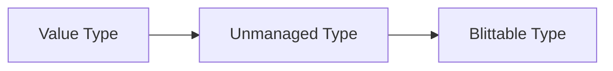

# Unity

## 介绍

### 安装配置

找到官网下载页面，选择从 Unity Hub 下载。首先会下载 Unity Hub 即安装器

```embed
title: "Unity官方下载_Unity新版_从Unity Hub下载安装 | Unity中国官网"
image: "https://unity-web-prd.cdn.unity.cn/images/logo-new.png"
description: "从Unity Hub下载安装Unity新版本、稳定版本（LTS）、技术更迭版、补丁、Beta版等所有版本的Unity。初学者和业余爱好者通过官方Unity Hub安装个人版，可以免费激活Unity许可证！通过Hub管理多版本Unity 兼容。"
url: "https://unity.cn/releases"
```

然后通过 Unity Hub 下载不同版本的编辑器，注意设置安装位置。


### 文档说明

在菜单中"Help-Unity Manual"可以打开本地文档。


### 窗口布局

默认窗口布局

- Hierarchy 层级窗口
- Scene 场景窗口，3D 视图窗口
- Game 游戏播放窗口
- Inspector 检查器窗口，属性窗口
- Project 项目窗口
- Console 控制台窗口

在菜单中找到 "Window-Layouts-Default" 恢复默认布局。


#### Hierarchy 

节点管理器，列出所有物体

![[image-20250311004804725.png]]


#### Scene/Game

显示场景/游戏

![[image-20250311004903372.png]]


#### Inspector

显示被选中物体信息

![[image-20250311004941361.png]]


#### Project/Console

项目窗口，显示各种模型、脚本等脚本/显示调试信息

![[image-20250311005026845.png]]


#### 偏好设置

在 "Edit-Preferences" 中设置界面

![[image-20250311005337553.png]]


### 默认场景

创建项目时，默认创建 SampleScene 场景，位于

- Project 窗口，Assets-Scenes-Sample Scene
- Hierarchy 窗口，Sample Scene

默认场景中，只有一个主摄像机和平行光源。


### 基本操作
#### 创建物体

可以在菜单“GameObject”中创建物体，也可以在 Hierarchy 窗口右键创建。创建的物体会出现在视野中心。

![[image-20250313195104401.png]]


#### 控制物体

##### 选中

被选中的物体会显示橙色轮廓

![[image-20250313195310176.png]]

在左侧边栏可以切换操作模式，默认为 Move Tool，选中物体时会显示操作轴

![[image-20250313195538742.png]]


##### 移动

选中物体后，可以在右侧面板修改物体位置。点击右上角的点，选择"Reset"就会将坐标归零

![[image-20250313202734587.png]]


##### 旋转

在左侧边栏切换到旋转模式，可以绕物体中心旋转。当一个轴向外时，顺时针旋转为正，逆时针旋转为负（左手坐标系）

![[image-20250313202916704.png]]


##### 缩放

在左侧边栏切换到缩放模式，可以在一个轴上缩放物体。

![[image-20250313203751226.png]]


##### 隐藏

在右侧面板取消勾选就可以隐藏物体

![[image-20250313204508702.png]]


##### 快捷操作

鼠标放在右侧面板的标签上可以左右拖动改变数值；快捷键

- Q 视图
- W 移动
- E 旋转
- R 缩放

注意到这些键都在第一排。


### 场景

可以设置坐标网格是否显示

![[image-20250313195837399.png]]

右上角勾选"Skybox"就可以显示天空盒

![[image-20250313200027679.png]]

点击右上角的球可以调出渲染相关的菜单；可以选择不同的 Shading Mode

![[image-20250313232528253.png]]


#### 视图

启用 `2D` 标签就会进入 2D 视图，无法旋转视图

![[image-20250313214343832.png]]


基本视图操作主要通过按下 `Alt` 键控制；右上角的操作轴可以点击切换视图；如果想要恢复 y 轴向上，按住 `Shift` 键再点击中心方块即可

![[image-20250313200419789.png]]

通常视图都是**透视视图**，只有当需要对齐物体时才使用**正交视图**，只需要点击"Persp"就可以切换

![[image-20250313201615925.png]]

右键点击中心方块可以选择视图

![[image-20250313204957613.png]]

点击相机图标可以设置透视。例如 Field of View 表示广角，广角越小，视图畸变越小

![[image-20250313201718279.png]]


#### 聚焦操作

如果希望聚焦某一个物体，绕着该物体旋转，先按 `F` 将物体聚焦到视野中心，然后 `Alt + LButton` 旋转。


#### 父子节点

将一个节点拖放到另一个节点上就可以构建父子关系。子节点的所有坐标都是相对于父节点的坐标，因此子节点 Reset 位置后会回到父节点的中心位置。

![[image-20250314003934989.png]]


#### 空物体

可以创建 Empty Object，右键"Create Empty"

![[image-20250314004329613.png]]

空物体的作用之一就是作为一个父节点管理组件。例如用一个空物体管理两个组件，将两个组件都 Reset，然后调整好位置，这样就可以通过空物体变换来统一对两个组件的变换。

![[image-20250314004620481.png]]


#### 坐标系

操作时默认为 Local 模式，如果旋转物体，那么操作轴也会随之变换，即为物体的局部坐标轴；切换到 Global 模式则操作轴始终以世界坐标轴一致。

![[image-20250314004820641.png]]


#### 轴心与中心

轴心 Pivot 模式以建模时选择的物体中心为原点；中心 Center 模式以物体的几何中心为原点。

![[image-20250314005156056.png]]


#### 相机

点击场景中的相机，可以在右下角看到游戏视角，同时在场景中修改相机的位置、转动。在场景中可以自由调整视角，如果希望相机使用当前视角，在菜单中找到"Align With View"即可。

![[image-20250314011307490.png]]


### 组件

组件代表一个功能，例如

- Light 光源
- Mesh Filter 网格过滤器
- Mesh Renderer 网格渲染器

点击物体时，会在右侧面板显示物体当前具有的所有组件。


#### 增删组件

点击最下方的"Add Component"添加新的组件；在组件的右上方弹出菜单选择"Remove Component"删除组件。

![[image-20250314005837265.png]]

对于一个空物体，首先可以添加 Mesh Filter 组件，将网格拖放过来得到网格信息；再添加 Mesh Renderer 组件，指定渲染信息，将材质拖放过来。这样就从空物体开始得到一个具有渲染效果的物体

![[image-20250314010241491.png]]


#### AudioSource 组件

为空物体添加一个 AudioSource 组件，然后将项目中的音乐文件拖放到右侧的 AudioClip 中，最后在上方开启声音就可以听到音乐。

![[image-20250314010522291.png]]


### Rider

Rider 为 Unity 提供强大的支持，包括 Unity 快速修复、上下文检查、着色器文件代码补全和语法高亮显示、调试 Unity 脚本、运行和调试 Unity 测试、分析 Unity 游戏、刷新资源等。


#### 启用 Unity Support 插件

打开 Unity 设置，选择 Plugins，勾选 Unity Support

![[image-20250616105043397.png|500]]


#### 安装 Rider Editor

在 Unity 中，打开“Window-Package Manager”并切换到“Unity Registry”，搜索安装 Rider Editor

![[image-20250616105146191.png|500]]


#### 将 Rider 用于 Unity

用 Unity 打开项目，在“Edit-Preferences”中修改“External Script Editor”为 Rider

![[image-20250616105336129.png|500]]

然后在 Project 视图中右键“Open C# Project”或者双击 Unity 脚本就会自动打开 Rider

![[image-20250616105554960.png|500]]


#### 开启自动刷新

需要在“Edit-Preferences-General”开启“Auto Refresh”才能实时修改脚本

![[image-20250619185708907.png|500]]


#### 开启调试

如果需要通过断点调试，需要在上方工具栏选择“Attach to Unity Editor”

![[image-20250620112618873.png]]


#### 刷新问题

Unity 本身自动刷新可能产生问题。如果 Unity 工程很大，每次重新获得焦点都刷新就会很卡。如果同时使用 Rider，默认重新获得焦点也会自动刷新。最好将两个刷新都关闭：在 Rider 设置中关闭前两个刷新选项

![[image-20250811102035659.png]]


### 打包测试

#### 测试环境配置

打包测试时，首先可以在“Edit-Project Settings-Player”中设置构建名和版本号

![[image-20250624191921986.png]]

在“Edit-Preferences”中配置依赖环境

![[image-20250624192009892.png]]

在“Player”中设置“Scripting Backend”为“IL2CPP”

![[image-20250808164018656.png]]

>[!note]
>有时还需要切换“Target Architectures”为"ARM64"以支持更多平台。

最后，在“File-Build Settings”中添加测试场景，勾选“Development Build”，点击“Build And Run”。注意构建时需要 USB 连接测试机，并且开启开发者选项中的 USE 调试。

![[image-20250624192035074.png|500]]


#### 获得测试输出

在“Editor”中选择对应 IP 地址即可

![[image-20250626170345704.png]]


#### 性能测试

使用“Window-Analysis-Profiler”做性能测试。选择要测试的 Editor，然后在 CPU Usage 中选择一帧就可以看到每帧的函数调用情况。最上方的按钮可以控制暂停、选择单独的帧。

![[image-20250627123910886.png]]

可以在右上角的选项中找到“Preferences”设置记录帧数，建议 3000 帧以上。


在“Window-Package Manager”中搜索“Profiler Analyzer”，点击“Pull data”可以从 Profiler 中拉取数据

![[image-20250627123827436.png]]


### 文件位置

#### 脚本位置

脚本放在 Scripts 文件夹下。


#### 编辑器位置

继承自 EditorWindow 的编辑器窗口脚本放在 Editor 文件夹下。如果放在 Scripts 文件夹下，调试编译不会有问题；但是如果要打包项目，就可能编译报错。


## 资源

在 Project 窗口中会显示各种资源 Assets 和包 Packages 。常见资源包括

- 模型 `.fbx`
- 图片
- 音频
- 脚本 `.cs`
- 材质 `.mat`
- 场景文件 `.unity`


### 材质

#### 颜色材质

我们可以创建一个文件夹用来保存材质，然后再创建新材质

![[image-20250313233330004.png]]

拉动右下角的滑杆调整显示大小，然后可以设置 Albedo (反照率) 作为漫反射颜色。完成后可以将材质直接拖放到物体上设置；如果想要设置新的材质，直接拖放新的材质就可以覆盖。

![[image-20250313233530210.png]]

设置完成后可以在右侧面板中看到物体的材质信息。我们可以直接将材质拖放到该面板的材质位置，就可以指定新的材质。

![[image-20250313233817106.png]]


#### 纹理图像

可以将图片拖入项目，然后将其拖放到 Albedo 前的方框中，这样就会加载为纹理图像；如果需要取消纹理，点击前面的方框删除即可。

![[image-20250313234554731.png]]


#### 外部模型

Unity 的标准模型格式为 FBX 格式，拖放到项目中后，可以看到它包含网格、材质和贴图，将模型拖放到场景中使用。

![[image-20250313235217801.png]]


#### 背面剔除

在 Unity 中背面默认不会被渲染，例如下面的开口立方体，在内侧观察无法看到面

![[image-20250313235656209.png]]


#### 默认材质

物体默认具有材质，如果点击面板中的材质删除，将会呈现出全紫色效果（注意不要点击减号，否则物体会消失）

![[image-20250313235929882.png]]


#### FBX 文件

要使用 FBX 文件，将其拖放到项目资源文件夹中，然后拖放到场景中。

- 选中物体，可以在右侧面板点击"Select"，这样会在 Project 界面中自动跳转到文件所在的位置
- 同理点击右侧面板中的材质，也会自动跳转到材质所在的位置

![[image-20250314000357282.png]]

FBX 模型的贴图默认应该放在与模型相同的路径下，或者在该目录下的 Textures 子目录下。


一个模型具有的多个材质会在右侧面板中列出

![[image-20250314000710992.png]]


#### 重映射材质

外部导入的模型材质不能直接修改，因此需要在 Project 中选择模型，右侧面板找到"Materials"，下方有一个 Remap 面板，将自定义的材质拖放到下面的材质中，点击"Apply"即可重映射；如果希望取消，点击"Revert"取消重映射。

![[image-20250314001249585.png]]


#### 解压材质

如果希望修改外部材质，可以在右侧面板切换到"Use External Materials (Legacy)"，点击"Apply"会将材质解压到模型所在目录下，这时候就可以修改目录下的材质。

![[image-20250314001559376.png]]


### 资源包

可以将项目中的文件夹导出为资源包供其它项目使用。右键文件夹，选择"Export Package"

![[image-20250314002909887.png]]


### 预置体

#### 导出预置体

我们可以将已经创建的物体及其附加的脚本导出为预置体 Prefab，只需要将节点拖动到文件夹中即可。现在就得到了预置体，可以任意地将其拖放到场景中得到新的物体，并且还具有对应的脚本（预置体只是记录节点信息，只有对纹理、贴图等信息的引用）。右键预置体可以导出为包，以供其它项目使用。

![[image-20250314214526474.png]]


#### 预置体实例

通过预置体生成的实例完全相同；预置体节点标记为蓝色，并且在右侧面板会显示 `Prefab` 属性

![[image-20250314214914818.png]]

右键"Prefab-Unpack"即可解除预置体，将其变为正常的物体

![[image-20250314215100151.png]]


#### 编辑预置体

双击预置体可以进入编辑界面；点击左上角的返回键或者点击中间上方的"Scenes"即可返回场景。

![[image-20250314215226417.png]]

也可以原位编辑：点击右侧面板中的"open"即可开启编辑，此时其它物体将无法编辑。


如果直接修改物体，可以在右侧面板选择"overrides-Apply All"，如果不想修改，则选择"Revert All"即可。

![[image-20250314215808248.png]]


### 序列化对象


## 脚本

### 创建脚本

在 Project 中右键创建 `C#` 脚本，双击脚本文件会打开一个 VS 项目。初始会定义一个与文件名相同的类名

```cpp
using System.Collections;
using System.Collections.Generic;
using UnityEngine;

public class Simple : MonoBehaviour
{
    // Start is called before the first frame update
    void Start()
    {
        Debug.Log("Hello World");
    }

    // Update is called once per frame
    void Update()
    {
        
    }
}
```

重命名类名后文件名也会随之修改。修改脚本后，将脚本文件直接拖放到物体上（或者拖放到右侧面板最下方）就可以附加脚本

![[image-20250314012107666.png]]

点击最上方运行游戏就会执行脚本，此时在控制台可以看到具体输出结果

![[image-20250314012205395.png]]


### 物体信息

在继承类中包含了当前物体的实例，以及所有的组件。通过组件获得对应的信息，并可以修改信息。

>[!note]
>MonoBehaviour 是组件系统的核心，继承它的脚本才能作为组件挂载到 GameObject 上，并且它会自动实例化，无需手动创建。

```cpp
using System.Collections;
using System.Collections.Generic;
using UnityEngine;

public class Simple : MonoBehaviour
{
    // Start is called before the first frame update
    void Start()
    {
        Debug.Log("Hello World");

        // 当前附加脚本的物体
        GameObject obj = this.gameObject;
        string name = obj.name;
        Debug.Log("Object name: " + name);

        // 获得变换组件
        Transform tr = obj.transform;           // 当前类也有 this.transform 可用
        Vector3 worldPos = tr.position;         // 世界坐标
        Vector3 localPos = tr.localPosition;    // 局部坐标
        Debug.Log("Object's world position: " + worldPos);
        Debug.Log("Object's local position: " + localPos);

        // 修改局部坐标
        this.transform.localPosition = new Vector3(10, 10);
    }

    // Update is called once per frame
    void Update()
    {

    }
}
```


### 脚本错误

如果脚本编译错误，则不会正常执行。此时可以在最下方的通知栏看到错误提示。如果编译能够通过，但是运行出现问题，例如引用类型为 `null` 但是使用了其中的值，此时控制台也会报错。

![[image-20250314152817816.png]]


### 播放模式

点击播放按钮后，所有的修改都是调试，因此都无法保存，因此需要注意是否处于播放模式。


### 帧更新

#### Update

游戏开始时，会调用 `Start` 进行初始化。之后每一帧更新时，都会调用 `Update` 方法。

```cpp
using System.Collections;
using System.Collections.Generic;
using UnityEngine;

public class Simple : MonoBehaviour
{
    // Start is called before the first frame update
    void Start()
    {
        Debug.Log("Start ...");
    }

    // Update is called once per frame
    void Update()
    {
        Debug.Log("Frame is updated.");
    }
}
```

更新的帧率是不固定的，Unity 会尽量快速地更新。


#### Time

通过 `Time.deltaTime` 获得上次到这次更新的时间间隔

```cpp
using System.Collections;
using System.Collections.Generic;
using UnityEngine;

public class Simple : MonoBehaviour
{
    // Start is called before the first frame update
    void Start()
    {
        Debug.Log("Start ...");
    }

    // Update is called once per frame
    void Update()
    {
        Debug.Log("Frame is updated in " + Time.deltaTime + "s");
    }
}
```


可以在初始化时指定目标帧率，Unity 会尽量以该帧率运行

```cpp
using System.Collections;
using System.Collections.Generic;
using UnityEngine;

public class Simple : MonoBehaviour
{
    // Start is called before the first frame update
    void Start()
    {
        Debug.Log("Start ...");

        Application.targetFrameRate = 60;
    }

    // Update is called once per frame
    void Update()
    {
        Debug.Log("Frame is updated in " + Time.deltaTime + "s");
    }
}
```


### 物体运动

利用每帧时间间隔实现物体的匀速运动

```cpp
using System.Collections;
using System.Collections.Generic;
using UnityEngine;

public class Simple : MonoBehaviour
{
    // Start is called before the first frame update
    void Start()
    {
        Debug.Log("Start ...");
    }

    // Update is called once per frame
    void Update()
    {
        //Debug.Log("Frame is updated in " + Time.deltaTime + "s");
        Vector3 pos = this.transform.localPosition;
        pos.x += Time.deltaTime * 10;
        this.transform.localPosition = pos;
    }
}
```


#### Translate

可以用 Transform 组件中的 `Translate` 方法实现平移

```cpp
this.transform.Translate(Time.deltaTime * 10, 0, 0);
```

该方法有多个重载，例如

```cpp
this.transform.Translate(Time.deltaTime * 10, 0, 0, Space.World);	// 相对世界坐标
this.transform.Translate(Time.deltaTime * 10, 0, 0, Space.Self);	// 相对局部坐标
```


#### LookAt

如果希望一个物体朝向另一个物体运动，首先利用静态方法 `Find` 根据物体名称找到目标，然后调用当前物体的 `LookAt` 方法让局部 z 轴朝向目标。

```cpp
using System.Collections;
using System.Collections.Generic;
using UnityEngine;

public class SimpleLogic : MonoBehaviour
{
    // Start is called before the first frame update
    void Start()
    {
    	// Find 可以接收名称或路径
        GameObject flag = GameObject.Find("红旗");
        this.transform.LookAt(flag.transform);
    }

    // Update is called once per frame
    void Update()
    {
        float speed = 1;
        float distance = speed * Time.deltaTime;
        this.transform.Translate(0, 0, distance, Space.Self);
    }
}
```


#### Rotation

Unity 内部使用四元数表示旋转 rotation，并不建议直接修改。最好通过修改欧拉角（默认为角度制）实现

```cpp
this.transform.rotation;
this.transform.eulerAngles = new Vector3(0, 45, 0);			// 全局欧拉角
this.transform.localEulerAngles = new Vector3(0, 45, 0);	// 局部欧拉角
```

使用 `Rotate` 方法旋转物体

```cpp
float speed = 60;
this.transform.Rotate(0, Time.deltaTime * speed, 0, Space.World);
```

可以获得父物体，并让父物体转动，这样子物体随着父物体转动

```cpp
Transform transform = this.transform.parent;
```

于是我们可以建立节点关系

- 系统
	- 地球
	- Moon
		- 卫星

注意到卫星没有直接作为地球的子节点，目的是可以分开调节地球的自转和卫星的公转。如果两者建立父子关系，那么地球自转就会影响到卫星公转。然后分别创建脚本

```cpp
// 地球转动
public class Earth : MonoBehaviour
{
    // Start is called before the first frame update
    void Start()
    {

    }

    // Update is called once per frame
    void Update()
    {
        this.transform.Rotate(0, Time.deltaTime * 120, 0, Space.Self);
    }
}

// 卫星转动
public class Moon : MonoBehaviour
{
    // Start is called before the first frame update
    void Start()
    {

    }

    // Update is called once per frame
    void Update()
    {
        this.transform.parent.Rotate(0, Time.deltaTime * 30, 0, Space.Self);
    }
}
```

![[image-20250314142935843.png]]


#### 跟随视角

选中物体，在菜单中选择"Lock View to Selected"，然后在播放模式下**切换到 Scene 视图**就可以跟随物体运动。

![[image-20250314021017446.png]]


### 脚本运行

场景加载过程为

1. 创建节点 `GameObject node = new GameObject()`
2. 实例化组件 `MeshRenderer comp = new MeshRenderer()`
3. 实例化脚本组件 `Simple script = new Simple()`
4. 调用事件函数
	1. 初始化 `script.Start()`
	2. 帧更新 `script.Update()`


#### 消息函数

所有的脚本，一般应继承 `MonoBehaviour` 。常见的消息函数

- `Awake` 初始化，仅执行一次
- `Start` 初始化，仅执行一次
- `Update` 帧更新，每帧调用一次
- `OnEnable` 每当组件启用时调用
- `OnDisable` 每当组件禁用时调用

输入 `Awake` 会自动创建相应的消息函数。`Awake` 总是在 `Start` 之前调用，如果脚本组件被禁用，则 `Start` 不会调用，而 `Awake` 一定会调用

```cpp
public class Moon : MonoBehaviour
{
    private void Awake()
    {
        Debug.Log("Awake()");
    }

    // Start is called before the first frame update
    void Start()
    {
        Debug.Log("Start()");
    }

    // Update is called once per frame
    void Update()
    {

    }
}
```


#### 执行顺序

首先依次调用所有脚本的 `Awake` 消息函数，然后调用所有脚本的 `Start` 消息函数... 脚本之间没有任何执行优先级区别。如果需要执行执行优先级，可以在"Edit-Project Settings"中拖放调整顺序，或者添加脚本执行优先级。

![[image-20250314145947566.png]]


#### 事件循环

在本地文档中可以找到关于事件函数的调用循环

![[image-20250314205736047.png]]


### 主控脚本

主控脚本，即游戏的主控逻辑。创建一个空节点作为主控节点，然后附加一个主控脚本，用来进行全局设置

![[image-20250314150552586.png]]

例如设置程序帧率

```cpp
public class MainLogic : MonoBehaviour
{
    private void Awake()
    {
        Application.targetFrameRate = 60;
    }

    // Start is called before the first frame update
    void Start()
    {

    }

    // Update is called once per frame
    void Update()
    {

    }
}
```


### 脚本参数

#### 字段

当我们在脚本类中添加公共字段时，就会在右侧面板中显示该字段的值。

```cpp
public class Moon : MonoBehaviour
{
	// 转动速度
    public int speed = 60;

    // Start is called before the first frame update
    void Start()
    {
        Debug.Log("Start()");
    }

    // Update is called once per frame
    void Update()
    {
        this.transform.parent.Rotate(0, Time.deltaTime * speed, 0, Space.Self);
    }
}
```

可以修改显示的默认值，包括在播放模式下实时修改参数；在右上角弹出菜单 Reset 恢复默认值。


#### 注解

还可以利用 `C#` 特性添加字段注解

```cpp
public class Moon : MonoBehaviour
{
	// 注解
    [Tooltip("角速度")]
    public int speed = 60;

    // Start is called before the first frame update
    void Start()
    {
        Debug.Log("Start()");
    }

    // Update is called once per frame
    void Update()
    {
        this.transform.parent.Rotate(0, Time.deltaTime * speed, 0, Space.Self);
    }
}
```

此时将鼠标放到 `Speed` 标签上就会显示注解内容。

![[image-20250314151254595.png]]


#### 目标物体

除了一般的基础类型，还可以将 `Vector3, Color` 甚至是 `GameObject` 作为字段显示在面板中

```cpp
public class Moon : MonoBehaviour
{
    public Vector3 position = new Vector3(10, 0, 0);
    public Color color = new Color(10, 0, 0);
    public GameObject targetObject = null;

    // Start is called before the first frame update
    void Start()
    {
        Debug.Log("Start()");
    }

    // Update is called once per frame
    void Update()
    {

    }
}
```

可以将物体拖放到属性位置设置值

![[image-20250314152559907.png]]


#### 运行时调试

在播放模式下进行调试时，可能会选择到一个比较合适的参数。想要保存这一参数，可以在右上角弹出菜单选择"Copy Component"，然后退出播放模式，再选择"Paste Component Values"即可。

![[image-20250314153231189.png]]


### 鼠标键盘输入

#### 鼠标信息

鼠标输入通过 `Input` 组件获得

- `Input.GetMouseButtonDown()` 对应按钮是否按下
- `Input.GetMouseButtonUp()` 对应按钮是否松开
- `Input.GetMouseButton()` 对应按钮是否正在按下

首先给出下面这段鼠标消息检测

```cpp
void Update()
{
    if (Input.GetMouseButtonDown(0))
    {
        Debug.Log("Button Down");
    }
    if (Input.GetMouseButtonUp(0))
    {
        Debug.Log("Button Up");
    }
}
```

想要看到更多用法，可以鼠标悬停在函数上，快捷键 `Alt + O` 打开 GitHub 示例。


获得鼠标点击位置

```cpp
Debug.Log("Button Down at " + Input.mousePosition);
```

在 Unity 中，屏幕坐标以左下角为原点。


#### 坐标转换

通过 `Camera` 组件进行空间坐标与屏幕坐标之间的转换；通过 `Screen` 组件获得屏幕信息

```cpp
Vector3 worldPos = transform.position;
Vector3 screenPos = Camera.main.WorldToScreenPoint(worldPos);

if (screenPos.x < 0 || screenPos.x > Screen.width)
{
    Debug.Log("Not in the screen");
}
```

注意返回 3 维坐标，其中 z 坐标表示到摄像机的距离。


#### 键盘信息

键盘信息通过 `Input` 组件获得

- `Input.GetKeyDown()` 对应按键是否按下
- `Input.GetKeyUp()` 对应按键是否松开
- `Input.GetKey()` 对应按键是否正在按下

按键用 `KeyCode` 字段表示

```cpp
if (Input.GetKeyDown(KeyCode.X))
{
    Debug.Log("KeyCode X is Down");
}
```


#### 简单控制

我们可以简单设计一个控制方法，用 `F` 表示飞起，`D` 表示下落

```cpp
public class FlyLogic : MonoBehaviour
{
    // Start is called before the first frame update
    void Start()
    {

    }

    // Update is called once per frame
    void Update()
    {
    	// 用 GetKey 获得当前按键状态，确保长按连续移动
        float speed = 10.0f;
        if (Input.GetKey(KeyCode.F))
        {
            if (this.transform.position.y < 10)
                this.transform.Translate(0, speed * Time.deltaTime, 0);
        }
        if (Input.GetKey(KeyCode.D))
        {
            if (this.transform.position.y > 0)
                this.transform.Translate(0, -speed * Time.deltaTime, 0);
        }
    }
}
```


### 组件调用

#### 获得组件

假设我们现在为一个物体附加了 `Audio Source` 组件，查看右侧面板。注意到"Play On Awake"被勾选，此时音乐资源会在 `Awake` 方法调用时开始播放。我们可以取消勾选，选择在代码中实现播放效果。

![[image-20250314170119691.png]]

通过 `this.GetComponent<>()` 获得想要的组件

```cpp
void Update()
{
    if (Input.GetMouseButtonDown(0))
    {
        Debug.Log("Play Music");
        AudioSource audio = this.GetComponent<AudioSource>();
        audio.Play();
    }
}
```

>[!note]
>组件名称与面板中显示的组件名一致，因此想要获得什么组件，只需要查看一下物体具有的组件名。


#### 引用组件

有时可能想要获得其它物体中的组件，有几种方法

- 保存其它物体实例，将其它物体拖放到面板中，然后访问物体中的组件
- 保存组件类型引用，将想获得的组件拖放到面板中，然后可以直接使用

可以通过物体直接获得其它的脚本组件

```cpp
public class Earth : MonoBehaviour
{
	// 保存另一个物体
    public GameObject moonNode = null;

    // Start is called before the first frame update
    void Start()
    {

    }

    // Update is called once per frame
    void Update()
    {
    	// 通过物体获得其脚本组件
        Moon moon = moonNode.GetComponent<Moon>();
        moon.position = new Vector3(10, 10, 0);
    }
}
```

甚至可以直接保存其它脚本组件，将物体拖放到组件框中，Unity 会自动获得其下的脚本组件并赋值

```cpp
public class Earth : MonoBehaviour
{
    public Moon moonNode = null;

    // Start is called before the first frame update
    void Start()
    {

    }

    // Update is called once per frame
    void Update()
    {
        moonNode.position = new Vector3(10, 10, 0);
    }
}
```


### 消息调用

可以通过 `SendMessage` 调用指定名称的函数，也就是反射技术

```cpp
public class Earth : MonoBehaviour
{
    public GameObject moonNode = null;

    // Start is called before the first frame update
    void Start()
    {

    }

    // Update is called once per frame
    void Update()
    {
    	// 调用 Moon 脚本中的 DoSomething 函数
        moonNode.SendMessage("DoSomething");
    }
}
```


### 获取物体

#### Find

可以使用 `Find` 查找物体，但是执行效率低且容易出错

```cpp
GameObject obj = GameObject.Find("Main");			// 按名称查找
GameObject obj = GameObject.Find("Main/无人机");		// 按节点路径查找
```

	

#### 父子物体

通过 `Transform` 组件获得父节点

```cpp
GameObject parent = this.transform.parent.gameObject;
```

遍历组件可以获得所有子变换，进而获得子节点

```cpp
foreach (Transform child in this.transform)
{
    Debug.Log(child.gameObject.name);
}
```

或者通过索引或名称获得

```cpp
GameObject obj1 = this.transform.GetChild(0).gameObject;
GameObject obj2 = this.transform.Find("无人机").gameObject;
```

这里 `Find` 只能查找一级子节点，使用路径查找更深层的节点。


通过 `Transform` 设置可以设置父节点

```cpp
Transform trans = this.transform.Find("无人机");
if (trans != null)
{
    Debug.Log("Set Parent");
    this.transform.SetParent(trans);
}

// 设为一级节点
this.transform.SetParent(null);
```


#### 显示/隐藏

使用 `activeSelf` 判断显示状态；使用 `SetActive` 设置显示/隐藏。

```cpp
if (this.gameObject.activeSelf)
{
    this.gameObject.SetActive(false);
}
```


### 处理资源

#### 音频资源

Unity 中 `AudioClip` 用于处理音频数据，`AudioSource` 用于处理音频播放。我们创建一个 `AudioSource` 组件，并不直接附加音频资源，而是通过一个脚本处理 `AudioClip` 资源。

```cpp
public class AudioTest : MonoBehaviour
{
    // 音频资源
    public AudioClip audioClip;

    // Start is called before the first frame update
    void Start()
    {
        AudioSource source = this.GetComponent<AudioSource>();
        source.PlayOneShot(audioClip);
    }

    // Update is called once per frame
    void Update()
    {

    }
}
```

![[image-20250314203400585.png]]


#### 资源数组

在组件中保存一个数组字段，用于批量处理

```cpp
public class AudioTest : MonoBehaviour
{
    // 音频资源
    public AudioClip[] audioClips;

    // Start is called before the first frame update
    void Start()
    {

    }

    // Update is called once per frame
    void Update()
    {

    }
}
```


### 定时器

#### 设置定时器

定时器继承自 `MonoBehavior` 类

- `Invoke` 只调用一次
- `InvokeRepeating` 循环调用
- `IsInvoking` 判断是否正在调用
- `CancelInvoke` 取消调用

直接在类内使用定时器，传入函数名和调用间隔

```cpp
public class Earth : MonoBehaviour
{
    // Start is called before the first frame update
    void Start()
    {
        Invoke("DoSomething", 1);				// 1 秒后调用
        InvokeRepeating("DoSomething", 1, 2);	// 1 秒后调用，之后每 2 秒调用一次
    }

    // Update is called once per frame
    void Update()
    {

    }

    void DoSomething()
    {
        Debug.Log("Do Something");
    }
}
```

>[!note]
>Unity 核心是单线程，定时器不需要考虑线程问题。


#### 取消定时器

由于重复设置定时器可能导致过于频繁的调用，因此最好判断定时器是否已经设置。

- `IsInvoking` 判断函数是否已经在 `Invoke` 队列
- `CancelInvoke(func)` 取消函数定时器
- `CancelInvoke()` 取消当前脚本的所有定时器


### 向量

向量的基本操作可以直接看提示。关键在于静态常量

```cpp
Vector3.right;		// 1 0 0
Vector3.up;			// 0 1 0
Vector3.forward;	// 0 0 1
```

更多静态常量和方法 `Dot, Cross` 都需要通过 `Vector3` 访问。


### 创建实例

#### 创建子弹

可以利用预置体配合 `Instantiate` 方法批量创建同类物体

```cpp
using System.Collections;
using System.Collections.Generic;
using UnityEngine;

public class FireLogic : MonoBehaviour
{
    public GameObject bulletPrefab;		// 保存子弹预置体（对象）
	public Transform bulletFolder;		// 用于保存子弹的节点

    // Start is called before the first frame update
    void Start()
    {

    }

    // Update is called once per frame
    void Update()
    {
        if (Input.GetMouseButtonDown(0))
        {
            Fire();
        }
    }

    void Fire()
    {
        Debug.Log("Create Bullet");

		// 创建 bulletPrefab 的实例，放置在 bulletFolder 下
        GameObject node = Object.Instantiate(bulletPrefab, null);
        node.transform.position = Vector3.zero;
        node.transform.localEulerAngles = Vector3.zero;
    }
}
```

创建两个空节点，其中一个用于执行 `Fire` 脚本，另一个用于保存子弹。将它们分配到脚本的两个参数中，现在鼠标左键可以创建子弹。

![[image-20250314221815091.png]]


#### 设置出生点

虽然可以指定出生位置，但是数值并不直观。我们可以创建一个空节点，移动到想要的位置，然后获得这个位置。

![[image-20250314224211433.png]]

将创建好的 `FirePoint` 拖放到右侧面板，Unity 自动获取其 `Transform` 对象。

```cpp
using System.Collections;
using System.Collections.Generic;
using UnityEngine;

public class FireLogic : MonoBehaviour
{
    public GameObject bulletPrefab;		// 保存子弹预置体（对象）
    public Transform firePoint;			// 出生点位置
    public Transform bulletFolder;		// 用于保存子弹的节点

    // Start is called before the first frame update
    void Start()
    {

    }

    // Update is called once per frame
    void Update()
    {
        if (Input.GetMouseButtonDown(0))
        {
            Fire();
        }
    }

    void Fire()
    {
        Debug.Log("Create Bullet");

        // 创建子弹实例
        GameObject node = Object.Instantiate(bulletPrefab, bulletFolder);
        node.transform.position = firePoint.position;             // 修改出生点
        node.transform.localEulerAngles = firePoint.eulerAngles;  // 修改欧拉角

        // 通过子弹对象获得其脚本组件
        BulletLogic bulletLogic = bulletPrefab.GetComponent<BulletLogic>();
        bulletLogic.speed = 10.0f;
    }
}
```

为了让子弹能够发射，还需要为子弹设置脚本逻辑

```cpp
using System.Collections;
using System.Collections.Generic;
using UnityEngine;

public class BulletLogic : MonoBehaviour
{
    public float speed;

    // Start is called before the first frame update
    void Start()
    {

    }

    // Update is called once per frame
    void Update()
    {
        this.transform.Translate(0, 0, speed * Time.deltaTime, Space.Self);
    }
}
```

还有炮台旋转的简单逻辑

```cpp
using System.Collections;
using System.Collections.Generic;
using UnityEngine;

public class RotateLogic : MonoBehaviour
{
    // Start is called before the first frame update
    void Start()
    {

    }

    // Update is called once per frame
    void Update()
    {
        float speed = 60.0f;
        if (Input.GetKey(KeyCode.W))
        {
            this.transform.Rotate(-Time.deltaTime * speed, 0, 0);
        }
        if (Input.GetKey(KeyCode.S))
        {
            this.transform.Rotate(Time.deltaTime * speed, 0, 0);
        }
        if (Input.GetKey(KeyCode.A))
        {
            this.transform.Rotate(0, -Time.deltaTime * speed, 0);
        }
        if (Input.GetKey(KeyCode.D))
        {
            this.transform.Rotate(0, Time.deltaTime * speed, 0);
        }
    }
}
```


#### 销毁子弹

我们可以通过 `Object.Destroy` 销毁物体，设置定时器，当子弹飞行一段时间后自动销毁。

```cpp
public class BulletLogic : MonoBehaviour
{
    public float speed;
    public float maxDistance;

    // Start is called before the first frame update
    void Start()
    {
        Invoke("SelfDestroy", maxDistance / speed);
    }

    // Update is called once per frame
    void Update()
    {
        this.transform.Translate(0, 0, speed * Time.deltaTime, Space.Self);
    }

    void SelfDestroy()
    {
    	// 删除保存的物体
        Object.Destroy(this.gameObject);
    }
}
```

>[!note]
>调用 `Destroy` 不会立即销毁物体，而是在 `Update` 之后销毁，因此可以在调用 `Destroy` 后执行其它操作。


## 物理系统

### 刚体碰撞

为物体添加 `Rigidbody` 组件，此时进入播放模式，物体就会默认受到重力影响；添加 `Collider` 组件就可以实现碰撞检测

![[image-20250314225807301.png]]

我们为两个物体添加 `Box Collider` 用于碰撞检测，为炮塔添加 `Rigidbody` 用于模拟下落。进入播放模式，可以看到炮塔落在平面上。

![[image-20250314230923742.png]]


## 动画系统

### 寻找资源

首先在"Window-Asset Store"中寻找人物资源，例如 Robot Kyle

```embed
title: "Robot Kyle | URP | 3D Robots | Unity Asset Store"
image: "https://assetstorev1-prd-cdn.unity3d.com/key-image/4e01a874-d13b-47f4-aaa7-67ccb45018c6.jpg?v=1"
description: "Elevate your workflow with the Robot Kyle | URP asset from Unity Technologies. Find this & other Robots options on the Unity Asset Store."
url: "https://assetstore.unity.com/packages/3d/characters/robots/robot-kyle-urp-4696"
```

以及动作资源

```embed
title: "Human Basic Motions FREE | 3D Animations | Unity Asset Store"
image: "https://assetstorev1-prd-cdn.unity3d.com/key-image/85390960-51be-4933-9ef1-1033330768a6.jpg?v=1"
description: "Elevate your workflow with the Human Basic Motions FREE asset from Kevin Iglesias. Find this & other Animations options on the Unity Asset Store."
url: "https://assetstore.unity.com/packages/3d/animations/human-basic-motions-free-154271"
```


### 创建场景

下载后将其导入项目，找到模型拖入场景

![[image-20250707112530285.png]]

然后要添加动画，首先可以找到动画文件，点击三角形的图标可以看到动作效果，还可以播放动作

![[image-20250707112750683.png]]


### 绑定骨骼

点击模型，查看右侧的模型信息。将"Rig"栏下的"Animation Type"改为"Humanoid"，"Avatar Definition"改为"Create From This Model"，最后点击"Apply"完成骨骼绑定。

![[image-20250707113053332.png]]

可以点击右侧的"Configure"查看骨骼信息是否正确。右边示意图中，实线圆圈表示必备，虚线圆圈可有可无

![[image-20250707113313644.png]]


### 创建控制器

点击场景中的机器人，右侧看到"Animator"的"Controller"是"None"

![[image-20250707113512038.png]]

右键创建"Animation Controller"然后附加到人物上

![[image-20250707113645090.png]]


### 编辑动画

点击"Window-Animation-Animator"进入动画编辑器。将想使用的动作拖入状态机，右键"Make Transition"来连接状态

![[image-20250707140902347.png]]

在左侧面板添加"Speed"参数，然后点击状态机中的箭头，右侧设置转换条件

![[image-20250707141039981.png]]


### 控制脚本

设置好状态跳转后，添加控制脚本。根据移动向量模长确定 Animator 中的速度信息

```csharp
using System.Collections;
using System.Collections.Generic;
using UnityEngine;

public class Chaove : MonoBehaviour
{
    public float speed = 3f;
    private Animator anim;
    
    // Start is called before the first frame update
    void Start()
    {
        anim = GetComponent<Animator>();
    }

    // Update is called once per frame
    void Update()
    {
        float x = Input.GetAxis("Horizontal");
        float z = Input.GetAxis("Vertical");

        Vector3 Move = new Vector3(x, 0, z);
        transform.LookAt(transform.position + Move);
        transform.position += Move * Time.deltaTime * speed;
        
        anim.SetFloat("Speed", Move.magnitude);
    }
}
```


### Root Motion

制作动画时，通常会自带有速度，便于让移动速度与角色动作自动匹配。注意右侧的"Apply Root Motion"，勾选这个选项，在播放动画时就会自带一个速度

![[image-20250707142457560.png]]


### Exit Time

注意到这时虽然可以控制移动，但是动画之间的切换不流畅，这是因为默认会完成当前动画后再切换状态，因此需要取消"Has Exit Time"

![[image-20250707142105574.png]]


### 文件格式

动画文件 `.anim` 中保存了变换曲线，曲线离散为关键帧。包括

|曲线类型|数据内容|典型用途|
|---|---|---|
|`m_PositionCurves`|位置（Vector3）|物体移动|
|`m_RotationCurves`|四元数旋转|平滑旋转|
|`m_ScaleCurves`|缩放（Vector3）|物体尺寸变化|
|`m_EulerCurves`|欧拉角旋转|编辑器调整|
|`m_FloatCurves`|浮点数值|材质/脚本参数|
|`m_PPtrCurves`|对象引用|2D精灵动画|


## JobSystem

JobSystem 管理一组多核中的工作线程(Work Thread)，为避免上下文切换通常一个逻辑核配一个工作线程。JobSystem 持有一个 Job 队列，工作线程从该队列中获取 Job 执行。Job 是执行特定任务的小工作单元，Job 可以互相依赖。


### 线程安全

#### 托管类型

JobSystem 执行时**复制而非引用数据**，避免了数据竞争，但 JobSystem 只能使用 `memcpy` 复制 blittable types 数据，这是 `.Net` 框架中的数据类型，该类型数据在托管代码与原生代码间传递无需转换，即**具有相同的内存表现**。

- 由于 `Vector3` 不是 Blittable 类型，使用 `Unity.Mathematics` 的 `float3` 替代，用 `math.mul(), math.rotate()` 等方法操作
- 旋转使用 ` quaternion `
- 使用 `bool4, char` 等替代类型

需要注意如下包含关系



值类型包括所有数值类型、bool、enum、struct；非托管类型用于 unsafe 上下文，它是值类型，不包含任何引用类型；Blittable 类型在托管内存和非托管内存中具有相同的二进制表示形式，包括

- 大多数数值类型 `byte, sbyte, short, ushort, int, uint, long, ulong, single, double`
- 包含非嵌套的 Blittable 类型的数组 `int[]`
- 只包含 Blittable 类型的 struct，且具有连续内存布局

不包括

- `bool` 它在 `c#` 中是 1 字节，但在非托管代码中可能是 4 字节（`Win32`）
- `char` 它在 `c#` 中是 2 字节 Unicode，但在非托管代码中可能是 1 字节 ANSI
- `string` 引用类型
- 包含上述类型的 struct


#### 结构数组

结构数组是为每种数据创建平行、等长的 NativeArray 。例如

```csharp
public struct BadStruct
{
	public int Health; 
	public NativeArray<Vector3> EntityPositions; 
}

public struct GoodStruct
{
	public NativeArray<int> EntityHealths; 
	public NativeArray<Vector3> EntityPositions; 
}
```

最好确保其中数组的长度相同。


#### NativeContainer

如果只是复制数据，则任务的结果也会是独立的，因此需要使用 NativeContainer 将结果保存在公共内存中。它以相对安全的托管方式指向非托管的内存地址，Job 可以直接访问主线程数据而非复制。它具有如下特点

- 需要内存分配器，脱离 GC 管理
- 线程安全
- 连续内存块
- Blittable 类型，保证内存布局
- 手动 `Dispose()` 释放内存

根据 Job 执行时长决定使用哪种 Allocator

- `Allocator.Temp` 最快的分配方法，适用于一帧或几帧时长，**不能将它分配的数据传给 Job**，当前方法 return 前需要 dispose
- `Allocator.TempJob` 适用于 4 帧时长。若 4 帧内没有调用 dispose，控制台会输出警告
- `Allocator.Persistent` 对 `malloc` 的包装，持续时间足够长，性能不足时不应当使用


默认情况下，Job 同时拥有 NativeContainer 的读写权限，但不能多个 Job 同时拥有一个 NativeContainer 的写权限，因此使用

```csharp
[ReadOnly]
public NativeArray<int> input;
```

说明只读权限，减少性能影响。


### 使用 Job

#### 创建 Job

首先要声明继承 IJob 接口的结构体，其中存放 blittable types 或 NativeContainer 数据，并实现 Execute 方法

```csharp
public struct MyJob : IJob
{
    public float a;
    public float b;
    public NativeArray<float> result;

    public void Execute()
    {
        result[0] = a + b;
    }
}
```


#### 调度 Job

只能在主线程调用 Schedule 方法，它将 Job 放入队列等待执行，此时 Job 将不能中断

```csharp
// 共享内存，用于存放结果
NativeArray<float> result = new NativeArray<float>(1, Allocator.TempJob);

// 填充数据
MyJob jobData = new MyJob();
jobData.a = 10;
jobData.b = 10;
jobData.result = result;

// 调度 Job
JobHandle handle = jobData.Schedule();

// 等待完成
handle.Complete();

// 释放 result array
result.Dispose();
```

>[!note]
>在 Schedule 后，NativeContainer 的所有权转移给 Job，在 Complete 调用前不能在主线程访问 NativeContainer，避免读写冲突。


#### 依赖关系

调用 Schedule 后会得到 JobHandle，它可以传入另一个 Job 的 Schedule，表示后者要等待前者完成再执行

```csharp
JobHandle firstJobHandle = firstJob.Schedule();
secondJob.Schedule(firstJobHandle);
```

如果有多个依赖关系，使用 `JobHandle.CombineDependencies` 组合被依赖的 JobHandle

```csharp
NativeArray<JobHandle> handles = new NativeArray<JobHandle>(numJobs, Allocator.TempJob);
JobHandle jh = JobHandle.CombineDependencies(handles);
```


#### 等待 Job

调用 Complete 后会阻塞主线程，等待对应的 Job 及其依赖完成，之后主线程可以访问 NativeContainer 获得结果。如果不需要访问数据，可以调用 ScheduleBatchedJobs 来主动要求任务开始执行，同时不会阻塞主线程。

>[!note]
>通常建议使用依赖关系隐式管理而非手动调用执行。


#### IJobParallelFor

一个 IJob 同一时间只能执行一个任务，如果想要同时执行多个相同任务，需要使用 IJobParallelFor

```csharp
struct IncrementByDeltaTimeJob: IJobParallelFor
{
    public NativeArray<float> values;
    public float deltaTime;

    public void Execute (int index)
    {
        float temp = values[index];
        temp += deltaTime;
        values[index] = temp;
    }
}
```

它可以在多核上对同一 NativeContainer 操作，根据传入的索引处理不同的部分。例如

```csharp
public struct MyParallelJob : IJobParallelFor
{
    [ReadOnly]
    public NativeArray<float> a;
    [ReadOnly]
    public NativeArray<float> b;
    public NativeArray<float> result;

    public void Execute(int i)
    {
        result[i] = a[i] + b[i];
    }
}

NativeArray<float> a = new NativeArray<float>(2, Allocator.TempJob);
NativeArray<float> b = new NativeArray<float>(2, Allocator.TempJob);
NativeArray<float> result = new NativeArray<float>(2, Allocator.TempJob);

a[0] = 1.1;
b[0] = 2.2;
a[1] = 3.3;
b[1] = 4.4;

MyParallelJob jobData = new MyParallelJob();
jobData.a = a;  
jobData.b = b;
jobData.result = result;

// 指定总任务长度和每批任务数量
JobHandle handle = jobData.Schedule(result.Length, 1);

// 等待任务完成
handle.Complete();
a.Dispose();
b.Dispose();
result.Dispose();
```

Job System 会将每批任务分配给不同的 Native Job 执行，当一个 Native Job 完成时，它会窃取其它 Job 的批任务，从而优化性能。


#### IJobParallelForTransform

专门用于操作 Transform 的 Parallel Job，使用特定的容器 TransformAccessArray 保存

```csharp
public struct MoveUpJob : IJobParallelForTransform
{
    public float DeltaTime;
    public float Speed;

    public void Execute(int index, TransformAccess transform)
    {
        transform.position += new float3(0, Speed * DeltaTime, 0);
    }
}

TransformAccessArray transformArray = new TransformAccessArray(transforms);
MoveUpJob job = new MoveUpJob { DeltaTime = Time.deltaTime, Speed = 5f };
JobHandle handle = job.Schedule(transformArray);
```


#### IJobFor

用于使用 Burst 编译器的优化，虽然它不是并行的，但是 Burst 可能将其优化得比手写 for 循环更好

```csharp
public struct CumulativeJob : IJobFor
{
    public NativeArray<float> Output;
    public void Execute(int i)
    {
        if (i > 0)
            Output[i] = Output[i-1] + 1; // 依赖前一个元素，必须串行
    }
}

// 调度方式
CumulativeJob job = new CumulativeJob { Output = outputArray };
JobHandle handle = job.Schedule(outputArray.Length, default(JobHandle));
```


### 注意事项

- 不使用 Job 访问静态数据
- 不更新 NativeContainer 内容
- 只在主线程调用 Schedule 和 Complete 方法
- 检查数据依赖：在 Profiler 窗口中，主线程上的 WaitForJobGroup 标记表明 Unity 在等待一个工作线程的任务完成，说明可能存在需要解决的数据依赖，可通过查找 `JobHandle.Complete` 找到这些依赖
- Debug 时可以调用 Run 方法取代 Schedule 在主线程执行 Job，这会阻塞主线程等待任务执行，但是无并行效果
- 不要在 Job 中分配托管内存


### 解除限制

#### 使用指针

如果一定要在 Job 中使用指针，可以使用标记

```csharp
[NativeDisableUnsafePtrRestriction]
public unsafe TriangleBoundJobData* datas;
```

这样可以直接将主线程数据放入子线程。


#### 并行写入

标记允许多个线程同时对一个内存地址写入

```csharp
[NativeDisableParallelForRestriction]
public NativeArray<MeshTriangleJobData> datas;
```


#### 分配内存

标记允许子线程分配内存

```csharp
public struct DataJob : IJobParallelFor  
{  
    [NativeDisableContainerSafetyRestriction]
    NativeArray<Vector3> data;

    public void Execute(int index)  
    {
    	data = new NativeArray<Vector3>(10, Allocator.Temp, NativeArrayOptions.UninitializedMemory);
    }
}
```


### 性能优化

使用 Burst 编译可以启用 SIMD 优化，且会进行循环展开、常量传播、内联等底层优化。只需要在结构体或静态方法上提供标记

```csharp
[BurstCompile]
public struct DataJob : IJobParallelFor  
{  
    [NativeDisableContainerSafetyRestriction]
    NativeArray<Vector3> data;

    public void Execute(int index)  
    {
    	data = new NativeArray<Vector3>(10, Allocator.Temp, NativeArrayOptions.UninitializedMemory);
    }
}
```

代码必须符合 Burst 的安全子集，避免使用托管类型、异常等。尽量使用 `Burst.Compatible` 的数学库。


### Debug

使用 Profiler 分析 Job 执行

```
Window -> Analysis -> Profiler -> Job Details
```

使用 `Debug.Log` 会报错，应当使用 `Unity.Collections.LowLevel.Unsafe.UnsafeUtility` 中的方法。通过 NativeArray 收集异常。


在 Unity Profiler 中的 Job Dependency Viewer 可以可视化 Job 之间的依赖关系和执行时间。使用性能分析标记

```csharp
using Unity.Profiling;

var marker = new ProfilerMarker("MyJob.Execute");
public void Execute(int index)
{
    using (marker.Auto())
    {
        // job code
    }
}
```
