# Obsidian

Obsidian 既是一个 Markdown 编辑器，也是一个知识管理软件。主要目的在于建立多重链接的知识网络。


## 基本介绍

### 创建保管库

可以将现有文件夹作为库打开，也可以创建新的保管库。


### 创建笔记

快捷键 `Ctrl + n` 创建新笔记。第一行的文件名，可以随意修改，文件名会自动变化。

![[image-20240423173301072.png]]


### 创建链接

用 `[[]]` 包围的内容是一个链接，其中的内容是对应笔记的标题甚至章节。直接点击链接将会跳转到对应的位置，建议按住 Ctrl 再点击，会打开一个新的界面。可以为不存在的文件创建链接，例如下面的 `Issac Newton` 是一个不存在的链接，可以点击创建对应的文件。

![[image-20240423174632335.png]]

使用 `|` 分隔，链接将会显示为后面的描述文字。

![[image-20240423230404287.png]]


### 添加标签

以 `#` 开头紧跟一串字符，就得到对应的标签。通过 `/` 分割创建子标签，支持对标签和子标签的搜索。

![[image-20240423220001352.png]]


### 添加属性

可以通过 `Ctrl + ;` 为文件添加属性，包括文件别名等。还可以自己添加属性，通过前面的图标设置属性的类型。

![[image-20240423221114160.png]]

所有属性通过 yaml 格式保存在文件开头。


### 附件

将附件拖放到笔记中，不能显示的格式会转换为链接；可以显示的格式，例如 pdf 就会渲染显示。

![[image-20240423220209532.png]]


### 标注

在引用格式的基础上，添加 `[!]` 标注，可以实现不同的标注样式。

![[image-20240423225605875.png]]

可以通过 `[!]-` 和 `[!]+` 来指定是否折叠内容；并且在后面接上描述，作为整个标注的标题。

![[image-20240423225846167.png]]


### 嵌入文件

#### 嵌入图像

使用 Wiki 格式 `![[]]` 来嵌入内部图像，通过 `![[Engelbart.jpg|100x145]]` 格式指定图像大小。


#### 嵌入音频

通过 `![[Excerpt from Mother of All Demos (1968).ogg]]` 格式嵌入音频。


#### 嵌入 PDF

通过 `![[Document.pdf]]` 格式嵌入 PDF 文件。还可以指定打开位置和显示高度

```markdown
![[Document.pdf#page=3]]
![[Document.pdf#height=400]]
```


#### 嵌入列表

在列表后面指定标识符

```markdown
- list item 1
- list item 2

^my-list-id
```

然后通过 `![[]]` 链接到列表

```markdown
![[My note#^my-list-id]]
```


### 快捷键

| 按键       | 作用     | 按键       | 作用        |
| -------- | ------ | -------- | --------- |
| Ctrl + n | 创建新笔记  | Ctrl + b | 加粗        |
| Ctrl + i | 斜体     | Ctrl + ; | 添加属性      |
| Ctrl + p | 打开命令面板 | Ctrl + e | 切换编辑/预览视图 |


### 版本回退

下载旧版后，删除新版，断网重装。然后，在 `C:/Users/xyf/AppData/Roaming/obsidian` 目录下，找到 `.asar` 文件删除即可。


## Markdown 语法

### 段落

段落通过空行来实现

```markdown
This is a paragraph.

This is another paragraph.
```

在阅读视图和发布网站上，段落内和段落之间的多个相邻空格会折叠为单个空格。如果需要添加多个空格，需要使用 `&nbsp;` 空格和 `<br>` 换行符。


### 文本格式

| 风格          | 语法                                  | 效果                 |
| ------------- | ------------------------------------- | -------------------- |
| Bold          | `** **` or `__ __` `** **` 或 `__ __` | **粗体**             |
| Italic        | `* *` or `_ _`                        | *斜体*               |
| Strikethrough | `~~ ~~`                               | ~~删除的文本~~       |
| Highlight     | `== ==`                               | ==Highlighted text== |


### 链接

Obsidian 支持两种类型的内部链接

* `[[Three laws of motion]]` 是 Wiki 格式的链接
* `[Three laws of motion](src path)` 是 markdown 格式的链接

外部链接必须使用 markdown 格式。


### 外部图像

通过 `` 来获取外部图像


在 Obsidian 中可以使用 `` 格式指定图像的大小。


### 引用

使用 `>` 开头表示引用。

> 在 Obsidian 中可以通过 `[!tip]` 来转换为特殊标注。


### 任务列表

使用 `-[x]` 格式来创建任务列表。

- [x] 旧金山
- [ ] 纽约
- [ ] 华盛顿

实际上 `[]` 中可以填写任何字符。


### 脚注

通过 `[^1]` 格式 [^1]添加脚注。

[^1]: Obsidian 甚至允许通过 `^[脚注]` 格式内嵌脚注。


### 注释

在 Obsidian 中可以通过 `%%注释%%` 添加注释。


### 表格

使用竖线和水平线生成表格。

```markdown
| First name | Last name |
| ---------- | --------- |
| Max        | Planck    |
| Marie      | Curie     |


First name | Last name
-- | --
Max | Planck
Marie | Curie
```

可以通过添加冒号来控制对齐

```markdown
Left-aligned text | Center-aligned text | Right-aligned text
:-- | :--: | --:
Content | Content | Content
```


### HTML 元素

目前支持的 HTML 元素有：`<kbd> <b> <i> <em> <sup> <sub> <br>` 等 ，如：

使用 <kbd>Ctrl</kbd>+<kbd>Alt</kbd>+<kbd>Del</kbd> 重启电脑


我们可以直接在文件中加上一段 HTML 表格：

<table>
    <tr>
        <td>Foo</td>
    </tr>
</table>

注意在 HTML 区块中的 Markdown 格式语法将不会被处理。


### 图表

#### 内嵌链接

Obsidian 允许在图表中嵌入内部链接

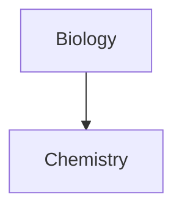

对于多个节点，可以使用字母作为节点


#### 流程图

横向流程图

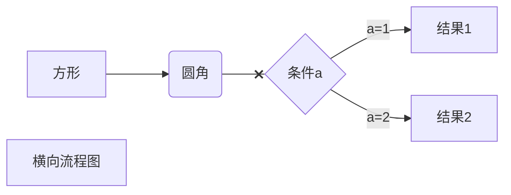

纵向流程图

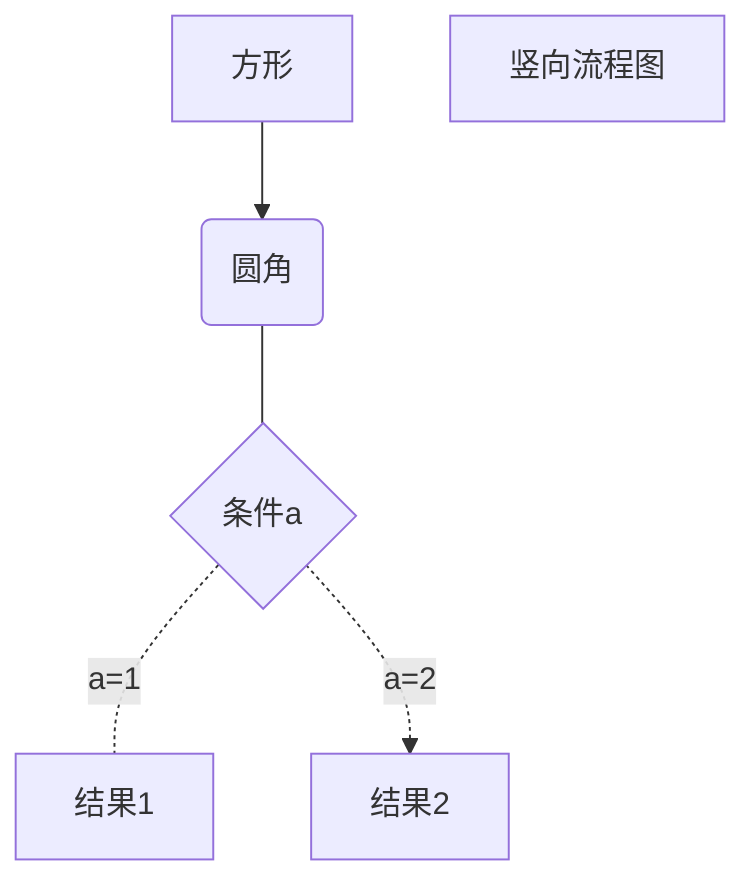

其中 TD 表示 Top-Down ，LR 表示 Left-Right ，用于标识方向。


#### 标准流程图

纵向流程图

```flow
st=>start: 开始框
op=>operation: 处理框
cond=>condition: 判断框(是或否?)
sub1=>subroutine: 子流程
io=>inputoutput: 输入输出框
e=>end: 结束框
st->op->cond
cond(yes)->io->e
cond(no)->sub1(right)->op
```

纵向流程图

```flow
st=>start: 开始框
op=>operation: 处理框
cond=>condition: 判断框(是或否?)
sub1=>subroutine: 子流程
io=>inputoutput: 输入输出框
e=>end: 结束框
st(right)->op(right)->cond
cond(yes)->io(bottom)->e
cond(no)->sub1(right)->op
```


#### 分块流程图

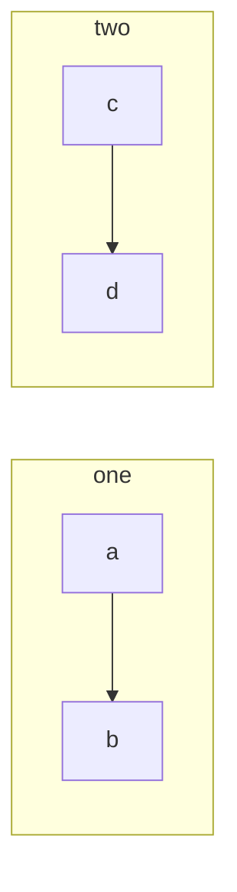


#### 时序图

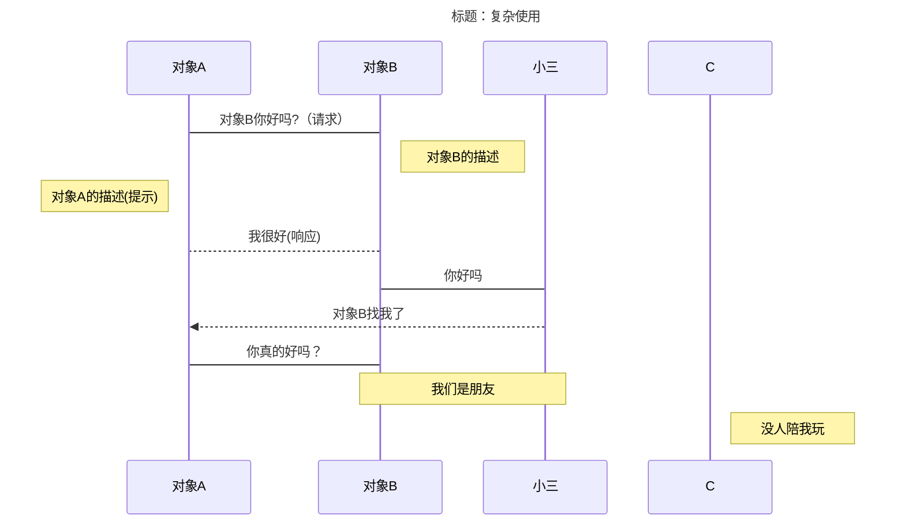


#### 标准时序图

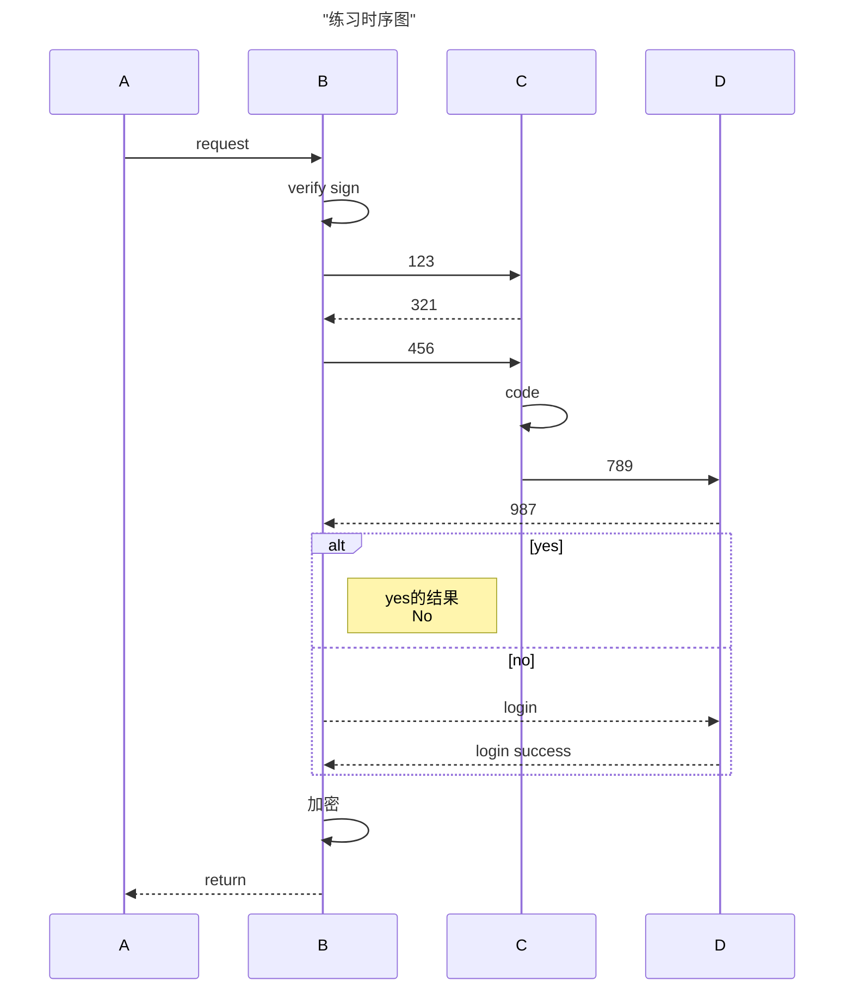


#### 复杂时序图

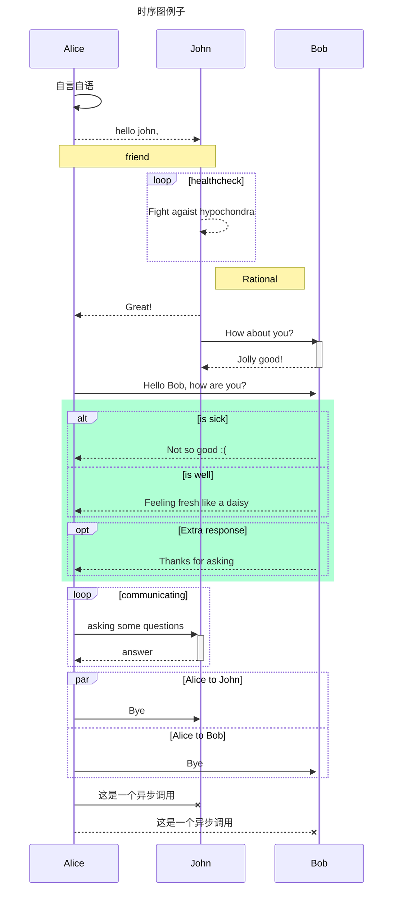


#### 饼图

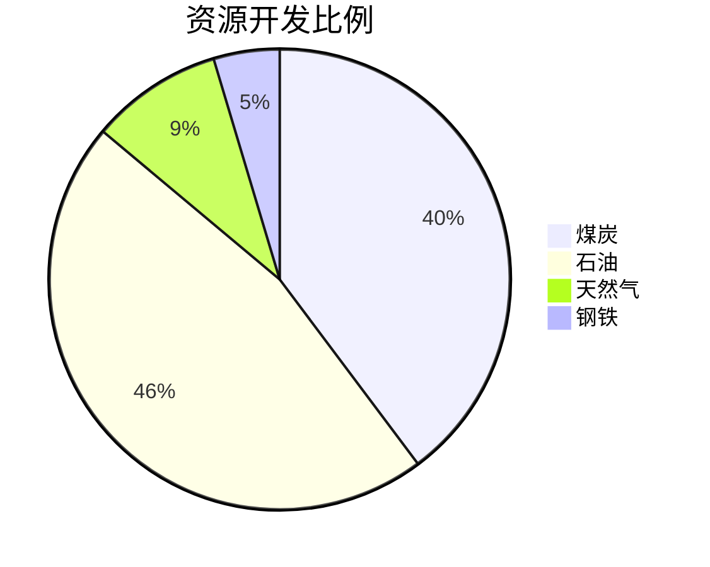


#### 状态图

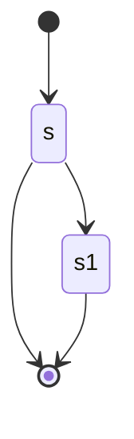


#### 类图

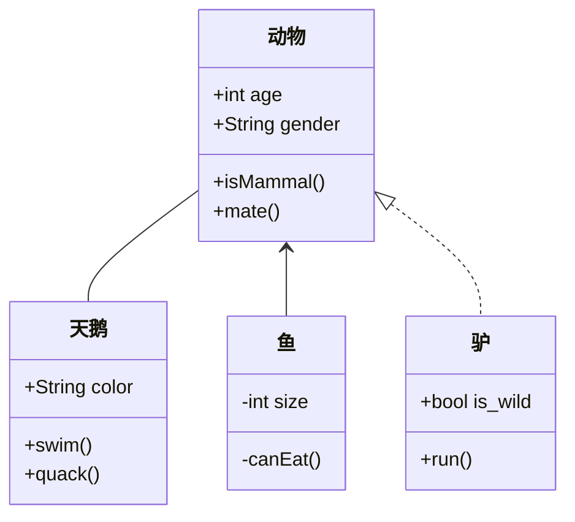


#### 甘特图

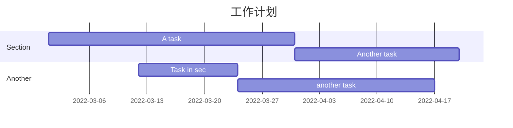

最后，当图片绘制完毕后，导出为 HTML 文件，然后再网页中下载为 PDF 格式。


