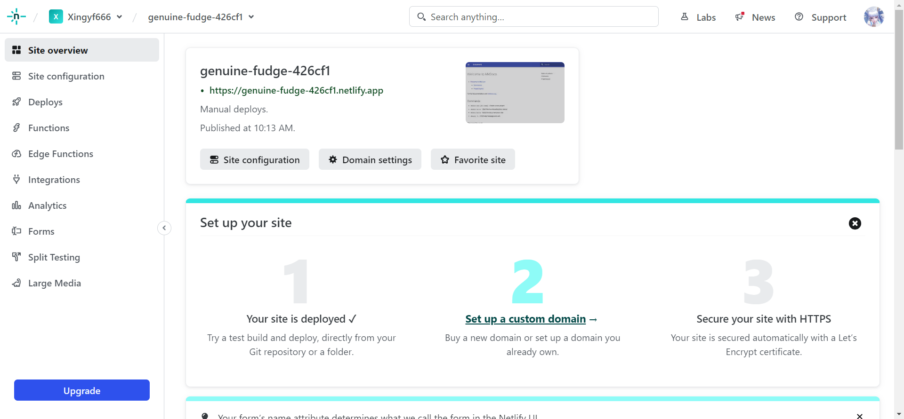

# MkDocs

## 基本知识

### 安装配置

首先需要安装 mkdocs 库

```shell
(.venv) $ pip install mkdocs
```

然后安装一些主题，例如

```shell
(.venv) $ pip install mkdocs-material
```


然后依次执行

```shell
(.venv) $ mkdocs new test
(.venv) $ cd test
(.venv) $ mkdocs serve
```

将会得到如下输出

```shell
INFO     -  Building documentation...
INFO     -  Cleaning site directory
INFO     -  Documentation built in 0.28 seconds
INFO     -  [22:11:31] Watching paths for changes: 'docs', 'mkdocs.yml'
INFO     -  [22:11:31] Serving on http://127.0.0.1:8000/
INFO     -  [22:11:51] Browser connected: http://127.0.0.1:8000/
```

命令行此时不会退出，而是开启了网页服务。在浏览器打开 `http://127.0.0.1:8000/` 网页就得到

```markdown
# Welcome to MkDocs

For full documentation visit [mkdocs.org](https://www.mkdocs.org).

## Commands

* `mkdocs new [dir-name]` - Create a new project.
* `mkdocs serve` - Start the live-reloading docs server.
* `mkdocs build` - Build the documentation site.
* `mkdocs -h` - Print help message and exit.

## Project layout

    mkdocs.yml    # The configuration file.
    docs/
        index.md  # The documentation homepage.
        ...       # Other markdown pages, images and other files.

```


### 书写文档

在 doc 文件夹下创建和通过文件夹嵌套的任何 mk 文件都会被渲染，而以 `.` 开头的文件夹和文件即使是 mk 文件也会被忽略。


#### Index

通常网站服务都会以 `index.html` 文件包含所有目录。这里我们需要 `index.md` 文件，MkDocs 会将它渲染为 `index.html` 来搭建网站。也可以用 `README.md` 文件替代 `index.md`，但是如果两个文件都存在，则前者会被忽略。

> 所有本地引用（图片、超链接）都应该使用相对路径。


#### Nav

在 `mkdocs.yml` 中配置 nav 来定义导航菜单。如果不配置，就会自动将所有 mk 文件列入菜单，根据字母表排序。简单的配置如下

```yaml
nav:
	- 'index.md'
	- 'about.md'
```

所有文件路径**相对**于 `docs_dir`，默认取 doc 文件夹。此时菜单名就是对应的文件名。也可以定义菜单名

```yaml
nav:
	- Home: 'index.md'
	- About: 'about.md'
```

可以进行嵌套定义

```yaml
nav:
  - Home: 'index.md'
  - Test:
    - test1: 'test1.md'
    - test2: 'pack/test2.md'
    - test3: 'pack/test3.md'
```

值得一提的是，菜单的嵌套关系不需要反映文件的存放路径。


### 选择主题

MkDocs 包含两种主题 mkdocs 和 readthedocs，设置主题名

```yaml
theme: 
  name: 'readthedocs'
```


不同的主题可能支持不同设置。例如 mkdocs 主题支持设置菜单深度（默认为 2）以及菜单风格（light 或 dark）等

```yaml
theme: 
  name: mkdocs
  navigation_depth: 2
  nav_style: light
```


### 自定义主题

#### 小调整

我们可以对 MkDocs 的主题进行自定义修改，通过在 `docs_dir` 变量（默认为 doc）指定的目录下添加 css, js 文件覆盖主题的效果。通过指定 `extra_css` 和 `extra_javascript` 参数，说明配置文件的位置。例如在 doc/css 下创建 `extra.css` 文件

```css
h1 {
    color: red;
}
```

然后在 `mkdocs.yml` 中配置

```yaml
extra_css: [css/extra.css]
```

就可以修改 h1 标题的颜色。


#### 复杂配置

使用 `custom_dir` 参数，指定自定义主题的目录。

```yaml
theme: 
  name: material
  custom_dir: custom_theme\
```


此目录的结构必须与该主题定义的结构相同。例如 material 主题目录结构为

```shell
.
├─ .icons/                             # Bundled icon sets
├─ assets/
│  ├─ images/                          # Images and icons
│  ├─ javascripts/                     # JavaScript files
│  └─ stylesheets/                     # Style sheets
├─ partials/
│  ├─ integrations/                    # Third-party integrations
│  │  ├─ analytics/                    # Analytics integrations
│  │  └─ analytics.html                # Analytics setup
│  ├─ languages/                       # Translation languages
│  ├─ actions.html                     # Actions
│  ├─ comments.html                    # Comment system (empty by default)
│  ├─ consent.html                     # Consent
│  ├─ content.html                     # Page content
│  ├─ copyright.html                   # Copyright and theme information
│  ├─ feedback.html                    # Was this page helpful?
│  ├─ footer.html                      # Footer bar
│  ├─ header.html                      # Header bar
│  ├─ icons.html                       # Custom icons
│  ├─ language.html                    # Translation setup
│  ├─ logo.html                        # Logo in header and sidebar
│  ├─ nav.html                         # Main navigation
│  ├─ nav-item.html                    # Main navigation item
│  ├─ pagination.html                  # Pagination (used for blog)
│  ├─ post.html                        # Blog post excerpt
│  ├─ search.html                      # Search interface
│  ├─ social.html                      # Social links
│  ├─ source.html                      # Repository information
│  ├─ source-file.html                 # Source file information
│  ├─ tabs.html                        # Tabs navigation
│  ├─ tabs-item.html                   # Tabs navigation item
│  ├─ tags.html                        # Tags
│  ├─ toc.html                         # Table of contents
│  └─ toc-item.html                    # Table of contents item
├─ 404.html                            # 404 error page
├─ base.html                           # Base template
├─ blog.html                           # Blog index page
├─ blog-archive.html                   # Blog archive index page
├─ blog-category.html                  # Blog category index page
├─ blog-post.html                      # Blog post page
└─ main.html                           # Default page
```


要对其中的某些设置进行覆盖，就需要按照该结构，定义相同名称的文件。在 custom_theme 目录下创建 `main.html` 文件

```html



  <title>My Custom Title</title>

```

其中第一行确保此文件是对基本配置的扩展，之后设置模板块。这里修改了 htmltitle 模板，它包含网页的标题内容。


如果不是要覆盖，而是要增加新的设置，使用模板变量 `{{ super() }}` 表示原本的内容，然后可以在它前后添加描述

```html



  {{ super() }}
  <script src="{{ base_url }}/js/test.js"></script>

```

例如这里在后面添加了 js 脚本，其中模板变量 `{{ base_url }}` 表示基本路径，确保是相对于 `docs_dir` 的路径。


material 主题提供的模板包括

| Block name  | Purpose                                         |
| ----------- | ----------------------------------------------- |
| `analytics` | Wraps the Google Analytics integration          |
| `announce`  | Wraps the announcement bar                      |
| `config`    | Wraps the JavaScript application config         |
| `container` | Wraps the main content container                |
| `content`   | Wraps the main content                          |
| `extrahead` | Empty block to add custom meta tags             |
| `fonts`     | Wraps the font definitions                      |
| `footer`    | Wraps the footer with navigation and copyright  |
| `header`    | Wraps the fixed header bar                      |
| `hero`      | Wraps the hero teaser (if available)            |
| `htmltitle` | Wraps the `<title>` tag                         |
| `libs`      | Wraps the JavaScript libraries (header)         |
| `outdated`  | Wraps the version warning                       |
| `scripts`   | Wraps the JavaScript application (footer)       |
| `site_meta` | Wraps the meta tags in the document head        |
| `site_nav`  | Wraps the site navigation and table of contents |
| `styles`    | Wraps the style sheets (also extra sources)     |
| `tabs`      | Wraps the tabs navigation (if available)        |


### [零宽空格](https://symbl.cc/en/200B/)

在 MkDocs 渲染的过程中，可能会出现汉字的加粗失效的问题。这是因为定界符规范根据空格来判断加粗符号的嵌套关系，但是这样就会导致字之间没有空格的汉字加粗失效。[解决方案](https://juejin.cn/post/7064565848421171213)就是使用 Unicode 中的零宽空格 `U+200B`，它通常用于指定长文本换行的位置。只有当文本内容超出一行时，它才会进行换行。


### 搭建网站

使用 BitBalloon 搭建网站，先通过

```shell
(.venv) $ mkdocs build
```

构建 site 文件夹，然后上传到网站上即可。



