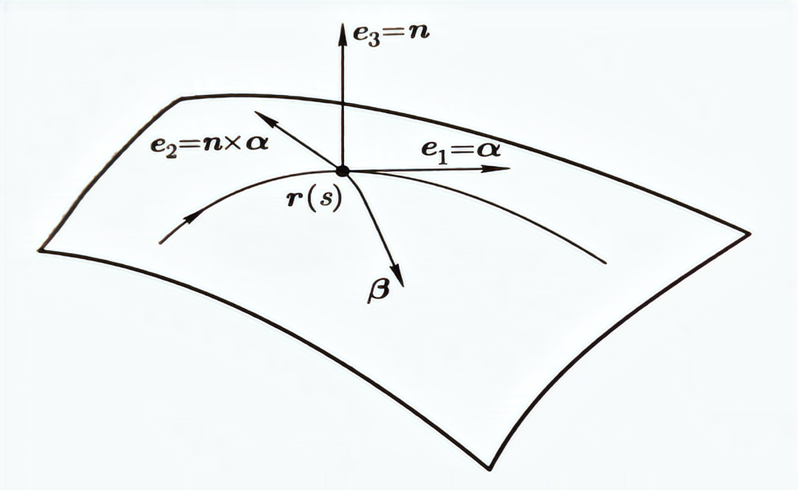
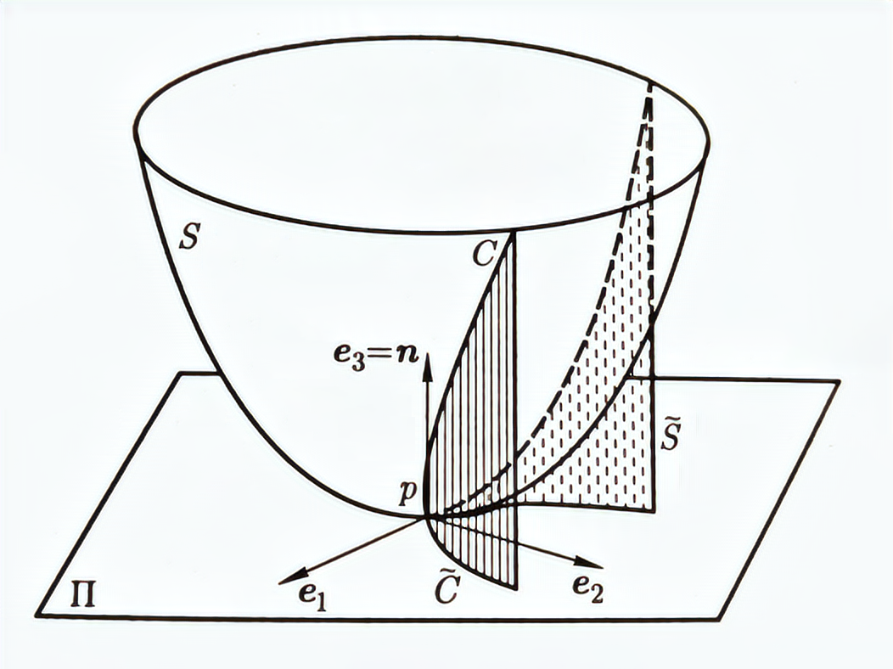
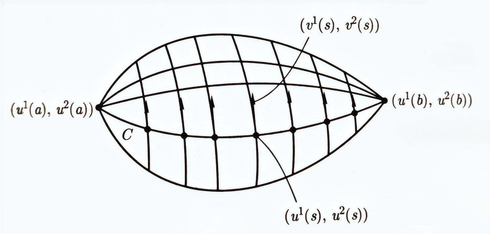
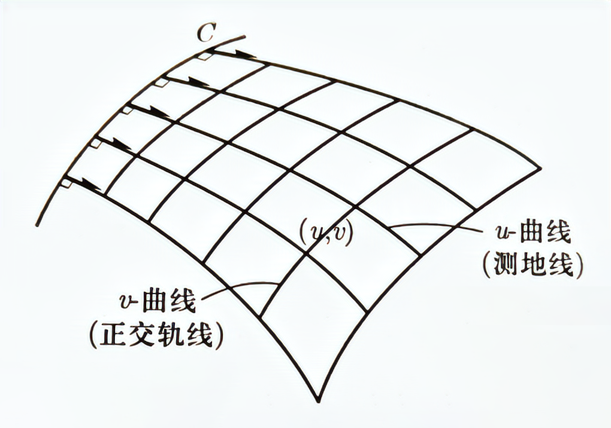
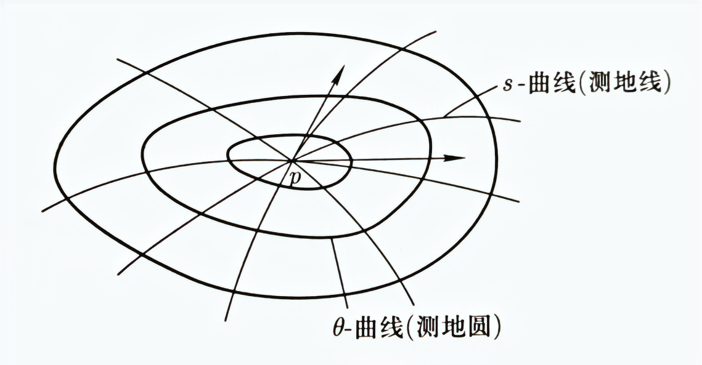
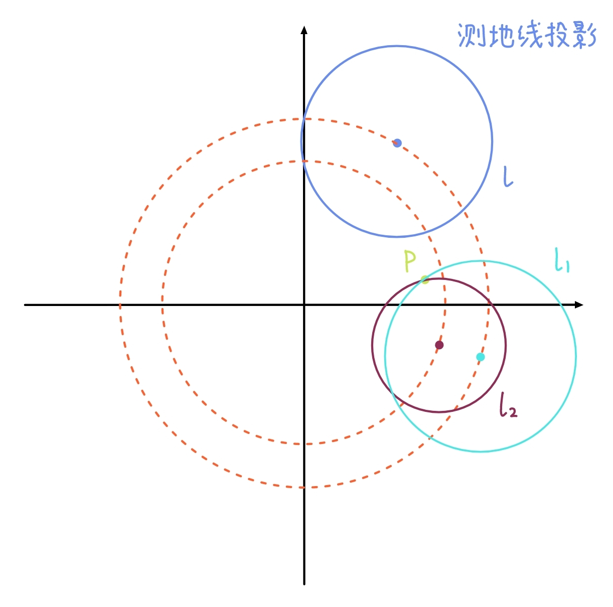
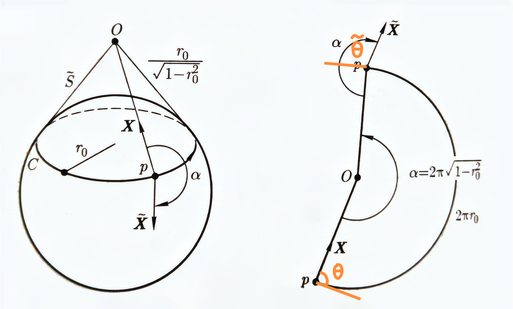
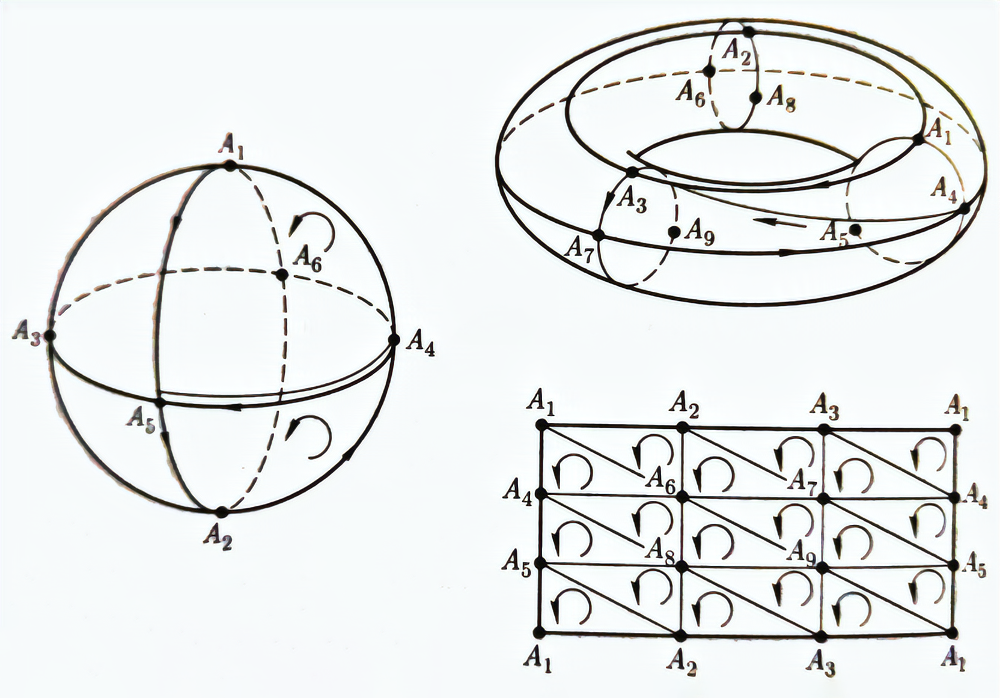

# 微分几何II

## 曲面论基本定理

### 自然标架的运动公式

曲线的 Frenet 标架在空间中的运动给出了曲线的弯曲信息。对于空间中的正则参数曲面 $r=r(u,v)$，我们也需要通过某个标架来进行描述。这里用到自然标架 $\{r;r_u,r_v,n\}$，与曲线标架不同，它与参数的选择有关，并且一般不是正交标架。虽然可以通过正交主方向来定义标架，但是主方向不能用偏导直接显式表示。即使能够取得正交曲率网，也不能保证 $r_u=e_1,r_v=e_2$ 。

#### 张量记号系统

将曲面参数 $(u,v)$ 记为 $(u^1,u^2)$，此时 $du^2$ 表示参数 $u^2$ 的微分。于是曲面参数方程为
$$
r = r(u^1,u^2)
$$
并且偏导数为
$$
r_\alpha = \frac{\partial r(u^1,u^2)}{\partial \alpha},\quad \alpha=1,2
$$
特别声明**所有希腊字母作为指标时取 $1,2$**，则单位法向为
$$
n = \frac{r_1\times r_2}{|r_1\times r_2|}
$$
参数方程的微分为
$$
dr = \sum_{\alpha=1}^2r_\alpha du^\alpha = r_\alpha du^\alpha
$$
这里我们采用 **Einstein 和式约定**：在一个单项式中，如果同一个指标出现**两次**，分别作为上标和下标，则表示对该指标求和。

曲面 $S$ 的第一类基本量和第二类基本量表示为
$$
\begin{aligned}
g_{\alpha\beta} &= r_\alpha\cdot r_\beta\\
b_{\alpha\beta} &= r_{\alpha\beta}\cdot n=-r_\alpha\cdot n_\beta=-r_\beta\cdot n_\alpha
\end{aligned}
$$
于是两个基本形式为
$$
\begin{aligned}
\mathrm{I} &= g_{\alpha\beta}du^\alpha du^\beta\\
\mathrm{II} &= b_{\alpha\beta}du^\alpha du^\beta
\end{aligned}
$$
同时令
$$
\begin{aligned}
g &= \det( g_{\alpha\beta}) =g_{11}g_{22}-(g_{12})^2 \\
b &= \det (b_{\alpha\beta}) = b_{11}b_{22}-(b_{12})^2
\end{aligned}
$$
由于矩阵 $g_{\alpha\beta}$ 正定，因此令 $g^{\alpha\beta}$ 为逆矩阵，于是有
$$
g_{\alpha\gamma}g^{\gamma\beta} = \sum_{\gamma=1}^2 g_{\alpha\gamma}g^{\gamma\beta} = \delta_\alpha^\beta = 
\begin{cases}
1, & \alpha=\beta\\
0, & \alpha\neq \beta
\end{cases}
$$
注意到因为会对公共指标求和，因此下标和上标会相互抵消。

我们总结得到对照表

| Gauss 记号 |  $u$  |  $v$  | $r_u$ | $r_v$ |   $E$    |   $F$    |   $G$    |   $L$    |   $M$    |   $N$    |
| :------: | :---: | :---: | :---: | :---: | :------: | :------: | :------: | :------: | :------: | :------: |
|   张量记号   | $u^1$ | $u^2$ | $r_1$ | $r_2$ | $g_{11}$ | $g_{12}$ | $g_{22}$ | $b_{11}$ | $b_{12}$ | $b_{22}$ |

#### Christoffel 记号

使用张量记号，曲面上的自然标架表示为 $\{r;r_1,r_2,n\}$，于是可以将二阶偏导和法向偏导进行分解
$$
\begin{cases}
r_{\alpha\beta} = \Gamma_{\alpha\beta}^\gamma r_\gamma + C_{\alpha\beta}n\\
n_{\beta} = D_{\beta}^\gamma r_\gamma + D_{\beta}n
\end{cases}
$$
注意到 $n\cdot n_\beta=0$，因此 $D_\beta=0$；对一式用 $n$ 点乘得到
$$
C_{\alpha\beta} = r_{\alpha\beta}\cdot n = b_{\alpha\beta}
$$
因此 $C_{\alpha\beta}$ 是第二类基本量；对二式用 $r_{\xi}$ 点乘得到
$$
-b_{\beta\xi} = n_\beta\cdot r_\xi = D_\beta^\gamma r_\gamma\cdot r_\xi = D_\beta^\gamma g_{\gamma\xi}
$$
由于 $g_{\gamma\xi}$ 可逆，于是
$$
D_\beta^\gamma = -b_{\beta\xi}g^{\gamma\xi} = -b_{\beta\xi}g^{\xi\gamma}
$$
这里利用了 $g_{\gamma\xi}$ 的对称性。

下面计算 $\Gamma_{\alpha\beta}^\gamma$ 分量：对一式用 $r_\xi$ 点乘得到
$$
r_{\alpha\beta}\cdot r_\xi = \Gamma_{\alpha\beta}^\gamma r_\gamma\cdot r_\xi = \Gamma_{\alpha\beta}^\gamma g_{\gamma\xi}
$$
记 $\Gamma_{\xi\alpha\beta}=\Gamma_{\alpha\beta}^\gamma g_{\gamma\xi}=r_{\alpha\beta}\cdot r_\xi$，由于 $r_1,r_2$ 不一定正交，因此 $\Gamma_{\alpha\beta}^\gamma$ 是 $r_{\alpha\beta}$ 分解到切向 $r_\gamma$ 上的**分量**，$\Gamma_{\gamma\alpha\beta}$ 是 $r_{\alpha\beta}$ 在切向 $r_\gamma$ 上的**投影**。

如果写成一般形式，例如对 $r_{11}=\Gamma_{11}^1r_1+\Gamma_{11}^2r_2+C_{11}n$ 计算系数，就有
$$
\begin{cases}
r_{11}\cdot r_{1} = \Gamma_{11}^1r_1\cdot r_1+\Gamma_{11}^2r_2\cdot r_1\\
r_{11}\cdot r_{2} = \Gamma_{11}^1r_1\cdot r_2+\Gamma_{11}^2r_2\cdot r_2
\end{cases}
$$
因此求解 $\Gamma_{\alpha\beta}^\gamma$ 就要求解一组线性方程。

由于 $r_{\alpha\beta}=r_{\beta\alpha}$，因此
$$
\Gamma_{\alpha\beta}^\gamma = \Gamma_{\beta\alpha}^\gamma,\quad \Gamma_{\xi\alpha\beta}=\Gamma_{\xi\beta\alpha}
$$
对 $g_{\alpha\beta}=r_\alpha\cdot r_\beta$ 求偏导得到
$$
\begin{aligned}
\frac{\partial g_{\alpha\beta}}{\partial u^\gamma} &= r_{\alpha\gamma}\cdot r_\beta+r_\alpha\cdot r_{\beta\gamma} = \Gamma_{\beta\alpha\gamma}+\Gamma_{\alpha\beta\gamma}\\
\frac{\partial g_{\alpha\gamma}}{\partial u^\beta} &= \Gamma_{\gamma\alpha\beta}+\Gamma_{\alpha\gamma\beta}\\
\frac{\partial g_{\gamma\beta}}{\partial u^\alpha} &= \Gamma_{\beta\gamma\alpha}+\Gamma_{\gamma\beta\alpha}
\end{aligned}
$$
后两式通过对换下标得到。将后两式相加，然后减去一式得到
$$
\Gamma_{\gamma\alpha\beta} = \frac{1}{2}\left(\frac{\partial g_{\alpha\gamma}}{\partial u^\beta}+\frac{\partial g_{\gamma\beta}}{\partial u^\alpha}-\frac{\partial g_{\alpha\beta}}{\partial u^\gamma} \right)
$$
因此有
$$
\Gamma_{\alpha\beta}^\gamma = \frac{1}{2}g^{\gamma\xi}\left(\frac{\partial g_{\alpha\xi}}{\partial u^\beta}+\frac{\partial g_{\xi\beta}}{\partial u^\alpha}-\frac{\partial g_{\alpha\beta}}{\partial u^\xi} \right)
$$
故 $\Gamma_{\alpha\beta}^\gamma$ 由第一类基本量及其偏导确定。称 $\Gamma_{\alpha\beta}^\gamma$ 为由曲面 $S$ 的**度量矩阵** $(g_{\alpha\beta})$ 决定的 **Christoffel 记号**。

#### 运动公式

记 $b_\beta^\gamma = -b_{\beta\xi}g^{\xi\gamma}$，则最终分解式为
$$
\begin{cases}
\frac{\partial r}{\partial u^\alpha} = r_\alpha \\
\frac{\partial r_\alpha}{\partial u^\beta} = \Gamma_{\alpha\beta}^\gamma r_\gamma + b_{\alpha\beta}n\\
\frac{\partial n}{\partial u^\beta} = b_\beta^\gamma r_\gamma
\end{cases}
$$
称为**自然标架场 $\{r;r_1,r_2,n\}$ 的运动公式**。其中二式称为曲面的 **Gauss 公式**，三式称为曲面的 **Weingarten 公式**。三式给出从 $r_1,r_2$ 到 $n_1,n_2$ 的关系，因此它是 Weingarten 映射的表达式，即 $(b_\beta^\gamma)$ 是 Weingarten 映射在自然基底 $\{r_1,r_2\}$ 下的矩阵。

**定理** 曲面 $S$ 上的自然标架场 $\{r;r_1,r_2,n\}$ 沿参数曲线的运动公式由第一类基本量和第二类基本量完全确定。

**例** 设容许的参数变换为 $u^\alpha=u^\alpha(v^1,v^2)$，令 $a_\beta^\alpha=\frac{\partial u^\alpha}{\partial v^\beta}$，假定 $\det(a_\beta^\alpha)>0$ 。记参数系 $(u^1,u^2),(v^1,v^2)$ 下的第一类基本量和第二类基本量为 $g_{\alpha\beta},b_{\alpha\beta},\tilde{g}_{\alpha\beta},\tilde{b}_{\alpha\beta}$，证明：
$$
\tilde{g}_{\alpha\beta} = g_{\gamma\delta}a_\alpha^\gamma a_\beta^\delta,\quad \tilde{b}_{\alpha\beta} = b_{\gamma\delta}a_\alpha^\gamma a_\beta^\delta
$$
根据参数变换有 $\tilde{r}(v^1,v^2)=r(u^1,u^2)=r(u^1(v^1,v^2),u^2(v^1,v^2))$，于是
$$
\tilde{g}_{\alpha\beta} = \tilde{r}_\alpha\cdot \tilde{r}_\beta = r_\gamma a_\alpha^\gamma\cdot r_\delta a_\beta^\delta = g_{\gamma\delta}a_\alpha^\gamma a_\beta^\delta
$$
类似地利用 $\det(a_\beta^\alpha)>0$ 有 $\tilde{n}=n$ 可证第二类基本量的等式。

**例** 设 $(g^{\alpha\beta})$ 是 $(g_{\alpha\beta})$ 的逆矩阵，$(\tilde{g}^{\alpha\beta})$ 是 $(\tilde{g}_{\alpha\beta})$ 的逆矩阵，则
$$
g^{\alpha\beta} = \tilde{g}^{\gamma\delta}a_{\gamma}^\alpha a_\delta^\beta
$$
对前面等式同乘 $\tilde{g}^{\alpha\beta}$ 得到
$$
1 = \tilde{g}^{\alpha\beta}\cdot\tilde{g}_{\alpha\beta} = \tilde{g}^{\alpha\beta}\cdot g_{\gamma\delta}a_\alpha^\gamma a_\beta^\delta = g_{\gamma\delta}\cdot\tilde{g}^{\alpha\beta}a_\alpha^\gamma a_\beta^\delta
$$
注意到 $g_{\gamma\delta}g^{\gamma\delta}=1$，由逆矩阵的唯一性，有
$$
g^{\gamma\delta} = \tilde{g}^{\alpha\beta}a_\alpha^\gamma a_\beta^\delta
$$
替换指标即证。

**例** 设 $\Gamma_{\alpha\beta}^\gamma$ 是关于 $g_{\alpha\beta}$ 的 Christoffel 记号，$\tilde{\Gamma}_{\alpha\beta}^\gamma$ 是关于 $\tilde{g}_{\alpha\beta}$ 的 Christoffel 记号，则
$$
\tilde{\Gamma}_{\alpha\beta}^\gamma = \Gamma_{\lambda\mu}^\nu a_\alpha^\lambda a_\beta^\mu A_\nu^\gamma+\frac{\partial a_\alpha^\nu}{\partial v^\beta}A_\nu^\gamma
$$
其中 $A_\nu^\gamma=\frac{\partial v^\gamma}{\partial u^\nu}$ 是 $(a_\alpha^\lambda)$ 的逆矩阵。

首先将左边展开为
$$
\tilde{\Gamma}_{\alpha\beta}^\gamma = \frac{1}{2}\tilde{g}^{\gamma\xi}\left(\frac{\partial \tilde{g}_{\alpha\xi}}{\partial v^\beta}+\frac{\partial \tilde{g}_{\xi\beta}}{\partial v^\alpha}-\frac{\partial \tilde{g}_{\alpha\beta}}{\partial v^\xi} \right)
$$
考虑第一项
$$
\begin{aligned}
\frac{\partial \tilde{g}_{\alpha\xi}}{\partial v^\beta} &= \frac{\partial(g_{\lambda\mu}a_{\alpha}^\lambda a_\xi^\mu)}{\partial v^\beta}\\
&= \frac{\partial(g_{\lambda\mu})}{\partial v^\beta}a_{\alpha}^\lambda a_\xi^\mu + g_{\lambda\mu}\frac{\partial(a_{\alpha}^\lambda )}{\partial v^\beta}a_\xi^\mu + g_{\lambda\mu}a_{\alpha}^\lambda \frac{\partial(a_\xi^\mu)}{\partial v^\beta}\\
&= \frac{\partial(g_{\lambda\mu})}{\partial u^\eta}\frac{\partial u^\eta}{\partial v^\beta}a_{\alpha}^\lambda a_\xi^\mu + g_{\lambda\mu}\frac{\partial(a_{\alpha}^\lambda )}{\partial v^\beta}a_\xi^\mu + g_{\lambda\mu}a_{\alpha}^\lambda \frac{\partial(a_\xi^\mu)}{\partial v^\beta}\\
&= \frac{\partial(g_{\lambda\mu})}{\partial u^\eta}a_\beta^\eta a_{\alpha}^\lambda a_\xi^\mu + g_{\lambda\mu}\frac{\partial(a_{\alpha}^\lambda )}{\partial v^\beta}a_\xi^\mu + g_{\lambda\mu}a_{\alpha}^\lambda \frac{\partial(a_\xi^\mu)}{\partial v^\beta}
\end{aligned}
$$
注意只对展开后的第一部分应用链式法则。于是有
$$
\begin{aligned}
\tilde{\Gamma}_{\alpha\beta}^\gamma = \frac{1}{2}\tilde{g}^{\gamma\xi}\bigg[&\frac{\partial(g_{\lambda\mu})}{\partial u^\eta}a_\beta^\eta a_{\alpha}^\lambda a_\xi^\mu + g_{\lambda\mu}\frac{\partial(a_{\alpha}^\lambda )}{\partial v^\beta}a_\xi^\mu + g_{\lambda\mu}a_{\alpha}^\lambda \frac{\partial(a_\xi^\mu)}{\partial v^\beta}\\
+ &\frac{\partial(g_{\lambda\mu})}{\partial u^\eta}a_\alpha^\eta a_{\xi}^\lambda a_\beta^\mu + g_{\lambda\mu}\frac{\partial(a_{\xi}^\lambda )}{\partial v^\alpha}a_\beta^\mu + g_{\lambda\mu}a_{\xi}^\lambda \frac{\partial(a_\beta^\mu)}{\partial v^\alpha}\\
- &\frac{\partial(g_{\lambda\mu})}{\partial u^\eta}a_\xi^\eta a_{\alpha}^\lambda a_\beta^\mu - g_{\lambda\mu}\frac{\partial(a_{\alpha}^\lambda )}{\partial v^\xi}a_\beta^\mu -g_{\lambda\mu}a_{\alpha}^\lambda \frac{\partial(a_\beta^\mu)}{\partial v^\xi}\bigg]
\end{aligned}
$$
注意到 $\eta,\lambda,\mu$ 是哑元，因此可以交换指标。针对第一列分别调换 $\eta,\mu$ 和 $\eta,\lambda$ 得到
$$
\frac{\partial(g_{\lambda\mu})}{\partial u^\eta}a_\beta^\eta a_{\alpha}^\lambda a_\xi^\mu +\frac{\partial(g_{\lambda\mu})}{\partial u^\eta}a_\alpha^\eta a_{\xi}^\lambda a_\beta^\mu- \frac{\partial(g_{\lambda\mu})}{\partial u^\eta}a_\xi^\eta a_{\alpha}^\lambda a_\beta^\mu = \left[\frac{\partial(g_{\lambda\eta})}{\partial u^\mu}+\frac{\partial(g_{\eta\mu})}{\partial u^\lambda}-\frac{\partial(g_{\lambda\mu})}{\partial u^\eta}\right]a_\xi^\eta a_{\alpha}^\lambda a_\beta^\mu
$$
然后考虑后两列：因为 $\alpha,\beta,\xi$ 都不能调换，因此只能合并后两列中具有相同底的项，即
$$
\begin{aligned}
g_{\lambda\mu}a_{\alpha}^\lambda \frac{\partial(a_\xi^\mu)}{\partial v^\beta}&\leftrightarrow -g_{\lambda\mu}a_{\alpha}^\lambda \frac{\partial(a_\beta^\mu)}{\partial v^\xi}\\
g_{\lambda\mu}\frac{\partial(a_{\xi}^\lambda )}{\partial v^\alpha}a_\beta^\mu &\leftrightarrow -g_{\lambda\mu}\frac{\partial(a_{\alpha}^\lambda )}{\partial v^\xi}a_\beta^\mu\\
g_{\lambda\mu}\frac{\partial(a_{\alpha}^\lambda )}{\partial v^\beta}a_\xi^\mu &\leftrightarrow g_{\lambda\mu}a_{\xi}^\lambda \frac{\partial(a_\beta^\mu)}{\partial v^\alpha}
\end{aligned}
$$
根据 $a$ 的定义有
$$
\frac{\partial(a_\xi^\mu)}{\partial v^\beta} = \frac{\partial}{\partial v^\beta}\frac{\partial u^\mu}{\partial v^\xi} = \frac{\partial}{\partial v^\xi}\frac{\partial u^\mu}{\partial v^\beta} =\frac{\partial(a_\beta^\mu)}{\partial v^\xi}
$$
因此前两对消去，最后一对合并，得到
$$
\tilde{\Gamma}_{\alpha\beta}^\gamma =\frac{1}{2}\tilde{g}^{\gamma\xi}\left\{\left[\frac{\partial(g_{\lambda\eta})}{\partial u^\mu}+\frac{\partial(g_{\eta\mu})}{\partial u^\lambda}-\frac{\partial(g_{\lambda\mu})}{\partial u^\eta}\right]a_\xi^\eta a_{\alpha}^\lambda a_\beta^\mu+2g_{\lambda\mu}\frac{\partial(a_{\alpha}^\lambda )}{\partial v^\beta}a_\xi^\mu\right\}
$$

并且由于 $g^{\alpha\beta}=\tilde{g}^{\lambda\mu}a_{\lambda}^\alpha a_\mu^\beta$，于是
$$
A_\beta^\xi g^{\alpha\beta} = \tilde{g}^{\lambda\mu}a_{\lambda}^\alpha A_\beta^\xi a_\mu^\beta = \tilde{g}^{\lambda\mu}a_{\lambda}^\alpha \delta_\mu^\xi = \tilde{g}^{\lambda\xi}a_{\lambda}^\alpha = \tilde{g}^{\beta\xi}a_{\beta}^\alpha
$$
从而
$$
\begin{aligned}
\tilde{\Gamma}_{\alpha\beta}^\gamma &= \frac{1}{2}\tilde{g}^{\gamma\xi}a_\xi^\eta\cdot \left[\frac{\partial(g_{\lambda\eta})}{\partial u^\mu}+\frac{\partial(g_{\eta\mu})}{\partial u^\lambda}-\frac{\partial(g_{\lambda\mu})}{\partial u^\eta}\right] a_{\alpha}^\lambda a_\beta^\mu+\tilde{g}^{\gamma\xi}a_\xi^\mu\cdot g_{\lambda\mu}\frac{\partial(a_{\alpha}^\lambda )}{\partial v^\beta}\\
&= A_{\xi}^\gamma\cdot \frac{1}{2}g^{\xi\eta}\left[\frac{\partial(g_{\lambda\eta})}{\partial u^\mu}+\frac{\partial(g_{\eta\mu})}{\partial u^\lambda}-\frac{\partial(g_{\lambda\mu})}{\partial u^\eta}\right] a_{\alpha}^\lambda a_\beta^\mu + A_{\xi}^\gamma\cdot g^{\xi\mu}g_{\lambda\mu}\frac{\partial(a_{\alpha}^\lambda )}{\partial v^\beta}\\
&= \Gamma_{\lambda\mu}^\xi a_{\alpha}^\lambda a_\beta^\mu A_\xi^\gamma + A_{\xi}^\gamma\cdot \delta_\lambda^\xi\frac{\partial(a_{\alpha}^\lambda )}{\partial v^\beta}\\
&= \Gamma_{\lambda\mu}^\xi a_{\alpha}^\lambda a_\beta^\mu A_\xi^\gamma + \frac{\partial(a_{\alpha}^\xi )}{\partial v^\beta}A_{\xi}^\gamma
\end{aligned}
$$
将 $\xi$ 替换为 $\nu$ 即证。

**例** 证明下列恒等式：

（1）$g^{\alpha\delta}\Gamma_{\delta\gamma}^\beta+g^{\beta\delta}\Gamma_{\delta\gamma}^\alpha=-\frac{\partial g^{\alpha\beta}}{\partial u^\gamma}$；

对 $g^{\alpha\delta}g_{\delta\beta}=\delta_\beta^\alpha$ 求导得到
$$
\frac{\partial g^{\alpha\delta}}{\partial u^\gamma}g_{\delta\beta} + g^{\alpha\delta}\frac{\partial g_{\delta\beta}}{\partial u^\gamma} = 0
$$
将第二项展开得到
$$
-\frac{\partial g^{\alpha\delta}}{\partial u^\gamma}g_{\delta\beta} = g^{\alpha\delta}(\Gamma_{\beta\delta\gamma}+\Gamma_{\delta\beta\gamma}) = g^{\alpha\delta}(\Gamma_{\delta\gamma}^\nu g_{\nu\beta}+\Gamma_{\beta\gamma}^\nu g_{\nu\delta})
$$
两端乘上 $g^{\beta\xi}$ 得到
$$
-\frac{\partial g^{\alpha\xi}}{\partial u^\gamma} = g^{\beta\xi}g^{\alpha\delta}(\Gamma_{\delta\gamma}^\nu g_{\nu\beta}+\Gamma_{\beta\gamma}^\nu g_{\nu\delta})=g^{\alpha\delta}\Gamma_{\delta\gamma}^\xi+g^{\beta\xi}\Gamma_{\beta\gamma}^\alpha = g^{\alpha\delta}\Gamma_{\delta\gamma}^\xi+g^{\delta\xi}\Gamma_{\delta\gamma}^\alpha
$$
最后一步替换了哑元，然后将 $\xi$ 替换为 $\beta$ 即证。

（2）$\frac{\partial g_{\gamma\beta}}{\partial u^\alpha}-\frac{\partial g_{\alpha\gamma}}{\partial u^\beta}=g_{\beta\lambda}\Gamma_{\gamma\alpha}^\lambda-g_{\alpha\lambda}\Gamma_{\gamma\beta}^\lambda$；

注意到
$$
\frac{\partial g_{\gamma\beta}}{\partial u^\alpha}-\frac{\partial g_{\alpha\gamma}}{\partial u^\beta} = (\Gamma_{\beta\gamma\alpha}+\Gamma_{\gamma\beta\alpha})-(\Gamma_{\gamma\alpha\beta}+\Gamma_{\alpha\gamma\beta}) = \Gamma_{\beta\gamma\alpha}-\Gamma_{\alpha\gamma\beta} = g_{\beta\lambda}\Gamma_{\gamma\alpha}^\lambda-g_{\alpha\lambda}\Gamma_{\gamma\beta}^\lambda
$$
其中利用了 $\Gamma_{\xi\alpha\beta}=\Gamma_{\xi\beta\alpha}$，即得左式。

（3）$\Gamma_{\alpha\beta}^\beta=\frac{1}{2}\frac{\partial\log g}{\partial u^\alpha},g=\det(g_{\alpha\beta})$；

记 $\alpha'=3-\alpha,\beta'=3-\beta,\gamma'=3-\gamma$，定义
$$
s(\alpha,\beta) = 
\begin{cases}
1, & \alpha=\beta\\
-1, & \alpha\neq\beta
\end{cases}
$$
将行列式展开，然后利用对称性有
$$
\begin{aligned}
\frac{1}{2}\frac{\partial\log g}{\partial u^\alpha} &= \frac{1}{2g}\frac{\partial g}{\partial u^\alpha}= \sum_{\beta,\gamma}\frac{1}{4g}\frac{\partial(s(\beta,\gamma) g_{\beta\gamma}g_{\beta'\gamma'})}{\partial u^\alpha}\\
&= \frac{1}{2}\sum_{\beta,\gamma}\frac{s(\beta,\gamma)g_{\beta'\gamma'}}{g}\frac{\partial g_{\beta\gamma}}{\partial u^\alpha}= \frac{1}{2}g^{\beta\gamma}\frac{\partial g_{\beta\gamma}}{\partial u^\alpha}\\
&= \frac{1}{2}g^{\beta\gamma}(r_{\alpha\beta}\cdot r_\gamma+r_\beta\cdot r_{\alpha\gamma})= g^{\beta\gamma}r_{\alpha\beta}\cdot r_\gamma\\
&= g^{\beta\gamma}\Gamma_{\gamma\alpha\beta} = \Gamma_{\alpha\beta}^\beta
\end{aligned}
$$
其中利用了 $\beta,\gamma$ 可以对换的性质。

**注** 整理恒等关系
$$
\begin{aligned}
\Gamma_{\alpha\beta}^\gamma &= g^{\gamma\xi}\Gamma_{\xi\alpha\beta}=g^{\gamma\xi}(r_{\alpha\beta}\cdot r_\xi)\\
\frac{\partial g_{\alpha\beta}}{\partial u^\gamma} &= \Gamma_{\beta\alpha\gamma}+\Gamma_{\alpha\beta\gamma}\\
\frac{\partial g^{\alpha\beta}}{\partial u^\gamma} &= -g^{\alpha\delta}\Gamma_{\delta\gamma}^\beta-g^{\beta\delta}\Gamma_{\delta\gamma}^\alpha\\
b_\beta^\gamma &= -b_{\beta\xi}g^{\xi\gamma}
\end{aligned}
$$
除去运动公式外，上述关系在进行定理证明时很有用。

### 曲面的唯一性定理

**定理** 设 $S_1,S_2$ 是定义在同一个参数区域 $D\subset E^2$ 上的两个正则参数曲面。若任意 $(u^1,u^2)\in D$，曲面 $S_1,S_2$ 有相同的第一基本形式和第二基本形式，则 $S_1,S_2$ 在空间 $E^3$ 中的一个刚体运动下重合。

**定理** 设 $S_i,i=1,2$ 是空间 $E^3$ 中的两个正则参数曲面，若存在光滑映射 $\sigma:S_1\to S_2$ 使得
$$
\sigma^*\mathrm{I}_2 = \mathrm{I}_1,\quad \sigma^*\mathrm{II}_2 = \mathrm{II}_1
$$
则在空间 $E^3$ 中存在刚体运动 $\tilde{\sigma}:E^3\to E^3$ 使得
$$
\sigma = \tilde{\sigma}|_{S_1}
$$
即曲面 $S_1,S_2$ 在空间 $E^3$ 中的一个刚体运动下重合。

**证明** 由于 $\sigma$ 是保长对应，因此存在到公共参数域 $(u^1,u^2)$ 的容许参数变换，保持第一基本形式和第二基本形式不变，由上述定理得证。

### 曲面论基本方程

现在我们想知道给定两个二次微分式
$$
\varphi = g_{\alpha\beta}du^\alpha du^\beta,\quad \psi=b_{\alpha\beta}du^\alpha du^\beta
$$
其中 $\varphi$ 正定。能否构造以 $\varphi,\psi$ 为第一基本形式和第二基本形式的参数曲面。

由于正则参数曲面具有三次以上的连续偏导，因此
$$
\frac{\partial^2 r_\alpha}{\partial u^\beta\partial u^\gamma} = \frac{\partial^2 r_\alpha}{\partial u^\gamma\partial u^\beta},\quad \frac{\partial^2 n}{\partial u^\beta\partial u^\gamma}=\frac{\partial^2 n}{\partial u^\gamma\partial u^\beta}
$$
根据运动公式，代入得到
$$
\begin{aligned}
\frac{\partial}{\partial u^\gamma}(\Gamma_{\alpha\beta}^\delta r_{\delta}+b_{\alpha\beta}n) &= \frac{\partial}{\partial u^\beta}(\Gamma_{\alpha\gamma}^\delta r_\delta+b_{\alpha\gamma}n)\\
\frac{\partial}{\partial u^\gamma}(b_{\beta}^\delta r_\delta) &=\frac{\partial}{\partial u^\beta}(b_\gamma^\delta r_\delta)
\end{aligned}
$$
将一式整理为 $r_\delta,n$ 的线性组合，由于它们线性无关，因此对应系数为零。令
$$
R_{\alpha\beta\gamma}^\delta =\frac{\partial}{\partial u^\gamma}\Gamma_{\alpha\beta}^\delta -\frac{\partial}{\partial u^\beta}\Gamma_{\alpha\gamma}^\delta + \Gamma_{\alpha\beta}^\eta\Gamma_{\eta\gamma}^\delta-\Gamma_{\alpha\gamma}^\eta\Gamma_{\eta\beta}^\delta
$$
称为**曲面 $S$ 的第一类基本量的 Riemann 记号**。它可以通过 $g_{\alpha\beta},g^{\alpha\beta}$ 进行指标的下降和上升，规定
$$
R_{\alpha\delta\beta\gamma} = g_{\delta\eta}R_{\alpha\beta\gamma}^\eta,\quad R_{\alpha\beta\gamma}^\eta = g^{\delta \eta}R_{\alpha\delta\beta\gamma}
$$
于是一式可以改写等价的方程组
$$
\begin{aligned}
R_{\alpha\delta\beta\gamma} &= b_{\alpha\beta}b_{\delta\gamma}-b_{\alpha\gamma}b_{\delta\beta}\\
\frac{\partial b_{\alpha\beta}}{\partial u^\gamma}-\frac{\partial b_{\alpha\gamma}}{\partial u^\beta} &= \Gamma_{\alpha\gamma}^\delta b_{\delta\beta}-\Gamma_{\alpha\beta}^\delta b_{\delta\gamma}
\end{aligned}
$$
其中一式称为 **Gauss 方程**，二式称为 **Codazzi 方程**。可以证明 Codazzi 方程与
$$
\frac{\partial}{\partial u^\gamma}(b_{\beta}^\delta r_\delta) =\frac{\partial}{\partial u^\beta}(b_\gamma^\delta r_\delta)
$$
等价，因此 Gauss-Codazzi 方程就是第一类基本量和第二类基本量需要满足的相容性条件。

虽然 Gauss-Codazzi 方程比较复杂，但实际上 Gauss 方程只包含一个方程，Codazzi 方程只包含两个方程。事实上
$$
R_{\alpha\delta\beta\gamma} = R_{\beta\gamma\alpha\delta}=-R_{\delta\alpha\beta\gamma}=-R_{\alpha\delta\gamma\beta}
$$
换句话说，将指标分成 $\alpha\delta,\beta\gamma$ 两组，交换两组不改变值；在组内对换指标会变号。因此
$$
R_{11\beta\gamma}=R_{22\beta\gamma}=R_{\alpha\delta 11}=R_{\alpha\delta 22}=0
$$
因此 Gauss 方程中实际上只有一个方程
$$
R_{1212}=b_{11}b_{22}-(b_{12})^2
$$
在 Codazzi 方程中，如果 $\beta=\gamma$，则两端均为零。因此只有
$$
\begin{cases}
\frac{\partial b_{11}}{\partial u^2}-\frac{\partial b_{12}}{\partial u^1} = -\Gamma_{11}^\delta b_{2\delta}+\Gamma_{12}^\delta b_{1\delta}\\
\frac{\partial b_{21}}{\partial u^2}-\frac{\partial b_{22}}{\partial u^1} = -\Gamma_{21}^\delta b_{2\delta}+\Gamma_{22}^\delta b_{1\delta}
\end{cases}
$$
如果上述三个方程成立，那么 $\varphi,\psi$ 就满足相容性条件。根据一阶偏微分方程的解的存在性定理，运动公式可积，得到唯一解。

**注** 曲线论中曲率和挠率可以是弧长参数的任意函数，只需要曲率函数为正；而曲面论中，第一基本形式和第二基本形式彼此关联，这意味着不能在保持第一基本形式不变的情况下随意地弯曲曲面。反之，保持第一基本形式不变的变形一定保证了曲面的某种弯曲性质不变。

**推论** 在正交参数曲线网下 $F\equiv 0$，Gauss 方程成为
$$
R_{1212} = -\sqrt{EG}\left[\left(\frac{(\sqrt{E})_v}{\sqrt{G}} \right)_v+\left(\frac{(\sqrt{G})_u}{\sqrt{E}} \right)_u \right]
$$
在正交曲率线网下 $F\equiv M\equiv 0$，Codazzi 方程成为
$$
\frac{\partial L}{\partial v} = \frac{1}{2}\left(\frac{L}{E}+\frac{N}{G}\right)\frac{\partial E}{\partial v} = H\frac{\partial E}{\partial v}\\
\frac{\partial N}{\partial u} = \frac{1}{2}\left(\frac{L}{E}+\frac{N}{G}\right)\frac{\partial G}{\partial u} = H\frac{\partial G}{\partial u}
$$
其中 $H$ 是平均曲率。

**例** 证明：平均曲率为常数的曲面是平面、球面或存在参数系 $(u,v)$ 使得
$$
\begin{aligned}
\mathrm{I} &= \lambda(du^2+dv^2)\\
\mathrm{II} &= (1+\lambda H)du^2-(1-\lambda H)dv^2
\end{aligned}
$$
若曲面并不是平面或球面，则点 $p$ 不是脐点。可在 $p$ 附近取正交曲率参数网，此时
$$
\frac{\partial L}{\partial v}-H\frac{\partial E}{\partial v}=\frac{\partial N}{\partial u} -H\frac{\partial G}{\partial u} = 0
$$
由于 $H$ 是常数，因此
$$
L-HE = a(u),\quad N-HG = b(v)
$$
于是有
$$
\kappa_1 - H=\frac{L}{E}-H = \frac{a(u)}{E}\\
\kappa_2 - H=\frac{N}{G}-H = \frac{b(v)}{G}
$$
整理得到
$$
\begin{aligned}
E &= \frac{2}{\kappa_1-\kappa_2}a(u) = \lambda a(u)\\
G &= -\frac{2}{\kappa_1-\kappa_2}b(v) = -\lambda b(v)
\end{aligned}
$$
不妨设 $\kappa_1>\kappa_2$，则 $a(u),-b(v)>0$，作参数变换
$$
\begin{aligned}
\tilde{u} &= \int_{u_0}^u \sqrt{a(t)}dt,\quad \tilde{v}=\int_{v_0}^v\sqrt{-b(t)}dt\\
r_u &= r_{\tilde{u}}\sqrt{a(u)},\quad r_v=r_{\tilde{v}}\sqrt{-b(v)},\quad \tilde{n}=n
\end{aligned}
$$
进一步有
$$
\begin{aligned}
r_{uu}\cdot n &=\frac{\partial }{\partial \tilde{u}}\frac{\partial \tilde{u}}{\partial u}\left(r_{\tilde{u}}\sqrt{a(u)}\right) = a(u)r_{\tilde{u}\tilde{u}}\cdot n+\frac{\partial\sqrt{a(u)}}{\partial \tilde{u}}r_{\tilde{u}}\cdot n = a(u)r_{\tilde{u}\tilde{u}}\cdot n\\
r_{vv}\cdot n &=\frac{\partial }{\partial \tilde{v}}\frac{\partial \tilde{v}}{\partial v}\left(r_{\tilde{v}}\sqrt{-b(v)}\right) = -b(v)r_{\tilde{v}\tilde{v}}\cdot n+\frac{\partial\sqrt{-b(v)}}{\partial \tilde{v}}r_{\tilde{v}}\cdot n = -b(v)r_{\tilde{v}\tilde{v}}\cdot n
\end{aligned}
$$
整理得到关系
$$
\begin{aligned}
\tilde{E} &= \frac{E}{a(u)} = \lambda,\quad \tilde{G}=\frac{G}{-b(v)}=\lambda\\
\tilde{L} &= \frac{L}{a(u)}=\frac{HE+a(u)}{a(u)}=1+\lambda H\\
\tilde{N} &= \frac{N}{-b(v)} = \frac{HG+b(v)}{-b(v)} = -(1-\lambda H)
\end{aligned}
$$
代回两个基本形式即证。

**例** 设 $S$ 的主曲率是两个互异常数，证明 $S$ 是圆柱面的一部分。

由于 $\kappa_1\neq\kappa_2$，则 $S$ 上任一点 $p$ 非脐点，于是可取正交曲率参数网，即有
$$
\begin{aligned}
\mathrm{I} &= \lambda(du^2+dv^2)\\
\mathrm{II} &= (1+\lambda H)du^2-(1-\lambda H)dv^2
\end{aligned}
$$
并且 $\lambda=2/(\kappa_1-\kappa_2)$ 也是常数，故 $r_u\cdot r_u=r_v\cdot r_v=\lambda,r_u\cdot r_v=0$，求导得到
$$
\begin{aligned}
r_{uu}\cdot r_u &= 0,\quad r_{uv}\cdot r_u=0\\
r_{uv}\cdot r_v &= 0,\quad r_{vv}\cdot r_v=0\\
r_{uu}\cdot r_v+r_u\cdot r_{uv}&=0,\quad r_{uv}\cdot r_v+r_u\cdot r_{vv}=0
\end{aligned}
$$
整理可得
$$
\begin{cases}
r_{uu}\cdot r_u=0\\
r_{uu}\cdot r_v=0\\
r_{uu}\cdot n=1+\lambda H
\end{cases}\quad
\begin{cases}
r_{vv}\cdot r_u=0\\
r_{vv}\cdot r_v=0\\
r_{vv}\cdot n=-1+\lambda H
\end{cases}\quad
\begin{cases}
r_{uv}\cdot r_u=0\\
r_{uv}\cdot r_v=0\\
r_{uv}\cdot n=0
\end{cases}
$$
于是 $r_{uu},r_{uv}$ 均沿着法向，并且由于 $M=0$ 推出 $r_{uv}\cdot n=0$ 得到 $r_{uv}=0$ 。对 $r_{uu}\cdot r_v=0$ 求导得到
$$
0 = r_{uu}\cdot r_{vv}+\frac{\partial r_{uv}}{\partial u}\cdot r_v = r_{uu}\cdot r_{vv} = -(1+\lambda H)(1-\lambda H)
$$
不妨设 $1-\lambda H=0$，则 $\kappa_2=0$ 成立。于是 $v$ 曲线曲率为零，是直线。曲面 $S$ 可以写成直纹面
$$
r(u,v) = r(u,v_0) + vr_v(u,v_0) = r(u)+vl(u)
$$
由于 $0=r_{uv}=l'$，因此 $r(u,v) = r(u)+vl_0$ 是柱面。并且 $r'\cdot l_0=0$，于是 $(r-r_0)\cdot l=0$，即 $r(u)$ 是平面曲线，且曲率 $\kappa_1$ 为常数，只能是圆，故 $S$ 是圆柱面。

**例** 已知曲面 $S$ 的第一基本形式和第二基本形式为
$$
\begin{aligned}
\mathrm{I} &= u^2(du^2+dv^2)\\
\mathrm{II} &= A(u,v)du^2+B(u,v)dv^2
\end{aligned}
$$
证明：函数 $A(u,v),B(u,v)$ 只是 $u$ 的函数，并且
$$
A(u,v)\cdot B(u,v)=1
$$
由于 $F=M=0$，因此当前参数系是正交曲率参数网。于是
$$
\frac{\partial L}{\partial v} = H\frac{\partial E}{\partial v} = 0
$$
故 $A$ 只是 $u$ 的函数。由于 $r_u\cdot r_u= r_v\cdot r_v= u^2,r_u\cdot r_v=0$，求导得到
$$
\begin{aligned}
r_{uu}\cdot r_u &= u,\quad r_{uv}\cdot r_u=0,\quad r_{uu}\cdot n=A(u)\\
r_{uv}\cdot r_v&=u,\quad r_{vv}\cdot r_v=0,\quad r_{vv}\cdot n=B(u,v)\\
r_{uu}\cdot r_v + r_u\cdot r_{uv}&=0,\quad r_{uv}\cdot r_v+r_u\cdot r_{vv}=0
\end{aligned}
$$
整理得到
$$
\begin{cases}
r_{uu}\cdot r_u=u\\
r_{uu}\cdot r_v=0\\
r_{uu}\cdot n=A
\end{cases}\quad
\begin{cases}
r_{vv}\cdot r_u=-u\\
r_{vv}\cdot r_v=0\\
r_{vv}\cdot n=B
\end{cases}\quad
\begin{cases}
r_{uv}\cdot r_u=0\\
r_{uv}\cdot r_v=u\\
r_{uv}\cdot n=0
\end{cases}
$$
于是可以得到分解式
$$
\begin{cases}
r_{uu}=\frac{1}{u}r_u+An\\
r_{vv}=-\frac{1}{u}r_u+Bn\\
r_{uv}=\frac{1}{u}r_v
\end{cases}
$$
后两式分别对 $u,v$ 求导得到
$$
\begin{aligned}
r_{uvv} &= \left(-\frac{1}{u}A+B' \right)n+Bn_u\\
r_{uvv} &= -\frac{1}{u^2}r_u+\frac{1}{u}Bn
\end{aligned}
$$
由于 $n\cdot n_u=n\cdot r_u=0$，因此两个分解都是正交分解，只能有 $r_u,n_u$ 共线。并且 $-r_u\cdot n_u=A$，于是 $n_u=-\frac{A}{u^2}r_u$，代回后对应分量相等得到
$$
\begin{cases}
\frac{1}{u}B=-\frac{1}{u}A+Bu\\
-\frac{1}{u^2} =-\frac{1}{u^2}AB
\end{cases}
$$
由二式 $B=1/A$ 得 $B$ 也只是 $u$ 的函数。

 

### 曲面的存在性定理

设 $D\subset E^2$ 是单连通区域，设
$$
\begin{aligned}
\varphi &= g_{\alpha\beta}du^\alpha du^\beta,\quad \psi=b_{\alpha\beta}du^\alpha du^\beta\\
\Gamma_{\alpha\beta}^\gamma &= \frac{1}{2}g^{\gamma\xi}\left(\frac{\partial g_{\alpha\xi}}{\partial u^\beta}+\frac{\partial g_{\xi\beta}}{\partial u^\alpha}-\frac{\partial g_{\alpha\beta}}{\partial u^\xi} \right)\\
R_{\alpha\beta\gamma}^\delta &=\frac{\partial}{\partial u^\gamma}\Gamma_{\alpha\beta}^\delta -\frac{\partial}{\partial u^\beta}\Gamma_{\alpha\gamma}^\delta + \Gamma_{\alpha\beta}^\eta\Gamma_{\eta\gamma}^\delta-\Gamma_{\alpha\gamma}^\eta\Gamma_{\eta\beta}^\delta\\
R_{\alpha\delta\beta\gamma} &= g_{\delta\eta}R_{\alpha\beta\gamma}^\eta,\quad R_{\alpha\beta\gamma}^\eta = g^{\delta \eta}R_{\alpha\delta\beta\gamma}
\end{aligned}
$$
是定义在 $D$ 上的二次微分式，其中 $g_{\alpha\beta},b_{\alpha\beta}$ 分别至少二阶、一阶连续可微，且 $g_{\alpha\beta}=g_{\beta\alpha},b_{\alpha\beta}=b_{\beta\alpha}$，矩阵 $(g_{\alpha\beta})$ 正定。

**定理** 若二次微分式 $\varphi,\psi$ 满足 Gauss-Codazzi 方程
$$
\begin{aligned}
b_{11}b_{22}-(b_{12})^2 &= R_{1212}\\
\frac{\partial b_{11}}{\partial u^2}-\frac{\partial b_{12}}{\partial u^1} &= -\Gamma_{11}^\delta b_{2\delta}+\Gamma_{12}^\delta b_{1\delta}\\
\frac{\partial b_{21}}{\partial u^2}-\frac{\partial b_{22}}{\partial u^1} &= -\Gamma_{21}^\delta b_{2\delta}+\Gamma_{22}^\delta b_{1\delta}
\end{aligned}
$$
则任意 $(u^1,u^2)\in D$ 都有邻域 $U\subset D$ 以及 $U$ 上的正则参数曲面 $S:r=r(u^1,u^2)$ 使得它以 $\varphi|_U,\psi|_U$ 为两个基本形式。并且 $E^3$ 中任何两个满足上述条件的曲面可以在一个刚体运动下重合。

在正交曲率参数网下
$$
\begin{aligned}
LN-M^2 &= -\sqrt{EG}\left[\left(\frac{(\sqrt{E})_v}{\sqrt{G}} \right)_v+\left(\frac{(\sqrt{G})_u}{\sqrt{E}} \right)_u \right]\\
\frac{\partial L}{\partial v} &=  \frac{1}{2}\left(\frac{L}{E}+\frac{N}{G}\right)\frac{\partial E}{\partial v}\\
\frac{\partial N}{\partial u} &= \frac{1}{2}\left(\frac{L}{E}+\frac{N}{G}\right)\frac{\partial G}{\partial u}
\end{aligned}
$$
成为 $\varphi,\psi$ 作为曲面的两个基本形式的充要条件。

### Gauss 定理

根据 Gauss 方程
$$
b_{11}b_{22}-(b_{12})^2 = R_{1212}
$$
两边同时除以 $g_{11}g_{22}-(g_{12})^2$ 得到
$$
K = \frac{b_{11}b_{22}-(b_{12})^2}{g_{11}g_{22}-(g_{12})^2} = \frac{R_{1212}}{g_{11}g_{22}-(g_{12})^2}
$$
注意到右端 $R_{1212}$ 只依赖 $g_{\alpha\beta}$ 及其一阶、二阶偏导，因此 $K$ 完全由第一类基本量确定。

**Gauss 绝妙定理（Egregium Theorem）** 曲面的 Gauss 曲率是保长变换下的不变量。

如果取正交参数曲线网，则
$$
K = -\frac{1}{\sqrt{EG}}\left[\left(\frac{(\sqrt{E})_v}{\sqrt{G}} \right)_v+\left(\frac{(\sqrt{G})_u}{\sqrt{E}} \right)_u \right]
$$
如果取等温参数系，则第一基本形式为 $\mathrm{I}=\lambda^2(du^2+dv^2)$，于是
$$
K = -\frac{1}{\lambda^2}\left(\frac{\partial^2}{\partial u^2}+\frac{\partial^2}{\partial v^2} \right)\log\lambda
$$
正则参数曲面在局部可与平面建立保角对应，因此这样的等温参数系一定存在。

**定理** 无脐点曲面 $S$ 是可展曲面当且仅当 $K$ 恒为零。

**证明** 可展曲面局部可与平面建立保长对应，由 Gauss 定理 $K$ 恒为零。反之，若 $K\equiv 0$，则任一点 $p$ 附近存在正交曲率参数网
$$
K = \frac{LN}{EG}=0
$$
不妨设 $v$ 曲线对应的 $\kappa_2=N/G=0$，则 $\kappa_1=L/E\neq 0,N=0,L\neq 0$，由 Codazzi 方程
$$
0=\frac{\partial N}{\partial u} = H\frac{\partial G}{\partial u}
$$
且 $H\neq 0$，故 $G$ 是 $v$ 的函数。我们需要证明 $r_v$ 沿着 $v$ 方向不变，即 $r_v\times r_{vv}=0$ 。由自然标架的运动公式
$$
r_{vv} = \Gamma_{22}^1r_u+\Gamma_{22}^2r_v+Nn = \Gamma_{22}^1r_u+\Gamma_{22}^2r_v\\
r_{vv}\times r_v = \Gamma_{22}^1r_u\times r_v = -\frac{1}{2E}\frac{\partial G}{\partial u}r_u\times r_v = 0
$$
因此 $v$ 曲线是直母线。又因为 $n_v\cdot r_u=-M=0,n_v\cdot r_v=-N=0,n_v\cdot n=0$，故 $n_v=0$，即 $n$ 沿着 $v$ 方向也不变，切平面沿着直母线不变，故 $S$ 可展。

**推论** 无脐点曲面 $S$ 是可展曲面当且仅当它与平面建立保长对应。

**定理** 设 $\sigma:S_1\to S_2$ 是从曲面 $S_1$ 到 $S_2$ 的连续可微映射，其中曲面 $S_1$ 无脐点，且 $K$ 不为零。如果 $S_1,S_2$ 在所有对应点、沿所有的对应切方向的法曲率都相同，则存在 $E^3$ 中的刚体运动 $\tilde{\sigma}:E^3\to E^3$ 使得
$$
\sigma = \tilde{\sigma}|_{S_1}
$$
**证明** 由于 $S_1$ 无脐点，因此可以取正交曲率线网 $(u,v)$，于是
$$
\mathrm{I} = Edu^2+Gdv^2,\quad \mathrm{II}=\kappa_1Edu^2+\kappa_2Gdv^2\\
\kappa_1>\kappa_2,\quad \kappa_1\kappa_2\neq 0
$$
由于 $\sigma$ 保持法曲率不变，因此切映射 $\sigma_*$ 非退化。于是 $(u,v)$ 也可以作为 $S_2$ 上的参数系，从而建立相同参数值之间的点的对应。并且由于法曲率不变，则 $\kappa_1,\kappa_2$ 也是 $S_2$ 对应的主曲率，从而 $(u,v)$ 在 $S_2$ 上建立正交曲率线网。即有
$$
\tilde{F}=\tilde{M}=0,\quad \tilde{L}=\kappa_1\tilde{E},\quad \tilde{N}=\kappa_2\tilde{G}
$$
则法曲率相同条件变为
$$
\frac{\kappa_1 Edu^2+\kappa_2 Gdv^2}{Edu^2+Gdv^2} = \frac{\kappa_1 \tilde{E}du^2+\kappa_2 \tilde{G}dv^2}{\tilde{E}du^2+\tilde{G}dv^2}
$$
上式展开得到
$$
(\kappa_1-\kappa_2)(\tilde{E}G-E\tilde{G})du^2dv^2 = 0
$$
由于 $\kappa_1>\kappa_2$，于是 $\tilde{E}G-E\tilde{G}=0$，设 $\tilde{E}/E=\tilde{G}/G=\lambda$，则
$$
\tilde{\mathrm{I}} = \lambda\mathrm{I},\quad \tilde{\mathrm{II}}=\lambda\mathrm{II}
$$
只需要证明 $\lambda=1$，则根据曲面的唯一性定理即证。曲面 $S_1,S_2$ 的 Codazzi 方程为
$$
\frac{\partial L}{\partial v} = H\frac{\partial E}{\partial v},\quad \frac{\partial N}{\partial u} = H\frac{\partial G}{\partial u}\\
\frac{\partial \tilde{L}}{\partial v} = H\frac{\partial \tilde{E}}{\partial v},\quad \frac{\partial \tilde{N}}{\partial u} = H\frac{\partial \tilde{G}}{\partial u}
$$
代入比例关系得到
$$
(\kappa_1-\kappa_2)\frac{\partial\lambda}{\partial u}=(\kappa_1-\kappa_2)\frac{\partial\lambda}{\partial v} = 0
$$
即有 $\lambda$ 是常数；现在将 $\tilde{E}=\lambda E,\tilde{G}=\lambda G$ 代入 Gauss 方程
$$
K = -\frac{1}{\sqrt{EG}}\left[\left(\frac{(\sqrt{E})_v}{\sqrt{G}} \right)_v+\left(\frac{(\sqrt{G})_u}{\sqrt{E}} \right)_u \right]
$$
可得 $\tilde{K}=K/\lambda$，但 $\tilde{K}=K$，故 $\lambda=1$ 成立。

**例** 设曲面 $S$ 的第一基本形式是 $\mathrm{I}=Edu^2+2Fdudv+Gdv^2$，证明：Gauss 曲率为
$$
K = \frac{1}{(EG-F^2)^2}
\left(
\begin{vmatrix}
-\frac{G_{uu}}{2}+F_{uv}-\frac{E_{vv}}{2} & \frac{E_u}{2} & F_u-\frac{E_v}{2}\\
F_v-\frac{G_u}{2} & E & F\\
\frac{G_v}{2} & F & G
\end{vmatrix} - 
\begin{vmatrix}
0 & \frac{E_v}{2} & \frac{G_u}{2}\\
\frac{E_v}{2} & E & F\\
\frac{G_u}{2} & F & G
\end{vmatrix}
\right)
$$
它提供了一般情况下 Gauss 曲率较为简单的计算公式。

## 测地曲率和测地线

### 测地曲率和测地挠率

设正则参数曲面 $S$ 的方程是 $r=r(u^1,u^2)$，$C$ 是 $S$ 上的曲线，方程为 $u^\alpha=u^\alpha(s),\alpha=1,2$，其中 $s$ 是弧长参数。虽然我们可以直接建立对应空间参数曲线的 Frenet 标架，但是它没有考虑到 $C$ 落在 $S$ 上。考虑沿着 $C$ 的新标架场
$$
\begin{aligned}
e_1 &= \frac{dr(s)}{ds} = T(s)\\
e_3 &= n(s)\\
e_2 &= e_3\times e_1= n(s)\times T(s)
\end{aligned}
$$
直观上，$e_2$ 是将 $e_1$ 绕着曲面法向逆时针旋转 $90^\circ$ 得到的，因此它与我们建立平面曲线标架的方式一致。这说明，我们正在将平面上的曲线论推广为曲面上的曲线论。

考虑正交标架场 $\{r;e_1,e_2,e_3\}$ 的运动公式。由于它是单位标架，因此根据 Frenet 公式部分的习题，可以假设
$$
\frac{d}{ds}
\begin{pmatrix}
e_1\\
e_2\\
e_3
\end{pmatrix} = 
\begin{pmatrix}
& \kappa_g & \kappa_n\\
-\kappa_g & & \tau_g \\
-\kappa_n & -\tau_g 
\end{pmatrix}
\begin{pmatrix}
e_1\\
e_2\\
e_3
\end{pmatrix}
$$
注意到
$$
\frac{d e_1}{ds}\cdot e_3 = \kappa N\cdot n = \kappa_n
$$
因此 $\kappa_n$ 就是沿曲线切方向的法曲率，即**曲率向量在法向**的投影；并且
$$
\kappa_g = \frac{d e_1}{ds}\cdot e_2 = r''\cdot (n\times r') = (n,r',r'')
$$
称为曲面 $S$ 上的曲线 $C$ 的**测地曲率**，描述了**曲率向量在切平面**上的投影，它实际上就是把 $C$ 看做平面曲线后的“相对曲率”；另外
$$
\tau_g = \frac{d e_2}{ds}\cdot n = \frac{d (n\times r')}{ds}\cdot n = (n,n',r')
$$
称为曲面 $S$ 上的曲线 $C$ 的**测地挠率**，描述了作为平面曲线的法向在 $n$ 方向的变化率，即偏离切平面的速率。

> 注意到 $e_1,e_2,e_3$ 取决于 $C$ 的选取和曲面的正向，与曲面上的参数系无关，因此 $\kappa_n,\kappa_g,\tau_g$ 与参数系（保持定向）的选取无关。

#### 测地曲率

变换表达式为
$$
\kappa_g = n\cdot (T\times \kappa N) = \kappa n\cdot B = \kappa\cos\tilde{\theta}
$$
其中 $\tilde{\theta}$ 是 $n$ 与 $B$ 的夹角，也是 $N$ 与切平面的夹角。可以将第一个方程写成
$$
\kappa N(s) = \frac{d e_1}{ds} = \kappa_g e_2+\kappa_n n
$$
即 $N$ 由 $e_2,n$ 组合得到，故
$$
\kappa^2= \kappa_g^2+\kappa_n^2 = \kappa^2(\cos^2\tilde{\theta}+\cos^2\theta)
$$
这里 $\theta$ 是 $N$ 与 $n$ 的夹角。这意味着 $\theta,\tilde{\theta}$ 互余。

**定理** 设 $C$ 是曲面 $S$ 上的正则曲线，则曲线 $C$ 在 $p$ 的测地曲率是 $C$ 投影到切平面上的曲线 $\tilde{C}$ 的相对曲率。

**证明** 考虑切平面 $\Pi$，将 $C$ 正交投影到 $\Pi$ 上，与投影点之间的连线构成虚竖线部分的柱面 $\tilde{S}$，则 $C$ 是 $S,\tilde{S}$ 的交线，$\tilde{C}$ 是 $\Pi,\tilde{S}$ 的交线。因此 $C$ 的切向 $e_1$ 同时是 $S,\tilde{S}$ 的切向，而 $n$ 是投影法向，因此也是 $\tilde{S}$ 的切向，从而
$$
e_2 = n\times e_1
$$
为 $\tilde{S}$ 的法向。于是 $\Pi$ 恰好是 $\tilde{S}$ 的法截面，并且 $\Pi$ 的正向由 $n$ 给出，这使得 $e_1$ 绕 $n$ 正向旋转 $90^\circ$ 恰好是 $e_2$ 。由于
$$
\kappa_g = \kappa N\cdot e_2
$$
 而 $e_2$ 是 $C$ 作为 $\tilde{S}$ 上的曲线的法向，即 $\kappa_g$ 等于在 $\tilde{S}$ 上沿切向 $e_1$ 的法曲率 $\tilde{\kappa}_n$，而 $\tilde{C}$ 以 $e_1$ 为切向，因此也是 $\tilde{C}$ 的法曲率，而 $\tilde{C}$ 是平面曲线，因而等于相对曲率。

**定理** 曲面 $S$ 上任意一条曲线 $C$ 的测地曲率 $\kappa_g$ 在曲面 $S$ 的保长对应下不变。

**证明** 不妨设曲线为 $r(s)=r(u^1(s),u^2(s))$，于是
$$
\begin{aligned}
e_1(s) &= r_\alpha \frac{du^\alpha}{ds}\\
\frac{de_1}{ds} &= r_{\alpha\beta}\frac{du^\alpha}{ds}\frac{du^\beta}{ds}+r_\alpha\frac{d^2 u^\alpha}{ds^2}\\
&= \left(\Gamma_{\alpha\beta}^\gamma r_\gamma + b_{\alpha\beta}n\right)\frac{du^\alpha}{ds}\frac{du^\beta}{ds}+r_\alpha\frac{d^2 u^\alpha}{ds^2}\\
&= \left(\frac{d^2 u^\gamma}{ds^2} + \Gamma_{\alpha\beta}^\gamma\frac{du^\alpha}{ds}\frac{du^\beta}{ds}\right)r_\gamma + b_{\alpha\beta}\frac{du^\alpha}{ds}\frac{du^\beta}{ds}n
\end{aligned}
$$
第二部利用了运动公式。因此
$$
\kappa_g = \frac{de_1}{ds}\cdot e_2 = \left(\frac{d^2 u^\gamma}{ds^2} + \Gamma_{\alpha\beta}^\gamma\frac{du^\alpha}{ds}\frac{du^\beta}{ds}\right)r_\gamma\cdot e_2
$$
我们知道
$$
e_2 = n\times e_1 = n\times r_\alpha\frac{du^\alpha}{ds}
$$
代回得到
$$
\kappa_g = \sqrt{\det\mathrm{I}}
\begin{vmatrix}
\frac{du^1}{ds} & \frac{d^2u^1}{ds^2} + \Gamma_{\alpha\beta}^1\frac{du^\alpha}{ds}\frac{du^\beta}{ds}\\
\frac{du^2}{ds} & \frac{d^2u^2}{ds^2} + \Gamma_{\alpha\beta}^2\frac{du^\alpha}{ds}\frac{du^\beta}{ds}
\end{vmatrix}
$$
这个式子只依赖第一类基本量及其导数，以及 $C$ 在曲纹坐标下的参数方程及其导数，因此保持不变。

#### Liouville 公式

**定理** 设 $(u,v)$ 是曲面 $S$ 上的正交参数系，$C:u=u(s),v=v(s)$ 是曲面上的曲线，$s$ 是弧长参数。假设 $C$ 与 $u$ 曲线夹角为 $\theta$，则
$$
\kappa_g = \frac{d\theta}{ds}-\frac{1}{2\sqrt{G}}\frac{\partial \log E}{\partial v}\cos\theta+\frac{1}{2\sqrt{E}}\frac{\partial \log G}{\partial u}\sin\theta
$$
称为 **Liouville 公式**。

**证明** 设 $u,v$ 曲线的切线为 $\alpha_1=r_u/\sqrt{E},\alpha_2=r_v/\sqrt{G}$，于是
$$
e_1 = \frac{dr}{ds} = r_u\frac{du}{ds}+r_v\frac{dv}{ds} = \sqrt{E}\frac{du}{ds}\alpha_1+\sqrt{G}\frac{dv}{ds}\alpha_2
$$
令 $\cos\theta=\sqrt{E}\frac{du}{ds},\sin\theta=\sqrt{G}\frac{dv}{ds}$，这里 $\theta$ 就是与 $u$ 曲线的夹角，则
$$
\begin{aligned}
e_1 &= \cos\theta\alpha_1+\sin\theta\alpha_2\\
e_2 &= -\sin\theta\alpha_1+\cos\theta\alpha_2
\end{aligned}
$$
于是有
$$
\begin{aligned}
\kappa_g &= \frac{d r^2}{ds^2}\cdot e_2 = \left(e_2\frac{d\theta}{ds}+\cos\theta\frac{d\alpha_1}{ds}+\sin\theta\frac{d\alpha_2}{ds} \right)\cdot e_2\\
&= \frac{d\theta}{ds}+\cos\theta\frac{d\alpha_1}{ds}\cdot e_2+\sin\theta\frac{d\alpha_2}{ds}\cdot e_2\\
&= \frac{d\theta}{ds}+\cos\theta\frac{d\alpha_1}{ds}\cdot (-\sin\theta\alpha_1+\cos\theta\alpha_2)+\sin\theta\frac{d\alpha_2}{ds}\cdot (-\sin\theta\alpha_1+\cos\theta\alpha_2)\\
&= \frac{d\theta}{ds}+\frac{d\alpha_1}{ds}\cdot \alpha_2\\
&= \frac{d\theta}{ds}+ \frac{1}{\sqrt{EG}}\left(r_{uu}\cdot r_v\frac{du}{ds}+r_{uv}\cdot r_v\frac{dv}{ds} \right)
\end{aligned}
$$
并且利用 $r_u\cdot r_v=0$ 可得
$$
\begin{aligned}
r_{uu}\cdot r_v &= (r_u\cdot r_v)_u-r_u\cdot r_{uv} = -r_u\cdot r_{uv} = -\frac{1}{2}\frac{\partial E}{\partial v}\\
r_{uv}\cdot r_v &= \frac{1}{2}\frac{\partial G}{\partial u}
\end{aligned}
$$
代回即证。

特别地，如果考虑 $u,v$ 曲线的测地曲率，则分别对应 $\theta\equiv 0,\pi/2$，于是
$$
\begin{aligned}
\kappa_{g1} &=-\frac{1}{2\sqrt{G}}\frac{\partial \log E}{\partial v},\quad \kappa_{g2}=\frac{1}{2\sqrt{E}}\frac{\partial \log G}{\partial u}\\
\kappa_g &= \frac{d\theta}{ds}+\kappa_{g1}\cos\theta+\kappa_{g2}\sin\theta
\end{aligned}
$$
即曲线的测地曲率可由 $u,v$ 曲线的测地曲率与夹角变化率组合得到。

#### 测地挠率

由运动公式
$$
\frac{dn(s)}{ds} = n_\alpha\frac{du^\alpha}{ds} = -b_\alpha^\beta\frac{du^\alpha}{ds}r_\beta
$$
于是我们有
$$
\begin{aligned}
\tau_g &= (n,n',r') = -b_\alpha^\beta\frac{du^\alpha}{ds}\frac{du^\gamma}{ds}(n,r_\beta,r_\gamma)\\
&= \left(-b_\alpha^1\frac{du^2}{ds}\frac{du^\gamma}{ds}+b_\alpha^2\frac{du^2}{ds}\frac{du^1}{ds} \right)|r_1\times r_2|\\
&=\sqrt{g}\left[-b_2^1\left(\frac{du^2}{ds} \right)^2+(b_2^2-b_1^1)\frac{du^1}{ds}\frac{du^2}{ds}+b_1^2\left(\frac{du^1}{ds}\right)^2 \right]
\end{aligned}
$$
其中 $g=\det\mathrm{II}$ 。注意到
$$
\begin{aligned}
-b_2^1 &= -g^{11}b_{12}-g^{12}b_{22}=\frac{1}{g}
\begin{vmatrix}
g_{12} & g_{22}\\
b_{12} & b_{22}
\end{vmatrix}\\
b_2^2-b_1^1 &= g^{21}b_{12}+g^{22}b_{22}-g^{11}b_{11}-g^{12}b_{21} = \frac{1}{g}
\begin{vmatrix}
g_{11} & g_{22}\\
b_{11} & b_{22}
\end{vmatrix}\\
b_1^2 &= g^{21}b_{11}+g^{22}b_{21} = \frac{1}{g}
\begin{vmatrix}
g_{11} & g_{12}\\
b_{11} & b_{12}
\end{vmatrix}\\
\end{aligned}
$$
代回得到
$$
\tau_g = \frac{1}{\sqrt{g}}
\begin{vmatrix}
\left(\frac{du^2}{ds}\right)^2 &\frac{du^1}{ds}\frac{du^2}{ds} & \left(\frac{du^1}{ds}\right)^2\\
g_{11} & g_{12} & g_{22}\\
b_{11} & b_{12} & b_{22}
\end{vmatrix}\\
$$
因此测地挠率是切方向的函数，反映了曲面本身的性质。并且如果两条曲线在一点相切，那么它们有相同的测地挠率。

注意到我们先前计算主方向的方法是求解
$$
\begin{vmatrix}
(\delta v)^2 & -\delta u\delta v & (\delta u)^2\\
E & F & G\\
L & M & N
\end{vmatrix} = 0
$$
比较上面的测地挠率，可以看出**沿着主方向测地挠率为零**，因此

> 曲线是曲率线当且仅当测地挠率恒为零。

**定理** 曲面 $S$ 上非直线的渐近曲线 $C$ 的挠率是 $S$ 沿着 $C$ 切向的测地挠率。

**证明** 法曲率部分的习题中已经给出渐近曲率的挠率表达式，它与 $\tau_g$ 形式相同，即证。也可以考虑构建标架，根据非直线 $\kappa\neq 0$，而渐近性质 $\kappa_n\equiv0$，从而
$$
\frac{d}{ds}
\begin{pmatrix}
e_1\\
e_2\\
e_3
\end{pmatrix} = 
\begin{pmatrix}
& \kappa_g & \\
-\kappa_g & & \tau_g \\
 & -\tau_g 
\end{pmatrix}
\begin{pmatrix}
e_1\\
e_2\\
e_3
\end{pmatrix}
$$
由于 $\kappa^2=\kappa_g^2+\kappa_n^2=\kappa_g^2$，因此通过翻转 $\kappa_g$ 的符号，可以得到 $\{r;e_1,e_2,e_3\}$ 恰好是 $C$ 的 Frenet 标架，于是 $\kappa=|\kappa_g|,\tau=\tau_g$ 。

**例** 证明：旋转曲面上的纬线的测地曲率是常数，经线上一点和对应切线与旋转轴的交点连线的长度等于该常数的倒数。

设旋转面为 $r(u,v)=(f(u)\cos v,f(u)\sin v,g(u))$，于是
$$
\begin{aligned}
r_u &= (f'\cos v,f'\sin v,g')\\
r_v &= (-f\sin v,f\cos v,0)\\
n &= \frac{1}{\sqrt{f'^2+g'^2}}(-g'\cos v,-g'\sin v,f')
\end{aligned}
$$
考虑纬线
$$
\begin{aligned}
r(s) &= r(u_0,v(s)) = \left(f(u_0)\cos\frac{s}{f(u_0)},f(u_0)\sin\frac{s}{f(u_0)},g(u_0) \right)\\
r''(s) &= -\frac{1}{f(u_0)}\left(\cos\frac{s}{f(u_0)},\sin\frac{s}{f(u_0)},0 \right)\\
n(s) &= \frac{1}{\sqrt{f'^2+g'^2}}\left(-g'\cos\frac{s}{f(u_0)},-g'\sin\frac{s}{f(u_0)},f' \right)\\
\kappa_g &= r''(s)\cdot n(s) = \sqrt{\frac{1}{f^2}\frac{g'^2}{f'^2+g'^2}}
\end{aligned}
$$
注意到表达式只与 $u_0$ 有关，与 $s$ 无关，故为常数。考虑经线
$$
\begin{aligned}
r(u) &= r(u,v_0) = (f(u)\cos v_0,f(u)\sin v_0,g(u))\\
r'(u) &= (f'\cos v_0,f'\sin v_0,g')\\
l(t) &= r(u)+tr'(u)
\end{aligned}
$$
其中 $l(t)$ 是对应 $u$ 处的切线，与旋转轴相交于 $x=y=0$ 处，可计算出距离。

**例** 设 $e_1,e_2$ 是曲面 $S$ 在 $p$ 的正交主方向，对应主曲率为 $\kappa_1,\kappa_2$，证明：曲面 $S$ 在 $p$ 与 $e_1$ 成 $\theta$ 角的切方向测地挠率为
$$
\tau_g = \frac{1}{2}(\kappa_2-\kappa_1)\sin2\theta=\frac{1}{2}\frac{d\kappa_n(\theta)}{d\theta}
$$
在 $p$ 附近取正交曲率线网，设有沿着切方向 $e=e_1\cos\theta+e_2\sin\theta$ 的曲线 $r(s)$，则
$$
r'(s) = r_u\frac{du}{ds}+r_v\frac{dv}{ds}
$$
容易得到
$$
\frac{du}{ds} = \frac{1}{\sqrt{E}}\cos\theta,\quad \frac{dv}{ds}=\frac{1}{\sqrt{G}}\sin\theta
$$
并且 $F=M=0$，则代入测地挠率的行列式公式即证。

**例** 设曲面 $S$ 上经过双曲点 $p$ 的两条渐近曲线的曲率非零。证明：它们在 $p$ 的挠率绝对值相等，符号相反，并且乘积等于 Gauss 曲率。

由于法曲率可表示为
$$
\kappa_n = \kappa_1+(\kappa_2-\kappa_1)\sin^2\theta
$$
因此 $\kappa_n$ 在 $\theta=\theta_0,-\theta_0$ 时取得。代入前面例题的结论
$$
\kappa_1+(\kappa_2-\kappa_1)\sin^2\theta_0 = 0\\
\tau_{g1} = \frac{1}{2}(\kappa_2-\kappa_1)\sin2\theta_0\\
\tau_{g2} = -\frac{1}{2}(\kappa_2-\kappa_1)\sin2\theta_0
$$
直接验证乘积。

**例** 证明：曲面 $S$ 上的曲线 $C$ 的法曲率 $\kappa_n$ 和测地挠率 $\tau_g$ 满足
$$
\kappa_n^2+\tau_g^2-2H\kappa_n+K=0
$$
结合公式
$$
\kappa_n = \kappa_1\cos^2\theta+\kappa_2\sin^2\theta,\quad \tau_g = \frac{1}{2}(\kappa_2-\kappa_1)\sin2\theta
$$
代入直接验证。

### 测地线

**定义** 在曲面 $S$ 上测地曲率恒为零的曲线称为 $S$ 上的**测地线**。

平面曲线的测地曲率就是相对曲率，测地线就是直线，因此曲面上的测地线是对直线的推广。

**定理** 曲面 $S$ 上的一条曲线 $C$ 是测地线当且仅当它是直线或者它的主法向量是 $S$ 的法向量。

**证明** 由于 $\kappa_g$ 是 $\kappa N$ 在切平面上的投影长度，因此 $\kappa_g\equiv 0$ 当且仅当 $\kappa=0$ 或者 $N$ 沿着 $n$ 方向。如果 $\kappa\equiv 0$，则为直线；否则，存在一个邻域使得 $\kappa$ 恒不为零，此时 $N$ 沿着 $n$ 方向，即主法向量是 $S$ 的法向量。

#### 测地方程

**例** 证明：如果在曲面 $S$ 上运行的质点 $p$ 只受到将它约束在曲面上的力，则其轨迹 $C$ 是 $S$ 上的测地线。

**证明** 设运动方程为 $r=r(t)$，约束力沿着法向，根据牛顿第二定律
$$
F = m\frac{d^2r(t)}{dt^2}
$$
这里 $F$ 沿法向，就有
$$
\frac{d^2r(t)}{dt^2}\cdot \frac{dr(t)}{dt} = \frac{1}{m}F\cdot  \frac{dr(t)}{dt} =0
$$
因此 $|r'(t)|$ 是常数。因此 $p$ 作匀速运动，表明 $t$ 与弧长参数 $s$ 成比例，设 $t=cs$，于是 $r_{ss}=c^2r''$，说明 $F$ 沿着 $r$ 的主法线，即证。

对于一般曲面 $S$ 上的曲线有
$$
\kappa_g e_2 + \kappa_n n =  \frac{de_1}{ds} = \left(\frac{d^2 u^\gamma}{ds^2} + \Gamma_{\alpha\beta}^\gamma\frac{du^\alpha}{ds}\frac{du^\beta}{ds}\right)r_\gamma + b_{\alpha\beta}\frac{du^\alpha}{ds}\frac{du^\beta}{ds}n
$$
于是我们有
$$
\kappa_g e_2 = \left(\frac{d^2 u^\gamma}{ds^2} + \Gamma_{\alpha\beta}^\gamma\frac{du^\alpha}{ds}\frac{du^\beta}{ds}\right)r_\gamma
$$
注意到 $r_\gamma$ 线性无关，因此 $\kappa_g\equiv 0$ 当且仅当
$$
\frac{d^2 u^\gamma}{ds^2} + \Gamma_{\alpha\beta}^\gamma\frac{du^\alpha}{ds}\frac{du^\beta}{ds} = 0
$$
这就是测地线的微分方程，只涉及第一基本形式。

**定理** 对于曲面 $S$ 上任意一点 $p$ 和对应单位切向 $v$，存在唯一一条以弧长为参数的测地线 $C$ 通过 $p$，且以 $v$ 为对应切向量。

**证明** 引入 $v^\gamma$ 将测地线的微分方程化为
$$
\begin{cases}
\frac{du^\gamma}{ds} = v^\gamma\\
\frac{dv^\gamma}{ds} = -\Gamma_{\alpha\beta}^\gamma v^\alpha v^\beta
\end{cases}
$$
给定初始条件，该拟线性常微分方程存在唯一解。如果初值 $u^\gamma_0,v^\gamma_0$ 满足 $g_{\alpha\beta}(u_0^1,u_0^2)v_0^\alpha v_0^\beta=1$，命
$$
f(s) = g_{\alpha\beta}(u^1(s),u^2(s))\frac{du^\alpha}{ds}\frac{du^\beta}{ds}-1
$$
可以验证 $f'\equiv 0$，而 $f(0)=0$，根据解的唯一性有 $f\equiv 0$，即有
$$
|r'(u^1(s),u^2(s)|^2 = g_{\alpha\beta}(u^1(s),u^2(s))\frac{du^\alpha}{ds}\frac{du^\beta}{ds} \equiv 1
$$
注意这里对 $\alpha,\beta$ 指标求和。故原方程的解 $u^\gamma(s)$ 给出正则曲线，且以 $s$ 为弧长参数。

如果取正交参数系 $(u,v)$，应用 Liouville 公式有
$$
\begin{cases}
\frac{du}{ds} = \frac{1}{\sqrt{E}}\cos\theta\\
\frac{dv}{ds} = \frac{1}{\sqrt{G}}\sin\theta\\
\frac{d\theta}{ds} = \frac{1}{2\sqrt{G}}\frac{\partial \log E}{\partial v}\cos\theta-\frac{1}{2\sqrt{E}}\frac{\partial \log G}{\partial u}\sin\theta
\end{cases}
$$
得到简化的测地线微分方程，其中 $\theta$ 是测地线与 $u$ 曲线的夹角。

#### 变分

设 $C:u^\alpha=u^\alpha(s)$ 是 $S:r=r(u^1,u^2)$ 上的曲线，其中 $s\in[a,b]$，且 $s$ 为弧长参数。如果存在区域 $[a,b]\times(-\epsilon,\epsilon)$ 上的可微函数
$$
u^\alpha = u^\alpha(s,t),\quad u^\alpha(s,0) = u^\alpha(s)
$$
则称 $u^\alpha(s,t)$ 是曲线 $C$ 的**变分**。如果进一步有
$$
u^\alpha(a,t)=u^\alpha(a),\quad u^\alpha(b,t)=u^\alpha(b),\quad t\in(-\epsilon,\epsilon)
$$
则称该变分有固定的端点。直观上，对每个参数 $t\in(-\epsilon,\epsilon)$，函数组 $u^\alpha(s,t)$ 给出一条曲线 $C_t$ 满足
$$
u^\alpha = u^\alpha_t(s) = u^\alpha(s,t),\quad s\in[a,b]
$$
所谓的曲线 $C$ 的变分即是将其嵌入到曲线族 $C_t$ 中，并且 $C=C_0$ 。注意 $s$ 不一定是变分曲线的弧长参数。

用 $L(C)$ 表示曲线 $C$ 的长度，即
$$
L(C) = \int_a^b |u'| ds = \int_a^b\sqrt{g_{\alpha\beta}(u^1(s),u^2(s))\frac{d u^\alpha}{ds}\frac{du^\beta}{ds} }ds
$$
若曲线 $C$ 是连接两个端点的最短线，即 $L(C)\le L(C_t),\forall t\in(-\epsilon,\epsilon)$，于是
$$
\frac{d}{dt}\bigg|_{t=0}L(C_t)=0
$$
当上式满足，则称 $C$ 的弧长在它的变分曲线 $C_t$ 中达到临界点。注意到上述方程只与第一基本形式有关。

我们设
$$
v^\alpha(s) = \frac{\partial}{\partial t}\bigg|_{t=0}u^\alpha(s,t),\quad v(s)=v^\alpha(s)r_\alpha(u^1(s),u^2(s))
$$
于是 $v(s)$ 是曲面 $S$ 上沿着曲线 $C$ 定义的切向量场，称为**变分向量场**。在固定的 $s=s_0$ 处，$v(s)$ 是沿着 $t$ 方向的切向量。当 $s=a$ 时，曲线 $u^\alpha(a,t)=u^\alpha(a)$ 与 $t$ 无关，因此 $v(a)=0$，同理 $v(b)=0$ 。给定切向量场 $v(s)$，可定义
$$
u^\alpha(s,t) = u^\alpha(s)+tv^\alpha(s)
$$
显然它是一个变分。并且当 $v(a)=v(b)=0$ 时，它有固定的两个端点。

变分曲线的长度为
$$
L(C_t) = \int_a^b\sqrt{g_{\alpha\beta}(u^1(s,t),u^2(s,t))\frac{\partial u^\alpha(s,t)}{\partial s}\frac{\partial u^\beta(s,t)}{\partial s} }ds
$$
对 $t$ 求导得到
$$
\frac{d}{dt}L(C_t) = \frac{1}{2}\int_a^b\left(\frac{\partial g_{\alpha\beta}}{\partial u^\gamma}\frac{\partial u^\gamma}{\partial t}\frac{\partial u^\alpha}{\partial s}\frac{\partial u^\beta}{\partial s} + 2g_{\alpha\beta}\frac{\partial^2 u^\alpha}{\partial s\partial t}\frac{\partial u^\beta}{\partial s} \right)\left(g_{\alpha\beta}\frac{\partial u^\alpha}{\partial s}\frac{\partial u^\beta}{\partial s}\right)^{-\frac{1}{2}}ds
$$
由于 $t=0$ 时 $s$ 是弧长参数，因此
$$
\frac{d}{dt}L(C_t)\bigg|_{t=0} = \frac{1}{2}\int_a^b\left(\frac{\partial g_{\alpha\beta}}{\partial u^\gamma}v^\gamma(s)\frac{d u^\alpha}{d s}\frac{d u^\beta}{d s} + 2g_{\alpha\beta}\frac{d v^\alpha}{ds}\frac{d u^\beta}{d s} \right)ds
$$
注意这里代入了 $v(s)$ 切向量场。然后对第二项 $v^\alpha$ 应用微分性质
$$
\begin{aligned}
\frac{d v^\alpha}{ds}\cdot g_{\alpha\beta}\frac{d u^\beta}{d s} &= \frac{d}{ds}\left(v^\alpha\cdot g_{\alpha\beta}\frac{d u^\beta}{d s}\right) - v^\alpha\cdot \frac{d}{ds}\left( g_{\alpha\beta}\frac{d u^\beta}{d s}\right)\\
&= \frac{d}{ds}\left(g_{\alpha\beta}v^\alpha\frac{d u^\beta}{d s}\right) - v^\alpha\left( \frac{\partial g_{\alpha\beta}}{\partial u^\gamma}\frac{d u^\alpha}{d s}\frac{d u^\beta}{d s}+g_{\alpha\beta}\frac{d^2u^\beta}{ds^2} \right)
\end{aligned}
$$
代回原式然后分部积分得到
$$
\frac{d}{dt}L(C_t)\bigg|_{t=0} = g_{\alpha\beta}v^\alpha\frac{d u^\beta}{d s}\bigg|_{a}^b-\int_a^bg_{\alpha\beta}v^\alpha\left(\frac{d^2u^\beta}{ds^2}+\Gamma_{\gamma\delta}^\beta\frac{du^\gamma}{ds}\frac{du^\delta}{ds} \right)  ds
$$
当端点固定，即 $v^\alpha(a)=v^\alpha(b)=0$，得到
$$
\frac{d}{dt}L(C_t)\bigg|_{t=0} = -\int_a^bg_{\alpha\beta}v^\alpha\left(\frac{d^2u^\beta}{ds^2}+\Gamma_{\gamma\delta}^\beta\frac{du^\gamma}{ds}\frac{du^\delta}{ds} \right)  ds
$$
前式称为曲面 $S$ 上的曲线 $C$ 的弧长的**第一变分公式**，后式称为曲面 $S$ 上的曲线 $C$ 有固定端点的变分的弧长的第一变分公式。

**定理** 设 $C$ 是曲面 $S$ 上的曲线，则 $C$ 在固定端点下的变分弧长达到临界值当且仅当 $C$ 是测地线。

**证明** 设 $C$ 是测地线，则测地方程
$$
\frac{d^2u^\beta}{ds^2}+\Gamma_{\gamma\delta}^\beta\frac{du^\gamma}{ds}\frac{du^\delta}{ds} = 0
$$
代入变分公式，得到 $C$ 上的点都是临界点。反之，若处处都为临界点，即
$$
\int_a^bg_{\alpha\beta}v^\alpha\left(\frac{d^2u^\beta}{ds^2}+\Gamma_{\gamma\delta}^\beta\frac{du^\gamma}{ds}\frac{du^\delta}{ds} \right)  ds = 0
$$
注意到 $v^\alpha$ 切向量场的选取是任意的，则可以取
$$
v^\alpha(s) = \sin\frac{(s-a)\pi}{b-a}\left(\frac{d^2u^\beta}{ds^2}+\Gamma_{\gamma\delta}^\beta\frac{du^\gamma}{ds}\frac{du^\delta}{ds} \right)
$$
满足固定端点要求。注意到
$$
(\kappa_g)^2 = (\kappa_g e_2)\cdot (\kappa_g e_2)= g_{\alpha\beta}\left(\frac{d^2u^\alpha}{ds^2}+\Gamma_{\gamma\delta}^\alpha\frac{du^\gamma}{ds}\frac{du^\delta}{ds} \right)\left(\frac{d^2u^\beta}{ds^2}+\Gamma_{\gamma\delta}^\beta\frac{du^\gamma}{ds}\frac{du^\delta}{ds} \right)
$$
因此原式化为
$$
\int_a^b\sin\frac{(s-a)\pi}{b-a}(\kappa_g)^2  ds = 0
$$
而被积项非负，故只能恒为零。并且正弦系数只在两端点处为零，则 $\kappa_g$ 在内部恒为零，由连续性，$\kappa_g$ 恒为零。

**推论** 设 $p,q$ 是曲面 $S$ 上任意两点，如果曲线 $C$ 是曲面 $S$ 上连接 $p,q$ 的最短线，则 $C$ 是测地线。

> 我们只是说最短线是测地线，并不意味着测地线就是最短线。例如球面上的大圆，连接大圆上两点的优弧和劣弧都是测地线，但只有劣弧是最短线。

**例** 设曲线 $C$ 是旋转曲面
$$
r(u,v)=(f(u)\cos v,f(u)\sin v,g(u))
$$
上的测地线，用 $\theta$ 表示与经线之间的夹角。证明：沿着 $C$ 成立 $f(u)\sin\theta$ 为常数。

计算第一类基本量，代入测地方程得到
$$
\begin{cases}
\frac{du}{ds} = \frac{1}{\sqrt{f'^2+g'^2}}\cos\theta\\
\frac{dv}{ds} = \frac{1}{f}\sin\theta\\
\frac{d\theta}{ds} = -\frac{1}{\sqrt{f'^2+g'^2}}\frac{f'}{f}\sin\theta
\end{cases}
$$
消去为关于 $u$ 的微分方程
$$
\begin{cases}
\frac{dv}{du} = \frac{\sqrt{f'^2+g'^2}}{f}\tan\theta\\
\frac{d\theta}{du} = -\frac{f'}{f}\tan\theta
\end{cases}
$$
其中第二式可以分离变量积分得到
$$
\ln(f\sin\theta) - \ln(f_0\sin\theta_0) = 0
$$
因此 $f\sin\theta$ 为常数。

**例** 证明：（1）若曲面 $S$ 上的曲线 $C$ 是测地线，又是渐近曲线，则它是直线；
（2）若曲面 $S$ 上的曲线 $C$ 是测地线，又是曲率线，则它是平面曲线；
（3）若曲面 $S$ 上的曲线 $C$ 是测地线，又是非直线的平面曲线，则它是曲率线。

对于测地线 $\kappa_g=0$，根据测地标架的公式，有
$$
\frac{d}{ds}
\begin{pmatrix}
e_1\\
e_2\\
e_3
\end{pmatrix} = 
\begin{pmatrix}
& & \kappa_n\\
 & & \tau_g \\
-\kappa_n & -\tau_g 
\end{pmatrix}
\begin{pmatrix}
e_1\\
e_2\\
e_3
\end{pmatrix}
$$
若 $C$ 是渐近线，则 $\kappa_n=0$，故 $e_1'=0$，从而 $e_1$ 是常向量，故它是直线；若 $C$ 是曲率线，则 $\tau_g$ 为零，从而 $e_2$ 是常向量。注意到测地线的法向 $N$ 与曲面法向 $n$ 重合，因此 $e_3=N$，从而 $B=-e_2$ 为常向量，则 $B'=0$，故 $\tau=0$，则它是平面曲线；若 $C$ 是非直线的平面曲线，则 $\tau=0$，从而 $B$ 是常向量，而 $e_2=-B$ 也是常向量，于是 $\tau_g=e_2'\cdot e_3=0$，它是曲率线。

**例** 证明：若曲面 $S$ 上存在两族测地线，它们彼此相交成定角，则 $S$ 是可展曲面。

考虑其中一族测地线作为 $u$ 曲线，建立正交参数系，则可仿照之后建立测地坐标系，此时第一基本形式为
$$
\mathrm{I} = du^2+G(u,v)dv^2
$$
对于另一族成定角的测地线，根据 Liouville 公式
$$
0 = \frac{d\theta_0}{ds}=\frac{1}{2\sqrt{G}}\frac{\partial \log E}{\partial v}\cos\theta_0-\frac{1}{2\sqrt{E}}\frac{\partial \log G}{\partial u}\sin\theta_0 = -\frac{1}{2}\frac{\partial \log G}{\partial u}\sin\theta_0
$$
因此 $G=G(v)$，可做参数变换
$$
\tilde{u}=u,\quad \tilde{v}=\int_{v_0}^{v_1} \sqrt{G(v)}dv
$$
于是第一基本形式为
$$
\mathrm{I} = d\tilde{u}^2+d\tilde{v}^2
$$
则它与平面可建立保长对应，因此是可展曲面。

**例** 证明：若曲面 $S$ 上的所有测地线都是平面曲线，则它是全脐点曲面。

假设存在 $p$ 不是脐点，则有邻域建立正交曲率线网，测地挠率可表示为
$$
\tau_g = \frac{1}{2}(\kappa_2-\kappa_1)\sin2\theta
$$
其中 $\theta$ 是与 $e_1$ 的夹角。若对所有 $\theta$，对应的测地线都是直线，则 $\kappa_n\equiv0$ 与 $p$ 不是脐点矛盾；否则存在一个 $\theta$ 区间，使得此区间内的测地线都不是直线，根据前一个例题 $\tau_g=0$，于是 $\kappa_2=\kappa_1$，与 $p$ 不是脐点矛盾。

**例** 证明：曲面 $S$ 上的非直线测地线的挠率等于切方向对应的测地挠率。

根据测地标架的公式，以及 $e_3=N,e_2=-B$，于是 $\tau_g=e_2'\cdot e_3=-B'\cdot N=\tau$ 即证。

### 测地坐标系和法坐标系

假定曲面 $S$ 上有依赖一个参数的测地线族 $\Sigma$，如果对于区域 $D\subset S$ 上的每个点 $p$，有且只有一条属于 $\Sigma$ 的测地线经过 $p$，则称 $\Sigma$ 是曲面 $S$ 上覆盖区域 $D$ 的**测地线族**。显然在区域 $D$ 上 $\Sigma$ 中的任何两条测地线不相交。由 $\Sigma$ 的正交轨线组成 $\Sigma_1$ 曲线族。于是区域 $D$ 内任意一点 $p$ 存在邻域 $U\subset D$ 和参数系 $(u,v)$，使得 $\Sigma,\Sigma_1$ 组成 $u,v$ 参数线。第一基本形式为
$$
\mathrm{I} = Edu^2+Gdv^2
$$
由于 $u$ 曲线是测地线，于是 $\kappa_{g1}$ 为零，即
$$
0 = \kappa_{g1} =-\frac{1}{2\sqrt{G}}\frac{\partial \log E}{\partial v}
$$
因此 $E$ 只与 $u$ 有关。作参数变换
$$
\tilde{u} = \int_{u_0}^{u_1}\sqrt{E(u)}du,\quad \tilde{v} = v
$$
于是第一基本形式变为
$$
\mathrm{I} = d\tilde{u}^2+\tilde{G}(\tilde{u},\tilde{v})d\tilde{v}^2
$$
由此可得到下面定理。

**定理** 设 $\Sigma$ 是曲面 $S$ 上的区域 $D$ 的测地线族，$\Sigma_1$ 是对应的正交轨线族，则 $\Sigma_1$ 中任何两条曲线截取 $\Sigma$ 中一条测地线得到的长度相同。

**证明** 在区域 $\tilde{D}$ 上取上述参数系 $(\tilde{u},\tilde{v})$，于是 $\Sigma_1$ 中的两条曲线截取测地线 $C:\tilde{u}=t,\tilde{v}=v_0$ 得到的长度为
$$
L = \int_{u_1}^{u_2}\sqrt{\tilde{E}\left(\frac{d\tilde{u}}{dt} \right)^2+2\tilde{F}\frac{d\tilde{u}}{dt}\frac{d\tilde{v}}{dt}+ \tilde{G}\left(\frac{d\tilde{v}}{dt} \right)^2}dt = \int_{u_1}^{u_2}dt = u_2-u_1
$$
它与 $v_0$ 无关，即证。

**定理** 设 $C$ 是曲面 $S$ 上连接 $p,q$ 两点的测地线。如果 $C$ 能嵌入覆盖区域 $D$ 的测地线族 $\Sigma$ 中，且 $p,q\in D$，则 $C$ 是区域 $D$ 中连接 $p,q$ 的最短线。

**证明** 设区域 $D$ 上建立测地坐标系，使得第一基本形式为
$$
\mathrm{I} = du^2+G(u,v)dv^2
$$
于是考虑曲线 $C:u=s,v=0$，使得 $p=(0,0),q=(l,0)$，因为 $|r'(s,0)|^2=|r_u\cdot 1|^2=E=1$，因此 $s$ 是弧长参数，则 $l$ 是 $p,q$ 之间的弧长。任取区域 $D$ 内连接 $p,q$ 的曲线 $\tilde{C}:\tilde{u}=u(t),\tilde{v}=v(t)$，使得 $u(0)=0,u(l)=l,v(0)=v(l)=0$，则
$$
L(\tilde{C}) = \int_0^l\sqrt{\left(\frac{du}{dt}\right)^2+G(u(t),v(t))\left(\frac{dv}{dt}\right)^2 }dt \ge \int_0^l\left|\frac{du}{dt}\right|dt \ge \int_0^ldu = l = L(C)
$$
其中利用了 $G=|r_v|^2\ge 0$，即证。

#### 测地平行坐标系

在曲面 $S$ 上取定一条测地线 $C$，过其上每一点作正交测地线，这一族测地线记为 $\Sigma$，则 $\Sigma$ 覆盖了 $C$ 的一个邻域。在此邻域上取 $\Sigma$ 的正交轨线建立测地坐标系，使得 $\Sigma$ 作为 $u$ 曲线，而 $C$ 是 $u=0$ 对应的 $v$ 曲线，并且
$$
\mathrm{I} = du^2+G(u,v)dv^2
$$
作参数变换 $\tilde{v}=\int_{v_0}^v\sqrt{G(0,v)}dv$ 使得 $u=0$ 时 $v$ 是 $C$ 的弧长参数，此时 $G(0,v)=1$ 。由于 $C$ 是测地线，于是
$$
0 =\kappa_{g2}|_{u=0} = \frac{1}{2}\frac{\partial \log G}{\partial u}\bigg|_{u=0}
$$
即有 $G_u(0,v)=0$ 。

**定理** 在曲面 $S$ 上一点 $p$ 的某个邻域 $U$ 内存在参数系 $(u,v)$，使得 $p=(0,0)$，并且
$$
\mathrm{I} = du^2+G(u,v)dv^2\\
G(0,v) = 1,\quad G_u(0,v)=0
$$
此参数系称为曲面 $S$ 在 $p$ 附近的**测地平行坐标系**。

#### 法坐标系

在曲面 $S$ 上取定一点 $p$，以及附近的 $(u^1,u^2)$ 正交参数系，使得 $p=(0,0)$，则
$$
\mathrm{I} = g_{11}(du^1)^2+g_{22}(du^2)^2
$$
通过适当的参数变换可以使得 $g_{11}(0,0)=1,g_{22}(0,0)=1$，于是 $\{p;r_1|_p,r_2|_p\}$ 构成切空间 $T_pS$ 中的单位正交标架。对于 $p$ 的任意单位切向量 $v$，存在唯一经过 $p$ 且以 $v$ 为切向的测地线 $\gamma(s)=\gamma(s;v)$，其中 $s$ 是弧长参数。考虑参数变换 $s=\lambda t,\lambda>0$，得到
$$
\tilde{\gamma}(t)=\gamma(\lambda t)=\gamma(s;v),\quad \tilde\gamma(0)=\gamma(0)=p,\quad \tilde\gamma'(0)=\gamma'(0)\cdot\lambda= \lambda v 
$$
容易验证这种参数变换下 $\tilde\gamma$ 满足测地微分方程，因此还是测地线，经过 $p$ 以 $\lambda v$ 为切向。记
$$
\tilde\gamma(t) = \gamma(\lambda t;v)= \gamma(t;\lambda v)
$$
其中 $\gamma(t;\lambda v)$ 表示以 $s$ 的 $1/\lambda$ 倍为参数，以 $\lambda v$ 为切向的测地线。可以通过对 $v$ 进行任意伸缩，来控制测地线的定义域。假设 $\gamma(s)$ 的定义域为 $(-\epsilon,\epsilon)$，则可以取 $\lambda=\epsilon/2$，于是 $\tilde\gamma(t)$ 的定义域为 $(-2,2)$，因此存在 $T_pS$ 中原点的充分小邻域，使得 $\tilde\gamma(1)$ 有意义。

**定义** 在曲面 $S$ 上一点 $p$ 附近取正交参数系，使得 $p=(0,0)$，则存在 $T_pS$ 中原点的某个邻域 $U$ 上存在映射
$$
\exp_p:U\to S,\quad \exp_p(v)=\gamma(1;v),\quad \forall v\in U
$$
称为曲面 $S$ 在 $p$ 的**指数映射**。这里 $\gamma$ 以弧长参数的常数倍为参数。

若取 $v_0$ 是单位向量，则 $\exp_p(v_0)=\gamma(1;v_0)=\gamma(1)$ 是测地线上到 $p$ 的弧长为 $1$ 的点。设 $v=|v|v_0$，则
$$
\exp_p(v)=\gamma(1;|v|v_0)=\gamma(|v|;v_0) = \gamma(|v|)
$$
是测地线上到 $p$ 的弧长为 $|v|$ 的点。因此若 $v=0$，则 $\exp_p(v)=p$ 。

> 当 $v$ 沿着指定方向伸缩时，映射的像会沿着经过 $p$ 以 $v_0$ 为切向的测地线移动。

根据微分方程的解关于初值的连续可微依赖性，指数映射也是连续可微的。

考虑切空间 $T_pS$ 中的单位正交标架 $\{p;r_1|_p,r_2|_p\}$，将 $T_pS$ 中的切向 $v$ 分解
$$
v = v^1r_1|_p+v^2r_2|_p
$$
那么 $v$ 与坐标 $(v^1,v^2)$ 一一对应。可以考虑 $v=(v^1,v^2)$ 到 $S:r=r(u^1,u^2)$ 上的映射
$$
u^\alpha(v) =u^\alpha(v^1,v^2) = \pi^\alpha(\gamma(1;v)) = \pi^\alpha(\exp_p(v))
$$
其中 $\pi^\alpha(q),q\in S$ 表示 $q$ 在 $S$ 上的 $u^\alpha$ 参数，则 $u^\alpha$ 关于 $(v^1,v^2)$ 连续可微。考虑
$$
c^\alpha(t) = \pi^\alpha(\exp_p(tv)) = \pi^\alpha(\gamma(1;tv)) = u^\alpha(tv^1,tv^2) = u^\alpha(tv)
$$
由于 $c^\alpha$ 的参数对 $v$ 进行伸缩，因此 $r(c^1(t),c^2(t))$ 沿着经过 $p$ 以 $v_0$ 为切向的测地线移动，则 $c^\alpha$ 是测地线在 $(u^1,u^2)$ 下的参数方程。由于 $p$ 对应参数 $u^\alpha=0$，即有 $c^\alpha(0) = u^\alpha(0,0) = 0$，并且
$$
\begin{aligned}
v &= r'(c^1(t),c^2(t))\bigg|_{t=0} = r_\alpha\big|_{p}\cdot\frac{dc^\alpha}{dt}\bigg|_{t=0}\\
&= r_\alpha\big|_{p}\cdot\frac{du^\alpha(tv^1,tv^2)}{dt}\bigg|_{t=0}\\
&=r_\alpha\big|_{p}\cdot\frac{\partial u^\alpha}{\partial v^\beta}\bigg|_{p}\cdot v^\beta
\end{aligned}
$$
又因为 $v^\beta$ 恰好是 $v$ 在 $r_\alpha|_p$ 下的分量，因此
$$
\frac{\partial u^\alpha}{\partial v^\beta}\bigg|_{p} = 
\begin{cases}
1, & \alpha=\beta\\
0, & \alpha\neq \beta
\end{cases}
$$
这表明 $u^\alpha=u^\alpha(v^1,v^2)$ 给出 $p$ 附近的正则参数变换，并且在 $p$ 点恰好是恒等变换，故 $(v^1,v^2)$ 是 $p$ 附近的容许参数系。

在 $(v^1,v^2)$ 下的参数方程 $(tv^1,tv^2)$ 对应 $(u^1,u^2)$ 下的参数方程 $(c^1(t),c^2(t))$ 是测地线，因此对给定的 $v=(v^1,v^2)$ 有
$$
c_2^1(t)=tv^1,\quad c_2^2(t)=tv^2
$$
是 $(v^1,v^2)$ 下的测地线参数方程，并且 $t$ 恰好是弧长参数。

设 $p$ 在法坐标系 $(v^1,v^2)$ 下的第一类基本量为 $\tilde g_{\alpha\beta}$，则利用参数变换在 $p$ 处为恒等变换有
$$
\tilde{g}_{\alpha\beta}=g_{\gamma\delta}\frac{\partial u^\gamma}{\partial v^\alpha}\frac{\partial u^\delta}{\partial v^\beta},\quad \tilde{g}_{\alpha\beta}(0,0)=g_{\gamma\delta}(0,0)\delta_\alpha^\gamma\delta_\beta^\delta = \delta_{\gamma\delta}\delta_\alpha^\gamma\delta_\beta^\delta = \delta_{\alpha\beta}
$$
考虑法坐标系下的测地线 $c^\alpha(s)=sv^\alpha$，它满足测地方程
$$
0 = \frac{d^2 c^\gamma}{ds^2} + \tilde\Gamma_{\alpha\beta}^\gamma\frac{dc^\alpha}{ds}\frac{dc^\beta}{ds} = \tilde\Gamma_{\alpha\beta}^\gamma v^\alpha v^\beta
$$
代入 $s=0$ 得到
$$
\tilde\Gamma_{\alpha\beta}^\gamma(p)v^\alpha v^\beta=0
$$
它对任意 $v=(v^1,v^2)$ 成立，并且 $\tilde\Gamma_{\alpha\beta}^\gamma(p)v^\alpha v^\beta=\tilde\Gamma_{\beta\alpha}^\gamma(p)v^\alpha v^\beta$，故 $\tilde\Gamma_{\alpha\beta}^\gamma(p) = 0$ 。

**定理** 曲面 $S$ 在任意一点 $p$ 附近存在法坐标系 $(v^1,v^2)$ 使得经过 $p$ 以 $(v_0^1,v_0^2)$ 为切向的测地线方程为
$$
v^1(t)=tv_0^1,\quad v^2(t)=tv^2_0
$$
并且曲面的第一类基本量满足
$$
g_{\alpha\beta}=\delta_{\alpha\beta},\quad \Gamma_{\alpha\beta}^\gamma(p)=0
$$
因此有
$$
\frac{\partial g_{\alpha\beta}}{\partial v^\gamma}(p) = g_{\alpha\delta}\Gamma_{\beta\gamma}^\delta(p)+g_{\beta\delta}\Gamma_{\alpha\gamma}^\delta(p) = 0
$$
注意法坐标系下只在 $p$ 处是正交参数系，在 $p$ 以外不一定有如此好的性质。

#### 测地极坐标系

考虑 $p$ 处切空间中的坐标系 $(v^1,v^2)$，变换为切空间中的极坐标 $(s,\theta)$ 使得
$$
v^1 = s\cos\theta,\quad v^2=s\sin\theta
$$
除去切空间中的一条从 $p$ 出发的射线后，这一变换是容许的参数变换。通过指数映射 $\exp_p:(v^1,v^2)\mapsto \gamma(s;v_0)$ 使 $(v^1,v^2)$ 成为法坐标系，而 $(s,\theta)$ 称为曲面在 $p$ 的**测地极坐标系**。

假设区域 $U$ 去除 $\theta=\pi$ 射线，则 $(s,\theta)$ 坐标的适用范围为 $s\in(0,\infty),\theta\in(-\pi,\pi)$，将这一区域记为 $U_0$ 。当 $\theta=\theta_0$ 固定，则 $s$ 恰好是 $v=(v^1,v^2)$ 的模长，因此在测地极坐标系下
$$
c^1(s)=s\cos\theta_0,\quad c^2(s)=s\sin\theta_0
$$
就是测地线的参数方程，且以 $s$ 为弧长参数。变化 $\theta$ 取出所有的测地线记为 $\Sigma$，则它是覆盖 $U^0$ 的测地线族。

固定 $s=s_0>0$，则
$$
c^1(\theta)=s_0\cos\theta,\quad c^2(\theta)=s_0\sin\theta
$$
称为以 $p$ 为中心 $s_0$ 为半径的**测地圆**。变换 $s$ 取出所有测地线记为 $\Sigma_1$ 。

**Gauss 引理** 从点 $p$ 出发的测地线和以 $p$ 为中心的测地圆正交，即 $\Sigma,\Sigma_1$ 互为正交轨线。

**证明** 首先，我们证明 $\Sigma$ 是所有从 $p$ 出发的测地线。事实上，在 $p$ 附近取正交参数系 $(u^1,u^2)$，使得 $p=(0,0)$，则可通过上述变换得到测地极坐标系 $(s,\theta)$ 以及参数变换 $u^\alpha=u^\alpha(s,\theta)$ 。任取从 $p$ 出发的测地线，设其以 $s$ 为弧长参数，以 $v_0$ 为单位切向，其中 $v_0$ 与 $u^1$ 曲线夹角为 $\theta_0$，这样的测地线唯一。并且测地极坐标系下 $s=s,\theta=\theta_0$ 是测地线的参数方程，因此
$$
C_\theta:c^\alpha(s)=u^\alpha(s,\theta_0)
$$
就是在 $(u^1,u^2)$ 下以 $v_0$ 为切向 $s$ 为弧长参数的测地线，因此测地极坐标给出除 $\theta=\pi$ 以外的所有测地线。于是 $u^\alpha=u^\alpha(s,\theta)$ 给出 $c^\alpha$ 的变分，其变分向量场为
$$
w^\alpha(s) = \frac{\partial u^\alpha(s,\theta)}{\partial \theta}\bigg|_{\theta=\theta_0}
$$
并且 $u^\alpha(0,\theta)\equiv0$，故 $w^\alpha(0)=0$ 。根据弧长的第一变分公式有
$$
\frac{d}{d\theta}L(C_\theta)\bigg|_{\theta=\theta_0} = g_{\alpha\beta}w^\alpha\frac{d u^\beta}{d s}\bigg|_{0}^{s_0}-\int_a^bg_{\alpha\beta}w^\alpha\left(\frac{d^2u^\beta}{ds^2}+\Gamma_{\gamma\delta}^\beta\frac{du^\gamma}{ds}\frac{du^\delta}{ds} \right)  ds = g_{\alpha\beta}w^\alpha(s_0)\frac{d u^\beta}{d s}\bigg|_{s=s_0}
$$
这里利用 $w^\alpha(0)=0$ 以及测地线满足测地方程为零的性质。但是 $C_\theta:s\in[0,s_0]$ 的长度都是 $s_0$，因此
$$
0 =\frac{d}{d\theta}L(C_\theta)\bigg|_{\theta=\theta_0} = g_{\alpha\beta}w^\alpha(s_0)\frac{d u^\beta}{d s}\bigg|_{s=s_0} = \left[r_\alpha w^\alpha(s_0)\right]\cdot \left[r_\beta \frac{d u^\beta}{d s}\bigg|_{s=s_0}\right]
$$
其中两个向量分别是测地圆和测地线交点处的切向量，因此两者正交。

**定理** 在曲面 $S$ 的每一点 $p$ 的邻域内，除去从 $p$ 出发的一条测地线以外，必存在测地极坐标 $(s,\theta)$ 使得
$$
\mathrm{I} = ds^2+G(s,\theta)d\theta^2
$$
并且满足
$$
\lim_{s\to0}\sqrt{G(s,\theta)}=0,\quad \lim_{s\to 0}(\sqrt{G(s,\theta)})_s = 1
$$
**证明** 由于 $(s,\theta)$ 可构成 $U_0$ 上的参数系，且 $\Sigma$ 以 $s$ 为弧长参数，于是
$$
\mathrm{I} = ds^2+G(s,\theta)d\theta^2
$$
利用 $(v^1,v^2),(s,\theta)$ 之间的变换关系，可得
$$
ds = \frac{v^1 dv^1+v^2dv^2}{s},\quad d\theta=\frac{v^1dv^2-v^2dv^1}{s^2}
$$
代回得到
$$
\mathrm{I} = \left[1+\sin^2\theta\left(\frac{G}{s^2}-1)\right) \right](dv^1)^2+2\sin\theta\cos\theta\left(1-\frac{G}{s^2}\right)dv^1dv^2+\left[1+\cos^2\theta\left(\frac{G}{s^2}-1)\right) \right](dv^2)^2
$$
由于 $(0,0)$ 处 $\tilde g_{\alpha\beta}=g_{\alpha\beta}=\delta_{\alpha\beta}$，固定 $\theta$ 再令 $s\to 0$ 就有
$$
\lim_{s\to 0}\frac{G(s,\theta)}{s^2} = 1
$$
于是有
$$
G(s,\theta)=s^2+o(s^2),\quad \sqrt{G(s,\theta)}=s+o(s)
$$
对后者求极限和求导得到即证。

**例** 设曲面 $S$ 的第一基本形式是 $\mathrm{I} = du^2+G(u,v)dv^2$，计算 $\Gamma_{\alpha\beta}^\gamma$ 和 $K$ 。

我们顺便证明 $S$ 使用测地线构建坐标系。利用 Liouville 公式
$$
\kappa_{g1} =-\frac{1}{2\sqrt{G}}\frac{\partial \log E}{\partial v} = 0
$$
因此曲面上所有 $u$ 曲线都是测地线。并且这是一个正交参数系，因此 $v$ 曲线都是正交轨线，故 $(u,v)$ 通过测地线构建。然后计算
$$
\Gamma_{11}^1=\Gamma_{12}^1=\Gamma_{11}^2=0, \Gamma_{22}^1=-\frac{1}{2}\frac{\partial G}{\partial u},\Gamma_{12}^2=\frac{\partial\log\sqrt{G}}{\partial u},\Gamma_{22}^2=\frac{\partial\log\sqrt{G}}{\partial v},K=-\frac{(\sqrt{G})_{uu}}{\sqrt{G}}
$$
直接代入联络因子公式以及 Gauss 曲率的内蕴表达式即可。

**例** 设曲面 $S$ 的第一基本形式是 $\mathrm{I} = du^2+G(u,v)dv^2$，并且函数 $G(u,v)$ 满足 $G(0,v)=1,G_u(0,v)=0$，证明：
$$
G(u,v) = 1-u^2K(0,v)+o(u^2)
$$
同理于前，这里 $(u,v)$ 也是通过测地线构造的坐标系。由于 $G(0,v)=1$，则经过原点的 $v$ 曲线以弧长为参数；并且
$$
\kappa_{g2}|_{u=0}=\frac{1}{2\sqrt{E}}\frac{\partial \log G}{\partial u}\bigg|_{u=0} = 0
$$
故该 $v$ 曲线也是测地线，因此 $S$ 使用了测地平行坐标系。将 $G(u,v)$ 在 $(0,v)$ 处展开
$$
G(u,v) = G(0,v)+uG_u(0,v)+\frac{1}{2}u^2G_{uu}(0,v)+o(u^2)
$$
注意到
$$
K|_{u=0}=-\frac{(\sqrt{G})_{uu}}{\sqrt{G}}\bigg|_{u=0} = -\frac{1}{2}\frac{G_{uu}\sqrt{G}-\frac{G_u^2}{2\sqrt{G}}}{G}\bigg|_{u=0} = -\frac{1}{2}G_{uu}(0,v)
$$
代回上式即证。

**例** 设曲面 $S$ 上以 $p$ 为中心 $r$ 为半径的测地圆周长为 $L_r$，所围面积为 $A_r$，证明：
$$
K(p) = \lim_{r\to 0}\frac{3}{\pi}\cdot\frac{2\pi r-L_r}{r^3}=\lim_{r\to 0}\frac{12}{\pi}\cdot\frac{\pi r^2-A_r}{r^4}
$$

使用测地极坐标系 $(s,\theta)$ 使得 $E=1,F=0$ 以及
$$
\lim_{s\to0}\sqrt{G(s,\theta)}=0,\quad \lim_{s\to 0}(\sqrt{G(s,\theta)})_s = 1
$$
于是测地圆参数方程为
$$
C_r:s=r,\theta=\theta
$$
周长计算公式
$$
L_r = \int_{-\pi}^\pi\sqrt{\left(\frac{ds}{d\theta} \right)^2+G\left(\frac{d\theta}{d\theta} \right)^2}d\theta = \int_{-\pi}^\pi\sqrt{G}d\theta
$$
泰勒展开得到
$$
\sqrt{G} = 0 + r+\frac{1}{2}r^2(\sqrt{G})_{ss}+\frac{1}{6}r^3(\sqrt{G})_{sss}+o(r^3)
$$
注意到
$$
\begin{aligned}
\lim_{s\to0}(\sqrt{G})_{ss}&=\lim_{s\to 0}-K\sqrt{G} = 0\\
\lim_{s\to0}(\sqrt{G})_{sss} &= \lim_{s\to 0}(-K\sqrt{G})_s = \lim_{s\to0}[-K_s\sqrt{G}-K(\sqrt{G})_s] = -K(p) 
\end{aligned}
$$
代回积分即证。同理面积计算公式
$$
A_r = \iint_{D}\sqrt{G}dsd\theta = \int_{0}^rds\int_{-\pi}^\pi\sqrt{G}d\theta
$$
代回积分即证。

### 常曲率曲面

**定义** Gauss 曲率为常数的曲面称为**常曲率曲面**。

假设曲面 $S$ 的 Gauss 曲率为常数 $K$，取测地平行坐标系 $(u,v)$，则
$$
\mathrm{I} = du^2+G(u,v)dv^2
$$
并且满足
$$
G(0,v) = 1,\quad G_u(0,v) =1
$$
根据 Gauss 曲率的内蕴表达式
$$
K = -\frac{1}{\sqrt{EG}}\left[\left(\frac{(\sqrt{E})_v}{\sqrt{G}} \right)_v+\left(\frac{(\sqrt{G})_u}{\sqrt{E}} \right)_u \right]=-\frac{1}{\sqrt{G}}(\sqrt{G})_{uu}
$$
从而得到 $\sqrt{G}$ 关于 $u$ 满足常系数二阶齐次微分方程
$$
(\sqrt{G})_{uu}+K\sqrt{G}=0,\quad \sqrt{G}(0,v)=1, (\sqrt{G})_u(0,v)=0
$$
该方程的通解为
$$
\sqrt{G} = 
\begin{cases}
a(v)\cos(\sqrt{K}u)+b(v)\sin(\sqrt{K}u), & K>0\\
a(v)+b(v)u, & K=0\\
a(v)\cosh(\sqrt{-K}u)+b(v)\sinh(\sqrt{-K}u), & K<0
\end{cases}
$$
根据初值条件得到
$$
\sqrt{G} = 
\begin{cases}
\cos(\sqrt{K}u), & K>0\\
1, & K=0\\
\cosh(\sqrt{-K}u), & K<0
\end{cases}
$$
因此 $S$ 在测地平行坐标系下有确定表达式。

**定理** 有相同常数 Gauss 曲率 $K$ 的任意两块曲面在局部可建立保长对应。

Gauss 绝妙定理启发我们研究只有第一基本形式的抽象曲面。直接计算可以表明
$$
\mathrm{I}=ds^2=\frac{du^2+dv^2}{\left[1+\frac{K}{4}(u^2+v^2)\right]^2}
$$
描述了 Gauss 曲率为常数 $K$ 的曲面。当 $K\ge0$ 时，该抽象曲面的定义域是整个平面；当 $K<0$ 时，定义域为区域
$$
D=\left\{(u,v):u^2+v^2<-\frac{4}{K} \right\}
$$
这是因为曲面形式的连续性，不能有奇异点在曲面上，所以只取内部或只取外部。当 $K=0$ 时就得到平面。

#### 正曲率曲面

若 $K>0$，可以看做 $E^3$ 中半径为 $1/\sqrt{K}$ 的球面从南极点到北极点切平面的球极投影，即有
$$
r(u,v) = \left(\frac{4u}{4+K(u^2+v^2)},\frac{4v}{4+K(u^2+v^2)},\frac{1}{\sqrt{K}}\frac{4-K(u^2+v^2)}{4+K(u^2+v^2)}\right)
$$
可以直接验证其第一基本形式。在这个抽象曲面上，任意两条直线彼此相交。

#### 伪球面

若 $K<0$，引入洛伦兹空间 $L^3$，其中的点为 $(x,y,z)\in\R^3$，但是内积定义为
$$
a\cdot b = x_1x_2+y_1y_2-z_1z_2
$$
考虑 $L^3$ 中的曲面
$$
\Sigma=\left\{(x,y,z)\in L^3:x^2+y^2-z^2=\frac{1}{K},z>0 \right\}
$$
则它是 $L^3$ 空间中半径为 $1/\sqrt{-K}$ 的球面，称为伪球面。可以验证在 $L^3$ 空间中的球极投影
$$
r(u,v) = \left(\frac{4u}{4+K(u^2+v^2)},\frac{4v}{4+K(u^2+v^2)},\frac{1}{\sqrt{-K}}\frac{4-K(u^2+v^2)}{4+K(u^2+v^2)}\right)
$$
可以直接验证其第一基本形式。这里参数域的取值恰好就是区域 $D$，于是我们建立了 $D,\Sigma$ 之间的一一对应。

在洛伦兹空间 $L^3$ 中，曲面 $\Sigma$ 的方程可以记为
$$
r\cdot r=\frac{1}{K},\quad r=(x,y,z),z>0
$$
求微分得到 $dr\cdot r=0$，即 $dr$ 作为切向与向径 $r$ 正交，因此 $r$ 是曲面的法向。考虑经过原点的平面 $\Pi$ 与曲面 $\Sigma$ 相交，交线为 $r(s)$ 使用弧长参数，则 $1=r'\cdot r'$ 求导得到
$$
\frac{d^2r(s)}{ds^2}\cdot \frac{dr(s)}{ds} = 0
$$
并且由于 $r$ 是法向，因此
$$
r(s)\cdot \frac{dr(s)}{ds} = 0
$$
于是 $r'',r$ 都与切向 $r'$ 正交，且都在平面 $\Pi$ 中，因此曲率向量 $r''$ 与法向 $r$ 平行，则 $r(s)$ 恰好是 $\Sigma$ 上的测地线。对于曲面 $\Sigma$ 上的任何一点和任何一个切向，都可以确定唯一一张平面 $\Pi$，且它与 $\Sigma$ 的交线是测地线。由于给定点和切向确定的测地线唯一，因此

> 所有的测地线都是某个平面与 $\Sigma$ 的交线。

**例** 写出测地极坐标系下常曲率曲面的第一基本形式。

类似于测地平行坐标系，可得完全相同的通解
$$
\sqrt{G} = 
\begin{cases}
a(\theta)\cos(\sqrt{K}s)+b(\theta)\sin(\sqrt{K}s), & K>0\\
a(\theta)+b(\theta)s, & K=0\\
a(\theta)\cosh(\sqrt{-K}s)+b(\theta)\sinh(\sqrt{-K}s), & K<0
\end{cases}
$$
并且满足
$$
\lim_{s\to0}\sqrt{G(s,\theta)}=0,\quad \lim_{s\to 0}(\sqrt{G(s,\theta)})_s = 1
$$
代入可得
$$
\sqrt{G} = 
\begin{cases}
\frac{1}{\sqrt{K}}\sin(\sqrt{K}s), & K>0\\
s, & K=0\\
\frac{1}{\sqrt{-K}}\sinh(\sqrt{-K}s), & K<0
\end{cases}
$$
代回即得第一基本形式。注意到对于参数系
$$
r(u,v) =
\begin{cases}
\frac{1}{\sqrt{K}}\left(\sin(\sqrt{K}u) \cos v, \sin(\sqrt{K}u)\sin v,\cos(\sqrt{K}u)\right), & K>0\\
\frac{1}{\sqrt{-K}}\left(\sinh(\sqrt{-K}u)\cos v, \sinh(\sqrt{-K}u)\sin v,\cosh (\sqrt{-K}u)\right), & K<0
\end{cases}
$$
可以验证它们的第一基本形式
$$
\mathrm{I} = 
\begin{cases}
du^2+\frac{1}{K}\sin^2(\sqrt{K}u)dv^2, & K>0\\
du^2-\frac{1}{K}\sinh^2(\sqrt{K}u)dv^2, & K<0
\end{cases}
$$
就是测地极坐标系下的形式。因此

> 常曲率曲面上的测地极坐标系可以看做半径为 $1/\sqrt{\pm K}$ 的球面或伪球面上的坐标系。

在洛伦兹空间 $L^3$ 的伪球面表示下，使用上述表达式可以验证法曲率 $\kappa_n=\mathrm{II}/\mathrm{I}=\sqrt{-K}$ 是常数，曲面法向为 $n=r/|r|=r\cdot\sqrt{-K}$，于是
$$
\sqrt{-K}=\kappa_n = \frac{d^2r}{ds^2}\cdot n = \sqrt{-K}\frac{d^2r}{ds^2}\cdot r
$$
进而 $r''=-Kr$ 成立。

**例** 证明：常曲率曲面上，以任意点 $p$ 为中心的测地圆的测地曲率为常数。

考虑前例中的测地极坐标系，则
$$
\mathrm{I} = ds^2+\sqrt{G(s)}d\theta^2
$$
测地圆为 $v$ 曲线，因此
$$
\kappa_{g2} = \frac{1}{2\sqrt{E}}\frac{\partial \log G}{\partial s} = \frac{1}{2}\frac{G'(s)}{G(s)}
$$
它与 $\theta$ 无关，因此 $\kappa_{g2}$ 是常数。

**例** 已知常曲率曲面的第一基本形式为
$$
\mathrm{I} = 
\begin{cases}
du^2+\frac{1}{K}\sin^2(\sqrt{K}u)dv^2, & K>0\\
du^2-\frac{1}{K}\sinh^2(\sqrt{-K}u)dv^2, & K<0
\end{cases}
$$
证明：若 $(u(s),v(s))$ 是测地线参数方程，则存在不全为零的常数 $A,B,C$ 使得它满足
$$
\begin{cases}
A\sin(\sqrt{K}u(s))\cos v(s)+B\sin(\sqrt{K}u(s))\sin v(s)+C\cos(\sqrt{K}u(s)) = 0, & K>0\\
A\sinh(\sqrt{-K}u(s))\cos v(s)+B\sinh(\sqrt{-K}u(s))\sin v(s)+C\cosh(\sqrt{-K}u(s)) = 0, & K<0
\end{cases}
$$
前面已经说明可以使用测地极坐标系，其第一基本形式如题。测地极坐标系下任何测地线都是 $u$ 曲线，且又可看做球坐标系或伪球坐标系，因此它是球面或伪球面上的大圆，即过原点的平面 $Ax+By+Cz=0$ 与球面或伪球面的交线。代入 $x,y,z$ 的表达式即证。

**例** 证明：洛伦兹空间 $L^3$ 中经过原点的平面与伪球面 $\Sigma$ 的交线在球极投影下的像 $(u(s),v(s))$ 满足方程
$$
u^2(s)+v^2(s)-2au(s)-2bv(s)-\frac{4}{K} = 0
$$
其中 $\sqrt{a^2+b^2}>2/\sqrt{-K}$ 成立。

不妨设平面方程为 $(A,B,C)\cdot r=0$，于是
$$
0 = (A,B,C)\cdot r(u,v) = A\cdot\frac{4u}{4+K(u^2+v^2)}+B\cdot\frac{4v}{4+K(u^2+v^2)}+C\cdot\frac{1}{\sqrt{-K}}\frac{4-K(u^2+v^2)}{4+K(u^2+v^2)}
$$
整理得到
$$
u^2(s)+v^2(s)+\frac{4A}{C\sqrt{-K}}u(s)+\frac{4B}{C\sqrt{-K}}v(s)-\frac{4}{K}=0
$$
只需取
$$
a = -\frac{2A}{C\sqrt{-K}},\quad b=-\frac{2B}{C\sqrt{-K}}
$$
得到题设方程。配方得到
$$
0 \le (u(s)-a)^2+(v(s)-b)^2 = -\left[\frac{4}{-K}-(a^2+b^2)\right]
$$
同时考虑到等式成立时曲线退化为单点，因此成立严格不等式。

根据此例题，说明测地线投影是以 $(a,b)$ 为圆心，$\sqrt{4/K+a^2+b^2}$ 为半径的圆。显然，给定一条“直线”，以及“直线”外一点，可以做无数条与该“直线”不相交的直线。如下图所示，给定测地线 $l$ 的投影以及其外一点 $P$，可以做多条经过 $P$ 且与 $l$ 不交的测地线。

**例** 证明：具有下列度量形式的曲面有常数 Gauss 曲率 $-1$，并求它们之间的保长对应。

（1）$ds^2=\frac{1}{v^2}(du^2+dv^2)$；
（2）$ds^2=du^2+e^{2u}dv^2$；
（3）$ds^2=du^2+\cosh^2udv^2$；

利用 Gauss 曲率的计算公式容易验证曲率为 $-1$；现在考虑将它们转换为等温参数系：对于形式 $ds^2=du^2+f^2(u)dv^2$ 考虑
$$
ds^2=f^2(u)\left(\frac{1}{f^2(u)}du^2+dv^2 \right)
$$
然后做参数变换
$$
\tilde{u}=\int\frac{1}{f(u)}du,\quad \tilde{v}=v
$$
就得到等温参数系。因此对于（2）考虑
$$
\tilde{u}=\int e^{-u}du=-e^u,\quad \tilde{v}=v
$$
代入得到
$$
ds^2=\frac{1}{\tilde{u}^2}(d\tilde{u}^2+d\tilde{v}^2)
$$
对于（3）考虑
$$
\tilde{u}=\int\frac{1}{\cosh u} du=2\arctan (e^u) ,\quad \tilde{v}=v
$$
代入得到
$$
ds^2=\frac{1}{\sin^2\tilde{u}}(d\tilde{u}^2+d\tilde{v}^2)
$$
已经给出了 (1) (2) 之间的参数变换，现在考虑 (1) (3) 之间的变换。由于曲面上没有奇异点，因此 (1) (3) 的定义域为
$$
\begin{aligned}
\mathrm{I} &= \frac{1}{v_1^2}(du_1^2+dv_1^2),\quad(u_1,v_1):(-\infty,\infty)\times (0,\infty)\\
\mathrm{I} &= \frac{1}{\sin^2\tilde{u}}(d\tilde{u}^2+d\tilde{v}^2),\quad (u_2,v_2):(-\infty,\infty)\times(0,\pi)
\end{aligned}
$$
不妨考虑参数变换
$$
\begin{aligned}
u_1 &= f(u_2)\cos v_2,\quad v_1=f(u_2)\sin v_2\\
du_1 &=f'(u_2)\cos v_2du_2-f(u_2)\sin v_2dv_2\\
dv_2 &=f'(u_2)\sin v_2du_2+f(u_2)\cos v_2dv_2
\end{aligned}
$$
代入得到
$$
ds^2 = \frac{1}{f^2(u_2)\sin^2v_2}\left[f'^2(u_2)du_2^2+f^2(u_2)dv_2^2 \right] = \frac{1}{\sin^2v_2}\left[\frac{f'^2(u_2)}{f^2(u_2)}du_2^2+dv_2^2 \right]
$$
只需要 $f'=f$，即 $f=e^{u_2}$ 就有
$$
ds^2 = \frac{1}{\sin^2v_2}(du_2^2+dv_2^2)
$$
交换 $u,v$ 参数即可。于是 (2) (3) 之间的参数变换通过复合即得。

### 曲面上切向量的平行移动

设 $X(u^1,u^2)$ 是曲面 $S$ 上的切向量场，将其在自然切标架场 $\{r;r_1,r_2\}$ 下分解
$$
X(u^1,u^2)=x^\alpha(u^1,u^2)r_\alpha(u^1,u^2)
$$
若 $x^\alpha$ 可微，则称 $X$ 是可微的。考虑 $X$ 在曲面上的变化
$$
dX(u^1,u^2)=r_\alpha dx^\alpha+x^\alpha dr_\alpha = (dx^\alpha+x^\beta\Gamma_{\beta\gamma}^\alpha du^\gamma)r_\alpha+x^\alpha du^\beta b_{\alpha\beta}n
$$
这里利用了 $dr_\alpha=r_{\alpha\beta}du^\beta$， 然后代入运动公式。

**定义** 将 $X$ 的微分沿着切空间的分解
$$
DX(u^1,u^2)= (dX(u^1,u^2))^\top= (dx^\alpha+x^\beta\Gamma_{\beta\gamma}^\alpha du^\gamma)r_\alpha
$$
称为曲面 $S$ 上切向量场 $X$ 的**协变微分**。记
$$
Dx^\alpha =dx^\alpha+x^\beta\Gamma_{\beta\gamma}^\alpha du^\gamma
$$
称为 $x^\alpha$ 的协变微分。

**定理** 曲面 $S$ 上的切向量场 $X$ 的协变微分在保长变换下不变。

**证明** 在变换前后的曲面 $S,\tilde{S}$ 上取适用参数系，使得 $\sigma$ 是相同参数值的点之间的对应，从而切映射 $\sigma_*$ 将 $S$ 上的自然基底映到 $\tilde{S}$ 上的自然基底。于是
$$
\sigma_*X = \sigma_*(X)=x^\alpha\sigma_*(r_\alpha) = x^\alpha\tilde{r}_\alpha
$$
 由于 $\sigma$ 保长，则 $S,\tilde{S}$ 有相同第一基本形式，则联络系数相同。于是
$$
D(\sigma_*X) =(dx^\alpha+x^\beta\Gamma_{\beta\gamma}^\alpha du^\gamma)\tilde{r}_\alpha = (dx^\alpha+x^\beta\Gamma_{\beta\gamma}^\alpha du^\gamma)\sigma_*(r_\alpha) = \sigma_*(DX)
$$
即 $DX$ 在 $\sigma_*$ 作用下的系数，即协变微分不变。

**定理** 曲面 $S$ 上的可微切向量场的协变微分有下列运算法则

（1）$D(X+Y)=DX+DY$；
（2）$D(f\cdot X)=df\cdot X+f\cdot DX$；
（3）$d(X\cdot Y)=DX\cdot Y+X\cdot DY$；

其中 $X,Y$ 是曲面 $S$ 上的可微切向量场，$f$ 是定义在曲面 $S$ 上的可微函数。

**定义** 沿着曲面 $S$ 上的曲线 $C:u^\alpha=u^\alpha(t)$ 定义的切向量场 $X(t)$ 沿着切空间的分解
$$
\frac{DX(t)}{dt}=\left(\frac{dX(t)}{dt}\right)^\top
$$
称为曲面 $S$ 上沿曲线 $C$ 定义的切向量场 $X(t)$ 沿曲线 $C$ 的**协变导数**。若将 $C$ 沿着自然标架分解
$$
X(t) = x^\alpha(t)r_\alpha(u^1(t),u^2(t))
$$
则有
$$
\begin{aligned}
\frac{dX(t)}{dt} &= \frac{dx^\alpha}{dt}r_\alpha+x^\alpha r_{\alpha\gamma}\frac{du^\gamma}{dt}\\
&= \left(\frac{dx^\alpha}{dt}+ \Gamma_{\beta\gamma}^\alpha x^\beta \frac{du^\gamma}{dt}\right)r_\alpha + b_{\alpha\gamma}x^\alpha\frac{du^\gamma}{dt}n
\end{aligned}
$$
因此
$$
\frac{DX(t)}{dt} = \left(\frac{dx^\alpha}{dt}+ \Gamma_{\beta\gamma}^\alpha x^\beta \frac{du^\gamma}{dt}\right)r_\alpha
$$
若记
$$
\frac{Dx^\alpha(t)}{dt} = \frac{dx^\alpha}{dt}+ \Gamma_{\beta\gamma}^\alpha x^\beta \frac{du^\gamma}{dt}
$$
称为 $x^\alpha(t)$ 的协变导数。

**定义** 设 $X(t)$ 是曲面 $S$ 上沿曲线 $C:u^\gamma=u^\gamma(t)$ 定义的可微切向量场。如果
$$
\frac{DX(t)}{dt}=0
$$
则称 $X$ 沿 $C$ 是**平行的**。

根据定义，切向量场 $X(t)$ 沿 $C$ 平行当且仅当
$$
\frac{dx^\alpha}{dt}+ \Gamma_{\beta\gamma}^\alpha x^\beta \frac{du^\gamma}{dt} = 0
$$
这是一阶线性齐次常微分方程组。只需要给定 $C$ 上一个固定点处的切向作为初值，则存在唯一一组沿着 $C$ 定义的切向量场
$$
X(t)=x^\alpha(t)r_\alpha(u^1(t),u^2(t))
$$
称为曲面 $S$ 在 $r_0=r(u^1(t_0),u^2(t_0))$ 处的切向量 $X_0=x_0^\alpha x_\alpha(u^1(t_0),u^2(t_0))$ 沿曲线 $C$ 作**平行移动**产生的切向量。

由于线性齐次常微分方程组的解张成线性空间，则切向量沿着 $C$ 的平行移动建立了曲线上点的切空间之间的线性同构。若 $X,Y$ 都是沿着 $C$ 平行的切向量场，则
$$
\frac{d}{dt}(X(t)\cdot Y(t)) = \frac{DX}{dt}\cdot Y+X\cdot\frac{DY}{dt}=0
$$
因此平行移动保持切向量内积，从而保长。

**定理** 设 $C:u^\gamma=u^\gamma(t),t\in[a,b]$ 是曲面 $S$ 上连接点 $A=(u^1(a),u^2(a)),B=(u^1(b),u^2(b))$ 的可微曲线。用 $P_a^b$ 表示切向量沿 $C$ 从 $t=a$ 到 $t=b$ 的平行移动，则
$$
P_a^b:T_AS\to T_BS
$$
是从切空间 $T_AS$ 到 $T_BS$ 的等距同构。

**定理** 设空间 $E^3$ 中两个曲面 $S_1,S_2$ 沿曲线 $C$ 相切，曲面 $S_1,S_2$ 沿曲线 $C:u^\gamma=u^\gamma(t)$ 的协变导数算子分别记为 $\frac{D^{(1)}}{dt},\frac{D^{(1)}}{dt}$ 。设 $X(t)$ 是这两个曲面沿曲线 $C$ 定义的切向量场，则
$$
\frac{D^{(1)}X(t)}{dt} = \frac{D^{(2)}X(t)}{dt}
$$
从而若 $X(t)$ 在 $S_1$ 上沿 $C$ 平行，则在 $S_2$ 上沿 $C$ 平行。

**证明** 利用 $S_1,S_2$ 沿着 $C$ 有共线的法向量，则协变微分算子的投影平面相同，而 $X(t)$ 的表达式与 $S_1,S_2$ 无关即证。

**推论** 曲面 $S$ 上沿曲线 $C$ 的平行移动可转换为平面上的平行移动。

**证明** 曲面 $S$ 沿曲线 $C$ 各点的切平面构成一个单参数平面族，则它的包络面 $\tilde{S}$ 是可展曲面，并且 $S,\tilde{S}$ 沿着 $C$ 相切。那么 $S$ 上沿曲线 $C$ 的平行移动等价于 $\tilde{S}$ 上沿曲线 $C$ 的平行移动。由于可展曲面与平面具有保长对应，因此可将 $\tilde{S}$ 展开为平面 $\Pi$，此时 $C$ 展开为 $\Pi$ 上的平面曲线 $\tilde{C}$，而 $X(t)$ 成为沿着 $\tilde{C}$ 平行的切向量场 $\tilde{X}(t)$ 。

> 平面上向量的平行移动是保持方向和长度不变的移动。

**例** 设 $S$ 是单位球面，求 $S$ 上的一条纬线 $C$ 上的一个切向量沿着该纬线平行移动一周后与原切向量的夹角。

如下图所示，$S$ 上的纬线可以看做是 $S$ 与一个锥面 $\tilde{S}$ 的切线，因此等价于沿着锥面的底平行移动。而锥面可展开为平面上的扇形，则转换为初始切向量 $X$ 沿着扇形圆弧 $\tilde{C}$ 的平行移动。其中圆弧半径等于 $C$ 的半径 $r_0$，圆心角为 $\alpha=2\pi\sqrt{1-r_0^2}$，初始切向量指向锥顶，设它与 $C$ 的夹角为 $\theta$，则展开后与 $\tilde{C}$ 的夹角也为 $\theta$ 。平行移动后 $\tilde{X}$ 与 $\tilde{C}$ 的夹角为
$$
\tilde{\theta}=2\pi+\theta-\alpha = 2\pi+\theta-2\pi\sqrt{1-r_0^2}
$$
这也是 $\tilde{X}$ 与 $C$ 的夹角。从而
$$
\tilde{\theta}-\theta = 2\pi-2\pi\sqrt{1-r_0^2}
$$
就是 $X,\tilde{X}$ 的夹角。

设曲面 $S$ 上的曲线 $C$ 的参数方程为 $u^\alpha=u^\alpha(s)$，其中 $s$ 是弧长参数，则
$$
\kappa_g = \frac{d^2r}{ds^2}\cdot e_2=\frac{De_1(s)}{ds}\cdot e_2(s) =
\sqrt{g}
\begin{vmatrix}
\frac{du^1}{ds} & \frac{du^2}{ds}\\
\frac{D}{ds}\left(\frac{du^1}{ds}\right) & \frac{D}{ds}\left(\frac{du^2}{ds}\right)
\end{vmatrix}
$$
当处于平面中，则 $\frac{D}{ds}=\frac{d}{ds}$，上述公式成为相对曲率 $\kappa_r$ 的表达式。

测地线微分方程成为
$$
\frac{D}{ds}\left(\frac{dr(s)}{ds} \right) = 0
$$
或者
$$
\frac{D}{ds}\left(\frac{du^\alpha}{ds} \right)=0
$$
则曲面 $S$ 上的测地线 $C$ 就是其单位切向量 $\frac{dr}{ds}$ 沿着该曲线平行的曲线，这与平面上的测地线是直线相对应。

**例** 设 $x^\alpha=x^\alpha(u^1,u^2)$ 是偏微分方程组
$$
\frac{\partial x^\alpha}{\partial u^\beta}=-\Gamma_{\beta\gamma}^\alpha x^\gamma
$$
的非零解。证明：

（1）$f=g_{\alpha\beta}x^\alpha(u^1,u^2)x^\beta(u^1,u^2)$ 是非零常数；

（2）$X(u^1,u^2)=x^\alpha(u^1,u^2)r_\alpha(u^1,u^2)$ 是曲面 $S$ 上沿任意一条曲线平行的切向量场；

计算偏导
$$
\begin{aligned}
\frac{\partial f}{\partial u^\gamma} &= \frac{\partial g_{\alpha\beta}}{\partial u^\gamma}x^\alpha x^\beta+g_{\alpha\beta}\frac{\partial x^\alpha}{\partial u^\gamma}x^\beta+g_{\alpha\beta}x^\alpha\frac{\partial x^\beta}{\partial u^\gamma}\\
&= (\Gamma_{\beta\alpha\gamma}+\Gamma_{\alpha\beta\gamma})x^\alpha x^\beta-g_{\alpha\beta}(\Gamma_{\gamma\xi}^\alpha x^\xi x^\beta+\Gamma_{\gamma\xi}^\beta x^\xi x^\alpha)\\
&=(\Gamma_{\beta\alpha\gamma}+\Gamma_{\alpha\beta\gamma})x^\alpha x^\beta-(\Gamma_{\beta\gamma\xi}x^\beta+\Gamma_{\alpha\gamma\xi}x^\alpha)x^\xi\\
&= (\Gamma_{\beta\alpha\gamma}+\Gamma_{\alpha\beta\gamma})x^\alpha x^\beta-(\Gamma_{\alpha\xi\gamma}+\Gamma_{\alpha\xi\gamma})x^\alpha x^\xi\\
&=0
\end{aligned}
$$
因此 $f$ 是常数。由于 $x^\alpha$ 非零，则为非零常数。考虑参数曲线 $u^\gamma=u^\gamma(t)$，由于
$$
\frac{dx^\alpha}{dt} =\frac{\partial x^\alpha}{\partial u^\beta}\frac{du^\beta}{dt} = -\Gamma_{\beta\gamma}^\alpha x^\gamma\frac{du^\beta}{dt}
$$
移项就得到平行移动方程。

**例** 证明：在曲面 $S$ 上存在一个非零、与路径无关的平行切向量场当且仅当 Gauss 曲率恒为零。

任取切向量场 $X(u^1,u^2)=x^\alpha(u^1,u^2)r_\alpha(u^1,u^2)$，以及参数曲线 $u^\gamma=u^\gamma(t)$，则平行移动方程为
$$
0 = \frac{dx^\alpha}{dt}+ \Gamma_{\beta\gamma}^\alpha x^\beta \frac{du^\gamma}{dt} = \frac{\partial x^\alpha}{\partial u^\beta}\frac{du^\beta}{dt}+ \Gamma_{\beta\gamma}^\alpha x^\beta \frac{du^\gamma}{dt}=\left(\frac{\partial x^\alpha}{\partial u^\gamma}+\Gamma_{\beta\gamma}^\alpha x^\beta\right)\frac{du^\gamma}{dt}
$$
由 $u^\gamma$ 的任意性，取 $u^1=t,u^2=0$，再取 $u^1=0,u^2=t$，于是有
$$
\frac{\partial x^\alpha}{\partial u^\gamma}+\Gamma_{\beta\gamma}^\alpha x^\beta = 0
$$
这就是前一题中的偏微分方程组，Guass 曲率为零是上述方程组的相容性条件，即证。

> 可以利用 Gauss-Bonnet 公式，切向量沿着简单封闭曲线平行移动后的转角等于 Gauss 曲率的积分。由于切向量场给定，平行移动后不能有转角，因此 $K\equiv0$ 时，只需要指定一点的非零切向量，令其沿着 $u,v$ 曲线平行移动即证；反之，若存在 $K\neq 0$ 处，不妨设 $K>0$，则可取 $K>0$ 的邻域内的简单封闭曲线，切向量沿着此曲线移动后的转角大于零，则同一点有两个切向量，矛盾。

**例** 证明：曲面 $S$ 上的 $u^\alpha$ 曲线（$\alpha$ 固定）的单位切向量沿曲线
$$
C:u^\gamma = u^\gamma(t)
$$
是平行的当且仅当对 $\beta\neq \alpha$，沿曲线 $C$ 成立
$$
\Gamma_{\alpha\gamma}^\beta(u^1(t),u^2(t))\frac{du^\gamma(t)}{dt} = 0
$$
不妨设 $\alpha=1$，取切向量场 $X(u^1,u^2)=1\cdot r_1(u^1,u^2)$，平行移动方程恰好就是上述方程，即证。

### Gauss-Bonnet 公式

设 $C$ 是曲面 $S:r=r(u^1,u^2)$ 上的曲线，参数方程为 $u^\alpha=u^\alpha(s),s\in[0,L]$，其中 $s$ 是弧长参数。若 $u^\alpha(s)$ 连续，并且存在分割
$$
0=s_0<s_1<\cdots <s_n=L
$$
使得每个 $(s_i,s_{i+1})$ 上 $u^\alpha(s)$ 都光滑，则称 $C$ 分段光滑，而 $s_i,i=1,\cdots,n-1$ 是 $C$ 的角点。如果曲线 $C$ 除了端点外没有其它自交点，则称 $C$ 简单。如果 $C$ 是光滑的简单封闭曲线，则 $C$ 的切向在角点和端点的左右极限相同。

#### Gauss-Bonnet 公式

**Gauss-Bonnet 公式** 假定曲线 $C$ 是有向曲面 $S$ 上的由 $n$ 段光滑曲线组成的分段光滑简单闭曲线，它所包围的区域 $D$ 是 $S$ 的一个单连通区域，则
$$
\oint_C\kappa_gds +\iint_DKd\sigma = 2\pi-\sum_{i=1}^n\alpha_i
$$
其中 $\alpha_i$ 表示曲线在角点 $s=s_i$ 处的外角。将积分 $\iint_DKd\sigma$ 称为**面曲率**，$\oint_C\kappa_gds$ 称为**线曲率**，$\sum_{i=1}^n\alpha_i$ 称为**点曲率**。那么 Gauss-Bonnet 公式说明面曲率加线曲率和点曲率之和为 $2\pi$ 。

**证明** 假设 $C$ 是连续可微的简单封闭曲线，它包围的区域 $D$ 位于一个坐标域 $(U;(u,v))$ 中，且 $(u,v)$ 是正交参数系，则测地曲率
$$
\kappa_g = \frac{d\theta}{ds}-\frac{1}{2\sqrt{G}}\frac{\partial \log E}{\partial v}\cos\theta+\frac{1}{2\sqrt{E}}\frac{\partial \log G}{\partial u}\sin\theta
$$
沿着曲线 $C$ 积分得到
$$
\begin{aligned}
\oint_C \kappa_gds &= \oint_C\frac{d\theta}{ds}ds+\oint_C\left(-\frac{1}{2\sqrt{G}}\frac{\partial \log E}{\partial v}\cos\theta+\frac{1}{2\sqrt{E}}\frac{\partial \log G}{\partial u}\sin\theta\right)ds\\
&= \oint_Cd\theta+\oint_C\left(-\frac{\sqrt{E}}{2\sqrt{G}}\frac{\partial \log E}{\partial v}du+\frac{\sqrt{G}}{2\sqrt{E}}\frac{\partial \log G}{\partial u}dv\right)\\
&=\oint_Cd\theta+\oint_C\left(-\frac{(\sqrt{E})_v}{\sqrt{G}}du+\frac{(\sqrt{G})_u}{\sqrt{E}}dv\right)\\
&= \oint_Cd\theta+\iint_D\left[\left(\frac{(\sqrt{E})_v}{\sqrt{G}} \right)_v+\left(\frac{(\sqrt{G})_u}{\sqrt{E}} \right)_u \right]dudv\\
&= \oint_Cd\theta-\iint_DKd\sigma
\end{aligned}
$$
其中利用了公式
$$
\cos\theta = r_u\frac{du}{ds}\cdot \frac{r_u}{\sqrt{E}}=\sqrt{E}\frac{du}{ds},\quad \sin\theta=\sqrt{G}\frac{dv}{ds}\\
d\sigma = \sqrt{EG}dudv
$$
以及 Green 公式和 Guass 定理。由于 $\theta$ 是连续可微的曲线 $C$ 与 $u$ 曲线的方向角，因此可以取出连续分支 $\theta(s)$ 作为 $s$ 的可微函数。于是
$$
\oint_Cd\theta = \theta(L)-\theta(0)
$$
是起点和终点的角度差，但是 $C$ 的切线在起点和终点相同，因此 $\theta(L)-\theta(0)$ 是 $2\pi$ 的整数倍。考虑
$$
E_t=1+t(E-1),\quad G_t=1+t(G-1),\quad t\in[0,1]
$$
对曲面 $S$ 进行连续变换，使得它以 $E_t,G_t$ 作为第一类基本量，但是区域 $U,D$ 以及曲线 $C$ 的参数方程不变。由于 $\theta$ 由 $E,G$ 确定，因此 $\oint_Cd\theta$ 也连续变化，则只能是常数。当 $t=0$ 时得到平面，则 $C$ 成为平面上的简单封闭曲线，根据旋转指标定理
$$
\oint_Cd\theta = 2\pi
$$
由于它关于 $t$ 是常数，因此
$$
\oint_C\kappa_gds+\iint_DKd\sigma=2\pi
$$
现在考虑分段光滑简单封闭曲线，同理可得
$$
\oint_Cd\theta+\sum_{i=1}^n\alpha_i = 2\pi
$$
这里 $\oint_Cd\theta$ 是分段积分之和，从而
$$
\oint_C\kappa_gds+\iint_DKd\sigma=2\pi-\sum_{i=1}^n\alpha_i
$$
如果 $C$ 围成的区域 $D$ 不在一个坐标域中，那么就使用分段光滑曲线分割 $D$ 使得每个部分分别落在一个坐标域中考虑。

如果曲线 $C$ 是 $n$ 段测地线组成的分段光滑简单闭曲线，围成单连通区域 $D$，则称它是曲面 $S$ 上的**测地 $n$ 边形**。此时
$$
\sum_{i=1}^n\alpha_i=2\pi-\iint_DKd\sigma
$$
当 $n=3$ 时，三角形的内角和由曲面的曲率确定：如果 $K>0$，则外角和小于 $2\pi$；如果 $K<0$，则外角和大于 $2\pi$ 。

#### Gauss-Bonnet 定理

曲面 $S$ 的任意一个开覆盖都有有限子覆盖，则称 $S$ 紧致。在欧氏空间 $E^3$ 中紧致曲面是有界闭集。若曲面 $S$ 没有边界曲线，称 $S$ 无边。球面被每个大圆分成两个单连通区域；环面去掉一条经线和一条纬线得到一个单连通区域（注意环面本身不是单连通）。

一般紧致无边的可定向封闭曲面可用若干条分段光滑曲线分成有限个单连通区域，如图所示的每两个相邻的单连通区域共用反向的边。对于每个单连通区域 Gauss-Bonnet 公式都成立。由于每个边被两个区域使用，且方向相反，因此 $\kappa_g$ 沿着所有区域边界的积分相互抵消。显然，一个角点周围的所有单连通区域在该角点的内角和是 $2\pi$ 。不妨设每个单连通区域都有 3 条边，并且分割得到

* $f$ 个区域（面）
* $e$ 条边
* $v$ 个顶点

由于每个边被两个区域使用，因此所有区域的边的总数是 $3f=2e$；对每个顶点编号，假设 $i$ 号顶点有 $f_i$ 个相邻区域，则所有区域的顶点的总数是
$$
\sum_{i=1}^vf_i = 3f = 2e
$$
设 $\alpha_{ij}$ 表示第 $i$ 号顶点的第 $j$ 个相邻区域的外角，而 $\beta_{ij}$ 是对应的内角，于是
$$
\sum_{j=1}^{f_i}\alpha_{ij} = \sum_{j=1}^{f_i}(\pi-\beta_{ij}) = (f_i-2)\pi
$$
这里利用了角点周围的内角和为 $2\pi$ 。于是将 $f$ 个区域上的 Gauss-Bonnet 公式相加
$$
\begin{aligned}
\iint_DKd\sigma &= 0+2\pi\cdot f-\sum_{i=1}^v\sum_{j=1}^{f_i}\alpha_{ij} = 2\pi\cdot f-\sum_{i=1}^v(f_i-2)\pi\\
&= 2\pi\cdot f-\pi\sum_{i=1}^vf_i+2\pi\cdot v\\
&= 2\pi\cdot(f-e+v)=2\pi\chi(S)
\end{aligned}
$$
这里利用测地曲率积分相互抵消，其中 $\chi(S)=f-e+v$ 称为曲面 $S$ 的 **Euler 示性数**。

**Gauss-Bonnet 定理** 曲面 $S$ 的 Euler 示性数由 Gauss 曲率在曲面上的积分决定，并且
$$
\chi(S) = \frac{1}{2\pi}\iint_DKd\sigma
$$
这表明紧致无边的可定向封闭曲面的 Gauss 积分是曲面的拓扑不变量。

#### 沿封闭曲线的平行移动

假设曲面 $S$ 上连续可微的简单封闭曲线 $C$ 围成的单连通区域 $D$ 被正交参数系 $(u,v)$ 覆盖，令
$$
\alpha_1=\frac{1}{\sqrt{E}}r_u,\quad \alpha_2=\frac{1}{\sqrt{G}}r_v
$$
则 $\{r;\alpha_1,\alpha_2\}$ 构成一组单位正交切标架场。设曲线 $C:u=u(s),v=v(s),s\in[0,L]$ 以弧长为参数，设单位向量场 $X(s)$ 沿着 $C$ 平行移动，则它可以分解
$$
X(s) = \cos\varphi(s)\cdot \alpha_1+\sin\varphi(s)\cdot \alpha_2
$$
其中 $\varphi$ 是 $X,\alpha_1$ 之间的夹角。由于平行移动
$$
0 = \frac{DX(s)}{ds} = \frac{d\varphi(s)}{ds}(-\sin\varphi\alpha_1+\cos\varphi\alpha_2)+\cos\varphi\frac{D\alpha_1}{ds}+\sin\varphi\frac{D\alpha_2}{ds}
$$
也就是
$$
\frac{d\varphi(s)}{ds}(\sin\varphi\alpha_1-\cos\varphi\alpha_2)=\cos\varphi\frac{D\alpha_1}{ds}+\sin\varphi\frac{D\alpha_2}{ds}
$$
对 $\alpha_i\cdot \alpha_j=\delta_{ij}$ 作用协变导数 $\frac{D}{ds}$ 可得
$$
\frac{D\alpha_i}{ds}\cdot \alpha_j +\alpha_i\cdot\frac{D\alpha_j}{ds}=0
$$
对前一个式子与单位向量 $(\sin\varphi\alpha_1-\cos\varphi\alpha_2)$ 作内积，并使用上述关系得到
$$
\frac{d\varphi(s)}{ds} = -\frac{D\alpha_1}{ds}\cdot \alpha_2
$$
另一方面，考虑沿 $C$ 的测地标架场 $\{r;e_1,e_2,e_3\}$，将 $e_1,e_2$ 分解
$$
e_1=\cos\theta\alpha_1+\sin\theta\alpha_2,\quad e_2=-\sin\theta\alpha_1+\cos\theta\alpha_2
$$
其中 $\theta$ 是 $e_1,\alpha_1$ 的夹角。代入到下式得到
$$
\kappa_g = \frac{d^2r}{ds^2}\cdot e_2=\frac{De_1(s)}{ds}\cdot e_2(s) = \frac{d\theta}{ds}+\frac{D\alpha_1}{ds}\cdot\alpha_2
$$
于是我们得到
$$
\frac{d\theta}{ds}-\kappa_g=\frac{d\varphi}{ds}
$$
分别取 $\theta,\varphi$ 的连续分支，在曲线 $C$ 上积分
$$
\varphi(L)-\varphi(0) = \oint_Cd\varphi = \oint_Cd\theta-\oint_C\kappa_gds = 2\pi-\oint_C\kappa_gds = \iint_DKd\sigma
$$
这里 $d\theta$ 的积分利用了前面推导的结论。这表明单位向量沿着简单封闭曲线平行移动一周后的转角由 Gauss 曲率的积分决定。

**例** 极小曲面上不存在简单封闭测地线。

极小曲面 $H=0$，因此 $K\le 0$，从而
$$
2\pi = \oint_C\kappa_gds +\iint_DKd\sigma = \iint_DKd\sigma\le 0
$$
推出矛盾。

**例** 曲线 $C$ 将球面划分为面积相同的区域当且仅当任意向量沿着 $C$ 平行移动一周后没有转角。

球面的 Gauss 曲率恒定，设半径为 $R$，则 $K=1/R^2$，若 $C$ 围成的单连通区域 $D$ 面积恰好是球面面积的一半，于是
$$
\varphi(L)-\varphi(0) = \iint_DKd\sigma = \frac{1}{R^2}\cdot 2\pi R^2=2\pi
$$
表明任意向量沿 $C$ 平行移动一周后与自身重合，即证。
