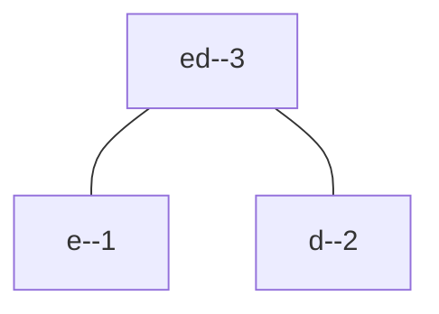
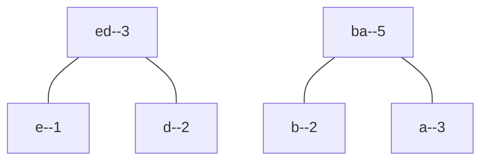
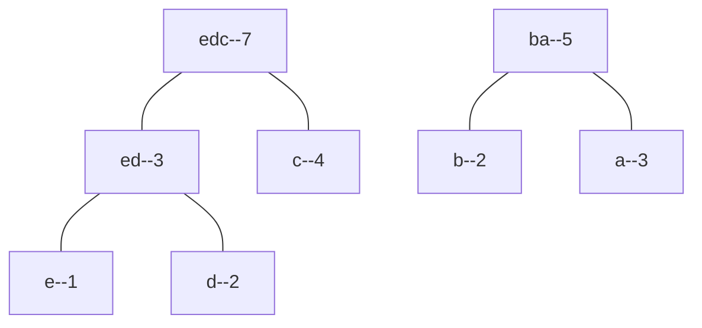
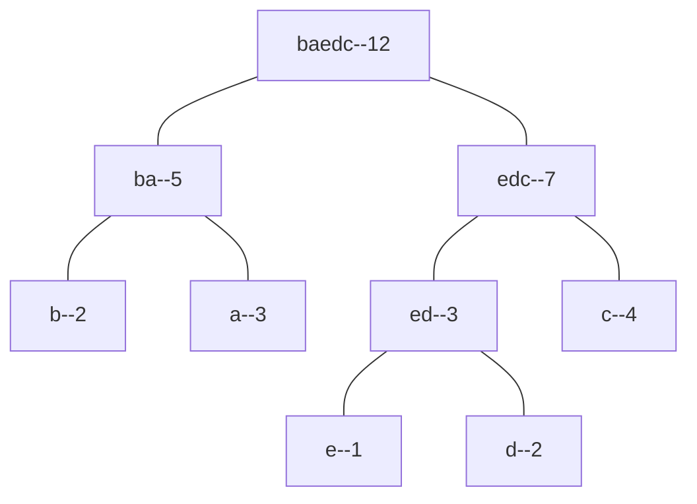
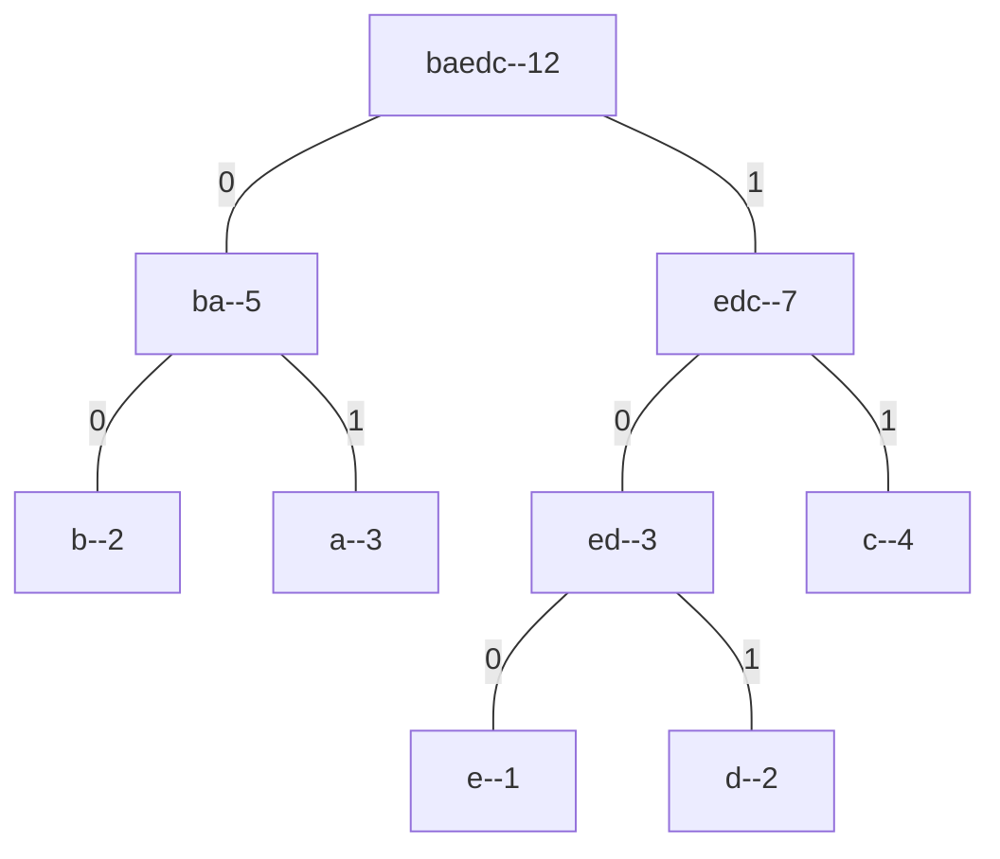
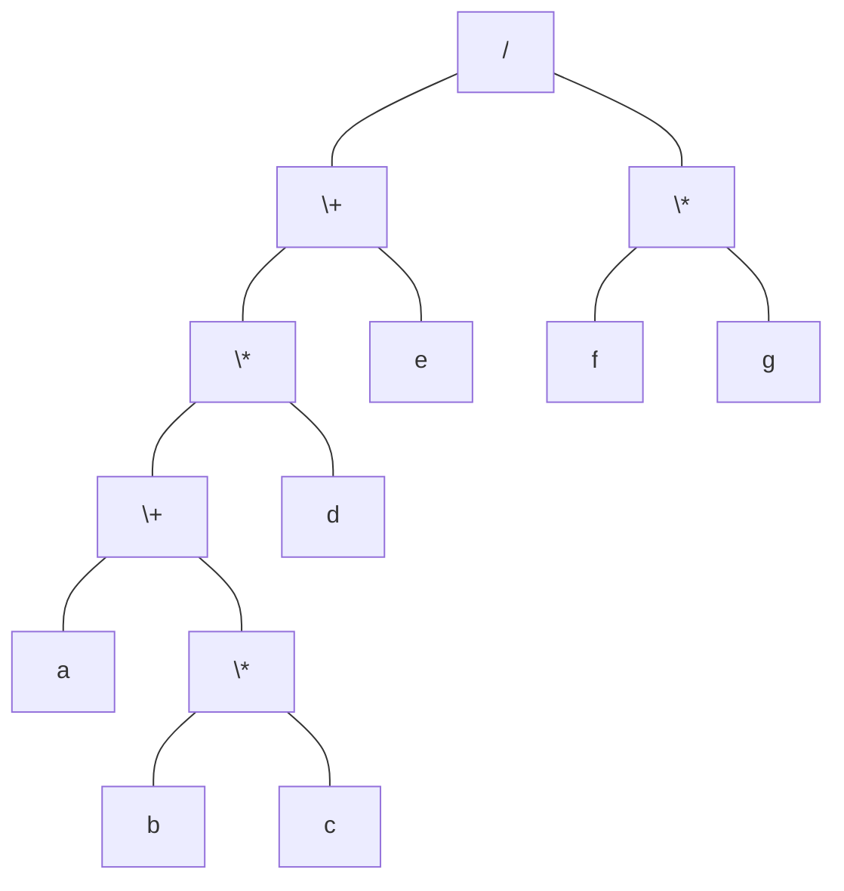

# 离散数学

## 命题逻辑

命题：唯一确定真值的陈述句。

简单命题/原子命题：不能进一步分解的命题，又称为**命题常项**。

命题变项：真值可变的简单陈述句。命题变项不是命题。

### 命题联结词

**定义** 设 $p,q$ 为任意命题，则 $\neg p$ 称为 $p$ 的否定式；$p\lor q$ 称为析取式；$p\land q$ 称为合取式。

**定义** 设 $p,q$ 为任意命题，则 $p\to q$ 称为蕴含式，其中 $p,q$ 分别称为前件和后件。蕴含式为假当且仅当 $p$ 为真 $q$ 为假。

**定义** 设 $p,q$ 为任意命题，则 $p\leftrightarrow q$ 称为等价式。等价式为真当且仅当 $p,q$ 同真假。

**运算优先级：$\neg,\land,\lor,\to,\leftrightarrow$** 。

### 命题公式

复合命题形式称为命题公式，是由命题常项、命题变项、联结词和括号构成的字符串。

递归定义合式公式：

* 单个命题变项是合式公式；
* 如果 $A$ 是合式公式，则 $\neg A$ 是合式公式；
* 如果 $A,B$ 是合式公式，则 $A\land B,A\lor B,A\to B,A\leftrightarrow B$ 都是合式公式；
* **只有有限次使用上述法则的字符串是合式公式。**

合式公式称为命题公式。

命题公式的层次：

* 单个命题变项是 0 层公式；
* 若 $A$ 是 $n$ 层公式，则 $\neg A$ 是 $n+1$ 层公式；
* 若 $A,B$ 是 $i,j$ 层公式，则 $A\land B,A\lor B,A\to B,A\leftrightarrow B$ 是 $\max(i,j)+1$ 层公式。

**定义** 设 $A$ 为命题公式，$p_1,\cdots,p_n$ 为 $A$ 中所有命题变项，则对 $p_i$ 的赋值称为 $A$ 的解释。若赋值后 $A$ 为真，则称其为成真赋值，否则称为成假赋值。对于命题公式 $A$ 的赋值 $p_i=a_i$，记赋值 $a_1a_2\cdots a_n$ 为按字典序赋值。

**定义** 设 $A$ 为命题公式。

* 若 $A$ 在任意赋值下为真，则称 $A$ 为重言式或永真式；
* 若 $A$ 在任意赋值下为假，则称 $A$ 为矛盾式或永假式；
* 若存在 $A$ 的成真赋值，则称 $A$ 为可满足式。

**定义**  $n$ 元真值函数 $F:\{0,1\}^n\to\{0,1\}$ 是一个 $n$ 阶笛卡尔积。

### 等值演算

每一个 $n$ 元命题公式的真值表存在 $2^n$ 个输出，通过改变每个输出，$n$ 个命题变项可以生成 $2^{2^n}$ 种不同的命题公式。

**定义** 设 $A,B$ 为命题公式，若 $A\leftrightarrow B$ 是重言式，则称 $A,B$ 等值，记为 $A\Leftrightarrow B$ 。

容易看出，$A,B$ 等值当且仅当它们有相同真值表。为了简便起见，我们直接将等值 $\Leftrightarrow$ 记为 $=$ 。 

我们列举一些常用的等值式：

- 分配律：$A\lor(B\land C)=(A\lor B)\land(A\lor C)$，$A\land(B\lor C)=(A\land B)\lor(A\land C)$ 
- 德摩根律：$\neg(A\lor B)=\neg A\land\neg B$，$\neg(A\land B)=\neg A\lor\neg B$
- 吸收律：$A\lor(A\land B)=A$，$A\land(A\lor B)=A$
- 蕴含等值式：$A\to B=\neg A\lor B$，$A\leftrightarrow B=(A\to B)\land(B\to A)$
- 假言易位：$A\to B=\neg B\to\neg A$
- 等价否定等值式：$A\leftrightarrow B=\neg A\leftrightarrow\neg B$
- 归谬论：$(A\to B)\land(A\to\neg B)=\neg A$

**置换定理** 设 $\Phi(A)$ 是含有命题公式 $A$ 的命题公式，若 $A=B$，则 $\Phi(A)= \Phi(B)$ 。

### 范式

**定义** 有限个**命题变项或其否定**构成的析取式称为简单析取式；有限个**命题变项或其否定**构成的合取式称为简单合取式。

**定义** 有限个**简单析取式构成的合取式**称为合取范式；有限个**简单合取式构成的析取式**称为析取范式。

**范式存在定理** 任意命题公式都存在与之等价的合取范式或析取范式。

**定义** 命题变项与其否定有且仅有一个出现一次的简单合取式称为极小项；每一个简单合取式都是极小项的析取范式称为主析取范式。

例如对于有 2 个命题变项的简单合取式，极小项有 $p\land q,\neg p\land q,p\land\neg q,\neg p\land\neg q$，分别唯一对应成真赋值 $11,01,10,00$ 。

**定理** 任意命题公式都存在**唯一**与之等价的主析取范式。

**证明** 事实上，对于任意命题公式，其真值表都唯一确定，因此我们可以列出命题公式 $A$ 的所有成真赋值。注意到主析取范式为真当且仅当其每个极小项都为真，因此我们将 $A$ 的所有成真赋值唯一对应到每一个极小项，则这些极小项的析取式就是与 $A$ 等价的主析取范式。

通常我们是通过等值置换将命题公式转化为对应的主析取范式，例如
$$
B = B\land 1 = B\land(p\lor\neg p) = (B\land p)\lor(B\land\neg p)
$$
从而在 $B$ 中引入了命题变项 $p$。通过类似方式将每个简单合取式转化为极小项的析取式。

主析取范式常用于判断两个命题公式是否等价，以及判断命题公式的类型。例如重言式对应的主析取范式必然有所有的极小项；矛盾式则不含任何极小项；可满足式至少有一个极小项。

**定义** 命题变项与其否定有且仅有一个出现一次的简单析取式称为极大项；每一个简单析取式都是极大项的合取范式称为主合取范式。

例如对于有 2 个命题变项的简单析取式，极大项有 $p\lor q,\neg p\lor q,p\lor\neg q,\neg p\lor\neg q$，分别唯一对应成假赋值 $00,10,01,11$ 。

**定理** 任意命题公式都存在**唯一**与之等价的主合取范式。

**证明** 对于命题公式 $A$，计算 $\neg A = m_1\lor m_2 =\neg(\neg m_1\land\neg m_2)$，其中 $m_i$ 是极小项。于是 $A=\neg m_1\land\neg m_2$ 就是主合取范式。

上述定理说明了求主合取范式的方法：先求出命题公式的否定式的主析取范式，然后取其中极小项的否定式的合取式即可。

### 联结词全功能集

**定义** 设 $S$ 是一个联结词集合，若任意真值函数可由 $S$ 中联结词的命题公式表示，则称 $S$ 为全功能集 *complete set* 。

**定理** $\{\neg,\land\},\{\neg,\lor\},\{\neg,\to\}$ 都是全功能集。

**定义** 设 $p,q$ 为任意命题，则 $p\uparrow q=\neg(p\land q)$ 称为与非联结词；$p\downarrow q=\neg(p\lor q)$ 称为或非联结词。

**定理** $\{\uparrow\},\{\downarrow\}$ 都是全功能集。

### 组合电路

对主析取范式进行化简，得到的包含最少运算的公式称为最简展开式。常用的化简方法是**奎因-莫克拉斯基方法**：

1. 合并简单合取式生成所有可能出现在最简展开式中的项。首先列出主析取范式中所有极小项的角码的二进制表示。2 个极小项可以合并当且仅当它们的二进制表示恰好有一位不同。例如
    $$
    (x\land\neg y\land z)\lor(\neg x\land\neg y\land z) = \neg y\land z
    $$
    其中两个极小项分别对应 $101,001$，只有 $x$ 对应的位不同，这说明此主析取范式与 $x$ 无关，因此可以消去。

2. 确定最简展开式中的项。通过将主析取范式中的极小项两两合并就得到简化后的公式。由于合并的方式不同，得到的展开式也不同，我们只需要选择其中包含运算符最少的展开式即可。

### 推理理论

**定义** 若 $(A_1\land\cdots\land A_k)\to B$ 为重言式，则称 $A_1,\cdots,A_k$ 推出结论 $B$ 推理正确，$B$ 是 $A_1,\cdots,A_k$ 的逻辑结论或有效结论，记为
$$
(A_1\land\cdots\land A_k)\Rightarrow B
$$
推理正确不能保证结论正确，因为前提可能是错的。

重要的推理定律：

- 附加：$A\Rightarrow(A\lor B)$
- 化简：$(A\land B)\Rightarrow A$
- 假言推理：$((A\to B)\land A)\Rightarrow B$
- 拒取式：$((A\to B)\land \neg B)\Rightarrow \neg A$
- 析取三段论：$((A\lor B)\land\neg A)\Rightarrow B$
- 假言三段论：$((A\to B)\land(B\to C))\Rightarrow (A\to C)$
- 等价三段论：$((A\leftrightarrow B)\land(B\leftrightarrow C))\Rightarrow(A\leftrightarrow C)$
- 构造性二难：$(A\to B)\land(C\to D)\land(A\lor C)\Rightarrow(B\lor D)$

#### 附加前提证明法

有时要证明的结论以蕴含式出现
$$
(A_1\land\cdots\land A_k)\to(A\to B)
$$
做等值运算可以得到
$$
(A_1\land\cdots\land A_k\land A)\to B
$$
此时称 $A$ 为附加前提。

#### 归谬法

设 $A_1,\cdots,A_k$ 是命题公式，若 $A_1\land\cdots\land A_k$ 可满足，则称 $A_1,\cdots,A_k$ 相容，否则称为不相容。利用等值运算得到
$$
(A_1\land\cdots\land A_k)\to B = \neg(A_1\land\cdots\land A_k\land\neg B)
$$
因此若 $A_1,\cdots,A_k,\neg B$ 不相容，则 $B$ 是 $A_1,\cdots,A_k$ 的逻辑结论。

### 一阶逻辑

经典三段论：凡是人都要死，苏格拉底是人，所以苏格拉底会死。

个体常项：表示具体的或特定的个体的词，用 $a,b,\cdots$ 表示。

个体变项：表示抽象的或泛指的个体的此，用 $x,y,\cdots$ 表示。

个体域：个体变项的取值范围。当无特殊说明时，个体域由一切事物组成，称为全总个体域。

谓词常项/变项：表示具体/抽象性质或关系的谓词，用 $F,G,H,\cdots$ 表示。

**定义** 个体变项 $x$ 具有性质 $F$ 记为 $F(x)$，个体变项 $x,y$ 具有关系 $L$ 记为 $L(x,y)$，它们都称为谓词。

性质 $F$ 是从个体域到二元集合 $\{0,1\}$ 上的映射，关系。 显然，谓词并不是命题，只有当使用个体常项代替谓词中的个体变项后，谓词才具有确定的真值，成为命题。

**定义** 全称量词 $\forall$ 表示所有的、任意的。$\forall x$ 表示对个体域中的所有个体，$\forall xF(x)$ 表示个体域中的所有个体都具有性质 $F$。

**定义** 存在量词 $\exists$ 表示存在着。$\exists x$ 表示存在个体域中的个体，$\exists xF(x)$ 表示存在个体域中的个体具有性质 $F$ 。

递归定义项：

* 个体常项和变项是项；
* 若 $\phi(x_1,\cdots,x_n)$ 是任意 $n$ 元函数，$t_1,\cdots,t_n$ 是项，则 $\phi(t_1,\cdots,t_n)$ 是项；
* **只有有限次使用上述法则的符号串是项。**

**定义** 设 $R(x_1,\cdots,x_n)$ 是 $n$ 元谓词，$t_1,\cdots,t_n$ 是项，则称 $R(t_1,\cdots,t_n)$ 是原子公式。

递归定义合式公式：

* 原子公式是合式公式；
* 如果 $A$ 是合式公式，则 $(\neg A)$ 是合式公式；
* 如果 $A,B$ 是合式公式，则 $(A\land B),(A\lor B),(A\to B),(A\leftrightarrow B)$ 都是合式公式；
* **只有有限次使用上述法则的符号串是合式公式。**

一阶逻辑中的合式公式称为谓词公式，最外层的括号可以去掉。

**定义** 合式公式 $\forall xA,\exists xA$ 中，称 $x$ 为指导变项，$A$ 为相应量词 $\forall,\exists$ 的辖域。在辖域中，$x$ 的所有出现称为约束出现。$A$ 中不是约束出现的其它变项的出现称为自由出现。若公式 $A$ 中无自由出现，则称 $A$ 是封闭的合式公式，简称闭式。

例如 $\forall x(F(x)\to\exists yH(x,y))$ 中，$\forall$ 的辖域是 $F(x)\to\exists yH(x,y)$，$\exists$ 的辖域是 $H(x,y)$；其中 $x,y$ 的出现都是约束出现。

在 $\exists xF(x)\land G(x,y)$ 中，$F(x)$ 中的 $x$ 是约束出现，而 $G(x,y)$ 中的 $x,y$ 是自由出现。

**换名规则** 指导变项及其辖域中的约束出现可被替换为公式中没有出现的个体变项符号。

例如 $\exists xF(x)\land G(x,y)$ 可换名为 $\exists zF(z)\land G(x,y)$，因为前者在辖域中约束出现，而后者自由出现。

**定义** 一个解释 $I$ 由非空个体域 $D$ 以及给公式中的**个体常项、函数变项、谓词变项**分别指定 $D$ 中的元素、函数和谓词后构成；对解释中**自由出现的个体变项**指定 $D$ 中的元素，称为在 $I$ 下的赋值。

在给定的解释和赋值下，任何公式都成为命题。

**定义** 设 $A$ 为谓词公式，若在任何解释和其赋值下 $A$ 为真，则称 $A$ 为逻辑有效式或永真式；若在任何解释和其赋值下 $A$ 为假，则称 $A$ 为矛盾式或永假式；若存在解释和其赋值下 $A$ 为真，则称 $A$ 为可满足式。

谓词公式的可满足性不可判定，即不存在可行的算法判断任一公式可满足。

**定义** 设 $A_0$ 是含命题变项 $p_1,\cdots,p_n$ 的命题公式，$A_1,\cdots,A_n$ 是谓词公式，用 $A_i$ 代换 $p_i$ 得到的公式 $A$ 称为 $A_0$ 的代换实例。

**定义** 设 $A,B$ 是一阶逻辑中的公式，若 $A\leftrightarrow B$ 是逻辑有效式，则称 $A,B$ 等值，记为 $A\Leftrightarrow B$ 。

为了简便起见，我们直接将等值 $\Leftrightarrow$ 记为 $=$ 。 

量词否定等值式：$\neg\forall xA(x)=\exists x\neg A(x)$，$\neg\exists xA(x)=\forall x\neg A(x)$

量词辖域收缩：$\forall x(A(x)\to B)=\exists xA(x)\to B$，$\exists x(A(x)\to B)=\forall xA(x)\to B$

量词分配：$\forall x(A(x)\land B(x))=\forall xA(x)\land\forall xB(x)$，$\exists x(A(x)\lor B(x))=\exists xA(x)\lor \exists xB(x)$

我们证明辖域收缩的等值式：
$$
\forall x(A(x)\to B) = \forall x(\neg A(x)\lor B) = \forall x\neg A(x)\lor B = \neg\exists xA(x)\lor B = \exists xA(x)\to B
$$
若 $B$ 为真，则公式恒为真；若 $B$ 为假，则右边公式为真当且仅当 $\exists xA(x)$ 为假，即 $\forall x\neg A(x)$ 为真，对应左边公式 $\forall x$ 有 $A(x)$ 为假。

**定义** 设 $A$ 为谓词公式，如果
$$
A = Q_1x_1Q_2x_2\cdots Q_kx_kB
$$
其中 $Q_i$ 是量词，$x_i$ 是命题变项，则称 $A$ 为前束范式。

**定理** 任何一阶逻辑的合式公式都存在与其等价的前束范式。

在这里，我们给出经典三段论的逻辑表达：
$$
\forall x(F(x)\to G(x))\land F(a)\to G(a)
$$
其中 $F(x)$ 表示 $x$ 是人，$G(x)$ 表示 $x$ 会死，$a$ 表示苏格拉底。

## 二元关系

### 笛卡尔积

**定义** 两个元素 $x,y$ 以一定顺序排列成的二元组称为有序对，记为 $(x,y)$。

**定义** 有序 $n$ 元数组是一个有序对 $(x_1,\cdots,x_n) = ((x_1,\cdots,x_{n-1}),x_{n})$ 。

**定义** 集合 $A,B$ 的笛卡尔积为 $A\times B=\{(x,y)\mid x\in A\land y\in B \}$ 。

容易看出 $\emptyset\times B=A\times\emptyset=\emptyset$，当 $A,B$ 都不是空集时 $A\times B\neq B\times A$ 。

**定义** 空集或有序对的集合称为二元关系，记为 $R$ 。若 $(x,y)\in R$，则记为 $xRy$，否则记为 $x\not R y$ 。

**定义** 笛卡尔积 $A\times B$ 的任何子集定义的二元关系称为从 $A$ 到 $B$ 的二元关系，若 $A=B$ 则称为 $A$ 上的二元关系。

任何集合 $A$ 都有 3 中特殊关系，空集称为空关系，还有全域关系 $E_A=A\times A$ 和恒等关系 $I_A=\{(x,x)\mid x\in A\}$ 。

**定义** 设 $A$ 为实数集的子集，则 $A$ 上的小于等于关系定义为 $L_A = \{(x,y)\mid x,y\in A\land x\le y \}$；设 $B$ 为正整数集的子集，则 $B$ 上的整除关系定义为 $D_B = \{(x,y)\mid x,y\in B\land x\mid y \}$ 。

**定义** 设 $A=\{x_1,\cdots,x_n\}$，$R$ 是 $A$ 上的关系，令
$$
r_{ij} = \begin{cases}
1, & x_iRx_j\\
0, & x_i\not Rx_j
\end{cases}
$$
则 $(r_{ij})_{n\times n}$ 是 $R$ 的关系矩阵。

**定义** 设 $V$ 是顶点的集合，$E$ 是有向边的集合，令 $V=A$ 。若 $x_iRx_j$ 则记为有向边 $(x_i,x_j)\in E$，则 $G=(V,E)$ 是 $R$ 的关系图。 

### 关系的运算

**定义** 关系 $R$ 的定义域 $domR$，值域 $ranR$ 和域 $fldR$ 分别为
$$
\begin{aligned}
domR &= \{x\mid\exists y((x,y)\in R) \}\\
ranR &= \{y\mid \exists x((x,y)\in R) \}\\
fldR &= domR \cup ranR
\end{aligned}
$$
关系可以看做一种作用，$(x,y)\in R$ 表示 $x$ 通过 $R$ 作用变到 $y$ 。

**定义** 设 $F,G$ 为关系，$A$ 为集合，则

* $F$ 的逆 $F^{-1}=\{(x,y)\mid yFx \}$
* $F\circ G=\{(x,y)\mid \exists z(xGz\land zFy) \}$
* $F$ 限制在 $A$ 上为 $F\upharpoonright A=\{(x,y)\mid xFy\land x\in A \}$
* $A$ 在 $F$ 下的像为 $F[A]=ran(F\upharpoonright A)$

**定义** 设 $R$ 为 $A$ 上的关系，则 $R$ 的 $n$ 次幂定义为

* $R^0=\{(x,x)\mid x\in A \}$
* $R^n = R^{n-1}\circ R^0$

对于有限集合 $A$ 上的关系，可以通过关系矩阵的运算得到 $R^n$。若 $R$ 有关系矩阵 $M$，则 $M^n$ 就是 $R^n$ 的关系矩阵，其中矩阵的相乘使用正常乘法和逻辑加法。事实上，$x_iR^2x_j$ 当且仅当存在 $k$ 使得 $x_iRx_k\land x_kRx_j$，对应矩阵乘法的索引关系。

**定理** 有限集 $A$ 上的关系 $R$ 的幂只有有限个。

**证明** 因为 $n$ 阶有限集上的关系最多有 $2^{n\times n}$ 种，因此最终必然有重复的幂。

### 关系的闭包

关系 $R$ 一般有如下性质：

* 自反性 $x_iRx_i$
* 反自反性 $x_i\not Rx_i$
* 对称性 $x_iRx_j\to x_jRx_i$
* 反对称性 $x_iRx_j\to x_i\not Rx_j$
* 传递性 $x_iRx_k\land x_k Rx_j\to x_iRx_j$

一般来说，任何自反关系都包含了恒等关系。

**定义** 设 $R$ 是非空集合 $A$ 上的关系，$R$ 的自反/对称/传递闭包是包含 $R$ 的满足自反/对称/传递性的最小关系。

一般将 $R$ 的自反闭包记为 $r(R)$，对称闭包记为 $s(R)$，传递闭包记为 $t(R)$ 。

**定理** 设 $R$ 是非空集合 $A$ 上的关系，则

* $r(R)=R\cup R^0$
* $s(R)=R\cup R^{-1}$
* $t(R)=R\cup R^2\cup R^3\cup\cdots$

若 $R$ 的关系矩阵为 $M$，则对应的 $M_r=M+E,M_s=M+M',M_t=M+M^2+M^3+\cdots$ 。

### 等价关系和偏序关系

**定义** 设 $R$ 为非空集合 $A$ 上的关系，如果 $R$ 满足自反、对称、传递性，则称 $R$ 为 $A$ 上的等价关系。任意 $(x,y)\in R$ 记为 $x\sim y$ 。

**定义** 设 $R$ 是非空集合 $A$ 上的等价关系，对任意 $x\in A$，令
$$
[x]_R = \{y\mid y\in A\land xRy \}
$$
则称 $[x]_R$ 为 $x$ 关于 $R$ 的等价类，简记为 $[x]$ 。

**定义** 设 $R$ 是非空集合 $A$ 上的等价关系，$A/R=\{[x]_R\mid x\in A \}$ 称为 $A$ 在 $R$ 作用下的商集。

**定义** 设 $A$ 是非空集合，若存在 $A$ 的子集族 $\pi\subset P(A)$ 满足

* $\emptyset\notin\pi$
* $\pi$ 中任意两个元素不交
* $\pi$ 中所有元素的并集等于 $A$

则称 $\pi$ 为 $A$ 的一个划分。

**定理** 集合 $A$ 上的等价关系与划分一一对应。

**定义** 设 $R$ 是非空集合 $A$ 上的关系，若 $R$ 满足自反、反对称、传递性，则称 $R$ 为 $A$ 上的偏序关系。任意 $(x,y)\in R$ 记为 $x\le y$ 。

**定义** 集合 $A$ 与 $A$ 上的偏序关系 $R$ 构成偏序集，记为 $(A,R)$ 。

**定义** 设 $(A,\le)$ 是偏序集，若 $x,y\in A\land(x\le y\lor y\le x)$，则称 $x,y$ 可比；若 $x<y$ 即 $x\le y\land x\neq y$，且不存在 $z\in A$ 使得 $x<z<y$，则称 $y$ 盖住 $x$ 。

**定义** 设 $(A,\le)$ 为偏序集，若任意 $x,y\in A$ 都可比，则称 $\le$ 为 $A$ 上的全序关系，称 $(A,\le)$ 为全序集。

有限偏序集可以用哈斯图来描述。图中每一个节点表示 $A$ 中的一个元素，节点位置按照在偏序中的次序从下到上排列，若 $y$ 盖住 $x$，则连接 $x,y$ 。如图是 $\{1,2,\cdots,12\}$ 与整除关系构成的哈斯图。

容易看出全序集的哈斯图是一条直线，故全序集也称为线序集。

**定义** 设 $(A,\le)$ 是偏序关系，$B\subset A$，则

* 若 $\exists y\in B,\forall x(x\in B\to y\le x)$，则称 $y$ 是 $B$ 中的最小元
* 若 $\exists y\in B,\forall x(x\in B\to x\le y)$，则称 $y$ 是 $B$ 中的最大元
* 若 $\exists y\in B,\neg\exists x(x\in B\land x< y)$，则称 $y$ 是 $B$ 中的极小元
* 若 $\exists y\in B,\neg\exists x(x\in B\land y< x)$，则称 $y$ 是 $B$ 中的极大元

极大元和最大元的关键区别在于可比性：如果没有与 $y$ 可比的元素，则 $y$ 就是极大元，同时也是极小元。

## 图的基本概念

### 无向图和有向图

当集合允许元素重复出现时称为多重集。设 $A,B$ 为两个集合，称 $\{\{a,b\}\mid a\in A\land b\in B \}$ 为 $A,B$ 的无序积，记作 $A\&B$ 。

**定义** 无向图 $G$ 是一个二元组 $(V,E)$，其中 $V$ 是非空有穷集合，称为顶点集，$V$ 中的元素称为顶点；$E$ 是无序积 $V\&V$ 的多重子集，称为边集，$E$ 中的元素称为无向边或边。顶点集记为 $V(G)$，边集记为 $E(G)$ 。

**定义** 有向图 $D$ 是一个二元组 $(V,E)$，其中 $V$ 是非空有穷集合，称为顶点集，$V$ 中的元素称为顶点；$E$ 是笛卡尔积 $V\times V$ 的多重子集，称为边集，$E$ 中的元素称为有向边或边。顶点集记为 $V(D)$，边集记为 $E(D)$ 。

有 $n$ 个顶点的图称为 $n$ 阶图；没有边的图称为零图；一阶零图称为平凡图。

**定义** 无向图 $G=(V,E)$ 中，边 $e=(u,v)$ 与端点 $u,v$ 关联。没有关联边的顶点称为孤立点。**若边的端点重合，则称此边为环**。

边与端点连接的次数称为关联次数，显然 $(u,v)$ 与 $u$ 关联一次，$(u,u)$ 与 $u$ 关联两次。

**定义** 无向图 $G=(V,E)$ 中，边 $e=(u,v)$ 与端点 $u,v$ 关联，称 $u,v$ 分别是 $e$ 的始点和终点，称 $u$ 邻接到 $v$。

若 $e$ 的终点和 $e'$ 的起点重合，则称 $e,e'$ 相邻。

**定义** 无向图中，顶点 $v$ 作为边端点的次数和称为 $v$ 的度数，记为 $d(v)$；有向图中，作为边始点的次数和称为出度，记为 $d^+(v)$，作为边终点的次数和称为入度，记为 $d^-(v)$，$v$ 的度数 $d(v)=d^+(v)+d^-(v)$ 。

度数为 1 的顶点称为悬挂顶点，其关联的边称为悬挂边。

对于无向图 $G=(V,E)$，记
$$
\Delta(G) = \max\{d(v)\mid v\in V\},\quad \delta(G)=\min\{d(v)\mid v\in V\}
$$
分别是 $G$ 的最大度和最小度。

**握手定理** 无向图或有向图 $G=(\{v_1,\cdots,v_n\},E),|E|=m$，则 $\sum_{i=1}^nd(v_i)=2m$ 。

**定理** 有向图 $D=(\{v_1,\cdots,v_n\},E),|E|=m$，则 $\sum_{i=1}^nd^+(v_i)=\sum_{i=1}^nd^-(v_i)=m$ 。

**推论** 任何图中奇数度的顶点数为偶数。

称 $\{d(v_1),\cdots,d(v_n)\}$ 为 $G$ 的度数序列。

**习题** 设 $(d_1,\cdots,d_n)$ 是互异正整数序列，则此序列不能构成无向简单图的度数序列。

**证明** 不妨设序列单增，由于互异性，必然有 $d_n\ge n$，然而简单图每个顶点的度数至多为 $n-1$，矛盾。

**定义** 无向图中关联同一对顶点的无向边如果多于一条，则称它们是平行边，条数称为重数。

含平行边的图称为多重图。**既不含平行边也不含环的图称为简单图。**

**定义** 设 $G=(V,E)$ 是 $n$ 阶无向简单图，若 $G$ 中任一顶点都与其它所有顶点相邻，则称 $G$ 为 $n$ 阶无向完全图，记为 $K_n$ 。

**定义** 设 $G=(V,E),G'=(V',E')$。

* 若 $V'\subset V,E'\subset E$，则称 $G'$ 是 $G$ 的子图，$G$ 是 $G'$ 的母图，记为 $G'\subset G$，如果 $G'\neq G$ 则称为真子图；
* 若 $G'\subset G,V'=V$，则称 $G'$ 是 $G$ 的**生成子图**；
* 若 $\emptyset\neq V_1\subset V$，则 $G$ 中端点都在 $V_1$ 中的边作为边集的 $G$ 的子图称为 $V_1$ 导出的导出子图，记为 $G[V_1]$；
* 若 $\emptyset\neq E_1\subset E$，则 $G$ 中关联边在 $E_1$ 中的顶点作为顶点集的 $G$ 的子图称为 $E_1$ 导出的导出子图，记为 $G[E_1]$ 。

**定义** 设 $G=(V,E)$ 是 $n$ 阶无向简单图，则 $\overline{G}=(V,\overline{E})$ 称为 $G$ 的补图，其中 $\overline{E}=\{(u,v)\mid u,v\in V\land(u,v)\notin E \}$ 。

**定义** 设无向图 $G_1=(V_1,E_1),G_2=(V_2,E_2)$，若存在双射 $f:V_1\to V_2$ 使得 $e_1=(u,v)\in E_1$ 当且仅当 $e_2=(f(u),f(v))\in E_2$，且 $e_1,e_2$ 重数相同，则称 $G_1$ 与 $G_2$ 同构。

### 图的连通性

**定义** 设 $G$ 中顶点和边的交替序列 $\Gamma=v_0e_1v_1e_2\cdots e_lv_l$，若其中 $v_{i-1},v_i$ 是 $e_i$ 的端点，则称 $\Gamma$ 是从 $v_0$ 到 $v_l$ 的**通路**。$\Gamma$ 中边的数目 $l$ 称为 $\Gamma$ 的长度。**当 $v_0=v_l$ 时，此通路称为回路。**

简单通路：$\Gamma$ 中所有边互不相同。当 $v_0=v_l$ 时称为简单回路。

初级通路/路径：除 $v_0,v_l$ 外 $\Gamma$ 中没有相同边和顶点。当 $v_0=v_l$ 时称为初级回路或圈。

**定理** 在 $n$ 阶图中，若存在 $u,v$ 之间的通路，则存在长度小于 $n$ 的初级通路。

**证明** 如果长度大于 $n-1$，则一定存在相同的顶点，则两个相同顶点之间的路径是圈，将此圈从通路中去除就得到更短的通路。重复此操作直到通路上没有相同顶点为止，此时长度不大于 $n-1$ 。由于最终通路上没有相同顶点，从而没有相同边，因此是初级通路。

**定义** 无向图 $G$ 中，若 $u,v$ 之间存在通路，则称 $u,v$ 连通；规定顶点与自身连通。如果所有顶点之间都连通，则称 $G$ 为连通图。

**定义** 有向图 $D$ 中，若 $u$ 到 $v$ 存在通路，则称 $u$ 可达 $v$；规定顶点与自身可达。**如果略去图中方向得到的无向图连通，则称 $D$ 弱连通，也称为连通**；如果任意两个顶点至少有一个可达另一个，则称 $D$ 单向连通；如果如果所有顶点之间都可达，则称 $D$ 强连通。

**顶点之间的连通关系是等价关系。于是按照 $R$ 可将 $V(G)$ 划分为等价类 $V_1,\cdots,V_k$，它们的导出子图 $G[V_1],\cdots,G[V_k]$ 称为 $G$ 的连通分支，$G$ 的连通分支个数记为 $p(G)$ 。**

称从 $G$ 中移除顶点集 $V'$ 和其关联的边为删除 $V'$，记为 $G-V'$；称从 $G$ 中移除边集 $E'$ 为删除 $E'$，记为 $G-E'$ 。

**定义** 设无向图 $G=(V,E),V'\subset V$，若 $p(G-V')>p(G)$，且对任意真子集 $V''\subset V'$ 有 $p(G-V'')=p(G)$，则称 $V'$ 为 $G$ 的点割集。若点割集中只有一个顶点 $v$，则称 $v$ 为割点。

**定义** 设无向图 $G=(V,E),E'\subset E$，若 $p(G-E')>p(G)$，且对任意真子集 $E''\subset E'$ 有 $p(G-E'')=p(G)$，则称 $E'$ 为 $G$ 的**边割集，简称割集。若边割集中只有一个边 $e$，则称 $e$ 为割边或桥。**

### 图的矩阵表示

**定义** 无向图 $G=(V,E),|V|=n,|E|=m$，令 $m_{ij}$ 为 $v_i,e_j$ 的关联次数，则 $(m_{ij})_{n\times m}$ 为 $G$ 的**关联矩阵**，记为 $M(G)$ 。

注意如果顶点 $v_i$ 关联的边 $e_j$ 是环，则 $m_{ij}=2$ 。容易验证，关联矩阵 $M(G)$ 第 $i$ 行元素之和是 $v_i$ 的度数，所有元素之和为 $2m$。

**定义** 有向图 $D=(V,E),|V|=n,|E|=m$ 中没有环，令
$$
m_{ij} = \begin{cases}
1, & e_j=(v_i,v_{j})\\
0, & \mathrm{otherwise}\\
-1, & e_j = (v_{j},v_i)
\end{cases}
$$
则 $(m_{ij})_{n\times m}$ 为 $D$ 的**关联矩阵**，记为 $M(D)$ 。

**定义** 有向图 $D=(V,E),|V|=n,|E|=m$，令 $a_{ij}^{(1)}$ 为 $v_i$ 邻接到 $v_j$ 的边的条数，称 $(a_{ij}^{(1)})_{n\times n}$ 为 $D$ 的**邻接矩阵**，记为 $A(D)$ 。

每条边是长度为 1 的通路，环是长度为 1 的回路，因而 $\sum_i\sum_ja_{ij}^{(1)}$ 是 $D$ 中长度为 1 的通路数，而 $\sum_ia_{ii}^{(1)}$ 是 $D$ 中长度为 1 的回路数。

**定理** 设 $A$ 为有向图 $D$ 的邻接矩阵，则 $A^l$ 中的元素 $a_{ij}^{(l)}$ 是 $v_i$ 到 $v_j$ 长度为 $l$ 的通路数，$\sum_i\sum_ja_{ij}^{(l)}$ 是 $D$ 中长度为 $l$ 的通路数，$\sum_ia_{ii}^{(l)}$ 是 $D$ 中长度为 $l$ 的回路数。

**证明** 类似于关系矩阵的乘法，将邻接矩阵相乘容易得到上面的意义。

注意：这里表示通路或回路的顶点边序列不同时认为它们是不同的通路或回路，例如 $v_0e_1v_1e_2v_0,v_1e_2v_0e_1v_1$ 被认为是不同回路。

**定义** 有向图 $D=(V,E),|V|=n,|E|=m$，令
$$
p_{ij} = \begin{cases}
1, & v_i\ 可达\ v_j\\
0, & \mathrm{otherwise}
\end{cases}
$$
称 $(p_{ij})_{n\times n}$ 为 $D$ 的可达矩阵，记为 $P(D)$ 。

由于 $v_i$ 可达 $v_j$ 当且仅当存在长度不大于 $n-1$ 的通路，考虑 $\sum_{k=1}^{n-1}A^{k}$ 中的元素 $p_{ij}^{(k)}$，易得 $v_i$ 可达 $v_j$ 当且仅当 $a_{ij}^k\neq 0$ 。也就是说，通过 $D$ 的邻接矩阵可以得到可达矩阵。

### 最短路径

给图中每条边 $e$ 附加实数 $w(e)$，则 $G$ 连同附加在边上的实数称为带权图，记为 $G=(V,E,W)$，其中 $W=\{w(e)\mid e\in E \}$ 。

最短路径问题：给定任意简单带权图 $G=(V,E,W)$ 及 $u,v\in V$，求 $u$ 到 $v$ 的最短路径及距离。

**Dijkstra 算法**：对每个顶点 $v_i$ 记录标记 $(d_i,\lambda_i)$，其中 $d_i$ 是到 $u$ 的距离，$\lambda_i$ 是路径上的前一个顶点。取 $u$ 作为初始顶点，设置不动顶点集 $U=\{u\}$ 和临时顶点集 $T=V-U$ ，标记 $u=(0,None)$，其余顶点标记为 $(+\infty,None)$ 。对于 $T$ 中顶点 $v_i$，考虑所有与其相邻的 $U$ 中顶点 $v_j$，计算距离 $d=d_i+w(v_i,v_j)$，如果 $d<d_j$，就更新 $v_j=(d,v_i)$ 。遍历 $T$ 中顶点后，将 $d_j$ 最小的顶点 $v_j$ 加入 $U$，同时将其从 $T$ 中移除。重复遍历直到 $T=\emptyset$ 。

### 二部图

**定义** 若无向图 $G=(V,E)$ 的顶点集 $V$ 可以划分为 $V_1,V_2$ 非空不交，使得 $E$ 中**任意边的端点分别在 $V_1,V_2$ 中**，则称 $G$ 为二部图，$V_1,V_2$ 称为互补顶点子集，此时将 $G$ 记为 $(V_1,V_2,E)$ 。若 $V_1,V_2$ 中每个顶点有且仅有一条边相关联，则称 $G$ 是完全二部图。若 $|V_1|=n,|V_2|=m$，完全二部图记为 $K_{n,m}$ 。

**定理** 无向图 $G$ 是二部图当且仅当 $G$ 中没有长度为奇数的回路。

**证明** 选取一个顶点 $v^0$ 划入 $V_1$，然后将与其相邻的顶点 $v_i^1$ 划入 $V_2$，则这些顶点满足二部图条件当且仅当 $v_i^1$ 之间不相邻，即不存在奇数回路 $v^0v_i^1v_j^1v^0$ 。取所有 $v_i^1$ 重复上述操作，相邻顶点 $v_i^2$ 划入 $V_1$，则这些顶点满足二部图条件当且仅当 $v_i^2$ 之间不相邻，且 $v_i^2,v^0$ 不相邻，即不存在奇数回路。以此类推，即证。

**定义** 无向图 $G=(V,E),M\subset E$，若 $M$ 中任意两边不相邻，则称 $M$ 是 $G$ 中的匹配。若 $M$ 加入任何一条边都不是匹配，则称 $M$ 是极大匹配。边数最多的匹配称为最大匹配，其边数记为 $\beta_1(G)$，称为 $G$ 的匹配数。

**定义** 设 $M$ 是 $G$ 中的匹配，$v\in V(G)$，若存在 $M$ 中的边与 $v$ 关联，则称 $v$ 为 $M$ 饱和点。若 $G$ 中每个顶点都是 $M$ 饱和点，称 $M$ 为完美匹配。

注意到任何匹配 $M$ 中的边的端点构成对 $G[M]$ 的划分，则 $G[M]$ 是二部图，且划分中顶点一一对应。对于完美匹配，则 $G[M]$ 中包含了 $G$ 的所有顶点，因此构成了 $G$ 顶点集的划分，划分中顶点一一对应。因此**存在完美匹配的图必然有偶数个顶点。**

**定义** 设 $G=(V_1,V_2,E)$ 为二部图，$|V_1|\le|V_2|$，$M$ 为 $G$ 的最大匹配，若 $|M|=|V_1|$，则称 $M$ 为 $G$ 中从 $V_1$ 到 $V_2$ 的完备匹配。

显然，当 $|V_1|=|V_2|$ 时，完备匹配是完美匹配。

**Hall 定理** 设 $G=(V_1,V_2,E)$，$|V_1|\le|V_2|$，$G$ 中存在 $V_1$ 到 $V_2$ 的完备匹配当且仅当 $V_1$ 中任意 $k$ 个顶点至少邻接 $V_2$ 中 $k$ 个顶点。

**推论** 设 $G=(V_1,V_2,E)$，若存在 $t>0$ 使得：

1. $V_1$ 中每个顶点至少关联 $t$ 条边；
2. $V_2$ 中每个顶点至多关联 $t$ 条边；

则 $G$ 中存在从 $V_1$ 到 $V_2$ 的完备匹配。

**证明** 由二部图的定义，$V_1$ 中任意 $k$ 个顶点至少关联 $V_2$ 中 $kt$ 个顶点，但 $V_2$ 中顶点至多关联 $t$ 条边，因此这 $k$ 个顶点至少邻接 $V_2$ 中 $k$ 个顶点，根据 Hall 定理即证。

### 欧拉图

**定义** 经过图中**每条边一次且仅一次**且遍历所有顶点的回路/通路称为欧拉回路/通路。**存在欧拉回路的图称为欧拉图。**

**定理** **无向图有欧拉回路当且仅当它连通且无奇度顶点**；有欧拉通路但无欧拉回路当且仅当它连通且恰有两个奇度顶点，这两个顶点是欧拉通路的端点。

**定理** **有向图有欧拉回路当且仅当它连通且每个顶点的出度等于入度**；有欧拉通路但无欧拉回路当且仅当它连通且除了两个顶点外，其余顶点的入度等于出度，这两个顶点中一个顶点的入度比出度大 1，另一个入度比出度小 1，且分别是欧拉通路的终点和始点。

**习题** 有向欧拉图一定强连通，但反之不一定。

**证明** 由于欧拉图中存在经过所有点的回路，故必然强连通。反之，取如下强连通图

显然它不是欧拉图。

### 哈密顿图

**定义** 经过图中**每个顶点一次且仅一次**的回路/通路称为哈密顿回路/通路。**存在哈密顿回路的图称为哈密顿图。**

**必要条件** 设无向图 $G=(V,E)$ 是哈密顿图，$V_1$ 是 $V$ 的任意非空子集，则 $p(G-V_1)\le|V_1|$ 。

**证明** 对于哈密顿回路 $C$，$V_1$ 中顶点最多把 $C$ 分成 $|V_1|$ 段，则 $p(C-V_1)\le|V_1|$，从而 $p(G-V_1)\le p(C-V_1)\le |V_1|$，即证。

**推论** 设无向图 $G=(V,E)$ 中有哈密顿通路，$V_1$ 是 $V$ 的任意非空子集，则 $p(G-V_1)\le|V_1|+1$ 。

**充分条件** 设 $G$ 是 $n$ 阶无向简单图，若 $G$ 中任何一对不相邻顶点度数和大于等于 $n-1$，则 $G$ 中存在哈密顿通路。如果度数和大于等于 $n$，则 $G$ 是哈密顿图。

**定理** 在 $n$ 阶有向图 $D=(V,E)$ 中，如果所有有向边略去方向后得到的无向图含生成子图 $K_n$，则 $D$ 存在哈密顿通路。

**习题** 有割点的无向图不是哈密顿图，但可能是欧拉图。

**证明** 若是哈密顿图，则存在经过所有顶点一次且仅一次的回路，去掉任何一个顶点都不增加连通分支，矛盾；欧拉图如下

中间的两个顶点都是割点。

### 平面图

**定义** 若图 $G$ 可以画在平面上使得除顶点外任意两边都不交叉，则称 $G$ 为平面图。这种形式的图称为 $G$ 的平面嵌入。

**定义** 设 $G$ 是平面嵌入，$G$ 的边将整个平面划分成若干个区域，每个区域称为 $G$ 的一个面。面积无限的区域称为无限面或外部面，记为 $R_0$，面积有限的区域称为有限面或内部面。**包围面 $R$ 的所有边构成的回路称为 $R$ 的边界，边界长度称为 $R$ 的次数，记为 $deg(R)$ 。**

**定理** 平面图的所有面的次数和为边数的 2 倍。

**证明** 任何一条边，要么在两个面的边界上，要么在一个面的边界上。对于前者，此边在两个面的回路中出现，计算两次次数；对于后者，此边在同一个面的回路中出现两次，计算两次次数，即证。

如图所示，前者 $v_1v_2$ 在两个面的回路上各出现一次，后者 $v_1v_2v_1$ 是同一个面的回路，$v_1v_2$ 出现两次。

**定义** 设 $G$ 是简单平面图，如果在 $G$ 中任意不相邻的两个顶点之间添加一条边后不是平面图，则称 $G$ 为极大平面图。若非平面图 $G$ 中删除任何一条边都得到平面图，则称 $G$ 为极小非平面图。

**定理**  $n$ 阶简单平面图是极大平面图当且仅当它连通且每个面的次数为 3，即每个面都是三角形。

**欧拉公式** 设 $G$ 是连通平面图，则 $n-m+r=2$，其中 $n$ 是顶点数，$m$ 是边数，$r$ 是面数。

**证明** 对边数 $m$ 作归纳法。当 $m=0$ 时，$G$ 为孤立点，显然成立；设 $m=k-1$ 时成立，分两种情况：

1. 若 $G$ 中至少有一个 1 度顶点 $v$，删除 $v$ 得到平面图 $G'$，并且 $n'=n-1,m'=m-1,r'=r$，于是
    $$
    n-m+r=(n'+1)-(m'+1)+r' = n'-m'+r'=2
    $$

2. 若所有顶点度数大于 1，则必有初级回路。任取初级回路 $C$，取 $C$ 上的一条边 $e$ 将其删除，得到 $G'$ 仍然是连通平面图，并且 $n'=n,m'=m-1,r'=r-1$，于是
    $$
    n-m+r=n'-(m'+1)+(r'+1) = n'-m'+r'=2
    $$

由归纳假设即证。

**推论** 任意有 $p$ 个连通分支的平面图有 $n-m+r=p+1$ 。

**证明** 对于每个连通分支 $G_i$，有 $n_i-m_i+r_i=2$，由于 $G_i,G$ 共用外部面，因此 $n=\sum_i n_i,m=\sum_im_i,r=\sum_ir_i-p+1$，从而 $n-m+r = 2p-p+1 = p+1$，即证。

**定理** 设 $G$ 是连通平面图，且每个面至少 $l$ 次，则
$$
m\le \frac{l}{l-2}(n-2)
$$
若 $G$ 是有 $p$ 个连通分支的平面图，且每个面至少 $l$ 次，则
$$
m\le \frac{l}{l-2}(n-p-1)
$$
**证明** 由于每个面的次数和是边数的两倍，因此 $2m\ge lr$，由欧拉公式 $2m\ge l(2-n+m)$，整理即证。

 

**推论**  $K_5,K_{3,3}$ 都不是平面图。

**证明** 由于 $K_5$ 每个面至少 3 次，$K_{3,3}$ 每个面至少 4 次，容易验证不满足上述定理，即证。

如图所示，图 1 到图 2 的变换称为消去 2 度顶点 $w$，反之称为插入 2 度顶点 $w$；图 3 到图 4 的变换称为收缩边 $(u,w)$，它是通过删除边然后取一个新的顶点代替 $u,w$，仍记为 $w$，并使其关联与之前 $u,w$ 关联的边。

**定义** 若 $G_1,G_2$ 同构，或经过反复插入或消去 2 度顶点后同构，则称 $G_1,G_2$ 同胚。

**库拉图斯基定理** 一个图是平面图当且仅当它不含与 $K_5,K_{3,3}$ 同胚的子图。

**定义** 若 $G_1$ 可通过若干次收缩边得到 $G_2$，则称 $G_1$ 可收缩到 $G_2$ 。

**库拉图斯基定理** 一个图是平面图当且仅当它不含可收缩到 $K_5,K_{3,3}$ 的子图。

**定义** 设 $G$ 是平面嵌入。在 $G$ 的每个面 $R_i$ 中放置一个顶点 $v_i^*$；对 $G$ 的每条边 $e$，若 $e$ 在 $R_i,R_j$ 的公共边界上，则作 $(v_i^*,v_j^*)$ 只与 $e$ 相交；若 $e$ 是桥，且在 $R_i$ 边界上，作以 $v_i^*$ 为端点的环只与 $e$ 相交。得到 $G^*=(v_i^*,e^*)$ 称为 $G$ 的对偶图。

**习题** 连通平面图的对偶图满足 $n^*=r,m^*=m,r^*=n$ 。

**证明** 由连通图的构造，$n^*=r$ 显然；

**定义** 设无向图 $G$ 无环，对 $G$ 的相邻顶点着不同色，称为 $G$ 的一种点着色。若能用 $k$ 种颜色给 $G$ 的顶点着色，则称 $G$ 是 $k$-可着色的。

**四色定理** 任何平面图都是 4-可着色的。

## 树

### 无向树及生成树

**定义** 不含回路的连通无向图称为无向树，简称树。每个连通分支均是树的非连通无向图称为森林。平凡图称为平凡树。树中度数为 1 的顶点称为树叶，否则称为分支点。

注意这里回路指的是简单回路或初级回路。

**定理** 设 $G$ 是无向图，则如下命题等价：

1. $G$ 是树
2. $G$ 中每对顶点间有唯一通路
3. $G$ 连通且 $m=n-1$
4. $G$ 无回路且 $m=n-1$
5. $G$ 无回路，但任意两个不相邻顶点间加一条边就得到唯一初级回路
6. $G$ 连通且每边都是桥

**证明** 我们按顺序证明。

$1\to 2$ 若 $G$ 是树，且存在一对顶点之间的两条通路，则它们合并得到回路，矛盾，即证；

$2\to 3$ 若有唯一通路，则 $G$ 连通，任取一个顶点 $u$，考虑到 $u$ 距离为 $d=0,1,\cdots,n-1$ 的点的集合 $V_d$ ，由于通路唯一，因此 $V_d$ 不交。任取 $V_i$，则 $V_i$ 中的任何一个顶点都与 $V_{i-1}$ 中的一个顶点关联，与 $V_j,j<i-1$ 中的顶点不关联，则从 $V_i$ 到 $V_{i-1}$ 中关联的边数为 $|V_i|$ ，因此 $m=\sum_{i=1}^{n-1}|V_i|=n-1$ ，即证；

$3\to 4$ 若 $G$ 连通且 $m=n-1$，反设 $G$ 中存在回路，则可以去掉回路上的边而保持连通性，重复操作得到 $G'$ 中没有回路，此时 $m'<m$，由于 $G'$ 仍然连通，因此每对顶点间有唯一通路，由上面结论 $m'=n-1=m$ 矛盾，即证；

$4\to 5$ 若 $G$ 无回路且 $m=n-1$，反设存在不相邻顶点连接后没有回路，则这两个顶点不连通。考虑 $G$ 的连通分支 $G_1,\cdots,G_k$，则 $G_i$ 都没有回路，于是 $G_i$ 中每对顶点有唯一通路，从而 $m_i=n_i-1$，于是
$$
n-1 = m=\sum_{i=1}^km_i = \sum_{i=1}^k(n_i-1) = n-k
$$
因此 $k=1$，于是 $G$ 是连通图，矛盾，即证；

$5\to 6$ 若 $G$ 无回路，但可连接不相邻顶点得到回路，由前面的讨论显然 $G$ 连通。若存在不是桥的边，则去掉此边 $G$ 仍连通，于是 $G$ 中必然存在回路，矛盾。因此 $G$ 中每边都是桥，即证；

$6\to 1$ 若 $G$ 连通且每边都是桥，则显然 $G$ 中没有回路，根据定义，$G$ 是树，即证。

**定理**  $n$ 阶非平凡树中至少有 2 片树叶。

**证明** 非平凡树中每个顶点度数不小于 1，设有 $k$ 片树叶，则有 $n-k$ 个顶点度数大于等于 2，由握手定理
$$
2m\ge k+2(n-k)
$$
并且 $m=n-1$，代入即得 $k\ge 2$ 。

**定义** 设 $G$ 是无向连通图，$T$ 是 $G$ 的生成子图且为树，则称 $T$ 是 $G$ 的生成树。$G$ 在 $T$ 中的边称为 $T$ 的树枝，其余称为 $T$ 的弦。所有弦的集合的导出子图称为 $T$ 的余树。

注意余树不一定是树，也不一定连通。

**定理** 任何无向连通图都有生成树。

**证明** 任取无向连通图，若没有回路，则是树；否则去掉回路上的一条边后仍然连通，同时回路数量减少 1，重复操作直到没有回路即证。

**推论** 若 $n$ 阶无向连通图有 $m$ 条边，则 $m\ge n-1$ 。

**定义** 设 $T$ 是连通图 $G$ 的生成树，对每一条弦 $e$，存在唯一由 $e$ 和 $T$ 的树枝构成的初级回路 $C_e$，称为对应 $e$ 的基本回路。基本回路的集合为 $T$ 的基本回路系统。

**定义** 设 $T$ 是连通图 $G$ 的生成树，对每一条树枝 $a$，存在唯一由 $a$ 和 $T$ 的弦的割集 $S_a$，称为对应 $a$ 的基本割集。基本割集的集合为 $T$ 的基本割集系统。

设 $C_1,C_2$ 是两条回路，若它们有公共边，则删除公共边，把每条回路变成若干通路，这些通路可以连接成若干回路，称作合并 $C_1,C_2$，将结果记为 $C_1\oplus C_2$ 。使用对称差符号 $\oplus$ 是因为结果中的边恰好是 $C_1,C_2$ 中边的对称差。

如图所示，$C_1,C_2$ 分别是左右半环形回路，删去红色标记的公共边后得到两个圆形回路。

**定理** 连通图中任一条回路都可以表示成基本回路的合并。

**证明** 对于连通图 $G$ 和生成树 $T$，图中任一条回路都含有 $T$ 的弦，此回路等于它所含有的弦对应的基本回路的合并。

**定义** 设连通图 $G=(V,E)$，把 $V$ 分割为不交非空子集 $V_1,V_2$，称 $S=\{(u,v)\mid (u,v)\in E\land u\in V_1\land v\in V_2 \}$ 为 $G$ 的广义割集。两个广义割集 $S_1,S_2$ 的合并等于它们的对称差 $S_1\oplus S_2$，仍然是广义割集。

**定理** 连通图中任一广义割集都可以表示成基本割集的合并。

**证明** 类似地，任一广义割集都含有树枝，它等于所含有的树枝对应的基本割集的合并。

如图所示，无向图 $G$ 的生成树 $T$ 由实线边构成，则 $C_e=aed,S_a=\{a,e,c,h,g\}$ 分别是对应的基本回路和基本割集。

**定义** 设 $T$ 是无向连通带权图 $G=(V,E,W)$ 的生成树，$T$ 中所有边的权之和称为 $T$ 的权，记为 $W(T)$。**$G$ 的所有生成树中权最小的生成树称为最小生成树。**

注意生成树的定义，生成子图要包含 $G$ 的顶点集，因此生成树也要包含所有顶点。

**避圈法(Kruskal 算法)** 输入 $n$ 阶无相连通带权图 $G=(V,E,W),|E|=m$，输出最小生成树 $T$ 。

1. 按权从小到大排列边，不妨设 $w_1\le w_2\le\cdots\le w_m$；
2. 令 $T=\emptyset,i=1$，若 $e_i$ 与 $T$ 中的边不构成回路，则将 $e_i$ 加入 $T$，令 $i\gets i+1$；重复操作直到 $|T|=n-1$。

最小生成树不是唯一的，如果存在相同权的边，根据不同的排列顺序会产生不同的结果。

### 根树

**定义** 若有向图 $D$ 略去方向后是无向树，则称 $D$ 为有向树。**非平凡有向树，若有顶点入度为 0，其余顶点入度为 1，则称为根树**。入度为 0 的顶点称为树根，入度为 1、出度为 0 的顶点称为树叶，入度为 1、出度大于 0 的顶点称为内点。内点和树根统称为分支点。

在画根树时，通常将树根放在最上方。从树根到顶点 $v$ 的通路长度为 $v$ 的层数，记为 $l(v)$ 。称层数相同的顶点在同一层。顶点的最大层数称为树高，记为 $h(T)$ 。

一棵根树可以看作家族树：

1. 若顶点 $a$ 邻接到 $b$，则称 $b$ 为 $a$ 的儿子，$a$ 为 $b$ 的父亲；
2. 若 $b,c$ 有同一个父亲，则称 $b,c$ 为兄弟；
3. 若 $a\neq d$ 且 $a$ 可达 $d$，则称 $a$ 为 $d$ 的祖先，$d$ 为 $a$ 的后代。

**定义** 设 $T$ 为一棵根树，$a$ 为 $T$ 中一个顶点且不是树根，称 $a$ 及其后代导出的子图 $T'$ 为 $T$ 的以 $a$ 为根的子树，简称根子树。

**定义** 如果对根树每一层上的顶点规定次序，称这样的根树为有序树。

**定义** 设 $T$ 为一棵根树，若每个分支点至多有 $t$ 个儿子，则称为 $r$ 叉树；若恰好有 $t$ 个儿子，则称为 $r$ 叉正则树。

**定义** 设 2 叉树 $T$ 有 $t$ 片树叶 $v_1,\cdots,v_t$，以及权 $w_1,\cdots,w_t$，称 $W(T)=\sum_{i=1}^tw_il(v_i)$ 为 $T$ 的权，其中 $l(v_i)$ 为 $v_i$ 的层数。达到最小的 $W(T)$ 的 2 叉树称为 $w_1,\cdots,w_t$ 的最优 2 叉树。

注意 2 叉树的权**由树叶的权和层数决定**。

### 前缀码

**定义** 设 $\beta=\alpha_1\alpha_2\cdots\alpha_n$ 是长为 $n$ 的符号串，称子串 $\alpha_1\alpha_2\cdots\alpha_j$ 为 $\beta$ 的前缀。

**定义** 设 $B=\{\beta_1,\beta_2,\cdots,\beta_m\}$ 是符号串的集合，若任意 $i\neq j$ 都有 $\beta_i,\beta_j$ 互相不是前缀，则称 $B$ 为前缀码。只有两个符号的前缀码称为 2 元前缀码。

例如 $\{0,10,110,1111\}$ 是前缀码，$\{1,11,101\}$ 不是前缀码。在数据存储时需要编码为二进制串，如果使用 $0,1,10$ 分别作为 $0,1,2$ 的编码，则 $102,210,22$ 的编码都是 $1010$，无法区分。**编码必须是前缀码**，等长的编码自然是前缀码，例如修改上面编码为 $\{0,10,11\}$ 分别表示 $0,1,2$ 就不会出现这种情况。

#### 二叉树存储

**习题** 设 $T$ 为 2 叉树，有 $t$ 片树叶。将 $T$ 的每个分支点关联的 2 条边分别标记为 $0,1$ 。若分支点只有一个儿子，此边可以标 $0$ 也可以标 $1$ 。从树根到树叶的通路上标记的数字组成的符号串的集合就是 2 元前缀码。

**证明** 对 $T$ 的树高 $h(T)$ 作归纳。当 $h=1$ 时，显然；若对 $h=k-1$ 成立，则当 $h=k$ 时，若树根有两个儿子，去掉树根后得到左右子 2 叉树 $T',T''$ 高度 $h'=h''=h-1=k-1$，由归纳假设，$T',T''$ 产生的符号串集合 $S',S''$ 都是 2 元前缀码，且 $T$ 产生的符号串集合为
$$
S=\{0a'\mid a'\in T'\}\cup\{1a''\mid a''\in T''\} = 0S'\cup 1S''
$$
由于符号串长度非零，因此 $0S',1S''$ 分别都是 2 元前缀码，且显然取并集后仍然满足要求。树根只有一个儿子的情况同理可证。

当要传输按一定比例出现的符号时，需要寻找使用二进制数字尽可能少的前缀码。

**定义** 设电文中含有 $t$ 种字符，字符 $a_i$ 出现的频率为 $p_i$，它的编码长度为 $l_i$，则长度为 $n$ 的电文编码的期望长度为 $n\sum_{i=1}^tl_ip_i$，称此期望最小的 2 元前缀码为最佳 2 元前缀码。

#### Huffman 算法

二叉树路径编码启发我们：由于到达叶节点的路径一定互不包含，因此**以路径构造的编码总是前缀码**。此外，根据路径的长度，我们需要让频率高的字符路径更短，频率低的字符路径更长。

**Huffman 算法** 此算法尽可能让权小的节点层数大，权大的节点层数小，从而达到最优结果：

给定实数 $w_1,\cdots,w_t$，先作 $t$ 片以它们为权的树叶。在所有入度为 0 的顶点中选出两个权最小的顶点，添加一个新分支点，它以这 2 个顶点为儿子，其权等于这两个儿子的权之和。重复操作直到只有一个入度为 0 的顶点。

假设一段文本中出现字符 `{a,b,c,d,e}`，出现频次为 `{3,2,4,2,1}`，则

1. 将它们按照出现频次从小到大排序
$$
\matrix{\bigg|e(1) \bigg|d(2) \bigg| b(2) \bigg| a(3) \bigg| c(4) \bigg|}
$$
2. 取出现频次最小的两个字符组成两个叶节点，将它们的频次相加，重新排序（**如果频次相同，将字符数较多的放在后面**）
$$
\matrix{\bigg|b(2) \bigg| a(3) \bigg| ed(3)  \bigg| c(4) \bigg|}
$$

3. 接着取频次最小的两个字符组成两个叶节点，将它们的频次相加，重新排序
$$
\matrix{\bigg|ed(3)  \bigg| c(4) \bigg| ba(5) \bigg|}
$$

4. 继续重复操作
$$
\matrix{\bigg|ba(5) \bigg| edc(7) \bigg|}
$$

5. 重复操作
$$
\matrix{\bigg| baedc(12) \bigg|}
$$

6. 最后进行编码：左节点路径编码为 0，右节点路径编码为 1，路径上的所有编码连接得到叶节点的最终编码

于是每个字符的编码为

|     | a   | b   | c   | d   | e   |
| --- | --- | --- | --- | --- | --- |
| 频次  | 3   | 2   | 4   | 2   | 1   |
| 编码  | 01  | 00  | 11  | 101 | 100 |

用出现频次乘编码长度之后求和，就得到最终压缩后的编码长度
$$
    3 \times 2 + 2 \times 2 + 4 \times 2 + 2 \times 3 + 1 \times 3 = 27
$$
因此只需要 27 比特来保存数据。

> >哈夫曼编码是前缀码，因此无歧义。同时它也是编码长度最短的编码算法。

### 遍历树

访问根树的每个顶点一次且仅一次称为行遍或周游这棵树。对于 2 叉树，有 3 中行遍方法：

1. 中序行遍法：依次访问左子树、树根、右子树；
2. 前序行遍法：依次访问树根、左子树、右子树；
3. 后序行遍法：依次访问左子树、右子树、树根。

#### 表示算式

可以用二叉有序树表示算式，根据不同的行遍方式产生算式的不同表达式。我们在每个分支点上放一个运算符。每个二元运算符有左右孩子，表示左孩子通过运算符与右孩子运算；每个一元运算符有一个孩子，表示该运算符直接作用于孩子，根据运算符的作用方式决定孩子放在右边（如 $\neg p$）或左边（如 $A^{-1}$）。运算对象存放在所有树叶中，如图所示

- 中序行遍：$((a+(b*c))*d+e)\div(f*g)$
- 前序行遍：$\div(+(*(+a(*bc)d)e))(*fg)$
- 后序行遍：$(((a(bc*)+)d*)e+)(fg*)\div$

可以看出，中序行遍法会还原表达式。

#### 前/后缀表达式

舍去前序行遍法结果中的所有括号，得到的表达式
$$
\div+*+a*bcde*fg
$$
称为前缀符号法或波兰符号法。按照如下方式计算表达式：从后向前，每个运算符作用于后面相邻的两个数。例如
$$
\begin{aligned}
\div+*+a*bcde*fg &= \div+*+a*bcde(f*g)\\
&= \div+*+a(b*c)de(f*g)\\
&= \div+*(a+(b*c))de(f*g)\\
&= \div+((a+(b*c))*d)e(f*g)\\
&= \div(((a+(b*c))*d)+e)(f*g)\\
&= (((a+(b*c))*d)+e)\div(f*g)
\end{aligned}
$$
类似地，舍去后序行遍法中的所有括号，得到的表达式
$$
abc*+d*e+fg*\div
$$
称为后缀符号法或逆波兰符号法。按照相反的方式计算表达式：从前向后，每个运算符作用于前面相邻的两个数。

对于中缀表达式 $((a+(b*c))*d+e)\div(f*g)$，首先按照运算顺序加括号，然后将其中符号移动到括号右侧，就得到后缀表达式。例如 $(a+b)\to (ab)+$，再如
$$
\begin{aligned}
&(((a+(b*c))*d)+e)\div (f*g)\\
\to &(((a(bc)*)+d)*e)+ (fg)*\div\\
\to &abc*+d*e+fg*\div
\end{aligned}
$$
类似地，可以将中缀表达式转为前缀表达式。

## 组合分析

### 排列组合方法

**定义** 从 $n$ 个元素的集合 $S$ 中有序选取 $r$ 个元素称为 $S$ 的一个 $r$ 排列，排列总数记为 $P_n^r$ 。如果 $r=n$，则称为全排列。

**定理** 对任意 $r\le n$ 有
$$
P_n^r = \frac{n!}{(n-r)!}
$$
其中规定 $0!=1$ 。

**定理** 一个 $n$ 元集合 $S$ 的环形 $r$ 排列数为
$$
\frac{P_n^r}{r} =\frac{n!}{r(n-r)!}
$$
**证明** 由于 $r$ 排列围成环后有 $r$ 种重复情形，只需要除以 $r$ 即可。

**定义** 从 $n$ 元集合 $S$ 中无序选取 $r$ 个元素叫做 $S$ 的一个 $r$ 组合，组合总数记为 $C_n^r$ 。

**定理** 对任意 $r\le n$ 有
$$
C_n^r = \frac{n!}{r!(n-r)!}
$$
**推论** 对一切 $r\le n$ 有 $C_n^r=C_n^{n-r}$ 。

**定理** 设 $S$ 为 $n$ 元集合，则 $S$ 的子集总数为
$$
2^n = C_n^0+C_n^1+\cdots+C_n^n
$$
**证明** 左边容易理解，$S$ 中每个元素要么出现在子集中，要么不出现，因此有 $2^n$ 种可能；根据子集的大小，$S$ 的子集是所有包含 $k$ 个元素的集合的总数，因此将 $C_n^k$ 求和。于是左右相等。

**定义** 多重集是元素可以多次出现的集合。把元素 $a_i$ 出现的次数 $n_i$ 称为重复度，可以将 $S$ 记为
$$
\{n_1\cdot a_1,n_2\cdot a_2,\cdots,n_k\cdot a_k \}
$$
在选取问题中，$n_i\cdot a_i$ 表示 $a_i$ 最多可以选取 $n_i$ 次。当 $n_i=\infty$ 时，则可以选取任意次。

**定义** 从多重集 $S$ 中有序选取 $r$ 个元素叫做 $S$ 的一个 $r$ 排列。当 $r=n=\sum_in_i$ 时，称为 $S$ 的排列。

**定理** 设 $S=\{\infty\cdot a_1,\cdots,\infty\cdot a_k \}$，则 $r$ 排列有 $k^r$ 种。

**推论** 若  $S=\{n_1\cdot a_1,n_2\cdot a_2,\cdots,n_k\cdot a_k \}$，且 $n_i\ge r$，则 $r$ 排列有 $k^r$ 种。

**定理** 若 $S=\{n_1\cdot a_1,n_2\cdot a_2,\cdots,n_k\cdot a_k \}$，且 $n=\sum_in_i$，则 $S$ 的排列数为
$$
\binom{n}{n_1n_2\cdots n_k} = \frac{n!}{n_1!n_2!\cdots n_k!}
$$
**证明** 在 $n$ 个位置中 $a_1$ 要占据 $n_1$ 个，这些位置有 $C_n^{n_1}$ 种；$a_2$ 要在 $n-n_1$ 个中占据 $n_2$ 个，有 $C_{n-n_1}^{n_2}$ 种。以此类推，于是排列数为
$$
C_n^{n_1}C_{n-n_1}^{n_2}\cdots C_{n-n_1-\cdots-n_{k-1}}^{n_k} = \frac{n!}{n_1!n_2!\cdots n_k!}
$$

**定义** 从多重集 $S$ 中无序选取 $r$ 个元素叫做 $S$ 的一个 $r$ 组合。

**定理** 设 $S=\{\infty\cdot a_1,\cdots,\infty\cdot a_k \}$，则 $r$ 组合有 $C_{k+r-1}^r$ 种。

**证明** 任何一个 $r$ 组合设为 $\{x_1\cdot a_1,\cdots,x_k\cdot a_k\}$，其中 $x_1+\cdots+x_k=r$ 。我们将这个组合对应到多重集
$$
T=\{(k-1)\cdot 0,r\cdot 1\}
$$
中的一个排列
$$
\underbrace{1\cdots 1}_{x_1}\ 0\ \underbrace{1\cdots 1}_{x_2}\ 0\ \cdots\ 0\ \underbrace{1\cdots 1}_{x_k}
$$
中间有 $k-1$ 个 0，这种对应方式是一一对应。于是只需要考虑 $T$ 的排列数，由上面定理即有
$$
N = \binom{r+k-1}{r,k-1} = \frac{(r+k-1)!}{r!(k-1)!} = C_{r+k-1}^r
$$

**推论** 若  $S=\{n_1\cdot a_1,n_2\cdot a_2,\cdots,n_k\cdot a_k \}$，且 $n_i\ge r$，则 $r$ 组合有 $C_{k+r-1}^r$ 种。

**推论** 设 $S=\{\infty\cdot a_1,\cdots,\infty\cdot a_k \},r\ge k$，则 $S$ 中每个元素至少取一个的 $r$ 组合数为 $C_{r-1}^{k-1}$ 。

**证明** 事实上，只需取 $S$ 的一个 $r-k$ 组合，然后向其中加入 $a_1,a_2,\cdots,a_k$ 元素，就得到每个元素至少取一个的 $r$ 组合，因此只需计算所有 $r-k$ 组合的个数。

**习题** 求满足 $x_1+x_2+x_3\le 6$ 的正整数解的个数。

**解** 取 $r\le 6$，考虑 $\{\infty\cdot a_1,\infty\cdot a_2,\infty\cdot a_3\}$ 的 $r$ 组合，每个 $r$ 组合都有形式 $\{x_1\cdot a_1,x_2\cdot a_2,x_3\cdot a_3\}$，且 $x_1+x_2+x_3=r$ 。因此根据上面定理，满足 $x_1+x_2+x_3=r$ 的正整数解有 $C_{2+r}^r$ 种，将所有 $r$ 的情况相加即可。

**习题** 设有 $n$ 个座位，从其中选出 $k$ 个互不相邻的座位有多少种选法？

**解** 先取定 $k$ 个座位，为了保证不相邻，在中间 $k-1$ 个空隙中分别放一个座位，得到确定的 $2k-1$ 个座位，剩余 $n-2k+1$ 个座位随便放入空隙。注意由于不区分顺序，因此有 $k+1$ 个空隙。例如，图中红色方块是选定的座位，黑色方块是空位
$$
\color{red}{\rule{20pt}{10pt}}\quad \color{black}1\quad \color{black}{\rule{20pt}{10pt}}\quad \color{black}2\quad \color{red}{\rule{20pt}{10pt}}\quad \color{black}{\rule{20pt}{10pt}}\quad \color{red}{\rule{20pt}{10pt}}
$$
在 $1,2$ 位置放入空位是一样的，并且两端方块的左、右分别也可以放入空位，因此有 4 个位置放入空位。将剩余 $n-2k+1$ 个座位放入 $k+1$ 个位置，我们在每两个位置间加入挡板，记为 0，每个座位记为 1，于是问题转化为：
$$
T=\{k\cdot 0,(n-2k+1)\cdot 1\}
$$
中的排列数，由前面的定理我们有
$$
N = \binom{n-k+1}{k,n-2k+1} = \frac{(n-k+1)!}{k!(n-2k+1)!} = C_{n-k+1}^k
$$
因此共有 $C_{n-k+1}^k$ 种取法。

**习题** 设 $N=\{1,2,\cdots,n\},f:N\to N$，若 $f$ 单增，有多少种 $f$ ？若 $f$ 严格单增，有多少种 $f$ ？

**解** 任何 $f:N\to N$ 都可以看作序列 $12\cdots n$ 的排列，第 $i$ 个元素是 $f(i)$。当 $f$ 单增时，序列中元素可以重复，因此考虑
$$
S_1 = \{\infty\cdot 1,\infty\cdot 2,\cdots,\infty\cdot n\}
$$
中的 $n$ 组合，将每个 $n$ 组合按照递增顺序排序后就得到一个单增的 $f$ ，显然有 $C_{2n-1}^n$ 种；当 $f$ 严格单增，只有唯一一种。

### 递推方程

**例题** 汉诺塔的递归算法分成 3 个步骤：

1. 用算法将上面 $n-1$ 个盘子从 $A$ 移到 $B$；
2. 将最下面的盘子从 $A$ 移到 $C$；
3. 用算法将 $B$ 的 $n-1$ 个盘子移到 $C$ 。

假设算法移动 $n$ 个盘子需要 $T(n)$ 步，则我们有递推方程
$$
T(n) = 2T(n-1) + 1,\quad T(1) = 1
$$
利用迭代法可以求解此方程
$$
T(n) = 2T(n-1)+1 = 2^2T(n-2) + 2+1 = \cdots =2^{n-1}T(1)+2^{n-2}+\cdots +2+1 = 2^{n-1}
$$
因此 $T(n)=2^{n-1}$ 就是原方程的解。

**定义** 设序列 $\{a_0,a_1,\cdots,a_n,\cdots\}$ 记为 $\{a_n\}$，把 $a_n$ 与 $a_i,i<n$ 联系起来的等式称为 $\{a_n\}$ 的递推方程。如果 $T(n)$ 依赖 $T(n-1),\cdots,T(1)$，则称为全部历史递推方程。

**例题** 二分归并排序法。假设 $n=2^k$，则每步归并的数组一样大，我们估计最差的情况，即归并最多需要 $W(n)$ 步。于是两个 $n/2$ 的子数组分别归并需要 $2W(n/2)$ 步，然后归并这两个数组最多需要 $n-1$ 步，因此
$$
W(n) = 2W(n/2)+n-1,\quad W(1) = 0
$$
由于我们假设 $n=2^k$，因此
$$
W(n) = 2W(2^{k-1})+2^k-1 = 2^kW(1)+k2^k-(2^{k-1}+\cdots+2+1) = k2^k-2^k+1 = n\log n-n+1
$$
于是归并排序最坏情形下需要 $O(n\log n)$ 步。

**例题** 快速排序法。考虑平均步数 $T(n)$，首元素在 $k$ 位置，划分为两个部分需要 $O(n)$ 步，两个子问题规模为 $k-1,n-k$，因此
$$
T(n) \approx T(k-1)+T(n-k) + O(n)
$$
对所有 $k$ 的情况取平均值就有
$$
T(n) = \frac{1}{n}\sum_{k=1}^{n-1}[T(k-1)+T(n-k) + O(n)] = \frac{2}{n}\sum_{k=1}^{n-1}T(k) + O(n)
$$
对于这种问题，利用差消法
$$
\begin{aligned}
nT(n) &= 2\sum_{k=1}^{n-1}T(k) + c(n^2)\\
(n-1)T(n-1) &= 2\sum_{k=1}^{n-2}T(k) + c(n-1)^2
\end{aligned}
$$
两式作差得到递推式即可迭代求解。

**习题** 利用递推方程求解 $1,2,\cdots,n$ 的错位排列个数 $D_n$ 。

**解** 错位排列要求每个数和它的下标都不同。先考虑 $1$ 的位置，它有 $n-1$ 种选择，不妨设为 $2$；再考虑 $2$ 的位置，若放在 $1$，则剩下的恰好是 $D_{n-2}$，若放在其它 $n-2$ 种位置，例如 $3$，则继续考虑 $3$ 的位置。以此类推，得到递推式
$$
D_n = (n-1)[D_{n-2}+(n-2)[D_{n-3}+\cdots+3[D_2+2D_1]\cdots]],\quad D_1 = 0
$$
使用差消法
$$
\begin{aligned}
D_n &= \sum_{k=1}^{n-2}\frac{(n-1)!}{(n-k-1)!}D_{n-k-1}\\
D_{n-1} &= \sum_{k=1}^{n-3}\frac{(n-2)!}{(n-k-2)!}D_{n-k-2} = \sum_{k=2}^{n-2}\frac{(n-2)!}{(n-k-1)!}D_{n-k-1} = \frac{1}{n-1}\sum_{k=2}^{n-2}\frac{(n-1)!}{(n-k-1)!}D_{n-k-1}
\end{aligned}
$$
因此有 $D_n=(n-1)(D_{n-1}+D_{n-2})$，做变形
$$
A_n = D_n-nD_{n-1} = -[D_{n-1}-(n-1)D_{n-2}] = -A_{n-1},\quad A_2 = D_2-2D_1 = 1
$$
从而我们有 $A_n=(-1)^n$，于是 $D_n=nD_{n-1}+(-1)^n$ 。利用迭代法
$$
\begin{aligned}
D_n &= nD_{n-1}+(-1)^n\\
&= n(n-1)D_{n-2}+(-1)^{n-1}n+(-1)^n\\
&=\cdots\\
&=n(n-1)\cdots2D_1 +(-1)^2n(n-1)\cdots3+\cdots+(-1)^n\\
&= \sum_{k=2}^n(-1)^k\frac{n!}{k!}
\end{aligned}
$$
最终得到 $D_1=0,D_n=\sum_{k=2}^n(-1)^k\frac{n!}{k!}$ 。

### 分治法

考虑多项式
$$
A(x) = a_0+a_1x+\cdots+a_{n-1}x^{n-1}
$$
要计算 $A(x)$ 在所有 1 的 $2n$ 次方根上的值，即计算 $A(w_j)$，其中
$$
w_j = e^{(2\pi j/2n)i},\quad j=0,1,\cdots,2n-1
$$
**算法 1** 对于给定的 $\omega_j$，依次计算 $a_ix^i$ 然后求和，对每个 $j$ 进行计算，则需要计算的乘法次数为 $T(n)=O(n^3)$ 。

**算法 2** 注意到可以重复利用已经计算出的幂，考虑 $A_i(x)=a_{n-i}+xA_{i-1}(x),A_1(x)=a_{n-1}$，递推计算出 $A_n(x)$ 即可。由于每一次计算需要 1 次乘法和 1 次加法，对每个 $j$ 计算就只需要 $T(n)=o(n^2)$ 次乘法。

**算法 3** 使用分治法。将 $A(x)$ 分割为奇数项和偶数项
$$
\begin{aligned}
A_{even} &= a_0+a_2x+\cdots+a_{2k}x^k\\
A_{odd} &= a_1+a_3x+\cdots+a_{2k+1}x^k\\
n &= 2k+1
\end{aligned}
$$
于是 $A(x)=A_{even}(x^2)+xA_{odd}(x^2)$，利用 $w_j$ 的性质，如果 $w_j$ 是 8 次方根，则 $w_j^2$ 就是 4 次方根。

计算所有方根，需要 $D_1(n)=O(n)$ 次。若递归需要 $D_2(n)$ 的工作量，则计算子问题 $A_{even},A_{odd}$ 需要 $2D_2(n/2)$ 。对每个 $w_j$ 归并计算最终结果需要 $O(n)$，因此时间复杂度为
$$
T(n) = D_1(n)+D_2(n),\quad D_2(n) = 2D_2(n/2) + O(n)
$$
注意到 $D_1(n)=O(n),D_2(n)=O(n\log n)$，因此 $T(n)=O(n\log n)$ 。
