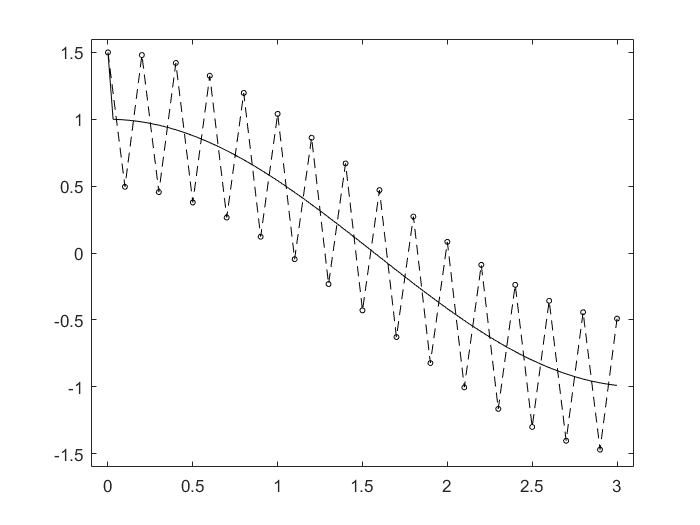
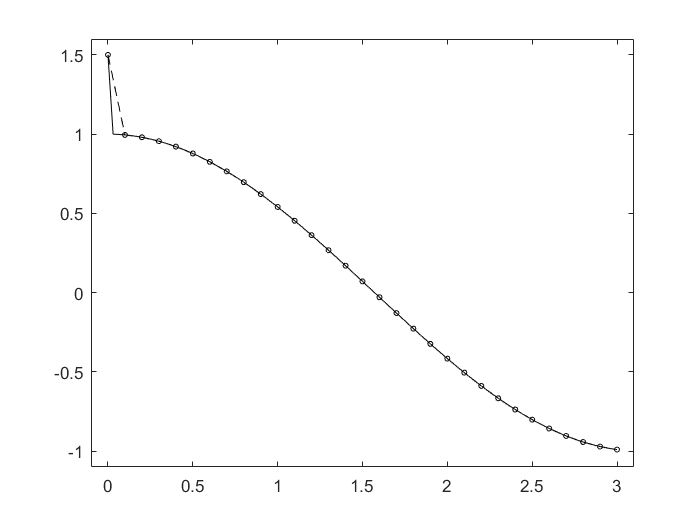

# Numerical Methods for Differential Equations

## Boundary Value Problems (BVPs)

**Definition 7.1.** 偏微分方程 *partial differential equation* (PDE) 是一个包含多个变量的未知函数与它的偏导数构成的方程.


**Definition 7.2.** 拉普拉斯方程 *Laplace equation* 是二阶 PDE，有形式
$$
-\Delta u(\vec{x}) = 0
$$
其中未知函数 $u:\overline{\Omega}\to\mathbb{R}$， $\overline{\Omega}$ 是开集 $\Omega\subset\mathbb{R}^n$ 的闭包，拉普拉斯算子 *Laplacian operator* $\Delta:\mathcal{C}^2(\Omega)\to\mathcal{C}(\Omega)$ 为
$$
\Delta = \sum_{i=1}^n\dfrac{\partial^2}{\partial x_i^2}
$$

**Definition 7.4.** 泊松方程 *Poisson's equation* 是二阶 PDE，有形式
$$
-\Delta u(\vec{x}) = f(\vec{x})
$$
其中未知函数 $u:\overline{\Omega}\to\mathbb{R}$， $\overline{\Omega}$ 是开集 $\Omega\subset\mathbb{R}^n$ 的闭包，以及 $RHS$ 函数 $f:\Omega\to\mathbb{R}$ 已给出 *priori* .


**Definition 7.5.** 边值问题 *boundary value problem* (BVP) 是带有边界条件 *boundary conditions* 的偏微分方程.


**Definition 7.6.** 常见的边值条件有

* *Dirichlet conditions* : $u(a) = \alpha,\ u(b) = \beta$ 
* *Mixed conditions* : $u(a) = \alpha,\ \frac{\partial u}{\partial x}\big|_b = \beta$ 
* *Neumann conditions* : $\frac{\partial u}{\partial x}\big|_a = \alpha,\ \frac{\partial u}{\partial x}\big|_b = \beta$ 


### Finite differences (FD) methods

**Formula 7.8.** 求解线性边值问题的 FD 方法

1. 将问题在网格上离散化
2. 用有限差分公式在网格上逐点逼近 PDE 结果，得到线性方程组 $AU=F$，其中 $U$ 逼近在网格上的未知变量，而 $F$ 是 BVP 条件
3. 求解线性代数方程


**Example 7.9** (An FD method for Poisson's equation in a unit interval). 考虑一维 BVP
$$
-u^{\prime\prime}(x) = f(x),\quad x\in(0,1) = \Omega
$$
带有狄利克雷边值条件
$$
u(0) = \alpha,\quad u(1) = \beta
$$
我们可以按照如下方法计算：

首先将 $\Omega$ 均匀分割为网格
$$
x_j = jh,\quad h = \dfrac{1}{m+1},\quad j=0,\cdots,m+1
$$

令 $U_0=\alpha,\ U_{m+1}=\beta$，然后计算 $U_1,\cdots,U_m$ 使得 $U_j$ 逼近 $u(x_j)$ ；

然后通过 FD 公式逼近导数 $u^{\prime\prime}$ 
$$
u^{\prime\prime}(x_j) = \dfrac{u_{j-1}-2u(x_j)+u(x_{j+1})}{h^2} + O(h^2)
$$

利用上式我们就得到线性方程组
$$
AU=F
$$
其中 $U = (U_1,\cdots,U_m)^T,\ F = (f(x_1)+\frac{\alpha}{h^2},f(x_2),\cdots,f(x_{m-1}),f(x_m)+\frac{\beta}{h^2})^T$，并且
$$
A = \dfrac{1}{h^2}\left(
\begin{matrix}
2 & -1 \\
-1 & 2 & -1\\
& -1 & 2 &-1\\
& & \ddots & \ddots & \ddots\\
& & & -1 & 2 & -1\\
& & & & -1 & 2
\end{matrix}
\right)
$$
称为**离散拉普拉斯算子**，然后只需要求解线性方程组，即可得到在均匀网格上对 $u(x_j)$ 的估计.


### Errors and consistency

**Definition 7.10.**  FD 公式的全局误差 *global error* 或求解误差 *solution error* 是
$$
E = U - \widehat{U}
$$
其中 $\widehat{U}=(u(x_1),\cdots,u(x_m))^T$ 是真实值，而 $U$ 是计算值.


**Definition 7.11.** 网格函数 *grid function* 是 $g:X\to\mathbb{R}$，其中 $X$ 是离散网格，它包含了有限个点.


**Definition 7.12.** 网格函数 $g$ 在一维网格 $X=\{x_1,\cdots,x_N\}$ 上的 $q$ 范数为
$$
\|g\|_q = \left(h\sum_{i=1}^N|g_i|^q \right)^{\frac{1}{q}},\quad g = (g_1,\cdots,g_N)
$$
特别的， $1$ 范数和最大范数 *max-norm* 为
$$
\|g\|_1 = h\sum_{i=1}^N|g_i|,\quad \|g\|_{\infty} = \max_{1\le i\le N}|g_i|
$$

**Definition 7.14.**  FD 方法的**局部截断误差 *local truncation error* (LTE)** 是通过 FD 公式替换连续导数导致的；注意**局部截断误差是利用精确解的估计 $F$ 的误差，全局误差是计算解和精确解的误差**.


**Note.** 网格函数用于分析求解误差的收敛性，因为随着 $n$ 的增加，虽然误差在减小，但是误差向量的规模增加了，例如 $1$ 范数就可能不会收敛，这就需要使用网格函数。网格函数的范数本质上就是 $L_p$ 范数
$$
\|g\|_p = \left(\int_{\Omega}|g(x)|^pdx \right)^{\frac{1}{p}}
$$
但是因为只能获取离散格点上的函数值，因此就应当用离散点作为每一段区间上的值进行积分，于是就有
$$
\|g\|_p = \left(h\sum_{i=1}^N |g_i|^p \right)^{\frac{1}{p}}
$$
类似地，如果在二维网格上，就应当用离散点作为每一个方形区域的值作二重积分，就有
$$
\|g\|_p = \left(h^2\sum_{i=1}^N |g_i|^p \right)^{\frac{1}{p}}
$$
更高维度上的网格范数以此类推.


**Lemma 7.16.**  FD 方法的 LTE 是用精确解 $u(x_j)$ 替换 $U_j$ 来计算右边函数 $F$ 的误差，即
$$
\tau = A\widehat{U}-F
$$
注意其中 $\widehat{U}$ 是真实值.


**Lemma 7.17.** 全局误差和 LTE 有关系
$$
AE = -\tau
$$
$Proof.$  $AE = A(U-\widehat{U})=F-(F+\tau) = -\tau$ .


**Definition 7.18.** 称 FD 方法是关于 BVP 一致的 *consistent* 若
$$
\lim_{h\to0}\left\|\tau^h\right\| = 0
$$
 其中 $\tau^h$ 是 LTE，注意**这里 $h$ 不是指数**.


### Convergence and stability

**Definition 7.19.** 一个 FD 方法是收敛的当
$$
\lim_{h\to0}\left\|E^h\right\| = 0
$$
其中 $E^h$ 就是上面定义的解误差.


**Definition 7.20.** 一个 FD 方法稳定 *stable* 若

1.   $\lim_{h\to0}A$ 可逆
2.   $\lim_{h\to0}\left\|A^{-1}\right\|=O(1)$ 


**Theorem 7.21.** 一个一致且稳定的 FD 方法收敛.

$Proof.$ 事实上，利用 $AE = -\tau$ 容易验证
$$
\lim_{h\to0}\left\|E^h\right\| \le \lim_{h\to0}\left\|(A^h)^{-1}\right\| \lim_{h\to0}\left\|\tau^h\right\| \le C\lim_{h\to0}\left\|\tau^h\right\| = 0
$$
即证.


#### Stablility in the 2-norm

**Definition 7.22** (Matrix norms induced by vector norms). 矩阵 $A\in\mathbb{R}^{n\times n}$ 的范数定义为
$$
\|A\| = \sup\left\{\dfrac{\|Ax\|}{\|x\|}:x\in\mathbb{R}^n,x\neq0\right\} = \sup\left\{\|Ax\|:\|x\|=1\right\}
$$
关于常用的由向量范数诱导的矩阵范数在数值代数中已经有过陈述.


**Lemma 7.24.** 在 Example 7.9 中得到的矩阵 $A$ 的特征值 $\lambda_k$ 和对应的特征向量 $w_k$ 为
$$
\lambda_k(A) = \dfrac{4}{h^2}\sin^2\dfrac{k\pi}{2(m+1)},\quad w_{k,j} = \sin\dfrac{jk\pi}{m+1}
$$
其中 $j,k=1,2,\cdots,m$ .

$Proof.$ 利用三角变换
$$
\sin\alpha + \sin\beta = 2\sin\dfrac{\alpha+\beta}{2}\cos\dfrac{\alpha-\beta}{2}
$$
可以直接验证.


**Theorem 7.25.** 在 Example 7.9 中得到的 FD 方法在 2 范数下 2 阶收敛.

$Proof.$ 由于矩阵 $A$ 对称，因此有 $\|A\|_2=\rho(A)$，那么
$$
\lim_{h\to0}\left\|A^{-1}\right\|_2 = \lim_{h\to0}\dfrac{1}{\min|\lambda_p|} = \lim_{h\to0}\dfrac{h^2}{4\sin^2\frac{\pi h}{2}} = \dfrac{1}{\pi^2} = O(1)
$$
则它是稳定的；由泰勒公式，对于
$$
D^2u(x_j) = \dfrac{u(x_{j-1})-2u(x_j)+u(x_{j+1})}{h^2}
$$
它的局部误差 LTE 为
$$
\tau_j = -D^2u(x_j) - (-u^{\prime\prime}(x_j)) = -\dfrac{h^2}{12}u^{(4)}(x_j)+O(h^4)
$$
因此该方法是一致的，由上面的误差项 $\tau_j$ 是 $O(h^2)$ 从而二阶收敛.


#### Green's function

**Definition 7.26.** 对任意固定的 $\overline{x}\in[0,1]$，格林函数 $G(x;\overline{x})$ 是 BVP 
$$
\left\{
\begin{aligned}
&u^{\prime\prime}(x) = \delta(x-\overline{x});\\
&u(0) = u(1) = 0
\end{aligned}
\right.
$$
的解，其中 $\delta(x-\overline{x})$ 是狄拉克函数.


**Lemma 7.27.** 格林函数 $G(x;\overline{x})$ 是
$$
G(x;\overline{x}) = \left\{
\begin{aligned}
&(\overline{x}-1)x,\quad x\in[0,\overline{x}]\\
&\overline{x}(x-1),\quad x\in[\overline{x},1]
\end{aligned}
\right.
$$


$Proof.$ 假设 $G(x)$ 是 BVP 的解，则对任意固定的 $\epsilon$ 有
$$
\int_{x_0-\epsilon}^{x_0+\epsilon}G^{\prime\prime}(x)dx = \int_{x_0-\epsilon}^{x_0+\epsilon}\delta(x-\overline{x})dx = \left\{
\begin{aligned}
0,\quad &\overline{x}\notin(x_0-\epsilon,x_0+\epsilon)\\
1,\quad &\overline{x}\in(x_0-\epsilon,x_0+\epsilon)
\end{aligned}
\right.
$$
令 $\epsilon\to0$，则利用微积分基本定理
$$
\lim_{\epsilon\to0}G^{\prime}(x_0+\epsilon) - \lim_{\epsilon\to0}G^{\prime}(x_0-\epsilon) = \left\{
\begin{aligned}
0,\quad &x_0\neq \overline{x}\\
1,\quad &x_0= \overline{x}
\end{aligned}
\right.
$$
代入下面的待定系数解
$$
G(x;\overline{x}) = \left\{
\begin{aligned}
ax+b,\quad &x_0\in[0,\overline{x}]\\
cx+d,\quad &x_0\in[\overline{x},1]
\end{aligned}
\right.
$$
解出系数即证.


**Corollary 7.28.** 线性 BVP 
$$
\left\{
\begin{aligned}
&u^{\prime\prime}(x) = c\delta(x-\overline{x});\\
&u(0) = u(1) = 0
\end{aligned}
\right.
$$
的解是
$$
u(x) = cG(x;\overline{x})
$$
这是上面引理的直接推论.


#### Stability in the max-norm

**Lemma 7.29.** 对于 Example 7.9 中的矩阵 $A$，任意 $B=A^{-1}$ 的元素是
$$
b_{ij} = -hG(x_i;x_j) = \left\{
\begin{aligned}
&-h(x_j-1)x_i,\quad i\le j\\
&-hx_j(x_i-1),\quad i\ge j
\end{aligned}
\right.
$$
更准确地，矩阵 $B$ 为
$$
B = -h\left(
\begin{matrix}
x_1(x_1-1) & x_1(x_2-1) & \cdots & x_1(x_m-1)\\
x_1(x_2-1) & x_2(x_2-1) & \cdots & x_2(x_m-1)\\
\vdots & \vdots & \ddots & \vdots\\
x_1(x_m-1) & x_2(x_m-1) & \cdots & x_m(x_m-1)
\end{matrix}
\right)
$$
注意规律是**下标较小的 x 在外面，下标较大的 x 在括号里**.

$Proof.$ 只需要验证 $i$ 行 $j$ 列向量的乘积满足条件即可.


**Theroem 7.30.**  $\|B\|_{\infty} = \max_{1\le i\le m}\sum_{j=1}^m|b_{ij}|\le 1$ .

$Proof.$ 利用无穷范数的性质
$$
\begin{aligned}
\sum_{j=1}^m|b_{ij}| &= \sum_{j=1}^ihx_j|x_i-1| + \sum_{j=i+1}^mhx_i|x_j-1|\\
&\le \sum_{j=1}^ih\left(\dfrac{m}{m+1}\right)^2 + \sum_{j=i+1}^mh\left(\dfrac{m}{m+1}\right)^2\\
&= mh\left(\dfrac{m}{m+1}\right)^2 = \left(\dfrac{m}{m+1}\right)^3 \le 1
\end{aligned}
$$
即证.


### A solution via Green's function

**Lemma 7.31.** 设 $\mathcal{L}$ 是一个可逆线性算子，满足
$$
\mathcal{L}u(x) = f(x)
$$
则格林函数 $G$ 满足 $\mathcal{L}G(x;\overline{x})=\delta(x-\overline{x})$ 使得
$$
u(x) = \int G(x;\overline{x})f(\overline{x})d\overline{x}
$$
$Proof.$ 两边同乘 $f(\overline{x})$ 然后对 $\overline{x}$ 积分得到
$$
\int \mathcal{L}G(x;\overline{x})f(\overline{x})dx = \int \delta(x-\overline{x})f(\overline{x})d\overline{x} = f(x)
$$
最后一步用到了狄拉克函数的性质，然后由线性性质
$$
\mathcal{L}\int G(x;\overline{x})f(\overline{x})dx = f(x)
$$
又知道 $\mathcal{L}$ 可逆，即证.


**Theorem 7.32.** 狄利克雷 Dirichlet BVP
$$
\left\{
\begin{aligned}
&u^{\prime\prime}(x) = f(x),\\
&u(0) = \alpha,\ u(1) = \beta
\end{aligned}
\right.
$$
有解
$$
u(x) = \alpha G_0(x) + \beta G_1(x) + \widehat{U}(x)
$$
其中 $G_0,G_1,\widehat{U}$ 都是由 BVPs 定义的
$$
\begin{aligned}

\left\{
\begin{aligned}
&G_0^{\prime\prime}(x) = 0,\\
&G_0(0) = 1,\ G_0(1) = 0
\end{aligned}
\right.\quad &\Rightarrow\quad G_0(x) = 1-x\\

\left\{
\begin{aligned}
&G_1^{\prime\prime}(x) = 0,\\
&G_1(0) = 0,\ G_1(1) = 1
\end{aligned}
\right.\quad &\Rightarrow\quad G_1(x) = x\\

\left\{
\begin{aligned}
&\widehat{U}^{\prime\prime}(x) = f(x),\\
&\widehat{U}(0) = 0,\ \widehat{U}(1) = 0
\end{aligned}
\right.\quad &\Rightarrow\quad \widehat{U}(x) = \int_0^1f(\overline{x})G(x;\overline{x})d\overline{x}

\end{aligned}
$$
实际上是将该 BVP 拆分成了 3 个部分分别求解，再利用 Lemma 7.31 中的线性性质.


### Other boundary conditions

**Example 7.33.** 考虑 2 阶 BVP
$$
u^{\prime\prime}(x) = f(x),\quad x\in(0,1)
$$
带有混合边值条件
$$
u^{\prime}(0) = \sigma,\quad u(1) = \beta
$$
这时我们对 $x=0$ 处 $u(x)$ 的信息未知。介绍三种逼近方法：

首先是使用单边逼近，用在 $x=0$ 处的导数定义近似边值条件
$$
\dfrac{U_1-U_0}{h} = \sigma
$$
中间仍使用 2 阶 FD 公式逼近，然后得到 $m+2$ 阶线性方程组（注意之前是 $m$ 阶）
$$
A_EU_E = F_E
$$
其中 $U_E = (U_0,U_1,\cdots,U_m,U_{m+1})^T,\ F_E=(\sigma,f(x_1),f(x_1),\cdots,f(x_m),\beta)^T$，并且
$$
A_E = \dfrac{1}{h^2}\left(
\begin{matrix}
-h & h \\
-1 & 2 & -1\\
& -1 & 2 &-1\\
& & \ddots & \ddots & \ddots\\
& & & -1 & 2 & -1\\
& & & & -1 & 2 & -1\\
& & & & & 0 & h^2
\end{matrix}
\right)
$$
通过这种方式得到的近似在 $x_0 = 0$ 处的 LTE 为
$$
\begin{aligned}
\tau_0 &= \dfrac{1}{h^2}(hu(x_1)-hu(x_0)) - \sigma\\
&= u^{\prime}(x_0)+\dfrac{1}{2}hu^{\prime\prime}(x_0)+O(h^2)-\sigma\\
&= \dfrac{1}{2}hu^{\prime\prime}(x_0)+O(h^2)
\end{aligned}
$$
上式由 Taylor 展开直接得到，可以看到它仅仅是 1 阶精度；

第二种方法是扩充定义域到 *ghost cell*  $x_{-1}=-h$，然后对称使用导数定义
$$
\dfrac{U_{1}-U_{-1}}{2h} = \sigma
$$
注意在这时，计算之前的 LTE 会发现它是 2 阶精度。但是，我们并不知道 $U_{-1}$ 处的信息，因此我们希望使用 FD 公式近似
$$
\dfrac{1}{h^2}(U_{-1}-2U_0+U_{1}) = f(x_0)
$$
由上面两式可以得到
$$
\dfrac{1}{h}(-U_0+U_1) = \sigma + \dfrac{h}{2}f(x_0)
$$
最终得到的 $A_E$ 与之前相同，区别在于 $F_E$ 的第一个分量多了一项 $\frac{h}{2}f(x_0)$ ；

第三种方法是同时用 $U_0,U_1,U_2$ 来近似 $u^{\prime}(0)$，只需要构造合适的 FD 公式就可以得到
$$
-\dfrac{1}{h}\left(\dfrac{3}{2}U_0-2U_1+\dfrac{1}{2}U_2\right) = \sigma + O(h^2)
$$
最终 $U_E,F_E$ 与之前相同，而
$$
A_F = \dfrac{1}{h^2}\left(
\begin{matrix}
-\dfrac{3}{2}h & 2h & -\dfrac{1}{2}h \\
-1 & 2 & -1\\
& -1 & 2 &-1\\
& & \ddots & \ddots & \ddots\\
& & & -1 & 2 & -1\\
& & & & -1 & 2 & -1\\
& & & & & 0 & h^2
\end{matrix}
\right)
$$
显然该近似是 2 阶精度.


**Example 7.35.** 考虑 2 阶 BVP
$$
u^{\prime\prime}(x) = f(x),\quad x\in(0,1)
$$
带有纯 Neumann 边值条件
$$
u^{\prime}(0) = \sigma_0,\quad u^{\prime}(1) = \sigma_1
$$
为了保证解的存在性，还需要添加条件
$$
\int_0^1f(x)dx = \int_0^1u^{\prime\prime}(x)dx = u^{\prime}(1)-u^{\prime}(0) = \sigma_1-\sigma_0
$$
事实上，只要满足上面条件，对于 BVP 的任意一个解 $v$，都有 $v+\mathbb{R}$ 是一个解集；

求解该 BVP 的方法与之前类似，我们得到
$$
A_FU_E = F_F
$$
其中 $F_F = \left(\sigma_0+\frac{h}{2}f(x_0),f(x_1),\cdots,f(x_m),-\sigma_1+\frac{h}{2}f(x_{m+1})\right)^T$，并且
$$
A_F = \dfrac{1}{h^2}\left(
\begin{matrix}
-h & h \\
-1 & 2 & -1\\
& -1 & 2 &-1\\
& & \ddots & \ddots & \ddots\\
& & & -1 & 2 & -1\\
& & & & -1 & 2 & -1\\
& & & & & h & -h
\end{matrix}
\right)
$$
容易发现该近似是 2 阶精度.


**Lemma 7.36.** 矩阵 $A_F$ 满足
$$
\dim\mathcal{N}(A_F) = 1
$$
$Proof.$ 显然 $e=(1,1,\cdots,1)^T$ 在 $A_F$ 的零空间中，由边值问题的适定性 *well-posedness* 即证.


**Theorem 7.37** (Solvability condition). 上述线性系统有解当且仅当
$$
\dfrac{h}{2}f(x_0)+h\sum_{i=1}^mf(x_i) + \dfrac{h}{2}f(x_{m+1}) = \sigma_1-\sigma_0
$$
$Proof.$ 由线性代数基本定理
$$
\mathbb{R}^{m+2} = \mathcal{R}(A_F)\oplus\mathcal{N}(A_F^T)
$$
并且 $\dim\mathcal{N}(A_F^T) = \dim\mathcal{N}(A_F)$ . 事实上，对于任意 $A\in\mathbb{R}^{m\times n}$，像空间 $\mathcal{R}(A)$ 和零空间 $\mathcal{N}(A^T)$ 都是由 $m$ 维向量生成的，并且 $\mathcal{R}(A)$ 中的元素是 $A$ 列向量 $(A_1,\cdots,A_n)$ 的线性组合，而
$$
\forall v\in \mathcal{N}(A^T),\quad A^Tv = 0\quad \Rightarrow\quad A_i^Tv = 0,\quad i=1,\cdots,n
$$
因此两个空间正交。根据 Lemma 7.36 又知道 $\dim\mathcal{N}(A_F^T) = 1$，可以验证 $(1,h,\cdots,h,1)^T\in\mathcal{N}(A^T)$，从而
$$
\mathcal{N}(A^T) = \mathrm{span}\left\{(1,h,\cdots,h,1)^T\right\}
$$
对于充分性，观察上面的等式条件，会发现它可以转换为
$$
0 = \dfrac{h}{2}f(x_0)+h\sum_{i=1}^mf(x_i) + \dfrac{h}{2}f(x_{m+1}) - \sigma_1 + \sigma_0 = F_F^T(1,h,\cdots,h,1)
$$
因此有 $F_F\perp\mathcal{N}(A^T)$，这意味着 $F_F\in\mathcal{R}(A_F)$，既然它在像空间中，那么该线性系统必然有解；

对于必要性，解的存在性意味着 $F_F\in\mathcal{R}(A_F)$，按照上面的结论反推即证.


### BVPs in two dimensions

**Example 7.38** (An FD method for Poisson's equation in a unit square). 考虑二维 BVP
$$
-\dfrac{\partial^2}{\partial x^2}u(x,y) -\dfrac{\partial^2}{\partial y^2}u(x,y) = f(x,y),\quad \Omega = (0,1)\times(0,1)
$$
带有狄利克雷条件
$$
u(x,y)\big|_{\partial\Omega} = 0
$$
可以通过
$$
x_i=ih,\quad y_j=jh,\quad i,j=1,2,\cdots,m
$$
其中 $h=\Delta x = \Delta y = \frac{1}{m+1}$ 来构造均匀网格；


分别对两项使用 FD 公式进行估计于是有
$$
-\dfrac{U_{i-1,j}-2U_{i,j}+U_{i+1,j}}{h^2} - \dfrac{U_{i,j-1}-2U_{i,j}+U_{i,j+1}}{h^2} = f_{ij}
$$
得到 $m\times m$ 个线性方程组，组织为一个线性系统
$$
A_{2D}U = F
$$
其中我们将 $U_{ij}$ 的每一列从左向右加到下一列上面，得到一个 $m\times m$ 维向量
$$
U = (U_{11},U_{21},\cdots,U_{m1},\cdots,U_{1m},U_{2m},\cdots,U_{mm})^T
$$
类似地可以构造出向量 $F$，然后构造矩阵 $A_{2D}\in\mathbb{R}^{(m\times m)\times (m\times m)}$ 为一个分块三对角阵
$$
A_{2D} = \dfrac{1}{h^2}\left(
\begin{matrix}
T & -I\\
-I & T & -I\\
& -I & T & -I\\
& & \ddots & \ddots & \ddots\\
& & & -I & T & -I\\
& & & & -I & T
\end{matrix}
\right),\quad T = \left(
\begin{matrix}
4 & -1\\
-1 & 4 & -1\\
& -1 & 4
\end{matrix}
\right)
$$
这一矩阵的形式来自于上面 FD 公式中相同的 $U_{ij}$ 项系数和剩余的系数.


**Lemma 7.41.** 令 $E=U-\widehat{U}$ 表示上述线性系统的全局误差，则 LTE 满足
$$
A_{2D}E = -\vec{\tau}
$$
$Proof.$ 其证明与之前 Lemma 7.17 相同.


#### Kronecker product

**Definition 7.42.** 两个矩阵 $A\in\mathbb{C}^{m\times n},\ B\in\mathbb{C}^{p\times q}$ 的直积是 $A\otimes B\in\mathbb{C}^{mp\times nq}$，具有形式
$$
A\otimes B = \left(
\begin{matrix}
a_{11}B & a_{12}B & \cdots & a_{1n}B\\
a_{21}B & a_{22}B & \cdots & a_{2n}B\\
\vdots & \vdots & \ddots & \vdots\\
a_{m1}B & a_{m2}B & \cdots & a_{mn}B
\end{matrix}
\right)
$$
它实际上就是将 $A$ 每一个元素“乘上”矩阵 $B$ 得到的.


**Theorem 7.43.** 若 $A\in\mathbb{C}^{n\times n},\ B\in\mathbb{C}^{m\times m}$ 分别有特征值 $\lambda_i,\mu_i$，直积 $A\otimes B\in\mathbb{C}^{nm\times nm}$ 有特征值 $\lambda_i\mu_j$ .

$Proof.$ 考虑 $A$ 的特征对 $(\lambda,\xi)$ 和 $B$ 的特征对 $(\mu,\eta)$，构造
$$
\zeta = \begin{pmatrix}
\xi_1\eta\\
\xi_2\eta\\
\vdots\\
\xi_n\eta
\end{pmatrix}
$$
于是我们有
$$
(A\otimes B)\zeta = 
\begin{pmatrix}
a_{11}B & a_{12}B & \cdots & a_{1n}B\\
a_{21}B & a_{22}B & \cdots & a_{2n}B\\
\vdots & \vdots & \ddots & \vdots\\
a_{m1}B & a_{m2}B & \cdots & a_{mn}B
\end{pmatrix}
\begin{pmatrix}
\xi_1\eta\\
\xi_2\eta\\
\vdots\\
\xi_n\eta
\end{pmatrix} = 
\begin{pmatrix}
a_{11}I & a_{12}I & \cdots & a_{1n}I\\
a_{21}I & a_{22}I & \cdots & a_{2n}I\\
\vdots & \vdots & \ddots & \vdots\\
a_{m1}I & a_{m2}I & \cdots & a_{mn}I
\end{pmatrix}\cdot
\mu\begin{pmatrix}
\xi_1\eta\\
\xi_2\eta\\
\vdots\\
\xi_n\eta
\end{pmatrix} = \lambda\mu\zeta
$$
这里利用了 $a_{j1}\xi_1+a_{j2}\xi_2+\cdots+a_{jn}\xi_n=\lambda\xi_j$，从而任意 $\lambda\mu$ 都是 $A\otimes B$ 的特征值，而 $\lambda\mu$ 有 $nm$ 个，从而就是所有特征值.


**Definition 7.44.** 对于矩阵 $X\in\mathbb{C}^{m\times n}$，定义 $\mathrm{vec}(X)$ 为将 $X$ 的每一列从左向右加到下一列上面得到的 $m\times n$ 维向量.


**Lemma 7.45.** 任意 $A\in\mathbb{R}^{m\times m},\ B\in\mathbb{R}^{n\times n},\ X\in\mathbb{R}^{m\times n}$ 满足
$$
\begin{aligned}
\mathrm{vec}(AX) &= (I_n\otimes A)\mathrm{vec}(X)\\
\mathrm{vec}(XB) &= (B^T\otimes I_m)\mathrm{vec}(X)
\end{aligned}
$$
$Proof.$ 对于第一个式子，只需要分块 $X = (X_1,\cdots, X_n)$ 就有
$$
\mathrm{vec}(AX) = \mathrm{vec}(AX_1,\cdots,AX_n) = (AX_1,\cdots,AX_n)^T = 
\left(
\begin{matrix}
A\\
& A\\
& & \ddots\\
& & & A
\end{matrix}
\right)
\left(
\begin{matrix}
X_1\\ X_2\\ \vdots\\ X_n
\end{matrix}
\right) = (I_n\otimes A)\mathrm{vec}(X)
$$
注意这里 $A$ 的列数和 $X$ 的行数相同，所以可以计算 $AX_1$，但是对于第二个式子就不可以，于是我们只考虑列向量；

先看左边 $Y = LHS$ 部分有 $Y_j = Xb_j$，而右边 $D = RHS$ 部分，记 $C = B^T\otimes I_m$，则 $C_{ij} = b_{ji}I_m$，从而有
$$
D_j = \sum_{i=1}^nC_{ji}X_i = \sum_{i=1}^nb_{ij}I_mX_i = \sum_{i=1}^nb_{ij}X_i = Xb_j = Y_j
$$
因此每一列都相同，于是有 $Y=D$ 即证.


#### Convergence in the 2-norm

**Lemma 7.46.** 二维 BVP 的线性系统 $A_{2D}U = F$ 等价于
$$
AU_{m\times m}+U_{m\times m}A = F_{m\times m}
$$
这里 $A$ 是 Example 7.9 中的 1D 离散拉普拉斯算子，而 $U_{m\times m},\ F_{m\times m}$ 则是直接对应二维格点的值
$$
(U_{m\times m})_{ij} = U_{ij},\quad (F_{m\times m})_{ij} = f(ih,jh)
$$
$Proof.$ 这一分解是很显然的，因为左边两项分别对应关于 $x,y$ 偏导的 FD 公式.


**Lemma 7.47.** 上述线性系统满足
$$
\mathrm{vec}(AU_{m\times m}+U_{m\times m}A) = (I_m\otimes A+A\otimes I_m)\mathrm{vec}(U_{m\times m})
$$
$Proof.$ 结合 Lemma 7.45 和 7.46 即证.


**Theorem 7.48.** 按照矩阵顺序，线性系统 $A_{2D}U = F$ 可以写成
$$
A_{2D} = I_m\otimes A+A\otimes I_m,\quad U = \mathrm{vec}(U_{m\times m}),\quad F = \mathrm{vec}(F_{m\times m})
$$
这是上面引理的直接结论.


**Definition 7.49.** 由 1D 离散拉普拉斯算子 *discrete Laplacian* 推广的 $n$ 维离散拉普拉斯算子为
$$
A_{nD} = \sum_{j=0}^{n-1}\underbrace{I_m\otimes\cdots\otimes I_m}_{\#I_m=j}\otimes A\otimes \underbrace{I_m\otimes\cdots\otimes I_m}_{\#I_m=n-j-1}
$$
其中 $\#$ 表示计数，于是每一项都是 $n$ 个矩阵的直积，结果是 $A$ 依次替换到其中 $n$ 个位置得到的 $n$ 项之和.

 

**Theorem 7.51.** 矩阵 $A_{2D}$ 的特征对 *eigen-paris* 为
$$
\lambda_{ij} = \lambda_i+\lambda_j,\quad W_{ij} = \mathrm{vec}\left(w_iw_j^T\right),\quad i,j=1,2,\cdots,m
$$
其中 $(\lambda_i,w_i)$ 是 Lemma 7.24 中 $A$ 的特征对.

$Proof.$ 考虑直接相乘，则有
$$
\begin{aligned}
A_{2D}W_{ij} &= (I_m\otimes A+A\otimes I_m)\mathrm{vec}\left(w_iw_j^T\right)\\
&= \mathrm{vec}\left(Aw_iw_j^T + w_iw_j^TA\right)\\
&= \mathrm{vec}\left(\lambda_iw_iw_j^T+\lambda_j\omega_iw_j^T\right)\\
&= (\lambda_i+\lambda_j)w_iw_j^T\\
&= \lambda_{ij}w_iw_j^T
\end{aligned}
$$
注意 $A$ 是对称阵，因此第二步和第三步可以直接展开.


**Theorem 7.52.** 在 Example 7.38 中的 FD 方法关于 2 范数 2 阶收敛.

$Proof.$ 根据 $A_{2D}$ 的对称性，有 $\|A_{2D}\|_2=\rho(A_{2D})$，也就是可以直接取模最大特征值
$$
\lim_{h\to 0}\left\|A_{2D}^{-1}\right\|_2 = \lim_{h\to0}\dfrac{1}{\min|\lambda_{ij}|} = \lim_{h\to0}\dfrac{h^2}{8\sin^2\frac{\pi h}{2}} = \dfrac{1}{2\pi^2} = O(1)
$$
于是根据定义，该方法是稳定的，再根据 FD 公式的 LTE
$$
\tau_{i,j} = -\dfrac{1}{12}h^2\left(\dfrac{\partial^4u}{\partial x^4}+\dfrac{\partial^4u}{\partial y^4}\right)\bigg|_{(x_i,y_j)} + O(h^4)
$$
它是 2 阶无穷小，即证.


#### Convergence in the max-norm via a discrete maximum principle

**Theorem 7.53.** 在 Example 7.38 中的 FD 方法关于无穷范数 2 阶收敛.

$Proof.$ 定义比较函数 *comparision function* $\phi$ 为
$$
\phi(x,y) = \left(x-\dfrac{1}{2}\right)^2 + \left(y-\dfrac{1}{2}\right)^2,\quad \Omega = (0,1)\times(0,1)
$$
如果将它看做常数，就得到一个以 $\left(\frac{1}{2},\frac{1}{2}\right)$ 为圆心的圆，根据定义域 $\Omega$ 它最大达到一个如下图所示的圆


可以看出它覆盖了整个定义域。我们令 $\phi_{ij} = \phi(ih,jh)$，则根据离散拉普拉斯算子的作用
$$
A_{2D}U_{i,j} = (A_{2D}U_{i,j}) = \dfrac{1}{h^2}(4U_{i,j}-U_{i+1,j}-U_{i-1,j}-U_{i,j+1}-U_{i,j-1})
$$
可以导出
$$
\forall i,j=1,2,\cdots,m,\quad A_{2D}\phi_{i,j} = -4
$$
事实上，由于 $\phi$ 是一个 2 次多项式，因此 FD 公式的估计没有误差，此时 $A_{2D}$ 作用就等价于 $\Delta$ 直接作用，上式就是显然的；接着构造网格函数
$$
\psi_{i,j} = E_{i,j}+\dfrac{1}{4}\tau_m\phi_{i,j},\quad \tau_m = \|\vec{\tau}\|_{\infty}
$$
其中 $E_{i,j}$ 是格点 $(ih,jh)$ 处的计算误差，则对于每一个内部格点有
$$
A_{2D}\psi_{i,j} = A_{2D}E_{i,j} + \dfrac{1}{4}\tau_mA_{2D}\phi_{i,j} = -\tau_{i,j}-\tau_m \le 0
$$
注意到 $A_{2D}U_{i,j}$ 作用中右边的形式，上式意味着
$$
4\psi_{i,j}-\psi_{i+1,j}-\psi_{i-1,j}-\psi_{i,j+1}-\psi_{i,j-1} \le 0
$$
因此中心值 $\psi_{i,j}$ 不可能大于所有周围的格点，于是我们得到最大值原则：**$\psi$ 的最大值只能在边界点达到**，即 $i=0,m+1$ 或者 $j=0,m+1$ 处的点；结论就是存在 $C>0$ 使得
$$
E_{i,j} \le \psi_{i,j} \le \dfrac{1}{8}\tau_m < Ch^2
$$
其中最后一步是由 LTE  $\tau_{i,j}=O(h^2)$ 得到的；类似地，构造网格函数
$$
\chi_{i,j} = -E_{i,j}+\dfrac{1}{4}\tau_m\phi_{i,j}
$$
我们同样可以得到
$$
-E_{i,j} \le \chi_{i,j} \le \dfrac{1}{8}\tau_m < Ch^2
$$
这样就有 $|E_{i,j}|=O(h^2)$，即证.


**Notation 4.** 考虑在区域 $\Omega$ 上离散化 BVP，用 $X_{\Omega}$ 表示离散点，令 $X_{\partial\Omega}\subset\partial\Omega$ 为某些边界点的集合，使得任意点 $Q\in X_{\partial\Omega}$ 满足

* BVP 没有在 $Q$ 处离散化
* $u(Q)$ 由狄利克雷条件给出
* 在 $Q$ 处的狄利克雷条件与某个 BVP 离散点 $P\in X_{\Omega}$ 相关

其中，边界点一定在 $\partial\Omega$ 中，而一个离散点 $P$ 也可能在 $\partial\Omega$ 中：如果我们只有关于 $P$ 的纽曼条件，那么 $P$ 处的未知值仍然是需要的；值得进一步说明的是，**离散点指的是该点函数值未知，需要通过离散方式近似的点**；第三条件保证了可以从边界开始向中间构造线性方程组。另外，一个网格 $X$ 可能包含既不在 $X_{\Omega}$ 中，也不在 $X_{\partial\Omega}$ 中的点，也就是说该点不是边界点，但是该点处的值已知.


**Lemma 7.55** (Discrete maximum principle). 设一个 BVP 的 FD 离散化为
$$
\forall P\in X_{\Omega},\quad L_hU_P-f_P+g_P = 0
$$
其中 $f_P=f(P)$，而 $g_P$ 是除了狄利克雷条件以外的边界信息， $L_h,\ X_{\Omega}$ 满足：

(DMP-1) 对任意离散点 $P\in X_{\Omega}$， $L_h$ 具有形式
$$
L_hU_P = c_PU_P - \sum_{Q\in Q_P}c_QU_Q
$$
其中 $Q_P\subset X_{\Omega}\cup X_{\partial\Omega},\ c_P>0,\ c_Q>0$，集合 $\{P\}\cup Q_P$ 称为 $P$ 模板 *P-stencil* 或 $L_h$ 在 $P$ 的模板。可以看到， $RHS$ 就是用 $P$ 周围的离散点 $Q$ 处的值来近似算子作用，它们代入上面的离散化方程得到线性系统；

(DMP-2) 要保证 $P$ 处的值占据主要优势，因此需要
$$
\forall P\in X_{\Omega},\ c_P\ge \sum_Q c_Q
$$
(DMP-3) $X_{\Omega}$ 是连通的 *connected*，即 
$$
\forall P_0,P_m\in X_{\Omega},\ \exists P_1,P_2,\cdots,P_{m-1},\quad \mathrm{s.t.}\quad \forall r=1,2,\cdots,m,\ P_r \ 在\ P_{r-1}\ 模板中
$$
也就是说，**可以将任意两个离散点通过一系列离散点“连接”起来**，这保证了所有 (DMP-1) 中的方程都相互联系；

(DMP-4) 在 DMP-1 中至少有一个由狄利克雷条件给出的与边界值 $U_Q$ 相关的方程；

然后，任意网格函数 $\psi:X\to\mathbb{R}$ 满足
$$
\forall P\in X_{\Omega},\quad L_h\psi_P\le 0
$$
在边界点达到它的非负最大值，即
$$
\max_{P\in X}\psi_P\ge0\quad \Rightarrow\quad \max_{P\in X_{\Omega}}\psi_P\le \max_{Q\in X_{\partial_{\Omega}}}\psi_Q
$$
$Proof.$ 设有
$$
M_{\Omega} = \max_{Q\in X_{\Omega}}\psi_Q > M_{\partial\Omega} = \max_{Q\in X_{\partial\Omega}}\psi_{\Omega}
$$
我们将 $\psi$ 离散化后，替换掉 (DMP-1) 条件中的 $U$ 就得到
$$
0\ge L_h\psi_P = c_P\psi_P - \sum_{Q\in Q_P}c_Q\psi_Q\quad \Rightarrow\quad \psi_P \le \dfrac{1}{c_P}\sum_Q c_Q\psi_Q
$$
如果 $\psi$ 可以在离散点 $P$ 达到 $M_{\Omega}$，则
$$
M_{\Omega} = \psi_P \le \dfrac{1}{c_P}\sum_Q c_Q\psi_Q \le \dfrac{1}{c_P}\sum_{Q}c_QM_{\Omega}\le M_{\Omega}
$$
其中第二步是 (DMP-2) 条件得到的。上面式子的直接结果就是 $\psi_P=\psi_Q$，也就是在 $P$ 模板（附近的离散点）上 $\psi$ 是常量，再根据 (DMP-3) 我们得到 $\psi$ 将在所有离散点处取得 $M_{\Omega}$ ；最后， (DMP-4) 又意味着 $M_{\Omega} = M_{\partial\Omega}$，这与 $M_{\Omega}>M_{\partial\Omega}$ 矛盾.


**Example 7.56.** 设连通性的概念定义为
$$
\forall P_0,P_m\in X_{\Omega},\ \exists P_1,P_2,\cdots,P_{m-1},\quad \mathrm{s.t.}\quad \forall r=1,2,\cdots,m,\\
U_{P_r}\ 和\ U_{P_{r-1}}\ 同时出现在某个离散化方程中
$$
这时 Lemma 7.55 的结论就不再成立。实际上，对于下面这个例子：


首先分析上面这个离散网格，其中白色的点就是边界点，黑色的点是内部点。注意到点 $O,Q_1,Q_2,Q_3,Q_4$ 周围有 4 个格点，因此可以直接使用 FD 公式
$$
L_h\psi_{O} = 4\psi_{O}-\psi_{P_1}-\psi_{P_2}-\psi_{P_3}-\psi_{P_4}
$$
在 $Q_i$ 处 $L_h$ 作用和 $O$ 处作用类似；而点 $P_1,P_2,P_3,P_4$ 缺少周围格点，我们令离散算子 $L_h$ 作用为
$$
\begin{aligned}
L_h\psi_{P_1} &= 3\psi_{P_1}-\psi_{P_2}-\psi_{P_3}-\psi_{P_4}\\
L_h\psi_{P_2} &= 3\psi_{P_2}-\psi_{P_1}-\psi_{P_3}-\psi_{P_4}\\
L_h\psi_{P_3} &= 3\psi_{P_3}-\psi_{P_2}-\psi_{P_1}-\psi_{P_4}\\
L_h\psi_{P_4} &= 3\psi_{P_4}-\psi_{P_2}-\psi_{P_3}-\psi_{P_1}\\

\end{aligned}
$$
显然上面的式子都满足这种连通性概念。接着构造网格函数
$$
\psi_{x} = \left\{
\begin{aligned}
&10\quad x = P_1,P_2,P_3,P_4\\
&1\quad \mathrm{otherwise}
\end{aligned}
\right.
$$
它满足
$$
\forall P\in X_{\Omega},\quad L_h\psi_P\le 0
$$
但是并不能得到最大值原理，因为 $\max\psi_x = 10$ 在非边界点 $P_i$ 处达到，而边界点处 $\psi_Q = 1$ 反而不是最大值。

问题的关键在于，两个点 $P_0,P_m$ 之间的连通性要求存在一条连接它们的路径，但这还不够。事实上，我们会发现在 Lemma 7.55 中的方向性：**如果某个离散点处取得最大值，那么它所在模板的所有点同时取得最大值，而 $P_r$ 在 $P_{r-1}$ 模板中，因此 $P_{r-1}$ 取得最大值蕴含 $P_r$ 取得最大值**。我们将这种关系记为 $\max_{r-1}\to \max_r$，就有关系链
$$
\max_{0}\to\max_1\to\cdots\to\max_{m-1}\to\max_{m}
$$
又由任意性，连接方向可以互换，因此
$$
\max_{m}\to\max_{m-1}\to\cdots\to\max_{1}\to\max_{0}
$$
这样一来对于任意一条路径，我们可以从两个方向连接，让整条路径都达到最大值。于是，如果存在内部最大值点 $P$，只要连接 $P$ 与其它任意点，就能推导整个 $X_{\Omega}$ 为最大值。

相对的，上面定义的连通性虽然保证了路径，但是却丢失了连接的方向性，因为它只要求路径上相邻的点“出现”在某个方程中。我们同样可以得到关系链
$$
\max_{0}\to\max_1\to\cdots\to\max_{m-1}\to\max_{m}
$$
但是需要注意，由于我们只要求相邻的点“出现”，因此从 $P_0$ 到 $P_m$ 和从 $P_m$ 到 $P_0$ 只需要这一条单向链。例如考虑 $O,P_1$ 之间的连接，我们发现只有这个式子
$$
L_h\psi_{O} = 4\psi_{O}-\psi_{P_1}-\psi_{P_2}-\psi_{P_3}-\psi_{P_4}
$$
式中 $O$ 和 $P_1$ 就同时出现了，它意味着关系 $\max_{O}\to\max_1$，即 $O$ 处为最大值可以推导 $P_1$ 到达最大值，但是相反并不一定成立。实际上我们希望增加如下形式的式子
$$
L_h\psi_{P_1} = c_{P_1}\psi_{P_1} - \sum_{Q\in Q_{P_1}}c_Q\psi_Q,\quad O\in Q_{P_1}
$$
也就是一个右边包含 $O$ 的式子，但我们只有
$$
L_h\psi_{P_1} = 3\psi_{P_1}-\psi_{P_2}-\psi_{P_3}-\psi_{P_4}
$$
于是反向关系 $\max_1\to\max_O$ 并不存在。这样一来，如果存在内部最大值点 $P$，连接 $P$ 与其它任意点 $Q$，那么可能只存在 $Q$ 到 $P$ 的连接，而没有我们需要的反向连接，推导就失败了.


**Theorem 7.57.** 若泊松方程 $-\Delta u(\vec{x}) = f(\vec{x})$ 的离散化满足条件 (DMP-1,2,3,4)，则 FD 方法的求解误差 $E_P=U_P-u(P)$ 有界
$$
\forall P\in X,\quad |E_P|\le T_{\max}\left(\max_{Q\in X_{\partial\Omega}}\phi(Q)\right)
$$
其中 $T_{\max}=\max_{P\in X_{\Omega}}|T_P|$，而 $T_P$ 是在 $P$ 处的 LTE 满足 $L_hE_P=-T_P$，非负网格函数 $\phi:X\to\mathbb{R}$ 满足
$$
\forall P\in X_{\Omega},\quad L_h\phi_P\le-1
$$
$Proof.$ 类似于前面的构造，我们令 $\psi_P = E_P + T_{\max}\phi_P$，就有
$$
L_h\psi_P= L_hE_p+T_{\max}L_h\phi_P  \le -T_P-T_{\max} \le 0
$$
注意到 $\phi$ 非负，因此 $T_{\max}\phi\ge0$，从而
$$
E_P\le\max_{P\in X_{\Omega}}(E_P+T_{\max}\phi_P) \le\max_{Q\in X_{\partial\Omega}}(E_Q+T_{\max}\phi_Q) = T_{\max}\max_{Q\in X_{\partial\Omega}}\phi_Q
$$
其中第二步是根据离散方程满足 Lemma 7.55 的最大值原理，由 Notation 4 中边界值由狄利克雷条件给出，于是 $E_Q=0$ ；类似地，我们构造 $\psi_P = -E_P + T_{\max}\phi_P$ 得到
$$
-E_P \le T_{\max}\max_{Q\in X_{\partial\Omega}}\phi_Q
$$
结合两个结论即证.


**Note.** 在 Example 7.33 中，前两种近似方式都满足 (DMP_1,2)，但最后一种不满足。因此，我们可以利用上面的定理来推导前两种逼近的 1 阶和 2 阶收敛。数值计算的经验表明第三种逼近仍然是 2 阶收敛，因此离散最大值原理并不是收敛的必要条件.


#### Convergence on irregular domains

**Example 7.58** (An FD method for Poisson's equation in 2D irregular domains). 考虑带有狄利克雷条件的 BVP
$$
-\dfrac{\partial^2}{\partial x^2}u(x,y) -\dfrac{\partial^2}{\partial y^2}u(x,y) = f(x,y)
$$
定义在非正规 2D 区域 $\Omega$ 上


一个方程离散点称为是正规的 *regular* 如果它满足标准 5 点模板 (W-N-E-S-P)，否则就称它是非正规的 *irregular* ；对于一个非正规点，我们修改 FD 离散方法来包含局部几何信息和狄利克雷条件。例如在上图中，离散算子变为
$$
L_hU_P = \dfrac{(1+\theta)U_P-U_A-\theta U_W}{\frac{1}{2}\theta(1+\theta)h^2} + \dfrac{(1+\alpha)U_P-U_B-\alpha U_S}{\frac{1}{2}\alpha(1+\alpha)h^2}
$$
再加上正规方程离散点，这些形如 $L_hU_P-f_P=0$ 的方程构成一个线性系统，但对这一线性系统的全局分析非常困难.

我们考虑 LTE，对于规则点，由于五点模板适用，因此
$$
\begin{equation}
	\tau_{P} = -\dfrac{1}{12}h^2\left(\dfrac{\partial^4u}{\partial x^4} + \dfrac{\partial^4u}{\partial y^4}\right)\bigg|_{P} + O(h^4) = O(h^2)
\end{equation}
$$
而对于不规则点，将公式中的两项分别记为 $I_{\theta},\ I_{\alpha}$，则对 $I_{\theta}$ 有
$$
\begin{aligned}
U_A &= u(x_P+\theta h,y_P)= U_P + \theta h\dfrac{\partial u}{\partial x}\Big|_{(x_P,y_P)} + \dfrac{\theta^2 h^2}{2}\dfrac{\partial^2 u}{\partial x^2}\Big|_{(x_P,y_P)}+ \dfrac{\theta^3 h^3}{6}\dfrac{\partial^3 u}{\partial x^3}\Big|_{(x_P,y_P)} + \dfrac{\theta^4 h^4}{24}\dfrac{\partial^4 u}{\partial x^4}\Big|_{(\xi_P,y_P)}\\

U_W &= u(x_P-h,y_P) = U_P -h\dfrac{\partial u}{\partial x}\Big|_{(x_P,y_P)} + \dfrac{ h^2}{2}\dfrac{\partial^2 u}{\partial x^2}\Big|_{(x_P,y_P)} - \dfrac{h^3}{6}\dfrac{\partial^3 u}{\partial x^3}\Big|_{(x_P,y_P)} + \dfrac{h^4}{24}\dfrac{\partial^4 u}{\partial x^4}\Big|_{(\zeta_P,y_P)}
\end{aligned}
$$
其中 $\xi_P\in(x_P,x_P+\theta h),\ \zeta_P\in(x_P-h,x_P)$，代回得到
$$
\begin{aligned}
I_{\theta} &= -\dfrac{1}{\frac{1}{2}\theta(1+\theta)h^2}\left[(\theta^2+\theta)\dfrac{h^2}{2}\dfrac{\partial^2 u}{\partial x^2}+(\theta^3-\theta)\dfrac{h^3}{6}\dfrac{\partial^3 u}{\partial x^3}+(\theta^4+\theta)\dfrac{h^4}{24}\dfrac{\partial^4 u}{\partial x^4}\right]\Bigg|_{(x_P,y_P)}\\ 
&= -\dfrac{\partial^2 u}{\partial x^2}\Big|_P + \dfrac{(1-\theta)h}{3}\dfrac{\partial^3 u}{\partial x^3}\Big|_P - \dfrac{(\theta^2-\theta+1)h^2}{12}\dfrac{\partial^4 u}{\partial x^4}\Big|_P
\end{aligned}
$$
同理可得
$$
I_{\alpha} = -\dfrac{\partial^2 u}{\partial y^2}\Big|_P + \dfrac{(1-\alpha)h}{3}\dfrac{\partial^3 u}{\partial y^3}\Big|_P - \dfrac{(\alpha^2-\alpha+1)h^2}{12}\dfrac{\partial^4 u}{\partial y^4}\Big|_P
$$
从而有
$$
\begin{aligned}
\tau_P &= L_hU_P - \left(-\dfrac{\partial^2 u}{\partial x^2}\Big|_P -\dfrac{\partial^2 u}{\partial y^2}\Big|_P\right)\\ 
&= \left[\dfrac{(1-\theta)}{3}\dfrac{\partial^3 u}{\partial x^3}+\dfrac{(1-\alpha)}{3}\dfrac{\partial^3 u}{\partial y^3}\right]\Bigg|_P h- \left[\dfrac{(\theta^2-\theta+1)h^2}{12}\dfrac{\partial^4 u}{\partial x^4} + \dfrac{(\alpha^2-\alpha+1)h^2}{12}\dfrac{\partial^4 u}{\partial y^4}\right]\Bigg|_P h^2
\end{aligned}
$$
因此正规点的 LTE 为 $O(h^2)$，而非正规点的 LTE 为 $O(h)$ .


**Theorem 7.60.** 若 Theorem 7.57 中的方程离散点集 $X_{\Omega}$ 划分为
$$
X_{\Omega} = X_1\cup X_2,\quad X_1\cap X_2 = \emptyset
$$
非负函数 $\phi:X\to\mathbb{R}$ 满足
$$
\forall P\in X_1,\quad L_h\phi_P\le -C_1<0\\
\forall P\in X_2,\quad L_h\phi_P\le -C_2<0
$$
离散方程的 LTE 满足
$$
\forall P\in X_1,\quad |T_P|<T_1\\
\forall P\in X_2,\quad |T_P|<T_2
$$
则 FD 方法的求解误差 $E_P=U_P-u(P)$ 有界
$$
\forall P\in X,\quad |E_P|\le \left(\max_{Q\in X_{\partial\Omega}}\phi(Q)\right)\max_{P\in X_{\Omega}}\left\{\dfrac{T_1}{C_1},\dfrac{T_2}{C_2}\right\}
$$
$Proof.$ 令 $T_{\max} = \max_{P\in X_{\Omega}}\left\{\frac{T_1}{c_1},\frac{T_2}{C_2}\right\}$，可构造函数 $\psi_P = E_P + T_{\max}\phi_P$，则有
$$
\begin{aligned}
\forall P\in X_1,\quad &L_h\psi_P = L_hE_P + L_h T_{\max}\phi_P \le -T_P - C_1T_{\max} \le 0\\ 
\forall P\in X_2,\quad &L_h\psi_P = L_hE_P + L_h T_{\max}\phi_P \le -T_P - C_2T_{\max} \le 0
\end{aligned}
$$
从而满足 Lemma 7.55 的条件。由于 $\phi$ 非负，因此 $T_{\max}\phi_P \ge 0$，再由边界的最大值原理
$$
E_P \le \max_{P\in X_{\Omega}}(E_P+T_{\max}\phi_P)\le \max_{Q\in X_{\partial\Omega}}(E_Q+T_{\max}\phi_Q) = T_{\max}\max_{Q\in X_{\partial\Omega}}(\phi_Q)
$$
同理，取函数 $\psi_P = -E_P + T_{\max}\phi_P$，则有
$$
-E_P\le T_{\max}\max_{Q\in X_{\partial\Omega}}(\phi_Q)
$$
两式结合即证.


**Theorem 7.62.** 非正规区域下的 FD 方法关于无穷范数 2 阶收敛.

$Proof.$ 定义比较函数
$$
\phi(x,y) = \left\{
\begin{aligned}
&F_1\left[(x-p)^2+(y-q)^2 \right]\quad &(x,y)\in X_{\Omega}\\
&F_2\left[(x-p)^2+(y-q)^2 \right]+F_2\quad &(x,y)\in X_{\partial\Omega}
\end{aligned}
\right.
$$
其中 $(p,q)$ 是 $\Omega$ 的几何中心， $F_1,F_2>0$ 是待定常数。对于正规点 $Q$ 有
$$
L_h\phi_Q = -4F_1 = -C_1
$$
对于非正规点 $P$ 有 $U_A$ 的系数为
$$
-\dfrac{2}{\theta(1+\theta)h^2} < -\dfrac{1}{h^2},\quad \theta\in(0,1)
$$
类似的， $U_B$ 的系数满足
$$
-\dfrac{2}{\alpha(1+\alpha)h^2} < -\dfrac{1}{h^2},\quad \alpha\in(0,1)
$$
因此就有
$$
L_h\phi_P < -4F_1-\dfrac{2}{h^2}F_2<-\dfrac{2}{h^2}F_2 = -C_2
$$
现在我们假设 $P\in X$ 是任取的一点，则考虑它在分划集合 $X_{\Omega}$ 与 $X_{\partial\Omega}$ 上的 LTE，其中在 $X_{\Omega}$ 上正规，在 $X_{\partial\Omega}$ 上非正规。由于我们知道正规点和非正规点处的 LTE 阶数，因此可以设 $T_1=K_1h^2,\ T_2=K_2h$ 分别来代表其 LTE 的最大值，则 Theorem 7.61 有
$$
\forall P\in X,\quad |E_P|\le \left(\max_{Q\in X_{\partial\Omega}}\phi(Q)\right)\max_{P\in X_{\Omega}}\left\{\dfrac{T_1}{C_1},\dfrac{T_2}{C_2}\right\}
$$
注意到 $\phi$ 的形式，我们之前提到它是一个半径可变的圆，取 $R$ 是从 $\Omega$ 中一点到其几何中心的最大距离，这就是它能达到的最大值，因此
$$
|E_P|\le(F_1R^2+F_2)\max\left\{\dfrac{K_1h^2}{4F_1},\dfrac{K_2h^3}{2F_2} \right\}
$$
最大值取在两项相等处，我们取
$$
\dfrac{F_1}{F_2} = \dfrac{K_1}{2K_2h}
$$
此时 $RHS$ 取得最小值，于是
$$
\forall P\in X,\quad |E_P|\le \dfrac{1}{4}K_1R^2h^2+\dfrac{1}{2}K_2h^3 = O(h^2)
$$
即证.


## Basic Iterative Methods for Linear Systems

### Jacobi, Gauss-Seidal, and SOR

**Definition 8.1.** 求解线性系统
$$
Ax=b
$$
的不动点迭代具有形式
$$
x^{(k+1)} = Tx^{(k)} + c
$$
其中 $T,c$ 是 $A,b$ 的函数，使得 $x=Tx+c$，而 $x^{(k)}$ 是第 $k$ 次迭代的结果.


**Definition 8.2.** 确定下一个迭代 $x^{(k+1)}$ 的 *Jacobi iteration* 是线性系统 $Ax=b$ 进行分离
$$
a_{ii}x_i^{(k+1)} = -\sum_{j\neq i;j=1}^n a_{ij}x_j^{(k)} + b_i
$$
它逐次确定 $x_i^{(k+1)}$，将这些等式写成矩阵形式，就有
$$
Dx^{(k+1)} = (L+U)x^{(k)} + b
$$
其中 $L,U$ 分别为对角线为 $0$ 的下三角阵和上三角阵， $D$ 是对角阵，满足 $A=D-L-U$ .


**Definition 8.5.** 确定下一个迭代 $x^{(k+1)}$ 的 *Gauss-Seidel iteration* 是
$$
a_{ii}x_i^{(k+1)} = -\sum_{j=1}^{i-1} a_{ij}x_j^{(k+1)} -\sum_{j=i+1}^n a_{ij}x_j^{(k)} + b_i
$$
将这些等式写成矩阵形式，就有
$$
Dx^{(k+1)} = Lx^{(k+1)} + Ux^{(k)} + b
$$
此迭代法的每一步都会用分量结果覆盖原分量，因此更加节约空间.


**Definition 8.7.** 向后 Gauss-Seidel 迭代法是将上面的分离形式倒过来
$$
a_{ii}x_i^{(k+1)} = -\sum_{j=1}^{i-1} a_{ij}x_j^{(k)} -\sum_{j=i+1}^n a_{ij}x_j^{(k+1)} + b_i
$$
将这些等式写成矩阵形式，就有
$$
Dx^{(k+1)} = Lx^{(k)} + Ux^{(k+1)} + b
$$
它从最后一个分量向上覆盖.


**Definition 8.9.** 加权 Jacobi 迭代法是不动点迭代具有形式
$$
\begin{aligned}
x_* &= T_Jx^{(k)} + c\\
x^{(k+1)} &= (1-\omega)x^{(k)} + \omega x_*
\end{aligned}
$$
其中 $T_J = D^{-1}(L+U),\ c=D^{-1}b$ .


**Definition 8.10.** 确定下一个迭代 $x^{(k+1)}$ 的超松弛 *successive over relaxation* (SOR) 是
$$
x_i^{(k+1)} = (1-\omega)x_i^{(k)} + \omega x_i^{GS}
$$
矩阵形式为
$$
(D-\omega L)x^{(k+1)} = [(1-\omega)D+\omega U]x^{(k)} + \omega b
$$
其中 $x_i^{GS}$ 是 G-S 迭代的结果 $x_i^{(k+1)}$ .


**Definition 8.12.** 向后 SOR 是将上面的分离形式倒过来
$$
x_i^{(k+1)} = (1-\omega)x_i^{(k)} + \omega x_i^{BGS}
$$
其中 $x_i^{BGS}$ 是向后 G-S 迭代的结果 $x_i^{(k+1)}$ .


**Definition 8.14.** 对称 *symmetric SOR* (SSOR) 是交替使用 SOR 和向后 SOR 
$$
\begin{aligned}
(D-\omega L)x_* &= [(1-\omega)D+\omega U]x^{(k)} + \omega b\\
(D-\omega U)x^{(k+1)} &= [(1-\omega)D+\omega L]x_* + \omega b
\end{aligned}
$$
上面依次是 SOR 和向后 SOR 迭代的矩阵形式.


**Lemma 8.15.**  SSOR 是一个求解
$$
\begin{aligned}
T_{SSOR} &= (D-\omega U)^{-1}[(1-\omega)D+\omega L]\cdot (D-\omega L)^{-1}[(1-\omega)D+\omega U]\\
c &= \omega(2-\omega)(D-\omega U)^{-1}D(D-\omega L)^{-1}b
\end{aligned}
$$
的不动点迭代.


### General convergence analysis

#### Similarity transformations

**Definition 8.17.** 矩阵 $A,B\in\mathbb{C}^{n\times n}$ 相似 *similar* 若存在非奇异矩阵 $S$ 使得
$$
B = SAS^{-1}
$$
映射 $A\mapsto SAS^{-1}$ 称为相似变换。特别地，如果存在酉矩阵 $S$ 满足上式，就称 $B$ 酉相似 *unitarily similar* 于 $A$ .


**Lemma 8.18.** 相似矩阵有相同特征值.

$Proof.$ 取 $A$ 的特征对 $(\lambda,u)$，则
$$
Au =\lambda u\quad \Rightarrow\quad BSu = SAu=\lambda Su
$$
则 $B$ 有特征对 $(\lambda,Su)$ .


**Theorem 8.19** (Jordan canonical form). 任意矩阵 $A\in\mathbb{C}^{n\times n}$ 都有相似变换
$$
A = RJR^{-1}
$$
其中 $R$ 可逆，而 $J$ 是分块对角阵。每一个 $J(\lambda_i,k_i)$ 是一个 $k_i$ 阶若当块，满足 $\sum_{i=1}^sk_i=n_i$，并且 $k_i$ 不大于 $\lambda_i$ 的指数 *index* 。令 $m_a,m_g$ 分别表示 $\lambda$ 代数重数和几何重数，则 $\lambda$ 在 $m_g$ 个块中出现，并且在这些块中出现的总数是 $m_a$ .


#### Matrix powers

**Theorem 8.20.** 设 $A\in\mathbb{C}^{n\times n}$，则
$$
\lim_{k\to\infty} A^k = 0\ \Leftrightarrow\ \rho(A) < 1
$$
此定理用到了谱半径的性质，它们在数值代数中已有讨论.


**Lemma 8.21.** 设 $A$ 为有限方阵，若 $\rho(A)<1$，则 $I-A$ 非奇异.

$Proof.$ 由于 $\rho(A)<1$，则 $A$ 的特征值满足 $|\lambda|<1$，假设 $A$ 有特征对 $(\lambda,u)$，则
$$
Au=\lambda u\quad \Rightarrow\quad (I-A)u = (1-\lambda)u
$$
反之对于 $I-A$ 的特征对同理，从而 $I-A$ 与 $A$ 有相同特征向量，并且如果 $\lambda_1,\cdots,\lambda_n$ 是 $A$ 的全部特征值，则 $1-\lambda_1,\cdots,1-\lambda_n$ 就是 $I-A$ 的全部特征值，因此
$$
\rho(I-A) = \max_i|1-\lambda_i| \ge 1 - \max_i|\lambda_i| = 1 - \rho(A) > 0
$$
则 $I-A$ 特征值全不为 0，故非奇异.


**Theorem 8.23.** 设 $A$ 为有限方阵，则

*  $\sum_{k=0}^{\infty}A^k$ 收敛当且仅当 $\rho(A)<1$ .
*  若 $\sum_{k=0}^{\infty}A^k$ 收敛，则

$$
\sum_{k=0}^{\infty}A^k = (I-A)^{-1}
$$

此定理在数值代数中已有讨论.


#### The spectral radius

**Theorem 8.24** (Gelfand's formula). 对任意矩阵范数，有
$$
\lim_{n\to\infty} \|A^n\|^{\frac{1}{n}} = \rho(A)
$$
$Proof.$ 需要证明
$$
\forall \epsilon>0,\ \exists N>0,\quad \mathrm{s.t.}\quad \forall n>N,\ \rho(A) - \epsilon < \|A^n\|^{\frac{1}{n}} < \rho(A) + \epsilon
$$
这样就可以考虑
$$
A_b = \dfrac{1}{\rho(A) + \epsilon}A,\quad A_u = \dfrac{1}{\rho(A) - \epsilon}A
$$
得到 $\rho(A_b)<1,\ \rho(A_u)>1$，因此当 $n$ 足够大时，
$$
\|A_b^n\| < 1,\quad \|A_u^n\| > 1
$$
代回即证.


**Theorem 8.26.** 设 $A\in\mathbb{R}^{n\times n}$，则有

* 对 $\mathbb{C}^{n\times n}$ 上的任意矩阵范数 $\|\cdot\|$ 有

$$
\rho(A) \le \|A\|
$$

* 对任意 $\epsilon>0$，存在 $\mathbb{C}^{n\times n}$ 上的算子范数 $\|\cdot\|$ 使得

$$
\|A\|\le \rho(A) + \epsilon
$$

这说明谱半径是所有矩阵范数的下确界.


#### General criteria for convergence

**Theorem 8.27.** 不动点迭代收敛当且仅当 $\rho(T)<1$ .


**Corollary 8.28.** 令 $\|T\|=q<1$，则迭代法的近似解 $x^{(k)}$ 与准确解 $x_*$ 的误差满足
$$
\begin{aligned}
\|x^{(k)}-x_*\| &\le \dfrac{q^k}{1-q}\|x^{(1)}-x^{(0)}\|\\
\|x^{(k)}-x_*\| &\le \dfrac{q}{1-q}\|x^{(k-1)}-x^{(k)}\|
\end{aligned}
$$
此推论是矩阵范数应用后的直接结论，在数值代数中已有讨论.


**Corollary 8.29.**  SOR 迭代法收敛蕴含 $\omega\in(0,2)$ .


#### Convergence rates

**Definition 8.30.** 不动点迭代的平均收敛因子 *averaged convergence factor* 是误差范数之比
$$
\psi_k(T) = \left(\max_{e^{(0)}\neq 0} \dfrac{\|e^{(k)}\|}{\|e^{(0)}\|}\right)^{\frac{1}{k}}
$$
渐近收敛因子则是其极限
$$
\phi(T) = \lim_{k\to\infty}\psi_k(T)
$$
不动点迭代的收敛速率 *convergence rate* 为
$$
\tau(T) = -\ln\phi(T)
$$
注意初始误差 $e^{(0)}$ 是可选的.


**Theorem 8.31.** 渐近收敛因子是迭代矩阵谱半径的负对数，即
$$
\phi(T) = \rho(T)
$$
此定理在数值代数中已有讨论.


### Specific convergence analysis

#### Reducible matrices

**Definition 8.32.** 置换矩阵 *permutation matrix* 是一个由单位阵列向量置换作为列向量的矩阵.


**Lemma 8.33.** 置换矩阵 $P$ 满足 $P^TP=I$


**Definition 8.34.** 设 $A\in\mathbb{R}^{n\times n}$，若有置换方阵 $P$ 使得
$$
PAP^T = \left(
\begin{matrix}
A_{11} & 0\\
A_{12} & A_{22}
\end{matrix}
\right)
$$
其中 $A_{11}$ 是 $r$ 阶方阵， $A_{22}$ 是 $n-r$ 阶方阵，则称 $A$ 可约 *reducible* 或可分，否则称为不可约 *irreducible* 或不可分.


**Definition 8.35.** 集合 $S$ 的分划 *partition* 是两两不交的非空子集 $S_1,\cdots,S_p$，它们的并是 $S$ .


**Definition 8.36.** 集合 $S$ 的分解 *decomposition* 是非空子集 $S_1,\cdots,S_p$，它们的并是 $S$ .


**Lemma 8.37.**  $n$ 阶方阵 $A$ 可约当且仅当存在对 $\mathcal{W}=\{1,2,\cdots,n\}$ 分划 $\{\mathcal{I},\mathcal{J}\}$ 使得
$$
\forall i\in\mathcal{I},\ \forall j\in\mathcal{J},\quad a_{ij} = 0
$$
$Proof.$ 此定理的证明较为繁琐，不多赘述，只需要知道它们是等价形式即可.


#### Diagonally dominant matrices

**Definition 8.39.** 矩阵 $A\in\mathbb{C}^{n\times n}$ 弱对角占优 *diagonally dominant* 若
$$
|a_{ii}| \ge \sum_{j=1;j\neq i}^n|a_{ij}|,\quad i=1,\cdots n
$$
上面的不等式至少有一个严格成立；若上式对所有 $i$ 严格成立，则称 $A$ 严格对角占优；若它不可约且若对角占优，则称为不可约对角占优 *irreducibly diagonally dominant* .


**Theorem 8.40** (Gershgorin). 方阵 $A$ 的任意特征值 $\lambda$ 在一个以 $a_{ii}$ 为圆心的复平面闭圆盘上
$$
\forall \lambda\in\lambda(A),\ \exists i\in[1,n],\quad \mathrm{s.t.}\quad |\lambda-a_{ii}|\le \sum_{j=1;j\neq i}^n|a_{ij}|
$$
$Proof.$ 考虑特征值 $\lambda$ 对应的特征向量 $u$ 满足 $\|u\|_{\infty}=1$，则有
$$
Au=\lambda u\ \Rightarrow\ \sum_{j=1}^na_{ij}u_j=\lambda u_i\ \Rightarrow\ (\lambda-a_{ii})u_i = \sum_{j=1;j\neq i}^na_{ij}u_j\ \Rightarrow\ |\lambda-a_{ii}|\le \sum_{j=1;j\neq i}^n|a_{ij}|
$$
最后一步直接取无穷范数即可.


**Theorem 8.41.** 若 $A$ 严格对角占优或不可约对角占优，则 $A$ 非奇异.

$Proof.$ 若 $A$ 严格对角占优，并且奇异，则线性系统 $Ax=0$ 有非零解，取 $x$ 然后标准化，得到有一个分量 $|x_i|=1$，于是
$$
\sum_{j=1}^na_{ij}x_j = 0\quad \Rightarrow\quad |a_{ii}| = |a_{ii}x_i| = \left|\sum_{j=1;j\neq i}^na_{ij}x_j\right| \le \sum_{j=1;j\neq i}^n|a_{ij}x_j| \le \sum_{j=1;j\neq i}^n|a_{ij}|
$$
与严格对角占优矛盾；若 $A$ 不可约对角占优，则同样考虑上面的 $x$，定义分划
$$
\mathcal{I} = \{i:|x_i|=1\},\quad \mathcal{J} = \{j:|x_j|<1\}
$$
根据弱严格对角占优，两个集合非空，并且由不可约，存在 $A$ 中分划元素 $a_{ij}\neq 0$，则
$$
\begin{aligned}
|a_{ii}| &\le \sum_{j\in\mathcal{I};j\neq i}|a_{ij}x_j| + \sum_{j\in\mathcal{J}}|a_{ij}x_j|\\
&< \sum_{j\in\mathcal{I};j\neq i}|a_{ij}| + \sum_{j\in\mathcal{J}}|a_{ij}|\\
&= \sum_{j\neq i}|a_{ij}|
\end{aligned}
$$
与弱严格对角占优矛盾，即证.


**Theorem 8.42.** 若 $A$ 严格对角占优或不可约对角占优，则 Jacobi 迭代法和 G-S 迭代法收敛.

$Proof.$ 对角占优时，若有 $|a_{ii}|=0$，则该行为 $0$，但由上述定理 $A$ 可逆，矛盾，则 $|a_{ii}|>0$， $D$ 可逆；下证 $\rho(B) < 1$，考虑 $|\lambda|\ge 1$，则

$$
\lambda I-B = \lambda I - D^{-1}(L+U) = D^{-1}(\lambda D-L-U)
$$
注意到 $\lambda D - L - U$ 严格对角占优或不可约对角占优，故非奇异。因此 $B$ 的特征值绝对值不大于 $1$， Jacobi 迭代法收敛.


**Theorem 8.43.** 若 $A$ 严格对角占优或不可约对角占优，则 SOR 迭代对任意 $\omega\in(0,1)$ 收敛.

$Proof.$ 弱对角占优时，对角元都不为 $0$，因此 $D-\omega L$ 非奇异。考虑迭代矩阵的特征值 $\lambda$，则
$$
\lambda I - T_{SOR} = \lambda I - (D-\omega L)^{-1}[(1-\omega)D+\omega U] = (D-\omega L)^{-1}[(\lambda-1+\omega)D-\lambda\omega L-\omega U]
$$
假设 $|\lambda|\ge 1$，则有
$$
|\lambda-1+\omega| \ge |\lambda| - (1-\omega) \ge |\lambda|-|\lambda|(1-\omega) = |\lambda|\omega \ge \omega
$$
不妨设
$$
C = (\lambda-1+\omega)D-\lambda\omega L-\omega U
$$
由对角占优，有
$$
|a_{ii}| \ge \sum_{j=1;j\neq i}^n|a_{ij}|\quad \Rightarrow\quad |\lambda-1+\omega||a_{ii}| \ge |\lambda-1+\omega|\sum_{j=1;j\neq i}^{n}|a_{ij}| \ge |\lambda|\omega \sum_{j=1}^{i-1}|a_{ij}| + \omega\sum_{j=i+1}^{n}|a_{ij}|
$$
从而 $C$ 弱对角占优。若 $A$ 严格对角占优，则上式严格成立；若 $A$ 不可约对角占优，则 $C$ 与 $A$ 零元素的位置和数量相同，也不可约。综上就有 $C$ 严格对角占优或不可约对角占优，进而非奇异。

于是得到
$$
\forall |\lambda|\ge 1,\quad |\lambda I - T_{SOR}| \neq 0
$$
则 $T_{SOR}$ 满足 $\rho(T_{SOR})=\max|\lambda|<1$，故 SOR 迭代收敛.


#### Normal matrices

**Definition 8.45.** 正规矩阵 *normal matrix*  $A$ 是一个满足共轭转置交换的方阵
$$
A^HA = AA^H
$$
其中 $A^H$ 表示 $A$ 的共轭转置矩阵.


**Lemma 8.46.** 若正规矩阵是三角阵，则它是对角阵.

$Proof.$ 不妨设 $L\in\mathbb{C}^{n\times n}$ 为下三角正规矩阵，满足 $LL^H=L^HL$ 。对 $n$ 应用归纳法，当 $n=1$ 时显然成立；若 $n-1$ 时成立，则对 $L$ 做分块就有
$$
L = \left(
\begin{matrix}
L_1\\
l_1^T & l_{nn}
\end{matrix}
\right),\quad LL^H = \left(
\begin{matrix}
L_1L_1^H & L_1\overline{l}_1 \\
l_1^TL_1^H & l_1^T\overline{l}_1+l_{nn}\overline{l}_{nn}
\end{matrix}
\right),\quad L^HL = \left(
\begin{matrix}
L_1^HL_1 & l_{nn}\overline{l}_1 \\
\overline{l}_{nn}l_1^T & l_{nn}\overline{l}_{nn}
\end{matrix}
\right)
$$
于是有 $L_1L_1^H=L_1^HL_1$，根据归纳假设，有 $L_1$ 为对角阵；根据右下角等式得到 $l_1^T\overline{l}_1=0$，因此只能有 $l_1=0$，从而
$$
L = \left(
\begin{matrix}
L_1\\
& l_{nn}
\end{matrix}
\right)
$$
为对角阵，即证.


**Theorem 8.48.** 矩阵正规当且仅当其酉相似于对角阵.

$Proof.$ 充分性显然；对于必要性，将矩阵表示为 Schur 标准型 $A=QRQ^H$，则根据正规性
$$
QR^HRQ^H = QRR^HQ^H
$$
从而 $R^HR=RR^H$，由 Lemma 8.46 得 $R$ 为对角阵，即证.


**Corollary 8.49.** 正规矩阵的任意两个互异特征值的特征向量正交.

$Proof.$ 显然 $A=QRQ^H$ 分解中 $R$ 对角线上就是 $A$ 的全部特征值，而 $Q$ 的列向量就是对应的特征向量，根据 $Q^HQ=I$ 即证.


**Theorem 8.50.** 矩阵正规当且仅当每一个特征向量也是 $A^H$ 的特征向量.


**Definition 8.51.** 有限维向量空间 $V$ 带有数域 $\mathbb{F}$，线性算子 $T\in L(V)$ 的 *Rayleigh quotient* 是一个泛函 $\mu_T:V\backslash\{0\}\to \mathbb{F}$ 定义为
$$
\mu_T(x)=\dfrac{\left<Tx,x\right>}{\left<x,x\right>}
$$
线性算子 $T$ 的数值域 *numerical range* 是其 Rayleigh 商的像.


**Theorem 8.53.** 正规算子 $A$ 的数值域是其谱的凸包 *convex hull of spectrum* .

$Proof.$ 由正规，则 $A=Q\Lambda Q^T$，则有特征对 $(\lambda_i,q_i)$，并且根据正交关系 $q_1,\cdots,q_n$ 构成 $\mathbb{C}^n$ 的基。于是有
$$
\mu_A(x) = \dfrac{\left<\sum_{i=1}^nx_i\lambda_iq_i，\sum_{i=1}^nx_iq_i\right>}{\left<x,x\right>} = \dfrac{\sum_{i=1}^n|x_i|^2\lambda_i}{\sum_{i=1}^n|x_i|^2} = \sum_{i=1}^n\beta_i\lambda_i,\quad \beta_i = \dfrac{|x_i|^2}{\sum_{i=1}^n|x_i|^2}
$$
由于 $\sum_{i=1}^n\beta_i=1,\ \beta\ge 0$，则 $\mu_A(x)$ 是一个凸组合，其像是一个凸包.


**Theorem 8.54** (Hausdorff). 任意矩阵的数值域都是一个包含谱的凸集的凸包.


**Definition 8.55.** 方阵 $A\in\mathbb{C}^{n\times n}$ 的数值半径 *numerical radius* 是包含数值域的最小圆盘
$$
\nu(A) = \max_{x\in\mathbb{C}^n}|\mu_A(x)|
$$


**Lemma 8.56.** 任意方阵 $A\in\mathbb{C}^{n\times n}$ 满足
$$
\rho(A) \le \nu(A) \le \|A\|_2
$$
等式在 $A$ 正规时成立.

$Proof.$ 对任意特征对 $(\lambda_i,v_i)$，有
$$
\mu_A(v_i)=\dfrac{\left<Av_i,v_i\right>}{\left<v_i,v_i\right>}=\dfrac{\left<\lambda_i v_i,v_i\right>}{\left<v_i,v_i\right>} = \lambda_i
$$
因此 $\lambda_i\in\mathrm{range}\ \mu_A,\ |\lambda_i|\le \nu(A)$，故 $\rho(A) \le \nu(A)$ ；根据 Rayleigh 商的定义
$$
\mu_A(x) = \dfrac{\left<Ax,x\right>}{\left<x,x\right>} = y^HAy,\quad y = \dfrac{x}{\|x\|_2}
$$
根据范数性质有
$$
\left|y^HAy\right|\le \|y\|_2\|Ay\|_2 \le \max_{\|y\|_2=1}\|Ay\|_2 = \|A\|_2
$$
取最大值就有 $\nu(A) \le \|A\|_2$ 。

最后，当 $A$ 正规时，由于数值域是其谱的凸包，则 $\rho(A) \le \nu(A)$，同时存在 $x\in\mathbb{C}^n,\ \|x\|_2=1$ 使得
$$
\|A\|_2 = \|Ax\|_2 = x^HA^HAx
$$
取特征向量构成的标准正交基 $v_1,\cdots,v_n$，则有 $x=\sum_{i=1}^nx_iv_i$，于是
$$
\|A\|_2^2 = \left(\sum_{i=1}^n\lambda_ix_iv_i\right)^H\sum_{i=1}^n\lambda_ix_iv_i = \sum_{i=1}^n|\lambda_i|^2|x_i|^2 \le \max_i|\lambda_i|^2 = \rho(A)^2
$$
根据不等关系就有 $\|A\|_2=\rho(A)$，即证等式成立.


#### Hermitian matrices

**Definition 8.59.** 矩阵 $A\in\mathbb{C}^{n\times n}$ 是 *Hermitian* 若 $A=A^H$ ；称 $A$ 是 *skew Hermitian* 或者 *anti-Hermitian* 若 $A=-A^H$ .


**Lemma 8.61.** 任意反 Hermitian 阵 $S$ 满足
$$
\forall x\in\mathbb{C}^n,\quad \mathrm{Re}\left<Sx,x\right> = 0
$$
$Proof.$ 利用内积性质有
$$
\begin{aligned}
2\mathrm{Re}\left<Sx,x\right> &= \left<Sx,x\right> + \overline{\left<Sx,x\right>} =  \left<Sx,x\right> + \left<x,Sx\right>\\
&= \left<Sx,x\right> + \left<S^Hx,x\right> = \left<(S+S^H)x,x\right>\\
&= \left<0,x\right> = 0
\end{aligned}
$$
其中 $S+S^H=0$ 根据定义成立.


**Corollary 8.63.** 反 Hermitian 矩阵的特征值是 $0$ 或是纯虚数.


**Lemma 8.64.**  Hermitian 矩阵的特征值都是实数.


**Corollary 8.65.** 有实特征值的正规矩阵是 Hermitian 矩阵.

$Proof.$ 由正规性 $A=QDQ^H$，其中 $D$ 是特征值对角阵，若特征值是实数，则 $D^H=D$，进而 $A^H=A$ .


**Corollary 8.66.** 任意 Hermitian 矩阵酉相似于实对角阵.


**Lemma 8.67.**  Hermitian 矩阵 $A\in\mathbb{C}^{n\times n}$ 的数值域是 $\mathbb{R}$ 中的闭区间，于是 Rayleigh 商 $\mu_A$ 达到其最大最小值.

$Proof.$ 显然 $A$ 是正规算子，因此 $A$ 的数值域是 $\mathbb{R}$ 中 $n$ 个点的凸包，根据连续性，它在闭区间上可以达到最大最小值.


**Theorem 8.68** (Rayleigh).  Hermitian 矩阵 $A$ 的特征值满足
$$
\lambda_{\max}(A) = \max_{x\neq 0}\mu_A(x),\quad \lambda_{\min}(A) = \min_{x\neq 0}\mu_A(x)
$$
此定理是 Lemma 8.67 的直接推论.


**Lemma 8.69.** 设 $S_1,S_2$ 是 $V$ 的子空间，满足 $m=\dim S_1 + \dim S_2-n\ge 1,\ n=\dim V$，则子空间 $\dim S_1\cap S_2 \ge m$ .

$Proof.$  根据集合关系显然有
$$
\dim(S_1\cap S_2) + \dim(S_1+S_2) = \dim S_1 + \dim S_2
$$
于是就有
$$
\dim(S_1\cap S_2) = \dim S_1 + \dim S_2 - \dim(S_1+S_2) \ge \dim S_1 + \dim S_2 - n = m
$$
此引理实际上就是两个子空间如果维数和大于 $n$ 就一定有交集，非常直观.


**Theorem 8.70** (Courant-Fisher min-max principle).  Hermitian 矩阵 $A\in\mathbb{C}^{n\times n}$ 的谱满足
$$
\begin{aligned}
\lambda_k &= \min_{S_1}\max_{x\in S_1\backslash\{0\}}\mu_A(x)\\
\lambda_k &= \max_{S_2}\min_{x\in S_2\backslash\{0\}}\mu_A(x)
\end{aligned}
$$
其中 $S_1,S_2$ 分别表示所有的 $n-k+1,k$ 维子空间，而 $\lambda_k$ 是 $A$ 的特征值满足 $\lambda_1\ge\cdots\ge\lambda_n$ .

$Proof.$ 只证一个等式，下面的证明类似：我们有 $A=U\Lambda U^H$，其中 $\Lambda$ 是特征值对角阵， $U$ 是对应特征向量的酉矩阵。定义 $R=\mathrm{span}(u_1,\cdots,u_k)$，令 $S$ 为任意 $n-k+1$ 维子空间，则由 Lemma 8.69， $\dim R\cap S \ge 1$，因此
$$
\max_{x\in S\backslash\{0\}}\mu_A(x) \ge \max_{x\in S\cap R\backslash\{0\}}\mu_A(x) \ge \min_{x\in S\cap R\backslash\{0\}}\mu_A(x) \ge \min_{x\in R\backslash\{0\}}\mu_A(x) = \lambda_k
$$
其中最后一步由 $R$ 是 $\lambda_1,\cdots,\lambda_k$ 对应的特征向量张成，因此根据 Theorem 8.68 得到的。取最小值就有
$$
\lambda_k \le \min_S\max_{x\in S\backslash\{0\}}\mu_A(x)
$$
当我们选取 $S=\mathrm{span}(u_k\cdots,u_n)$ 就可取等号.


#### Positive definite matrices

**Lemma 8.72.** 正定算子 $T\in L(V)$ 的矩阵对角元全正.


**Definition 8.73.** 实正定阵 $A\in\mathbb{R}^{n\times n}$ 满足
$$
\forall x\in\mathbb{R}^n\backslash\{0\},\quad \left<Ax,x\right> > 0
$$
实半正定阵 $B\in\mathbb{R}^{n\times n}$ 满足
$$
\forall x\in\mathbb{R}^n,\quad \left<Bx,x\right> \ge 0
$$


**Definition 8.74.** 对称正定 *symmetric positive definite* (SPD) 矩阵是对称并且正定的矩阵.


**Lemma 8.76.** 设矩阵 $A\in\mathbb{C}^{n\times n}$ 满足
$$
\forall x\in\mathbb{C}^n,\quad \Im\left<Ax,x\right> = 0
$$
则 $A$ 是 Hermitian .

$Proof.$ 根据内积性质有
$$
\begin{aligned}
0 &= 2\Im\left<Ax,x\right> = \left<Ax,x\right> - \overline{\left<Ax,x\right>}\\
&= \left<Ax,x\right> - \left<x,Ax\right> = \left<Ax,x\right> - \left<A^Hx,x\right>\\
&= \left<(A-A^H)x,x\right>
\end{aligned}
$$
由于在复内积空间中，由 Lemma B.194 就有 $A-A^H=0$，因此 $A$ 是 Herimitian .


**Definition 8.78.** 矩阵 $A\in\mathbb{C}^{n\times n}$ 是 *Hermitian positive definite* (HPD) 若
$$
\forall x\in\mathbb{C}\backslash\{0\},\quad \left<Ax,x\right> > 0
$$
注意根据 Lemma 8.76， $A$ 是 Hermitian .


**Lemma 8.79.** 任意 HPD 矩阵的特征值为正.

$Proof.$ 根据条件 $A=Q\Lambda Q^T$，则有特征对 $(\lambda_i,q_i)$，并且根据正交关系 $q_1,\cdots,q_n$ 构成 $\mathbb{C}^n$ 的基。于是有
$$
0 < \left<Ax,x\right> = \left<\sum_{i=1}^nx_i\lambda_iq_i,x \right> = \sum_{i=1}^n|x_i|^2\lambda_i
$$
选择 $x$ 为标准基向量即证.


**Lemma 8.80.** 实正定矩阵 $A$ 任意特征值的实部都是正数.

$Proof.$ 令 $(x+iy,u+iv)$ 是 $A$ 的特征对，则
$$
\begin{aligned}
&A(u+iv) = (x+iy)(u+iv)\\
\Rightarrow\quad &\left\{
\begin{aligned}
Au &= xu-yv\\
Av &= xv +yu
\end{aligned}
\right.
\\
\Rightarrow\quad &\left\{
\begin{aligned}
u^TAu &= x\|u\|_2^2-yu^Tv\\
v^TAv &= x\|v\|_2^2+yv^Tu
\end{aligned}
\right.
\\
\Rightarrow\quad &2x(\|u\|_2^2+\|v\|_2^2) = u^TAu + v^TAv > 0
\\
\Rightarrow\quad &x > 0
\end{aligned}
$$
其中应用了 $u^Tv=v^Tu$，以及 $A$ 的正定性质.


**Definition 8.82.** 矩阵 $A\in\mathbb{C}^{n\times n}$ 的 *Hermitian part* 和 *skew Hermitian part* 定义为 $H$ 和 $iS$，其中
$$
H = \dfrac{1}{2}(A+A^H),\quad S = \dfrac{1}{2i}(A-A^H)
$$
使得 $A=H+iS$ .


**Lemma 8.83.** 矩阵 $A\in\mathbb{R}^{n\times n}$ 的 $H$ 部分满足
$$
\forall u\in\mathbb{R}^n,\quad \left<Hu,u\right> = \left<Au,u\right>
$$
$Proof.$ 显然 $H,S$ 都是 Hermitian，则分解即证.


**Theorem 8.84.** 任意实正定阵 $A$ 存在 $\alpha\in\mathbb{R}^+$ 使得
$$
\forall u\in\mathbb{R}^n,\quad \left<Au,u\right> \ge \alpha\|u\|_2^2
$$
$Proof.$ 由引理有 $\left<Hu,u\right> = \left<Au,u\right>$，则根据 Lemma 8.79 和 Lemma 8.68 即证，其中 $\alpha=\lambda_{\min}(H)$ .


**Theorem 8.85.** 方阵 $A$ 的任意特征值 $\lambda_j$ 有界
$$
\begin{aligned}
\lambda_{\min}(H) &\le \mathrm{Re}(\lambda_j) \le \lambda_{\max}(H)\\
\lambda_{\min}(S) &\le \Im(\lambda_j) \le \lambda_{\max}(S)
\end{aligned}
$$
$Proof.$ 取特征对 $(\lambda_j,u_j)$，其中 $\|u_j\|=1$ 满足
$$
\lambda_j = \left<Au_j,u_j\right> = \left<Hu_j,u_j\right> + i\left<Su_j,u_j\right>
$$
由 Lemma 8.68 和 Lemma 8.67 即证.


**Lemma 8.87.** 方阵 $A$ 的数值半径和 $2$ 范数满足
$$
\dfrac{1}{2}\|A\|_2 \le \nu(A) \le \|A\|_2
$$
$Proof.$ 已经证明 $\nu(A)\le\|A\|_2$ ；做分解 $A=H+iS$，其中 $H,S$ 都是 Hermitian，因此
$$
\|A\|_2 \le \|H\|_2+\|S\|_2 = \nu(H) + \nu(S)
$$
其中等式由 Lemma 8.56 得到，根据定义
$$
\begin{aligned}
\nu(H) + \nu(S) &= \max_{\|x\|_2=1}|x^HHx| + \max_{\|x\|_2=1}|x^HSx|\\
&= \dfrac{1}{2}\left(\max_{\|x\|_2=1}|x^H(A+A^H)x| + \max_{\|x\|_2=1}|x^H(A-A^H)x|\right)\\
&\le 2\max_{\|x\|_2=1}|x^HAx|\\
&= 2\nu(A)
\end{aligned}
$$
从而 $\|A\|_2\le 2\nu(A)$，即证.


**Lemma 8.89.** 若对称阵 $A\in\mathbb{R}^{n\times n}$ 严格对角占优或不可约对角占优，满足 $a_{ii}>0,\ i=1,\cdots,n$，则 $A$ 为 SPD .

$Proof.$ 由之前的定理， $A-\lambda I$ 对 $\lambda\le 0$ 非奇异，因此任意特征值不在 $(-\infty,0]$ 上，根据 $A$ 的对称性即证.


**Theorem 8.90.** 线性系统 $Ax=b$ 满足 $A$ 为 SPD，则 SOR 迭代对任意 $\omega\in(0,2)$ 收敛.

$Proof.$ 对 $T_{SOR}$ 的特征对 $(\lambda,u)$ 有
$$
[(1-\omega)D+\omega L^T]u = \lambda(D-\omega L)u
$$
这里利用了对称性 $U=L^T$ ；然后就有
$$
\delta = u^HDu,\quad \alpha+i\beta = u^HLu,\quad u^HAu = u^H(D-L-L^T)u = \delta-2\alpha
$$
使得
$$
(1-\omega)\delta+\omega(\alpha-i\beta) = \lambda[\delta-\omega(\alpha+i\beta)]\quad \Rightarrow\quad |\lambda|^2 = \dfrac{[(1-\omega)\delta+\omega\alpha]^2+\omega^2\beta^2}{(\delta-\omega\alpha)^2+\omega^2\beta^2}
$$
正定性意味着 $\delta-2\alpha > 0$，而 Lemma 8.72 说明 $\delta>0$，于是对 $\omega\in(0,2)$，比较 $|\lambda|^2$ 的分子和分母有
$$
[(1-\omega)\delta+\omega\alpha]^2+\omega^2\beta^2 -(\delta-\omega\alpha)^2-\omega^2\beta^2 = \omega\delta(\delta-2\alpha)(\omega-2) < 0
$$
因此 $|\lambda|<1,\ \rho(T)<1$，即证.


#### Nonnegative matrices

**Definition 8.91.** 非负矩阵 *nonnegative matrix* 是元素非负的矩阵；正矩阵 *posivitve matrix* 是元素均正的矩阵.


**Notation 6.** 两个矩阵 $A,B\in\mathbb{R}^{n\times n}$，若 $a_{ij}\le b_{ij}$，则称 $A\le B$ ；特别的，若 $A$ 是非负矩阵或正矩阵，则分别有 $A\ge 0,\ A>0$ .


**Lemma 8.92.** 关系 $\le$ 是一个序关系.


**Lemma 8.93.** 两个非负矩阵 $A,B$ 满足

*  $AB,A+B$ 都非负
*  $A^n$ 非负
*  $0\le A\le B$ 蕴含 $\|A\|_1\le\|B\|_1,\ \|A\|_{\infty}\le\|B\|_{\infty}$ .


**Theorem 8.94** (Perron-Frobenius). 非负方阵 $A$ 的谱半径是一个 $A$ 的单特征值，对应的特征向量 $u$ 可以被选择为非负的。进一步，若 $A$ 不可约，则 $u$ 是正的.


**Lemma 8.95.** 非负矩阵 $A,B,C,D$ 满足
$$
A\le B\quad \Rightarrow\quad AC\le BC,\quad DA\le AB
$$
也就是关于左右乘保序.

$Proof.$ 根据条件 $B-A\ge 0$，从而
$$
(B-A)C\ge 0,\quad D(B-A)\ge 0
$$
这是由非负数相乘相加结果非负得到的，因此
$$
AC\le BC,\quad DA\le AB
$$
即证.


**Lemma 8.96.** 对于非负矩阵 $A,B$ 有
$$
A\le B\quad \Rightarrow\quad \forall n\in\mathbb{N}^+,\quad A^n\le B^n
$$
$Proof.$ 对 $n$ 应用归纳法，当 $n=1$ 显然；若 $n-1$ 时成立，则根据 Lemma 8.95 有
$$
A^n = AA^{n-1} \le AB^{n-1} \le B^n
$$
由归纳假设即证.


**Theorem 8.98.** 方阵 $A,B$ 满足
$$
0\le A\le B\quad \Rightarrow\quad \rho(A)\le\rho(B)
$$
$Proof.$ 根据 Theroem 8.24 有
$$
\lim_{n\to\infty} \|A^n\|^{\frac{1}{n}} = \rho(A)
$$
选取 $1$ 范数，根据 Lemma 8.96 就有
$$
\|A^n\|_1\le \|B^n\|_1
$$
代入上式即证.


**Theorem 8.99.** 非负方阵 $A$ 满足 $\rho(A)<1$ 当且仅当 $I-A$ 可逆，并且 $(I-A)^{-1}\ge 0$ .

$Proof.$ 必要性：可逆性显然；根据 $(I-A)^{-1}$ 的级数形式，即证非负。充分性：根据 Theorem 8.94 有 $A$ 的非负特征向量 $u$ 使得
$$
Au=\rho(A)u,\quad (I-A)^{-1}u = \dfrac{1}{1-\rho(A)}u
$$
右式根据级数展开得到；那么 $(I-A)^{-1}\ge 0$ 蕴含 $1-\rho(A)>0$，即证.


#### M-matrices and regular splittings

**Definition 8.100.** 一个 *M-matrix*  $A$ 是一个方阵，满足

(MMT-1) $\forall i=1,\cdots,n,\ a_{ii}>0$ 

(MMT-2) $\forall i\neq j,\ i,j=1,\cdots,n,\ a_{ij}<0$ 

(MMT-3) $\det(A)\neq 0$ 

(MMT-4) $A^{-1}\ge 0$ 

可以看出 M 矩阵可逆，逆矩阵非负；这种矩阵类型对于考虑后面的正则分裂较为重要.


**Theorem 8.101.** 设方阵 $A$ 满足 (MMT-1,2)，则 $A$ 是 M 矩阵当且仅当
$$
\rho(I-D_A^{-1}A)<1
$$
其中 $D_A$ 是 $A$ 的对角阵.

$Proof.$ 显然 $B=I-D_A^{-1}A\ge 0$，因此由 Theorem 8.99 即证.


**Example 8.102.** 对于矩阵
$$
A = \dfrac{1}{h^2}\left(
\begin{matrix}
2 & -1 \\
-1 & 2 & -1\\
& -1 & 2 &-1\\
& & \ddots & \ddots & \ddots\\
& & & -1 & 2 & -1\\
& & & & -1 & 2
\end{matrix}
\right)
$$
它满足  (MMT-1,2)，考虑 $B=I-D_A^{-1}A$，则有 $\|B\|_1=1$，然后由 $\rho(B)\le\|B\|$ 就有 $\rho(B)\le 1$ 。

假设 $\rho(B)=1$，则根据非负矩阵的性质，存在对应 $1$ 的特征向量 $u$，将其标准化为 $u_1=1$，则代入 $Bu=u$ 得到
$$
u_i=i,\quad i=1,\cdots,n-1
$$
这与最后一个方程 $u_m=\frac{1}{2}u_{m-1}$ 矛盾，因此 $\rho(B)<1$，根据 Theorem 8.101 就得到 $A$ 是 M 矩阵.


**Theorem 8.103.** 若方阵 $A$ 满足 (MMT-2,3,4)，则它满足 (MMT-1) 及
$$
\rho(I-D_A^{-1}A)<1
$$
$Proof.$ 令 $B=A^{-1}$，则根据 $AB=I$ 有
$$
\sum_{k=1}^na_{ik}b_{ki} = 1\quad \Rightarrow\quad a_{ii}b_{ii} = 1-\sum_{k\neq i;k=1}^na_{ik}b_{ki}
$$
注意到 $a_{ik}<0,\ b_{ki}\ge 0,\ b_{ii}\ge 0$，因此 $RHS\ge 1,\ a_{ii} >0$，从而满足 (MMT-1)，即证.


**Theorem 8.104.** 设方阵 $B$ 满足 (MMT-2) 以及 M 矩阵 $A$ 满足 $A\le B$，则 $B$ 也是 M 矩阵.

$Proof.$ 根据条件有 $D_B\ge D_A> 0$，从而 $D_A-A\ge D_B-B\ge 0$，于是
$$
I-D_A^{-1}A \ge D_A^{-1}(D_B-B) \ge D^{-1}_B(D_B-B) = I-D_B^{-1}B \ge 0
$$
由 Theorem 8.98 有
$$
1 > \rho(I-D_A^{-1}A) \ge \rho(I-D_B^{-1}B)
$$
根据 Theorem 8.101 即证.


**Definition 8.105.** 方阵 $A$ 的正则分裂 *regular splitting* 是矩阵对 $M,N$ 满足

(RSM-1) $A=M-N$ 

(RSM-2) $\det(M)\neq 0$ 

(RSM-3) $M^{-1}\ge 0$ 

(RSM-4) $N\ge 0$ 

正则分裂将矩阵分成非负部分 $N$ 和可逆部分 $M$，并且逆矩阵非负。注意到 $M^{-1}A = I-M^{-1}N$，我们可以在下面的例子中应用.


**Example 8.106.** 为了构造迭代，我们对初始系统 $Ax=b$ 进行预处理 $M^{-1}$，得到等价形式
$$
M^{-1}Ax = M^{-1}b
$$
希望有迭代形式 $x=Tx+c$，等价的有 $(I-T)x=c$，因此令 $M^{-1}A=I-T,\ c=M^{-1}b$ 即可。于是
$$
A=M-N,\quad N = MT
$$
这就是一个分解形式，但不一定是正则分裂。**注意其中有 $T=M^{-1}N$ 。** 

新系统 $M^{-1}Ax = M^{-1}b$ 与初始系统 $Ax=b$ 同解，称为 *preconditioned system*，而 $M$ 称为预条件矩阵 *preconditioning matrix* 。对于不同的迭代法，它们的预条件矩阵为
$$
\begin{aligned}
M_J &= D\\
M_{GS} &= D-L\\
M_{SOR} &= \dfrac{1}{\omega}(D-\omega L)\\
M_{SSOR} &= \dfrac{1}{\omega(2-\omega)}(D-\omega L)D^{-1}(D-\omega U)
\end{aligned}
$$
当然，最后两个矩阵的系数对于预条件系统并不重要.


**Theorem 8.107.** 令 $M,N$ 为 $A$ 的正则分裂，则 $\rho(M^{-1}N)\le 1$ 当且仅当 $A$ 可逆并且 $A^{-1}\ge 0$ .

$Proof.$ 令 $G=M^{-1}N$，则 $A=M(I-G)$ 。若 $\rho(G)<1$，由 Lemma 8.21 有 $I-G$ 非奇异，又 $\det(M)\neq 0$，则 $A$ 可逆。根据 Lemma 8.99 有 $(I-G)^{-1}\ge 0$，再由 $M^{-1}$ 得到 $A^{-1}=(I-G)^{-1}M^{-1} \ge 0$，必要性即证；

对于充分性，根据 $\det(A)\neq 0,\ \det(M)\neq 0$，说明 $I-G=M^{-1}A$ 可逆。根据 $M^{-1}\ge 0,\ N\ge 0$ 得到 $G\ge 0$ 。 Theorem 8.94 保证存在特征向量 $x\ge 0$ 对应特征值 $\rho(G)$，使得 $Gx=\rho(G)x$，于是
$$
A^{-1}N = (M(I-M^{-1}N))^{-1}N=(I-G)^{-1}G\quad \Rightarrow\quad A^{-1}Nx = \dfrac{\rho(G)}{1-\rho(G)}x
$$
其中最后一步是根据 $(I-G)^{-1}$ 的级数形式得到的。

进一步， $A^{-1}\ge0,\ N\ge 0$ 说明 $\rho(G)/(1-\rho(G))\ge 0$，因此 $\rho(G)\in[0,1]$，再由 $I-G$ 的可逆性得到 $\rho(G)\neq 0$，即证.


**Example 8.108.** 对于 Chapter 7 中的矩阵
$$
A = \dfrac{1}{h^2}\left(
\begin{matrix}
2 & -1 \\
-1 & 2 & -1\\
& -1 & 2 &-1\\
& & \ddots & \ddots & \ddots\\
& & & -1 & 2 & -1\\
& & & & -1 & 2
\end{matrix}
\right)
$$
则 Jacobi 迭代法
$$
M_J=D,\quad N=L+U
$$
就是一个正则分裂；对于 G-S 迭代法有
$$
M_{GS} = D-L,\quad N = U
$$
由于 $A$ 是 M 矩阵，显然 $M_{GS}$ 可逆， $N\ge 0$，只需证 $C=(D-L)^{-1}\ge 0$ 。我们得到
$$
c_{ij} = \dfrac{1}{2^{i-j+1}h^2}> 0,\quad i\ge j
$$
并且 $C$ 的上三角部分为 $0$，因此 $C\ge 0$，从而这是正则分裂。

最后，由 $A$ 是 M 矩阵，因此 $A$ 可逆并且 $A^{-1}\ge 0$ 。根据两种迭代法的正则分裂，则 $\rho(M^{-1}N)<1$，由于 $T = M^{-1}N$，进而两种迭代法均收敛.


**Note.** 总结来说，对于迭代法的矩阵 $T$，只要 $A$ 有正则分裂 $A=M-N$，并且 $A$ 是 M 矩阵，那么 $\rho(T)<1$，就有迭代法收敛.


## Multigrid Methods

### The residual equation

**Definition 9.1.** 求解线性系统 $Ax=b$ 的误差 *error of an approximate solution* 为
$$
e(\tilde{x}) = x - \tilde{x}
$$
近似解 $\tilde{x}$ 的残差 *residual of an approximate solution* 为
$$
r(\tilde{x})= b-A\tilde{x}
$$

**Lemma 9.2.** 误差和近似解的残差满足残差方程 *residual equation* 
$$
Ae = r
$$
$Proof.$ 此证明类似于 Lemma 7.17，它是直接推论.


**Definition 9.3.** 矩阵 $A$ 的条件数为
$$
\mathrm{cond}(A) = \|A\|_2\|A^{-1}\|_2
$$


**Theorem 9.4.** 近似解的相对误差的界由相对残差控制
$$
\dfrac{1}{\mathrm{cond}(A)}\dfrac{\|r\|_2}{\|b\|_2} \le \dfrac{\|e\|_2}{\|x\|_2} \le \mathrm{cond}(A)\dfrac{\|r\|_2}{\|b\|_2}
$$
$Proof.$ 利用定义和范数的不等式有
$$
\begin{aligned}
\|r\|_2 = \|Ae\|_2 \le \|A\|_2\|e\|_2,\quad \|x\|_2 = \|A^{-1}b\|_2\le \|A^{-1}\|_2\|b\|_2\\
\|b\|_2 = \|Ax\|_2 \le \|A\|_2\|x\|_2,\quad \|e\|_2 = \|A^{-1}r\|_2 \le \|A^{-1}\|_2\|r\|_2
\end{aligned}
$$
分别相乘就得到
$$
\left.
\begin{aligned}
\|r\|_2\|x\|_2 &\le  \|A\|_2\|A^{-1}\|_2\|e\|_2\|b\|_2 = \mathrm{cond}(A)\|e\|_2\|b\|_2\\
\|b\|_2\|e\|_2 &\le \|A\|_2\|A^{-1}\|_2\|x\|_2\|r\|_2 = \mathrm{cond}(A)\|x\|_2\|r\|_2
\end{aligned}
\right\}\quad \Rightarrow\quad \dfrac{1}{\mathrm{cond}(A)}\dfrac{\|r\|_2}{\|b\|_2} \le \dfrac{\|e\|_2}{\|x\|_2} \le \mathrm{cond}(A)\dfrac{\|r\|_2}{\|b\|_2}
$$
通过乘除操作即证.


### The model problem

**Definition 9.6.** 多重网格法的模型问题 *model problem* 是带有齐次边值条件 *homogeneous boundary condition* 的一维泊松方程
$$
\left\{
\begin{aligned}
-\Delta u=f\quad &x\in\Omega = (0,1)\\
u=0\quad &x\in\partial\Omega
\end{aligned}
\right.
$$


**Example 9.7.** 作为 Example 7.9 的特殊情况，我们考虑狄利克雷条件
$$
u(0) = \alpha = 0,\quad u(1) = \beta = 0
$$
以及分割 $m=n-1$，对于模型问题的离散化得到线性系统
$$
A\vec{u} = \vec{f}
$$
其中单位区间 $\Omega$ 被离散化为大小为 $h=\frac{1}{n}$ 的均匀网格，得到 $n$ 个部分 *cells*，带有边界 $x_j=jh=\frac{j}{h},\ j=0,1,\cdots,n$，已知 $f_j=f(x_j)$，未知的 $u_j$ 位于内部节点 $x_j,\ j=1,\cdots,n-1$ 


则矩阵 $A\in\mathbb{R}^{(n-1)\times(n-1)}$ 与之前相同，是一个特普利茨矩阵 *Toeplitz matrix* 
$$
a_{ij} = \left\{
\begin{aligned}
2/h^2\quad &i=j\\
-1/h^2\quad &i-j=\pm1\\
0\quad &\mathrm{otherwise}
\end{aligned}
\right.
$$
由 Lemma 7.24，矩阵 $A$ 的特征对为
$$
\lambda_k(A) = \dfrac{4}{h^2}\sin^2\dfrac{k\pi}{2n} =\dfrac{4}{h^2}\sin^2\dfrac{kh\pi}{2}，\quad w_{k,j} = \sin\dfrac{jk\pi}{n} = \sin(x_jk\pi)
$$
其中 $j,k=1,2,\cdots,n-1$ .


### Algorithmic components

#### Fourier modes on $\Omega^h$ 

**Notation 7.**  $\Omega^h$ 表示离散化域 $\Omega$ 为 $n$ 个区间的均匀网格，我们有时也用这一记号表示网格函数对应的向量空间 $\{\Omega^h\to\mathbb{R}\}$ .


**Definition 9.9.** 正弦函数的波长 *wavelength of a sinusoidal function* 是一个正弦周期的距离，波数 *wavenumber* $k$ 是在单位距离中半波长的个数。我们将 $w_k$ 称为第 $k$ 傅里叶模式 *Fourier mode*，如果 $w_k$ 的第 $j$ 个分量 *component* 为
$$
w_{k,j}=\sin(x_jk\pi),\quad j =1,2,\cdots,n-1
$$
它实际上就是 $\sin(k\pi x)$ 在内部格点离散得到的向量.


**Note.** 在 $\Omega = (0,1)$ 上，网格 $\Omega^h$ 可以表示的最大波数为 $n_\max = 1/h$，因为对于其上的 $n+1$ 个点，考虑到波峰和波谷之间就是一个波数，因此每个点依次取波峰、波谷就得到 $n$ 个间隔，即为 $1/h$ 个波数，如图所示


这是 $n=8$ 时能够表示的最大波数。如果还要求边界点处满足狄利克雷条件，即边界值为 $0$，那么就只能在中间 $n-1$ 个点依次取波峰、波谷得到 $n-1$ 个间隔，即为 $1/h-1$ 个波数.


**Lemma 9.10.** 第 $k$ 傅里叶模式有波长 $L = \frac{2}{k}$ .

$Proof.$ 根据定义， $\sin(x_jk\pi)=-\sin(x_j+\frac{L}{2})k\pi$ 蕴含 $x_jk\pi=(x_j+\frac{L}{2})k\pi-\pi$，因此 $k=\frac{2}{L}$ .


**Lemma 9.12** (Aliasing). 对于 $\Omega^h$ 上的 $k\in(n,2n)$，傅里叶模式 $w_k$ 实际上表示为模式 $w_{k^{\prime}}$ 的加法逆，其中 $k^{\prime}=2n-k$ .

$Proof.$ 由 $w_{k,j} = \sin(x_jk\pi) = -\sin(2j\pi-x_jk\pi) = -\sin(x_j(2n-k)\pi) = -\sin(x_jk^{\prime}\pi) = -w_{k^{\prime},j}$ 即证.


**Definition 9.15.** 在 $\Omega^h$ 上，波数 $k\in[1,\frac{n}{2})$ 的傅里叶模式称为低频 *low-frequency* (LF) 或光滑模式 *smooth modes*，而 $k\in[\frac{n}{2},n)$ 称为高频 *high-frequency* (HF) 或振荡模式 *oscillatory mode* .


#### Relaxation

**Lemma 9.16.** 加权 Jacobi 具有迭代矩阵
$$
T_{\omega} = (1-\omega)I-\omega D^{-1}(L+U) = I-\dfrac{\omega h^2}{2}A
$$
它具有和 $A$ 相同的特征向量，并且具有特征值
$$
\lambda_k(T_{\omega}) = 1-2\omega\sin^2\dfrac{k\pi}{2n}
$$
其中 $k=1,2,\cdots,n-1$ .

$Proof.$ 根据分解 $A=D-L-U$ 有
$$
T_\omega = I-\omega D^{-1}(D-L-U) = I-\omega D^{-1}A = I-\dfrac{\omega h^2}{2}A
$$
其中 $D^{-1}$ 是对角阵，且对角元为 $\frac{h^2}{2}$ ；代入特征对有
$$
T_\omega w_k = \left(I-\dfrac{\omega h^2}{2}A\right)w_k = \left(1-\dfrac{\omega h^2}{2}\lambda_k(A)\right)w_k = \left(1-2\omega\sin^2\dfrac{k\pi}{2n}\right)w_k
$$
对于 $k=1,2,\cdots,n-1$ 成立，即证.


**Definition 9.19.** 光滑化子 $\mu$ 是 HF 模式的最大阻尼因子，称迭代法有光滑特性 *smoothing property* 如果 $\mu$ 很小，并且与网格尺寸无关；我们希望迭代矩阵 $T_\omega$ 满足谱半径 $\rho(T_\omega)$ 尽可能小，这样收敛速度越快.


**Note.** 很遗憾的是，我们无法使 $\rho(T_\omega)$ 总是足够小，例如对于 $n=64,\ \omega\in[0,1]$，我们得到 $\rho(T_\omega)\ge 0.9986$，收敛非常缓慢.


**Example 9.20.** 加权 Jacobi 的光滑化子满足优化问题 *optimization problem* 
$$
\mu = \min_{\omega\in(0,1]}\max_{k\in[\frac{n}{2},n)} |\lambda_k(T_{\omega})|
$$
我们希望谱半径尽可能小，又知道 $\rho(T_\omega)=\max|\lambda(T_\omega)|$，因此就需要求出最大特征值的最小值。

由于 $\lambda_k(T_{\omega})$ 关于 $k,\omega$ 单调递减，并且可能为负，这样我们自然想到：应该让两端等距分布在原点两侧，如图所示


最小值在 $\lambda_{\frac{n}{2}}(T_{\omega}) = -\lambda_n(T_{\omega})$ 处取得，代入有
$$
\omega = \dfrac{2}{1+2\sin^2\frac{\pi}{2}} = \dfrac{2}{3}，\quad \mu = 1 - \dfrac{2}{1+2\sin^2\frac{\pi}{2}} = \dfrac{1}{3}
$$
于是得到 $|\lambda_k|\le \mu=\frac{1}{3}$ .


**Note.** 按照定义 $\lambda_k(T_\omega)$ 不能取到 $n$，但是在这里，它作为一个下界，按照格式
$$
\lambda_k(T_{\omega}) = 1-2\omega\sin^2\dfrac{k\pi}{2n}
$$
取到 $n$ 是为了约束 $\lambda_k(T_\omega)$ 。实际上，对于给定的 $n$，应该取 $\lambda_{\frac{n}{2}}(T_{\omega}) = -\lambda_{n-1}(T_{\omega})$ 到达最小值，但是这样得到的结果依赖于 $n$，这就需要调整等式。我们发现当 $n$ 很大时 $\lambda_n(T_\omega)$ 和 $\lambda_{n-1}(T_\omega)$ 差不多，因此就直接令 $\lambda_{\frac{n}{2}}(T_{\omega}) = -\lambda_n(T_{\omega})$ 即可.

.png)
.png)

上图是使用带有权 $\omega=1, \frac{2}{3}$ 的 Jacobi 迭代法求解模型问题中的误差系统 $Au=0$ 时，初始估计 $w_k$ 的误差范数减小 $100$ 倍需要的迭代次数。可以看出，后者对于整个高频部分 $k\in[32,64)$ 都有很好的削减作用.


#### Restriction and prolongation

**Lemma 9.22.** 在 $\Omega^h$ 上的第 $k$ 模式对应 $\Omega^{2h}$ 上的第 $k$ 模式如下
$$
w_{k,2j}^h = \sin\dfrac{2jk\pi}{n} = \sin\dfrac{jk\pi}{\frac{n}{2}} = w_{k,j}^{2h},\quad k\in\left[1,\dfrac{n}{2}\right)\quad n = \dfrac{1}{h}
$$


这里 $n$ 使用了 $h$ 间隔的数量，采样点更加密集，可表示的波数 $k$ 更大；而 $2h$ 稀疏网格上，可表示波数更小，因此只能将 $\Omega^h$ 的低频模式对应到 $\Omega^{2h}$，这其中 $k\in[1,\frac{n}{4})$ 的模式将成为低频模式，而 $k\in[\frac{n}{4},\frac{n}{2})$ 的模式将成为高频模式.


**Note.** 优化问题针对 $k\in[\frac{n}{2},n)$ 作出，也就是傅里叶模式的 HF 部分。根据渐近收敛速度，我们发现这意味着 HF 部分会随着迭代快速收敛；又知道 LF 模式通过加粗网格可以转换为 HF 模式，这就给我们启发.


**Definition 9.23.** 限制算子 *restriction operator* 
$$
I_{h}^{2h}:\mathbb{R}^{n-1}\to\mathbb{R}^{\frac{n}{2}-1}
$$
将一个细网格 *fine grid*  $\Omega^h$ 映到粗网格 *coarse grid*  $\Omega^{2h}$ 
$$
I_h^{2h}v^h = v^{2h}
$$
其中 $v^h$ 表示 $\Omega^h$ 中的格点构成的向量.


**Definition 9.24.** 单射算子 *injection operator* 是一个限制算子
$$
v_j^{2h} = v_{2j}^h
$$
其中 $j=1,2,\cdots,\frac{n}{2}-1$ .


**Definition 9.25.** 满权算子 *full-weighting operator* 是一个限制算子
$$
v_j^{2h} = \dfrac{1}{4}\left(v_{2j-1}^h+2v_{2j}^h+v_{2j+1}^h \right)
$$
其中 $j=1,2,\cdots,\frac{n}{2}-1$ ；实际上可以看出，由于取点是均匀的，因此**这一算子就是对 4 个格点取平均值**，最终得到 $v_j^{2h} = v_{2j}^h$ 。另外注意对于 $n$ 个区间的分割，我们将一个 $n-1$ 维向量映到一个 $\frac{n}{2}-1$ 维向量。例如对 $n=8$ 有
$$
I_h^{2h} = \dfrac{1}{4}
\left(
\begin{matrix}
1 & 2 & 1\\
& & 1 & 2 & 1\\
& & &  & 1 & 2 & 1
\end{matrix}
\right)
$$
按照如下格式
$$
I_h^{2h}\left(v_1^{h},v_2^{h},\cdots,v_7^{h} \right)^T = \left(v_1^{2h},v_2^{2h},v_{3}^{2h} \right)^T
$$
它将一个 $7$ 维向量映到 $3$ 维向量.


**Definition 9.27.** 延拓或插值算子 *prolongation or interpolation operator* 
$$
I_{2h}^h:\mathbb{R}^{\frac{n}{2}-1}\to\mathbb{R}^{n-1}
$$
将一个粗网格 *coarse grid*  $\Omega^{2h}$ 映到细网格 *fine grid*  $\Omega^h$ 
$$
I_{2h}^{h}v^{2h} = v^{h}
$$
其中 $v^h$ 表示 $\Omega^h$ 中的格点构成的向量.


**Definition 9.28.** 线性插值算子 *linear interpolation operator* 是一个延拓算子
$$
v_{2j}^h = v_j^{2h},\quad
v_{2j+1}^h = \dfrac{1}{2}\left(v_j^{2h}+v_{j+1}^{2h} \right)
$$
可以看出，这一算子就是**取相邻格点的中点**，其矩阵形式就是 $I_h^{2h}$ 的转置，只不过系数是 $\frac{1}{2}$ .


#### Two-grid correction

**Definition 9.30.** 双网格校正方案 *two-grid correction scheme* 
$$
v^h \leftarrow \mathrm{TG}(v^h,f^h,\nu_1,\nu_2)
$$
通过如下步骤求解 $Au = f$ .

(TG-1) 在 $\Omega^h$ 上对 $A^hu^h=f^h$ 作 $\nu_1$ 次松弛 *relax*，其中初始估计 $v^h\leftarrow T_{\omega}^{\nu_1}v^h+c^{\prime}_1(f)$ 

(TG-2) 计算细网格 *fine-grid* 残量 $r^h=f^h-A^hv^h$，然后将其约束到粗网格 *coarse-grid* 上： $r^{2h}=I_h^{2h}r^h : r^{2h}\leftarrow I_h^{2h}(f^h-A^hv^h)$ 

(TG-3) 在 $\Omega^{2h}$ 上求解 $A^{2h}e^{2h}=r^{2h}:e^{2h}\leftarrow (A^{2h})^{-1}r^{2h}$ 

(TG-4) 通过 $e^h=I_{2h}^he^{2h}$ 将粗网格上的误差插值到细网格上，然后校正细网格逼近： $v^h\leftarrow v^h+I_{2h}^he^{2h}$ 

(TG-5) 在 $\Omega^h$ 上对 $A^hu^h=f^h$ 作 $\nu_2$ 次松弛，其中初始估计 $v^h \leftarrow T_{\omega}^{\nu_2}v^h+c^{\prime}_2(f)$ 


**Lemma 9.31.** 双网格校正方案作用于误差向量，得到的迭代矩阵为
$$
TG = T_{\omega}^{\nu_2}[I-I_{2h}^h(A^{2h})^{-1}I_{h}^{2h}A^h]T_{\omega}^{\nu_1}
$$
$Proof.$ 根据定义，细网格上的残差为
$$
r^h(v^h) = f^h-A^h(T_{\omega}^{\nu_1}v^h+c^{\prime}(f))
$$
带有 $\nu_2=0$ 的双网格方案替代了初始估计
$$
v^h \leftarrow T_{\omega}^{\nu_1}v^h + c^{\prime}(f) + I_{2h}^h(A^{2h})^{-1}I_h^{2h} \cdot r^h(v^h)
$$
这对于精确解 $u^h$ 依然成立
$$
u^h \leftarrow T_{\omega}^{\nu_1}u^h + c^{\prime}(f) + I_{2h}^h(A^{2h})^{-1}I_h^{2h} \cdot r^h(u^h)
$$
上下两式相减得到
$$
e^h \leftarrow T_{\omega}^{\nu_1}e^h - I_{2h}^h(A^{2h})^{-1}I_h^{2h} \cdot A^hT_{\omega}^{\nu_1}e^h
$$
类似地应用于 (TG-5) 就得到结论.


#### Multigrid cycles

**Definition 9.32.**  V 循环方案 *V-cycle scheme* 
$$
v^h \leftarrow \mathrm{VC}^h(v^h,f^h,\nu_1,\nu_2)
$$
通过如下步骤求解 $Au = f$ .

(VC-1) 应用初始估计 $v^h$ 到 $A^hu^h=f^h$ 作 $\nu_1$ 次松弛

(VC-2) 若 $\Omega^h$ 是最粗网格，跳到 (VC-4)，否则
$$
\begin{aligned}
f^{2h} &\leftarrow I_h^{2h}(f^h-A^hv^h)\\
v^{2h} &\leftarrow 0\\
v^{2h} &\leftarrow \mathrm{VC}^{2h}(v^h,f^{2h},\nu_1,\nu_2)
\end{aligned}
$$
(VC-3) 对误差作插值，然后校正解： $v^h \leftarrow v^h + I_{2h}^hv^{2h}$ 

(VC-4) 应用初始估计 $v^h$ 到 $A^hu^h=f^h$ 作 $\nu_2$ 次松弛


V 循环会将点约束到更粗的网格上，然后作 V 循环，再将误差插值到细网格上。如图所示，可以看到这是一个递归算法，它会逐步约束到最粗的网格上松弛校正，然后不断返回到上一层松弛矫正，直到回到初始网格.


**Lemma 9.33.** 在一个 D 维空间中，其中每一维分成 $n=2^m\ (m\in\mathbb{N}^+)$ 块，则储存 V-循环的花费为
$$
2n^D(1+2^{-D}+\cdots+2^{-mD}) < \dfrac{2n^D}{1-2^{-D}}
$$
令 $\mathrm{WU}$ 表示在最细网格上计算一次松弛的开销，忽略网格变换，则 $\nu_1=\nu_2=1$ 的单 V-循环的计算消耗为
$$
2\mathrm{WU}(1+2^{-D}+\cdots+2^{-mD}) < \dfrac{2}{1-2^{-D}}\mathrm{WU}
$$
$Proof.$ 在每个网格上，误差向量和残向量都要存储，这就带来了因子 $2$ ；利用 V-循环的定义，向量规模为 $n^D$，因为粗网格分块数量减少一半，因此每一层储存开销为
$$
2n^D,2(n/2)^D,\cdots,2(n/2^m)^D
$$
类似地可以得到二式.


**Definition 9.34.** 满多重网格 V 循环 *full multigrid V-cycle* 
$$
v^h \leftarrow \mathrm{FMG}^h(f^h,\nu_1,\nu_2)
$$
通过如下步骤求解 $Au = f$ .

(FMG-1) 若 $\Omega^h$ 是最粗网格，令 $v^h \leftarrow 0$，然后跳到 (FMG-3)，否则
$$
\begin{aligned}
f^{2h} &\leftarrow I_h^{2h}f^h\\
v^{2h} &\leftarrow \mathrm{FMG}^{2h}(f^{2h},\nu_1,\nu_2)
\end{aligned}
$$
(FMG-2) 校正 $v^h \leftarrow I_{2h}^hv^{2h}$ 

(FMG-3) 用初始估计 $v^h$ 计算 V 循环： $v^h \leftarrow \mathrm{VC}^h(v^h,f^h,\nu_1,\nu_2)$ 


满多重网格 V 循环类似地逐步约束到最粗网格上，然后不断返回上一层作 V 循环，图中红色部分就是每一层递归的 V 循环过程.


**Exercise 9.35.** 在一个 D 维空间中，其中每一维分成 $n=2^m\ (m\in\mathbb{N}^+)$ 块，则 $\nu_1=\nu_2=1$ 的单 FMG 循环的计算消耗不大于
$$
\dfrac{2\mathrm{WU}}{(1-2^{-D})^2}
$$
注意到每一层有一个 V 循环，计算单 V 循环的开销为
$$
2\mathrm{WU}(1+2^{-D}+\cdots+2^{-mD}) = 2\mathrm{WU}\dfrac{1-2^{-(m+1)D}}{1-2^{-D}}
$$
在粗一层的网格上 V 循环的开销是
$$
2^{-D}\cdot 2\mathrm{WU}(1+2^{-D}+\cdots+2^{-(m-1)D})
$$
因此整体开销为
$$
\begin{aligned}
2\mathrm{WU}\sum_{k=0}^m 2^{-kD}\dfrac{1-2^{-(k+1)D}}{1-2^{-D}} &= \dfrac{2\mathrm{WU}}{1-2^{-D}}\sum_{k=0}^m2^{-kD}\left(1-2^{-(k+1)D}\right)\\
&< \dfrac{2\mathrm{WU}}{1-2^{-D}}\sum_{k=0}^m2^{-kD} = \dfrac{2\mathrm{WU}}{1-2^{-D}}\dfrac{1-2^{-(m+1)D}}{1-2^{-D}}\\
&< \dfrac{2\mathrm{WU}}{(1-2^{-D})^2}
\end{aligned}
$$
这就证明了结论.


### Convergence analysis

#### The spectral picture

**Definition 9.36.** 傅里叶模式 $w_k^h$ 满足 $k\in[1,\frac{n}{2})$ 和 $w_{k^\prime}^h$ 满足 $k^\prime=n-k$ 称为 $\Omega^h$ 上的互补模式 *complementary modes* ；也就是说，**每一个低频模式与一个高频模式互补对应**.


**Lemma 9.37.** 一对互补模式满足
$$
w_{k^\prime,j}^h = (-1)^{j+1}w_{k,j}^h
$$
这反映出互补模式的相位关系.

$Proof.$ 根据定义
$$
w_{k^\prime,j}^h = \sin\dfrac{(n-k)j\pi}{n} = \sin(j\pi-\dfrac{kj\pi}{n}) = (-1)^{j+1}w_{k,j}^h
$$
利用了峰值处的符号变换.


**Lemma 9.38.** 满权算子作用于 $\Omega^h$ 上的一对互补模式有
$$
I_h^{2h}w_k^h = c_kw_k^{2h} = \cos^2\dfrac{k\pi}{2n}w_k^{2h}\\
I_h^{2h}w_{k^\prime}^h = -s_kw_k^{2h} = -\sin^2\dfrac{k\pi}{2n}w_k^{2h}
$$
其中 $k\in[1,\frac{n}{2}),\ k^\prime=n-k$，特别的有 $I_h^{2h}w_{\frac{n}{2}}^h=0$ .

$Proof.$ 对于光滑模式 $k$，我们有
$$
\begin{aligned}
(I_h^{2h}w_k^h)_j &= \dfrac{1}{4}\sin\dfrac{(2j-1)k\pi}{n} + \dfrac{1}{2}\sin\dfrac{2jk\pi}{n} + \dfrac{1}{4}\sin\dfrac{(2j-1)k\pi}{n}\\
&= \dfrac{1}{2}\left(1+\cos\dfrac{k\pi}{n}\right)\sin\dfrac{2jk\pi}{n}\\
&= \cos^{2}\dfrac{k\pi}{2n}w_{k,j}^{2h}
\end{aligned}
$$
其中最后一步使用了 $w_{k,2j}^h = w_{k,j}^{2h}$，这样就证明了一式；二式可由替换 $k$ 为 $n-k$ 得证.


**Note.** 在上面我们定义了
$$
c_k = \cos^2\dfrac{k\pi}{2n},\quad s_k = \sin^2\dfrac{k\pi}{2n}
$$
之后也会继续使用这些定义；实际上，我们是通过满权算子 $I_h^{2h}$ 将细网格平均到粗网格上，特别对于 $w_{\frac{n}{2}}^h$，因为取到波数恰为 $n$ 的一半，因此相邻两个取样点之间刚好差 $1/4$ 波长


可以看出，算子作用后对应到 $\Omega^{2h}$ 的格点为 $0$，整个波形都平均掉了.


**Lemma 9.39.** 在 $\Omega^{2h}$ 上的线性插值算子作用为
$$
I_{2h}^hw_k^{2h} = c_kw_k^h - s_kw_{k^\prime}^h
$$
其中 $k^\prime=n-k$ .

$Proof.$ 根据 Lemma 9.36 以及三角函数的性质有
$$
c_kw_k^h - s_kw_{k^\prime}^h = \left(\cos^2\dfrac{k\pi}{2n}-(-1)^j\sin^2\dfrac{k\pi}{2n} \right)w_{k,j}^j = \left\{
\begin{matrix}
w_{k,j}^h & j\mid 2\\
\cos\frac{k\pi}{n}w_{k,j}^h & j\nmid 2
\end{matrix}
\right.
$$
而另一方面，根据定义我们有
$$
(I_h^{2h}w_k^{2h})_j = \left\{
\begin{matrix}
w_{k,j}^h & j\mid 2\\
\frac{1}{2}\sin\frac{k\pi(j-1)}{n} + \frac{1}{2}\sin\frac{k\pi(j+1)}{n} & j\nmid 2
\end{matrix}
\right.
$$
其中最后一个表达式就是 $\cos\frac{k\pi}{n}w_{k,j}^h$ .


**Note.** 我们总结一下两个算子作用于不同网格模式的结果
$$
I_h^{2h}w_k^h = c_kw_k^{2h},\quad I_h^{2h}w_{k^\prime}^h = -s_kw_k^{2h},\quad I_{2h}^hw_k^{2h} = c_kw_k^h - s_kw_{k^\prime}^h
$$
可以看出平均算子将细网格对应为粗网格扰动 $c_k,s_k$ 的傅里叶模式，而延拓算子将粗网格傅里叶模式分裂为互补细网格傅里叶模式的差.


**Theorem 9.40.** 双网格校正算子
$$
TG = T_{\omega}^{\nu_2}[I-I_{2h}^h(A^{2h})^{-1}I_{h}^{2h}A^h]T_{\omega}^{\nu_1}
$$
是子空间 $W_k^h=\mathrm{span}(w_k^h,w_{k^\prime}^h)$ 上的不变量
$$
TGw_k = \lambda_k^{\nu_1+\nu_2}s_kw_k + \lambda_k^{\nu_1}\lambda_{k^\prime}^{\nu_2}s_kw_{k^\prime}\\
TGw_{k^\prime} = \lambda_{k^\prime}^{\nu_1}\lambda_{k}^{\nu_2}c_kw_{k} + \lambda_{k^\prime}^{\nu_1+\nu_2}c_kw_{k^\prime}
$$
其中 $\lambda_k$ 是 $T_{\omega}$ 的特征值.

$Proof.$ 注意到 $A^h$ 的特征值为
$$
\dfrac{4}{h^2}\sin^2\dfrac{k\pi}{2n} = \dfrac{4}{h^2}s_k
$$
而 $w_k^h$ 为对应的特征向量。首先考虑 $\nu_1=\nu_2=0$，即还未进行松弛的情况，有
$$
A^hw_k^h = \dfrac{4}{h^2}s_kw_k^h\quad \Rightarrow\quad I_h^{2h}A^hw_k^h = \dfrac{4}{h^2}s_k\cdot c_kw_k^{2h}
$$
这里利用了 Lemma 9.37 中满权算子 $I_h^{2h}$ 作用的公式；然后有
$$
(A^{2h})^{-1}I_h^{2h}A^hw_k^h = \dfrac{4}{h^2}c_ks_k\cdot (A^{2h})^{-1}w_k^{2h} = w_k^{2h}
$$
这里利用了逆矩阵的特征值是原特征值的倒数来抵消之前的系数；接着作用插值算子 $I_{2h}^h$ 有
$$
-I_{2h}^h(A^{2h})^{-1}I_h^{2h}A^hw_k^h = -c_kw_k^h+s_kw_{k^\prime}^h
$$
最后利用 $c_k+s_k = 1$ 得到
$$
[I-I_{2h}^h(A^{2h})^{-1}I_{h}^{2h}A^h]w_k^h = s_kw_k^h+s_kw_{k^\prime}^h
$$
左边的矩阵就是双网格迭代法的矩阵。非常微妙的是，根据 Lemma 9.16 松弛算子 $T_\omega$ 与 $A^h$ 有相同特征向量，因此可以转化为特征值相乘，这就证明了第一个式子，第二个式子也类似可证.


**Exercise 9.41.** 将作用等式改写为矩阵形式
$$
TG
\begin{pmatrix}
w_k\\
w_{k^\prime}
\end{pmatrix} = 
\begin{pmatrix}
\lambda_k^{\nu_1+\nu_2}s_k & \lambda_k^{\nu_1}\lambda_{k^\prime}^{\nu_2}s_k\\
\lambda_{k^\prime}^{\nu_1}\lambda_{k}^{\nu_2}c_k & \lambda_{k^\prime}^{\nu_1+\nu_2}c_k
\end{pmatrix}
\begin{pmatrix}
w_k\\
w_{k^\prime}
\end{pmatrix} = 
\begin{pmatrix}
c_1 & c_2\\
c_3 & c_4
\end{pmatrix}
\begin{pmatrix}
w_k\\
w_{k^\prime}
\end{pmatrix}
$$
根据定义有
$$
c_k = \cos^2\dfrac{k\pi}{2n},\quad s_k = \sin^2\dfrac{k\pi}{2n},\quad \lambda_k = 1-2\omega s_k,\quad \lambda_{k^\prime} = 1-2\omega c_k
$$
若 $k$ 对应低频模式，则对 $c_1$ 有 $|s_k|$ 很小，对 $c_2$ 有 $|\lambda_{k^\prime}^{\nu_2} s_k|$ 很小，对 $c_3$ 有 $|\lambda_{k^\prime}^{\nu_2}|$ 很小，对 $c_4$ 有 $|\lambda_{k^\prime}^{\nu_1+\nu_2}|$ 很小，则系数 $c_1,c_2,c_3,c_4$ 都很小，这就保证了快速收敛于 $0$ ；如图是不同波数的模式经过松弛得到的系数变化图

.png)

-16491594065891.png)

.png)

.png)

.png)


#### The algebraic picture

**Lemma 9.42.** 满权算子和线性插值算子满足变分性质 *variational properties*，存在 $c\in\mathbb{R}^+$ 使得
$$
I_{2h}^h = c(I_{h}^{2h})^T,\quad I_h^{2h}A^hI_{2h}^h = A^{2h}
$$
其中右边等式称为 *Galerkin condition* .


**Lemma 9.43.** 线性插值算子像空间 $\mathcal{R}(I_{2h}^h)$ 的基由它的列给出，因而
$$
\dim\mathcal{R}(I_{2h}^h)=\dfrac{n}{2}-1,\quad \mathcal{N}(I_{2h}^h)=\{0\}
$$
$Proof.$ 我们知道 $\mathcal{R}(I_{2h}^h) = \{I_{2h}^hv^{2h}: v^{2h}\in\Omega^{2h} \}$，而 $\Omega^{2h}$ 有 $n/2-1$ 个格点，因此 $\dim\mathcal{R}(I_{2h}^h)$ 最大是 $n/2-1$ 。又知道 $I_{2h}^h$ 的列向量线性无关，因此可以取到最大，根据维数关系得核空间 $\mathcal{N}(I_{2h}^h)=\{0\}$ .


**Lemma 9.44.** 满权算子满足
$$
\dim\mathcal{R}(I_h^{2h})=\dfrac{n}{2}-1,\quad \dim\mathcal{N}(I_h^{2h})=\dfrac{n}{2}
$$
$Proof.$ 由于 $\Omega^{2h}$ 有 $n/2-1$ 个格点，因此 $\dim\mathcal{R}(I_h^{2h})$ 最大是 $n/2-1$，并且 $I_h^{2h}e_j\in\mathcal{R}(I_h^{2h})$ 即为 $I_h^{2h}$ 的列向量，它们线性无关，从而维数为 $n/2-1$ 。根据维数关系
$$
\dim\mathcal{R}(I_h^{2h}) + \dim\mathcal{N}(I_h^{2h}) = \dim\Omega^h = n - 1
$$
即证.


**Lemma 9.46.** 满权算子核空间的基为
$$
\dim\mathcal{N}(I_h^{2h}) = \mathrm{span}\{A^he_j^h:j \nmid 2\}
$$
其中 $e_j^h$ 是 $\Omega^h$ 上的单位向量.

$Proof.$ 考虑 $I_h^{2h}A^h$，根据它们的结构，可以看出计算每一元素有如下形式
$$
\dfrac{1}{4}(0,\cdots,1,2,1,\cdots,0)(0,\cdots,-1,2,-1,\cdots,0)^T
$$
其中存在非零元相乘的情况只有 $5$ 种，考虑每一种情况，容易验证 $\forall j\nmid2,\ I_h^{2h}A^he_j^h=0$ .


**Theorem 9.47.** 去掉松弛算子的双网格算子的核空间是插值算子的像空间
$$
\mathcal{N}(TG) = \mathcal{R}(I_{2h}^h)
$$
$Proof.$ 设 $s^h\in\mathcal{R}(I_{2h}^h)$，则 $s^h=I_{2h}^hq^{2h}$，于是
$$
TGs^h = [I-I_{2h}^h(A^{2h})^{-1}I_{h}^{2h}A^h]I_{2h}^hq^{2h} = 0
$$
这里用到了 $I_h^{2h}A^hI_{2h}^h = A^{2h}$，因此 $\mathcal{R}(I_{2h}^h)\subset \mathcal{N}(TG)$ ；另一方面，对 $t^h\in\mathcal{N}(I_h^{2h}A^h)$，根据 Lemma 9.45 有
$$
t^h = \sum_{j\nmid 2}t_je_j\quad \Rightarrow\quad TGt^h = [I-I_{2h}^h(A^{2h})^{-1}I_{h}^{2h}A^h]t^h = t^h
$$
这里用到了 $\forall j\nmid2,\ I_h^{2h}A^he_j^h=0$，因此 $TG$ 是 $\mathcal{N}(I_h^{2h}A^h)$ 上的单位算子。这意味着 $\mathcal{N}(I_h^{2h}A^h)$ 中的非零元都不在 $\mathcal{N}(TG)$，因此 $\mathcal{N}(TG)$ 的维数不大于 $\mathcal{R}(I_h^{2h}A^h)$ 。由于 $A^h$ 是 $\mathbb{R}^{n-1}$ 上的满秩双射，则
$$
\dim\mathcal{R}(I_{2h}^h)=\dim\mathcal{R}(I_h^{2h})=\dim\mathcal{R}(I_h^{2h}A^h),\quad \dim\mathcal{N}(TG)\le \dim\mathcal{R}(I_{2h}^h)
$$
根据之前的包含关系即证.


**Definition 9.48.** 令 $A$ 为 $n$ 阶对称正定阵，则 $A$ 内积或能量内积 *energy inner product* 定义为
$$
\forall u,v\in\mathbb{R}^n,\quad (u,v)_A = (Au,v)
$$
其中 $(\cdot,\cdot)$ 是欧几里得内积。自然定义 $A$ 范数或能量范数 *energy norm* 为
$$
\|u\|_A = \sqrt{(u,u)_A}
$$
向量 $u,v$ 正交当且仅当 $(u,v)_A=0$ .


#### The optimal complexity of FMG

**Definition 9.49.** 记计算解与精确解的误差为
$$
E_i^h = v_i^h - u(x_i) = v_i^h-u_i^h+u_i^h-u(x_i)
$$
离散误差 *discretization error* 是截断精确值的泰勒级数造成的 $u_i^h-u(x_i)$ ；代数误差 *algebraic error* 是线性系统的误差 $v_i^h-u_i^h$ .


**Lemma 9.50.** 当对粗网格到细网格插值时，我们有
$$
\|v^{2h}-u^{2h}\|_{A^{2h}} = \sqrt{c}\|I_{2h}^hv^{2h}-I_{2h}^hu^{2h}\|_{A^h}
$$
其中 $c\in\mathbb{R}^+$ .

$Proof.$ 根据定义有
$$
\begin{aligned}
\|v^{2h}-u^{2h}\|_{A^{2h}}^2 &= (A^{2h}(v^{2h}-u^{2h}),v^{2h}-u^{2h})\\
&= (I_h^{2h}A^{h}I_{2h}^h(v^{2h}-u^{2h}),v^{2h}-u^{2h})\\
&= (A^{h}I_{2h}^h(v^{2h}-u^{2h}),cI_h^{2h}(v^{2h}-u^{2h}))\\
&= \sqrt{c}\|I_{2h}^hv^{2h}-I_{2h}^hu^{2h}\|_{A^h}
\end{aligned}
$$
其中用到了 $I_{2h}^h = c(I_{h}^{2h})^T,\ I_h^{2h}A^hI_{2h}^h = A^{2h}$ .


**Lemma 9.51.** 设存在 $K\in\mathbb{R}^+$ 与 $h$ 无关，使得
$$
\|I_{2h}^hu^{2h}-u^h\|_{A^h} \le Kh^p
$$
一个 FMG 循环将代数误差从 $O(1)$ 减小到 $O(h^p)$，即
$$
\|e^h\|_{A^h} \le Kh^p
$$
其中 $p$ 是离散拉普拉斯算子的精确阶.

$Proof.$ 在最粗的网格上 FMG 是精确的；作归纳假设，在 $\Omega^{2h}$ 上的线性系统求解误差满足
$$
\|e^{2h}\|_{A^{2h}} \le K(2h)^p
$$
则在 $\Omega^h$ 上的初始代数误差为
$$
e_0^h = I_{2h}^hv^{2h}-u^h
$$
这蕴含
$$
\begin{aligned}
\|e_0^h\|_{A^h} &\le \|I_{2h}^hv^{2h}-I_{2h}^hu^{2h}\|_{A^h} + \|I_{2h}^hu^{2h}-u^h\|_{A^h}\\
&= \sqrt{c}\|v^{2h}-u^{2h}\|_{A^{2h}} + \|I_{2h}^hu^{2h}-u^h\|_{A^h}\\
&\le \sqrt{c}K(2h)^p + Kh^p = (1+\sqrt{c}2^p)Kh^p
\end{aligned}
$$
对于 $p=2,\ c=4$ 有 $1+\sqrt{c}2^p=9$ 。根据 Exercise 9.41，对于 $\mathrm{VC}(2,1)$ 循环有 $\rho(TG)\approx0.1$，因此一次 V 循环就足够使得  $\|e_0^h\|_{A^h}$ 小于 $Kh^p$ .


**Theorem 9.52.** 对 $\Omega^h$ 上的 $p$ 阶 FD 离散系统， FMG 求解模型问题的时间复杂度为 $O(\frac{1}{h})$ .

$Proof.$ 根据定义有
$$
\|E^h\|\le \|u^h-u\|+\|u^h-v^h\|
$$
作 Taylor 展开有 $\|u^h-u\|=O(h^2)$，然后由 Lemma 9.51 即证.


## Initial Value Problems (IVPs)

**Definition 10.1.** 常微分方程系统 *system of ordinary differential equations* (ODEs) 是如下形式的微分方程的集合
$$
u^\prime(t) = f(u(t),t)
$$
其中 $t$ 是时间， $u\in\mathbb{R}^N$ 是随之演变的变量，右边函数 $f:\mathbb{R}^N\times (0,+\infty)\to\mathbb{R}^N$ 。当 $N=1$，它是一个 ODE.


**Definition 10.2.** 系统 ODEs 如果有 $f(u,t)=\alpha(t)u+\beta(t)$ 就称为是线性，否则非线性；它是齐次的 *homogeneous* 若它线性并且 $\beta(t)=0$ ；它是自治的 *autonomous* 如果 $f$ 不依赖 $t$，否则称为非自治 *nonautonomous* .


**Definition 10.4.** 给定 $T>0,\ f:\mathbb{R}^N\times [0,T]\to\mathbb{R}^N,\ u_0\in\mathbb{R}^N$，初值问题 *initial value problem* (IVP) 求解 $u(t)\in\mathcal{C}^1$ 使得
$$
\left\{
\begin{aligned}
u(0) &= u_0\\
u^\prime(t) &= f(u(t),t),\quad \forall t\in[0,T]
\end{aligned}
\right.
$$

**Definition 10.5.** 初值问题 IVP 适定 *well-posed* 若

* 对任意给定 $t>0$ 有唯一解
* $\exists c>0,\ \hat{\epsilon}>0\ \mathrm{s.t.}\ \forall\epsilon<\hat{\epsilon}$，扰动 IVP

$$
v^\prime = f(v,t) + \delta(t),\quad v(0) = u_0 + \epsilon_0
$$

满足
$$
\forall t\in[0,T],\ \left\{
\begin{aligned}
&\|\epsilon_0\|<\epsilon\\
&\|\delta(t)\|<\epsilon
\end{aligned}
\right.
\quad \Rightarrow\quad
\|u(t)-v(t)\|\le c\epsilon
$$
保证解对初值扰动的稳定性.


### Mathematical foundation

#### Operator nrom

**Lemma 10.6.** 线性映射 $T\in\mathcal{L}(\mathbb{F}^n,\mathbb{F}^m)$ 作用于任何向量的长度有界
$$
\exists M\in\mathbb{F}\quad \mathrm{s.t.}\quad \forall x\in\mathbb{F}^n,\ |Tx|\le M|x|
$$
其中 $\mid\cdot\mid$ 表示欧几里得 $2$ 范数.

$Proof.$ 作分解 $x=\sum_jx_je_j$，则有
$$
|Tx| = \left|\sum_jx_jTe_j\right| \le \sum_j|x_j||Te_j| \le |x|\sum_j|Te_j|
$$
令 $M=\sum_j|Te_j|$ 即证.


**Corollary 10.7.** 任意线性映射 $T\in\mathcal{L}(\mathbb{F}^n,\mathbb{F}^m)$ 一致连续.

$Proof.$ 任取 $x,y\in\mathbb{F}^n$，有 $|Tx-Ty| = |T(x-y)| \le M|x-y|$ 即证.


**Definition 10.8.** 线性映射 $T\in\mathcal{L}(\mathbb{F}^n,\mathbb{F}^m)$ 的算子范数 *operator norm* 是非负数
$$
\|T\| = \inf\{M:\forall x\in\mathbb{F}^n,\ |Tx|\le M|x|\}
$$

**Corollary 10.9.**  $\forall x\in\mathbb{F}^n,\ |Tx|\le \|T\||x|$ .

$Proof.$ 反设存在 $x_0\neq 0$ 使得 $|Tx_0|>\|T\||x_0|$，由连续性，存在一个不包含 $0$ 的闭邻域 $U(x_0;\delta)$，使得
$$
\forall x\in U(x_0;\delta),\quad |Tx| > \|T\||x|
$$
在此有界闭集上 $|Tx|/|x|$ 可以取到最大值 $M$，于是
$$
\exists x_1\in U(x_0;\delta),\quad \|T\|\|x_1| < |Tx_1| \le M|x_1|
$$
从而 $\|T\|<M$，因此 $M$ 满足
$$
\forall x\in\mathbb{F}^n,\ |Tx|\le M|x|
$$
并且存在取等条件 $|Tx_1|=M|x_1|$，则中间值
$$
M_1 = \dfrac{\|T\|+M}{2} \notin \{M:\forall x\in\mathbb{F}^n,\ |Tx|\le M|x|\}
$$
故 $\|T\|$ 不是下确界，与定义矛盾.


**Corollary 10.11.**  $\|T\|=\sup_{|x|\le 1}|Tx|=\sup_{|x|=1}|Tx|$ .

$Proof.$ 右边等式根据规格化 $x/|x|$ 容易说明等价；注意到 $|x|= 1$ 是一个有界闭集，而 $T$ 一致连续，因此必然能够到达最大最小值。于是存在 $|x_0|= 1$，使得 $|Tx_0|$ 就是最大值，显然规格化后
$$
\forall |x|=1,\quad |Tx|\le |Tx_0| = |Tx_0||x|
$$
因此 $\|T\|\le |Tx_0|$ ；代入点 $x_0$ 有
$$
|Tx_0| \le \|T\||x_0| = \|T\|
$$
从而 $\|T\| = |Tx_0|$ .


**Corollary 10.12.** 线性映射的复合 $S\in\mathcal{L}(\mathbb{F}^n,\mathbb{F}^m)$ 和 $T\in\mathcal{L}(\mathbb{F}^n,\mathbb{F}^m)$ 满足
$$
\|TS\| \le \|T\|\|S\|
$$
$Proof.$ 由 Corollary 10.10 有
$$
|(TS)(x)| = |T(Sx)| \le \|T\||Sx| \le \|T\|\|S\||x|
$$
令 $|x|=1$，然后取上确界即证.


**Corollary 10.13.** 单位函数 $I\in\mathcal{L}(\mathbb{F}^n)$ 满足 $\|I\|=1$ .


**Exercise 10.15.** 对 $T\in\mathcal{L}(\mathbb{C}^n,\mathbb{C}^m)$，设 $Te_j\in\mathbb{R}^m,\ j=1,\cdots,n$，则 $T$ 将 $\mathbb{R}^n$ 映到 $\mathbb{R}^m$，且 $\|T\|$ 一致定义
$$
\|T\| = \sup_{x\in\mathbb{R}^n;|x|\le1}|Tx| = \sup_{z\in\mathbb{C}^n;|z|\le1}|Tz|
$$
$Proof.$ 我们知道
$$
\sup_{x\in\mathbb{R}^n;|x|\le1}|Tx| \le \sup_{z\in\mathbb{C}^n;|z|\le1}|Tz|
$$
令 $z=x+iy$，则
$$
|Tz|^2 = |T(x+iy)|^2 = |Tx|^2 + |Ty|^2 \le \|T\|^2(|x|^2+|y|^2) \le \|T\|^2 = \sup_{x\in\mathbb{R}^n;|x|\le1}|Tx|^2
$$
第二步用到了 $T$ 将 $\mathbb{R}^n$ 映到 $\mathbb{R}^m$，注意中间不等式部分用到的 $\|T\|$ 是限制在 $\mathbb{R}^n$ 上的算子，因此有右边等式；两边取上确界即证. 


**Definition 10.16.** 线性映射 $T\in\mathcal{L}(\mathbb{F}^n,\mathbb{F}^m)$ 的 *Hilbert-Schmidt* 范数是非负数
$$
|T| = \left(\sum_{j=1}^n|Te_j|^2 \right)^{\frac{1}{2}}
$$
其中 $e_j$ 是标准基.


**Corollary 10.18.** 线性映射 $T\in\mathcal{L}(\mathbb{F}^n,\mathbb{F}^m)$ 的矩阵 $A$ 满足
$$
|A| = \left(\sum_{i,j}|a_{ij}|^2 \right)^{\frac{1}{2}}
$$
$Proof.$ 显然 $A$ 也是线性映射，则
$$
|A|^2 = |Ae_1|^2+|Ae_2|^2+\cdots+|Ae_n|^2
$$
根据 $\mid\cdot\mid$ 的定义即证.


**Corollary 10.19.**  $\forall x\in\mathbb{F}^n,\ |Tx|\le|T||x|$ .

$Proof.$ 我们有
$$
|Tx| = \left|\sum_jx_jTe_j\right| \le \sum_j|x_j||Te_j| \le \left(\sum_j|x_j|^2\right)^{\frac{1}{2}}\left(\sum_j|Te_j|^2\right)^{\frac{1}{2}} = |T||x|
$$
中间用到了柯西不等式.


**Corollary 10.20.** 线性映射的复合 $S\in\mathcal{L}(\mathbb{F}^n,\mathbb{F}^m)$ 和 $T\in\mathcal{L}(\mathbb{F}^n,\mathbb{F}^m)$ 满足
$$
|TS|\le |T||S|
$$
$Proof.$ 根据定义
$$
|TS|^2 = \sum_j|(TS)e_j|^2 = \sum_j|T(Se_j)|^2 \le |T|^2\sum_j|Se_j|^2 = |T|^2|S|^2
$$
中间用到了 $|Tx|\le|T||x|$ .


**Corollary 10.22.** 单位函数 $I\in\mathcal{L}(\mathbb{F}^n)$ 满足 $|I|=\sqrt{n}$ .


**Theorem 10.23.** 算子范数和 Hilbert-Schmidt 范数有关系
$$
\|T\| \le |T| \le \sqrt{n}\|T\|
$$
$Proof.$ 在 Corollary 10.19 中 $|Tx|\le|T||x|$ 两端取上确界就有 $\|T\|\le|T|$ ；根据
$$
|T|^2 = \sum_j|Te_j|^2 \le \|T\|^2\sum_j|e_j|^2 = n\|T\|^2
$$
就有 $|T|\le\sqrt{n}\|T\|$ .


**Corollary 10.24.** 令 $d_1,d_2$ 表示算子范数和 Hilbert-Schmidt 范数诱导的度量，则单位映射
$$
I:(\mathcal{L}(\mathbb{F}^n,\mathbb{F}^m),d_1)\to (\mathcal{L}(\mathbb{F}^n,\mathbb{F}^m),d_2)
$$
一致连续，并且逆映射一致连续.


#### Matrix exponential

**Definition 10.25.** 复矩阵 $A\in\mathbb{C}^{n\times n}$ 的矩阵指数 *matrix exponential* 为
$$
e^A = \sum_{N=0}^{\infty}\dfrac{1}{N!}A^N = I+A+\dfrac{1}{2!} A^2+\cdots
$$


**Lemma 10.26.** 矩阵指数逐元素 *entry-by-entry* 收敛.

$Proof.$ 应用算子范数有
$$
\left\|e^A\right\| = \left\|\sum_{N=0}^{\infty}\dfrac{1}{N!}A^N\right\| \le \sum_{N=0}^{\infty}\dfrac{1}{N!}\|A\|^N
$$
右式趋于 $0$，因此根据范数性质即证.


**Theorem 10.27.** 矩阵指数看作函数 $f:\mathbb{R}^{2n^2}\to\mathbb{R}^{2n^2},\ A\mapsto e^A$ 是 $\mathcal{C}^{\infty}$，即 $f$ 的任意偏导都一致收敛.

$Proof.$ 注意到 $A$ 有 $n^2$ 个元素，每个复数看作 $2$ 维，则它是一个 $2n^2$ 维向量。记 $E_j,\ j=1,\cdots,2n^2$ 为第 $j$ 个元素为 $1$ 或 $i$，而其它元素为 $0$ 的矩阵。于是 $f$ 在 $E_j$ 方向上的偏导为
$$
\dfrac{\partial f}{\partial E_j}(A) = \dfrac{d}{dt}f(A+tE_j)\bigg|_{t=0}
$$
由 $f(A)=e^A$ 的级数形式及链式法则，则偏导的每一项有形式
$$
\dfrac{1}{N!}\sum_{i=1}^N A\cdots A\cdot\dfrac{d}{dt}(A+tE_j)\bigg|_{t=0}\cdot A\cdots A
$$
中间第 $j$ 项为 $E_j$，因此每一项都是 $A$ 和 $E_j$ 的乘积组合。类似地，对于 $k$ 阶偏导也有上面的形式。

令 $M=\max(\|A\|,1)$，则
$$
\max(\|A\|,\|E_j\|) \le M
$$
于是对 $k\in\mathbb{N}$ 有
$$
\left\|\dfrac{\partial^k}{\partial E_{j_1}\cdots\partial E_{j_k}}\left(\dfrac{1}{N!}A^N \right) \right\| \le \dfrac{N^kM^N}{N!}
$$
根据收敛速率就有它逐元素一致收敛.


**Lemma 10.29.** 若两个矩阵 $X,Y$ 可交换，则
$$
e^Xe^Y = e^{X+Y}
$$
$Proof.$ 利用交换求和就有
$$
\begin{aligned}
e^Xe^Y &= \left(\sum_{r=0}^\infty \dfrac{1}{r!}X^r \right)\left(\sum_{s=0}^\infty \dfrac{1}{s!}Y^s \right) = \sum_{r,s\in\mathbb{N}}\dfrac{1}{r!s!}X^rY^s\\
&= \sum_{N=0}^\infty\sum_{k=0}^N\dfrac{X^kY^{N-k}}{k!(N-k)!} = \sum_{N=0}^\infty\dfrac{1}{N!}\sum_{k=0}^N
\begin{pmatrix}
N\\
k
\end{pmatrix}
X^kY^{N-k}\\
&= \sum_{N=0}^\infty \dfrac{1}{N!}(X+Y)^N = e^{X+Y}
\end{aligned}
$$
可交换性保证了最后两部的有效性.


**Corollary 10.31.** 任意 $X\in\mathbb{C}^{n\times n}$ 的指数 $e^X$ 非奇异.


**Lemma 10.32.**  矩阵指数的导数满足
$$
\dfrac{d}{dt}(e^{tX}) = Xe^{tX}
$$
$Proof.$ 直接应用逐项求导就有
$$
\dfrac{d}{dt}(e^{tX}) = \dfrac{d}{dt}\sum_{N=0}^{\infty}\dfrac{1}{N!}(tX)^N = X\sum_{N=1}^{\infty}\dfrac{1}{(N-1)!}(tX)^{N-1} = Xe^{tX}
$$
最后一步对每一项移动一位即证.


**Lemma 10.33.** 任意非奇异矩阵 $W$ 有
$$
e^{W^{-1}XW} = W^{-1}e^XW
$$
$Proof.$ 根据定义展开即证.


**Corollary 10.34.** 对角阵 $A=R\Lambda R^{-1}$ 满足
$$
e^A = Re^{\Lambda}R^{-1}
$$
$Proof.$ 上面引理的直接推论.


**Lemma 10.35.** 若复矩阵 $A\in\mathbb{C}^{n\times n}$ 的特征值为 $\lambda_1,\cdots,\lambda_n$，则 $e^{\lambda_1},\cdots,e^{\lambda_n}$ 是 $e^A$ 的特征值，并且它们对应相同的特征向量.

$Proof.$ 根据 Schur Theorem B.179，存在可逆矩阵 $P$ 和上三角阵 $T$ 使得
$$
A = P^{-1}TP
$$
再由 Lemma 10.33 有
$$
e^A = e^{P^{-1}TP} = P^{-1}e^TP
$$
其中 $e^T$ 显然也是上三角阵，且有对角元 $e^{\lambda_1},\cdots,e^{\lambda_n}$，则它们就是 $e^A$ 的特征值。可以验证若 $Au=\lambda_iu$，则
$$
e^Au = \sum_{N=0}^{\infty}\dfrac{1}{N!}A^Nu = \sum_{N=0}^{\infty}\dfrac{1}{N!}\lambda_i^Nu = e^{\lambda_i}u
$$
因此它们共用特征向量.


**Theorem 10.36.**  $\det e^X=e^{\Tr X}$ .

$Proof.$ 设 $X$ 有特征值 $\lambda_1,\cdots,\lambda_n$，则
$$
\det e^X = e^{\lambda_1}\cdots e^{\lambda_n} = e^{\lambda_1+\cdots+\lambda_n} = e^{\Tr X}
$$
其中用到了矩阵的行列式是特征值的乘积以及矩阵的迹是特征值的和.


#### Lipschitz continuity

**Definition 10.38.** 函数 $f:\mathbb{R}^N\times[0,+\infty)\to\mathbb{R}^N$ 关于它的第一个变量在区域
$$
\mathcal{D} = \{(u,t):\|u-u_0\|\le a,\ t\in[0,T] \}
$$
上是 *Lipschitz continuous* 如果
$$
\exists L\ge 0\quad\mathrm{s.t.}\quad \forall (u,t),(v,t)\in\mathcal{D},\ \|f(u,t)-f(v,t)\|\le L\|u-v\|
$$


**Definition 10.41.** 子集 $S\subset \mathbb{R}^n$ 关于点 $p\in S$ 是星形 *star-shaped* 若对每一 $x\in S$，连接 $x,p$ 的线段在 $S$ 中.


**Theorem 10.42.** 令 $S\subset\mathbb{R}^n$ 关于 $p=(p_1,\cdots,p_n)\in S$ 是星形，则对于连续可微函数 $f:S\to\mathbb{R}^m$，存在 $g_1(x),\cdots,g_n(x)$ 连续可微使得
$$
f(x) = f(p) + \sum_{j=1}^n(x_j-p_j)g_j(x),\quad g_j(p) = \dfrac{\partial f}{\partial x_j}(p)
$$
$Proof.$ 由于 $S$ 是星形，则对于给定 $y\in S$ 和 $t\in[0,1]$， $f(x)$ 在 $x=p+t(y-p)$ 有定义。根据链式法则
$$
\dfrac{d}{dt}f(x) = \sum_i\dfrac{\partial f}{\partial x_i}\dfrac{dx_i}{d t} = \sum_i(y_i-p_i)\dfrac{\partial f}{\partial x_i}(x)
$$
对 $t$ 从 $0$ 到 $1$ 积分就得到
$$
f(y) - f(p) = \sum_i(y_i-p_i)g_i(y),\quad g_i(y) = \int_0^1\dfrac{\partial f}{\partial x_i}(p+t(y-p))dt
$$
可以看出 $g_j(p)$ 满足要求.


**Note.** 解释这里的链式法则：先对 $x$ 求导
$$
\dfrac{d}{dx}f(x) = \left(\dfrac{\partial f_1}{\partial x_1},\cdots,\dfrac{\partial f_n}{\partial x_n} \right)
$$
然后各个分量对 $t$ 求导
$$
\dfrac{d}{dt}f(x) = \left(\dfrac{\partial f_1}{\partial x_1}\dfrac{d x_1}{dt},\cdots,\dfrac{\partial f_n}{\partial x_n}\dfrac{d x_n}{dt} \right) = \sum_i \left(0,\cdots,\dfrac{\partial f_i}{\partial x_i},\cdots,0 \right)\dfrac{d x_i}{dt} = \sum_i\dfrac{\partial f}{\partial x_i}\dfrac{dx_i}{d t}
$$
这样就得到题中的形式.


**Lemma 10.43.** 若 $f(u,t):\mathcal{D}\to\mathbb{R}^m$ 在凸紧集 $\mathcal{D}\subset\mathbb{R}^{n+1}$ 连续可微，则 $f$ 关于 $u$ 满足 Lipschitz 连续.

$Proof.$ 对于固定的 $t$，由上面定理得到的 $f(y) - f(p) = \sum_i(y_i-p_i)g_i(y)$ 得到矩阵形式
$$
f(u,t)-f(v,t) = G(u,v)(u-v)
$$
这里 $G(u,v)$ 是二元向量函数。取欧几里得 $2$ 范数就有
$$
|f(u,t)-f(v,t)| = |G(u,v)(u-v)| \le |G(u,v)||u-v|
$$
其中最后一步根据线性算子的不等式 $|Tx|\le |T||x|$ 得到。由于 $G$ 的每一个分量都是 $\mathcal{D}\times \mathcal{D}\to\mathbb{R}$ 的连续函数，而 $\mathcal{D}$ 是凸紧集，因此它有界，从而 $|G(u,v)|\le M$ .


#### Existence and uniqueness of solution

**Lemma 10.44.** 令 $(M,\rho)$ 表示完备度量空间， $\phi:M\to M$ 是压缩映射
$$
\exists c\in[0,1)\quad \mathrm{s.t.}\quad \forall\xi,\eta\in M,\ \rho(\phi(\xi),\phi(\eta))\le c\rho(\xi,\eta)
$$
则存在唯一不动点 $\xi\in M,\ \phi(\xi)=\xi$ .


**Theorem 10.45** (Fundamental theorem of ODEs). 若 $f(u,t)$ 关于 $u$ 有 Lipschitz 连续，并且在区域
$$
\mathcal{D} = \{(u,t):\|u-u_0\|\le a,\ t\in[0,T] \}
$$
上连续，则 IVP 在 $T^*=\min(T,\frac{a}{S})$ 上存在唯一解，其中 $S=\max_{(u,t)\in\mathcal{D}}\|f(u,t)\|$ .

$Proof.$ 只需证明 $a=+\infty$ 的情况，因为 $T^*$ 确保了解停留在 Lipschitz 连续的区域中。令 $(M,\rho)$ 表示连续函数
$$
u:[0,T]\to \mathbb{R}^N,\ u(0)=u_0
$$
 构成的完备度量空间，其度量定义为
$$
\rho(u,v) = \sup_{t\in[0,T]}\exp(-Kt)\|u-v\|,\quad K>L
$$
对于给定的 $u\in M$，定义 $\phi(u)$ 为 IVP 在 $[0,T]$ 上的解 $U$，从而满足积分方程
$$
\phi(u)(t) = u_0 + \int_0^tf(u(s),s)ds
$$
现在证明 $\phi$ 是压缩映射，从而存在唯一解
$$
\begin{aligned}
\rho(\phi(u),\phi(v)) &= \sup_{t\in[0,T]}\exp(-Kt)\left\|\int_0^t(f(u(s),s)-f(v(s),s))ds \right\|\\
&\le \sup_{t\in[0,T]}\exp(-Kt)\int_0^t\|f(u(s),s)-f(v(s),s)\|ds\\
&\le L\sup_{t\in[0,T]}\exp(-Kt)\int_0^t\|u(s)-v(s)\|ds\\
&\le L\sup_{t\in[0,T]}\exp(-Kt)\int_0^t \exp(-Ks)\|u(s)-v(s)\|\exp(Ks)ds\\
&\le L\rho(u,v)\sup_{t\in[0,T]}\exp(-Kt)\int_0^t\exp(Ks)ds\\
&\le \dfrac{L}{K}\rho(u,v)
\end{aligned}
$$
倒数第三步利用了在积分内部取上确界的方式提取出了 $\rho(u,v)$ .


#### Well-posedness

**Theorem 10.49.** 若 $f(u,t)$ 关于 $u$ 有 Lipschitz 连续，并且在区域
$$
\mathcal{D} = \{(u,t):u\in\mathbb{R}^N,\ t\in[0,T] \}
$$
则 IVP 对任意初值条件有适定性.


**Note.** 需要注意 Lipschitz 连续并不是方程有解的必要条件，例如
$$
u^\prime(t) = \sqrt{u(t)},\quad u(0) = 0
$$
从而 $f(t) = \sqrt{u(t)}$，但是
$$
\lim_{u\to 0}f^\prime(u) = \lim_{u\to 0}\dfrac{1}{2\sqrt{u}} = +\infty
$$
注意这里是对 $u$ 求导，则 $f$ 在 $u=0$ 附近没有 Lipschitz 连续，但是有解 $u\equiv 0$ .

另外，有时虽然 IVP 有多个解，但是可能存在 $T^*$ 使得在 $[0,T^*]$ 上解唯一。例如
$$
u^\prime(t) = u^2,\quad u_0 = \eta > 0
$$
有 $\lim_{u\to\infty}f^\prime(u)=+\infty$，于是解在 $[0,+\infty)$ 上不唯一，但是有解
$$
u(t) = \dfrac{1}{\eta^{-1}-t},\quad t\in[0,\eta^{-1}]
$$
根据 Theorem 10.45，我们从 $S=\max_{\mathcal{D}}|f(u)|=(\eta+a)^2$ 等价于求 $\min_{a>0}(\eta+a)^2/a$ 有
$$
\dfrac{(\eta+a)^2}{a} = 2\eta+a+\eta^2\dfrac{1}{a} \ge 2\eta + 2\sqrt{\eta^2} = 4\eta
$$
因此 $a=\eta,\ T^*=a/S = 1/4\eta$，但是实际上这个解在 $[0,\eta^{-1}]$ 上都成立，这说明 Theorem 10.45 的估计较为保守.


**Exercise 10.50.** 证明 IVP 的解对于满足 Lipschitz 条件的初值问题没有过于敏感。换句话说，若 $v,w$ 都是同一 IVP 的解，且有初值条件 $v(a)=v_0,\ w(a)=w_0$，则有
$$
\|v(t)-w(t)\| \le \|v_0-w_0\|\exp(L(t-a))
$$
$Proof.$ 因为可以令 $v_0\to w_0$ 来得到 $v_0=w_0$ 的情况，不妨设 $v_0\neq w_0$ 。由于 $v,w$ 都是同一 IVP 的解，因此
$$
v(t)^\prime = f(v,t),\quad w(t)^\prime = f(w,t)
$$
作差然后同时对 $t$ 积分得到
$$
\int_{a}^t(v(s)^\prime-w(s)^\prime)ds = \int_a^t(f(v,s)-f(w,s))ds
$$
于是有
$$
v(t)-w(t) = (v_0-w_0) + \int_a^t(f(v,s)-f(w,s))ds
$$
取范数得到
$$
\begin{aligned}
\|v-w\| &\le \|v_0-w_0\| + \left\|\int_a^t(f(v(s),s)-f(w(s),s))ds \right\|\\
&\le \|v_0-w_0\| + \int_a^t\|f(v(s),s)-f(w(s),s)\|ds\\
&\le \|v_0-w_0\| + L\int_a^t\|(v(s)-w(s)\|ds
\end{aligned}
$$
令 $u(t)=\|v(t)-w(t)\|\ge 0$，则
$$
\begin{aligned}
&u(t) \le u_0 + L\int_{a}^tu(s)ds\\
\Rightarrow\quad &\dfrac{u(t)}{u_0 + L\int_{a}^tu(s)ds} \le 1\\
\Rightarrow\quad &\ln({u_0+L\int_{a}^t u(s) ds})-\ln u_0 \le L(t-a)\\
\Rightarrow\quad &u_0+L\int_{a}^t u(s) ds \le u_0\exp(L(t-a))\\
\Rightarrow\quad &u(t) \le u_0\exp(L(t-a))\\
\end{aligned}
$$
其中第二步是两边同时对 $t$ 取积分，代回 $u(t)=\|v(t)-w(t)\|$ 即证.


**Note.** 我们顺便在这里证明重要的 **Gronwall 不等式**。

设 $\alpha(x),u(x)$ 是 $[x_0,x_1]$ 上的实值非负连续函数，若对于 $x\in[x_0,x_1]$ 有
$$
u(x) \le C + \int_{x_0}^{x}(\alpha(s)u(s) + K) ds
$$
其中 $C,K$ 为非负常数，则对于 $x\in[x_0,x_1]$ 有
$$
u(x) \le (C+K(x-x_0))\exp({\int_{x_0}^x\alpha(s)ds})
$$
$Proof.$ 由于 $C=0$ 的情况可以看做 $C\to 0$ 的极限情况，因此只证 $C>0$ 。我们凑一个积分形式
$$
\begin{aligned}
\dfrac{\alpha(x)u(x) + K}{C + \int_{x_0}^{x}(\alpha(s)u(s) + K) ds} &\le \alpha(s) + \dfrac{K}{C + \int_{x_0}^{x}(\alpha(s)u(s) + K) ds}\\
&\le \alpha(s) + \dfrac{K}{C+K(x-x_0)}
\end{aligned}
$$
两边同时从 $0$ 到 $x$ 积分就有
$$
\ln({C + \int_{x_0}^{x}(\alpha(s)u(s) + K) ds}) - \ln C \le \int_{x_0}^{x}\alpha(s) ds + \ln({C+K(x-x_0)}) - \ln C
$$
这里利用链式法则求导可以验证这确实是积分结果。然后转化为指数形式
$$
u(x) \le C+ \int_{x_0}^{x}(\alpha(s)u(s) + K) ds \le (C+K(x-x_0))\exp({\int_{x_0}^x\alpha(s)ds})
$$
上题就是利用了 Gronwall 不等式的简化形式.


#### Linear IVPs with constant matrices

**Theorem 10.51** (Duhamel's principle). 对于线性 IVP 
$$
u^\prime(t) = Au+g(t)
$$
矩阵 $A$ 于时间无关，则解为
$$
u(t) = e^{tA}u_0 + \int_0^te^{(t-\tau)A}g(\tau)d\tau
$$
$Proof.$ 只需要求导验证，利用 Leibniz's formula 
$$
\dfrac{d}{dx}\int_{a(x)}^{b(x)}f(x,y)dy = \int_a^b\dfrac{\partial}{\partial x}f(x,y)dy - f(x,a)\dfrac{da}{dx}+f(x,b)\dfrac{db}{dx}
$$
也就是对各变量求导的公式.


**Note.** 一些高阶 ODE 可以转化为线性问题解决，例如
$$
v^{(m)}(t) - \sum_{j=1}^mc_jv^{(m-j)}(t) = \phi(t)
$$
我们令 $u_j = v^{(j-1)}$，就得到 $u=(u_1,\cdots,u_m)^T$，上式可以重写为
$$
u^\prime(t) = Au+g(t)
$$
其中 $g(t)=(0,\cdots,0,\phi(t))^T$，以及
$$
a_{ij} = \left\{
\begin{aligned}
1\quad &i=j-1\\
c_{m+1-j}\quad &i=m\\
0\quad &\mathrm{otherwise}
\end{aligned}
\right.
$$
如果 $A$ 可对角化 $A=X^{-1}\Lambda X$，则可以作变量代换 $v=Xu$ 得到
$$
v^\prime(t) = \Lambda v+Xg(t)
$$
这样该线性系统的每个方程相互独立，就可以逐分量求解.


### Basic numerical methods

**Notation 8.** 给定初始值 $U^0=u_0$，需要计算估计值 $U^1,U^2,\cdots$ 使得
$$
U^n\approx u(t_n)
$$
其中 $k$ 是均匀时间步长， $t_n=nk$ .


**Definition 10.54.** 向前欧拉法 *forward Euler's method* 通过公式
$$
U^{n+1} = U^n+kf(U^n,t_n)
$$
求解 IVP，这就是利用向前差分 $(U^{n+1}-U^n)/k$ 来近似 $u^\prime(t_n)$，用 $U^n$ 近似 $u(t_n)$ .


**Definition 10.55.** 向后欧拉法 *backward Euler's method* 通过公式
$$
U^{n+1} = U^n+kf(U^{n+1},t_{n+1})
$$
求解 IVP，这就是利用向后差分 $(U^{n+1}-U^n)/k$ 来近似 $u^\prime(t_{n+1})$，用 $U^{n+1}$ 近似 $u(t_{n+1})$ .


**Definition 10.56.** 梯形法 *trapezoidal method* 是
$$
U^{n+1} = U^n + \dfrac{k}{2}(f(U^n,t_n)+f(U^{n+1},t_{n+1}))
$$
利用梯形面积近似.


**Definition 10.57.** 中点法 *midpoint method* 是
$$
U^{n+1} = U^{n-1} + 2kf(U^n,t_n)
$$
利用中心差分公式.


#### Truncation and solution errors

**Definition 10.59.** 局部截断误差 *local truncation error* (LTE) 是用有限差分公式替换连续导数造成的误差.


**Example 10.60.** 中点法的 LTE 为
$$
\begin{aligned}
\tau^n &= \dfrac{u(t_{n+1})-u(t_{n-1})}{2k} - f(u(t_n),t_n)\\
&= u^\prime(t_n) + \dfrac{1}{6}k^2u^{\prime\prime\prime}(t_n) + O(k^4) - u^\prime(t_n)\\
&= \dfrac{1}{6}k^2u^{\prime\prime\prime}(t_n) + O(k^4)
\end{aligned}
$$
直接作泰勒展开计算误差阶数.


**Definition 10.61.** 具有形式
$$
U^{n+1} = \phi(U^{n+1},U^n,\cdots,U^{n-m})
$$
数值方法的单步误差 *one-step error* 定义为
$$
\mathcal{L}^n = u(t_{n+1})-\phi(u(t_{n+1}),u(t_n),\cdots,u(t_{n-m}))
$$
也就是将估计式中的估计值 $U$ 全部替换为精确值得到的误差.


**Example 10.62.** 中点法的单步误差为
$$
\begin{aligned}
\mathcal{L}^n &= u(t_{n+1})-u(t_{n-1})-2kf(u(t_n),t_n)\\
&= \dfrac{1}{3}k^3u^{\prime\prime\prime}(t_n) + O(k^5)\\
&= 2k\tau^n
\end{aligned}
$$
直接用精确值代入估计式，然后作泰勒展开.


**Definition 10.63.** 求解 Definition 10.4 中的 IVP 数值方法的解误差 *solution error* 为
$$
E^N = U^{T/k}-u(T),\quad E^n = U^n-u(t_n)
$$
分别是初值的误差和时间节点处的误差.


#### Convergence of Euler's method

**Definition 10.64.** 若数值方法应用于任意 IVP，其中 $f(u,t)$ 对 $u$ 满足 Lipschitz 连续，对 $t$ 连续，满足
$$
\forall T>0,\ Nk=T\quad \lim_{k\to 0} U^N = u(T)
$$
则称它收敛，也就是逐点收敛于精确解.


**Lemma 10.65.** 考虑线性 IVP 
$$
\left\{
\begin{aligned}
&u^\prime(t) = \lambda u(t) + g(t)\\
&u(0) = u_0
\end{aligned}
\right.
$$
其中 $\lambda$ 是向量或对角阵，则欧拉法的解误差和 LTE 满足
$$
E^{n+1} = (1+k\lambda)E^n - k\tau^n
$$
$Proof.$ 根据定义有
$$
\tau^n = \dfrac{u(t_{n+1})-u(t_n) }{k}-u^\prime(t_n) = \dfrac{u(t_{n+1})-u(t_n) }{k}-(\lambda u(t_n)+g(t_n))
$$
从而有
$$
u(t_{n+1}) = (1+k\lambda)u(t_n) + kg(t_n) + k\tau^n
$$
同理应用欧拉法有
$$
U^{n+1} = (1+k\lambda)U^n + kg(t_n)
$$
上下两式作差即证.


**Lemma 10.66.** 上述线性 IVP 应用欧拉法的解误差和 LTE 满足
$$
E^n = (1+k\lambda)^nE^0-k\sum_{m=1}^n(1+k\lambda)^{n-m}\tau^{m-1}
$$
对之前的结论应用归纳法即得.


**Theorem 10.67.** 上述线性 IVP 在欧拉法下收敛.

$Proof.$ 我们知道
$$
|1+k\lambda| \le 1+|k\lambda| \le e^{k|\lambda|}
$$
因此有 $m<n\le T/k$，于是
$$
(1+k\lambda)^{n-m} \le e^{(n-m)k|\lambda|} \le e^{nk|\lambda|} \le e^{|\lambda|T}
$$
则根据引理有
$$
\|E^n\| \le e^{|\lambda|T}\left(\|E^0\| + k\sum_{m=1}^n\|\tau^{m-1}\| \right) \le e^{|\lambda|T}\left(\|E^0\| + nk\max_{1\le m\le n}\|\tau^{m-1}\| \right)
$$
由欧拉法的 LTE 得到
$$
\tau^n = \dfrac{u(t_{n+1})-u(t_n)}{k} - u^\prime(t_n) = \dfrac{1}{2}ku^{\prime\prime}(t_n)+O(k^2)
$$
因此
$$
\|E^N\| \le e^{|\lambda|T}(\|E^0\| + TO(k)) = O(k)
$$
其中我们假定 $\|E^0\|=O(k)$ .


**Lemma 10.68.** 考虑非线性 IVP 
$$
u^\prime(t) = f(u(t),t)
$$
其中 $f(u,t)$ 对 $u$ 满足 Lipschitz 连续，对 $t$ 连续，则欧拉法满足
$$
\|E^{n+1}\| \le (1+kL)\|E^n\| + k\|\tau^n\|
$$
$Proof.$ 根据 LTE 的定义
$$
\tau^n = \dfrac{u(t_{n+1})-u(t_n)}{k} - f(u(t_n),t_n)
$$
因此
$$
u(t_{n+1}) = u(t_n) + kf(u(t_n),t_n) + k\tau^n
$$
欧拉法为
$$
U^{n+1} = U^n+kf(U^n,t_n)
$$
两式作差得到
$$
E^{n+1} = E^n + k(f(U^n,t_n) -f(u(t_n),t_n)) - k\tau^n
$$
取范数再利用三角不等式就有
$$
\begin{aligned}
\|E^{n+1}\| &\le \|E^n\| + k\|f(U^n,t_n) -f(u(t_n),t_n)\| + k\|\tau^n\|\\
&\le (1+kL)\|E^n\| + k\|\tau^n\|
\end{aligned}
$$
即证.


**Theorem 10.69.** 非线性 IVP 在欧拉法下收敛.


#### Zero stability and absolute stability

**Definition 10.70.** 若数值方法应用于任意 IVP，其中 $f(u,t)$ 对 $u$ 满足 Lipschitz 连续，对 $t$ 连续，满足
$$
\forall T>0,\quad \lim_{k\to 0;Nk=T} \|U^N\| < \infty
$$
则称它稳定或零稳定 zero-stable .


**Definition 10.72.** 用欧拉法
$$
U^{n+1} = (1+k\lambda)U^n
$$
求解标量 IVP 
$$
u^\prime(t) = \lambda u(t)
$$
完全稳定 *absolutely stable* 或特征值稳定 *eigenvalue stability* 若
$$
|1+k\lambda| \le 1
$$


**Definition 10.73.** 欧拉法完全稳定域 *region of absolute stability* 是集合
$$
\{z\in\mathbb{C}:|1+z|\le 1 \}
$$
也就是以 $-1$ 为圆心， $1$ 为半径的复平面圆.


**Lemma 10.75.** 考虑自治齐次线性系统 IVPs 
$$
u^\prime(t) = Au(t)
$$
其中 $u\in\mathbb{R}^N,\ N>1$，矩阵 $A$ 可对角化，且有特征值 $\lambda_i$，则欧拉法完全稳定若 $z_i=k\lambda_i$ 都在稳定域中.

$Proof.$ 应用欧拉法就有
$$
U^{n+1} = U^n + kAU^n = (I+kA)U^n
$$
根据可对角化，由 Schur 定理有 $AR=R\Lambda$，于是
$$
R^{-1}U^{n+1} = R^{-1}(I-KA)RR^{-1}U^n
$$
令 $V=R^{-1}U$ 得到
$$
V^{n+1} = (I+kA)V^{n}
$$
在递推 $V^0$ 到 $V^n$ 后，再利用 $U^n=RV^n$ 就得到解.


**Formula 10.80.** 对于 IVP 
$$
u^\prime(t) = f(u,t)
$$
将其消去为线性模型问题
$$
w_i^\prime(t) = \lambda_iw_i(t),\quad i=1,2\cdots,n
$$
通常的方法如下：

(a) 线性化 *Linearization* ：在特定解 $u$ 的附近，我们写出扰动
$$
u(t) = u^*(t) + (\delta u)(t)
$$
应用 Taylor 展开
$$
f(u,t) = f(u^*,t) + J(t)\delta u + o(\|\delta u\|)
$$
得到
$$
(\delta u)^\prime(t) = J(t)(\delta u)
$$
(b) 冻结系数 *Freezing coefficients* ：令
$$
A = J^*(t)
$$
其中 $t^*$ 是我们感兴趣的时间.

(c) 对角化 *Diagonalization* ：假设 $A$ 可由 $V$ 对角化，于是
$$
(\delta u)^\prime(t) = V(V^{-1}AV)V^{-1}(\delta u)
$$
定义 $w=V^{-1}(\delta u)$ 就得到
$$
w^\prime(t) = \Lambda w(t)
$$
其中 $\Lambda = V^{-1}AV$ 是对角阵.


### Linear multistep methods

**Definition 10.81.** 求解 IVP 的 s 步线性多步法 *s-step linear multistep method* (LMM) 有形式
$$
\sum_{j=0}^s \alpha_jU^{n+j} = k\sum_{j=0}^s\beta_j f(U^{n+j},t_{n+j})
$$
不失一般性 WLOG (Without losing generality) $\alpha_s=1$ .


**Definition 10.82.** 一个 LMM 是显式 *explicit* 若 $\beta_s=0$ ；否则称为隐式 *implicit* .


#### Classical formulas

**Definition 10.83.** 一个 *Adams formula* 是 LMM 
$$
U^{n+s} = U^{n+s-1} + k\sum_{j=0}^s\beta_jf(U^{n+j},t_{n+j})
$$
其中 $\beta_j$ 是经过特别选取使得精度阶最大的系数.


**Definition 10.84.** 一个 *Adams-Bashforth formula* 是 $\beta_s=0$ 的 Adams 公式，而 *Adams-Moulton formula* 是 $\beta_s\neq 0$ 的 Adams 公式.


**Example 10.85.** 欧拉法是 $1$ 步 Adams-Bashforth 公式
$$
s=1,\ \alpha_1=1,\ \alpha_0=-1,\ \beta_1=0,\ \beta_0=1
$$


**Example 10.86.** 梯形法是 $1$ 步 Adams-Moulton 公式
$$
s=1,\ \alpha_1=1,\ \alpha_0=-1,\ \beta_1=\beta_0 = \dfrac{1}{2}
$$
向后欧拉法也是 $1$ 步 Adams-Moulton 公式.


**Definition 10.87.** 一个 *Nystrom formula* 是 LMM 
$$
U^{n+s} = U^{n+s-2} + k\sum_{j=0}^{s-1}\beta_jf(U^{n+j},t_{n+j})
$$
其中 $\beta_j$ 是经过特别选取使得精度阶为 $s$ 的系数.


**Example 10.88.** 中点法是 $2$ 步 Nystrom 公式
$$
s=2,\ \alpha_2=1,\ \alpha_1=0,\ \alpha_0=-1,\ \beta_1=2,\ \beta_0=0
$$


**Definition 10.89.** 一个 *backward differentiation formula* (BDF) 是 LMM 
$$
\sum_{j=0}^s\alpha_jU^{n+j} = k\beta_sf(U^{n+s},t_{n+s})
$$
其中 $\alpha_j$ 是经过特别选取使得精度阶为 $s$ 的系数.


#### Consistency and accuracy

**Definition 10.91.**  LMM 的特征多项式 *characteristic polynomials* 或生成多项式 *generating polynomials* 为
$$
\rho(\zeta) = \sum_{j=0}^s\alpha_j\zeta^j,\quad \sigma(\zeta) = \sum_{j=0}^s\beta_j\zeta^j
$$
注意这里 $\zeta^j$ 表示的是指数项.


**Notation 9.** 令 $Z$ 为时间变换算子 *time shift operator*，作用在离散函数上有
$$
ZU^n = U^{n+1}
$$
作用在连续函数
$$
Zu(t) = u(t+k)
$$

也就是它将时间向后移动一个最小间隔.


**Definition 10.94.** 一个 LMM 的差分算子 *difference operator* 是连续可微函数的线性空间上的算子
$$
\mathcal{L} = \rho(Z) - k\mathcal{D}\sigma(Z)
$$
其中 $\mathcal{D}u(t_n)=u_t(t_n)$ 是对 $t$ 的偏导.


**Lemma 10.95.**  LMM 的单步误差为
$$
\mathcal{L}u(t_n) = C_0u(t_n) + C_1ku_t(t_n) + C_2k^2u_{tt}(t_n) + \cdots
$$
其中
$$
\begin{aligned}
C_0 &= \sum_{j=0}^s\alpha_j\\
C_1 &= \sum_{j=0}^s(j\alpha_j-\beta_j)\\
\vdots\\
C_q &= \sum_{j=0}^s\left(\dfrac{1}{q!}j^q\alpha_j-\dfrac{1}{(q-1)!}j^{q-1}\beta_j\right)
\end{aligned}
$$
$Proof.$ 根据单步误差的定义
$$
\mathcal{L}^n = u(t_{n+1})-\phi(u(t_{n+1}),u(t_n),\cdots,u(t_{n-m}))
$$
**左边是精确值，右边是用于近似估计的函数**，于是类似地就有
$$
\begin{aligned}
\mathcal{L}u(t_n) &= \sum_{j=0}^s\alpha_ju(t_{n+j}) - k\sum_{j=0}^s\beta_jf(u(t_{n+j}),t_{n+j})\\
&= \sum_{j=0}^s\alpha_ju(t_{n+j}) - k\sum_{j=0}^s\beta_ju^\prime(t_{n+j})
\end{aligned}
$$
将每个 $u(t_{n+j})$ 作 Taylor 展开
$$
\begin{aligned}
u(t_{n+j}) &= u(t_n) + jku^\prime(t_n) + \dfrac{1}{2}(jk)^2u^{\prime\prime}(t_n) + \cdots\\
u^\prime(t_{n+j}) &= u^\prime(t_n) + jku^{\prime\prime}(t_n) + \dfrac{1}{2}(jk)^2u^{\prime\prime\prime}(t_n) + \cdots
\end{aligned}
$$
分别代回上面的单步误差即得.


**Definition 10.96.** 一个 LMM 有 $p$ 阶精度若
$$
\forall u\in\mathcal{C}^{p+1},\quad \mathcal{L}u(t_n) = \Theta(k^{p+1}),\ k\to 0
$$
即如果 $C_0=C_1=\cdots=C_p=0,\ C_{p+1}\neq 0$，那么 $C_{p+1}$ 称为误差常数 *error constant* .


**Definition 10.97.** 一个 LMM 是 *preconsistent* 若 $\rho(1)=0$，也就是说
$$
C_0 = \sum_{j=0}^s\alpha_j = 0
$$
这是保证精度为 $0$ 阶的前提条件.


**Definition 10.98.** 一个 LMM 是一致的 *consistent* 若它的精确阶 $p\ge 1$ .


**Exercise 10.100.** 计算梯形法和中点法的前五项 $C_j$ .

我们知道梯形法有
$$
s=1,\ \alpha_1=1,\ \alpha_0=-1,\ \beta_1=\beta_0 = \dfrac{1}{2}
$$
于是代入公式
$$
C_q = \sum_{j=0}^s\left(\dfrac{1}{q!}j^q\alpha_j-\dfrac{1}{(q-1)!}j^{q-1}\beta_j\right)
$$
得到
$$
C_0 = C_1 = C_2 = 0,\ C_3 = -\dfrac{1}{12},\ C_4 = -\dfrac{1}{24}
$$
同理中点法有
$$
s=2,\ \alpha_2=1,\ \alpha_1=0,\ \alpha_0=-1,\ \beta_2=0,\ \beta_1=2,\ \beta_0=0
$$
代入得到
$$
C_0 = C_1 = C_2 = 0,\ C_3 = C_4 = \dfrac{1}{3}
$$
可以看出它们都是 $2$ 阶精度.


**Example 10.101.** 满足 $\|E^n\|=O(k)$ 的必要条件是 $\|\mathcal{L}u(t_n)\|=O(k^2)$，这是因为单步误差 $\mathcal{L}$ 经过 $T/k$ 步以后累积，导致阶数下降。类似地，我们就知道 $p$ 阶精度要求 $C_0=C_1=\cdots=C_{p}=0$ .


**Exercise 10.102.** 使用特征多项式表达 $\|\mathcal{L}u(t_n)\|=O(k^3)$ 的条件.

需要满足 $C_0=C_1=C_2=0$，因此
$$
\sum_{j=0}^s\alpha_j = 0,\quad \sum_{j=0}^sj\alpha_j = \sum_{j=0}^s\beta_j,\quad \dfrac{1}{2}\sum_{j=0}^sj^2\alpha_j = \sum_{j=0}^sj\beta_j
$$
于是就有
$$
\rho(1) = 0,\quad \rho^\prime(1) = \sigma(1),\quad \rho^{\prime\prime}(1) + \rho^\prime(1) = 2\sigma^{\prime}(1)
$$
得到特征多项式方程.


**Exercise 10.103.** 使用 matlab 编程推导公式系数

首先写出插值程序，对于 Adams 公式，我们通过在 $t_n,\cdots,t_{n+s}$ 点插值 $f_n,\cdots,f_{n+s}$ 得到 $f(u,t)$ 的近似多项式 $p(t)$，程序如下：

```matlab
function [ poly ] = interpLine( n, x, y, t, k )
    % 计算插值多项式
    table = cell(n,n);
    
    % 构造差分表
    for i=1:n
        table{i,1} = y(i);
        for j=2:i
            table{i,j} = (table{i,j-1}-table{i-1,j-1}) / (x(i)-x(i-j+1));
        end
    end
    
    % 计算插值多项式
    poly = 0;
    for i=1:n
        tmp = 1;
        for j=1:i-1
            tmp = tmp * (t-x(j)); 
        end
        poly = poly + tmp * table{i,i};
    end
    
    % 变量替换
    for i=1:n
        poly = subs(poly,x(i),(i-1)*k);
    end
end
```


然后利用
$$
U^{n+s}-U^{n+s-1} = \int_{t_{n+s-1}}^{t_{n+s}}u^\prime(t)dt = \int_{t_{n+s-1}}^{t_{n+s}}f(u,t)dt \approx \int_{t_{n+s-1}}^{t_{n+s}}p(t)dt
$$
积分得到我们想要的
$$
U^{n+s} = U^{n+s-1} + k\sum_{j=0}^s\beta_jf(U^{n+j},t_{n+j})
$$
对于 Adams-Bashforth 公式，由于 $\beta_s=0$，因此只在 $t_{n},\cdots,t_{n+s-1}$ 点插值 $f_{n},\cdots,f_{n+s-1}$，程序如下： 

```matlab
function [ arr ] = AdamsBashforth( s )
    x = sym('t',[s 1]);
    y = sym('f',[s 1]);

    syms k t
    
    % k 为时间间隔
    poly = interpLine(s, x, y, t, k);
    
    format rat;
    
    % 函数积分
    poly = int(poly, t);
    arr = zeros(1,s);
    
    % 积分作差
    coeff = subs(poly, t, s*k) - subs(poly, t, (s-1)*k);
    
    for i=1:s
        % 替换 k 为 1
        c = coeffs(coeff, ['f',num2str(i)], 'all');
        c = subs(c, k, 1);
        arr(i) = c(1);
    end
    
    % 翻转数组
    arr = fliplr(arr);
end
```


对于 Adams-Moulton 公式，在 $t_n,\cdots,t_{n+s}$ 点插值 $f_n,\cdots,f_{n+s}$，程序如下：

```matlab
function [ arr ] = AdamsMoulton( s )
    x = sym('t',[s+1 1]);
    y = sym('f',[s+1 1]);

    syms k t
    
    % k 为时间间隔
    poly = interpLine(s+1, x, y, t, k);
    
    format rat;
    
    % 函数积分
    poly = int(poly, t);
    arr = zeros(1,s+1);
    
    % 积分作差
    coeff = subs(poly, t, s*k) - subs(poly, t, (s-1)*k);
    
    for i=1:s+1
        % 替换 k 为 1
        c = coeffs(coeff, ['f',num2str(i)], 'all');
        c = subs(c, k, 1);
        arr(i) = c(1);
    end
    
    % 翻转数组
    arr = fliplr(arr);
end
```


最后是 BDF，这时 $f(u,t)$ 只出现一次，相应的是左端有多个 $U$ 的出现，因此需要使用 FD 公式。利用 Taylor 展开式构造线性方程组，然后求解得到系数，最后将 $U^{n+s}$ 的系数归一化，程序如下：

```matlab
function [ arr ] = BDF( s )
    A = zeros(s+1,s+1);
    
    % 初始化矩阵
    for i=2:s+1
        for j=2:s+1
            A(i,j) = (-1)^(i-1) * (j-1)^(i-1);
        end
    end
    for i=1:s+1
        A(1,i) = 1;
    end
    
    format rat;
    
    % 使用符号向量求解
    b = sym('b',[s+1 1]);
    x = A \ b;
    
    % 替换掉多余的变量
    for i=1:s+1
        if i~=2
            x = subs(x,['b',num2str(i)],0);
        end
    end
    
    % 将 alpha_s 置为 1
    c = coeffs(x(1),'b2');
    x = subs(x,'b2',1);
    x = x / c;
    arr = [x' 1/c];
    
    % 转换为一般数组
    arr = double(arr);
end
```


**Example 10.104.** 要推导 $2$ 阶 Adams-Bashforth 公式，我们用线性插值
$$
q(t) = f^{n+1} - \dfrac{t_{n+1}-t}{k}(f^{n+1}-f^n)
$$
然后计算
$$
U^{n+2} - U^{n+1} = \int_{t_{n+1}}^{t_{n+2}}q(t)dt = \dfrac{3}{2}kf^{n+1}-\dfrac{1}{2}kf^n
$$
这里是利用两点插值积分来近似。进一步，可以利用高斯积分公式来推导系数：
$$
u(t_{n+2})-u(t_{n+1}) = \int_{t_{n+1}}^{t_{n+2}}u^\prime(t)dt = \int_{t_{n+1}}^{t_{n+2}}f(u(t),t)dt = \int_{t_{n+1}}^{t_{n+2}}f(t)dt
$$
要求 $f(t)$ 的积分近似值，就可以考虑
$$
\int_{t_{n+1}}^{t_{n+2}}f(t)dt = \omega_{n}f(t_{n}) + \omega_{n+1}f(t_{n+1})
$$
参考高斯积分公式的构造即可.


**Note.** 由于 $u^\prime(t)=f(u(t),t)$，因此我们可以使用 FD 公式，例如对 BDF 有
$$
\alpha_nU^n + \alpha_{n+1}U^{n+1} + \cdots \alpha_{n+s}U^{n+s} = k\beta_sf(U^{n+s},t_{n+s}) = k\beta_su^\prime(t_{n+s})
$$
通过 Taylor 展开来获取系数.


**Lemma 10.105.** 满足 $\sigma(1)\neq 0$ 的 LMM 有 $p$ 阶精度当且仅当
$$
\dfrac{\rho(e^{\kappa})}{\sigma(e^{\kappa})} = \kappa + \Theta(\kappa^{p+1}),\quad \kappa\to 0
$$
其中 $\kappa = k\mathcal{D}$ .

$Proof.$ 利用 Taylor 展开
$$
u(t_{n+1}) = u(t_n) + ku_t(t_n) + \dfrac{1}{2}k^2u_{tt}(t_n) + \cdots
$$
利用时间变换算子 $u(t_{n+1}) = Zu(t_n)$ 和偏导记号改写得到
$$
Z = 1 + (k\mathcal{D}) + \dfrac{1}{2!}(k\mathcal{D})^2 + \cdots + \dfrac{1}{n!}(k\mathcal{D})^n + \cdots = e^{k\mathcal{D}}
$$
令 $\kappa = k\mathcal{D}$，再根据定义
$$
\mathcal{L} = \rho(Z) - k\mathcal{D}\sigma(Z)
$$
代入得到
$$
\mathcal{L} = \rho(e^\kappa) - \kappa\sigma(e^\kappa) = \Theta(k^{p+1})
$$
其中右端是满足 $p$ 阶精度的要求，根据 $\sigma(e^\kappa)$ 在 $k=0$ 处非零即证.


**Note.** 注意这是一个算子表达式，其中 $\kappa\to 0$ 表示算子 $\kappa=k\mathcal{D}$ 趋于零算子，由 $k\to 0$ 定义.


**Theorem 10.106.** 满足 $\sigma(1)\neq 0$ 的 LMM 有 $p$ 阶精度当且仅当
$$
\dfrac{\rho(z)}{\sigma(z)} = \log{z} + \Theta((z-1)^{p+1}),\quad z\to 1
$$
$Proof.$ 只证明标量 IVPs，做变换 $z=e^\kappa,\ \kappa = \log{z}$，则
$$
\dfrac{\rho(z)}{\sigma(z)} = \log{z} + \Theta((\log{z})^{p+1}),\quad z\to 1
$$
注意到 Taylor 展开
$$
\log{z} = (z-1) - \dfrac{1}{2}(z-1)^2 + \dfrac{1}{3}(z-1)^3-\cdots
$$
代入即证.


**Exercise 10.108.** 对于三阶 BDF 推导特征多项式，验证它有 $3$ 阶精度.

$Proof.$ 根据系数
$$
s = 3,\ \alpha_0 = -\dfrac{2}{11},\ \alpha_{1} = \dfrac{9}{11},\ \alpha_2 = -\dfrac{18}{11},\ \alpha_3 = 1,\ \beta_3 = \dfrac{6}{11}
$$
根据特征多项式定义
$$
\rho(\zeta) = -\dfrac{2}{11} + \dfrac{9}{11}\zeta - \dfrac{18}{11}\zeta^2 + \zeta^3,\quad \sigma(\zeta) = \dfrac{6}{11}\zeta^3
$$
于是有
$$
\dfrac{\rho(z)}{\sigma(z)} = \dfrac{(z-1)(11z^2-7z+2)}{6z^3}
$$
利用 Taylor 展开
$$
\begin{aligned}
\dfrac{1}{z} &= 1 - (z-1) + (z-1)^2 -(z-1)^3 + O((z-1)^4)\\
\dfrac{1}{z^2} &= 1 - 2(z-1) + 3(z-1)^2 - 4(z-1)^3 + O((z-1)^4)\\
\dfrac{1}{z^3} &= 1 - 3(z-1) + 6(z-1)^2 - 10(z-1)^3 + O((z-1)^4)
\end{aligned}
$$
代入得到
$$
\dfrac{\rho(z)}{\sigma(z)} = (z-1)-\dfrac{(z-1)^2}{2}+\dfrac{(z-1)^3}{3}-\dfrac{(z-1)^4}{2}+O((z-1)^5)
$$
注意到前三项与 $\log z$ 展开式相同，第四项差 $\frac{1}{4}$，因此
$$
\dfrac{\rho(z)}{\sigma(z)} = \log z+\Theta((z-1)^4)
$$
故它有 $3$ 阶精度，并且误差常数是 $\frac{1}{4}$ .


**Exercise 10.109.** 证明 s 步 LMM 有精度 $p$ 当且仅当应用于 ODE $u_t=q(t)$ 时，如果 $q$ 是一个小于 $p$ 次多项式，它可以给出精确解.

$Proof.$ 必要性：若有精度 $p$，则
$$
C_0=C_1=\cdots=C_p=0,\quad C_{p+1}\neq 0
$$
而又知道
$$
\mathcal{L}u(t) = C_0u(t) + C_1ku_t(t) + C_2k^2u_{tt}(t) + \cdots
$$
因此对于小于 $p$ 次的多项式 $q(t)$ 有
$$
\mathcal{L}u(t) = C_{p+1}k^{p+1}u_{p+1}(t) = C_{p+1}k^{p+1}q_{p}(t) = 0
$$
从而它每一步都是精确的；而对于 $p$ 次多项式
$$
\mathcal{L}u(t) = C_{p+1}k^{p+1}q_{p}(t) \neq 0
$$
不是精确的。

充分性：如果对小于 $p$ 次多项式给出精确解，对 $p$ 次多项式不精确，则有
$$
0 = \mathcal{L}u(t) = C_0u(t) + C_1kq(t) + C_2k^2q_{t}(t) + \cdots + C_{p}k^{p}q_{p-1}(t)
$$
右端是一个小于 $p$ 次多项式，它恒为 $0$，因此只能有 $C_0=C_1=\cdots=C_p=0$ ；若 $C_{p+1}=0$，则按照必要性的讨论可以说明对 $p$ 次多项式精确，矛盾。综上有
$$
C_0=C_1=\cdots=C_p=0,\quad C_{p+1}\neq 0
$$
根据定义 LMM 是 $p$ 阶精确.


#### Zero stability

**Example 10.110** (A consistent but unstable LMM). 对于 LMM 
$$
U^{n+2}-3U^{n+1}+2U^n=-kf(U^n,t_n)
$$
它有单步误差
$$
\mathcal{L}u(t_n) = \dfrac{1}{2}k^2u^{\prime\prime}(t_n) + O(k^3)
$$
因此是一阶精确，根据定义它是一致的。

考虑
$$
u^\prime(t)=0,\quad u(0)=0
$$
显然有解 $u\equiv 0$ 。根据 LMM 得到
$$
U^{n+2}-U^{n+1} = 2(U^{n+2}-U^n)
$$
重复迭代有
$$
U^n = 2U^0-U^1+2^n(U^1-U^0)
$$
如果令 $U^0=0,\ U^1=k$，那么
$$
U^n=k(2^n-1) = k(2^{T/k}-1)\to +\infty
$$
并不收敛.


**Definition 10.111.** 一个 s 步 LMM 稳定 *stable* 或零稳定 *zero-stable* 若递推关系
$$
\rho(Z)U^n = \sum_{j=0}^s\alpha_jU^{n+j} = 0
$$
的所有解 $\{U^n\}$ 对于 $n\to\infty$ 有界.


**Theorem 10.112.** 矩阵 $A\in\mathbb{C}^{n\times n}$ 的特征多项式 *characteristic polynomial* 是
$$
p_A(z) = \det(zI-A)
$$

它的根就是 $A$ 的特征值.


**Exercise 10.113.** 证明
$$
p_M(z) = z^s+\sum_{j=0}^{s-1}\alpha_jz^j
$$
是矩阵
$$
M = \begin{pmatrix}
0 & 1\\
& 0 & 1\\
& & \ddots & \ddots\\
& & & 0 & 1\\
-\alpha_0 & -\alpha_1 & \cdots & -\alpha_{s-2} & -\alpha_{s-1}
\end{pmatrix}\in\mathbb{C}^{s\times s}
$$
的特征多项式.

$Proof.$ 由定义得到
$$
p_M(z) = \det\begin{pmatrix}
z & -1\\
& z & -1\\
& & \ddots & \ddots\\
& & & z & -1\\
\alpha_0 & \alpha_1 & \cdots & \alpha_{s-2} & z + \alpha_{s-1}
\end{pmatrix}
$$
从最后一列开始，将每一列乘 $z$ 加到前一列，就得到
$$
p_M(z) = \det\begin{pmatrix}
0 & -I_{s-1}\\
z^s+\sum_{j=0}^{s-1}\alpha_jz^j & *
\end{pmatrix} = z^s+\sum_{j=0}^{s-1}\alpha_jz^j
$$
其中 $*$ 表示表示 $1\times (s-1)$ 规模的 $z$ 多项式元素，根据分块矩阵的行列式性质即证.


**Theorem 10.114.** 一个 LMM 零稳定当且仅当 $\rho(z)$ 的根满足 $|z|\le 1$，并且所有 $|z|=1$ 的根都是单根.

$Proof.$ 不失一般性 WLOG，只证明标量 IVPs 的情况。我们将零稳定的条件写成
$$
U^{n+s} + \sum_{j=0}^{s-1}\alpha_jU^{n+j} = 0
$$
此 s 步递推公式可以表示成单步矩阵算子
$$
V^{n+1} = MV^n
$$
其中 $M$ 是友矩阵 *companion matrix* 如前，并且
$$
V^{n} = (U^n,U^{n+1},\cdots,U^{n+s-1})^T
$$
因此有
$$
V^n = M^nV^0
$$
根据 $\rho(z)=p_M(z)$，因此 $M$ 的特征值是 $\rho$ 的根，它们决定了 $M^n$ 的特征值，于是 $\{U^n\}$ 有界当且仅当 $\{V^n\}$ 有界，当且仅当 $M^n$ 的元素有界。由范数不等式
$$
\|V^n\| \le \|M^n\|\|V^0\|
$$
零稳定等价于 $M$ 的指数有界。取若当标准型得
$$
M = RJR^{-1}\quad \Rightarrow\quad M^n =RJ^nR^{-1}
$$
于是考虑 $J^n$ 的若当块 $J_i^n=(\lambda_iI+\eta)^n$，其中 $\eta$ 是幂零矩阵 *nilpotent matrix*，满足 $\eta^{m_i}=0$，具有形式
$$
\eta = \begin{pmatrix}
0 & 1\\
& 0 & 1\\
& & \ddots & \ddots\\
& & & 0 &1\\
& & & & 0
\end{pmatrix}
$$

因为 $zI-M$ 的右上部分非奇异，因此像空间 $\mathrm{range}\ (zI-M)$ 维数为 $s-1$，从而核空间 $\mathrm{null}\ (zI-M)$ 维数为 $1$，则友矩阵 $M$ 的每个特征值的特征空间维数是 $1$，由 Theorem 8.19 我们知道每个特征值只有一个若当块
$$
zI-M = \begin{pmatrix}
z & -1\\
& z & -1\\
& & \ddots & \ddots\\
& & & z & -1\\
\alpha_0 & \alpha_1 & \cdots & \alpha_{s-2} & z + \alpha_{s-1}
\end{pmatrix}
$$
随着 $n\to\infty$，对于 $J_i^n=(\lambda_iI+\eta)^n$ 的非零元，若 $|\lambda_i|<1$ 则趋于 $0$，若 $|\lambda_i|>1$ 则趋于 $\infty$ ；若 $|\lambda_i|=1$，则它们对 $1\times 1$ 块有界，而对 $m_i\ge 2$ 无界.


#### Linear difference equations

**Definition 10.115.** 线性差分方程系统形如
$$
X_n = A_nX_{n-1}+\phi_n
$$
其中 $n,s\in\mathbb{N}^+,\ X_n\in\mathbb{C}^s,\ \phi_n\in\mathbb{C}^s,\ A_n\in\mathbb{C}^{s\times s}$，带有初始向量 $X_0$，它就成为初值问题。若 $\phi_n=0$，则称它齐次 *homogeneous* .


**Theorem 10.117.** 带有初值的线性差分系统有唯一解
$$
X_n = \prod_{i=1}^nA_iX_0 + \prod_{i=2}^nA_i\phi_1 + \prod_{i=3}^nA_i\phi_2 + \cdots + A_n\phi_{n-1} + \phi_n
$$
利用系统的形式递推即得.


**Theorem 10.118.** 令 $\theta_n$ 为齐次线性差分方程的解
$$
\theta_{n+s} + \sum_{i=0}^{s-1}\alpha_i\theta_{n+i} = 0
$$
带有常系数 $\alpha_i$ 和初始值
$$
(\theta_0,\theta_{-1},\cdots,\theta_{-s+2},\theta_{-s+1})^T = (1,0,\cdots,0,0)^T
$$
则带有初值 $y_0,y_1\cdots,y_{s-1}$ 的非齐次方程
$$
y_{n+s} + \sum_{i=0}^{s-1}\alpha_iy_{n+i} = \psi_{n+s}
$$
通过方程
$$
y_n = \sum_{i=0}^{s-1}\theta_{n-i}\widetilde{y}_i + \sum_{i=s}^n\theta_{n-i}\psi_i
$$
唯一求解，其中
$$
\begin{pmatrix}
\widetilde{y}_{s-1}\\
\widetilde{y}_{s-2}\\
\widetilde{y}_{s-3}\\
\vdots\\
\widetilde{y}_{1}\\
\widetilde{y}_{0}
\end{pmatrix}
=
\begin{pmatrix}
1 & \theta_1 & \theta_2 & \cdots & \theta_{s-2} & \theta_{s-1}\\
& 1 & \theta_1 & \cdots & \theta_{s-3} & \theta_{s-2}\\
& & 1 & \cdots & \theta_{s-4} & \theta_{s-3}\\
& & & \ddots & \vdots & \vdots\\
& & & & 1 & \theta_1\\
& & & & & 1
\end{pmatrix}^{-1}
\begin{pmatrix}
y_{s-1}\\
y_{s-2}\\
y_{s-3}\\
\vdots\\
y_{1}\\
y_{0}
\end{pmatrix}
$$
$Proof.$ 将齐次方程利用初始值 $\theta_0,\theta_{-1},\cdots,\theta_{-s+2},\theta_{-s+1}$ 写成矩阵形式
$$
(*)\quad \begin{pmatrix}
\theta_{n+s+1}\\
\theta_{n+s}\\
\vdots\\
\theta_s\\
\vdots\\
\theta_2\\
\theta_1
\end{pmatrix}
+
\begin{pmatrix}
\alpha_{s-1} & \alpha_{s-2} & \cdots & \alpha_0\\
& \alpha_{s-1} & \cdots & \alpha_1 & \alpha_0\\
& & \ddots &  & \ddots & \ddots\\
& & & \alpha_{s-1} & \cdots & \alpha_1 & \alpha_0\\
& & & & \ddots & \ddots & \vdots\\
& & & & &\alpha_{s-1} & \alpha_{s-2}\\
& & & & & & \alpha_{s-1}\\
\end{pmatrix}
\begin{pmatrix}
\theta_{n+s}\\
\theta_{n+s-1}\\
\vdots\\
\theta_{s-1}\\
\vdots\\
\theta_1\\
\theta_0
\end{pmatrix}
=0
$$
将其中的矩阵记为 $A_{n+s}$，同时记题中关于 $\theta$ 的矩阵为 $\Theta$ 。

先证明 $y_s$ 的情况，于是给定方程为
$$
y_{s} = (\theta_1,\cdots,\theta_s)(\widetilde{y}_{s-1},\cdots,\widetilde{y}_0)^T + \theta_0\psi_s
$$
然后验证它满足非齐次方程
$$
y_s = -(\alpha_{s-1},\cdots,\alpha_0)(y_{s-1},\cdots,y_0)^T + \psi_s
$$
根据 $(*)$ 得到
$$
(\theta_1,\cdots,\theta_s)(\widetilde{y}_{s-1},\cdots,\widetilde{y}_0)^T = -(\theta_0,\cdots,\theta_{s-1})A_{s-1}\Theta^{-1}(y_{s-1},\cdots,y_0)^T
$$
利用 $\theta_0=1$ 同时逐项对比元素就有
$$
(\theta_0,\cdots,\theta_{s-1})A_{s-1} = (\alpha_{s-1},\cdots,\alpha_0)\Theta
$$
因此
$$
(\theta_1,\cdots,\theta_s)(\widetilde{y}_{s-1},\cdots,\widetilde{y}_0)^T = -(\alpha_{s-1},\cdots,\alpha_0)(y_{s-1},\cdots,y_0)^T
$$
则 $y_s$ 的情况得证。

应用归纳法， $y_s$ 已经证明；假设该解对 $y_k,\ s\le k\le n+s$ 都成立，将所有这样的方程和初值 $y_0,y_1\cdots,y_{s-1}$ 关系共同得到矩阵系统
$$
(**)\quad
\begin{pmatrix}
y_{n+s}\\
y_{n+s-1}\\
\vdots\\
y_s\\
y_{s-1}\\
\vdots\\
y_0
\end{pmatrix}
= 
\begin{pmatrix}
\theta_0 & \theta_1 & \cdots & \theta_n & \theta_{n+1} & \cdots & \theta_{n+s}\\
& \theta_0 & \cdots & \theta_{n-1} & \theta_{n} & \cdots & \theta_{n+s-1}\\
& & \ddots & \vdots & \vdots & & \vdots\\
& & & \theta_0 & \theta_1 & \cdots & \theta_s\\
& & & & \theta_0 & \cdots & \theta_{s-1}\\
& & & & & \ddots & \vdots\\
& & & & & & \theta_0
\end{pmatrix}
\begin{pmatrix}
\psi_{n+s}\\
\psi_{n+s-1}\\
\vdots\\
\psi_s\\
\widetilde{y}_{s-1}\\
\vdots\\
\widetilde{y}_0
\end{pmatrix}
$$
则 $k=n+s+1$ 对应非齐次方程
$$
y_{n+s+1} = -(\alpha_{s-1},\cdots,\alpha_0)(y_{n+s},\cdots,y_n)^T + \psi_{n+s+1}
$$
将其进行扩充
$$
y_{n+s+1} = -(\alpha_{s-1},\cdots,\alpha_0,0,\cdots,0)(y_{n+s},\cdots,y_n,y_{n-1},\cdots,y_0)^T + \psi_{n+s+1}
$$
利用 $(**)$ 代入得到
$$
y_{n+s+1} = 
-(\alpha_{s-1},\cdots,\alpha_0,0,\cdots,0)
\begin{pmatrix}
\theta_0 & \theta_1 & \cdots & \theta_n & \theta_{n+1} & \cdots & \theta_{n+s}\\
& \theta_0 & \cdots & \theta_{n-1} & \theta_{n} & \cdots & \theta_{n+s-1}\\
& & \ddots & \vdots & \vdots & & \vdots\\
& & & \theta_0 & \theta_1 & \cdots & \theta_s\\
& & & & \theta_0 & \cdots & \theta_{s-1}\\
& & & & & \ddots & \vdots\\
& & & & & & \theta_0
\end{pmatrix}
\begin{pmatrix}
\psi_{n+s}\\
\psi_{n+s-1}\\
\vdots\\
\psi_s\\
\widetilde{y}_{s-1}\\
\vdots\\
\widetilde{y}_0
\end{pmatrix}
+ \psi_{n+s+1}
$$
先计算左边两个矩阵相乘，根据 $(*)$ 就有
$$
\begin{aligned}
y_{n+s+1} &= (\theta_1,\cdots,\theta_{n+1},\theta_{n+2},\cdots,\theta_{n+s+1})
(\psi_{n+s},\cdots,\psi_s,\widetilde{y}_{s-1},\cdots,\widetilde{y}_0)^T+ \psi_{n+s+1}\\
&= (\theta_0,\cdots,\theta_{n+1},\theta_{n+2},\cdots,\theta_{n+s+1})
(\psi_{n+s+1},\cdots,\psi_s,\widetilde{y}_{s-1},\cdots,\widetilde{y}_0)^T\\
&= \sum_{i=0}^{s-1}\theta_{n+s+1-i}\widetilde{y}_i + \sum_{i=s}^{n+s+1}\theta_{n+s+1-i}\psi_i
\end{aligned}
$$
得到与给定方程相同的形式，由归纳假设即有
$$
y_n = \sum_{i=0}^{s-1}\theta_{n-i}\widetilde{y}_i + \sum_{i=s}^n\theta_{n-i}\psi_i
$$
确实是非齐次方程的解。由于 $y_s$ 的值被初值条件和 $\psi$ 唯一确定，之后的每一个 $y_k,\ k> s$ 都由 $y_0,\cdots,y_{k-1}$ 唯一确定，因此解唯一.


#### Convergence

**Definition 10.120.** 给定初值
$$
\forall i=0,\cdots,s-1,\quad U_k^i = \phi^i(u(0),k)
$$
并且它们满足
$$
\forall i=0,\cdots,s-1,\quad \lim_{k\to0}\|\phi^i(u(0),k)-u(0)\| = 0
$$
一个 LMM 收敛若它有
$$
\lim_{k\to0;Nk=T}U_k^N = u(T)
$$
对任意给定的 $T>0$，任意 IVP 带有 $f(u,t)$ 满足对 $u$ 有 Lipschitz 连续，对 $t$ 连续.


**Note.** 上面的记号可能产生误解，这里 $U_k^i$ 表示给出的前 $s$ 个初值，它们是 $k$ 的函数，并且 $U_k^i \approx u(ik)$ 是利用估计公式 $\phi^i$ 和 $u(0)$ 进行估计得到的，因此记为 $\phi^i(u(0),k)$，这还不是 $s$ 步 LMM 的公式。要求这些估计值随着 $k\to 0$ 逐渐靠近 $u(0)$ 是合理的，因为对固定的 $s$，显然 $U_k^0,\cdots,\ U_k^{s-1}$ 都应当靠近 $u(0)$ 。最后给出定义：对给定 $T>0$，公式估计 $U_k^N$ 收敛到 $u(T)$ 则 LMM 收敛。


**Lemma 10.121.** 收敛 LMM 零稳定.

$Proof.$ 对一般 IVP 
$$
u^\prime(t)=0,\quad u(0)=0
$$
应用收敛 LMM 。反设它不是零稳定，则 Theorem 10.114 说明存在特征多项式 $\rho(Z)$ 有一个根 $|\zeta_1|>1$ 或者有重根 $|\zeta_2|=1$ 。

在前一种情况中有
$$
\sum_{j=0}^s\alpha_j\zeta_1^j=0\quad\Rightarrow\quad 0 = \zeta_1^m\sum_{j=0}^s\alpha_j\zeta_1^j = \sum_{j=0}^s\alpha_j\zeta_1^{m+j} = \sum_{j=0}^s\alpha_jZ^j\zeta_1^m = \rho(Z)\zeta_1^m
$$
其中用到 $ZU^n=U^{n+1}$，令 $m=n$ 则 $U^n=\zeta_1^n$ 就是递推关系的解
$$
\rho(Z)U^n = \sum_{j=0}^s\alpha_jU^{n+j} = \sum_{j=0}^s\alpha_j\zeta_1^{n+j} = 0
$$
在后一种情况中，类似地我们有
$$
\forall m\in\mathbb{N}^+,\quad \rho(\zeta_2)\zeta_2^m=0
$$
定义
$$
\chi(z) = (\rho(z)z^m)^\prime = \left(\sum_{i=0}^s\alpha_iz^{m+i} \right)^\prime = \sum_{i=1}^s\alpha_i(m+i)z^{m+i-1}
$$
注意到 $\zeta_2$ 是 $\rho(z)=0$ 的重根，则有 $\chi(\zeta_2)=0$，得到
$$
\forall n\in\mathbb{N},\quad V^n=n\zeta_2^{n-1}
$$
是递推关系的解
$$
\rho(Z)V^n = \sum_{j=0}^s\alpha_jV^{n+j} = \sum_{j=0}^s\alpha_j(n+j)\zeta^{n+j-1} = 0
$$
我们用 $\zeta_1^n$ 和 $n\zeta_2^{n-1}$ 这两种解分别构造 IVP 的解，对任意固定的 $T>0$，定义
$$
U_k^n = \sqrt{k}\zeta_1^n,\quad V_k^n = \sqrt{k}n\zeta_2^{n-1}
$$
显然 $U_k^n,V_k^n$ 还是递推关系的解，它们是 $k$ 的函数，并且满足 Definition 10.120 的初值条件
$$
\forall i=0,\cdots,s-1,\quad \lim_{k\to0}\|U_k^i-u(0)\| = 0,\ \lim_{k\to0}\|V_k^i-u(0)\| = 0
$$
然而在 $N=T/k$ 处有
$$
U_k^N = \sqrt{k}\zeta_1^{T/k},\quad V_k^N = \dfrac{T}{\sqrt{k}}\zeta_2^{T/k-1}
$$
随着 $k\to 0$ 发散，而收敛要求
$$
\lim_{k\to0;Nk=T}U_k^N = u(T),\quad \lim_{k\to0;Nk=T}V_k^N = u(T)
$$
因此两种情况都不收敛，即证.


**Note.** 上面证明的重要思路：首先估计值 $U^n$ 一定是递推关系的解，我们利用特征根得到解；然后变换解的形式，构造满足要求的初始条件，但是不满足收敛性的解。为了便于理解，这里修改了记号 $U^n$ 为 $U_k^n$，目的是显式地说明 $U^n$ 依赖 $k$，下面不一定还使用这一记号.


**Lemma 10.122.** 收敛 LMM 预一致 *preconsistent* .

$Proof.$ 由收敛性和连续性有
$$
\lim_{k\to0}U^N = \lim_{k\to0}U^{N-1} = \cdots = \lim_{k\to0}U^{N-s} = u(T)
$$
其中 $N=T/k$ 。令 $n=N-s$，将它们代入 LMM 公式的极限形式
$$
u(T)\sum_{j=0}^s \alpha_j = \lim_{k\to0}\sum_{j=0}^s \alpha_jU^{N-s+j} = \lim_{k\to0}k\sum_{j=0}^s\beta_j f(U^{N-s+j},t_{N-s+j}) = 0
$$
就有 $\rho(1)=0$ .


**Lemma 10.123.** 收敛 LMM 一致 *consistent* .

$Proof.$ 给定 $T>0$，首先考虑 IVP  $u^\prime(t)=0,\ u(0) = 1$，则 LMM 方法为 $\sum_{j=0}^s\alpha_jU^{n+j} = 0$ 。代入 $n=N-s$ 就有
$$
\rho(1) = \sum_{j=0}^s \alpha_j = u(T)\sum_{j=0}^s \alpha_j = \lim_{k\to0}\sum_{j=0}^s \alpha_jU^{N-s+j} = 0
$$
其中利用了 $u(t)=1$ 是该 IVP 的解，则 $\rho(1)=0$ 。然后考虑 IVP  $u^\prime(t)=1,\ u(0) = 0$，则 LMM 方法为
$$
\sum_{j=0}^s\alpha_jU^{n+j} = k\sum_{j=0}^s\beta_j = k\sigma(1)
$$
由于 $u(t)=t$ 是该 IVP 的解，先取 $V^n = kn$，代入有
$$
\sum_{j=0}^s\alpha_jV^{n+j} = \sum_{j=0}^s\alpha_jk(n+j) = k\sum_{j=0}^sj\alpha_j = k\rho^\prime(1)
$$
其中利用了 $\rho(1) =0$ 。令 $\eta=\sigma(1)/\rho^{\prime}(1)$，则 $U^n=kn\eta$ 就是 LMM 方法的解，且满足收敛性的初值条件。因此代入 $n=N$ 就有
$$
T = u(T) = \lim_{k\to0}U^N = \lim_{k\to0}kN\eta = \lim_{k\to0}T\eta = T\eta
$$
只能有 $\eta=1$，则 $\rho^\prime(1)=\sigma(1)$，故 LMM 至少有 $1$ 阶精度，是一致的.


**Lemma 10.125.** 对于自治 IVP ( $f$ 不依赖 $t$ )，一致 LMM 的单步误差满足
$$
\|\mathcal{L}u(t_n)\| \le \sum_{j=0}^{s-1}\left(\dfrac{1}{2}(s-j)^2|\alpha_j|+(s-j)|\beta_j| \right)LMk^2
$$
其中 $L$ 是 Lipschitz 常数，而 $M$ 是 $\|f(u(t))\|$ 在 $[0,T]$ 中的上界.


**Lemma 10.126.** 对于自治 IVP，满足条件 $k<k_0,\ k_0|\beta_s|L<1$ 的一致 LMM 的解误差满足
$$
\left\|E^{n+s}+\sum_{i=0}^{s-1}\alpha_iE^{n+i} \right\| \le Ck\max_{i=0}^{s-1}\|E^{n+i}\| + Dk^2
$$
其中 $C,D$ 是正常数.


**Theorem 10.127.** 一个 LMM 收敛当且仅当它一致且稳定.


**Theorem 10.128.** 考虑 IVP 有 $f(u,t)$ 对 $u,t$ 同时满足 $p$ 次连续可微。对于 $p$ 阶精度的收敛 LMM，带有初值条件
$$
\forall i=0,\cdots,s-1,\quad \|U^i-u(t_i)\| = O(k^p)
$$
它对 IVP 的数值解满足
$$
\|U^{t/k}-u(t)\| = O(k^p)
$$
其中 $t\in[0,T]$，且 $k>0$ 足够小.


#### Absolute stability

**Definition 10.129.** 一个 LMM 的稳定多项式 *stability polynomial* 是
$$
\pi_{\kappa}(\zeta) = \rho(\zeta)-\kappa\sigma(\zeta) = \sum_{j=0}^s(\alpha_j-\kappa\beta_j)\zeta^j
$$


**Definition 10.130.** 一个 LMM 对某些 $\kappa$ 完全稳定 *absolutely stable*，如果
$$
\pi_{\kappa}(Z)U^n = [\rho(Z)-\kappa\sigma(Z)]U^n = 0
$$
的所有解 $\{U^n\}$ 对于 $n\to\infty$ 都有界，其中 $Z$ 是时间平移算子.


**Theorem 10.131** (Root condition for absolute stability). 一个 LMM 对于 $\kappa=k\lambda$ 完全稳定当且仅当 $\pi_\kappa(\zeta)$ 的根满足 $|\zeta|\le1$，并且任意 $|\zeta|=1$ 都是单根.


**Note.** 这里 $\lambda$ 是与问题相关的某个常数，实际上最初的 LMM 具有形式
$$
\sum_{j=0}^s \alpha_jU^{n+j} = k\sum_{j=0}^s\beta_j f(U^{n+j},t_{n+j})
$$
将其转化为算子形式就有
$$
\mathcal{L}U^n = [\rho(Z)-\kappa\sigma(Z)]U^n = 0
$$
其中 $\kappa=k\mathcal{D}$ 是求导算子，满足上式的 $U^n$ 就是 LMM 的解。而在这里我们使用的是 $\kappa = k\lambda$，它是在离散过程中得到的，例如可能有这样的关系： $u^\prime(t) = \lambda u(t)$ .


**Definition 10.132.** 一个 LMM 的完全稳定域 *region of absolute stability (RAS)* 是使得方法完全稳定的 $\kappa\in\mathbb{C}$ 的集合.


**Example 10.133.** 对于欧拉法有
$$
\pi_\kappa(\zeta) = (\zeta-1)-\kappa
$$
单根 $\zeta_1=1+\kappa$，则有 RAS 
$$
\mathcal{R} = \{\kappa:|1+\kappa|\le 1 \}
$$
欧拉法 $\alpha_0 = -1, \alpha_1=1,\ \beta_0=-1$ .


**Example 10.135.** 梯形法有
$$
\pi_\kappa(\zeta) = \left(1-\dfrac{1}{2}\kappa \right)\zeta - \left(1+\dfrac{1}{2}\kappa \right)
$$
因此 RAS 为
$$
\mathcal{R} = \left\{\kappa:\left|\dfrac{2+\kappa}{2-\kappa} \right|\le1 \right\} = \{\kappa:\mathrm{Re}\ \kappa\le 0 \}
$$
其中利用 $|\kappa+2| \le |\kappa-2|$ 的几何图像.


**Example 10.136.** 中点法有
$$
\pi_\kappa(\zeta) = \zeta^2-2\kappa\zeta-1
$$
若有根 $\zeta_1=ae^{i\theta}$，则 $2\kappa = \zeta_1-\frac{1}{\zeta_1}$，容易验证 $\zeta_2=a^{-1}e^{-i\theta}$ 是另一个根。这意味着如果有 $|\zeta_1|\le1$ 是根，则另一个根 $|\zeta_2|\ge 1$ 。为了保证完全稳定，只有在 $|\zeta_1|=|\zeta_2|=1=a$ 时成立，此时 $2\kappa=e^{i\theta}-e^{-i\theta}$，因此
$$
\mathcal{R} = \{\kappa:\kappa=i\alpha,\ |\alpha|<1 \}
$$
注意此时 $\zeta_1,\zeta_2$ 是单位圆上的共轭根.


**Definition 10.137.** 边界轨迹法 *boundary locus* 按照如下步骤求解 LMM  $(\rho,\sigma),\ \sigma(e^{i\theta})\neq0$ 的 RAS 

(a) 计算根轨迹曲线 *root locus curve* 
$$
\gamma(\theta) = \dfrac{\rho(e^{i\theta})}{\sigma(e^{i\theta})},\quad \theta\in[0,2\pi]
$$
(b) 封闭曲线 $\gamma$ 将复平面 $\mathbb{C}$ 分割为许多连通域

(c) 对每个连通域 $S\subset\mathbb{C}$ 选择方便的内点 $\kappa_p\in S$ 求解方程 $\rho(\zeta)-\kappa_p\sigma(\zeta)=0$ ：如果所有根都在单位圆盘中，则 $S$ 是 RAS 的部分，否则不是。注意在第一次找到这样的连通域后就可以退出循环


**Note.** 稳定多项式的根要在单位圆盘上才能保证完全稳定，根据稳定多项式的定义就有
$$
\kappa = \dfrac{\rho(\zeta)}{\sigma(\zeta)},\quad \zeta\in \{z:|z|\le 1 \}
$$
因此稳定域就是上面所有 $\kappa$ 的集合，它是单位圆盘通过上面函数作用的像。但是边界轨迹法告诉我们：不必将整个圆盘进行映射，而是只将单位圆 $z=e^{i\theta},\ \theta\in[0,2\pi]$ 进行映射，得到封闭曲线 $\gamma(\theta)$，则**它将复平面分割为单位圆盘的像的部分和不是像的部分**，我们只需要分别取这些部分中的一点进行验证即可.


上图就是一种圆盘映射，对于完全稳定的 LMM，左边的圆盘中包含了稳定多项式的所有零点，右边区域是确保完全稳定的 $\kappa$ 。除了从左向右的映射，我们还有从右向左的映射 $z=e^\kappa$，这实际上就是 LMM 的本质思想：

我们想要计算 $U^{n+1}$，**一个最基本的想法是根据时间平移算子 $U^{n+1}=ZU^n$ 递推**，因此我们需要得到 $Z$ ；利用 Taylor 展开有
$$
Z = 1 + (k\mathcal{D}) + \dfrac{1}{2!}(k\mathcal{D})^2 + \cdots + \dfrac{1}{n!}(k\mathcal{D})^n + \cdots = e^{k\mathcal{D}} = e^\kappa
$$
这意味着**所有 LMM 都是对 $e^\kappa$ 的近似**，并且近似的精度决定了 LMM 的精度。

将 LMM 写成算子形式，令 $\mathcal{L} = \rho(Z) - k\mathcal{D}\sigma(Z)$，则有 $\mathcal{L}U^n=0$ 就是 LMM 公式。代入 $Z=e^\kappa$ 就有
$$
\mathcal{L} = \rho(e^\kappa) - \kappa\sigma(e^\kappa) = \Theta(\kappa^{p+1})
$$
则算子 $\mathcal{L}$ 的精度，就是由下式决定
$$
\dfrac{\rho(z)}{\sigma(z)} = \log{z} + \Theta((z-1)^{p+1}),\quad z\to 1
$$
我们看到 LMM 的精度是由对 $\log z$ 函数的近似精度决定的，这印证了 LMM 是对 $e^\kappa$ 的近似。

例如对于欧拉法有
$$
U^{n+1} = U^n+kf(U^n,t_n) = (1+\kappa)U^n
$$
如果使用时间平移算子有 $ZU^n=(1+\kappa)U^n$，容易看出 $1+\kappa$ 就是对 $e^\kappa$ 的近似。

上面的定理也说明：收敛 LMM 的特征多项式一定在 $z=1$ 有一个根，它对应于 $\kappa=0$，这对 $k\to0$ 十分显然。收敛蕴含的稳定条件意味着所有根在单位圆盘中，对应到右边图像中大概率在负半平面，因为如果 $\kappa$ 实部为正，则 $e^\kappa$ 实部很可能大于 $1$，从而映回左边图像不在单位圆盘中.


**Exercise 10.141.** 绘制 LMM 方法的 RAS 曲线图.

Adams-Bashforth 公式在 $p=1,2,3$ 阶精度时的完全稳定域


在 $p=4$ 阶精度时的完全稳定域


通过取图中点代入 $\rho(z)-\kappa\sigma(z)=0$ 求解，被包围的区域以及黄色部分对应的根在单位圆盘上，因此 AB 公式有有界稳定域.


Adams-Moulton 公式在 $p=3,4,5$ 阶精度时的完全稳定域


同样可验证被包围的部分是稳定域，因此 AM 公式有有界稳定域.


BDF 在 $p=1,2,3,4$ 阶精度时的完全稳定域


可以验证被包围区域以外的部分是稳定域，因此 BDF 有无界稳定域.


绘图代码

```matlab
% AdamsBashforth

for s=1:3
    % 计算系数
    c = AdamsBashforth(s);
    alpha = zeros(s+1,1);
    
    % alpha beta 从 s 开始 s-1 s-2 ...
    alpha(1) = 1;
    alpha(2) = -1;
    beta = [0 c];
    
    % 获取曲线
    gamma = RAS(alpha,beta);
    theta = linspace(0,2*pi);
    figure(1);
    plot(gamma(theta),'LineWidth',2);
    hold on;
end

% 计算系数
c = AdamsBashforth(4);
alpha = zeros(4+1,1);
    
% alpha beta 从 s 开始 s-1 s-2 ...
alpha(1) = 1;
alpha(2) = -1;
beta = [0 c];
    
% 获取曲线
gamma = RAS(alpha,beta);
theta = linspace(0,2*pi);
res = gamma(theta);
figure(2);
plot(res);
hold on;

% 填充中间部分
ind = find(real(res)<=1e-3);
res = res(ind);
fill(real(res),imag(res),'y');
axis equal;

% AdamsMoulton

for s=2:4
    % 计算系数
    c = AdamsMoulton(s);
    alpha = zeros(s+1,1);
    
    % alpha beta 从 s 开始 s-1 s-2 ...
    alpha(1) = 1;
    alpha(2) = -1;
    beta = c;
    
    % 获取曲线
    gamma = RAS(alpha,beta);
    theta = linspace(0,2*pi);
    figure(3);
    plot(gamma(theta),'LineWidth',2);
    hold on;
end

% BDF

for s=1:4
    % 计算系数
    c = BDF(s);
    alpha = c(1:s+1);
    beta = [c(s+2) zeros(1,s)];
    
    % 获取曲线
    gamma = RAS(alpha,beta);
    theta = linspace(0,2*pi);
    figure(4);
    plot(gamma(theta),'LineWidth',2);
    hold on;
end
```


**Theorem 10.142.** 对任意 $s\ge 1$ 有 $s$ 步 Adams 和 Nystrom 公式稳定。而 $s$ 步 BDF 只对 $s=1,2,\cdots,6$ 稳定，对 $s\ge 7$ 不稳定.


**Theorem 10.143** (The first Dahlquist's barrier). 稳定 $s$ 步 LMM 的精度阶 $p$ 满足
$$
p\le\left\{
\begin{aligned}
&s\quad &\mathrm{LMM\ is\ explicit}\\
&s+1\quad &\mathrm{else\ if\ } s\nmid 2\\
&s+2\quad &\mathrm{else\ if\ } s\mid 2
\end{aligned}
\right.
$$
注意 LMM 是显式 *explicit* 若 $\beta_s=0$ .


### Stiff IVPs

**Example 10.144.** 考虑 IVP 
$$
u^\prime(t)=\lambda(u-\cos t)-\sin t,\quad u(0)=\eta
$$
容易求得
$$
u_\eta(t) = e^{\lambda t}(\eta-1)+\cos t
$$
若 $\eta=1$，则只剩下 $u_1(t) = \cos t$ 这一个解；若 $\eta\neq 1,\ \lambda<0$，则解曲线 $u_\eta(t)$ 以指数收敛到 $u_1(t)$ 。

如果 $\lambda$ 是一个很小负数，例如令 $\lambda=-100$ 时，就有如下图像


其中每一个箭头轨迹表示指数收敛的部分。可以看出 $\cos t$ 的时间尺度比 $e^{\lambda t}$ 大得多，后者在很小的时间尺度上就有很大的变化。

如果使用 $2$ 阶 Adams-Bashforth 和 BDF 求解 $T=1$ 的结果，时间步长为 $k$ 时有解误差 $\Theta(k^2)$，我们根据要求的精度 $\epsilon$ 可以求出对应的 $k$ 的要求。注意到 $2$ 阶 BDF 的完全稳定域无界，因此可以直接使用求出的 $k$，然而之前 $2$ 阶 AB 方法的完全稳定域在 $[-1,0]$ 这个范围内，即 $\kappa=k\lambda\in[-1,0]$，于是还要求 $k\le 0.01$ 才能保证稳定。对 $\epsilon=4\times 10^{-5}$，前者只需要 $k=0.1$，但后者需要 $k\le 0.01$，这就造成了过大的开销.


**Note.** 这里就可以看出无界稳定域的好处，它包含整个负半轴，这样对于任何 $\lambda<0$，我们可以取任意的 $k$ 都能让 $\kappa=k\lambda$ 落在完全稳定域当中，因此可以直接根据精度要求计算出 $k$ 来使用.


#### The notion of stiffness

**Definition 10.145.** 一个 IVP 称为在区间上刚性 *stiff in an interval* 若在某个初值条件下，任意**具有有界 RAS 的数值方法**被迫不必要地使用远小于 IVP 的真实解时间尺度的时间步长.


**Definition 10.146.** 对于 IVP 
$$
u^\prime(t) = Au+b(t)
$$
其中 $u,b\in\mathbb{R}^n$，矩阵 $A$ 是可对角化的常数矩阵，有特征值 $\lambda_i\in\mathbb{C}$，它的刚性率 *stiffness ratio* 是
$$
\dfrac{\max_{\lambda\in\Lambda(A)}|\mathrm{Re\ \lambda|}}{\min_{\lambda\in\Lambda(A)}|\mathrm{Re\ \lambda|}}
$$


**Example 10.147.** 考虑线性 IVP 
$$
\begin{pmatrix}
u_1\\
u_2
\end{pmatrix}^\prime = 
\begin{pmatrix}
-1000 & 0\\
0 & -1
\end{pmatrix}
\begin{pmatrix}
u_1\\
u_2
\end{pmatrix},\quad t\in[0,1]
$$
有初值 $u(0)=(1,1)^T$ 。假设希望 $\|E\|_\infty\le \epsilon$，这里 $T=1,\ u_1=e^{-1000t},\ u_2=e^{-t}$，于是要有
$$
|U_1^N-e^{-1000}| \le \epsilon,\quad |U_2^N-e^{-1}| \le \epsilon
$$
如果使用时间步长为 $k$ 的 $p$ 阶精度 LMM 求解，理论上需要 $k=O(\epsilon^{1/p})$，然而如果使用例如欧拉法求解，还需要 $\kappa=k\lambda$ 在它的稳定域中，对于 $U_1^N$ 有 $\lambda=-1000$，所以 $k\le 10^{-3}$ 才能保证稳定.


#### A-stability

**Definition 10.150.** 一个 IVP 是 $A$ 稳定 *A-stable* 若它的完全稳定域 $\mathcal{R}$ 满足
$$
\{z\in\mathbb{C}:\mathrm{Re}\ z\le 0 \}\subset\mathcal{R}
$$
也就是完全稳定域包含整个负半平面.


**Theorem 10.152** (The second Dahlquist's barrier). 隐式 $A$ 稳定 LMM 的精度阶满足 $p\le 2$，显式 LMM 不可能 $A$ 稳定.


**Definition 10.153.** 一个 IVP 方法 $A(\alpha)$ 稳定若它的完全稳定域 $\mathcal{R}$ 满足
$$
\{z\in\mathbb{C}:\pi-\alpha\le\mathrm{arg}(z)\le \pi+\alpha \}\subset\mathcal{R}
$$
它是 $A(0)$ 稳定如果对某些 $\alpha>0$ 都是 $A(\alpha)$ 稳定.


### One-step methods

**Definition 10.155.** 一个单步法 *one-step method* 或多级法 *multistage method* 在每步时间 $n=0,1,\cdots$ 按照公式
$$
U^{n+1} = U^n+k\Phi(U^n,t_n;k)
$$
构造 IVP 的数值解，其中 $\Phi:\mathbb{R}^N\times[0,T]\times(0,+\infty)\to \mathbb{R}^N$ 由函数 $f:\mathbb{R}^N\times[0,T]\to\mathbb{R}^N$ 给出.


**Example 10.156.** 标量 ODE  $u^\prime=f(u,t)$，泰勒级数法 *Taylor series method* 通过将导数直接替换得到
$$
U^{n+1} = U^n+ku^\prime_n + \dfrac{k^2}{2}u^{\prime\prime}_n+\cdots+\dfrac{k^p}{p!}u_n^{(p)}
$$
其中利用在 $(U^n,t_n)$ 处 $f(u,t)$ 对 $t$ 的导数
$$
\begin{aligned}
u^\prime_n&=f\\
u^{\prime\prime}_n&=f_uf+f_t\\
u^{\prime\prime\prime}_n&=f_u^2f+f_{uu}f^2+f_uf_t+2f_{tu}f+f_{tt}\\
\cdots
\end{aligned}
$$
则局部截断误差为 $O(k^{p+1})$，它同样可以用于 ODE 系统.


**Definition 10.157.** 改良欧拉法 *improved Euler method* 或显式梯形法 *explicit trapezoidal method* 是单步法
$$
\left\{
\begin{aligned}
&y_1 = f(U^{n},t_n)\\
&y_2 = f(U^n+ky_1,t_n+k)\\
&U^{n+1} = U^n + \frac{k}{2}(y_1+y_2)
\end{aligned}
\right.
$$


构造流程：将曲线 $u(t)$ 平移，使其通过 $(t_n,U^n)$，首先取在 $t_n$ 处的切线 $l_1$，其斜率为 $y_1$ ；再作直线 $l_2$，使其经过 $l_1$ 在 $t_{n+1}$ 处的点，其斜率 $y_2$ 由该点决定；最后用 $y_1,y_2$ 的平均值作为斜率，构造通过 $(t_n,U^n)$ 的割线 $l_3$，将其在 $t_{n+1}$ 处的值作为新的 $U^{n+1}$ .


**Definition 10.158.** 修正欧拉法 *modified Euler method* 或改良多边形法 *improved polygon method* 或显式中点法 *explicit midpoint method* 是单步法
$$
\left\{
\begin{aligned}
&y_1 = f(U^{n},t_n)\\
&y_2 = f\left(U^n+\frac{k}{2}y_1,t_n+\frac{k}{2}\right)\\
&U^{n+1} = U^n + ky_2
\end{aligned}
\right.
$$


构造流程：将曲线 $u(t)$ 平移，使其通过 $(t_n,U^n)$，首先取在 $t_n$ 处的切线 $l_1$，其斜率为 $y_1$ ；再作直线 $l_2$，使其经过 $l_1$ 在 $t_{n}+\frac{k}{2}$ 处的点，其斜率 $y_2$ 由该点决定；最后用 $y_2$ 作为斜率，构造通过 $(t_n,U^n)$ 的割线 $l_3$，将其在 $t_{n+1}$ 处的值作为新的 $U^{n+1}$ .


**Exercise 10.159.** 上图中线段长度为
$$
l = U^{n+1}-u(t_n)+U^n-U^{n+1}= U^{n+1}-u(t_n)-kf\left(U^n+\frac{k}{2}f(U^{n},t_n),t_n+\frac{k}{2}\right)
$$
因此并不一定是多级法的单步误差.


**Definition 10.160.**  *TR-BDF2 method* 是单步法
$$
\left\{
\begin{aligned}
&U^*=U^n+\frac{k}{4}\left(f(U^n,t_n)+f\left(U^*,t_n+\frac{k}{2}\right) \right)\\
&U^{n+1} = \frac{1}{3}(4U^*-U^n+kf(U^{n+1},t_{n+1}))
\end{aligned}
\right.
$$


**Exercise 10.161.** 上面 TR-BDF2 方法的示意图如下


直线 $l_1$ 经过点 $(t_n,U^n)$，以 $f(U^n,t_n)$ 为斜率；直线 $l_2$ 经过点 $(t_n,U^n)$，以 $\frac{1}{2}(f(U^n,t_n)+f(U^*,t_n+\frac{k}{2}))$ 为斜率；直线 $l_3$ 经过点 $(t_n,U^*+\frac{1}{3}(U^*-U^n))$，以 $\frac{1}{3}f(U^{n+1},t_{n+1})$ 为斜率.


#### Consistency and convergence

**Definition 10.162.** 多级法的单步误差是
$$
\mathcal{L}u(t_n) = u(t_{n+1})-u(t_n)-k\Phi(u(t_n),t_n;k)
$$


**Definition 10.163.** 多级法有 $p$ 阶精度如果
$$
\mathcal{L}u(t_n) = \Theta(k^{p+1}),\quad k\to 0
$$


**Definition 10.164.** 多级法一致 *consistent* 若
$$
\lim_{k\to 0}\dfrac{1}{k}\mathcal{L}u(t_n)=0
$$
也就是精度 $p\ge 1$ .


**Exercise 10.165.** 推导显式中点法的单步误差

由定义
$$
U^{n+1} = U^n + kf\left(U^n+\frac{k}{2}f(U^{n},t_n),t_n+\frac{k}{2}\right)
$$
则单步误差为
$$
\begin{aligned}
\mathcal{L}u(t_n) &= u(t_{n+1})-u(t_{n})-kf\left(u(t_n)+\frac{k}{2}f(u_n,t_n),t_n+\frac{k}{2}\right)\\
&= ku^\prime + \frac{k^2}{2}u^{\prime\prime}  + \frac{k^3}{6}u^{\prime\prime\prime} - k\left[f+\frac{k}{2}(ff_u+f_t)+\frac{k^2}{8}(f_{uu}f^2+2ff_{ut}+f_{tt})\right]+O(k^4)\\
&= ku^\prime + \frac{k^2}{2}u^{\prime\prime}  + \frac{k^3}{6}u^{\prime\prime\prime} - k\left[u^\prime +\frac{k}{2}u^{\prime\prime}+\frac{k^2}{8}(u^{\prime\prime\prime}-u^{\prime\prime}f_u)\right]+O(k^4)\\
&= \frac{1}{24}(u^{\prime\prime\prime}+3u^{\prime\prime}f_u)k^3+O(k^4)
\end{aligned}
$$

因此 $\mathcal{L}u(t_n)=\Theta(k^3)$ .


**Theorem 10.166.** 多级法一致当且仅当
$$
\lim_{k\to 0} \Phi(u,t;k)=f(u,t)
$$
对 $f$ 定义域中的任意 $(u,t)$ .

$Proof.$ 根据定义和 Taylor 展开有
$$
\dfrac{\mathcal{L}u(t_n)}{k} = \dfrac{u(t_{n+1})-u(t_n)-k\Phi(u(t_n),t_n;k)}{k} = f(u(t_n),t_n)-\Phi(u(t_n),t_n;k)+\Theta(k)
$$
对上式取极限，根据 Definition 10.164 即证.


**Corollary 10.167.** 欧拉法是一致的.


**Definition 10.168.** 多级法收敛当对任意 $T>0$ 和任意初值条件 $u_0=u(0)+o(1)$，解误差收敛于零
$$
\lim_{k\to 0;Nk=T}=U^N=u(T)
$$


**Lemma 10.169.** 令 $\{\xi_n\}$ 是 $\mathbb{R}$ 中的序列使得
$$
|\xi_{n+1}|\le(1+C)|\xi_n|+D,\quad n\in\mathbb{N}
$$
其中 $C,D$ 是正常数，则有
$$
|\xi_n|\le e^{nC}|\xi_0|+\dfrac{D}{C}(e^{nC}-1),\quad n\in\mathbb{N}
$$
$Proof.$ 运用归纳法，当 $n=0$ 显然；假设对 $n$ 成立，则有
$$
|\xi_{n+1}|\le(1+C)e^{nC}|\xi_0|+(1+C)\dfrac{D}{C}(e^{nC}-1)+D\le e^{(n+1)C}|\xi_0|+\dfrac{D}{C}(e^{(n+1)C}-1)
$$
其中第二步用到 $1+C\le e^C$ .


**Theorem 10.170.** 设描述多级法的递增函数 $\Phi$ 关于 $u,t,k$ 连续，满足 Lipschitz 条件
$$
\|\Phi(u,t;k)-\Phi(v,t;k)\|\le M\|u-v\|
$$
对 $f$ 定义域中任意 $(u,t),(v,t)$ 以及足够小的 $k$ 成立。再假设初值条件满足 $\|E^0\|=O(k)$，则多级法收敛当且仅当它一致。进一步，若它有 $p$ 阶精度，即 $\|\mathcal{L}u(t_n)\|\le Kk^{p+1}$，且初值条件满足 $\|E^0\|=O(k^{p+1})$，则解误差有界
$$
\|E^n\|\le \dfrac{K}{M}(e^{MT}-1)k^p
$$


**Corollary 10.171.** 修正欧拉法和改良欧拉法收敛。若 IVP 中 $f$ 是二次连续可微，则它们都有二阶精度.


#### Absolute stability

**Definition 10.172.** 对于测试问题 $u^\prime(t)=\lambda u,\ \lambda\le0$，单步法的稳定函数 $R:\mathbb{C}\to\mathbb{C}$ 满足
$$
U^{n+1}=R(z)U^n
$$
其中 $z=k\lambda$ .


**Exercise 10.174.** 说明 TR-BDF2 方法有
$$
R(z) = \dfrac{1+\frac{5}{12}z}{1-\frac{7}{12}z+\frac{1}{12}z^2}
$$
并且 $R(z)-e^z=O(z^3),\ z\to0$ .

$Proof.$ 根据 TR-BDF2 定义
$$
\left\{
\begin{aligned}
&U^*=U^n+\frac{k}{4}\left(f(U^n,t_n)+f\left(U^*,t_n+\frac{k}{2}\right) \right)\\
&U^{n+1} = \frac{1}{3}(4U^*-U^n+kf(U^{n+1},t_{n+1}))
\end{aligned}
\right.
$$
利用测试问题 $u^\prime(t)=\lambda u$ 得到
$$
U^* = \dfrac{1+\frac{1}{4}z}{1-\frac{1}{4}z}U^n,\quad U^{n+1} = \dfrac{\frac{4}{3}U^*-\frac{1}{3}U^n}{1-\frac{1}{3}z} = \dfrac{1+\frac{5}{12}z}{1-\frac{7}{12}z+\frac{1}{12}z^2}U^n
$$
由 Taylor 展开得到
$$
\begin{aligned}
R(z)-e^z &= \dfrac{1+\frac{5}{12}z}{1-\frac{7}{12}z+\frac{1}{12}z^2} - \left(1+z+\dfrac{1}{2}z^2+\dfrac{1}{6}z^3 \right) + O(z^4)\\
&= -\dfrac{z^2-4z-3}{6(z-3)(z-4)}z^3+O(z^4)\\
&= O(z^3)
\end{aligned}
$$
其中 $z^3$ 项系数在 $z\to 0$ 时为常数 $\frac{1}{24}$ .


**Definition 10.175.** 单步法的完全稳定域 RAS 是
$$
\mathcal{R}=\{z\in\mathbb{C}:|\mathcal{R}(z)|\le 1 \}
$$


#### A-stability and L-stability

**Definition 10.176.** 单步法 $A$ 稳定若它的 RAS  $\mathcal{R}$ 满足
$$
\mathbb{C}^-=\{z\in\mathbb{C}:\mathrm{Re}\ z\le 0 \}\subset\mathcal{R}
$$


**Definition 10.177. **单步法 $L$ 稳定若它 $A$ 稳定并且稳定函数满足
$$
\lim_{z\to\infty}|R(z)|=0
$$


**Example 10.178.** 使用梯形法和向后欧拉法求解 $\lambda=-10^6$ 的 IVP
$$
u^\prime(t)=\lambda(u-\cos t)-\sin t,\quad u(0)=\eta
$$
我们已经知道解 $u_\eta(t)$ 有指数部分和余弦部分
$$
u_\eta(t) = e^{\lambda t}(\eta-1)+\cos t
$$
对于 $\eta=1$，只剩下余弦部分，此时求解是精确的；但对于 $\eta\neq1$，梯形法精度显著下降。这是因为向后欧拉法和梯形法有
$$
R_1(z)=\dfrac{1}{1-z},\quad R_2(z)=\dfrac{1+z/2}{1-z/2}
$$
尽管它们在 $\lambda<1$ 时都稳定，但是后者不是 $L$ 稳定。这意味着当 $z=k\lambda$ 比较大的时候 $R_1(z)\approx 0,\ R_2(z)\approx -1$，注意到 $R(z)$ 应用于测试函数 $u^\prime(t)=\lambda u$，也就是解的指数部分 $e^{\lambda t}$，因此前者会让指数部分快速减小为零，后者会导致指数部分上下跳跃。


**Exercise 10.179.** 取 $k=0.1,\ \eta=1.5$，通过梯形法和向后欧拉法求解的图像如下

 



### Runge-Kutta (RK) methods

**Definition 10.180.** 一个 s 级 *Runge-Kutta (RK)* 方法是单步法
$$
\left\{
\begin{aligned}
&y_i = f\left(U^n+k\sum_{j=1}^sa_{i,j}y_j,t_n+c_ik\right)\\
&U^{n+1} = U^n+k\sum_{j=1}^sb_jy_j
\end{aligned}
\right.
$$
其中 $i=1,\cdots,s$，系数 $a_{i,j},b_j,c_i\in\mathbb{R}$ .


**Note.** 如果我们将 $y=(y_1,\cdots,y_s)^T$ 作为变量，则 RK 方法实际上是求 $y=f(y,t)$ 的解，它是一个不动点迭代问题.


**Definition 10.181.** 组织 RK 方法系数的一种方法是 *Butcher tableau* 
$$
\begin{matrix}
c_1  & a_{1,1} & \cdots & a_{1,s}\\
\vdots & \vdots & & \vdots\\
c_s  & a_{s,1} & \cdots & a_{s,s}\\
\hline
   & b_1 & \cdots & b_s
\end{matrix}
$$
矩阵 $A$ 称为 RK 矩阵，而 $b,c$ 称为 RK 权和 RK 节点.


**Exercise 10.182.** 修正欧拉法、改良欧拉法和 Heun 三阶方法的 Butcher tableau
$$
\begin{matrix}
0  & 0 & 0\\
\frac{1}{2}  & \frac{1}{2} & 0\\
\hline
   & 0 & 1
\end{matrix}
\quad\quad
\begin{matrix}
0  & 0 & 0\\
1  & 1 & 0\\
\hline
   & \frac{1}{2} & \frac{1}{2}
\end{matrix}
\quad\quad
\begin{matrix}
0  & 0 & 0 & 0\\
\frac{1}{3}  & \frac{1}{3} & 0 & 0\\
\frac{2}{3}  & 0 & \frac{2}{3} & 0\\
\hline
   & \frac{1}{4} & 0 & \frac{3}{4}
\end{matrix}
$$


**Exercise 10.183.** 验证 RK 方法可以重写为
$$
\left\{
\begin{aligned}
&\xi_i = U^n+k\sum_{j=1}^sa_{i,j}f\left(\xi_j,t_n+c_jk\right)\\
&U^{n+1} = U^n+k\sum_{j=1}^sb_jf(\xi_j,t_n+c_jk)
\end{aligned}
\right.
$$
$Proof.$ 只需说明上面形式可以重写为 Definition 10.180 中的形式。令 $y_i=f(\xi_j,t_n+c_jk)$，则由上式得到
$$
y_i = f\left(U^n+k\sum_{j=1}^sa_{i,j}f\left(\xi_j,t_n+c_jk\right),t_n+c_ik\right) = f\left(U^n+k\sum_{j=1}^sa_{i,j}y_j,t_n+c_ik\right)
$$
代回即可.


**Theorem 10.184.** 分析 RK 方法只需考虑自治 ODE 系统
$$
c_i=\sum_{j=1}^sa_{i,j},\quad \sum_{i=1}^sb_i=1,\quad i=1,\cdots,s
$$
$Proof.$ 先证非自治 IVP 可以转化为等价的自治 IVP 。对于
$$
u^\prime = f(u,t),\quad u(t_0)=u_0
$$
定义变量 $\widetilde{u}(t)=(u(t),t)^T\in\mathbb{R}^{N+1}$，则得等价自治 IVP 
$$
\widetilde{u}^\prime = \widetilde{f}(\widetilde{u}),\quad \widetilde{u}(t_0)=(u_0,t_0)^T
$$
其中 $\widetilde{f}(\widetilde{u})=(f(u,t),1)^T$，借此将多元分量 $u_1,\cdots,u_N,t$ 转换为 $\widetilde{u}_1,\cdots,\widetilde{u}_N,\widetilde{u}_{N+1}=t$ 得到
$$
\widetilde{f}(\widetilde{u})=(f(u,t),1)^T = (f\left((\widetilde{u}_1,\cdots,\widetilde{u}_N)^T,\widetilde{u}_{N+1}\right),1)^T
$$
再证对于满足题中自治 ODE 系统的 RK 方法，通过新的 IVP 得到的解与原先的 IVP 相同。考虑 $y_i$ 转换后的形式
$$
\widetilde{y}_i = \widetilde{f}\left(\widetilde{U}^n+k\sum_{j=1}^sa_{i,j}\widetilde{y}_j \right) =(y_i,1)
$$
其中利用了对 $\widetilde{U}^n,\widetilde{y}_i\in\mathbb{R}^{N+1}$ 的前 $N$ 个分量重新分离，以及 $\widetilde{y}_{i,N+1}=1$ 的特点。于是转换后 RK 方法的 $\widetilde{y}_i=(y_i,1)$，整个迭代过程等价，即证.


#### Explicit Runge-Kutta (ERK) methods

**Definition 10.185.** 求解 IVP 的 s 级 *explicit Runge-Kutta (ERK)* 方法是
$$
\left\{
\begin{aligned}
&y_i = f\left(U^n+k\sum_{j=1}^{i-1}a_{i,j}y_j,t_n+c_ik\right)\\
&U^{n+1} = U^n+k\sum_{j=1}^sb_jy_j
\end{aligned}
\right.
$$
其中 $a_{i,j}=0,\ i\le j$，且
$$
\forall i=1,\cdots,s,\quad c_i=\sum_{j=1}^sa_{i,j}
$$
容易看出
$$
\begin{matrix}
0  & 0\\
c_2 & a_{2,1} & 0\\
\vdots & \vdots & & \ddots\\
c_s  & a_{s,1} & \cdots & a_{s,s-1} & 0\\
\hline
   & b_1 & \cdots & b_{s-1} & b_{s}
\end{matrix}
$$
即只有严格下三角部分元素非零.


**Theorem 10.187.** 对于 ERK 方法，第二个条件等价于
$$
y_i(u(t_n),t_n;k) = u^\prime(t_n+c_ik)+O(k^2)
$$
其中 $i=1,2,\cdots,s$ .

$Proof.$ 对 $i$ 应用归纳法。因为 $y_1(u(t_n),t_n;k)=f(u(t_n),t_n)=u^\prime(t_n)$，则对 $i=1$ 成立；设对 $i=1,\cdots,m$ 成立，则有
$$
\begin{aligned}
y_{m+1}(u(t_n),t_n;k) &= f\left(u(t_n)+k\sum_{j=1}^{m}a_{m+1,j}y_j,t_n+c_{m+1}k\right)\\
&= f+k\left(f_u\sum_{j=1}^{m}a_{m+1,j}y_j+c_{m+1}f_t\right) + O(k^2)\\
&= f+k\left(f_u\sum_{j=1}^{m}a_{m+1,j}u^\prime(t_n+c_jk)+c_{m+1}f_t\right) + O(k^2)\\
&= f+k\left(f_uu^\prime(t_n)\sum_{j=1}^{m}a_{m+1,j}+c_{m+1}f_t\right) + O(k^2)\\
&= f+kc_{m+1}\left(f_uu^\prime(t_n)+c_{m+1}f_t\right) + O(k^2)
\end{aligned}
$$
其中 $f$ 在 $(u(t_n),t_n)$ 处取值，后面使用 Taylor 展开，最后一步使用 $u^\prime(t_n+c_jk)$ 的展开，得到的 $k^2$ 项被归入 $O(k^2)$ ；然后
$$
u^\prime(t_n+c_{m+1})k = u^\prime(t_n)+kc_{m+1}u^{\prime\prime}(t_n)+O(k^2) = f+kc_{m+1}(f_uu^\prime(t_n)+f_t)+O(k^2) = y_{m+1}(u(t_n),t_n;k)
$$
其中利用了 $c_{m+1}=\sum_{j=1}^ma_{m+1,j}$，这是因为 $a_{i,j}=0,\ i\le j$，即证.


**Definition 10.189.**  *Heun's third-order formula* 是 ERK 方法
$$
\left\{
\begin{aligned}
&y_1=f(U^n,t_n)\\
&y_2=f\left(U^n+\frac{k}{3}y_1,t_n+\frac{k}{3}\right)\\
&y_3=f\left(U^n+\frac{2k}{3}y_2,t_n+\frac{2k}{3}\right)\\
&U^{n+1}=U^n+\frac{k}{4}(y_1+3y_3)
\end{aligned}
\right.
$$


**Exercise 10.190.** 对于三级方法
$$
\left\{
\begin{aligned}
&y_1 = f(U^n,t_n)\\
&y_2 = f(U^n+ka_{2,1}y_1,t_n+c_2k)\\
&y_3 = f(U^n+k(a_{3,1}y_1+a_{3,2}y_2),t_n+c_3k)\\
&U^{n+1} = U^n+k(b_1y_1+b_2y_2+b_3y_3)
\end{aligned}
\right.
$$
计算单步误差
$$
\begin{aligned}
y_2 &= f(u(t_n)+kc_2y_1,t_n+c_2k) = f+kc_2(f_uf+f_t)+O(k^2) = u^\prime+kc_2u^{\prime\prime}+O(k^2)\\
y_3 &= f+k(a_{3,1}y_1+a_{3,2}y_2)f_u+kc_3f_t+O(k^2)\\
&= f + ka_{3,1}ff_u + ka_{3,2}(f+kc_2(f_uf+f_t)+O(k^2))f_u + kc_3f_t+O(k^2)\\
&= f + k(a_{3,1}+a_{3,2})ff_u + kc_3f_t + O(k^2)\\
&= u^\prime + kc_3(ff_u+f_t) + O(k^2)\\
&= u^\prime+kc_3u^{\prime\prime} + O(k^2)
\end{aligned}
$$
于是有
$$
\begin{aligned}
\mathcal{L}u(t_n) &= u(t_{n+1})-u(t_n)-kb_1y_1-kb_2y_2-kb_2y_3\\
&= u+ku^\prime+\frac{k^2}{2}u^{\prime\prime}+O(k^3)-u-kb_1u^\prime - kb_2(u^\prime+kc_2u^{\prime\prime}+O(k^2))-kb_3(u^\prime+kc_3u^{\prime\prime} + O(k^2))\\
&= k(1-b_1-b_2-b_3)u^\prime+k^2\left(\dfrac{1}{2}-b_2c_2-b_3c_3\right)u^{\prime\prime}+O(k^3)
\end{aligned}
$$
要达到二阶精度就有
$$
b_1+b_2+b_3=1,\quad b_2c_2+b_3c_3 = \dfrac{1}{2}
$$
因此可以取
$$
b_1=\frac{1}{4},\quad b_2=\frac{3}{4}-\alpha,\quad b_3=\alpha,\quad c_2=c_3=\frac{2}{3},\quad a_{2,1}=\frac{2}{3},\quad a_{3,1}=\frac{2}{3}-\frac{1}{4\alpha},\quad a_{3,2}=\frac{1}{4\alpha}
$$
满足要求。由于 $c_2=\frac{2}{3}\neq\frac{1}{3}$，因此它不能得到 Heun 三阶公式.


**Definition 10.191.**  *classical fourth-order RK method* 是 ERK 方法
$$
\left\{
\begin{aligned}
&y_1=f(U^n,t_n)\\
&y_2=f\left(U^n+\frac{k}{2}y_1,t_n+\frac{k}{2}\right)\\
&y_3=f\left(U^n+\frac{k}{2}y_2,t_n+\frac{k}{2}\right)\\
&y_4=f\left(U^n+ky_3,t_n+k\right)\\
&U^{n+1}=U^n+\frac{k}{6}(y_1+2y_2+2y_3+y_4)
\end{aligned}
\right.
$$


#### Necessary order conditions

**Theorem 10.193** (RK order conditions). 要达到 $p$ 阶精度，一个 $s$ 级 RK 方法要满足
$$
\forall l=1,2,\cdots,p,\ \forall m=0,1,\cdots,p-l,
\quad
b^TA^mC^{l-1}1=\dfrac{(l-1)!}{(l+m)!}
$$
其中 $C=\mathrm{diag}(c_1,c_2,\cdots,c_s)$，而 $1\in\mathbb{Z}^s$ 是全一向量.

$Proof.$ 只需要考虑特殊的 IVP 
$$
u^\prime=u+t^{l-1},\quad u(0)=0
$$
根据 RK 方法的第一步就有
$$
\forall i=1,\cdots,s,\quad y_i=k\sum_{j=1}^sa_{i,j}y_j+(c_ik)^{l-1}
$$
将其写成矩阵形式
$$
(I-kA)y = k^{l-1}C^{l-1}1
$$
其中 $y=(y_1,\cdots,y_s)^T$，于是 $y=k^{l-1}(I-kA)^{-1}C^{l-1}1$，利用 $(I-kA)^{-1}=\sum_{m=0}^{+\infty}k^mA^m$ 就有
$$
U^1=U^0+kb^Ty = k^lb^T(I-kA)^{-1}C^{l-1}1 = k^l\sum_{m=0}^{+\infty}k^m(b^TA^mC^{l-1}1)
$$
我们容易得到精确解
$$
u(t)=\int_0^te^{t-\tau}\tau^{l-1}d\tau
$$
根据链式法则有
$$
u(0)=\cdots=u^{(l-1)}(0) = 0,\quad u^{(l+j)}(0)=(l-1)!,\quad\forall j\ge0
$$
故将 $u(t_1)$ 在 $t_0=0$ 处 Taylor 展开得到
$$
u(t_1)=k^l\sum_{m=0}^{+\infty}k^m\dfrac{(l-1)!}{(l+m)!}
$$
要达到 $p$ 阶精度，就需要 $u(t_1)-U^1=\Theta(k^{p+1})$，于是对于 $l=1,\cdots,p$，它们的前 $p-l+1$ 项相同.


**Definition 10.194** (Pure quadrature order conditions). 一个 $s$ 级 RK 方法称为 $B(r)$ 若有
$$
\forall l=1,2,\cdots,r,\quad b^TC^{l-1}1 = \sum_{j=1}^sb_jc_j^{l-1} = \dfrac{1}{l}
$$


**Note.** 事实上，上式是 RK 条件中 $m=0$ 的特殊情况。如果取 $u^\prime=t^{l-1}$，此时 IVP 与 $u$ 无关，代入前面的公式就得到 $B(r)$ 条件；如果令 $l=1$，就得到
$$
\forall m=0,1,\cdots,p-1,\quad b^TA^m1=\dfrac{1}{(m+1)!}
$$
特别地，如果 $m=0,\ l=1$，就得到条件 $\sum_{i=1}^sb_i=1$ .


**Definition 10.195.** 一个 $s$ 级 RK 方法的求积公式 *quadrature formula* 是加权求积公式
$$
I_s(f) = k\sum_{j=1}^sb_jf(t_n+c_jk)
$$
逼近 $I(f)=\int_{t_n}^{t_{n+k}}f(t)dt$ .


**Exercise 10.196.** 说明 RK 方法的求积公式对小于 $r$ 次的多项式都精确，即
$$
\forall f\in\mathbb{P}_{r-1},\quad I_s(f)=\int_{t_n}^{t_n+k}f(t)dt
$$
当且仅当 RK 方法是 $B(r)$ .

$Proof.$ 必要性：设 $f(t)=t^{l-1},\ l\le r$，则有
$$
\begin{aligned}
I_s(f) &= k\sum_{j=1}^sb_j(t_n+c_jk)^{l-1} = \sum_{j=1}^sb_jc_j^{l-1}k^{l} + P_{l-1}(k)\\
\int_{t_n}^{t_n+k}f(t)dt &= \frac{(t_n+k)^{l}-t_n^{l}}{l} = \frac{1}{l}k^l+Q_{l-1}(k)
\end{aligned}
$$
其中 $P_{l-1}(k),Q_{l-1}(k)$ 是 $l-1$ 次多项式。由于求积公式精确，因此上面两式中 $k$ 次数相同项的系数相同，由 $B(r)$ 定义得证；

充分性：同样对于上面两式，将它们完全展开得到
$$
\begin{aligned}
I_s(f) &= M_0\sum_{j=1}^sb_jc_j^{l-1}k^{l}+M_1\sum_{j=1}^sb_jc_j^{l-2}k^{l-1}+\cdots+M_{l-1}\sum_{j=1}^sb_jk
,\quad
M_i = \begin{pmatrix}
l-1\\
i
\end{pmatrix}
t_n^i
\\
\int_{t_n}^{t_n+k}f(t)dt &= N_0k^l+N_1k^{l-1}+\cdots+N_{l-1}k,\quad
N_i = \frac{1}{l}\begin{pmatrix}
l\\
i
\end{pmatrix}
t_n^i = \dfrac{M_i}{l-i}
\end{aligned}
$$
因此利用 $B(r)$ 性质有
$$
M_i\sum_{j=1}^sb_jc_{j}^{l-1-i}k^{l-i} = \dfrac{M_i}{l-i}k^{l-i} = N_ik^{l-1},\quad i=0,1,\cdots,l-1
$$
故 $I_s(f)$ 对于低于 $r$ 次的单项式精确，利用 $I_s(f)$ 和积分的线性性质，得到 $I_s(f)$ 对低于 $r$ 次的多项式精确.


**Corollary 10.198.** 一个 $s$ 级 RK 方法最好有 $s$ 阶精度.

$Proof.$ 由于 ERK 的矩阵 $A$ 是对角元为零的严格下三角阵，因此 $A^s=0$ 。假设有精度 $s+1$，则 $u(t_1)-U^1=o(k^{s+1})$，但是 $U^1$ 的 $k^{s+1}$ 系数为 $b^TA^s1=0$，而 $u(t_1)$ 对应的系数为 $\frac{1}{(s+1)!}\neq 0$ .


**Example 10.199.** 经典 4 阶 RK 方法是这样得到的：

根据 Simpson 公式
$$
\int_0^1f(t)dt \approx\dfrac{1}{6}f(0)+\dfrac{1}{3}f\left(\dfrac{1}{2} \right)+\dfrac{1}{3}f\left(\dfrac{1}{2} \right)+\dfrac{1}{6}f(1)
$$
有 4 阶精度，我们就取 $c_i=0,\frac{1}{2},\frac{1}{2},1$ 作为时间系数，取 $b_i=\frac{1}{6},\frac{1}{3},\frac{1}{3},\frac{1}{6}$，然后由 Theorem 10.193 有
$$
b^TA^31 = b_4a_{43}a_{32}a_{21}=\dfrac{1}{24}
$$
配合 $c_i=\sum_{j=1}^{i-1}a_{i,j}$ 就得到所有系数.


**Theorem 10.200.**  ERK 方法的级数和精度有如下关系
$$
\begin{matrix}
\mathrm{stages} & 1 & 2 & 3 & 4 & 5 & 6 & 7 & 8 & 9 & 10\\
\hline
\mathrm{max\ accuracy} & 1 & 2 & 3 & 4 & 4 & 5 & 6 & 6 & 7 & 7
\end{matrix}
$$


**Note.** 观察之前得到的等式，有 Definition 10.185 的 $s$ 个等式和 Theorem 10.193 的 $\frac{s(s+1)}{2}$ 个等式；另一方面，我们有 $a_{i,j},b_i,c_i$ 共计 $\frac{s(s-1)}{2}+2s$ 个未知量， 可以看出方程和未知量的个数恰好一致。这似乎意味着可以唯一求解，但不幸的是，这些方程中有许多存在相关性，因此还不足够.


#### Implicit RK (IRK) methods

**Definition 10.201.** 一个隐式 RK 方法是对 $i\le j$ 至少有一个 $a_{i,j}\neq 0$ 的 RK 方法。对角 IRK 方法 (DIRK) 是 $a_{i,j}=0,\ i<j$ 的 IRK 方法。单一 DIRK 方法 (SDIRK) 是 $a_{1,1}=a_{2,2}=\cdots=a_{s,s}=\gamma\neq 0$ 的 DIRK 方法.


**Note.** 换句话说，也就是 IRK 有上三角部分元素非零.


**Definition 10.204.** 显式 DIRK 方法 (EDIRK) 是 $a_{1,1}=0$ 的 DIRK 方法。显式 SDIRK 方法 (ESDIRK) 是 $a_{2,2}=a_{3,3}=\cdots=a_{s,s}=\gamma\neq 0$ 的 EDIRK 方法.


**Theorem 10.206.** 一个 $s$ 级 DIRK 方法的最大精度不超过 $s+1$ .


#### Collocation methods

**Definition 10.207.** 如果求解 IVP 的数值方法除了有 $U^{n+1}\approx u(t_n+k)$ 外，可以通过简单地函数取值逼近 $u(t_n+\theta k),\ \theta\in[0,1]$，就称它具有稠密输出性 *dense output* .


**Definition 10.209.** 一个 $s$ 级组合方法 *collocation method* 如下：

(1) 选择 $s$ 个互异组合参数 $c_1,\cdots,c_s\in[0,1]$ 

(2) 寻找 $s$ 次组合多项式 $p$ 满足
$$
p(t_n)=U^n,\quad p^\prime(t_n+c_ik)=f(p(t_n+c_ik),t_n+c_ik),\quad i=1,\cdots,s
$$
(3) 令 $U^{n+1}=p(t_{n+1})$ 


**Corollary 10.210.** 组合方法具有稠密输出.

$Proof.$ 通过多项式插值可以得到任意中间值逼近.


**Exercise 10.211.** 说明 $s$ 级组合方法至少有 $s$ 阶精度.

$Proof.$ 对 $f(t)=f(u(t),t)$ 在 $t_n+c_ik,\ i=1,\cdots,s$ 利用拉格朗日插值，得到 $s-1$ 次多项式 $q(t)$，只需令
$$
p(t) = U^n + \int_{t_n}^{t}q(\tau)d\tau
$$
就得到满足要求的 $s$ 次多项式，因此
$$
\mathcal{L}u(t_{n+1}) = u(t_{n+1})-u(t_n)-\int_{t_n}^{t_{n+1}}q(t)dt = \int_{t_n}^{t_{n+1}}(f(t)-q(t))dt = kO(k^s) = O(k^{s+1})
$$
其中利用了插值多项式的余项是 $O(k^s)$，从而有 $s$ 阶精度.


**Theorem 10.212.** 组合方法是 $s$ 级 IRK 方法，且有
$$
a_{i,j}=\int_0^{c_i}l_j(\tau)d\tau,\quad b_j=\int_0^1l_j(\tau)d\tau
$$
其中 $i,j=1,\cdots,s$，而 $l_j(\tau)$ 是初等拉格朗日插值多项式
$$
l_j(\tau) = \prod_{k\neq j;k=1}^s\dfrac{\tau-c_k}{c_j-c_k}
$$
$Proof.$ 拉格朗日插值多项式
$$
r(t_n+\tau k)=\sum_{j=1}^sp^\prime(t_n+c_jk)l_j(\tau)
$$
满足 $r(t_n+c_ik)=p^\prime(t_n+c_ik),\ i=1,\cdots,s$，这是因为两边都是 $s-1$ 次多项式。根据组合方法的构造就有
$$
p^\prime(t_n+\tau k) = \sum_{j=1}^sp^\prime(t_n+c_jk)l_j(\tau) = \sum_{j=1}^sf(p(t_n+c_jk),t_n+c_jk)l_j(\tau)
$$
在区间 $[t_n,t_n+k]$ 上积分，利用 $p(t_n)=U^n$ 就有
$$
\begin{aligned}
p(t_n+ck) &= p(t_n)+k\int_0^cp^\prime(t_n+\tau k)d\tau\\
&=U^n+k\int_0^c\sum_{j=1}^sf(p(t_n+c_jk),t_n+c_jk)l_j(\tau)d\tau\\
&= U^n+k\sum_{j=1}^sf(p(t_n+c_jk),t_n+c_jk)\int_0^cl_j(\tau)d\tau
\end{aligned}
$$
可以重写为
$$
p(t_n+ck)=U^n+k\sum_{j=1}^sy_j\int_0^cl_j(\tau)d\tau
$$
其中 $y_i=f(p(t_n+c_ik),t_n+c_ik)$ 。令 $c=c_i$ 就得到
$$
y_i = f\left(U^n+k\sum_{j=1}^sa_{i,j}y_j,t_n+c_ik \right)
$$
令 $c=1$ 得到 RK 方法
$$
U^{n+1}=U^n+k\sum_{j=1}^sb_jy_j
$$
通常有 $a_{i,j}\neq 0,\ i\le j$，从而组合方法是 IRK 方法，且 $a_{i,j},b_i$ 满足等式.


**Exercise 10.213.** 证明将组合方法看做 RK 方法时，它满足 Theorem 10.184 中的条件.

$Proof.$ 直接求和得到
$$
\begin{aligned}
\sum_{j=1}^sa_{i,j} &= \sum_{j=1}^s\int_0^{c_i}l_j(\tau)d\tau = \int_0^{c_i}\sum_{j=1}^sl_j(\tau)d\tau  = c_i\\
\sum_{j=1}^sb_j &= \sum_{j=1}^s\int_0^1l_j(\tau)d\tau = \int_0^1\sum_{j=1}^sl_j(\tau)d\tau = 1
\end{aligned}
$$
其中利用了 $y(t)\equiv 1$ 的插值多项式 $p(t)=\sum_{j=1}^sl_j(t)=y(t)$ 的性质.


**Exercise 10.215.** 对于组合点 $c_1=\frac{1}{4},c_2=\frac{1}{2},c_3=\frac{3}{4}$ 推导 $3$ 级 IRK 方法.

初等拉格朗日多项式为
$$
l_1(t) = 8t^2-10t+3,\quad l_2(t) = -16t^2+16t-3,\quad l_3(t)=8t^2-6t+1
$$
根据 Theorem 10.212 有
$$
b_1 = \int_0^1l_1(\tau)d\tau = \dfrac{2}{3},\quad b_2 = \int_0^1l_2(\tau)d\tau = -\dfrac{1}{3},\quad b_3 = \int_0^1l_3(\tau)d\tau = \dfrac{2}{3}
$$
类似可以得到
$$
\begin{matrix}
\int_0^{c_1}l_1(\tau)d\tau = \frac{23}{48} & \int_0^{c_1}l_2(\tau)d\tau = -\frac{1}{3} & \int_0^{c_1}l_3(\tau)d\tau = \frac{5}{48}\\
\int_0^{c_2}l_1(\tau)d\tau = \frac{7}{12} & \int_0^{c_2}l_2(\tau)d\tau = -\frac{1}{6} & \int_0^{c_2}l_3(\tau)d\tau = \frac{1}{12}\\
\int_0^{c_3}l_1(\tau)d\tau = \frac{9}{16} & \int_0^{c_3}l_2(\tau)d\tau = 0 & \int_0^{c_3}l_3(\tau)d\tau = \frac{3}{16}
\end{matrix}
$$
于是 Butcher tableau 为
$$
\begin{matrix}
\frac{1}{4}  & \frac{23}{48} & -\frac{1}{3} & \frac{5}{48}\\
\frac{1}{2} & \frac{7}{12} & -\frac{1}{6} & \frac{1}{12}\\
\frac{3}{4} & \frac{9}{16} & 0 & \frac{3}{16}\\
\hline
   & \frac{2}{3} & -\frac{1}{3} & \frac{2}{3}
\end{matrix}
$$
代入相关系数即得 IRK 公式.


**Definition 10.216.** 一个 $s$ 级 RK 方法称为 $C(r)$ 若
$$
\forall i=1,2\cdots,s,\ \forall m=1,2,\cdots,r,\quad \sum_{j=1}^sa_{i,j}c_j^{m-1}=\dfrac{c_i^m}{m}
$$
称为 $D(r)$ 若
$$
\forall i=1,2\cdots,s,\ \forall m=1,2,\cdots,r,\quad \sum_{j=1}^sb_{j}c_j^{m-1}a_{j,i}=\dfrac{b_i}{m}(1-c_i^m)
$$


**Theorem 10.217.** 一个满足**所有 RK 节点互异**，且有 $p\ge s$ 阶精度的 $s$ 级 IRK 方法是 $s$ 级组合方法当且仅当 $C(s)$ 成立.

$Proof.$ 必要性：对于 $i=1,2,\cdots,s$ 有
$$
\sum_{j=1}^sa_{i,j}c_j^{m-1} = \sum_{j=1}^sc_j^{m-1}\int_0^{c_i}l_j(\tau)d\tau = \int_0^{c_i}\left(\sum_{j=1}^sc_j^{m-1}l_j(\tau) \right)d\tau = \int_0^{c_i}\tau^{m-1}d\tau = \dfrac{c_i^m}{m}
$$
其中第一步是根据 Theorem 10.212，第三步是根据 $m-1<s$ 次插值关系 $\tau^{m-1}=\sum_{j=1}^sc_j^{m-1}l_j(\tau)$ ；

充分性：将 $C(s)$ 重写为范德蒙线性系统
$$
\begin{pmatrix}
1 & 1 & \cdots & 1\\
c_1 & c_2 & \cdots & c_s\\
\vdots & \vdots & & \vdots\\
c_1^{s-1} & c_2^{s-1} & \cdots & c_s^{s-1}
\end{pmatrix}
\begin{pmatrix}
a_{i,1}\\
a_{i,2}\\
\vdots\\
a_{i,s}
\end{pmatrix} = 
\begin{pmatrix}
c_i\\
\frac{c_i^2}{2}\\
\vdots\\
\frac{c_i^s}{s}
\end{pmatrix}
$$
由 $c_i$ 的互异性，则它有唯一解，其解就是 Theorem 10.212 中的第一式。由于 IRK 方法至少有 $s$ 阶，则纯求积阶数条件成立
$$
\forall m=1,2,\cdots,s,\quad \sum_{j=1}^sc_j^{m-1}b_j = \dfrac{1}{m}
$$
它也可以看做一个范德蒙线性系统，其解就是 Theorem 10.212 中的第二式，即证.


**Exercise 10.218.** 说明通过向量
$$
u_j=\sum_{i=1}^sb_ic_i^{m-1}a_{i,j},\quad v_j=\frac{1}{m}b_j(1-c_j^m)
$$
乘范德蒙矩阵
$$
V = \begin{pmatrix}
1 & 1 & \cdots & 1\\
c_1 & c_2 & \cdots & c_s\\
\vdots & \vdots & & \vdots\\
c_1^{s-1} & c_2^{s-1} & \cdots & c_s^{s-1}
\end{pmatrix}
$$
可以由 $B(s+r),C(s)$ 得到 $D(r)$ .

$Proof.$ 不妨设 $u=(u_1,\cdots,u_s)^T,v=(v_1,\cdots,v_s)^T$，只需证 $u=v$ 。令 $Vu=\xi,\ Vv=\zeta$，则有
$$
\begin{aligned}
\xi_k &= \sum_{j=1}^sc_j^{k-1}\sum_{i=1}^sb_ic_i^{m-1}a_{i,j}= \sum_{i=1}^sb_ic_i^{m-1}\sum_{j=1}^sa_{i,j}c_j^{k-1}= \sum_{i=1}^sb_ic_i^{m-1}\dfrac{c_i^k}{k}= \dfrac{1}{k}\sum_{i=1}^sb_ic_i^{m+k-1}= \dfrac{1}{k(m+k)}\\
\zeta_k &= \sum_{j=1}^sc_j^{k-1}\dfrac{1}{m}b_j(1-c_j^m)= \dfrac{1}{m}\sum_{j=1}^s(b_jc_j^{k-1}-b_jc_j^{m+k-1})= \dfrac{1}{m}\left(\dfrac{1}{k}-\dfrac{1}{m+k} \right)= \dfrac{1}{k(m+k)}
\end{aligned}
$$
其中利用了 $k-1<s,\ m+k-1<s+r$，根据 $B(s+r),C(s)$ 得到，从而 $\xi=\zeta$，再由 $V$ 可逆，故 $u=v$ .


**Lemma 10.219.** 若 RK 方法满足 $B(p),C(\eta),D(\zeta),\ p\le 2\eta+2,\ p\le\zeta+\eta+1$，则它至少有 $p$ 阶精度.


**Lemma 10.220.** 对每个 $r=1,2,\cdots,s$，令 $q_r\in\mathbb{P}_s$ 为多项式满足
$$
\forall p\in\mathbb{P}_{r-1},\quad \left<q_r,p\right> = \int_{t_n}^{t_n+k}q_r(x)p(x)dx=0,\ \left<q_r,t^r\right>\neq 0
$$
选择多项式 $q_r$ 的零点 $c_j$，再根据范德蒙线性系统
$$
\forall m=0,1,\cdots,s-1,\quad \sum_{j=1}^sc_j^mb_j=\int_{t_n}^{t_n+k}\tau^md\tau
$$
解得 $b_j$，如果设计加权求积公式
$$
I_s(f)=\sum_{j=1}^sb_jf(c_j)
$$
则 $I_s(f)$ 的精确阶为 $s+r-1$ .

$Proof.$ 利用高斯积分的方法，可以得到插值多项式 $q$，得到的 $I_s(f)$ 精确阶不小于 $s+r-1$，然后取 $g=qt^r\in\mathbb{P}_{s+r}$ 就有
$$
E_s(g) = \int_{t_n}^{t_n+k}qt^rdt-I_s(qt^r) = \left<q,t^r\right> - \sum_{j=1}^sb_jq(c_j)c_j^r = \left<q,t^r\right> \neq 0
$$
最后一步利用了 $c_j$ 是 $q$ 的根，从而精确阶为 $s+r-1$ .


**Theorem 10.221.** 由上面方式确定的 $s$ 级组合方法有 $s+r$ 阶精度.

$Proof.$ 根据 Lemma 10.219，只需要证明组合方法有 $B(s+r),C(s),D(r)$ 。上面 $I_s(f)$ 有 $s+r-1$ 阶精度，由 Exercise 10.196 就有 $B(s+r)$ ；根据 Theorem 6.31，**正交多项式的零点都是单的**，因此得到的 $c_j$ 互异，由 Exercise 10.211 有 $s$ 级组合方法至少有 $s$ 级精度，再由 Theorem 10.217 就有 $C(s)$ ；最后，又知道前两者可以推出后者，即证.


**Note.** 我们可以看到 $B(r)$ 等价于 $I_s(f)$ 有 $r-1$ 阶精度，$C(s)$ 等价于 $s$ 级组合方法至少有 $s$ 级精度.


**Exercise 10.222.** 确定 Exercise 10.215 中组合方法的精度.

已知 $c_1=\frac{1}{4},c_2=\frac{1}{2},c_3=\frac{3}{4}$，则节点多项式为
$$
q_r(x) = (x-c_1)(x-c_2)(x-c_3) = x^3-\dfrac{3}{2}x^2+\dfrac{11}{16}x-\dfrac{3}{32}
$$
分别取 $p_0(x)=1,\ p_1(x)=x$ 就有
$$
\int_0^1p_0(x)q_r(x)dx = 0,\quad \int_0^1p_1(x)q_r(x)dx\neq 0
$$
故 $r=1$，从而该组合方法有 $4$ 阶精度.


**Corollary 10.223.** 由 $q_s$ 零点确定的 $s$ 级组合方法有 $2s$ 阶精度.


**Definition 10.224.** 一个 *Gauss-Legendre RK method* 是一个 $2s$ 阶组合方法.


**Lemma 10.225.** 首一平移 Legendre 多项式，即有权函数 $\rho(t)\equiv 0,\ 0<t<1$ 的正交多项式为
$$
\widetilde{P}_s(t)=\dfrac{(s!)^2}{(2s)!}\sum_{j=0}^s(-1)^{s-j}
\begin{pmatrix}
s\\
j
\end{pmatrix}
\begin{pmatrix}
s+j\\
j
\end{pmatrix}
t^j
$$


#### Practical error estimation and step size control

**Definition 10..229.**  *Richardson extrapolation* 算法用于构造 $p$ 阶单步法的增量函数 $\Phi$ 的更精确解

(RET-1) 单步 $k$ 来更新 $u_0$ 
$$
U^1=u_0+k\Phi(u_0,t_0;k)
$$
(RET-2) 连续两步 $\frac{k}{2}$ 来更新 $u_0$ 
$$
U^{\frac{1}{2}}=u_0+\frac{k}{2}\Phi\left(u_0,t_0;\frac{k}{2}\right),\quad \widetilde{U}^1=U^{\frac{1}{2}}+\frac{k}{2}\Phi\left(U^{\frac{1}{2}},t_0+\frac{k}{2};\frac{k}{2}\right)
$$
(RET-3) 取更精确解
$$
\widehat{U}^1=\widetilde{U}^1+\dfrac{1}{2^p-1}\left(\widetilde{U}^1-U^1 \right)
$$


**Lemma 10.230.** 由 Richardson 外推法得到的 $p$ 阶单步法的解误差为
$$
\widehat{E}^1 = \widehat{U}^1-u(t_0+k)=O(k^{p+2})
$$

另外， $p$ 阶单步法的误差为
$$
E^1=U^1-u(t_0+k) = \dfrac{2^p}{2^p-1}\left(\widetilde{U}^1-U^1 \right) + O(k^{p+2})
$$
$Proof.$ 单步法的 $p$ 阶精度说明
$$
E^1 = \tau(u(t_0),t_0)k^{p+1}+O(k^{p+2})
$$
其中 $\tau$ 表示局部误差，即
$$
\lim_{k\to0}\dfrac{U^1-u(t_0+k)}{k^{p+1}} = \tau(u(t_0),t_0)
$$
类似地有
$$
E^{\frac{1}{2}} = U^{\frac{1}{2}}-u\left(t_0+\frac{k}{2}\right) = \tau(u(t_0),t_0)\left(\frac{k}{2}\right)^{p+1}+O(k^{p+2})
$$
根据 (RET-2) 有
$$
\widetilde{E}^1=E^{\frac{1}{2}}+\tau\left(u\left(t_0+\dfrac{k}{2} \right),t_0+\dfrac{k}{2} \right)\left(\dfrac{k}{2} \right)^{p+1}+O(k^{p+2}) = 2\tau(u(t_0),t_0)\left(\dfrac{k}{2} \right)^{p+1}+O(k^{p+2})
$$
第二步是对 $\tau$ 作 Talor 展开。因此
$$
\widehat{E}^1 =\widetilde{E}^1+\dfrac{1}{2^p-1}\left(\widetilde{E}^1-E^1 \right) = O(k^{p+2})
$$
而另一个等式也容易得到.


**Note.** 我们的目的是要动态地调节时间步长，这就需要知道精确解来估计误差。上面的方法得到一个更精确的解 $\widehat{U}^1$，我们用 $U^1-\widehat{U}^1$ 作为误差估计值。但是这种方式的计算量太大，因此还需要改进，我们就有下面的方式.


**Definition 10.231.** 嵌入 RK 方法 *embedded RK method* 是一对 $p,\hat{p}$ 阶的 RK 方法，有相同的计算级
$$
\begin{matrix}
c  & A\\
\hline
   & b^T
\end{matrix}
\quad 
\begin{matrix}
c  & A\\
\hline
   & \hat{b}^T
\end{matrix}
$$
通常记为 $p(\hat{p})$，以及有
$$
\begin{matrix}
c  & A\\
\hline
   & b^T\\
\hline
   & \hat{b}^T
\end{matrix}
$$
作为 Butcher tableau .


**Note.** 为了减小计算量，我们将原方法和修正方法放在一起：一对 $p,\hat{p}$ 阶的 RK 方法共用 $A,c$，而有不同的 $b$ 。这样我们只需要求解同一个系统，然后通过 $b,\hat{b}$ 来计算出 $U^1,\widehat{U}^1$，作差直接得到误差估计.


**Example 10.233.** 最著名的通用 RK 算法是 *Dormand-Prince 5(4) embedded RK method* 


其中 5(4) 表示 $p=5,\hat{p}=4$，也就是我们仍然将两个解的差作为误差估计，但**反过来把修正的解作为结果**。

上面的方法具有 *first-same-as-last (FSAL)* 性质，即 $c_7=1$，并且 $A$ 的最后一行和 $b^T$ 相同，则下一步可以重用 $y_7$ 。事实上
$$
\begin{aligned}
y_s &= f\left(U^n+k\sum_{j=1}^sa_{i,j}y_j,t_n+c_sk \right)\\
U^{n+1} &= U^n+k\sum_{j=1}^sb_jy_j
\end{aligned}
$$
如果有 $c_s=1,\ a_{s,j}=b_j$，则有 $y_s = f\left(U^{n+1},t_n+k \right)$，也就是说下一步的 $y_1$ 就是 $y_s$，我们只需要计算剩下 $s-1$ 个 $y_j$ .


**Formula 10.234.** 给定 $U^n,k,E_{\mathrm{abs}},E_{\mathrm{rel}}$，一个 $p(\hat{p})$ 嵌入 RK 方法自动控制步长 *automatic step size control* 将 $U^n$ 更新为 $U^{n+1}$ 

(a) 使用嵌入 RK 方法得到 $\left(U^{n+1},\widehat{U}^{n+1}\right)$ 

(b) 计算基于 max-norm 或 $2$ 范数的误差指示器
$$
E_{\mathrm{ind}} = \sqrt{\dfrac{1}{N}\sum_{i=1}^N\left(\dfrac{\widehat{U}_i^{n+1}-U_i^{n+1}}{\epsilon_i}\right)^2}
$$
其中 $N$ 是 IVP 的规模，而
$$
\epsilon_i=E_{\mathrm{abs},i}+|U_i^n|E_{\mathrm{rel},i}
$$
(c) 计算新步长
$$
\tilde{k} = k\min\left\{\rho_{\max},\max\left\{\rho_{\min},\rho(E_{\mathrm{ind}})^{-\frac{1}{q+1}} \right\} \right\}
$$
 其中 $q=\min(p,\hat{p})$，通常取 $\rho_{\max}\in[1.5,5],\ \rho=0.8,0.9,(0.25)^{\frac{1}{q+1}},\ (0.38)^{\frac{1}{q+1}},\ \rho_{\min}\in[0.2,\rho]$ 

(d) 若 $E_{\mathrm{ind}}\le 1$，就使用 $\tilde{k}$ 计算下一步；否则返回 (a)，用 $\tilde{k}$ 重新计算 $\left(U^{n+1},\widehat{U}^{n+1}\right)$ 


**Note.** 在实际计算中，我们不希望 $k$ 变化太快，而是要尽可能平稳，因此就有新步长计算的各种限制.


#### Consistency and convergence

**Theorem 10.236** (Implicit function theorem). 设 $\mathcal{C}^1$ 函数 $g:\mathbb{R}^m\times\mathbb{R}^n\to\mathbb{R}^n$ 满足

(i) $g(x_0,y_0)=0,\ (x_0,y_0)\in\mathbb{R}^m\times\mathbb{R}^n$ 

(ii) Jacobian 矩阵 $\frac{\partial g}{\partial y}(x_0,y_0)$ 可逆

则有 $x_0$ 的邻域 $U$ 和唯一 $\mathcal{C}^1$ 函数 $f:U\to\mathbb{R}^n$ 使得

(i) $f(x_0)=y_0$ 

(ii) $g(x,f(x))=0,\ x\in U$ 

进一步，如果 $g$ 解析或 $\mathcal{C}^p$，则 $f$ 解析或 $\mathcal{C}^p$ .


**Theorem 10.237.** 考虑 IVP，满足 $f:\mathbb{R}^N\times\mathbb{R}\to\mathbb{R}^N$ 对 $t$ 连续，对 $u$ 有 Lipschitz 连续，则 RK 方法有唯一解若时间步长 $k$ 满足
$$
k < \dfrac{1}{L\|A\|_{\infty}}
$$
其中 $A$ 是 RK 矩阵， $L$ 是 Lipschitz 常数。进一步， $f(u,t)\in\mathcal{C}^p$ 意味着 $y_i(k)\in\mathcal{C}^p$ .


**Corollary 10.238.** 考虑 IVP，满足 $f:\mathbb{R}^N\times\mathbb{R}\to\mathbb{R}^N$ 对 $t$ 连续，对 $u$ 有 Lipschitz 连续，则组合多项式 $p(t)$ 存在且唯一若时间步长 $k$​ 满足
$$
k < \dfrac{1}{L\|A\|_{\infty}}
$$
其中 $A$ 是 RK 矩阵， $L$ 是 Lipschitz 常数.


**Lemma 10.239.** 一个 $p\ge 1$ 阶 RK 方法的增量函数 $\Phi$ 满足 Lipschitz 条件
$$
\|\Phi(u,t;k)-\Phi(v,t;k)\|\le M\|u-v\|,\quad M = \dfrac{L\|b\|_1}{1-kL\|A\|_{\infty}}
$$
对 $f$ 定义域中任意 $(u,t),(v,t)$ 以及足够小的 $k$ 成立。若时间步长 $k$ 满足
$$
k < \dfrac{1}{L\|A\|_{\infty}}
$$
其中 $A$ 是 RK 矩阵， $L$ 是 Lipschitz 常数.


**Theorem 10.240.** 一个 $p\ge 1$ 阶 RK 方法如果有初始误差 $O(k^{p+1})$，则对于 $f\in\mathcal{C}^p$ 的任意 IVP 都有 $p$ 阶收敛.


**Lemma 10.241.** 经典 $4$ 阶 RK 方法的单步误差为
$$
\mathcal{L}u(t_n) = O(k^5)
$$
$Proof.$ 记 $u_i=u^{(i)}$，根据链式法则有
$$
\begin{aligned}
u_1 &= f\\
u_2 &= ff_u+f_t\\
u_3 &= u_2f_u+(f^2f_{uu}+2ff_{ut}+f_{tt})\\
u_4 &= u_3f_u+3u_2(ff_{uu}+f_{ut})+(f^3f_{uuu}+3f^2f_{uut}+3ff_{ttu}+f_{ttt})
\end{aligned}
$$
利用 Taylor 展开有
$$
\begin{aligned}
f(u+ky,t+k) = f+k(yf_u+f_t)+\dfrac{k^2}{2}(y^2f_{uu}+2yf_{ut}+f_{tt})+\dfrac{k^3}{6}(y^3f_{uuu}+3y^2f_{uut}+3yf_{ttu}+f_{ttt})+O(k^4)
\end{aligned}
$$
因此将公式展开得到
$$
\begin{aligned}
y_1 &= u_1\\
y_2 &= u_1+\dfrac{k}{2}u_2+\dfrac{k^2}{8}(u_3-u_2f_u)+\dfrac{k^3}{48}(u_4-u_3f_u-3u_2(ff_{uu}+f_{ut}))+O(k^4)\\
y_3 &= u_1+\dfrac{k}{2}u_2+\dfrac{k^2}{8}(u_3+u_2f_u)+ \dfrac{k^3}{48}(f^3f_{uuu}+3f^2f_{uut}+u_3f_u-3u_2f_u^2+6u_2(ff_{uu}+f_{ut})+3ff_{utt}+f_{ttt}) + O(k^4)\\
y_4 &= u_1+ku_2+\dfrac{k^2}{2}u_3+ \dfrac{k^3}{48}(8f^3f_{uuu}+24f^2f_{uut}+6u_3f_u+6u_2f_u^2+24u_2(ff_{uu}+f_{ut})+24ff_{utt}+8f_{ttt}) + O(k^4)\\
\end{aligned}
$$
其中高于 $3$ 次的项全部归入 $O(k^4)$，于是代入公式得
$$
\begin{aligned}
u(t_{n+1}) &= u + \dfrac{k}{6}(y_1+2y_2+2y_3+y_4)\\
&= u + ku_1 + \dfrac{k^2}{2}u_2 + \dfrac{k^3}{6}u_3+\dfrac{k^4}{24}u_4+O(k^5)
\end{aligned}
$$
因此 $\mathcal{L}u(t_n)=u(t_{n+1})-u(t_n)=O(k^5)$ .


**Corollary 10.243.** 经典 $4$ 阶 RK 方法收敛。进一步，对于 $f\in\mathcal{C}^p$ 的任意 IVP 都有 $4$ 阶收敛.


#### Absolute stability

**Lemma 10.244.** 当应用于标量 ODE 
$$
u^\prime=\lambda u(t),\quad \mathrm{Re}\ \lambda\le 0
$$
则 $s$ 级 RK 方法满足
$$
U^{n+1} = [1+k\lambda b^T(I-k\lambda A)^{-1}1]U^n
$$
其中假设 $I-k\lambda A$ 非奇异，而 $1\in\mathbb{Z}^s$ 是全一列向量.

$Proof.$ 利用 $u^\prime=\lambda u(t)$ 和定义有
$$
y_i = \lambda\left(U^n+k\sum_{j=1}^sa_{i,j}y_j\right)
$$
从而有线性系统 $y=\lambda U^n1+k\lambda Ay$，可得
$$
y = \lambda U^n(I-k\lambda y)^{-1}1
$$
因此
$$
U^{n+1}=U^n+k\sum_{j=1}^sb_jy_j = U^n+kb^Ty = [1+k\lambda b^T(I-k\lambda A)^{-1}1]U^n
$$
即证.


**Notation 10.** 记有理函数的集合为
$$
\mathbb{P}_{m/n} = \left\{\dfrac{P(z)}{Q(z)}:P(z)\in\mathbb{P}_m,\ Q(z)\in\mathbb{P}_n \right\}
$$


**Lemma 10.245.** 当应用于标量 IVP 
$$
u^\prime=\lambda u(t),\quad u(t_0)=u_0
$$
则 $s$ 级 RK 方法得到
$$
U^n = [R(k\lambda)]^nU^0
$$
其中 $R\in\mathbb{P}_{s/s}$，注意 $R(k\lambda)$ 是函数值。若 RK 方法是显式，则 $R\in\mathbb{P}_s$ .

$Proof.$ 令 $z=k\lambda$ 就有
$$
R(z) = 1+zb^T(I-zA)^{-1}1,\quad z\in\mathbb{C}
$$
只需证明 $R\in\mathbb{P}_{s/s}$ 。我们用 Cramer 法则有
$$
(I-zA)^{-1} = \dfrac{\mathrm{adj}\ (I-zA)}{\det(I-zA)}
$$
其中 $\mathrm{adj}\ (I-zA)$ 表示伴随矩阵，每个元素是代数余子式。由于 $I-zA$ 的元素都是对 $z$ 线性的，因此伴随矩阵的元素都是 $\mathbb{P}_{s-1}$，故
$$
b^T\mathrm{adj}\ (I-zA)1\in\mathbb{P}_{s-1}
$$
由 $\det(I-zA)\in\mathbb{P}_s$ 即证。最后，如果方法是显式，则 $A$ 是严格下三角阵，从而 $\det(I-zA)\equiv 1$，故 $R$ 是多项式.


**Corollary 10.246.** 一个 $s$ 级 RK 方法的稳定函数是有理函数 $R(z)\in\mathbb{P}_{s/s}$ 如下
$$
R(z) = 1+zb^T(I-zA)^{-1}1,\quad z\in\mathbb{C}
$$
$Proof.$ 在 Lemma 10.244 中简单地令 $z=k\lambda$ 即可.


**Exercise 10.248.** 说明经典 $4$ 阶 RK 方法有稳定函数
$$
R(z) = 1+z+\dfrac{1}{2}z^2+\dfrac{1}{6}z^3+\dfrac{1}{24}z^4
$$
$Proof.$ 根据定义和 Corollary 10.24 有
$$
\begin{aligned}
R(z) &= 1+zb^T(I-zA)^{-1}1\\
&= 1 + z
\begin{pmatrix}
\frac{1}{6} & \frac{1}{3} & \frac{1}{3} & \frac{1}{6}
\end{pmatrix}
\begin{pmatrix}
1\\
-\frac{1}{2}z & 1\\
& -\frac{1}{2}z & 1\\
& & -\frac{1}{2}z & 1
\end{pmatrix}^{-1}
\begin{pmatrix}
1\\
1\\
1\\
1
\end{pmatrix}\\
&= 1 + z\begin{pmatrix}
\frac{1}{6} & \frac{1}{3} & \frac{1}{3} & \frac{1}{6}
\end{pmatrix}
\begin{pmatrix}
1\\
\frac{1}{2}z & 1\\
\frac{1}{4}z^2 & \frac{1}{2}z & 1\\
\frac{1}{8}z^3 & \frac{1}{4}z^2 & \frac{1}{2}z & 1
\end{pmatrix}
\begin{pmatrix}
1\\
1\\
1\\
1
\end{pmatrix}\\
&= 1+z+\dfrac{1}{2}z^2+\dfrac{1}{6}z^3+\dfrac{1}{24}z^4
\end{aligned}
$$


**Theorem 10.249.** 若 RK 方法至少有 $p$ 阶精度，则有
$$
R(z)=e^z+O(z^{p+1}),\quad z\to 0
$$
$Proof.$ 对于 $u^\prime=\lambda u$，该方法的单步误差为
$$
O(k^{p+1}) = \mathcal{L}u(t_n) = u(t_{n+1})-R(k\lambda)u(t_n) = (e^{\lambda k}-R(\lambda k))e^{\lambda t_n}
$$
同除以 $e^{\lambda t_n}$，然后令 $z=k\lambda$ 即可.


**Note.** 需要注意单步误差的定义是假设 $U^n=u(t_n)$ 精确，然后比较精确值 $u(t_{n+1})$ 和估计值 $U^{n+1}$ 的差。另外，我们之前已经提出了单步法的稳定函数，这里是更进一步明确了 $R(z)$ 的形式。利用级数展开和阶数条件也可以证明
$$
\begin{aligned}
R(z) &= 1+zb^T(I-zA)^{-1}1\\
&= 1+zb^T\sum_{n=0}^{\infty}(zA)^n1\\
&= 1+\sum_{n=0}^{\infty}z^{n+1}b^TA^n1\\
&= 1 +\sum_{n=0}^{p-1}\dfrac{z^{n+1}}{(n+1)!}+O(z^{p+1})\\
&= e^z+O(z^{p+1})
\end{aligned}
$$
注意高阶项全部归入 $O(z^{p+1})$ .


**Corollary 10.250.** 所有 $s$ 级 $s$ 阶 ERK 方法有相同稳定函数
$$
R(z) = \sum_{j=0}^s\dfrac{1}{j!}z^j,\quad z\in\mathbb{C}
$$
$Proof.$ 根据 Lemma 10.245， ERK 的 $R(z)$ 是至多 $s$ 阶多项式。又知道
$$
R(z) = e^z+O(z^{s+1}),\quad s\to 0
$$
则 $R(z)$ 是至少 $s$ 阶多项式，于是 $R(z)$ 由 $e^z$ 的 Taylor 展开唯一确定.


**Corollary 10.251.** 所有 $s$ 级 $s$ 阶 ERK 方法有相同 RAS .


**Exercise 10.253.** 定义 $S_s=\{z:|R_s(z)|\le 1 \},\ s=1,2,3,4$，其中 $R_s$ 是 $s$ 级 $s$ 阶 ERK 方法的稳定函数。说明
$$
S_1\subset S_2\subset S_3\not\subset S_4
$$
它对更高级的 ERK 方法成立吗？

$Proof.$ 若有 $|1+z|\le 1$，则有
$$
|R(z)| = \left|1+z+\frac{1}{2}z^2\right| = \dfrac{1}{2}|(z+1)^2+1| \le \dfrac{1}{2}(|z+1|^2+1) \le 1
$$
从而 $S_1\subset S_2$ ；对于 $s\ge 5$ 不成立，因为此时 ERK 方法不能达到 $s$ 阶，其稳定函数具有不同形式.


**Note.** 观察 RK 方法的稳定域，会发现随着级数的提升，稳定域逐渐变大，而多步法的稳定域却在不断变小。


#### I-stability and L-stability

**Theorem 10.254.** 没有 ERK 方法 $A$ 稳定.

$Proof.$ 由于 ERK 方法的稳定函数是多项式，因此 $\lim_{z\to-\infty}|R(z)|=\infty$ .


**Definition 10.255.** 一个 RK 方法 $I$ 稳定若稳定函数满足
$$
\forall y\in\mathbb{R},\quad |R(yi)| \le 1
$$


**Theorem 10.256** (Maximum modulus principle).  考虑解析函数 $f:D\to\mathbb{C}$，非空开集 $D\subset\mathbb{C}$ 路径连通。若 $|f|:D\to\mathbb{R}^+\cup\{0\}$ 在 $D$ 上达到最大值，则 $f$ 是常数.


**Theorem 10.257.** 一个 RK 方法 $A$ 稳定当且仅当它 $I$ 稳定，且稳定函数 $R(z)$ 的所有极点有正实部.

$Proof.$ 必要性：由 $A$ 稳定的定义，整个负半平面在 RAS 中，故 $I$ 稳定；而在负半平面上 $|R(z)|\le 1$，极点只能取在正半平面；

充分性：根据 Corollary 10.246 得到
$$
R(z)=\dfrac{P(z)}{Q(z)},\quad P(z)=\sum_{i=0}^mp_iz^i,\quad Q(z)=\sum_{i=0}^nq_iz^i
$$
其中 $p_m\neq0,\ q_n\neq0$ 。由 $I$ 稳定有 $m< n$ 或者 $m=n$，后者有 $|p_m|\le|q_n|$ 。因此下面极限存在且
$$
\lim_{z\to\infty,z\in\mathbb{C}}|R(z)| \le 1
$$
因为 $R(z)$ 的极点有正实部，则对任意 $\rho>0$，有理函数 $R(z)$ 在负实部部分
$$
\Omega_{\rho}=\{z\in\mathbb{C}:\mathrm{Re}\ z<0,\ |z|<\rho \}
$$
上解析。反设 RK 方法不是 $A$ 稳定，则由定义有
$$
\exists! Z\subset\mathbb{C}^-,\ Z\neq\emptyset\quad \mathrm{s.t.}\quad \forall z_0\in Z,\ \mathrm{Re}\ z_0<0,\ |R(z_0)|>1
$$
由于 $z\mapsto|R(z)|$ 连续，且 $|R(z)|$ 有界，则对足够大的 $\rho_0$ 使得 $Z\subset\Omega_{\rho_0}$ 有
$$
\forall z\in\partial\Omega_{\rho_0},\quad |R(z)|\le|R(z_m)|
$$
其中 $z_m\in Z$ 是取得最大模的点。因此非常数函数 $z\mapsto|R(z)|$ 在 $\Omega_{\rho}$ 上达到最大模，矛盾.


**Exercise 10.259.** 证明 $A$ 稳定的 RK 方法的稳定函数 $L$ 稳定当且仅当 $\deg Q(z)>\deg P(z)$ .

$Proof.$ 设 $\deg Q(z)=m,\ \deg P(z)=n$，则有
$$
\lim_{z\to\infty,z\in\mathbb{C}}|R(z)| = \lim_{z\to\infty,z\in\mathbb{C}}\left|\dfrac{p_nz^n+p_{n-1}z^{n-1}+\cdots+p_0}{q_{m}z^{m}+q_{m-1}z^{m-1}+\cdots+q_0} \right|
$$
令 $z=re^{i\theta}$，利用取模函数的连续性有
$$
\lim_{z\to\infty,z\in\mathbb{C}}|R(z)| = \left|\lim_{r\to+\infty}\dfrac{p_nr^ne^{in\theta}+\cdots+p_0}{q_{m}r^{m}e^{im\theta}+\cdots+q_0} \right| = \left|\lim_{r\to+\infty}\dfrac{p_n}{q_{m}}r^{n-m}e^{i(n-m)\theta} \right| = \lim_{r\to+\infty}\dfrac{p_n}{q_m}r^{n-m}
$$
则 $L$ 稳定当且仅当 $m>n$ .


**Definition 10.260.** 一个 RK 方法称为刚性精确 *stiffly accurate* 若 RK 矩阵 $A$ 的最后一行与 RK 权 $b^T$ 相同.


**Theorem 10.261.** 若 $A$ 稳定 RK 方法的矩阵非奇异，且刚性精确，则它 $L$ 稳定.

$Proof.$ 根据稳定函数的定义和矩阵逆函数的连续性有
$$
\lim_{z\to\infty}R(z)=\lim_{z\to\infty}(1+zb^T(I-zA)^{-1}1) = 1+\lim_{z\to\infty}b^T\left(\frac{1}{z}I-A\right)^{-1}1 = 1-b^TA^{-1}1 = 0
$$
最后一步利用了刚性精确.


**Exercise 10.262.** 说明若 $A$ 稳定 RK 方法的矩阵非奇异，且
$$
a_{i,1}=b_1,\quad i=1,\cdots,s
$$
则它 $L$ 稳定.

$Proof.$​ 同理于 Theorem 10.261 利用连续性和定义有
$$
\lim_{z\to\infty}R(z)= 1-b^TA^{-1}1
$$
不妨设 $y^T=b^TA^{-1}$，则 $b^T=y^TA$，从而
$$
a_{i,1} = b_1 = \sum_{i=1}^sy_ia_{i,1} = \sum_{i=1}^sy_ib_1 
$$
由于 $A$ 非奇异，故 $a_{i,1}\neq 0$，因此 $1-b^TA^{-1}1=1-y^T1=1-\sum_{i=1}^sy_i=0$，即证.


#### Contractivity and B-stability

**Definition 10.268.** 函数 $f:\mathbb{R}^N\times[0,+\infty]\to\mathbb{R}^N$ 称为满足单边 Lipschitz 条件若
$$
\forall t\ge 0,\ \forall u,v,\in\mathbb{R}^N,\quad \left<u-v,f(u,t)-f(v,t) \right>\le \mu\|u-v\|^2
$$
其中 $\|\cdot\|$ 是范数， $\left<\cdot,\cdot\right>$ 是 $\mathbb{R}^N$ 上的内积，而 $\mu$ 称为单边 Lipschitz 常数.


**Lemma 10.269.** 函数 $f:\mathbb{R}^N\times[0,+\infty]\to\mathbb{R}^N$ 满足 Lipschitz 连续，则一定有单边 Lipschitz 条件，且 $\mu=L$ .

$Proof.$ 利用 Cauchy-Schwarz 不等式
$$
\left<u-v,f(u,t)-f(v,t) \right>\le \|u-v\|\|f(u,t)-f(v,t)\|\le L\|u-v\|^2
$$


**Lemma 10.270.**  连续函数 $f:\mathbb{R}^N\times[0,+\infty]\to\mathbb{R}^N$ 满足单边 Lipschitz 条件，则 $u^\prime=f(u,t)$ 的任意两个解 $u(t),v(t)$ 满足
$$
\|u(t)-v(t)\|\le e^{\mu t}\|u(0)-v(0)\|
$$
$Proof.$ 令 $\phi(t)=\|u(t)-v(t)\|^2$，则
$$
\begin{aligned}
\phi^\prime(t)&=\dfrac{d}{dt}\left<u(t)-v(t),u(t)-v(t)\right>\\
&=2\left<u(t)-v(t),u^\prime(t)-v^\prime(t)\right>\\
&=2\left<u(t)-v(t),f(u(t),t)-f(v(t),t) \right>\\
&\le 2\mu\phi(t)
\end{aligned}
$$
因此有 $\phi(t)\le e^{2\mu t}\phi(0)$ .


**Definition 10.271.** 一个 ODE 系统是收缩 *contractive* 或单调 *monotone* 若 $f$ 满足单边 Lipschitz 条件且 $\mu=0$ .


**Lemma 10.273.** 一个收缩 ODE 系统耗散 *dissipative* ：对于 $u^\prime=f(u,t)$ 的任意两个解 $u(t),v(t)$ 满足，范数 $\|u-v\|$ 关于 $t\ge0$ 单调递减.

$Proof.$ 类似于前，我们得到 $\phi^\prime(t)\le 0$，从而 $\|u-v\|=\sqrt{\phi(t)}$ 单调递减.


**Note.** 这意味着求解的误差会因为系统本身的性质逐渐减小.


**Definition 10.274** (Butcher 1975). 一个 RK 方法 $B$ 稳定或收缩 *contractive* 若对任意收缩 ODE 系统，它的每一对数值解 $U^n,V^n$ 满足
$$
\forall n=0,1,\cdots,\quad \|U^{n+1}-V^{n+1}\|\le\|U^n-V^n\|
$$

因此任意两个解随着迭代总是不断靠近.


**Exercise 10.276.** 重写隐式中点法
$$
U^{n+1}=U^n+kf\left(\dfrac{U^n+U^{n+1}}{2},t_n+\dfrac{k}{2} \right)
$$
推导 Butcher tableau，说明它是 $B$ 稳定.

按照单步法的定义形式，令
$$
y_1 = f\left(\frac{U^n+U^{n+1}}{2},t_n+\frac{k}{2} \right)
$$
 则有 $U^{n+1}=U^n+ky_1$，代入得到标准形式和 Butcher tableau 为
$$
\left\{
\begin{aligned}
&y_1 = f\left(U^n+\dfrac{k}{2}y_1,t_n+\dfrac{k}{2}\right)\\
&U^{n+1} = U^n + ky_1
\end{aligned}
\right.
\quad\quad\quad
\begin{matrix}
\frac{1}{2} & \frac{1}{2}\\
\hline
& 1
\end{matrix}
$$
令 $e^n=U^n-V^n$ 是两个数值解的差，将对应的 $y_1$ 分别记为 $y_1(U),y_1(V)$，由于收缩性质有
$$
\left<e^n+\dfrac{k}{2}(y_1(U)-y_1(V)),y_1(U)-y_1(V)\right> \le 0
$$
从而有
$$
\left<e^n,y_1(U)-y_1(V)\right> \le -\dfrac{k}{2}\|y_1(U)-y_1(V)\|^2
$$
因此
$$
\begin{aligned}
\|e^{n+1}\|^2 &=\left<e^{n+1},e^{n+1} \right> = \left<e^n+k(y_1(U)-y_1(V)),e^n+k(y_1(U)-y_1(V)) \right>\\
&= \|e^n\|^2 + 2k\left<e^n,y_1(U)-y_1(V)\right> + k^2\|y_1(U)-y_1(V)\|^2 \le \|e^n\|^2
\end{aligned}
$$
说明 $\|U^{n+1}-V^{n+1}\|\le\|U^n-V^n\|$，从而 $B$ 稳定.


**Theorem 10.278.** 一个 $s\ge 1$ 级 Gauss-Legendre RK 方法 $B$ 稳定.

$Proof.$ 令 $\{U^n\},\{V^n\}$ 是由 G-L RK 方法得到的一对数值解，记 $p_u(t),p_v(t)$ 为对应的组合多项式。令 $\phi(t)=\|p_u(t)-p_v(t)\|^2$，则在组合点 $\xi_i=t_n+c_ik$ 我们有
$$
\phi^\prime(\xi_i)=2\left<p_u(\xi_i)-p_v(\xi_i),p_u^\prime(\xi_i)-p_v^\prime(\xi_i) \right> =2\left<p_u(\xi_i)-p_v(\xi_i),f(p_u^\prime(\xi_i),\xi_i)-f(p_v^\prime(\xi_i),\xi_i) \right> \le 0 
$$
因此
$$
\|U^{n+1}-V^{n+1}\|^2=\phi(t_n+k)=\phi(t_n)+\int_{t_n}^{t_n+k}\phi^\prime(t)dt=\phi(t_n)+k\sum_{j=1}^sb_j\phi^\prime(t_n+c_jk)\le \phi(t_n) =\|U^n-V^n\|^2
$$
其中第三步利用了高斯公式对于 $2s-1$ 阶多项式 $\phi^\prime(t)$ 的精确性，第四步利用了 $b_j> 0$，来自 Lemma 6.33 .


**Theorem 10.279.** 单步法 $B$ 稳定则 $A$ 稳定.

$Proof.$ 只需要证明对于任意收缩复值标量 ODE 
$$
y^\prime=\lambda y,\quad \lambda \in\mathbb{C},\ \mathrm{Re}\ \lambda\le 0
$$
任意 $B$ 稳定方法的稳定函数满足 $|R(k\lambda)|\le1$，上面的 ODE 覆盖了负半平面。令
$$
y(t)=y_1(t)+iy_2(t),\quad \lambda=\alpha+i\beta
$$
则该 ODE 等价于
$$
\begin{pmatrix}
y_1^\prime\\
y_2^\prime
\end{pmatrix} = 
\begin{pmatrix}
\alpha & -\beta\\
\beta & \alpha
\end{pmatrix}
\begin{pmatrix}
y_1\\
y_2
\end{pmatrix}
$$
其中的矩阵负定，因此该 ODE 是收缩系统。令 $U^n=U_1^n+iU_2^n$ 是原 ODE 的数值解，则 $\vec{U}^n=(U_1^n,U_2^n)^T$ 是此 ODE 的数值解。根据收缩性质，取 $V^n\equiv0$ 得
$$
\forall k>0,\ \forall n=0,1,\cdots,\quad \|\vec{U}^{n+1}\|\le\|\vec{U}^n\|
$$
由 $|U^n|^2=|U_1^n|^2+|U_2^n|^2=\|\vec{U}^n\|^2$ 有
$$
\forall k>0,\ \forall n=0,1,\cdots,\quad |U^{n+1}|\le|U^n|
$$
根据 Definition 10.172 有 $U^{n+1}=R(k\lambda)U^n$，于是 $|R(k\lambda)|\le 1$，即证.


#### Algebraic stability

**Definition 10.280.** 一个 RK 方法代数稳定当

(ABS-1) RK 权 $b_j$ 非负

(ABS-2) 对称矩阵 $M\in\mathbb{R}^{s\times s}$ 有
$$
m_{i,j}=b_ia_{i,j}+b_ja_{j,i}-b_ib_j
$$
是半正定，称为代数稳定矩阵.


**Theorem 10.281.** 代数稳定 RK 方法 $B$ 稳定且 $A$ 稳定.


**Lemma 10.283.** 一个 $s$ 级 RK 方法的代数稳定矩阵是零矩阵若

(i) RK 节点 $c_j$ 互异

(ii) 满足 $B(2s),C(s)$ 

$Proof.$ 由 $c_j$ 互异，则对应的范德蒙矩阵 $V$ 非奇异。因此 $M=0$ 当且仅当 $\widetilde{M}=V^TMV=0$，利用定义和 $B(2s),C(s)$ 计算得到 $\widetilde{m}_{i,j}=0$ 即证.


**Theorem 10.284.** Gauss-Legendre RK 方法对 $s\ge1$ 代数稳定，因此 $A$ 稳定.

$Proof.$ 由 Lemma 10.283 只需证明满足 $C(s)$，而
$$
\forall l=1,\cdots,s,\quad \sum_{j=1}^sa_{i,j}c_j^{l-1}=\sum_{j=1}^s\left(\int_0^{c_i}l_j(\tau)d\tau \right)c_j^{l-1} = \int_0^{c_i}\left(\sum_{j=1}^sc_j^{l-1}l_j(\tau) \right)d\tau = \int_0^{c_i}\tau^{l-1}d\tau
$$
第一步利用了 Theorem 10.212，最后一步利用对 $s$ 个点作  $l-1$ 次多项式插值是其自身.


## Parabolic Problems

**Definition 11.1.** 二阶常系数线性偏微分方程 (PDE) 
$$
Au_{xx}+Bu_{xy}+Cu_{yy}+Du_x+Eu_y+F=0
$$
如果有 $B^2-4AC=0$，则称为抛物 PDE *paraboblic* .


### The heat equation

**Definition 11.2.** 一维热方程是抛物 PDE 
$$
u_t=\nu u_{xx},\quad x\in(0,1),\ t\in(0,T)
$$
其中 $\nu>0$ 是动态黏度。补充初值条件
$$
u(x,0)=\eta(x),\quad x\in(0,1)
$$
还需要 $\{0,1\}\times(0,T)$ 上的边值条件.


**Theorem 11.4.** 带有 Dirichlet 条件 $g_0(t)=g_1(t)=0$ 的热方程有精确解
$$
u(x,t)=\sum_{j=0}^\infty \hat u_j(t)\sin(\pi jx),\quad \hat u_j(t)=\exp(-j^2\pi^2\nu t)\hat u_j(0)
$$
而 $\hat u_j(0)$ 是傅里叶模式 $\sin(\pi jx)$ 在初值 $u(x,0)=\sum_{j=0}^\infty \hat u_j(0)\sin(\pi jx)$ 中的傅里叶系数.


### The method of lines (MOL)

**Notation 11.** 离散 PDE 的空间-时间区域为矩形网格
$$
x_i=ih,\quad t_n=nk
$$
其中 $h=\frac{1}{m+1}$ 是均匀网格间隔，而 $k=\delta t$ 是均匀时间步长。未知的 $U_i^n$ 位于节点 $(x_i,t_n)$ 


**Definition 11.5.** 线方法 *method of lines* (MOL) 是解决 PDEs 的技术

(a) 保持时间变量连续，离散空间导数

(b) 使用 IVPs 的数值方法求解得到的 ODEs


**Example 11.6.** 由于 $u_t=\nu u_{xx}$，因此在网格点 $x_i$ 离散方程
$$
U_i^\prime(t)=\dfrac{\nu}{h^2}(U_{i-1}(t)-2U_i(t)+U_{i+1}(t))
$$
其中 $U_i(t)\approx u(x_i,t),\ i=1,2,\cdots,m$ .


对于 Dirichlet 条件
$$
\left\{
\begin{aligned}
u(0,t)=g_0(t),\quad t\in(0,T)\\
u(1,t)=g_1(t),\quad t\in(0,T)
\end{aligned}
\right.
$$
这一半离散系统就可以写成
$$
U^\prime(t)=AU(t)+g(t)
$$
其中 $U(t) = (U_1(t),\cdots,U_m(t))^T,\ g(t) = \frac{\nu}{h^2}(g_0(t),0,\cdots,0,g_1(t))^T$，并且
$$
A = \dfrac{\nu}{h^2}\left(
\begin{matrix}
-2 & 1 \\
1 & -2 & 1\\
& 1 & -2 &1\\
& & \ddots & \ddots & \ddots\\
& & & 1 & -2 & 1\\
& & & & 1 & -2
\end{matrix}
\right)
$$
由于 $A$ 负定，因此该 ODE 系统耗散.


**Notation 12.** 无量纲数 $r=\frac{k\nu}{h^2}$ 在求解热方程时经常用到.


**Definition 11.7.** 求解热方程的 FTCS *(forward in time, centered in space)* 方法利用
$$
\dfrac{U_i^{n+1}-U_i^n}{k}=\dfrac{\nu}{h^2}(U_{i-1}^{n}-2U_i^n+U_{i+1}^n)
$$
或者等价的
$$
U_i^{n+1}=U_i^n+r(U_{i-1}^n-2U_i^n+U_{i+1}^n)
$$


**Note.** 可以看出它是将 $U_i^\prime(t)$ 用时间差分表示，从而得到线方法系统的左半部分.


**Example 11.8.** 对于齐次 Dirichlet 边值条件， FTCS 方法可以写成
$$
U^{n+1}=(I+kA)U^n
$$
其中 $A$ 如前，而 $U^n=(U_1^n,\cdots,U_m^n)$ .


**Definition 11.9.** 求解热方程的 *Crank-Nicolson* 方法利用
$$
\begin{aligned}
\dfrac{U_i^{n+1}-U_i^n}{k}&=\dfrac{1}{2}(f(U_i^n,t_n)+f(U_i^{n+1},t_{n+1}))\\
&=\dfrac{\nu}{2h^2}(U_{i-1}^{n}-2U_i^n+U_{i+1}^n+U_{i-1}^{n+1}-2U_i^{n+1}+U_{i+1}^{n+1})
\end{aligned}
$$
或者等价的
$$
-rU_{i-1}^{n+1}+2(1+r)U_i^{n+1}-rU_{i+1}^{n+1}=rU_{i-1}^{n}+2(1-r)U_i^{n}+rU_{i+1}^{n}
$$


**Exercise 11.10.** 说明对于 Dirichlet 边值条件， Crank-Nicolson 方法的矩阵形式是
$$
\left(I-\dfrac{k}{2}A \right)U^{n+1} = \left(I+\dfrac{k}{2}A \right)U^n+b^n
$$
其中 $b^n=\frac{r}{2}(g_0(t_n)+g_0(t_{n+1}),0,\cdots,0,g_1(t_n)+g_1(t_{n+1}))$ .

$Proof.$ 考虑等价形式
$$
-\frac{r}{2}U_{i-1}^{n+1}+(1+r)U_i^{n+1}-\frac{r}{2}U_{i+1}^{n+1}=\frac{r}{2}U_{i-1}^{n}+(1-r)U_i^{n}+\frac{r}{2}U_{i+1}^{n}
$$
对于 $1< i< m$，系数 $-\frac{r}{2},(1+r),-\frac{r}{2}$ 对应 $I-\frac{k}{2}A$ 的第 $i$ 行，而 $\frac{r}{2},(1-r),\frac{r}{2}$ 对应 $I+\frac{k}{2}A$ 的第 $i$ 行，根据上面等式 $b_i^n=0$ ；对于 $i=1$，有 $U_0^{n+1}=g_0(t_{n+1}),\ U_0^n=g_0(t_n)$，因此有
$$
(1+r)U_1^{n+1}-\frac{r}{2}U_{2}^{n+1}=(1-r)U_1^{n}+\frac{r}{2}U_{2}^{n}+\frac{r}{2}(U_{0}^{n}+U_{0}^{n+1}) = (1-r)U_1^{n}+\frac{r}{2}U_{2}^{n}+\frac{r}{2}(g_0(t_n)+g_{0}(t_{n+1}))
$$
其中 $U^{n+1},U^n$ 的系数分别对应 $I-\frac{k}{2}A$ 和 $I+\frac{k}{2}A$ 的第一行，而 $b_1^n=\frac{r}{2}(g_0(t_n)+g_{0}(t_{n+1})$ ；对于 $i=m$ 同理，即证.


**Definition 11.11.** 对于 $\theta\in[0,1]$，求解热方程的 $\theta$ 方法利用
$$
\begin{aligned}
\dfrac{U_i^{n+1}-U_i^n}{k}&=\theta f(U_i^{n+1},t_{n+1})+(1-\theta) f(U_i^n,t_n)\\
&=\dfrac{\nu}{h^2}[\theta(U_{i-1}^{n+1}-2U_i^{n+1}+U_{i+1}^{n+1})+(1-\theta)(U_{i-1}^{n}-2U_i^n+U_{i+1}^n)]
\end{aligned}
$$
或者等价的
$$
-r\theta U_{i-1}^{n+1}+(1+2\theta r)U_i^{n+1}-\theta rU_{i+1}^{n+1}=(1-\theta)rU_{i-1}^{n}+[1-2(1-\theta)r]U_i^{n}+(1-\theta)rU_{i+1}^{n}
$$


**Note.** 可以看出 FTCS 和 Crank-Nicolson 方法分别是 $\theta=0,\frac{1}{2}$ 的特殊形式，而 $\theta=1$ 称为 BTCS *backward in time and cetnered in sapce*，它使用向后欧拉法作为 ODE 算子.


### Accuracy and consistency

**Definition 11.13.** 求解 PDE 的 MOL 方法的局部截断误差 LTE 是用有限差分公式替换连续导数产生的误差.


**Definition 11.14.** 一个 MOL 一致 *consistent* 若
$$
\lim_{k,h\to0}\tau(x,t)=0
$$


**Definition 11.15.** 一个 MOL 称为对时间 $p$ 阶精确，对空间 $q$ 阶精确若它的 LTE 满足 $\tau(x,t)=O(k^p+h^q)$ .


**Example 11.16.**  FTCS 方法的 LTE 是
$$
\begin{aligned}
\tau(x,t) &= \dfrac{u(x,t+k)-u(x,t)}{k}-\dfrac{\nu}{h^2}(u(x-h,t)-2u(x,t)+u(x+h,t))\\
&= u_t+\frac{1}{2}ku_{tt}+O(k^2)-\nu u_{xx}-\frac{1}{12}h^2u_{xxxx}+O(h^4)\\
&= \left(\frac{1}{2}k\nu^2-\frac{\nu}{12}h^2 \right)u_{xxxx}+O(k^2+h^4)
\end{aligned}
$$
其中利用了 $u_t=\nu u_{xx}$，从而 $u_{tt}=\nu u_{xxt}=\nu u_{txx}=\nu^2u_{xxxx}$ .


**Lemma 11.17.**  $\theta$ 方法的 LTE 是
$$
\tau_i^{n+\frac{1}{2}}=\left(\frac{1}{2}-\theta \right)k\nu u_{xxt}-\frac{1}{12}h^2\nu u_{xxxx}+\frac{1}{12}\left(\frac{1}{2}-\theta \right)kh^2\nu u_{xxxxt}+O(k^2+h^4)
$$
$Proof.$ 利用定义在 $(x_i,t_{n+\frac{1}{2}})$ 处 Taylor 展开即证.


**Corollary 11.18.**  Crank-Nicolson 方法关于时间和空间都是 $2$ 阶精度.


### Lax-Richtmyer stability

**Lemma 11.20.** 矩阵 $A$ 的特征对 $(\lambda_p,w^p)$ 为
$$
\lambda_p=-\dfrac{4\nu}{h^2}\sin^2\left(\frac{p\pi h}{2} \right),\quad w_j^p=\sin(p\pi jh) 
$$
其中 $p,j=1,2,\cdots,m$ .


**Note.** 注意到 FTCS 方法有 $U^{n+1}=(I+kA)U^n$，因此 $|1+k\lambda|\le 1$ 时完全稳定，则 $-2\le-4\nu k/h^2\le0$，要求 $k\le h^2/2\nu$，这等价于 $r\le\frac{1}{2}$ .


**Definition 11.22.** 一个 MOL 称为无条件稳定 *unconditioinally stable* 如果求解 PDE 的半离散系统时，它的 ODE 算子对 $k>0$ 完全稳定.


**Lemma 11.23.** 设 MOL 的 ODE 算子对于热方程的半离散系统 $A(\alpha)$ 稳定，则它对热方程无条件稳定.

$Proof.$ 由于 $A(\alpha)$ 稳定方法的 RAS 包含负实轴，而热方程的全部特征值是负实数，因此 $k\lambda$ 对于 $k>0$ 总是在 RAS 中.


**Lemma 11.24.**  $\theta$ 方法对于 $\theta\in[\frac{1}{2},1]$ 无条件稳定。对于 $\theta\in[0,\frac{1}{2})$，时间步长必须满足 $k\le\frac{h^2}{2(1-2\theta)\nu}$ 才能使 $\theta$ 方法稳定.

$Proof.$ 利用等价形式
$$
-\theta rU_{i-1}^{n+1}+(1+2\theta r)U_i^{n+1}-\theta rU_{i+1}^{n+1}=(1-\theta)rU_{i-1}^{n}+[1-2(1-\theta)r]U_i^{n}+(1-\theta)rU_{i+1}^{n}
$$
对于齐次 Dirichlet 问题，同理于 Exercise 11.9 可得 $(I-\theta kA)U^{n+1}=(I+(1-\theta)kA)U^n$，于是
$$
U^{n+1} = (I-\theta kA)^{-1}(I+(1-\theta)kA)U^n
$$
注意到 $I-\theta kA,\ k>0$ 严格对角占优，因此总是非奇异，从而上式成立。根据稳定性要求有
$$
R(z) = \left|\dfrac{1+(1-\theta) z}{1-\theta z} \right|\le 1,\quad z=k\lambda<0
$$
经过变换得到
$$
|1+(1-\theta)z|^2\le|1-\theta z|^2\quad \Rightarrow\quad(1-2\theta)z^2+2z\le0\quad \Rightarrow\quad (1-2\theta)z+2\ge0
$$
当 $\theta\in[\frac{1}{2},1]$，有 $(1-2\theta)z\ge0$，因此无条件稳定；当 $\theta\in[0,\frac{1}{2})$，要有 $z\ge\frac{2}{1-2\theta}$，因此 $k\le\frac{h^2}{2(1-2\theta)\nu}$ .


**Corollary 11.26.**  Crank-Nicolson 方法对于热方程无条件稳定.


**Definition 11.27.** 线性 MOL 有形式
$$
U^{n+1}=B(k)U^n+b^n(k)
$$
它满足 *Lax-Richtmyer stable* 若
$$
\forall T>0,\ \exists C_T>0,\quad \mathrm{s.t.}\quad \forall k>0,\ \forall n\in\mathbb{N}^+,\ nk\le T,\quad \|B(k)^n\|\le C_T
$$
即有 $B(k)^n$ 总是有界.


**Definition 11.28.** 线性 MOL 强稳定 *strong stablility* 若 $\|B\|_2\le1$ .


**Corollary 11.29.**  Crank-Nicolson 方法强稳定
$$
B = \left(I-\frac{k}{2}A \right)^{-1}\left(I+\frac{k}{2}A \right)
$$
$Proof.$ 利用 $2$ 范数性质
$$
\|B\|_2=\rho(B)=\max\left|\dfrac{1+k\lambda_p/2}{1-k\lambda_p/2} \right|\le 1
$$
由定义即证.


### Convergence

**Definition 11.30.** 一个 MOL 的解误差是
$$
E_i^n=U_i^n-u(x_i,t_n)
$$
其中 $u(x_i,t_n)$ 是在格点 $(x_i,t_n)$ 处的精确值.


**Definition 11.31.** 一个 MOL 收敛若
$$
\forall T>0,\quad \lim_{k,h\to0;kN=T} \|E^N\|=0
$$


**Theorem 11.32** (Lax Equivalence Theorem). 一致线性 MOL 收敛当且仅当 Lax-Richtmyer 稳定.


**Corollary 11.33.** 任意 $\theta\in[0,1]$ 的 $\theta$ 方法求解热方程收敛.

$Proof.$ 转化为矩阵形式有
$$
B=(I-\theta kA)^{-1}[I+(1-\theta)kA],\quad \rho(B) =\max\left|\dfrac{1+(1-\theta) k\lambda_p}{1-\theta k\lambda_p} \right|\le 1
$$
其中不等式对足够小的 $k$ 成立，因此 Lax-Richtmyer 稳定.


### Discrete maximum principle

**Theorem 11.34** (Maximum principle of the heat equation). 设 $u(x,t)$ 在 $\Omega=(0,1)\times(0,T)$ 满足热方程，在 $\overline{\Omega}$ 上连续，则 $u(x,t)$ 在 $\overline{\Omega}$ 上的最大最小值要么在 $t=0$ 处或者在 $x=0,1$ 处取得。进一步，定义
$$
\Gamma_\Omega=\{(x,t)\in\overline{\Omega}:t=0\ \mathrm{or}\ x=0\ \mathrm{or}\ x=1 \}
$$
则有
$$
\max_{\overline{\Omega}}u(x,t) = \max_{\Gamma_\Omega}u(x,t),\quad \min_{\overline{\Omega}}u(x,t) = \min_{\Gamma_\Omega}u(x,t)
$$

这就是偏微分方程中的最大模原则.


**Theorem 11.35** (Discrete maximum principle). 对于 $\Omega$ 上的热方程，满足 $\theta\in[0,1],\ 2r(1-\theta)\le 1$ 的 $\theta$ 方法有
$$
\min\mathcal{U}_\Gamma\le U_j^n\le \max\mathcal{U}_\Gamma
$$
其中 $U_j^n$ 是 $\theta$ 方法在 $(x_j,t_n)\in\Omega$ 的解，且在边界点处的 $U$ 有
$$
\mathcal{U}_\Gamma=\{U_0^n:n=0,1,\cdots,N \}\cup\{U_{m+1}^n:n=0,1,\cdots,N \}\cup\{U_j^0:j=0,1,\cdots,m+1 \}
$$
$Proof.$ 假设有内点 $U_j^{n+1}\notin\Gamma_\Omega$ 使得它是全局最大值，且满足 $U_j^{n+1}>\max\mathcal{U}_\Gamma$，将公式写成等价形式
$$
(1+2\theta)U_j^{n+1}=\theta r(U_{j-1}^{n+1}+U_{j+1}^{n+1})+(1-\theta)r(U_{j-1}^n+U_{j+1}^n)+[1-2(1-\theta)r]U_j^n
$$
右边系数非负且和为 $1+2\theta r$ 。令 $U^*$ 是右边 $5$ 个 $U$ 中的局部最大值，则有
$$
(1+2\theta r)U_j^{n+1}\le\theta r(U^*+U^*)+(1-\theta)r(U^*+U^*)+[1-2(1-\theta)r]U^* = (1+2\theta r)U^*
$$
于是 $U_j^{n+1}\le U^*$，但由于前者是全局最大值，因此只能有 $U_j^{n+1}=U^*$，再考虑上面的不等式，从而
$$
U_{j-1}^{n+1}=U_{j+1}^{n+1}=U_{j-1}^n=U_{j+1}^n=U_j^n=U^*=U_j^{n+1}
$$
现在这 $5$ 个 $U$ 都是全局最大值，重复上面的操作可以将整个网格全部变成最大值。由于离散网格在 Lemma 7.55 中 (DMP-3) 的意义下连通，因此在所有内点和边界点都有相同的 $U$，这与初始假设矛盾。因此最大值必然在 $\Gamma_\Omega$ 处取得，同理可证最小值.


**Example 11.36.** 考虑 $\nu=1$ 的模型问题，边界条件 $u(0,t)=u(1,t)=0$，初值条件
$$
u(x,0)=\phi(x)=\left\{
\begin{aligned}
&20x-9, &\frac{9}{20}\le x<\frac{1}{2}\\
&-20x+11, &\frac{1}{2}\le x<\frac{11}{20}\\
&0, &\mathrm{otherwise}
\end{aligned}
\right.
$$


分离变量法得到精确解
$$
u(t,x)=\sum_{k=1}^\infty A_ke^{-k^2\pi^2t}\sin(k\pi t)
$$
其中
$$
A_k=2\int_0^1\varphi(\xi)\sin(k\pi\xi)d\xi = \frac{40}{k^2\pi^2}\left[-\sin\left(\frac{9}{20}k\pi \right)+2\sin\left(\frac{1}{2}k\pi \right)-\sin\left(\frac{11}{20}k\pi \right) \right]
$$
接下来固定 $h=\frac{1}{20}$，则 $r=1$ 时 $t=k,2k,10k$ 处的图像分别为


使用 Crank-Nicolson 方法 $r=1$ 时 $t=k,2k,10k$ 处的图像分别为


当 $r=2$ 图像分别为


使用 BTCS 方法 $r=1$ 图像分别为


使用组合方法求解 ODE 
$$
\begin{matrix}
\frac{1}{3} & \frac{5}{12} & -\frac{1}{12}\\
1 & \frac{3}{4} & \frac{1}{4}\\
\hline
& \frac{3}{4} & \frac{1}{4}
\end{matrix}
$$
在 $r=1$ 时图像为


**Exercise.** 对于 $r=\frac{1}{2h}$ 的 BTCS 方法和组合方法的图像如下


对于 $r=\frac{1}{2},1$ 的 FTCS 方法的图像如下


对于 $r=1,\frac{1}{2h}$ 的 $1$ 级 Gauss-Legendre RK 方法的图像如下


### Von Neumann stability

**Definition 11.37.** 一个 MOL  $P_{k,h}U_j^n=0$ 用于线性 PDE
$$
\frac{\partial u}{\partial t}+\sum_{i=1}^Na_n\frac{\partial^nu}{\partial x^n} = 0
$$
称为是在区域 $\mathcal{R}\subset[0,\infty)\times\mathbb{R}^+$ 中稳定，若
$$
\exists S\in\mathbb{N}\quad\mathrm{s.t.}\quad \forall T\in\mathbb{R}^+,\ \exists C_T>0\quad\mathrm{s.t.}\quad\forall(k,h)\in\mathcal{R},\\
\forall nk\in[0,T],\ \|U^n\|_{h,2}^2\le C_T\sum_{i=0}^S\|U^i\|_{h,2}^2
$$
其中 $C_T$ 是依赖 $T$ 的常数， $\|U^n\|_{h,2}$ 是网格函数的 $2$ 范数.


**Lemma 11.38.** 网格函数 $U\in L^2(h\mathbb{Z}),\ h\mathbb{Z}=\{hj:j\in\mathbb{Z}\}$ 的傅里叶变换是函数 $\hat U:h\mathbb{Z}\to\mathbb{C}$ 满足
$$
\hat U(\xi)=(\mathcal{F}U)(\xi) = \frac{1}{\sqrt{2\pi}}\sum_{m\in\mathbb{Z}}e^{-imh\xi}U_mh,\quad \xi\in\left[-\frac{\pi}{h},\frac{\pi}{h}\right]
$$
其逆傅里叶变换为
$$
U_m=\frac{1}{\sqrt{2\pi}}\int_{-\frac{\pi}{h}}^{+\frac{\pi}{h}}e^{imh\xi}\hat U(\xi)d\xi
$$


**Theorem 11.40.** 帕塞瓦尔等式 *Parseval equality* 对网格函数成立
$$
\forall U\in L^1(\mathbb{Z})\cap L^2(h\mathbb{Z}),\quad \|\hat U\|_{h,2}=\|U\|_{h,2}
$$
其中 $\|U^n\|_{h,2}$ 是网格函数的 $2$ 范数.


**Corollary 11.41.** 一个 MOL  $P_{k,h}U_j^n=0$ 用于上面的线性 PDE 在区域 $\mathcal{R}\subset[0,\infty)\times\mathbb{R}^+$ 中稳定，若
$$
\exists S\in\mathbb{N}\quad\mathrm{s.t.}\quad \forall T\in\mathbb{R}^+,\ \exists C_T^*>0\quad\mathrm{s.t.}\quad\forall(k,h)\in\mathcal{R},\\
\forall nk\in[0,T],\ \|\hat U^n\|_{h,2}\le C_T^*\sum_{i=0}^S\|\hat U^i\|_{h,2}
$$
其中 $C_T^*$ 是依赖 $T$ 的常数.


**Example 11.42.** 考虑 FTCS 方法。要应用 von Neumann 分析，我们将网格函数的傅里叶逆变换
$$
U_m=\frac{1}{\sqrt{2\pi}}\int_{-\frac{\pi}{h}}^{+\frac{\pi}{h}}e^{imh\xi}\hat U(\xi)d\xi
$$
代入 FTCS 公式
$$
U_i^{n+1}=U_i^n+r(U_{i-1}^n-2U_i^n+U_{i+1}^n)
$$


由于在 $U_m$ 的式子中只有 $e^{imh\xi}$ 不同，因此只需要提取因式相加得到
$$
U_j^{n+1}=\frac{1}{\sqrt{2\pi}}\int_{-\frac{\pi}{h}}^{+\frac{\pi}{h}}\left[re^{i(j-1)h\xi}+re^{i(j+1)h\xi}+(1-2r)e^{ijh\xi}\right]\hat U^n(\xi)d\xi
$$

而有逆傅里叶变换的形式有
$$
U_j^{n+1}=\frac{1}{\sqrt{2\pi}}\int_{-\frac{\pi}{h}}^{+\frac{\pi}{h}}e^{ijh\xi}\hat U^{n+1}(\xi)d\xi
$$
由傅里叶变换的唯一性，上面两式中的积分项应当相同，于是可以表示为
$$
\hat U^{n+1}(\xi)=g(h\xi)\hat U^n(\xi),\quad g(h\xi)=1-4r\sin^2\left(\frac{\xi h}{2} \right)
$$
其中 $g(\xi)$ 是对应波数 $\xi$ 的膨胀因子 *amplification factor*，要保证 $|g(\xi)|\le 1$，我们取 $1-\frac{4\nu k}{h^2}\ge-1$，从而有 $k\le\frac{h^2}{2\nu}$ .


**Exercise 11.43.** 运用 Von Neumann 分析证明 Lemma 11.23.

$Proof.$ 同理于 Example 11.39，令 $U_j^n=[g(\xi)]^ne^{ix_j\xi}$，考虑 $U_j^{n+1}=g(\xi)U_j^n$，则代入公式有
$$
-\theta rg(\xi)U_{i-1}^{n}+(1+2\theta r)g(\xi)U_i^{n}-\theta rg(\xi)U_{i+1}^{n}=(1-\theta)rU_{i-1}^{n}+[1-2(1-\theta)r]U_i^{n}+(1-\theta)rU_{i+1}^{n}
$$
利用 $U_{i-1}^n=e^{-i\xi h}U_i^n,\ U_{i+1}^n=e^{i\xi h}U_i^n$ 就有
$$
[-\theta re^{-i\xi h}+(1+2\theta r)-\theta re^{i\xi h}]g(\xi)U_{i}^{n}=[(1-\theta)re^{-i\xi h}+[1-2(1-\theta)r]+(1-\theta)re^{i\xi h}]U_{i}^{n}
$$
从而得到
$$
g(\xi) = \dfrac{1-4(1-\theta)r\sin^2(\frac{\xi h}{2})}{1+4\theta r\sin^2(\frac{\xi h}{2})}
$$
注意到分子为正，要保证 $|g(\xi)|\le 1$，就要有
$$
-1-4\theta r\sin^2\left(\frac{\xi h}{2}\right)\le1-4(1-\theta)r\sin^2\left(\frac{\xi h}{2}\right)\le1+4\theta r\sin^2\left(\frac{\xi h}{2}\right)
$$
化简得到
$$
(1-2\theta)r\sin^2\left(\frac{\xi h}{2}\right) \le(1-2\theta)r\le \frac{1}{2},\quad r=\frac{k\nu}{h^2}
$$
对于 $\theta\in[\frac{1}{2},1]$ 左端非正，因此无条件稳定；对于 $\theta\in[0,\frac{1}{2})$，需要 $k\le\frac{h^2}{2(1-2\theta)\nu}$ .


## Hyperbolic Problems

**Definition 12.1.** 二阶常系数线性偏微分方程 (PDE) 
$$
Au_{xx}+Bu_{xy}+Cu_{yy}+Du_x+Eu_y+F=0
$$
如果有 $B^2-4AC>0$，则称为双曲 PDE *hyperbolic* .


**Definition 12.2.** 一维波动方程 *one-dimensional wave equation* 是双曲 PDE
$$
u_{tt}=a^2u_{xx}
$$
其中 $a>0$ 是波速 *wave speed* .


**Definition 12.3.** 一维平流方程 *one-dimensional advection equation* 是
$$
u_t=-au_x,\quad \Omega = (0,1)\times(0,T)
$$
柯西问题是添加初值条件
$$
u(x,0)=\eta(x),\quad (0,1)\times\{0\}
$$
根据 $a$ 的符号添加 $\{0\}\times(0,T)$ 或 $\{1\}\times(0,T)$ 处的边值条件.


**Theorem 12.4.** 柯西问题的精确解是
$$
u(x,t)=\eta(x-at)
$$
$Proof.$ 直接验证即可.


**Lemma 12.5.** 双曲方程
$$
u_t+au_x = f(x,t)-bu,\quad u(x,0)=u_0(x)
$$
其中 $a,b\in\mathbb{R}^+$ 有如下解
$$
u(x,t) = u_0(x-at)e^{-bt}+\int_0^tf(x-a(t-s),s)e^{-b(t-s)}ds
$$
$Proof.$ 注意到
$$
\frac{d}{dt}u(\xi+at,t) = u_t(\xi+at,t)+au_x(\xi+at,t)
$$
在原方程中令 $x=\xi+at$，定义 $\tilde u(\xi,t)=u(\xi+at,t)$ 就有
$$
\frac{d\tilde u}{dt} = u_t(\xi+at,t)+au_x(\xi+at,t) = f(\xi+at,t)-bu(\xi+at,t) = -b\tilde u+f(\xi+at,t)
$$
就得到 ODE 
$$
\frac{d\tilde u}{dt} = -b\tilde u+f(\xi+at,t),\quad \tilde u(\xi,0)=u_0(x)
$$
先求解该 ODE 然后代回即证.


**Lemma 12.6.** 双曲方程
$$
u_t+a(x,t)u_x = f(x,t,u),\quad u(x,0)=u_0(x)
$$
等价于 ODE 系统
$$
\frac{d}{dt}\begin{pmatrix}
x\\
\tilde u
\end{pmatrix} = 
\begin{pmatrix}
a(x(t),t)\\
f(x(t),t,\tilde u)
\end{pmatrix}
,\quad
\begin{pmatrix}
x(0)\\
\tilde u(\xi,0)
\end{pmatrix} = \begin{pmatrix}
\xi\\
u_0(\xi)
\end{pmatrix}
$$
$Proof.$ 将新的坐标 $(\xi,t)$ 中的 $\xi$ 作为初值，得到第一个方程
$$
\frac{dx}{dt} = a(x(t),t),\quad x(0)=\xi
$$
可解出 $x=\xi+\int_0^ta(x(\tau),\tau)d\tau = \xi+A(t)$，定义 $\tilde u(\xi,t)=u(x+A(t),t)$ 就有
$$
\frac{d\tilde u}{dt} = u_t(\xi+A(t))+a(\xi+A(t),t)u_x(\xi+A(t),t) = f(\xi+A(t),t,u) = f(x,t,u)
$$
对于初值则有 $\tilde u(\xi,0)=u(x-A(t),0)=u_0(x-A(t))=u_0(\xi)$，这就得到第二个方程.


**Definition 12.8.**  PDEs 系统形如
$$
u_t+A(x,t)u_x+B(x,t)u=F(x,t),\quad u(x,0)=u_0(x)
$$
是双曲方程，若有矩阵函数 $P(x,t)$ 使得 $P(x,t)A P(x,t)^{-1}=\Lambda(x,t)$ 是特征值全为实数的对角阵，且 $P,P^{-1}$ 的矩阵范数有界.


### Classical MOLs

**Example 12.10.** 在格点 $x_j$ 离散平流方程为
$$
U_j^\prime(t)=-\frac{a}{2h}(U_{j+1}(t)-U_{j-1}(t)),\quad 2\le j\le m
$$
其中 $U_j(t)\approx u(x_j,t),\ j=1,2,\cdots,m+1$ 。对于周期边界条件
$$
u(0,t)=u(1,t)=g_0(t)
$$
在 $j=1,m+1$ 处离散方程为
$$
U_1^\prime(t)=-\frac{a}{2h}(U_2(t)-U_{m+1}(t)),\quad U_{m+1}^\prime(t)=-\frac{a}{2h}(U_1(t)-U_{m}(t))
$$
于是半离散系统可以写成
$$
U^\prime(t)=AU(t)
$$
其中 $U(t) = (U_1(t),\cdots,U_{m+1}(t))^T$，矩阵为
$$
A = -\dfrac{a}{2h}\left(
\begin{matrix}
0 & 1 & & & & -1\\
-1 & 0 & 1\\
& -1 & 0 &1\\
& & \ddots & \ddots & \ddots\\
& & & -1 & 0 & 1\\
1 & & & & -1 & 0
\end{matrix}
\right)
$$
注意所有格点为 $x_0,x_1,\cdots,x_m,x_{m+1}$，这里利用周期性使用了后 $m+1$ 个点.


**Lemma 12.11.** 矩阵 $A$ 的特征对 $(\lambda_p,w^p)$ 为
$$
\lambda_p=-\frac{ia}{h}\sin(2\pi ph),\quad w_j^p=e^{2\pi ipjh},\quad p,j=1,2,\cdots,m+1
$$
因此 $\lambda_p$ 都是虚数.


**Notation 13.** 平流方程的柯朗数 *Courant number* 为
$$
\mu=\frac{ak}{h}
$$
其中 $k,h$ 分别表示均匀时间步长和均匀网格大小.


#### The FTCS method

**Definition 12.12.** 平流方程的 FTCS 方法是
$$
U_j^{n+1}=U_j^n-\frac{\mu}{2}(U_{j+1}^n-U_{j-1}^n)
$$
或者矩阵形式
$$
U^{n+1}=(I+kA)U^n
$$


**Corollary 12.13.** 平流方程的 FTCS 方法对于 $k=\Theta(h)$ 无条件不稳定.

$Proof.$ 向前欧拉法的稳定域为 $\mathcal{R}=\{z\in\mathbb{C}:|1+z|\le 1\}$，但是 $z_p=k\lambda_p$ 都在虚轴上，因此不稳定.


**Lemma 12.14.** 平流方程的 FTCS 方法对于 $k=\Theta(h^2)$ 有 Lax-Richtmyer 稳定.

$Proof.$ 由于 $\lambda_p$ 是纯虚数，因此
$$
|1+k\lambda_p|^2=1+k\frac{k}{h^2}a^2\sin^2(2\pi ph)\le 1+k\alpha
$$
其中 $\alpha=O(1)$，因此利用 $A$ 的特殊形状有
$$
\|(I+kA)^n\|_2 \le \left(\|I+kA\|_2^2 \right)^{\frac{n}{2}} \le (1+k\alpha)^{\frac{n}{2}} \le e^{\alpha T/2}
$$
最后一步利用了 $T=nk$ 代换近似 $e$ 指数，因此一致有界.


#### The leapfrog method

**Definition 12.15.** 平流方程的蛙跳法 *leapfrog method* 是
$$
\frac{U_j^{n+1}-U_j^{n-1}}{2k}=-\frac{a}{2h}(U_{j+1}^n-U_{j-1}^n)
$$
或者等价地有
$$
U_j^{n+1}=U_j^{n-1}-\mu(U_{j+1}^n-U_{j-1}^n)
$$


#### Lax-Friedrichs

**Definition 12.16.** 平流方程的 *Lax-Friedrichs method* 是
$$
U_j^{n+1}=\frac{1}{2}(U_{j+1}^n+U_{j-1}^n)-\frac{\mu}{2}(U_{j+1}^n-U_{j-1}^n)
$$


**Lemma 12.17.** 考虑 IVP 系统
$$
U^\prime(t)=A_\epsilon U(t)
$$
其中
$$
A_\epsilon = A +\dfrac{\epsilon}{h^2}\left(
\begin{matrix}
-2 & 1 & & & & 1\\
1 & -2 & 1\\
& 1 & -2 &1\\
& & \ddots & \ddots & \ddots\\
& & & 1 & -2 & 1\\
1 & & & & 1 & -2
\end{matrix}
\right)
$$
于是 $A_\epsilon$ 的特征值是
$$
\lambda_p=-\frac{ia}{h}\sin(2\pi ph)-\frac{2\epsilon}{h^2}[1-\cos(2\pi ph)],\quad p=1,2,\cdots,m+1
$$
对应的特征向量分量为 $w_j^p=e^{2\pi ipjh}$ .


**Lemma 12.18.**  Lax-Friedrichs 方法可以看做应用向前欧拉法于半离散系统 $U^\prime(t)=A_\epsilon U(t),\ \epsilon=\frac{h^2}{2k}$ 的 MOL 方法.

$Proof.$ 该方法重写为
$$
U_j^{n+1}=U_j^n+\frac{1}{2}(U_{j+1}^n-2U_j^n+U_{j-1}^n)-\frac{\mu}{2}(U_{j+1}^n-U_{j-1}^n)
$$
这等价于
$$
\frac{U_j^{n+1}-U_j^n}{k}+a\left(\frac{U_{j+1}^n-U_{j-1}^n}{2h}\right)=\epsilon\frac{U_{j+1}^n-2U_j^n+U_{j-1}^n}{h^2}
$$
这就得到上面半离散系统的标准形式.


**Theorem 12.19.**  Lax-Friedrichs 方法对于 $|\mu|\le 1$ 收敛.

$Proof.$ 利用 Lemma 12.18 有
$$
z_p=k\lambda_p=-i\mu\sin(2\pi ph) -\frac{2k\epsilon}{h^2}[1-\cos(2\pi ph)] = -i\mu\sin(2\pi ph)-[1-\cos(2\pi ph)]
$$
因此 $z_p$ 在一个椭圆上，当 $|\mu|\le 1$ 时它在向前欧拉法的绝对稳定域中，因此收敛.


#### Lax-Wendroff

**Definition 12.21.** 平流方程的 *Lax-Wendroff method* 是
$$
U_j^{n+1}=U_j^n-\frac{\mu}{2}(U_{j+1}^n-U_{j-1}^n)+\frac{\mu^2}{2}(U_{j+1}^n-2U_j^n+U_{j-1}^n)
$$


**Lemma 12.22.**  Lax-Wendroff 方法对于时间和空间都是 $2$ 阶精度.

$Proof.$ 同除以 $k$ 计算 LTE 得到 $\tau(x,t)=O(k^2+h^2)$ 即证，注意利用 $u_t=-au_x,\ u_{tt}=-au_{tx}=a^2u_{xx}$，其中后者是通过平流方程对 $x$ 求偏导得到的.


**Lemma 12.23.**  Lax-Wendroff 方法可以看做应用向前欧拉法于半离散系统 $U^\prime(t)=A_\epsilon U(t),\ \epsilon=\frac{ka^2}{2}$ 的 MOL 方法.


**Theorem 12.24.**  Lax-Wendroff 方法对于 $|\mu|\le 1$ 收敛.

 $Proof.$ 利用 Lemma 12.23 有
$$
z_p=k\lambda_p= -i\mu\sin(2\pi ph)+\mu^2[\cos(2\pi ph)-1]
$$
因此 $z_p$ 在一个椭圆上，当 $|\mu|\le 1$ 时它在向前欧拉法的绝对稳定域中，因此收敛.


#### The upwind method

**Definition 12.26.** 平流方程的上风法 *upwind method* 是
$$
U_j^{n+1} = \left\{
\begin{aligned}
U_j^n-\mu(U_j^n-U_{j-1}^n),\quad a\ge0\\
U_j^n-\mu(U_{j+1}^n-U_j^n),\quad a<0
\end{aligned}
\right.
$$


**Lemma 12.27.** 上风法可以看做应用向前欧拉法于半离散系统 $U^\prime(t)=A_\epsilon U(t),\ \epsilon=\frac{h}{2}|a|$ 的 MOL 方法.

$Proof.$ 只证明 $a>0$，重写为
$$
U_j^{n+1}=U_j^n-\frac{\mu}{2}(U_{j+1}^n-U_{j-1}^n)+\frac{\mu}{2}(U_{j+1}^n-2U_j^n+U_{j-1}^n)
$$
同理于前即证.


**Theorem 12.28.** 对于 $a>0$，上风法收敛当且仅当 $\mu\le1$ ；对于 $a<0$，上风法收敛当且仅当 $\mu\le -1$ .

$Proof.$ 只证 $a>0$，则由上面引理
$$
z_p=k\lambda_p= -i\mu\sin(2\pi ph)+\mu[\cos(2\pi ph)-1]
$$
因此 $z_p$ 在一个椭圆上，当且仅当 $\mu\le 1$ 时它在向前欧拉法的绝对稳定域中.


**Corollary 12.31.** 上风法等价于用线性插值的特征线法.


$Proof.$ 如果我们取 $\mu=1$，则上风法消去为
$$
U_j^{n+1}=U_j^n-U_j^n+U_{j-1}^n=U_{j-1}^n
$$
因此对于精确的初值条件，此方法简单地平移解。对于 $\mu<1$，使用特征线法
$$
u(x_j,t+k) = u(x_j-ak,t)
$$
对于右式线性插值有
$$
u(x_j-ak,t) = \mu U_{j-1}^n+(1-\mu)U_j^n+O(h^2),\quad \mu=\frac{ak}{h}
$$
这就得到了上风法.


#### The Beam-Warming method

**Definition 12.32.** 平流方程的 *Beam-Warming method* 是
$$
U_j^{n+1} = \left\{
\begin{aligned}
U_j^n-\frac{\mu}{2}(3U_j^n-4U_{j-1}^n+U_{j-2}^n)+\frac{\mu^2}{2}(U_j^n-2U_{j-1}^n+U_{j-2}^2),\quad a\ge0\\
U_j^n-\frac{\mu}{2}(-3U_j^n+4U_{j+1}^n-U_{j+2}^n)+\frac{\mu^2}{2}(U_j^n-2U_{j+1}^n+U_{j+2}^2),\quad a<0
\end{aligned}
\right.
$$


**Exercise 12.33.** 说明 Beam-Warming 方法对于时间和空间都是 $2$ 阶精度.

$Proof.$ 对于 $a\ge 0$，直接计算 LTE 有
$$
\begin{aligned}
	\tau(x,t) &= \dfrac{u(x,t+k)-u(x,t)}{k}+ \frac{a}{2h}(3u(x,t)-4u(x-h,t)+u(x-2h,t)) \\
	&- \frac{ka^2}{2h^2}(u(x,t)-2u(x-h,t)+u(x-2h,t))\\
	&= u_t+\frac{k}{2}u_{tt}+au_x-\frac{k}{2}a^2u_{xx}+\frac{kh}{2}a^2u_{xxx}+O(k^2+h^2)
\end{aligned}
$$
利用 $u_t=-au_x$ 有 $u_{tt}=-au_{tx} =a^2u_{xx}$，代入就得到
$$
\tau(x,t) = \frac{kh}{2}a^2u_{xxx}+O(k^2+h^2) 
$$
利用均值不等式有
$$
O(k^2+h^2)  = -\frac{a^2}{4}(k^2+h^2)|u_{xxx}| \le \frac{kh}{2}a^2u_{xxx} \le \frac{a^2}{4}(k^2+h^2)|u_{xxx}| = O(k^2+h^2)
$$
因此 $\tau(x,t)=O(k^2+h^2)$ .


**Exercise 12.34.** 说明 Beam-Warming 方法对于 $a\ge0,\ \mu\in[0,2]$ 或 $a<0,\ \mu\in[-2,0]$ 稳定.

$Proof.$ 先考虑 $ a\ge 0 $，设 $U_j^n=[g(\xi)]^ne^{ijh\xi}$，于是 $U_j^{n+1}=g(\xi)U_j^n$，代入 Beam-Warming 方法的公式得到
$$
U_j^{n+1} = \left[1 - \frac{\mu}{2}(3-4e^{-ih\xi}+e^{-2ih\xi})+\frac{\mu^2}{2}(1-2e^{-ih\xi}+e^{-2ih\xi})\right]U_j^n
$$
于是
$$
g(\xi) = 1 - \frac{\mu}{2}(3-4e^{-ih\xi}+e^{-2ih\xi})+\frac{\mu^2}{2}(1-2e^{-ih\xi}+e^{-2ih\xi})
$$
方法稳定当且仅当 $|g(\xi)|\le 1$，且由于 $|e^{ih\xi}|=1$，只需 $|g(\xi)e^{ih\xi}|\le 1$，因此要求
$$
\left|e^{ih\xi} - \frac{\mu}{2}(3e^{ih\xi}-4+e^{-ih\xi})+\frac{\mu^2}{2}(e^{ih\xi}-2+e^{-ih\xi})\right|\le 1
$$
化简得到
$$
\left|(1-\mu)^2\cos(h\xi)+\mu(2-\mu)+i(1-\mu)\sin(h\xi)\right| \le 1
$$
等价于
$$
\left[(1-\mu)^2\cos(h\xi)+\mu(2-\mu)\right]^2 + (1-\mu)^2\sin^2(h\xi) -1 \le 0
$$
记 $\eta = \cos(h\xi)\in[-1,1]$，上式展开得到
$$
\begin{aligned}
	&\quad \left[(1-\mu)^2\eta+\mu(2-\mu)\right]^2 + (1-\mu)^2(1-\eta^2)-1\\
	&= \mu(\mu-2)(\mu-1)^2\eta^2-2\mu(\mu-2)(\mu-1)^2\eta+\mu^2(2-\mu)^2+(1-\mu)^2-1\\
	&= \mu(\mu-2)(\mu-1)^2(\eta-1)^2-\mu(\mu-2)(\mu-1)^2+\mu^2(2-\mu)^2+(1-\mu)^2-1\\
	&= \mu(\mu-2)(\mu-1)^2(\eta-1)^2
\end{aligned}
$$
而 $\mu(\mu-2)(\mu-1)^2\le0$ 当且仅当 $\mu\in[0,2]$，故此时 Beam-Warming 方法稳定；对于 $a<0$ 的情况同理可证.


### The CFL condition

**Definition 12.35.** 对于平流方程，点 $(X,T)\in\Omega$ 的依赖域 *domain of dependence* 是
$$
\mathcal{D}_{\mathrm{ADV}}(X,T)=\{X-aT\}
$$


**Definition 12.36.** 网格点 $(x_j,t_n)$ 的数值依赖域 *numerical domain of dependence* 是影响 $U_j^n$ 的所有网格点 $x_i$ .
$$
\mathcal{D}_N(x_j,t_n) = \{x_i:U_i^0\ \mathrm{affects}\ U_j^n \}
$$


**Example 12.37.** 对于 $a>0,\ \mu\notin\{0,1\}$ 的上风法，格点 $(x_j,t_4)$ 的数值依赖域为


**Theorem 12.41** (Courant-Friedrichs-Lewy). 数值方法收敛当且仅当它的数值依赖域至少在 $k,h\to0$ 时包含 PDE 的依赖域.


**Example 12.42.** 求解 $a=1$ 的平流方程，任何 $k>h$ 的选择都会导致不稳定。例如 $k=3h$ 时，上面图中 $U_j^3$ 的数值依赖域为 $\{x_j,x_{j-1},x_{j-2},x_{j-3}\}$，而依赖域是 $\{x_j-9h\}$，前者不包含后者；而如果 $k=\frac{1}{3}h$，则依赖域是 $\{x_j-h\}$，前者包含后者.


### Modified equations

**Example 12.44.** 对于平流方程 $u_t+u_x=0$ 带有初值条件
$$
U(x,0)=\eta(x)=e^{-20(x-2)^2}+e^{-(x-5)^2}
$$
在 $t=T$ 处的精确解就是对初值的平移。取 $h=0.05,\ k=0.8h$ 使用上述方法求解 $T=17$ 的结果如下


使用 $k=h$ 求解得到


这些结果让我们不由得提出几个问题：

(a) 为什么 Lax-Friedrichs 和上风法的解更加光滑？

(b) 什么造成了几个方法中的涟漪？

(c) 为什么蛙跳法比 Lax-Wendroff 有更多的振荡？

(d) 为什么 Lax-Wendroff 的波峰在真实解的波峰之前？

(e) 为什么 Beam-Warming 的波峰在真实解的波峰之后？

(f) 为什么 $k=h$ 的数值结果比 $k=0.8h$ 更好？


**Definition 12.45.** 求解 PDE 的 MOL 的修正方程是按照如下过程得到的 PDE 

(1) 使用光滑网格函数 $v(x_j,t_n)$ 替换 MOL 公式中的 $U_j^n$ 

(2) 在 $(x_j,t_n)$ 处将所有项 Taylor 展开

(3) 忽略潜在的高阶项


**Example 12.46.** 考虑上风法 $U_j^{n+1}=U_j^n-\mu(U_j^n-U_{j-1}^n)$ 的修正方程

(1) 使用 $v(x_j,t_n)$ 替换 $U_j^n$ 
$$
v(x,t+k)=v(x,t)-\mu(v(x,t)-v(x-h,t))
$$
(2) 在 $(x,t)$ 处全部展开
$$
\begin{aligned}
0 &= \frac{v(x,t+k)-v(x,t)}{k}+\frac{a}{h}(v(x,t)-v(x-h,t))\\
&= \left(v_t+\frac{k}{2}v_{tt}+\frac{k^2}{6}v_{ttt}+\cdots \right)+a\left(v_x-\frac{h}{2}v_{xx}+\frac{h^2}{6}v_{xxx}+\cdots \right)
\end{aligned}
$$
将其中的 $v_t+av_x$ 提取出来得到
$$
v_t+av_x = \frac{1}{2}(ahv_{xx}-kv_{tt})-\frac{1}{6}(ah^2v_{xxx}+k^2v_{ttt})+\cdots
$$
两边对 $t$ 求偏导和对 $x$ 求偏导分别得到
$$
\begin{aligned}
v_{tt}&=-av_{xt}+\frac{1}{2}(ah_{xxt}-kv_{ttt})+\cdots\\
v_{tx}&=-av_{xx}+\frac{1}{2}(ahv_{xxx}-kv_{ttx})+\cdots
\end{aligned}
$$
将下式代入上式就有 $v_{tt}=a^2v_{xx}+O(h+k)$，代回上面等式得到
$$
v_t+av_x = \frac{1}{2}ah(1-\mu)v_{xx}+O(h^2+k^2)
$$
(3) 忽略高阶项就得到修正方程
$$
v_t+av_x = \frac{1}{2}ah(1-\mu)v_{xx} = \beta v_{xx}
$$
网格函数相较于平流方程 $v_t+av_x=0$ 而言更符合修正方程.


**Example 12.47.** 考虑 Lax-Wendroff 方法的修正方程，首先替换为
$$
\frac{v(x,t+k)-v(x,t)}{k}+\frac{a}{2h}(v(x+h,t)-v(x-h,t)) = \frac{a^2k}{2h^2}(v(x+h,t)-2v(x,t)+v(x-h,t))
$$
然后全部展开，我们假设 $h=O(k)$ 就有
$$
\left(v_t+\frac{k}{2}v_{tt}+\frac{k^2}{6}v_{ttt} \right)+a\left(v_x+\frac{h^2}{6}v_{xxx} \right)=ka^2\left(\frac{1}{2}v_{xx}+\frac{h^2}{24}v_{xxxx} \right)+O(k^3)
$$
提取 $v_t+av_x$ 得到
$$
v_t+av_x = -\frac{1}{2}k(v_{tt}-a^2v_{xx})-\frac{k^2}{6}v_{ttt}-\frac{ah^2}{6}v_{xxx}+O(k^3)
$$
上面方程的各种导数为
$$
\begin{aligned}
v_{tt} &= -av_{xt}-\frac{k}{2}v_{ttt}+\frac{k}{2}a^2v_{xxt}+O(k^2)\\
v_{tx} &= -av_{xx}-\frac{k}{2}v_{ttx}+\frac{k}{2}a^2v_{xxx}+O(k^2)\\
v_{xxt} &= -av_{xxx}+O(k)\\
v_{ttx} &= -av_{xxt}+O(k)=a^2v_{xxx}+O(k)\\
v_{ttt} &= -av_{xtt}+O(k) = -a^3v_{xxx}+O(k)
\end{aligned}
$$
将下面方程组合得到 $v_{tt}=a^2v_{xx}+O(k^2)$，代回方程得到
$$
v_{t} +av_x = \frac{a^3k^2}{6}v_{xxx}-\frac{ah^2}{6}v_{xxx}+O(k^3)
$$
忽略高阶项就得到
$$
v_t+av_x +\frac{ah^2}{6}(1-\mu^2)v_{xxx} = 0
$$
为修正方程.


**Exercise 12.49.** 蛙跳法的修正方程和 Lax-Wendroff 方法相同，并且如果多保留一阶高阶项就有
$$
v_t+av_x +\frac{ah^2}{6}(1-\mu^2)v_{xxx} = \epsilon v_{xxxxx}
$$
两种方法都有上面的修正方程.


**Exercise 12.50.**  Beam-Warming 方法的修正方程为
$$
v_t+av_x + \frac{ah^2}{6}(-2+3\mu-\mu^2)v_{xxx} = 0
$$
由于对应的波速
$$
\begin{aligned}
	C_p(\xi) = a+\frac{ah^2}{6}(\mu-1)(\mu-2)\xi^2\\
	C_g(\xi) = a+\frac{ah^2}{2}(\mu-1)(\mu-2)\xi^2
\end{aligned}
$$
当 $\mu=0.8$ 时 $O(h^2)$ 项为正数，因此解的波速比原方程满足的波速更快，这就使得解的波峰比真实解后出现.


**Exercise 12.51.** 对于 Lax-Wendroff 方法和蛙跳法的修正方程
$$
\begin{aligned}
	v_t+av_x+\frac{ah^2}{6}(1-\mu^2)v_{xxx} = 0
\end{aligned}
$$
相较于 $\mu=0.8$ 的情况， $\mu=1$ 时 $O(h^2)$ 项被消去，因此具有更高的准确度.


### Von Neumann analysis

**Exercise 12.53.** 使用 Von Neumann 分析推导 Lax-Friedrichs 方法的膨胀因子 $g(\xi)$ 和稳定条件.

设 $U_j^n=[g(\xi)]^ne^{ijh\xi}$，于是 $U_j^{n+1}=g(\xi)U_j^n$，代入 Lax-Friedrichs 方法的公式得到
$$
U_j^{n+1} = \frac{1}{2}(e^{ih\xi}+e^{-ih\xi})U_j^n-\frac{\mu}{2}(e^{ih\xi}-e^{-ih\xi})U_j^n
$$
就得到 $g(\xi) = \cos(\xi h)-\mu i\sin(\xi h)$，要满足 $|g(\xi)|\le 1$ 就要有
$$
\cos^2(\xi h)+\mu^2\sin^2(\xi h) \le 1\quad\Rightarrow\quad \sin^2(\xi h)(\mu^2-1)\le 0
$$
则该方法稳定当且仅当 $|\mu| \le 1$ .


**Exercise 12.54.** 使用 Von Neumann 分析推导 Lax-Wendroff 方法的膨胀因子 $g(\xi)$ 和稳定条件.

设 $U_j^n=[g(\xi)]^ne^{ijh\xi}$，于是 $U_j^{n+1}=g(\xi)U_j^n$，代入 Lax-Wendroff 方法的公式得到
$$
U_j^{n+1} = \left[1-\frac{\mu}{2}(e^{ih\xi}-e^{-ih\xi})+\frac{\mu^2}{2}(e^{ih\xi}-2+e^{-ih\xi})\right]U_j^n
$$
于是 $g(\xi)=1-2\mu^2\sin^2\frac{\xi h}{2}-i\mu\sin(\xi h)$，要满足 $|g(\xi)|\le 1$ 就要有
$$
\left(1-2\mu^2\sin^2\frac{\xi h}{2}\right)^2+\mu^2\sin^2(\xi h) -1 \le 0
$$
利用 $2\sin^2\frac{\xi h}{2}=1-\cos(\xi h)$ 展开得到
$$
\mu^2[\mu^2(1-\cos(\xi h))^2+2\cos(\xi h)-\cos^2(\xi h)-1] = \mu^2(\mu^2-1)(1-\cos(\xi h))^2
$$
则该方法稳定当且仅当 $|\mu| \le 1$ .
