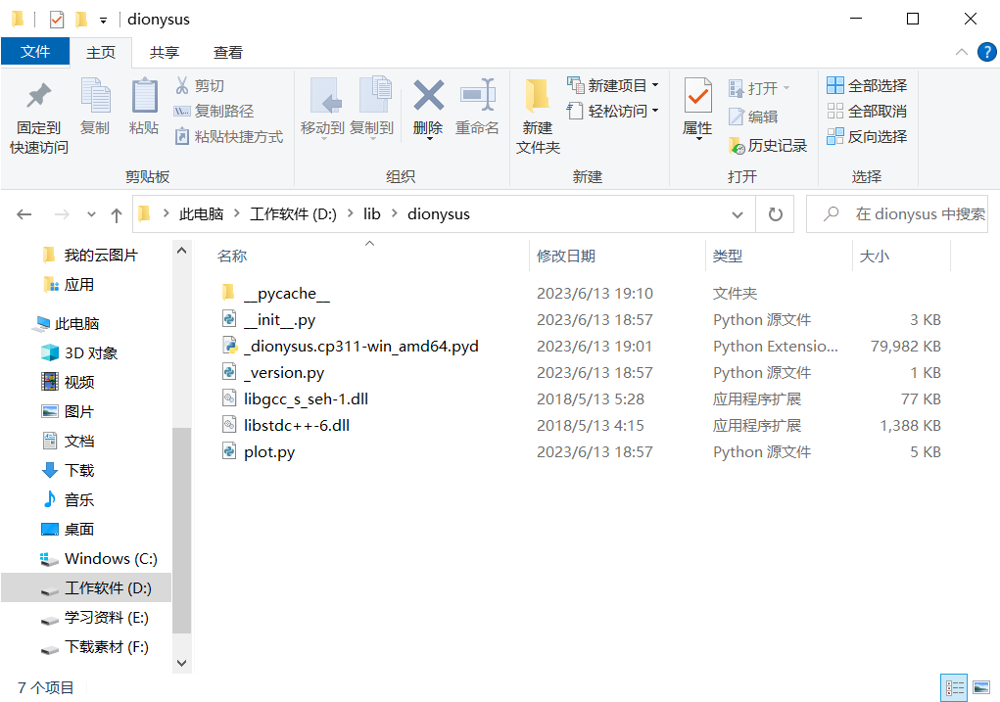

# 拓扑数据处理

## 图、曲面与复形

### 图

**定义** 图 $G=(V,E)$ 包括一个顶点集 $V$ 和一个边集 $E$，其中每条边连接两个顶点。关联同一对顶点的无向边如果多于一条，则称它们是平行边，条数称为重数。含平行边的图称为**多重图**。**既不含平行边也不含环的图称为简单图。**


**定义** 设 $G=(V,E)$ 是 $n$ 阶无向简单图，若 $G$ 中任一顶点都与其它所有顶点相邻，则称 $G$ 为 $n$ 阶无向**完全图**，记为 $K_n$ 。


**定义** 设 $G$ 中顶点和边的交替序列 $\Gamma=v_0e_1v_1e_2\cdots e_lv_l$，若其中 $v_{i-1},v_i$ 是 $e_i$ 的端点，则称 $\Gamma$ 是从 $v_0$ 到 $v_l$ 的**路径**。如果路径中不存在重复顶点，则称该路径是**简单的**。


**定义** 无向图 $G$ 中，若 $u,v$ 之间存在通路，则称 $u,v$ 连通；规定顶点与自身连通。如果所有顶点之间都连通，则称 $G$ 为**连通图**。任意图中每个最大的连通子图称为一个**连通分支**。


**定义** 任意两个顶点之间都有唯一路径连接的图称为**树**。图 $G=(V,E)$ 的**生成树**是子图 $(V,T)$，其中 $T$ 是树。


**定义** 图 $G=(V,E)$ 的**平面嵌入**是一个单射 $f:G\to\mathbb{R}^2$，将 $V$ 的每个顶点 $u$ 对应平面上的点 $f(u)$，$E$ 中每条边 $uv$ 对应平面上连接 $f(u),f(v)$ 的曲线；若图 $G$ 存在平面嵌入，则称 $G$ 是**平面图**。


如图所示，右图是左图的一个平面嵌入，因此该图是一个平面图。


**定义** 图 $G=(V,E)$ 的顶点集可以分为 $A,B$ 两部分，使得 $E$ 中任意边的两个端点分别属于 $A,B$，则称 $G$ 为**二部图**。若二部图中任取一对顶点 $a\in A,b\in B$，都有连接 $ab$ 的边，则称为**完全二部图**。用 $K_{m,n}$ 表示 $A$ 中有 $m$ 个顶点，$B$ 中有 $n$ 个顶点的完全二部图。


**定义** 记图的顶点数、边数、面数为 $n_0,n_1,n_2$，则**欧拉示性数**定义为
$$
\chi = n_0-n_1+n_2
$$
**欧拉公式** 若 $G$ 是平面连通图，则
$$
\chi_G = 2
$$
这里平面图的外部也是一个面。

**证明** 考虑 $G$ 的生成树 $T$，若 $G$ 有 $n$ 个顶点，则有
$$
n_0 = n,\quad n_1 = n-1,\quad n_2 = 1
$$
从而
$$
\chi_T = n_0 - n_1 + n_2 = n - (n-1)+1 = 2
$$
向 $T$ 中加入边直到恢复成 $G$，每条边都会分割出一个面，两者抵消，即证。


**定义** 若平面连通图 $G$ 中添加任意一条边后都不是平面图，则称 $G$ 是**最大平面连通图**。

* 最大平面连通图的任意一个面都有三条边，每条边被两个面共用，因此 $2n_1=3n_2$；

* 利用 $n_0-n_1+n_2=2$，则
    $$
    n_1 = 3n_0-6\\
    n_2 = 2n_0-4
    $$

* $K_5$ 不是平面图。因为 $n_0=5,n_1=10$，不满足上面等式；

* $K_{3,3}$ 不是平面图。因为 $n_0=6,n_1=9$，也不满足上面等式。


**Kuratowski 定理** 一个图是平面图当且仅当它不含与 $K_5,K_{3,3}$ 同胚的子图。


### 拓扑空间

**定义** 点集 $X$ 上的拓扑是 $X$ 的子集的集合 $U$，其中的元素称为开集，满足

* $X,\emptyset$ 是开集；
* 任意开集的并、有限个开集的交仍是开集；


点集 $X$ 与其上定义的拓扑构成的二元组 $(X,U)$ 称为**拓扑空间**。


**定义** 拓扑空间之间的映射 $f:X\to Y$，若任意 $Y$ 中的开集 $V$，有 $f^{-1}(V)$ 是 $X$ 中的开集，则称 $f$ 是连续的。


**定义** 若 $f:X\to Y$ 是连续双射，且 $f^{-1}$ 也连续，则称 $f$ 是同胚映射，称 $X,Y$ 同胚。


**定义** 拓扑空间 $X$ 上的连续单射 $\gamma:\mathbb{S}^1\to X$ 称为**简单闭曲线**。

**Jordan 闭曲线定理** 平面 $\mathbb{R}^2$ 上任意简单闭曲线将平面分成内外两个连通分支，其中内分支同胚于开圆盘 $D^2$ 。


**定义** 向多边形内部添加互不相交的对角线，使得每个面是三角形，且充满整个多边形的过程称为**三角剖分**。


**定义** 对于一般的平面闭曲线 $\gamma:\mathbb{S}^1\to\mathbb{R}^2$，以及不在曲线上的一点 $x$，单位向量 $(\gamma(s)-x)/\|\gamma(s)-x\|$ 在参数 $s$ 从 0 到 1 的过程中逆时针旋转的圈数称为 $\gamma$ 关于 $x$ 的**环绕数**，记为 $W(\gamma,x)$ 。


如图所示，曲线外部点的环绕数为 0，其余部分的环绕数依次进行了标记：最中间部分的点的环绕数为 5，向外不断减少。


### 曲面

**定义** 若拓扑空间 $M$ 上的任意点 $x$ 都局部同胚（即存在开邻域同胚）于开圆盘 $D^n$，则称 $M$ 为 $n$ 维**拓扑流形**。


**定义** 若拓扑空间 $M$ 上的任意点 $x$ 都局部同胚（即存在开邻域同胚）于开圆盘 $D^n$ 或半圆盘 $D_+^n$，则称 $M$ 为 $n$ 维**带边流形**。


**定义** $n$ 维（带边）流形 $M$ 上的一个连续 $n$ 维标架场称为 $M$ 上的一个**定向**，存在定向的流形称为**可定向流形**。


如图所示，局部标架沿着 $M$ 连续发生变换。


**定义** 两个曲面的**连通和**是用一个圆柱连接两个曲面。


如图所示，在 $A,B$ 上取两个圆，用圆柱连接两个圆，得到下面同胚的曲面 $A\#B$ 。


**定理** 任意紧可定向二维流形同胚于 $S^2,T^2,T^2\#T^2,\cdots,T^2\#\cdots\#T^2$ 之一。


**定义** 称**二维流形** $S$ 的**亏格**为 $g$，若 $S$ 至多被 $g$ 条不相交的闭曲线分割后保持连通性。紧可定向二维流形的亏格就是其“洞”的数量。


**定义** 设紧可定向曲面 $M_g$ 的亏格 $g\ge 1$，则它可以由一个 $4g$ 边形通过粘连边得到。对应产生紧可定向 2-流形的**胞腔结构**。


图中有 1 个顶点，$2g$ 条不同边以及 1 个面。


**定理** 亏格为 $g$ 的紧可定向曲面 $M_g$ 的欧拉示性数为 $\chi=2-2g$ 。

**证明** 利用紧可定向 2-流形的胞腔结构，容易验证 $\chi_{\mathbb{S}^2}=2,\chi_{\mathbb{T}^2}=0$，如图所示


考虑 $M_g$ 是 $M_{g-1}$ 与 $\mathbb{T}^2$ 的连通和，在做连通和时需要去掉两个面并**增加一个圆柱面（1 条边，1 个面）**，因此总体 $\chi$ 减少 2，于是
$$
\chi_{M_g} = \chi_{M_{g-1}}-2 = 2-2(g-1)-2 = 2-2g
$$
也可以利用胞腔结构满足
$$
n_0 = 1,\quad n_1=2g,\quad n_2 = 1
$$
计算欧拉示性数直接得到。


**交叉帽 Cross-cap**：Mobius strip 的另一种形式：将对应箭头粘连在一起就得到交叉帽。


射影平面 $\mathbb{P}^2=\mathbb{S}^2/\sim$ 是将球面上关于球心对称的点看作等价点得到的，它等价于 $Crosscap+\mathbb{D}^2$，即交叉帽加上底部的圆盘，其亏格为 1 。


克莱因瓶 $\mathbb{K}^2=\mathbb{T}^2/\sim$ 是将圆环上关于原点对称的点看作等价点得到的，它等价于 $\mathbb{P}^2\#\mathbb{P}^2=Crosscap+Crosscap$，其亏格为 2 。


克莱因瓶等价于两个射影平面的连通和。


**分类定理** 任意紧不可定向 2-流形同胚于 $\mathbb{P}^2,\mathbb{P}^2\#\mathbb{P}^2,\cdots,\mathbb{P}^2\#\cdots\#\mathbb{P}^2$ 之一。

* 亏格为 $g(g\ge 1)$ 的紧不可定向 2-流形 $N_g$ 满足 $N_g=M_{g-1}/\sim$，其中 $\sim$ 是某个二元等价关系，从而
    $$
    \chi_{N_g} = \frac{\chi_{M_{g-1}}}{2} = \frac{2-2(g-1)}{2} = 2-g
    $$
* 紧不可定向 2-流形 $N_g$ 不能嵌入 $\mathbb{R}^3$，即任意 $N_g\to\mathbb{R}^3$ 的连续映射自相交。
* 紧不可定向 2-流形 $N_g$ 的胞腔结构满足
    $$
    n_0=1,\quad n_1=g,\quad n_2=1
    $$
    从而 $\chi_{N_g}=2-g$ 。


**推广的分类定理**

* 任意紧可定向曲面同胚于某个亏格为 $g$ 的紧可定向曲面挖掉 $h$ 个洞。
* 任意紧不可定向曲面（包括不带边和带边流形）同胚于某个亏格为 $g$ 的紧不可定向曲面挖掉 $h$ 个洞。


### 复形

**定义** 设 $u_0,u_1,\cdots,u_k$ 是欧氏空间中的点，**仿射凸包**定义为
$$
\mathrm{conv}\{u_0,u_1,\cdots,u_k \} = \left\{\sum_{i=0}^k\lambda_iu_i:\lambda_i\ge 0,\sum_{i=0}^k\lambda_i=1 \right\}
$$
如果 $(u_0,u_1,\cdots,u_k)\mapsto\sum_{i=0}^k\lambda_iu_i$ 是单射，则称 $u_0,u_2,\cdots,u_k$ 仿射独立；称 $k+1$ 个仿射独立的点的凸包为一个 **k-单形**。


**定义** 设 $\sigma=\mathrm{conv}\{u_0,u_1,\cdots,u_k \}$，称 $k$ 为该单形的维数，记为 $k=\dim\sigma$；若 $\tau=\mathrm{conv}\{v_0,v_1,\cdots,v_l\}\subset\sigma$，称 $\tau$ 是单形 $\sigma$ 的一个**面**，记为 $\tau\le \sigma$；相应地，称 $\sigma$ 是 $\tau$ 的一个**余面**；若 $\tau\neq\sigma$，则称 $\tau$ 是**恰当面**，记为 $\tau<\sigma$；所有恰当面的并集是 $\sigma$ 的**边界**，记为 $\mathrm{bd}\sigma$，其补集称为**内部**，记为 $\mathrm{int}\sigma$ 。


**定义** 单纯复形 $K$ 是单纯形的有限集合，满足

* $\sigma\in K,\tau<\sigma\Rightarrow \tau\in K$；
* $\sigma_1,\sigma_2\in K,\sigma_1\cap\sigma_2\neq\emptyset\Rightarrow \sigma_1\cap\sigma_2<\sigma_1,\sigma_1\cap\sigma_2<\sigma_2$；

其维数 $\dim K=\max_{\sigma\in K}\dim\sigma$；**底空间**记为 $|K|=\cup_{\sigma\in K}\sigma$，注意 $K$ 是 $\sigma$ 的集合，而 $|K|$ 是 $\sigma$ 的并，所有单纯形连成一个整体。


**定义** 若 $L\subset K$ 是单纯复形，则称 $L$ 是 $K$ 的**子复形**；复形 $K$ 中所有维数不超过 $j$ 的单形组成子复形 **j-骨架**，记为 $K^{(j)}$；其中 $K^{(0)}$ 称为**顶点集**，记为 $\mathrm{Vert}K$ 。


对 $K$ 中任意单纯形 $\sigma$，定义

* **星形集 Star** 为 $\mathrm{St}\sigma=\{\tau\in K:\sigma\le \tau \}$，即所有包含 $\sigma$ 的单纯形集；
* **闭星形集 Closed Star** 为包含 $\mathrm{St}\sigma$ 的最小子复形，记为 $\bar{\mathrm{St}}\sigma$；
* **连结 link** 为 $\mathrm{Lk\sigma}=\{v\in\bar{\mathrm{St}}\sigma:v\cap\sigma=\emptyset\}$ 。


**定义** 抽象单纯复形 $A$ 是有限个集合的集合，使得
$$
\alpha\in A,\beta\subset\alpha\Rightarrow \beta\in A
$$
例如下图是一个单纯复形 $K$，可构造
$$
A = \{[a],[b],[c],[d],[a,b],[b,c],[c,d],[d,b],[a,b,d],[b,c,d] \}
$$
称 $K$ 是 $A$ 的**几何实现**。


**几何实现定理** 任意 $d$ 维抽象单纯复形 $A$ 在 $\mathbb{R}^{2d+1}$ 中存在几何实现。

**证明** 考虑 $A$ 中 0-单形 $\mathrm{Vert}A=\{[v_0],[v_1],\cdots,[v_k] \}$，则存在 $\mathrm{Vert}A\to\mathbb{R}^{2d+1}$ 使得 $k+1$ 个点的像处于**一般位置**，即其中任何不超过 $2d+2$ 个点的点集都仿射独立。例如，我们可以取
$$
f(v_i) = (1^i,2^i,\cdots,(2d+1)^i),\quad i=1,2,\cdots,k+1
$$
于是 $\{f(v_i)\}$ 仿射独立。任意 $d$ 维抽象单纯复形中的两个抽象单形 $\sigma_1,\sigma_2$ 都不超过 $d+1$ 个顶点，则它们在 $\mathbb{R}^{2d+1}$ 中的像仿射独立。于是 $f(\sigma_1)\cap f(\sigma_2)=\emptyset$，故 $A$ 中的抽象单形都存在仿射独立的对应顶点，分别张成 $\mathbb{R}^{2d+1}$ 中的单纯形，则 $A$ 存在几何实现。


#### 切赫复形

**定义** 设 $S$ 是 $\mathbb{R}^d$ 中的有限点集，记 $B_x(r)=x+r\mathbb{B}^d$ 是以 $x$ 为球心，$r$ 为半径的 $d$ 维闭球。设 $r\ge 0$，则切赫复形定义为
$$
\mathrm{Cech}(r) = \{\sigma\subset S:\cap_{x\in\sigma}B_x(r)\neq \emptyset \}
$$
是一个抽象单纯复形。任取 $S$ 的子集 $\sigma$，如果 $\sigma$ 中所有元素的闭球存在非空交，则 $\sigma$ 包含在复形中。


如图所示，相同的点集上取不同的半径，当两个圆存在非空交就产生一条边；当三个圆存在非空交就产生一个面。


**Helly's theorem** 设 $F$ 是 $\mathbb{R}^d$ 中有限个凸闭集组成的集合，则 $F$ 所有元素有非空交当且仅当 $F$ 内任意 $d+1$ 个元素有非空交。

**证明** 必要性显然；充分性：对维数使用归纳法。当 $d=1,\mathrm{card}F\le d+1$ 时显然成立；若命题对小于 $d$ 维的空间成立，反设 $\mathbb{R}^d$ 中存在不满足命题的最小的 $F$，则 $\mathrm{card}F>d+1$ 。记 $F=\{X_1,X_2,\cdots,X_n\}$，由于它是最小的反例，则 $\{X_1,X_2,\cdots,X_{n-1}\}$ 满足命题，即 $Y_n=\cap_{i=1}^{n-1}X_i$ 非空并且与 $X_n$ 没有交。于是 $X_n,Y_n$ 都是非空凸闭集并且没有交，则可以取一个 $d-1$ 维平面 $h$ 分开它们。


根据假设，$F$ 中任取 $d+1$ 个元素有非空交，于是取 $\{X_i\}_{i=1}^{n-1}$ 中的 $d$ 个与 $X_n$ 有非空交的集合，记为 $\{X_{k_i}\}_{i=1}^d$，那么 $\cap_{i=1}^dX_{k_i}$ 同时包含 $X_n,Y_n$ 中的元素，且 $\cap_{i=1}^dX_{k_i}$ 是凸闭集，则必然与 $h$ 存在交集，即 $\cap_{i=1}^d(X_{k_i}\cap h) = \cap_{i=1}^dX_{k_i}\cap h$ 非空。考虑 $\{X_i\cap h\}_{i=1}^{n-1}$，注意到现在约束在 $\mathbb{R}^{d-1}$ 维空间中，并且任取 $d$ 个 $X_{k_i}\cap h$ 有非空交，根据归纳假设 $Y_n\cap h=\cap_{i=1}^{n-1}X_i\cap h$ 非空，矛盾。


**Jung's theorem** $\mathbb{R}^d$ 内点集 $S$ 包含在一个半径为 $r$ 的闭球中当且仅当 $S$ 中任意 $d+1$ 个点包含在一个半径为 $r$ 的闭球中。

**证明** 令 $F=\{B_x(r):x\in S \}$，然后应用 Helly 定理。如图所示，**所有闭球都有交等价于所有点包含在一个闭球中**。


#### Vietoris-Rips 复形

**定义** 设 $S$ 为 $\mathbb{R}^d$ 内的有限点集，$\mathrm{diam}\sigma$ 为单形 $\sigma$ 的直径。设 $r\ge 0$，则 Vietoris-Rips 复形定义为
$$
\mathrm{Vietoris-Rips}(r) = \{\sigma\subset S:\mathrm{diam}\sigma\le 2r \}
$$
显然 $\mathrm{Cech}(r)\subset \mathrm{Vietoris-Rips}(r)$ 。与切赫复形的区别在于要求最远点距离，如图所示


由于三个圆没有公共交，切赫复形只产生了三条边。


**Vietoris-Rips 引理** $\mathrm{Vietoris-Rips}(r)\subset\mathrm{Cech}(\sqrt{2}r)$ 。

**证明** 在 Vietoris-Rips 复形中任何单纯形的直径不超过 $2r$，其最小包围球半径不超过
$$
r_d = \sqrt{\frac{d}{d+1}}\cdot\sqrt{2}r < \sqrt{2}r
$$
极限情况是 $d$ 维标准单纯形。


#### Delaunay 复形

**定义** 设 $S$ 为 $\mathbb{R}^d$ 内的有限点集，任意 $u\in S$ 的 **Voronoi 胞腔**定义为
$$
V_u = \{x\in\mathbb{R}^d:\|x-u\|\le \|x-v\|,v\in S \}
$$
集合 $S$ 中所有点的 Voronoi 胞腔构成 $S$ 的 **Voronoi 图**。


**第一球面引理** $\mathbb{R}^d$ 上一点 $x\in V_u$ 当且仅当从 $x$ 到 $N(0,\cdots,0,1)$ 的射线首先与球面 $\Sigma_u$ 相交。

**第一平面引理** $\mathbb{R}^d$ 上一点 $x\in V_u$ 当且仅当从 $N(0,\cdots,0,1)$ 到 $x$ 的射线首先与平面 $\Pi_u$ 相交。


如图所示，$N$ 的最后一个分量为 1，其余分量为 0；$\Sigma_u,\Sigma_v$ 分别是以 $u,v$ 为切点过 $N$ 的球。


**定义** 设 $\pi_u=\|x-u\|^2+w_u$，定义**加权 Voronoi 胞腔**
$$
V_u = \{x\in\mathbb{R}^d:\pi_u(x)\le \pi_v(x),v\in S \}
$$
即到不同 $u$ 的距离会附加权重 $w_u$，如图所示


圆半径越大，说明附加的权越小。


**定义** 设 $S$ 为 $\mathbb{R}^d$ 内的有限点集，其 **Delaunay 复形**定义为
$$
\mathrm{Delaunay} = \{\sigma\subset S:\cap_{u\in\sigma}V_u\neq\emptyset \}
$$
即其中集合的 Voronoi 胞腔有公共交。如图所示，三个相邻点的胞腔有一个公共点，连接产生一个三角面。4 点共面时，有 4 个胞腔共用一个顶点，但是不存在平面上的 3 维胞腔。


假设 $S$ 中不存在 $d+2$ 个点位于同一个 $d-1$ 维球面上，则可以唯一构造 Delaunay 复形的一个几何实现，称为 **Delaunay 三角剖分**。


几何实现的构造：

1. 将 $S$ 内各点关于北极点 $N$ 作逆球极投影，映射到球面 $S^d$ 上；
2. 以 $S^d$ 上的像以及 $N$ 为顶点构造凸多面体；
3. 作凸多面体的球极投影，得到 $\mathbb{R}^d$ 上的复形。


#### Alpha 复形

**定义** 设 $S$ 为 $\mathbb{R}^d$ 内的有限点集，设 $r\ge 0$，定义 $R_u(r)=B_u(r)\cap V_u$，则 **Alpha 复形**定义为
$$
\mathrm{Alpha}(r) = \{\sigma\subset S:\cap_{u\in\sigma}R_u(r)\neq \emptyset \}
$$
在 $VR(Vietoris-Rips)$ 复形中 $r$ 增大会使得单形的最高维数等于点的个数，计算量大；但 Alpha 复形中单形维数不超过 $d$ 。


如果 $V_u$ 是加权 Voronoi 胞腔，就得到**加权 Alpha 复形**。


**定义** 令 $r$ 从 0 开始逐渐增大，则 Alpha 复形构成嵌套序列
$$
\phi=K_0\subset K_1\subset\cdots\subset K_m=\mathrm{Delaunay}
$$
称为 Delaunay 复形的**滤子 Filtration** 。


## 同调、上同调与对偶

### 代数拓扑

**定义** **群 Group** 是集合 $G$ 及其上的二元运算 $\circ:G\times G\to G$ 构成的二元组 $(G,\circ)$，满足

* 结合律：$(a\circ b)\circ c=a\circ(b\circ c)$；
* 单位元：$\exists 1\in G,\forall a\in G,1\circ a=a\circ 1=a$；
* 可逆性：$\forall a\in G,\exists b\in G,a\circ b=b\circ a=1$；

满足交换律的群称为**阿贝尔群**或**交换群**。


**定义** 两个连续映射 $f,g:X\to Y$，若存在连续映射 $H:X\times I\to Y,I=[0,1]$ 使得
$$
H(t,0) = f(t),\quad H(t,1)=g(t)
$$
则称 $f,g$ 是**同伦 homotopy** 的。令 $X=[0,1]$，若
$$
H(0,s) = f(0) = g(0),\quad H(1,s) = f(1)=g(1)
$$
则称此同伦为**定端同伦**，即两个端点恒为定点。


**定义** 拓扑空间中的连续映射 $f:\mathbb{S}^1=I\to X,f(0)=f(1)=x_0$ 称为 $x_0\in X$ 的**闭道路**。


图中的曲线都是 $x_0$ 的闭道路。


**定义** 对于拓扑空间 $X$ 和其上的点 $x_0$ 组成的**带基点**拓扑空间 $(X,x_0)$，定义等价类集合 $\pi_1(X,x_0)=\bar{P}(X,x_0)/\sim$，其中 $\bar{P}(X,x_0)$ 是起止于 $x_0$ 的闭道路，$\sim$ 是定端同伦等价关系，并赋予群运算
$$
[\alpha]\circ[\beta] = [\alpha\star \beta]
$$
其中 $\alpha\star \beta$ 是两个道路的连接，称 $\pi_1(X,x_0)$ 配上以上运算构成的群是 $(X,x_0)$ 的**基本群**。在更高维空间中，可定义 $f:\mathbb{S}^n\to X$ 为 $n$ 维球面上的连续映射，从而定义高阶的同伦群 $\pi_n(X,x_0)$ 。


同伦群是一种直观地联系代数与拓扑空间的数学工具，但是具有以下缺点：

* 计算复杂，最简单的 $n$ 维球面也很难计算高维度同伦群；
* 难以离散化，不利于计算机实现；
* 同伦群可能非交换，难以应用到实际问题中；

另一种更容易使用的代数拓扑工具，就是同调群。


**定义** “闭合”的拓扑结构称为**闭链 cycle** 。


**定义** 如果两个闭链是某个拓扑空间的所有边界，则称两个闭链**同调 homologous** 。


如图所示是一个正方形挖去中间一个圆的图案。形象地说，两条闭链**之间**如果没有拓扑空间中的元素，那么它们就同调。同调拓扑特征主要是如下的几种


### 链复形

**定义** 给定单纯复形 $\mathcal{K}$ 和交换群 $G$（一般为 $\mathbb{Z}$ 或 $\mathbb{Z}_2$），为复形中的所有 k-单形定义形式和 $+$，并张成一个新的代数结构 $C_k(\mathcal{K})$，该集合由以下元素构成
$$
c = \sum_{i=0}^ma_i\sigma_i,\quad a_i\in G,\sigma_i\in\mathcal{K},\dim\sigma_i=k
$$
即 $k$ 维单形在 $G$ 中的线性组合。以上代数结构在形式加法下构成阿贝尔群，称为**第 $k$ 链群 Chain Group** 。


图中分别是第 0/1/2 **链群中的链，是对应维数的单形的线性组合**。


在 $\mathbb{Z}_2$ 中 $1+1=0$，因此**链的加法**为
$$
\begin{aligned}
c_{2,1} &= AB+BC+CD+AD\\
c_{2,2} &= AB+BC+AC\\
c_{2,1}+c_{2,2} &= AC+CD+AD
\end{aligned}
$$


**定义** 链群映射 $\partial_k:C_k\to C_{k-1}$ 满足
$$
[v_0,v_1,\cdots,v_k]\mapsto \sum_{i=0}^k(-1)^i[v_0,\cdots,\hat{v}_i,\cdots,v_k]
$$
则称为**边界算子**。对于 $\mathbb{Z}_2$ 中的链，有
$$
\begin{aligned}
\partial(ABC) &= BC-AC+AB = AB + BC + AC\\
\partial(AB) &= B - A = A+B
\end{aligned}
$$
在 $\mathbb{Z}$ 中边界算子作用为


**同调基本定理** $\partial_{k-1}\circ\partial_k=0$ 。


**定义** 一系列交换群和它们之间的群同态连接成的有向序列 $(C_*,\partial_*)$ 称为**链复形 Chain Complex**，即
$$
\cdots\to C_{k+1}\to C_k\to C_{k-1}\to\cdots
$$
其中 $\to$ 表示群同态 $\partial_k:C_k\to C_{k-1}$，且满足 $\partial_{k-1}\circ\partial_k=0$ 。**若 $\mathcal{K}$ 是一个单纯复形，则链群与边界算子的序列 $(C_*(\mathcal{K}),\partial_*)$ 是一个链复形**。 


其中 $Z_{k}(\mathcal{K})=\ker\partial_k$ 称为 **k-闭链 cycle**；$B_k(\mathcal{K})=\mathrm{im}\partial_{k+1}$ 称为 **k-边缘 boundary** 。

* $Z_{k}(\mathcal{K})$ 的元素是所有首尾相接的 $k$ 单形；
* $B_k(\mathcal{K})$ 是 $Z_{k}(\mathcal{K})$ 的子集，其元素是某个 $k+1$ 单形的边界；

显然 $Z_k,B_k$ 都是 $C_k$ 的子群，并且 $B_k$ 是 $Z_k$ 的子群。


考虑如图所示的单纯复形 $\mathcal{K}$，则
$$
\begin{aligned}
C_0 &= \left\{\sum_{i=0}^5\lambda_i[a_i]:\sum_{i=0}^5\lambda_i=1 \right\}\\
C_1 &= \left\{\sum_{i=0}^5\lambda_i[a_i,a_j]:\sum_{i=0}^5\lambda_i=1 \right\}\\
C_2 &= \{[a_0,a_1,a_2] \}
\end{aligned}
$$
注意只有一个 2 维单形存在。假设在 $\mathbb{Z}^2$ 中，则
$$
\begin{aligned}
B_1(\mathcal{K}) = \mathrm{Im}\ \partial_2 = \{&[a_0,a_1]+[a_1,a_2]+[a_2,a_0] \}\\
Z_1(\mathcal{K}) = \ker \partial_1 = \{&[a_0,a_1]+[a_1,a_2]+[a_2,a_0],[a_3,a_4]+[a_4,a_5]+[a_5,a_3],\\ &[a_0,a_1]+[a_1,a_2]+[a_2,a_0]+[a_3,a_4]+[a_4,a_5]+[a_5,a_3] \}
\end{aligned}
$$
右上角的三个单形的组合在 $\partial_1$ 的核空间中，因此 $B_1\subset Z_1\subset C_1$ 。上面这个例子说明 $Z_1$ 包含了 $C_1$ 中的**闭链及其组合**，而 $B_1$ 包含了 $C_2$ 中的单形**边界及其组合**。**闭链作用边界算子后为零**。


### 同调群

**定义** 同调群 Homology Group 是 $Z_k$ 的商空间
$$
H_k(\mathcal{K}) = Z_k(\mathcal{K})/B_k(\mathcal{K})
$$
其中的元素表示为 $[z]=z+B_k,z\in Z_k(\mathcal{K})$，它是一族闭链，刻画了单纯复形的某个拓扑结构，并且这一族闭链是同调的。这族闭链中任意一个闭链称为该同调群元素的**代表元**。同调模去了闭链组合中的高维单形边界，只剩下低维空间中的闭链。


**定义** 同调群是有限生成阿贝尔群，因此可分解为循环群和自由阿贝尔群的直积。单纯复形 $K$ 的**第 $k$ 贝蒂数 Betti Number** 是 $H_k$ 中自由阿贝尔群的个数，记为 $\beta_k=\mathrm{rank} H_k$ 。在 $\mathbb{Z}_2$ 下，贝蒂数等于链群的维数。贝蒂数表示**拓扑特征的数目**，例如

* $\beta_0$ 表示**连通分量**的个数；
* $\beta_1$ 表示**环路**的个数；
* $\beta_2$ 表示三维实体**内部空洞**的个数。


**定义** 单纯复形的**欧拉示性数**定义为
$$
\chi(\mathcal{K}) = \sum_{t=0}^\infty(-1)^in_i
$$
其中 $n_i$ 是 $i$ 维单形的数目。


**欧拉-庞加莱公式** 单纯复形的欧拉示性数可由贝蒂数表示
$$
\chi(\mathcal{K}) = \sum_{t=0}^\infty(-1)^i\beta_i
$$


基本二维紧流形的同调群结构如下


球面的同调群满足
$$
\begin{aligned}
H_k(\mathbb{S}^0) = 
\begin{cases}
\mathbb{Z}^2, & k=0\\
0, & \mathrm{otherwise}
\end{cases}\\
H_k(\mathbb{S}^n) = 
\begin{cases}
\mathbb{Z}, & k=0,n\\
0, & k>0,k\neq n
\end{cases}
\end{aligned}
$$
注意到 $\mathbb{S}^n$ 在 $n=0$ 的情况下比较特殊。我们可以考虑修改链复形的末端
$$
\cdots\to C_0\to\mathbb{Z}\to 0
$$
其中 $\partial_0:C_0\to\mathbb{Z}(u\mapsto1)$，且记 $\partial_{-1}:\mathbb{Z}\to 0$，定义同调群 $\tilde{H}_k=\ker\partial_k/\mathrm{im}\ \partial_{k+1}$ 为**约化同调群**。回忆一下，同调群是单形在数域上形式和构成的群，因此这里 $\partial_0$ 不仅仅是作用于顶点，还**作用于顶点的形式和**，所以 $\partial_0$ 是可以有非零核空间的。


使用约化同调群可以规范化 0 维一般同调群。一般有 $\tilde{\beta}_0=\beta_0-1$，即有单点空间的所有**约化贝蒂数**均为零，故球面的约化同调群形式为
$$
\tilde{H}_k(\mathbb{S}^n) = 
\begin{cases}
\mathbb{Z}, & k=n\\
0, & k>0,k\neq n
\end{cases}
$$
统一了同调群的形式。


**定义** 复形映射 $f:\mathcal{K}\to\mathcal{L}$ 是**单纯映射**，如果满足离散连续性条件：

* 当 $\sigma\in V(\mathcal{K})$，则 $f(\sigma)\in V(\mathcal{L})$，其中 $V(\mathcal{K})$ 表示单纯复形 $\mathcal{K}$ 的顶点集合；
* $\forall\sigma=\{u_0,u_1,\cdots,u_k \}\in\mathcal{K}$，有 $f(\sigma)=\cup_{i=0}^k\{f(u_i)\}\in\mathcal{L}$；

即它将顶点建立对应，同时单形按照顺序对应。


**定义** **链映射** $g:C_*\to D_*$ 是一组同态 $g_k:C_k\to D_k$，满足与边缘算子的交换关系 $\partial\circ g=g\circ\partial$，即下图中每个方格可交换


映射 $g$ 可以自然诱导出其同调群之间的映射，即 $[g]:H_k(C)\to H_k(D)$，称为**诱导映射**，定义为
$$
[g]([c]) =[g(c)]
$$
显然单纯映射 $f:\mathcal{K}\to\mathcal{L}$ 可以得到链映射 $f_{\#}:C_*(K)\to C_*(L)$，进而得到诱导映射 $f_*:H_*(K)\to H_*(L)$ 。诱导映射建立了几何的映射与代数的同态之间的联系，描述了单纯复形结构的变化对同调群的影响。


### 正合列

**定义** 任意链复形上，若一个节点处的同调群是平凡群，则称链复形在此点**正合 exact**；若所有点都正合，则称链复形为**正合列 exact sequence** 。


**引理** 某节点处的同调群是平凡群当且仅当 $\mathrm{im}(\partial_{k+1})=\ker(\partial_k)$ 。


**特殊正合列**

* $0\to A\to B$：由于左边映射的像是 0，则右边映射的核是 0，从而 $A\to B$ 是单射；
* $B\to C\to 0$：由于右边映射的核是 $C$，则左边映射的像是 $C$，从而 $B\to C$ 是满射；
* $0\to X\to Y\to 0$：由前两种正合列的性质，$X\to Y$ 是双射，从而同构。


**定义** 若链复形
$$
0\to A\xrightarrow{f} B\xrightarrow{g} C\to 0
$$
是正合列，则称为**短五正合列**。此时 $f$ 是单射，$g$ 是满射，并且 $C\cong B/\mathrm{im}(f)$ 。若上述节点是线性空间，则 $B\cong A\oplus C$ 。


**蛇形引理** 若有链复形的短五正合列
$$
0\to C_*\to D_*\to E_*\to 0
$$
则可以导出**长正合列**
$$
\to H_{n+1}(C)\to H_{n+1}(D)\to H_{n+1}(E)\to H_n(C)\to
$$
其中 $d:H_{n+1}(E)\to H_n(C)$ 称为**连接同态 Connecting homomorphism** 。


**注意** 正合列 $0\to C_*\to D_*\to E_*\to 0$ 上每个节点处的同调群都是平凡群，但是对应的长正合列
$$
\to H_{n+1}(C)\to H_{n+1}(D)\to H_{n+1}(E)\to H_n(C)\to
$$
中的同调群 $H_n(C),H_n(D),H_n(E)$ 并**不是平凡群**。这是因为 $H_{n}(C),H_n(D),H_n(E)$ 是由链复形
$$
\to C_{n+1} \to C_n \to C_{n-1} \to\\
\to D_{n+1} \to D_n \to D_{n-1} \to\\
\to E_{n+1} \to E_n \to E_{n-1} \to
$$
导出的；短正合列上的平凡同调群由 $C_n,D_n,E_n$ 之间的映射关系导出，与同调群 $H_n(C),H_n(D),H_n(E)$ 没有关系。不过长正合列中同调群之间的映射依然满足正合性质。


**定义** 设 $\mathcal{K}$ 是单纯复形，$\mathcal{K}_1,\mathcal{K}_2$ 是两个子复形，且 $\mathcal{K}_1\cup\mathcal{K}_2=\mathcal{K}$，令 $\mathcal{A}=\mathcal{K}_1\cap\mathcal{K}_2$，则有正合列
$$
0\to C(\mathcal{A}) \to C(\mathcal{K}_1)\oplus C(\mathcal{K}_2)\to C(\mathcal{K})\to 0
$$
根据蛇形引理有长正合列
$$
\to H_{n+1}(\mathcal{A})\to H_{n+1}(\mathcal{K}_1)\oplus H_{n+1}(\mathcal{K}_2)\to H_{n+1}(\mathcal{K})\to H_n(\mathcal{A})\to
$$
此序列称为 **Mayer-Vietoris 序列**。连接同态为 $\delta:H_{n+1}(\mathcal{K})\to H_n(\mathcal{A})$，表示并集上的高维闭链生成元在交集的某个低维闭链的生成元处连接。


应用于 $\mathbb{S}^n$，按照上图方式选取 $\mathcal{K}_1=A,\mathcal{K}_2=B$ 有 $A\cup B=\mathbb{S}^n,A\cap B\cong \mathbb{S}^{n-1}$，于是
$$
\to H_{k+1}(\mathbb{S}^{n-1})\to H_{k+1}(A)\oplus H_{k+1}(B)\to H_{k+1}(\mathbb{S}^n)\to H_k(\mathbb{S}^{n-1}) \to H_{k}(A)\oplus H_{k}(B)\to
$$
注意到 $A,B$ 都是 2 维带边流形，其**拓扑结构中没有空洞**，因此所有高于 0 维同调都是 0；考虑约化同调群，则任意维同调都是 0；
$$
\to 0 \to\tilde{H}_{k+1}(\mathbb{S}^n)\to\tilde{H}_{k}(\mathbb{S}^{n-1})\to 0\to\\
\Downarrow\\
\tilde{H}_{k+1}(\mathbb{S}^n)\cong\tilde{H}_{k}(\mathbb{S}^{n-1})
$$
从而可以通过低维同调群得到高维同调群。


### 相对同调

**定义** 设有拓扑空间 $X$ 与其上的等价关系 $\sim$，则 $X/\sim$ 是其上等价类的拓扑空间，称为 $X$ 模去等价关系 $\sim$ 的**商空间**。若 $Y$ 是 $X$ 的子空间，则新的拓扑空间 $X/Y$ 是将 $Y$ 缩为一点得到的。


如图是模去闭链 $b$ 的商空间，我们将该闭链收缩为单点。


**定义** 若 $K,L$ 是单纯复形，$L$ 是 $K$ 的子复形，定义在链复形 $C(K)/C(L)$ 上的同调群称为**相对同调群**
$$
\to C_{k+1}(K)/C_{k+1}(L)\to C_{k}(K)/C_{k}(L) \to
$$
记为 $H_n(K,L)$ 。

* 当 $n>0$ 时，$H_n(K,L)$ 表达了商空间 $|K|/|L|$ 的拓扑结构；
* $H_0(K,L)$ 只包含不与 $|L|$ 连通的那些连通分量，与 $\tilde{H}_0(|K|/|L|)$ 同构；
* 对拓扑空间 $X$ 和满足一定拓扑条件的子空间 $A$，有
$$
H_n(X,A) \cong \tilde{H}_n(X/A)
$$


**切除定理** 相对同调群与被模去部分的具体形状无关，只与剩余部分有关。


设单纯复形 $\mathcal{K}$ 与子复形 $\mathcal{L}$ 组成有序对 $(K,L)$，称为**配对**。配对的正合列为
$$
0\to C(L) \to C(K)\to C(K)/C(L)\to 0
$$
引用蛇形引理得到
$$
\to H_{n+1}(L)\to H_{n+1}(K)\to H_{n+1}(K,L)\to H_n(L)\to
$$
由于 $H_n(X,A) \cong \tilde{H}_n(X/A)$，因而约化形式为
$$
\to \tilde{H}_{n+1}(L)\to \tilde{H}_{n+1}(K)\to H_{n+1}(K,L)\to \tilde{H}_n(L)\to
$$
例如计算商空间 $\mathbb{B}^{n+1}/\mathbb{S}^n$ 的约化同调群：利用约化形式的长正合列有
$$
\to \tilde{H}_{n+1}(\mathbb{S}^n)\to \tilde{H}_{n+1}(\mathbb{B}^{n+1})\to H_{n+1}(\mathbb{B}^{n+1},\mathbb{S}^n)\to \tilde{H}_n(\mathbb{S}^n)\to \tilde{H}_{n}(\mathbb{B}^n)\to
$$
注意到 $\tilde{H}_{k}(\mathbb{B}^n)=0$，因此我们有
$$
\to 0\to H_{k+1}(\mathbb{B}^{n+1},\mathbb{S}^n) \to \tilde{H}_k(\mathbb{S}^n) \to 0\to\\
\Downarrow\\
\tilde{H}_{k+1}(\mathbb{B}^{n+1},\mathbb{S}^n) \cong H_{k+1}(\mathbb{B}^{n+1},\mathbb{S}^n) \cong \tilde{H}_k(\mathbb{S}^n)
$$


### 同调群计算

**定义** 考虑系数域（$\mathbb{Z}$ 或 $\mathbb{Z}_2$）上的 $m\times n$ 矩阵 $M$，若它具有形式
$$
M = \mathrm{diag}(d_1,d_2,\cdots),\quad d_i\mid d_{i+1}
$$
则称 $M$ 是**史密斯标准型**，其中 $d_i$ 称为不变因子。在计算若当标准型时引入的 $\lambda$ 矩阵可以化为史密斯标准型。在 $\mathbb{Z}_2$ 上的史密斯标准型的对角线元素为 0 或 1 。


**史密斯分解** 任意一个主理想整环 $R$ 上的矩阵均可分解为史密斯标准型 $S$ 与 $R$ 可逆矩阵 $U,V$ 的乘积，即
$$
M = USV
$$
其中 $S$ 在对角元素相差可逆元的意义下唯一；若 $R$ 是欧几里得整环，则 $U,V$ 是初等矩阵的乘积。


**定义** 单纯复形 $K$ 中 $k$ 维单纯复形的集合 $K^{(k)}$ 称为**自然基底**。$C_k,C_{k-1}$ 具有自然基底。$\partial_k$ 在自然基底下的矩阵形式称为**边界矩阵**。


对于左图的单纯复形，$C_2$ 包含 4 个三角面作为自然基底，边界算子 $\partial_2$ 作用写成矩阵形式。矩阵元素按照纵向排列，$[0,1,2]$ 经过 $\partial_2$ 作用后得到 $[1,2]-[0,2]+[0,1]$，对应元素就为 $1,-1,1$，其余元素为零。写成矩阵方程为
$$
\partial_2([0,1,2],[0,1,3],[0,2,3],[1,2,3]) = ([0,1],[0,2],[0,3],[1,2],[1,3],[2,3])
\begin{pmatrix}
1 & 1 & 0 & 0\\
-1 & 0 & 1 & 0\\
0 & -1 & -1 & 0\\
1 & 0 & 0 & 1\\
0 & 1 & 0 & -1\\
0 & 0 & 1 & 1
\end{pmatrix}
$$
边界算子是两个线性空间之间的线性变换。用 $\partial_k$ 表示边界矩阵，矩阵的行列数分别是 $C_{k-1},C_k$ 的秩，则
$$
\partial_k:C_k\to C_{k-1},X\mapsto \partial_k X
$$
回忆一下**基变换的矩阵就是线性变换的矩阵**。利用史密斯分解
$$
N_k = U_{k-1}^{-1}\partial_kV_k
$$
标准型 $N_k$ 蕴含了边界算子导出的闭链、边缘子群的维度信息。将 $N_k$ 分块为


* 由于 $\partial_k$ 将 $V_k$ 的最后 $z_k$ 列变为零，这 $z_k$ 列向量就是 $C_k$ 中的核空间/闭链群 $Z_k$ 的基，则 $z_k=\mathrm{rank}(Z_k)$；
* 由于 $U_{k-1}N_k$ 是 $U_{k-1}$ 的前 $b_{k-1}$ 列，等于 $\partial_kV_k$ 的非零列向量部分，即是 $\partial_k$ 像空间 $B_{k-1}$ 的基，则 $b_{k-1}=\mathrm{rank}(B_{k-1})$；
* 最后 $\beta_k=\mathrm{rank}(Z_k)-\mathrm{rank}(B_k)$ 。


通过史密斯分解虽然可以得到 $Z_k,B_k$ 的基，但是这两个基没有什么关系。我们要计算商群 $H_k=Z_k/B_k$，需要先进行基变换。记 $W$ 为 $Z_k$ 的基张成的矩阵，$V$ 为 $B_k$ 的基张成的矩阵，由于 $B_k\subset Z_k$，则可以将 $V$ 表示为 $W$ 的线性组合，故有
$$
WX = V\\
\Downarrow\\ WSAT^{-1} = V\\
\Downarrow\\
(WS)A = VT
$$
这里对 $X$ 进行史密斯分解，左边 $W$ 列变换得到 $WS$ 的列向量仍然是 $Z_k$ 的基，同理 $VT$ 也是 $B_k$ 的基。设
$$
WS = \{u_1,u_2,\cdots,u_m \},\quad A=\mathrm{diag}(\underbrace{1,\cdots,1}_r,0,\cdots,0)
$$
则 $VT=\{u_1,u_2,\cdots,u_r,0,\cdots,0 \}$，这样我们在 $Z_k,B_k$ 中取得了同一个基。于是有
$$
\{[u_{r+1}],\cdots,[u_m] \}
$$
是 $H_k=Z_k/B_k$ 中的基。


### 上同调与对偶

**定义** 模 $V$ 上的**对偶空间**定义为 $V$ 上的 $R$ 线性函数 $V\to R$ 构成的空间，记为
$$
V^* = \mathrm{Hom}_R(V,R)
$$
其中 $V$ 是以 $R$ 为系数环的线性空间。若 $F:V\to W$ 是同态线性映射，则定义
$$
F^*:W^*\to V^*,(g:W\to R)\mapsto (g\circ F:V\to R)
$$
称为 $F$ 的**对偶映射**。


**定义** 链群的对偶空间 $C_k(K)^*$ 称为**上链群**，记为 $C^k(K)$；其中的元素称为**上链 cochain**，是作用在链群上的函数。根据上链群定义

* 上边界算子：$(\delta^k:C^{k}\to C^{k+1})=(\partial_{k+1}:C_{k+1}\to C_{k})^*$；
    * 上边界算子的矩阵 $\delta^k=(\partial_{k+1})^T$；
* 上链复形：$\to C^{k}\to C^{k+1}\to$；
* 上闭链 $Z^k=\ker\delta^k$ 和上边界 $B^k=\mathrm{im}\ \delta^{k-1}$；
* 上同调群：$H^k:Z^k/B^k$；


与链复形方向相反，上边界算子 $\delta^k$ 将低维上链映射到高维上链，映射规则由对偶映射导出。


直观上，上边界算子 $\delta^k$ 将单形映射为所有的**余面**组成的上链：顶点映射到 4 条边的和；边映射到两个面的和。


上闭链与通常的闭链构成对偶关系。两个红色顶点映射到周围相邻的边，中间公共的边被映射两次，在 $\mathbb{Z}_2$ 中为零。因而两个顶点的映射结果是图中蓝色的边的和


应用类似的方法，下图中黑色的边构成一个 1-上闭链，与图中的闭曲线形成对偶；同时它也是 1-上边缘，因为它是蓝色区域里的顶点构成的 0-上链在 $\delta^0$ 作用下的像。


**万有系数定理**：代数拓扑中描述同个空间，不同系数下的同调群、上同调群的关系的结论
$$
0\to \mathrm{Ext}_R^1(H_{i-1}(X;R),G)\to H^i(X;G) \to \mathrm{Hom}_R(H_i(X;R),G) \to 0
$$
当 $R=G=\mathbb{Z}_2$ 时，有简洁的**万有系数定理**
$$
H^i(X)\to \mathrm{Hom}(H_i(X),\mathbb{Z}_2)\to H_i(X)
$$
其中每个箭头都是同构。即有在 $\mathbb{Z}_2$ 系数下，成立 $H^i(X)\cong H_i(X)$，即**同调群与上同调群同构**。


**重心细分**将每个单形的重心作为新复形的顶点集。新复形顶点集中的任意 $n+1$ 个点都满足：

* 若生成这 $n+1$ 个点的 $n+1$ 个单形可以构成**邻接且维数严格递增的有序集**，则这些点张成新复形中的 $n$ 维单形。


例如图中黑色顶点属于原顶点集，可认为由 0-单形生成；红色顶点由 1-单形生成；蓝色顶点由 2-单形生成。取 $a_1,b_1,c$，可以看到生成它们的单形分别是 $[a_1],[a_1,a_2],[a_1,a_2,a_3]$ 是邻接且严格递增的有序集，因此 2-单形 $[a_1,b_1,c]$ 属于新复形。进一步，如图所示


考虑重心细分建立的复形，我们将新复形中的 $p$ 维单形与原复形中的 $n-p$ 维单形建立对应。


**定义** 对复形 $K$ 进行重心细分后，得到新复形 $\mathrm{Sd}\ K$ 。给定 $K$ 中单形 $\sigma$，在新复形中取单形 $d$，使得 $d$ 与 $\sigma$ 的重心相邻，并且 $d$ 的顶点对应的 $K$ 中单形的维数不小于 $\dim\sigma$，则所有 $d$ 的集合称为 $\sigma$ 的**对偶块**。


左图中 $\sigma$ 取黑色顶点：红色顶点由红色 1-单形生成，蓝色顶点由灰色 2-单形生成，黑色顶点由 0-单形 $\sigma$ 生成，并且三色顶点形成的 2-单形与 $\sigma$ 的重心相邻，三个顶点的生成元都不小于 $\dim\sigma=0$，因此它们构成的三角面在 $\sigma$ 的对偶块中；中间图中 $\sigma$ 取黑色边，与它的重心相邻的新单形有 4 个面和 2 条边，但是 4 个面上都有顶点在 $\sigma$ 的端点上，由 0-单形生成，维数小于 $\dim\sigma=1$，因此它们都不在对偶块中，剩下 2 条边都满足条件。


通过重心细分，可以得到

* 块复形 $(D_*,\partial_*)$；
* $\mathrm{Sd}\ K$ 复形 $(C_*,\partial_*)$；
* 自然链映射 $b:D\to C$；

**块复形引理** 对任意 $p$，链映射 $b:D\to C$ 的诱导映射 $b_*:H_p(D)\to H_p(C)$ 是同构。

 

**组合流形** 一种具有特殊三角剖分的流形，其中每个 i-单形对应的**连接** $\mathrm{Lk\sigma}=\bar{\mathrm{St}}\sigma-\mathrm{St}\sigma$ 是 $\mathbb{S}^{d-i-1}$ 的三角剖分。

**庞加莱对偶第一定理** 若 $\mathbb{M}$ 是 $d$ 维紧组合流形，则对 $p+q=d$，有同构 $H_p(\mathbb{M})\cong H^q(\mathbb{M})$ 。

**推论** 在 $\mathbb{Z}_2$ 系数下的**紧组合 $d$ 维流形**有 $H_p(\mathbb{M})\cong H_q(\mathbb{M})$ 。


于是 $\mathbb{S}^2$ 的 $0,2$ 阶同调群的贝蒂数相等。


**定义** 单纯复形 $K$ 中，单形 $\sigma\in C(K)$，定义 $\hat\sigma\in D(K)$ 是对应的对偶块。**交点计数**定义为：交点数为奇数则为 1，为偶数则为 0 。

**定理** $p$-单形 $\sigma$ 与 $q$-块 $\hat\tau$ 的交点计数满足
$$
\sigma\cdot \hat\tau =
\begin{cases}
1 & \sigma = \tau\\
0 & \sigma\neq \tau
\end{cases}
$$
$p$-闭链 $c$ 与 $q$-闭链 $d$ 的交点计数为
$$
c\cdot d = \sum_{i,j}a_ib_j(\sigma_i\cdot \hat\tau_j)
$$
其中 $c=\sum a_i\sigma_i,d=\sum b_i\tau_i$ 。


**同调不变性** 若 $c$ 与 $c'$ 同调，则 $c\cdot d=c'\cdot d$ 。

**定义** 双线性映射 $\#:H_p(M)\times H_q(M)\to \mathbb{Z}_2$ 定义为
$$
\#(\gamma,\delta) = c\cdot d
$$
其中 $c,d$ 分别是 $\gamma,\delta$ 中的闭链代表元。这种映射关系称为 **pair** 。若
$$
\forall u\in U,\exists v_0\in V,\#(u,v) = 1
$$
并且对称情形也成立，称为 **perfect pair** 。


**Perfect Pairing Lemma** 一个 pair 是 perfect 当且仅当 $\phi_{\#}:V\to \mathrm{Hom}(U,G)$ 是同构，其中
$$
\phi_{\#}:v\mapsto (f_v:u\mapsto \#(u,v))
$$
这里 $\#(u,v)\in G$ 成立。


**庞加莱对偶第二定理** 若 $\mathbb{M}$ 是 $d$ 维紧组合流形，则对 $p+q=d$，映射 $\#:H_p(\mathbb{M})\times H_q(\mathbb{M})\to\mathbb{Z}_2$ 是 perfect 。


如图所示，$x,y$ 分别是 2 维紧组合流形（圆环）上的两个 1 维同调群 $H_1$ 的生成元，则 $x,y$ 总是有奇数个交点。


**莱夫谢茨对偶第一定理** 若 $\mathbb{M}$ 是 $d$ 维紧组合**带边流形**，边界为 $\partial\mathbb{M}$，则对 $p+q=d$，有同构
$$
H_p(\mathbb{M},\partial\mathbb{M}) \cong H^q(\mathbb{M})\\
H_p(\mathbb{M}) \cong H^q(\mathbb{M},\partial \mathbb{M})
$$
其中 $H_p(\mathbb{M},\partial{\mathbb{M}})$ 是 $\mathbb{M}$ 模去 $\partial\mathbb{M}$ 后的相对同调群。


**莱夫谢茨对偶第二定理** 若 $\mathbb{M}$ 是 $d$ 维紧组合**带边流形**，边界为 $\partial\mathbb{M}$，则对 $p+q=d$，映射 $H_p(\mathbb{M})\times H_q(\mathbb{M},\partial\mathbb{M})\to\mathbb{Z}_2$ 是 perfect 。


如图所示，带边流形 $\mathbb{B}^2$ 模去边界 $\partial\mathbb{B}^2=\mathbb{S}^1$ 后是球面 $\mathbb{S}^2$，根据第二定理得到贝蒂数对应相等。


**亚历山大对偶定理** 设 $K$ 是 $\mathbb{S}^d$ 的三角剖分，且 $\mathbb{X}\subset\mathbb{S}^d$ 被子复形 $L$ 三角化，则有对偶关系
$$
\tilde{H}_p(\mathbb{X}) \cong \tilde{H}_{d-p-1}(\mathbb{S}^d-\mathbb{X})
$$
亚历山大对偶考虑约化同调群，描述了球面上的拓扑空间与其补集之间的对应关系。


## 持续同调的计算和加速方法

### 持续同调理论

**定义** 单纯复形的递增序列 $\mathcal{K}^{(n)}$：
$$
\mathcal{K}^{(0)} \subset \mathcal{K}^{(1)} \subset \mathcal{K}^{(2)} \subset \cdots
$$
并且每两个相邻复形之间**只相差一个单形**，这种序列称为 **Filtration** 。它蕴含了拓扑的连续变化而非孤立的同调群，相邻项的同调群生成元之间存在一种后继关系。


**定义** 一个 filtration 对应的 **filter** 是指以下单形的序列
$$
\{\sigma_0,\sigma_1,\cdots \} = \{\mathcal{K}^{(1)}-\mathcal{K}^{(0)},\mathcal{K}^{(2)}-\mathcal{K}^{(1)},\cdots \}
$$
用记号 $C_k^{(n)},\partial_k^{(n)},Z_k^{(n)},B_k^{(n)},H_k^{(n)}$ 表示第 $n$ 项复形的链复形的各项属性。


基于复形函数 $f:\mathcal{K}\to\mathbb{R}$ 的 filtration 构造方法：

* 假设 $f$ 单调，即**若 $\sigma_i$ 是 $\sigma_j$ 的面，则满足 $f(\sigma_i)\le f(\sigma_j)$**；

* 将单形按照函数值升序排列，构成 filtration
    $$
    K^{(i)} = \{\sigma_j\in\mathcal{K}\mid f(\sigma_j)\le f(\sigma_i) \}
    $$
    即 $K^{(i)}$ 是不大于 $f(\sigma_i)$ 的单形的集合；

* 若未特殊说明，假设 $f$ 严格单调。


**定义** 设 $f$ 是复形顶点集上的函数，可以将 $f$ 延拓到复形上，令
$$
g(\sigma) = \min_{v\in\sigma}f(v)
$$
并以 $f=-g$ 可以构造 **Lower-star filtration** 。


**定义** 回忆一下顶点 $u$ 的 star 是包含 $u$ 为顶点的单形的集合，记为 $\mathrm{St}\ u$；定义
$$
\mathrm{St}_u = \{\sigma\in \mathrm{St}\ u\mid x\in\sigma\Rightarrow f(x)\le f(u) \}
$$
为所有包含 $u$ 为顶点的单形中函数值不超过 $f(u)$ 的单形的集合，称为 $u$ 的下星集 **lower star** 。令 $K_i$ 是前 $i$ 个顶点的 lower star 的并，可以得到一列向上包含的单纯复形序列
$$
\emptyset\subset K_1\subset K_2 \subset\cdots \subset K_n = K
$$
称为单纯复形 $K$ 关于 $f$ 的 **lower star filtration** 。


**定义**  $p$ 维持续同调群 $(0\le n< m< N)$ 为
$$
H_{p}^{n,m} = \frac{Z_p^n}{B_p^{m}\cap Z_p^n} = \mathrm{im}\ i_p^{n,m}
$$
定义对应的 $p$ 贝蒂数为
$$
\beta_p^{i,j} = \mathrm{rank}\ H_p^{i,j}
$$
直观上，$H_{p}^{n,m}$ 是 $H_p^n$ 中直到 $m$ 项复形仍未消失的非边缘闭链。如图所示是一列单纯复形的递增序列，即为 filtration


我们考虑 $H_1^{1,5}$，即从 1 复形开始到 5 复形结束的所有 1 次同调群中一直没有消失的非边缘闭链。按照定义


上图中 $Z_1^1$ 由 $K^{(1)}$ 中所有 1 维闭链构成，$B_1^5$ 由 $K^{(5)}$ 中所有 1 维边缘闭链构成，$B_1^5\cap Z_1^1$ 是蓝色部分的两个闭链，因此从 $Z_1^1$ 中去掉蓝色部分得到 $H_1^{1,5}$，于是 $\beta_1^{1,5}=1$ 。


**Elder Rule** 若两个同调生成元合并为一个，则将后出现的生成元合并到先出现的生成元当中。


如图是一座“山峰”从高向低的横切面图的序列，随着高度下降，“出现”一个新的山峰；当高度足够低，两座山峰将“合并”在一起，此时后出现的山峰将合并到最开始出现的山峰中。


**定义** 给定一组 filtration $\{K^{(k)}\}$，取某个复形处的同调群 $H_p^i$ 中的一个生成元 $\gamma$，记 $f_p^{i,j}:H_{p}^i\to H_p^j$ 是嵌入映射的导出映射，则

* 若 $\gamma\notin H_p^{i-1}$，则称 $\gamma$ 在 $i$ 时刻**出生**；
* 若 $\gamma$ 在 $i$ 时刻出生，且 $f_p^{i,j-1}(\gamma)\notin H_p^{j-1},f_p^{i,j}(\gamma)\in H_p^j$，则称 $\gamma$ 在 $j$ 时刻**消亡**；
* $\gamma$ 的**持续量**为 $\mathrm{pers}(\gamma)=a_j-a_i$，其中 $i,j$ 是出生和消亡的时刻，$a_i,a_j$ 是对应时刻的标量值，$(j-i)$ 称为**持续时间**或**生存周期**；


如图所示，$H_p^{i-1}$ 映射到 $H_p^i$ 中，而 $\gamma\in H_p^i$ 不在 $H_p^{i-1}$ 的像中，因此 $\gamma$ 在 $H_p^i$ 处产生；而 $\gamma$ 继续映射后在 $H_{p}^{j-1}$ 的像中，则 $\gamma$ 在 $H_p^j$ 中消亡。下图给出一个更具体的例子：

* 映为零元：红色的非边缘闭链（1 维同调生成元）出生，非边缘闭链成为边缘，在同调群中被模去；
* 与老的同调生成元合并：红色非边缘闭链（0 维同调生成元）出生，它与下方更早出现连通分量的合并为一个非边缘闭链；


**定义** 给定一组 filtration $\{K^{(k)}\}$，记

* $\mu_p^{i,j}$ 为所有在 $i$ 时刻出生，$j$ 时刻消亡的所有**线性无关同调生成元**的数目；
* $\beta_{p}^{i,j}$ 为在 $i$ 到 $j$ 时刻都存在的所有**线性无关同调生成元**的数目；

成立公式
$$
\mu_p^{i,j} = (\beta_{p}^{i,j-1}-\beta_p^{i,j}) - (\beta_p^{i-1,j-1}-\beta_p^{i-1,j})
$$
即用 $i$ 时刻存在到 $j$ 时刻消失的生成元数减去 $i-1$ 时刻存在到 $j$ 时刻消失的生成元数。

**持续同调基本定理** 给定一组 filtration $\{K^{(k)}\}$，有恒等式 $\beta_p^{k,l}=\sum_{i\le k}\sum_{j\ge l}\mu_p^{i,j}$ 。


**Persistent Barcode**：将同调生成元的生存区段显示在数轴上方。


考虑下图所示的一列单纯复形，将每次新出现的同调生成元标记在 index 轴上，例如 $u$ 位于 2 表示 $u$ 在 2 时刻出现；该生成元持续的时间作为纵坐标，做等腰直角三角形与横坐标相交，相交位置就是该生成元消失的位置。最上方绘制了每个生成元的生成区段，均为左闭右开区间。


**持续图** 若复形上的函数 $f$ 导出一个 filtration，将每个 $p$ 维生成元的出生和消亡时刻点对 $(i,j)$ 绘制在半平面区域 $\{(x,y)\mid y\ge x \}$，得到的点集称为 filtration 的第 $p$ 个持续图，记为 $\mathrm{Dgm}_p(f)$ 。


对于每个生成元对应的点 $(i,j)$，$\mu_p^{i,j}$ 是该点的重数；$\beta_p^{i,j}$ 是矩形区域 $(-\infty,i]\times[j,+\infty)$ 中点的数目（计算重数），因为出生在 $i$ 之前的生成元横坐标不超过 $i$，消亡在 $j$ 之后的生成元纵坐标不小于 $j$ 。


**持续等价定理** 考虑同态 $\phi_i:U_i\to V_i$ 连接的两组向量空间序列
$$
\begin{matrix}
V_0 & \to & V_1 & \to & \cdots & \to & V_{n-1} & \to & V_{n} \\
\uparrow & & \uparrow & & & & \uparrow & & \uparrow\\
U_0 & \to & U_1 & \to & \cdots & \to & U_{n-1} & \to & U_{n} 
\end{matrix}
$$
若 $\phi_i$ 是同构且所有方形可交换，即
$$
U_i\to V_j = \phi_i\circ(V_i\to V_j) = (U_i\to U_j)\circ\phi_j
$$
则由 $U_i$ 定义的持续图与 $V_i$ 定义的持续图相同。


### 基于矩阵的计算方法

对于 Filter $\{\sigma_0,\sigma_1,\cdots\}$ 及 Filtration $K^{(i)}=\{\sigma_j:j\le i\}$，有长正合列
$$
\to H_{n+1}(K^{(l+1)},K^{(l)})\to H_n(K^{(l)}) \to H_n(K^{(l+1)}) \to H_n(K^{(l+1)},K^{(l)})\to H_{n-1}(K^{(l)})\to
$$


**切除定理** 存在同构关系
$$
H_n(K^{(l)},K^{(l-1)}) = H_n(\sigma_l,\partial\sigma_l) = \tilde{H}_n(\mathbb{S}^d) = (\mathbb{Z}_2)^{\delta_{nd}}
$$
其中 $d=\dim(\sigma_l)$，$\delta_{nd}$ 表示当 $n=d$ 时为 1，其余情况为 0 。


当 $n\neq d-1,d$ 时，对应的相对同调群为 0，故有
$$
0 \to H_n(K^{(l)}) \cong H_n(K^{(l+1)}) \to 0
$$
在特殊位置 $(n=d)$：
$$
0\to H_d(K^{(l)}) \to H_d(K^{(l+1)}) \to \mathbb{Z}_2 \to H_{d-1}(K^{(l)}) \to H_{d-1}(K^{(l+1)}) \to 0
$$
注意到 $\mathbb{Z}_2$ 是二元有限群，则 $H_d(K^{(l+1)})$ 中的元素要么全映为零，要么能够映到所有元素，故有两种情况：

* 若 $H_d(K^{(l+1)})\to\mathbb{Z}_2$ 是满射，则 $H_d(K^{(l+1)})=H_d(K^{(l)})\oplus \mathbb{Z}_2$，有 $\beta_d^{l+1}=\beta_d^l+1$；
* 若 $H_d(K^{(l+1)})\to\mathbb{Z}_2$ 是零映射，则 $H_{d-1}(K^{(l)})=H_{d-1}(K^{(l+1)})\oplus \mathbb{Z}_2$，有 $\beta_{d-1}^{l+1}=\beta_{d-1}^l-1$；

上述同构关系由线性空间的短五正合列性质得到。


**定理** 若 $L\subset K$，且 $K$ 比 $L$ 仅多出一个 $d$ 单形 $\sigma$，则

* 若 $\sigma$ 属于 $K$ 中的某个 $d$ 闭链，则 $\beta_d(K)=\beta_d(L)+1$，称 $\sigma$ 是**正的 positive** ;
* 否则 $\beta_{d-1}(K)=\beta_{d-1}(L)-1$，称 $\sigma$ 是**负的 negative** ;


如图所示的两对复形中分别添加一个 1 维单形，前者产生了一个 1 闭链，后者消去了一个连通分量。下面左图增加了中间的 2 维单形，这消去了一个 1 闭链，$\beta_1$ 减少，因此它是负的；右图加入 2 维单形产生了一个空洞，$\beta_2$ 增加，因此它是正的。


利用定义可以给出计算贝蒂数的伪代码


对于目标单形 $\sigma$，要判断它是否是闭链的一部分，只需要考虑它在之前是否是区域边界。对于某些特殊情形，可以使用数据结构直接搜索加速计算，避免矩阵操作。也可以使用线性代数方法：

* 若单形 $\sigma_i$ 的排序构成一个 filter，构造边界算子矩阵
    $$
    \partial[i,j] = 
    \begin{cases}
    1, & \sigma_i\ \mathrm{is\ a\ 1\ codimensional\ face\ of\ \sigma_j}\\
    0, & \mathrm{otherwise}
    \end{cases}
    $$
    这里的边界算子与之前不同，对于非零的 $(i,j)$ 元素表示 $\sigma_i$ 在高一维的单形 $\sigma_j$ 的边界上。有两种观察方式：

    * 每一行是所有包含 $\sigma_i$ 的单形；
    * 每一列是所有 $\sigma_j$ 的边界单形；

* 矩阵约化 $R=\partial\cdot V$，其中

    * $R$ 为**列约化矩阵 column reduced matrix**：设 $M$ 是一个 0-1 矩阵，它的列约化矩阵是指通过列初等变换得到的矩阵形式，并且**满足对于不同列，非零元行标的最大值不相同**；
    * $V$ 是从左到右的列变换，确保只会用较老的单形影响较新的单形，不会反过来违反 filtration 的构造法则。它相当于将目标单形的边界投影到旧单形边界的正交补空间上，即试图用旧的单形边界组合来表示目标单形的边界，剩余的非零元素就是在正交补空间中的投影；


约化后的 $R$ 矩阵第 $j$ 列是“正交化”后的闭链：按照列进行观察

* 对于非零列向量，其行标最大的非零分量左侧没有非零值，即它所对应的边界刚刚出现。例如 $\partial_4$ 对应的列是 $\partial_1+\partial_2$，左边没有非零值，说明 $\partial_1+\partial_2$ 作为 1 维单形边界刚刚出现，即增加的 $\partial_1+\partial_2\in B_0$ 使得 $\beta_0=\mathrm{rank}(Z_0)-\mathrm{rank}(B_0)$ 减少了；
* 对于零列向量，意味着它原先的边界可以由更早的单形边界线性表示。例如 $\partial_6$ 对应的列由 $\partial_4+\partial_5$ 组合消去了，说明它的边界被前两者构造出来，即有 $\partial_4+\partial_5+\partial_6=0$，增加的 $\partial_4+\partial_5+\partial_6\in Z_1$ 使得 $\beta_1=\mathrm{rank}(Z_1)-\mathrm{rank}(B_1)$ 增加了；

设第 $j$ 列非零，$i=low(j)$ 表示此列非零分量的最大行标，则 $(\sigma_i,\sigma_j)$ 或 $(i,j)$ 是 PD 上的点。此时 $\sigma_i,\sigma_j$ 两个单形**配对**，由这**两个单形描述的拓扑特征被 $\sigma_i$ 生成，被 $\sigma_j$ 消灭**。


### 扩展持续

一般的过滤中，生成元可分为两类：

* 具有出现和消失时刻的生成元，称为**非本质 inessential**，它们拥有临界点的配对；
* 只出现不消失的生成元，称为**本质 essential**，没有配对；

为了解决本质同调特征无法配对的问题，需要对常规的持续同调进行扩展。基本思想是：**将 filtration 的过程扩展为一个往返的过程，通过补全过滤的后半部分，使得本质同调特征得到配对**。


**扩展过滤** 令 $a_1<a_2<\cdots<a_n$ 是高度函数 $f_u:\mathbb{M}\to\mathbb{R}$ 的同调特征对应的值。取间隔值
$$
b_0 < a_1<b_1<a_2<\cdots<a_n<b_n
$$
则下水平集 $\mathbb{M}_{b_i}=f^{-1}(-\infty,b_i]$ 是带边 2 流形。对称地定义上水平集 $\mathbb{M}^{b_i}=f^{-1}[b_i,\infty)$，则它是具有相同边界的补充 2 流形。最后，我们用两种水平集构造**向上移动的同调群序列和向下返回的相对同调群序列**
$$
\begin{aligned}
0&=H_p(\mathbb{M}_{b_0}) \to\cdots \to H_p(\mathbb{M}_{b_n})\\
&\to H_p(\mathbb{M},\mathbb{M}^{b_n})\to\cdots \to H_p(\mathbb{M},\mathbb{M}^{b_0}) = 0
\end{aligned}
$$
该序列可在任意 $p$ 维下定义，其中的同态由含入映射导出。


扩展持续性中的相对同调特征的生成和消亡计算比较困难。因此通过上水平集计算，满足如下规则：

* $\mathbb{M}^b$ 的 $p$ 维同调类与 $(\mathbb{M},\mathbb{M}^b)$ 的 $p+1$ 维相对同调类同时消亡；
* $\mathbb{M}^b$ 的 $p$ 维非本质同调类与 $(\mathbb{M},\mathbb{M}^b)$ 的 $p+1$ 维相对同调类同时产生；
* $\mathbb{M}^b$ 的 $p$ 维本质同调类产生，同时 $(\mathbb{M},\mathbb{M}^b)$ 的 $p$ 维相对同调类消亡；


如图所示是上面物体的持续图，从左到右分别是 0 1 2 维持续性。


生成元分为三类：

* Ordinary 子图：在扩展过滤上升时出生和死亡，集合记为 $\mathrm{Ord}_p$；
* Extended 子图：在扩展过滤上升时出生，下降时死亡，集合记为 $\mathrm{Ext}_p$；
* Relative 子图：在扩展过滤下降时出生和死亡，集合记为 $\mathrm{Rel}_p$；

**持续性对偶定理** 在 $d$ 维无边界流形上的**温和 tame** 函数 $f$ 具有如下反射的持续图
$$
\begin{aligned}
\mathrm{Ord}_p(f) &= \mathrm{Rel}_{d-p}^T(f)\\
\mathrm{Ext}_p(f) &= \mathrm{Ext}_{d-p}^T(f)\\
\mathrm{Rel}_p(f) &= \mathrm{Ord}_{d-p}^T(f)
\end{aligned}
$$
其中 $T$ 表示将子图沿着主对角线翻转。


**持续性对称定理** 在 $d$ 维无边界流形上的**温和 tame** 函数 $f$ 与 $-f$ 具有如下反射的持续图
$$
\begin{aligned}
\mathrm{Ord}_p(f) &= \mathrm{Rel}_{d-p-1}^R(-f)\\
\mathrm{Ext}_p(f) &= \mathrm{Ext}_{d-p}^R(-f)\\
\mathrm{Rel}_p(f) &= \mathrm{Ord}_{d-p+1}^R(-f)
\end{aligned}
$$
其中 $R$ 表示将子图沿着副对角线翻转。


## 持续同调的稳定性理论

### 函数时间序列

令 $K$ 为给定单纯复形，$f,g:K\to\mathbb{R}$ 是两个定义在单纯复形上的标量函数。考虑如何找到一种方法，借助 $f,g$ 之间的关系，通过 $f$ 过滤 $K$ 得到的持续图 $PD_f$ 获得 $g$ 过滤 $K$ 的持续图 $PD_g$ 。


**定义** 称 $K$ 上的函数是**单调函数**，如果任意两个单形 $\sigma\le\tau$ 有 $f(\sigma)\le f(\tau)$，即函数对于偏序包含关系不减小。

**定义** 设 $f,g:K\to\mathbb{R}$ 为 $K$ 上的单调函数，定义**直线同伦** $F:K\times[0,1]\to\mathbb{R}$ 为
$$
F(\sigma,t) = (1-t)f(\sigma)+tg(\sigma)
$$
即通过线性插值 $f,g$ 得到。利用 $f,g$ 的单调性，容易证明 $F$ 关于 $\sigma,t$ 都是单调函数。


令 $f_t$ 为 $F$ 在 $t$ 处混合的函数，则它在每个单形上的值都通过 $f,g$ 在相同单形上的取值线性插值得到。


如果计算出了 $f$ 生成的持续图，那么通过改动该图来生成 $f_t$ 对应的持续图比重新计算要更加方便。并且如果 $f,f_t$ 对应的过滤中，只要单形的**排列没有太大变化**，就可以高效计算。事实上，我们要求

* 兼容：**如果两个单形有包含关系，应当使低维单形在前，高维单形在后；如果是两个同维单形，则可任意顺序排列**。

也就是所有单形构成递增的序列组成过滤。这就是之前计算持续图时使用的排列顺序。


由于线性插值可能使得某些时刻不同单形具有相同的函数值，例如两个单形对应的直线相交的时刻


因此我们不妨假设

* $f,g$ 都是单射。这样除了有限个时刻以外，可以确保 $f_t$ 是单射，即在 $t$ 处没有相交直线；
* 同一时刻至多有两个函数值相同的单形。即 $t$ 处只有两条直线相交，因此只有两个单形违反单射性质（单性）；

在此假设下，沿着 $t$ 增加的方向上，通过对两个单形**按照兼容顺序**换位来克服单性违反的问题。这促使我们考虑换位对持续性的影响。


### 矩阵分解

通过约化边界矩阵计算 $f:K\to\mathbb{R}$ 决定的持续图，得到的非零列最低位非零元素的行标号唯一。其中 $low$ 映射给出了从非零列的最低位非零元行标到配对单形的单射。事实上，对于给定的非零列标 $j$，则

* $i=low(j)$ 是最低位非零元行标，于是有配对 $(\sigma_i,\sigma_j)$；
* 获得在持续图 $Dgm_p,p=\dim\sigma_i$ 对角线上方的点 $(f(\sigma_i),f(\sigma_j))$；


如果对角线上方不存在无穷远处的点，则持续图在对角线上方的点与单形配对一一对应。这条性质成立当且仅当**$K$ 的约化同调群平凡**，即任意 $p$ 有 $\tilde\beta_p(K)=0$ 。假设存在这条性质并不失一般性，因为我们可以在过滤的末尾增加单形，这种加入不需要考虑兼容问题，因为不会改变早期的同调特征，同时能够使得约化同调群平凡。


例如左图中的单纯复形，它们按照兼容顺序排列，可以形成一个过滤。然而它不满足约化同调群平凡的性质，例如
$$
H_1(K) = \ker\partial_1/\mathrm{im}\ \partial_{2}
$$
则其中 $\ker\partial_1$ 包含元素 $5,8,9$，而 $\mathrm{im}\ \partial_2$ 不包含 $5,8,9$，则 $H_1(K)$ 不是平凡群。这时候只需要在后面接着加入新的单形 $11$，就能使其成为平凡群。


我们知道约化矩阵分解 $R=\partial V$，其中 $V$ 追踪列操作，是上三角阵。令 $U$ 是 $V$ 的**右逆**，则它也是上三角阵，且
$$
RU = \partial VU\Rightarrow RU= \partial
$$
称为边界算子的 $RU$ 分解。**约化矩阵导出的最低位形式是唯一的，而 $RU$ 分解不唯一**。


要从一个函数对应的持续图计算另一个函数的持续图，需要研究**两个相邻单形出现换位时（单形序列仍然兼容），边界矩阵的 $RU$ 分解如何更新**。


设 $\partial$ 是由**兼容**单形序列 $\sigma_1,\sigma_2,\cdots,\sigma_m$ 产生的边界矩阵，$\partial'$ 是通过交换 $\sigma_i,\sigma_{i+1}$ 得到的边界矩阵。令 $P$ 是**换行（列）操作矩阵**，即
$$
P = 
\begin{pmatrix}
1\\
& \ddots\\
& & 0 & 1\\
& & 1 & 0\\
& & & & \ddots\\
& & & & & 1
\end{pmatrix}
$$
由于 $P^{-1}=P$，利用 $RU$ 分解得
$$
\partial' = P{\partial}P = PRUP = (PRP)(PUP)
$$
但是右边不一定是新边界矩阵的 $RU$ 分解，因为有两种可能

* $PRP$ 不是约化形；
* $PUP$ 不是上三角；

于是我们需要分别采取行列操作克服。


1. $R'=PRP$ 不是约化形；

注意到我们交换了 $i,i+1$ 行列，设对矩阵 $R$ 有 $i=low(k),i+1=low(l)$，则 $R'$ 不约化的情况是

* $R$ 的 $i$ 行和 $i+1$ 行都**有最低位非零元**；
* $l$ 列中 $i$ 行非零；

对于左图，$k$ 在 $l$ 左侧，只需要先将 $R$ 的 $k$ 列加到 $l$ 列上，然后作用 $P$ 得到矩阵 $PRSP$，也就是左图第二张；对于右图，$k$ 在 $l$ 右侧，将 $l$ 列加到 $k$ 列上，然后作用 $P$ 得到矩阵 $PRSP$，也就是右图第二张。**注意此时已经交换了行列**，所以 $\sigma_{i+1}$ 在 $\sigma_i$ 之前；


2. $U'=PUP$ 不是上三角；

只需要先在 $U$ 中将 $i+1$ 行加到 $i$ 行，$R$ 中将 $i$ 列加到 $i+1$ 列上，然后作用 $P$ 得到 $PSUP,PRSP$，即有分解
$$
\partial' = (PRSP)(PSUP)
$$
虽然 $U'=PSUP$ 已经是上三角，但是 $PRSP$ 不一定是约化阵，还要分两种情况

* 若 $R$ 的 $i$ 列全零，或者 $low(i)<low(i+1)$，此时 $PRSP$ 约化，不需要处理；
* 若 $R$ 的 $i+1$ 列全零而 $i$ 列不全为零，或者 $low(i)<low(i+1)$，则需要将 $PRSP$ 的 $i+1$ 列加到 $i$ 列。注意此时已经交换行列，则这种加法仍然是从左向右，保证 $U'$ 还是上三角。

到这里就得到 $RU$ 分解
$$
\partial' = (PRSPQ)(PSUP)
$$


**定义** 若交换单形后的 $RU$ 分解改变了之前的单形配对，则称为 **switch** 。具体来说，给定过滤对应的分解 $\partial=RU$，当交换了单形 $\sigma_i,\sigma_{i+1}$ 后，通过上面一系列操作计算出的新分解 $\partial=R'U'$ 产生的单形配对关系发生了改变。


大多数单形交换都不是 switch，其中不同维单形交换一定不是 switch；对于同维单形 $\sigma_i,\sigma_{i+1}$，可能产生 switch 的情况有

* $\sigma_i$ 是正单形，$\sigma_{i+1}$ 是负单形；
* $\sigma_{i},\sigma_{i+1}$ 都是正单形或者都是负单形；

注意上述条件是**必要条件**，满足这些条件也不一定是 switch 。


**换位引理 Transposition Lemma** 对于单纯复形上定义的两个单调标量函数产生的单形序列，如果两者只差一个单形交换，则它们对应的边界矩阵 $\partial,\partial'$ 的 $RU$ 分解满足：

* **只有当单形交换中两个单形维数相同时，$RU$ 分解才可能不同**；
* 如果 $RU$ 分解不同，则在配对中的两个单形一定换位；


### 持续图距离与稳定性理论

如果对定义在单纯复形上的标量函数进行一个小扰动，所得到的持续图之间的差异也很小，就称持续图**稳定**。


#### Bottleneck 距离

**定义** 令 $X,Y$ 为两个持续图，考虑双射 $\eta:X\to Y$，取两点 $x=(x_1,x_2)\in X,y=(y_1,y_2)\in Y$，定义 $L_{\infty}$ 距离
$$
\|x-y\|_{\infty} = \max\{|x_1-y_1|,|x_2-y_2|\}
$$
固定双射 $\eta$，将所有点之间的距离取上确界；然后对所有双射 $\eta$ 取下确界，得到 **bottleneck 距离**
$$
W_{\infty}(X,Y) = \inf_{\eta:X\to Y}\sup_{x\in X}\|x-\eta(x)\|_{\infty}
$$
直观上，对于 $x\in X$，以这一点为中心画一个边长为两倍 bottleneck 距离的正方形，则它包含 $\eta(x)\in Y$ 。


在这一部分，我们假设

* 任意持续图在对角线上方只有有限个点；
* 对于两个不同规模的持续图，可以在每个持续图中增加**任意多个对角线上的点**，它们没有实际意义，只是为了方便建立双射；

可以证明 bottleneck 距离确实满足距离度量的性质。


定义直线同伦 $f_t(\sigma)=(1-t)f(\sigma)+tg(\sigma)$​，且具有上一节的假设

* $f,g$ 都是单射。这样除了有限个时刻以外，可以确保 $f_t$ 是单射，即在 $t$ 处没有相交直线；
* 同一时刻至多有两个函数值相同的单形。即 $t$ 处只有两条直线相交，因此只有两个单形违反单射性质（单性）；

在此假设下进行兼容地单形交换，这样的交换只有有限次。设存在单形交换的时刻为
$$
0=t_0 < t_1<\cdots<t_{n+1}=1
$$
在 $f_t$ 对应的持续图 $Dgm_p(f_t)$ 中不在对角线的点上增加第三维坐标 $t$，得到 $(f_t(\sigma),f_t(\tau),t)$；连接 $t_i,t_{i+1}$ 时刻持续图对应的点得到


其中对应点的连接满足

* 如果两个点配对的单形不变，则直接连接，即 $(f_{t_i}(\sigma),f_{t_{i}}(\tau),t_i)$ 连接 $(f_{t_{i+1}}(\sigma),f_{t_{i+1}}(\tau),t_{i+1})$；
* 如果存在 switch，则将有公共单形的两个点相连，例如 $(f_{t_i}(\sigma),f_{t_{i}}(\tau),t_i)$ 连接 $(f_{t_{i+1}}(\sigma),f_{t_{i+1}}(\tau'),t_{i+1})$；
* 如果点在 $i+1$ 时位于对角线上，则不再继续延伸；

图中的折线称为 **vine**，连续的一组折线称为 **vineyard** 。它们描述了拓扑特征随着参数 $t$ 的增加而变化的过程。


**单调函数稳定性定理** 给定单纯复形 $K$，单调函数 $f,g:K\to\mathbb{R}$，则对任意 $p$，持续图 $X=Dgm_p(f),Y=Dgm_p(g)$ 的 bottleneck 距离的上界满足
$$
W_\infty(X,Y) \le \|f-g\|_{\infty} = \sup_{\sigma\in K}|f(\sigma)-g(\sigma)|
$$
因为定义在**可三角化空间**上的连续函数可以通过分段线性函数逼近（单形逼近定理）；并且对于每个分段线性函数，存在单调函数使得它与该分段线性函数的各维持续图相同，因此该稳定性可推广到一般的连续函数类上。


**定义** 复形同调特征发生变化的点称为**同调临界点**。

**定义** 给定单纯复形 $K$，以及 $f:K\to\mathbb{R}$ 为连续函数，如果

* $f$ 产生的复形过滤只有有限个同调临界点；
* 复形过滤中的复形的一般同调群的贝蒂数有限；

则称 $f$ 为**温和函数**。


**温和函数稳定性定理** 令 $X$ 为可三角化的拓扑空间，$f,g:X\to\mathbb{R}$ 为温和函数，则对任意 $p$，持续图 $X=Dgm_p(f),Y=Dgm_p(g)$ 的 bottleneck 距离的上界满足
$$
W_\infty(X,Y) \le \|f-g\|_{\infty}
$$
通过提高函数的性质，我们将稳定性推广到可三角化拓扑空间上的连续函数。


#### Wasserstein 距离

前面 bottleneck 距离只取决于由双射决定的两个距离最远的点对，而对其它点对的差异不敏感。为了反映更精细的差异，定义
$$
W_p(X,Y) = \left[\inf_{\eta:X\to Y}\sum_{x\in X}\|x-\eta(x)\|_{\infty}^p \right]^{\frac{1}{p}}
$$
称为 **$p$-Wasserstein 距离**。可以证明它满足距离度量的性质，并且 $p\to\infty$ 时得到 bottleneck 距离。


**定义** 令 $X$ 为度量空间，若 $f:X\to\mathbb{R}$ 满足
$$
\forall x,y\in X,\quad |f(x)-f(y)|\le C\|x-y\|
$$
则称 $f$ 为 **Lipschitz 函数**。


设 $X$ 是可三角化空间，$K$ 为它的一个三角化（有限单纯复形），$\phi:|K|\to X$ 为同胚。

**定义** 单形 $\sigma$ 的直径为其中任意两点的最大距离，记为 $\mathrm{diam}(\sigma)$ 。

**定义** 网格大小为三角化中单形的最大直径，记为 $\mathrm{mesh}(K)=\max_{\sigma\in K}\mathrm{diam}(\sigma)$ 。令 $N(r)$ 表示网格大小不超过 $r$ 的三角化中所能包含的单形的最小个数，即 $N(r)=\min_{\mathrm{mesh}(K)\le r}\mathrm{card}(K)$ 。

**定义** 称 $X$ 的三角化多项式增长，如果存在常数 $c,j$ 满足 $N(r)\le c/r^j$ 。


**定义** 持续图点 $x$ 的**持续性**是其纵坐标减去横坐标，记为 $pers(x)$；$k$ 次持续度总和为 $Pers_k(X)=\sum_{x\in X}pers(x)^k$ 。

**稳定性引理** 设 $X$ 为可三角化度量空间，且三角化按照常指数 $j$ 多项式地增长，$f:X\to\mathbb{R}$ 是 Lipschitz 函数，$X=Dgm_p(f)$ 是对应生成的持续图，则任意 $k>j$，$Pers_k(X)$ 都有界。

**Wasserstein 稳定性定理** 令 $f,g:X\to\mathbb{R}$ 是 Lipschitz 温和函数，存在常数 $C$ 以及 $k>j$ 不小于 1，使得任意 $q\ge k$，对应的 $p$ 维持续图 $X = Dgm_p(f),Y=Dgm_p(g)$ 的 $q$-Wasserstein 距离满足 $W_q(X,Y) \le C\|f-g\|^{1-\frac{k}{p}}_{\infty}$ 。


### 距离计算与加速算法

Wasserstein 距离和 bottleneck 距离计算两个持续图之间的最优匹配，我们可以考虑构造二部图。


**定义** 若图 $G=(V,E)$ 的顶点集 $V$ 可以划分为 $V_1,V_2$ 非空不交，使得 $E$ 中**任意边的端点分别在 $V_1,V_2$ 中**，则称 $G$ 为二部图。


令 $X,Y$ 分别表示两个持续图，$X_0,Y_0$ 分别表示它们远离对角线的点集，$X_0',Y_0'$ 分别表示 $X_0,Y_0$ 到对角线的投影点集。构造二部图 $G=(U\cup V,E)$，其中 $\cup$ 是**多点集**上的形式并，$U=X_0\cup Y_0',V=Y_0\cup X_0',E=U\times V$ 。构造代价函数
$$
c_q:E\to\mathbb{R},uv\mapsto 
\begin{cases}
\|u-v\|_{\infty}^q, & u\in X_0\ \mathrm{or}\ v\in Y_0\\
0, & u\in X_0'\ \mathrm{and}\ v\in Y_0'
\end{cases}
$$
注意如果两个匹配的点都在对角线上，则对应的匹配代价为零。特别地，当 $q=1$ 且持续图上的点与对角线上的点匹配时，代价为该点持续值的一半。


**定义** 二部图 $G=(U\cup V,E)$ 的一个**匹配**是边集中的子集 $M\subset E$，且该子集中任意两条边没有重合顶点。


* $G$ 中边数最多的匹配称为**最大匹配**，即任意增加一条边都不再是匹配；
* 若 $G$ 中的匹配确保连接所有的顶点，则称为**完美匹配**；

显然，完美匹配是最大匹配，当 $U,V$ 顶点数相同，最大匹配就是完美匹配。给每条边附加代价后，$G$ 的**最小代价匹配**是所有边代价之和最小的最大匹配，这个和称为**总代价**。


记子图 $G(\epsilon)=(U\cup V,E_\epsilon)$ 是**移除**代价大于 $\epsilon$ 的边后得到的，则有

**归约引理 Reduction Lemma** 设 $X,Y$ 是两个持续图，则

* 当 $q=1$ 时，使得 $G(\epsilon)$ 具有完美匹配的最小 $\epsilon$ 为 $W_\infty(X,Y)$；
* $G$ 的最小代价匹配的总代价为 $W_q(X,Y)^{\frac{1}{q}}$；

因此需要设计算法在 $G(\epsilon)$ 中寻找最大匹配，并在可能的完美匹配中找出最小代价匹配。


对于子图 $G(\epsilon)=(U\cup V,E_\epsilon)$，假设通过 $i$ 次迭代得到匹配 $M_i$ 。考虑 $G(\epsilon),M_i$ 生成的有向图 $D_i$，它的边满足

* 若边在 $M_i$ 中，则边从 $V$ 中的点指向 $U$ 中的点；
* 若边在 $G(\epsilon)$ 中而不在 $M_i$ 中，则边从 $U$ 中的点指向 $V$ 中的点；

并且添加**源点 $s$** 和**汇点 $t$**，满足

* $s$ 指向 $U$ 中未被 $M_i$ 匹配的点；
* $t$ 被 $V$ 中未被 $M_i$ 匹配的点指向；

如图所示，蓝色加粗的边在 $M_i$ 中，黑色的边不在 $M_i$ 中。于是我们可以构造从 $s$ 出发到 $t$ 的有向路径，其中每个顶点最多经过一次。这条路径称为**提升路径**。


图中存在 3 条提升路径。


**提升路径的存在性** 只要 $M_i$ 不是最大匹配，一定存在提升路径。

假设有 $G(\epsilon)$ 中的最大匹配，用该最大匹配指定从 $U$ 到 $V$ 的边，然后用 $M_i$ 指定从 $V$ 到 $U$ 的边。由于两者都是匹配，因此每个顶点最多与两条边相关，一条是最大匹配中的，一条是 $M_i$ 中的。如图所示，4 条蓝色边是最大匹配，3条红色边是 $M_i$，则这些有向边可以形成两种路径：

* 封闭路径，例如左边的情形；
* 最长的没有相交顶点的非封闭路径，例如右边的情形；

注意到封闭路径中，来自最大匹配和来自 $M_i$ 中的边数相同，而非封闭路径中最大匹配中的边要比 $M_i$ 中的边多。如果 $M_i$ 不是最大匹配，那么**不可能只形成封闭路径，必然存在非封闭路径**，该路径的起点与 $s$ 相连，终点与 $t$ 相连就得到一条提升路径。


**提升匹配** 提升路径由 $2k+1$ 条边构成，其中包括从 $s$ 到 $U$，从 $V$ 到 $t$ 的两条边，从 $U$ 指向 $V$ 的 $k$ 条边，从 $V$ 指向 $U$ 的 $k-1$ 条边。因此，沿着提升路径，我们可以用 $U$ 指向 $V$ 的 $k$ 条边替换 $V$ 指向 $U$ 的 $k-1$ 条边对应的匹配，从而增加匹配。


如图所示，沿着蓝/红/紫色箭头给出的路径，用红色箭头对应的三对匹配替换掉紫色箭头对应的两对匹配，就可以扩大匹配。


#### 计算 Bottleneck 距离

根据归约引理第一条，只需计算使得 $G(\epsilon)$ 有完美匹配的最小 $\epsilon$ 值。按照如下流程：

* 先将完全二部图 $G$ 中的边按照代价值从小到大排列，得到最大代价和最小代价；
* 二分查找到中间位置，得到对应边的代价 $\epsilon_i$；
* 使用最大匹配算法计算出最大匹配；
* 判断最大匹配是否是完美匹配（连接了所有顶点）
    * 如果是，将最小代价值取为 $\epsilon_i/2$ ；
    * 如果不是，将最大代价值取为 $\epsilon_i/2$ ；
* 如果最大代价与最小代价在排序表中相邻，则输出 $\epsilon_i$ 作为 bottleneck 距离；否则回到第二步。


## Morse 函数及其应用

### Morse 函数

**定义** 给定曲面 $M$ 上的曲线 $\gamma=S(u(t),v(t))$，曲面上一点 $p$ 的切向量定义为过该点的曲线在该点处的切向
$$
v_p = \frac{d\gamma}{dt} = \frac{\partial S}{\partial u}\frac{du}{dt}+\frac{\partial S}{\partial v}\frac{dv}{dt}
$$
在该点的切空间定义为沿 $u,v$ 方向的切向张成的线性空间
$$
T_p(M) = \mathrm{span}\left(\frac{\partial S}{\partial u},\frac{\partial S}{\partial v} \right)
$$
定义曲面上的实值函数 $f:M\to\mathbb{R}$，则沿着 $v_p$ 的 $f$ 的方向导数为
$$
\nabla f\cdot v_p = \frac{d(f\circ\gamma)}{dt},\quad \nabla f=
\begin{pmatrix}
\frac{\partial f}{\partial u}\\
\frac{\partial f}{\partial v}
\end{pmatrix}
$$


**定义** 曲面上实值函数 $f$ 的临界点 (Critical Points)是梯度为零的点。如果一个临界点的 Hessian 矩阵非奇异，即 $\det(H)\neq 0$，则称为**非退化临界点**。

**定义** 若光滑函数 $f$ 满足

* 所有临界点非退化；
* 所有临界点值互异；

则称为 **Morse 函数**。


**Morse 引理** 定义在 $d$ 维流形上的 Morse 函数，给定一个临界点，则可以在该临界点选择适当的坐标系 $x_1,x_2,\cdots,x_d$，使得在该坐标系下，Morse 函数可以表示为
$$
f(x_1,x_2,\cdots,x_d) = \pm x_1^2\pm x_2^2\pm\cdots \pm x_d^2
$$
例如 $f(x,y)=xy$ 在 $(0,0)$ 处有二阶展开式
$$
f(x,y) = f(0,0) + \nabla f(0,0)^T
\begin{pmatrix}
x\\
y
\end{pmatrix} + \frac{1}{2}
\begin{pmatrix}
x\\
y
\end{pmatrix}^T
H(0,0)\begin{pmatrix}
x\\
y
\end{pmatrix}
$$
由于 $\nabla f(0,0)=0$，因此 $(0,0)$ 是临界点。上述展开式为
$$
f(x,y) = \frac{1}{2}
\begin{pmatrix}
x\\
y
\end{pmatrix}^T
\begin{pmatrix}
0 & 1\\
1 & 0
\end{pmatrix}
\begin{pmatrix}
x\\
y
\end{pmatrix}
$$
由于 $H(0,0)$ 有特征值 $\lambda_1=1,\lambda_2=-1$，因此有合同关系
$$
H(0,0) = U^T\begin{pmatrix}
1 \\
& -1
\end{pmatrix}U
$$
因此存在局部坐标变换 $(u,v)^T=\frac{1}{\sqrt{2}}U(x,y)^T$ ，使得
$$
f(x,y) =
\begin{pmatrix}
u\\
v
\end{pmatrix}^T
\begin{pmatrix}
1 \\
& -1
\end{pmatrix}
\begin{pmatrix}
u\\
v
\end{pmatrix} = u^2-v^2
$$
得到上述 Morse 函数表示。


**定义** Morse 函数在临界点 $p$ 处选取合适坐标系下的**表示方程中的负号数**称为该临界点的**指标**。根据指标对二维流形上 Morse 函数的临界点分类

* 0 - 极小值点
* 1 - 鞍点
* 2 - 极大值点


**定义** 对流形 $M$，以及 Morse 函数 $f:M\to\mathbb{R}$，定义
$$
M_a = f^{-1}(-\infty,a] = \{x\in M:f(x)\le a \}
$$
为下水平集。


**Morse 不等式** 令 $M$ 是 $d$ 维流形，$f:M\to\mathbb{R}$ 是 Morse 函数，则成立

* $c_q\ge\beta_q(M)$；
* $\sum_{q=0}^j(-1)^{j-q}c_q\ge\sum_{q=0}^j(-1)^{j-q}\beta_q(M)$；

其中 $c_q$ 是指标为 $q$ 的临界点数，$\beta_q(M)$ 是 $M$ 的 $q$ 维同调群的贝蒂数。当 $j=d$ 时，等号成立。


### Morse-Smale 复形

**积分曲线** 若流形上的曲线 $\beta:R\to M$ 在其上任意点 $p$ 处的切向量与定义在流形上的 Morse 函数的梯度向量一致，即
$$
\frac{d\beta}{ds}(s)=\nabla f(s),\quad \beta(s)=p
$$
则称为**积分曲线**。其中 $\lim_{s\to-\infty}\beta(s)$ 称为**起点 origin**，记为 $org\beta$；$\lim_{s\to+\infty}\beta(s)$ 称为**终点**，记为 $dest\beta$ 。


积分线的性质由常微分方程解的存在唯一性导出：

* 任意两条积分线要么不相交，要么重合；
* 所有积分线覆盖整个流形；
* 起点 $org\beta$ 和终点 $dest\beta$ 是 Morse 函数的临界点；


**定义** 给定流形 $M$ 上 Morse 函数 $f$ 的临界点 $p$，与它相关的**稳定流形** $S(p)$ 与**不稳定流形** $U(p)$ 定义为
$$
S(p) = \{p\}\cup \{x\in M:dest(\beta_x)=p\}\\
U(p) = \{p\}\cup \{x\in M:org(\beta_x)=p\}
$$
其中 $\beta_x$ 是过 $x$ 的积分线。

* 稳定流形由该临界点与以它为终点的积分线组成，称为**上升流形**；
* 不稳定流形由该临界点与以它为起点的积分线组成，称为**下降流形**；


为了让临界点连线形成规整的结构，增加新的条件：

**Morse-Smale 函数** 若 Morse 函数的稳定与不稳定流形**横截地相交 intersect transversally**，则称为 Morse-Smale 函数。其中“横截地相交”是指，如果稳定流形 $S$ 与不稳定流形 $U$ 相交于 $p$ 点，则它们在 $p$ 处的切线张成流形的切空间。

**Morse-Smale 复形** 对任意临界点 $p,q$，集合 $U(p)\cap S(q)$ 的连通分支构成 **Morse-Smale 复形**。


如图所示，由极大值、极小值点和两个鞍点组成一个四边形单元。


### 离散情况-分片线性函数

离散数据便于计算机存储和计算，因此在单纯形上采用分片线性函数逼近实值函数。

**定义** 设 $K$ 为单纯复形，每个顶点 $u$ 上给出实值 $g_u$，则线性插值得到分片线性函数 $f:|K|\to\mathbb{R}$ 满足
$$
f(x) = \sum_ib_i(x)f(u_i)
$$
其中 $u_i$ 是单形 $x$ 的顶点，$f(u_i)=g_u$，$b_i(x)$ 是重心坐标。


**下星形过滤** 顶点 $u$ 的 star 是包含 $u$ 的单形的集合，记为 $St u$；其 lower star 是所有以 $u$ 的**函数值为最大值**的单形的集合
$$
St_u = \{\sigma\in Stu: x\in\sigma\Rightarrow f(x)\le f(u) \}
$$
将 $K$ 的顶点按照函数值从小到大排序，令 $K_i$ 是前 $i$ 个顶点的 lower star 的并，可以得到递增序列
$$
\emptyset\subset K_1\subset K_2\subset \cdots\subset K_n=K
$$
称为 $K$ 关于 $f$ 的**下星形过滤 lower star filtration** 。


**下连接** 顶点 $u$ 的 link 记为 $Lku$，是不包含 $u$ 但是其闭包包含 $u$ 的单形的集合。类似地可定义 lower link 为
$$
Lk_u= \{\sigma\in Lku:x\in\sigma \Rightarrow f(x)<f(u) \}
$$


如图所示，考虑中心顶点的 lower star (粉色) 和 lower link (黑色)，从左到右分别是

* 普通点
* 最小值点
* 鞍点
* 最大值点


分片线性函数的临界点由这一点的 lower link 的拓扑性质决定。其约化贝蒂数满足

* 0 维约化贝蒂数 $\tilde{\beta}_0=\beta_0-1$；
* 若拓扑空间是空集，则 $\tilde{\beta}_{-1}=1$；否则 $\tilde{\beta}_{-1}=0$；

下表给出了普通点、最小值点、鞍点、最大值点对应的约化贝蒂数。

* 普通点的 lower link 有一个连通分支 $\beta_0=1$，没有环 $\beta_1=0$；
* 最小值点的 lower link 为空，$\tilde{\beta}_{-1}=1$；
* 鞍点的 lower link 有两个连通分支 $\beta_0=2$，没有环 $\beta_1=0$；
* 最大值点的 lower link 有一个连通分支 $\beta_0=1$，有一个环 $\beta_1=1$；


**临界点** 如果 $u$ 的 lower link 非空，且有平凡同调群（与单点同调），则称为**一般点 PL regular**；如果 lower link 与 $q-1$ 维球壳约化同调，则称为 $q$ 阶**简单 PL 临界点 simple PL critical** 。


**定义** 若单纯复形 $K$ 上的分片线性 (PL: Piecewise Linear) 函数 $f:|K|\to \mathbb{R}$ 满足

* 所有顶点只能是 PL 一般点或简单 PL 临界点；
* 所有顶点有**不同函数值**；

则称为**分片线性 Morse 函数**。


在 PL 函数中，PL Morse 函数不是稠密的。流形上的分片线性函数需要通过扰动 perturbation 成为 PL Morse 函数。考虑左图中高度函数的猴子鞍点，比中心点函数值低的区域被着色。中心点的 lower link 有 3 个连通分支，不是一般点或简单临界点。


因此假设输入为 PL Morse 函数并不合理，但是我们可以局部调整三角化使其成为 PL Morse 函数。右边展示引入新的顶点，将其分解为 2 个简单鞍点。 这称为 **Unfolding** 操作。此时两个顶点有 $\tilde{\beta}_0=1$，**与 0 维球壳约化同调**，是 1 阶简单 PL 临界点。


**PL Morse 不等式** 令 $K$ 是 $d$ 维流形的三角化，$f:|K|\to\mathbb{R}$ 是 PL Morse 函数，则成立

* $c_q\ge\beta_q(M)$；
* $\sum_{q=0}^j(-1)^{j-q}c_q\ge\sum_{q=0}^j(-1)^{j-q}\beta_q(M)$；

其中 $c_q$ 是指标为 $q$ 的 PL 简单临界点数，$\beta_q(M)$ 是 $M$ 的 $q$ 维同调群的贝蒂数。当 $j=d$ 时，等号成立。


### Reeb 图

计算水平集时，连通分支的生成与消失能反映数据的拓扑结构。

**定义** 给定流形 $M$ 和 $M$ 上定义的实值函数 $f$，其 Reeb 图是由等价关系定义的商空间。该等价关系将 $f$ 的水平集中属于同一连通分支的点视为一个等价类。


同一水平集中的连通分支都收缩为一点，只反映连通性。


**定义** 流形 $M$ 上由实值函数 $f$ 确定的水平集具有形式
$$
M_c = \{x\in M:f(x)=c \}
$$
下水平集具有形式
$$
M_{\le c} = \{x\in M:f(x)\le c \}
$$
给定实值 $c$，水平集 $M_c$ 的一个连通分支称为一个**轮廓线 contour** 。如果 $x,y$ 在同一轮廓线中，则它们等价。


**定义** 令 $M$ 为 $d$ 维紧流形，$f$ 是 $M$ 上的连续函数，定义等价关系 $(x,f(x))\sim (y,f(y))$ 当且仅当 $f(x)=f(y)$，即 $x,y$ 在相同高度，且 $x,y$ 在 $f^{-1}(f(x))$ 的同一个连通分支中。

**商拓扑** 由等价关系 $\sim$ 在 $M\times\mathbb{R}$ 上给出商空间 $\hat{M}$，其上的拓扑称为商拓扑。定义规范映射 $\pi:M\to\hat{M}$ 将 $M$ 中的点映到其等价类中，则 $U$ 为 $\hat{M}$ 中的开集当且仅当 $f^{-1}(U)$ 为 $M$ 中开集。


**Reeb 图** 流形 $M$ 关于连续函数 $f$ 的 Reeb 图是按照等价关系 $\sim$ 形成的商空间 $R(f)$，配备由规范映射确定的商拓扑。

Reeb 图确保连通分支数不变，但不保证环数不变。具有如下同调关系
$$
\beta_0(R(f))=\beta_0(M),\quad \beta_1(R(f))\le \beta_1(M)
$$
其中 $\beta_0,\beta_1$ 是 0 维和 1 维贝蒂数。例如圆柱面的 $\beta_0=1,\beta_1=1$，其 Reeb 图的 $\beta_0=1,\beta_1=0$ 。


**定义** 令 $M$ 为 $d\ge 2$ 维紧流形，$f$ 是其上的 Morse 函数。若 $\pi^{-1}(u)$ 包含 $f$ 的临界点，称 $u$ 是 Reeb 图的**节点 node**，其它部分作为连接节点的**边 arc** 。特别地，由于我们要求**Morse 函数临界点值互异**，因此每个节点与 $M$ 上的临界点一一对应。


如图所示，右边 Reeb 图中**分叉与合并的点就是节点**，它们对应左边连通分支出现和合并的极小值和极大值点，也就是临界点。


如果将 Reeb 图对应为图 $G=(V,E)$，则节点就是图中的顶点，边就是图中的边。设 $M$ 是连通可定向流形 $(d\ge 2)$，$f$ 是 Morse 函数，流形上 $f$ 的临界点与 Reeb 图上的节点有如下关系

* 极小值点对应度为 1 的图节点，从该点**发出一条边**，例如上图中最下面的两个节点；
* 1 阶鞍点对应度为 3 的图节点，将**合并两条轮廓线**；
* 极大值点对应度为 1 的图节点，一条**边在该点结束**，例如最上面的两个节点；
* $d-1$ 阶鞍点对应度为 3 的图节点，将**产生轮廓线分支**；
* 其它临界点对应度为 2 的图节点；

对于不可定向 2 流形，1- 鞍点可能对应度为 2 的图节点。


**2 维流形的环路引理**

* 连通可定向且有亏格 $g$ 的 2 流形，其上 Morse 函数确定的 Reeb 图有 $g$ 个环路 loop；
* 连通不可定向且有亏格 $g$ 的 2 流形，其上 Morse 函数确定的 Reeb 图至多有 $\frac{g}{2}$ 个环路；


如图所示，亏格为 2 的连通可定向 2 流形，其 Reeb 图恰好有两个回路。


**构建 2 维流形上的 Reeb 图**

* 假设二维流形已经三角化（由三角网格表示），且有定义在流形上的 PL Morse 函数；
* 按照函数值大小升序排列顶点 $x_j$，当函数值 $s$ 介于 $f(x_j)$ 与 $f(x_{j+1})$ 之间时，$f^{-1}(s)$ 对应的轮廓线是一维流形，可以用一个元素为三角形的循环链表表示；
* 依次考虑顶点序列，根据顶点 $x_j$（极值点、鞍点、一般点）更新三角形循环链表，并在 Reeb 图上建立对应的点和边的关系；


## [Dionysus 2](https://mrzv.org/software/dionysus2/)

Dionysus 2 是由 Dmitriy Morozov 开发的持续同调计算库。由 C++ 实现内核算法，并用 python 进行包装，可以以 C++ 库或者 python 包的形式使用。下载源码后，向其中的 cmake 文件添加路径

```cmake
set(Boost_DIR "D:/lib/Boost/lib/cmake/Boost-1.82.0")	# 放在 find_package 之前
```

也可以之后通过 -D 参数添加这个路径。


在 build 文件夹中执行命令，由于 Python 是 64 位，所以必须修改编译程序为 64 位，使用 MinGW64 中的程序

```shell
cmake .. -G "MinGW Makefiles" -DCMAKE_MAKE_PROGRAM=D:/MinGW64/bin/make -DCMAKE_CXX_COMPILER=D:/MinGW64/bin/g++.exe -DCMAKE_BUILD_TYPE=RelWithDebInfo -DCMAKE_CXX_FLAGS="-D_hypot=hypot" -DPYTHON_EXECUTABLE=D:/Python/python.exe
```

然后 make 编译，完成后将 F:\Desktop\dionysus-master\build\bindings\python\dionysus 这个文件夹存放到 D:\lib 下。


经过测试，会发现报错

```shell
Traceback (most recent call last):
  File "F:\Desktop\learnpython\main.py", line 4, in <module>
    import dionysus
  File "F:\Desktop\learnpython\.venv\Lib\site-packages\dionysus\__init__.py", line 2, in <module>
    from ._dionysus import *
ImportError: DLL load failed while importing _dionysus: 找不到指定的模块。
```

这说明缺少 DLL 文件。我们用 Dependencies 检查 .pyd 动态库的依赖，发现两个缺少的动态库。可以**在 MinGW64 中查找**缺少的动态库，然后将动态库所在目录添加到环境变量。这里我们直接将两个库文件复制到 dionysus 包中。



**需要用到的时候，将整个文件夹复制到虚拟环境的 Lib\site-packages 目录下**。


### Simplices

首先导入库，通过 Simplex 类创建单形

```python
import dionysus as d

s = d.Simplex([0,1,2])
print("Dimension:", s.dimension())
```

可以迭代获得顶点

```python
for v in s:
    print(v)
```

获得边界

```python
for sb in s.boundary():
    print(sb)
```

每个单形都可以存放数据

```python
s.data = 5
```

可以生成一列单形的所有面

```python
simplex3 = d.Simplex([0,1,2,3])
# 获得 simplex3 的 2 维骨架
sphere2  = d.closure([simplex3], 2)
print(sphere2)
# 包括 4 个顶点、6 条边和 4 个面共 14 个元素
```

其中 closure 接收单形列表和骨架维数。


### Filtration

Filtration 通过**一列单形**和对应的时间创建。例如

```python
simplices = [([2], 4), ([1,2], 5), ([0,2], 6),
             ([0], 1),   ([1], 2), ([0,1], 3)]

f = d.Filtration()

# 添加单形、时间
for vertices, time in simplices:
    f.append(d.Simplex(vertices, time))
```

每次指定**一个增加的单形**。


创建完成后，通过 sort() 方法根据每个单形的数据排序。这里就是根据时间排序

```python
f.sort()
```

然后可以遍历获得单形

```python
for s in f:
   print(s)
```

通过 index 方法获得单形在 Filtration 中的索引

```python
print(f.index(d.Simplex([1,2])))
```


### Vietoris-Rips Complexes

可以快速构建 VR 复形

```python
fill_rips(data: numpy.ndarray, k: int, r: float)
```

其中 k 是最高维数，r 是半径。


例如通过随机生成平面点集构建复形

```python
import dionysus as d
import numpy as np

# 生成 10 x 2 的 [0,1) 上的随机数组
points = np.random.random((10,2))
f = d.fill_rips(points, 2, .3)
```


### Diagnostics

使用 is_simplicial() 检查输入是否是单纯复形

```python
print(d.is_simplicial(f))
```

可以让该函数报告问题

```python
print(d.is_simplicial(f), report=True)
```


### Persistent Homology

使用 homology_persistence() 获得约化边界矩阵的区间表示。构建一个下面左图所示的单纯复形的 Filtration


则 homology_persistence 获得矩阵 R 非零列对应的那个边界单形

```python
import dionysus as d

simplices = [([0], 1), ([1], 2), ([2], 3),
             ([0, 1], 4), ([1, 2], 5), ([0, 2], 6),
             ([0, 1, 2], 7)]
f = d.Filtration()
for vertices, time in simplices:
    f.append(d.Simplex(vertices, time))

f.sort()

m = d.homology_persistence(f)
for i, c in enumerate(m):
    print(i, c)

```

计算结果为

```shell
0 
1 
2
3 1*0 + 1*1
4 1*1 + 1*2
5
6 1*3 + 1*4 + 1*5
```

给出了所有负单形 $\sigma_3=[0,1],\sigma_4=[1,2],\sigma_6=[3,4,5]$，对应的 $\sigma_0,\sigma_1,\sigma_2,\sigma_5$ 就是所有的正单形。


正负单形的配对关系是 $(\sigma_1,\sigma_3),(\sigma_2,\sigma_4),(\sigma_5,\sigma_6)$，存放在每个单形的 pair 中。可以输出配对关系

```python
m = d.homology_persistence(f)
for i in range(len(m)):
    # 跳过负单形，避免重复
    if m.pair(i) < i: 
        continue

    # 获得正单形维数
    dim = f[i].dimension()

    # 显示配对
    if m.pair(i) != m.unpaired:
        print(dim, i, m.pair(i))
    else:
        print(dim, i)
```

计算结果如下：（维数，正单形索引，负单形索引）

```shell
0 0
0 1 3
0 2 4
1 5 6
```

因此它表示

* 某个 0 维拓扑特征由 $\sigma_0$ 创建，不消灭
* 某个 0 维拓扑特征由 $\sigma_1$ 创建，由 $\sigma_3$ 消灭
* 某个 0 维拓扑特征由 $\sigma_2$ 创建，由 $\sigma_4$ 消灭
* 某个 1 维拓扑特征由 $\sigma_5$ 创建，由 $\sigma_6$ 消灭

产生的区间表示就是 $H_0\cong \mathbb{I}[0,+\infty)\oplus \mathbb{I}[1,3)\oplus \mathbb{I}[2,4),H_1\cong \mathbb{I}[5,6)$ 用于产生条形码。


也可以使用 init_diagrams 生成图

```python
m = d.homology_persistence(f)

# 生成多维持续图
dgms = d.init_diagrams(m, f)
for dim, dgm in enumerate(dgms):
    for point in dgm:
        print(dim, point.birth, point.death)
```

这里 dgms 是 0, 1, 2, ... 维持续图的序列，其中每个元素存放维数对应的持续图。


### Diagram Distances

可以计算两张持续图的距离

```python
wdist = d.wasserstein_distance(dgm1, dgm2, q=2)
bdist = d.bottleneck_distance(dgm1, dgm2)
```


### Plotting

Dionysus 2 封装了通过 matplot 绘图的方法，提供持续图和条形码

```python
d.plot.plot_diagram(dgm, show=True)		# 绘制持续图
d.plot.plot_bars(dgm, show=True)		# 绘制条形码
```

如果点集非常稠密，使用

```python
d.plot.plot_diagram_density(dgm, show=True)
```


例如绘制 VR 复形的持续图和条形码

```python
import dionysus as d
import numpy as np

# 生成 100 x 2 的 [0,1) 上的随机数组
points = np.random.random((100,2))
f = d.fill_rips(points, 2, 1.)
p = d.homology_persistence(f)
dgms = d.init_diagrams(p, f)
d.plot.plot_diagram(dgms[1], show = True)
d.plot.plot_bars(dgms[1], show = True)
```

产生的效果图为


