# 数据结构和算法

## 渐近符号

### 渐近上界

给定 $f(n),g(n)$，定义
$$
\begin{aligned}
O(g(n)) &= \{f(n): \exists c>0,N>0,\forall n\geq N,0\leq f(n)\leq cg(n) \}\\
o(g(n))&= \{f(n): \forall c>0, \exists N>0,\forall n\geq N,0\leq f(n)\leq cg(n) \}
\end{aligned}
$$
可以看出 $O$ 给出一族较松的上界函数，$o$ 给出一族紧上界函数，后者不能包含同阶函数。

>[!note]
>例如 $\frac{1}{2}n^2\in O(n^2), \frac{1}{2}n^2 \in o\left( \frac{1}{2}n^2 \right),\frac{1}{2}n^2 \not\in o(n^2)$ 。


### 渐近下界

给定 $f(n),g(n)$，定义
$$
\begin{aligned}
\Omega (g(n)) &= \{f(n): \exists c>0,N>0,\forall n\geq N,0\leq cg(n)\leq f(n) \}\\
\omega (g(n))&= \{f(n): \forall c>0, \exists N>0,\forall n\geq N,0\leq cg(n)\leq f(n) \}
\end{aligned}
$$
可以看出 $\Omega$ 给出一族较松的下界函数，$\omega$ 给出一族紧下界函数，后者不能包含同阶函数。


### 同阶

定义 $\theta(g(n)) = O(g(n))\cap \Omega(g(n))$ 。


## 排序

### 插入排序

取第 `j` 个元素与前面的元素比较，找到 `j` 元素的合适位置，将其插入到该位置。

- 最坏情况：$T(n)$
- 平均情况：$T(n)$

渐近复杂度 $T(n)=\sum_{j=2}^n\theta(j)=\theta(n^2)$ 。


### 希尔排序

插入排序在 $n$ 较小时具有优势，并且在原数据几乎有序时效率较高。希尔排序结合这两个优势，它考虑将数据分组。例如对于 $n$ 个元素的数组

1. 以步长 $step=\left\lfloor  \frac{n}{2}  \right\rfloor$ 分组元素
2. 对每组元素执行插入排序
3. $step\leftarrow step / 2$
4. 若 $step>0$，则返回第二步

考虑如下数组，以 $5$ 为步长分组后第一轮排序结果为
$$
\begin{matrix}
0 & | & \bbox[red]{36} & 27 & 20 & 60 & 55 & \bbox[red]{7} & 28 & 36 & 67 & 44 & \bbox[red]{16} \\
1 & | & \bbox[red]{7} & 27 & 20 & 60 & \bbox[yellow]{44} & \bbox[red]{16} & 28 & 36 & 67 & \bbox[yellow]{55} & \bbox[red]{36}
\end{matrix}
$$
然后，以 $2$ 为步长分组排序
$$
\begin{matrix}
2 & | & \bbox[red]{7} & 27 & \bbox[red]{20} & 60 & \bbox[red]{44} & 16 & \bbox[red]{28} & 36 & \bbox[red]{67} & 55 & \bbox[red]{36} \\
3 & | & \bbox[red]{7} & \bbox[yellow]{16} & \bbox[red]{20} & \bbox[yellow]{27} & \bbox[red]{28} & \bbox[yellow]{36} & \bbox[red]{36} & \bbox[yellow]{55} & \bbox[red]{44} & \bbox[yellow]{60} & \bbox[red]{67}
\end{matrix}
$$
最后，以 $1$ 为步长分组排序，确保最终结果有序。


### 堆排序

堆排序在原地构建完全二叉树。最大堆排序过程如下

1. 逆序遍历数组，对每个元素执行 `push_heap` 操作
	1. 比较当前元素与其两个子元素
	2. 如果不满足大小关系，则与子元素交换，对子元素递归执行 `push_heap` 操作
2. 建堆完成后，数组首元素是最大元素，将其与最后一个元素交换，然后对首元素执行 `push_heap` 操作，保持堆的性质
3. 重复操作直到所有元素被弹出

其中 `push_heap` 操作相当于将最小元素逐层下降到尾部。

>[!note] 
>堆结构不是二叉搜索树，它不保证左节点小于右节点，只需要保证父节点大于两个子节点。


考虑建堆操作的复杂度。对于高度为 $h$ 的堆，共有 $2^h$ 个元素。从第一个元素开始执行 `push_heap` 操作，高度为 $k$ 的元素最多执行 $k-1$ 次操作。因此总操作数为
$$
T(n) = \sum_{k=1}^h (k-1)\cdot 2^{h-k} = O(2^h) = O(n)
$$
则建堆只需要线性复杂度。

>[!note]
>利用建堆，可以维护数组的前 $k$ 个最大元素，在线性时间内提取数组的前 $k$ 个最大元素。


### 归并排序

将数组等分为两份，假设两部分都已经排序，则可以将它们归并为排序后的数组。于是
$$
T(n) = 
\begin{cases}
\theta (1), & n=1 \\
2T\left( \frac{n}{2} \right)+\theta(n), & n\geq 2
\end{cases}
$$
其中 $\theta(n)$ 是归并的开销。不妨设 $T(n)=2T(\frac{n}{2})+cn$，于是 $T(n)=\theta(n\log n)$ 。


### 解递归式

#### 代换法

代换法分为三步

1. 猜出正确形式
2. 用数学归纳法验证
3. 解出常数

例如
$$
T(n) = 
\begin{cases}
\theta(1), & n=1 \\
4T\left( \frac{n}{2} \right)+n, & n\geq 2
\end{cases}
$$
猜测 $T(n)=O(n^2),T(n)=\Omega(n^2)$ 。首先证明 $T(n)=O(n^3)$，设 $T(n)\leq cn^3$，则
$$
T(n) = 4c\left( \frac{n}{2} \right)^3+n = cn^3-\left( \frac{1}{2}cn^3-n \right) \leq cn^3,\quad c\geq 2,n\geq 1
$$
然后尝试 $T(n)\leq cn^2$，然而
$$
T(n) = 4c\left( \frac{n}{2} \right)^2+n = cn^2+n \geq cn^2
$$
因此 $T(n)\neq O(n^2)$ 。所以需要考虑低阶项来消去 $n$，即 $T(n)\leq c_{1}n^2-c_{2}n$，则
$$
T(n) = 4\left( \frac{1}{4}c_{1}n^2-\frac{1}{2}c_{2}n \right)+n = c_{1}n^2-c_{2}n-(1+c_{2})n \leq c_{1}n^2-c_{2}n
$$
注意到 $T(1)=\theta(1)=c_{1}-c_{2}$，因此只需要 $c_{1}>\theta(1)+c_{2},c_{2}>0$ 即可。类似地 $T(n)\geq c_{1}n^2-c_{2}n$ 成立。


#### 递归树法

对于 $T(n)=T\left( \frac{n}{4} \right)+T\left( \frac{n}{2} \right)+n^2$，可以将其展开

![[图片1.svg|500]]

由于 $T(1)=\theta(1)$，因此 $T(n)$ 的叶节点数不超过 $T\left( \frac{n}{4} \right)+T\left( \frac{n}{2} \right)$ 的叶节点，而 $\frac{n}{4}+\frac{n}{2}<n$，因此叶节点数少于 $n$，于是
$$
T(n) = n^2\left( 1+\frac{5}{16}+\cdots+\left( \frac{5}{16} \right)^k \right) + O(n) < 2n^2 = O(n^2)
$$
并且显然 $T(n)=\Omega(n^2)$，故 $T(n)=\theta(n^2)$ 。


#### 主方法

给定递推形式
$$
T(n)=aT\left( \frac{n}{b} \right)+f(n),\quad a> 1,b>0,f(n)>0(\forall n>N)
$$
可以得到递归树

![[图片2.svg|400]]

因此
$$
T(n) = f(n)+af\left( \frac{n}{b} \right)+a^2f\left( \frac{n}{b^2} \right)+\cdots+\theta(n^{\log_{b}a})
$$
则需要比较 $f(n)$ 与 $n^{\log_{b}a}$ 的大小

- 若 $f(n)\ll n^{\log_{b}a}$，则 $\theta(n^{\log_{b}a})$ 占主导
- 若 $f(n)\approx n^{\log_{b}a}$，则渐近趋向 $\theta(n^{\log_{b}a}\log^kn)$
- 若 $f(n)\gg n^{\log_{b}a}$，则 $\theta(f(n))$ 占主导

于是得到主定理

- $f(n)=O(n^{\log_{b}a}/n^\epsilon),\epsilon>0\implies T(n)=\theta(n^{\log_{b}a})$
- $f(n)=\theta(n^{\log_{b}a}\log^kn),k\geq 0\implies T(n)=\theta(n^{\log_{b}a}\log^kn)$
- $f(n)=\Omega(n^{\log_{b}a}n^\epsilon),\epsilon>0$，且存在 $\epsilon'>0,af\left( \frac{n}{b} \right)\leq(1-\epsilon')f(n)$，则 $T(n)=\theta(f(n))$

其中第三种情况要求每层递归总和不大于上一层。


### 分治法

分治法将大问题分解成小问题，解决小问题后再合并。例如
$$
T(n) = 2T\left( \frac{n}{2} \right)+\theta(n)
$$
右边两项分别对应子问题和附加计算量（合并）。


#### 二分查找

在已排序的数组中搜索元素，$T(n)=T\left( \frac{n}{2} \right)+\theta(1)=\theta(\log n)$ 。


#### 乘方

直接连乘则需要 $\theta(n)$；然而利用
$$
x^n = 
\begin{cases}
x^{n/2}\cdot x^{n/2}, & 2 \mid n \\
x^{(n-1)/2}\cdot x^{(n-1)/2}\cdot x, & 2\nmid n
\end{cases}
$$
于是 $T(n)=T\left( \frac{n}{2} \right)+\theta(1)=\theta(\log n)$ 。


#### 斐波那契数列

递推公式为
$$
F_{n} = 
\begin{cases}
0, & n=0 \\
1, & n=1 \\
F_{n-1}+F_{n-2}, & n\geq 2
\end{cases}
$$
如果直接递归，则 $T(n)=\Omega(\Psi^n),\Psi=\frac{\sqrt{ 5 }+1}{2}$，非常糟糕；如果动态规划，则 $T(n)=\theta(n)$ 。另外，注意到递推关系
$$
\begin{pmatrix}
F_{2} & F_{1} \\
F_{1} & F_{0}
\end{pmatrix} = 
\begin{pmatrix}
1 & 1 \\
1 & 0
\end{pmatrix},\quad 
\begin{pmatrix}
F_{n+2} & F_{n+1} \\
F_{n+1} & F_{n}
\end{pmatrix} = 
\begin{pmatrix}
F_{n+1} & F_{n} \\
F_{n} & F_{n-1}
\end{pmatrix}
\begin{pmatrix}
1 & 1 \\
1 & 0
\end{pmatrix}
$$
因此有
$$
\begin{pmatrix}
F_{n+1} & F_{n} \\
F_{n} & F_{n-1}
\end{pmatrix} = 
\begin{pmatrix}
1 & 1 \\
1 & 0
\end{pmatrix}^n
$$
则可以通过特征分解，得到矩阵乘方，$T(n)=\theta(\log n)$，但存在精度问题。


#### 矩阵乘法

直接计算，显然 $T(n)=O(n^3)$ 。考虑分块矩阵形式
$$
C = 
\begin{pmatrix}
r & s \\
t & u
\end{pmatrix} = 
\begin{pmatrix}
a & b \\
c & d
\end{pmatrix}
\begin{pmatrix}
e & f \\
g & h
\end{pmatrix}
$$
其中每个元素都是 $\frac{n}{2}$ 阶矩阵，需要 8 次递归，4 次加法，得到
$$
T(n)=8T\left( \frac{n}{2} \right)+\theta(n^2)=\theta(n^3)
$$
没有减小计算量。


斯特拉森方法对计算进行了重组
$$
\begin{aligned}
P_{1} &= a(f-h),\quad P_{2}=(a+b)h,\quad P_{3}=(c+d)e\\
P_{4} &= d(g-e),\quad P_{5}=(a+d)(e+h),\quad P_{6}=(b-d)(g+h)\\
P_{7} &= (a-c)(e+f)
\end{aligned}
$$
得到
$$
\begin{aligned}
r &= P_{5}+P_{4}-P_{2}+P_{6}\\
s &= P_{1}+P_{2},\quad t=P_{3}+P_{4}\\
u &= P_{5}+P_{1}-P_{3}-P_{7}
\end{aligned}
$$
这种方法只需要 7 次乘法，得到
$$
T(n) = 7T\left( \frac{n}{2} \right)+\theta(n^2) = \theta(n^{\log 7}) = \theta(n^{2.81})
$$
目前最好的算法可以达到 $\theta(n^{2.376})$ 。


#### 集成电路布局

假设电路是完全二叉树，在正方形网格上排布节点，希望面积尽可能小。如图所示是一个电路网络

![[图片3.svg|725]]

占用面积为 $S(n)=H(n)\cdot W(n)$，根据递推关系
$$
\begin{aligned}
H(n)&=H\left( \frac{n}{2} \right)+\theta(1)=\theta(\log n)\\
W(n)&=2W\left( \frac{n}{2} \right)+O(1) = \theta(n)\\
S(n)&= H(n)\cdot W(n) = \theta(n\log n)
\end{aligned}
$$
采用 $H$ 布局可以减小面积占用

![[图片4.svg|450]]

此时
$$
\begin{aligned}
L(n)&=2L\left( \frac{n}{4} \right)+\theta(1)=\theta(\sqrt{ n })\\
S(n)&=L(n)\cdot L(n) = \theta(n)
\end{aligned}
$$
从而消去了对数项。


#### 快速排序

快速排序也是一种分治策略

1. 选取数组中的一个元素 $x$，将数组划分为大于等于 $x$ 的部分和小于 $x$ 的部分
2. 对两个数组分别排序
3. 合并排序后的数组

为了避免合并开销，我们直接在原地排序

1. 选取首元素，双指针从首尾分别出发，直到左指针移动到大于等于 $x$ 的位置，右指针移动到小于 $x$ 的位置，然后交换元素
2. 将 $x$ 与两指针相遇的位置交换
3. 对 $x$ 左右两部分的数组快速排序

假设所有元素不重复，最坏情况是已经顺序或逆序，此时
$$
T(n) = T(0)+T(n-1)+\theta(n) = T(n-1)+\theta(n) = \theta(n^2)
$$
这是因为右边 $n-1$ 个元素都要遍历比较一遍。而最好情况是每次都在最中间划分
$$
T(n)=2T\left( \frac{n}{2} \right)+\theta(n) = \theta(n\log n)
$$
事实上，出现最差划分的可能很小。考虑每次都在 $\frac{1}{10}$ 位置划分的情况
$$
T(n)= T\left( \frac{n}{10} \right)+T\left( \frac{9n}{10} \right)+\theta(n)
$$
递归树高度不超过 $\log_{\frac{10}{9}}n$，每层不超过 $\theta(n)$，因此 $T(n)=\theta\left( n\log_{\frac{10}{9}}n \right)$ 依然不错。如果是交替出现最好和最差情况
$$
\begin{aligned}
Lucky(n) &= 2Unlucky\left( \frac{n}{2} \right)+\theta(n)\\
Unlucky(n) &= Lucky(n-1)+\theta(n)\\
L(n) &= 2\left( L\left( \frac{n}{2}-1 \right)+\theta\left( \frac{n}{2} \right) \right)+\theta(n) = 2L\left( \frac{n}{2}-1 \right)+\theta(n) = \theta(n\log n)
\end{aligned}
$$
仍然很好。


为了避免出现最坏的情况，可以随机选择主元。令 $T(n)$ 为运行时间的随机变量，$x_{k}$ 表示在 $k$ 位置划分的指示器随机变量，其期望值为 $E(x_{k})=\frac{1}{n}$ 。于是
$$
\begin{aligned}
T(n) &= \sum_{k=0}^{n-1}x_{k}(T(k)+T(n-k-1)+\theta(n))\\
E(T(n)) &= \sum_{k=0}^{n-1}E(x_{k}(T(k)+T(n-k-1)+\theta(n)))\\
&= \sum_{k=0}^{n-1}E(x_{k})E((T(k)+T(n-k-1)+\theta(n)))\\
&= \frac{1}{n}\sum_{k=0}^{n-1} [E(T(k))+E(T(n-k-1))] +\frac{1}{n}\sum_{k=0}^{n-1}\theta(n)\\
&= \frac{2}{n}\sum_{k=0}^{n-1}E(T(k))+\theta(n)
\end{aligned}
$$
考虑证明 $E(T(n))\leq an\log n$，首先通过积分可以得到不等式
$$
\sum_{k=0}^{n-1}ak\log k \leq \frac{1}{2}n^2\log n -\frac{1}{8}n^2
$$
利用归纳法
$$
\begin{aligned}
E(T(n)) &\leq \frac{2}{n}\sum_{k=0}^{n-1}ak\log k+\theta(n) \\
&\leq \frac{2a}{n}\left( \frac{1}{2}n^2\log n -\frac{1}{8}n^2\right)+\theta(n)\\
&= an\log n-\left( \frac{an}{4}-\theta(n) \right)\\
&\leq an\log n
\end{aligned}
$$
因此快速排序有 $O(n\log n)$ 复杂度。


### 决策树模型

基于比较的排序算法都有 $T(n)=\Omega(n\log n)$ 。考虑决策树模型
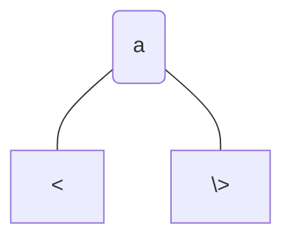

任何比较过程都可以看作是决策树：如果大于 $a$ 则向右，小于 $a$ 的向左。由于每个节点都代表一种比较的结果，因此共有 $\theta(n!)$ 个节点，得到树的最小深度为
$$
\log(n!) \geq \log\left( \frac{n}{e} \right)^n = n\log\left( \frac{n}{e} \right) = \theta(n\log n)
$$
该深度就是比较排序的复杂度下界。


### 线性时间排序

#### 计数排序

假设输入数组 $A[1,2,\cdots,n],A[i]\in\{1,2,\cdots,k\}$，则可以统计每个值出现次数。例如 $A=(4,1,3,4,3)$，首先找到最大元素 $4$，然后创建计数数组 $C=(1,0,2,2)$，分别表示 $1,2,3,4$ 出现的次数。然后逐位累加
$$
C' = (1,1,3,5)
$$
现在从后向前依次遍历。首先是 $3$，其对应的位置为 $3$，然后计数器减少
$$
C'=1,1,\underline{3},5 \implies B = \times,\times,3,\times,\times,\quad C'=1,1,2,5
$$
接着是 $4$，其对应的位置为 $5$，得到
$$
C'=1,1,2,\underline{5} \implies B = \times,\times,3,\times,4,\quad C'=1,1,2,4
$$
以此类推
$$
\begin{aligned}
C'&=1,1,\underline{2},5 \implies B = \times,3,3,\times,4,\quad C'=1,1,1,4\\
C'&=\underline{1},1,1,4 \implies B = 1,3,3,\times,4,\quad C'=0,1,1,4\\
C'&=0,1,1,\underline{4} \implies B = 1,3,3,4,4,\quad C'=0,1,1,3
\end{aligned}
$$
最后得到 $B$ 就是排序数组。

>[!note] 
>由于累加计数器后，第 $i$ 位数表示小于等于 $i$ 的数的个数，因此这个数就是它排序后的位置。


计数排序流程如下

1. 获得最大元素并初始化计数器 $\theta(n+k)$
2. 进行计数 $\theta(n)$
3. 累加计数 $\theta(k)$
4. 分配元素 $\theta(n)$

因此总复杂度为 $\theta(n+k)$，如果 $k\gg n$，则计数排序效果可能不佳。


#### 基数排序

从最低位到最高位依次排序，如果有两数对应位相同，则保持其顺序不变。假设前 $t-1$ 位已经排好顺序

- 若第 $t$ 位互不相同，则排序会将第 $t$ 位按顺序排好，数的顺序完全由第 $t$ 位决定，算法正确
- 若有两个数第 $t$ 位相同，由于保存顺序不变，因此要看前 $t-1$ 位，而根据归纳假设，前 $t-1$ 位已经排好，所以算法正确

综上基数排序正确。由于每一位数都是有限整数，因此可以使用计数排序。


假设要排序 $n$ 个 $b$ 位二进制数，如果 $b$ 很大会导致计数排序不佳。因此将每个整数拆分为 $\frac{b}{r}$ 个 $r$ 位数，每个 $r$ 位数只看作一位进行比较，例如将二进制数写成十六进制数
$$
x = 0011\ 1101, b= 8 \implies x=3 D, r = 4
$$
这样就减少了位数，复杂度从 $\theta(b(n+k))$ 变为 $\theta\left( \frac{b}{r}(n+k) \right)=\theta\left( \frac{b}{r}(n+2^r) \right)$，由 $n\geq 2^r$ 并求导取最小值得到
$$
T(n) = O\left( \frac{b}{r}(n+2^r) \right) \geq O\left( \frac{b}{\log n}(n+n) \right) = O\left( \frac{bn}{\log n} \right)
$$
我们希望达到这个下界，就需要 $r$ 尽可能大。


### 顺序统计和中值

#### 第 $k$ 小的元素

给定一组无序数，要找到第 $k$ 小的元素。设 $A(p,q,i)$ 表示选择子数组 $A[p,q]$ 中第 $i$ 小的元素，则可以按照如下流程

1. 参照快排划分数组 $A(p,r-1,i),A(r+1,q,i-k)$
2. 判断 $i$ 位于哪个部分
3. 递归排序

例如给定 $A=6,10,13,5,8,3,2,1$，找到第 $7$ 小的元素。首先选择主元 $6$ 划分数组
$$
A'=2,5,3,\quad 6,\quad 8,13,10,11
$$
左边比 $6$ 小，右边比 $6$ 大，因此 $6$ 是第 $4$ 小的元素，目标元素在右边。


假设元素互不相同，最好的情况是总是按照常数比例划分，例如 $1:9$ 划分
$$
T(n)\leq\max\left(  T\left( \frac{1}{10}n \right),T\left( \frac{9}{10}n \right)  \right)+\theta(n) = \theta\left( n\right)
$$
最坏的情况是每次都按 $1:n-1$ 划分
$$
T(n) \leq \max(T(1),T(n-1))+\theta(n) = \theta(n^2)
$$
运用指示器随机变量 $x_{k}$ 分析期望
$$
\begin{aligned}
T(n) &\leq \sum_{k=0}^{n-1}x_{k}(T(\max\{k,n-k-1\})+\theta(n))\\
E(T(n)) &= E\left[ \sum_{k=0}^{n-1}x_{k}(T(\max\{k,n-k-1\})+\theta(n)) \right]\\
&= \sum_{k=0}^{n-1}E(x_{k})E[T(\max\{k,n-k-1\})+\theta(n)]\\
&= \frac{1}{n}\sum_{k=0}^{n-1}E[T(\max\{k,n-k-1\})]+\frac{1}{n}\sum_{k=0}^{n-1}\theta(n)\\
&\leq \frac{2}{n}\sum_{{k=\lceil \frac{n}{2} \rceil }}^{n-1}E(T(k))+\theta(n)
\end{aligned}
$$
证明 $E(T(n))\leq cn$，用归纳法
$$
\begin{aligned}
E(T(n)) &\leq \frac{2}{n}\sum_{{k=\left\lceil  \frac{n}{2}  \right\rceil }}^{n-1}E(T(k))+\theta(n)\\
&\leq \frac{2}{n}\sum_{{k=\left\lceil  \frac{n}{2}  \right\rceil }}^{n-1}ck+\theta(n)\\
&\leq \frac{3}{4}cn+\theta(n)\\
&= cn-\left( \frac{1}{4}cn-\theta(n) \right)\\
&\leq cn
\end{aligned}
$$
其中利用了不等式
$$
\sum_{{k=\left\lceil  \frac{n}{2}  \right\rceil }}^{n-1}k \leq \frac{3}{8}n^2
$$
当 $c$ 足够大即证。


#### 线性最坏情况算法

按如下方式寻找第 $i$ 小的元素

1. 排列所有元素为 $5\times \left\lfloor  \frac{n}{5}  \right\rfloor$ 的表格，对每一列排序，找到中值所在行
2. 寻找中值所在行的中值 $x$
3. 用该中值进行划分，$k$ 为 $x$ 的索引（划分后）
4. 当 $i=k$ 即得；若 $i<k$，递归选择左下区域，否则递归选择右上区域

如图所示，其中 $a\to b$ 表示 $a<b$，因此上述过程首先将每一列变成有序，然后再对每一列的中值横向排序，这样根据箭头方向，大于 $x$ 的元素在右上区域，小于 $x$ 的元素在左下区域。

![[图片1 1.svg|500]]

考虑每次递归时新区域中元素的个数，其左下区域元素有
$$
N \geq 3\left\lfloor \left\lfloor  \frac{n}{5}  \right\rfloor \cdot\frac{1}{2}  \right\rfloor \geq 3\left\lfloor  \frac{n}{10}  \right\rfloor \geq \frac{n}{4},\quad (n\geq 50)
$$
因此一组最少有 $\frac{n}{4}$ 个元素，另一组最多有 $\frac{3n}{4}$ 个元素，于是
$$
T(n) \leq T\left( \frac{n}{4} \right)+T\left( \frac{3n}{4} \right)+\theta(n)
$$
假设 $T(n)\leq cn$，于是
$$
T(n) \leq c\cdot \frac{n}{5}+c \cdot \frac{3n}{4}+\theta(n) = \frac{19}{20}cn+\theta(n)=cn-\left( \frac{1}{20}cn-\theta(n) \right)\leq cn
$$
只需要 $c$ 足够大即证。


### 外部排序

当内存空间不足以读取所有外存中的数据时，就需要使用外部排序。


#### 二叉归并树

典型的外部排序过程为

1. 将外存数据分块，使得内存每次可以读取**两块**，归并**一块**
2. 首先分块读取数据到内存，在内存中排序后写回外存
3. 每次读取两块，在内存中归并，每当填满归并数组时就写回外存
4. 重复上述操作，直到所有块合并

例如初始有 8 块，第一轮先对每块排序
$$
\begin{matrix}
3 & 4 &  | & 10 & 12 & | & 14 & 16 & | & 6 & 8 &  | & 22 & 24 & | & 18 & 20 &| & 26 & 30 & | & 28 & 32
\end{matrix}
$$
第二轮两两归并，得到 4 块
$$
\begin{matrix}
3 & 4  & 10 & 12 & | & 6 & 8 & 14 & 16  &  | & 18 & 20 & 22 & 24 & | & 26 & 28 & 30 & 32
\end{matrix}
$$
内存中最多读取两块，例如下面两块排序
$$
\begin{matrix}
3 & 4  & 10 & 12 & | & 6 & 8 & 14 & 16  & 
\end{matrix}
$$
内存分别读取两块，对这两块归并
$$
\begin{aligned}
\begin{matrix}
| & 3 & 4 & |\\
| & 6 & 8 & |
\end{matrix}
\end{aligned}\quad 
\begin{matrix}
| 归并内存 |
\end{matrix}
\implies
\begin{aligned}
\begin{matrix}
| &  &  & |\\
| & 6 & 8 & |
\end{matrix}\quad
\begin{matrix}
| & 3 & 4 & |
\end{matrix}
\end{aligned}
$$
当一块拿空以后，再读取一块
$$
\begin{aligned}
\begin{matrix}
| & 10 & 12 & |\\
| & 6 & 8 & |
\end{matrix}
\end{aligned}\quad 
\begin{matrix}
| & 3 & 4 & |
\end{matrix}
$$
由于归并内存填满，将其写入外存后清空，然后继续归并，直到完成合并。第三轮两两归并，得到 2 块
$$
\begin{matrix}
3 & 4 & 6 & 8 & 10 & 12 & 14 & 16  &  | & 18 & 20 & 22 & 24 & 26 & 28 & 30 & 32
\end{matrix}
$$
最后一轮
$$
\begin{matrix}
3 & 4 & 6 & 8 & 10 & 12 & 14 & 16 & 18 & 20 & 22 & 24 & 26 & 28 & 30 & 32
\end{matrix}
$$
完成合并。

>[!note]
>外部排序使用的内存有限，每次只能对一小部分数据排序，但是利用归并过程可以逐块合并有序数据。


#### 败者树

二叉归并树每次对两块内存数组归并，但实际上可以使用 $k$ 块内存归并，减少从外存中读取数据的次数。对 $k$ 个数组归并排序需要寻找 $k$ 个元素中的最小值，这个过程可以用败者树优化。例如考虑 4 块内存
$$
\begin{matrix}
3 & 4 &  | & 10 & 12 & | & 14 & 16 & | & 6 & 8 &
\end{matrix}
$$
可以按照如下顺序比较


即执行一个两两比较淘汰的过程来寻找最小值。


#### 置换-选择排序

考虑归并树构建过程的读写次数。容易发现，读写次数等于所有节点的权重和。例如二叉归并树的块合并 8 个长度为 2 的块流程为

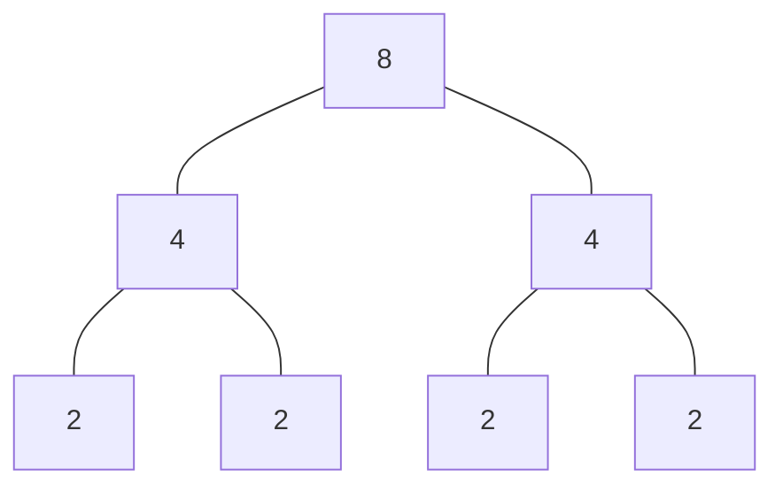

其读写次数为
$$
(2+4+4+2+2+4+8)\times 2 =48
$$
要减少开销，一种做法就是减少节点数，即让归并块尽量大。


置换-选择排序的流程为

1. 给定固定长度的归并数组，记录一个当前最大值 `MaxVal=0`
2. 对 $k$ 个内存数组做归并，每次更新归并的最大元素 `MaxVal`，下一个归并的元素必须大于该值
3. 如果归并数组中所有元素都小于 `MaxVal`，则之前的元素构成第一个归并块
4. 开启一个新的归并块，将 `MaxVal` 置零，回到第二步

这种方法可以让每个归并块都最大。


#### 最优归并树

假设有几个归并块，大小分别为 $2,2,3,4$，则最优二叉归并树是哈夫曼树

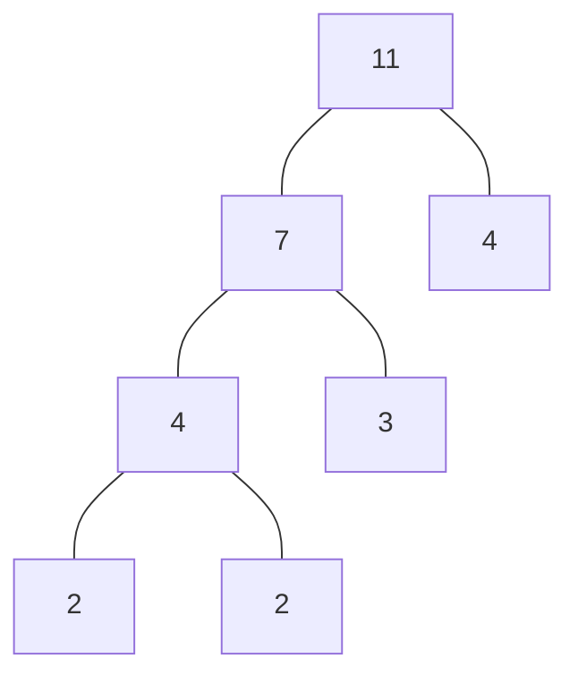

即每次优先归并最小的两个块。


假设有几个归并块，大小分别为 $2,2,3,4,5$，则最优三路归并树为

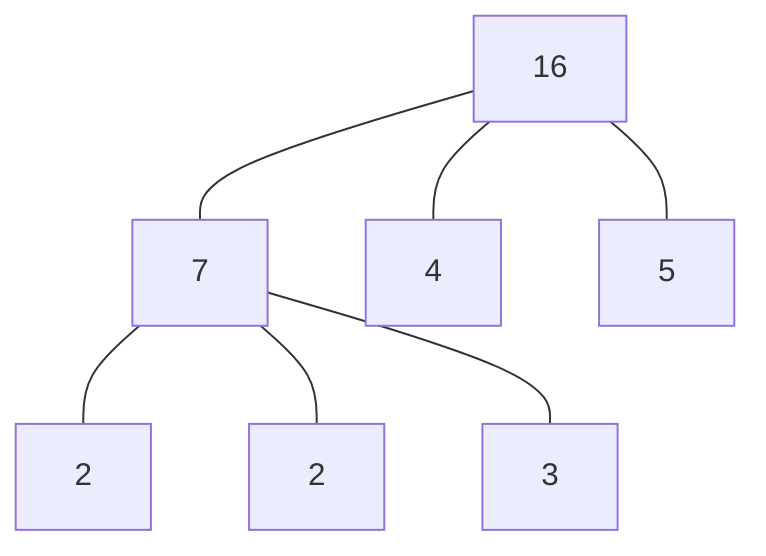

它应当是一个完全三路归并树，即每个非叶节点必须有 3 个子节点。如果节点数无法构建完全三路归并树，例如 $2,2,3,4$，就需要补充空节点。对比加入空节点前后的归并树，可以看到后者节点权重和最小

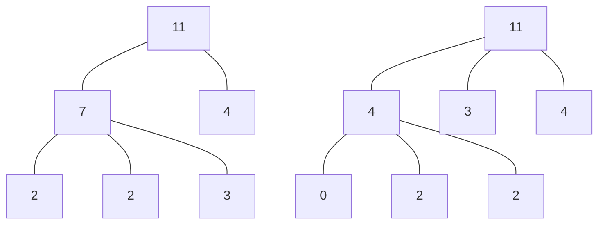

>[!note]
>三路归并树每次合并减少 2 个节点，因此只要初始节点数是 $2n+1$ 就可以构建完全三路归并树，否则就补充空节点；类似地，四路归并树每次合并减少 3 个节点，初始节点数应当是 $3n+1$ 。


## 哈希表

### 符号表问题

编译器中的符号表 $S$ 要存放 $n$ 条信息记录，对这个表的操作有

- 插入 $(S,x):S\to S\cup\{x\}$
- 删除 $(S,x):S\to S-\{x\}$
- 查询 $(S,k): ret\ k$


#### 直接寻址法

一种构建方案是直接映射表，假设键来自 $\{0,1,\cdots,m-1\}$，则建立数组 $T[0,m-1]$ 表示动态集
$$
T[k] = 
\begin{cases}
x, & x\in S,key[x]=k \\
\mathrm{null}, & \mathrm{otherwise}
\end{cases}
$$
这样时间复杂度为 $\theta(1)$，但问题在于 $m$ 可能很大，如果键的数量很少，就有很多空间浪费。


#### 链表结构

可以用哈希函数 $H$ 随机映射键到哈希表 $T$ 的槽，每个槽会指向一个链表。如果两个不同的键映射到同一个槽，就会保存在链表中，如下图所示

![[图片2 1.svg|600]]

时间复杂度分析

- 最坏情况：所有键映射到同一个槽，此时为 $\theta(n)$
- 平均情况：简单均匀哈希。如果拥有 $m$ 个槽的哈希表存放了 $n$ 个键，则装载因子定义为 $\alpha=\frac{n}{m}$，描述哈希表的利用率。此时搜索最坏用时 $\theta(1+\alpha)$ 。


### 哈希函数

我们希望哈希函数将键均匀分布到槽中，并且键的分布不影响哈希表中的分布，即对任何类型的输入都能做到均匀。


#### 除法哈希

定义 $h(k)=k\mod m$，这里 $m$ 不应该太小。如果 $m=2$，且输入都是偶数，则奇数槽会被浪费；如果 $m=2^r$ 时，则会忽略二进制数高于 $k$ 的位。通常 $m$ 应当不靠近 $2,10$ 的幂。


#### 乘法哈希

指定槽数为 $m=2^r$，若计算机中一个字节有 $w$ 位，则定义
$$
h(k) = (A\cdot k \mod 2^w)rsh(w-r)
$$
其中 $A$ 是位于 $2^{w-r}$ 到 $2^w$ 之间的奇数，并且不应当靠近边界值；$rsh$ 是右移运算。例如
$$
\begin{aligned}
m&=7=2^3,\quad w=7,\quad r=3\\ 
A&=1011001,\quad k=1101011\\
\end{aligned}
$$
计算得到
$$
A\cdot k=\underbrace{1001010}_{ignore} \underbrace{011}_{h(k)}  \underbrace{0011}_{rsh} 
$$
乘积的后 $7$ 位被保留，然后移除后 $4$ 位，得到 $3$ 位哈希。


#### 开放寻址法

对于每个键，可以给出一个检查序列 $\{0,\cdots,m-1\}$，依次检查序列中的位置，直到遇到空槽位。例如线性探查
$$
h(k,i) = (h(k,0)+i)\mod m
$$
这种方法的问题在于会导致删除变得困难，并且可能导致一连串槽被占用，让搜索也变得困难。


使用二次哈希探查
$$
h(k,i)=(h_{1}(k)+i\cdot h_{2}(k)) \mod m
$$
通常选择 $m$ 为 $2$ 的幂，$h_{2}(k)$ 为奇数。假设均匀哈希，即所有键都有 $m!$ 种探查序列，每个键相互独立，那么失败搜索的步数 $N$ 的期望
$$
E(N)\leq \frac{1}{1-\alpha},\quad \alpha<1
$$
考虑到第 $i$ 次搜索发生碰撞的概率为 $P_{i}=\frac{n-i+1}{m-i+1}\leq \frac{n}{m}=\alpha$，因此
$$
\begin{aligned}
E(N) &= 1+\frac{n}{m}\left( 1+ \frac{n-1}{m-1}\left( \cdots\left( 1+\frac{1}{m-n+1} \right) \cdots\right) \right) \\
&\leq 1+\alpha(1+\alpha(\cdots(1+\alpha)\cdots))\\
&= 1+\alpha+\alpha^2+\cdots+\alpha^k+\\
= \frac{1}{1-\alpha}
\end{aligned}
$$
如果 $\alpha$ 是常数，则 $N=O(1)$ 。因此使用二次哈希方法时，尽量不要填满哈希表。


### 哈希表结构

在确定哈希表后，插入操作容易实现；查询操作分为两种可能

1. 如果直接映射到查询元素，则查询成功
2. 如果映射到的不是查询元素，则做二次哈希继续查找
3. 如果查找到空位置，则查找失败

删除操作分为两种可能

1. 如果直接映射到删除元素，则直接删除
2. 如果映射到的不是删除元素，则做二次哈希继续查找
3. 如果查找到空位置，则删除失败

对于要删除的元素，为了防止查询遇到空位置后中断二次哈希，需要将该位置做标记，让查询操作继续。


### 全域哈希与完全哈希

对任意一个哈希函数，都存在一个键集，使得其中的所有键映射到同一个槽。因此我们现在考虑随机选择哈希函数，这样就可以忽略输入的影响。


#### 全域哈希

>[!definition] 
>令 $U$ 为键的全域，$H$ 为哈希函数的有限集。如果
> $$
>\forall x,y\in U,x\neq y\implies \#\{h\in H:h(x)=h(y)\} = \frac{|H|}{m}
>$$
>则称 $H$ 是全域的。对任意两个键 $x,y$，则从 $H$ 中随机选取 $h$ 使得 $x,y$ 碰撞的概率为 $\frac{1}{m}$ 。

>[!theorem]
>从 $H$ 中随机取函数 $h$，它将 $n$ 个键映射到 $T$ 表的 $m$ 个槽中。给定的 $x$，它映射后发生碰撞的期望次数为
>$$
>E(N) < \frac{n}{m}=\alpha
>$$

设 $C_{x}$ 是 $T$ 中的键与 $x$ 发生碰撞的总次数，定义
$$
C_{xy} = \begin{cases}
1, & h(x)=h(y) \\
0, & \mathrm{otherwise}
\end{cases} \implies
E(C_{xy})= \frac{1}{m},C_{x}=\sum_{y\in T-\{x\}}C_{xy}
$$
于是
$$
E(C_{x}) = E\left( \sum_{y\in T-\{x\}}C_{xy} \right) = \sum_{y\in T-\{x\}}E(C_{xy}) = \sum_{y\in T-\{x\}} \frac{1}{m} = \frac{n-1}{m}< \frac{n}{m}=\alpha
$$
即证。


构造全域哈希

1. 取 $m$ 为质数，将所有键 $k$ 分解为 $r+1$ 位 $k=\langle k_{0},\cdots,k_{r}\rangle,0\leq k_{i}\leq m-1$
2. 取 $a=\langle a_{0},\cdots,a_{r}\rangle$，其中 $a_{i}$ 从 $\{0,\cdots,m-1\}$ 中随机选取
3. 定义 $h_{a}(k)=\left( \sum_{i=0}^ra_{i}k_{i} \right)\mod m$

于是这一哈希函数通过点积取余实现，并且 $H=\{h_{a}:\forall a\},|H|=m^{r+1}$，则

>[!theorem]
> $H$ 是全域的。

设 $x,y$ 互异，不妨设 $x_{0}\neq y_{0}$，则
$$
\begin{aligned}
h_{a}(x)=h_{a}(y) &\Leftrightarrow \sum_{i=0}^ka_{i}x_{i}\equiv \sum_{i=0}^ka_{i}y_{i}\\
&\Leftrightarrow \sum_{i=0}^ka_{i}(x_{i}-y_{i})\equiv 0\\
&\Leftrightarrow a_{0}(x_{0}-y_{0})\equiv \sum_{i=1}^ka_{i}(x_{i}-y_{i})

\end{aligned}
$$
首先，给出一个引理

>[!lemma]
>设 $m$ 为质数，则对任意 $z\in \mathbb{Z}_{m}$，若 $z\not\equiv 0$，则存在唯一的 $z^{-1}\in \mathbb{Z}_{m}$ 使得 $zz^{-1}\equiv 1$ 。

于是由 $x_{0}\neq y_{0}$，则存在唯一的 $(x_{0}-y_{0})^{-1}$ 使得
$$
a_{0}=\left( -\sum_{i=1}^ra_{i}(x_{i}-y_{i}) \right)(x_{0}-y_{0})^{-1}
$$
则只存在唯一的 $a_{0}$ 使得 $x,y$ 发生碰撞。由 $a$ 构建的 $H$ 有 $m^{r+1}$ 个元素，则对于 $x_{i},y_{i},i\neq 0$，发生碰撞的概率为 $m^r\cdot 1=\frac{|H|}{m}$，则 $H$ 是全域哈希。


#### 完全哈希

>[!definition]
>给定 $n$ 个键，完全哈希创建一个静态哈希表，大小为 $m=O(n)$，使得最坏情况运行时间为 $O(1)$ 。

关键在于使用双级结构，并且每一级使用全域哈希，在第二级中没有碰撞。例如
$$
h(32)=h(14)=h(27)=1
$$
发生碰撞，则考虑使用 $32$ 构造全域哈希 $h_{32}(14)=1,h_{32}(27)=2$，就避免了碰撞。

![[图片4 1.svg|500]]


>[!theorem]
>若 $n$ 个键映射到 $m=n^2$ 个槽中，则对于 $H$ 中任取的 $h$，期望碰撞次数为 $E(N)< \frac{1}{2}$ 。

两个给定键发生碰撞的次数为 $\frac{1}{m}$，则
$$
E(N)= \binom{n}{2} \frac{1}{n^2} = \frac{n(n-1)}{2} \frac{1}{n^2} < \frac{1}{2}
$$
其中 $\binom{n}{2}$ 是从 $n$ 个键中任取两个的组合数。


>[!theorem] Markov
>对于 $X\geq 0$，有 $P(X\geq t)\leq \frac{E(X)}{t}$ 。

利用期望定义
$$
E(X) = \sum_{x=-\infty}^\infty xP(X=x) \geq \sum_{x=t}^\infty xP(X=x) \geq t\sum_{x=t}^\infty P(X=x) = tP(X\geq t)
$$
即证。


根据 Markov 不等式，则
$$
P(碰撞) \leq \frac{E(N)}{1} < \frac{1}{2}
$$
因此只需要随机测试几个哈希函数，大约有一半可行。


在构建表时，第一级表取 $m=n$，设被映射到 $i$ 的键有 $n_{i}$ 个，令 $i$ 对应的第二级表取 $m_{i}=n_{i}^2$，于是
$$
E(M) = n + E\left( \sum_{i=0}^{m-1}\theta(n_{i}^2) \right) = \theta(n)
$$
则表的大小为 $O(n)$ 。


### 并查集

并查集使用哈希表记录每个元素属于哪个其它元素，例如下图表示 $\{A,B\},\{C,D,E,F\}$ 两个集合

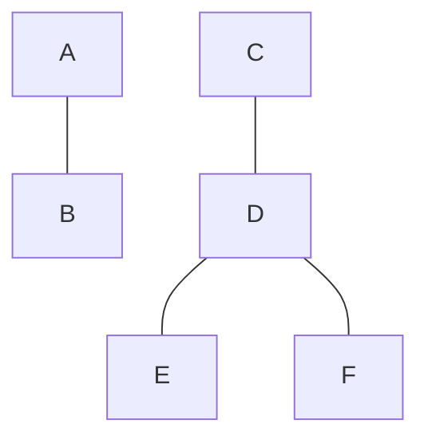

使用连接关系是因为在最初每个元素都是一类，然后在遍历数组的过程中，逐渐合并不同元素为一类，从而根据合并的先后顺序构建出一棵合并树。

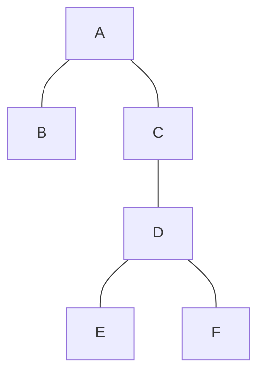


#### 查询

假设已经构建好一棵合并树，现在要查找某个元素所属的集合。只需要检查该元素指向的元素

1. 若该元素不指向其它元素，则到达根节点，这就是它所属的集合
2. 否则继续检查指向的元素

注意到查询 `E` 需要遍历经过 `E,D,C,A`，但实际上只需要在查询时让 `E` 指向 `A`，就可以在下次查询时减小开销。这种方法称为**路径压缩**。


这个过程可以很容易地通过尾递归实现

```c++
int find(int x)
{
	if (h[x] == x)
		return x;
	return h[x] = find(h[x]);
}
```

其中我们规定根节点指向自己，于是尾递归将 `x` 所属的类返回后赋予 `h[x]`，这就将路径上的所有节点全部指向根节点。


#### 合并

假设要合并 `x,y` 两个类，只需要连接 `find(x),find(y)`，有两种策略

1. 按高度合并：根节点指向一个负高度，每次将较低的树合并到较高的树，然后更新根节点的高度
2. 按大小合并：根节点指向一个负大小，每次将较小的树合并到较大的树，然后更新根节点的大小

其目的都是降低树的高度，减小查询开销。

>[!note]
>路径压缩会改变树的高度，因此按高度合并时，根节点记录的高度仅是一个估计值。

两种合并方法结合路径压缩后，查询效率为 $O(\alpha(n))$，其中 $\alpha$ 是反阿克曼函数，其值一般不会大于 $4$ 。


## 树

### 二叉搜索树

二叉搜索树（Binary Search Trees, BST）

- 运行时间
	- 遍历初始化 $O(n)$
	- 插入时间 $\Omega(n\log_{2}n)$ 或 $O(n^2)$
- 最好情况是平衡树 $T(n)=n\log_{2}n$
- 最坏情况是顺/逆序 $T(n)=O(n^2)$

BST 排序和快速排序的比较方式相同，只是比较顺序不同。为了防止出现顺/逆序，考虑使用随机主元排序，于是有

>[!theorem]
> $E(h)=O(\log_{2}n)$

选取 $r$ 为根节点，它左右各有 $k-1,n-k$ 个元素。记 $x_{n}$ 为 $n$ 个元素的 BST 的高度，$y_{n}=2^{x_{n}}$，设置指示器随机变量
$$
z_{n,k} = \begin{cases}
1, & r在第k位 \\
0, & \mathrm{otherwise}
\end{cases}
$$
则有
$$
\begin{aligned}
x_{n,k} &= 1+\max\{x_{n,k-1},x_{n,n-k}\}\\
y_{n,k} &= 2\max\{y_{n,k-1},y_{n,n-k}\}
\end{aligned}
$$
于是
$$
\begin{aligned}
P(z_{n,k}=1) &= E(z_{n,k}) = \frac{1}{n}\\
E(y_{n}) &= E\left( \sum_{k=1}^nz_{n,k}y_{n,k} \right)\\
&= E\left( \sum_{k=1}^nz_{n,k}2\max\{y_{n,k-1},y_{n,n-k}\} \right)\\
&= 2\sum_{k=1}^nE(z_{n,k}) E(\max\{y_{n,k-1},y_{n,n-k}\} )\\
&= \frac{2}{n}\sum_{k=1}^nE(\max\{y_{n,k-1},y_{n,n-k}\} )\\
&\leq \frac{2}{n}\sum_{k=1}^nE(y_{n,k-1}+y_{n,n-k} ) = \frac{4}{n} \sum_{k=0}^{n-1}E(y_{k})
\end{aligned}
$$
归纳证明 $E(y_{n})=O(n^3)$，即 $E(y_{n})\leq cn^3$，则
$$
E(y_{n}) \leq \frac{4}{n}\sum_{k=0}^{n-1}E(y_{k}) \leq \frac{4}{n}\sum_{k=0}^{n-1} ck^3 \leq \frac{4}{n} c\int_{0}^n k^3dk = cn^3
$$
由于 $n=\theta(1)$ 时，存在足够大的 $c$ 使得不等式成立，由归纳假设即证。最后，由
$$
E(x_{n}) = E(\log_{2}y_{n}) = \log_{2}E(y_{n}) = O(\log_{2}n)
$$
即证。


### AVL 树

#### 平衡因子

定义每个节点的平衡因子是左子树的高度减去右子树的高度，则 AVL 树满足

- 每个节点的平衡因子的绝对值不大于 1
- 不满足上述条件的节点称为“失衡节点”

标记每个节点/子树的高度，并且**假定失衡节点的子节点都是平衡的**。于是共有 4 种可能的失衡情况，对应平衡因子为 $\pm 2$ 的情况。


#### 失衡问题

下图中 `A` 节点失衡，左子树的右子树较低，此时只需要将 `A` 节点右旋，将较低的子树拼接到 `A` 上，将 `B` 作为父节点即可平衡

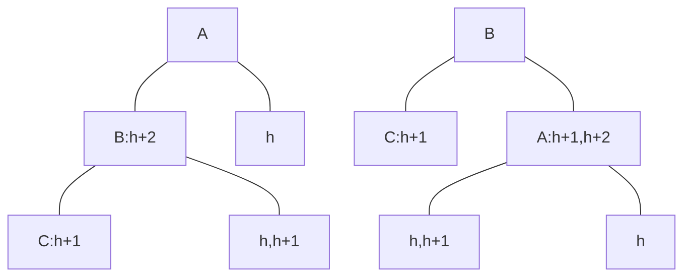

>[!note]
>这种失衡记为 `LL`，即左子树失衡，左子树较低。


另一种情况是左子树的左子树较低，可以将 `B` 先左旋，转换为右子树较低的情况

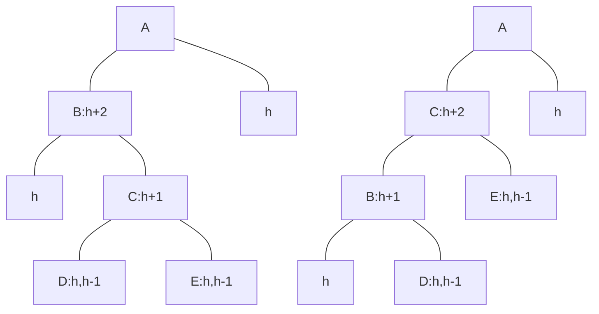

>[!note]
>这种失衡记为 `LR`，即左子树失衡，右子树较低。


其它两种情况 `RR,RL` 是这两种情况的镜像，不再赘述。

>[!note]
>注意由于最初子节点都是平衡的，因此子树的高度只能取几个可能的值。


#### 插入

当插入节点时，沿着插入路径上的平衡因子被更新，有可能出现失衡。此时，根据前面对失衡问题的处理，自下而上地将处理每个失衡节点即可。


#### 删除

当删除节点时，沿着删除路径上的平衡因子被更新，有可能出现失衡。此时，根据前面对失衡问题的处理，自下而上地将处理每个失衡节点即可。


### 红黑树

红黑规则

1. 每个节点是红色或黑色
2. 根叶黑：根节点和叶节点都是黑色
3. 不红红：红节点的父节点是黑色
4. 黑路同：将一个节点的两个子节点作为根节点，则两个子树具有相同的黑高度

黑高度定义为从节点向下到达叶节点的路径上黑节点的数量，注意默认哨兵节点 `nil` 是叶节点。


#### 插入

插入根节点时，选择黑色；否则，选择红色。这两种操作都不破坏黑路同性质。若父节点为黑色，则不动；若父节点为红色，则需要调整。


如果叔叔是红色，则交换颜色


此时黑高度没有变化，将 `Grand` 视为新节点继续检测。


如果叔叔是黑色，并且插入位置在左子树，则将 `Father` 变黑，此时左子树黑高增加

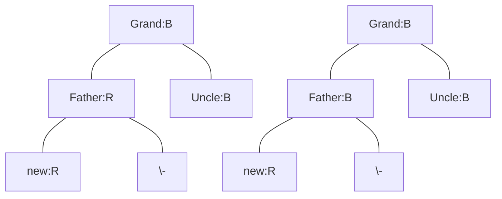

只需要将爷节点右旋，再将其变红

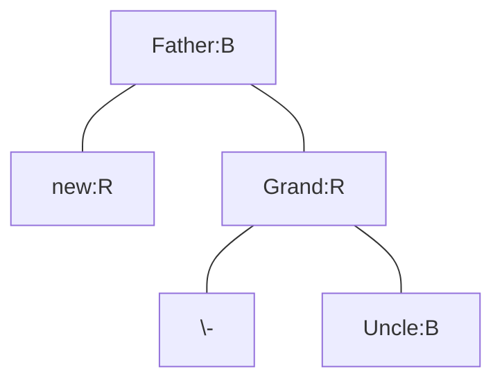

>[!note]
>注意到这步操作和 AVL 树的 `LL` 失衡情况处理方法相同。


如果叔叔是黑色，并且插入位置在右子树，只需要将 `Father` 左旋，就变成了上面的情况

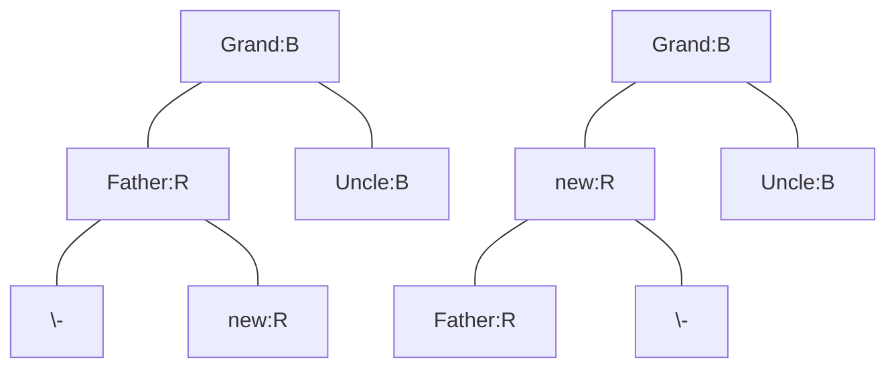

>[!note]
>注意到这步操作和 AVL 树的 `LR` 失衡情况处理方法相同。


#### 删除

注意到删除某个节点时，只需要与它的前驱或后继交换值，然后删除该前驱或后继。由于前驱或后继必然存在哨兵叶节点，因此实际上只需要考虑两种情况

1. 一个子树都是哨兵
	1. 若删除节点是黑节点，则它的左右黑高不平衡，这种情况不可能出现
	2. 删除节点只能是红节点，则直接删除即可
2. 两个子树是哨兵
	1. 若删除节点是红节点，则不影响黑高，直接删除
	2. 若删除节点是黑节点，需要考虑下面几种情况

如果兄弟是红色，左子树黑高更大，只需要将 `Father` 右旋，然后与 `Brother` 交换颜色

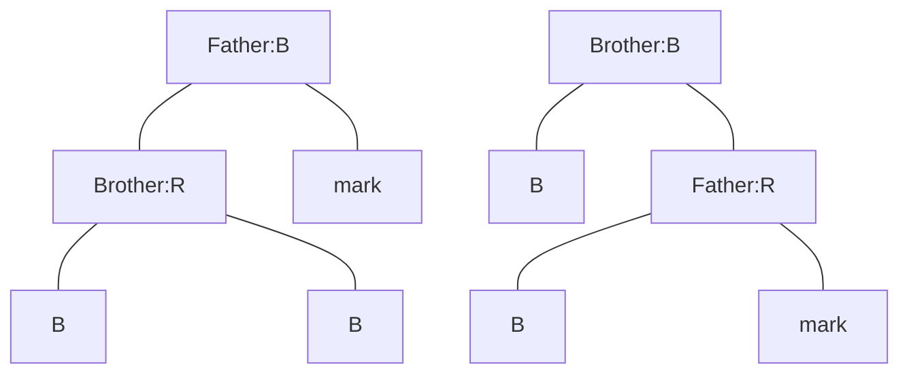

这样就变成了兄弟是黑色的情况。


如果兄弟是黑色，左子树黑高更大，且其左子节点是红色，符合 `LL` 型，因此对 `Father` 右旋

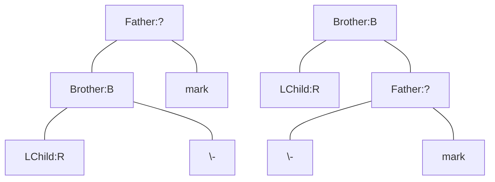

此时左子树少了一个黑节点，右子树多一个 `?` 节点。将 `LChild` 和 `Father` 都变为黑节点，就完成平衡。最后，将 `Brother` 变为 `?` 节点

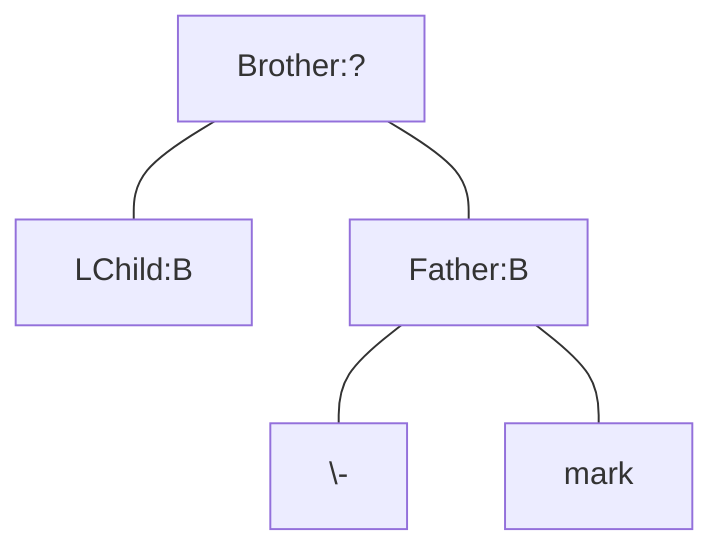

现在 `Brother` 的颜色是之前 `Father` 的颜色，因此上述操作只改变了左右子树，对上面没有影响。


如果兄弟是黑色，左子树黑高更大，且其右子节点是红色，符合 `LR` 型，因此对 `Brother` 左旋

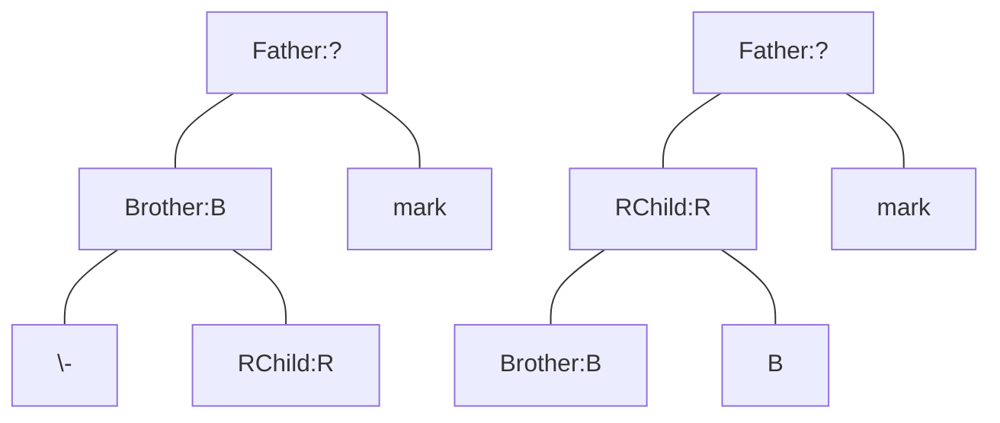

得到 `LL` 型，因此对 `Father` 右旋。此时右子树还是少一个黑节点，将 `Father` 变为黑节点，就完成平衡。最后，将 `RChild` 变为 `?` 节点

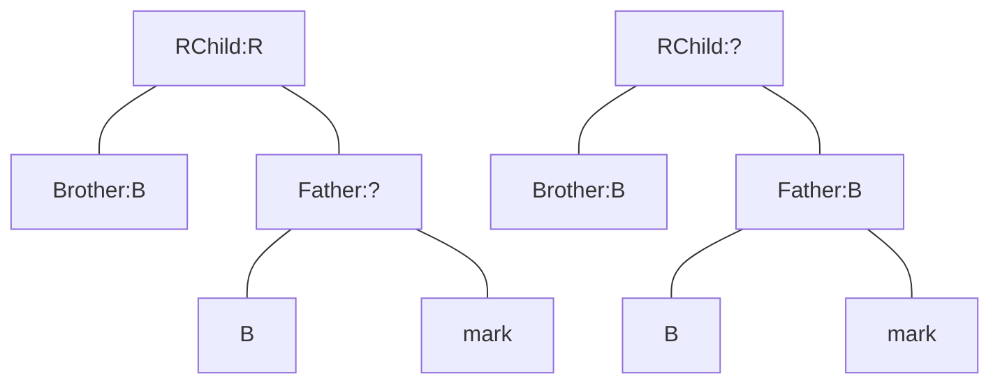

现在 `RChild` 的颜色是之前 `Father` 的颜色，因此上述操作只改变了左右子树，对上面没有影响。


如果兄弟是黑色，左子树黑高更大，且其左右子节点都是黑色，只能是哨兵。只需要将兄弟变红就完成平衡。但注意 `Father` 这棵树总体少一个黑节点，所以

1. 若 `Father` 就是根节点，则无需调整
2. 否则
	1. 若 `Father` 是红色，变为黑色即可
	2. 若 `Father` 是黑色，则标记 `Father`，整体上移，递归调用检查兄弟

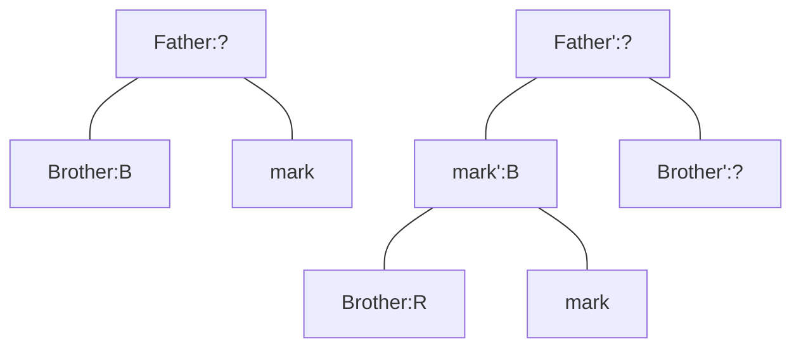


### B 树

定义 $k$ 叉 B 树中

1. 每个节点最少有 $\lfloor \frac{k}{2} \rfloor$ 个元素，最多有 $k$ 个元素
2. 节点中的元素顺序排列
3. 有 $m$ 个元素的非叶节点应当有 $m+1$ 个子节点
4. 第 $i$ 个元素恰好划分左右子节点中的元素
5. 所有到叶节点的路径长度相同

插入元素时，如果不违背第一条，则直接将元素写入正确位置的节点；如果节点中的元素数超过 $k$，则

1. 将第 $\lfloor \frac{k}{2} \rfloor$ 个元素（$i$ 从 $0$ 开始）提升到父节点
2. 当前节点分裂为两个节点
3. 检查父节点，回到第一步

删除元素时，如果不违背第一条，则直接删除元素；如果节点中的元素数少于 $\lfloor \frac{k}{2} \rfloor$，则

1. 若左兄弟节点元素树多于 $\lfloor \frac{k}{2} \rfloor$，则将左兄弟的最后一个元素提升到父节点，并将父节点中该元素的后继下放到当前节点；否则考虑右兄弟节点
2. 若左右兄弟节点总数不超过 $k$，则将左节点、左节点在父节点中的后继元素、当前节点合并

注意删除的元素位于非叶结点时，可以用叶节点的元素替换，从而转换为删除叶节点元素的情况。


### B+ 树

由于 B 树的非叶节点中都记录了实际数据，在保存数据库时，每个非叶节点能够保存的数据量很少。而 B+ 树

1. 只在叶节点中保存实际数据，非叶结点只保存数据的索引，这样就能在节点中保存大量的数据信息
2. 叶节点按顺序链接，形成线性链表，允许线性遍历
3. 允许范围查找，先查首元素，然后顺序遍历

定义 $m$ 阶 B+ 树中

1. 每个节点最多有 $m$ 个子节点
2. 非叶/根节点至少有 2 个子节点；其它节点至少有 $\lceil \frac{m}{2} \rceil$ 个子节点
3. 节点的子节点数等于其中元素的个数
4. 非叶节点中的数据索引全部出现在叶节点中

B+ 树的插入和删除策略与 B 树类似。


## 扩充的数据结构

### 线索二叉树

将叶节点的左右指针分别指向其前驱和后继，这样便于查找每个节点的前驱和后继。

>[!note]
>注意需要用两个布尔值标记左右指针是子节点还是前驱和后继。


### 有序统计树

可以在红黑树的节点上记录**该节点的子树**的大小，这样便于寻找树中第 $k$ 小的元素。

>[!note]
>虽然也可以直接让节点自己记录自己的排序，但是这种排序对于红黑树的各种旋转操作都很难维护。


### 跳跃表

跳跃表提供一种动态搜索结构，极大概率有 $T(n)=O(\log_{2}n)$，并且对每一种操作均成立。它使用两个以上的链表。例如纽约地铁站有快慢线
$$
\begin{matrix}
Fast & 14 &  & 34 & 42 &  &   & & 72\\
Slow & 14 & 23 & 34 & 42 & 50 & 59 & 66 & 72 & 79  \\
\end{matrix}
$$
其中快线只在特定的位置停留，于是我们得到两条链表

- $L_{1}$ 储存子集元素
- $L_{2}$ 储存全部元素

将 $L_{1},L_{2}$ 中键值相同的元素链接。搜索时，先搜 $L_{1}$ 再搜 $L_{2}$ 。

>[!note]
>注意跳跃表以链表为基础，相较于使用单一连续内存，它能够以 $O(\log_{2}n)$ 而不是 $O(n)$ 实现插入和删除。


假设 $L_{1}$ 中键值均匀分布，则
$$
T(n) = |L_{1}| + \frac{|L_{2}|}{|L_{1}|} +\theta(1) = |L_{1}|+ \frac{n}{|L_{1}|}+\theta(1) \geq 2\sqrt{ n }+\theta(1)
$$
当 $|L_{1}|=\sqrt{ n }$ 时取得最小复杂度。再考虑 $k$ 条链表，可得
$$
T(n)= k\sqrt[k]{ n }
$$
为了使用二分，令 $k=\log_{2}n$，则
$$
T(n) = n^{1/\log_{2}n}\log_{2}n = 2\log_{2}n
$$
即每条链表都是上层链表长度的一半。


执行插入操作时，按照如下步骤

1. 插入底层链表
2. 以 $\frac{1}{2}$ 概率将元素插入上一层链表；如果插入上层链表，再以 $\frac{1}{2}$ 概率插入上一层链表

于是插入后高度超过 $\log_{2}n$ 的概率为
$$
P = \left( \frac{1}{2} \right)^{\log_{2}n} = \frac{1}{n}
$$
删除操作则比较简单。

>[!note]
>注意每个元素的层数确定后，会插入不超过该层数的所有层。


### 十字链表

由于邻接链表不能直接得到每个顶点的入边，因此使用十字链表额外提供入边的信息。例如

```mermaid
   graph LR
   A[A] <---> B[B]
   A <---> C[C]
   B <---> C
```

邻接链表表示为

```
(A,A) -> (A,B) -> (A,C)
(B,B) -> (B,A) -> (B,C)
(C,C) -> (C,A) -> (C,B)
```

现在增加一条连接关系，将上面二元组的第二个元素之间连接，例如

```
		 (A,A) -> (A,B) -> (A,C)
			|
(B,B) -> (B,A) -> (B,C)
		    |
(C,C) -> (C,A) -> (C,B)
```

这样对 `A` 可以获得其入边链表和出边链表。


### 邻接多重表

对于无向图，边 `(A,B),(B,A)` 等价，因此可以将十字链表中的这些节点合并

```
C -> (A,C) --|
	  |      |
A -> (A,B)   |
		|    |
B -> (C,B)   |
      |------|
```


## 平摊分析

### 聚集分析

哈希表应当

- 尽可能大（省时）
- 尽可能小（省空间）

于是要采取动态表结构，当表太满时扩大表，例如每次扩大一倍，之后

1. 重新分配内存
2. 重新放置表中的键
3. 释放旧表的空间

最坏情况下，插入操作耗费 $\theta(n)$，即需要扩大复制整个表。此时第 $i$ 次插入的开销为
$$
c_{i} = \begin{cases}
i, & i-1=2^k \\
1, & \mathrm{otherwise}
\end{cases}
$$
可以将整个过程展示为
$$
\begin{matrix}
i & 1 & 2 & 3 & 4 & 5 & 6 & 7 & 8 & 9 & 10 \\
size & 1 & 2 & 4 & 4 & 8 & 8 & 8 & 8 & 16 & 16 \\
c_{i} & 1 & 2 & 3 & 1 & 5 & 1 & 1 & 1 & 9 & 1
\end{matrix}
$$
注意 $c_{i}$ 中包含了插入开销和复制开销。于是 $n$ 次插入的总开销为
$$
\sum_{i=1}^nc_{i} = n + \sum_{i=0}^{\lfloor \log_{2}(n-2) \rfloor }2^i \leq 3n = \theta(n)
$$
平均开销为
$$
T(n) = \frac{\theta(n)}{n} = \theta(1)
$$
这就是平摊分析，它考虑整体上的平均代价。下面介绍的方法更为精确。


### 记账方法

对第 $i$ 个操作收取一个虚构的平摊代价 $\hat{c}_{i}$，在支付给这一操作后，剩余的部分放入银行，用于偿付以后的操作，并且确保存款余额不能为负。


以动态表为例

1. 对每步操作收取 $\hat{c}_{i}=3$，其中插入操作支付 $1$，剩余 $2$ 用于表容量翻倍时的预付费用
2. 当表容量翻倍时，从存款中取出 $1$ 来插入，取出 $1$ 来移动**每个**旧项

例如
$$
\begin{matrix}
\hat{c}_{i} & 2 & 3 & 3 & 3  & 3 & 3 & 3 & 3 & 3 & 3\\
size & 1 & 2 & 4 & 4 & 8 & 8 & 8 & 8 & 16 & 16\\
bank & 1 & 2 & 2 & 4 & 2 & 4 & 6 & 8 & 2 & 4 & \leq & 3n
\end{matrix}
$$
其中从 $2$ 扩容到 $4$，插入耗费 $1$，移动旧项耗费 $2$，因此余额不增加。


### 势能方法

基本思想

1. 初始数据结构为 $D_{0}$
2. 操作 $i$ 将 $D_{i-1}$ 变为 $D_{i}$
3. 操作 $i$ 的代价是 $c_{i}$
4. 定义势能函数 $\Phi:\{D_{i}\}\to \mathbb{R},\Phi(D_{0})=0,\Phi(D_{i})\geq 0$
5. 定义平摊代价 $\hat{c}_{i}=c_{i}+\Phi(D_{i})-\Phi(D_{i-1})$

于是
$$
\sum_{i=1}^n\hat{c}_{i} = \sum_{i=1}^n(c_{i}+\Phi(D_{i})-\Phi(D_{i-1})) = \sum_{i=1}^nc_{i}+\Phi(D_{n})-\Phi(D_{0}) \geq \sum_{i=1}^nc_{i}
$$
显然 $\Delta \Phi_{i}=\Phi(D_{i})-\Phi(D_{i-1})$ 的符号表明数据结构的做功情况。


以动态表为例，定义
$$
\Phi(D_{i}) = 2i- 2^{\lceil \log_{2}i \rceil }
$$
于是
$$
\begin{aligned}
\hat{c}_{i}&=c_{i}+\Phi(D_{i})-\Phi(D_{i-1})\\
&= (2i-2^{\lceil \log_{2}i \rceil })-(2(i-1)-2^{\lceil \log_{2}(i-1) \rceil }) +
\begin{cases}
i, & i-1=2^k \\
1, & \mathrm{otherwise}
\end{cases}\\
&= 2-2^{\lceil \log_{2}i \rceil }+2^{\lceil \log_{2}(i-1) \rceil } +
\begin{cases}
i, & i-1=2^k \\
1, & \mathrm{otherwise}
\end{cases}\\
&= 3
\end{aligned}
$$
因此平摊代价为 $3n=\theta(n)$ 。

>[!note]
>不同的势能函数或记账方法会产生不同的上限。


## 竞争性分析

### 自组织表

设表 $L$ 中有 $n$ 个元素，并且

- 访问 $x$ 花费表头到 $x$ 的距离 $\mathrm{rank}(x)$
- 调整顺序、置换相邻元素花费 $1$

一个序列 $S$ 每次发送一步操作请求，在线算法必须马上完成这步操作，离线算法预先检查 $S$ 中的所有操作后再执行操作。我们的目标是使在线和离线算法的开销最小，记 $\min C_{A}(S)$ 为 $A$ 算法完成 $S$ 中的所有操作的最小开销。考虑两种情况

- 最坏情况：总是访问 $L$ 末尾的元素 $C_{A}(S)=\Omega(n|S|)$
- 平均情况：设 $p(x)$ 为访问 $x$ 的概率，则 $E(C_{A}(S))=\sum_{x\in L}p(x)\mathrm{rank}(x)$ 取得最小当且仅当 $L$ 按照 $p(x)$ 降序排列（排序不等式）

这启发我们在未知访问概率时，记录每个元素的访问次数，按照访问概率排序。最典型的做法称为

>[!note] 移前启发式（Move to Front, MTF）
>每次访问元素后将其移动到表头。

考虑访问和移动的开销，总开销为 $2\mathrm{rank}(x)$ 。这种做法有利于 $S$ 的局部性反应。


### 竞争性分析

>[!definition]
>称在线算法 $A$ 是 $\alpha$ 竞争的，如果存在 $k$ 使得任意操作序列 $S$ 有 $C_{A}(S)\leq \alpha C_{\mathrm{OPT}}(S)+k$，其中 $\mathrm{OPT}$ 是最优离线算法（上帝算法）。

>[!theorem]
>自组织表中的 MTF 算法是 $4$ 竞争的。

设 $L_{i}$ 是第 $i$ 次访问后的 MTF 表，$c_{i}$ 是该操作的开销；$L_{i}^*$ 是第 $i$ 次访问后的最优表，$c_{i}^*$ 是该操作的开销。如果访问元素为 $x$，则
$$
\begin{aligned}
c_{i} &= 2\mathrm{rank}_{L_{i-1}}(x)\\
c_{i}^* &= \mathrm{rank}_{L_{i-1}^*}(x) + t_{i}
\end{aligned}
$$
其中 $t_{i}$ 是最优表完成置换需要的次数。定义势能函数
$$
\Phi:\{L_{i}\}\to \mathbb{R},\quad \Phi(L_{i})=2\{(x,y):(x<_{i}y)\land (y<_{i}^{*}x)\}
$$
其中 $<_{i},<_{i}^*$ 分别表示在 $L_{i},L_{i}^*$ 中的先后顺序，因此 $\Phi(L_{i})$ 是 $L_{i}$ 相对于 $L_{i}^*$ 的逆序数的两倍。例如对于两组表
$$
\begin{matrix}
L_{i} & E & C & A & D & B \\
L_{i}^* & C & A & B & D & E
\end{matrix}\implies \Phi(L_{i}) = 2\{(E,C),(E,A),(E,B),(E,D),(B,D)\} = 10
$$
根据定义
$$
\Phi(L_{i})\geq 0,\quad \Phi(L_{0})=0,L_{0}=L_{0}^*
$$
注意到交换相邻元素 $\Delta \Phi$ 改变 $2$ 。定义
$$
\begin{aligned}
A &= \{y\in L_{i}: (y<_{i-1}x)\land(y<_{i-1}^*x)\}\\
B &= \{y\in L_{i}: (y<_{i-1}x)\land(y>_{i-1}^*x)\}\\
C &= \{y\in L_{i}: (y>_{i-1}x)\land(y<_{i-1}^*x)\}\\
D &= \{y\in L_{i}: (y>_{i-1}x)\land(y>_{i-1}^*x)\}\\
\end{aligned}
$$
则有
$$
\begin{aligned}
r &= \mathrm{rank}_{L_{i-1}}(x) = |A|+|B|+1\\
r^* &= \mathrm{rank}_{L_{i-1}^*}(x) = |A|+|C|+1 \geq |A|+1\\
c_{i} &= 2r_i,\quad c_{i}^* = r_{i}^* + t_{i}
\end{aligned}
$$
对于表 $L_{i}$，访问到 $x$ 时，会将 $x$ 移动到开头，逆序对增加 $|A|$，减小 $|B|$；对于表 $L_{i}^*$，进行 $t_{i}$ 次置换。于是
$$
\begin{aligned}
\Delta \Phi &=\Phi(L_{i})-\Phi(L_{i-1}) \leq 2(|A|-|B|+t_{i})\\
\hat{c}_{i} &=c_{i}+\Phi(L_{i})-\Phi(L_{i-1}) \leq 2r+2(|A|-|B|+t_{i})\\
&= 2r+2[|A|-(r-1-|A|)+t_{i}]\\
&= 4|A|+2t_{i}+2\\
&\leq 4(r^*+t_{i}) = 4c_{i}^*\\
C_{\mathrm{MTF}}(S) &= \sum_{i=1}^{|S|}c_{i} = \sum_{i=1}^{|S|}(\hat{c}_{i}+\Phi(L_{i-1})-\Phi(L_{i}))\\
&\leq \sum_{i=1}^{|S|}4c_{i}^*+\Phi(L_{0})-\Phi(L_{|S|})\\
&\leq 4\sum_{i=1}^{|S|}c_{i}^* = 4C_{\mathrm{OPT}}(S)
\end{aligned}
$$
即证。如果 $L_{0}\neq L_{0}^*$，最坏情况下后者是前者的倒序，则 $\Phi(L_{0})=\theta(n^2)$，此时
$$
C_{\mathrm{MTF}}(S) \leq 4C_{\mathrm{OPT}}(S)+\theta(n^2)
$$
在 $|S|\to \infty$ 时，MTF 仍然是 $4$ 竞争的。

>[!note]
>若利用指针运算直接完成 $x$ 到表头的移动，则 MTF 算法是 $2$ 竞争的。


## 动态规划

### 最长公共子序列

以最长公共子序列问题（LCS）为例。给定两个序列 $x[1\cdots m],y[1\cdots n]$，寻找最长公共子序列。例如
$$
\begin{matrix}
x & A & B & C & B & D & A & B \\
y & B & D & C & A & B & A
\end{matrix}
$$
其公共子序列有
$$
BDAB,BCAB,BCBA
$$
如果使用穷举法，则考虑 $x$ 的 $2^m$ 个子序列，匹配 $y$ 中对应的子序列需要 $O(n)$，则
$$
T(n)=O(2^mn)
$$
为了简化复杂度，考虑子序列的长度，设
$$
c(i,j) = |\mathrm{LCS}(x[1\cdots i],y[1\cdots j])|
$$
则 $c(m,n)=|\mathrm{LCS}(x,y)|$，对应的状态转移方程为
$$
c(i,j) = \begin{cases}
c(i-1,j-1)+1, & x[i]=y[j] \\
\max\{c(i,j-1),c(i-1,j)\}, & \mathrm{otherwise}
\end{cases}
$$
可以使用动态规划的问题具有最优子结构：

>[!note] 最优子结构
>问题的最优解包含子问题的最优解。


注意到递归过程中有大量重复计算，最坏情况下 $x[i]\neq y[j],\forall i,j$ 此时递归树形如
$$
c(i,j) \to \begin{cases}
c(i,j-1) \to \begin{cases}
\bbox[red]{c(i-1,j-1)} \\
c(i,j-2)
\end{cases}\\
c(i-1,j) \to \begin{cases}
c(i-2,j) \\
\bbox[red]{c(i-1,j-1)}
\end{cases}
\end{cases} \cdots
$$
每次分裂为两个子树，总高度为 $i+j$，则有 $2^{i+j}$ 个子问题。因此使用备忘法，根据 $i,j$ 的取值范围，共有 $mn$ 个**独立**的子问题，可以使用 $\theta(mn)$ 的空间储存子问题。

>[!note]
>注意到有些子问题在计算完成后就不再使用，例如按照行顺序 $c(0,0)\to c(0,1)\to \cdots\to c(0,n)$，则只需要 $\theta (n)$ 的空间保存每一行的结果。


### 解题思路

#### 无后效性

给定一个确定的状态，其后续状态只与当前状态有关，这就是无后效性。然而，通常问题可能具有额外的约束条件。例如

>[!example]
>给定 $n$ 阶台阶，每步可以走 $1,2$ 阶，但不能连续两次走 $1$ 阶，计算有多少种方法爬完台阶。

只需要额外引入一个状态变量，使用 $dp[i,j]$ 表示走到第 $i$ 阶时，上一次走了 $j$ 阶。上一次走 $1$ 阶时，只能从 $dp[i-1,2]$ 转移；走 $2$ 阶时，可以从 $dp[i-2,1],dp[i-2,2]$ 转移。于是状态转移方程为
$$
\begin{cases}
dp[i,1] = dp[i-1,2] \\
dp[i,2] = dp[i-2,1]+dp[i-2,2]
\end{cases}
$$
这表明可以**通过扩展状态解决约束条件，使问题重新具有无后效性**。


#### 问题判断

如果一个问题包含重叠子问题、最优子结构，并且满足无后效性，则通常适合使用动态规划。由于一般很难直接提取这些特征，通常先观察问题能否回溯解决。回溯问题通常具有决策树模型，动态规划能够保存决策树中的部分结果，避免重复计算。这就是

- 暴力搜索-记忆化搜索-动态规划

最后，如果在某一轮计算后，之前保存的结果不需要使用，就可以进一步优化动态规划所需的空间。


#### 0-1 背包问题

>[!example] 
>给定一个容量为 $c$ 的背包，有 $n$ 个物体，物体 $i$ 的重量和价值为 $w[i],v[i]$，计算装入物体的最大价值。

可以看出每个物体有放入和不放入（$0-1$）两种可能，同时还有约束 $c$ 。使用两个状态变量 $dp[i,j]$ 表示处理第 $i$ 个物体后，背包容量为 $j$ 的状态。状态转移方程为
$$
dp[i,j] = \max\{dp[i-1,j],dp[i-1,j+ w[i]]+v[i] \}
$$
即取不放入 $i$ 和放入 $i$ 两种情况的最大值。


#### 完全背包问题

>[!example] 
>给定一个容量为 $c$ 的背包，有 $n$ **种**物体，物体 $i$ 的重量和价值为 $w[i],v[i]$，计算装入物体的最大价值。

注意现在每个物体可以重复放入，此时状态转移方程为
$$
dp[i,j] = \max\{dp[i-1,j],dp[i,j+ w[i]]+v[i] \}
$$
前者表示不放入 $i$，后者表示放入 $i$，但由于可以重复放入，因此第一个状态变量仍然为 $i$ 。


## 贪心算法

### 最小生成树

输入连通的无向图 $G=(V,E)$，以及边权函数 $w:E\to \mathbb{R}$，并且假定所有边的权值互异，即 $w$ 是单射。要输出一棵生成树 $T$，它连接所有顶点，且所有边权和最小。例如

![[image-20260224155310637.png|300]]

首先，我们考虑最小生成树是否具有最优子结构

>[!theorem]
>若 $T$ 是 $G$ 的最小生成树，则移除任意边 $(u,v)\in T$ 后，得到两棵子树 $T_{1},T_{2}$，分别是 $G_{1}=(V_{1},E_{1}),G_{2}(V_{2},E_{2})$ 的最小生成树，其中 $V_{1}\in T_{1},E_{1}=\{(x,y)\in E:x,y\in V_{1}\}$ 。

显然 $w(T)=w(u,v)+w(T_{1})+w(T_{2})$ 。若 $T_{1}'$ 是 $G_{1}$ 的最小生成树，考虑 $T'=\{(u,v)\}\cup T_{1}'\cup T_{2}$ 有
$$
 w(u,v)+w(T_{1}')+w(T_{2}) =w(T') \geq w(T)= w(u,v)+w(T_{1})+w(T_{2})
$$
因此 $w(T_{1}')\geq w(T_{1})$，即证。


>[!theorem]
>对于 $G=(V,E)$ 的最小生成树 $T$，若 $A\subset V$，且 $(u,v)$ 是连接 $A,\bar{A}=V-A$ 的最小权边，则 $(u,v)\in T$ 。

反设 $(u,v)\not\in T$，则将 $T$ 中连接 $A,\bar{A}$ 的一条边换成 $(u,v)$ 就得到更小的数，矛盾。


#### Prim 算法

基本思路是将 $\bar{A}$ 维护成一个优先队列 $Q$，对 $Q$ 中每个顶点赋予值，该值是连接 $A,\bar{A}$ 之间具有最小权值的边的权值。具体步骤如下

1. 初始 $Q=V$，每个顶点值为 $\infty$
2. 取 $V$ 中一个顶点，将其值设为 $0$，并加入 $A$
3. 取 $Q$ 中值最小的顶点 $u$，对任意 $v\in \mathrm{Adj}[u]\cap Q$，若 $w(u,v)<\mathrm{key}[v]$，则更新 $\mathrm{key}[v]=w(u,v)$，同时将 $v$ 加入 $A$
4. 将 $u$ 移出 $Q$
5. 若 $Q$ 不为空，则返回第 3 步

根据上述过程，每当 $\mathrm{Adj}[u]$ 元素的值被更新，则它改为连接到 $u$，即选择最小权值的连接边。


整个算法共执行 $|V|$ 次循环，降低顶点值的次数为
$$
\sum_{v\in V}\mathrm{deg}(V) = \theta(|E|)
$$
因此
$$
T = \theta(|V|\cdot T_{\mathrm{find}}+|E|\cdot T_{\mathrm{relax}})
$$
其中 $T_{\mathrm{find}},T_{\mathrm{relax}}$ 分别表示 $Q$ 重新排序寻找最小值、更新顶点值的开销。


#### Kruskal 算法

基本思路是将所有边按照权值排序，每次将最小权值的边的顶点加入 $T$ 。具体步骤如下

1. 初始 $Q=V$
2. 取 $E$ 中权值最小的边 $(u,v)$，满足 $u\notin Q$ 或 $v\notin Q$，则将 $u,v$ 移出 $Q$
3. 若 $Q$ 不为空，则返回第 3 步

根据上述过程，每次确保加入 $T$ 的边满足其两个端点一个在 $T$ 中，一个不在 $T$ 中。最终多个连通分量合并为一棵最小生成树。这是一个并查集结构，可以通过相应的算法完成。


### 拓扑排序

拓扑排序根据图中的连接顺序建立点的先后顺序。首先，给定的图不能有环；然后

1. 找到入度为零的点，以其为第一个元素
2. 删除该元素的出边
3. 找到下一个入度为零的点作为后继
4. 返回第二步

按照这种方式得到顺序数组，使用并查集结构，例如

```mermaid
   graph TD
   A[A] --- B[B]
   A[A] --- C[C]
   C[C] --- D[D] --- E[E]
   D[D] --- F[F]
```

可以得到 `A,B,C,D,E,F`，这个结果不唯一，因为可能同时存在多个入度为零的点。

>[!note]
>由于拓扑排序要求不存在环，因此可以通过这个排序过程判断图中是否有环。可用于任务循环依赖关系检测。


在制定任务链后，需要根据任务的预期完成时间来找到关键任务。例如

```mermaid
   graph TD
   A[A--10] --- B[B--10]
   A --- C[C--20]
   C --- D
   B --- D[D--10]
```

因此 `A->B->D` 开销为 $30$，而 `A->C->D` 开销为 $40$，则开销最大（耗时最长）的路径是关键路径，其上的任务就是关键任务。计算关键路径分为两步

1. 计算节点的最早开始时间，即它依赖的所有任务完成的时间
2. 计算节点的最晚开始时间，即总时间减去依赖它的所有任务完成的时间

由于关键任务不能拖延，要尽早开始，因此其最早和最晚开始时间相同。于是分别做拓扑排序、逆拓扑排序就得到节点的最早和最晚开始时间。同理计算边的最早和最晚开始时间，两者相同的边构成关键路径。

>[!note]
>可能存在多个关键路径。


## 最短路径算法

有向图 $G=(V,E)$ 中的路径记为 $p=v_{1}\to v_{2}\to \cdots\to v_{k}$，记
$$
\begin{aligned}
w(p) &= \sum_{i=1}^{k-1}w(v_{i},v_{i+1})\\
\delta(u,v) &= \min\{w(p):p=u\to \cdots\to v\}
\end{aligned}
$$
若不存在 $u$ 到 $v$ 的路径，则记 $\delta(u,v)=\infty$ 。如果图中有负权环，则可以反复经过负权环减小权值，此时 $\delta(u,v)=-\infty$ 。


>[!lemma]
>最短路径的子路径也是最短路径。

考虑最短路径 $u\to \cdots\to x\to \cdots\to y\to \cdots\to v$ 的子路径 $x\to \cdots\to y$，若 $x,y$ 之间存在更短的路径，则将其替换就得到 $u,v$ 之间更短的路径，矛盾。


### 单源最短路径

这类问题计算给定起点 $s$ 到所有点的最短路径。假定所有边权非负，且存在最短路径。


### Dijkstra 算法

用 $d[x]$ 表示 $s$ 到 $x$ 的标记距离。按照如下步骤

1. 初始化 $d[s]=0,d[v]=\infty,\forall v\in V-\{s\}$，令 $S=\emptyset,Q=V$
2. 取 $Q$ 中值最小的 $u$ 加入 $S$，然后做松弛操作：对任意 $v\in \mathrm{Adj}[u]\cap Q$，若 $d[v]>d[u]+w(u,v)$，则令 $d[v]=d[u]+w(u,v)$
3. 将 $u$ 移出 $Q$
4. 若 $Q$ 非空，则返回第 2 步


>[!lemma]
> $d[v]\geq \delta(s,v)$ 。

利用归纳法，假设某一步松弛开始 $d[v]<\delta(s,v)$，根据松弛操作
$$
\delta(s,v) > d[v] = d[u]+w(u,v) \geq \delta(s,u)+w(u,v) \geq \delta(s,u)+\delta(u,v) \geq \delta(s,v)
$$
其中最后一步利用最短路径的三角不等式。


>[!lemma]
>设 $s\to \cdots\to u\to v$ 是最短路径，且 $d[u]=\delta(s,u)$，则对边 $(u,v)$ 做松弛后，$d[v]=\delta(s,v)$ 。

根据最短路径性质
$$
\delta(s,v) = \delta(s,u)+\delta(u,v) = d[u] + w(u,v) \to d[v]
$$
即证。


>[!theorem]
>Dijkstra 算法结束时，$d[v]=\delta(s,v),\forall v\in V$ 。

首先，当 $v$ 加入 $S$ 后，$d[v]$ 不会发生变化，因为只会松弛 $Q$ 中的顶点；此外，具有最小值的顶点一定与 $S$ 相邻，因为只有这些顶点被松弛得到 $d[v]<\infty$ 。最后，考虑如下连通图

```mermaid
graph LR
O <-->|1| y[y] <-->|10| s[s]
O <-->|1| v[v] <-->|1| s[s]
```

我们注意到 $y$ 虽然与 $S=\{s\}$ 相邻，但是这条边不是最短路径。显然，下一个加入 $S$ 的顶点**应当在相邻顶点中选取**。设 $v$ 将要加入 $S$，这要求 $d[v]=\delta(s,v)$ 。考虑一条连接 $s,v$ 的最短路径，必然有一条边 $(x,y)$ 穿出 $S$，如图所示

![[图片3 1.svg|300]]

若 $s\to \cdots\to x\to y\to \cdots\to v$ 是最短路径，其子路径 $s\to \cdots\to y$ 长度 $d[y]=\delta(s,y)$ 不超过 $\delta(s,v)$，若 $d[v]> \delta(s,v)$，则有
$$
d[v] \leq d[y] =\delta(s,y) \leq \delta(s,v) < d[v]
$$
其中第一个不等式来自**选择最小值**，矛盾。

>[!note] 
>算法的总开销为 $T = |V|\cdot T_{\mathrm{find}} + |E|\cdot T_{\mathrm{relax}}$ 。


### 广度优先搜索

若所有边权为 $w(u,v)=1$，则可以使用先进先出的队列 FIFO $Q$，当 $v$ 第一次被松弛时
$$
d[v] = d[u]+1
$$
将 $v$ 加入 $Q$ 的末尾。这样操作是因为在边权为 $1$ 的情况下，任何与 $S$ 相邻的顶点都与 $s$ 有相同的距离，因此可以直接推入松弛后的相邻顶点。


### Bellman-Ford 算法

按照如下步骤

1. 初始化 $d[s]=0,d[v]=\infty,\forall v\in V-\{s\}$，令 $S=\emptyset,Q=V$
2. 松弛 $E$ 中的每条边 $(u,v)$，循环 $|V|-1$ 次
3. 松弛 $E$ 中的每条边 $(u,v)$，如果还能继续松弛，则存在负权环，此时 $\delta(s,v)=-\infty$


>[!lemma]
>Bellman-Ford 算法结束时，$d[v]=\delta(s,v)$ 。

可以将松弛过程看作是 $S$ 的扩张过程：类似于 Dijkstra 算法，将 $S$ 记为已经得到最短路径长度的顶点的集合，则从 $s$ 开始，每次遍历松弛都会将 $S$ 向外扩张一圈。给定当前的 $S$，则遍历松弛相当于将 $S$ 周围的顶点加入 $S$ 。考虑到每次最少加入一个顶点，因此至多需要 $|V|-1$ 次遍历。

>[!note]
>如果没有负权环，遍历松弛 $S$ 不会改变顶点值，但是如果存在负权环，$S$ 中的顶点值会被减小，因此可以通过最终检测是否能够继续松弛来判断负权环。


### Flord 算法

Flord 算法计算图中任意两个节点之间的最短路径。以下图为例

```mermaid
   graph LR
   A[A] <-->|1| B[B]
   A <-->|1| C[C]
   C <-->|10| D
   B <-->|1| D[D]
```

使用邻接矩阵保存两两节点之间当前的最短路径
$$
\begin{matrix} \\
 & A & B & C & D \\
A & 0 & 1 & 1 & \infty \\
B & 1 & 0 & \infty & 1 \\
C & 1 & \infty & 0 & 10 \\
D & \infty & 1 & 10 & 0
\end{matrix}
$$
然后我们尝试让每个节点都经过 $A$ 来更新路径，例如 $A$ 经过 $A$ 到达 $B$，显然不用更新，但是注意到
$$
B\to A\to C = BA+AC=2 < \infty= BC
$$
更新 $BC$ 得到
$$
\begin{matrix} \\
 & A & B & C & D \\
A & 0 & 1 & 1 & \infty \\
B & 1 & 0 & 2 & 1 \\
C & 1 & 2 & 0 & 10 \\
D & \infty & 1 & 10 & 0
\end{matrix}
$$
然后让每个节点都经过 $B$ 来更新路径，注意到 $A\to B\to D=AB+BD=2<\infty = AD$，更新 $AD$ 得到
$$
\begin{matrix} \\
 & A & B & C & D \\
A & 0 & 1 & 1 & 2 \\
B & 1 & 0 & 2 & 1 \\
C & 1 & 2 & 0 & 10 \\
D & 2 & 1 & 10 & 0
\end{matrix}
$$
然后让每个节点都经过 $C,D$，最终得到两两节点之间的最短路径。 


## 经典算法

### 筛选质数

#### 埃氏筛

埃氏筛是一种筛选质数的方法。对于给定的整数 $n$，从 $2$ 开始，将其所有倍数标记为合数；然后从下一个未被标记的数开始，将其所有倍数标记为合数。以此类推，直到开始的数超过 $\sqrt{ n }$ 为止，则剩下没有被标记的数就是合数。计算复杂度

- 空间 $O(n)$
- 时间 $O(n\log \log n)$


**定理** 任意整数 $n$ 如果不是质数，则一定存在一个不超过 $\sqrt{ n }$ 的因子。

**证明** 假设存在 $m>\sqrt{ n }$ 是合数，则它一定有一个不超过 $\sqrt{ m }< \sqrt{ n }$ 的因子，但是由于埃氏筛从小到大筛选，所以筛选到 $\sqrt{ n }$ 时，$m$ 一定已经被标记。

>[!note] 
>由于上述定理，可以对算法进一步优化：遍历 $2\sim n$ 时，每个 $i$ 从 $i^2$ 开始筛选，因为任何小于 $i^2$ 的数都已经被小于 $i$ 的数筛选过了。

实现代码如下

```cpp
vector<int> Eratosthenes(int n) {
  vector<int> primes(n + 1, 1);
  primes[0] = 0;
  primes[1] = 0;

  for (int i = 2; i * i <= n; i++)
    if (primes[i])
      for (int j = i * i; j <= n; j += i)
        primes[j] = 0;

  return primes;
}
```


#### 欧拉筛

埃氏筛每次需要计算所有倍数，导致有些数会被重复访问。例如 $12$ 会同时被 $2,3$ 访问。欧拉筛维护一个当前质数列表，对于每个数 $i$ 使用列表中的质数 $p$ 筛选 $i\times p$：

- 如果 $i\times p>n$ 则停止
- 如果 $p$ 整除 $i$ 则停止

实现代码如下

```cpp
vector<int> Euler(int n) {
vector<int> nums(n + 1, 1);
vector<int> primes;
for (int i = 2; i <= n; i++) {
  if (nums[i])
    primes.push_back(i);

  for (auto p : primes) {
    if (i * p > n)
      break;
    nums[i * p] = 0;
    if (i % p == 0)
      break;
  }
}
```

使用 $p$ 整除 $i$ 作为标准，是为了避免重复。对于合数，我们希望只筛选一次，由其最大因子和最小因子（质数）相乘得到。假设 $i=p_{0}\times q$，其中 $p_{0}$ 是最小的质因子，则对于之后的 $p>p_{0}$ 有
$$
i\times p=p_{0}\times q\times p = p_{0}\times(q\times p)
$$
应该在外循环遍历到 $q\times p$ 的时候标记，所以当前在 $p_{0}$ 位置就应该退出内循环。


### KMP 算法

这是一个很好的方法


