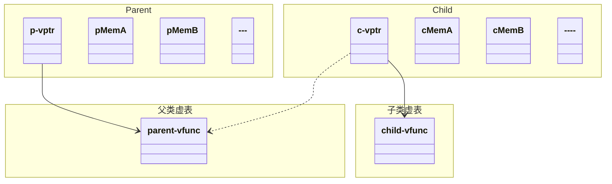
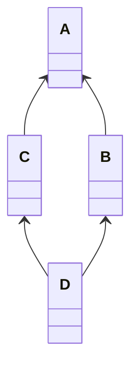

# 基本 Cpp

## 基本变量

变量是一段连续内存空间的别名。初始化不是赋值，初始化是指在创建变量时赋予其一个初始值，而赋值是指将当前对象的值擦除，用一个新的值替代。


### 整型

整型 `int` 和 `long` 的长度受编译器影响，`int` 就是用来表达寄存器的（在 32 位/ 64 位下分别表示为 4 字节/ 8 字节）。

| 类型     | `char`     | `short`        | `int`       | `long` | `long long` |
| :----- | :--------- | :------------- | :---------- | :----- | ----------- |
| 长度（字节） | 1          | 2              | 4           | 8      | 8           |
| 范围     | `-128~127` | `-32768~32767` | 取决于编译器（CPU） | 4 字节   | 8 字节        |

计算机在表示 1 字节数据时，`00000000~01111111` 为正数（`0~127`），`10000000~11111111`为负数（`-128~-1`）。


#### 整数越界

当整数的值超过最大/最小范围时，会返回到最小/最大值

* `0-1—>00000000-00000001—>11111111—>-1`
* `127+1—>01111111+00000001—>10000000—>-128`


#### 符号整数

放在整数类型变量前限定字符和整型变量的长度

* signed/unsigned 类型 常量名
* signed 表示该变量带符号位
* unsigned 表示该变量不带符号位

```cpp
signed int a;
unsigned int b;
```

对于 unsigned 变量

* `127+1—>01111111+00000001—>10000000—>128`
* `255+1—>11111111+00000001—>00000000—>0`

如果一个常量想表达自己是 unsigned ，可以在数字后面加 u/U 。


### 浮点型

**超过范围的浮点数**

* inf : 超过范围的浮点数 $\pm \infty$ 
* nan : 不存在的浮点数


### 数组

数组是一个包含连续地址的变量，可以包含同一类型的多个变量，关于其基本性质我们不多赘述

```cpp
int a[10];
```

需要注意 a 本身表示首元素的地址，而 `&a` 表示整个数组的地址。


#### 集成初始化

元素数量可以大于输入的元素数，多余元素初始化为 0

```cpp
类型 变量名称[] = {元素,元素,...};
类型 变量名称[元素数量] = {元素,元素,...};
```

* 没有定位的数据接在前面的位置后面 
* 其他位置的值补 0 
* 也可以不给出数组大小，让编译器算
* 特别适合初始数据稀疏的数组


可以直接在 `{}` 中初始化具体位置的元素

```cpp
int a[] = {[1]=1,2,[4]=4,5};  // {0,1,2,0,4,5}
sizeof(a) / sizeof(a[0])  	  // 数组字节数/元素字节数=元素数量
```


#### 作为函数参数

数组变量本身不能赋值，只能遍历赋值

* 数组作为函数参数时，往往必须用另⼀个参数来传入数组的大小
* 传入的是数组的指针， `a[]` 表示数组的第一个元素，用 sizeof 只能获得第一个元素的长度
* 不能在 `[]` 中给出数组的大小
* 不能用 sizeof 计算数组的元素个数

一种常见的手法是在传入参数时，提前用 sizeof 将数组的长度传入

```cpp
int test(int size, int* array)
{
	return 0;
}

int a[] = {1, 2, 3};
test(sizeof(a) / sizeof(*a), a);
```

其中第一个 sizeof 获取 a 的大小，第二个 sizeof 获取 a 首元素的大小。


#### 二维数组

数组可以嵌套声明，类似的可以构造多重数组，但是很少使用

```cpp
类型 变量名称[行数][列数] = {{元素,...},{元素,...},...};
```

赋值方法、调用方法与一维数组相同，缺省为 0 ，下面是几种初始化的例子：

```cpp
a[i][j]     //i行j列的数组
a[i,j]		//大小为j的数组
a[][j]		//有j列的数组（行数可以省略，列数不可省略）
```


#### const 数组

数组变量是 const 的指针，const 表明数组变量 a 的每个单元都是 const int ，所以数组只能通过初始化来赋值

```cpp
const int a[] = {1,2,3,...};
```

数组传入函数的是地址，所以函数内部可以修改数组。为了保护数组不被函数破坏，可以设置参数为const

```cpp
int sum(const int a[], int lenth);
```


#### 数组指针

我们已经知道可以用 & 来取整个数组的地址，因此就可以定义整个数组的指针

```cpp
int (*pArray)[10];
```

上面定义了一个整型数组的指针，它需要指向一个长度为 10 的整形数组。使用时需要取值

```cpp
int a[10];
pArray = &a;
(*pArray)[0] = 5;
```


#### 历史遗留

一种历史遗留的写法是

```cpp
int arr[] = {1,2,3,4};
int x = arr[2];
int y = 2[arr];
```

这是因为

```cpp
a[2] -> *(a+2) -> *(2+a) -> 2[a]
```


### 字符

单字符知识点较少，顾名思义它只包含一个字符，并且单字符有时候可以被当做一个整型来使用

```cpp
char c = 'a';
```

单字符可以对应一个它的 ASCII 码，我们将其展示在下面：

| Bin      | Dec  | Hex  | 缩写/字符                   | 解释         |
| -------- | ---- | ---- | --------------------------- | ------------ |
| 00000000 | 0    | 00   | NUL(null)                   | 空字符       |
| 00000001 | 1    | 01   | SOH(start of headling)      | 标题开始     |
| 00000010 | 2    | 02   | STX (start of text)         | 正文开始     |
| 00000011 | 3    | 03   | ETX (end of text)           | 正文结束     |
| 00000100 | 4    | 04   | EOT (end of transmission)   | 传输结束     |
| 00000101 | 5    | 05   | ENQ (enquiry)               | 请求         |
| 00000110 | 6    | 06   | ACK (acknowledge)           | 收到通知     |
| 00000111 | 7    | 07   | BEL (bell)                  | 响铃         |
| 00001000 | 8    | 08   | BS (backspace)              | 退格         |
| 00001001 | 9    | 09   | HT (horizontal tab)         | 水平制表符   |
| 00001010 | 10   | 0A   | LF (NL line feed, new line) | 换行键       |
| 00001011 | 11   | 0B   | VT (vertical tab)           | 垂直制表符   |
| 00001100 | 12   | 0C   | FF (NP form feed, new page) | 换页键       |
| 00001101 | 13   | 0D   | CR (carriage return)        | 回车键       |
| 00001110 | 14   | 0E   | SO (shift out)              | 不用切换     |
| 00001111 | 15   | 0F   | SI (shift in)               | 启用切换     |
| 00010000 | 16   | 10   | DLE (data link escape)      | 数据链路转义 |
| 00010001 | 17   | 11   | DC1 (device control 1)      | 设备控制1    |
| 00010010 | 18   | 12   | DC2 (device control 2)      | 设备控制2    |
| 00010011 | 19   | 13   | DC3 (device control 3)      | 设备控制3    |
| 00010100 | 20   | 14   | DC4 (device control 4)      | 设备控制4    |
| 00010101 | 21   | 15   | NAK (negative acknowledge)  | 拒绝接收     |
| 00010110 | 22   | 16   | SYN (synchronous idle)      | 同步空闲     |
| 00010111 | 23   | 17   | ETB (end of trans. block)   | 传输块结束   |
| 00011000 | 24   | 18   | CAN (cancel)                | 取消         |
| 00011001 | 25   | 19   | EM (end of medium)          | 介质中断     |
| 00011010 | 26   | 1A   | SUB (substitute)            | 替补         |
| 00011011 | 27   | 1B   | ESC (escape)                | 溢出         |
| 00011100 | 28   | 1C   | FS (file separator)         | 文件分割符   |
| 00011101 | 29   | 1D   | GS (group separator)        | 分组符       |
| 00011110 | 30   | 1E   | RS (record separator)       | 记录分离符   |
| 00011111 | 31   | 1F   | US (unit separator)         | 单元分隔符   |
| 00100000 | 32   | 20   | (space)                     | 空格         |
| 00100001 | 33   | 21   | !                           |              |
| 00100010 | 34   | 22   | "                           |              |
| 00100011 | 35   | 23   | #                           |              |
| 00100100 | 36   | 24   | $                           |              |
| 00100101 | 37   | 25   | %                           |              |
| 00100110 | 38   | 26   | &                           |              |
| 00100111 | 39   | 27   | '                           |              |
| 00101000 | 40   | 28   | (                           |              |
| 00101001 | 41   | 29   | )                           |              |
| 00101010 | 42   | 2A   | *                           |              |
| 00101011 | 43   | 2B   | +                           |              |
| 00101100 | 44   | 2C   | ,                           |              |
| 00101101 | 45   | 2D   | -                           |              |
| 00101110 | 46   | 2E   | .                           |              |
| 00101111 | 47   | 2F   | /                           |              |
| 00110000 | 48   | 30   | 0                           |              |
| 00110001 | 49   | 31   | 1                           |              |
| 00110010 | 50   | 32   | 2                           |              |
| 00110011 | 51   | 33   | 3                           |              |
| 00110100 | 52   | 34   | 4                           |              |
| 00110101 | 53   | 35   | 5                           |              |
| 00110110 | 54   | 36   | 6                           |              |
| 00110111 | 55   | 37   | 7                           |              |
| 00111000 | 56   | 38   | 8                           |              |
| 00111001 | 57   | 39   | 9                           |              |
| 00111010 | 58   | 3A   | :                           |              |
| 00111011 | 59   | 3B   | ;                           |              |
| 00111100 | 60   | 3C   | <                           |              |
| 00111101 | 61   | 3D   | =                           |              |
| 00111110 | 62   | 3E   | >                           |              |
| 00111111 | 63   | 3F   | ?                           |              |
| 01000000 | 64   | 40   | @                           |              |
| 01000001 | 65   | 41   | A                           |              |
| 01000010 | 66   | 42   | B                           |              |
| 01000011 | 67   | 43   | C                           |              |
| 01000100 | 68   | 44   | D                           |              |
| 01000101 | 69   | 45   | E                           |              |
| 01000110 | 70   | 46   | F                           |              |
| 01000111 | 71   | 47   | G                           |              |
| 01001000 | 72   | 48   | H                           |              |
| 01001001 | 73   | 49   | I                           |              |
| 01001010 | 74   | 4A   | J                           |              |
| 01001011 | 75   | 4B   | K                           |              |
| 01001100 | 76   | 4C   | L                           |              |
| 01001101 | 77   | 4D   | M                           |              |
| 01001110 | 78   | 4E   | N                           |              |
| 01001111 | 79   | 4F   | O                           |              |
| 01010000 | 80   | 50   | P                           |              |
| 01010001 | 81   | 51   | Q                           |              |
| 01010010 | 82   | 52   | R                           |              |
| 01010011 | 83   | 53   | S                           |              |
| 01010100 | 84   | 54   | T                           |              |
| 01010101 | 85   | 55   | U                           |              |
| 01010110 | 86   | 56   | V                           |              |
| 01010111 | 87   | 57   | W                           |              |
| 01011000 | 88   | 58   | X                           |              |
| 01011001 | 89   | 59   | Y                           |              |
| 01011010 | 90   | 5A   | Z                           |              |
| 01011011 | 91   | 5B   | [                           |              |
| 01011100 | 92   | 5C   | \                           |              |
| 01011101 | 93   | 5D   | ]                           |              |
| 01011110 | 94   | 5E   | ^                           |              |
| 01011111 | 95   | 5F   | _                           |              |
| 01100000 | 96   | 60   | `                           |              |
| 01100001 | 97   | 61   | a                           |              |
| 01100010 | 98   | 62   | b                           |              |
| 01100011 | 99   | 63   | c                           |              |
| 01100100 | 100  | 64   | d                           |              |
| 01100101 | 101  | 65   | e                           |              |
| 01100110 | 102  | 66   | f                           |              |
| 01100111 | 103  | 67   | g                           |              |
| 01101000 | 104  | 68   | h                           |              |
| 01101001 | 105  | 69   | i                           |              |
| 01101010 | 106  | 6A   | j                           |              |
| 01101011 | 107  | 6B   | k                           |              |
| 01101100 | 108  | 6C   | l                           |              |
| 01101101 | 109  | 6D   | m                           |              |
| 01101110 | 110  | 6E   | n                           |              |
| 01101111 | 111  | 6F   | o                           |              |
| 01110000 | 112  | 70   | p                           |              |
| 01110001 | 113  | 71   | q                           |              |
| 01110010 | 114  | 72   | r                           |              |
| 01110011 | 115  | 73   | s                           |              |
| 01110100 | 116  | 74   | t                           |              |
| 01110101 | 117  | 75   | u                           |              |
| 01110110 | 118  | 76   | v                           |              |
| 01110111 | 119  | 77   | w                           |              |
| 01111000 | 120  | 78   | x                           |              |
| 01111001 | 121  | 79   | y                           |              |
| 01111010 | 122  | 7A   | z                           |              |
| 01111011 | 123  | 7B   | {                           |              |
| 01111100 | 124  | 7C   | \|                          |              |
| 01111101 | 125  | 7D   | }                           |              |
| 01111110 | 126  | 7E   | ~                           |              |
| 01111111 | 127  | 7F   | DEL (delete)                | 删除         |


### 字符串

```cpp
char word[] = {'H','e','l','l','o','!','\0'};
```

* 0 或 `\0` 是一样的，但是和 0 不同
* 0 标志字符串的结束，但它不是字符串的一部分，计算字符串长度的时候不包含这个 0
* 字符串以数组的形式存在，以数组或指针的形式访问，更多的是以指针的形式 
* C 语言的字符串是以字符数组的形态存在的 
* 不能用运算符对字符串做运算
* 通过数组的方式可以遍历字符串
* 唯一特殊的地方是字符串字面量可以用来初始化字符数组


字符串和字符指针本质上是同一种东西

```cpp
char *str = "Hello";
char word[] = "Hello";
char line[10] = "Hello";    // 这里 Hello 实际上占用数组 line 的 6 个单元
char* s = "Hello, world!";  // s 是一个指针，初始化为指向一个字符串常量 
```

下面三种声明是等价的：

```cpp
char *s;
char const *s;
const char *s;
```

* 字符串可以表达为 `char*` 的形式， `char*` 不⼀定是字符串 
* 本意是指向字符的指针，可能指向的是字符的数组（就像 `int*` ），只有它所指的字符数组有结尾的 0 ，才能说它所指的是字符串


#### 空字符串

这些都是空的字符串，它们不能放下任何东西

```cpp
char buffer[100]="";
buffer[0] == '\0';
char buffer[] = "";
```


#### 字符串数组

可以定义字符串的数组，它有多种定义方式：一个指针，指向另一个指针，那个指针指向一个字符（串） 

```cpp
char **a;
```

一个二维数组， `a[x]` 是一个 `char[10]`

```cpp
char a[][10];
```

一个一维数组， `a[x]` 是一个 `char*`

```cpp
char *a[];
```

表示二维数组的元素是字符串数组

```cpp
char a[][10];
```

表示二维数组的元素是指针

```cpp
char *a[]; 
```


#### 多个字符串

两个由空格或换行符连接的字符串被认为是同一个字符串的两部分。例如

```cpp
std::cout << "hello" "world" << std::endl;
```


#### memset 

memset 可用于对一段内存进行赋值，从而可用于初始化。声明为

```cpp
void* memset( 
    void* dest, 		 	// 传入指针（内存空间）
    int ch, 				// 初始化内容
    std::size_t count 	 	// 初始化长度
);
```


#### sprintf

sprintf 用于向字符串中输出内容，其使用方法和先前的 printf 函数一致，只不过第一个参数为一个字符串。

```cpp
sprintf(format, "%%%ds", 19);
```

其中 19 被替换到 `%d` 的位置上， `%%` 表示输出一个 `%` ，因此上面函数等价于：

```cpp
sprintf(format, "%19s", 19);
```

也就是输入一个长度不超过 19 的字符串


#### strlen

```cpp
size_t strlen(
    const char *s
);
```

返回字符串的长度（不包括结尾的 0 ）， 输入字符串常量，返回无符号整数


#### strcmp

```cpp
int strcmp(
    const char *s1, 
    const char *s2
);

int strncmp(
    const char *s1, 
    const char *s2, 
    size_t n			// 最大长度
);
```

比较两个字符串常量，返回：

* 0 —> `s1==s2` 
* 1 —> `s1>s2` 
* -1 —> `s1<s2`


#### strcpy

```cpp
char * strcpy(
    char *restrict dst, 		// 储存空间
    const char *restrict src	// 表明 src 和 dst 不重叠（C99），为了能链起代码来
);

// 更安全的版本
char * strncpy(
    char *restrict dst, 
    const char *restrict src, 
    size_t n					// 最大长度
); 
```

常用于动态内存分配，当借来程序外的空间存储字符串时，将外部字符串转存到程序内部

```cpp
char *dst = (char*)malloc(strlen(src)+1); 
strcpy(dst, src);	// 把 src 的常量字符串拷贝到 dst ，并返回 dst
```


#### strcat

```cpp
char * strcat(
    char *restrict s1, 
    const char *restrict s2
); 

char * strncat(
    char *restrict s1, 
    const char *restrict s2, 
    size_t n				// 最大长度
); 
```

把 s2 拷贝到 s1 的后面，接成一个长的字符串，并返回加长后的 s1 ，注意 s1 必须具有足够的空间。


#### putchar

```cpp
int putchar(
    int c
);
```

向标准输出写一个字符，返回写了几个字符， EOF(-1) 表示失败。


#### getchar

```cpp
int getchar(void);
```

向标准输入读入一个字符（真的只读一个），返回 int 类型是为了返回 EOF(-1) ，在 Windows 中输入 Ctrl + z 停止读入。


#### strchr

有两个版本的查找函数：

```cpp
// 从左开始
char * strchr(
    const char *s, 
    int c
);  	

// 从右开始
char * strrchr(
    const char *s, 
    int c
);  
```

返回所找**第一个**字符开始的字符串，返回 NULL 表示没有找到；如果要查找第二个字符，可以从返回的字符串开始，再用一次查找。给出一个获取所找字符之前的字符串的示例：

```cpp
char *p = strchr(s,s1);
char c = *p;    
*p = '\0';    // 将所找到的字符替换为 0 ，此时 s 已被截断
char *t = (char *)malloc(strlen[s] + 1);
strcpy(t, s);
*p = c;
```

在其中我们将字符串从找到的位置开始截断，然后复制字符串，最后把替换的字符还回去，使字符串复原。


#### strstr

也有两个查找字符串的函数

```cpp
char * strstr(
    const char *s1, 
    const char *s2
); 

// 不区分大小写
char * strcasestr(
    const char *s1,
    const char *s2
);
```


### 常量

**const 常量不能被强制转换**

* 顶层 const：表示指针本身是个常量
* 底层 const：表示指针所指的对象是个常量

默认情况下，const 只在一个文件内有效，通过添加 extern 关键字，可以使得该对象能被其它文件访问

```cpp
extern const int PI = 3.14;
```

const 的引用不能修改

```cpp
const int PI = 3.14;
const int &P = PI;  	 	// 不能修改 P
int &p = PI; 				// 不能用非常量引用常量对象
```

允许使用常量引用绑定普通对象

```cpp
int i = 42;
const int &t = i;
```

注意：不能通过 t 来修改 i 的值。


在 C 语言中， const 变量是只读变量，有自己的存储空间；在 C++ 中， const 常量可能分配存储空间，也可能不分配存储空间。在以下情况中会分配储存空间：

* 当 const 常量为全局，并且需要在其它文件中使用
* 当使用 & 操作符，取 const 常量的地址时
* 当 `const int &a = 10;` ，即 const 修饰引用时


### 指针

指针就是保存地址的变量，定义一个指针变量，实际上就是让一个变量指向一个地址，变量的值是它指向的地址。指针是一种数据类型，是指它指向的内存空间的数据类型。**指针在定义时必须立即指定指向的变量**

```cpp
int a = 10;
int *p = &a;
```


#### 运算符 &

获取变量的地址，它的操作数必须是一个变量，地址的大小是否与 int 相同取决于编译器，不能对表达式取地址（没有地址）；当作为函数参数时表示引用，修改形参也会修改实参（ C++ 语法）。**定义过的指针不能指向 nullptr**

```cpp
int a = 10;
&a; // 取 a 的地址
```

另外，**字面量**不能够取地址

```cpp
&123;
```


#### 运算符 *

* `*` 是⼀个单目运算符，用来访问指针的值所表示的地址上的变量
* 可以做右值也可以做左值
* `&` 与 `*` 互为逆运算


#### 数组与指针

作为参数传入函数的数组实际上是指针，下面是两种等价函数：

```cpp
int f(int a[]);
int f(int *a);
```

显然它们占有相同的内存空间

```cpp
sizeof(a) == sizeof(int *)
```


数组变量本身表达地址，所以无需用 `&` 取地址，可以直接将数组变量赋值给指针

```cpp
int a[10]; 
int *p = a;
```


数组的单元表达是变量，要取地址，因此可以取数组单元的地址赋值给指针

```cpp
int a[10]; 
int *p = &a[0];
```


数组本质上是常量指针，因此 `[]` 运算符可以对数组做，也可以对指针做

```cpp
int a[10]; 
int *p = &a[0];

a[0] = 8;
p[0] = 9; 
```

同样的， `*` 运算符可以对指针做，也可以对数组做

```cpp
int a[10];
*a = 10;
```


数组变量是 const 的指针，所以不能被赋值

```cpp
int a[] == int *const a
```

可以定义指向数组的指针

```cpp
int arr[];
int (*ref)[] = arr;
```


#### 指针与 const

指针常量，p 指向变量 i 的地址，p 是 const，此时指针是常量，因此不能改变其指向的地址

```cpp
int *const p = &i;	// 作为常量，必须初始化
```

常量指针，p 指向变量 i 的地址，`*p` 是 const，此时指针指向常量，因此不能改变其指向的地址的值

```cpp
int const *p = &i;
```

也可以指定常量指针指向常量

```cpp
const char * const a = &i;
```


#### 指针运算

可以对指针做整数的加减，表示对指针指向的地址的移动；两个相同类型的指针相减，得到相差的单元数（整型）。

> 相差的单元数=相差的地址长度/每单元长度

给指针加一表示将指针移动到下一个变量，如果指针没有分配到连续的空间（如数组），这种运算没有意义

```cpp
int a[10];
int *p = a;  <=>  int *p = &a[0];
*(p + 1) —> a[1]
```

有时我们可以进行指针的连续操作

```cpp
*p++
```

取出 p 所指的那个数据来，之后把 p 移到下一个位置去，`*` 的优先级虽然高，但没有 `++` 的优先级高

* 比较运算符可以比较指针指向的地址
* 数组单元的地址是线性递增的


#### 0 地址

可以用 0 地址来表示特殊的事情 

* 返回的指针是无效的 
* 指针没有被真正初始化（先初始化为 0 ） 
* NULL 是一个预定定义的符号，表示 0 地址 
* 有的编译器不愿意你用 0 来表示 0

下面的代码无法通过编译，编译器不允许向 0 地址赋值

```cpp
#include <string.h>

int main()
{
	char *p = NULL;
	strcpy(p, "abcde");

	return 0;
}
```


#### 交换指针

我们当然可以尝试交换两个指针指向的地址

```cpp
int a = 1, b = 2;
int *p = &a, *q = &b;
```

只需要利用一个中间变量

```cpp
int *tmp = p;
p = q;
q = tmp;
```

但是，当我们尝试交换数组中存放的两个指针时，就会出现问题，这时我们利用指向指针的指针交换（我发现竟然无法复现那个错误，就暂且记一下这一技巧）

```cpp
int a = 1, b = 2;
int *p = &a, *q = &b;

int **tmp = &p;
int *t = *tmp;
*tmp = q;
q = t;
```

**指针数组本身的地址具有常量性，直接交换并不能交换值**。


#### 指针类型

无论指向什么类型的变量，指针的大小都一样，因为都是地址；指向不同类型变量的指针是不能相互赋值的，这是为了防止用错指针。


C++ 支持无类型指针 `void * p;` 就是没有被声明为某种特定类型的指针。**对一个无类型指针进行解引用（取值 * ）前，必须先把它转换为一种适当的数据类型**

```cpp
int *p = &i;   
void *q = (void*)p; 
```


同样的，可以利用指针转换来实现间接赋值

```cpp
*((int*)1245024) = 10;
```

这是将一个地址转换为 int 指针进行赋值。


### 引用

**引用本质上是常量指针**，可以定义变量的引用，引用必须在定义时赋值，并且不能改变引用的指向。我们可以将引用变量看做是一种别名，但是因为其本质是指针，因此仍然会占用指针大小的空间

```cpp
int age = 10;
int &ref = age; // ref 成为 age 的别名，对 ref 的任何操作都等价于对 age 的操作
int * p = &age; // 相当于 *p 成为 age 的别名
```

引用在 C++ 内部实现为

```cpp
int &a = b;
int *const a = b;
```

即 `& == *const` ，编译器实际上会做这样的替换。


注意函数不能返回临时变量的引用

```cpp
int &func()
{
    int a = 10;
    return a;
}
```

这样会导致未定义行为，因为局部变量 a 离开作用域就不再存在，此时返回的是 a 之前的地址。但可以返回全局变量或静态变量的引用

```cpp
int &func()
{
    static int a = 10;
    return a;
}
```

因为静态变量是在全局区的，它是持续存在的 “左值” 。


对于左值，我们可以这样进行修改

```cpp
func() = 100;
```

也就是我们可以从外部修改左值。


引用指针

```cpp
int * p = &age;
int * &rage = p; // rage 成为 p 的别名
```

引用数组

```cpp
int arr[] = {1,2,3};
int (&ref)[3] = arr;
```

常引用，无法修改引用值

```cpp
const int &ref = age;
```

由于引用是对内存取别名，因此无法对没有内存的字面量取引用；然而，借助常引用，可以对字面值取引用

```cpp
const int &ref = 10;
```

此时，编译器会对此变量分配内存。


常量指针与引用的等价，下面 `ref` 和 `*p` 是等价的

```cpp
int & const ref = age; ref = 10;
int * const p = &age; *p = 10;
```

当常引用指向了不同类型的数据时，会产生临时变量，引用指向那个临时变量，对原变量的操作不改变引用的值

```cpp
int age = 10;
const long &rage = age;
age = 5;
rage -> 10 // 常引用不发生改变
```


所谓引用事实上是 C++ 语言的一个“语法糖”，它所能做的事情用 C 语言中的指针也可以完成。这两个概念的相同点在于：都可以在函数体内通过访问地址的方式修改对象的值。引用和指针也有许多不同之处。例如

* 函数以引用为参数时，该函数的接口可以直接用变量本身，不需要额外的取地址操作
* 定义引用的时候**必须初始化**，定义指针时不一定要初始化。（**所以一定不能传一个抽象类的引用**）
* 引用定义之后**永久与其引用的对象绑定**，但指针可以指向其他的对象


### 类型别名

有时我们定义的某种类型太长，或是希望使用的类型具有特别含义，就可以定义特定的类型别名

```cpp
typedef double wages; 		// 定义 wages 是 double 的别名
typedef wages base, *p; 	// 定义 base 是 double 的别名，p 是 double* 的别名
typedef char * p;		    // 定义 p 是char*的别名
```


#### 数组类型

```cpp
typedef int (myArray)[10];
```

这样就可以使用 myArray 类型声明长度为 10 的数组；类似的，可以定义数组指针

```cpp
typedef int (*myPArray)[10];
```

注意它是一个数组的指针类型，需要指向一个数组的地址，通过如下方式使用

```cpp
int a[10];
myPArray pArray = &a;
(*pArray)[0] = 5;
```


#### 函数指针

```cpp
typedef int (myFunc)(int, int);
```

这里定义了 myFunc 为函数的别名。我们通过它定义一个函数指针

```cpp
myFunc* pMyFunc;
```

然后让它指向一个函数

```cpp
int add(int a, int b)
{
	return a + b;
}

pMyFunc = add;
pMyFunc = &add;
```

其中两种指向方法等价，它是 C 语言本身兼容的特性。


当然可以直接定义一个函数指针的类型

```cpp
typedef int (*myFuncPoint)(int, int);
```

然后可以直接定义和指向

```cpp
myFuncPoint pMyFunc = add;
```


## 作用域

### 全局变量

* 没有做初始化的全局变量会得到 0 值，指针会得到 NULL 值 
* **只能用编译时刻已知的值来初始化全局变量**
* 它们的初始化发生在 main 函数之前
* 全局变量会被函数内或大括号内的局部变量覆盖

我们可以通过作用域操作符 `::` 来访问指定作用域中的变量，当 `::` 左侧为空时，表示向全局作用域请求获取 `::` 右边名字对应的变量

```cpp
int x = 5;  // 全局变量

int main() 
{
    int x = 10;
    std::cout << x << std::endl;
    std::cout << ::x << std::endl; 
    return 0;
}
```

只能用编译前已知的值赋给全局变量，不能给全局变量赋值全局变量

```cpp
int gAll = 12;
int g = gAll;     // Error
int gAll = f();    // Error
```

这样是可以赋值的，但不建议将两个全局变量联系在一起

```cpp
const int gAll = 12;
int g = gAll;
```

最后，应当尽量避免使用全局变量。


### 本地变量

本地变量是定义在块内的，它可以是定义在函数的块内，也可以定义在语句的块内，甚至可以随便拉一对大括号来定义变量；程序运行进入这个块之前，其中的变量不存在，离开这个块，其中的变量就消失了；块外面定义的变量在里面仍然有效，块里面定义了和外面同名的变量则掩盖了外面的；不能在一个块内定义同名的变量 

* 本地变量不会被默认初始化 
* 参数在进入函数的时候被初始化了

一般来说，一个“块”是指大括号内的部分

```cpp
{
	// 作用域
}
```

每一对大括号都构成一个局部块，在其中定义的变量只能在 `{}` 中使用。当离开作用域时，原先的变量就会被释放。

> 释放的仅仅是内存空间，内存中存放的值并不一定改变，因此也可以在原先的地址找到变量的值，但这种做法是很危险的。


### 静态变量

静态本地变量就是定义在函数内的全局变量，它们位于相同的内存区域；与全局变量的性质相同，但只作用于函数内部，static 在这里的意思是局部作用域（本地可访问）

* 在本地变量定义时加上 static 修饰符就成为静态本地变量 
* 当函数离开的时候，静态本地变量会继续存在并保持其值 
* 静态本地变量的初始化只会在第一次进入这个函数时做，以后进⼊函数时会保持上次离开时的值

例如可以定义函数

```cpp
int add(int a, int b)
{
	static int weight = 0;
	weight++;
	return a + b + weight;
}
```

这样每调用一次 add 函数，weight 的值都会增加，不会重新初始化。


另外，利用 `static` 修饰，可以在进入 main 函数之前执行其它函数。例如

```cpp
static int unused = printf("hello");
```

也可以全局初始化一个类，它会在进入 main 之前调用构造函数


### 内存四区

操作系统执行程序的流程


流程说明

1. 操作系统把物理硬盘代码加载到内存
2. 操作系统把 C 代码分成 4 个区
3. 操作系统找到 main 函数入口执行

各个区的特点

* 栈区 stack ：由编译器自动分配释放，存放函数的参数值，局部变量的值等
* 堆区 heap ：一般由程序员分配释放（动态内存申请与释放），若程序员不释放，程序结束时可能由操作系统回收
* 全局区（静态区）static ：全局变量和静态变量的存储是放在一起的，初始化的全局变量和静态变量在同一区域，未初始化的全局变量和静态变量在相邻的另一块区域，该区域在程序结束后由操作系统释放
* 常量区：字符串常量和其它常量的存储位置，程序结束后由操作系统释放
* 程序代码区：存放函数体的二进制代码

为了理解这些存储方式，我们举个例子

```cpp
#include <stdio.h>

const char *getChar1()
{
	const char *p = "abcde";
	return p;
}

const char *getChar2()
{
	const char *p = "abcde";
	return p;
}

int main()
{
	printf("%d %d\n", getChar1(), getChar2());
	printf("%s %s\n", getChar1(), getChar2());

	return 0;
}
```

这段代码输出结果为：

```shell
4210688 4210688
abcde abcde
```

也就是说，两个函数返回值具有相同的地址。这就是因为常量字符串 abcde 存放在全局区，每次使用该字符串，也就自然要指向该常量字符串的地址，它们必然是相同的。


对于栈空间，我们可以通过推入栈的地址的大小来判断栈的“开口方向”


如果地址 a b c d 从小到大的顺序排列，说明开口向上，反之说明开口向下。

```cpp
int main()
{
	int a, b;
	printf("%d %d", &a, &b);

	return 0;
}
```

利用这段代码，可以看出在 Debug 环境下，b 的地址更小，开口向下；而在 Release 环境下，b 的地址更大，开口向上。不过一般情况下，开口都向下，这样可以保证地址越来越小，方式溢出。


如果我们考虑数组的存放

```cpp
int main()
{
	int buf[255];
	printf("%d %d", &buf[0], &buf[1]);

	return 0;
}
```

会发现，无论栈的开口向上还是向下，数组中的元素地址总是按照从小到大的顺序排放。


### 命名空间

模块化（modularization）：

* 把程序划分为多个组成部分
* 通过把程序代码分散到多个文件里，等编译程序时再把那些文件重新组合在一起实现

命名空间（namespace）：相比起 C 语言，这是 C++ 里新增加的东西，编写的程序越多，编写的程序越复杂，就越需要使用命名空间。


#### 使用方法

为了防止变量名重复，有时需要使用很长的变量名，命名空间解决了这个问题。可以这样创建命名空间

```cpp
namespace name
{
	// 函数或变量
};
```

当需要使用命名空间中的函数或变量时，可以显式地 using 命名空间

```cpp
using namespace name;
using namespace::name;
```

但是建议不这样使用命名空间（ std 本身是一个类对象），因为 using 指令的出现位置决定从命名空间里提取出来的东西能在哪个作用域内使用；如果放在所有函数声明的前面，它将拥有全局性；如果放在某个函数里，它只能在这一函数中使用。通常只导入需要使用的命名，例如

```cpp
#include <iostream>
using std::cin; 
using std::endl;
```


#### 全局空间

存在一个默认的全局命名空间

```cpp
:: // 作用域操作符
```

这个命名空间中包含外部正常声明和定义的函数和全局变量，如果需要对不同作用域的变量和函数加以区分，就可以添加前缀 `::` 

```cpp
int global = 15;

int main()
{
    cout << ::global << endl;
    return 0;
}
```


#### 空间合并

当我们在不同的地方定义相同的命名空间时，命名空间中的内容会自动合并

```cpp
namespace MJ 
{
    int age;
}

namespace MJ 
{
    int id;
}
```


#### 匿名空间

匿名命名空间是不指定名字的空间，它的主要作用是隐藏函数和类的定义

```cpp
// test1.cpp
namespace {

    class A {};

}  // namespace

// test2.cpp
namespace {

    class A {};

}  // namespace
```

在两个不同的源文件中，借助匿名空间可以定义相同的类而不发生冲突。


#### 优先级

假设我们定义了一个命名空间，并且使用它

```c++
int age;

namespace A
{
	int age;
}

using namespace A;

void test()
{
	std::cout << age << std::endl;
}
```

此时将会产生命名空间冲突。如果我们希望使用命名空间后，以这个命名空间中的内容优先，只需要将其包裹在命名空间中即可

```c++
int age;

namespace A
{
	int age;
}

using namespace A;

namespace A
{
	void test()
	{
		std::cout << age << std::endl;
	}
}
```


#### 别名

可以为命名空间起别名

```cpp
namespace S = std;
```


### extern

#### 修饰代码

**被 extern "C" 修饰的代码会以 C 语言格式编译**，因此常用于在 C++ 调用 C 语言代码时使用

```cpp
extern "C" void func() 
{
	cout << "Hello World" << endl;
}

extern "C" 
{
    void func(int n) 
    {
        cout << n << endl;
    }
}

extern "C" 
{
    #inlcude "math.h" // 调用 C 语言库
}
```


在 cpp 环境中，编译器会自动在文件开头定义 `#define __cplusplus` 来表明这是一个 C++ 文件

```cpp
#define __cplusplus // 这一行是编译器自动定义的

// 利用这一宏来实现 C 语言库在 .c 和 .cpp 中的同时调用
#ifdef __cplusplus
extern "C" {
#endif // 只在 c++ 环境中调用 extern "C"
    int sum(int v1, int v2);
    int delta(int v1, int v2);
    int divide(int v1, int v2);
#ifdef __cplusplus    
}
#endif
```

这里 `extern "C"` 不仅可以包含函数，还可以包含头文件。


#### 外部声明

当 extern 不与 "C" 在一起修饰变量或函数时，它的作用就是声明函数或全局变量的作用范围的关键字，其声明的函数和变量可以在本模块活其他模块中使用，**它是一个声明不是定义**。


我们举一个经典的例子

```cpp
#include <stdio.h>

int max(int x,int y);

int main(void)
{
    int result;
    /* 外部变量声明 */
    extern int g_X;
    extern int g_Y;
    result = max(g_X,g_Y);
    printf("the max value is %d\n",result);
    return 0;
}

/* 定义两个全局变量 */
int g_X = 10;
int g_Y = 20;
int max(int x, int y)
{
    return (x>y ? x : y);
}
```

代码中，全局变量 g_X 与 g_Y 是在 main 函数之后声明的，因此它的作用范围不在 main 函数中。如果我们需要在 main 函数中调用它们，就必须使用 extern 来对变量 g_X 与 g_Y 作“外部变量声明”，以扩展全局变量的作用域。也就是说，如果在变量定义之前要使用该变量，则应在使用之前加 extern 声明变量，使作用域扩展到从声明开始到本文件结束。


#### 跨文件声明

还可以通过 extern 实现跨文件声明。在 `max.c` 中声明变量

```cpp
/**** max.c ****/
#include <stdio.h>
/* 外部变量声明 */
extern int g_X ;
extern int g_Y ;

int max()
{
    return (g_X > g_Y ? g_X : g_Y);
}
```

然后在 `main.c` 中使用

```cpp
#include <stdio.h>

/*定义两个全局变量*/
int g_X=10;
int g_Y=20;

int max();

int main(void)
{
    int result;
    result = max();
    printf("the max value is %d\n",result);
    return 0;
}
```


在 `test1.h` 中有下列声明:

```cpp
#ifndef TEST1H
#define TEST1H

extern char g_str[]; // 声明全局变量g_str
void fun1();

#endif
```

在 `test1.cpp` 中

```cpp
#include "test1.h"

char g_str[] = "123456"; // 定义全局变量g_str

void fun1() 
{ 
    cout << g_str << endl; 
}
```

以上是 test1 模块，它的编译和连接都可以通过。如果我们还有 test2 模块也想使用 g_str，只需要在原文件中引用就可以了

```cpp
#include "test1.h"

void fun2()  
{ 
    cout << g_str << endl;  
}
```

以上 test1 和 test2 可以同时编译连接通过，g_str 是整个工程的全局变量，在内存中只存在一份。


### volatile

在有些时候，我们不希望编译器对变量自动优化。例如在多线程情况下，一块内存的值可能被程序以外的因素改变，我们希望保留这个变量不被优化，就需要使用 volatile 关键字修饰

```cpp
#include <iostream>

int main() {
    volatile int flag = 0;
    
    while (flag == 0) {
        // 一些代码
    }

    std::cout << "Flag is now non-zero.\n";
    return 0;
}
```

假设在循环体中 flag 的值发生改变，如果不添加 volatile 修饰，则 flag 可能被编译器删除。在 volatile 修饰下，编译器会保证在每次对该变量进行读取和写入操作时都会**重新从内存中读取或写入变量的值**，而不会使用缓存或寄存器中的值。这样可以确保程序能够正确地与外部环境交互。


再例如下面这段代码

```cpp
// 定义一个 IO 端口
int *output = (unsigned int *)0xff800000;
int init(void)
{
    int i;
    for(i=0;i< 10;i++)
    	*output = i;
}
```

在正常情况下，上述代码会被编译器优化为

```cpp
// 定义一个 IO 端口
int *output = (unsigned int *)0xff800000;
int  init(void)  
{  
    *output = 9;  
}
```

但是在某些情况下，外部端口实际上希望通过这个循环过程进行初始化，那么就不应该优化这段循环，因此需要为 output 添加 volatile 修饰，让编译器遇到此变量不进行优化。


再例如在多线程情形下，同一个变量可能被多个线程依次访问。然而，如果不添加 volatile 修饰，那么第一个线程不会终止。这是因为 bStop 已经被读取到寄存器中，第一个线程永远会读取到 false 。而 volatile 修饰会要求每次从内存中读取值，确保读取值能够更新。

```cpp
volatile bool bStop = false;

// 第一个线程
void threadFunc1()
{
    ...
    while(!bStop){...}
}

// 第二个线程终止上面的线程循环
void threadFunc2()
{
    ...
    bStop = true;
}
```


考虑下面的代码，由于会从内存中读取，因此 ptr 可能会被意外地改变，导致 a,b 的值可能不同，此函数是错误的

```cpp
int square(volatile int *ptr) 
{ 
    int a,b; 
    a = *ptr; 
    b = *ptr; 
    return a * b; 
} 
```


## 标准语法

在这一部分，我们省去介绍基本语法结构，如 if 或 while 等语句的格式，而是介绍一些容易出错的地方。


### switch 分支

```cpp
switch (控制表达式) {
    case 常量:
        语句;
        break;
    ...
    case 常量:
        语句;
        break;
    default:
        语句;
}
```

* 控制表达式只能是整数型的结果
* 常量可以是常数，或者常数表达式
* 找到符合的常量后，执行之后所有代码，直到 break 
* 当没有符合的常量时，执行 default 后的代码


在该语句中，定义局部变量时需要在所在的 case 中加入大括号；整个 switch 是一个代码块，如果不加大括号，**可能会导致在不同 case 中的同名变量互相引用** 

```cpp
switch (a) {
    case 1:
        int tmp = 10; // 错误
        break;
    case 2:
    {
        int tmp = 5; // 正确
        break;
    }
    case 3:
        std::cout << “tmp” << tmp << std::endl; // 错误
        break;
}
```


### goto 跳转

使用 goto 可以跳转到指定代码行，但是这会导致代码逻辑不清，因此不建议使用。通常，建议通过 `do...while(0)` 来实现跳转功能

```cpp
int ff()
{
    int *p = (int *)malloc(sizeof(int));
    *p = 10;

    do
    {
#ifndef DEBUG
        int error = 1;
#endif
        // 使用 Break 跳转
        if (error)
            break;
        // dosomething
    } while (0);
    free(p);
    return 0;
}
```


### 逻辑运算

有三种逻辑运算，注意单目运算符优先级往往极高

* ! —— 逻辑非
* || —— 逻辑或
* && —— 逻辑与

优先级：`! > && > ||` 

**短路：逻辑运算自左向右进行，如果左边的运算已经能确定结果，就不做右边的运算（如果右边有赋值运算，也不会执行）。**


### 条件运算

可以简化条件运算的写法

```cpp
条件 ? 表达式1 : 表达式2
```

需要注意，它虽然等价于一个 if 语句，但不同的是两个分支应当填写表达式，不带分号，返回执行的表达式的结果。最后，条件运算优先级高于赋值运算，但低于其它所有运算，不建议嵌套使用。


### 逗号运算

逗号后的结果作为整个表达式的值，逗号运算优先级低于赋值运算，常用在 for 语句中

```cpp
for (i=0, j=10 ; i<j ; j--) 
{
    cout << i << endl;
}
```

注意逗号语句的嵌套

```cpp
f(a,b)     	// 这里逗号只做连接符
f((a,b)) 	// 这里逗号表示运算
```


### 赋值运算

赋值也是运算，也有结果 

* `a=b` 的结果是 a 被赋予的值，也就是 b 
* `a=b=c` —> `a=(b=c)`


### 前缀后缀

只需要注意两点：

1. ++ 和 -- 可以放在变量的前面，叫做前缀形式，也可以放在变量的后面，叫做后缀形式
2. **`a++` 返回 a 加 1 以前的值，而 `++a` 返回加了 1 以后的值**
3. `++a` 返回 a 加 1 后的引用，因此你会看到

```cpp
int a = 10;
(++a) = 5;
```

也就是说，可以对 `(++a)` 赋值。


### sizeof 运算

sizeof 运算符用于获得数据类型或表达式占用的字节数，它不是一个函数，而是一种编译器特性

```cpp
sizeof(object);   		// sizeof(对象)
sizeof(type_name);    	// sizeof(类型)
sizeof object;    		// sizeof 对象
```

sizeof 是静态运算符，它的结果在编译时就已经决定，编译器直接将数据类型替换为对应的字节数，得到无符号整数

```cpp
int a = 6; 
sizeof(a++); 
```


### 关系运算

任何一个表示关系的运算符都有返回值，当关系正确时结果为 1 ；关系错误时结果为 0

```cpp
//每一步关系运算都得到1或0
6 > 5 > 4 —> 1 > 4 —> 0
```


### 运算优先级

| 优先级 |      运算符      | 结合性 |
| :----: | :--------------: | :----: |
|   1    |        ()        |   —>   |
|   2    |   ! + - ++ --    |   —>   |
|   3    |      * / %       |   —>   |
|   4    |       + -        |   —>   |
|   5    |    < <= >= >     |   —>   |
|   6    |      == !=       |   —>   |
|   7    |        &&        |   —>   |
|   8    |       \|\|       |   —>   |
|   9    | = += -= *= /= %= |   <—   |


### 表达式赋值

有时我们会对表达式赋值，例如

```cpp
(a = b) = 4;
```

它表示先将 b 赋给 a ，得到返回值 a 之后，再将 4 赋给 a 。再看下面这个例子：

```cpp
int a = 1, b = 2;
(a>b ? a : b) = 4; //
```

上述语句会赋 4 给 b 。


### 位运算

有 6 种位运算，介绍如下：


#### 按位与 &

x, y 都为 1 的位取 1 ，其它均取 0 

```cpp
(x & y); 
```

* 让某一位或某些位为 0 ：x & 0xFE 
* 取一个数中的一段：x & 0xFF


#### 按位或 |

x, y 都为 0 的位取 0 ，其它均取 1

```cpp
(x | y); 
```

* 使得一位或几个位为 1 ：x | 0x01 
* 把两个数拼起来：0x00FF | 0xFF00


#### 按位取反 ~

x 为 1 的位取 0 ，为 0 的位取 1

```cpp
(~x); 
```


#### 按位异或 ^

x, y 相同的位取 0 ，不同的位取 1

```cpp
x ^ y;
```

有时会使用一个小技巧：当 x 等于 y ，可以看出 `x^y == 0` ，则有

```cpp
x^y^y == x
```


#### 左移 << 

i 的所有位向左移动 j 位，右边填入 0

```cpp
i << j;
```

所有小于 int 的类型，按 int 的方式移动，结果是 int 。


#### 右移 >> 

i 的所有位向右移动 j 位

```cpp
i >> j;
```

所有小于 int 的类型，按 int 的方式移动，结果是 int

注意：移位的位数不能为负数，这是没有定义的行为

```cpp
10000000 >> 1 —> 11000000
```

* 对于 unsigned 的类型，左边填入0 
* 对于 signed 的类型，左边填入原来的最高位（保持符号不变）


#### 逻辑运算

对于逻辑运算，它只看到两个值： 0 和 1 ，因此可以认为逻辑运算相当于把所有非 0 值都变成 1 ，然后做按位运算 

* 5 & 4 —>4 而 5 && 4 —> 1 & 1 —> 1 
* 5 | 4 —> 5 而 5 || 4 —> 1 | 1 —> 1 
* ~4 —> 3 而 !4 —> !1 —> 0


#### 示例

我们给出一个输出一个数的二进制的范例

```cpp
#include <stdio.h>

int main() 
{
    int number;
    scanf("%d",&number);
    unsigned int mask = 1u<<31;
    for ( ; mask; mask>>=1) 
    {
    	printf("%d", number & mask ? 1 : 0);
    }
    return 0;
} 
```

实际上是定义一个从第 32 位开始的检查机制， mask 的 1 那一位不断右移，与 number 的每一位做按位与，从而将 number 的二进制位全部输出。


### 动态内存

有时，我们需要借一些空间来存放新的信息，这时就需要申请动态内存。一般有两种申请方式：


#### malloc 和 free

**头文件 \<cstdlib\>**

向 malloc 申请的空间的大小是以字节为单位的，返回的结果是 `void*` ，需要类型转换为自己需要的类型

```cpp
void* malloc(size_t size);
```

例如我们给整型指针借一块内存

```cpp
int *a = (int*)malloc(n*sizeof(int));
```

这里我们借了 n 个整型的空间，因此 a 可以当做数组使用。另外，如果申请失败则返回 0 ，或者叫做 NULL 。

> 除非函数的作用就是分配空间，否则不要在函数中 malloc 然后传出去用。


借来的空间需要手动归还，通过 free 直接归还。否则，程序一直运行会占用内存

```cpp
free(void *);
```

只能归还申请的首地址，不能归还改变后的地址


需要注意：由于 free 和 malloc 是 C 语言的语法，因此自然不具有 new 和 delete 的特性。即

* new 会调用类的构造函数
* delete 会调用类的析构函数


#### new 和 delete

new 语句申请动态内存

```cpp
int * i = new int;  // new 返回动态内存的指针
int * p = new int(); // 会初始化为 0 的动态内存
int * p = new int(5); // 会初始化为 5 的动态内存
```


delete 语句归还动态内存，为了保险起见，归还内存后要将相关的指针设为 NULL

```cpp
delete i;
i = NULL;
```

NULL 指针不指向任何东西，这是因为 delete 语句只释放给定指针变量正指向的内存块，不影响这个指针，因此指针会保留一个毫无意义的地址，所以要将指针变量赋值为 NULL 。另外， new 语句返回的内存块很可能充满“垃圾数据”，所以我们通常先往里边写一些东西覆盖，然后再访问它们，或在类直接写一个构造器来初始化。

> 在使用动态内存时，最重要的原则是每一条 new 语句都必须有一条与之对应的 delete 语句。


几种动态数组初始化

```cpp
int * x = new int[count]; // 数组未初始化
int * p = new int[3](); // 数组初始化为 0
int * p = new int[3]{}; // 数组初始化为 0
int * p = new int[3]{5}; // 数组首元素初始化为 5 ，其它初始化为 0
```

动态数组可以和普通数组一样使用，但是删除动态数组时要让程序知道要删除的是一个数组而不仅仅是一个指针

```cpp
delete [] x;
```


### 位段/位域

这种数据结构的一个好处是它可以使数据单元节省储存空间，当程序需要成千上万个数据单元时，这种方法就显得尤为重要。第二个好处是位段可以很方便的**访问一个整数值的部分内容**从而可以简化程序源代码。而这种数据结构的缺点在于，位段实现依赖于具体的机器和系统，在不同的平台可能有不同的结果，这导致了位段在本质上是不可移植的。

- 位域在内存中的布局是与机器有关的
- 位域的类型必须是整型或枚举类型，带符号类型中的位域的行为将因具体实现而定
- 取地址运算符（&）不能作用于位域，任何指针都无法指向类的位域

基本格式如下

```cpp
struct bit_field_name
{
	type member_name : width;
};
```

其中的元素如下

| Elements       | Description                                                  |
| -------------- | ------------------------------------------------------------ |
| bit_field_name | 位域结构名                                                   |
| type           | 位域成员的类型，必须为 int、signed int 或者 unsigned int 类型 |
| member_name    | 位域成员名                                                   |
| width          | 规定成员所占的位数                                           |


例如下面的位域，给出 3 个 unsigned int 类型，分别占用 2/2/8 比特

```cpp
struct _PRCODE
{
	unsigned int code1: 2;
	unsigned int cdde2: 2;
	unsigned int code3: 8;
};

struct _PRCODE prcode;
```

这意味着 code1, code2 取值不超过 $2^2$；code3 取值不超过 $2^8$ 。


我们假定系统中 unsigned int 类型为 32 比特，则下面的位域结构只占用 8 比特

```cpp
struct box 
{
	unsigned int a: 1;
	unsigned int  : 3;
	unsigned int b: 4;
};
```

其中有一个空白的占位成员。由于字节对齐的问题，上述 8 比特的位域实际上占用整个 unsigned int 的空间，即 32 比特。


如果占用空间超过前一个，则新的成员会对齐到下一个 unsigned int 的起始位置。例如

```cpp
struct stuff 
{
	unsigned int field1: 30;
	unsigned int field2: 4;
};
```

其中 $30+4$ 超出了 32 比特，因此实际上 field2 会从下一个 32 比特开始，则 stuff 占用 64 比特。


位域可以通过成员赋值

```cpp
struct stuff s1;
s1.field1 = 20;
s1.field2 = 8;
```

只要赋值不超过位的宽度就没有问题。


声明一个 32 比特的位域

```cpp
struct box {
	unsigned int ready:     2;
	unsigned int error:     2;
	unsigned int command:   4;
	unsigned int sector_no: 24;
} b1;
```

可以通过强制转换将位域归零

```cpp
int* p = (int *) &b1;  // 将 "位域结构体的地址" 映射至 "整形（int*) 的地址" 
*p = 0;                // 清除 s1，将各成员归零
```


## 函数

### 函数声明

当在声明函数时，若不给出参数类型，调用时编译器会根据输入值来猜测参数类型，若猜测与实际类型不符，得到结果会出错

```cpp
void f(void);  	// 不接受任何参数
void f();		// 参数类型不确定
```

因此为了方便识别，可以在空参数的函数中添加 void 标志。


### 函数重载

C++ 的函数重载是同名但不同参数的函数，其原理是编译器通过不同参数在编译时更改函数名从而区分为不同函数进行调用

```cpp
// test_double
void test(double x) 
{
    x = 10;
}

//test_int
void test(int x) 
{
    x = 10;
}
```

函数重载至少要满足以下一个条件：

* 参数个数不同
* 参数类型不同
* 参数顺序不同

慎用函数的重载（太多会看不懂），重载的目的是为了方便对不同数据类型进行同样的处理。


### 默认参数

函数参数从右向左依次可以设置默认参数，例如

```cpp
int test(int a, int b = 4, int c = 5) 
{
    return a + b + c;
}
```

本质上等价于

```cpp
int test(int a, int b, int c) 
{
    b = 4;
    c = 5;
    return a + b;
}
```


含有默认参数的函数声明和定义应当具有形式

```cpp
// 声明
int test(int a, int b = 4, int c = 5);

// 定义
int test(int a, int b, int c)
{
	return a + b + c;
}
```

只需要在声明时显式表现默认参数，在定义时不能写出默认值。


另外，**在类中，只有静态的成员变量才能用作成员函数的默认值，应当使用函数重载实现默认参数效果。**这一形式可能在 C++11 中得到改进，似乎可以类似普通函数一样声明和定义带默认参数的成员函数


### 占位参数

C++ 允许在定义函数时不写变量名作为占位参数

```cpp
int func(int a, int b, int)
{
	return a + b;
}
```

占位参数是无法使用的，这种写法目的是为以后的扩展提供线索（没什么用），以及兼容 C 中的函数写法。使用时需要 3 个参数

```cpp
func(1, 2, 3);
```


配合默认参数使用的话

```cpp
int func(int a, int b, int = 0)
{
	return a + b;
}
```

这样就可以传入 2 或 3 个参数，不过依然没什么用。


### 传引用参数

使用引用可以避免拷贝浪费的空间，因为它会直接将变量本身传入函数内部，在函数中可以直接使用和修改该变量的值，例如

```cpp
std::string str1 = "Hello World";
std::string str2 = "hello world";

// 比较函数
compare(std::string &s1, std::string &s2);
```

传引用本质上是一种指针，只是更加便捷。


### 变长参数

借助 stdarg 库，可以实现变长参数函数

```cpp
#include <stdio.h>
#include <stdarg.h>

// 计算可变数量整数的平均值
double average(int count, ...) {
    // va_list 类型，其中记录了所有参数
    va_list args;         
    double sum = 0.0;
	
    // 初始化 args，使其指向可变参数的第一个参数
    va_start(args, count); 
    for (int i = 0; i < count; ++i) {
        // 从参数列表中获取下一个参数，指定类型为 int
        sum += va_arg(args, int); 
    }
    
    // 结束可变参数的获取
    va_end(args); 

    return sum / count;
}
```


### 指针函数

指针函数就是返回指针的函数，但是需要注意，返回本地变量的地址是危险的，因为离开函数后本地变量就失控了，存储本地变量的地址可能会被分配给其他变量，从而改变该地址的值。相应的，返回全局变量或是静态本地变量的地址，以及通过 malloc 和 new 调用的内存是安全的，但后两者可能出现内存泄漏的问题。因此，最好的做法是返回传入的指针。

```cpp
int *test(int num)
{
	return new int[num];	
}
```

上面是一个返回动态内存的指针函数，这样可能导致忘记回收内存。


### 常量修饰

使用 const 修饰函数，同样有两种

```cpp
const int* func2();	// 返回指针的值不可修改
int* const func2();	// 返回指针本身不可修改
```


### 函数指针

函数指针是指向函数的指针，我们用指针取代函数名，有形式

```cpp
函数类型 (*p)(参数类型);
```

使用函数指针时，需要先给出一个函数，例如声明一个指针指向函数

```cpp
int fun(int x, int y); 
int (*p)(int, int); // 声明一个指针指向一个函数
p = fun;            // 给指针赋值，使其指向函数
```

函数名是一个地址，因此直接将函数名赋值给函数指针。我们可以通过取值调用函数

```cpp
a = (*p)(a, b);
```

可以定义一个存放函数指针的数组

```cpp
void (*fa[])(int) = {f, g, h};
```

还可以把函数作为参数传入函数

```cpp
void cal(int (*f)(int, int));
```


有时我们需要返回函数指针，下面展示了各种类型的返回值和参数的函数

```cpp
int func(); 	// func 无参数，返回 int
int *func(); 	// fun c无参数，返回 int*
```

这是两种最简单的返回值，接着我们尝试返回函数指针

```cpp
int (*func())(double);
```

注意这是一个没有参数的函数 `func()` ，返回值是一个函数指针，并且它指向的函数具有形式

```cpp
int func(double);
```

也就是说， `func()` 外面的结构都是返回值。


进一步，构造更复杂的返回值

```cpp
int (*(*func())(double))(int);
```

我们逐层分析：首先内部是无参数函数 `func()` ，它返回外面的结构，看括号里的部分

```cpp
(*func())(double)
```

因此 `func()` 返回一个函数指针，它指向的函数有一个参数 double ，同时返回外面的结构，即

```cpp
int (* ... )(int);
```

因此该函数指针指向的函数返回一个函数指针，它指向的函数有一个参数 int ，返回 int 类型的值。


最后，我们给出一个例子：

```cpp
typedef int(myFunc)(int a, int b);

int add1(int a, int b)
{
	return a + b;
}

int add2(int a, int b)
{
	return 2 * a + b;
}

int add3(int a, int b)
{
	return 3 * a + b;
}

void calculate(myFunc *p)
{
	cout << p(1, 2) << endl;
}
```

首先定义了一个函数类型，然后将其指针作为参数传入 calculate ，调用如下：

```cpp
calculate(add1);
calculate(add2);
calculate(add3);
```

则可以依次使用三种 add 函数进行运算。这种写法的好处在于它实现了方法和执行之间的分离（解耦合），这样我们只需要先实现执行的代码，然后根据实际情况设置不同的方法传入进行调用，避免了对原先代码的修改。通过这种方式，我们实现了函数指针的正向调用，但一般不会这样使用。实际上，最常使用的方法是将函数指针作为回调函数的调用接口。


### 回调函数

有时我们并不知道用户的具体需求，只知道需要实现的流程，这时我们就希望给用户一个接口规范，用户可以根据自身的需求编写不同的接口函数，只需要将写好的函数通过接口传入，我们通过接口调用该函数即可。例如：

```cpp
typedef int(mCallback)(int a, int b);

void callFunc(int x, int a, int b, mCallback *p)
{
	cout << x + p(a, b) << endl;
}
```

这里提供了一个函数类型参数，在 callFunc 中直接调用了该函数，但我们其实还不知道函数具体的实现

```cpp
int add1(int a, int b)
{
	return a + b;
}

int add2(int a, int b)
{
	return 2 * a + b;
}
```

用户后来根据需求自己定义接口函数，然后通过 callFunc 调用即可

```cpp
callFunc(1, 2, 3, add1);
callFunc(1, 2, 3, add2);
```


### 内联函数

内联函数解决程序中函数调用的效率问题，它将函数调用展开为函数体代码，即直接用函数内容替换函数调用；内联函数从源代码层面看，有函数的结构，而在编译后，不具备函数的性质；编译时，类似宏替换，使用函数体替换调用处的函数名。


内联函数具有函数特性，因此比宏定义更加容易调试

```cpp
int sum(int a, int b);

// 函数定义和声明只需要有一个用 inline 修饰即为内联函数
inline int sum(int a, int b) 
{
	return a + b;
}

int main() 
{
    sum(5, 6);
    // 编译时会直接替换为5 + 6;
    return 0;
}
```

在类的函数声明和定义时，如果需要将函数定义在 `.h` 文件中，可以用 inline 进行修饰，防止头文件重复引用导致重复定义。

> 类中直接给出定义的函数是**隐式内联函数**；类中声明的函数不是内联函数，可以在定义时添加 inline 变为内联函数。

在程序中调用这一函数时，**该函数在编译时被替代**，而不像一般函数一样在运行时调用，从而节省了函数调用的开销。需要注意

* 能否编译为内联函数由编译器决定，一些体积较大的函数或递归函数无法编译为内联函数
* 内联函数中不能存在任何形式的循环语句
* 不能存在过多的条件判断
* 不能对函数进行取址操作

另外，虽然虚函数可以是内联函数，但是虚函数表现为多态时不能是内联函数。


### 局部函数

如果需要将函数定义在 `.cpp` 文件中，当多个文件中存在相同的函数实现，就会发生冲突。此时可以使用 static 修饰，限制函数仅在此文件内部。

```cpp
// test1.cpp
static int add(int x, int y) {
	return x + y;
}

// test2.cpp
static int add(int x, int y) {
	return x + y;
}
```


### 形参作用域

函数形参的作用域开始于声明位置，正常情况下结束于函数体的末尾。例如

```cpp
void f(int a)
{
	int a = 10;	// 重定义，报错
}

int a = 10;	// 编译通过
```

而如果使用了 try 块，则作用域结束于最后一个 catch 块。例如

```cpp
void f(int a)
try
{
    throw "";
}
catch (...)
{
	// 可以访问 a
    std::cout << a << "\n";
}
```


## 编译预处理

### 基本规则

`#` 开头的是编译预处理指令，编译器开始编译之前，编译预处理程序（cpp）会把程序中的名字换成值，**这是完全的文本替换**

```cpp
#define <名字> <值> 
```

注意没有结尾的分号，因为不是 C 的语句。名字必须是⼀个单词，值可以是各种东西。


如果一个宏的值中有其他的宏的名字，也是会被替换的

```cpp
#define PI 3.14
#define PI2 2 * PI
```

如果一个宏的值超过一行，最后一行之前的行末需要加 `\`

```cpp
#define PRT printf("Hello");  \
            printf("World")
```

宏的值后面出现的注释不会被当作宏的值的一部分

```cpp
#define PI 3.14 // 定义圆周率
```


### 宏指令
#### 条件宏

条件宏可以处理不同环境下的代码逻辑，它们可以直接在代码中使用

```cpp
#if 		// 如果表达式为真，执行代码
#else 		// 如果 #if 表达式为假，执行代码
#elif 		// 相当于 else if
#endif 		// 用来标志一个条件指令的结束
#ifedf 		// 如果本指令所引用的定义已存在，执行代码
#ifndef 	// 如果本指令所引用的定义不存在，执行代码
#undef		// 取消宏定义
```


#### 头部宏

为了防止重复包含头文件，常在文件头尾添加宏定义

```cpp
#ifndef LOVE_FISHC
#define LOVE_FISHC
	class FishC {...};
#endif
```

建议使用文件名作为宏名，例如对 `math.h`

```cpp
#define __MATH_H
```

也可以使用

```cpp
#pragma once
```

防止整个文件内容被重复包含（可能有兼容性问题）。

> 在头文件中定义变量时，不仅要用编译预处理指令判断引用，最好还要使用 static const 来避免重复定义。


#### 分块宏

使用 `region` 来标记代码块范围，主要用于折叠代码。例如
```cpp
#pragma region Block

// 此范围内属于 Block 块，可以折叠这部分代码

#pragma endregion
```


#### 特殊的宏

```cpp
__cplusplus 	// 该宏在 C++ 文件中自动生成，表示这是 C++ 文件
__FILE__ 		// 当前文件名字符串
__LINE__ 		// 当前行号整型
__DATE__ 		// 日期字符串
__func__ 
__FUNCTION__ 	// 两者都表示当前执行的函数名字符串
__TIME__ 		// 时间字符串
```

例如我们可以输出当前函数名

```cpp
printf("%s", __func__);
```


可以修改行号和原文件名

```cpp
#line 行号 ["文件名"]
```

例如有时我们希望调整下一行的行号

```cpp
#include <stdio.h>
 
#line 100 "macro-new.c" // 更改下一行的行号和源文件名
int main()              // line 100
{
    printf("%d\n", __LINE__); // line 102
    printf("%d\n", __LINE__); // line 103
    printf("%s\n", __FILE__);
    return 0;
}
```

​	

### 参数宏

使用宏可以简化一些函数的书写

```cpp
#define F(x) ((x)*(x)*(x))
printf(“%d”,F(5));
```

需要注意，宏是单纯的文本替换，因此

* ⼀切都要括号
* 整个值要括号 
* 参数出现的每个地方都要括号 


#### 复杂替换

通过带参数的宏，我们可以实现较为复杂的替换操作，例如下面实现四则运算的函数重载

```cpp
#define TENSOR_BINARY_OP(OpName, Op) \
    Tensor OpName(Real r) const      \
    {                                \
        Tensor t = *this;            \
        int n = size();              \
        for (int i = 0; i < n; i++)  \
        {                            \
            t[i] = t[i] Op r;        \
        }                            \
        return t;                    \
    }

    TENSOR_BINARY_OP(operator+, +)
    TENSOR_BINARY_OP(operator-, -)
    TENSOR_BINARY_OP(operator*, *)
    TENSOR_BINARY_OP(operator/, /)
#undef TENSOR_BINARY_OP
```


#### 字符拼接

宏中使用 `#` 表示给替换内容加上双引号，例如

```cpp
#define TEST_REPLACE(name)\
	printf(#name);\
	
// printf("Hello");
TEST_REPLACE(Hello)
```

使用 `##` 可以取消上面的效果，这种做法用于拼接符号，例如

```cpp
#define TEST_REPLACE(name)\
	dou##name

// double r = 10;
TEST_REPLACE(ble) r = 10;
```


#### 嵌套宏

当多个宏嵌套时，每次会将参数求值后传入下一个宏。例如

```cpp
#define STR(x) #x
#define STR2(x) STR(x)
#define Print1 std::cout << STR(__LINE__) << std::endl;
#define Print2 std::cout << STR2(__LINE__) << std::endl;

Print1;	// 展开为 std::cout << "__LINE__" << std::endl;
Print2;	// 展开为 std::cout << STR(__LINE__) << std::endl;
```

其中 `Print1, Print2` 分别得到 `"__LINE__"` 和宏对应的行号。


#### 可变参数宏

允许宏的参数不定，通过 `__VA_ARGS__` 宏获得可变参数。例如

```cpp
#include <iostream>
#include <vector>

#define Print(...) puts(#__VA_ARGS__)
#define Call(F, ...) F(__VA_ARGS__)

int main()
{
    Print(1, 2, 3, "Hello, world!");
    Call([](int a, int b) { std::cout << a + b << std::endl; }, 1, 2);
    return 0;
}
```


结合变长模板参数实现返回 lambda 表达式的功能

```cpp
#include <iostream>
#include <vector>

// 变长参数模板展开
template <auto Func, class... Args> constexpr auto F_ = [](Args... args) { return Func(std::forward<Args>(args)...); };

// 获得一个 lambda 表达式
#define Call(Func, ...) (F_<Func, __VA_ARGS__>)

void f(int a, int b)
{
    std::cout << a + b << std::endl;
}

int main()
{
    auto ret = Call(f, int, int);
    ret(1, 2);
    return 0;
}
```


#### do while

内核中由于不同架构的限制，很多时候会用到空宏。在编译的时候，这些空宏会给出 warning，这时候可以借助 `do...while(0)` 实现

```cpp
#define EMPTYMICRO do{}while(0)
```

这种写法更常用于局部检测函数，例如

```cpp
void check_error(const char* file, int line, const char* x) {
    std::cout << file << " " << line << " " << x << std::endl;
}

#define CHECK(x)   \
	do_somthing(); \
	if(!(x)) check_error(__FILE__, __LINE__, #x);
```

如果这样写，使用时可能遇到分支情况

```cpp
if (something)
	CHECK(other)
else
	do_something();
```

这时宏展开后的第一行被识别为 `if` 的一部分，但第二行则不会，导致出现问题；使用 `{}` 包装依然容易出现类似的问题。此时就应该用 `do...while` 封装

```cpp
#define CHECK(x)                                  \
do {                                              \
    do_somthing();                                \
    if(!(x)) check_error(__FILE__, __LINE__, #x); \
} while(0)
```


#### 表达式参数

当表达式作为参数时，宏替换可能出错。例如

```cpp
#define MAX(a, b) a > b ? a : b

// 展开为 1 + 2 > 2 ? 1 + 2 : 2，报错
std::cout << MAX(1 + 2, 2) << std::endl;
```

此时用 `()` 将参数包装起来

```cpp
#define MAX(a, b) (a) > (b) ? (a) : (b)
```


对于某些自增表达式，宏内部对参数的重复使用会导致错误的结果。例如

```cpp
#define CHECK(x) \
    if((x) > 0) std::cout << (x) << std::endl;

int x = 0;
CHECK(++x)
```

由于 `++x` 被使用了两次，因此最终会得到 `2`，这是预期以外的结果。此时需要将表达式临时保存

```cpp
#define CHECK(x)    \
    auto __x = (x); \
    if(__x > 0) std::cout << __x << std::endl;

int x = 0;
CHECK(++x)
```


## 输入输出流

数据流

* stdcout —— 标准输出
* stdcin —— 标准输入
* stderr —— 标准错误


### istream

我们可以简单地使用 `>>` 运算符直接读取输入

```cpp
char s[10];
cin >> s;
```

每次输入都会覆盖原先储存的值。


#### get

get 获取一个字符，然后缓冲区指针会位置向后移动一位

```cpp
cin.get();  				// 获取输入流对象当前位置的一个字符
```

例如可以逐个读取输入

```cpp
char c;
while ((c = cin.get())!=EOF)
{
	// ...
}
```

一直读取直到遇到 EOF 字符，在 Windows 中 EOF 是 Ctrl + Z 。


我们可以传入参数来指定变量获取数据

```cpp
cin.get(c);
```


成员函数会返回流对象，因此可以反复调用

```cpp
cin.get(c).get(c).get(c);
```


#### peek

为了避免 get 读取后指针移动到空的内容，可以用 peek 先探测当前位置的字符

```cpp
cin.peek();  				// 获取输入流对象当前位置的一个字符，但不移动位置
```


#### putback

有时我们希望检测一个字符以后，根据字符类型再重新读取来**保证数据完整性**，就可以用 putback 将读取的字符 “退还” 给缓冲区

```cpp
cin.putback(c);
```

例如，我们需要根据数据类型做不同处理

```cpp
void test()
{
	char c = cin.get();

	// 当输入是数字
	if (c >= '0' && c <= '9')
	{
		int x;
		cin.putback(c);
		// 确保可以完整读取整数
		cin >> x;
	}
	// 否则
	else
	{
		cin.putback(c);
		// ...
	}
}
```

这样在检测之后将字符退回，重新处理。


#### getline

getline 用于读取一行指定长度的输入，注意长度包含结尾的 0

```cpp
cin.getline(s, n); 	 // 读取这一行相应长度的字符串赋值给变量
```

另外， getline 会将输入中的空格也读取进来，例如

```shell
 aa bb cc
```

会被读取为

```cpp
" aa bb cc"
```


#### read

read 用于读取指定长度的输入存放到变量中

```cpp
cin.read(var, n);
```


#### ignore

使用 ignore 来忽略指定长度的输入

```cpp
cin.ignore(n);
```

也可以添加忽略条件，遇到指定字符就开始读取

```cpp
cin.ignore(n, c);  	  // 忽略相应长度的输入直到遇到指定字符
```


#### width

设置每次读取字符串的最大长度（长度不足则不再读取）

```cpp
cin.width(n);
```


#### gcount

计算读取的字符串长度

```cpp
cin.gcount();
```


#### clear

清除当前输入区的内容

```cpp
cin.clear(); 
```


#### Debug

```cpp
cin.eof();   // 如果到达文件（或输入）末尾，返回 true
cin.fail();  // 如果 cin 无法工作，返回 true
cin.bad();   // 如果 cin 因为比较严重的原因而无法工作，返回 true
cin.good();  // 如果上述情况都没有发生，返回 true
```


### ostream

我们当然可以简单地使用 `<<` 运算符直接输出变量

```cpp
char s[10] = "Hello";
cout << s << endl;
```

其中 endl 结束该行，并将缓冲区内容刷入设备。


#### flush

刷新缓冲区

```cpp
cout.flush()
```

用于清空缓冲区输出，可以用来重复绘图。


#### put

输出单个字符

```cpp
cout.put(c);
```

将字符 c 输出到输出设备。


#### write

从字符串变量中输出相应长度的内容

```cpp
cout.write(str, len);
```

它会返回引用，因此可以继续作为流算子使用

```cpp
char *p = "Hello";
cout.write(p, strlen(p)) << endl;
```


#### width

设置输出宽度，不足的部分默认用空格填充

```cpp
cout.width(n);
```


#### fill

设置宽度不足时的填充字符

```cpp
cout.fill(c);
```


#### setf

用于设置输出格式

```cpp
cout.setf(style);
```

其中 style 是 ios 的变量 ios::showbase 等，根据需要查询。


#### precision

设置输出精度为小数点后 i 位，最后一位四舍五入，返回设定前的精度（默认精度为6）

```cpp
cout.precision(i);
```


### sstream

#### 类型转换

字符串流库 `<sstream>` 用于字符串的流式操作，主要用于类型转换。例如

```cpp
#include <iostream>
#include <string>
#include <sstream>

double stringToInt(const std::string &s)
{
    double v;
    std::stringstream ss;
    ss << s;
    ss >> v;
    return v;
}

int main()
{
    double i = stringToInt("2.3");
    std::cout << i << std::endl;
}
```


#### 字符串流

可以定义 3 种字符串流

* istringstream 输入流
* ostringstream 输出流
* stringstream 输入输出流

使用 `str()` 成员函数来设置流中的数据

```cpp
ostringstream oss;
oss << "GodFishhh and AFish" << " " << 20030331 << endl;

// 设置数据
oss.str("with parameter");
cout << oss.str() << endl;

// 清除数据
oss.str(" ");
```

使用 `clear()` 清除流中的错误状态，它不会清除流中的数据。


#### 读取文件

可以将指定文件中的所有内容读取到字符串流中，然后返回字符串

```cpp
std::string readFileToString(const std::string &filePath)
{
    std::ifstream file(filePath); // 打开文件
    if (!file.is_open())
        throw std::runtime_error("Failed to open file: " + filePath);

    std::stringstream buffer; // 创建一个字符串流
    buffer << file.rdbuf();   // 将文件内容读取到字符串流中
    return buffer.str();      // 返回字符串
}
```


### iomanip

需要通过 std 命名空间来调用相关变量。 C++ 中[常用的输出流操纵算子](http://c.biancheng.net/view/275.html)如表所示。

> 注意：“流操纵算子”一栏中的星号 `*` 不是算子的一部分，星号表示在没有使用任何算子的情况下，就等效于使用了该算子。例如，在默认情况下，整数是用十进制形式输出的，等效于使用了 dec 算子。

| 流操纵算子          | 作  用                                                       |        |
| ------------------- | ------------------------------------------------------------ | ------ |
| *dec                | 以十进制形式输出整数                                         | 常用   |
| hex                 | 以十六进制形式输出整数                                       |        |
| oct                 | 以八进制形式输出整数                                         |        |
| fixed               | 以普通小数形式输出浮点数                                     |        |
| scientific          | 以科学计数法形式输出浮点数                                   |        |
| left                | 左对齐，即在宽度不足时将填充字符添加到右边                   |        |
| *right              | 右对齐，即在宽度不足时将填充字符添加到左边                   |        |
| setbase(b)          | 设置输出整数时的进制，b=8、10 或 16                          |        |
| setw(w)             | 指定输出宽度为 w 个字符，或输人字符串时读入 w 个字符         |        |
| setfill(c)          | 在指定输出宽度的情况下，输出的宽度不足时用字符 c 填充（默认情况是用空格填充） |        |
| setprecision(n)     | 设置输出浮点数的精度为 n。  在使用非 fixed 且非 scientific 方式输出的情况下，n 即为有效数字最多的位数，如果有效数字位数超过 n，则小数部分四舍五人，或自动变为科学计 数法输出并保留一共 n 位有效数字。  在使用 fixed 方式和 scientific 方式输出的情况下，n 是小数点后面应保留的位数。 |        |
| setiosflags(flag)   | 将某个输出格式标志置为 1                                     |        |
| resetiosflags(flag) | 将某个输出格式标志置为 0                                     |        |
| boolapha            | 把 true 和 false 输出为字符串                                | 不常用 |
| *noboolalpha        | 把 true 和 false 输出为 0、1                                 |        |
| showbase            | 输出表示数值的进制的前缀                                     |        |
| *noshowbase         | 不输出表示数值的进制.的前缀                                  |        |
| showpoint           | 总是输出小数点                                               |        |
| *noshowpoint        | 只有当小数部分存在时才显示小数点                             |        |
| showpos             | 在非负数值中显示 +                                           |        |
| *noshowpos          | 在非负数值中不显示 +                                         |        |
| *skipws             | 输入时跳过空白字符                                           |        |
| noskipws            | 输入时不跳过空白字符                                         |        |
| uppercase           | 十六进制数中使用 A~E 若输出前缀，则前缀输出 0X，科学计数法中输出 E |        |
| *nouppercase        | 十六进制数中使用 a~e 若输出前缀，则前缀输出 0x，科学计数法中输出 e。 |        |
| internal            | 数值的符号（正负号）在指定宽度内左对齐，数值右对 齐，中间由填充字符填充。 |        |
流操作算子的好处在于它可以直接和流操作符输出变量的同时使用

```cpp
double a = 3.14159265;
cout << setprecision(3) << a << endl;
```


## 格式化

**头文件 \<cstdio\>**

以下是在 C 语言中使用的标准输入输出，它们在实际应用中也经常使用，只不过更多的是利用它们对字符串等变量进行操作。


### printf

printf 是标准的输出格式化函数，返回输出的字符数（包括换行），有格式

```cpp
printf("%[flags][width][.prec][hlL]type", ...);
```

它有输出检查的版本

```cpp
printf_s("%[flags][width][.prec][hlL]type", ...);
```

我们分别介绍其中的参数。


Flags 表示样式

```cpp
-			// 左对齐
+			// 显示正负号
space		// 正数留空
0			// 0 填充
```

例如，左对齐输出带有正负号的正数

```cpp
int a = 10;
printf("%-+d\n", a);
```

或者对于正数，留出前面的符号位置

```cpp
printf("% d\n", a);
```


Width/Prec 设置宽度和精度

```cpp
number		// 最小字符数，表示输出结果至少占 number 个字符位置
*			// 下一个参数是字符数
.number		// 小数点后至少有 number 位数
.*			// 下一个参数是小数点后的位数
```

例如，可以使用上面 2 个参数

```cpp
printf("%6.7f", 123.4589);
printf("%*.*f", 6, 7, 123.4589);
```

这表示输出至少占 6 个字符，且小数点后有 7 位。


hlL 用于格式化类型

```cpp
hh			// 作为单个字节输出
h			// short
l			// long
ll			// long long
L			// long double
```


Type 表示数据类型

```cpp
i / d		// int 				
g			// float 
u 			// unsigned int		
G 			// float 
o 			// 八进制			
a / A 		// 十六进制浮点
x 			// 十六进制 			
c 			// char 
X 			// 大写十六进制 		
s 			// 字符串 
f / F 		// float			
p 			// 指针 
e / E 		// 指数，科学计数法 			
n 			// 读入/写出个数
```

 

### scanf

scanf 是标准的输入格式化函数，返回读入的项目数（ `%d` 等的数量），有格式

```cpp
scanf("%[flag]type", ...);
```

同样，我们可以调整输入格式。


Flags 表示样式

```cpp
* 			// 跳过 			
l 			// long, double 
number		// 最大字符数 		
ll 			// long long 
hh 			// char 			
L 			// long double 
h 			// short 
```

我们只给出跳过的例子：

```cpp
scanf("%*d%d", &a);
```

这会跳过第一个整型读取第二个整型。

 

Type 表示数据类型

```cpp
d 			// int 
s 			// 字符串（单词） 
i 			// 整数，可能为十六进制或八进制 
[...] 		// 所允许的字符 [] 里填条件
u 			// unsigned int 
p 			// 指针 
o 			// 八进制 
x 			// 十六进制 
a,e,f,g 	// float 
c 			// char
```

其中 i 可以读取其它进制的整型；`%[^,]` 读取到逗号为止（方括号里还可以有其它东西）。

 

### 转义序列

有时需要在输出时进行格式调整或特殊功能，这时就需要对一些字符进行转义

```cpp
\? 			// 问号
\t 			// 横向制表
\b 			// 退格
\a 			// 响铃
\v 			// 纵向制表
\r 			// 回车
```


### 字符串

由于字符串长度可能小于储存它的数组，为了防止越界访问，最好提供最大长度

```cpp
char string[8];
scanf("%7s",string);
```

* 在 s 前加入要读入的最大长度，这个长度应该比数组大小小 1
* 当输入长度超过限制时，如果有下一个 scanf，则剩余部分作为下一次读入的开始
* 如果没有，则舍去剩余部分


字符串有类似于格式化函数的输入方法，如果需要向字符串中写入内容，使用 sprintf 函数

```cpp
sprintf(
    char* const _Buffer, 
    char const* const _Format,
    ...
);
```

它的使用方法和 printf 类似，除了第一个参数是要写入的字符串；为了防止越界输入，推荐使用 `sprintf_s` 代替。


## 文件读写

### FILE

**头文件 \<cstdio\>**

我们可以直接使用 FILE 文件类型进行文件读写，通过如下方式打开和关闭文件

```cpp
FILE* fopen(
    const char * restrict path, 	// 相对路径
    const char * restrict mode		// 打开模式
);

int fclose(
    FILE *stream
); 
```


通过打开模式指定对文件的操作

| 打开模式 |                        说明                        |
| :------: | :------------------------------------------------: |
|    r     |                      打开只读                      |
|    r+    |               打开读写，从文件头开始               |
|    w     |     打开只写。如果不存在则新建，如果存在则清空     |
|    w+    |     打开读写。如果不存在则新建，如果存在则清空     |
|    a     | 打开追加。如果不存在则新建，如果存在则从文件尾开始 |
|   ...x   |          只新建，如果文件已存在则不能打开          |

其中 x 加在前几个字符之后。


文件的读取和写入方式通过类似于 printf 和 scanf 的方式进行，只不过第一个参数是文件指针

```cpp
fscanf(FILE*, ...);
fprintf(FILE*, ...);
```

 

我们给出上面的函数构成的基本示例：先定义一个文件类型的变量打开文件，如果打开成功返回整型，打开失败返回 NULL

```cpp
FILE* fp = fopen("file","r");
if (fp) 
{
    fscanf(fp, ...);
    fclose(fp, ...);
} 
else 
{
	// ...
}
```


#### 二进制读写

有时需要用二进制方式对文件进行读写，虽然我还没用过

```cpp
size_t fread(
    void *restrict ptr, 	 	// 存放读取内容
    size_t size, 				// 字符串大小
    size_t nitems, 				// 数量
    FILE *restrict stream	 	// 文件指针
);

size_t fwrite(
    const void *restrict ptr, 	// 要写入的内容
    size_t size, 				// 字符串大小
    size_t nitems, 				// 数量
    FILE *restrict stream		// 文件指针
);
```

注意 FILE 指针是最后一个参数，返回的是成功读写的字节数。 因为二进制文件的读写一般都是通过对一个结构变量的操作来进行的，于是 nitem 就是用来说明这次读写几个结构变量。

流程：读入/写入指针，指针大小，有多少个，读入/写入到哪里。

 

#### 在文件中定位

我们需要知道当前读取的文件位置，因此有 ftell 获取当前位置， fseek 来移动位置

```cpp
long ftell(
    FILE *stream
);

int fseek(
    FILE *stream, 
    long offset, 
    int whence
);
```

其中 whence 参数如下：

* SEEK_SET   从头开始
* SEEK_CUR  从当前位置开始
* SEEK_END  从尾开始（倒过来）

流程：文件，移动长度（ long 类型，需用 L 结尾），从哪里开始。


### 文件流

有两种文件流

* ifstream 文件读取类
* ofstream 文件写入类

对于 Windows 系统， Ctrl + Z 输入文件结束符；对于 UNIX 系统， Ctrl + D 输入文件结束符；文件尾部为 EOF（-1）


#### 打开模式

不同的打开模式用按位或 `|` 操作符进行连接，原因在于这些模式只在不同的位上有 1

|      模式      |                    作用                    |
| :------------: | :----------------------------------------: |
|    ios::in     |             打开一个可读取文件             |
|    ios::out    |             打开一个可写入文件             |
|  ios::binary   |          以二进制形式打开一个文件          |
|    ios::app    |      写入的所有数据将被追加到文件末尾      |
|   ios::trunk   |              删除文件原有内容              |
| ios::nocreate  |     如果文件不存在， open 函数无法运行     |
| ios::noreplace | 如果文件已存在， open 函数打开时会返回错误 |

例如我们用读取和写入的模式打开文件

```cpp
fstream fp("test.txt", ios::in | ios::out);
```


#### 指针函数

这里列出一些常见的成员函数，它们通过 fp 变量进行调用

|      函数       |                             作用                             |
| :-------------: | :----------------------------------------------------------: |
| seekg(ios::beg) |                    使得文件指针指向文件头                    |
| seekg(ios::end) |                    使得文件指针指向文件尾                    |
|     close()     |                             关闭                             |
|    is_open()    |                           是否打开                           |
|      eof()      |      是否到达文件尾，但注意文件尾是最后一个字符的下一个      |
|     peek()      | 读取文件指针的下一个字符，不移动文件指针，因此适合判断文件尾 |

eof 在读取完最后一个数据后，仍是 False ，当再次试图读一个数据时，因为发现没数据可读了，才知道到末尾了

```cpp
while (fp.peek() != EOF)
{
    fp >> c;
}
```


#### 读取函数

每次读取一行，最多读取 bufsize-1 个，默认遇到换行符停止读取

```cpp
fp.getline(char* c, int bufsize);
```

可以指定遇到哪个字符停止

```cpp
fp.getline(char* c, int bufsize, char t);
```

如果它读取了文字就返回 true ，否则返回 false ，可以用于循环读取行。


#### 文本文件

一般读取文本的格式如下：

```cpp
#include <fstream>
#include <iostream>

using namespace std;

int main()
{
	fstream fp("test.txt", ios::in | ios::out);
	if (!fp)
	{
		cout << "打开失败" << endl;
		return 0;
	}
	char c;
	fp >> c;
	cout << c << endl;

	fp.close();

	return 0;
}

```

对于不同的需求，可以选择不同的变量

```cpp
ofstream fout;
ifstream fin;
```

也可以调用 open 来打开文件

```cpp
fout.open("test.txt");
fin.open("test.txt");
```

注意最后一定要关闭文件。


#### 二进制文本

二进制读写常用于类对象的文件操作，例如

```cpp
#include <fstream>
#include <iostream>

using namespace std;

class A
{
public:
	A() {}
	A(int a, char *c) : a(a), c(c) {}
	int a;
	char *c;

	friend ostream &operator<<(ostream &out, const A &_A)
	{
		out << "a:" << _A.a << ",c:" << _A.c;
	}
};

int main()
{
	// 写入过程（开启二进制写入）
	ofstream fout("data.dat", ios::binary);
	if (!fout)
	{
		cout << "打开失败" << endl;
		return 0;
	}

	A a1(1, "a1");
	A a2(2, "a2");
	// 利用强制转换写入
	fout.write((char *)&a1, sizeof(A));
	fout.write((char *)&a2, sizeof(A));

	fout.close();

	// 读取过程（开启二进制读取）
	ifstream fin("data.dat", ios::binary);
	if (!fin)
	{
		cout << "打开失败" << endl;
		return 0;
	}

	A tmp;
	// 利用强制转换读取并输出
	fin.read((char *)&tmp, sizeof(A));

	cout << tmp << endl;
	fin.read((char *)&tmp, sizeof(A));
	cout << tmp << endl;

	fin.close();

	return 0;
}
```

可以看到，核心是将类指针转化为字符串指针进行读写操作，使用的文件是 .dat 类型。


#### 高效读取

借助文件流和字符串，我们可以一次性将整个文本文件进行读取

```cpp
#include <string>
#include <fstream>
#include <sstream>
#include <iostream>

std::ifstream file;
file.open(path);

std::stringstream shaderStream;
shaderStream << file.rdbuf();
std::string code = shaderStream.str();

file.close();
```


## 标准库

### C 库

在 C++ 库中还包含 C 语言库，例如 `<stdio.h>` 与 `<cstdio>` 相同，区别在于后者提供了 `std` 命名空间

```cpp
std::printf("hello");
```


### 流式库

头文件 `iostream` 包含了 std 命名空间，因此一些重要的函数也必须通过该头文件使用。

```cpp
std::abs(int x);
```

abs 函数用于对整型取绝对值。

```cpp
std::less<T>;		// 返回是否有 < 关系
std::greater<T>;	// 返回是否有 > 关系
```


### 数学库

需要头文件 `<cmath>` ，其中提供了多种数学函数：

* sin cos tan 三角函数
* asin acos atan 反三角函数

其中 cos sin 等函数的定义域为整个浮点数域。

有时需要使用 atan2 来获取真实的角度，因为普通的 atan 并不反应出角度所在象限

```cpp
float tan2(
    float _Yx, 
    float _Xx
);
```

绝对值函数

```cpp
fabs(double x);
```

返回 x 的绝对值，极为常用。


当需要判断数是否是 nan 或 inf 时，使用如下函数

```cpp
int isfinite(x);	// 判断x是否有限，是返回1，其它返回0；
int isnormal(x);	// 判断x是否为一个数（非inf或nan），是返回1，其它返回0；
int isnan(x);		// 当x时nan返回1，其它返回0；
int isinf(x);		// 当x是正无穷是返回1，当x是负无穷时返回-1，其它返回0。有些编译器不区分。
```


### 极限库

在 `climits` 头文件（从 C 的 `limits.h` 头文件引用过来的）主要列出了各种数据类型在给定操作系统上的取值范围，并且把每种数据类型的最大可取值和最小可取值都分别定义为一个常量作为比较

* `SHORT_MAX`  短整数类型在给定系统上的最大可取值
* `SHORT_MIN`  短整数类型在给定系统上的最小可取值
* `USHORT_MAX`  无符号短整数类型在给定系统上的最大可取值
* `USHORT_MIN`  无符号短整数类型在给定系统上的最小可取值


在 `cfloat` 头文件包含了浮点型数据的取值范围

* `FLT_MIN` 最小浮点数
* `FLT_MAX` 最大浮点数


### 随机数库

导入头文件 `<random>` ，主要用于生成随机数

```cpp
rand() % n; 				// 生成 0~n-1 范围的整数
float(rand()) / RAND_MAX; 	// 生成 0~1 范围的浮点数
```

但这样每次生成的随机数都相同，可以通过 `<ctime>` 库将当前时间作为随机种子

```cpp
srand(time(0));
```

如果不限制范围，则会返回 `0~RAND_MAX` 范围的整数。

> 这种方法存在一些弊端：首先是 `RAND_MAX` 的最大值不够大，当随机范围很大时，产生的结果会不够均匀；另外，由于生成算法较为简单，在多线程下可能由于时间戳相同导致出现相同的随机数。


### 时间库

导入头文件 `<ctime>` ，主要用于记录时间

```cpp
clock_t start = clock();							  	// 开始计时
double t = double(clock() - start) / CLOCKS_PER_SEC;	// 获取时间间隔
```

其中 clock() 返回的是程序开始运行后经过的时间。


### 系统库

头文件 `#include <cstdlib>` 导入标准系统命令。


#### system

用于执行系统命令，常用的参数有：

* pause —— 暂停程序
* cls —— 清空屏幕

事实上，可以在其中执行命令行

```cpp
std::system("ls -l > test.txt");
```

上面代码执行了 Shell 命令。


#### sleep

可以让程序暂时休眠，单位为毫秒

```cpp
Sleep(time);
```


#### gotoxy

这是一个自定义的函数，将光标移动到指定位置，用于操作控制台

```cpp
void gotoxy(int x, int y)
{
    COORD pos;
    pos.X = x;
    pos.Y = y;
    SetConsoleCursorPosition(GetStdHandle(STD_OUTPUT_HANDLE), pos);
}
```


#### terminate

当出现无法恢复的错误时，可以调用此函数终止程序

```cpp
std::terminate();
```


#### exit

当程序需要提前正常退出时，可以调用此函数终止程序并指定返回值

```cpp
std::exit(0);
```


### 信号库

头文件 `<csignal>` 提供了可以程序中断时发送的信号。

| 常用信号 | 描述                                      |
| -------- | ----------------------------------------- |
| SIGABRT  | 程序异常终止                              |
| SIGFPE   | 错误的算术运算，例如除以 0 或其它溢出操作 |
| SIGILL   | 检测非法指令                              |
| SIGINT   | 程序终止信号                              |
| SIGSEGV  | 非法访问内存                              |
| SIGTERM  | 发送到程序的终止请求                      |

我们可以在程序中断时使用一些函数来捕捉这些信号。


#### signal

使用 signal 函数捕捉突发事件

```c++
void (*signal (int sig, void (*func)(int)))(int);
```

此函数可以简单理解为如下形式：

```cpp
signal(registered signal, signal handler);
```

其中 signal 是信号的编号，handler 是指向信号处理函数的指针。


#### raise

使用 raise 可以手动触发事件

```cpp
raise(int sig);
```

示例程序：

```cpp
#include <iostream>
#include <csignal>

using namespace std;

void handler(int num)
{
    cout << num << endl;
}

int main(int argc, char **argv)
{
    signal(SIGINT, handler);
    raise(SIGINT);

    return 0;
}
```


### 字符串

C++ 可以使用 C 的储存于数组的字符串，但也可以使用本身新的字符串类型 string

需要导入头文件 `<string>`

* string 支持字符串加法
* 通过下标访问指定位置的字符


#### 构造方法

存在多种构造方法

```cpp
string s1 = "hello world";
string s2("hello");
string s3 = s2;
string s4(10, 'a');
```

其中最后一种方法是初始化为 10 个字符 a 。


可以通过 getline 用指定方法将一行赋值给字符串变量

```cpp
getline(方法，字符串变量);
```

常用的赋值方法为：

```cpp
getline(std::cin, str);
```


#### 访问元素

有两种访问字符串元素的方法：

* 使用 `[]` 下标访问
* 使用 `at` 成员函数

使用如下：

```cpp
string str = "Hello";
str[2] = 'a';
str.at(2) = 'b';
```

其中 at 成员函数提供异常机制。


#### 成员函数

常用[成员函数](https://blog.csdn.net/lv0918_qian/article/details/81289110)如下：

```cpp
data() const;				// 返回一个非 null 终止的 c 字符数组
c_str() const;				// 返回一个以 null 终止的 c 字符串
capacity() const;  			// 返回当前容量（即 string 中不必增加内存即可存放的元素个数）
max_size() const;  			// 返回 string 对象中可存放的最大字符串的长度
size() const;    			// 返回当前字符串的大小
length() const;    			// 返回当前字符串的长度
empty() const;    			// 当前字符串是否为空
resize(int len, char c);	// 把字符串当前大小置为 len ，并用字符 c 填充不足的部分
```


迭代器

```cpp
begin();	// 返回头部迭代器
end();		// 返回尾部迭代器
```


增加元素

```cpp
insert(int, string);			// 在指定位置插入字符串
insert(int, int, char);			// 在指定位置插入指定个数的字符
append(string);					// 在尾部添加字符串
append(const char*);			// 在尾部添加字符串
```


替换元素

```cpp
replace(pos, n, str);		// 删除 pos 开始的 n 个字符，然后替换为 str
replace(pos, n, char*);		// 删除 pos 开始的 n 个字符，然后替换为 str
swap(str);					// 交换两个字符串的值
```


拷贝方法：当前串中以 pos 开始的 n 个字符拷贝到以 s 为起始位置的字符数组中，返回实际拷贝的数目

```cpp
int copy(char *s, int n, int pos = 0) const;
```


查找元素

```cpp
find(str);			// 查找指定字符串的位置
find(str, ind);		// 从 ind 下标开始查找 str 的位置
rfind(str);			// 反向查找
```

如果没有找到，会返回 npos

```cpp
string str = "Hello";
if (str.find("World", 2) == str.npos)
{
	// 没有找到
}
```


删除方法

```cpp
iterator erase(iterator first, iterator last);	  // 删除 [first，last）之间的所有字符，返回删除后迭代器的位置
iterator erase(iterator it);					// 删除 it 指向的字符，返回删除后迭代器的位置
string &erase(int pos = 0, int n = npos);		 // 删除 pos 开始的 n 个字符，返回修改后的字符串
```


#### 形式转换

使用 transform 转换大小写

```cpp
transform(beginIt, endIt, flag);
```

其中 flag 可选 toupper 大写 tolower 小写。


#### 转字符数组

有时我们需要将字符串和普通的字符串进行转换，有如下几种方式：

利用成员函数 data 转换

```cpp
// string 转 char*
string str = "Hello";
// data()
const char* p = str.data();
char* p = (char*)str.data();
```

利用成员函数 c_str 转换

```cpp
const char* p = str.c_str();
char* p = (char*)str.c_str();
```

通过 copy 函数转换

```cpp
string str = "hmmm";
char p[50];
str.copy(p, 5, 0);
*(p+5) = '\0';
```


也可以反向转换：直接赋值是最简单的方式；也可以逐个字符进行赋值，然后将尾部的字符赋 0

```cpp
string pp = "dagah";
char p[8];
int i;
for( i=0;i<pp.length();i++) {
    p[i] = pp[i];
}
p[i] = '\0';
```


#### 类型转换

std 中存在将字符串转换为数字类型的函数。

| 函数                                                         | 作用                              |
| ------------------------------------------------------------ | --------------------------------- |
| `int stoi(const string& str, size_t* pos = nullptr, int base = 10);` | 将字符串转换为 int                |
| `double stod(const string& str, size_t* pos = nullptr);`     | 将字符串转换为 double             |
| `float stof(const string& str, size_t* pos = nullptr);`      | 将字符串转换为 float              |
| `long long stoll(const string& str, size_t* pos = nullptr, int base = 10);` | 将字符串转换为 long long          |
| `unsigned long long stoull(const string& str, size_t* pos = nullptr, int base = 10);` | 将字符串转换为 unsigned long long |
| `intmax_t strtoimax(const char* first, const char* last, int base = 10);` | 将字符串转换为有符号整数的最大值  |
| `uintmax_t strtoumax(const char* first, const char* last, int base = 10);` | 将字符串转换为无符号整数的最大值  |

其中 base 是基数，默认为 10 进制。


反过来可以用 to_string 函数将数字转为字符串甚至宽字符串

```cpp
std::to_string(123);
std::to_wstring(123);
std::to_integer("123");
```


## 容器

### 容器特性

不同的容器有不同的使用场景，其特性如下：

| 结构         | vector   | deque    | list     | set    | map           |
| ------------ | -------- | -------- | -------- | ------ | ------------- |
| 典型内存结构 | 单端数组 | 双端数组 | 双向链表 | 二叉树 | 二叉树        |
| 可随机存取   | 是       | 是       | 否       | 否     | 对 key 而言是 |
| 元素搜索速度 | 慢       | 慢       | 非常慢   | 快     | 对 key 而言快 |
| 快速插入删除 | 尾部     | 头尾     | 任何位置 |        |               |


### 容器内存

标准容器通常都具有良好的内存管理机制。以 vector 为例

* 普通的 `push_back` 函数，将会在推入元素超出容器内存大小时，重新申请两倍大的内存，然后将之前的元素拷贝过来，构造新推入的元素
* 如果使用 `reserve` 函数预先申请未初始化的内存，然后通过 `emplace_back` 推入元素，则会首先使用已申请的内存

通过下面的样例可以验证

```cpp
#include <iostream>
#include <vector>

class Obj1
{
  public:
    Obj1()
    {
        std::cout << "Obj1()\n";
    }

    Obj1(const Obj1 &)
    {
        std::cout << "Obj1(const Obj1&)\n";
    }

    Obj1(Obj1 &&)
    {
        std::cout << "Obj1(Obj1&&)\n";
    }
};

class Obj2
{
  public:
    Obj2()
    {
        std::cout << "Obj2()\n";
    }

    Obj2(const Obj2 &)
    {
        std::cout << "Obj2(const Obj2&)\n";
    }

    Obj2(Obj2 &&) noexcept
    {
        std::cout << "Obj2(Obj2&&)\n";
    }
};

int main()
{
    std::vector<int> v;

    int nums = 20;
    for (int i = 0; i < nums; ++i)
    {
        v.push_back(i + 1);
        
        // 输出元素数和容器容量
        std::cout << "v_size: " << v.size() << "\t v_capacity: " << v.capacity() << std::endl;
    }
    
    std::vector<Obj1> v1;
    //    v1.reserve(2);
    v1.emplace_back();
    v1.emplace_back();
    v1.emplace_back();
    v1.emplace_back();

    std::vector<Obj2> v2;
    v2.reserve(2);
    v2.emplace_back();
    v2.emplace_back();
    v2.emplace_back();
}
```


### 序列容器

序列是对基本容器的一种改进，在保持其基础功能上增加一些我们需要的更为方便的功能。容器的内容是值 value 而非引用 reference ，因此对容器赋值都会产生拷贝动作，其元素必须具有可拷贝性质。


#### vector

需要引用头文件 `<vector>` ，声明为

```cpp
vector<type> vector_name;
```

我们不需要限定一个向量能容纳多少元素，因为向量可以动态地随着向里面添加元素而无限增大（只要内存足够）。


构造向量

```cpp
vector<int> vec(beginIt, endIt);	// 将迭代器（左闭右开）范围的元素作为构造
vector<int> vec(n, elem);			// 构造 n 个 elem 元素
```


向量信息

```cpp
size();			// 获取向量当前长度（元素个数）
resize(n);		// 重新设定向量长度，可以减少长度；如果长度多于元素数，会初始化新的元素
reserve(n);		// 重新设定向量容量至少为当前元素数；即使容量多于元素数，也不会初始化新的元素
assign();		// 用指定数量的指定元素填充向量
empty();		// 判断是否为空
```


迭代器

```cpp
begin();       	// 返回向量初始位置的迭代器
end();         	// 返回向量末尾的迭代器
rbegin();		// 反向头部迭代器，返回尾部迭代器
rend();			// 反向尾部迭代器，返回向量头部迭代器
```

它们两两用于正向和反向遍历；删除元素

```cpp
erase(iter);   				// 删除元素
erase(beginIt, endIt);   	// 删除范围元素
```

需要注意，删除一个元素时，会返回删除后下一个元素的迭代器。


获取头尾

```cpp
front();	// 返回头部元素的引用
back();		// 返回尾部元素的引用
```


增删元素

```cpp
emplace_back();	// 在向量尾部原地构造数据（传入构造参数进行构造）
push_back();   	// 向向量尾部添加数据
pop_back();	   	// 删除最后一个元素
clear();       	// 清空向量
```


插入元素

```cpp
insert(pos, elem);				// 在 pos 位置插入 elem ，返回新位置
insert(pos, n, elem);			// 在 pos 位置插入 n 个 elem
insert(pos, beginIt, endIt);	// 在 pos 位置插入迭代器范围的元素
```


vector的特点：

* 自动管理内存、动态改变长度并随着元素的增减而增大或缩小
* 在尾部添加元素是固定时间，在头部或中间添加或删除元素是线性时间
* vector 是可反转容器

我们给出一个示例：

```cpp
vector<string> names;
names.push_back(“小甲鱼”);
names.push_back(“小鱿鱼”);
cout << names.size() << endl;
cout << names[0] << endl;
```

特别指出二维向量的初始化方法：

```cpp
vector<vector<int>> vec(num, vector<int> ());
```

使用迭代器访问

```cpp
// 迭代遍历
for (vector<int>::iterator it = vec.begin(); it != vec.end(); ++it)
{
    // ...
}

// 使用新特性
for (auto it : vec)
{
	// it 是一个元素指针
	*it;
}
```


容器内容被删除后，需要手动释放内存

```cpp
shrink_to_fit();
```


#### deque

deque 与 vector 类似，但它是双端数组，可以快速在头尾添加和删除元素。其基本构造和成员函数都与 vector 类似，我们只介绍新增的特性

```cpp
push_back();    // 向向量尾部添加数据
pop_back();	    // 删除最后一个元素
push_front();	// 向头部添加数据
pop_front();	// 删除头部数据
```


#### queue

queue 不允许随机访问队列元素，不允许遍历队列，可以进行队列基本操作，可以**将元素添加到队尾，从队首删除元素**，查看队尾和队首的值，检查元素数目和测试队列是否为空。需要头文件 `<queue>` ，成员函数如下：

```cpp
bool empty() const;			// 如果队列为空，则返回 true ，否则返回 false
size_type size() const;		// 返回队列中元素的数目
T& front();					// 返回指向队首元素的引用
T& back();					// 返回指向队尾元素的引用
void push(const T& x);		// 在队尾插入 x
void pop();					// 删除队首元素，要使用 front() 来检索这个值，然后用 pop() 将他从队列中删除
```


#### stack

stack 是一个适配器，它给底层类（默认vector）提供典型栈接口。需要头文件 `<stack>` ，成员函数如下：

```cpp
bool empty() const;		 	// 如果栈为空，返回 true ，否则返回 false
size_type size() const;	 	// 返回栈中元素数目
T& top();					// 返回指向栈顶元素的引用
void push(const T& x);	 	// 在栈顶插入 x
void pop();					// 删除栈顶元素
```

stack 不允许随机访问栈元素，不允许遍历栈，把使用限制在定义栈的基本操作上，可以**将值压入栈顶，从栈顶弹出元素**，查看栈顶的值，检查元素数目，测试栈是否为空。例如

```cpp
while (!s.empty())
{
	// ...
	s.pop();
}
```

利用弹出元素来遍历栈。如果想要快速清空 stack，最简单的方式是与一个右值 stack 交换

```cpp
// 要清空的栈
std::stack<int> s;
std::stack<int>().swap(s);
```


#### list

list 表示双向链表，需要头文件 `<list>` ，定义方法与 vector 类似

```cpp
list<int> l;
```


增加元素

```cpp
push_back();   // 向向量尾部添加数据
```


插入元素

```cpp
insert(pos, elem);					// 在 pos 位置插入 elem ，返回新位置
insert(pos, n, elem);				// 在 pos 位置插入 n 个 elem
insert(pos, beginIt, endIt);	 	// 在 pos 位置插入迭代器范围的元素
```


删除元素

```cpp
remove(const T & val);   	// 从链表中删除 val 的所有实例，线性时间
erase(beginIt, endIt);	 	// 删除左闭右开的元素，返回下一个位置
erase(it);					// 删除 it 位置的元素，返回下一个位置
clear();         			// 清空向量
```


特殊操作

```cpp
void merge(list<T, Alloc>& x);				  	// 将链表 x 与调用链表合并，俩个链表必须已排序。合并后的经过排序的链表保存在调用链表中， x 为空，线性时间
void sort(); 									// 使用 < 运算符对链表进行排序，复杂度 NlogN
void splice(iterator pos, list<T, Alloc> x);	// 将链表 x 的类容插入到 pos 前面， x 将为空，固定时间
void unique();  								// 将连续相同的元素压缩为单个元素，线性时间
```

list 的特点：

* list 为可反转容器
* list 不支持数组表示法和随机访问
* 与矢量迭代器不同，从容器中插入或删除元素之后，链表迭代器指向的元素不变。这与链表的特性有关，删除链表中的元素并不改变其它元素位置，只是修改链接信息
* 不同于 vector ， list 不强调随机访问与快速访问， list 强调的是元素的快速插入与删除
* 序列容器都是线性排序，因此 list 首尾不会相连


#### priority_queue

优先队列是一种排序容器，默认情况下会按照从大到小的顺序排列元素（最大优先队列），第 3 个默认模板参数是一个比较函数对象

```cpp
priority_queue<Type, Container, Functional>
```

包含一个容器类型参数，说明使用什么容器（必须是数组容器）来存放数据，默认为 vector ，不能用 list ；一般只有当使用自定义数据类型时才传入容器参数，一般数据类型直接使用默认参数即可

```cpp
priority_queue<int> p1;							 	// 默认最大优先队列
priority_queue<int, vector<int>, less<int>> p2;		// 最大优先队列
priority_queue<int, vector<int>, greater<int>> p3;	// 最小优先队列
```

使用的成员函数与 queue 相同。


#### valarray

标准库中 `std::valarray` 对象被设计用来保存一个值数组，并且可以**轻松地对它们执行数学运算**。它还允许特殊机制引用数组中元素的子集大多数数学运算可以直接应用于 valarray 对象，包括算术和比较运算符，影响其所有元素。

| 成员函数 |                             作用                             |
| :------: | :----------------------------------------------------------: |
|  apply   | 将 valarray 数组的每一个值都用 apply 所接受到的函数进行计算  |
|  cshift  | 将 valarray 数组的数据进行循环移动，参数为正者左移为负就右移 |
|   max    |                  返回 valarray 数组的最大值                  |
|   min    |                  返回 valarray 数组的最小值                  |
|  resize  |         重新设置 valarray 数组大小，并对其进行初始化         |
|  shift   | 将 valarray 数组移动，参数为正者左移，为负者右移，移动后由 0 填充剩余位 |
|   size   |                        得到数组的大小                        |
|   sum    |                           数组求和                           |


### 关联容器

关联容器与序列容器有着根本性的不同，序列容器的元素是按照在容器中的位置来顺序保存和访问的，而关联容器的元素是按关键元素来保存和访问的；关联容器支持高效的关键字查找与访问；两个主要的关联容器类型是 map 与 set 。


#### set

set 里面每个元素只存有一个 key，它支持高效的关键字查询操作；set 对应数学中的“集合”。需要头文件 `#include <set>` ，常用成员函数如下：

```cpp
begin();		 		// 返回指向第一个元素的迭代器
end(); 					// 返回指向超尾的迭代器
clear(); 				// 清空容器
empty(); 				// 判断容器是否为空
size(); 				// 返回当前容器元素个数
find();					// 查找指定元素的迭代器
count(x); 				// 返回元素 x 的个数
set_union(); 			// 取并集
set_intersection();  	 // 取交集
```


区间操作

```cpp
lower_bound(x); 		// 返回第一个不小于 x 的元素的迭代器
upper_bound(x); 		// 返回第一个大于 x 的元素的迭代器
```

通过上述操作，可以得到一个区间包含 x ；实际上可以使用 `equal_range` 来获取包含 x 的区间

```cpp
equal_range(x);
```

返回一个 pair 类型，first 和 second 成员变量分别是第一个不小于 x 和第一个大于 x 的迭代器。


插入元素

```cpp
// 插入
insert(x); 							  // 插入元素 x
insert(beginIterator, endIterator); 	// 插入 begin 到 end 之间的元素
```

由于其链表结构，插入后先前保存的迭代器不变；插入后返回 pair 类型数据

```cpp
pair<iterator, bool>;
```

分别表示插入后元素的迭代器和插入是否成功

```cpp
auto pair1 = s.insert(x);
pair1.first;	// 获取迭代器
pair1.second;	// 获取插入是否成功
```

无法两次插入相同的比较元素。


删除元素

```cpp
// 删除
erase(x); 								// 删除值为 x 的元素
erase(beginIterator, endIterator); 	  	// 删除 begin 到 end 区间内的元素（左闭右开）
erase(iterator); 						// 删除迭代器指向的元素
```


set 的特点：

* 储存同一类型的数据元素
* 每个元素的值都唯一（没有重复的元素）
* 根据元素的值自动排列大小（有序性）
* 无法直接修改元素
* 高效的插入删除操作
* **set 中的删除操作不进行任何的错误检查**

可以用迭代器对 set 进行排序，默认是从小到大的顺序，可以传入比较函数对象来实现自定义排序

```cpp
set<int> p1;				// 默认从小到大
set<int, less<int>> p2;		// 从小到大
set<int, greater<int>> p3;	// 从大到小
```

如果有特殊的排序需求，也可以自定义排序方法。


#### map

map 是一种 key-value 型容器，其中 key 是关键字，起到索引作用，而 value 就是其对应的值，需要头文件 `<map>` ，声明为

```cpp
map<key type, value type> map_name;
```

map 中包含的元素是一种特殊的类型

```cpp
pair<key type, value type> pair_name;
```


基本成员函数有

```cpp
count(key); 		// 返回 map 中 key 出现的次数（0或1）
find(key); 			// 返回指向 key 位置的迭代器.若无则返回 m.end()
size(); 			// 返回 m 中元素的个数
clear(); 			// 清空 m 容器
empty(); 			// 判断容器是否为空。空则返回 true

lower_bound(key); 	// 返回指向第一个键值不小于 key 的元素的迭代器
upper_bound(key); 	// 返回指向第一个键值大于 key 的元素的迭代器
```

插入和删除操作有多种形式

```cpp
// 插入元素
map_name[key] = value; 						 // 通过下标直接插入
map_name.insert(make_pair(key, value)); 	 // 通过 make_pair 建立对应

// 先建立 pair 元素，再插入
pair<key type, value type> p(key, value);
map_name.insert(p);

// 删除元素
map_name.erase(key); 		// 删除键为 key 的元素
map_name.erase(iterator); 	// 删除迭代器所指的元素

// 通过迭代器访问 key 和 value
it->first == key;
it->second == value;
```

map的特点

- 增加和删除节点对迭代器的影响很小(高效的插入与删除)
- 快速的查找（同 set ）
- 自动建立 key-value 的对应， key 和 value 可以是任何你需要的类型
- 可以根据 key 修改 value 的记录
- 支持下标操作，即用 key 作为 `[]` 的参数


map 的初始化可以直接赋值

```cpp
map<string, int> m1;
m1["def"] = 2;
```

直接赋值时，如果此键已经存在，则会覆盖原先的值；当然也可以通过用 insert 添加

```cpp
map<string, int> m2;
m2.insert({ "abc", 1 });    // 使用这种就可以了
```

insert 不会覆盖已有键的值。


利用 map 的 pair 类型添加

```cpp
m2.insert(make_pair(string("def"), 2));
m2.insert(pair<string, int>(string("ghi"), 3));
```

同理 insert 也会返回一个 pair 类型，其中 first 和 second 成员变量分别表示元素迭代器和插入是否成功。


列表初始化（适用于 C++11 和以上的版本）

```cpp
map<string,string> m4 = {
    {"first","second"}, {"third","fourth"},
    {"fifth","sixth"}, {"begin","end"}
};
```


#### compare

set 和 map 都是利用二叉树对元素进行管理，因此对于特殊数据类型，就必须给出比较方法，有 3 种方案

* 仿函数：传入函数对象
* 类中定义比较函数 `operator<` 
* 传入比较函数


自定义比较函数（仿函数）

```cpp
#include <cstring>
#include <iostream>
#include <set>

using namespace std;
class A
{
public:
	int age;
	char name;

	A(int age, char name) : age(age), name(name) {}

	friend ostream &operator<<(ostream &out, const A &a)
	{
		out << "age:" << a.age << ", name:" << a.name;
		return out;
	}
};

struct greatorA
{
	bool operator()(const A &a, const A &b) const
	{
		if (a.age > b.age)
		{
			return true;
		}
		return false;
	}
};

int main()
{
	set<A, greatorA> s1;
	A a(2, 'a');
	A a1(3, 'b');
	A a2(1, 'c');
	s1.insert(a);
	s1.insert(a1);
	s1.insert(a2);

	for (auto it = s1.begin(); it != s1.end(); ++it)
	{
		cout << *it << endl;
	}

	return 0;
}
```

需要注意：

* 函数对象应当是一个结构体，其中定义了一个比较仿函数，并且**要使用 const 关键字修饰**
* 也可以在类中定义比较函数，这样就不必传入比较函数对象，如下

```cpp
class A
{
public:
	int age;
	char name;

	A(int age, char name) : age(age), name(name) {}

	friend ostream &operator<<(ostream &out, const A &a)
	{
		out << "age:" << a.age << ", name:" << a.name;
		return out;
	}

	bool operator<(const A &b) const
	{
		if (age > b.age)
		{
			return true;
		}
		return false;
	}
};

int main()
{
	set<A> s1;
	A a(2, 'a');
	A a1(3, 'b');
	A a2(1, 'c');
	s1.insert(a);
	s1.insert(a1);
	s1.insert(a2);

	for (auto it = s1.begin(); it != s1.end(); ++it)
	{
		cout << *it << endl;
	}

	return 0;
}
```


提供比较函数指针

```cpp
// 提供一个比较函数类型
typedef bool (*func_t)(const A&, const &A);

bool ACmp(const A& a1, const A& a2)
{
    // 返回比较结果
}

// 定义时传入比较函数类型和指针
map<A, double, func_t> mA(ACmp);
```


### 迭代器

迭代器是一种功能非常有限但很实用的函数，是一个智能指针，具有遍历复杂数据结构的能力

```cpp
vector<string>::iterator iter = name.begin();

// 定义向量类型的迭代器 iter，它被定义为一个指针变量，用于遍历
while (iter != names.end())
{
    cout << *iter << endl;
    ++iter;
}
```

双向迭代器具有加法运算

```cpp
vector<int> vec = {1, 2, 3};
auto it = vec.begin() + n;	// 返回从头部向后 n 个的迭代器
```

有些迭代器不能这样使用，例如 list 的迭代器。


不同容器的迭代器功能

|                容器                |  迭代器功能  |
| :--------------------------------: | :----------: |
|            forward_list            |     向前     |
| unordered_set / unordered_multiset |     向前     |
| unordered_map / unordered_multimap |     向前     |
|               vector               |   随机访问   |
|               deque                |   随机访问   |
|               array                |   随机访问   |
|                list                |     双向     |
|           set / multiset           |     双向     |
|           map / multimap           |     双向     |
|               stack                | 不支持迭代器 |
|               queue                | 不支持迭代器 |
|           priority_queue           | 不支持迭代器 |


不同功能的迭代器说明

|   类别   | 说明                                                         |
| :------: | :----------------------------------------------------------- |
|   输入   | 从容器中读取元素。输入迭代器只能一次读入一个元素向前移动，输入迭代器只支持一遍算法，同一个输入迭代器不能两次遍历一个序列 |
|   输出   | 向容器中写入元素。输出迭代器只能一次一个元素向前移动。输出迭代器只支持一遍算法，同一输出迭代器不能两次遍历一个序列 |
| 正向迭代 | 组合输入迭代器和输出迭代器的功能，并保留在容器中的位置       |
| 双向迭代 | 组合正向迭代器和逆向迭代器的功能，支持多遍算法               |
| 随机访问 | 组合双向迭代器的功能与直接访问容器中任何元素的功能，即可向前向后跳过任意个元素 |


不同类型迭代器可执行的操作

|   类型   |                             操作                             |
| :------: | :----------------------------------------------------------: |
|   输入   |         `++p，p++，*p ，p1 = p2，p1 == p2，p1 != p2`         |
|   输出   |                   `++p，p++，*p ，p1 = p2`                   |
| 正向迭代 |         `++p，p++，*p ，p1 = p2，p1 == p2，p1 != p2`         |
| 双向迭代 |    `++p，p++，*p ，p1 = p2，p1 == p2，p1 != p2，--p，p--`    |
| 随机访问 | `++p，p++，*p ，p1=p2，p1==p2，p1!=p2，--p，p--，p+=i，p-=i，p+i，p-i，p1 < 、>、<=、>= p2，p[i]，p2-p1` |


## 算法

头文件 **\<algorithm\>**

C++ 中有一个全面优化的算法库，配合迭代器和容器使用，可以极大地简化复杂算法操作。


### 基本算法

#### count

用于统计指定范围内指定元素出现的次数

```cpp
count(beginIt, endIt, value);
```


#### find

查找指定范围的数值，返回对应迭代器。如果没有找到就返回尾部迭代器

```cpp
find(beginIterator, endIterator, value); 		// 从 begin 到 end 寻找 value ，返回迭代器
```


#### distance

计算两个迭代器的距离

```cpp
distance(beginIt, endIt);
```

此函数一般用于计算当前迭代器与头部或尾部的距离。


#### advance

对迭代器做位移

```cpp
advance(beginIt, 5);	// 将迭代器后移 5 位
```


### 传入函数对象

#### sort

对范围内的元素进行排序

```cpp
sort(beginIt, endIt);  // 进行从小到大的排序
sort(beginIt, endIt);  // 进行从小到大的排序
```

我们可以**传入排序用的函数**来实现对任意对象的排序，例如

```cpp
#include <algorithm>
#include <iostream>
#include <vector>

using namespace std;

class A
{
public:
    int x, y;

public:
    A(int x, int y) : x(x), y(y) {}

    bool operator<(const A &a)
    {
        if (x < a.x)
        {
            return true;
        }
        if (x == a.x)
        {
            return y < a.y;
        }
        return false;
    }

    friend ostream &operator<<(ostream &out, const A &a)
    {
        out << a.x << " " << a.y << endl;
        return out;
    }
};

// 二元函数对象
template <typename T>
class Mycompare
{
public:
    bool operator()(T t1, T t2)
    {
        return t1 < t2;
    }
};

int main()
{
    vector<A> v = {A(1, 2), A(4, 1), A(3, 2)};

    sort(v.begin(), v.end(), Mycompare<A>());
    for (auto i : v)
    {
        cout << i << endl;
    }

    return 0;
}
```

我们也可以借助 std 命名空间中的排序函数

```cpp
sort(beginIt, endIt, std::greater<int>());
sort(beginIt, endIt, std::less<int>());
```


#### find_if

find_if 遍历迭代器范围，根据传入的**函数对象或者回调函数**作用，获取返回值为 true 的结果

```cpp
for_each(beginIt, endIt, functional);
```

例如我们搜索第一个被 4 整除的元素

```cpp
#include <algorithm>
#include <iostream>
#include <vector>

using namespace std;

class CheckElements
{
public:
	CheckElements(const int d) : divisor(d) {}

	bool operator()(int &t)
	{
		return (t % divisor == 0) ? true : false;
	}

private:
	int divisor;
};

int main()
{
	CheckElements check1(4);
	vector<int> v = {1, 2, 3, 4, 5};

	auto it = find_if(v.begin(), v.end(), check1);
	if (it == v.end())
	{
		cout << "没有被 4 整数的元素" << endl;
	}
	else
	{
		cout << *it << endl;
	}

	return 0;
}
```

这里就需要函数对象返回 bool 值， find_if 会判断调用函数对象后的返回值，如果为 true ，就会返回当前元素的迭代器。


#### count_if

count_if 遍历迭代器范围，根据传入的**函数对象或者回调函数**作用，对返回值为 true 的结果进行计数，返回计数值

```cpp
count_if(beginIt, endIt, functional);
```

此方法与 find_if 类似，不再赘述。


#### for_each

for_each 是一个遍历容器的算法，它接收迭代器范围和回调函数对象，**返回回调函数对象**

```cpp
for_each(beginIt, endIt, functional);
```

我们可以定义一个函数对象，然后通过 for_each 来让指定范围的迭代器依次调用此函数对象

```cpp
#include <algorithm>
#include <iostream>
#include <vector>

using namespace std;

template <class T>
class ShowElements
{
public:
	ShowElements() : times(0) {}

	// 每调用一次就会增加次数
	void operator()(T &t)
	{
		cout << t << " ";
		times++;
	}
    
	// 输出调用次数
	void print()
	{
		cout << "times:" << times << endl;
	}

private:
	// 调用次数
	int times;
};

int main()
{
	ShowElements<int> show1;
	vector<int> v = {1, 2, 3, 4, 5};
	
	for_each(v.begin(), v.end(), ShowElements<int>()); // 可以通过匿名函数对象调用
	show1 = for_each(v.begin(), v.end(), show1);
	show1.print();

	return 0;
}
```

可以看到 for_each 接收了回调函数对象 show1 ，返回了执行后的对象。

> for_each 会传入函数对象的值而不是引用，因此不会改变外部函数对象，这也使得我们**可以传入匿名函数对象**。这里传入的**回调函数的参数一般是引用，并且没有返回值**。


可以将成员函数包装后传入

```cpp
class A
{
  public:
    void print()
    {
        std::cout << "hello world" << std::endl;
    }
};

int main()
{
    std::vector<A> as(5);
    std::for_each(as.begin(), as.end(), std::mem_fn(&A::print));
    return 0;
}
```


#### transform

transform 根据传入的**函数对象或者回调函数**对两个序列容器的元素进行运算，然后将结果输出到另一个序列容器中

```cpp
transform(beginIt1, endIt1, beginIt2, beginIt3, functional);
```

前两个迭代器属于第一个序列容器，beginIt2 是进行运算的容器，beginIt3 储存运算的结果

```cpp
#include <algorithm>
#include <iostream>
#include <vector>

using namespace std;

// 二元函数对象
template <typename T>
class SumAdd
{
public:
    T operator()(T t1, T t2)
    {
        return t1 + t2;
    }
};

int main()
{
    vector<int> v1 = {1, 3, 5};
    vector<int> v2 = {2, 4, 6};
    vector<int> v3(10);

    transform(v1.begin(), v1.end(), v2.begin(), v3.begin(), SumAdd<int>());

    for (auto i : v3)
    {
        cout << i << endl;
    }

    return 0;
}
```

transform 返回运算结果初始位置的迭代器。

> transform 同样不会改变传入的函数对象，但是**函数对象的参数一般不使用引用，而且有返回值**。


### 预定义函数对象

在标准库 `functional` 中存在定义好的函数对象以供使用。

|        函数对象        |  作用  |
| :----------------: | :--: |
|     `plus<T>`      |  加法  |
|     `minus<T>`     |  减法  |
|  `multiplies<T>`   |  乘法  |
|    `divides<T>`    |  除法  |
|    `modulus<T>`    |  取余  |
|    `negate<T>`     |  取反  |
|   `equal_to<T>`    |  等于  |
| `not_equal_to<T>`  | 不等于  |
|    `greater<T>`    |  大于  |
| `greater_equal<T>` | 大于等于 |
|     `less<T>`      |  小于  |
|  `less_equal<T>`   | 小于等于 |
|  `logical_and<T>`  | 逻辑与  |
|  `logical_or<T>`   | 逻辑或  |
|  `logical_not<T>`  | 逻辑非  |


例如 plus 是模板函数对象，可以实现不同类型数据的加法运算

```cpp
plus<int> intAdd;
int x = 10, y = 20;
int z = intAdd(x, y);	// x + y

plus<string> stringAdd;
string a = 'a', b = 'b';
string c = stringAdd(a, b);	// a + b
```


### 插入迭代器

插入迭代器用于末尾可以 `push_back` 的容器，获得容器末尾的插入迭代器，每当插入一个元素，迭代器向后移动一位。例如

```cpp
std::vector<int> a;
std::generate_n(std::back_inserter(a), 100, []() { return 1; });
```

其中 `std::generate_n` 用于迭代生成元素，上述操作相当于向 `a` 中推入 100 个 1 元素。


可以用于多种填充操作

```cpp
std::vector<int> vec1 = {1, 2, 3};
std::vector<int> vec2 = {4, 5, 6};

// 使用 std::copy 和 std::back_inserter 将 vec2 的内容复制到 vec1 的末尾
std::copy(vec2.begin(), vec2.end(), std::back_inserter(vec1));
```


### 函数适配器

有时我们希望函数对象能够与指定的参数作用，这时就需要函数适配器。例如我们希望容器中的每个元素与指定的元素比较

```cpp
count_if(v.begin(), v.end(), bind2nd(equal_to<string>, "ss"));
```

此时 v 中的元素与 `ss` 字符串进行比较并记录相同的个数。


常用的函数适配器包括：

1. 绑定器 binder 通过把二元函数对象的一个实参绑定到一个特殊值上，将其转化为一元函数对象
2. 取反器 negator 将函数对象值翻转

|            函数适配器             |                 作用                 |
| :--------------------------: | :--------------------------------: |
| `bind1st(functional, value)` | 将 value 值绑定到 `functional` 的第 1 个参数 |
| `bind2nd(functional, value)` | 将 value 值绑定到 `functional` 的第 2 个参数 |
|      `not1(functional)`      |      对一元 `functional` 的返回值取反       |
|      `not2(functional)`      |      对二元 `functional` 的返回值取反       |


### 查找算法

#### adjacent_find

对迭代器范围内的元素查找第一对相邻重复元素，找到则返回第一个元素的迭代器，否则返回尾部迭代器

```cpp
adjacent_find(beginIt, endIt);
```


#### binary_search

使用二分法查找迭代器范围内的指定元素

```cpp
binary_search(beginIt, endIt, value);
```


#### lower_bound

使用二分查找迭代器范围内第一个大于等于 `value` 的元素

```cpp
int value = 6;
std::lower_bound(data.begin(), data.end(), value);
```


### 排序算法

基本的排序算法是前面的 sort 方法，但 algorithm 库中还封装了更多的排序方法。


#### merge

对两个容器的元素进行归并得到排序好的序列

```cpp
merge(beginIt1, endIt1, beignIt2, endIt2, beginIt3);
```


#### random_shuffle

此方法用于随机排列，对指定范围的元素随机调整次序

```cpp
random_shuffle(beginIt, endIt);
```

调用前一般会先设置随机种子，确保每次调整方式不同

```cpp
srand(time(0));
```


#### reverse

翻转容器中的元素

```cpp
reverse(beginIt, endIt);  // 翻转 begin 到 end 的排序
```


#### heap

堆相关的算法包括

```cpp
make_heap(beginIt, endIt);	// 将范围数组建堆
push_heap(beginIt, endIt);	// 将数组尾部的元素作为新元素建堆
pop_heap(beginIt, endIt);	// 将堆头部的元素弹出并建堆，弹出后元素位于尾部
sort_heap(beginIt, endIt);	// 将建堆数组排序
```

默认构建最大堆，也就是首元素是最大值，排序时逐个将首元素弹到尾部，得到升序数组。


### 复制和替换算法

#### copy

复制范围内的元素到另一个容器中

```cpp
copy(beginIt1, endIt1, beginIt2);
```


#### replace

将指定范围内的所有等于 oldValue 的元素替换为 newValue

```cpp
replace(beginIt, endIt, oldValue, newValue);
```


#### replace_if

将指定范围内操作返回值为 true 的元素替换为 newValue

```cpp
replace_if(beginIt, endIt, functional, newValue);
```


#### swap

交换两个容器的元素

```cpp
swap(vecA, vecB);
```


### 算术和生成算法

算术和生成算法需要引入 `numeric` 库。


#### accumulate

累计范围内的值，返回将范围中的所有值累加到初始值的结果

```cpp
T accumulate(
    InputIterator first, 			// 将迭代器输入到序列中的初始位置和最终位置
    InputIterator last, 			// 它包含所有的元件第一和最后一个
    T init,						   	// 累加器的初始值
    BinaryOperation binary_op		// 传入操作函数
);
```

其中最后一个参数传入的是累加的规则，例如

```cpp
int myfunction (int x, int y)
{
    return x + 2 * y;
}
```

这样累加器会按照这一规则进行累加。特别的，如果需要进行减法运算，使用

```cpp
std::minus()；
```

会返回范围和的负值；当然，如果传入类对象，会调用类中的重载加法运算。


#### fill/fill_n

将输入值赋给范围内的所有元素

```cpp
std::fill(result.begin(), result.end(), 0);
std::fill_n(result.begin(), 5, 1);
```


#### generate/generate_n

生成值赋给范围内的所有元素

```cpp
std::generate(result.begin(), result.end(), []() { return 1; })
std::generate_n(result.begin(), 5, []() { return 1; });
```


#### inclusive_scan

顺序累计范围内的值，得到一个累计序列，填充到指定容器中。例如

```cpp
std::vector<int> data = {1, 2, 3, 4, 5}; 
std::vector<int> result(data.size()); 

std::inclusive_scan(data.begin(), data.end(), result.begin());						// 默认填充 1, 1+2, 1+2+3, ...
std::inclusive_scan(data.begin(), data.end(), result.begin(), std::plus<>, 10);		// 可以指定初始值
std::inclusive_scan(data.begin(), data.end(), result.begin(), std::multiplies<>());	// 分别填充 1, 1*2, 1*2*3, ...
```


### 集合算法

#### set_union

构造一个有序序列，包含两个有序序列的并集

```cpp
set_union(beginIt1, endIt1, beginIt2, endIt2, beginIt3);
```


#### set_intersection

构造一个有序序列，包含两个有序序列的交集

```cpp
set_union(beginIt1, endIt1, beginIt2, endIt2, beginIt3);
```


#### set_difference

构造一个有序序列，包含两个有序序列的对称差

```cpp
set_union(beginIt1, endIt1, beginIt2, endIt2, beginIt3);
```


## 结构体

### 枚举

枚举是一种用户定义的数据类型，意义是赋予常量名字。枚举类型名字通常并不真的使用，要用的是在大括号里的名字，因为它们就是就是常量符号，其值依次从 0 到 n

* 枚举量可以作为值 
* 枚举类型可以跟上 enum 作为类型 
* 实际上是以整数来做内部计算和外部输入输出的
* 由于枚举类型是整型，可以赋不存在的值
* 使用结构类型时不能省略结构名称，定义时可以省略（无名结构）
* 如果我们没有显示地提供初始值，则当前枚举成员的值等于之前枚举成员的值加 1

定义一个枚举类型：常量 red 是 0，yellow 是 1，green 是 2

```cpp
enum colors
{
	red,
	yellow,
	green
}; 
```

可以直接使用枚举变量来定义一个枚举类型的变量

```cpp
enum colors t = red;
printf("%d", t);
```

也可以指定给枚举量赋值

```cpp
enum colors
{
	red = 3,
	yellow, // 这里 yellow 是 4
	green = 7,
	numbercolor
};
```

自动计数的枚举，利用最后一个常量计数来操作数组长度

```cpp
enum colors
{
	red,
	yellow,
	green,
	numbercolor
};
```


### 结构

结构（structure）是一种由程序员定义的、由其他变量类型组合而成的数据类型

```cpp
struct MyStruct {
    int num;
    string name;
    double score;
} struct1, struct2; // 定义两个结构变量
```

> > 值得注意的是，在 C 中结构体定义需要使用 struct 前缀，例如
> ```c
> struct MyStruct s;
> ```
> 这就带来了一种别名写法
> ```c
> typedef struct MyStruct {} MS;
> ```
> 用于简化定义；而 C++ 能够省去这个前缀，更加简洁。


结构初始化：可以全部初始化，也可以指定初始化，例如：

```cpp
MyStruct struct3 = {100, "Hello", 98}; 	// 全部初始化
MyStruct struct2 = {.score = 90}; 		// 部分初始化，其余默认为 0
```

定义好结构变量，就可以通过取成员 `.` 操作符修改结构中的变量

```cpp
struct1.num = 101; 
struct1.name = "World"; 
struct1.score = 96;
```

如果定义了结构指针，则通过 `->` 操作符获取

```cpp
MyStruct * ptr_struct = &struct2;
(*ptr_struct).num = 102;
ptr_struct->name = "!";
```

整个结构可以作为参数的值传入函数，这时候是在函数内新建一个结构变量，并复制调用者的结构的值也可以返回一个结构

```cpp
int number(struct date d); 
```


#### 结构运算

要访问整个结构，直接⽤结构变量的名字，而对于整个结构，可以做赋值、取地址，也可以传递给函数参数。

```cpp
p1 = (struct point){5, 10};   // 将 {5, 10} 强制转换为结构类型赋给 p1（x=5, y=10）
p1 = p2; 					// 相当于 p1.x = p2.x; p1.y = p2.y;
```


#### 结构数组

可以定义储存结构的数组，并且按照二维数组的方式初始化

```cpp
struct date {
    int x;
    int y;
    int z;
};
struct date dates[100];
struct date dates[] = { {4, 5, 6}, {8, 9, 10}, {10, 11, 12} };
```


#### 嵌套结构

当然可以在结构中定义结构类型的成员

```cpp
struct point { 
    int x; 
    int y; 
}; 

struct rectangle { 
    struct point pt1; 
    struct point pt2; 
};
```

此时需要通过多重取成员来进行操作

```cpp
struct rectangle r;
r.pt1.x = 8； r.pt2.y = 9;
```

将其与结构数组相结合，得到

```cpp
struct rectangle rects[ ] = { { {1, 2}, {3, 4} }, { {5, 6}, {7, 8} } };
```

最外层的大括号表示这是一个数组，中间两个大括号表示数组中的元素（结构变量），最里层的大括号表示对结构变量的成员赋值


#### 结构函数

实际上可以在结构中定义函数

```cpp
struct A
{
	int a, b;

	int add()
	{
		return a + b;
	}

	int sub();
};

int A::sub()
{
	return a - b;
}
```

使用时通过结构变量的取成员操作符

```cpp
A a = {1, 2};
cout << a.add() << endl;
cout << a.sub() << endl;
```

> > 结构函数的使用方法完全与后面的类一致，区别仅在于结构函数都是默认为 public 的函数。


### 联合

* 所有的成员共享一个空间 
* 同一时间只有一个成员是有效的 
* union 的大小是其最大的成员 
* union 自己并不知道当时其中哪个成员是有效的

初始化时，只对第一个成员做初始化；当给其中一个成员赋值时，这一值占据所有成员的空间

```cpp
union AnElt { 
    int i; 
    char c; 
} elt1, elt2; 
```

因此 union 的每个结构变量只能调用一个。


## 类和对象

类和结构变量的不同之处在于类中可以定义变量（属性）和函数（方法），结构变量中只能定义变量

* 类实例的大小取决于成员变量的大小
* 类的方法是公用的，只会在内存中存放一个方法，类的实例中方法不占用新的内存
* 类对象存放在栈空间，会自动回收

**C++ 允许在类中声明常量，但不允许对它赋值；绕过这一限制的方法是定义静态本地常量（static const int x = 85;）**

```cpp
class Car
{
public:
    std::string color;
    std::string engine;
    floar gas_tank;
    unsigned int wheel;

    void fill_tank(float liter);
    void running(void);
    int stable() const; //等价于int stable () const * this，不允许对类成员做修改
} car1, car2;  // 可以直接生成类对象（但应该避免这样做）

// 类中的方法定义一般在声明的后面
void Car::fill_tank(float liter)  // 定义Car中的方法
{
	gas_tank += liter;
}

Car car1 = Car(), car2;  // 定义car1、car2对象
car2 = car1; 			// 可以将一个类对象的所有属性赋给另一个
```


### 访问控制

利用访问控制等级来保护一些重要的属性和方法，只要在需要保护的属性和方法前加上保护等级和冒号。当出现对这些被保护的属性和方法的修改，程序会报错。

* public —— 任何代码
* protected —— 这个类本身和它的子类
* private —— 只有这个类本身


### 内存空间

每个应用都有自己独立的内存空间，其内存空间一般都有以下几大区域

* 代码段（代码区）—— 用于存放代码
* 数据段（全局区）—— 用于存放全局变量
* 栈空间 —— 
    * 每调用一个函数就会为它分配一段连续的栈空间，等函数调用完毕后会自动回收
    * 自动分配和回收，函数的局部变量存放在这里
* 堆空间 —— 需要主动申请和释放

**堆空间指向栈空间非常危险，栈空间变量的生命周期无法控制，可能导致变量丢失**

```cpp
class Person
{
public:
    int age;
    
    // Person() {} 如果定义了构造函数就不能自动初始化
};

// 全局区
Person g_person;

int main() 
{
	// 栈空间
	Person person;
	Person person(); // 这是一个函数声明，没有创建对象
	
	// 堆空间
	Person * p = new Person;
	Person * p2 = new Person(); // 默认构造函数初始化为 0
	return 0;
}
```


在普通对象中，除了普通成员变量占用内存空间以外，**成员函数和静态成员变量都不存放在实例化对象中**

```cpp
class A
{
public:
    int a, b, c;
    static int k;
    void test() {}
};
```

这个对象实例化后占用 12 个字节。静态成员变量存放在全局区，成员函数存放在代码段。


由 sizeof 得到类的占用空间

- 空类的大小为 1 字节
- 一个类中，虚函数本身、成员函数（包括静态与非静态）和静态数据成员都是不占用类对象的存储空间
- 对于**包含虚函数的类，不管有多少个虚函数，只有一个虚指针的大小**
- 普通继承，派生类继承了所有基类的函数与成员，要按照字节对齐来计算大小
- 虚函数继承，不管是单继承还是多继承，都是继承了基类的虚指针
- 虚继承会继承基类的虚指针


### 构造方法

#### 构造器

构造器用于初始化类的属性

* 构造器的名字必须和它所在的类的名字一样
* 只有当在创建对象时有事要做时，才会自动生成构造函数（变量初始化、虚函数等）
* 系统在创建某个类的实例时会第一时间自动调用这个类的构造器
* 构造器永远不会返回任何值

```cpp
//定义构造器和析构器
class Car
{
private:
    int color;
public:
    Car(void);
    Car(int _color) : color(_color) {};  //可以直接初始化属性
};

Car::Car(void)
{
    color = 0;
    engine = "V8";
    wheel = 4;
    gas_tank = FULL_GAS;
}
```

需要注意，通过动态内存定义的类对象有不同的初始化特点

```cpp
int main() 
{
    Car * car = new Car; 						 	// new 调用了构造函数
    Car * car2 = (Car*)malloc(sizeof(Car)); 	   	// malloc 不会调用构造函数
    free(car2); 									// free 不会调用析构函数
}
```


一种特别的初始化方法

```cpp
template <class T, int _Dim>
class Vec
{
public:
	T coord[_Dim];
	
    // 这里 T() 表示 T 类型的初始化变量，这样可以不写 Vec() ，只需要复制构造器即可
    Vec(const T& t = T())
    {
        for (int i = 0; i < _Dim; coord[i++] = t)
            ;
    }
};
```


构造函数有以下调用规则：

* 当类中没有定义构造函数，会提供默认无参构造函数和默认拷贝构造函数
* 当定义了任意构造函数，就不会提供默认无参构造函数


#### explicit

一般来说，当我们对一个类进行初始化时，可能会产生类型的隐式转换

```cpp
class Car
{
public:
	int price;
	Car() {}
	Car(int _price) : price(_price) {}
};

Car car = 50;
```

这里 50 并不是 Car 类型，而是默认调用了 `Car(int _price)` 函数进行初始化。


有时我们希望不进行隐式转换，就可以使用 explicit 修饰。explicit 只能修饰带有一个参数的构造函数或是带有一个参数和多个默认参数的构造函数，其修饰的构造函数不能进行隐式转换

```cpp
class Car
{
public:
	int price;
    Car() {}
	explicit Car(int _price) : price(_price) {}
};

Car car = 50;	// 不能隐式调用
Car car(50);	// 必须调用构造函数
```


#### 初始化列表

有一点需要非常注意，**有些时候，类的成员变量是不能够只定义而不进行初始化的** 。与此同时，我们又知道，**一旦进入构造函数，类的成员定义就已经完成**，因此我们需要用初始化列表进行初始化。例如

```cpp
class A 
{ 
public:
    int k;
    A(int _k) 
    {
        k = _k;
    } 
};

class B 
{ 
public:
    int k;
    B(int _k) 
    {
        k = _k;
    } 
};

class C : public B 
{
public:
    A a;
    C(int k) : B(k), a(k) {};
};
```

这里需要在构造函数冒号后面给 A a 提供参数，不能放在里面，**因为 A 类型的变量 a 没有默认构造函数** ，这意味着它不能只声明而不进行定义，需要通过初始化列表提供构造参数。再例如：

```cpp
class A
{
public:
    const int n;
    
    A(const int n) : n(n) {}
};
```

如果在类中定义常量成员，只能在初始化列表中初始化，一旦进入构造函数，常量成员就已经初始化为 0 ，无法修改。


#### 隐式构造

可以通过直接赋值的方式调用构造函数，编译器会将所赋的值与对应的构造函数相匹配

```cpp
class Car
{
public:
	int price;
	Car() {}
	Car(int _price) : price(_price) {}
};
```

下面的构造方法等价

```cpp
Car car = 50; // 找到 Car(int _price) 并将 50 作为参数
Car car(50);

Car test() 
{
    return 40; // 此时也会进行隐式构造
}
```


#### 复制构造器

把一个对象赋值给一个类型相同的变量，编译器将生成必要的代码把“源”对象各属性的值分别赋值给“目标”对象的对应成员，这种赋值行为称为逐位复制。一般情况下，这种赋值不会有问题，但**当某些成员变量是指针时，逐位复制会产生两个指向相同地址的指针**。这时当删除其中一个对象时，它包含的指针也会被删除，当在另一个对象中调用这一指针时就会出错

```cpp
class A 
{
public:
	int k;
    A(int _k) 
    {
        k = _k;
    }
    A(const A &_A) 
    {
    	k = _A.k;
    }
};
```

需要注意，复制构造器的参数必须为引用，否则会生成中间对象，再次调用拷贝构造函数，形成循环


你可以调用基类的复制构造器

```cpp
class Person
{
public:
	int age;
	Person(const Person &person) : age(person.age) {}
}

class Student
{
public:
	int score;
    // 引用本质上是指针，所以可以直接将 student 作为 Person 指针传入
	Student(const Student &student) : Person(student), score(student.score) {}
}
```


#### 匿名对象

有一种特殊的构造情况，假设我们定义了一个类

```cpp
class A { ... }
```

然后使用一个返回右值的函数

```cpp
A createA()
{
	return A();	
}
```

这时返回的就是一个匿名对象，它是临时值，如果将其赋值给外部对象，匿名对象就会被析构

```cpp
A a;
a = createA();	// 赋值后，匿名对象析构
```

然而，如果是构造一个新的**同类型**外部对象，**匿名对象将直接转换为新的对象，此过程不会调用复制构造器**

```cpp
A a = createA();	// 直接转换为新的对象
```

不过，在 createA() 函数中，其实返回匿名对象已经调用了复制构造器来创建返回值，这个返回的生命周期不再局限在该函数中。


#### 析构器

析构器用于事后处理

- 有着和构造器一样的名字，只是要加~前缀
- 析构器也永远不返回任何值
- 析构器不带参数

```cpp
class Car
{
public:
    ~Car();
};

Car::~Car() 
{
	cout << "结束" << endl;
}
```


### 类指针

#### this 指针

this 指针指向当前对象的地址。**使用 this 指针的基本原则是：如果代码不存在二义性隐患，就不必使用 this 指针**。

```cpp
class Human
{
public:
    char fishc;
    Human(char fishc);
};

Human::Human(char fishc)
{
    // fishc = fishc;  // 这里出现了歧义，要用到 this指针
    this->fishc = fishc;
}
```

编译器会将 this 指针编译为 `Human * const` 类型，即它本身是常量，不能指向其它地址。如果对象本身是常量，则编译为 `const Human * const` 类型，即指向的值也不可修改。


还有一种需要使用 this 指针的情况：如果一个模板类继承了模板父类的成员变量，就需要通过 this 指针来访问其父类的成员变量

```cpp
template <class T>
class A
{
protected:
	int m;

public:
	A(int m) : m(m) {}
};

template <class T>
class B : public A<T>
{
public:
	B(int m) : A<T>(m) {}

	void print()
	{
		cout << this->m << endl;
	}
};
```


#### 指针偏移

一个类对象的本身的地址就是所有成员的首地址，因此可以通过地址偏移来访问成员变量

```cpp
class Persion
{
public:
    int id;
    int age;
    int height;
};
```

例如，可以通过强制转换得到成员变量的地址

```cpp
Person person;
Person * p = (Person *) &person.age; // 现在 p 存放的是 person.age 的地址值，从而发生了地址偏移
p->id = 10; // 这实际上修改了age
p->age = 50; // 这实际上修改了height
```

其中 &id 是 person 的地址值，我们获取第二个变量的地址，然后强制转换为类指针，之后通过 `->` 操作符访问的变量都会偏移。


#### 类成员指针

类成员指针是对类地址的偏移量，是相对值。**类成员指针必须指向类本身的成员，通过实例化的类进行调用**。

```cpp
class A 
{
public:
    A(int _k) : k(_k) {};
    int k;
    void mF();
};
```

定义类成员指针，需要指明其作用域

> 即使类没有对应类型的成员，也可以声明这一类型的类成员指针，但是无法使用。

```cpp
int A::*mp; // 定义类成员指针
```

类成员指针指向实例的类成员

```cpp
A a(5);					// 产生类的实例
mp = &A::k; 			// 指向类成员
cout << a.*mp << endl;	// 调用 a 的 k 成员
```

同样可以定义类成员函数

```cpp
void (A::*mFp)();
```

类成员函数直接指向类本身的函数

```cpp
mFp = A::mF;
```

通过类的实例调用

```cpp
(a.*mFp)(); // 调用 a 的函数 mF
```


### 特殊成员变量

#### 静态成员

C++ 中类的对象有其相应的方法和属性，类本身也有其对象和方法，称为静态方法和静态属性。 C++ 允许把一个或多个成员声明为属于某个类，而不是仅属于该类的对象。这么做的好处是程序员可以在没有创建任何对象的情况下调用有关的方法，另一个好处是能够让有关的数据仍在该类的所有对象间共享。

* 静态成员变量要在类定义中声明，在类外进行初始化，为其分配内存空间，存在全局变量区
* 普通成员函数可以访问所有成员（包括成员变量和成员函数）
* 静态成员函数不能声明为虚函数

编译器在编译一个普通成员函数时，会隐式地增加一个形参 this，并把当前对象的地址赋值给 this，所以普通成员函数只能在创建对象后通过对象来调用，因为它需要当前对象的地址。而静态成员函数可以通过类来直接调用，编译器不会为它增加形参 this，它不需要当前对象的地址，所以不管有没有创建对象，都可以调用静态成员函数。普通成员变量占用对象的内存，**静态成员函数没有 this 指针，不能用 const 修饰，只能访问静态成员变量，只能调用静态成员函数**。


静态成员函数与普通成员函数的根本区别在于：普通成员函数有 this 指针，可以访问类中的任意成员；而静态成员函数没有 this 指针，只能访问静态成员（包括静态成员变量和静态成员函数）

```cpp
#include <iostream>
using namespaces std;

class Pet
{
public:
	Pet(string theName);
	~Pet();
	static int getCount();  	// 定义静态方法，表明该属性或方法是类共有的
	static int type;
		
protected:
	string name;
		
private:
	static int count;  			// 定义静态属性
	static const int type = 1; 	// 定义静态本地常量
};

int Pet::count = 0;  			// 在类外初始化，创建内存区域

int Pet::getCount()
{
	return count;  				// 调用 Pet::getCount() 来访问 count
}

int main() 
{
    cout << Pet::getCount() << endl;
    cout << Pet::type << endl;
    return 0;
}
```

getCount() 是类 Pet 本身的方法，无论是否生成 Pet 的实例化对象 pet ，都可以直接通过 Pet::getCount() 来调用，因此建议使用 Pet::getCount() ，而不是 pet.getCount() 来调用，这样可以与 pet 对象的方法有所区别


继承静态本地变量的子类中定义的同名静态本地变量不会覆盖父类

```cpp
class A
{
public:
    static int a;
};

A::a = 10; 			// 静态本地成员变量必须在外部初始化

class B : public A
{
    static int a; 	// 此时定义的 a 不会覆盖继承的 a ，而是产生两个不同的静态成员变量
}

B::a = 50;
```


可以利用静态本地变量进行类数目统计

```cpp
class Car
{
public:
    static int count;
    Car() {
        count++;
    }
    ~Car() {
        count--;
    }
}

Car::count = 0; //初始化
//每次创建一个对象，count就增加，每销毁一个对象，count就减少
```


#### 引用成员

引用成员变量必须通过以下两种之一初始化

* 在声明时初始化
* 在初始化列表初始化

```cpp
class Car
{
public:
	int age;
	int &m_price = age;							   // 声明初始化
	Car(int &price) : m_price(price) {}				// 初始化列表
}
```


#### const 成员

* const 成员必须在定义时初始化或者在构造函数的初始化列表中初始化
* const 方法需要在定义和声明之后添加 const ，并且不能修改非 static 成员变量，因此也不能调用非 const 或非 static 方法
* **const 方法和非 const 方法构成重载**
* 非 const 对象优先调用非 const 成员函数

```cpp
class Car 
{
public:
    const int count;
    int price;
    // const int count = 0; 	// 在定义时初始化
    Car() : count(5) {} 		// 在构造时初始化
    void run() const {} 		// const 方法
}
```


声明为 const 的对象不能调用非 const 方法

```C++
class Complex
{
private:
	int real;
	int imag;

public:
	Complex(int r, int i) : real(r), imag(i){};
	void print()
	{
		cout << real << "+" << image << "i" << endl;
	}
	void print2() const
	{
		cout << real << "+" << image << "i" << endl;
	}
};
```

此时，如果我们定义一个 const 对象，就无法调用 print

```cpp
const Complex c(1, 2);
c.print(); // 编译错误
```

另外，我们也可以利用 const 的重载来实现不同版本的 `operator[]` 重载

```C++
template <typename T, int Dim>
class Vec
{
private:
	T arr[Dim];

public:
	Vec(initializer_list<T> L)
	{
		auto j = L.begin();
		for (int d = 0; d < Dim; ++d)
		{
			arr[d] = *j++;
		}
	}
	T &operator[](int d)
	{
		return arr[d];
	}
	const T &operator[](int d) const
	{
		return arr[d];
	}
};
```

如果 Vec 的对象是常量，取元素之后自然不能修改成员变量的值（诸如 `arr[0] = 1` 这样的操作是不被允许的），那么就调用 const 版本的 `operator[]` 。另一种情况下，可能会需要修改成员变量的值，这时调用的则是不带 const 的成员函数，返回值为 T 的引用，确实可以用来修改成员变量的值。

> 事实上，由于每一个具体对象的成员函数中都隐式定义了一个本对象指针 this ，带有 const 修饰符的成员函数实际上是给 this 指针添加了 const 属性，因此不能够在其中修改对象属性。


#### mutable 成员

虽然 const 成员函数不能修改成员变量，但是可以通过为成员变量添加 mutable 修饰表示可以修改。例如

```cpp
class A
{
    mutable int x;
  public:
    void test(int x) const
    {
        this->x = x;
    }
};
```


### 重载操作符

C++ 不允许用户自己定义新的运算符，只能对已有的运算符进行重载。除以下运算符外，其它运算符都允许重载：

* `.` 成员访问运算符
* `->` 成员指针访问运算符
* `::` 域运算符
* `sizeof` 尺寸运算符
* `?:` 条件运算符

应当遵守如下规则：

1. 不能改变运算符运算对象（操作数）个数
2. 不能改变运算符的优先级
3. 不能改变运算符的结合性
4. 重载函数不能有默认的参数
5. 重载运算符必须和用户定义的自定义类型的对象一起使用，其参数至少应该有一个是类对象或类对象的应用（参数不能全部是C++的标准类型，防止用户修改用于标准类型结构的运算符性质）

重载操作符只有在运算对应的类对象时才有效，其它情况仍然执行重载前的操作。


#### 全局重载

我们可以直接在外部对操作符进行重载，而不必考虑具体的类对象

```cpp
Complex& operator+(const Complex& z1, const Complex& z2)
{
    z1.x += z2.x;
    z1.y += z2.y;
    return z1;
}
```

这样就可以直接使用 `z1 + z2` 对复数类做加法。


#### 重载加法

```cpp
Complex Complex::operator+(const Complex &d)
{
	Complex c;
	c.real = real + d.real;
	c.imag = imag + d.imag;
	
	return c;
}

//也可以使用友元函数进行重载
Complex Complex::operator+(const Complex &c, const Complex &d)
{
	Complex e;
	e.real = c.real + d.real;
	e.imag = c.imag + d.imag;
	
	return e;
}
```


#### 重载赋值

一般建议使用 const 引用作为参数，一方面节省空间，同时保证了可以传入 const 对象

```cpp
void Complex::operator=(const Complex &d)
{
	real = d.real;
	imag = d.imag;
}
```

> 一定要考虑自己给自己赋值的情况，否则可能由于自身操作出现意想不到的问题。

```c++
Complex &Complex::operator=(const Complex &d)
{
	real = d.real;
	imag = d.imag;
	return *this;
}
```

为了处理连续赋值 `x=y=z` 应该返回赋值后对象的引用。


#### 重载 ++

```cpp
// 后置版本 ++a 重载
void Complex::operator++() 
{
    real++;
    imag++;
}
```

前置版本重载需要添加一个 int 参数，但是不必使用，仅仅用于区分

```cpp
// 前置版本 a++ 重载
void Complex::operator++(int) 
{
    real++;
    imag++;
}
```


#### 重载 []

```cpp
double operator[] (int i) const 
{
	return (i==0)?x:y;
}

double &operator[] (int i) 
{
	return (i==0)?x:y;
}
```


#### 重载 <<

由于我们无法取得 ostream 对象的属性，因此只能选择使用友元函数进行重载

```cpp
// 友元重载
friend ostream &operator<<(ostream &out, Complex &d) 
{
    out << d.real << ", " << d.imag << "i" << endl;
    return out;
}
```

需要注意，在实际使用中，重载函数应当返回引用，因为可能需要连续调用 << 

```cpp
cout << A << "hello";
```

上述代码等价于

```cpp
cout.operator<<(A).operator<<("hello");
```

因此之前的函数应当返回引用才能继续调用 operator<< 函数。


#### 重载限制

不建议重载 && 和 || 运算符，因为其具有“短路规则”：即对于操作符两端的表达式，只要一段执行后符合条件，另一端就不再执行

```cpp
-1 && 1 + 1
```

上面这个表达式只会执行前面的 -1 判断，后面的 `1 + 1` 不会被执行。而操作符重载需要靠函数完成，函数参数总是会被求值，因此不能重现短路规则。


#### 友元重载

可以使用友元函数重载自增、自减操作

```cpp
class Counter
{
  private:
    int n;

  public:
    Counter(int i = 0) : n(i)
    {
    }

    friend Counter operator--(Counter &c);
    friend Counter operator--(Counter &c, int);
};

Counter operator--(Counter &c)
{
    --c.n;
    return c;
}

Counter operator--(Counter &c, int)
{
    Counter t(c.n);
    c.n--;
    return t;
}
```


### 类继承

基类：基类是可以派生出其他的类，也称为父类或超类
子类：子类是从基类派生出来的类

```cpp
class 子类 : public 父类
```

有三种继承的模式： public 、 protected 、 private ，它们的功能在前面已经展示（访问控制）

```cpp
class B : public A
{
public:
    int m;
    // 默认调用父类的无参构造函数
    B(int _k, int _m) : A(k) 
    {
        m = _m;
    } 
    // 继承的复制构造器
    B(const B &_B) : A(_B) 
    {
    	// 同时调用 A 的复制构造器赋值
    }
    void display();
};
```

可以同时继承多个父类，但这样可能会变得非常复杂

```cpp
// 多继承
class A : public B, protect C, ...
// 多重构造函数调用
A::A() : B(), C(), ... 
{
    
};
```

在继承类的实例中，继承自基类变量存放在最前面，继承类自身的变量紧跟在后面。


#### 构造和析构

在继承关系中，子类的构造和析构遵循如下原则：

* 构造时，子类会首先调用父类的构造函数，然后调用子类的构造函数
* 析构时，子类会首先调用子类的析构函数，然后调用父类的析构函数

如果父类构造函数有参数，应当在初始化列表中显式调用。


#### 访问父类

我们可以直接通过作用域操作符 `::` 来调用父类的方法和属性

```cpp
class Animal
{
public:
	void speak() 
    {
        cout << "Animal::speak()" << endl;
    }    
};

class Cat : public Animal
{
public:
    void speak() 
    {
        Animal::speak(); // 直接调用基类方法
        cout << "Cat::speak()" << endl;
    }
}
```


继承的类会自动调用父类的析构函数，即使没有定义继承类的析构函数

```c++
class A
{
public:
	~A()
	{
		cout << "A is deleted." << endl;
	}
};

class B : public A
{
	~B()
	{
		cout << "B is deleted." << endl;
	}
};
```


#### 类型兼容

当一个对象作为函数参数，会在同时创建一个新的对象，该对象调用拷贝构造函数获得传入对象的值；当返回一个对象时，会提前调用拷贝构造函数创建一个储存在 main 内存中的新对象返回

```cpp
Car test(Car car /*此处产生新的对象*/) {
	cout << "test" << endl;
    return car; // 在 main 所在内存创建一个新对象返回
}
```

因此最好传入引用参数，防止初始化出错，同时节约空间。


在此基础上， C++ 提供了子类到父类的兼容性质

```cpp
class A {...};
class B : public A {...};
```

继承的子类可以在以下情况中赋值给父类：

* 作为指针
* 作为指针参数
* 作为引用

其中前两个我们已经非常熟悉，这里只举例引用

```cpp
void test(const A& a)
{
	cout << "A" << endl;
}
```

此函数既可以用 A 类型引用作为参数，也可以用 B 类型引用作为参数。


最后，甚至可以用子类对象初始化父类对象

```cpp
A a = B();
```

但是并不推荐这样做。


#### 覆盖和重载

函数重载

* 必须在同一个类中进行
* 子类无法重载父类函数，**父类的同名函数将被覆盖**
* 重载在编译期间根据参数类型和个数决定函数调用

函数重写

* 必须发生在父类与子类之间
* 函数必须有完全相同的原型
* 使用 virtual 声明后可以产生多态
* 多态在运行期间根据具体对象的类型决定函数调用

我们用如下类关系举例：

```cpp
class A
{
public:
	void func()
	{
		cout << "A func()" << endl;
	}
	void func(int a)
	{
		cout << "A func(int a)" << endl;
	}
};

class B : public A
{
public:
	void func()
	{
		cout << "B func()" << endl;
	}
	void func(int a, int b)
	{
		cout << "B func(int a, int b)" << endl;
	}
};
```

在这种情况下， B 中的 func 函数会覆盖掉 A 中的**所有 func 函数**

```cpp
B b;
b.func();		// B func()
b.func(1);		// 编译不通过
b.func(1, 2);	// B func(int a, int b)
```

如果想调用 A 中的 func 函数，需要添加作用域

```cpp
b.A::func();	// A func()
b.A::func(1);	// A func(int a)
```


即使使用虚函数实现多态， A 类的 func 还是会被覆盖

```cpp
class A
{
public:
	virtual void func()
	{
		cout << "A func()" << endl;
	}
	virtual void func(int a)
	{
		cout << "A func(int a)" << endl;
	}
};

class B : public A
{
public:
	void func()
	{
		cout << "B func()" << endl;
	}
	void func(int a, int b)
	{
		cout << "B func(int a, int b)" << endl;
	}
};
```

 此时之前调用的几个函数结果都不变，但是可以实现多态

```cpp
A *pA = &b;
pA->func();		// B func()
pA->func(1);	// A func(int a)
```

注意 `func(int a)` 在子类中没有定义，因此仍然调用 A 类函数。


### 虚函数

#### 需求

**使用指针对象调用与基类重名的方法**时，程序会默认调用基类的方法，子类的方法不会覆盖基类的方法，声明虚方法可以调用子类中与基类同名的函数；**基类的虚方法会一直继承下去；只在子类声明的虚方法对基类不起作用；指向子类的基类指针只能调用基类中存在的虚函数**。通过成员函数直接调用与基类重名的方法，程序默认调用子类的方法。

1. 如果不清楚是否应该把某个方法声明为虚方法，那就把它声明为虚方法
2. 在基类里把所有的方法都声明为虚方法会让最终生成的可执行代码的速度变得稍慢一些，但好处是可以一劳永逸地确保程序的行为符合预期
3. 在实现一个多层次的类继承关系时，最顶级的基类应该只有虚方法
4. 当存在基类指针指向子类对象时，析构器应当声明为虚方法
5. 如果类中有虚函数，那么这个类多占用4个字节（不管有多少个虚函数）

例如：我们定义一个 Pet 类，继承一个 Cat 子类，它们有共同的成员函数 play

```cpp
Pet * cat = new Cat("加菲"); 	// 定义 Pet 类的 Cat 类指针
cat->play();  				// 调用父类 Pet 的 play 方法
delete cat;

Pet cat("加菲");
cat.play(); 				// 调用子类 Cat 的 play 方法
```

子类对象调用 play 方法会调用子类 play 方法，而子类指针会调用父类 play 方法。因此我们通过如下格式声明虚方法：

```cpp
virtual 方法原型;
```

虚方法是继承的，一旦在基类里把某个方法声明为虚方法，在子类里就不可能再把它声明为一个非虚方法

```cpp
class Publication
{
public:
	// 定义虚函数后要在基类和子类同时声明和定义
    virtual void display();			// 打印价格清单
};

void Publication::display() {};

class Book : public Publication 
{
public:
    void display() override;	// 最好声明这是一个重载函数
};

void Book::display() {};
```

只有当一个类作为基类时，才把析构函数写成虚函数，为了当一个基类的指针删除一个派生类的对象时，派生类的析构函数可以被正确调用，否则尽管析构函数名不同，程序仍然只会调用基类的析构函数为了节省资源。


使用时，对于子类对象，完全可以使用取地址的方式来传入指针。先定义一个接口函数

```cpp
void display(Publication *p)
{
    p->display();
}
```

然后就可以随意地传入对象地址来实现多态

```cpp
Book book;
display(&book);
```

当然，由于引用本质上也是一种指针，因此**引用也可以实现多态**。


#### 原理

**虚函数**和**动态绑定原理**是实现**多态（polymorphism)**的基础。传统的成员函数调用方式是所谓的**静态绑定**，即：

```
call ***(address)
```

特点是**在明确调用的函数名和参数表之后，调用函数的地址就不会发生任何变化。**所以，如果成员函数没有被声明为虚函数，那么在下面这段代码中，就会发生所谓的**“窄化”**现象：

```C++
class A
{
public:
	void func()
	{
		...
	}
};

class B : public A
{
public:
	void func()
	{
		...
	}
};

void f(A &a)
{
	a.func();
}

int main()
{
	B b;
	f(b); // 此时调用的是类 A 的 func() 函数，类 B 中定义的函数似乎毫无作用，这种现象称为“窄化”
}
```

为什么会发生窄化？因为 A 类中的 func() 地址恒定，哪怕在 main 函数中调用 f 的时候给的参数是 B 的对象，在调用该对象的 func 函数时，访问的仍然是 A 类中的 func 函数。这种情况显然和我们想要重写 `A::func()` 的预期不符。


为解决这个问题， C++ 引出了**动态绑定**机制。动态绑定调用函数的条件有以下三点：

* 传入对象必须为引用或者指针形式
* 必须是 upcast (向上传值)
* 基类中的函数为 virtual function

有虚方法的类**开头 4 个字节**存放一个虚表的地址，即所谓的**虚指针（vptr）**，成员变量跟在后面。该指针指向一张表格**（vtbl）**，虚表中的成员是指向虚函数的函数指针。虚表的地址位置开始存放该类的虚函数，即子类函数的地址，调用时直接从虚表中取出子类函数而非基类函数执行。**每一个子类只产生一张虚表**。


#### 虚表指针

虚表指针在实例化对象时才产生，如果类含有虚函数，编译器会在构造函数中添加代码来创建虚表指针。因此**构造函数本身不能是虚函数**。虚表指针 vptr 会分两步初始化：首先在调用父类构造函数时，它会指向父类虚表，等到父类构造函数执行完毕再指向子类虚表进行构造。



我们举一个例子：

```cpp
class A
{
public:
	A() { print(); }

	virtual void print()
	{
		cout << "A is printed." << endl;
	}
};

class B : public A
{
public:
	B() : A() { print(); }

	virtual void print()
	{
		cout << "B is printed." << endl;
	}
};
```

分别在 A B 的构造函数中调用 print 函数，于是如果定义 B 类对象就会输出

```shell
A is printed.
B is printed.
```

这就是因为在调用 A 的构造函数时， vptr 还指向 A 类虚表；而调用完毕后指向 B 类虚表，于是就分别输出了两种结果。另外，正因为 vptr 需要进行寻址初始化，因此**虚函数的效率低于普通函数**，没有必要将所有成员函数都声明为虚函数。


我们可以通过地址偏移来访问虚表指针

```cpp
#include <iostream>
#include <stdio.h>
using namespace std;

// 定义函数指针类型，用于强制转换
typedef void (*Fun)();

class Base
{
public:
    virtual void fun1()
    {
        cout << "Base::fun1()" << endl;
    }

    virtual void fun2()
    {
        cout << "Base::fun2()" << endl;
    }
};

class Derived: public Base
{
public:
    void fun1()
    {
        cout << "Derived::fun1()" << endl;
    }
    
    void fun2()
    {
        cout << "Derived::fun2()" << endl;
    }
};

// 传入指针和偏移量，获得对应的成员函数
Fun getAddr(void* obj, unsigned int offset)
{
    cout<<"======================="<<endl;
    
    // 64 位操作系统，虚表指针占 8 字节，通过 *(unsigned long *)obj 取出前 8 字节，即 vptr 指针，然后强转为 void *
    void* vptr_addr = (void *)(*(unsigned long *)obj);  
    printf("vptr_addr: %p\n",vptr_addr);
    // %p 格式化输出指针地址
    
    // 增加偏移量得到对应的成员函数
    void* func_addr = (void *)*((unsigned long *)vptr_addr+offset);
    printf("func_addr: %p\n",func_addr);
    
    // 强转后返回
    return (Fun)func_addr;
}

int main(void)
{
    Base ptr;
    Derived d;
    Base *pt = new Derived();
    
    // 通过引用实现多态
    Base &pp = ptr;
    Base &p = d;
    cout << "基类对象直接调用" <<endl;
    ptr.fun1();
    cout << "基类引用指向基类实例" <<endl;
    pp.fun1(); 
    cout << "基类指针指向派生类实例并调用虚函数" <<endl;
    pt->fun1();
    cout<< "基类引用指向派生类实例并调用虚函数" <<endl;
    p.fun1();
    
    // 通过虚表查找成员函数，然后调用（分别获得两个成员函数）
    Fun f1 = getAddr(pt, 0);
    (*f1)();
    Fun f2 = getAddr(pt, 1);
    (*f2)();
    delete pt;
    return 0;
}
```


#### 访问函数

当非虚函数被子类覆盖时，通过子类虚函数访问的将会是子类的成员函数，而子类非虚函数只能访问父类的成员函数。例如

```cpp
#include <cstring>
#include <iostream>

class Employee
{
  public:
    Employee(std::string name, std::string id) : Name(name), Id(id)
    {
    }

    std::string getName()
    {
        return Name;
    }

    std::string getId()
    {
        return Id;
    }

    // 注意这个成员函数
    float getSalary()
    {
        return 0.0;
    }

    virtual void print()
    {
        std::cout << "姓名：" << Name << "\t"
                  << "编号：" << Id << std::endl;
    }

  private:
    std::string Name;
    std::string Id;
};

class Manager : public Employee
{
  public:
    Manager(std::string name, std::string id, float s = 0.0) : Employee(name, id)
    {
        weeklySalary = s;
    }

    void setSalary(float s)
    {
        weeklySalary = s;
    }

    // 这里覆盖了父类的 getSalary 方法
    float getSalary()
    {
        return weeklySalary;
    }

    // 由于 print 是虚函数，因此它调用的 getSalary() 会是子类的方法
    void print()
    {
        std::cout << "经理：" << getName() << "\t\t 编号: " << getId() << "\t\t 周工资: " << getSalary() << std::endl;
    }

  private:
    float weeklySalary;
};

```

父类非虚函数访问虚函数，会得到对应子类的虚函数

```cpp
#include <iostream>

class B
{
  public:
    void f()
    {
        // 调用了虚函数
        g();
    }

    virtual void g()
    {
        std::cout << "B::g" << std::endl;
    }
};

class D : public B
{
  public:
    void g()
    {
        std::cout << "D::g\n" << std::endl;
    }
};

int main()
{
    // 这里调用的 f 访问的虚函数是子类的虚函数 g
    D d;
    d.f();

    return 0;
}
```


#### 默认参数

与函数体不同，虚函数中的默认参数**只与当前指针的类型有关**，与指针指向的对象本身的类型无关。例如

```cpp
#include <iostream>
using namespace std;

class Base {
public:
    virtual void fun(int x = 10) 
    { 
      cout << "Base::fun(), x = " << x << endl; 
    }
};

class Derived : public Base {
public:
    virtual void fun(int x = 20) 
    { 
      cout << "Derived::fun(), x = " << x << endl; 
    }
};

int main() {
    Derived d1;
    Base *bp = &d1;

	// 默认参数为 Base 中 fun 的默认值
    bp->fun(); // 10
    return 0;
}

```


#### 数组多态

在利用数组实现多态时，需要注意父类指针和子类指针的 “步长” 是不同的
$$
\xymatrix{
		parent & *[F]{vptr \bigg|\quad i\quad \bigg|\quad j\quad }\\
		child & *[F]{vptr \bigg|\quad i\quad \bigg|\quad j\quad \bigg|\quad k\quad}\\
		memory & *[F]{vptr(First) \bigg|\quad i\quad \bigg|\quad j\quad \bigg|\quad k\quad\bigg| vptr \bigg|\quad i\quad \bigg|\quad j\quad \bigg|\quad k\quad}\\
		step & *[F]{\quad 0\quad \bigg|\quad 1\quad \bigg|\quad 2\quad \bigg|\quad 3\quad\bigg|\quad 0\quad \bigg|\quad 1\quad \bigg|\quad 2\quad \bigg|\quad 3\quad}
}
$$
如果贸然使用指针加法来访问数组就会导致问题，例如使用之前定义的 A B 类

```cpp
A *ap = nullptr;
B *bp = nullptr;

B arr[] = {B(), B(), B()};
ap = arr;
bp = arr;

ap++;
bp++;
```

我们定义了一个 B 类的数组，然后让 A B 类指针指向数组，这时使用 ++ 运算符，则 ap 就不能得到正确的成员地址。


#### 虚析构函数

**只要需要删除一个指向派生类的父类指针，就一定要将析构函数声明为虚函数**。当我们利用虚函数的特性实现类的多态时，就可能出现析构问题

```cpp
class A
{
public:
	A() : ap(new int) {}
	~A() { delete ap; }

	int *ap;
};

class B : public A
{
public:
	B() : A(), bp(new int) {}
	~B() { delete bp; }

	int *bp;
};

class C : public B
{
public:
	C() : B(), cp(new int) {}
	~C() { delete cp; }

	int *cp;
};
```

在上面这种情况下，如果我们声明一个 A 类的指针，当尝试析构该指针时，就会只调用 A 类的析构函数

```cpp
void deleteA(A *ap)
{
    // 只会调用 ~A 进行析构
	delete ap;
}
```

然而，为了实现多态，我们常常需要将子类作为父类指针传入

```cpp
C *mc = new C;
deleteA(mc);
```

此时，通过该函数释放指针就无法执行 B C 子类的析构函数，导致其内存不完全释放。


为了解决这一问题，就需要将父类析构函数声明为虚函数

```cpp
class A
{
public:
	A() : ap(new int) {}
	virtual ~A() { delete ap; }

	int *ap;
};

class B : public A
{
public:
	B() : A(), bp(new int) {}
	virtual ~B() { delete bp; }

	int *bp;
};

class C : public B
{
public:
	C() : B(), cp(new int) {}
	~C() { delete cp; }

	int *cp;
};
```

我们将 A B 两个父类都声明 virtual ，这样就可以实现多态析构。


#### 纯虚函数

纯虚函数声明一个在当前类中不能实现的方法。包含纯虚函数的类称为抽象类；之所以说它抽象，是因为它无法实例化，也就是无法创建对象；原因很明显，纯虚函数没有函数体，不是完整的函数，无法调用，也无法为其分配内存空间。

按照如下格式声明纯虚方法：

```cpp
virtual 函数声明 = 0;
```

抽象类通常是作为基类，让派生类去实现纯虚函数；**派生类必须实现纯虚函数才能被实例化，并且此实例化必须覆盖纯虚函数，即有相同参数和返回值，否则会被认为是重载。**

```cpp
class Publication
{
public:
	// 纯虚函数不需要在基类中定义
	virtual void display() = 0;	// 打印价格清单
};

class Book : public Publication 
{
public:
	void display();
};

//	子类必须实现基类的纯虚方法
void Book::display() 
{
    cout << "Price" << endl;
};
```

另外，抽象类的析构函数是必须定义的，即便它被声明为纯虚函数。


### 虚继承

#### 多继承

从多个基类中继承虚函数时，会生成多张虚表，子类实例会先存放这些虚表的地址，然后按照继承顺序存放基类成员变量，最后存放子类成员变量；**允许在多个基类和继承它们的子类中定义同名变量，这些变量不会相互覆盖，通过特别指定来调用不同变量**

```cpp
class Student
{
public:
    int m_score;
    int m_age;
    virtual void score() {}
    void eat() {}
};

class Worker
{
public:
    int m_salary;
    int m_age;
    virtual void salary() {}
    void eat() {}
};

class Undergraduate : public Student, public Worker
{
public:
    int m_grade;
    int m_age;
    void play() {}
    void eat() {}
};
```

在多继承中，如果子类有与基类重名的变量或方法，子类可以指定基类来调用基类的成员和方法

```cpp
Undergraduate ug;
ug.eat(); 			// 调用 Undergraduate 的 eat 方法
ug.Student::eat(); 	 // 指定调用基类的 eat 方法
ug.Worker::eat();

ug.Undergraduate::m_age = 10
ug.m_age = 10; 			// 调用 Undergraduate 的 age
ug.Student::m_age = 11;  // 指定调用基类的 age
ug.Worker::m_age = 12;
```


#### 菱形继承



菱形继承导致的问题

1. 最底下的子类成员变量冗杂
2. 无法访问基类成员，有二义性

```cpp
class Person
{
public:
    int m_age;
};

class Student : public Person
{
public:
    int m_score;
    void eat() {}
};

class Worker : public Person
{
public:
    int m_salary;
    void eat() {}
};

class Undergraduate : public Student, public Worker
{
public:
    int m_grade;
    void play() {}
};

Undergraduate ug; // ug 此时占用 20 个字节
```

为了解决子类从多个基类中继承了多个实例的问题，C++ 提供了虚继承语法。


#### 虚继承

使用虚继承后，子类（Student 和 Teacher）继承的基类（Person）属性不能再被继承，在子类（TeachingStudent）构造器中要重新声明基类（Person）中的实例

```cpp
class Person {...};
class Student : virtual public Person {...};
class Teacher : virtual public Person {...};
class TeachingStudent : public Student, public Teacher {...};

// 如果不使用虚继承，TeachingStudent 会分别从 Student 和 Teacher 中继承一个 Person 的实例，造成重复或是存在多个属性
class TeachingStudent : public Student, public Teacher
{
	TeachingStudent(string theName);  // 构造器
};

// 重新声明 Person(string theName)
TeachingStudent::TeachingStudent(string theName) : Teacher(string theName), Student(string theName), Person(string theName) 
{
    
}
```


#### 内存结构

给出如下的继承关系

```cpp
class Person
{
public:
    int m_age;
};

class Student : virtual public Person
{
public:
    int m_score;
    void eat() {}
};

class Worker : virtual public Person
{
public:
    int m_salary;
    void eat() {}
};

class Undergraduate : public Student, public Worker
{
public:
    int m_grade;
    void play() {}
};
```

每个虚继承的类分别产生一个虚表指针，同时将基类成员放在最后面；最后一个子类继承了前两个虚表指针，只继承一份基类的成员变量，并将其放在最后面；虚表中第一个位置存放虚表指针相对于本类的偏移值，一般为0；第二个位置存放基类第一个成员变量相对本类的偏移值


#### 局限性

虚继承虽然解决了具有共同基类的多继承问题，但它仍然具有一定局限性。例如

```cpp
class A1
{
public:
	int a;
};

class A2
{
public:
	int a;
};

class B : virtual public A1, virtual public A2
{
    
};
```

虚继承不能解决这样的多继承中同名父类成员变量的继承问题，因此还是应当避免多继承。


### 友元关系

友元关系是类之间的一种特殊关系，这种关系允许友元访问对方的 protected 和 private 方法和属性

可以在一个类中声明另一个类是友元，然后就可以在另一个类中访问此类的私有成员

```cpp
friend class 类名;
```

**友元函数不属于任何类，应当单独定义；友元函数可以直接调用，不需要类和成员**

有两种声明友元函数的格式：

```cpp
friend class 类名 函数声明;
```

这条语句可以放在任何地方，放在 public 、 protected 、 private 段落里都可以；

```cpp
class A { friend void swap();};
```

这样在类中声明，则不需要在定义函数时加 friend 前缀。


对于模板类，它的实例不会将除自身以外的其它实例视为友元，因此可以利用模板声明

```cpp
template <typename T> class A
{
  public:
    // 声明所有其它模板实例均为友元
    template <typename U> friend class A;
};
```


### 仿函数

仿函数是用一个对象来模拟一个函数的效果，具体通过重载 () 运算符来实现

```cpp
class Car
{
public:
	int operator()(int a, int b) 
    {
		return a + b;
	}
}
```

然后可以通过 () 实现加法，有两种形式：

```cpp
int main()
{
	Car c;
	cout << c(5, 6) << endl;
	cout << c.operator()(5, 6) << endl;

	return 0;
}
```


在一些复杂的程序设计中，我们可能会碰到需要把一个函数作为参数输入到另一个函数中的情况。函数指针和 `std::functional` 都可以实现这样的功能，但它们的维护性相对来讲并不见得足够好，请见下例（选自 CSDN 上的一篇博文）

假设我们现在有一个数组，数组中存有任意数量的数字，我们希望能够统计出这个数组中大于 10 的数字的数量

```C++
#include <iostream>
using namespace std;

int RecallFunc(int *start, int *end, bool (*pf)(int))
{
	int count = 0;
	for (int *i = start; i != end + 1; i++)
	{
		count = pf(*i) ? count + 1 : count;
	}
	return count;
}

bool IsGreaterThanTen(int num)
{
	return num > 10 ? true : false;
}

int main()
{
	int a[5] = {10, 100, 11, 5, 19};
	int result = RecallFunc(a, a + 4, IsGreaterThanTen);
	cout << result << endl;
	return 0;
}
```

这里我们将一个用于比较的函数指针作为参数传入，这样就可以随时调整比较方式。但如果此时希望将判定的阈值也作为一个变量传入，变为如下函数就不可行了：

```C++
bool IsGreaterThanThreshold(int num, int threshold)
{
	return num > threshold ? true : false;
}
```

虽然这个函数看起来比前面一个版本更具有一般性，但是它不能满足已经定义好的函数指针参数的要求。


仿函数类可以写成一个抽象基类，用来表示某种概念（比如 $\mathbb{R}\rightarrow\mathbb{R}$ 的连续函数），待后续的派生类来写它的具体实现

```C++
class simple_func
{
public:
	// pure virtual function.
	virtual double operator()(double x) = 0;
};

class sample_1 : public simple_func
{
public:
	// 具体实现
	double operator()(double x)
	{
		return x * x - 4;
	}
};

// 调用仿函数的方法
double bisection(double left, double right, double eps, simple_func *f); // detail omitted.
```


### 隐式类型转换

本节所讨论的主要问题是，给定一个自定义类型 A ，如何实现该类型与另一个给定类型 B 的隐式类型转换？如果我们不希望出现隐式类型转换，又该如何做？如果需要从自定义类型 A 隐式转换为系统内置的类型 B ，其中一种方法是利用**类型转换成员函数**，这个成员函数的书写格式如下：

```C++
operator B();
```

类型转换函数的返回类型并不写在函数的最前面，而是作为函数名，提醒编译器“这个函数需要把类型 A 转换为类型 B ”。


在下面这个分数类中，我们定义一个将 Fraction 隐式转换为 double 类型的函数

```C++
class Fraction
{
public:
	Fraction(int num, int den = 1) : numerator(num), denominator(den) {}
    
	// 转换函数
	operator double() const
	{
		if (denominator == 0)
		{
			cerr << "divide by zero" << endl;
			abort();
		}
		else
		{
			return (double)(numerator * 1.0 / denominator);
		}
	}
    
	friend ostream &operator<<(ostream &os, const Fraction &frac)
	{
		os << frac.numerator << "/" << frac.denominator << endl;
		return os;
	}

private:
	int numerator;
	int denominator;
};
```

如果以这个函数做测试：

```cpp
Fraction F(3, 5);
double d = F * 4;
```

其中 d 的定义过程中就发生了隐式类型转换，右边 F 被转换为了 double 类型。


如果我们需要将系统内置类型 B 的对象隐式地转换为自定义类型 A 的对象，我们可以采用 *non-explicit-one-argument constructor* 。在上面的例子的基础之上，如果我们写出分数乘法的运算符重载函数：

```C++
// 较为粗糙，至少少了约分环节
Fraction &operator*(const Fraction &frac)
{
	int y = denominator * frac.denominator;
	int x = numerator * frac.numerator;
	numerator = x;
	denominator = y;
	return *this;
}
```

会出现编译错误，因为此时有两种调用乘法算符的方式，可以把 4 隐式转换为分数后调用分数乘法的重载，也可以把分数 F 转换为  double 后调用 double 的乘法。如果我们把上面的构造函数写成 explicit 的函数，即：

```C++
explicit Fraction(int num, int den = 1) : numerator(num), denominator(den) {}
```

则不会出现编译错误，因为此时数字 4 不再可以隐式转换为分数了。如果需要实现类型转换的功能，必须使用**显式类型转换**，如：

```C++
int main()
{
	Fraction F(3, 5);
	Fraction d = F * (Fraction)4;
	cout << d;
	system("pause");
}
```


## 模板

### 函数模板

泛型编程：泛型编程技术支持程序员创建函数和类的蓝图（模板 template ），而不是具体的函数和类

编译器把模板里的每一个 T 替换为所提供的数据类型，**函数模板的原型和定义必须放在一起，否则无法生成正确的代码！！！**

定义模板函数时，只需要在函数前添加如下声明

```cpp
template <class T>
```

等价的有

```cpp
template <typename T>
```

声明 T 表示一种不确定的数据类型（ T 不是一个类），然后可以在函数参数中使用 T 类型。例如：

```cpp
template <class T>
void swap(T &a, T &b)
{
    T temp = a;
    a = b; 
    b = temp; 
}
```

当然可以直接调用该函数，但是如果函数参数中没有 T 类型，就应当显式地指出调用的模板 T 的类型。例如：

```cpp
template <class T>
void test()
{
    T a;
}
```

此时需要指出 T 类型进行调用

```cpp
test<char>();
```


#### 优先级

在相同名称的普通函数和模板函数同时出现时，会优先匹配普通函数

```cpp
void test(int a)
{
	cout << "test is called." << endl;
}

template <class T>
void test(T a)
{
	cout << "template test is called." << endl;
}
```

如果执行下面的代码

```cpp
test(1);
test(1.5);
test('c');
```

则会得到结果

```shell
test is called.
template test is called.
template test is called.
```

另外，普通函数会进行隐式类型转换，例如将 double 转换为 int 匹配，但是如果有模板函数，则会严格匹配模板类型参数。在上面的例子中， `test(1.5)` 原本可以匹配普通函数 test ，但是它仍然执行了模板函数。


#### 空模板参数

有时我们希望能够直接匹配模板函数而不去调用普通函数，或者是不想写参数类型，就可以使用空模板参数

```cpp
void test(int a)
{
	cout << "test is called." << endl;
}

template <class T>
void test(T a)
{
	cout << "template test is called." << endl;
}

test<>(12);
```

此时我们没有声明参数类型，并且参数是可以匹配普通函数的，但是会调用模板函数

```shell
template test is called.
```


### 类模板

类似的，可以在类前声明模板，表示这是一个模板类

```cpp
template <class T>
class Myclass
{
	Myclass();
	void swap(T &a, T &b);
};
```

模板类中的成员函数如果在类外定义，也必须声明模板，同时类名要添加模板参数

```cpp
template <class T>  	// 这里也要有声明
Myclass<T>::Myclass()  	// 类函数必须加上尖括号，用 T 作为占位符
{
	// 初始化操作
}
```

使用模板类时要显式声明它的模板参数

```cpp
Myclass<double> m_class;
```


如果类模板需要一种以上的类型，根据具体情况可以使用多种占位符

```cpp
template <class T, class U>
class Myclass
{
    // ...
};
```

进行实例化时，也只需要多个类型参数

```cpp
Myclass<int, float> myClass;
```


#### 成员函数

在模板类内部定义成员函数的方法与普通函数相同。如果要在外部定义成员函数，就需要给出模板的类型参数

```cpp
template <class T>
void MyClass<T>::test()
{
	// ...
}
```

在函数定义内部不需要指出类的模板参数

```cpp
template <class T>
class A
{
public:
	void test();
};

template <class T>
void A<T>::test()
{
	A a;	// 不需要声明为 A<T> a;
}
```

当然，我们可以给成员函数添加模板参数，把成员函数写成模板的好处在于进一步增强了成员函数的灵活性。成员函数的模板参数 (template parameter) 可以和类的模板参数**不同**，但在**定义 (definition)** 中，必须添加**两个模板参数列表 (template parameter list) **，第一个为类的，第二个为成员函数的。

```cpp
template <class T>
class A
{
public:
	A() {}

	template <class T1>
	void test();
};

// 要有两个模板参数列表
template <class T>
template <class T1>
void A<T>::test()
{
	cout << "Something to do." << endl;
}
```


#### 友元函数

仍然可以使用下面的代码进行重载

```cpp
template <class T>
class A
{
public:
	friend ostream &operator<<(ostream &o, const A &a)
	{
		return o;
	}
};
```

但是如果想要在类外进行定义，就需要使用

```cpp
template <class T>
class A
{
public:
	// 注意添加 <T> 模板参数
	friend ostream &operator<<<T>(ostream &o, const A &a);
};

template <class T>
ostream &operator<<(ostream &o, const A<T> &a)
{
	return o;
}
```

这是因为模板是分两次生成的，在声明中生成的函数头和在定义中声明的函数头应当保持一致。


带有模板的友元函数具有一些**特性**：该函数在内部声明，应当定义在类外部

```cpp
template <int Dim, int Order, SplineType t>
class Spline
{
private:
    // ...
    
public:
	// ...
    friend Spline<1, Order, t> interpolate(const INTERPC &, BCType);
};

template <int Dim = 1, int Order, SplineType t>
Spline<1, Order, t> interpolate(const INTERPC &interpC, BCType type)
{
	// ...
}
```

由于该友元函数使用了 Order 和 t 作为模板参数，这与类的模板参数一致。因此当类实例化时，会自动实例化该友元；如果实例化不同的类，可能造成实例化的友元相互冲突。


#### 复制构造器

我们有时会在模板中设置复制构造器，就如同在普通类中那样

```cpp
template <class T>
class A 
{
public:
	T k;
    A(T k) : k(k) {} 
    A(const A &_A) 
    {
    	k = _A.k;
    }
};
```

但是需要注意，这一构造器**仅适用于相同模板参数 T ，如果有不同的模板参数就不会调用这一构造器**。相应的，可以定义

```cpp
template <class T2>
A(const A<T2> &_A)
{
	k = static_cast<T>(_A.k);
}
```

来实现不同模板参数的构造，然而这**已经不是复制构造器**了，当进行赋值的对象与要创建的对象有相同模板参数 T 时，会去调用默认的复制构造器而不是这一版本。因此，为了避免混淆，应当同时定义两种版本的复制构造器。


#### 声明类型

`A<int>::B` 是一个实例化的结果，因此 C++ 编译器可以识别它；`A<T>::B` 是模板，无法区分它是一个类型还是成员变量

```cpp
class A
{
	class B {...}; 	// 这时 B 是一个类型
	B b;
};

class A
{
	int B; 			// 这时 B 是一个成员变量
};
```

**因此在将它作为类型时，必须加 typename 前缀来声明这是一个类型**。


返回模板类中类指针的函数

```cpp
template <typename T>
typename A<T>::B * A<T>::re() {...};
```

使用模板迭代器，声明这是一个类型

```cpp
typename vector<CoefType>::iterator it = coef.begin();
```


#### 模板类的继承

继承模板类的子类应当总是显式地指出父类的模板参数，包括在访问父类成员变量时，也应当指出父类，或者使用 this 指针访问

```cpp
template <typename T>
class A 
{
public:
    int a;
    A(int _a) { a = _a; }
};

// B 继承模板类 A
template <typename T>
class B : public A<T> 
{
public:
    int b;
    B(int _a, int _b) : A<T>(_a) 
    {
        b = _b;
    }
    void print() 
    {
        // 应当显式调用基类的属性
        cout << A<T>::a << “ ” << b << endl;
        // 用 this 指针访问
        cout << this->a << “ ” << b << endl;
    }
};
```


#### 内联模板

创建类模板时，避免类声明和类定义相分离的一个好办法是使用内联方法。在类里，内联方法的基本含义是在声明该方法的同时还对它进行定义（在类中直接定义方法）

```cpp
template <class T>
class Person
{
    // 内联方法，避免模板类的声明和定义相分离
    Person(string name)
    {
    	// ...
    }
};
```

在使用 Stack 模板时，一定要增加一个副本构造器和一个赋值操作运算符重载，防止在复制变量时出错。


### 空类型

可以使用空类型作为模板参数，作用是占位。例如

```cpp
template <typename T0, typename T1> struct A
{
};

// void 占位
A<int, void> a;
A<int, int> a;
```

当然 void 也可以作为默认参数占位，实现多模板参数匹配

```cpp
template <typename T0, typename T1 = void> struct A
{
};

A<int> a;
A<int, int> a;
```


### 类型推导

模板函数不能通过返回值推导类型

```cpp
template <typename T> T test(int i)
{
    return T(i);
}

int main()
{
    test(5);		// error
    test<int>(5);	// ok
    return 0;
}
```

根据模板的顺序，可以省略可推导的类型。例如

```cpp
template <typename T, typename R> T test(R i)
{
    return T(i);
}

int main()
{
    test<double>(5);
    return 0;
}
```

这里 T 不可推导，放在前面接收 double；R 可以通过传入参数类型推导，因此放在后面，可以省略。


### 非类型模板

非类型模板形参：**模板的非类型形参也就是内置类型形参**。例如如下声明的模板类

```cpp
template<class T, int a> 
class B{};
```

实例化时，需要提供非类型形参

```cpp
B<int, 3> b;
```

注意事项

* 非类型形参在模板定义的内部是常量值，也就是说非类型形参在模板的内部是常量
* 非类型模板的形参只能是**整型、指针和引用**
* 调用非类型模板形参的实参必须是一个常量表达式
* **任何局部对象，局部变量，局部对象的地址，局部变量的地址都不是一个常量表达式，都不能用作非类型模板形参的实参**；全局指针类型，全局变量，全局对象也不是一个常量表达式，不能用作非类型模板形参的实参
* **全局变量的地址或引用，全局对象的地址或引用const类型变量是常量表达式，可以用作非类型模板形参的实参**
* sizeof() 表达式的结果是一个常量表达式，也能用作非类型模板形参的实参
* **非类型形参一般不应用于函数模板中**


非类型模板形参的形参和实参间可以进行转化：从数组到指针，从函数到指针的转换

```cpp
template <int *a> 
class A{}; 

int b[1]; 
A<b> m;
```

这里就将数组转换为指针；const 修饰符的转换

```cpp
template<const int *a>
class A{};

int b; 
A<&b> m;
```

这里普通指针转换为 const 指针；还可以进行提升转换

```cpp
template<int a> 
class A{}; 

const short b=2; 
A<b> m;
```

即从 short 到 int 的提升转换；最后是整值转换

```cpp
template<unsigned int a> 
class A{};

A<3> m;
```

从 int 到 unsigned int 的转换。


非类型形参提供了一种模式，它可以作为类的本质特征，不同的参数值意味着不同的实例化。因此该参数值可以在类中随意使用，例如

```cpp
template <int _Dim> 
class A
{
public:
    enum
    {
		Dim = _Dim  
    };
    
	double arr[Dim];
}; 
```

这样就可以在类中初始化数组。


### 特例化

模板特例化的语法如下

```C++
template <>
class A<...>
{
	// ...
};
```

下面是类模板特例化的一个简单例子，这里的类模板是一个仿函数类：

```C++
template <typename T>
class positive_func
{
public:
	T operator()(T x)
	{
		return x * x;
	}
};

// specialization: for vector input
template <typename T>
class positive_func<vector<T>>
{
public:
	double operator()(vector<T> x)
	{
		double res = 0;
		for (int i = 0; i < x.size(); i++)
		{
			res = res + x[i] * x[i];
		}
		return res;
	}
};

int main()
{
	positive_func<int> f1;
	positive_func<vector<double>> f2;
	int d = f1.operator()(3);
	double x = f2.operator()({3.0, 4.0, 5.0});
	cout << d << " " << x << endl;
	system("pause");
}
```

此时，这样的仿函数既可以支持向量输入，也可以支持一般的数字输入。


### 偏特化

模板**偏特化**的含义是在一个或多个模板参数的模板类中，特例化其中一个或者几个参数，并保持其余的参数依旧可以自由变化。


#### 多参数偏特化

多模板参数只能从左向右进行偏特化，例如

```C++
template <typename T1, typename T2> class A
{
  public:
    void f()
    {
        cout << "normal function." << endl;
    }
};

// 偏特化
template <typename T> class A<bool, T>
{
  public:
    void f()
    {
        cout << "boolean param as first param." << endl;
    }
};

// 错误，只能从左向右
template <typename T> class B<T, bool>
{
};

int main()
{
    A<int, int> a;
    A<bool, int> b;
    a.f();
    b.f();
}
```

我们可以发现，如果第一个参数和偏特化的参数相符，那么调用的成员函数就是偏特化后的类的成员函数。上面这段代码的输出是：

```
normal function.
boolean param as first param.
```


#### 单参数偏特化

偏特化的一种特殊情况，是针对一个模板参数进行偏特化

```cpp
// 类模板
template <class T> class comp
{
  public:
    bool isEqual(T t1, T t2)
    {
        cout << "类模板" << endl;
        return t1 == t2;
    }
};

// 偏特化为 T* 类型
template <typename T> class comp<T *>
{
  public:
    bool isEqual(T *t1, T *t2)
    {
        cout << "类模板偏特化" << endl;
        return strcmp(t1, t2);
    }
};
```


### 模板重载

C++ 不支持模板函数的偏特化，这需要通过重载实现

```cpp
// 函数模板
template <typename T> bool isEqual(T t1, T t2)
{
    cout << "函数模板" << endl;
    return t1 == t2;
}

// 函数模板全特化
template <> bool isEqual(const char *t1, const char *t2)
{
    cout << "函数模板全特化" << endl;
    return strcmp(t1, t2);
}

// 改为重载，注意不是偏特化
template <typename T> bool isEqual(T a, double b)
{
    cout << "函数重载" << endl;
    return a == b;
}
```


## 异常处理

### assert

有时需要在一些特定的地方主动报错以避免更大的问题，这时就需要使用 assert 断言

```cpp
#include <cassert>
assert(condition);
```

如果 condition 为真，则什么都不做；如果 condition 为假，则停止程序。**assert 是一个宏**，可以在 `#include <cassert>` 前定义 `NDEBUG` 来关闭 assert 。


默认情况下，当 assert 失败后，程序将会自动退出，这不利于进行调试。我们可以自己定义宏

```cpp
#ifdef NDEBUG
#define assert(expr) ((void)0)
#else
#define assert(expr) ((expr) ? (void)0 : __debugbreak())
#endif
```

这样当断言失败，程序将会暂停而不是退出。


### throw

我们需要自己寻找程序中的异常，并进行分类，因此需要捕获异常

```cpp
try
{
	// 需要执行的语句
}
catch (错误类型 e1)
{
	// 当出现错误 e1 时执行的语句
}
catch (错误类型 e2)
{
	// 当出现错误 e2 时执行的语句
}
```

如果没有 catch 语句，出现异常会直接终止程序； C++ 允许定义多条 catch 语句，让每条 catch 语句分别对应一种可能的异常类型。


如果我们不知道具体是什么样的异常，可以使用 `...` 作为捕获参数

```cpp
catch (...) 
{
	// 当出现错误时执行的语句
}  
```

它可以捕获任何类型的异常。


可以用 throw 保留字来抛出一个异常，**在某个 try 语句块里执行过 throw 语句，在它后面的所有语句（截止到这个 try 语句块末尾）将永远不会被执行**

```cpp
类型 函数名(参数) throw(数据类型);
```

例如我们可以定义抛出指定类型的异常

```cpp
int check() throw (const char *) 
{
	throw "这里出现错误!";
}
```

如果没有使用这种语法来定义函数，就意味着函数可以抛出任意类型的异常。有些编译器不支持这种语法，则可以改为

```cpp
int check()
{
	throw "这里出现错误!";
}
```

下面展示一个可以抛出和捕获异常的例子

```cpp
try
{
	check(); // 抛出错误
	throw "Hello";
}
catch (char * e)
{
	cout << e << endl;
}
```

第一个 `check()` 已经抛出异常，之后的 throw 就不会执行了。


### 基本思想

传统的异常处理方式是通过函数返回值来判断，而 C++ 提供的机制使得异常的引发和异常的处理不必在同一个函数中


这样底层的函数就不必过多地考虑异常处理的问题，上层调用者可以在不同的位置设置不同的异常处理机制。


### 栈解旋

栈解旋是一种现象，当异常被抛出时，在此之前所有定义在栈上的变量会全部析构，析构顺序与构造顺序相反。

```cpp
class A
{
public:
	A()
	{
		cout << "A is created." << endl;
	}

	~A()
	{
		cout << "A is deleted." << endl;
	}
};

void test()
{
	try
	{
		A a1, a2;
		// 抛出异常
		throw 1;
	}
	catch (int e)
	{
		// 此时 a1 a2 已经析构
		cerr << "Something wrong." << endl;
	}
}

int main()
{
	test();
	system("pause");

	return 0;
}
```


### 异常接口声明

为了增强可读性，可以在函数声明中添加关于异常抛出的信息

```cpp
// 此函数可以抛出任何异常
void test()
{
	// ...
}

// 此函数只能抛出 int, char, char* 异常
void test() throw(int, char, char*)
{
	// ...
}

// 此函数不能抛出任何异常
void test() throw()
{
	// ...
}
```


### 作用域

#### 一般类型

对于一般类型， throw 的类型值赋值给异常抛出的变量

```cpp
void test()
{
	int x = 6;
	throw x;	// x 的值会赋给 e
}

void deal()
{
	try
	{
		test();
	}
	catch (int e)
	{
		cerr << "Something wrong." << endl;
	}
}
```

并且引用类型异常和一般类型异常等价

```cpp
void deal()
{
	try
	{
		test();
	}
	catch (int &e)
	{
		cerr << "Something wrong &." << endl;
	}
	catch (int e)
	{
		cerr << "Something wrong." << endl;
	}
}
```

会按照先后顺序来 catch ，即如果引用在前，就会进入引用异常；如果一般类型在前，就会进入一般类型异常。


#### 指针类型

抛出 `char*` 类型的异常时，如果值为常量，就可以直接获取

```cpp
void test()
{
	throw "abc";	// 因为常量存放在全局区，因此可以直接传递给 e
}

void deal()
{
	try
	{
		test();
	}
	catch (char* e)
	{
		cerr << "Something wrong." << endl;
	}
}
```


#### 类异常

抛出自定义类的异常，此时需要显示调用构造函数抛出异常，并且会用拷贝构造函数创建新对象作为 e

```cpp
void test()
{
	throw A();	// 需要显式调用构造函数
}

void deal()
{
	try
	{
		test();
	}
	// e 的值是通过拷贝构造函数获得的
	catch (A e)
	{
		cerr << "Something wrong." << endl;
	}
}
```

对于类对象，**抛出引用类型的异常和非引用类型异常不能同时出现**。这可能是因为引用类型异常会直接将抛出对象转化为 e 而不是用拷贝构造函数重新构造对象

```cpp
void deal()
{
	try
	{
		test();
	}
	// e 的值是匿名对象 A() 直接转化得到的
	catch (A &e)
	{
		cerr << "Something wrong." << endl;
	}
}
```


对于指针类型的异常，只能选择在抛出位置 new 一个新的对象，然后由 e 获取指针

```cpp
void test()
{
	throw new A;	// 不用调用构造函数，因为 new 会自动调用
}

void deal()
{
	try
	{
		test();
	}
	// e 获取 A 的地址
	catch (A *e)
	{
		cerr << "Something wrong." << endl;
		// 要销毁指针
		delete e;
	}
}
```

如果直接取 throw 变量的地址，由于作用域的问题，该对象会析构， e 会得到一个野指针

```cpp
void test()
{
	throw &(A());	// 直接返回地址的话，对象离开作用域就会析构
}
```

可以看出通过指针来抛出异常，就不得不在两个函数中分别 new 和 delete ，因此并不建议这样使用。


### 自定义异常类

```cpp
class MyExcept 
{
public:
    MyExcept(string _type) 
    {
        type = _type;
    }
    
    void what() const
    {
        cout << type << endl;
    }
    
private:
    string type;
};

try
{
    throw MyExcept("Hello");
}
catch (const MyExcept &e) 
{
    e.what();
}
```


### 异常的层次结构

实际应用中，通常是在需要进行异常处理的类中添加异常类来进行异常抛出，例如

```cpp
class A
{
public:
	A()
	{
		cout << "A is created." << endl;
	}

	// 定义类作为不同的类型
	class eNegative
	{
	};

	class eZero
	{
	};
};

void test()
{
	try
	{
		// ... 抛出类型异常
		throw A::eNegative();
	}
	catch (A::eNegative e)
	{
		// ...
	}
	catch (A::eZero e)
	{
		// ...
	}
}
```


为了提供更加丰富的异常处理，以及简化处理过程，可以对异常类实行继承。

```cpp
class A
{
public:
	A()
	{
		cout << "A is created." << endl;
	}

	// 定义基类异常类
	class eErr
	{
	public:
		virtual void printErr()
		{
			cout << "eError" << endl;
		}
	};

	class eNegative : public eErr
	{
		void printErr()
		{
			cout << "eNegative" << endl;
		}
	};

	class eZero : public eErr
	{
		void printErr()
		{
			cout << "eZero" << endl;
		}
	};
};

void test()
{
	try
	{
		// ...
		throw A::eNegative();
	}
	catch (A::eErr &e)
	{
		e.printErr();
	}
}
```

注意这里我们使用了虚函数用来实现多态，这样就可以在不同子类中设置不同的异常处理方式。由于多态特性，只需要通过基类对象的引用类型就可以 catch 所有子类的异常，再利用虚函数简化代码流程。


### 标准异常类

C++ 头文件 `<stdexcept>` 中定义了系统提供的异常类。它是一个 `exception` 类，然后派生出多种不同的异常类型。例如

```cpp
class A
{
public:
	void test()
	{
		try
		{
			throw std::out_of_range("超出范围");
		}
		catch (const std::exception &e)
		{
			std::cerr << e.what() << '\n';
		}
	}
};
```

其中 out_of_range 就是 exception 类的派生类。利用多态，只需要一个分支来获取 exception 进行输出。


`exception` 类中有一个虚函数，用于输出错误信息，声明为：

```cpp
virtual const char *what() const throw();
```

因此可以自定义派生的异常类

```cpp
class TypeErr : public exception
{
public:
	TypeErr(const char *p) : ep(p) {}
	virtual const char *what()
	{
		cout << "类型错误" << endl;
		return ep;
	}

private:
	char *ep;
}
```


### 函数 try 块

C++ 允许在函数后紧跟 try 块的方式捕获函数内部或初始化列表中的异常。例如

```cpp
void f(int a)
try
{
    std::cout << "f(" << a << ")\n";
    throw std::runtime_error("error");
}
catch (const std::exception &e)
{
    std::cout << "Caught exception: " << e.what() << "\n";
}
```

这种写法最大的用处在于捕获构造函数中的异常，因为初始化列表的错误不会被捕获

```cpp
class Test
{
  public:
    Test(int value)
    try : value(value)
    {
        if (value < 0)
            throw std::runtime_error("Negative value");
        std::cout << "Test constructed\n";
    }
    catch (const std::exception &e)
    {
        std::cout << "Caught exception in constructor: " << e.what() << "\n";
    }

  private:
    int value;
};
```


## 库文件

### 静态库 lib

lib 是 Windows 下的静态库，它具有以下特点：

1. 运行不存在
2. 静态库源码被链接到调用程序中
3. 目标程序的归档

静态库是将代码嵌入到使用程序中，多个程序使用时会有多份代码，所以代码体积会增大。动态库的代码只需要存在一份，其它程序通过函数地址使用，所以代码体积小。静态库发生变化后，新的代码需要重新链接嵌入到执行程序中。


生成静态库后，将 .lib 文件和头文件复制到指定文件目录下导入

```cpp
#include "../lib/head.h" 						// 导入静态库头文件
#pragma comment(lib, "../lib/clib.lib") 	 	// 使用 pragma 关键字设置库路径
```

有时我们需要使用 C 语言的静态库，但由于 C++ 编译器会对函数进行“换名”，而 C 编译器则不会，则当调用 C 语言静态库时会导致函数名无法识别，这时就需要使用 extern 声明

```cpp
extern "C" int add(int, int); 				// 以 C 编译器方式编译函数声明
#pragma comment(lib, "../lib/clib.lib")  	// 使用 pragma 关键字设置库路径
```


### 动态库 dll

dll 是 Windows 下的动态库，它具有以下特点：

1. 运行时独立存在
2. 源码不会链接到执行程序
3. 使用时加载（使用动态库必须使动态库执行）

动态库变化后，如果库中函数的定义（或地址）未变化，其它使用 DLL 的程序不需要重新链接。


动态库数据存放模式为

* DLL 文件中存放函数名及其相对于文件首地址的相对地址，还有函数源码信息
* LIB 文件中存放函数名及其编号，还有 DLL 文件名
* PDB 文件存放调试信息

使用动态库需要有 `.dll` 文件和对应的 `.lib` 文件，其中 `.lib` 不是静态库。


#### 创建动态库

编写动态库文件时，有一些变量和函数我们希望提供给外部使用，另一些只用于内部使用。对于内部使用的函数，例如

```cpp
int add(int a, int b)
{
    return a + b;
}
```

如果只有内部函数，就不会生成 `.lib` 文件，当然这样的动态库通常没有用。


要导出变量和函数，使用

```cpp
__declspec(dllexport) int add(int a, int b)
{
    return a + b;
}

extern "C" __declspec(dllexport) int substract(int a, int b)
{
    return a - b;
}
```

这两种导出方式，前者会由 C++ 编译器修改函数名，后者则按照 C 编译器格式不修改函数名。


或者分离为头文件和源文件

```cpp
// head.h
__declspec(dllexport) int add(int a, int b);

// head.cpp
int add(int a, int b)
{
    return a + b;
}
```

上述两种方法都会生成 `.lib` 文件。


#### 链接动态库

CMake 链接动态库时只需要链接对应的 `.lib` 文件

```cmake
target_link_libraries(main ${CMAKE_CURRENT_SOURCE_DIR}/head.lib)
```

或者链接 `.dll` 文件

```cmake
target_link_libraries(main ${CMAKE_CURRENT_SOURCE_DIR}/head.dll)
```

程序会自动寻找对应 `.lib` 文件。


VS 提供两种链接方式

* 隐式链接：操作系统负责使动态库执行，此时需要同时引用 `lib` 和 `dll` 文件

```cpp
// 导入动态库中的函数
__declspec(dllimport) int add(int, int);

// 通知链接器到 .lib 文件中获取函数编号和 .dll 文件名
#pragma comment(lib, "../lib/clib.lib")
```

如果声明在头文件中，需要使用 `DLLCLASS_EXPORTS` 宏方法（见后）

* 显式链接：程序员负责使动态库执行，此时只需要引用 `dll` 文件

```cpp
// 返回 DLL 实例句柄
HMODULE LoadLibrary(
    LPCTSTR lpFileName	// 动态库文件名或全路径
);

// 获取函数地址
FARPROC GetProcAddress(
    HMODULE hModule,	// DLL 句柄
    LPCSTR lpProcName	// 函数名
);

//卸载动态库
BOOL FreeLibrary(
    HMODULE hModule,	// DLL 句柄
);
```


最后给出显式链接动态库的示例

```cpp
//定义函数指针
typedef int (*ADD)(int, int);

int main()
{
    HINSTANCE hDll = LoadLibrary("CPPdll.dll");		// 加载动态库
    ADD myAdd = (ADD)GetProcAddress(hDll, "add");	// 这里使用模块文件导出方法，才能使用不改名的函数名为参数
    
    int sum = myAdd(5, 4);
    cout << "sum = " << sum << endl;
    
    FreeLibrary(hDll);							  // 卸载动态库
    return 0;
}
```

注意 `GetProcAddress` 传入的函数名可能被 C++ 编辑器修改，因此建议生成 dll 时使用 `extern "C"` 前缀导出。


#### 封装类

在类名前增加 `__declspec(dllexport)` 定义，导出类成员函数的相对地址，通常使用预编译开关切换类的导入导出定义，例如

```cpp
#ifdef DLLCLASS_EXPORTS
#define EXT_CLASS __declspec(dllexport)
#else
#define EXT_CLASS __declspec(dllimport)
#endif
```

如果定义了这一宏，则定义导出，否则定义导入。通过这种方式，程序员在库文件中定义 `DLLCLASS_EXPORTS` 宏，就可以使用导出类；用户只需要包含头文件，就可以使用导入类

```cpp
// 导入/导出类
class EXT_CLASS CMath
{
	//...
    int sum(int a, int b);
    int sub(int a, int b);
};
```


#### 外部链接

生成 dll 文件后可以在 python 等其它语言中调用，这时候使用 dll 导出的函数时，可能出现之前提及的函数名改变的问题。建议需要外部链接时都添加 `extern "C"` 前缀导出。


## 线程池

Windows 线程是可以执行的代码的实例，系统是以线程为单位调度程序；一个程序当中可以有多个线程，实现多任务的处理。每个线程都具有一个 ID ，每个线程具有自己的内存栈，同一进程中的线程使用同一个地址空间。程序将 CPU 执行时间划分成时间片，一次根据时间片执行不同的线程。


### 创建线程

线程函数定义在 `windows.h` 头文件中，有两个重要的线程函数：

```cpp
// 创建线程，返回线程句柄
HANDLE CreateThread(
    LPSECURITY_ATTRIBUTES lpThreadAttributes,  	// 安全属性
    SIZE_T dwStackSize,						 	// 线程栈大小，为 0 则自动分配
    LPTHREAD_START_ROUTINE lpStartAddress,	   	// 线程处理函数
    LPVOID lpParameter,						 	// 传递给线程处理函数的参数
    DWORD dwCreationFlags,					 	// 线程的创建方式，0 立即启动，CREATE_SUSPENDED
    LPDWORD lpThreadId						 	// 创建成功，返回线程 ID
);

// 定义线程处理函数
DWORD WINAPI ThreadProc(
    LPVOID lpParameter	// 创建线程时，传递给线程的参数
);
```

其中 `CreateThread` 需要传入一个线程处理函数，它返回一个线程句柄。


### 使用范例

```cpp
#include <windows.h>
#include <iostream>
using namespace std;

// 线程处理函数
DWORD WINAPI ThreadProc(
    LPVOID pParam // 创建线程时，传递给线程的参数
)
{
    // 将获得的参数转换为传入参数的类型
    char* pszText = (char*)pParam;
    
    // 循环打印字符串
    while (true)
    {
        cout << pszText << endl;
        Sleep(1000);
    }
    return 0;
}

int main()
{
    DWORD nID = 0;
    char* pszText = "Hello";
    HANDLE hThread = CreateThread(NULL, 0, TestProc, pszText, 0, &nID);
    
    return 0;
}
```


### 线程函数

线程挂起，通过线程句柄暂停线程

```cpp
DWORD SuspendThread(
    HANDLE hThread
);
```

反之，可以通过线程句柄恢复线程

```cpp
DWORD ResumeThread(
    HANDLE hThread
);
```

当不需要线程时，可以在线程外部结束线程

```cpp
BOOL TerminateThread(
    HANDLE hThread, 	// 线程句柄
    DWORD dwExitCode	// 退出代码
);
```

当然，也可以在线程处理函数内部结束线程

```cpp
VOID ExitThread(
	DWORD dwExitCode	// 当前进程的退出代码
);
```


获取当前线程 ID

```cpp
DWORD GetCurrentThreadId();
```

获取当前线程句柄

```cpp
HANDLE GetCurrentThread();
```


### 线程信号

线程句柄执行时无信号，执行结束时有信号，这是一种便于根据线程执行情况进行操作的方法。


通过以下函数，我们可以实现阻断主程序运行的目的。等待单个句柄有信号，即需要等该线程执行完毕，或者到达等待时间后才能执行该函数之后的代码：

```cpp
// 等候单个句柄（可等候句柄）有信号
VOID WaitForSingleObject(
    HANDLE handle,				// 句柄 BUFF 地址
    DWORD dwMilliseconds	 	// 最长等候时间（毫秒）INFINITE（无限大）
);
```

同时等候多个句柄有信号，意味着只有当符合等候方式的情况出现才能执行之后的代码：

```cpp
DWORD WaitForMultipleObjects(
    DWORD nCount,					// 句柄数量
    CONST HANDLE *lpHandles,	 	// 句柄 BUFF 地址
    BOOL bWaitAll,					// 等候方式 
    DWORD dwMilliseconds		 	// 最长等候时间（毫秒）
);
```

等候方式：

* TRUE：所有句柄有信号则返回
* FALSE：一个句柄有信号则返回


### 线程同步

#### 原子锁

多个线程对同一个数据进行原子操作，会产生结果丢失。例如，当线程 A 执行 g_value++ 时，如果线程切换时间正好是在线程 A 将值保存到 g_value 之前，线程 B 继续执行 g_vlaue++ ，那么当线程 A 再次被切换回来之后，会将原来线程 A 保存的值保存到 g_value 上，线程 B 进行的加法操作将被覆盖。因此需要使用原子锁函数解决这一问题。


原子锁直接对数据所在的内存操作，并且在任何一个瞬间只能有一个线程访问。例如加减法的原子锁：

```cpp
InterlockedIncrement(LONG *Addend);	// 锁定用于加法的给定的地址，已锁定的地址可以重复锁定
InterlockedDecrement(LONG *Subend);	// 锁定用于减法的给定的地址
```

原子锁非常繁琐，每一种运算都有一个单独的原子锁函数，但相应的原子锁效率较高。


#### 互斥

多线程下代码或资源的可能需要共享使用，这时就需要使用互斥。首先创建并存储互斥句柄

```cpp
// 创建成功返回互斥句柄
HANDLE CreateMutex(
    LPSECURITY_ATTRIBUTES lpMutexAttributes,  	// 安全属性
    BOOL bInitialOwner,							// 是否是初始拥有者 TRUE/FALSE
    LPCTSTR lpName,								// 命名
);
```

然后通过之前的等待函数，遵循谁先等候谁先获取的原则，从而使得它们能够同步执行。当需要释放互斥

```cpp
BOOL ReleaseMutex(
	HANDLE hMutex	// 互斥句柄
);
```

最后关闭互斥句柄

```cpp
BOOL CloseHandle(
    HANDLE hObject	//句柄
);
```

互斥的特点

* 任何一个时间点只有一个互斥
* 当线程拥有互斥，互斥句柄无信号；当任何线程没有互斥，互斥句柄有信号


我们举一个使用互斥的例子：通过互斥，我们实现两个线程依次执行的目的。需要注意，在 main 函数中添加 getchar 是为了防止 main 函数提前返回，导致子线程终止；输入一个字符终止程序

```cpp
#include <windows.h>
#include <iostream>
using namespace std;

HANDLE g_hMutex; // 接收互斥句柄

DWORD CALLBACK TestProc1(LPVOID pParam)
{
    while (TRUE)
    {
        // 等待互斥有信号，否则阻塞
        WaitForSingleObject(g_hMutex, INFINITE);
        
        // 通过阻塞，同时线程 1 拥有互斥
        cout << (char*)pParam << endl;
        Sleep(1000);
        
        // 释放互斥
        ReleaseMutex(g_hMutex);
    }
	return 0;
}

DWORD CALLBACK TestProc2(LPVOID pParam)
{
    while (TRUE)
    {
        // 等待互斥有信号，否则阻塞
        WaitForSingleObject(g_hMutex, INFINITE);
        
        // 通过阻塞，同时线程 2 拥有互斥
        cout << (char*)pParam << endl;
        Sleep(1000);
        
        // 释放互斥
        ReleaseMutex(g_hMutex);
    }
	return 0;
}

int main()
{
    // 所有线程不拥有互斥，互斥有信号
    g_hMutex = CreateMutex(NULL, FALSE, NULL);
    DWORD nID = 0;
    char* pszText1 = "Hello";
    char* pszText2 = "World";
    
    HANDLE hThread1 = CreateThread(NULL, 0, TestProc1, pszText1, 0, &nID);
    HANDLE hThread2 = CreateThread(NULL, 0, TestProc2, pszText2, 0, &nID);
    
    getchar();
    
    // 关闭互斥
    CloseHandle(g_hMutex);
    return 0;
}
```


#### 事件

多线程运行不可能是各做各的，因此程序之间需要进行互相通知，进行通知的方法就是事件。首先创建事件

```cpp
// 创建成功返回事件句柄
HANDLE CreateEvent(
    LPSECURITY_ATTRIBUTES lpEventAttributes,	// 安全属性
    BOOL bManualReset,							// 事件重置（复位）方式
    BOOL bInitialState,							// 事件初始状态，TRUE 有信号
    LPCTSTR lpName								// 事件名
);
```

复位方式

* TRUE 手动
* FALSE 自动


同样需要通过等待函数同步事件，然后对事件进行触发

```cpp
BOOL SetEvent(
	HANDLE hEvent	// 事件句柄
);
```

触发事件会将事件设置成有信号状态；相应的，当需要重新使用事件，需要进行复位

```cpp
BOOL ResetEvent(
	HANDLE hEvent	// 事件句柄
);
```

复位事件会将事件设置成无信号状态。最后关闭事件 

```cpp
BOOL CloseHandle(
    HANDLE hObject	// 句柄
);
```


我们举一个使用事件的例子：其中线程 2 会每隔 1 秒发送一次事件，事件有信号，因而线程 1 得以执行；输入一个字符退出程序

```cpp
#include <windows.h>
#include <iostream>

using namespace std;

HANDLE g_hEvent; // 接收事件句柄

DWORD CALLBACK TestProc1(LPVOID pParam)
{
    while (TRUE)
    {
        // 等待事件有信号，否则阻塞
        WaitForSingleObject(g_hEvent, INFINITE);
        
        // 触发事件后复位事件（如果设置自动复位则不需要调用）
        ResetEvent(g_hEvent);
        cout << (char*)pParam << endl;
    }
	return 0;
}

DWORD CALLBACK TestProc2(LPVOID pParam)
{
    while (TRUE)
    {
        // 每隔一秒触发事件，事件有信号
        Sleep(1000);
        SetEvent(g_hEvent);
    }
	return 0;
}

int main()
{
    // 手动复位的事件，初始无信号
    g_hEvent = CreateEvent(NULL, TRUE, FALSE, NULL);
    DWORD nID = 0;
    char* pszText1 = "Hello";
    char* pszText2 = "World";
    
    HANDLE hThread1 = CreateThread(NULL, 0, TestProc1, pszText1, 0, &nID);
    HANDLE hThread2 = CreateThread(NULL, 0, TestProc2, pszText2, 0, &nID);
    
    getchar();
    
    // 关闭互斥
    CloseHandle(g_hEvent);
    return 0;
}
```


#### 信号量

我们也可以利用信号量解决通知问题，但提供一个计数器，可以设置次数。首先创建信号量

```cpp
// 成功返回信号量句柄
HANDLE CreateSemaphore(
    LPSECURITY_ATTRIBUTES lpSemaphoreAttributes,	// 安全属性
    LONG lInitialCount,							  	// 初始化信号量数量
    LONG lMaximumCount,							  	// 信号量的最大值
    LPCTSTR lpName								 	// 命名
);
```

然后等待信号量，每等候通过一次，信号量的信号减 1 ，给信号量指定计数值；最后关闭句柄

```cpp
BOOL ReleaseSemaphore(
    HANDLE hSemaphore,		// 信号量句柄
    LONG lReleaseCount,		// 指定信号量释放数量
    LPLONG lpPreviousCount	// 释放前原来信号量的数量，可以为 NULL（这个参数实际是一个“返回值”）
);
```


我们举一个使用信号量的例子：首先线程会根据信号量执行 3 次，当输入一个字符后，我们重新设定信号量为 5 ，这样线程又会执行 5 次，最后输入一个字符退出程序

```cpp
#include <iostream>
#include <windows.h>
using namespace std;

HANDLE g_hSema; // 信号量句柄

DWORD CALLBACK TestProc(LPVOID pParam)
{
	while (TRUE)
	{
		// 等待信号量信号
		WaitForSingleObject(g_hSema, INFINITE);
		cout << "Hello" << endl;
	}
	return 0;
}

int main()
{
	// 创建信号量，子线程会执行 3 次
	g_hSema = CreateSemaphore(NULL, 3, 10, NULL);

	DWORD nID = 0;
	HANDLE hThread = CreateThread(NULL, 0, TestProc, NULL, 0, &nID);
	getchar();

	ReleaseSemaphore(g_hSema, 5, NULL);		// 重新指定信号量数量为 5，这样子线程会再执行 5 次
	getchar();

	CloseHandle(g_hSema); // 关闭信号量

	return 0;
}
```


## 网络编程

### 基本知识

socket 编程有三种，流式套接字 SOCK_STREAM ，数据报套接字 SOCK_DGRAM ，原始套接字 SOCK_RAW ，前两者较常用。基于 TCP 的 socket 编程是流式套接字。


Socket（套接字）：一种应用程序接口 API

* TCP：建立在 IP 之上，通过握手建立连接，对每个 IP 包编号，确保对方按顺序收到，如果包丢失，就自动重发
* UDP：建立在 IP 之上，但面向无连接的通信协议，不能保证数据包的顺利到达，是不可靠传输，但传输效率比 TCP 高

 

WinSocket 包含 Socket 和 Socket2 ，一般使用 Socket2 ，在使用时需要包含如下头文件和 LIB 文件

```cpp
#include <WinSock.h> //一般导入下面那个
#include <WinSock2.h>
#pragma comment(lib, "ws2_32.lib")
```

使用 g++ 编译 Socket 程序时，要在“工具-编译选项”中加入 -lwsock32 参数，与窗口程序同时使用按如下格式：

```shell
-mwindows -lwsock32
```


IP 地址常用点分法表示，如 192.168.0.169 ，即 4 个 0-255 的整数表示，计算机中不使用这种方法保存 IP ，因为浪费存储空间且不利于计算，因此采用无符号长整型数储存 IP 地址。如果我们需要保存和传递 IP 地址，就要按照特定的形式进行转换。在网络传输中 IP 地址保存为 32 位二进制，在低位存储中保存数据的高位字节。这种存储顺序格式被称为网络字节顺序，按照 32 位二进制数为一组进行传输，数据传输顺序由高到低。在 VC 中使用 in_addr 类型来保存 IP 地址，另外还有转换函数

```cpp
// IP 转地址字符串
char FAR * inet_ntoa(
    struct in_addr in
);

// 地址字符串转 IP
unsigned long inet_addr(
    const char FAR * cp
);
```

例如

```cpp
in_addr addr;
addr.s_addr = inet_addr("198.168.0.12");
```


不同主机对IP地址的存储格式不同，需要通过以下函数实现主机和网络字节顺序的互转（**h**ost **t**o **n**etwork u_**l**ong）：

```cpp
//  将主机字节顺序格式 IP 转为 TCP/IP 网络字节顺序
u_long htonl(
    u_long hostlong
);

// 主机转网络 u_short 型
u_short htons(
    u_short hostshort
);

// 网络转主机 long
u_long ntohl(
    u_long netlong
);

// 网络转主机 short
u_short ntohs(
    u_short netshort
);
```

 

### 结构变量

首先创建版本号

```cpp
WORD wVersion = MAKEWORD(2, 2);  // Socket2 版本
```

 

还需要初始化 WinSocket

```cpp
Int WSAStartup(
    WORD wVersionRequested,  //版本号
    LPWSADATA lpWSAData
); 
```

其中 WSAData 结构用于存放返回的 Socket 数据，它有结构

```cpp
typedef struct WSAData {
    WORD wVersion; 							// 期望用户使用的规范版本
    WORD wHighVersion; 						// 可支持的最高版本
    char szDescription[WSADESCRIPTION_LEN+1]; // 描述字符串
    char szSystemStatus[WSASYS_STATUS_LEN+1]; // 状态字符串
    unsigned short iMaxSockets; 			 // 套接字最大编号
    unsigned short iMaxUdpDg; 				 // 忽略
    char FAR * lpVendorInfo; 				 // 废弃 
} WSADATA, FAR * LPWSADATA;
```

如果返回 0 表示初始化成功。

 

创建 Socket 变量的函数

```cpp
SOCKET socket(
    int af,			// 套接字地址
    int type,		// 套接字类型（此处为流式套接字 TCP ）
    int protocol	// 使用协议（TCP）
);
```

于是我们定义服务端的 Socket 变量

```cpp
SOCKET hServer;
hServer = socket(AF_INET, SOCK_STREAM, IPPROTO_TCP);

if (hServer==INVALID_SOCKET) 
{
	// 初始化失败
}
```

其中 PF_INET 和 AF_INET 是等价的，为了安全起见，需要判断初始化是否成功再进行操作。


建立连接还需要提供接收端口

```cpp
sockaddr_in addrServer; 						// 定义端口结构
addrServer.sin_family = AF_INET;				 // 设置端口地址
addrServer.sin_port = htons(8888);				 // 网络字节
addrServer.sin_addr.s_addr = htonl(INADDR_ANY);	  // 主机 IP
```

特别的，`'127.0.0.1'` 表示本机 IP 地址， 8888 为端口号， INADDR_ANY 表示不指定 ip 。

> 非标准服务使用 8888 端口号，小于 1024 的端口号必须要有管理员权限才能绑定。

 

使用 bind 函数绑定端口到本地地址

```cpp
int bind(
    SOCKET s,							// 套接字
    const struct sockaddr FAR * name,	  // 端口名称
    int namelen							// 名称长度
);
```

例如我们建立服务端绑定

```cpp
int nRet = bind(hServer, (sockaddr *)&addrServer, sizeof(addrServer));

if (nRet==SOCKET_ERROR) 
{
	// 绑定失败，释放套接字
	closesocket(hServer);
	WSACleanup();
}
```


通过 listen 函数进行数据监听

```cpp
int listen(
    SOCKET s,		// 套接字
    int backlog		// 最大连接数
);
```

例如设置最大监听数为 1

```cpp
nRet = listen(hServer, 1); //最大连接数设为1

if (nRet==SOCKET_ERROR) 
{
    // 绑定失败，释放套接字
    closesocket(hServer);
    WSACleanup();
}
```


服务端通过 accept 获取客户端连接请求

```cpp
SOCKET accept(
    SOCKET s,					// 套接字
    struct sockaddr FAR * addr,	  // 端口地址
    int FAR * addrlen			 // 地址长度
);
```

我们需要先为客户端也定义套接字，然后进行连接

```cpp
SOCKET hClient; 										// 用户套接字
sockaddr_in addrClient; 								 // 用户结构
int nLen = sizeof(addrClient);							  // 地址长度
hClient = accept(hServer, (sockaddr *)&addrServer, &nLen);  // 接收客户端信息

if (hClient==INVALID_SOCKET) 
{
    // 接收失败
    closesocket(hServer);
    WSACleanup();
}
```

而对于客户端，需要通过 connect 连接服务端

```cpp
int connect(
    SOCKET s,							// 套接字
    const struct sockaddr FAR * name,	  // 端口名
    int namelen							// 长度
);
```


通过 send 函数向对方发送数据

```cpp
int send(
    SOCKET s,				// 套接字
    const char FAR * buf,	 // 发送数据
    int len,				// 数据长度
    int flags				// 风格
);
```


最后就是循环接收客户端数据，需要重复调用 recv 函数

```cpp
int recv(
    SOCKET s,			// 套接字
    char FAR * buf,		 // 接收缓冲区
    int len,			// 缓冲区长度
    int flags			// 风格
);
```

我们给出一个示例：

```cpp
char szBuf[255];	// 定义缓存区

while (TRUE) 
{
    memset(szBuf, 0, sizeof(char)*255);					// 清空缓存区
    nRet = recv(hClient, szBuf, sizeof(char)*255, 0);	 // 接收数据

    if (nRet==SOCKET_ERROR) 
    {
        // 接收失败，关闭连接
        closesocket(hClient);
        closesocket(hServer);
        WSACleanup();
    }
}
```


### 两端连接

对于服务端，我们分成几个块来实现这几个流程，注意它们中有些部分是可以依次执行的，但是建议将每一部分拆成一个函数来使用。需要的前置声明：

```cpp
#include <WinSock2.h>
#pragma comment(lib, "ws2_32.lib")
#include <cstdlib>
#include <iomanip>
#include <iostream>

#define BUFSIZE 255
```

**客户端始终是一样的，简短且不需要分块；复杂的操作和阻塞式区别出现在服务端，因此只需关注服务端的分块流程**。


#### 服务端

建立socket，申明自身的 port 和 IP ，并绑定到 socket ，使用 listen 监听，然后不断用 accept 去查看是否有连接。如果有，捕获 socket ，并通过 recv 获取消息的内容，通信完成后调用 closeSocket 关闭这个对应 accept 到的 socket ，如果不需要等待任何客户端连接，那么用 closeSocket 直接关闭自身的 socket 。

```cpp
// 创建版本号
WORD wVersion = MAKEWORD(2, 2);
// 创建 WSADATA 结构
WSADATA wsaData;
// 初始化 WinSocket
if (WSAStartup(wVersion, &wsaData) == 0)
{
	std::cout << "SOCKET初始化" << std::endl;
}
else
{
	std::cout << "初始化失败" << std::endl;
}
```


定义端口结构，绑定本地地址，这一部分作为函数要返回服务器接口

```cpp
// 服务端接口
SOCKET hServer;
hServer = socket(AF_INET, SOCK_STREAM, IPPROTO_TCP);
if (hServer == INVALID_SOCKET)
{
	std::cout << "初始化失败" << std::endl;
}
else
{
	std::cout << "套接字初始化成功！" << std::endl;
}

// 接收端口
sockaddr_in addrServer; // 定义端口结构
addrServer.sin_family = AF_INET;
addrServer.sin_port = htons(8888);
addrServer.sin_addr.s_addr = htonl(INADDR_ANY);
// '127.0.0.1' 表示本机 IP 地址，8888 为端口号，INADDR_ANY 表示不指定 ip
// 注意：非标准服务使用 8888 端口号，小于 1024 的端口号必须要有管理员权限才能绑定

// 绑定本地地址（ nRet 获取返回值）
int nRet = bind(hServer, (sockaddr *)&addrServer, sizeof(addrServer));
if (nRet == SOCKET_ERROR)
{
	// 绑定失败，释放套接字
	std::cout << "绑定失败！" << std::endl;
	closesocket(hServer);
	WSACleanup();
}
else
{
	std::cout << "绑定套接字成功！" << std::endl;
}

// 数据监听
nRet = listen(hServer, 1); // 最大连接数设为 1
if (nRet == SOCKET_ERROR)
{
	// 绑定失败，释放套接字
	std::cout << "监听失败！" << std::endl;
	closesocket(hServer);
	WSACleanup();
}
else
{
	std::cout << "开始监听..." << std::endl;
}
```


获取客户端请求

```cpp
// 获取客户端请求
SOCKET hClient;			// 用户套接字
sockaddr_in addrClient; // 用户结构
int nLen = sizeof(addrClient);
hClient = accept(hServer, (sockaddr *)&addrServer, &nLen); // 接收客户端信息
if (hClient == INVALID_SOCKET)
{
	// 接收失败
	std::cout << "接收失败，连接中断！" << std::endl;
	closesocket(hServer);
	closesocket(hClient);
	WSACleanup();
}
else
{
	std::cout << "连接客户端成功！" << std::endl;
}

std::cout << "连接完成，开始数据传输..." << std::endl;
```


循环接收客户端数据

```cpp
// 循环接收客户端数据
char recvBuf[BUFSIZE];
char sendBuf[BUFSIZE];
while (TRUE)
{
	nRet = recv(hClient, recvBuf, sizeof(char) * BUFSIZE, 0);
	if (nRet == SOCKET_ERROR)
	{
		// 接收失败
		std::cout << "接收失败，连接中断！" << std::endl;
		break;
	}
	std::cout << "客户端消息：" << recvBuf << std::endl;
	if (strcmp(recvBuf, "close") == 0)
	{
		nRet = send(hClient, "close", strlen("close"), 0);
		std::cout << "连接中断" << std::endl;
		break;
	}
	else
	{
		std::cout << "回复消息：";
		std::cin >> sendBuf;
		nRet = send(hClient, sendBuf, strlen(sendBuf), 0);
		if (nRet == SOCKET_ERROR)
		{
			std::cout << "传输出错，连接中断" << std::endl;
			break;
		}
	}
	// 清空缓冲区
	memset(recvBuf, 0, sizeof(char) * BUFSIZE);
	memset(sendBuf, 0, sizeof(char) * BUFSIZE);
}
```


释放套接字

```cpp
// 释放 Socket
closesocket(hClient);
closesocket(hServer);
WSACleanup();
```


#### 客户端

建立 socket ，通过端口号和地址确定目标服务器，使用 Connect 连接到服务器， send 发送消息，等待处理，通信完成后调用 closeSocket 关闭 socket

```cpp
int main()
{
	// 创建版本号
	WORD wVersion = MAKEWORD(2, 2);
	// 创建 WSADATA 结构
	WSADATA wsaData;
	// 初始化 WinSocket
	if (WSAStartup(wVersion, &wsaData) == 0)
	{
		std::cout << "SOCKET初始化" << std::endl;
	}
	else
	{
		std::cout << "初始化失败" << std::endl;
	}

	// 服务端接口
	SOCKET hServer;
	hServer = socket(AF_INET, SOCK_STREAM, IPPROTO_TCP);
	if (hServer == INVALID_SOCKET)
	{
		std::cout << "初始化失败" << std::endl;
	}
	else
	{
		std::cout << "套接字初始化成功！" << std::endl;
	}

	// 接收端口
	sockaddr_in addrServer; // 定义端口结构
	addrServer.sin_family = AF_INET;
	addrServer.sin_port = htons(8888);
	addrServer.sin_addr.s_addr = inet_addr("127.0.0.1"); // 绑定到目标 IP 地址
	// '127.0.0.1' 表示本机 IP 地址，8888 为端口号，INADDR_ANY 表示不指定 ip
	// 注意：非标准服务使用 8888 端口号，小于 1024 的端口号必须要有管理员权限才能绑定

	// 连接服务器（ nRet 获取返回值）
	int nRet = connect(hServer, (sockaddr *)&addrServer, sizeof(addrServer));
	if (nRet == SOCKET_ERROR)
	{
		// 连接失败，释放套接字
		std::cout << "连接失败！" << std::endl;
		closesocket(hServer);
		WSACleanup();
	}
	else
	{
		std::cout << "连接服务器成功！" << std::endl;
	}

	// 向服务器端发送请求
	char recvBuf[BUFSIZE];
	char sendBuf[BUFSIZE];
	while (TRUE)
	{
		std::cout << "发送消息：";
		std::cin >> sendBuf;
		nRet = send(hServer, sendBuf, strlen(sendBuf), 0);
		if (nRet == SOCKET_ERROR)
		{
			std::cout << "传输出错，连接中断" << std::endl;
			break;
		}
		// 接收消息
		nRet = recv(hServer, recvBuf, sizeof(char) * BUFSIZE, 0);
		if (nRet == SOCKET_ERROR)
		{
			// 接收失败
			std::cout << "接收失败，连接中断！" << std::endl;
			break;
		}
		if (strcmp(recvBuf, "close") == 0)
		{
			nRet = send(hServer, "close", strlen("close"), 0);
			std::cout << "连接中断" << std::endl;
			break;
		}
		else
		{
			std::cout << "服务端消息：" << recvBuf << std::endl;
		}
		// 清空缓冲区
		memset(recvBuf, 0, sizeof(char) * BUFSIZE);
		memset(sendBuf, 0, sizeof(char) * BUFSIZE);
	}

	// 释放 Socket
	closesocket(hServer);
	WSACleanup();

	std::system("pause");

	return 0;
}

```

 

### 非阻塞式

在创建一个套接字后，默认是阻塞式的， WinSocket 中的 I/O 函数： Send 和 Recv 操作必须等待完成相应的 I/O 操作后才能继续执行，每次只服务一个连接，只有当当前客户端连接断开后才会接入下一个客户端，因此阻塞式并发连接模式需要通过多线程同时服务多个连接，关于多线程的操作在另一个文档中记录。


相对的，无论操作是否完成，非阻塞式函数立即返回，它采用的是轮流监听的模式。我们可以调用

```cpp
int ioctlsocket(
    SOCKET s,			// 套接字
    long cmd,			// 命令
    u_long FAR * argp	 // 标记套接字模式
);
```

函数改变套接字模式，例如将套接字设为非阻塞式

```cpp
u_long nNoBlock = 1; 
ioctlsocket(s, FIONBIO, (u_long FAR*)&nNoBlock);
```

除此之外的流程都较为类似。


初始化过程：

```cpp
// 创建版本号
WORD wVersion = MAKEWORD(2, 2);
// 创建 WSADATA 结构
WSADATA wsaData;
// 初始化 WinSocket
if (WSAStartup(wVersion, &wsaData) == 0)
{
	std::cout << "SOCKET初始化" << std::endl;
}
else
{
	std::cout << "初始化失败" << std::endl;
}
```


定义端口结构，绑定本地地址，这一部分作为函数要返回服务器接口

```cpp
// 服务端接口
SOCKET hServer;
hServer = socket(AF_INET, SOCK_STREAM, IPPROTO_TCP);
if (hServer == INVALID_SOCKET)
{
	std::cout << "初始化失败" << std::endl;
}
else
{
	std::cout << "套接字初始化成功！" << std::endl;
}

// 接收端口
sockaddr_in addrServer; // 定义端口结构
addrServer.sin_family = AF_INET;
addrServer.sin_port = htons(8888);
addrServer.sin_addr.s_addr = htonl(INADDR_ANY);
// '127.0.0.1' 表示本机 IP 地址，8888 为端口号，INADDR_ANY 表示不指定 ip
// 注意：非标准服务使用 8888 端口号，小于 1024 的端口号必须要有管理员权限才能绑定

// 绑定本地地址（ nRet 获取返回值）
int nRet = bind(hServer, (sockaddr *)&addrServer, sizeof(addrServer));
if (nRet == SOCKET_ERROR)
{
	// 绑定失败，释放套接字
	std::cout << "绑定失败！" << std::endl;
	closesocket(hServer);
	WSACleanup();
}
else
{
	std::cout << "绑定套接字成功！" << std::endl;
}

// 数据监听
nRet = listen(hServer, 1); // 最大连接数设为 1
if (nRet == SOCKET_ERROR)
{
	// 绑定失败，释放套接字
	std::cout << "监听失败！" << std::endl;
	closesocket(hServer);
	WSACleanup();
}
else
{
	std::cout << "开始监听..." << std::endl;
}
```


设置非阻塞模式，获取客户端请求，这里的代码表示持续等待直到连接到客户端为止

```cpp
// 设置非阻塞模式
int iMode = 1; // 为 1 表示非阻塞， 0 表示阻塞

// 第二个类型为 FIONBIO 可用
nRet = ioctlsocket(hSocket, FIONBIO, (u_long FAR *)&iMode); //设为非阻塞式

// 创建客户端套接字
SOCKET hClient;			//用户套接字
sockaddr_in addrClient; //用户端口
int nLen = sizeof(addrClient);

while (true)
{
	// 由于是非阻塞式，该函数会立即返回
	hClient = accept(hServer, (sockaddr *)&addrServer, &nLen); // 连接客户端
	// 因此要判断返回套接字是否是由于未接收到客户端而无效
	if (hClient == INVALID_SOCKET)
	{
		int nErrorCode = WSAGetLastError();
		// 如果是未接受到客户端，则暂停然后继续循环
		if (nErrorCode == WSAEWOULDBLOCK)
		{
			// 连接请求不能立即执行，先休眠然后继续
			Sleep(100);
			continue;
		}
		else
		{
			// 否则出现错误
			closesocket(hSocket);
			WSACleanup();
			break;
		}
	}
}
```


收发消息

```cpp
// 收发消息
while (true)
{
	// 初始化缓存区
	memset(Buf, 0, BUF_SIZE);
	nRet = recv(hClient, Buf, BUF_SIZE, 0);

	// 同样判断立即返回的信息是否是尚未接收数据造成的错误
	if (nRet == SOCKET_ERROR)
	{
		int nErrorCode = WSAGetLastError();
		if (nErrorCode == WSAEWOULDBLOCK)
		{
			// 缓存区暂无数据，先休眠然后继续
			Sleep(100);
			continue;
		}
		else if (nErrorCode == WSAETIMEDOUT || nErrorCode == WSAENETDOWN) // 超时或网络错误
		{
			closesocket(hSocket);
			closesocket(hClient);
			WSACleanup();
			break;
		}
	}
	// 返回消息时同理省略 ...
}
```


释放套接字

```cpp
// 释放 Socket
closesocket(hServer);
closesocket(hServer);
WSACleanup();
```


### 多机连接

通常我们并不只建立两个主机之间的连接，服务端需要同时处理多个客户端传来的数据，因此我们在下面给出一个服务端创建的范例。客户端只需要建立与服务端的连接，因此不需要修改。


首先列出所有需要的函数的声明：

```cpp
bool init();							   // 初始化 WSASocket
void debugLog(std::string debug);		   	 // 调试错误输出
void debugTip(std::string tip);			   	 // 运行提示
SOCKET bindListen(int linkNum);			   	 // 建立服务端端口，绑定本地地址，开启监听，返回服务器端套接字
SOCKET buildConnection(SOCKET hServer);	   	  // 连接一个客户端，返回客户端套接字
bool clientConnect(SOCKET hClient);		   	 // 处理一个客户端连接进行收发数据
DWORD WINAPI clientThread(LPVOID lpParam); 	  // 客户端线程
bool closeConnect(SOCKET hClient);		   	 // 关闭一个连接
void myTCP();							   // 服务器主体
```


主函数是非常简单的，我们把复杂操作全部放到了函数中处理

```cpp
int main()
{
    init();		  		// 初始化
    myTCP();	  		// 数据处理
    WSACleanup(); 		// 释放 WinSocket
    std::system("pause");

    return 0;
}
```


两个调试用的函数定义

```cpp
// 调试输出错误
void debugLog(std::string debug)
{
	std::cout << debug << "，错误：" << WSAGetLastError() << std::endl;
}

// 运行提示
void debugTip(std::string tip)
{
	std::cout << "系统消息：" << tip << std::endl;
}
```


初始化过程

```cpp
bool init()
{
	// 创建版本号
	WORD wVersion = MAKEWORD(2, 2);
	// 创建 WSADATA 结构
	WSADATA wsaData;
	// 初始化 WinSocket
	if (WSAStartup(wVersion, &wsaData) == 0)
	{
		debugTip("Socket初始化成功");
		return true;
	}
	else
	{
		debugLog("Socket初始化失败");
		return false;
	}
}
```


完成初始化后，可以看到使用 myTCP 函数，这个函数集成了多个步骤，监听过程和接收处理都在其中

```cpp
void myTCP()
{
	SOCKET hSocket = bindListen(1);
	if (hSocket == INVALID_SOCKET)
	{
		debugLog("服务器初始化失败");
		return;
	}

	while (true)
	{
		// 返回客户端套接字
		SOCKET hClient = buildConnection(hSocket);
		if (hClient == INVALID_SOCKET)
		{
			debugLog("客户端连接失败");
			break;
		}
		// 当接收到客户端连接请求就为他开一个线程
		DWORD dwThreadId;
		HANDLE hThread = CreateThread(0, 0, clientThread, (LPVOID)hClient, 0, &dwThreadId);
		if (hThread)
		{
			// 线程退出后释放句柄，防止句柄占用导致程序崩溃
			CloseHandle(hThread);
		}
		//		// 处理客户端进程
		//		if (clientConnect(hClient)==false) {
		//			debugLog("建立进程失败");
		//		}
		//		// 关闭一个客户端连接
		//		if (closeConnect(hClient)==false) {
		//			debugLog("关闭客户端失败");
		//		}
	}
	if (closesocket(hSocket) == SOCKET_ERROR)
	{
		debugLog("关闭socket失败");
	}
	else
	{
		debugTip("socket关闭");
	}
}
```

之所以采用这种形式而非前面那种流程，是因为要建立多个连接，就必须**循环建立客户端连接**，每次都检测是否还有可连接的客户端，因此需要频繁调用 buildConnection 函数；注意其中注释掉的部分，那原本是用于处理客户端数据和关闭客户端的部分，但是为了能够同时处理多个客户端的进程，我们采用了多线程函数 clientThread，它在前面通过 CreateThread 构建，因此取代了之前的处理方法。


当然，在最开始，还需要调用 bindListen 函数，它用于建立服务端端口，绑定本地地址，开启监听，返回服务器端套接字

```cpp
SOCKET bindListen(int linkNum)
{
	// 服务端接口
	SOCKET hServer = socket(AF_INET, SOCK_STREAM, IPPROTO_TCP);
	if (hServer == INVALID_SOCKET)
	{
		debugLog("服务器端口初始化失败");
		return INVALID_SOCKET;
	}
	else
	{
		debugTip("服务器端口初始化成功...");
	}

	// 接收端口
	sockaddr_in addrServer; // 定义端口结构
	addrServer.sin_family = AF_INET;
	addrServer.sin_port = htons(8888);
	addrServer.sin_addr.s_addr = htonl(INADDR_ANY);
	// '127.0.0.1' 表示本机 IP 地址，8888 为端口号，INADDR_ANY 表示不指定 ip
	// 注意：非标准服务使用 8888 端口号，小于 1024 的端口号必须要有管理员权限才能绑定

	// 绑定本地地址
	if (bind(hServer, (sockaddr *)&addrServer, sizeof(addrServer)) == SOCKET_ERROR)
	{
		// 绑定失败，释放套接字
		debugLog("绑定失败");
		closesocket(hServer);
		WSACleanup();
		return INVALID_SOCKET;
	}
	else
	{
		debugTip("绑定成功...");
	}

	// 数据监听，最大连接数设为 linkNum
	if (listen(hServer, linkNum) == SOCKET_ERROR)
	{
		// 绑定失败，释放套接字
		debugLog("监听失败");
		closesocket(hServer);
		WSACleanup();
		return INVALID_SOCKET;
	}
	else
	{
		debugTip("开始监听...");
	}

	return hServer;
}
```


需要循环调用的连接客户端，返回客户端套接字的函数

```cpp
SOCKET buildConnection(SOCKET hServer)
{
	// 获取客户端请求
	sockaddr_in addrClient; // 客户端结构
	int nLen = sizeof(addrClient);

	SOCKET hClient = accept(hServer, (sockaddr *)&addrClient, &nLen); // 接收客户端连接
	if (hClient == INVALID_SOCKET)
	{
		// 接收失败
		debugLog("接收失败，连接中断！");
		closesocket(hServer);
		closesocket(hClient);
		WSACleanup();
		return INVALID_SOCKET;
	}
	else
	{
		debugTip("连接客户端成功！");
	}

	debugTip("连接完成，开始数据传输...");
	return hClient;
}
```


由于存在多个连接，我们使用多线程处理

```cpp
// 线程处理逻辑
DWORD WINAPI clientThread(LPVOID lpParam)
{
	SOCKET hClient = (SOCKET)lpParam;
	// 处理客户端进程
	if (clientConnect(hClient) == false)
	{
		debugTip("进程退出");
	}
	// 关闭一个客户端连接
	if (closeConnect(hClient) == false)
	{
		debugTip("客户端关闭");
	}
	return 0;
}
```


在该函数中调用处理和关闭客户端的函数：在循环中处理一个客户端连接，进行收发数据

```cpp
bool clientConnect(SOCKET hClient)
{
	// 循环接收客户端数据
	char recvBuf[BUFSIZE];
	char sendBuf[BUFSIZE];
	while (TRUE)
	{
		// SOCKET_ERROR == 0
		if (recv(hClient, recvBuf, BUFSIZE, 0) == SOCKET_ERROR)
		{
			// 接收失败
			debugLog("接收失败，连接中断");
			return false;
		}
		std::cout << "客户端消息：" << recvBuf << std::endl;
		if (strcmp(recvBuf, "close") == 0)
		{
			send(hClient, "close", strlen("close"), 0);
			debugTip("连接中断");
			return false;
		}
		else
		{
			std::cout << "回复消息：";
			std::cin >> sendBuf;
			if (send(hClient, sendBuf, strlen(sendBuf), 0) == SOCKET_ERROR)
			{
				debugTip("传输出错，连接中断");
				return false;
			}
		}
		// 清空缓冲区
		memset(recvBuf, 0, BUFSIZE);
		memset(sendBuf, 0, BUFSIZE);
	}

	return true;
}
```


关闭客户端连接的函数

```cpp
// 关闭一个连接
bool closeConnect(SOCKET hClient)
{
	// 首先发送一个 TCP FIN 分段，向对方表明已经完成数据发送
	if (shutdown(hClient, SD_SEND) == SOCKET_ERROR)
	{
		debugLog("连接关闭失败");
		return false;
	}
	char Buf[BUFSIZE];
	int nRetByte;

	do
	{
		nRetByte = recv(hClient, Buf, BUFSIZE, 0);
		if (nRetByte == SOCKET_ERROR)
		{
			debugLog("接收失败");
			return false;
		}
		else if (nRetByte > 0)
		{
			debugTip("最后的接收数据");
		}
	} while (nRetByte != 0);
	if (closesocket(hClient) == SOCKET_ERROR)
	{
		debugLog("socket关闭失败");
		return false;
	}

	return true;
}
```

