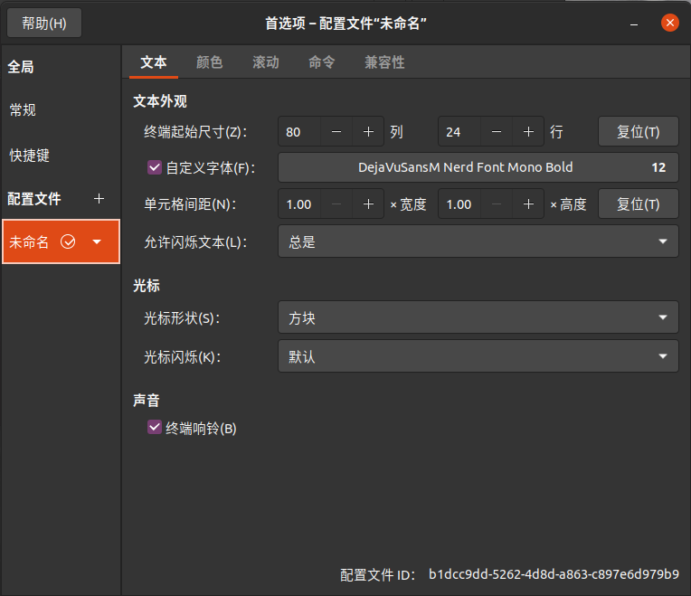

# Vim

## Vim

### 安装下载

#### Ubuntu

在 Ubuntu 下可以直接通过 `apt` 安装

```shell
sudo apt install vim
```

可以下载双笙子的整合包

```embed
title: "GitHub - archibate/vimrc at main"
image: "https://opengraph.githubassets.com/5cf4ad6c4a3d3ba94dfe967b6c05782b79171deca94644cbed2e2160c01fcdd1/archibate/vimrc"
description: "小彭老师自用 NeoVim 整合包. Contribute to archibate/vimrc development by creating an account on GitHub."
url: "https://github.com/archibate/vimrc/tree/main"
```

只需要执行脚本即可自动安装配置。


#### Windows

在 Windows 下可以通过 `winget` 安装

```shell
winget install vim.vim
```

安装后在环境变量中添加 `C:\Program Files\Vim\vim91` 即可在命令行使用。同理也可以下载 Neovim 使用。


### 管理器

使用 `vim-plug` 管理插件

```embed
title: "GitHub - junegunn/vim-plug: :hibiscus: Minimalist Vim Plugin Manager"
image: "https://opengraph.githubassets.com/27f01a1dbaa9dcdcf6b5460bb381e58f1aeb05370b8ab6e598710d6b857d16fd/junegunn/vim-plug"
description: ":hibiscus: Minimalist Vim Plugin Manager. Contribute to junegunn/vim-plug development by creating an account on GitHub."
url: "https://github.com/junegunn/vim-plug"
```

执行命令下载

```shell
mkdir .vim
curl -fLo ~/.vim/autoload/plug.vim --create-dirs https://raw.githubusercontent.com/junegunn/vim-plug/master/plug.vim
```

现在可以在 `.vimrc` 中给出需要的插件

```shell
call plug#begin()

Plug 'scrooloose/nerdte'

call plug#end()
```

> > 在 Windows 上使用时，要取消之后对终端的设置（`set shell=powershell`），否则无法正常运行。


### 配置方法

#### Windows

在 `C:/User/.../` 下创建 `.vimrc` 文件

```vim
source ~/.vim/init.vim
```

打开 vim 后就会使用对应路径下的配置文件。或者命令行输入

```shell
gvim --version
```

可以看到可使用的功能以及配置文件位置。


#### Ubuntu

要使用小彭老师的整合包，需要下载 `Rust, clang, llvm`，后两者直接通过 apt 安装，Rust 需要通过官网 bash 指令安装。途中遇到几个问题

- 缺少 `libClangBasic.a`，执行 `sudo apt-get install libclang-dev`
- `llvm` 编译报错，新版本头文件被移动，需要修改 `.vim/ccls/src/clang_tu.cc` 中的

```
#include <llvm/Support/Host.h> -> #include <llvm/TargetParser/Host.h>
```

改为下载源码后，参照 `init.vim` 中的注释手动安装。


### 下载配置

从 GitHub 上下载配置文件，放在 `C:/User/.../` 下的 `.vim` 文件夹下

```embed
title: "GitHub - xingyf666/vim: A vim config for windows."
image: "https://opengraph.githubassets.com/fd4a5ead2a9f58c3f27ca3e75253c2ebb8e6b264cbc21ac2734d8acbb6296787/xingyf666/vim"
description: "A vim config for windows. Contribute to xingyf666/vim development by creating an account on GitHub."
url: "https://github.com/xingyf666/vim"
```

> >使用 `git clone` 确保在下载时会正确处理换行符为 Windows 换行符。


#### 自动补全

参考注释，使用 scoop 配合 winget 来安装依赖库。例如 nodejs 环境 `scoop install nodejs`；还可以根据命令提示在 gvim 中安装 clangd。

> 对于 python，输入命令 `:CocInstall coc-pyright` 配置自动补全。


对于想要配置自动补全的语言，查看下面的配置列表，输入

```
:CocInstall coc-xxx
```

来安装配置相应的补全功能。

```embed
title: "Language servers"
image: "https://repository-images.githubusercontent.com/131770422/471682b6-11e0-4a54-bb14-f86d42a5cd7f"
description: "Nodejs extension host for vim & neovim, load extensions like VSCode and host language servers. - neoclide/coc.nvim"
url: "https://github.com/neoclide/coc.nvim/wiki/Language-servers#javascripttypescript"
```

> > 改为使用 `coc-clangd`，按照官方配置即可。通过 scoop 安装 clangd 和 llvm。


如果出现报错问题，可以查看日志

```shell
:CocOpenLog
```


配置 C++ 补全时，需要手动编译 ccls 库

```embed
title: "Build"
image: "https://opengraph.githubassets.com/15f9a6ad125b6ce1eee0db37c422abc39e43fdc8f0e985f205b8127994bd4587/MaskRay/ccls"
description: "C/C++/ObjC language server supporting cross references, hierarchies, completion and semantic highlighting - MaskRay/ccls"
url: "https://github.com/MaskRay/ccls/wiki/Build#windows"
```

首先下载预编译的 llvm 和 clang 库

```embed
title: "The LLVM Compiler Infrastructure Project"
image: "https://llvm.org/img/LLVMWyvernSmall.png"
description: "LLVM Overview"
url: "https://llvm.org/"
```

然后下载 RapidJSON 库，将整个项目移动到 ccls 的 `thrid_party/rapidjson`，然后可以构建编译

```embed
title: "GitHub - Tencent/rapidjson: A fast JSON parser/generator for C++ with both SAX/DOM style API"
image: "https://opengraph.githubassets.com/3198d10d283da849684346f5465bffc72b04499b7aff0c438a9178662a381fb9/Tencent/rapidjson"
description: "A fast JSON parser/generator for C++ with both SAX/DOM style API - Tencent/rapidjson"
url: "https://github.com/Tencent/rapidjson"
```

参考 issue 在编译项目时添加 `/Zc:preprocessor` 避免出现编译时重定义错误

```embed
title: "[gn] Add ”/Zc:preprocessor” build flag on windows by GkvJwa · Pull Request #108252 · llvm/llvm-project"
image: "https://opengraph.githubassets.com/02e2f46fa0ec155d24847427b991eb89cebaa98607b2d3a2ac1d89757bccca90/llvm/llvm-project/pull/108252"
description: "Add /Zc:preprocessor to fix the __VA_ARGS__ expansion error encountered when building with gn gen\\llvm\\lib\\ToolDrivers\\llvm-dlltool\\Options.inc(43): warning C4003: not enough arguments for function…"
url: "https://github.com/llvm/llvm-project/pull/108252"
```

在编译完成后，会报错无法链接到 `diaguids.lib` 库，修改项目属性中“链接器 -输入-附加依赖项”，将其中的库文件地址替换为

```shell
D:\Microsoft Visual Studio\2022\Community\DIA SDK\lib\amd64\diaguids.lib
```


在使用 `:CocInstall coc-ccls` 时，需要设置链接。在管理员身份运行的命令提示符中输入

```shell
cd C:\Users\xyf\AppData\Local\coc\extensions\node_modules\coc-ccls
mklink /D lib node_modules\ws\lib
```


#### 切换源

使用阿里的 npm 源来安装 coc 插件

```shell
npm config set registry https://registry.npmmirror.com/
```

找到插件扩展位置 `C:\Users\81408\AppData\Local\coc\extensions\node_modules` 执行命令

```shell
npm install coc-pyright --global-style --ignore-scripts --no-bin-links --no-package-lock --only=prod
```


#### 树状视图

使用 NERDTree 需要安装 ctags

```shell
scoop install main/ctags
```


#### LeaderF

使用 LeaderF 需要安装 python，只要版本大于 `3.1`，安装后重启即可。

```cpp
scoop install versions/python312
```


#### 文本编码

默认使用 UFT-8 编码，但是会导致有时中文乱码。此时可以使用 `:set encoding` 查看当前编码，并使用 `:set encoding=GBK` 解决乱码问题。


#### Nerd Font

需要安装 nerf 字体。下载 Nerd 字体库中的 `DejaVuSansM Nerd font`，解压后移动到字体文件夹下。

```embed
title: "Nerd Fonts - Iconic font aggregator, glyphs/icons collection, & fonts patcher"
image: "https://www.nerdfonts.com/assets/img/sankey-glyphs-combined-diagram.png"
description: "Iconic font aggregator, collection, & patcher: 9,000+ glyph/icons, 60+ patched fonts: Hack, Source Code Pro, more. Popular glyph collections: Font Awesome, Octicons, Material Design Icons, and more"
url: "https://www.nerdfonts.com/font-downloads"
```


## 模式操作

### 模式切换

Vim 的编辑特色就是区分多种模式，用 `n` 表示 normal 模式，用 `i` 表示插入模式，用 `v` 表示 visual 模式。


#### 正常模式

| 按键    | 功能                  | 按键  | 功能             |
| :---- | :------------------ | :-- | :------------- |
| `i`   | 进入 i 模式，插入到光标前      | `I` | 进入 i 模式，插入到行首  |
| `a`   | 进入 i 模式，插入到光标后      | `A` | 进入 i 模式，插入到行尾  |
| `o`   | 进入 i 模式，向下新增一行      | `O` | 进入 i 模式，向上新增一行 |
| `v`   | 进入 v 模式，每次选中一个 i 字母 | `V` | 进入 v 模式，每次选中一行 |
| `c-v` | 进入 v 模式，每次选中一块      |     |                |


#### 插入模式

| 按键    | 功能         | 按键    | 功能                           |
| :---- | :--------- | :---- | :--------------------------- |
| `jk`  | 退出插入模式（增强） | `esc` | 退出插入模式                       |
| `c-[` | 退出插入模式     | `c-o` | 暂时进入正常模式，可以执行一个命令，然后重新进入插入模式 |


#### 可视模式

| 按键  | 功能     | 按键  | 功能      |
| :-- | :----- | :-- | :------ |
| `v` | 退出可视模式 | `V` | 退出行可视模式 |


### 移动操作

#### 基本移动

| 按键    | 功能               | 按键      | 功能               |
| :---- | :--------------- | :------ | :--------------- |
| `c-e` | 屏幕向下移动一行         | `c-y`   | 屏幕向上移动一行         |
| `c-b` | 屏幕向上移动一页         | `c-f`   | 屏幕向下移动一页         |
| `c-u` | 光标向上移动半页         | `c-d`   | 光标向下移动半页         |
| `zz`  | 屏幕移动，使光标居中       | `zt`    | 屏幕移动，使光标置顶       |
| `zb`  | 屏幕移动，使光标置底       | `zc/zn` | 收起/展开代码块         |
| `{/}` | 段落跳转             | `%`     | 在配对符号之间跳跃        |
| `j`   | 光标上移             | `k`     | 光标下移             |
| `h`   | 光标左移             | `H/^`   | 光标左移行首（增强）       |
| `l`   | 光标右移             | `L/$`   | 光标右移行尾（增强）       |
| `gj`  | 光标上移（沿着视觉方向）     | `gk`    | 光标下移（沿着视觉方向）     |
| `0`   | 行首               | `$`     | 本行最后一个非空单词       |
| `^`   | 本行第一个非空单词        |         |                  |
| `w`   | 向后跳转到单词首         | `W`     | 向后跳转到单词首（单词包含标点） |
| `b`   | 向前跳转到单词首         | `B`     | 向前跳转到单词首（单词包含标点） |
| `e`   | 向后跳转到单词尾         | `E`     | 向后跳转到单词尾（单词包含标点） |
| `ge`  | 向前跳转到单词尾         |         |                  |
| `gg`  | 文档开头             | `G`     | 文档结尾             |
| `6G`  | 第 6 行            |         |                  |
| `gd`  | 跳转本地声明           | `gD`    | 跳转全局声明           |
| `g;`  | 跳转到前一次编辑位置       | `g,`    | 跳转到后一次编辑位置       |
| `gt`  | 移动到下一个选项卡        | `gT`    | 移动到前一个选项卡        |
| `6gt` | 移动到第 6 个选项卡      |         |                  |
| `fx`  | 向后跳转本行第一个 `x` 字符 | `Fx`    | 向前跳转本行第一个 `x` 字符 |
| `tx`  | 全局搜索 `x` 字符（增强）  | `T`     | 重复上一次搜索动作        |
| `;`   | 跳转到后一个搜索结果       | `,`     | 跳转到前一个搜索结果       |
| `c-o` | 跳转到前一次跳转位置       | `c-i`   | 跳转到后一次跳转位置       |


#### 查找移动

| 按键      | 功能                          | 按键      | 功能                          |
| :------ | :-------------------------- | :------ | :-------------------------- |
| `/test` | 查找下一个 `test`，按 `n/N` 向后/前查找 | `?test` | 查找前一个 `test`，按 `n/N` 向前/后查找 |
| `#`     | 查找前一个当前单词                   | `*`     | 查找后一个当前单词                   |


### 编辑操作

#### 正常模式

| 按键     | 功能                | 按键        | 功能                 |
| :----- | :---------------- | :-------- | :----------------- |
| `K`    | 打开光标所在单词的帮助手册     | `.`       | 重复上一次命令            |
| `u`    | 撤销                | `c-r`     | 重做                 |
| `U`    | 撤销当前行所有更改（不推荐）    | `J`       | 将下一行连接到当前行         |
| `y`    | 复制                | `Y -> yy` | 复制本行（`2yy` 复制两行）   |
| `yiw`  | 复制当前单词            | `yaw`     | 复制当前单词和后面一个字符      |
| `p`    | 粘贴（在后面）           | `P`       | 粘贴（在后面）            |
| `x`    | 删除后一个字符           | `X`       | 删除前一个字符            |
| `d`    | 等待删除              | `D -> d$` | 删除到行尾的内容           |
| `dw`   | 删除到下一个单词开头范围      | `d2w`     | 删除到后两个单词开头范围       |
| `diw`  | 删除当前单词            | `dd`      | 删除整行内容（`2dd` 删除两行） |
| `dt;`  | 删除直到 unTil `;` 位置 | `d/hello` | 删除直到 `hello`       |
| `r`    | 暂时进入 i 模式，替换一个字符  | `R`       | 进入 i 模式，替换当前行      |
| `s`    | 删除一个字符，进入 i 模式    | `S`       | 删除本行，进入 i 模式       |
| `c`    | 等待修改              | `C -> c$` | 修改到行尾的内容           |
| `cw`   | 修改到下一个单词开头范围      | `c2w`     | 修改到后两个单词开头范围       |
| `ciw`  | 修改当前单词            | `cc`      | 修改整行内容             |
| `ci<`  | 修改 `<` 内          | `ca<`     | 修改 `<` 和内容         |
| `~`    | 转换光标所在字符的大小写      | `g~ w`    | 转换到下一个单词开头范围的大小写   |
| `g~ ~` | 转换本行字符大小写         | `gu`      | 选中内容转换为小写          |
| `gu u` | 本行字符小写            | `gu w`    | 到下一个单词开头范围小写       |
| `gU U` | 本行字符大写            | `gW w`    | 到下一个单词开头范围大写       |
| `>>`   | 本行右移              | `<<`      | 本行左移               |
| `>i{`  | 缩进 `{}` 内容        | `<i{`     | 取消缩进 `{}` 内容       |
| `==`   | 自动缩进本行            | `3==`     | 自动缩进 3 行           |
| `gg=G` | 自动缩进全文            | `ggVG`    | 全选                 |

多光标编辑

- `c-v` 进入块可视模式，选择块
- `I/A` 进入多光标插入模式


#### 插入模式

| 按键    | 功能       | 按键    | 功能       |
| :---- | :------- | :---- | :------- |
| `c-h` | 删除前一个字符  | `c-w` | 删除前一个单词  |
| `c-t` | 缩进       | `c-d` | 取消缩进     |
| `c-n` | 选择下一个补全项 | `c-p` | 选择上一个补全项 |
| `c-v` | 粘贴       |       |          |


#### 可视模式

| 按键    | 功能            | 按键    | 功能            |
| :---- | :------------ | :---- | :------------ |
| `viw` | 选择当前单词        | `vaw` | 选择当前单词和后面一个字符 |
| `vii` | 选择当前段落内部      | `vai` | 选择当前段落和周围空行   |
| `vi<` | 选择 `<` 内      | `va<` | 选择 `<` 和内容    |
| `vi[` | 选择 `[` 内      | `va[` | 选择 `[` 和内容    |
| `vi{` | 选择 `{` 内      | `va{` | 选择 `{` 和内容    |
| `vi(` | 选择 `(` 内      | `va(` | 选择 `(` 和内容    |
| `vi"` | 选择 `"` 内      | `va"` | 选择 `"` 和内容    |
| `vfo` | 选择到下一个 `o` 范围 | `vFo` | 选择到前一个 `o` 范围 |


### 命令模式

#### 基本命令

| 命令                  | 作用                        | 命令                      | 作用                         |
| :------------------ | :------------------------ | :---------------------- | :------------------------- |
| `c-p`               | 上一条命令                     | `c-n`                   | 下一条命令                      |
| `:h[elp] key`       | 获得 key 的帮助                | `:ter[minal]`           | 打开终端                       |
| `:clo[se]`          | 关闭当前窗口                    | `:sav[eas] file`        | 另存文件                       |
| `:o[pen] file`      | 打开新文件                     | `:on[ly]`               | 只保留当前窗口                    |
| `:e[dit] file`      | 在新缓冲区编辑文件                 | `:bn[ext]`              | 转到下一个缓冲区                   |
| `:bp[reivous]`      | 转到上一个缓冲区                  | `:b[uffer] 3`           | 进入 3 号缓冲区                  |
| `:b[uffer] file`    | 进入文件缓冲区                   | `:ls`                   | 列出所有缓冲区                    |
| `:sp[lit] file`     | 在新缓冲区和横向切分窗口中打开文件         | `vs[plit] file`         | 在新缓冲区和纵向切分窗口中打开文件          |
| `:marks`            | 获得标记列表                    | `:delmarks a`           | 删除标记 `a`                   |
| `:delmarks!`        | 删除所有标记                    |                         |                            |
| `:ju[mp]`           | 获得跳转历史                    |                         |                            |
| `:q[uit]`           | 退出窗口                      | `:w[rite] file`         | 写入文件                       |
| `:wqa`              | 写入所有窗口并退出                 | `q!`                    | 强制退出                       |
| `:tabm[ove] 3`      | 将当前选项卡移动到 3 位置            | `:tabc[lose]`           | 关闭当前选项卡                    |
| `:tabo[nly]`        | 关闭其它选项卡                   | `:tabdo q`              | 对所有选项卡执行 `q` 命令            |
| `:tabnew file`      | 在新的选项卡打开文件                | `:tab ba[ll]`           | 将所有缓冲区变为选项卡                |
| `vert[ical] ba[ll]` | 将所有缓冲区变为垂直窗口              |                         |                            |
| `:3,5 y`            | 复制 `3~5` 行                | `:3,5 d`                | 删除 `3~5` 行                 |
| `:norm 0x`          | 本行执行 `0x` 操作              | `:'<,'>norm 0x`         | 选中行执行 `0x` 操作              |
| `:s/hello/world`    | 本行第一个 `hello` 替换为 `world` | `:'<,'>s/hello/world`   | 选中行第一个 `hello` 替换为 `world` |
| `:s/hello/world/g`  | 本行所有 `hello` 替换为 `world`  | `:'<,'>s/hello/world/g` | 选中行所有 `hello` 替换为 `world`  |
| `:%s/hello/world/g` | 全文 `hello` 替换为 `world`    | `:%s/\s*$//g`           | 删除所有行尾的空格                  |


#### 标记

使用 `mark` 可以标记光标位置，例如 `ma` 将在本行创建 `a` 标记，然后可以

- 通过 `'a` 跳转到标记行
- 通过反引号 `a` 跳转到标记位置


#### 跳转

使用 `c-o` 跳转到前一次跳转位置，使用 `c-i` 跳转到后一次跳转位置。通过 `:ju` 获得跳转历史。


#### 录制宏

使用 `qa` 开始录制宏到 `a` 寄存器，执行操作后，按 ` q ` 结束录制。然后使用 `@a` 执行 `a` 中记录的宏，`@@` 执行之前执行的宏。例如录制

```shell
:%s/"(.*\.h)"/<\1>/g
```

这样可以将所有 `""` 头文件引用替换为 `<>` 引用。


### 窗口操作

| 操作      | 作用              | 操作      | 作用              |
| :------ | :-------------- | :------ | :-------------- |
| `c-s`   | 冻结终端            | `c-q`   | 恢复终端            |
| `c-ww`  | 切换窗口            | `c-w +` | 增高窗口            |
| `c-w -` | 降低窗口            | `c--/+` | 缩放窗口            |
| `c-wT`  | 将窗口拆分到选项卡       | `c-w=`  | 所有窗口宽高相等        |
| `c-ws`  | 水平分割窗口          | `c-wv`  | 垂直分割窗口          |
| `c-wq`  | 退出窗口            | `c-wx`  | 交换当前窗口和下一个窗口    |
| `c-wH`  | 将当前窗口移动到左侧的垂直窗口 | `c-wL`  | 将当前窗口移动到右侧的垂直窗口 |
| `c-wJ`  | 将当前窗口移动到底部的水平窗口 | `c-wK`  | 将当前窗口移动到顶部的水平窗口 |
| `c-wh`  | 光标移动到左侧         | `c-wl`  | 光标移动到右侧         |
| `c-wj`  | 光标移动到下方         | `c-wk`  | 光标移动到上方         |
 


### 增强操作

#### 基础操作

| 操作         | 作用             | 操作       | 作用                          |
| :--------- | :------------- | :------- | :-------------------------- |
| `q`        | `:wq`          | `c-q`    | `:bd` 关闭当前缓冲区               |
| `Q`        | `q` 用来记录宏      |          |                             |
| `f1`       | 保存并切换到最后用到的选项卡 | `f2`     | 保存并切换到上一个选项卡                |
| `f3`       | 保存并切换到下一个选项卡   | `f4`     | 保存所有文件                      |
| `gcc`      | 注释本行           | `gcu`    | 取消注释本行                      |
| `gc space` | 切换本行注释         | `gci`    | 反转本行注释                      |
| `gcA`      | 在行尾添加注释        |          |                             |
| `f8`       | `:sh`          | `f10`    | `:NERDTreeToggle` 切换项目文件树窗口 |
| `f5`       | 构建运行 cmake 项目  | `f6`     | 构建 cmake 项目                 |
| `f7`       | 当前文件单独运行       | `s-f7`   | 配置当前 cmake 项目               |
| `s-f10`    | 切换编译错误窗口       | `f12`    | 寻找依赖                        |
| `c-t`      | 切换构建终端         | `esc`    | 在终端中进入正常模式（用于选择文本）          |
| `c-w w`    | 离开终端窗口         | `c-w ""` | 将 vim 剪贴板内容粘贴到终端            |


#### 代码操作

| 操作        | 作用                | 操作    | 作用                |
| :-------- | :---------------- | :---- | :---------------- |
| `c-space` | 切换补全（插入模式）        | `tab` | 下一个补全（插入模式）       |
| `s-tab`   | 上一个补全（插入模式）       |       |                   |
| `gd`      | 跳转定义              | `gD`  | 跳转实现              |
| `gy`      | 跳转类型定义            | `gY`  | 跳转声明              |
| `gR`      | 重命名当前符号           | `gq`  | 格式化选中代码（可视模式）     |
| `gf`      | 跳转当前光标所在文件路径（无行号） | `gF`  | 跳转当前光标所在文件路径（有行号） |
| `gx`      | 打开当前光标所在链接        | `K`   | 显示当前光标所在符号文档      |
| `gaga`    | 显式当前行的代码动作        | `ga`  | 自动修复当前行错误         |
| `vif`     | 在函数体内选中内容         | `vaf` | 在函数体外选中整个函数体      |
| `vic`     | 在类内选中内容           | `vac` | 在类外选中整个类          |


#### 强化搜索

| 操作       | 作用                   | 操作      | 作用                   |
| :------- | :------------------- | :------ | :------------------- |
| `,o`     | 在项目目录下查找文件打开         | `,k`    | 在项目目录下查找字符串          |
| `,b`     | 在所有 buffer 中查找文件     | `,m`    | 查找最常用的文件             |
| `,:`     | 查找历史命令               | `,/`    | 查找历史搜索的字符串           |
| `,x`     | 查找 vim 扩展命令          | `,j`    | 查找跳转历史 `:ju`         |
| `,h`     | 查找标记 `:marks`        | `,n`    | 查找打开文件中的函数           |
| `,l`     | 查找打开文件中的字符串          | `,t`    | 查找打开文件中的标签           |
| `,q`     | 在 quickfix 结果中查找字符串  | `,i`    | 在当前文件中查找光标下的字符串      |
| `,a`     | 在项目目录中查找光标下的字符串      | `,.`    | 唤起上一次查找的窗口           |
| 在查找窗口内部： | 全局                   |         |                      |
| `c-j`    | 选择下一个候选              | `c-k`   | 选择上一个候选              |
| `c-p`    | 在弹出窗口中查看当前候选         | `c-r`   | 在普通搜索和正则搜索之间切换       |
| `c-f`    | 在全路径搜索和名称搜索之间切换      | `c-v`   | 粘贴                   |
| `c-\`    | 选择打开选中目标的拆分方法        | `enter` | 打开候选                 |
| `tab`    | 在正常模式和插入模式之间切换       |         |                      |
|          | 正常模式                 |         |                      |
| `p`      | 在弹出窗口中查看当前候选         | `v`     | 在垂直拆分窗口中查看当前候选       |
| `x`      | 在水平拆分窗口中查看当前候选       | `Q`     | 将当前候选添加到 quickfix 列表 |
| `L`      | 将当前候选添加到 location 列表 | `d`     | 删除当前候选               |
| `q`      | 退出搜索窗口               |         |                      |


## NeoVim
### 安装配置

通过 unstable 源安装

```shell
sudo apt-get install software-properties-common
sudo apt-add-repository ppa:neovim-ppa/unstable
sudo apt-get update
sudo apt-get install neovim
```

现在可以通过 `nvim` 直接运行。由于版本兼容问题，最新版的 NeoVim 可能与 LazyVim 不兼容，因此安装指定版本

```shell
wget https://github.com/neovim/neovim/releases/download/v0.9.4/nvim.appimage
chmod a+x ./nvim.appimage
```

然后创建软链接覆盖原先的版本

```shell
sudo mv nvim.appimage /opt/nvim
sudo ln -sf /opt/nvim /usr/local/bin/nvim
```


在 windows 下，配置目录位于 `C:\Users\81408\AppData\Local\nvim`，将配置文件放置到此目录下

```embed
title: "GitHub - abyo/nvim-windows: Config files for neoVim on Windows 10"
image: "https://opengraph.githubassets.com/87b5fe43bb7bd26790189d28b15f3ce9fe38c5c39071cadb55bb883919fd3345/abyo/nvim-windows"
description: "Config files for neoVim on Windows 10. Contribute to abyo/nvim-windows development by creating an account on GitHub."
url: "https://github.com/abyo/nvim-windows"
```

根据项目的 wiki 描述，首先

- 安装 Lua 和 Git
- 安装 Scoop

命令行管理工具，用于在 windows 下管理软件

```shell
Set-ExecutionPolicy -ExecutionPolicy RemoteSigned -Scope CurrentUser
Invoke-RestMethod -Uri https://get.scoop.sh | Invoke-Expression
```

> >如果报错 `SSL/TLS` 通道问题，可以先执行 `[System.Net.ServicePointManager]::SecurityProtocol = [System.Net.SecurityProtocolType]::Tls12
` 修改 TLS 版本。


例如可以安装软件

```shell
scoop install python
scoop search python
```

查看已安装的软件

```shell
dir ~/scoop
```

然后安装 Hack Nerd 字体。


使用 scoop 安装

```shell
scoop install fzf ripgrep
scoop bucket add extras
scoop install lazygit
scoop install zig llvm
```

最后先打开 `C:\Users\81408\AppData\Local\nvim\init.vim` 等待加载配置；然后进入 `C:\Users\81408\AppData\Local\nvim\lua\plugins.lua` 输入命令 `:w` 就会触发插件下载。

> > 如果插件下载失败，可以修改 github 端口，参照 [Git#端口管理](Git#端口管理) 部分内容。


安装完成后打开可能会报错，这是由于配置过于古老，需要更新。

- 更新 `nvim\lua\plugins\lsp\handlers.lua` 中最后的配置函数 `M.capabilities` 的内容
- 更新 `nvim\lua\plugins\gitsigns.lua` 中的配置
- 更新 `nvim\lua\plugins\indentline.lua` 中的配置
- 更新 `nvim\lua\plugins\nvim-tree.lua` 中的配置

最后输入命令 `:checkhealth` 检查所有插件的运行情况。


#### Nerd Font

为了避免乱码，还需要安装 nerf 字体。下载 Nerd 字体库中的 `DejaVuSansM Nerd font`，解压后移动到字体文件夹下。

```embed
title: "Nerd Fonts - Iconic font aggregator, glyphs/icons collection, & fonts patcher"
image: "https://www.nerdfonts.com/assets/img/sankey-glyphs-combined-diagram.png"
description: "Iconic font aggregator, collection, & patcher: 9,000+ glyph/icons, 60+ patched fonts: Hack, Source Code Pro, more. Popular glyph collections: Font Awesome, Octicons, Material Design Icons, and more"
url: "https://www.nerdfonts.com/font-downloads"
```

命令行步骤为

```shell
unzip Ubuntu.zip
sudo mv *.ttf /usr/local/share/fonts/
fc-list			# 检查字体列表
fc-cache -fv	# 更新缓存
```

安装 kitty 库

```embed
title: "Install kitty"
image: "https://sw.kovidgoyal.net/kitty/_images/social_previews/summary_binary_478594b0.png"
description: "Binary install: You can install pre-built binaries of kitty if you are on macOS or Linux using the following simple command: The binaries will be installed in the standard location for your OS,/App…"
url: "https://sw.kovidgoyal.net/kitty/binary/"
```

可以直接命令行安装预构建二进制文件，然后链接到系统目录下

```shell
curl -L https://sw.kovidgoyal.net/kitty/installer.sh | sh /dev/stdin
sudo ln -s  ~/.local/kitty.app/bin/kitty /usr/local/bin/kitty
```

然后需要修改终端字体设置，在“配置文件首选项”中设置自定义字体为 `Nerd Font` 字体。




#### LazyVim

从 Github 上克隆项目到本地 nvim 配置目录下即可

```shell
git clone https://github.com/LazyVim/starter ~/.config/nvim
```

现在 `nvim` 启动，就会自动安装所有插件。


对于 Windows 版本，配置安装路径为

```shell
git clone https://github.com/LazyVim/starter C:\Users\xyf\AppData\Local\nvim
```

如果启动时出现 `module 'lazy' not found` 错误，则说明 lazy 模块没有完全下载，需要删除 `Local\nvim-data` 下的 lazy 文件夹，然后重新启动。


#### 缩进

默认缩进为 2 个空格，可以修改 `~/.config/nvim/lua/config/options.lua` 文件，在其中加入

```lua
local opt = vim.opt
opt.shiftwidth = 4 -- Size of an indent
```

退出重启 vim 即可。


#### 修改注释

LazyVim 使用 `mini.vim` 注释，快捷键为 `gcc`，默认样式为 `/**/` 。如果要修改为 `//` 样式，在 `~/.config/nvim/lua/plugins/comment.lua` 中添加配置

```shell
return {
    "JoosepAlviste/nvim-ts-context-commentstring",
    opts = {
      config = {
        cpp = "// %s",
      },
    }
}
```


#### 多重光标

在 `~/.config/nvim/lua/plugins/input.lua` 中添加配置

```shell
return {
  -- multiple cursors
  { "mg979/vim-visual-multi" },
}
```

具体使用方法可以查询 GitHub 中的 `vim-visual-multi` 插件。


#### 键位映射

在 `~/.config/nvim/lua/config/keymaps.lua` 中添加键位映射

```lua
local keymap = vim.keymap
keymap.set("i", "jk", "<ESC>")
keymap.set("i", "jk", "<ESC>")
```

在输入模式 `i` 下将 `jk` 映射为 `ESC` 键。


#### 网络代理

如果插件文件出错了，可以删除 `~/.local/share/nvim` 目录，打开 nvim 会重新下载。


#### 错误检查

如果出现未知的错误，可以通过 `:checkhealth` 命令检查。需要提供 python 支持

```shell
python3 -m pip install --user --upgrade pynvim
```


### 扩展管理
#### LazyExtras

进入 nvim 后，通过 `:LazyExtras` 可以打开扩展管理界面。光标移动到对应的插件行，按 `x` 即可勾选，退出后重新打开就会自动安装。


#### Tree-sitter-cli

通过 `cargo` 安装 `tree-sitter-cli` 库

```shell
cargo install tree-sitter-cli
```

安装完成后，还需要将其添加到路径中，确保能够识别

```shell
gedit ~/.bashrc
export PATH="$PATH:/home/xingyifan/.cargo/bin"
source ~/.bashrc
tree-sitter --version
```


#### Fish

部分插件需要安装 fish 才能正常运行

```shell
sudo apt install fish
```


#### Latex

如果启动 latex 插件，就需要安装 latex 。使用

```shell
sudo apt install texlive-full
sudo apt install latexmk
```

如果安装 `texlive-full` 时出现错误

```shell
dpkg: 处理软件包 tex-common (--configure)时出错
```

应该尝试修复依赖关系，依次执行

```shell
sudo mv /var/lib/dpkg/info /var/lib/dpkg/info_bak
sudo mkdir /var/lib/dpkg/info
sudo apt-get update && sudo apt-get -f install 
sudo mv /var/lib/dpkg/info/* /var/lib/dpkg/info_bak/
sudo rm -rf /var/lib/dpkg/info
sudo mv /var/lib/dpkg/info_bak /var/lib/dpkg/info
```

如果安装时卡在 `pregenerating context markiv format`，可以长按回车键直到完成安装。最后验证安装完成

```shell
latex --version
```


### 代码配置

#### GDB

首先需要安装 GDB，由于需要高版本来使用 neovim 中的 `nvim-dap` 插件功能，因此需要下载最新的 [gdb-14.2.tar.xz](https://ftp.gnu.org/gnu/gdb/gdb-14.2.tar.xz) 版本

```embed
title: "Download GDB"
image: "https://www.sourceware.org/gdb/images/archer.svg"
description: "Please send FSF & GNU inquiries & questions to gnu@gnu.org. There are also other ways to contact the FSF."
url: "https://www.sourceware.org/gdb/download/"
```

依次执行

```shell
tar -xf gdb-14.2.tar.xz 
cd gdb-14.2
mkdir build
cd build
../configure
make
```

如果提示 `configure: error: Building GDB requires GMP 4.2+, and MPFR 3.1.0+.`，则需要先安装这两个库

```shell
sudo apt-get install libgmp-dev libmpfr-dev
```

如果执行 `make install` 就会覆盖原本的 gdb，因此需要根据情况使用。这里创建软链接

```shell
sudo mv ./gdb /opt/gdb
sudo ln -s /opt/gdb /usr/local/bin/gdb
gdb --version
```

这种方式是通过本地配置来覆盖系统配置，系统 gdb 位于 `/usr/bin/gdb`，它被 local 配置覆盖，但仍然存在。只要删除软链接就会还原

```shell
sudo rm /usr/local/bin/gdb
```


#### 缩进

打开 `~/.config/nvim/lua/config/autocmds.lua` 编辑

```lua
-- Autocmds are automatically loaded on the VeryLazy event

-- Default autocmds that are always set: https://github.com/LazyVim/LazyVim/blob/main/lua/lazyvim/config/autocmds.lua

-- Add any additional autocmds here

vim.api.nvim_create_autocmd({"FileType"}, {
    pattern = {"c", "cpp", "md", "txt", "c.snippets", "cpp.snippets"},
    callback = function()
        vim.b.autoformat = true
        vim.opt_local.expandtab = true
        vim.opt_local.tabstop = 4
        vim.opt_local.shiftwidth = 4
        vim.opt_local.softtabstop = 4
    end,
})

```

针对 c++ 文件设计缩进格式。


### 自动格式化

要实现格式化，需要安装 `clang-format` 工具。通过命令 `:Mason` 进入扩展页面，选择 `clang-format` 按 `i` 键安装。如果出现错误

```shell
E21: Cannot make changes, 'Modifiable' is off
```

通过命令 `:set ma` 获得修改权限；通过 `:set noma` 取消权限。


在 `~/.config/nvim/lua/plugins/conform.lua` 中添加配置

```lua
return {
  {
    "stevearc/conform.nvim",
    optional = true,
    opts = {
      formatters_by_ft = {
        ["c"] = { "clang_format" },
        ["cpp"] = { "clang_format" },
        ["c++"] = { "clang_format" },
      },
      formatters = {
        --clang-format = {
        -- prepend_args = {"-style=google"},
        --},
      },
    },
  },
}
```

保存后重新启动 nvim，输入 `:ConformInfo`，如果提示 `Ready` 就说明配置成功。然后在工作目录下添加 `.clang-format` 文件，就可以通过 `C-s` 实现保存时格式化。


### 断点调试

需要安装 gdb14 以后，在 `~/.config/nvim/lua/plugins/dap.lua` 中添加配置

```lua
return {
  {
    "mfussenegger/nvim-dap",
    event = "VeryLazy",
    keys = {
      -- add a keymap to browshttps://github.com/cmu-db/bustub.gite plhttps://github.com/cmu-db/bustub.gitugin files
      -- stylua: ignore
      {
        "<f5>",
        function() require("dap").continue() end,
        desc = "launch/continue gdb",
      },
      {
        "<f10>",
        function()
          require("dap").step_over()
        end,
        desc = "单步调试",
      },
      {
        "<C-f10>",
        function()
          require("dap").step_into()
        end,
        desc = "步入",
      },
      {
        "<C-f>",
        function()
          require("dap").step_out()
        end,
        desc = "步出",
      },
      {
        "<C-f5>",
        function ()
          require("dap").terminate()
        end,
        desc = "终止程序"
      }
    },
    config = function()
      local dap = require("dap")
 
      dap.adapters.gdb = {
        type = "executable",
        executable = {
          command = vim.fn.exepath("gdb"),
          args = { "-i", "dap" },
        },
      }
      dap.configurations.c = {
        name = "Launch file",
        type = "gdb",
        request = "launch",
        gdbpath = function()
          return "/usr/local/bin/gdb"
        end,
        cwd = "${workspaceFolder}",
      }
    end,
  },
  {
    "rcarriga/nvim-dap-ui",
    dependencies = {
      "mfussenegger/nvim-dap",
    },
    opts = function()
      local dap, dapui = require("dap"), require("dapui")
      dap.listeners.before.attach.dapui_config = function()
        dapui.open()
      end
      dap.listeners.before.launch.dapui_config = function()
        dapui.open()
      end
      dap.listeners.before.event_terminated.dapui_config = function()
        dapui.close()
      end
      dap.listeners.before.event_exited.dapui_config = function()
        dapui.close()
      end
      return {
        enabled = true, -- enable this plugin (the default)
        enabled_commands = true, -- create commands DapVirtualTextEnable, DapVirtualTextDisable, DapVirtualTextToggle, (DapVirtualTextForceRefresh for refreshing when debug adapter did not notify its termination)
        highlight_changed_variables = true, -- highlight changed values with NvimDapVirtualTextChanged, else always NvimDapVirtualText
        highlight_new_as_changed = false, -- highlight new variables in the same way as changed variables (if highlight_changed_variables)
        show_stop_reason = true, -- show stop reason when stopped for exceptions
        commented = false, -- prefix virtual text with comment string
        only_first_definition = true, -- only show virtual text at first definition (if there are multiple)
        all_references = false, -- show virtual text on all all references of the variable (not only definitions)
        filter_references_pattern = "<module", -- filter references (not definitions) pattern when all_references is activated (Lua gmatch pattern, default filters out Python modules)
        -- Experimental Features:
        virt_text_pos = "eol", -- position of virtual text, see `:h nvim_buf_set_extmark()`
        all_frames = false, -- show virtual text for all stack frames not only current. Only works for debugpy on my machine.
        virt_lines = false, -- show virtual lines instead of virtual text (will flicker!)
        virt_text_win_col = nil, -- position the virtual text at a fixed window column (starting from the first text column) ,
      }
    end,
  },
  {
    "theHamsta/nvim-dap-virtual-text",
    opts = {},
  },
}
```


