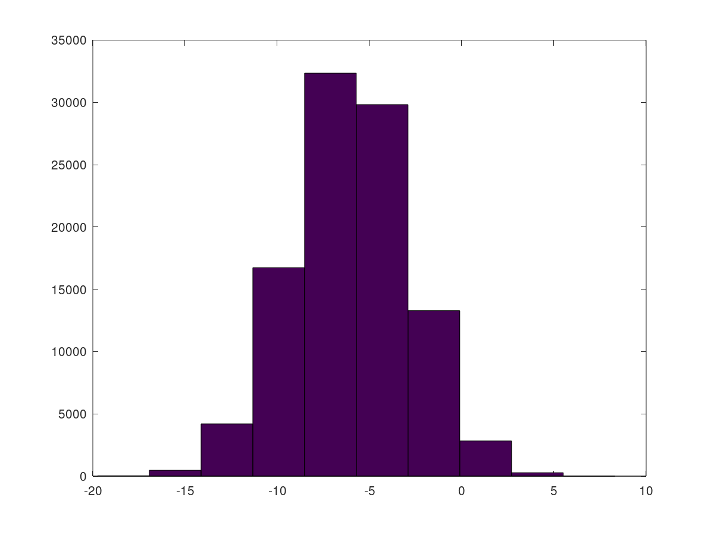
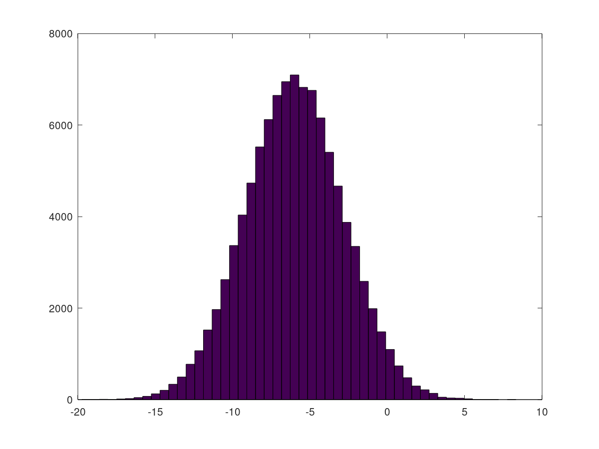

# Matlab

## 基本语法

matlab 脚本是普通的文本文件，但需要以 `.m` 为后缀


### 输入输出

#### 基本函数

```matlab
input()			% 输入函数
disp(); 	 	% 输出函数
```

例如

```matlab
x = input('请输入数据：');
disp(x);
```


#### 格式化输出结果

```matlab
fprintf(format, ...);
```

使用方法和 C 语言中的 printf 类似。注意应当使用单引号作为字符串，并且变量直接使用

```matlab
x = 100;
fprintf('Hello %d', x);
```


数字格式化命令

| 格式           | 含义                                          |
| -------------- | --------------------------------------------- |
| format short   | 5 位定点表示                                  |
| format long    | 15 位定点表示                                 |
| format short e | 5 位浮点表示                                  |
| format long    | 15 位浮点表示                                 |
| format short g | 5 位定点和 5 位浮点中自动选择最好格式表示     |
| format long g  | 15 位定点和 15 位浮点中自动选择最好格式表示   |
| format hex     | 16 进制格式表示                               |
| format +       | 在矩阵中，用符号 + - 和空格表示正号、负号和零 |
| format rat     | 分数表示                                      |
| format         | 默认格式化                                    |

使用时直接输入命令即可。


### 运算符

#### 数学运算

| 运算          | 作用                       |
| ------------- | -------------------------- |
| `+ - * / ^ \` | 普通加减乘除、幂运算和左除 |
| `.* ./ .^ .\` | 点乘，点除，点乘幂和点左除 |

由于 % 作为注释，因此可以用 mod 函数取余

```matlab
mod(a,3);
```


#### 关系运算

关系运算符有 `== >= <= > < ~=`，注意其中 `~=` 表示不等于；如果关系成立结果为 1，否则结果为 0 。


#### 逻辑运算

逻辑运算符有 `& | ~` 表示或、与、非；另外使用 xor 表示异或

```matlab
xor(1, 0);
```


### 条件语句

```matlab
if condition1
% code
elseif condition2
% code
else
% code
end
```


### 循环语句

循环格式为

```matlab
for n = n1:step:n2
% code
end

while condition
% code
end
```


循环控制语句

* break 结束当前循环
* continue 跳过本次循环
* return 返回
* pause 程序暂停直到键盘响应；可以用 `pause(n)` 指定暂停的秒数

 

### 自定义函数

用户可以自定义函数，matlab 函数通过值传递并能返回多个返回值，按如下格式定义函数：

```matlab
function [输出1, 输出2, ...] = name(输入1, 输入2, ...)
	% code
end
```

例如我们可以定义计算 sin 的函数

```matlab
function s = sind(x)
    % SIND(x) Calculates sine(x) in degrees
    s = sin(x*pi/180);
end
```


#### 使用函数

函数应当定义在一个单独的文件中，**函数名和文件名要一致**，然后在其它文件中直接使用即可。函数可以作为参数传递给另一个函数

```matlab
steepestDescent(f, df, [-1.2; 1]);
```

这里 `f, df` 都是定义好的函数，传入后在该函数内部可以作为普通函数使用。


#### 函数接口

有时我们希望能够将多个函数写在同一个函数文件中，这时就要定义一个函数接口，例如

```matlab
% 文件名 Rosenbrock.m

% 函数接口
function RosenbrockAll = Rosenbrock
    RosenbrockAll.Rosenbrock1 = @Rosenbrock1;
    RosenbrockAll.Rosenbrock2 = @Rosenbrock2;
    RosenbrockAll.Rosenbrock3 = @Rosenbrock3;
end

% 100(y - x^2)^2 + (1 - x)^2
function [ z ] = Rosenbrock1( X )
    x = X(1);
    y = X(2);
    z = 100 * (y-x^2)^2 + (1-x)^2;
end

% 梯度函数
function [ z ] = Rosenbrock2( X )
    x = X(1);
    y = X(2);
    z = [ 2*x - 400*x*(- x^2 + y) - 2; - 200*x^2 + 200*y];
end

% Hess
function [ z ] = Rosenbrock3( X )
    x = X(1);
    y = X(2);
    % jacobian(u,[x y]); 用两次
    z = [ 1200*x^2 - 400*y + 2, -400*x; -400*x, 200];
end
```

其中 `@` 表示匿名函数，这样就可以在主程序中获得该函数

```matlab
% Rosenbrock 函数
RosenbrockAll = Rosenbrock;
f = RosenbrockAll.Rosenbrock1;
df = RosenbrockAll.Rosenbrock2;
hf = RosenbrockAll.Rosenbrock3;

% 作为一般函数调用
f([1 2]);
```

我们可以将它们作为普通函数使用。


#### 内联函数

matlab 中也有内联（inline）函数，例如将如下方程组：
$$
\begin{cases}
\sin x_1 + x_2 + x_3^2e^{x_1} - 4 = 0\\
x_1 + x_2x_3 = 0\\
x_1x_2x_3 = -2
\end{cases}
$$
转化为下面的形式函数

```matlab
f = @(x) [sin(x(1)) + x(2) + x(3)^2*exp(x(1))-4; x(1) + x(2)*x(3); x(1)*x(2)*x(3)+2];
```

这样就可以直接通过 `f(x)` 来调用该函数，返回一个结果向量；相当于求解该函数等于 `[0 0 0]` 的解。


多元函数也是类似的

```matlab
f = @(x, y)  x^2 + y^2 ;
```


### 数学函数

| 函数             | 作用              | 函数     | 作用             |
| ---------------- | ----------------- | -------- | ---------------- |
| sin(x) / sind(x) | 正弦（弧度/角度） | asin(x)  | 反正弦           |
| cos(x) / cosd(x) | 余弦（弧度/角度） | acos(x)  | 反余弦           |
| tan(x) / tand(x) | 正切（弧度/角度） | atan(x)  | 反正切           |
| cot(x) / cotd(x) | 余切（弧度/角度） | acot(x)  | 反余切           |
| abs(x)           | 绝对值            | max(x)   | 最大值           |
| min(x)           | 最小值            | sum(x)   | 求和             |
| sqrt(x)          | 开平方            | exp(x)   | 以 e 为底的指数  |
| log(x)           | 自然对数          | log10(x) | 以 10 为底的对数 |
| sign(x)          | 符号函数          | fix(x)   | 取整             |
| ceil(x)          | 向上取整          | floor(x) | 向下取整         |


## 数据处理

### 数据类型

| 变量    | 含义                                 |
| ------- | ------------------------------------ |
| ans     | Matlab 中的默认变量                  |
| pi      | 圆周率                               |
| eps     | 计算机中的最小数，浮点运算的相对精度 |
| inf     | 无穷大，如 1/0                       |
| NaN     | 不定值，如 0/0 0*∞                   |
| i / j   | 复数中的虚数单位                     |
| realmin | 最小可用正实数                       |
| realmax | 最大可用正实数                       |


matlab 变量区分大小写，解释性语言不需要指定变量类型。变量有几种操作命令：

```matlab
clear 		 	    % 清除所有变量
clear variable 		% 清除指定变量
```

其中 `%` 开头的文字是注释，命令末尾的分号不是必须的，如果不在语句结尾加上分号，会输出语句的结果；加上分号则会隐藏结果


通过如下函数获取变量的信息

```matlab
size(var);		% 变量的尺寸
length(var);	% 变量的长度
```

设置小数位数

```matlab
vpa(x, n); 		% 显示 x 的 n 位小数
```


使用 1i 来表示虚数

```matlab
z = 2 + 2i;
```

一般来说 i,j 都可表示虚数，但是由于它们可能作为变量被修改，因此推荐使用 1i 显式说明。


使用 real 函数取实部，使用 imag 函数取虚部

```matlab
a = real(z);
b = imag(z);
```


### 矩阵数据

将矩阵储存为文件

```matlab
save('A.txt', 'A');	% 将矩阵 A 保存在 A.txt 中
```


### 文本数据

可以从其它文件中载入数据

```matlab
x = load('test.txt');
```


### 表格数据

使用 csvread 来读取表格数据

```matlab
a = csvread(filename);
```


### 图像数据

显示图像

```matlab
imshow(image);
imagesc(image);
```

将矩阵数据输出为图像

```matlab
A = uint8(A);
imwrite(A,'xxx.bmp');
```

需要先使用 uint8 转换，防止溢出，注意不能输出 jpg 格式，因为会压缩图像产生问题。


## 变量类型

### 全局变量

函数文件所定义的变量是局部变量，只能在该函数的工作空间引用。如果某些变量被定义成全局变量，就可以在整个工作空间进行存取和修改。例如

```matlab
global A B C
```

如果要加载其它文件中的变量，就应当将它们声明为全局变量，不应该使用 load 方法。


### 命名空间

```matlab
save name 				 % 保存一个指定名称的命名空间（当前所有变量储存在其中）
save name var1 var2 ...   % 保存包含这些变量的命名空间
load name 				 % 载入一个指定名称的命名空间
```


### 元胞数组

元胞数组将类型不同的相关数据集成到一个单一的变量中，使得大量相关数据的引用和处理变得简单方便。我们可以通过 3 种方式来创建元胞数组：

* 直接赋值法
* 函数 cell()
* 利用 `{}` 创建

直接赋值法通过下标来赋值

```matlab
C{1,1} = "This is a test.";
C{1,2} = 2;
C{2,1} = [];
C{2,2} = 2-5i;
```

左边用大括号 `{}` 进行索引，右边是单元中存放的值。通过 celldisp 函数输出

```matlab
celldisp(C);
```

也可以用小括号 `()` 索引单元，右边也应当是单元

```matlab
C(1,1) = {'This is a test.'};
C(1,2) = {2};
C(2,1) = {[]};
C(2,2) = {2-5i};
```

类似地，如果要获得单元中的值，应当使用 `{}` 进行索引。


函数 cell 可以创建一个空的元胞数组

```matlab
C = cell(m, n);
```

然后通过下标对单元进行赋值操作。


大括号 `{}` 可以直接创建元胞数组，类似于矩阵和向量的构造，同一行元素用 `,` 分隔，不同的列用 `;` 分隔。

```matlab
cell = {'the', 1};
```

同样通过下标访问单元进行赋值操作。


### 字符串

matlab 中直接可以定义字符串，并且可以用单/双引号表示字符串

```matlab
a = "hello"
b = 'hello'
```


#### 字符串函数

下面是字符串相关函数

| 函数    | 作用               | 函数     | 作用               |
| ------- | ------------------ | -------- | ------------------ |
| size    | 查看字符数组维数   | deblank  | 删除字符串中的空格 |
| char    | 把数字转换为字符串 | strmatch | 查找匹配字符串     |
| strcmp  | 比较字符串         | strjust  | 对齐字符数组       |
| strcat  | 字符串连接         | findstr  | 在字符串中找字符串 |
| upper   | 转换为大写         | lower    | 转换为小写         |
| num2str | 数字转换字符串     |          |                    |


#### 字符串连接

使用 `[]` 对多个字符串进行连接

```matlab
a = 'Hello';
b = 'World';
c = [a, b, a, b];
```

也可以使用 sprintf 函数

```matlab
a = 10;
b = 5;
c = 'Hello';
s = sprintf('%s %d %d', c, a, b);
```

其使用方式与 C 中类似。


## 向量及矩阵

### 定义形式

用方括号括起来的元素表示矩阵和向量，在方括号中由空格或者逗号隔开的一组数据被定义为行向量，而由分号或者回车隔开的一组数据被定义为列向量；实际使用时

 ```matlab
% 给出向量
re = [

1 2

3 4

...

];

% 定义矩阵
X = [2 3 4;5 6 7;8 9 10]
 ```

使用 `...` 进行换行连接，例如

```matlab
Y = [1 2 3 ...
4 5 6]
```

它等价于

```matlab
Y = [1 2 3 4 5 6]
```


可以用向量初始化向量，例如

```matlab
a = [2 3 4]
b = [a 5]
```


冒号可以用于构建特殊向量，表示从给定值开始每次增加给定值直到大于最大值，有格式：

```matlab
v = [start[:step=1]:end]
```

例如，我们创建一个从 2 开始，间隔为 3 ，最后一个值恰好小于 6 的向量 `[2 5]`

```matlab
e = 2:3:6
```

创建均匀分布的向量

```matlab
linspace(x1,x2,N) 	 % 创建一个 N 个元素的向量，从 x1 开始，到 x2 结束
```

对于函数返回的多个向量或矩阵，可以使用 ~ 作为占位符

```matlab
[~,col] = size(A);
```

其中 ~ 不会被使用。


### 生成函数

| 函数                               | 矩阵                                                 |
| -------------------------------- | -------------------------------------------------- |
| [ ]                              | 空矩阵                                                |
| zeros(M,N)                       | 创建一个 M x N 的全零矩阵                                   |
| ones(M,N)                        | 创建一个 M x N 的全一矩阵                                   |
| eye(M)                           | 创建一个 M x M 的单位矩阵                                   |
| rand(M,N)                        | 创建一个 M x N 的矩阵，元素为 0 ~ 1 随机值                       |
| randn(M,N)                       | 创建一个 M x N 的矩阵，元素为满足标准正态分布                         |
| randi([a,b],M,N)                 | 创建 [a,b] 范围的 M X N 随机矩阵                            |
| compan(A)                        | 创建 A 的伴随矩阵                                         |
| diag(a, n)                       | 创建对角元为向量 a 元素的 n 次对角阵                              |
| repmat(A,M,N)                    | 将 A 作为元素创建 M x N 的矩阵                               |
| sparse(i, j, v, M, N)            | 创建 M x N 的稀疏矩阵，i, j, v 分别是行列索引和对应的值构成的向量           |
| spdiags(data, diagIndices, M, N) | 创建 M x N 的稀疏对角阵，data 的每一列代表对角元，diagIndices 设置主次对角线 |

我们主要介绍稀疏矩阵的构造，例如

```matlab
% 定义非零元素的位置和值
i = [1, 2, 3]; % 行索引
j = [1, 2, 3]; % 列索引
v = [1, 2, 4]; % 非零元素的值

% 创建稀疏矩阵
m = 3; % 矩阵的行数
n = 3; % 矩阵的列数
S = sparse(i, j, v, m, n);

% 输出结果
full(S) % 显示稀疏矩阵的完整形式
```

再例如生成稀疏对角阵

```matlab
% 定义对角线元素
d = [-1, 2, -1];
D = spdiags(ones(5,3).*d, [-1 0 1], 5, 5);

% 输出结果
full(D) % 显示稀疏矩阵的完整形式
```


### 访问元素

通过 `()` 来访问元素，注意下标从 1 开始，例如

```matlab
a = [1 5 6 -3 8];
```

则 `a(3)` 就是 6 。


矩阵可以用类似于向量的方式访问

```matlab
A = [1 2 ; 3 4];
A(3);	% 获取 2

% 3 在第 2 个位置
1 2
3 4
```

需要注意，矩阵元素访问按照从上到下，然后从左向右的顺序。也可以使用二维坐标访问

```matlab
A(1,2);	% 访问 2
```


#### 向量切片

可以利用 `:` 取向量切片：

```matlab
a(1:2:5);
```

使用规则与之前相同，这里返回 `[1 5 -3]` 


#### 矩阵切片

使用 `:` 来取出矩阵的行或列

```matlab
A = [1 2 3 ; 4 5 6];
A(1:2, :);	% 取第 1 2 行 连续取
A(:, 1:2);	% 取第 1 2 列 连续取

A([1 3], :);	% 取 1 3 行 按照给出的下标取
A(:, [1 3]);	% 取 1 3 列 按照给出的下标取

A(:);		% 按列展开为向量
```

上面的写法相互结合就可以产生更多效果。配合条件查找元素，还可以对矩阵进行更便捷的切片。


### 基本运算

加法、减法遵循向量的运算，但是其余运算有特殊格式：

```matlab
dot(a, b)		 % 内积 
cross(a, b) 	 % 外积 
```

**`.` 表示两个向量的元素一对一地进行运算**，因此当需要计算向量元素依次运算时，可以利用 `.*`、`./`、`.^` 算符对每个元素分别操作

```matlab
a = [1 2 3];
b = [1 2 3];
a.*b => [1 4 9]
a.^b => [1 4 27]
```


加法、减法、乘法遵循矩阵的运算，但除法有所不同：

* 左除 `\`  表示将 A 的逆乘在左边 `A\b` 
* 右除 `/`  表示将 A 的逆乘在右边 `A/b`


#### 转置矩阵

利用上引号 `'` 来进行转置操作，例如

```matlab
A = [1 2 3]
A' = [1 2 3]^T
```


#### 向量函数

| 函数   | 作用     | 函数   | 作用         |
| ------ | -------- | ------ | ------------ |
| max    | 求最大值 | mean   | 求平均值     |
| min    | 求最小值 | median | 求中间值     |
| sum    | 求和     | prod   | 乘积         |
| length | 求长度   | sort   | 从小到大排序 |


#### 矩阵函数

| 函数   | 作用       | 函数   | 作用                   |
| ------ | ---------- | ------ | ---------------------- |
| inv    | 矩阵的逆   | det    | 矩阵行列式             |
| trace  | 矩阵的迹   | flipud | 上下翻转               |
| fliplr | 左右翻转   | diag   | 取对角向量             |
| tril   | 取下三角   | triu   | 取上三角               |
| cond   | 矩阵条件数 | norm   | 矩阵范数或模           |
| rank   | 矩阵的秩   | size   | 返回各维度上元素的数量 |


#### 矩阵格式

矩阵有数值格式和符号格式两种，一般的数值格式输出的矩阵只有数字，并且间隔很宽；而当使用符号进行运算得到符号矩阵时，输出的矩阵会包括 `[]` ，并且不同元素之间有 `,` 间隔，距离很近。有时会遇到即使替换掉所有符号为数字，得到的仍然是符号矩阵的问题，为了统一格式，需要使用 double 进行转换

```matlab
A = double(A);
```


### 查找元素

#### find

使用 find 函数进行查找操作

 ```matlab
ind = find(X)
 ```

找出矩阵 X 中的所有非零元素，并将这些元素的线性索引值（linear indices：按列）返回到向量 ind 中。如果 X 是一个行向量，则 ind 是一个行向量；否则，ind是一个列向量。


```matlab
ind = find(X, k)
```

找到前 k 个不为 0 的线性索引值。 k 必须是一个正数，但是它可以是任何数字数值类型。


```matlab
ind = find(X, k, 'last')
```

找到后 k 个不为零元素的线性索引值。


返回矩阵 X 中非零元素的行和列的索引值。如果 X 是一个N（N>2）维矩阵，col 包括列的线性索引。

```matlab
[row,col] = find(X, ...)
```


通过上述方式查找到的索引可以直接运用于矩阵切片

```matlab
X = [0 1 2 -1]
ind = find(X < 1);
A(ind, :);
```

获取向量 X 中小于 1 的元素索引，然后取矩阵 A 中对应行的切片。


我们也可以直接使用条件来进行切片而不必使用 find

```matlab
X = [0 1 2 -1]
A(X < 1, :);
```

最终得到的效果与上面相同。


可以设置查找要满足的条件

```matlab
X = [1 2 ; 3 4 ];
d = (X > 1) & (X < 4);
```

这里 d 就是查找条件，它会返回一个 X 中满足条件的元素的下标矩阵。

```matlab
[row,col] = find(d);
```

然后开启查找，会返回坐标向量，其中 row 和 col 分别记录满足条件的元素的行列坐标。


当然也可以直接查找

```matlab
[row,col] = find(X > 1 & X < 4, 2);
```

这里查找在 1 到 4 之间的前 2 个元素。


需要注意， find 有精度要求，如果搜索精度过高会找不到，因此需要设定一个最小误差

```matlab
t = (abs(x - x0) < 1e-5 & abs(y - y0) < 1e-5 );
```


#### maxk

maxk, mink, topkrows 都是在 R2017b 版本推出的新函数，用于求取矩阵的最大/最小的 k 个元素/行。

```matlab
B = maxk(A, k);
B = maxk(A, k, dim);
```

寻找 A 的 dim 维中前 k 个最大的元素。类似地

```matlab
B = mink(A, k);
B = mink(A, k, dim);
```

以及查找前 k 个最大的行

```matlab
B = topkrows(X, k);
B = topkrows(X, k, dim);
```


## 随机分布

### mvnrnd 正态分布

通过 mvnrnd 函数生成符合正态分布的数据

```matlab
mvnrnd(mu, sigma, n);
```

其中 mu 表示分布的期望值， sigma 表示标准差， n 表示生成向量长度。


### randperm 随机排列

通过 randperm 产生整数的随机排列向量

```matlab
randperm(n);
```

会将 1 到 n 的整数随机排列，返回向量。


### sort 排序

使用 sort 默认对向量进行升序排序

```matlab
sort(x);
```

通过 descend 和 ascend 参数实现降序和升序

```matlab
sort(x,'descend');
sort(x,'ascend');
```


## 数值函数

定义函数

```matlab
syms x y z 		% 表示用 x y z 作为变量
u = x^2 + y^2;	% 定义函数
```

函数取值 `u(1,2,z)` 得到一个 z 的函数

```matlab
subs(u,x,y,1,2);
```

使用 disp 输出

```matlab
disp(subs(u,x,y,1,2));
```


### 多元变量

可以使用 sym 来生成多个变量

```matlab
x = sym('x',[10 1]);
```

这样就生成了一个向量 x ，它是 10 行 1 列，其第 i 行是变量 xi ，应当直接使用 x ，如果要使用其中的变量，需要通过索引

```matlab
x(10); % x10
```

所以并不是很方便。


另一种方法是利用循环生成：

```matlab
for i=1:10
    syms (['x',num2str(i)]);    % x1 x2 x3 ...
end
```

通过 num2str 转化数字为字符串，然后用 `[]` 连接字符串产生变量。这种方法可以直接使用 x1 x2 ... 等变量。


另外，可以用 eval 来生成空的变量

```matlab
for i=1:10
    eval(['a',num2str(i),'=','[];'])   % a1、a2、a3 ... 赋空值
end
```

对多个变量赋值矩阵

```matlab
for i=1:10
    eval(['b',num2str(i),'=','rand(2,i);'])   % b1、b2、b3 ... 赋矩阵数据
end
```


### 函数求值

除了在指定点获取表达式以外，还可以通过设置参数值来取函数值

```matlab
syms x y
u = x^2 + y^2;

% 指定参数值
x = 1;
y = 2;
subs(u);
```

也可以通过元胞数组来传入参数

```matlab
subs(u,{x,y},{1,2});
```

这样就不需要提前指定参数值。


### 符号替换

实际上 subs 函数具有替换的功能，它可以将表达式中的符号替换为另一个，例如

```matlab
syms x y z;
u = x * y;

% 将 x 替换为 1
subs(u, x, 1);

% 将 y 替换为 z
subs(u, y, z);
```

通过这种方式，我们看到表达式和数值的不同。表达式的运算是符号的运算，它要比数值运算慢得多

```matlab
syms x y z;
X = [x y z];
u = X' * X;
```

这就是利用符号替换进行运算，从而简便地得到表达式的方法。


subs 函数可以替换表达式中的部分，而不需要该部分有实际意义

```matlab
x = sym('x',[10 1]);
subs(x,'x1',2);	% 正确
subs(x,x1,2);	% 错误
```

如果使用向量符号，该向量的每一个元素虽然是变量，但是不能直接使用 x1 x2 ... ，而是要通过下标访问，因此下面的写法错误；但是上面的写法却可以实现，这说明它只替换了对应的部分，尽管 x1 变量并不存在。


### 函数求导

| 函数        | 含义               |
| ----------- | ------------------ |
| diff(u,x)   | u 对 x 求偏导      |
| diff(u,x,2) | u 对 x 求 2 阶偏导 |

求得结果可以在给定点取值。注意它不能取得数值，只能取得表达式，因此**给定值的个数不能超过未知数的个数**

```matlab
subs(diff(u,x),x,y,1,2); % 在 x = 1, y = 2 取值
```

只带其中一个变量的值

```matlab
subs(diff(u,x),x,1);	% 在 x = 1 取值
```


可以直接得到函数的 Jacobi 矩阵：

```matlab
J = jacobian(u,[x y]);
```

它返回梯度向量 `(ux uy)` ，用于计算方向导数；重复使用 jacobian 函数就得到 Hessen 矩阵

```matlab
hu = jacobian(jacobian(u,[x y]),[x y]);
```


也可以直接使用 gradient 求梯度，这样就不需要转置

```matlab
g = jacobian(u);
```

它直接返回列向量，与 jacobi 矩阵不同。


### 函数积分

通过 int 函数实现积分

```matlab
int(u,x);
```

对表达式 u 中的变量 x 积分。


### 展开表达式

有些时候的表达式可能有括号嵌套

```matlab
B = 2 * (x + y)^2 - x + y + x * y
```

此时 B 不会展开 (x+y)^2 项，可以用 expand 函数将其展开

```matlab
expand(B);
```


### 类型转换

我们提到符号运算的效率很低，一般的运算方式如下：

```matlab
syms x y
u = x * y;
res = double(subs(u,{x,y},{1,2}));
```

注意这里使用 double 进行类型转换，否则 subs 得到的结果还是表达式而不是数值。


### 匿名转换

为了加快运算速度，可以通过 matlabFunction 函数进行转换

```matlab
syms x y
u = x * y;
u = matlabFunction(u);
res = u(1,2);
```

这里 matlabFunction 实际上是将表达式转换为了匿名函数，返回结果可以直接作为普通函数使用。等价定义为

```matlab
u = @(x, y) x*y;
```


还可以转化为向量输入

```matlab
syms x y
u = x * y;
c = [x y];
u = matlabFunction(u, 'Vars', {c});
```

这样 u 的输入就是二元向量，注意 c 中的变量应当是 u 中的对应变量。


### 寻找符号

使用 symvar 函数查找指定符号函数中的符号变量

```matlab
syms x y;
f = x + y;
symvar(f);
```

返回符号变量的行向量。


### 函数求根

使用 fzero 函数求根

```matlab
fzero(f,x0);
```

表示在 x0 附近求 f 的根，此处函数 f 是一般函数。


## 数值计算

### 计时方法

```matlab
% 开始计时
tic；

% 需要计时的部分
...

% 停止计时
time = toc;

fprintf('Time = %3.2f',time);
```


### 数值求导

Matlab 没有内置直接计算数值求导的函数，只能把求导转化为差分格式。例如已知横坐标向量 x 和对应的函数值向量 y ，则导数向量可以被估计为

```matlab
diff(y)./diff(x);
```

对于求梯度的时候， Matlab 有内置的函数，例如求 $u=x^2y^3$ 在点 $(1,-2)$ 处的梯度

```matlab
x = -3:0.2:3;	  % 将函数在一个 x y 的二维矩阵中离散
y = x'; 		 % 这里 y 做了转置

f = x.^2 ∗ y.^3;				% 计算函数的二维矩阵
[fx,fy] = gradient(f,0.2,0.2);	 % 求梯度

% 要找到 x = 1, y = -2 的那个点
x0 = 1;
y0 = -2;
% 判断表达式
t = (x == x0) & (y == y0);
% 寻找条件
indt = find(t);
% 查找满足坐标条件 x = 1, y = -2 的那个点的值
grad = [fx(indt) fy(indt)];
```


我们介绍其中的部分函数

```matlab
gradient(F, dx, dy, ...);
```

它会求取矩阵 F 在不同方向上的梯度，默认每个方向的间隔为 1 

```matlab
x = gradient(F);
```

它会求出向量 F 的梯度向量 $\partial F/\partial x$  ，默认间隔为 1

```matlab
[x y] = gradient(F, 0.2, 0.2);
```

它会求出二维矩阵 F 的两个梯度向量 $\partial F/\partial x$ 和 $\partial F/\partial y$ ，每个方向间隔为 0.2 。


### 线性方程组

设方程组形式为 $Ax=b$ ，分为适定、超定、欠定三种情况讨论。

适定方程组

* `inv(A)*b;`

* `A\b;`
* `[L,U] = lu(A); x = U\(L\b);`

超定方程组

* `A\b;` 求得最小二乘解

* `x = pinv(A)*b;` 利用矩阵伪逆求解

欠定方程组：

* `A\b;` 求得最小二乘解
* `x = pinv(A)*b;` 利用矩阵伪逆求解

* 上面两种方法都只能求得一个特解，利用 `null(A)` 可以求得零空间，通过零空间的线性组合加特解可以得到通解


### 奇异值分解

使用 svd 直接分解

```matlab
[U,S,V] = svd(A);
```


### 特征值分解

使用 eig 获取特征值

```matlab
d = eig(A);
```

计算特征值和特征向量

```matlab
[V,D] = eig(A);
```

满足 `AV = VD` 的分解。


## 多项式

通过向量 $p=[a_0,a_1,\cdots,a_n]$ ，多项式降幂排列系数数组可以直接构造多项式

```matlab
poly2sym(p)
```


我们可以直接将数组当做一个多项式使用。通过将两个数组补充为相同长度，就可以通过数组加减进行多项式加减；还可以做乘法

```matlab
p = conv(p1, p2)
```

返回相乘后得到的数组；以及带余除法

```matlab
[p, r] = deconv(p1, p2)
```

返回商数组和余数数组；也可以进行积分和求导，同样返回结果数组

```matlab
de = polyder(p);
in = polyint(p);
```


可以对多项式逐点求值，也可以利用函数转换为向量或矩阵

```matlab
polyval(p, x)  			 % 单点求值
polyval(p, [x y]) 		 % 数组求值，返回向量
polyvalm(p, [x y; z w])   % 矩阵求值，返回矩阵
```

通过 roots 函数求多项式的所有根

```matlab
roots(p)
```

最后给出两个暂时不用的函数：

```matlab
polyeig	% 求解特征值问题
residue % 部分分式展开
```


### 拟合工具箱

#### cftoo


### 提取系数

可以使用 coeffs 函数提取多项式函数的系数

```matlab
c = coeffs(coeff, ['f',num2str(1)], 'all');
```

例如上面是提取 coeff 多项式中 f1 变量的系数。


但是它只能提取指定变量的系数，对于复杂表达式无能为力。这时就需要使用变量替换，例如

```matlab
coeff = 8 * sin(x^2);
```

使用 subs 函数将 sin(x^2) 整体代换为变量 M

```matlab
coeff = subs(coeff, sin(x^2), M);
```

然后就可以使用 coeffs 提取 M 的系数。


### 插值函数

#### 多项式插值

```matlab
interp1(x, y, x1, 'method')
```

其中 x y 表示节点和对应的值，x1 是要插值的点，最终会返回 y1 ，表示插值多项式在 x1 处的值向量；最后一个参数选择插值方法：

| method  | 作用         |
| ------- | ------------ |
| nearest | 最近插值     |
| linear  | 线性插值     |
| spline  | 三次样条插值 |
| cubic   | 三次插值     |

举一个例子：

```matlab
interp1([1 2], [2 3], [1 1.5 2], 'linear')
```

注意 x1 不能超出 x 的范围。


#### 曲线拟合函数

```matlab
polyfit(x, y, n)
```

其中 x y 表示节点和对应的值， n 是多项式阶数，返回多项式系数和生成预测值误差估计的矩阵 s ，因此可以接收返回值

```matlab
[p,s]= polyfit(x, y, n);
```


## 绘图方法

### 二维绘图

#### linspace

使用 linspace 获取区间离散后的向量

```matlab
linspace(a,b);		% 分割为 100 份
linspace(a,b,N);	% 分割为 1000 份
```


#### plot 绘图

最常用的绘图命令是 plot ，按照如下方式绘图

````matlab
plot(x);										% x 的序号作为横坐标， x 值为纵坐标
plot(x, y); 									% 其中 x, y 分别为横纵坐标数据
plot(x1, y1, 'style1', x2, y2, 'style2');		   % 绘制两条曲线

x = linspace(-10, 10); 							 % 设置 x 自变量为 -10 到 10
plot(x, sin(x)); 	   							 % 绘制 sinx 在 -10 到 10 的图像
````

可以直接绘制复平面

```matlab
z = 1 + 2i;
plot(z);
```

其中横纵坐标就分别表示实部和虚部。


* 曲线线型、颜色和标记点类型

通过字符串 LineSpec 指定曲线的线型、颜色及数据点的标记类型

```matlab
plot(X1, Y1, LineSpec,...);
plot(x, y, '-b');
```

| 标识符 |  意义  | 标识符 | 意义 |
| :----: | :----: | :----: | :--: |
|   -    |  实线  |   +    | 加号 |
|   -.   | 点划线 |   x    | 叉号 |
|   --   |  虚线  |   r    | 红色 |
|   :    |  点线  |   g    | 绿色 |
|   .    |   点   |   b    | 蓝色 |
|   *    |  星号  |   y    | 黄色 |
|   o    |   圆   |   k    | 黑色 |
> > 这些标识符写在一个字符串里。


* 设置曲线线宽、标记点大小，标记点边框颜色和标记点填充颜色

```matlab
plot(..., 'Property Name', Property Value, ...);  % 设置属性 plot(x, y, '-b', 'MarkerSize', 20);
```

|  Property Name  |              意义              |        选项         |
| :-------------: | :----------------------------: | :-----------------: |
|    LineWidth    |              线宽              | 数值，单位为 points |
| MarkerEdgeColor |   标记点边框线条颜色颜色字符   |     'g','b' 等      |
| MarkerFaceColor | 标记点内部区域填充颜色颜色字符 |     'g','b' 等      |
|   MarkerSize    |           标记点大小           | 数值，单位为 points |
```embed
title: "26866491"
image: "https://t3.gstatic.com/faviconV2?client=SOCIAL&type=FAVICON&fallback_opts=TYPE,SIZE,URL&url=https://blog.csdn.net/wzhw1992/article/details/26866491&size=128"
description: ""
url: "https://blog.csdn.net/wzhw1992/article/details/26866491"
```


#### line 绘图

使用 line 绘制直线

```matlab
line([x1 x2], [y1 y2], 'Property Name', Property Value, ...);
```

它的参数与 plot 类似，区别在于前两个参数是两点的横纵坐标。后面的参数 Property name 可以是

* linestyle 曲线风格
* color 曲线颜色

```matlab
line([1 2], [2 3], 'color', 'k', 'linestyle', '--');
```

使用 line 绘图不会刷新窗口图像，因此不需要 hold on 。


### 图形窗口

通过 figure 来创建窗口

```matlab
figure;											% 创建新窗口
figure(n);										% 创建 n 号窗口
```

在指定位置创建指定大小的窗口

```matlab
figure('position', [left, bottom, width, height]);
```


可以对创建的窗口进行操作

| 命令      | 作用         |
| --------- | ------------ |
| close     | 关闭当前窗口 |
| close(n)  | 关闭指定窗口 |
| close all | 关闭所有窗口 |
| clf       | 清空当前窗口 |

只需要点击一下窗口，就会自动把该窗口作为当前绘图窗口。


#### 分割窗口

使用 subplot 将当前窗口进行分块

```matlab
subplot(m,n,k);
```

将窗口分为 m x n 部分，其中 k 表示在第 k 部分绘图。


####  图形保持

hold on/off 命令是保持原有图形还是刷新原有图形，不带参数的 hold 命令在两者之间进行切换

```matlab
plot(x, y);
hold on;
plot(x, y);
```


#### 图像保存

通过句柄来保存文件

```matlab
saveas(gcf, '文件名.xxx'); 		  % 输出为指定文件
```


#### 绘图区域

有时我们希望调整绘图区域大小，就可以通过句柄直接调节

```matlab
Position = [left bottom width height];
```

例如：

```matlab
ax = gca;
ax.Position = [0.05 0.05 0.9 0.9];
```

注意 Position 按照归一化坐标设置。


### 图例标注

#### 添加标题

```matlab
title('...');
```

只需要添加一个字符串即可。


#### 添加图例

```matlab
legend('line1', 'line2', ...) 	% 添加图例
```

图例自动按照曲线的绘制顺序添加说明，只需要提供图例名称即可。


#### Tex 字符

matlab 支持使用 tex 格式的字符串显示，常见的 tex 字符格式都可以使用，只需要将它们用 `{}` 包围起来

```matlab
str = '{\nu_1=0}, {\nu_2=0}';
set(text,'Interpreter','tex');
text(x,y,str);
```

有些时候不能通过 set 函数来修改，并且我们想要更美观的 latex 字符，就应当直接修改属性

```matlab
h = legend('line1', 'line2', ...) 	% 添加图例
h.Interpreter = 'latex';
```

将解释器设为 latex 即可，此时字符串需要用 `$ ... $` 包围起来。


#### text 标注

使用 text 函数为图像添加文字说明

```matlab
text(x, y, 'string', 'Property Name', PropertyValue,...);			% 二维说明
text(x, y, z, 'string', 'Property Name', PropertyValue,...);		% 三维说明
```

常用属性

| Property Name |     意义     |         选项         |
| :-----------: | :----------: | :------------------: |
|     color     |   文字颜色   |      'g','b' 等      |
|   FontSize    |   文字大小   | 数值，单位为 points  |
|  interpreter  | Tex 是否可用 | tex, none 默认为 tex |


#### 创建注释

使用 annotation 函数创建注释

```matlab
annotation('lineType', x, y);
annotation('shapeType', dim);
```

lineType 线条注释的类型，指定为下列值之一

| 值          | 对象类型     | 示例                                                         |
| :---------- | :----------- | :----------------------------------------------------------- |
| line        | 注释线条     | `annotation('line',[0.1 0.2],[0.3 0.4])`                     |
| arrow       | 注释箭头     | `annotation('arrow',[0.1 0.2],[0.3 0.4])`                    |
| doublearrow | 注释双箭头   | `annotation('doublearrow',[0.1 0.2],[0.3 0.4])`              |
| textarrow   | 注释文本箭头 | `annotation('textarrow',[0.1 0.2],[0.3 0.4],'String','my text')` |

shapeType 形状注释的类型，指定为下列值之一

| 值        | 对象类型   | 示例                                                         |
| :-------- | :--------- | :----------------------------------------------------------- |
| rectangle | 注释矩形   | `annotation('rectangle',[0.2 0.3 0.4 0.5])`                  |
| ellipse   | 注释椭圆   | `annotation('ellipse',[0.2 0.3 0.4 0.5])`                    |
| textbox   | 注释文本框 | `annotation('textbox',[0.2 0.3 0.4 0.5],'String','my text','FitBoxToText','on'` |


#### 归一化坐标

需要注意 annotation 使用 [0,1] 归一化坐标，其接收的参数以整个窗口大小为 [0,1]x[0,1] 来做比例变化，例如

```matlab
annotation('arrow',[0.1 0.9],[0.1 0.1]);
annotation('arrow',[0.1 0.1],[0.1 0.9]);
axis off;
```

不管如何调整窗口大小，注释的大小和位置都相对窗口不变。


### 坐标操作

利用 axis 函数对坐标重新设定。其调用格式为

```matlab
axis([xmin xmax ymin ymax zmin zmax]);
```

如果只给出前四个参数，则按照给出的 x、y 轴的最小值和最大值选择坐标系范围。如果给出了全部参数，则绘制出三维图形。

常见命令

* axis equal ：纵横坐标轴采用等长刻度
* axis square：产生正方形坐标系（默认为矩形）
* axis auto：使用默认设置
* axis off：取消坐标轴
* axis on ：显示坐标轴

给坐标加网格线可以用 grid 命令来控制，grid on/off 命令控制画还是不画网格线，使用不带参数的 grid 命令会在两种之间进行切换。


#### 对数坐标

在实际应用中，经常用到对数坐标，Matlab 提供了绘制对数和半对数坐标曲线的函数，其调用格式为：

```matlab
semilogx(...);
semilogy(...);
loglog(...);
```

这些函数中选项的定义和 plot 函数完全一样，所不同的是坐标轴的选取。semilogx 函数使用半对数坐标，x 轴为常用对数刻度，而 y 轴仍保持线性刻度。semilogy 恰好和 semilogx 相反。loglog 函数使用全对数坐标，x、y 轴均采用对数刻度。


#### 坐标范围

使用 xlim, ylim 函数修改坐标范围

```matlab
xlim([0,2]);
ylim([1,3]);
```


#### 坐标名称

```matlab
xlabel('name') 	% 添加 x 轴名称
ylabel('name') 	% 添加 y 轴名称
```


#### 移动坐标

通过图像句柄移动坐标

```matlab
ax = gca;

% 坐标轴移到原点
ax.XAxisLocation = 'origin';
ax.YAxisLocation = 'origin';
```


### 三维绘图

#### plot3 绘图

绘制三维曲线的函数

```matlab
plot3(x, y, z);
```

具体使用类似于 plot 函数，其中 x, y, z 分别都是相同长度的向量；如果 X, Y, Z 是 m x n 矩阵，则会取列向量依次绘制 m 条曲线

```matlab
plot3(X, Y, Z);
```


使用 line 绘制直线

```matlab
line(X, Y);
```

如果 X, Y 均为 n 维向量，则会以 X 作为 x 轴坐标， Y 作为 y 轴坐标，构成 n 个点，画出一条折线图；如果 X, Y 均为相同大小的 m x n 矩阵，则会把 X 的第 i 列和 Y 的第 i 列看成 X 轴和 Y 轴，画出 n 条折线图。

```matlab
line(X, Y, Z);
```

类似于前，这时绘制的是三维直线。


#### 调整视角

使用 view 控制视角

```matlab
view(AZ, EL);
```

AZ 为视角点与原点连线投影到 xoy 面与 y 轴负向所成夹角， EL 为视角点与原点连线与 xoy 面的投影所成夹角；

```matlab
view([X Y Z]);
```

设置坐标点 (X, Y, Z) 为视角点；

```matlab
view(2); % 使用默认的 2-D 视角, AZ = 0, EL = 90
view(3); % 使用默认的 3-D 视角, AZ = -37.5, EL = 30.
```


#### 绘制网格

常用 mesh 绘制普通三维网格曲面，在行和列上绘制一系列曲线，构成网格。

```matlab
mesh(x, y, z);
```

绘制三维曲面

```matlab
surf(x, y, z);
```

mesh 和 surf 一般要配合 meshgrid 使用，例如

```matlab
x = linspace(0, 1);
y = linspace(0, 1);
% 将两个区间转化为网格
[X, Y] = meshgrid(x, y);
Z = X.^2 + Y.^2;
mesh(X, Y, Z);
```

这里 meshgrid 会将向量组合生成网格。


### 对象句柄

绘图时会产生对应的图像句柄

```matlab
h = plot(x,y); % 返回图像句柄
```

常用函数

| 函数     | 作用                     |
| -------- | ------------------------ |
| gca      | 获取当前坐标句柄         |
| gcf      | 获取当前图像 figure 句柄 |
| allchild | 寻找所有特定对象的子类   |
| ancestor | 寻找图形对象的父类       |
| delete   | 删除对象                 |
| findall  | 寻找所有图形对象         |


使用 get 函数获取句柄属性，使用 set 函数修改属性

```matlab
get(gca)
```

不加分号，显示所有属性，方便之后使用 set 修改属性。例如

```matlab
set(gca,'XLim',[0,2]);		% 修改 x 轴范围
set(gca,'YLim',[-1,0]);		% 修改 y 轴范围
set(gca,'FontSize',25);		% 修改字体大小
```


#### 修改坐标单位

```matlab
set(gca,'XTickLabel',{'0','p/2','p','3p/2','2p'});    % 会循环使用列表中的标记
set(gca,'XTickLabel',{});  							  % 不显示坐标单位
```


#### 直线操作

绘图后获取句柄，用 set 函数修改属性

```matlab
h = plot(x,y);
set(h,'LineStyle','-.');
```

用 delete 函数删除句柄，同时也会删除图形

```matlab
delete(h);
```


#### 直接修改

一种最方便的方式就是先用 get 查看属性，然后直接修改对应的属性

```matlab
ax = gca;
ax.FontSize = 14;
```

对于曲线也可以

```matlab
h = plot(x,y);
h.LineWidth = 1.5;
```

需要注意修改的变量可能需要 hold on 来维持。


#### 复杂图像

我们将之前的内容整合来绘制一个复杂图像

```matlab
% 原图像函数
tau = -2:0.001:2;
A = 1;B = 2;f = 3;
r_tau = A*sin(pi*(B*tau)).*cos(pi*2*f*tau)./(pi*B*tau);
s_tau = A*sin(pi*(B*tau))./(pi*B*tau);

% 设置窗口位置并绘图
plot(tau,r_tau,'-',tau,s_tau,'--r',tau,-s_tau,'--r','lineWidth',1.5);
xlim([-2.2 2.2]); ylim([-1.15 1.15]);

% 设置属性
ax = gca;
ax.FontName = 'times new roman';
ax.FontSize = 14;

% 调整绘图区域大小，按照归一化坐标
ax.Position = [0.05 0.05 0.9 0.9];

% 坐标轴移到原点
ax.XAxisLocation = 'origin';
ax.YAxisLocation = 'origin';

% 取消边框
box off;

% 坐标轴刻度 使用 LaTex 公式
ax.XTickLabels = {'$-\frac{4}{B}$','$-\frac{3}{B}$',...
    '$-\frac{2}{B}$','$-\frac{1}{B}$','$${0}$',...
    '$\frac{1}{B}$','$\frac{2}{B}$',...
    '$\frac{3}{B}$','$\frac{4}{B}$'};
ax.YTickLabels = {};
ax.TickLabelInterpreter = 'latex';

% 图例 使用Latex公式
h = legend('$\frac{AB}{C}\sin x$');
h.Interpreter = 'latex';
h.Box = 'off';

% 坐标轴箭头
annotation('arrow',[0.5 0.5],[0.05 0.95],'LineWidth',1.5);
annotation('arrow',[0.05 0.95],[0.5 0.5],'LineWidth',1.5);
```


### 直方图

使用 hist 函数绘制直方图，它有如下几种用法：

* 单一参数

```matlab
hist(w);		% 绘制向量 w 的直方图
```

此时，向量 w 的数据范围作为横坐标的区间范围，然后从左向右将出现在该区间中的元素个数（频数）作为纵坐标



如图是一个 100000 维数组绘制的直方图，图中柱形的高度之和就是 100000 。


* 划分区间个数

```matlab
hist(w, n);
```

可以指定将区间范围划分为 n 块，然后从左向右将出现在该区间中的元素个数（频数）作为纵坐标



这是之前的 100000 维数组在 50 个区间上的频数直方图。