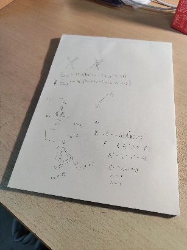
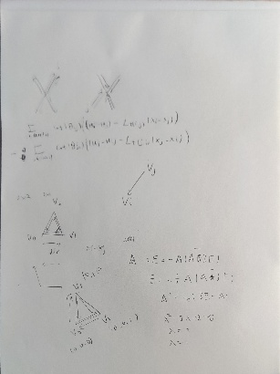

# OpenCV

## 基本介绍

OpenCV 是一个开源的图像处理库，支持 C/C++ 以及 Python 等语言接口。由于底层使用 C/C++，使用 Python 安装使用 OpenCV 库性能仍然有保障。


### 配置安装

进入虚拟环境后执行

```shell
(.venv) $ pip install opencv-python==3.4.1.15
```

因为 3.4.2 之后有些算法申请了专利，因此建议安装这个版本防止有些函数被删除。要求 python 版本为 3.6 才行，否则还是执行

```shell
(.venv) $ pip install opencv-python
```


可选安装扩展包

```shell
(.venv) $ pip install opencv-contrib-python==3.4.1.15
```


执行安装 opencv-python 后，需要调整 numpy 库的版本。执行

```shell
(.venv) $ pip install numpy==1.23.5
```

这样才能使 opencv 和 numpy 兼容。


### 创建窗口

我们先创建一个简单的窗口

```python
import cv2

cv2.namedWindow('window', cv2.WINDOW_NORMAL)
cv2.resizeWindow('window', 800, 600)
cv2.imshow('window', 0)

# waitKey 指定等待按键的时间，单位为 ms；0 表示一直等待按键。返回按键对应的整数
key = cv2.waitKey(0)
if key == ord('q'):
    print('准备销毁窗口')
    cv2.destroyAllWindows()
```

当输入 `q` 键就会销毁所有窗口。


有些退出代码会写成

```python
if key & 0xFF == ord('q'):
    print('准备销毁窗口')
    cv2.destroyAllWindows()
```

这是因为 ASCII 码只有 8 位，而 int 有 16 位，在 C/C++ 等语言中，需要用 0xFF 来转换，但是 python 不需要。


我们经常直接点击右上角的叉号退出程序，这时候如果不销毁资源可能就会报错。因此应该检查窗口状态，例如

```python
if cv2.getWindowProperty('window', cv2.WND_PROP_VISIBLE) != 1:
    cv2.destroyAllWindows()
```

检查到 window 窗口不可见就销毁所有窗口。


### 加载图像

可以按照如下方式加载并显示图像

```python
import cv2

cv2.namedWindow('window', cv2.WINDOW_NORMAL)
cv2.resizeWindow('window', 800, 600)

xx = cv2.imread('xx.png')
cv2.imshow('xx', xx)
```

注意**路径必须是全英文**，在后面加上销毁窗口的代码。为了便于重用，我们将其封装为一个函数

```python
def cv_show(name, img):
    cv2.imshow(name, img)
    key = cv2.waitKey(0)
    if key == ord('q') or cv2.getWindowProperty(name, cv2.WND_PROP_VISIBLE) != 1:
        cv2.destroyAllWindows()
```

然后代码可以简化为

```python
xx = cv2.imread('xx.png')
cv_show('xx', xx)
```


如果直接通过 Python 文件读取，可以进行转换

```python
with open(file, 'rb') as f:
	bytes = f.read()
    
arr = np.frombuffer(bytes, np.uint8)
img = cv2.imdecode(arr, cv2.IMREAD_COLOR)
```


### 保存图像

如果需要保存图片，使用

```python
cv2.imwrite('xiang.png', xx)
```

可以指定保存的类型以及质量，例如

```python
# 质量范围从 0 到 100，100 表示最高质量
quality = 10  
cv2.imwrite("output.jpg", img, [cv2.IMWRITE_JPEG_QUALITY, quality])
```


### 读取视频

使用 OpenCV 可以开启摄像头来读取每一帧

```python
import cv2

# 设置窗口属性
cv2.namedWindow('video', cv2.WINDOW_NORMAL)
cv2.resizeWindow('video', 640, 480)

# 打开 0 号摄像头
cap = cv2.VideoCapture(0)

while cap.isOpened():
    # 读取一帧数据，ret 存放是否读到数据
    ret, frame = cap.read()
	
    # 未读取就退出
    if not ret:
        break
	
    # 显示这一帧
    cv2.imshow('video', frame)
    
    # 每隔 10 毫秒就停止等待，按 q 退出读取
    key = cv2.waitKey(10)
    if key == ord('q'):
        break
        
    if cv2.getWindowProperty('video', cv2.WND_PROP_VISIBLE) != 1:
        break

# 释放资源
cap.release()
cv2.destroyAllWindows()
```


如果要打开视频，只需要改为

```python
import cv2

cv2.namedWindow('video', cv2.WINDOW_NORMAL)

# 打开视频文件
cap = cv2.VideoCapture('movie.mp4')

while cap.isOpened():
    # 读取一帧数据，ret 存放是否读到数据
    ret, frame = cap.read()

    if not ret:
        break

    cv2.imshow('video', frame)
    
    # 以 60 帧播放
    key = cv2.waitKey(1000 // 60)
    if key == ord('q'):
        break
        
    if cv2.getWindowProperty('video', cv2.WND_PROP_VISIBLE) != 1:
        break

cap.release()
cv2.destroyAllWindows()
```


### 视频录制

创建 VideoWriter_fourcc 对象保存视频数据，VideoWriter 写入视频数据

```python
import cv2

cv2.namedWindow('video', cv2.WINDOW_NORMAL)
cap = cv2.VideoCapture(0)

# 指定视频数据格式为 mp4
fourcc = cv2.VideoWriter_fourcc(*'mp4v')

# 保存为 20 帧视频文件，注意分辨率
vw = cv2.VideoWriter('output.mp4', fourcc, 20, (640, 480))

while cap.isOpened():
    # 读取一帧数据，ret 存放是否读到数据
    ret, frame = cap.read()

    if not ret:
        break
    
    # 写入帧数据
    vw.write(frame)

    # 显示摄像图像
    cv2.imshow('video', frame)
    
    # 以 60 帧播放
    key = cv2.waitKey(1000 // 60)
    if key == ord('q'):
        break
        
    if cv2.getWindowProperty('video', cv2.WND_PROP_VISIBLE) != 1:
        break

# 释放资源
cap.release()
vw.release()
cv2.destroyAllWindows()
```


### 鼠标消息

OpenCV 允许对窗口上的鼠标动作进行响应，使用注册函数

```python
setMouseCallback(window_name, callback, userdata)
```

注册处理鼠标事件的回调函数

```python
callback(event, x, y, flags, userdata)
```

这里 userdata 是通过 setMouseCallback 传入的参数。flags 用于组合键，可选

| flags               | 含义     |
| ------------------- | -------- |
| EVENT_FLAG_LBUTTON  | 鼠标左键 |
| EVENT_FLAG_RBUTTON  | 鼠标右键 |
| EVENT_FLAG_MBUTTON  | 鼠标滚轮 |
| EVENT_FLAG_CTRLKEY  | ctrl 键  |
| EVENT_FLAG_SHIFTKEY | shift 键 |
| EVENT_FLAG_ALTKEY   | alt 键   |


例如我们打印出所有鼠标事件

```python
import cv2
import numpy as np

# 自定义回调函数
def mouse_callback(event, x, y, flags, userdata):
    print(event, x, y, flags, userdata)

cv2.namedWindow('mouse', cv2.WINDOW_NORMAL)
cv2.resizeWindow('mouse', 640, 360)

# 设置回调函数
cv2.setMouseCallback('mouse', mouse_callback, '123')

# 生成 640 x 360 全黑图片
img = np.zeros((360, 640, 3), np.uint8)
while True:
    cv2.imshow('mouse', img)
    key = cv2.waitKey(1)
    if key == ord('q'):
        break

    if cv2.getWindowProperty('mouse', cv2.WND_PROP_VISIBLE) != 1:
        break

cv2.destroyAllWindows()
```


### Trackbar 控件

创建可拖动控件 Trackbar 可以方便处理输入参数。主要使用

```python
createTrackbar(name, window_name, value, count, callback)
getTrackbarPos(name, window_name)
```

其中 value 为控件默认值，count 为最大值，最小值为 0 。


例如我们实现拖动滑块显示不同颜色的效果

```python
import cv2
import numpy as np

# 自定义回调函数
def callback(value):
    print(value)

cv2.namedWindow('trackbar', cv2.WINDOW_NORMAL)
cv2.resizeWindow('trackbar', 640, 480)

cv2.createTrackbar('R', 'trackbar', 0, 255, callback)
cv2.createTrackbar('G', 'trackbar', 0, 255, callback)
cv2.createTrackbar('B', 'trackbar', 0, 255, callback)

# 生成 640 x 480 全黑图片
img = np.zeros((480, 640, 3), np.uint8)
while True:
    # 获得当前 trackbar 的值
    r = cv2.getTrackbarPos('R', 'trackbar')
    g = cv2.getTrackbarPos('G', 'trackbar')
    b = cv2.getTrackbarPos('B', 'trackbar')

    # 修改背景颜色，注意 opencv 使用 bgr 颜色顺序
    img[:] = [b, g, r]
    cv2.imshow('trackbar', img)

    key = cv2.waitKey(1)
    if key == ord('q'):
        break

    if cv2.getWindowProperty('trackbar', cv2.WND_PROP_VISIBLE) != 1:
        break

cv2.destroyAllWindows()
```

这里 `img[:]` 就是对数组中所有元素赋值的方法，每个元素设为 `[b, g, r]` 。


## 数据结构

### 颜色空间

OpenCV 使用最多的色彩空间是 HSV 。HSV 提供了颜色选择的直接方案，用于图像处理、分形图片、光线追踪等。它由

* 色调 Hue——底色，决定色彩不同的主要因子
* 饱和度 Saturation——颜色的纯度，添加白色会减小纯度
* 亮度 Value of brightness——添加黑色减小亮度

构成色调空间，比 RGB 更加友好。


色彩通过角度表示，饱和度参数由到中心的距离决定，明度值由顶点向上增加。


例如将默认读取的 BGR 格式转换为其它格式

```python
import cv2

def callback(value):
    pass

cv2.namedWindow('color', cv2.WINDOW_NORMAL)
cv2.resizeWindow('color', 640, 480)

# 默认读取为 BGR 格式（RGB）
img = cv2.imread('xx.png')

# 定义转换颜色空间的列表
colorspaces = [
    cv2.COLOR_BGR2RGBA, cv2.COLOR_BGR2BGRA,
    cv2.COLOR_BGR2GRAY, cv2.COLOR_BGR2HSV,
    cv2.COLOR_BGR2YUV
]

# 设置 trackbar
cv2.createTrackbar('trackbar', 'color', 0, 4, callback)

while True:
    index = cv2.getTrackbarPos('trackbar', 'color')

    cvt_img = cv2.cvtColor(img, colorspaces[index])
    cv2.imshow('color', cvt_img)

    key = cv2.waitKey(1)
    if key == ord('q'):
        break
        
    if cv2.getWindowProperty('color', cv2.WND_PROP_VISIBLE) != 1:
        break

cv2.destroyAllWindows()
```


### Mat 数据结构

Mat 是 OpenCV 在 C++ 语言中表示图像数据的一种数据结构。在 Python 中，Mat 转换为 numpy 的 ndarray 结构。

| 属性  | 作用       | 属性     | 作用     |
| ----- | ---------- | -------- | -------- |
| dims  | 维度       | channels | 通道数   |
| rows  | 行数       | size     | 矩阵大小 |
| cols  | 列数       | type     | 类型     |
| depth | 像素的位深 | data     | 存放数据 |

在 opencv-python 中可以直接访问其中一些属性，例如

```python
img.ndim	# 通道数
img.data	# 存放数据
img.shape	# 数据尺寸
img.size	# 元素总数
img.dtype	# 类型
```


### 数据转换

可以将 numpy 数组转换为 opencv 图像，例如使用 numpy 读取

```python
arr = np.fromfile(file, dtype=np.uint8)
img = cv2.imdecode(arr, cv2.IMREAD_COLOR)
```

特别地，通过 numpy 读取的数据可以计算大小

```python
kb = arr.size // 1024
```


反之将 opencv 转换为 numpy 数组需要借助 Pillow 库

```python
img = cv2.imread(file)
img = Image.fromarray(img)
arr = np.array(img)
```


我们可以实现一连串的数据转换

```python
# numpy -> opencv(变换通道) -> PIL -> numpy
arr = np.frombuffer(byte, np.uint8)
img = cv2.imdecode(arr, cv2.IMREAD_COLOR)
img = cv2.cvtColor(img, cv2.COLOR_BGR2RGB)
img = Image.fromarray(img)
arr = np.array(img)
```


### 数据拷贝

正如使用 numpy 数组的情况，在复制图像数据时也有深拷贝和浅拷贝的区分。可以通过下面代码观察拷贝效果

```python
import cv2

img = np.zeros((200, 200, 3), np.uint8)

img2 = img.view()   # 浅拷贝
img3 = img.copy()   # 深拷贝

# 修改源图像
img[10:100, 10:100] = [255, 0, 0]

# 将 3 幅图片拼在一起显示
cv2.imshow('img', np.hstack((img, img2, img3)))

cv2.waitKey(0)
cv2.destroyAllWindows()
```

可以看到浅拷贝的图像和修改后的源图像相同，说明它们仍然共用数据；只有深拷贝保持了修改前的数据。


### 通道操作

我们可以对通道进行分割，分别处理以后再合并

```python
import cv2

# 创建黑色图片
img = np.zeros((200, 200, 3), np.uint8)

# 分割通道
b, g, r = cv2.split(img)

# 修改通道
b[10:100, 10:100] = 255
g[10:100, 10:100] = 255

# 合并通道
img2 = cv2.merge((b, g, r))

cv2.imshow('img', np.hstack((b, g)))
cv2.imshow('img2', np.hstack((img, img2)))

cv2.waitKey(0)
cv2.destroyAllWindows()
```

这里将 b, g 通道的一部分改成 255，它们在第一张图中显示为白色；在第二张图中，通道被合并显示


## 绘制操作

### 直线

通过直线方法绘制执行

```python
cv2.line(img, pt1, pt2, color, thickness, lineType)
```

其中 thickness 指定宽度，lineType 指定线型，只能取 4, 8, 16 等值。

```python
import cv2

# 创建黑色图片
img = np.zeros((200, 200, 3), np.uint8)

# 画线
cv2.line(img, (10, 20), (100, 100), (0, 0, 255), 5, 4)
cv2.line(img, (50, 80), (100, 100), (0, 0, 255), 5, 16)

cv2.imshow('img', img)

cv2.waitKey(0)
cv2.destroyAllWindows()
```

注意 color 属于 BGR 颜色空间。


### 矩形和圆

矩形和圆的方法

```python
cv2.rectangle(img, left_top, right_bottom, color, thickness, lineType)
cv2.circle(img, center, radius, color, thickness, lineType)
```

绘制参数与之前基本一致。

```python
cv2.rectangle(img, (10, 10), (100, 100), (0, 0, 255), 5, 16)
cv2.circle(img, (100, 100), 50, (0, 0, 255), 5, 16)
```


### 椭圆

椭圆方法

```python
cv2.ellipse(img, center, (a, b), angle, start_angle, end_angle, color, thickness, lineType)
```

其中 `(a, b)` 是长宽的一半，`angle` 是椭圆的倾斜角，`start_angle, end_angle` 是起始角和终止角。

```python
cv2.ellipse(img, (100, 100), (30, 50), 60, 0, 90, (0, 0, 252), 5, 16)
```


### 多边形

线框多边形方法

```python
cv2.polylines(img, [pts], isClosed, color, thickness, lineType)
```

其中 isClosed 设置是否是封闭多边形。填充多边形使用

```python
cv2.fillPoly(img, [pts], color)
```


先设置 numpy 数组保存点集

```python
import cv2

# 创建黑色图片
img = np.zeros((200, 200, 3), np.uint8)

# 多边形点集，必须是 int32 位
pts = np.array([(180, 10), (100, 150), (50, 100)], np.int32)
cv2.polylines(img, [pts], False, (0, 0, 255), 5, 16)

cv2.imshow('img', img)

cv2.waitKey(0)
cv2.destroyAllWindows()
```


### 文本

文本绘制方法

```python
cv2.putText(img, text, pos, fontType, fontScale, color)
```

其中 fontType 设置字体类型，fontScale 设置缩放倍数。

```python
import cv2

# 创建黑色图片
img = np.zeros((400, 400, 3), np.uint8)

cv2.putText(img, 'Hello World', (50, 200), cv2.FONT_ITALIC, 2, (0, 0, 255))
cv2.imshow('img', img)

cv2.waitKey(0)
cv2.destroyAllWindows()
```


要绘制中文，首先需要安装 Pillow 库

```shell
(.venv) $ pip install pillow
```

先用 Pillow 绘制中文，然后转换使用 opencv 绘图

```python
from PIL import ImageFont, ImageDraw, Image

# 填充白色背景
img = np.full((200, 200, 3), fill_value=255, dtype=np.uint8)

# 创建 Pillow 图像，绘制文本
img_pil = Image.fromarray(img)
draw = ImageDraw.Draw(img_pil)
draw.text((10, 150), '你好，世界！', font=ImageFont.truetype('simfang.ttf', 15), fill=(0, 255, 0, 0))

# 将 Pillow 图像转换为 numpy 数组
img = np.array(img_pil)

# 使用 cv 绘制
cv2.imshow('img', img)

cv2.waitKey(0)
cv2.destroyAllWindows()
```


## 图像变换

### 基本运算

#### 加法运算

可以对具有相同大小、相同通道数的两张图片进行加法操作

```python
import cv2
import numpy as np

img = cv2.imread('background.jpeg')
img2 = cv2.imread('xiangxiang.png')

# 裁剪使得两张图片大小相同
width, height = 800, 800
new_img = img[0:height, 0:width]
new_img2 = img2[0:height, 0:width]

# 加法操作，要求大小相同，通道数相同
res_img = cv2.add(new_img, new_img2)

cv2.imshow('img', res_img)

cv2.waitKey(0)
cv2.destroyAllWindows()
```

加法直接将像素对应的颜色相加，超出 255 的设为 255 。虽然也可以进行减法、乘法和除法运算，但是并不常用。


还可以对单个数字进行计算

```python
res_img += 100
```

这样每个像素颜色都增加 100，但是注意**这里会进行取余**，等价于

```python
(res_img + 100) % 256
```


#### 图像融合

图像融合是对两张图片进行线性组合。例如

```python
res_img = cv2.addWeighted(new_img, 0.4, new_img2, 0.6, 50)
```

组合方程为
$$
Res = Img_1 \times \alpha_1+Img_2\times \alpha_2 + \gamma
$$
其中 $\gamma$ 是偏差值，可以根据实际需要设置。


#### 位运算

在 OpenCV 中的位运算与一般的位运算基本一致，除了非运算

```python
res_img = cv2.bitwise_not(new_img)
```

它等价于 `255 - new_img`，会将图片反相。


其余操作根据实际需要使用

```python
res_img = cv2.bitwise_and(new_img, new_img2)	# 会让图片更暗
res_img = cv2.bitwise_or(new_img, new_img2)		# 会让图片更亮
res_img = cv2.bitwise_xor(new_img, new_img2)	# 会让不同的位置更亮，相同的位置更暗
```


#### 掩码运算

在位运算的同时可以传入掩码，每个位运算得到结果都会与对应的掩码进行位运算。例如

```python
import cv2
import numpy as np

img = cv2.imread('xiangxiang.png')
img = img[0:500, 0:500]

# 黑白掩码
mask = np.full((500, 500), fill_value=255, dtype=np.uint8)
mask[0:200, 0:200] = 0

# 要添加的颜色
logo = np.zeros((500, 500, 3), np.uint8)
logo[0:200, 0:200] = (0, 255, 0)

# 将颜色绘制到掩码位置
img2 = cv2.bitwise_and(img, img, mask=mask)
img2 = cv2.add(img2, logo)

cv2.imshow('img', img2)

cv2.waitKey(0)
cv2.destroyAllWindows()
```

注意掩码的每个元素是一个数而不是向量。这里 img 与自己进行与运算，结果与 mask 进行与运算，因此黑色掩码位置就被清除。最后再加上 logo，就可以将其填充到黑色部分。


#### 阈值分割

使用 threshold 方法对图像进行阈值分割

```python
retval, dst = cv2.threshold(img, threshold, maxval, type)
```

其中 threshold 指定阈值，maxval 指定输出最大值，通常为 255，type 指定分割方法。

| 分割方法          | 作用                             |
| ----------------- | -------------------------------- |
| THRESH_BINARY     | 超出阈值则返回最大值，否则返回 0 |
| THRESH_BINARY_INV | 超出阈值则返回 0，否则返回最大值 |
| THRESH_TRUNC      | 超出阈值则返回阈值，否则不变     |
| THRESH_TOZERO     | 超出阈值则不变，否则返回 0       |
| THRESH_TOZERO_INV | 超出阈值则返回 0，否则不变       |


例如阈值二值化

```python
retval, img2 = cv2.threshold(img, 127, 255, cv2.THRESH_BINARY)
```


### 仿射变换

#### 缩放

缩放方法是

```python
cv2.resize(img, dsize[, dst[, fx[, fy[, interpolation]]]])
```

其中 dsize 指定缩放后的大小，dst 输出图片，`fx, fy` 指定缩放比例，interpolation 指定插值算法

| 算法          | 作用                                |
| ------------- | ----------------------------------- |
| INTER_NEAREST | 最近点插值                          |
| INTER_LINEAR  | 双线性插值，使用 4 个点插值（默认） |
| INTER_CUBIC   | 三次插值，使用 16 个点插值          |
| INTER_AREA    | 区域插值，效果最好，计算最慢        |


例如指定大小进行缩放

```python
import cv2
import numpy as np

img = cv2.imread('xiangxiang.png')
res_img = cv2.resize(img, (800, 600))

cv2.imshow('img', res_img)

cv2.waitKey(0)
cv2.destroyAllWindows()
```

指定 dsize 为空，通过位置参数设置缩放比例

```python
res_img = cv2.resize(img, dsize=None, fx=0.1, fy=0.1)
```


#### 翻转

翻转操作有 3 种

```python
img2 = cv2.flip(img, 0)
```

根据第二个参数决定

* 0 表示上下翻转
* `>0` 表示左右翻转
* `<0` 表示上下左右翻转


#### 旋转

旋转操作也有 3 种

```python
img2 = cv2.rotate(img, cv2.ROTATE_180)
```

根据第二个参数决定

* ROTATE_180 转 180 度
* ROTATE_90_CLOCKWISE 顺时针转 90 度
* ROTATE_90_COUNTERCLOCKWISE 逆时针转 90 度

注意旋转以后长宽可能发生变化。


#### 仿射平移

可以直接调用仿射变换函数来进行变换

```python
cv2.warpAffine(src, M, dsize, flags, mode, value)
```

其中 M 是变换矩阵，dsize 是输出图片大小，flags 是插值算法，mode 是边界外推法标记，value 填充边界值。


变换在齐次坐标下进行，因此仿射变换形如
$$
\begin{bmatrix}
\hat x\\
\hat y\\
1
\end{bmatrix}
=
M
\begin{bmatrix}
x\\
y\\
1
\end{bmatrix}
$$
在 opencv 中变换矩阵必须至少是 float32 位。例如平移变换

```python
import cv2
import numpy as np

img = cv2.imread('xiangxiang.png')
img = img[2000:2600, 3800:4800]

# 平移矩阵
M = np.float32([[1, 0, 200], [0, 1, 0]])

# 注意宽高顺序
h, w, channel = img.shape
img2 = cv2.warpAffine(img, M, dsize=(w, h))

cv2.imshow('img', img2)

cv2.waitKey(0)
cv2.destroyAllWindows()
```

由于 M 的最后一行总是固定的 $(0,0,1)$，因此这里可以省略。


#### 仿射旋转

进行旋转时，可以先获得旋转矩阵

```python
M = cv2.getRotationMatrix2D((100, 100), 15, 1)
```

三个参数分别指定旋转中心、旋转角和伸缩比。

 

#### 仿射变换

可以通过 3 个点的映射关系来获得变换矩阵

```python
src = np.float32([[200, 100], [30, 100], [500, 600]])
dst = np.float32([[100, 150], [80, 120], [300, 200]])
M = cv2.getAffineTransform(src, dst)
```


#### 透视变换

可以通过 4 个点的映射关系获得透视变换矩阵，主要目的是将由于透视变形的图像**变正**

```python
import cv2
import numpy as np

img = cv2.imread('notebook.jpg')

# 透视矩阵
h, w, channel = img.shape
src = np.float32([[102, 56], [281, 69], [11, 305], [295, 353]])
dst = np.float32([[0, 0], [w, 0], [0, h], [w, h]])
M = cv2.getPerspectiveTransform(src, dst)

# 注意宽高顺序
img2 = cv2.warpPerspective(img, M, dsize=(w, h))

cv2.imshow('img', img2)

cv2.waitKey(0)
cv2.destroyAllWindows()
```

<div style="text-align: center;">
    
    
</div>


### 卷积变换

卷积变换就是通过将图像数据与卷积核做内积得到的结果。


由于经过处理后图像会变小，因此通常会在图像边界填充几圈零。假设输入图像的规模为 $H_1\times W_1$，卷积核尺寸为 $F$，步长为 $S$，边界填充零的尺寸为 $P$，则输出尺寸满足
$$
\begin{aligned}
H_2 &= (H_1-F+2P) / S + 1\\
W_2 &= (W_1-F+2P) / S + 1
\end{aligned}
$$
假设步长为 1，则要令 $H_2=H_2,W_2=W_1$，需要 $P=(F-1)/2$，因此卷积核通常为奇数。


卷积函数为

```python
cv2.filter2D(src, ddepth, kernel[, dst[, anchor[, delta[, borderType]]]])
```

其中 

* ddepth 表示输出图片的位深，即数据类型，一般设为 -1，表示与原图一致；
* kernel 表示卷积核大小
* anchor 是锚点，即卷积核的中心点，默认为 `(-1,-1)`
* delta 是卷积后的偏移值，默认为零
* borderType 是边界类型，一般不用

例如生成并执行一个均值卷积

```python
import cv2
import numpy as np

img = cv2.imread('xiangxiang.png')
img2 = img[2000:2600, 3800:4800]

# 核必须是 float 型
kernel = np.ones((5, 5), np.float32) / 25

# 卷积操作
img2 = cv2.filter2D(img2, -1, kernel)

cv2.imshow('img', img2)

cv2.waitKey(0)
cv2.destroyAllWindows()
```


#### 方盒滤波

方盒滤波函数

```python
cv2.boxFilter(src, ddepth, ksize[, dst[, anchor[, normalize[, borderType]]]])
```

它将执行一个如下形式的卷积核
$$
K = a
\begin{bmatrix}
1 & 1 & \cdots & 1\\
1 & 1 & \cdots & 1\\
\vdots & \vdots & & \vdots\\
1 & 1 & \cdots & 1
\end{bmatrix}
$$
其中 ksize 指定核的尺寸，normalize 指定是否进行归一化，当其为 True 时就得到均值滤波。例如

```python
import cv2
import numpy as np

img = cv2.imread('xiangxiang.png')
img2 = img[2000:2600, 3800:4800]

# 直接执行方盒滤波
img2 = cv2.boxFilter(img2, -1, (5, 5), normalize=True)

cv2.imshow('img', img2)

cv2.waitKey(0)
cv2.destroyAllWindows()
```


#### 均值滤波

均值滤波函数

```python
cv2.blur(src, ksize[, dst[, anchor[, borderType]]])
```

注意没有 ddepth 和 normalize 参数

```python
import cv2
import numpy as np

img = cv2.imread('xiangxiang.png')
img2 = img[2000:2600, 3800:4800]

# 直接执行均值滤波
img2 = cv2.blur(img2, (5, 5))

cv2.imshow('img', img2)

cv2.waitKey(0)
cv2.destroyAllWindows()
```


#### 高斯滤波

高斯滤波函数

```python
cv2.GaussianBlur(src, ksize, sigmaX[, dst[, sigmaY[, borderType]]])
```

其中 ksize 指定核的大小，sigmaX 指定标准差，sigmaY 默认等于 sigmaX 。例如

```python
import cv2
import numpy as np

img = cv2.imread('xiangxiang.png')
img2 = img[2000:2600, 3800:4800]

img2 = cv2.GaussianBlur(img2, (5, 5), 5)

cv2.imshow('img', img2)

cv2.waitKey(0)
cv2.destroyAllWindows()
```


#### 中值滤波

中值滤波选择卷积核范围内的中位数作为输出结果，可以处理大量点状的噪声。例如

```python
import cv2
import numpy as np

img = cv2.imread('xiangxiang.png')
img2 = img[2000:2600, 3800:4800]

img2 = cv2.medianBlur(img2, 5)

cv2.imshow('img', img2)

cv2.waitKey(0)
cv2.destroyAllWindows()
```

只需要指定核的尺寸即可。


#### 双边滤波

双边滤波对图像的边缘信息能更好地保存，它将一个空间高斯函数与灰度高斯函数相乘
$$
\exp\left({-\frac{(x_i-x_c)^2+(y_i-y_c)^2}{2\sigma_s^2}}\right)\cdot \exp\left({-\frac{(gray(x_i,y_i)-gray(x_c,y_c))^2}{2\sigma_c^2}}\right)
$$
其中 $(x_i,y_i)$ 是当前点，$(x_c,y_c)$ 是中心点，$gray(x,y)$ 是点的灰度值。通过增加考虑灰度值，将会在边界的一侧正常进行高斯滤波，而在另一侧几乎不进行高斯滤波，因此边界不会消失，从而**只在灰度值平缓的位置**减少噪声。


滤波函数

```python
cv2.bilateralFilter(src, d, sigmaColor, sigmaSpace[, dst[, borderType]])
```

其中 sigmaColor 指定 $\sigma_c$，而 sigmaSpace 指定 $\sigma_s$，d 指定检查像素的直径，通常取奇数。例如

```python
import cv2
import numpy as np

img = cv2.imread('xiangxiang.png')
img2 = img[2000:2600, 3800:4800]

img2 = cv2.bilateralFilter(img2, 7, 50, 50)

cv2.imshow('img', img2)

cv2.waitKey(0)
cv2.destroyAllWindows()
```


### 高通滤波

前面介绍的卷积核一般称为**低通滤波**，主要用来处理噪声。现在我们将介绍用于识别边界的高通滤波。


#### 索贝尔 Sobel 算子

为了查找边界，也就是灰度值变化快的地方，Sobel 算子对图像求导，寻找变化率最大的位置。使用两个卷积核
$$
G_x = 
\begin{bmatrix}
-1 & 0 & 1\\
-2 & 0 & 2\\
-1 & 0 & 1
\end{bmatrix},\quad
G_y = 
\begin{bmatrix}
-1 & -2 & -1\\
0 & 0 & 0\\
1 & 2 & 1
\end{bmatrix}
$$
分别近似两个方向上的导数，然后估计
$$
G = \sqrt{G_x^2+G_y^2}\quad \mathrm{or}\quad |G_x|+|G_y|
$$
作为像素灰度的梯度变化率。


算子函数

```python
cv2.Sobel(src, ddepth, dx, dy[, dst[, ksize[, scale[, delta[, borderType]]]]])
```

其中 dx, dy 用来指定在哪个方向上计算。例如我们分别使用 Sobel 计算两个方向上的边界，然后将它们合并

```python
import cv2
import numpy as np

img = cv2.imread('xiangxiang.png')
img2 = img[2000:2600, 3800:4800]

# 分别计算 x,y 的梯度
dx = cv2.Sobel(img2, cv2.CV_64F, 1, 0, ksize=5)
dy = cv2.Sobel(img2, cv2.CV_64F, 0, 1, ksize=5)

# 合并检测结果
img2 = cv2.add(dx, dy)

cv2.imshow('img', img2)

cv2.waitKey(0)
cv2.destroyAllWindows()
```

这里 ddepth 可以直接取 -1 表示与原图类型相同。注意**必须分别计算两个方向，然后合并**。


#### 沙尔 Scharr 算子

当内核为 3 时，Sobel 算子的近似效果并不好。Scharr 算子是一个内核为 3 的函数，它计算结果更精确，且效率与 Sobel 算子相当。它仅仅放大了差分倍数
$$
G_x = 
\begin{bmatrix}
-3 & 0 & 3\\
-10 & 0 & 10\\
-3 & 0 & 3
\end{bmatrix},\quad
G_y = 
\begin{bmatrix}
-3 & -10 & -3\\
0 & 0 & 0\\
3 & 10 & 3
\end{bmatrix}
$$
它主要用来检测较细的边界

```python
import cv2
import numpy as np

img = cv2.imread('xiangxiang.png')
img2 = img[2000:2600, 3800:4800]

# 分别计算 x,y 的梯度
dx = cv2.Scharr(img2, cv2.CV_64F, 1, 0)
dy = cv2.Scharr(img2, cv2.CV_64F, 0, 1)

img2 = cv2.add(dx, dy)

cv2.imshow('img', img2)

cv2.waitKey(0)
cv2.destroyAllWindows()
```


#### 拉普拉斯算子

拉普拉斯算子检测二阶导为零的位置，通常就是边界。它使用卷积核
$$
L = 
\begin{bmatrix}
0 & 1 & 0\\
1 & -4 & 1\\
0 & 1 & 0
\end{bmatrix}
$$
其算子函数形式与 Sobel 算子相同。例如

```python
import cv2
import numpy as np

img = cv2.imread('xiangxiang.png')
img2 = img[2000:2600, 3800:4800]

# Laplace
img2 = cv2.Laplacian(img2, -1, ksize=3)

cv2.imshow('img', img2)

cv2.waitKey(0)
cv2.destroyAllWindows()
```


#### Canny 算子

为了提高边缘检测的效果，通常会先进行去噪。然后 Canny 算子在 x,y 两个方向上的梯度的基础上，计算梯度的方向。显然梯度方向与边界垂直，因此检测并保留具有相同方向的点的局部极大值。通过用户指定的 minVal, maxVal 作为检测阈值，大于 maxVal 的点会被保留，连接大于 maxVal 的点也会被保留。


算子函数

```python
cv2.Canny(src, threshold1, threshold2)
```

两个阈值分别对应最小值和最大值，更小的阈值会保留更多信息。例如

```python
import cv2
import numpy as np

img = cv2.imread('xiangxiang.png')
img2 = img[2000:2600, 3800:4800]

# Canny
img2 = cv2.Canny(img2, 100, 200)

cv2.imshow('img', img2)

cv2.waitKey(0)
cv2.destroyAllWindows()
```


