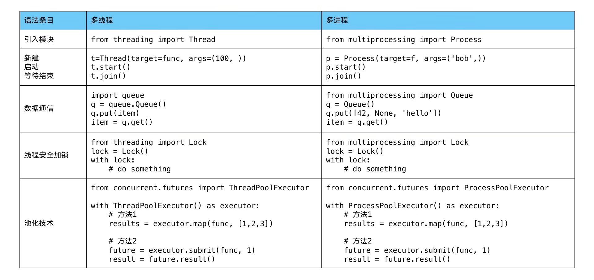

# 并发编程

## 基本介绍

在使用 Python 进行爬虫、IO 等操作时，可以通过多线程并发的方式大幅提高运行效率。根据 CPU 和 IO 的运行限制可以将计算分为

* CPU 密集型 (CPU-bound)：指 IO 可以在很短时间内完成，CPU 需要大量计算和处理，特点是 CPU 占用率高。例如压缩解压缩、加密解密、正则表达式搜索
* IO 密集型 (IO bound)：指系统大部分状况是 CPU 等待 IO 操作，CPU 占用率依然很低。例如文件处理程序、网络爬虫程序、读写数据库程序


并发编程主要有三种方式

* 多进程 Process：一个进程中可以启动多个线程
    * 用多核 CPU 并行计算
    * 占用资源最多，可启动数目比线程少
    * 适用于 CPU 密集型计算
* 多线程 Thread：一个线程中可以启动多个协程
    * 相比进程更轻量级、占用资源少
    * 只能并发执行，不能利用多 CPU (GIL)
    * 相比协程，启动数目有限制、占用内存资源、有线程切换开销
    * 适用于 IO 密集型计算、同时运行的任务数目要求不多
* 多协程 Coroutine
    * 内存开销最少、启动协程数量最多
    * 支持的库有限制、代码实现复杂
    * 适用于 IO 密集型计算，需要超多任务运行、但有现成库支持的场景


## GIL

全局解释器锁 GIL 是计算机程序设计语言解释器用于同步线程的一种机制，它使得任何时刻仅有一个线程在执行。即使在多核心处理器上，使用 GIL 的解释器也只允许同一时间执行一个线程。由于 GIL 的存在，在 CPU 运行时多线程不会加速。然而，GIL 在 IO 时会释放，因此**对于 IO 密集型程序运行可以实现加速**。

.jpg|500)

Python 中对象通过引用计数器进行管理，当引用数为 0 时则会释放对象。在设计初期，为了规避并发问题而引入 GIL，但是现在已经无法去除。好处是简化了对共享资源的管理。


## 多线程

### 创建线程

要创建线程，需要导入 threading 库

```python
import threading

def func(a, b):
    print(a, b)

# 创建线程，指定函数和参数
t = threading.Thread(target=func, args=(100, 200))
t.start()	# 启动线程
t.join()	# 等待结束
```

当调用 join 方法时，程序会等待直到对应线程结束。


### 爬虫加速

爬取博客园网页的简易代码如下

```python
# spider.py
import requests

# 生成 50 页网址
urls = [f"https://www.cnblogs.com/#p{page}" for page in range(1, 50 + 1)]

def craw(url):
    r = requests.get(url)
    print(url, len(r.text))

```

将爬取代码作为一个模块，引入 main.py

```python
import spider
import threading
import time

# 单线程
def single_thread():
    for url in spider.urls:
        spider.craw(url)

    print('single_thread end')


# 多线程
def multi_thread():
    threads = []
    for url in spider.urls:
        # 注意参数加 , 表示元组
        threads.append(
            threading.Thread(target=spider.craw, args=(url, ))
        )

    # 开始线程
    for thread in threads:
        thread.start()

    # 等待结束
    for thread in threads:
        thread.join()

    print('multi_thread end')


if __name__ == '__main__':
    start = time.time()
    single_thread()
    end = time.time()
    print("single_thread cost:",  end - start, "seconds.")

    start = time.time()
    multi_thread()
    end = time.time()
    print("multi_thread cost:",  end - start, "seconds.")
```

可以看到加速效果非常明显

```shell
single_thread cost: 2.429359197616577 seconds.
multi_thread cost: 0.18415284156799316 seconds.
```


### 生产消费爬虫

通常我们爬取到数据后，应该对数据进行处理。当通过线程加速爬取后，将数据存放起来，再由其它线程处理存放的数据。爬取和解析博客园网页的模块如下

```python
# spider.py
import requests
from bs4 import BeautifulSoup

# 生成 50 页网址
urls = [f"https://www.cnblogs.com/#p{page}" for page in range(1, 50 + 1)]

# 爬取网页，返回源码
def craw(url):
    r = requests.get(url)
    return r.text


def parse(html):
    # 使用 parser 解析网页
    soup = BeautifulSoup(html, "html.parser")
    links = soup.find_all("a", class_="post-item-title")
    return [(link["href"], link.get_text()) for link in links]

```

利用 queue 队列库保存数据队列，实现多线程爬取和解析

```python
import spider
import time
import random
import queue
import threading

# 爬取函数 craw
def craw(url_queue: queue.Queue, html_queue: queue.Queue):
    while True:
        # 爬取数据，然后传入解析队列
        url = url_queue.get()
        html = spider.craw(url)
        html_queue.put(html)

        # 打印当前线程信息
        print(threading.current_thread().name, f"craw {url}", "url_queue.size=", url_queue.qsize())
        time.sleep(random.randint(1, 2))


# 解析函数 parse
def parse(html_queue: queue.Queue, fout):
    while True:
        # 获取数据，进行解析，输入到文件流 fout 中
        html = html_queue.get()
        results = spider.parse(html)
        for result in results:
            fout.write(str(result) + '\n')

        # 打印当前线程信息
        print(threading.current_thread().name, f"results.size=", len(results), "html_queue.size=", html_queue.qsize())
        time.sleep(random.randint(1, 2))


if __name__ == '__main__':
    url_queue = queue.Queue()
    html_queue = queue.Queue()

    # 初始化网址队列
    for url in spider.urls:
        url_queue.put(url)

    # 设置 3 个线程爬取
    for idx in range(3):
        t = threading.Thread(target=craw, args=(url_queue, html_queue), name=f"carw{idx}")
        t.start()

    # 设置 3 个线程解析
    fout = open("data.txt", "w")
    for idx in range(3):
        t = threading.Thread(target=parse, args=(html_queue, fout), name=f"parse{idx}")
        t.start()
```


### 线程安全

当多个线程处理同一个变量时，可能导致对变量的操作错误。为了防止出现这种情况，就需要锁定内存。例如

```python
import threading
import time

class Account:
    def __init__(self, balance):
        self.balance = balance


def draw(account: Account, amount):
    if account.balance >= amount:
        # 等待，确保会出错
        time.sleep(0.1)
        account.balance -= amount
        print(threading.current_thread().name, '取钱成功\n', '余额：', account.balance)
    else:
        print(threading.current_thread().name, '取钱失败，余额不足')


if __name__ == '__main__':
    account = Account(1000)
    ta = threading.Thread(name="ta", target=draw, args=(account, 800))
    tb = threading.Thread(name="tb", target=draw, args=(account, 800))

    ta.start()
    tb.start()

    ta.join()
    tb.join()
```

这里两个线程同时进入 if 语句，导致取出两次。只要在需要保护的位置添加线程锁，就可以确保线程安全

```python
import threading
import time

# 线程锁
lock = threading.Lock()

class Account:
    def __init__(self, balance):
        self.balance = balance


def draw(account: Account, amount):
    # 启用线程锁
    with lock:
        if account.balance >= amount:
            # 等待，确保会出错
            time.sleep(0.1)
            account.balance -= amount
            print(threading.current_thread().name, '取钱成功\n', '余额：', account.balance)
        else:
            print(threading.current_thread().name, '取钱失败，余额不足')


if __name__ == '__main__':
    account = Account(1000)
    ta = threading.Thread(name="ta", target=draw, args=(account, 800))
    tb = threading.Thread(name="tb", target=draw, args=(account, 800))

    ta.start()
    tb.start()

    ta.join()
    tb.join()
```


### 线程池

线程在创建和销毁过程中会耗费大量资源，当需要建立大量线程时，重复地分配和回收操作开销很大。线程池由有限个线程组成，任务通过队列保存，每当一个线程执行完毕，就自动从队列出获得新的任务，从而实现线程复用。


使用线程池能够

* 提升性能
* 防止线程过多导致系统负荷过大
* 代码更加简洁

适用于突发性大量请求或需要大量线程完成任务、但实际任务处理时间较短的场景。


线程池需要引入模块

```python
from concurrent.futures import ThreadPoolExecutor, as_completed
```

主要有两种用法

```python
# 使用 map 函数
with ThreadPoolExecutor() as pool:
    results = pool.map(craw, urls)

    for result in results:
        print(result)
        
# 使用 future 模式
with ThreadPoolExecutor() as pool:
    futures = [pool.submit(craw, url) for url in urls]

    for future in futures:
        print(future.result())

    for future in as_completed(futures):
        print(future.result())
```

其中 urls 是参数列表，map 按照传入参数的顺序返回结果，as_completed 按照线程完成的顺序返回结果。


例如使用线程池的 map 方法进行爬取，使用 as_completed 方法按照线程完成的顺序返回结果

```python
import threading
import spider
from concurrent.futures import ThreadPoolExecutor, as_completed

# craw
with ThreadPoolExecutor() as pool:
    # 传入参数，将网址和返回结果拼在一起
    htmls = pool.map(spider.craw, spider.urls)
    htmls = list(zip(spider.urls, htmls))

    for url, html in htmls:
        print(url, len(html))

print("craw over")

# parse
with ThreadPoolExecutor() as pool:
    futures = {}
    for url, html in htmls:
        # 传入网页源码
        future = pool.submit(spider.parse, html)
        futures[future] = url

    # 获得按照传入顺序返回的结果（遍历键值对）
    # for future, url in futures.items():
    #     print(url, future.result())

    # 获得按照完成顺序返回的结果（遍历 key）
    for future in as_completed(futures):
        url = futures[future]
        print(url, future.result())

print("parse over")
```


### 守护线程

使用线程时，有可能遇到需要长时间运行，不知道什么时候停止线程的情况。为了便于回收线程，可以启用守护线程。例如

```python
tr = Thread(target=self.update)
tr.daemon = True
tr.start()
```

虽然我们没有调用 join 方法指定程序等待，但是启用守护线程可以让主程序结束之后释放子线程。


## 多进程

多进程适用于 CPU 密集型计算。多进程的方法与多线程的方法使用基本一致，这样便于进行代码迁移使用。




### 进程池

例如计算 100 个大整数是否是素数的程序

```python
import math
import threading
import time
from concurrent.futures import ThreadPoolExecutor, ProcessPoolExecutor

PRIMES = [112272535095293] * 100

def is_prime(n):
    if n < 2:
        return False
    if n == 2:
        return True
    if n % 2 == 0:
        return False
    sqrt_n = int(math.floor(math.sqrt(n)))
    for i in range(3, sqrt_n + 1, 2):
        if n % i == 0:
            return False
    return True

# 单线程
def single_thread():
    for number in PRIMES:
        is_prime(number)

# 多线程 + 线程池
def multi_thread():
    with ThreadPoolExecutor() as pool:
        pool.map(is_prime, PRIMES)

# 多进程 + 进程池
def multi_process():
    with ProcessPoolExecutor() as pool:
        pool.map(is_prime, PRIMES)


if __name__ == '__main__':
    start = time.time()
    single_thread()
    end = time.time()
    print('single_thread, cost:', end - start, 'seconds')

    start = time.time()
    multi_thread()
    end = time.time()
    print('multi_thread, cost:', end - start, 'seconds')

    start = time.time()
    multi_process()
    end = time.time()
    print('multi_process, cost:', end - start, 'seconds')
```


### 守护进程

与守护线程同理，开启守护进程可以让子进程在主程序结束后正常释放

```python
tr = Process(target=deal.run)
tr.daemon = True
tr.start()
```

需要注意守护进程不能创建子进程。


### 管道

开启多进程后，需要在进程之间进行数据交换，这就要通过管道进行。首先引入

```python
from multiprocessing import Pipe
```


管道提供一对连接，用来建立两个进程之间的交互。例如我们建立两个类

```python
from multiprocessing import Pipe
from multiprocessing import Process
import multiprocessing
import time

class A:
    def __init__(self, pipe: Pipe()[0]):
        self.pipe = pipe

    def run(self):
        count = 0
        while True:
            self.pipe.send(str(count))
            print('A send count: ', count)
            count += 1
            time.sleep(1)

class B:
    def __init__(self, pipe: Pipe()[1]):
        self.pipe = pipe

    def run(self):
        count = 0
        while count < 10:
            count = int(self.pipe.recv())
            print('B recv count: ', count)


# 最好按照这个格式添加，否则可能出错
if __name__ == "__main__":
    multiprocessing.freeze_support()

    ppp = Pipe()
    a = A(ppp[0])
    b = B(ppp[1])

    tr = Process(target=a.run)
    tr.daemon = True
    tr.start()
    # 不能在这里阻塞程序，否则 b 进程不会开启
    # tr.join()

    tr = Process(target=b.run)
    tr.start()
    tr.join()

```

其中 A 类负责发送 count 输出并递增，B 类接收 count 输出。注意我们为 A 对象设置了守护进程，B 对象没有设置，而是增加 join 阻塞主程序。


上述代码的关键在于 B 类循环次数有限，完成后 B 进程结束到 join 位置主程序也就结束了。而 A 类设置了守护进程，因此当主程序结束后它也自动结束，程序正常退出。作为对比，如下代码

```python
if __name__ == "__main__":
    multiprocessing.freeze_support()

    ppp = Pipe()
    a = A(ppp[0])
    b = B(ppp[1])

    tr = Process(target=a.run)
    tr.daemon = True
    tr.start()

    tr = Process(target=b.run)
    tr.daemon = True
    tr.start()

```

不会进入循环，这是因为没有阻塞主程序，且两个进程都是守护进程，因此主程序直接退出销毁了进程。如果反之，改为

```python
if __name__ == "__main__":
    multiprocessing.freeze_support()

    ppp = Pipe()
    a = A(ppp[0])
    b = B(ppp[1])

    tr = Process(target=a.run)
    tr.start()

    tr = Process(target=b.run)
    tr.start()

```

没有了守护进程虽然可以进入循环，但是 A 类将永远不会销毁进程，只能强制退出。


## 协程

Python中的异步编程的核心语法就是`async/await`两个关键字，主要涉及的概念就是协程（coroutine）。关于协程的解释，[什么是协程？](https://zhuanlan.zhihu.com/p/172471249)这篇文章给出了很好的介绍。简单来说，协程就是在一个线程（thread）里通过[事件循环](https://zhida.zhihu.com/search?content_id=243393276&content_type=Article&match_order=1&q=%E4%BA%8B%E4%BB%B6%E5%BE%AA%E7%8E%AF&zhida_source=entity)（[event loop](https://zhida.zhihu.com/search?content_id=243393276&content_type=Article&match_order=1&q=event+loop&zhida_source=entity)）模拟出多个线程并发的效果。


### 基本概念

在 Python 中，协程 coroutine 有两层含义

1. 使用 `async def` 定义的函数是一个 coroutine，这个函数内部可以用 `await` 关键字
2. 使用 `async def` 定义的函数，调用之后返回的值，是一个 coroutine 对象，可以被用于 `await` 或者 `asyncio.run` 等

例如

```python
import asyncio

async def hello_world():
    await asyncio.sleep(1)
    print("Hello, world!")

coro = hello_world()
print(hello_world)		# 函数
print(coro.__class__)	# 类

# 执行
asyncio.run(coro)
```

语法上 `hello_world` 是 coroutine函数，但运行时类型依然是 `function`，调用返回 `coroutine` 对象。


#### await + coroutine

使用 `await` 时，当前函数中断执行

```python
import asyncio
import time

async def async_hello_world():
    now = time.time()
    await asyncio.sleep(1)
    print(time.time() - now) 	# 1.0013360977172852
    print("Hello, world!") 		# Hello, world!
    await asyncio.sleep(1)
    print(time.time() - now) 	# 2.0025689601898193

print(asyncio.sleep(1)) 		# <coroutine object sleep at 0x102f663b0>
coro = async_hello_world()
asyncio.run(coro)
```

但这段代码其实完全没有展现 coroutine 的优势。可以不用 coroutine 写出功能一致的代码

```python
import time
def normal_hello_world():
    now = time.time()
    time.sleep(1)
    print(time.time() - now) 	# 1.0050458908081055
    print("Hello, world!") 		# Hello, world!
    time.sleep(1)
    print(time.time() - now) 	# 2.010284900665283

normal_hello_world()
```


coroutine 最大的优势在于用单个线程模拟多个线程并发

```python
import asyncio
import time

async def async_hello_world():
    now = time.time()
    await asyncio.sleep(1)
    print(time.time() - now)
    print("Hello, world!")
    await asyncio.sleep(1)
    print(time.time() - now)

async def main():
    await asyncio.gather(async_hello_world(), async_hello_world(), async_hello_world())

now = time.time()
# run 3 async_hello_world() coroutine concurrently
asyncio.run(main())

print(f"Total time for running 3 coroutine: {time.time() - now}")
```

在一个协程挂起时，其它协程可以继续工作，因此可以实现近似并发

```python
import time

def normal_hello_world():
    now = time.time()
    time.sleep(1)
    print(time.time() - now)
    print("Hello, world!")
    time.sleep(1)
    print(time.time() - now)

now = time.time()
normal_hello_world()
normal_hello_world()
normal_hello_world()
print(f"Total time for running 3 normal function: {time.time() - now}")
```

而一般的函数重复执行时，只能等待每个函数执行完成，耗时更久。


#### await + task

真正并发的对象是任务 Task，当 Task 进行 `await` 时，event loop 开始调度当前可执行的全部任务，直到被 `await` 的 Task 结束。可以用 Task 来模拟 `asyncio.gather` 的效果（后者内部也是通过 Task 实现）

```python
import asyncio
import time

async def async_hello_world():
    now = time.time()
    await asyncio.sleep(1)
    print(time.time() - now)
    print("Hello, world!")
    await asyncio.sleep(1)
    print(time.time() - now)

async def main():
    task1 = asyncio.create_task(async_hello_world())
    task2 = asyncio.create_task(async_hello_world())
    task3 = asyncio.create_task(async_hello_world())
    await task1
    await task2
    await task3

now = time.time()
# run 3 async_hello_world() coroutine concurrently
asyncio.run(main())

print(f"Total time for running 3 coroutine: {time.time() - now}")
```

当程序执行到 `await` 时，当前任务被挂起，转而执行 `await` 后面的任务。例如

- `main()` 执行到 `await task1` 时中断，开始执行 `task1` 任务
- `task1` 任务执行到 `await asyncio.sleep(1)` 时中断，重新启动 `main()`
- `main()` 执行到 `await task2` 时中断，开始执行 `task2` 任务

依次类推，最终实现近似并发效果。


### 进阶：await + future

上述用法把 `asyncio.sleep` 当做黑盒函数，执行时协程就会休眠。该函数的内部实现为

```Python
async def sleep(delay, result=None):
    """Coroutine that completes after a given time (in seconds)."""
    if delay <= 0:
        await __sleep0()
        return result

    loop = events.get_running_loop()
    future = loop.create_future()
    h = loop.call_later(delay,
                        futures._set_result_unless_cancelled,
                        future, result)
    try:
        return await future
    finally:
        h.cancel()
```


#### event loop API

当我们创建一个 event loop 之后，我们可以调用下列 API

```python
import asyncio

loop = asyncio.new_event_loop()
asyncio.set_event_loop(loop)
print(loop.time())

loop.call_soon(lambda: print("Hello, world! at call_soon"))
loop.call_later(1, lambda: print("Hello, world! at call_later"))
loop.call_at(loop.time() + 1, lambda: print("Hello, world! at call_at"))
loop.call_later(2, loop.stop)

loop.run_forever()
```

其中 `loop.run_forever()` 死循环，直到 `loop.stop` 被调用，event loop 才会停止。此外

- `loop.time()` 返回 event loop 内部时钟的当前时间
- `loop.call_soon` 在 event loop 开始运行时立即执行回调函数
- `loop.call_later` 在 event loop 开始运行 1 秒后执行回调函数

这表明我们可以预定在某个未来执行函数，通过 handle 保存预期的返回结果。例如

```python
import asyncio
loop = asyncio.new_event_loop()
asyncio.set_event_loop(loop)

future = loop.create_future()
handle = loop.call_later(1, lambda: future.set_result("Hello, world!"))
result = loop.run_until_complete(future)
print(result)
loop.close()
```

其中 `loop.run_until_complete ` 开启循环，直到 `future.done() == True` 。
