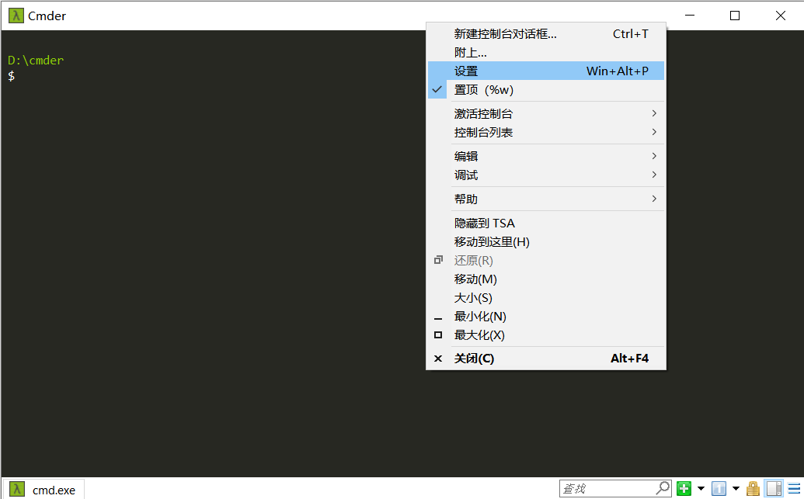
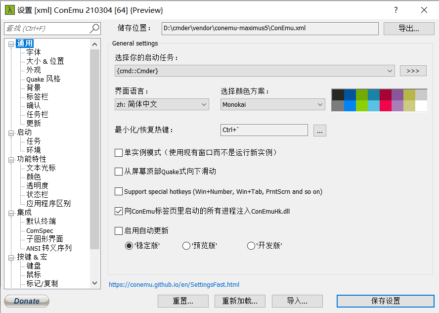
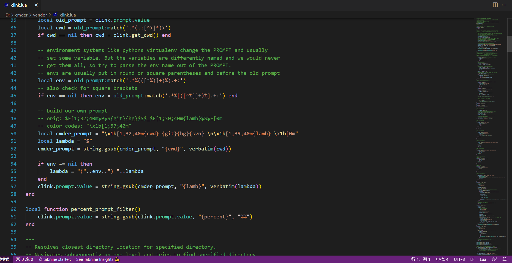
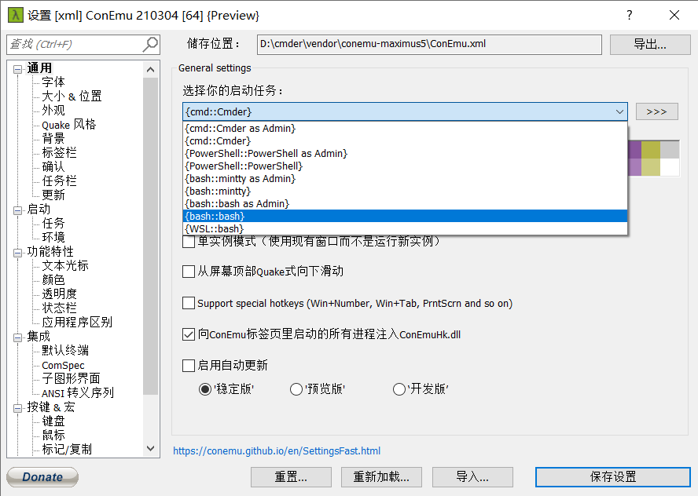
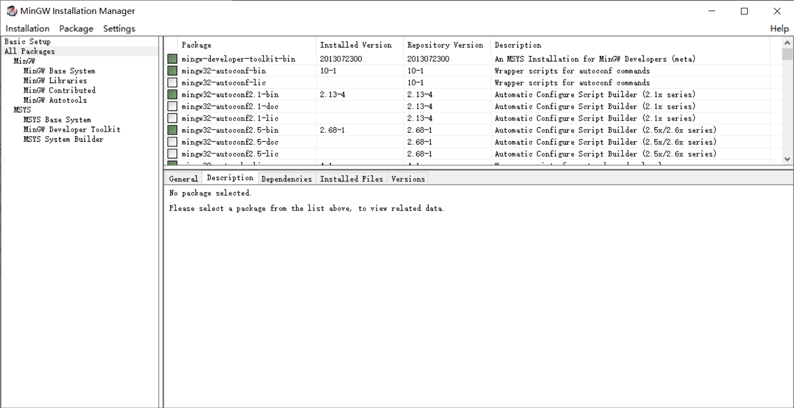
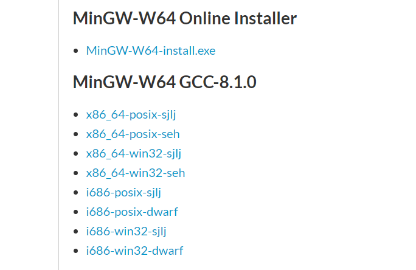

# Cmder

## 安装配置

Cmder 是非常便捷的命令行工具，能够在 Windows 中运行 Linux 命令行。


### 基本设置

在 GitHub 上的 [Cmder](https://github.com/cmderdev/cmder) 项目中下载安装包直接解压即可。为了更方便使用，需要进行一些配置

* 双击打开 `Cmder.exe`，右键进入设置界面



首先将通用中的设置改为如下配置



更多的配置可以直接参考原先安装的 Cmder 中的配置；

* 在环境变量 path 中添加 cmder 的路径；
* 在 `Cmder.exe` 所在目录下，以管理员运行cmd，输入 `Cmder.exe /REGISTER ALL`，将 Cmder 添加进右键菜单；
* 在 `D:\cmder\vendor` 下找到 `clink.lua`，修改其中 lambda 变量为 `$`；



我们也可以在设置中将启动任务改为 bash::bash，这样可以使用 Linux 的很多命令，但是用 cmd::Cmder 更好一些。




### MinGW32

Cmder 中缺少 make, gcc, g++ 等重要编译命令，为了能够配合 Windows 使用，需要安装 mingw 提供各种包。在 [mingw 官网](https://sourceforge.net/projects/mingw/)中下载安装包后，直接运行安装在一个纯英文且没有空格的路径当中，在过程中要一直点击 continue 完成安装。最后直接运行 mingw 或者在命令行输入 mingw-get 进入图形化界面（后者需要将 mingw-get.exe 所在文件夹加入环境变量）



选择想要的工具：选中—右键—选择 “mark for installtion” 。当你选完你所有想要的工具后，单击菜单栏的 installation 选项，然后选择apply changes，在出现的对话框中选择 apply changes，最后完成工具包的下载与安装。


例如通过 mingw 安装 make，通过

```shell
mingw-get install mingw32-make
```

获取 make 安装包。安装完成后输入

```shell
mingw32-make -v
```

可以看到对应的版本信息。为了使用方便，可以到 `D:\MinGW\bin` 目录下找到 `mingw32-make.exe` 文件重命名为 `make.exe`，这样每次使用就可以直接输入 make 运行

```cpp
make -v
```


### MinGW64

如果要编译 64 位程序，应当[下载](https://sourceforge.net/projects/mingw-w64/files/mingw-w64/)最新的 MinGW64 的包。在 Files 页面下方找到 x86_64-win32-sjlj 文件下载（如果没有特殊要求 seh 版本，最好下载 sjlj 版本）



下载安装后，将 `D:\MinGW64\libexec\gcc\x86_64-w64-mingw32\8.1.0` 目录下的 `liblto_plugin-0.dll` 复制到 `D:\MinGW64\lib\bfd-plugins` 目录下（没有就创建）。


### Gow

有些 Linux 命令仍然缺失，可以通过 [Gow](https://github.com/bmatzelle/gow/releases) 获得更多的命令程序。下载安装后，我们将 `D:\Gow\bin` 中的命令程序复制到 `D:\cmder\bin`，目录下，然后打开 Cmder 输入命令。此时会弹出缺少的动态库，从 `D:\Gow\bin` 中把所有动态库都复制过来即可。

