# Visual Studio

## 基本知识

### 生成工具

可以直接下载构建工具

```embed
title: "Microsoft C++ 生成工具 - Visual Studio"
image: "https://visualstudio.microsoft.com/wp-content/uploads/2025/03/vscom-share-image.jpg"
description: "Any Developer, Any App, Any Platform"
url: "https://visualstudio.microsoft.com/zh-hans/visual-cpp-build-tools/"
```

安装 SDK 的路径无法直接修改，必须在注册表中修改


### GME 配置


### 字体调整

在“工具-环境-字体和颜色”中修改不同显示环境下的字体大小。例如要修改搜索框字体大小，可以将“纯文本”修改为 10，然后通过 Ctrl 和鼠标滚轮修改字体大小，搜索框字体会随之调整。


### 错误排查

| 错误                         | 原因                   | 解决方案                                                                                                   |
| -------------------------- | -------------------- | ------------------------------------------------------------------------------------------------------ |
| 未解析的符号                     | 静态成员变量未在类外初始化        |                                                                                                        |
| 无法解析的符号                    | 纯虚函数没有在子类中实现         |                                                                                                        |
| 程序异常终止                     | 数组越界访问               |                                                                                                        |
| 无法打开源文件                    | 源文件路径错误              | 在 VC++ 目录中设置源文件的“包含目录”                                                                                 |
| 无法启动程序，拒绝访问                | 解决方案中有多个项目           | 右键将需要运行的项目设为启动项                                                                                        |
| 无法打开源文件："\utf-8"           | 文件编码问题               | 右下角的 LF 编码全部修改为 CRLF 编码                                                                                |
| 语法错误                       | 文件编码问题               | 将报错文件修改为 UTF-8 with BOM 编码                                                                             |
| 无法定位程序输入点                  | 动态库版本与程序需要版本不匹配      | 注意动态库搜索路径的优先级：例如 OpenMesh 下也有 Qt 的动态库，如果 OpenMesh 搜索路径优先级更高，可能不会调用 Qt 本身的动态库，而是调用了 OpenMesh 的动态库，造成不匹配 |
| 检测到 Runtimelibrary 不匹配项    | 链接的库类型与项目运行库类型不一致    | 在项目-属性-C/C++-代码生成中修改运行库设置                                                                              |
| 未声明的标识符                    | 中文注释的编码问题            | 修改为 utf-8 with BOM                                                                                     |
| 不能在"new-expression"中定义类型   | 在构造函数的默认参数中使用 new 操作 |                                                                                                        |
| error MSB8041: 此项目需要 MFC 库 | 很可能是编译器版本问题          | 更新 Visual Studio                                                                                       |


一种较隐蔽的越界来自 new 得到的空间被释放后的访问，这种情况常常来自类对象作为参数传入函数时没有用引用

```cpp
class A
{
public:
	int *x;
	A() : x(new int[10]) {}
    
	~A() { delete[] x; }
};

// 没有使用引用就直接传值
void func(A a)
{
    // ...
}
```

并且还未定义一个拷贝构造函数，这就导致传入类后，外部类的 x 指针直接被赋给内部类，当 func 执行完毕，内部类析构会直接释放掉 x 的内存空间，这样外部类就失去了这段有效内存。


如果出现循环莫名其妙地多出一部分，而又没有修改循环变量 i ，则有可能是循环中有数组越界

```cpp
Carry<5> c;
for (int i = 0; i < 50; i++)
{
    cout << c << endl;
    c++;
}
```

这里自定义结构 Carry 变量在自增时循环越界，导致 i 被覆盖，所以循环次数异常。


### DNS 设置

有时由于 Microsoft 安装更新下载太慢，可以更改 DNS 设置。在“控制面板-网络和 Internet-更改适配器选项”中，右击“WLAN-属性”，打开设置

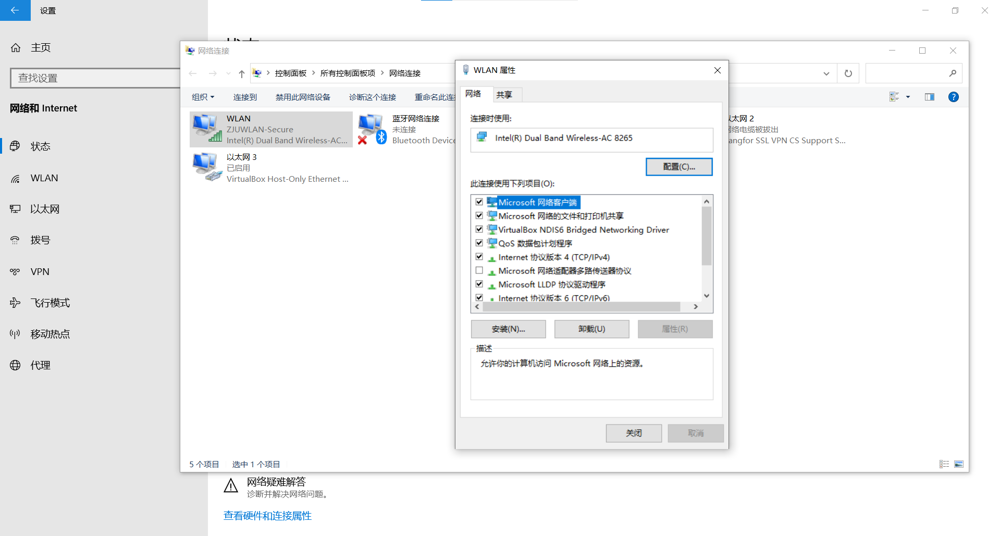


点击“Internet协议版本4(TCP/IPv4)”，进入属性，设置首选和备用DNS服务器为`4:2:2:2`和`4:2:2:1`即可

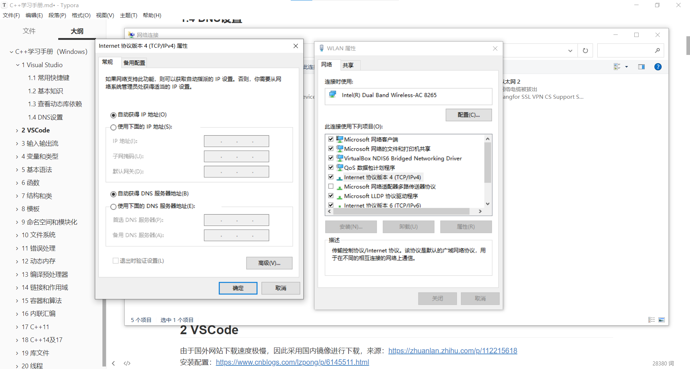

更新完成后切换回默认的 IP 地址。


### 配置 SDK 版本

不同版本的 VS 使用的 SDK 完全不同，尤其是当我们编译旧版 VS 项目时，如果不想“升级平台工具集”，就需要下载旧版本的 SDK 文件。找到 Visual Studio Installer 打开，选择对应版本的 SDK 下载

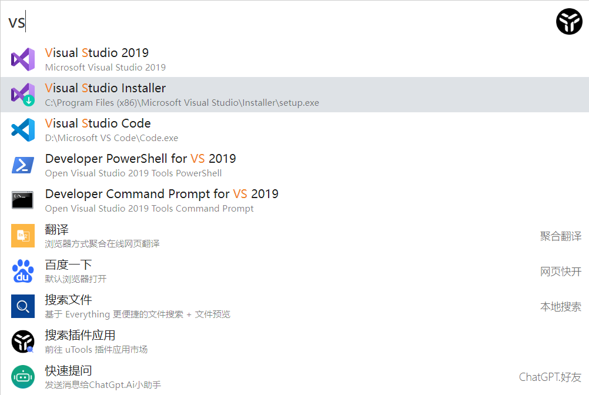

例如编译 VS2017 版本的项目，提示缺少 v141 工具和对应版本的 SDK 工具，可以搜索单个组件尝试安装

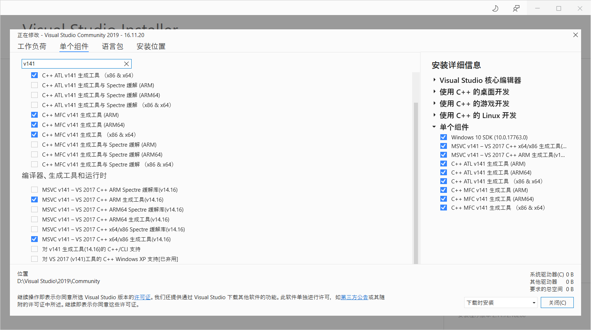


### 项目路径

#### 文件路径

在 VS 项目中常常需要引用头文件、静态/动态库文件。在头文件中可以通过绝对路径或相对路径来引用这些文件，但是这样未免非常繁琐。更好的方法是在项目中设置头文件、库文件的引用路径。


在属性页面的 “VC++ 目录”下设置“包含目录”和“库目录”来配置头文件和静态库文件的路径

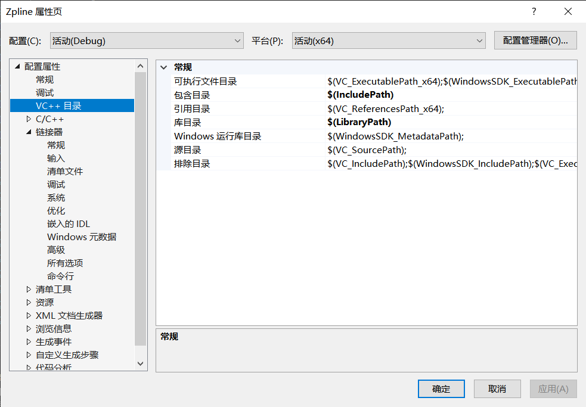

相较于后面要介绍的引用静态库 .lib 的方法，更好的方法是在“链接器-输入-附加依赖项”设置要使用的静态库名称

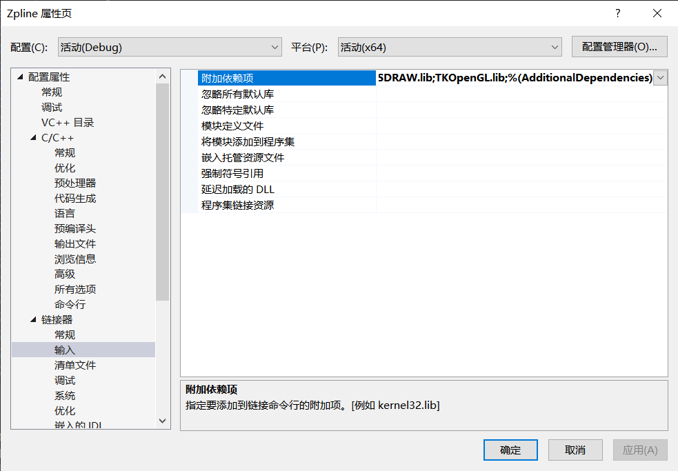

动态库一般需要放在可执行文件所在目录下，也可以在“调试-环境”中配置动态库的路径

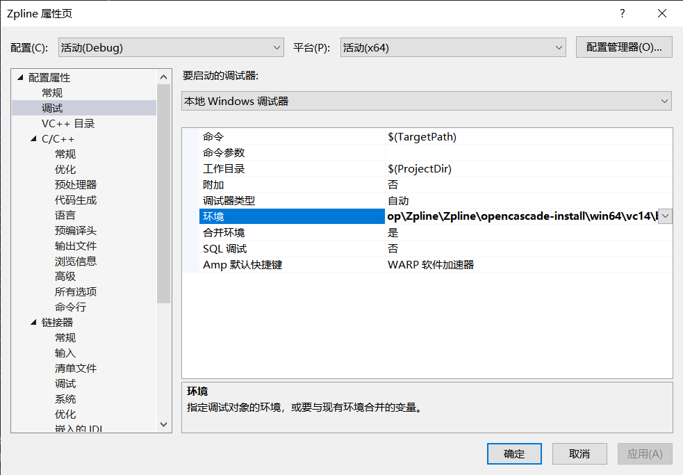


#### 资源路径

所有要读取的资源文件应该放在 VS 的工作目录下。例如 CMake 添加子目录

```cmake
add_subdirectory(src bin)
```

目标文件夹是 bin，因此工作目录就是 bin 目录。


### 断点调试

在 Release 模式下，断点将会无效。有些第三方库是在 Release 模式下编译的，因此也只能在 Release 模式下使用。这样一来就无法进行调试。要解决这个问题，可以在 VS 项目设置中配置：修改 C/C++ 常规选项中的“调试信息格式”

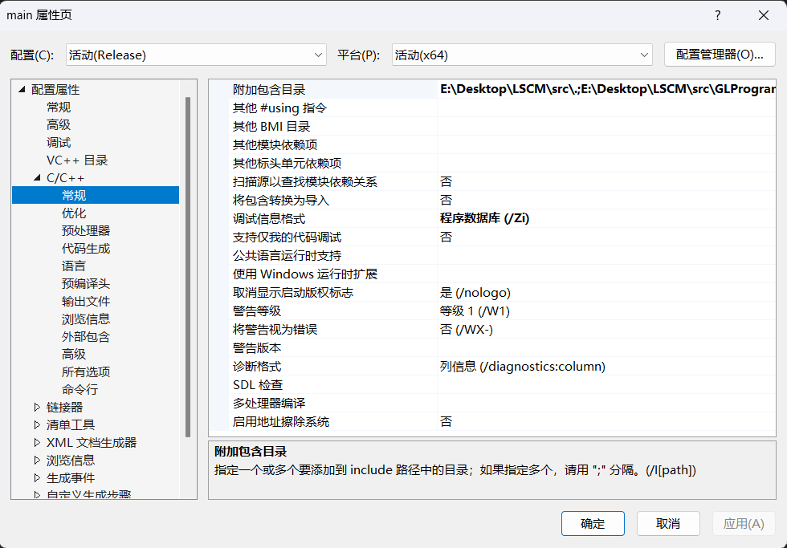

禁用任何优化

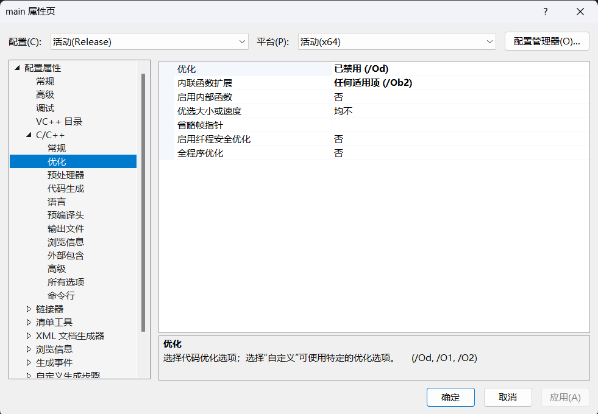

在“链接器”设置中选择生成调试信息

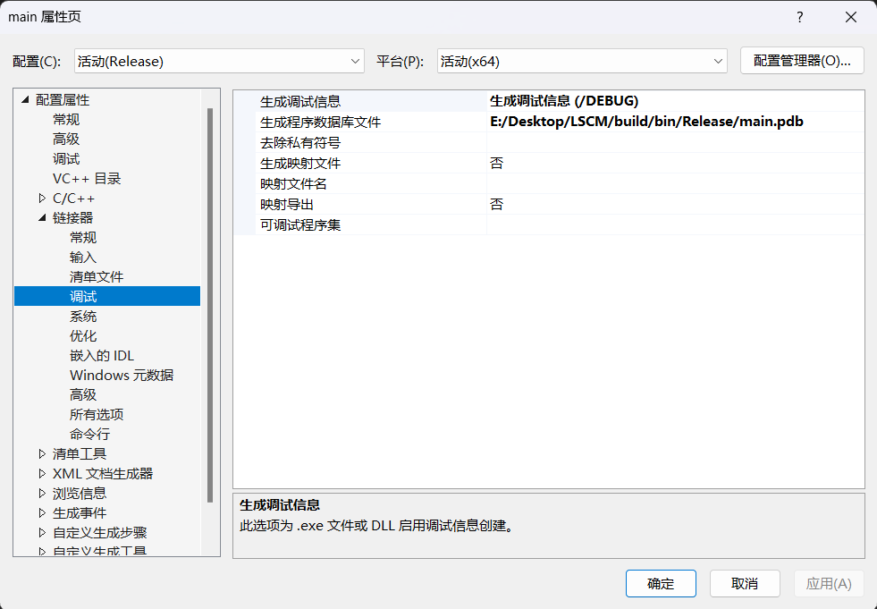

然后就可以正常使用断点测试。


### 同步设置

在“工具-选项-环境-导入和导出设置”中可以看到设置保存的路径，用路径下的设置文件覆盖新设备中的设置文件，重新打开即可。

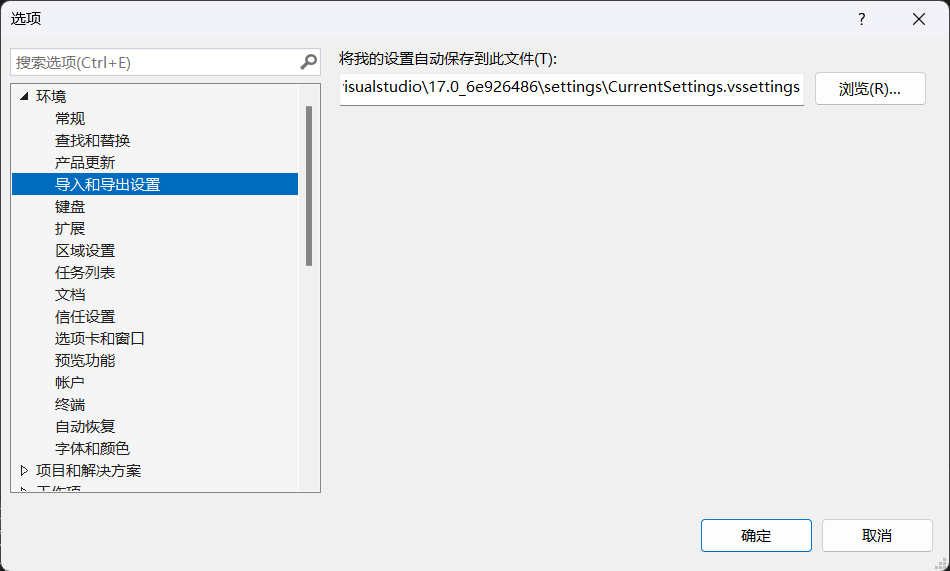


### 查询库依赖

在开始菜单打开 x86 Native Tools Command Prompt for VS，切换到文件所在目录，输入指令

```shell
$ dumpbin /dependents xxx.exe
```

即可查看所依赖的动态库。


[Dependencies](https://link.zhihu.com/?target=https%3A//github.com/lucasg/Dependencies) 是对随 Windows SDK 一起发布的旧软件 [Dependency Walker](http://www.dependencywalker.com/) Dependencies 的重写，但其开发在 2006 年左右停止。可以帮助 Windows 开发人员解决他们的 dll 加载依赖关系问题。点击上面的链接进入 github 官网，然后下载

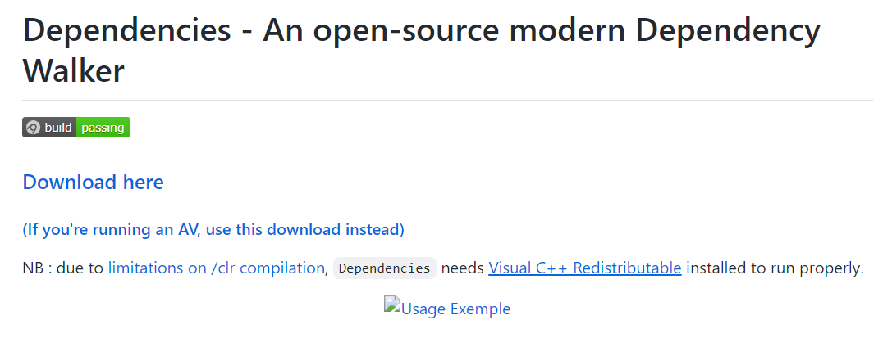

在解压文件夹中找到 DependenciesGui.exe 文件，就可以打开图形化界面。当然，也可以通过命令行运行 Dependencies.exe 进行操作。我们只需要将可执行文件拖放到 Dependencies 中，就可以直接看到所有主要依赖的动态库：

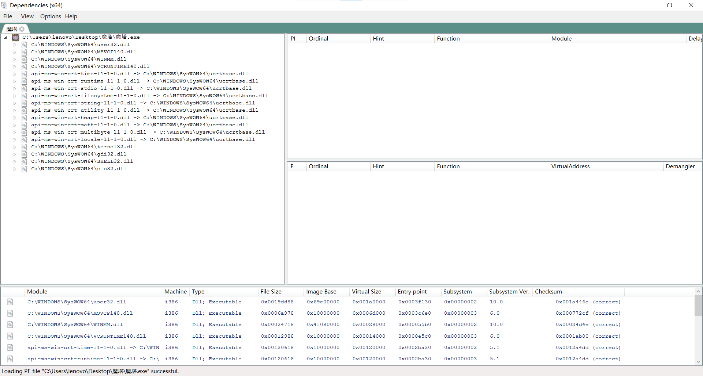


### 修改按键映射

在“工具-选项-环境-键盘”中，修改“键盘映射方案”为 VSCode 即可


## Git

### 初始化仓库

如果要在 VS 中使用 GitHub 连接，需要在 VS Installer 的单个组件中找到 GitHub 工具进行安装。我们在菜单“视图”中可以找到 Git 的管理窗口，打开后可以看到


可以创建 Git 储存库，但是更好的是**直接从远程克隆储存库**，毕竟 VS 不方便使用命令行操作，这样能够避免内容合并冲突的问题。


克隆完成后就得到 Git 操作界面，使用方法与 VSCode 中的 Git 类似：

* 下箭头表示从远程库拉取；
* 上箭头表示推送到远程库；
* 循环表示同步后推送，即先拉取再推送；
* `...` 中可以找到更多命令操作；

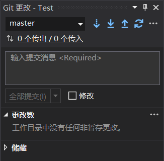

在 `...` 中找到“管理分支”，点击后即可查看分支关系和推送历史

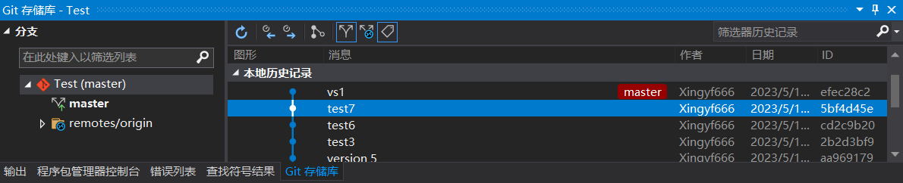

右键点击历史版本，可以进行重置等操作；右键点击 remotes 目录下的分支，可以进行分支合并、变基、删除等操作。如果要查看某个分支是从哪个分支发展而来，可以点击上面的左右箭头图标，将会向父分支和子分支移动。


### 冲突处理

当我们处在 master 分支，要将 testing 分支合并到 master 分支，右键 testing 分支选择合并到 master 分支。可以看到冲突

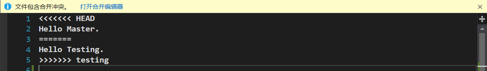

点击“打开合并编辑器”，即可选择合并方式：勾选左边或右边可以选择其中一个版本进行合并；都勾选则会错开冲突部分进行合并；也可以手动调整合并后的代码

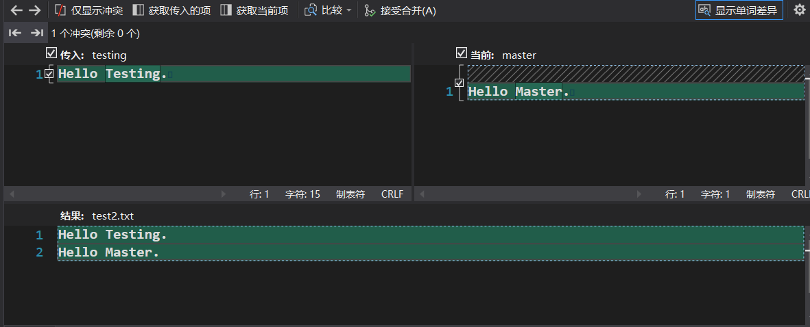

最后点击“接受合并”，通过 commit 提交，然后推送到远程库即可。


## 项目配置

### CMake

为了使用最新版本的 CMake，可以用对应的 bin 目录替换掉 VS 中 CMake 的 bin 目录

```powershell
D:\Microsoft Visual Studio\2022\Community\Common7\IDE\CommonExtensions\Microsoft\CMake\CMake\bin
```


安装 2022 版本的 VS，在“工具-选项”中将 CMake 配置文件修改为“始终使用 CMake 预设”，这是官方推荐的设置。

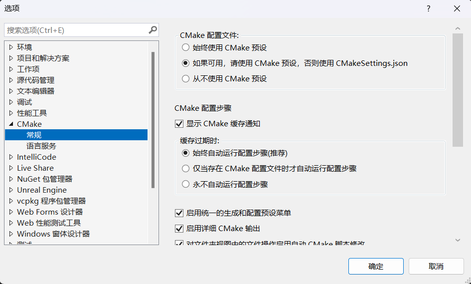

最好安装 UTF8 插件，确保代码都保存为 UTF8 格式

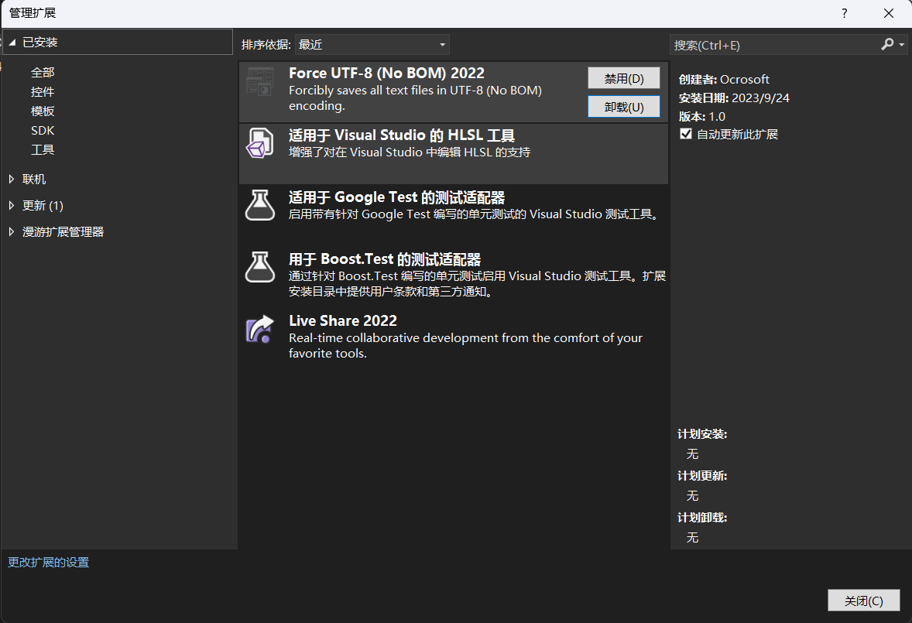

然后可以创建 CMake 项目

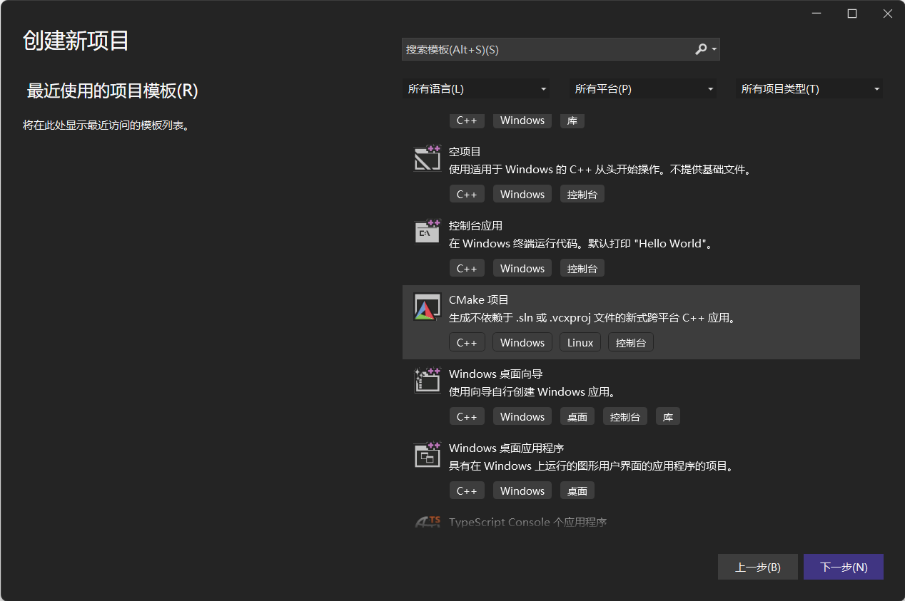

在“工具-选项”中设置主动提交成员列表，提高输入效率

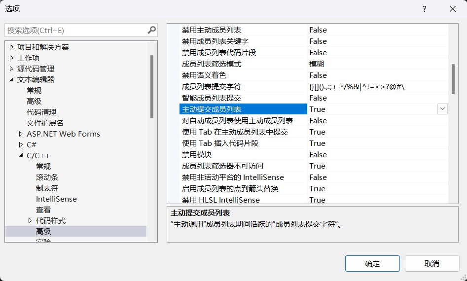


如果需要修改 CMake 任务，可以右键点击 CMakeLists.txt 文件，选择配置任务，就可以通过 json 文件来配置任务信息

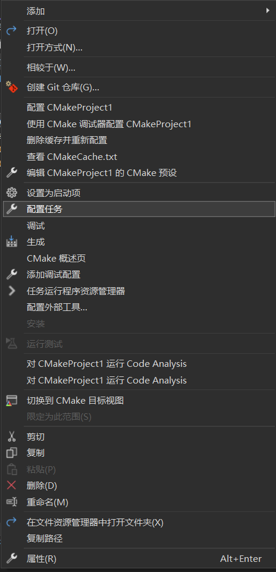

通过配置任务来设置不同的生成目标。


还可以添加调试配置，同理选择

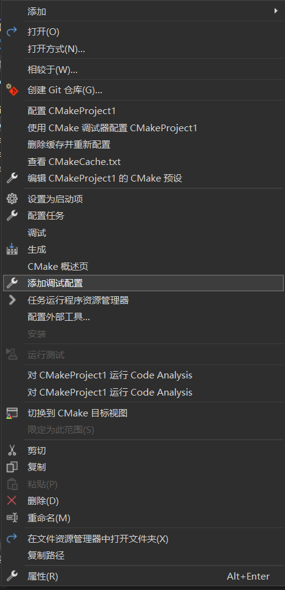

然后可以设置项目目标，任务名称以及工作目录

```json
{
  "version": "0.2.1",
  "defaults": {},
  "configurations": [
    {
      "type": "default",
      "project": "CMakeLists.txt",
      "projectTarget": "CMakeProject1.exe",
      "name": "My Config",
      "cwd": "${workspaceRoot}",
      "currentDir": "${workspaceRoot}"
    }
  ]
}
```

这时候可以看到自定义的调试配置，选择进行编译即可。

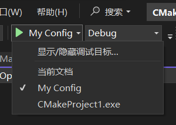


需要注意的是，如果使用 CMake 项目，那么原先 CMakeLists.txt 中设置的动态库路径就失效了，因为它是用来配置 .sln 文件的。现在就需要通过调试配置来添加环境变量。例如

```json
{
  "version": "0.2.1",
  "defaults": {},
  "configurations": [
    {
      "type": "default",
      "project": "CMakelists.txt",
      "projectTarget": "",
      "name": "CMakelists.txt",
      "environment": [
        {
          "name": "PATH",
          "value": "D:\\lib\\OpenCASCADE-7.4.0-vc14-64\\opencascade-7.4.0\\win64\\vc14\\bin;D:\\lib\\OpenCASCADE-7.4.0-vc14-64\\freetype-2.5.5-vc14-64\\bin;D:\\lib\\OpenCASCADE-7.4.0-vc14-64\\freeimage-3.17.0-vc14-64\\bin;D:\\lib\\OpenCASCADE-7.4.0-vc14-64\\ffmpeg-3.3.4-64\\bin;D:\\lib\\OpenCASCADE-7.4.0-vc14-64\\tbb_2017.0.100\\bin\\intel64\\vc14;D:\\Qt\\Qt5.14.2\\5.14.2\\msvc2017_64\\bin;D:\\lib\\OpenMesh-10.0; %PATH%"
        }
      ]
    }
  ]
}
```


### Qt

在 VS 下进行 Qt 开发，需要安装插件。在“扩展-管理扩展”中搜索 Qt，找到相关插件进行安装

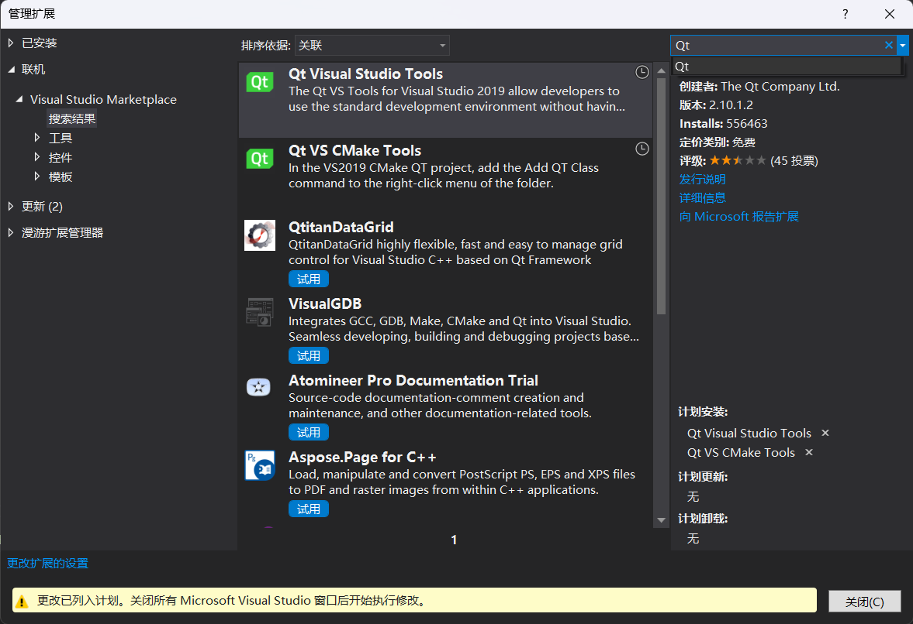


安装完成后，重新进入 VS，在“扩展-Qt VS Tools-Qt versions”中添加 Qt 版本，路径设置为下面目录下的 qmake 程序

```shell
D:\Qt\Qt5.14.2\5.14.2\msvc2017_64\bin
```

然后就可以选择 Qt 项目进行创建

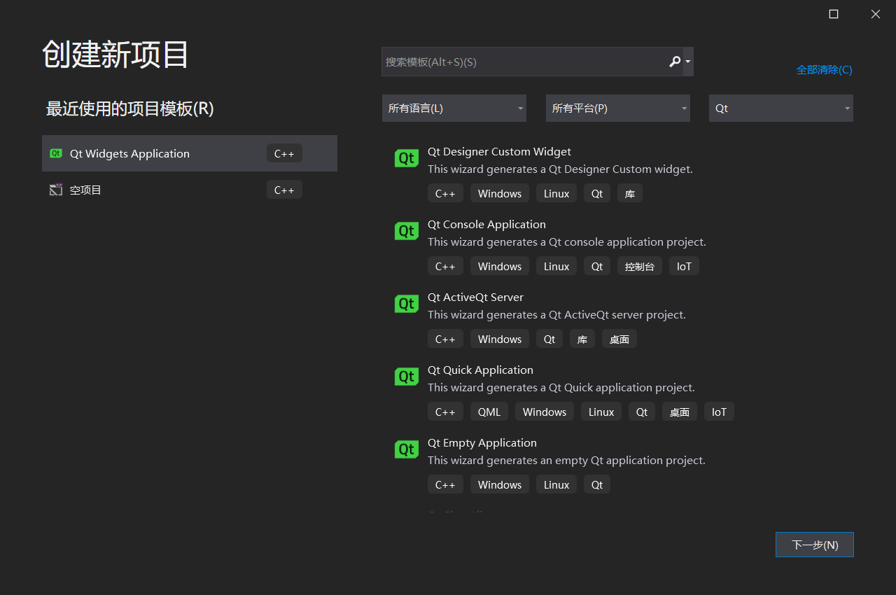


要在 VS 中编辑 .ui 文件，需要在“扩展-Qt VS Tools-Options”中将 "run in detached window" 设为 True

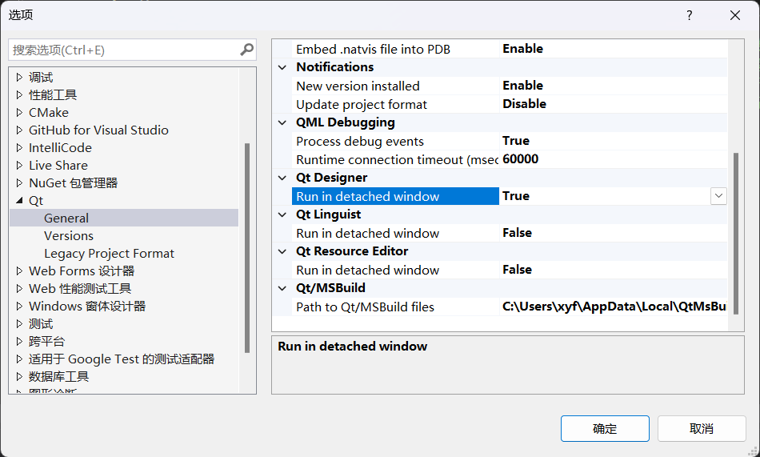


