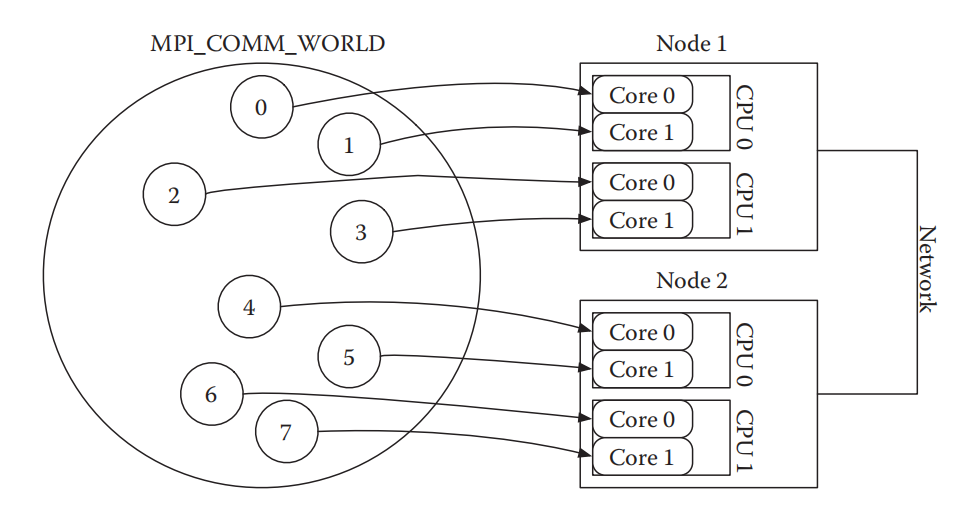
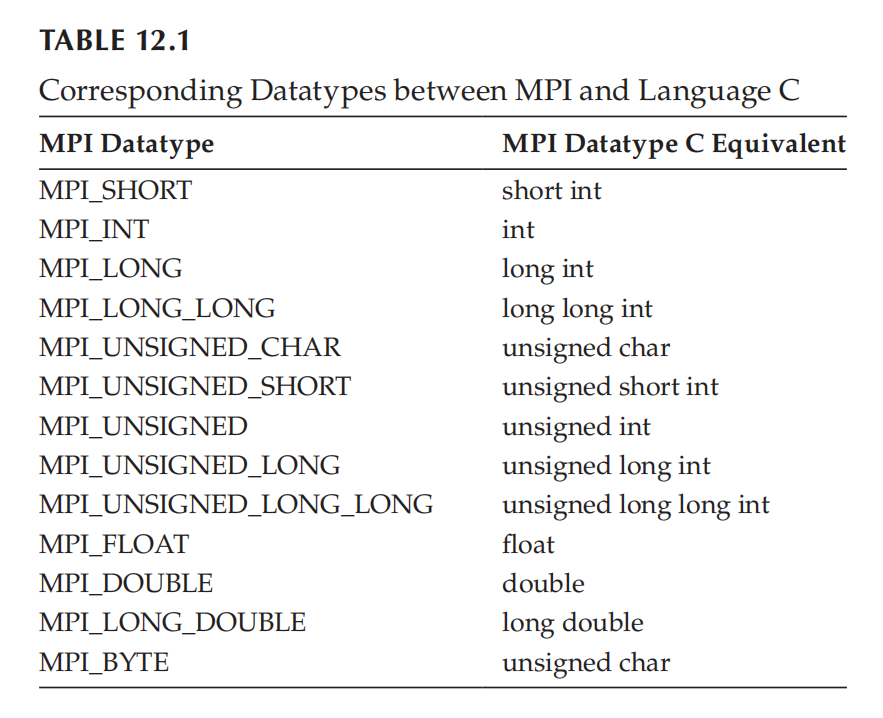
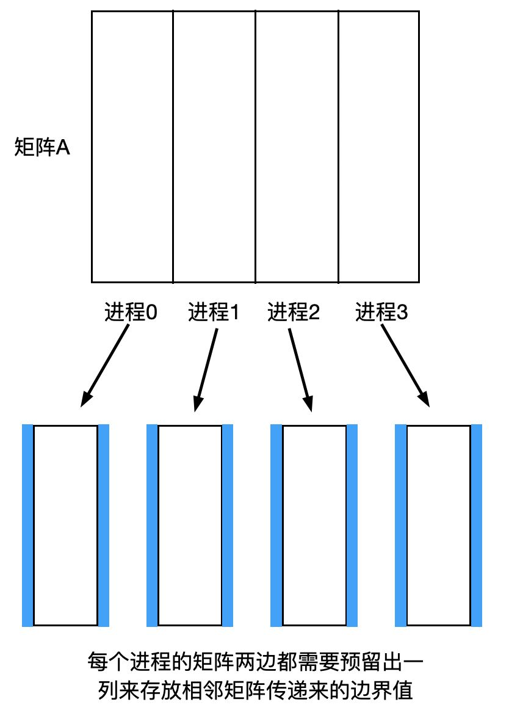

# MPI

## 基本介绍

MPI  (Message Passing Interface) 是一个信息传递接口，可以理解为一种独立于语言的信息传递标准。


### 下载和安装

先检查是否安装了相应的编译器

```shell
which gcc
which gfortran
```

当显示了编译器路径，即可进行下一步安装。这里我们使用源码安装

```shell
wget http://www.mpich.org/static/downloads/3.3.2/mpich-3.3.2.tar.gz 
tar -zxvf mpich-3.3.2.tar.gz # 解压下载的压缩包 
cd mpich-3.3.2 # 进入解压后的文件夹内 
./configure  --prefix=/usr/local/mpich-3.3.2 
# --prefix这一参数是设置安装的路径，根据需要设置合适的路径即可，但需要记住安装的位置 
make 
make install 
```

当然，也可以使用 sudo apt install mpich 或者在软件包管理器中找到 mpich 进行安装。


随便找一个可执行文件 `./test`，运行如下代码：

```shell
mpirun -np 4 ./test 
```

会得到 `./test` 运行 4 次的结果，这就说明安装成功。


### 编译运行

C 语言应当使用 mpicc 编译，C++ 使用 mpic++ 编译

```shell
mpicc -o main main.c
mpic++ -o main main.cpp
```

运行程序需要通过运行器 launcher，不同的 MPI 库有自己的 launcher，但是公共的方法是 mpirun

```shell
mpirun -np 4 -hostfile hosts ./main
```

其中 4 是 MPI 目标的进程数，-hostfile 后跟存放主机 (host) 列表的文件，这里我们使用的是 hosts 文件，它包含的文本如下

```shell
node1
node1
node2
node2
```

意思是前两个 MPI 目标在 node1 上执行，后两个在 node2 上执行。


### 基本函数

我们介绍 6 个基本函数，用它们基本可以实现大部分功能。


#### MPI_Init

```c
int MPI_Init(int *argc, char ***argv);
```

任何 MPI 程序都应该首先调用该函数，必须保证程序中第一个调用的 MPI 函数是这个函数

```c++
int main(int argc, char *argv[])
{
    MPI_init(&argc, &argv);
    return 0;
}
```

**此函数生成公共通信域 MPI_COMM_WORLD** 。事实上，MPI 使用从 0 开始唯一分配的非负整数来标记进程。所有的这些进程都在公共通信域 MPI_COMM_WORLD 中，每个 MPI 进程可以对应到一个或多个 CPU 核。



**需要注意：不同进程中定义的变量之间没有任何关系，因此需要通过 MPI 函数传递变量数据**。


#### MPI_Finalize

任何 MPI 程序结束时，都需要调用该函数

```c++
MPI_Finalize();
```

所有的 MPI 函数调用都必须发生在 `MPI_Init` 和 `MPI_Finalize` 之间。


#### MPI_Comm_rank

```c++
int MPI_Comm_rank(MPI_Comm, int *rank);
```

该函数获得当前进程的标识。两个参数分别是进程所在通信域和返回的进程号。通信域可以理解为进程分组，将某几个进程分成一组进行组操作。`MPI_COMM_WORLD` 是 MPI 预定义好的通信域，是一个包含所有进程的通信域，目前只需要使用该通信域即可。

```c
#include <stdio.h>
#include "mpi.h"

int main(int argc, char *argv[])
{
    int myid;
    MPI_Init(&argc, &argv);
    MPI_Comm_rank(MPI_COMM_WORLD, &myid);

    if (myid == 0)
    {
        printf("Hello!\n");
    }

    if (myid == 1)
    {
        printf("Hi!\n");
    }

    MPI_Finalize();
    return 0;
}
```


#### MPI_Comm_size

该函数是获取该通信域内的总进程数，如果通信域为 `MP_COMM_WORLD`，即获取总进程数，使用方法和 `MPI_COMM_RANK` 相近。

```cpp
int MPI_Comm_size(MPI_Comm, int *size);
```


#### MPI_Send

该函数为阻塞发送函数，用于进程间发送消息

```c++
int MPI_Send(const void *buf, int count, MPI_Datatype dType, int dest, int tag, MPI_Comm comm);
```

参数说明

* buf 传递数据的起始地址，例如数组的首地址
* count 为数据的长度
* datatype 是变量类型，例如 int 型对应 `MPI_INT` 类型，其余同理
* dest 为接收的进程号，即被传递信息进程的进程号
* tag 为信息标志，发送和接收需要与 tag 一致，从而区分同一目的地的不同消息
* comm 为通信域，Send 和 Recv 应当在同一通信域当中

MPI 中的变量类型，目的是同一调用接口，使得不同的语言都能够通过这些变量类型进行 MPI 的操作。




#### MPI_Recv

该函数为阻塞接收函数，需要和 `MPI_Send` 成对出现

```c++
int MPI_Recv(void *buf, int count, MPI_Datatype datatype, int source, int tag, MPI_Comm comm, MPI_Status *status);
```

参数和 `MPI_Send` 大致相同，source 标明从哪个进程接收消息，status 返回状态信息参数。


在 C 和 C++ 中，status 变量类型 `MPI_Status` 用于接收函数返回的信息

```c
typedef struct {
	int MPI_SOURCE;	// 消息源地址
    int MPI_TAG;	// 消息标签
    int MPI_ERROR;	// 消息错误码
} MPI_Status;
```

我们通过这个结构体来获得这些重要信息。


#### MPI_Isend

该函数为非阻塞发送函数，因此立即返回

```c
int MPI_Isend(void *buf, int count, MPI_Datatype dType, int dest, int tag, MPI_Comm comm, MPI_Request *request);
```

除非我们知道非阻塞操作执行，否则修改缓冲区非常危险。


#### MPI_Irecv

该函数为非阻塞接收函数

```c
int MPI_Irecv(void *buf, int count, MPI_Datatype datatype, int source, int tag, MPI_Comm comm, MPI_Request *request);
```


#### MPI_Test

该函数检查一个请求是否完成，返回操作的标记 falg

```c
int MPI_Test(MPI_Request *request, int *flag, MPI_Status *status);
```

MPI_Request 对象用于知晓当前信息交流的状态。


#### MPI_Wait

该函数是阻塞函数，只有当非阻塞发送或接收操作完成后才会解除

```c
int MPI_Wait(MPI_Request *request, MPI_Status *status);
```


#### MPI_Bcast

此函数从指定的进程 root 向组中所有其它进程发送消息 buffer，此信息可以包含一个或多个元素

```c
int MPI_Bcast(void *buffer, int count, MPI_Datatype dType, int root, MPI_Comm comm);
```


#### MPI_Reduce

此函数对所有同一通信域 comm 中的目标执行操作 op，将结果返回到 root 进程的 recvbuf 中

```c
int MPI_Reduce(const void *sendbuf, void *recvbuf, int count, MPI_Datatype datatype, MPI_Op op, int root, MPI_Comm comm);
```

常用的 op 如下：

| Operation | Description |
| --------- | ----------- |
| MPI_MAX   | Maximum     |
| MPI_MIN   | Minimum     |
| MPI_SUM   | Sum         |
| MPI_PROD  | Product     |


#### MPI_Scatter

此函数从一个单独的源目标 sendbuf 发送不同的信息到同一通信域 comm 中的每一个目标 recvbuf

```c
int MPI_Scatter(const void *sendbuf, int sendcount, MPI_Datatype sendtype, void *recvbuf, int recvcount, MPI_Datatype recvtype, int root, MPI_Comm comm);
```


#### MPI_Gather

此函数收集通信域 comm 中每一个目标 sendbuf 发送到单独目的地 recvbuf 的不同信息，recvcount 参数是从**每个进程**接收的元素数

```c
int MPI_Gather(const void *sendbuf, int sendcount, MPI_Datatype sendtype, void *recvbuf, int recvcount, MPI_Datatype recvtype, int root, MPI_Comm comm);
```


#### MPI_Sendrecv

此函数用于捆绑发送和接收过程，解决了 Send 和 Recv 在大规模代码中的匹配问题

```c
int MPI_Sendrecv(const void *sendbuf, int sendcount, MPI_Datatype sendtype, int destid, int sendtag, void *recvbuf, int recvcount, MPI_Datatype recvtype, int sourceid, int recvtag, MPI_Comm comm, MPI_Status *status);
```

此函数**将本进程中 sendbuf 的内容发送到 destid 进程中，同时用本进程中的 recvbuf 接收 sourceid 进程的消息**。参数如下： 

| 参数      | 作用               | 参数     | 作用               |
| --------- | ------------------ | -------- | ------------------ |
| sendbuf   | 发送缓冲区起始地址 | sendtype | 发送数据的数据类型 |
| sendcount | 发送数据的个数     | destid   | 目标进程的标识号   |
| sendtag   | 发送消息标签       | recvbuf  | 接收缓冲区初始地址 |
| recvcount | 最大接收数据个数   | recvtype | 接收数据的数据类型 |
| sourceid  | 源进程标识         | recvtag  | 接收消息标签       |
| comm      | 通信域             | status   | 返回的状态         |


### 简单范例

#### 阻塞数据传递

简单的使用 `MPI_Send` 和 `MPI_Recv` 函数的例子如下

```c
#include <stdio.h>
#include "mpi.h"

int main(int argc, char *argv[])
{
    int rank, number;
    number = 0;
    /* starts MPI */
    MPI_Init(&argc, &argv);

    /* get current process rank */
    MPI_Comm_rank(MPI_COMM_WORLD, &rank);

    if (rank == 0)
    {
        number = 123;
        MPI_Send(&number, 1, MPI_INT, 1, 0, MPI_COMM_WORLD);
    }
    else if (rank == 1)
    {
        printf("Number = %d\n", number);
        MPI_Recv(&number, 1, MPI_INT, 0, 0, MPI_COMM_WORLD, MPI_STATUS_IGNORE);
        printf("Process 1 received data from process 0, number = %d \n", number);
    }
    
    MPI_Finalize(); /* ends MPI */
    return 0;
}
```

编译运行得到

```shell
Number = 0
Process 1 received data from process 0, number = 123 
```

我们使用了 2 个进程，从 0 进程将 number 的值传递到 1 进程，用 0 作为 tag 标记，传递过程发生在 `MPI_COMM_WORLD` 中。使用宏 `MPI_STATUS_IGNORE` 忽略状态。


#### 非阻塞数据传递

用 source 标记发送方，destination 标记接收方

```c
#include <stdio.h>
#include "mpi.h"

int main(int argc, char *argv[])
{
    int rank, source, destination, number;
    number = 0;
    source = 0;
    destination = 1;

    MPI_Status status;
    MPI_Request request;

    MPI_Init(&argc, &argv);               /* starts MPI */
    MPI_Comm_rank(MPI_COMM_WORLD, &rank); /* get current process rank */

    request = MPI_REQUEST_NULL; /* no request */

    if (rank == 0)
    {
        number = 123;
        MPI_Isend(&number, 1, MPI_INT, destination, 0, MPI_COMM_WORLD, &request);
    }
    else if (rank == 1)
    {
        MPI_Irecv(&number, 1, MPI_INT, source, 0, MPI_COMM_WORLD, &request);
    }

    MPI_Wait(&request, &status); /* wait for send and receive complete */

    if (rank == source)
    {
        printf("processor %d sent %d\n", rank, number);
    }
    if (rank == destination)
    {
        printf("processor %d got %d\n", rank, number);
    }

    MPI_Finalize(); /* ends MPI */
    return 0;
}
```

需要注意，发送和接收的 tag 必须相同。一种避免错误 tag 的方式是**使用 `MPI_ANY_TAG` 宏作为 tag 参数**，它会允许接收任何 tag 值得数据。这样做的前提是你能够确保它不会收到导致错误的其它 tag 的信息。


#### 死锁

`MPI_Send` 和 `MPI_Recv` 是标准通信模式。通信分为阻塞通信和非阻塞通信，前者在通信时只能做通信这一件事，而后者在开始发送消息时，不必等待消息发送完成，即可继续执行下一步指令。


在阻塞通信时，若 Send 和 Recv 顺序不当会发生死锁。例如进程 0、1要互发消息，而它们都先进行接收操作，则此时两个进程都会等待消息发送而不会执行发送操作，产生死锁现象。

```c
if (myid == 0)
{
    MPI_Recv(...,1,tag,...);
    MPI_Send(...,1,tag,...);
}
if (myid == 1)
{
    MPI_Recv(...,0,tag,...);
    MPI_Send(...,0,tag,...);
}
```

反之，如果都先进行 Send 操作，也会出现错误。正常情况下，应该使用如下顺序：

```c
if (myid == 0)
{
    MPI_Send(...,1,tag,...);
    MPI_Recv(...,1,tag,...);
}
if (myid == 1)
{
    MPI_Recv(...,0,tag,...);
    MPI_Send(...,0,tag,...);
}
```


#### 计算 $\pi$

我们选择求解一个经典的算例，因为
$$
\int_0^1\frac{1}{1+x^2}dx = \frac{\pi}{4}
$$
因此可以通过
$$
\int_0^1\frac{4}{1+x^2}dx = \pi
$$
来求得 $\pi$ 值。虽然通过离散化用循环语句就可以求解，但是如果使用多进程操作，就可以减少每个进程上的循环次数。


我们先写一个基本的流程

```c
#include <stdio.h>
#include "mpi.h"

double f(double x)
{
    return 4.0 / (1.0 + x * x);
}

int main(int argc, char *argv[])
{
    // number of process and id of process
    int myid, numprocs;

    MPI_Init(&argc, &argv);

    MPI_Comm_size(MPI_COMM_WORLD, &numprocs);
    MPI_Comm_rank(MPI_COMM_WORLD, &myid);
    printf("Process %d of %d\n", myid, numprocs);

    MPI_Finalize();
    return 0;
}
```

然后使用 mpicc 编译，用 mpirun 指定分配多少个进程，如果直接用 `./test` 只会使用一个进程

```shell
mpicc -o test test.cpp 
mpirun -np 6 ./test 
```

由于不同进程的执行快慢不同，我们得到不同的运行结果

```shell
Process 1 of 6
Process 4 of 6
Process 0 of 6
Process 3 of 6
Process 5 of 6
Process 2 of 6
```


以 4 个进程为例，我们把 100 次循环计算分给 4 个进程。直觉上应该让 0 进程计算 1-25，1 进程计算 26-50，以此类推。但是这样实现会比较麻烦，因为 4 个进程分别执行同一个代码，储存的变量名虽然相同，但是对应的值不同。我们采用如下方式

```c
for (i = myid + 1; i <= n; i += numprocs)
{
    x = h * ((double)i - 0.5);
    sum += f(x);
}
```

这种写法中 0 进程负责计算 `1 5 9 ...`，1 进程负责计算 `2 6 10 ...`，以此类推。**注意不同进程的 myid 不同，使用 myid 来区分不同的进程行为，实现过程比较简洁。**


计算完成后，每个进程中的 sum 变量包含了该进程中的求和结果，我们需要将它们加起来。虽然可以选择 `MPI_Send` 和 `MPI_Recv`，但是更简单的是使用规约操作

```c++
MPI_Reduce(&mypi, &pi, 1, MPI_DOUBLE, MPI_SUM, 0, MPI_COMM_WORLD);
```

它在通信域 `MPI_COMM_WORLD` 中，将各个进程的 `MPI_DOUBLE` 型变量起始地址为 `&mypi` 且长度为 1 的内容发送到缓冲区，并执行 `MPI_SUM` 操作，将结果返回到 0 进程的 &pi 地址中。


程序的主体部分如下

```c
#include <stdio.h>
#include "mpi.h"

double f(double x)
{
    return 4.0 / (1.0 + x * x);
}

int main(int argc, char *argv[])
{
    int myid, numprocs;
    int n, i;
    double mypi, pi;
    double h, sum, x;

    MPI_Init(&argc, &argv);

    MPI_Comm_size(MPI_COMM_WORLD, &numprocs);
    MPI_Comm_rank(MPI_COMM_WORLD, &myid);

    printf("Process %d of %d\n", myid, numprocs);

    n = 1000;
    h = 1.0 / (double)n;
    sum = 0;
    for (i = myid + 1; i <= n; i += numprocs)
    {
        x = h * ((double)i - 0.5);
        sum += f(x);
    }
    mypi = h * sum;

    // 将每个进程的 mypi 结果相加赋值给 pi
    MPI_Reduce(&mypi, &pi, 1, MPI_DOUBLE, MPI_SUM, 0, MPI_COMM_WORLD);

  	// 由 0 进程输出结果
    if (myid == 0)
    {
        printf("The result is %.10f.\n", pi);
    }

    MPI_Finalize();
    return 0;
}
```

编译运行得到

```shell
mpicc -o test test.cpp 
mpirun -np 4 ./test 

Process 1 of 4
Process 3 of 4
Process 2 of 4
Process 0 of 4
The result is 3.1415927369.
```


我们再给出一个更加精细的版本

```c
#include <stdio.h>
#include <stdlib.h>
#include <math.h>
#include "mpi.h"

int main(int argc, char *argv[])
{
    int true = 1; /* to force the loop */
    int n,        /* number of intervals */
        rank,     /* rank of the MPI process */
        size,     /* number of processes */
        i,        /* variable for the loop */
        len;      /* name of the process */

    double PI_VALUE = 3.141592653589793238462643;

    double mypi, /* value for each process */
        pi,      /* value of pi calculated */
        h,
        sum, /*sum of the area */
        x;

    double start_time,    /* starting time */
        end_time,         /* ending time */
        computation_time; /* time for computing value of pi */

    /* char array for storing the name of the node where is located the process */
    char name[80];

    /*Initialization */
    MPI_Init(&argc, &argv);
    MPI_Comm_size(MPI_COMM_WORLD, &size);
    MPI_Comm_rank(MPI_COMM_WORLD, &rank);

    /* We ask for the name of the node */
    MPI_Get_processor_name(name, &len);

    while (true)
    {
        if (rank == 0)
        {
            printf("Enter the number of intervals: (0 quits)");
            scanf("%d", &n);
            start_time = MPI_Wtime();
        }

        /* We are broadcasting to everybody the number of interval */
        MPI_Bcast(&n, 1, MPI_INT, 0, MPI_COMM_WORLD);

        if (n == 0)
        {
            break;
        }
        h = 1.0 / (double)n;
        sum = 0.0;
        for (i = rank + 1; i <= n; i += size)
        {
            x = h * ((double)i - 0.5);
            sum += 4.0 / (1.0 + x * x);
        }
        mypi = h * sum;

        /* reference value of pi */
        printf("This is my sum: %.16f from rank: %d in: %s\n", mypi, rank, name);
        MPI_Reduce(&mypi, &pi, 1, MPI_DOUBLE, MPI_SUM, 0, MPI_COMM_WORLD);

        if (rank == 0)
        {
            printf("pi is approximately %.16f, Error is %.16f\n", pi, fabs(pi - PI_VALUE));
            end_time = MPI_Wtime();
            computation_time = end_time - start_time;
            printf("Time of calculating pi is: %f\n", computation_time);
        }
    }
    
    MPI_Finalize();
    return 0;
}
```

通过 `MPI_Bcast` 向所有进程发送区间划分数 n，`MPI_Wtime` 用于返回秒数计时，`MPI_Get_processor_name` 获得当前节点的名称。


### 对等模式

对等模式在设计算法时将各进程的地位视为相等，主从模式则把各进程区分对待，有主进程和从进程之分。


Jacobi 迭代用上下左右点的平均值来得到新的点
$$
A(i,j) = \frac{1}{4}(A(i-1,j)+A(i+1,j)+A(i,j-1)+A(i,j+1))
$$
每一轮迭代都使用上一轮的结果。代码实现如下：

```c
#include <stdio.h>
#include "mpi.h"
#include <ctime>
#include <random>

void print(int n, double *A)
{
    for (int i = 0; i < n; i++)
    {
        for (int j = 0; j < n; j++)
        {
            printf("%.2f ", A[i * n + j]);
        }
        printf("\n");
    }
    printf("\n");
}

void init(int n, double *A)
{
    for (int i = 0; i < n; i++)
    {
        for (int j = 0; j < n; j++)
        {
            A[i * n + j] = rand() % 10;
        }
    }
}

int main(int argc, char *argv[])
{
    srand(time(0));
    int N = 16;
    double A[N * N], B[N * N];
    
    // init the matrix
    init(N, A);
    print(N, A);
    
    // iteration times
    int step = 4;
    for (int s = 0; s < step; s++)
    {
        // cycle and iterate
        for (int i = 1; i < N - 1; i++)
        {
            for (int j = 1; j < N - 1; j++)
            {
                B[i * N + j] = 0.25 * (A[(i - 1) * N + j] + A[(i + 1) * N + j] +
                                       A[i * N + j - 1] + A[i * N + j + 1]);
            }
        }
        // evaluate
        for (int i = 1; i < N - 1; i++)
        {
            for (int j = 1; j < N - 1; j++)
            {
                A[i * N + j] = B[i * N + j];
            }
        }
        // show result
        print(N, A);
    }
    return 0;
}

```

可以看出，同一轮迭代中，计算任意一点相互独立，因此可以利用并行提速。


如果矩阵是 16 阶的，可以考虑使用 4 个进程，将面板分割为 4 块分别处理。



接下来的问题就是处理边界点的计算。注意到进程 0 和 3 都只需要考虑一边，进程 1 和 2 则需要考虑两边。我们的代码在所有进程中都要执行，因此**为了一致性，在每一块的上下边界各加上一行**。


此处的难点在于通信部分，需要处理好 Send 和 Recv 的依赖关系，如果关系错误会导致死锁或内存溢出。因此为了简单起见，我们使用 `MPI_Sendrecv` 函数处理通信

```c
#include <stdio.h>
#include <stdlib.h>
#include <math.h>
#include "mpi.h"

void print(int m, int n, double *A)
{
    for (int i = 0; i < m; i++)
    {
        for (int j = 0; j < n; j++)
        {
            printf("%.2f ", A[i * n + j]);
        }
        printf("\n");
    }
    printf("\n");
}

int main(int argc, char *argv[])
{
    // size of the matrix
    int totalsize = 16;
    int mysize = 4;

    // only need to initialize 4 rows
    double A[6 * 16], B[6 * 16];

    // init the MPI
    MPI_Init(&argc, &argv);

    // info
    int myid;
    MPI_Comm_rank(MPI_COMM_WORLD, &myid);
    printf("Process %d is alive.\n", myid);

    // clean the memory
    for (int i = 0; i < mysize + 2; i++)
    {
        for (int j = 0; j < totalsize; j++)
        {
            A[i * totalsize + j] = 0;
        }
    }
    // init the matrix based on myid
    for (int i = 1; i < mysize + 1; i++)
    {
        A[i * totalsize + i - 1 + myid * mysize] = 1;
    }

    // set top neighbors and bottom neighbors
    int top, bottom;
    if (myid > 0)
    {
        top = myid - 1;
    }
    else
    {
        // empty process
        top = MPI_PROC_NULL;
    }
    if (myid < 3)
    {
        bottom = myid + 1;
    }
    else
    {
        // empty process
        bottom = MPI_PROC_NULL;
    }

    // iteration times
    int steps = 10;
    int tag1 = 3;
    int tag2 = 4;
    MPI_Status status;

    for (int i = 0; i < steps; i++)
    {
        // send the bottom part to the bottom channel, and receive the part of the top channel
        MPI_Sendrecv(&A[mysize * totalsize], totalsize, MPI_DOUBLE, bottom, tag1, &A[0], totalsize,
                     MPI_DOUBLE, top, tag1, MPI_COMM_WORLD, &status);

        // send the top part of to the top channel, and receive the part of the bottom channel
        MPI_Sendrecv(&A[totalsize], totalsize, MPI_DOUBLE, top, tag2,
                     &A[(mysize + 1) * totalsize], totalsize, MPI_DOUBLE, bottom, tag2,
                     MPI_COMM_WORLD, &status);

        // range of the iteration
        int begin = 1;
        int end = mysize + 1;

        // process0 starts from the 3nd row
        if (myid == 0)
        {
            begin = 2;
        }
        // process3 ends at the 4th row
        if (myid == 3)
        {
            end = mysize;
        }

        // start iteration
        for (int j = begin; j < end; j++)
        {
            for (int k = 1; k < totalsize - 1; k++)
            {
                B[j * totalsize + k] = 0.25 * (A[j * totalsize + k + 1] +
                                               A[j * totalsize + k - 1] +
                                               A[(j + 1) * totalsize + k] +
                                               A[(j - 1) * totalsize + k]);
            }
        }
        // evaluate
        for (int j = begin; j < end; j++)
        {
            for (int k = 1; k < totalsize - 1; k++)
            {
                A[j * totalsize + k] = B[j * totalsize + k];
            }
        }
    }

    // print the retsult of the process1
    if (myid == 1)
    {
        print(mysize + 2, totalsize, A);
    }

    MPI_Finalize();
    return 0;
}
```

编译运行得到

```shell
Process 0 is alive.
Process 2 is alive.
Process 3 is alive.
Process 1 is alive.
0.00 0.00 0.18 0.00 0.23 0.00 0.16 0.00 0.07 0.00 0.02 0.00 0.00 0.00 0.00 0.00 
0.00 0.00 0.16 0.00 0.24 0.00 0.20 0.00 0.12 0.00 0.04 0.00 0.01 0.00 0.00 0.00 
0.00 0.07 0.00 0.20 0.00 0.25 0.00 0.21 0.00 0.12 0.00 0.04 0.00 0.01 0.00 0.00 
0.00 0.00 0.11 0.00 0.20 0.00 0.25 0.00 0.21 0.00 0.12 0.00 0.04 0.00 0.01 0.00 
0.00 0.03 0.00 0.12 0.00 0.21 0.00 0.25 0.00 0.21 0.00 0.12 0.00 0.04 0.00 0.00 
0.00 0.02 0.00 0.07 0.00 0.16 0.00 0.25 0.00 0.25 0.00 0.16 0.00 0.07 0.00 0.00 
```

其中第 1, 6 行是增加的接收数据的行，迭代结果是中间 4 行。


### 主从模式

我们发现，各进程执行程序的速度是不确定的。用多个进程输出和打印结果，顺序是无法保证的。为了处理这个问题，我们可以在逻辑上规定一个主进程，用于将数据发送给各个进程，再收集各个进程所计算的结果。我们以计算矩阵乘法为例。


#### 主进程

第一步自然是初始化矩阵，不多解释

```c
// init the matrix
double A[rows * cols], b[cols], x[rows];
for (int i = 0; i < cols; i++)
{
    b[i] = 1;
    for (int j = 0; j < rows; j++)
    {
        A[j * cols + i] = j;
    }
}
```

我们的计划是计算一个 10 x 10 矩阵 $A$ 和 10 x 1 矩阵 $b$ 的乘积，将矩阵 $A$ 的每一行和 $b$ 发送给不同的进程分别计算并返回结果。注意到矩阵 $b$ 总是相同的，因此我们使用广播函数 `MPI_Bcase` 分发 $b$ 

```c
// broadcast the matrix b to the slavers
MPI_Bcast(&b, cols, MPI_DOUBLE, 0, MPI_COMM_WORLD);
```

 接下来，我们根据进程的总数，先将对应数量的 $A$ 的行分发出去

```c
double ans;          // record the return
double buffer[cols]; // buffer to send
int sender;          // id of the process
int sentnum = 0;     // number of sender
MPI_Status status;   // status of the process

// send the lines to each process
for (int i = 0; i < MIN(numprocess - 1, rows); i++)
{
    for (int j = 0; j < cols; j++)
    {
        buffer[j] = A[i * cols + j];
    }
    MPI_Send(&buffer, cols, MPI_DOUBLE, i + 1, i, MPI_COMM_WORLD);
    sentnum++;
}
```

这里使用后 `numprocess - 1` 个从进程进行计算，因此对应 `i + 1`；而为了能够区分计算结果属于哪一行，我们将行标 `i` 作为 tag 传送。


我们用一个死循环重复接收所有进程的消息，利用 status 获得消息来源进程的 id 和 tag，将结果存放到 $x$ 矩阵中。如果已经计算了所有行，就直接退出；否则，由于我们接收到的进程必然是计算完成而空闲的进程，因此将下一行发送给这个进程

```c
// receive and send again
while (true)
{
    MPI_Recv(&ans, 1, MPI_DOUBLE, MPI_ANY_SOURCE, MPI_ANY_TAG, MPI_COMM_WORLD, &status);

    // get the id of the received process
    sender = status.MPI_SOURCE;
    // the tag of the process is the row index
    x[status.MPI_TAG] = ans;

    // if all the rows are calculated, then break
    if (sentnum > rows)
    {
        break;
    }
    // else send the next row to the sender process
    for (int j = 0; j < cols; j++)
    {
        buffer[j] = A[sentnum * cols + j];
    }
    MPI_Send(&buffer, cols, MPI_DOUBLE, sender, sentnum, MPI_COMM_WORLD);
    sentnum++;
}
```

最后，为了让从进程退出，我们发送一个空消息

```c
// send empty signal to ALL processes to let them break
for (int i = 0; i < MIN(numprocess - 1, rows); i++)
{
	MPI_Send(0, 0, MPI_DOUBLE, i + 1, 0, MPI_COMM_WORLD);
}
```


#### 从进程

从进程首先要接收矩阵 $b$ 的数据

```c
double b[cols], buffer[cols];
MPI_Status status;

// receive b
MPI_Bcast(&b, cols, MPI_DOUBLE, 0, MPI_COMM_WORLD);
```

接着循环接收数据，利用 status 获得 tag 标签，从而得知对应的行标，如果获得 0，即是主进程发送的空消息，退出循环；否则就计算结果，然后发送回主进程

```c
while (true)
{
    MPI_Recv(&buffer, cols, MPI_DOUBLE, 0, MPI_ANY_TAG, MPI_COMM_WORLD, &status);
    int row = status.MPI_TAG;

    // if get zero, then break
    if (row == 0)
    {
        break;
    }

    // calculate the result
    double ans = 0;
    for (int i = 0; i < cols; i++)
    {
        ans += buffer[i] * b[i];
    }
    MPI_Send(&ans, 1, MPI_DOUBLE, 0, row, MPI_COMM_WORLD);
}
```


#### 汇总代码

代码汇总为

```c
#include <stdio.h>
#include <stdlib.h>
#include <math.h>
#include "mpi.h"

#define MIN(a, b) ((a) < (b) ? (a) : (b))

void print(int m, int n, double *A)
{
    for (int i = 0; i < m; i++)
    {
        for (int j = 0; j < n; j++)
        {
            printf("%.2f ", A[i * n + j]);
        }
        printf("\n");
    }
    printf("\n");
}

// master process
void master(int rows, int cols, int numprocess)
{
    // init the matrix
    double A[rows * cols], b[cols], x[rows];
    for (int i = 0; i < cols; i++)
    {
        b[i] = 1;
        for (int j = 0; j < rows; j++)
        {
            A[j * cols + i] = j;
        }
    }

    // broadcast the matrix b to the slavers
    MPI_Bcast(&b, cols, MPI_DOUBLE, 0, MPI_COMM_WORLD);

    double ans;          // record the return
    double buffer[cols]; // buffer to send
    int sender;          // id of the process
    int sentnum = 0;     // number of send
    MPI_Status status;   // status of the process

    // send the lines to each process
    for (int i = 0; i < MIN(numprocess - 1, rows); i++)
    {
        for (int j = 0; j < cols; j++)
        {
            buffer[j] = A[i * cols + j];
        }
        MPI_Send(&buffer, cols, MPI_DOUBLE, i + 1, i, MPI_COMM_WORLD);
        sentnum++;
    }

    // receive and send again
    while (true)
    {
        MPI_Recv(&ans, 1, MPI_DOUBLE, MPI_ANY_SOURCE, MPI_ANY_TAG, MPI_COMM_WORLD, &status);

        // get the id of the received process
        sender = status.MPI_SOURCE;
        // the tag of the process is the row index
        x[status.MPI_TAG] = ans;

        // if all the rows are calculated, then break
        if (sentnum > rows)
        {
            break;
        }
        // else send the next row to the sender process
        for (int j = 0; j < cols; j++)
        {
            buffer[j] = A[sentnum * cols + j];
        }
        MPI_Send(&buffer, cols, MPI_DOUBLE, sender, sentnum, MPI_COMM_WORLD);
        sentnum++;
    }

    // send empty signal to ALL processes to let them break
    for (int i = 0; i < MIN(numprocess - 1, rows); i++)
    {
        MPI_Send(0, 0, MPI_DOUBLE, i + 1, 0, MPI_COMM_WORLD);
    }

    print(rows, 1, x);
}

// slaver process
void slaver(int rows, int cols, int numprocess)
{
    double b[cols], buffer[cols];
    MPI_Status status;

    // receive b
    MPI_Bcast(&b, cols, MPI_DOUBLE, 0, MPI_COMM_WORLD);

    while (true)
    {
        MPI_Recv(&buffer, cols, MPI_DOUBLE, 0, MPI_ANY_TAG, MPI_COMM_WORLD, &status);
        int row = status.MPI_TAG;

        // if get zero, then break
        if (row == 0)
        {
            break;
        }

        // calculate the result
        double ans = 0;
        for (int i = 0; i < cols; i++)
        {
            ans += buffer[i] * b[i];
        }
        MPI_Send(&ans, 1, MPI_DOUBLE, 0, row, MPI_COMM_WORLD);
    }
}

int main(int argc, char *argv[])
{
    // init the MPI
    MPI_Init(&argc, &argv);

    // info
    int myid, numprocess;
    MPI_Comm_rank(MPI_COMM_WORLD, &myid);
    MPI_Comm_size(MPI_COMM_WORLD, &numprocess);

    // size of the matrix
    int rows = 10, cols = 10;

    // process0 is the master process, and others are the slave process
    if (myid == 0)
    {
        master(rows, cols, numprocess);
    }
    else
    {
        slaver(rows, cols, numprocess);
    }

    MPI_Finalize();
    return 0;
}
```

编译运行得到

```shell
mpirun -np 4 ./test 

0.00 
10.00 
20.00 
30.00 
40.00 
50.00 
60.00 
70.00 
80.00 
90.00 
```

