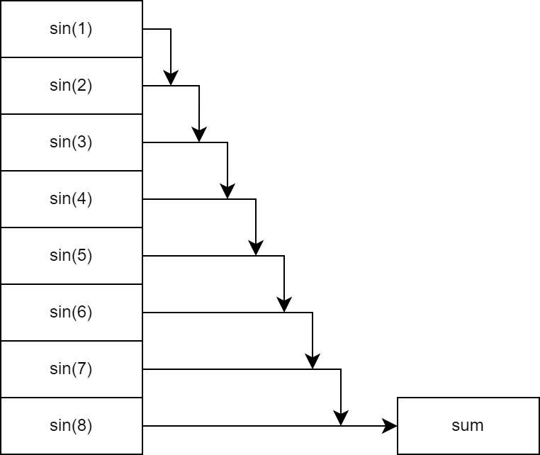
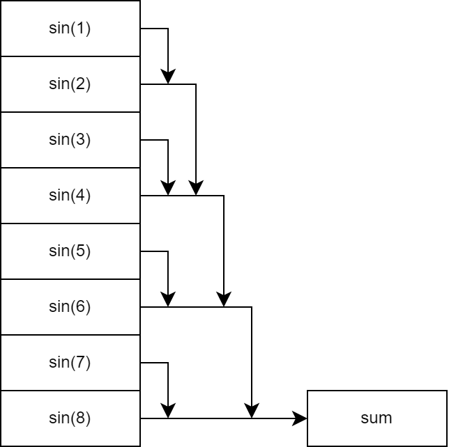
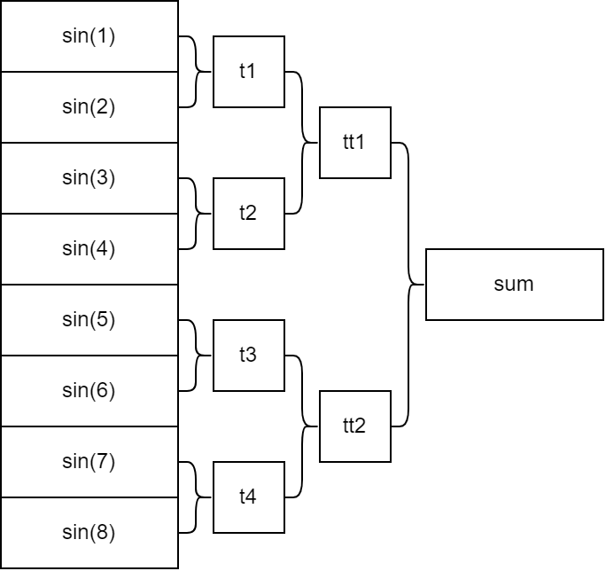
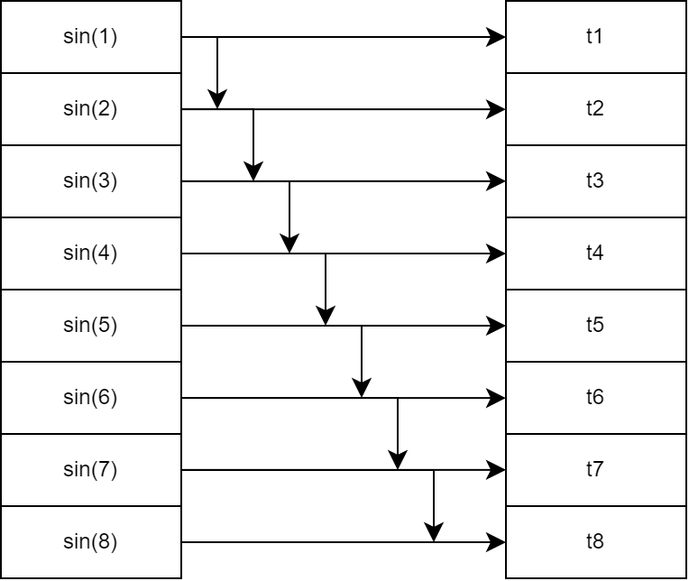
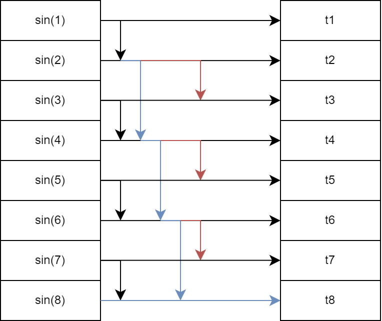
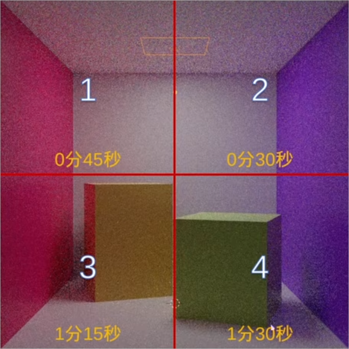
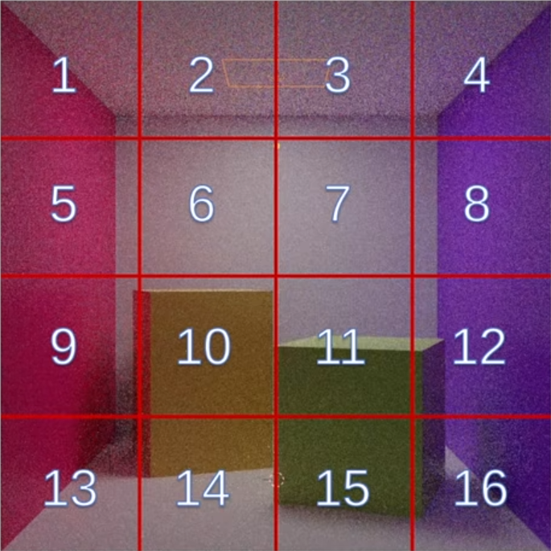
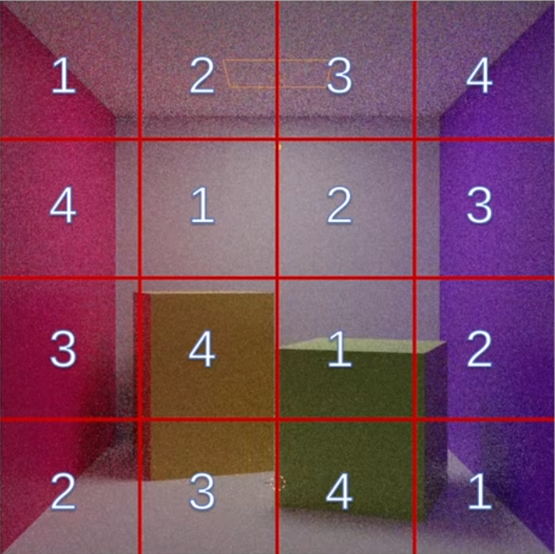
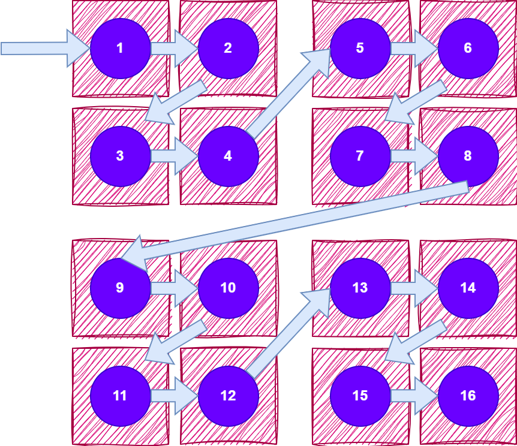
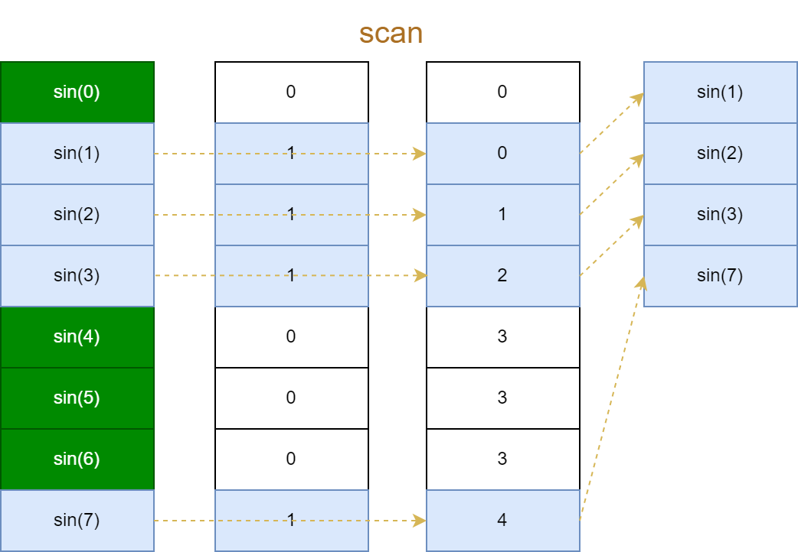

# TBB

## 基本介绍

### 下载安装

TBB 是因特尔开源的并行编程库，可以直接下载编译好的库

```embed
title: "oneAPI Threading Building Blocks (oneTBB) — oneTBB documentation"
image: "https://oneapi-src.github.io/oneTBB/_static/oneAPI-rgb-rev-100.png"
description: "By Intel"
url: "https://oneapi-src.github.io/oneTBB/index.html"
```

给出链接 tbb 库的项目配置

```cmake
cmake_minimum_required(VERSION 3.10)

project(main)

set(TBB_DIR "D:/lib/tbb/lib/cmake/tbb")
find_package(TBB CONFIG REQUIRED COMPONENTS tbb)

add_executable(main main.cpp)

target_link_libraries(main PUBLIC TBB::tbb)
```


### 任务组

任务组 `tbb:task_group` 可以启动多个任务，一个负责下载，一个负责用户交互。在主线程中等待该任务组中的任务全部执行完毕。例如

```cpp
#include <chrono>
#include <iostream>
#include <tbb/parallel_for.h>
#include <tbb/task_group.h>
#include <thread>

void download(std::string file) {
  for (int i = 0; i < 10; i++) {
    std::cout << "Downloading " << file << "(" << i * 10 << "%)..."
              << std::endl;
    std::this_thread::sleep_for(std::chrono::milliseconds(400));
  }
  std::cout << "Download complete: " << file << std::endl;
}

void interact() {
  std::string name;
  std::cin >> name;
  std::cout << "Hi, " << name << std::endl;
}

int main() {
  tbb::task_group tg;
    
  // 自动创建任务
  tg.run([&] { download("hello.zip"); });
  tg.run([&] { interact(); });
    
  // 阻塞并等待任务完成
  tg.wait();
  return 0;
}
```

与标准库中的线程不同，每个任务不一定对应一个线程，而是由 tbb 负责调度任务运行。


### 任务域

可以指定使用几个线程并行

```cpp
std::size_t n = 1 << 26;
std::vector<float> a(n);

// 指定 4 个线程
tbb::task_arena ta(4);
ta.execute([&] {
    tbb::parallel_for((std::size_t)0, (std::size_t)n,
                      [&](std::size_t i) { a[i] = std::sin(i); });
});
```


### 性能测试

TBB 提供了计时函数，可以用来测试耗费的时间，更加精简

```cpp
#define TICK(x) auto bench_##x = tbb::tick_count::now();
#define TOCK(x) std::cout << #x ": " << (tbb::tick_count::now() - bench_##x).seconds() << "s" << std::endl;
```


计算加速比
$$
加速比 = 串行用时/并行用时
$$
理想加速比应该是核心的数量。对于具有超线程的 CPU，内存密集型程序瓶颈在于内存，因此加速比接近逻辑核心数；而计算密集型程序瓶颈在于 ALU，因此加速比接近物理核心数。


## 并行接口

### 多任务

可以使用封装好的接口添加多个任务

```cpp
tbb::parallel_invoke([&] { 
    download("hello.zip"); 
}, [&] { 
    interact(); 
});
```


### 循环并行

#### 循环分块

对于循环调用的任务，可以使用 `parallel_for` 指定范围，tbb 能够自动对返回分块，作为 lambda 表达式的参数传入，只需要对每一块内容循环

```cpp
std::size_t n = 1 << 26;
std::vector<float> a(n);

tbb::parallel_for(tbb::blocked_range<std::size_t>(0, n),
                [&](tbb::blocked_range<std::size_t> r) {
                  for (std::size_t i = r.begin(); i < r.end(); i++) {
                    a[i] = std::sin(i);
                  }
                });
```


还可以使用更简单的写法

```cpp
tbb::parallel_for((std::size_t)0, (std::size_t)n,
                [&](std::size_t i) { 
                    a[i] = std::sin(i); 
                });    
```

但是这样每个 lambda 表达式只处理一次运算，编译器不能进行 SIMD 优化。


基于迭代器的分块并行接口

```cpp
tbb::parallel_for_each(a.begin(), a.end(), [&](float &f) { f = 32.0f; });
```


#### 多维分块

二维容器可以使用 `blocked_range2d` 作为循环块，包含 `rows, cols` 属性

```cpp
tbb::parallel_for(
  tbb::blocked_range2d<std::size_t>(0, n, 0, n),
  [&](tbb::blocked_range2d<std::size_t> r) {
    for (std::size_t i = r.cols().begin(); i < r.cols().end(); i++) {
      for (std::size_t j = r.rows().begin(); j < r.rows().end(); j++) {
        // do something
      }
    }
  });
```


三维容器可以使用 `blocked_range3d` 作为循环块，增加了 `pages` 属性

```cpp
tbb::parallel_for(
  tbb::blocked_range3d<std::size_t>(0, n, 0, n, 0, n),
  [&](tbb::blocked_range3d<std::size_t> r) {
    for (std::size_t p = r.pages().begin(); p < r.pages().end(); p++) {
      for (std::size_t i = r.cols().begin(); i < r.cols().end(); i++) {
        for (std::size_t j = r.rows().begin(); j < r.rows().end(); j++) {
          // do something
        }
      }
    }
  });
```


### Reduce

#### 基本概念

所谓 reduce (规约) 操作，就是将数组中的元素分别计算并累计。如图所示，最终累计得到所有元素正弦值之和。



对于规约操作，可以通过改变累计顺序来实现并行



这里分成 4 组进行计算，每组计算两个数的和，最后串行计算 4 组结果的和。将每步都分组计算，得到递归的计算模式，每一组计算都是并行



这种并行方案常用于核心很多的 GPU 并行计算。


#### 并行接口

使用 `parallel_reduce` 调用封装好的并行规约接口

```cpp
std::size_t n = 1 << 13;
float res = tbb::parallel_reduce(
  tbb::blocked_range<std::size_t>(0, n), (float)0,
  // 每块累计
  [&](tbb::blocked_range<std::size_t> r, float local_res) {
    for (std::size_t i = r.begin(); i < r.end(); i++) {
      local_res += std::sin(i);
    }
    return local_res;
  },
  // 最后串行将每块计算结果相加
  [](float x, float y) { return x + y; });
```

这一接口会根据计算情况动态地调整计算顺序，因此不能保证每次计算结果一致。可以使用

```cpp
tbb::parallel_deterministic_reduce
```

计算效率更低，但是能够保证每次运行结果一致。


#### 并行优势

并行规约除了在性能上更优以外，还能够得到更精确的结果。这是因为循环累计时，如果前面累计结果远大于每次累计的元素，就会导致两个数量级相差很大的浮点数相加，导致巨大的浮点误差，例如计算平均数。使用并行规约，由于进行分块累计，这样每组累计结果之间的数量级接近，相加时误差更小。


### Scan

#### 基本概念

所谓 scan (扫描) 操作，就是将数组中的元素分别计算并累计，同时保留每次累计的结果。如图所示



可以通过调整求和顺序来并行扫描



其中共有两次并行（竖向共线的两列）和一次串行求和。注意到之前串行共进行了 7 步 7 次计算，而并行后进行了 5 步 10 次计算，因此并行后用时更少，但是整体复杂度增加。


#### 并行接口

使用 `parallel_scan` 调用封装好的并行规约接口

```cpp
std::size_t n = 1 << 26;
std::vector<float> a(n);
float res = tbb::parallel_scan(
  tbb::blocked_range<std::size_t>(0, n), (float)0,
  [&](tbb::blocked_range<std::size_t> r, float local_res, auto is_final) {
    for (std::size_t i = r.begin(); i < r.end(); i++) {
      local_res += std::sin(i);
      // 保存累计结果
      if (is_final) {
        a[i] = local_res;
      }
    }
    return local_res;
  },
  [](float x, float y) { return x + y; });
```

其中 `is_final` 可能是任何可转换为 bool 的类型，有时可能是一个模板类，这样编译器可能针对 `is_final`的不同值，实例化多个函数，从而避免了循环内的条件分支，便于优化。


### 嵌套并行

#### 嵌套分块

在 `parallel_for` 内部可以嵌套 `parallel_for`

```cpp
std::size_t n = 1 << 13;
std::vector<float> a(n * n);
std::mutex mtx;

std::mutex mtx;
tbb::parallel_for((std::size_t)0, (std::size_t)n, [&](std::size_t i) {
    std::lock_guard<std::mutex> lck(mtx);
    tbb::parallel_for((std::size_t)0, (std::size_t)n, [&](std::size_t j) {
      a[i * n + j] = std::sin(i) * std::sin(j);
    });
});  
```

但是嵌套循环容易产生死锁问题。

> >
> TBB 使用工作窃取法分配任务：当线程 1 执行完所有工作时，会从另一个线程 2 的队列中取出任务，以免线程 1 闲置浪费时间。因此内部 for 循环可能窃取另一个外部 for 循环的任务，从而导致 `mtx` 重复上锁。


#### 递归锁

要解决死锁问题，应该使用递归锁

```cpp
std::recursive_mutex mtx;
```


#### 任务域隔离

创建一个新的任务域，不同的任务域之间不会窃取线程

```cpp
tbb::parallel_for((std::size_t)0, (std::size_t)n, [&](std::size_t i) {
    std::lock_guard<std::mutex> lck(mtx);

    // 创建任务域
    tbb::task_arena ta;
    ta.execute([&] {
      tbb::parallel_for((std::size_t)0, (std::size_t)n, [&](std::size_t j) {
        a[i * n + j] = std::sin(i) * std::sin(j);
      });
    });
});
```


更好的是使用同一个任务域，但是通过 `isolate` 隔离

```cpp
tbb::parallel_for((std::size_t)0, (std::size_t)n, [&](std::size_t i) {
    std::lock_guard<std::mutex> lck(mtx);
    tbb::this_task_arena::isolate([&] {
      tbb::parallel_for((std::size_t)0, (std::size_t)n, [&](std::size_t j) {
        a[i * n + j] = std::sin(i) * std::sin(j);
      });
    });
});
```


## 任务分配

对于并行计算，需要考虑如何将任务均匀地分配到每个线程，这就引出了几种分配方式。


### 均匀分块

以图像处理为例，最直接的方法是将图像均匀分为 4 块。然而，由于在 4 号块中物体分布密集，光线反射次数更多，计算缓慢，因此导致在这一块中的计算效率最低。当其它块已经计算完成并闲置时，只有 4 号还在计算，浪费了时间。




### 饱和分配

让线程数量超过 CPU 核心数，这时操作系统会自动启用时间片轮换调度，轮流执行每个线程。此时就能够确保每个线程始终能够被分配到计算任务，避免了资源浪费。



然而，通过操作系统切换多个线程本身有很大开销，因此更好的方案是将计算任务推送到任务队列中，每个线程在空闲时从队列中取出任务，这就是线程池技术。


### 任务窃取

TBB 使用的任务分配策略，每个线程分配一个任务队列，当某个线程的任务队列清空时，会从其它线程的任务队列中窃取任务。


### 随机分配法

由于队列实现较为复杂，并且还需要同步机制，因此依然有切换开销。一种奇妙的解法是将图像切分成 16 块，然后每一块按照坐标编号。编号 $(x,y)$ 的块分配给 `(x+y*3)%4` 号线程，这样每个线程分到的块位置随机，只要切分足够细，那么每个线程分到的总工作量大致均匀。



> >
> GPU 上这种方法称为网格跨步循环。


## 分区器

### 分配方案

#### static

指定 `static_partitioner` 参数，用来指定任务的大小。例如

```cpp
std::size_t n = 32;

tbb::task_arena ta(4);
ta.execute([&] {
    tbb::parallel_for(
        tbb::blocked_range<std::size_t>(0, n, 16),
        [&](std::size_t i) { a[i] = std::sin(i); }, tbb::static_partitioner{});
});
```

其中 `blocked_range` 指定范围和每个任务包含 16 个元素，`static_partitioner` 接收这个分配值。由于一共只有 32 个元素，因此只分配 2 个任务，创建 2 个线程。

> >
> 均匀分配任务对于每个循环体不均匀的情况效果不好。


如果不指定每个任务的元素数，则默认按照最大线程数分配。例如 n 个元素，自动分配为 n /4 个元素为一组

```cpp
std::size_t n = 1 << 26;
std::vector<float> a(n);

tbb::task_arena ta(4);
ta.execute([&] {
    tbb::parallel_for(
        tbb::blocked_range<std::size_t>(0, n),
        [&](tbb::blocked_range<std::size_t> r) {
          for (std::size_t i = r.begin(); i < r.end(); i++) {
            a[i] = std::sin(i);
          }
        },
        tbb::static_partitioner{});
});
```


#### simple

使用 `simple_partitioner` 指定每个任务包含 1 个元素，因此分配 32 个任务，创建 4 个线程

```cpp
tbb::task_arena ta(4);
ta.execute([&] {
    tbb::parallel_for(
        tbb::blocked_range<std::size_t>(0, n),
        [&](std::size_t i) { a[i] = std::sin(i); }, tbb::simple_partitioner{});
});
```

> >
> 由于任务分配足够细，因此对于循环体不均匀的情况效果很好。


可以手动指定每个任务的元素数

```cpp
ta.execute([&] {
    // 获得最大线程数
    auto numprocs = tbb::this_task_arena::max_concurrency();
    tbb::parallel_for(
        // 手动指定每个任务分配 n / 8 个元素
        tbb::blocked_range<std::size_t>(0, n, n / (2 * numprocs)),
        [&](tbb::blocked_range<std::size_t> r) {
          for (std::size_t i = r.begin(); i < r.end(); i++) {
            a[i] = std::sin(i);
          }
        },
        tbb::simple_partitioner{});
});
```


#### auto

使用 `auto_partitioner` 自动分配（默认）

```cpp
ta.execute([&] {
    tbb::parallel_for(
        tbb::blocked_range<std::size_t>(0, n),
        [&](std::size_t i) { a[i] = std::sin(i); }, tbb::auto_partitioner{});
});
```


#### affinity

使用 `affinity_partitioner` 会记录历史分配情况，下次根据经验自动负载均衡，因此会越来越快

```cpp
ta.execute([&] {
    tbb::affinity_partitioner aff;

    // 每循环一次都会加速
    for (int t = 0; t < 10; t++) {
      tbb::parallel_for(
          tbb::blocked_range<std::size_t>(0, n),
          [&](tbb::blocked_range<std::size_t> r) {
            for (std::size_t i = r.begin(); i < r.end(); i++) {
              // volatile 禁止优化
              for (volatile int j = 0; j < i * 1000; j++)
                ;
            }
          },
          aff);
    }
});
```


### 访存优化

对比默认使用的 `auto_partitioner`和指定分配大小的 `simple_partitioner` 对矩阵转置的并行效果

```cpp
std::size_t n = 1 << 14;
std::vector<float> a(n * n);
std::vector<float> b(n * n);

TICK(transpose);
tbb::parallel_for(
  tbb::blocked_range2d<std::size_t>(0, n, 0, n),
  [&](tbb::blocked_range2d<std::size_t> r) {
    for (std::size_t i = r.cols().begin(); i < r.cols().end(); i++) {
      for (std::size_t j = r.rows().begin(); j < r.rows().end(); j++) {
        b[i * n + j] = a[j * n + i];
      }
    }
  });
TOCK(transpose);

TICK(transpose_simple);
std::size_t grain = 16;
tbb::parallel_for(
  tbb::blocked_range2d<std::size_t>(0, n, grain, 0, n, grain),
  [&](tbb::blocked_range2d<std::size_t> r) {
    for (std::size_t i = r.cols().begin(); i < r.cols().end(); i++) {
      for (std::size_t j = r.rows().begin(); j < r.rows().end(); j++) {
        b[i * n + j] = a[j * n + i];
      }
    }
  },
  tbb::simple_partitioner{});
TOCK(transpose_simple);
```

将会得到

```shell
transpose: 2.12599s
transpose_simple: 0.590137s  
```


这是因为 `simple_partitioner` 能够按照给定的大小 grain 将矩阵进行分块。块内部小区域按照常规的两层循环访问以便矢量化，块外部大区域以 Z 型曲线遍历，这样能够确保每次访问的数据地址更靠近，因此都是最近访问的内容，可以直接在缓存中读写，避免了内存读写延迟。




## 并发容器

### vector

标准库中的 vector 容器内部保存一个指针，指向一段容量为 capacity 大小为 size 的内存。当 push_back 导致 size 等于大于容量时，就会将 capacity 变为 size 的两倍，并将旧数据移动过去。这就会导致前半段元素的地址改变，之前保存的指针和迭代器会失效。解决方案是预先分配足够大的容量

```cpp
std::size_t n = 1 << 10;
std::vector<float> a;
a.reserve(n);
```


### concurrent_vector

TBB 提供了 ` concurrent_vector` 容器，它不保证内存连续，但是扩容时不需要移动位置，指针和迭代器不会失效。例如保存每次推入后的元素地址

```cpp
std::size_t n = 1 << 14;

tbb::concurrent_vector<float> a;
std::vector<float *> pa(n);

std::vector<float> b;
std::vector<float *> pb(n);

for (std::size_t i = 0; i < n; i++) {
    auto it = a.push_back(std::sin(i));
    pa[i] = &*it;

    b.push_back(std::sin(i));
    pb[i] = &b.back();
}
```

考虑到并行时，可能会有多个线程同时推入元素，因此 `concurrent_vector` 在 `push_back` 时直接返回一个元素迭代器，防止 `back` 访问到错误的元素。


### grow_by

可以通过 `grow_by` 一次性扩容指定大小

```cpp
for (std::size_t i = 0; i < n; i++) {
    auto it = a.grow_by(2);
    *it++ = std::cos(i);
    *it++ = std::sin(i);
}
```


### 连续访问

由于容器内存不连续，因此通过索引访问要比通过迭代器访问效率更低（索引访问每次需要从头查找元素，而迭代器可以直接获得下一个迭代器位置）。


## 并行筛选

### 筛选

考虑计算 `sin` 数组并过滤大于零的部分，标准库实现为

```cpp
std::size_t n = 1 << 25;

std::vector<float> a;
TICK(filter);
for (std::size_t i = 0; i < n; i++) {
    float val = std::sin(i);
    if (val > 0)
      a.push_back(val);
}
TOCK(filter);
```

计算耗时

```shell
filter: 1.53668s
```


### 并行加速

使用 `concurrent_vector` 并行

```cpp
tbb::concurrent_vector<float> b;
TICK(filter_concurrent);
tbb::parallel_for(tbb::blocked_range<std::size_t>(0, n),
                [&](tbb::blocked_range<std::size_t> r) {
                  for (std::size_t i = r.begin(); i < r.end(); i++) {
                    float val = std::sin(i);
                    if (val > 0)
                      b.push_back(val);
                  }
                });
TOCK(filter_concurrent);
```

计算耗时

```shell
filter_concurrent: 0.93655s
```

虽然有加速，但是并不显著，这可能是因为 `concurrent_vector` 内部有互斥量，为了安全性降低了效率。


### 局部缓存

使用局部数组保存筛选结果，每一轮计算完成后再一次性推入

```cpp
tbb::concurrent_vector<float> c;
TICK(filter_local);
tbb::parallel_for(tbb::blocked_range<std::size_t>(0, n),
                [&](tbb::blocked_range<std::size_t> r) {
                  std::vector<float> local_a;
                  local_a.reserve(r.size());
                  for (std::size_t i = r.begin(); i < r.end(); i++) {
                    float val = std::sin(i);
                    if (val > 0)
                      local_a.push_back(val);
                  }
                  auto it = c.grow_by(local_a.size());
                  std::copy(local_a.begin(), local_a.end(), it);
                });
TOCK(filter_local);
```

计算耗时

```shell
filter_local: 0.670549s
```


### 连续存储

如果需要保证结果储存在连续内存中，就不能使用 `concurrent_vector`，改为使用标准容器

```cpp
std::vector<float> d;
std::mutex mtx;
TICK(filter_continue);
d.reserve(n * 2 / 3);	// sin(1) ~ sin(n) 中非负值不超过 2 / 3
tbb::parallel_for(tbb::blocked_range<std::size_t>(0, n),
                [&](tbb::blocked_range<std::size_t> r) {
                  std::vector<float> local_a;
                  local_a.reserve(r.size());
                  for (std::size_t i = r.begin(); i < r.end(); i++) {
                    float val = std::sin(i);
                    if (val > 0)
                      local_a.push_back(val);
                  }
                  std::lock_guard<std::mutex> lck(mtx);
                  std::copy(local_a.begin(), local_a.end(),
                            std::back_inserter(d));
                });
TOCK(filter_continue);
```

这里利用互斥量和线程锁避免数据竞争，同时利用 `reserve` 预先分配容量。计算耗时

```shell
filter_continue: 0.561988s
```


### GPU 并行

如果要设计利于 GPU 多核并行的方法，或者需要确保筛选前后元素的顺序不变。可以将筛选分为三部分

1. 计算出所有结果并保存
2. 标记扫描得到每个结果要保存的位置
3. 将每个结果保存到对应的位置



如图所示，蓝色标记的是非负项，首先标记这些项，然后扫描累计后得到每一项要保存的位置。代码实现为

```cpp
std::vector<float> e(n);
TICK(filter_order);
tbb::parallel_for(tbb::blocked_range<std::size_t>(0, n),
                [&](tbb::blocked_range<std::size_t> r) {
                  for (std::size_t i = r.begin(); i < r.end(); i++) {
                    e[i] = std::sin(i);
                  }
                });

std::vector<std::size_t> ind(n + 1);
ind[0] = 0;
tbb::parallel_scan(
  tbb::blocked_range<std::size_t>(0, n), (std::size_t)0,
  [&](tbb::blocked_range<std::size_t> r, std::size_t sum, auto is_final) {
    for (auto i = r.begin(); i < r.end(); i++) {
      sum += e[i] > 0 ? 1 : 0;
      if (is_final)
        ind[i + 1] = sum;
    }
    return sum;
  },
  [](std::size_t x, std::size_t y) { return x + y; });

std::vector<float> res(ind.back());
tbb::parallel_for(tbb::blocked_range<std::size_t>(0, n),
                [&](tbb::blocked_range<std::size_t> r) {
                  for (auto i = r.begin(); i < r.end(); i++) {
                    if (e[i] > 0)
                      res[ind[i]] = e[i];
                  }
                });

TOCK(filter_order);
```

计算耗时

```shell
filter_order: 0.741963s
```


## 并行分治

### 斐波那契数列

使用递归实现斐波那契数列

```cpp
int serial_fib(int n) {
  if (n < 2)
    return n;
  int first = serial_fib(n - 1);
  int second = serial_fib(n - 2);
  return first + second;
}

TICK(fib);
std::cout << serial_fib(45) << std::endl;
TOCK(fib);
```

计算耗时

```shell
fib: 13.2153s
```


如果直接对 `first, second` 并行，效果不会很好

```cpp
int parallel_fib(int n) {
  if (n < 2)
    return n;
  int first, second;
  tbb::parallel_invoke([&] { first = parallel_fib(n - 1); },
                       [&] {
                         second = parallel_fib(n - 2);
                       });
  return first + second;
}
```

事实上，由于任务分配数量过多，而后期 `n` 很小时，计算量又很小，这就导致巨大的线程调度负担，甚至不能计算出结果。


对于足够小的任务，可以将其转为串行，缓解调度负担 scheduling overhead

```cpp
int parallel_fib(int n) {
  if (n < 29)
    return serial_fib(n);
  int first, second;
  tbb::parallel_invoke([&] { first = parallel_fib(n - 1); },
                       [&] {
                         second = parallel_fib(n - 2);
                       });
  return first + second;
}

TICK(parallel_fib);
std::cout << parallel_fib(45) << std::endl;
TOCK(parallel_fib);
```

计算耗时

```shell
parallel_fib: 6.83455s 
```


### 快速排序

TBB 中封装好了并行的快速排序算法

```cpp
std::size_t n = 1 << 24;
std::vector<int> arr(n);

std::generate(arr.begin(), arr.end(), std::rand);
TICK(sort);
std::sort(arr.begin(), arr.end());
TOCK(sort);

std::generate(arr.begin(), arr.end(), std::rand);
TICK(tbb_sort);
tbb::parallel_sort(arr.begin(), arr.end());
TOCK(tbb_sort);
```

计算耗时

```shell
sort: 2.49896s
tbb_sort: 0.899783s   
```

这里 TBB 就使用了并行分治，对每个递归的快速排序函数创建并行任务，同时设置截断阈值，排序规模小于阈值的调用使用串行，减轻调度负担。


## 流水线并行

### 多步处理

考虑对一个大规模数据的多步处理

```cpp
struct Data {
  float data[64];

  void step1() {
    for (int i = 0; i < 64; i++)
      data[i] = i;
  }

  void step2() {
    for (int i = 1; i < 64; i++)
      data[i] *= data[i - 1];
  }

  void step3() {
    for (int i = 0; i < 64; i++)
      data[i] = std::sin(data[i]) * std::cos(data[i]);
  }

  void step4() {
    for (int i = 0; i < 64; i++)
      data[i] = std::abs(data[i]);
  }
};

std::size_t n = 1 << 20;
std::vector<Data> datas(n);

TICK(process);
for (auto &dat : datas) {
    dat.step1();
    dat.step2();
    dat.step3();
    dat.step4();
}
TOCK(process);
```

计算耗时

```shell
process: 1.81205s
```


### 直接并行

使用 tbb 并行加速

```cpp
TICK(tbb_process);
tbb::parallel_for_each(datas.begin(), datas.end(), [&](Data &dat) {
    dat.step1();
    dat.step2();
    dat.step3();
    dat.step4();
});
TOCK(tbb_process);
```

计算耗时

```shell
tbb_process: 0.637444s
```

由于每一步循环需要执行 4 步操作，指令缓存频繁更新，因此不利于 CPU 发挥性能。


### 分步并行

更好的方案是将循环体拆分

```cpp
TICK(tbb_split_process);
tbb::parallel_for_each(datas.begin(), datas.end(),
                     [&](Data &dat) { dat.step1(); });
tbb::parallel_for_each(datas.begin(), datas.end(),
                     [&](Data &dat) { dat.step2(); });
tbb::parallel_for_each(datas.begin(), datas.end(),
                     [&](Data &dat) { dat.step3(); });
tbb::parallel_for_each(datas.begin(), datas.end(),
                     [&](Data &dat) { dat.step4(); });
TOCK(tbb_split_process);
```

计算耗时

```shell
tbb_split_process: 0.679388s
```

> >
> 这里反而变慢，可能是因为 `step` 函数过于简单。这说明并行优化需要根据实际计算需求确定方案。


### 流水线并行

TBB 提供了一种流水线并行模式：它将执行的 4 个步骤拆分成流水线，由每个线程只执行其中的一个步骤，因此避免了指令集的频繁切换；并且当前一个步骤执行完毕时，后一个步骤的线程可以立即使用前一个步骤计算出的数据，又避免了缓存更新的开销。

> >
> 数据处理过程存在依赖关系时，比较适合使用流水线并行。

在流水线中，每个步骤的输入输出类型由模板参数指定

```cpp
TICK(tbb_pipline_process);
auto it = datas.begin();
tbb::parallel_pipeline(
  2,
  // serial_in_order：当前步骤必须串行，且顺序必须一致。在函数体内部保证顺序一致性模型。
  tbb::make_filter<void, Data *>(tbb::filter_mode::serial_in_order,
                                 [&](tbb::flow_control &fc) -> Data * {
                                   if (it == datas.end()) {
                                     fc.stop();
                                     return nullptr;
                                   }
                                   return &*it++;
                                 }),
  // parallel：当前步骤可以乱序并行
  tbb::make_filter<Data *, Data *>(tbb::filter_mode::parallel,
                                   [&](Data *dat) -> Data * {
                                     dat->step1();
                                     return dat;
                                   }),
  tbb::make_filter<Data *, Data *>(tbb::filter_mode::parallel,
                                   [&](Data *dat) -> Data * {
                                     dat->step2();
                                     return dat;
                                   }),
  tbb::make_filter<Data *, Data *>(tbb::filter_mode::parallel,
                                   [&](Data *dat) -> Data * {
                                     dat->step3();
                                     return dat;
                                   }),
  // serial_out_of_order：当前步骤必须串行，可以乱序
  tbb::make_filter<Data *, void>(tbb::filter_mode::serial_out_of_order,
                                 [&](Data *dat) -> void { dat->step4(); }));
TOCK(tbb_pipline_process);
```

计算耗时

```shell
tbb_pipline_process: 1.50291s
```

> >
> TBB 的流水线比传统的流水线更加优化，线程之间可以辅助计算，避免闲置浪费。