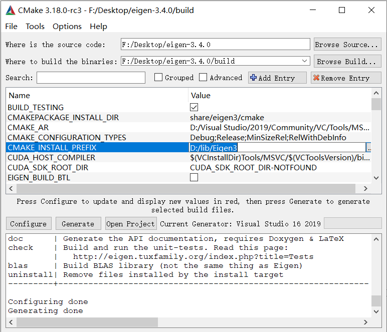

# LAPACK

## 安装配置

### 环境包

需要安装 gfortran 和 cmake

```shell
sudo apt-get install gfortran
```


### BLAS 库和 CBLAS 接口

**BLAS（basic linear algebra subroutine）** 是一系列基本**线性代数运算**函数的接口（interface）标准。BLAS 不是某种具体实现，不同的作者可以各自写出不同版本的 BLAS 库，实现同样的接口和功能，但每个函数内部的算法可以不同。BLAS 的官网可以浏览完整的说明文档以及下载源代码。

```embed
title: "BLAS (Basic Linear Algebra Subprograms)"
image: "https://www.netlib.org/blas/Jack-SIAM-Interview.jpg"
description: "SUBROUTINE ECGEMV ( TRANS, M, N, ALPHA, A, LDA, X, INCX, BETA, Y, INCY )"
url: "https://www.netlib.org/blas/"
```

这个版本的 BLAS 被称为 reference BLAS，运行速度较慢，通常被其他版本用于衡量性能。


对于 Intel CPU 的计算机，性能最高的是 Intel 的 **MKL （Math Kernel Library）** 中提供的 BLAS 。MKL 虽然不是一个开源软件，但目前可以免费下载使用。如果想要免费开源的版本，可以尝试 OpenBlas 或者 ATLAS

```embed
title: "OpenBLAS : An optimized BLAS library"
image: ""
description: "Slate is a responsive theme for GitHub Pages"
url: "https://www.openblas.net/"
```

```embed
title: "math-atlas"
image: "https://sourceforge.net/favicon.ico"
description: ""
url: "https://sourceforge.net/projects/math-atlas/"
```

另外，无论是否使用 MKL，BLAS 的文档都推荐看 MKL 的相关页面 。

```embed
title: "Resource & Documentation Center"
image: "https://www.intel.com/etc.clientlibs/settings/wcm/designs/intel/us/en/images/resources/printlogo.png"
description: "Get the resources, documentation and tools you need for the design, development and engineering of Intel® based hardware solutions."
url: "https://www.intel.com/content/www/us/en/resources-documentation/developer.html"
```


#### 安装 blas

```shell
wget http://www.netlib.org/blas/blas.tgz
tar -xzvf blas.tgz
cd BLAS-3.10.0
make
sudo cp blas_LINUX.a /usr/local/lib/libblas.a
# 将 blas_LINUX.a 复制到系统库中
# 也可以使用 ln -sf ~/BLAS-3.10.0/blas_LINUX.a /usr/local/lib/libblas.a 进行链接
```


#### 安装 cblas

```shell
wget http://www.netlib.org/blas/blast-forum/cblas.tgz
tar -xavf cblas.tgz
cd CBLAS
cp Makefile.LINUX Makefile.in
# 修改 Makefile.in ，指出 libblas.a 的位置
# BLLIB = /usr/local/lib/libblas.a
make
sudo cp lib/cblas_LINUX.a /usr/local/lib/libcblas.a
# 将 cblas_LINUX.a 复制到系统库中
```


### 安装 LAPACK

由于 github 官网链接下载太慢，直接在 

```embed
title: "LAPACK — Linear Algebra PACKage"
image: "https://www.netlib.org/lapack/images/lapack1.jpg"
description: "LAPACK is a software package provided by Univ. of Tennessee; Univ. of California, Berkeley; Univ. of Colorado Denver; and NAG Ltd…"
url: "http://www.netlib.org/lapack/"
```

寻找最新版本下载

```shell
tar -xzvf lapack-3.10.0.tar.gz 
cd lapack-3.10.0 
cp make.inc.example make.inc 
# 修改其中 BLASLIB 和 CBLASLIB 路径 
make lib
sudo cp liblapack.a /usr/local/lib/ 
sudo cp libtmglib.a /usr/local/lib/
# 将 liblapack.a 、libtmglib.a 复制到系统库中

cd TESTING
make # 编译 lapack 文件
cd LAPACKE # 进入 LAPACKE 文件夹
make # 编译 lapacke
cp include/*.h /usr/local/include/
# 复制全部头文件到系统头文件目录
cp .. # 返回上一级
cp *.a /usr/local/lib/ 
# 复制全部库文件到系统库目录
```


## 基本框架

### 概述

LAPACK API 支持两种形式：标准的 ANSI C 和标准的 FORTRAN 。每个 LAPACK 例程都有四个形式：

|      精度      | 例程前缀 |
| :------------: | :------: |
|      REAL      |    S     |
|  REAL DOUBLE   |    D     |
|    COMPLEX     |    C     |
| COMPLEX DOUBLE |    Z     |


#### 函数命名规则

* LAPACK 中的每个函数名已经说明了该函数的使用规则
* 所有函数都是以 XYYZZZ 的形式命名
* 对于某些函数，没有第六个字符，只是 XYYZZ 的形式
* X 代表数据类型(S D C Z)，YY 代表数组的类型，ZZZ代表计算方法

在新版中，使用重复迭代法的函数 DSGESV 和 ZCDESV 头两个字母表示使用的精度

* DS 输入双精度，算法使用单精度
* ZC 输入使用 DOUBLE COMPLEX，算法使用 COMPLEX 单精度


**几种常用的数组类型**

|              记号               |      类型      |
| :-----------------------------: | :------------: |
|          DI (diagonal)          |     对角阵     |
|        GB (general band)        |  一般带状矩阵  |
|          GE (general)           |    一般矩阵    |
|    GT (general tridiagonal)     |  一般三对角阵  |
|      OR (real orthogonal)       |    实正交阵    |
|       SB (real symmetric)       |  实对称带状阵  |
| ST (real symmetric tridiagonal) | 实对称三对角阵 |
|         SY (symmetric)          |     对称阵     |
|       TB (triangularband)       | 三角形带状矩阵 |


#### [编译指令](https://blog.csdn.net/aq1234xyq/article/details/84894723)

使用 gfortran 编译，通过`-l`导入静态库；**导入静态库的顺序不能变**

```shell
gfortran test.cpp -o test -llapacke -llapack -lblas
```

此时程序必须使用 C 语言编写。


* 链接 C++ 库

通过添加参数来调用 C++ 相关的库和使用新标准

```shell
gfortran test.cpp -o test -llapacke -llapack -lblas -lstdc++ -std=c++11 # 链接 C++ 标准库 + C++11 标准
```


* 链接 fortran 库

如果使用 g++ 进行编译，则需要链接 fortran 库

```shell
g++ test.cpp -o test -llapacke -llapack -lblas -lgfortran
```

另外，需要注意的是，由于高版本的 gcc 默认会在编译参数中添加 [-fPIC](https://blog.csdn.net/derkampf/article/details/69660050) 参数以实现相对路径的共享，因此可能导致编译时不能正确链接库，这时就需要添加 -no-pie 参数来取消 -fPIC 参数

```shell
g++ test.cpp -o test -llapacke -llapack -lblas -lgfortran -no-pie
```


* 使用 extern 修饰

```cpp
extern void c_func1(float*, int);  	 // 使用 C++ 的编译修饰规则，Fortran 无法调用
extern "C" int c_func2();            // 使用 C 的编译修饰规则，Fortran 可以调用
```


### LAPACK 语法

Lapack 函数手册

```embed
title: "lapack/single"
image: "https://www.netlib.org/favicon.ico"
description: "Click here to see the number of accesses to this library."
url: "http://www.netlib.org/lapack/single/"
```

```embed
title: "lapack/double"
image: "https://www.netlib.org/favicon.ico"
description: "Click here to see the number of accesses to this library."
url: "http://www.netlib.org/lapack/double/"
```

```embed
title: "lapack/complex"
image: "https://www.netlib.org/favicon.ico"
description: "Click here to see the number of accesses to this library."
url: "http://www.netlib.org/lapack/complex/"
```

```embed
title: "lapack/complex16"
image: "https://www.netlib.org/favicon.ico"
description: "Click here to see the number of accesses to this library."
url: "http://www.netlib.org/lapack/complex16"
```


#### 区分例程

通过 XYYZZZ 中部分类型的组合，我们可以得到不同的函数 `LAPACK_XYYZZZ`

```cpp
// Linear system, solve Ax = b
LAPACKE_XYYsv(); 	// 标准求解
LAPACKE_XYYsvx(); 	// 精确求解：包括 A'x = b，条件数，误差分析等

// Linear least squares, minimize ||b - Ax||2
LAPACKE_XYYls(); 	// A满秩，QR求解
```


#### 参数格式

```cpp
// 标准求解 Ax = B A = N x N, B = N x NRHS, X = N x NRHS
lapack_int LAPACKE_dgesv( 
    int matrix_layout, 		 // 矩阵的格式
    lapack_int n,			// 方程组的行数，也即矩阵 A 的行数
    lapack_int nrhs,		// rhs: right-hand-side 右边矩阵的列数，也即 B 的列数
                          
    double* a, 				// 矩阵 A
    lapack_int lda, 		// 数组 A 的主尺寸，这是存放矩阵 A 的数组的尺寸，不小于 N
    lapack_int* ipiv,		// 长为 N 的数组，用于定义置换矩阵 P，一般初始化为0即可
                          
    double* b, 				// 矩阵 B
    lapack_int ldb 			// 数组 B 的主尺寸，这是存放矩阵 B 的数组的尺寸，不小于 N
);
//
```

**matrix_layout**

* LAPACK_ROW_MAJOR 按行求解（标准）
* LAPACK_COL_MAJOR 按列求解


### LAPACK 函数

#### degsv

求解一般实线性方程组 $AX=B$ ，其中 $A\in\mathbb{R}^{N\times N},\ X,B\in\mathbb{R}^{N\times NRHS}$ ，并且要求 $A$ 可逆。求解过程使用列主元 $LU$ 分解法，
$$
A = PLU
$$
其中 $P$ 是置换阵， $L,U$ 分别为上下三角阵。

```cpp
lapack_int LAPACKE_dgesv( int matrix_layout, lapack_int n, lapack_int nrhs,
                          double* a, lapack_int lda, lapack_int* ipiv,
                          double* b, lapack_int ldb );
```

参数：

* N - 线性方程的个数，也就是 $A$ 的阶数
* NRHS - 矩阵 $B$ 的列数
* A - 矩阵 $A$ ，返回储存 $A$ 的 $LU$ 分解
* LDA - 数组 $A$ 的行维数， $LDA \ge \max(1,N)$ 
* IPIV - 存放返回维数为 $N$ 的置换向量，行 $i$ 被替换为行 $IPIV(i)$ 
* B - 矩阵 $B$ 
* LDB - 数组 $B$ 的行维数， $LDB\ge \max(1,N)$ ，注意是数组 $B$ ，如果是单列向量，行数是 1

返回 INFO 存放计算标识：

* 0 成功退出
* `< 0` 若 `INFO = -i` ，则第 $i$ 个变量是一个不可接受的值
* `> 0` 若 `INFO = i` ，则 $U(i,i)$ 为零，因式分解完成，但 $U$ 不可逆


#### dgels

求解超定或欠定实线性方程组，涉及 $A\in\mathbb{R}^{M\times N}$ 或者它的转置，使用 $QR$ 或 $LQ$ 分解，它假定 $A$ 满秩。

```cpp
lapack_int LAPACKE_dgels( int matrix_layout, char trans, lapack_int m,
                          lapack_int n, lapack_int nrhs, double* a,
                          lapack_int lda, double* b, lapack_int ldb );
```

可选参数 TRANS ：

* 若 `TRANS = 'N', m>= n` ：求超定系统 $\|B-AX\|$ 的最小解
* 若 `TRANS = 'N', m<n` ：求欠定系统的最小解
* 若 `TRANS = 'T', m>= n` ：求欠定系统 $A^TX=B$ 的最小解
* 若 `TRANS = 'T', m<n` ：求超定系统 $\|B-A^TX\|$ 的最小解

右边向量 $b$ 和解向量 $x$ 分别存放为 $M\times NRHS$ 矩阵 $B$ 和 $N\times NRHS$ 矩阵 $X$ 。

参数：

* TRANS - 如上
* M - 矩阵 $A$ 的行数
* N - 矩阵 $A$ 的列数
* NRHS - 矩阵 $B$ 的列数
* A - 矩阵 $A$ ，如果 $M>=N$ ，则 $A$ 由 $QR$ 分解覆盖；否则 $A$ 由 $LQ$ 分解覆盖
* LDA - 数组 $A$ 的行维数， $LDA\ge\max(1,M)$ 
* B - 矩阵 $B$ ，情况比较复杂，只考虑 `TRANS = 'N', m>=n` ，此时第 1 到 n 行包含最小二乘向量，第 n+1 到 M 行每列的平方和给出残向量 $B-AX$ 每列的平方和
* LDB - 数组 $B$ 的行维数， $LDB\ge \max(1,M,N)$ 


#### dsyev

求解实对称矩阵 $A$ 的所有特征值和对应的特征向量

```cpp
lapack_int LAPACKE_dsyev( int matrix_layout, char jobz, char uplo, lapack_int n,
                          double* a, lapack_int lda, double* w );
```

参数：

* JOBZ - 若为 `'N'` ，表示只计算特征值；若为 `'V'` 表示计算特征值和特征向量
* UPLO - 若为 `'U'` ，表示存放 $A$ 的上三角部分；若为 `'L'` ，表示存放 $A$ 的下三角部分
* N - 矩阵 $A$ 的阶数
* A - 矩阵 $A$ ，如果 UPLO 为 `'U'` ，则 $A$ 的前 $N\times N$ 上三角部分存放在上三角部分（因为没有必要存放整个 $A$ ），反之同理；如果 JOBZ 为 `'V'` ，则 $A$ 存放正交特征向量；否则根据 UPLO 返回 $A$ 其部分，其它部分会被摧毁
* LDA - 数组 $A$ 的行维数， $LDA\ge\max(1,N)$ 
* W - 返回维数为 $N$ 的向量，升序存放特征值


#### dgees

求解实非对称矩阵 $A\in\mathbb{R}^{n\times n}$ 的特征值，实 Schur 分解，以及 Schur 向量的矩阵，给出 Schur 分解 $A = ZTZ^T$ ；也可以选择将对角线上的特征值排序，则 $Z$ 的第一列就是对应特征值子空间的一个正交基。

```cpp
lapack_int LAPACKE_dgees( int matrix_layout, char jobvs, char sort,
                          LAPACK_D_SELECT2 select, lapack_int n, double* a,
                          lapack_int lda, lapack_int* sdim, double* wr,
                          double* wi, double* vs, lapack_int ldvs );
```

参数：

* JOBVS - 若为 `'N'` ，则不计算 Schur 向量；若为 `'V'` 则计算
* SORT - 若为 `'N'` ，则不对对角特征值排序；若为 `'S'` 则排序
* SELECT - 参数过于复杂，当 SORT 为 `'N'` ，此参数不被引用
* N - 矩阵 $A$ 的阶数
* A - 矩阵 $A$ ，返回 Schur 标准型
* LDA - 数组 $A$ 的行维数， $LDA\ge\max(1,N)$ 
* SDIM - 返回值，若 SORT 为 `'N'` ，返回 0
* WR - 返回 $N$ 维数组
* WI - 返回 $N$ 维数组，它们分别存放特征值的实部和虚部，共轭特征对会以虚部为正负的顺序连续出现
* VS - 返回 $LDVS\times N$ 数组，若 JOBVS 为 `'V'` ，则其中包含 Schur 向量构成的正交阵 $Z$ ；否则不被引用
* LDVS - 数组 VS 的行维数


#### dgecon

计算一般实矩阵 $A$ 的条件数

```cpp
lapack_int LAPACKE_dgecon( int matrix_layout, char norm, lapack_int n,
                           const double* a, lapack_int lda, double anorm,
                           double* rcond );
```

参数：

* NORM - 若为 `'1'` 表示 1 范数，为 `'I'` 表示无穷范数
* N - 矩阵 $A$ 的阶数
* A - 矩阵 $A$ 
* LDA - 数组 $A$ 的行维数， $LDA\ge\max(1,N)$ 
* ANORM - 初始矩阵的范数
* RCOND - 返回 `RCOND = 1/(norm(A) * norm(inv(A)))` 


#### dgehrd

通过正交变换 $Q^TAQ =H$ 将一般实矩阵 $A$ 化为上 Hessenberg 阵 $H$ 。

```cpp
lapack_int LAPACKE_dgehrd( int matrix_layout, lapack_int n, lapack_int ilo,
                           lapack_int ihi, double* a, lapack_int lda,
                           double* tau );
```

参数：

* N - 矩阵 $A$ 的阶数
* ILO - 输入整型
* IHI - 输入整型；它们假设矩阵 $A$ 已经在 `1:ILO-1` 行列和 `IHI+1:N` 行列部分上三角化。只有当已经调用了 dgebal 后才会设置它们，否则请将它们分别设为 1 和 N
* A - 矩阵 $A$ ，返回上三角和次对角线为上 Hessenberg 化矩阵 $H$ ，剩下的元素和 TAU 一起存放正交阵 $Q$ 
* LDA - 数组 $A$ 的行维数， $LDA\ge\max(1,N)$ 
* TAU - 返回 $N-1$ 维数组，存放变换阵的标量因子，具体解释如下：

```cpp
/*  Further Details
*  ===============
*
*  The matrix Q is represented as a product of (ihi-ilo) elementary
*  reflectors
*
*     Q = H(ilo) H(ilo+1) . . . H(ihi-1).
*
*  Each H(i) has the form
*
*     H(i) = I - tau * v * v**T
*
*  where tau is a real scalar, and v is a real vector with
*  v(1:i) = 0, v(i+1) = 1 and v(ihi+1:n) = 0; v(i+2:ihi) is stored on
*  exit in A(i+2:ihi,i), and tau in TAU(i).
*
*  The contents of A are illustrated by the following example, with
*  n = 7, ilo = 2 and ihi = 6:
*
*  on entry,                        on exit,
*
*  ( a   a   a   a   a   a   a )    (  a   a   h   h   h   h   a )
*  (     a   a   a   a   a   a )    (      a   h   h   h   h   a )
*  (     a   a   a   a   a   a )    (      h   h   h   h   h   h )
*  (     a   a   a   a   a   a )    (      v2  h   h   h   h   h )
*  (     a   a   a   a   a   a )    (      v2  v3  h   h   h   h )
*  (     a   a   a   a   a   a )    (      v2  v3  v4  h   h   h )
*  (                         a )    (                          a )
*
*  where a denotes an element of the original matrix A, h denotes a
*  modified element of the upper Hessenberg matrix H, and vi denotes an
*  element of the vector defining H(i).
*/
```


#### dgeqrf

计算一个实 $M\times N$ 矩阵 $A$ 的 $QR$ 分解

```cpp
lapack_int LAPACKE_dgeqrf( int matrix_layout, lapack_int m, lapack_int n,
                           double* a, lapack_int lda, double* tau );
```

参数：

* M - 矩阵 $A$ 的行数
* N - 矩阵 $A$ 的列数
* A - 矩阵 $A$ ，返回上三角部分为 $R$ ，其下的部分和 TAU 存放正交阵 $Q$ 
* LDA - 数组 $A$ 的行维数， $LDA\ge\max(1,M)$ 
* TAU - 返回标量因子 $\min(M,N)$ 维向量，具体解释如下：

```cpp
/*  Further Details
*  ===============
*
*  The matrix Q is represented as a product of elementary reflectors
*
*     Q = H(1) H(2) . . . H(k), where k = min(m,n).
*
*  Each H(i) has the form
*
*     H(i) = I - tau * v * v**T
*
*  where tau is a real scalar, and v is a real vector with
*  v(1:i-1) = 0 and v(i) = 1; v(i+1:m) is stored on exit in A(i+1:m,i),
*  and tau in TAU(i).
*/
```


#### dgetrf

计算一个实 $M\times N$ 矩阵 $A$ 的列主元 $LU$ 分解

```cpp
lapack_int LAPACKE_dgetrf( int matrix_layout, lapack_int m, lapack_int n,
                           double* a, lapack_int lda, lapack_int* ipiv );
```

参数：

* M - 矩阵 $A$ 的行数
* N - 矩阵 $A$ 的列数
* A - 矩阵 $A$ ，返回存储 $L,U$ 
* LDA - 数组 $A$ 的行维数， $LDA\ge\max(1,M)$ 
* IPIV - 返回 $\min(M,N)$ 维向量，存放置换向量，行 $i$ 被替换为行 $IPIV(i)$ 


#### dgetri

利用 $LU$ 分解计算一个矩阵的逆，它先求 $U$ 的逆，然后求解 $A^{-1}L = U^{-1}$ 得到 $A^{-1}$ 

```cpp
lapack_int LAPACKE_dgetri( int matrix_layout, lapack_int n, double* a,
                           lapack_int lda, const lapack_int* ipiv );
```

参数：

* N - 矩阵 $A$ 的阶数
* A - 矩阵 $A$ ，
* LDA - 数组 $A$ 的行维数， $LDA\ge\max(1,N)$ 
* IPIV - 存放置换向量的 $N$ 维数组


### LAPACK 实例

[使用标准函数求解线性方程组](https://blog.csdn.net/moyumoyu/article/details/7950539?spm=1001.2101.3001.6650.1&utm_medium=distribute.pc_relevant.none-task-blog-2%7Edefault%7ECTRLIST%7Edefault-1.no_search_link&depth_1-utm_source=distribute.pc_relevant.none-task-blog-2%7Edefault%7ECTRLIST%7Edefault-1.no_search_link)

利用 `LAPACK_dgels`求解最小二乘问题

```cpp
#include <stdio.h>
#include <lapacke.h>
 
int main (int argc, const char * argv[])
{
   double a[5*3] = {1,2,3,4,5,1,3,5,2,4,1,4,2,5,3};
   double b[5*2] = {-10,12,14,16,18,-3,14,12,16,16};
   lapack_int info,m,n,lda,ldb,nrhs;
   int i,j;
 
   m = 5;
   n = 3;
   nrhs = 2;
   lda = 5;
   ldb = 5;
 
   info = LAPACKE_dgels(LAPACK_COL_MAJOR,'N',m,n,nrhs,a,lda,b,ldb);
 
   for(i=0;i<n;i++)
   {
      for(j=0;j<nrhs;j++)
      {
         printf("%lf ",b[i+ldb*j]);
      }
      printf("\n");
   }
   return(info);
}
```


# Eigen

## 安装配置

Eigen 适用范围广，支持包括固定大小、任意大小的所有矩阵操作，甚至是稀疏矩阵；支持所有标准的数值类型，并且可以扩展为自定义的数值类型；支持多种矩阵分解及其几何特征的求解；它不支持的模块生态系统提供了许多专门的功能，如非线性优化，矩阵功能，多项式解算器，[快速傅立叶变换](https://baike.baidu.com/item/快速傅立叶变换/5151122)等。


### ubuntu

需要安装 libeigen3-dev

```
sudo apt-get install libeigen3-dev
```

然后依次执行如下命令行

```shell
wget https://gitlab.com/libeigen/eigen/-/archive/3.4-rc1/eigen-3.4-rc1.tar.gz
tar -xzvf eigen-3.4-rc1.tar.gz
cd eigen-3.4-rc1
mkdir build
cd build
cmake ../
sudo make install
```


### windows

在 [Eigen 官网](https://eigen.tuxfamily.org/index.php?title=Main_Page)下载源代码，解压后在目录下创建 build 文件夹，然后打开 cmake 窗口。配置源码路径和 build 路径，点击 Configure 进行配置，然后设置 CMAKE_INSTALL_PREFIX 变量，即项目安装的路径。



点击 Generate 生成完毕后，点击 build 路径下的 Eigen3.sln 打开 VS 项目，在项目列表中找到 INSTALL 项目右击生成，即可将 Eigen 库安装在之前指定的路径下。


## [基本框架](https://eigen.tuxfamily.org/dox/)

### 编译指令

需要提供头文件路径

```shell
g++ -o main main.cpp -I/usr/local/include/eigen3
```


### Eigen3 实例

以 VS 项目为例，首先建立 `CMakeLists.txt` 文件

```cmake
cmake_minimum_required(VERSION 3.10)

project(test_eigen3 CXX)

# 注意 Eigen3 路径，此路径下应当有 cmake 文件
set(Eigen3_DIR "D:/lib/Eigen3/share/eigen3/cmake")
find_package(Eigen3 REQUIRED)

if ((Eigen3_FOUND) AND (DEFINED EIGEN3_INCLUDE_DIR))
    message(STATUS "Found Eigen3: " ${EIGEN3_INCLUDE_DIR})
    INCLUDE_DIRECTORIES(${EIGEN3_INCLUDE_DIR})
else()
    message(FATAL_ERROR "EIGEN3 not found.")
endif()

add_executable(test main.cpp)
```

然后新建 `main.cpp` 文件，输入测试代码

```cpp
#include <Core>
#include <Dense>
#include <iostream>

using namespace std;
using namespace Eigen;

int main()
{
    int N = 10;
    MatrixXd A(N, N);

    // 设置一个严格对角占优矩阵，确保可逆
    for (int i = 1; i < N - 1; i++)
    {
        A(i, i) = 4;
        A(i, i - 1) = 1;
        A(i, i + 1) = 1;
    }
    A(0, 0) = A(N - 1, N - 1) = 4;
    A(0, 1) = A(N - 1, N - 2) = 1;

    // 可以求解多维向量矩阵
    MatrixXd b(N, 2);
    for (int i = 0; i < N - 1; i++)
    {
        b(i, 0) = 1;
        b(i, 1) = 2;
    }

    // 进行 Cholesky 分解
    LLT<MatrixXd> lltOfA(A);
    MatrixXd x = lltOfA.solve(b);
    MatrixXd L = lltOfA.matrixL();
    cout << "The matrix x is: \n" << x << endl;
    cout << "The matrix L is: \n" << L << endl;

    return 0;
}
```

在文件目录下打开 Cmder，依次输入

```shell
mkdir build
cd build
cmake ..
```

设置 test 项目为启动项目，然后即可编译运行。


### 基本数据结构

在 Eigen 中通过模板实现了多种数据结构，使用时需要指定模板元类型。不过 Eigen 对一些常用的数据结构进行了命名，因此可以直接使用这些数据结构。


#### 向量数据结构

向量数据结构有 `Eigen::VectorXd, Eigen::Vector3d, Eigen::Vector2d` 等，其中 d 表示双精度浮点型。例如 `Eigen::Vector2cd` 就是 2 维复双精度浮点向量。向量元素访问方法如下

```cpp
int N = 10;
VectorXd v(N);

for (int i = 0; i < N; i++)
    v[i] = i;
```

对于简单的应用，只需要使用 `Eigen::MatrixXd` 就可以了，因为向量可以看做是特殊的矩阵。


#### 矩阵数据结构

矩阵的定义方式与向量类似，例如 `Eigen::MatrixXd, Eigen::Matrix2d, Eigen::Matrix3d` 等。注意除了 Xd 可以表示 mxn 阶的矩阵，其它尺寸都只能表示方阵。矩阵元素访问方法如下

```cpp
int N = 10;
MatrixXd A(N, N);

for (int i = 0; i < N; i++)
    for (int j = 0; j < N; j++)
        A(i, j) = i + j;
```

需要注意，如果需要累加元素，**应该先用 0 填充**

```cpp
A.setZero();
```

否则可能出现无法预知的错误，例如矩阵元素为 nan 。


通过矩阵模板可以自定义矩阵的类型，例如

```cpp
typedef Eigen::Matrix<double, Eigen::Dynamic, Eigen::Dynamic> MatrixX;
typedef Eigen::Matrix<double, Eigen::Dynamic, 1> MatrixXx1;
```

其中 `Eigen::Dynamic` 表示可动态变化，如果指定数字就会限制为对应的行数或列数。


#### 稀疏矩阵

另一类特殊的矩阵就是稀疏矩阵，需要引入 Sparse 库

```cpp
#include <Core>
#include <Sparse>
#include <Dense>
#include <iostream>

using namespace std;
using namespace Eigen;

int main()
{
	int N = 10;
	SparseMatrix<double> A(N, N);

	for (int i = 0; i < N; i++)
		for (int j = 0; j < N; j++)
			A.insert(i, j) = i + j;

	cout << A;
	cout << A.toDense();

	return 0;
}
```

其中 insert 插入元素，使用 toDense 转换为稠密矩阵（即标准矩阵）。


使用 coeff 和 coeffRef 函数获得稀疏矩阵指定位置元素和元素的引用

```cpp
double a = A.coeff(i,j);
A.coeffRef(i,j) += 1;
```

但是这两个函数都需要高昂的二分查找，因此通常不建议这样使用，而是应当通过遍历行，然后遍历每行的非零获取。


在插入元素时可以使用 insert 或 coeffRef

```cpp
A.insert(i, j) = 10;
A.coeffRef(i, j) += 10;
```

注意 insert 只能插入空位，不能插入已经存在元素的位置。而 coeffRef 则没有这一限制，然而开销更大。


稀疏矩阵的高效初始化可以通过 Triplet 数据结构完成

```cpp
Eigen::Triplet<double>
```

每个 Triplet 都存放形如 `(i, j, val)` 的三元组，表示矩阵 i 行 j 列处的值。使用时构造可迭代容器

```cpp
// 初始化 trip
std::vector<Eigen::Triplet<double>> trip;

// 通过 Triplet 完成构造
Eigen::SparseMatrix<double> A(m, n);
A.setFromTriplets(trip.begin(), trip.end());
```

容器中**相同位置的值会叠加**，所以使用起来非常灵活。


## 常用算法

下面列举一些较为常用的基本 Eigen 数值算法。


### Cholesky 分解

与前面测试代码类似，主要流程为

```cpp
#include <Core>
#include <Dense>
#include <iostream>

using namespace std;
using namespace Eigen;

int main()
{
    // 初始化 A b
    MatrixXd A(N, N);
    MatrixXd b(N, 2);

    // 进行 Cholesky 分解
    LLT<MatrixXd> lltOfA(A);
    MatrixXd x = lltOfA.solve(b);
    MatrixXd L = lltOfA.matrixL();
    cout << "The matrix x is: \n" << x << endl;
    cout << "The matrix L is: \n" << L << endl;

    return 0;
}
```


### 特征分解

特征分解会得到复特征值和特征向量的矩阵。当然对称阵会得到实特征值和实特征向量的矩阵，但仍然需要手动转换为实矩阵。

```cpp
#include <Core>
#include <Dense>
#include <Eigenvalues>

using namespace Eigen;

int main()
{
    // 初始化矩阵 A
    MatrixXd A(N, N);
    
    // 特征分解，得到复特征值和特征向量
    Eigen::EigenSolver<Eigen::MatrixXd> es(A);

    // 获得复特征值，取实部（如果需要的话）
    Eigen::VectorXcd cval = es.eigenvalues();
    Eigen::VectorXd val(cval.size());
    for (int i = 0; i < val.size(); i++)
        val[i] = cval[i].real();

    // 获得复特征向量的“矩阵”，取实部（如果需要的话）
    Eigen::MatrixXcd cV = es.eigenvectors();
    Eigen::MatrixXd V(cV.rows(), cV.cols());
    for (int i = 0; i < V.rows(); i++)
        for (int j = 0; j < V.cols(); j++)
            V(i, j) = cV(i, j).real();
    
    return 0;
}
```


### 奇异值分解

有两种算法来计算奇异值分解

* JacobiSVD 使用双边 Jacobi 迭代计算，对于小规模矩阵数值精度很高，并且计算快，但是计算大矩阵非常慢；
* BDCSVD 使用分治策略计算，对于大规模问题依然很快；

例如对矩阵 S 进行分解

```cpp
Eigen::JacobiSVD<MatrixXd> svd(S, Eigen::ComputeFullU | Eigen::ComputeFullV);
```

其中第二个参数通过 `|` 连接表示完整计算 $U,V$ 矩阵。如果不指定这个参数，只会计算奇异值

```cpp
svd.singularValues();
```

指定 `Eigen::ComputeThinU` 则只会计算非零奇异值对应的 $U$ 矩阵。指定计算 $U,V$ 矩阵后就可以访问

```cpp
svd.matrixU();
svd.matrixV();
```


### 稀疏 LU 分解

使用 LU 分解需要指定排序方法，它用来对矩阵的列或行进行排序来减少分解过程中新元素的数量，最常用的是 `COLAMDOrdering<int>`

```cpp
Eigen::SparseLU<SparseMatrix, Eigen::COLAMDOrdering<int>> solver;

// 注意进行压缩，否则可能导致开销很大
M.makeCompressed();

// 计算置换向量
solver.analyzePattern(M);
solver.factorize(M);

MatrixXd x = solver.solve(e);
```


### 稀疏 Cholesky 分解

使用 SimplicialLDLT 进行 $LDL^T$ 形式的矩阵分解

```cpp
Eigen::SparseMatrix<double> C;
Eigen::SimplicialLDLT<Eigen::SparseMatrix<double>> ldlt(C);
```

注意最好确认输入矩阵处于压缩状态。然后进行求解

```cpp
MatrixXd b;
Eigen::MatrixXd X = ldlt.solve(b);
```


### 稀疏 QR 分解

稀疏 QR 分解要求输入矩阵必须**处于压缩状态**

```cpp
Eigen::SparseQR<Eigen::SparseMatrix<double>, Eigen::COLAMDOrdering<int>> solver;

M.makeCompressed();
solver.compute(M);

MatrixXd x = solver.solve(e);
```


### 稀疏共轭梯度法

稀疏共轭梯度法需要设置容差和最大迭代次数

```cpp
Eigen::LeastSquaresConjugateGradient<Eigen::SparseMatrix<double>> solver;
solver.setTolerance(THRESHOLD);

// 设置最大迭代次数
solver.setMaxIterations(A.cols());
solver.compute(A);

// 最小二乘解
MatrixXd x = solver.solve(e);
```


## 常见问题

### this->m_sup_to_col was 0x111011101110112

使用求解器求解线性系统时，可能出现这种问题。原因是线性系统本身不兼容，例如
$$
\begin{bmatrix}
0 & 0\\
0 & 1
\end{bmatrix}x = 
\begin{bmatrix}
2\\
1
\end{bmatrix}
$$
第一个方程不能成立。


### this->m_sup_to_col was 0x111011101110111

内存访问冲突，这种情况可能是因为分解失败。例如计算 LU 分解时，输入的矩阵是奇异矩阵。可以通过 info() 方法查看分解状态

```cpp
auto info = solver.info();
switch (info)
{
case Eigen::Success:
    std::cout << "Factorize successfully." << std::endl;
    break;
case Eigen::NumericalIssue:
    std::cout << "The provided data did not satisfy the prerequisites." << std::endl;
    break;
case Eigen::NoConvergence:
    std::cout << "Iterative procedure did not converge." << std::endl;
    break;
case Eigen::InvalidInput:
    std::cout << "The inputs are invalid, or the algorithm has been improperly called. When assertions are enabled, such errors trigger an assert." << std::endl;
    break;
default:
    break;
}
```


# GSL

## 安装构建

GNU 科学库 （GSL） 是面向 C 和 C++ 程序员的数值库。在下面的构建网站中找到需要的构建方式

```embed
title: "native_win_builds.html"
image: "https://t1.gstatic.com/faviconV2?client=SOCIAL&type=FAVICON&fallback_opts=TYPE,SIZE,URL&url=https://www.gnu.org/software/gsl/extras/native_win_builds.html&size=128"
description: ""
url: "https://www.gnu.org/software/gsl/extras/native_win_builds.html"
```

根据 CMake 构建方式，下载源码后通过 CMake 构建。添加 `NO_AMPL_BINDINGS` 变量取消对 `AMPL` 库的依赖。

![[image-20250417202005964.png]]

编译安装完成后，可以创建一个简单项目

```cpp
#include <stdio.h>
#include <gsl/gsl_version.h>

int main() {
    printf("GSL version: %s\n", gsl_version);
    return 0;
}
```

对应的 CMake 文件为

```cmake
cmake_minimum_required(VERSION 3.27)

project(gsl)

set(CMAKE_CXX_STANDARD 17)

add_executable(main main.cpp)

# 通过路径直接链接
set(GSL_ROOT "D:/lib/gsl-2.7") 
set(GSL_INCLUDE_DIR "${GSL_ROOT}/include")
set(GSL_LIBRARY "${GSL_ROOT}/lib/gsl.lib")
set(GSLCBLAS_LIBRARY "${GSL_ROOT}/lib/gslcblas.lib")

target_include_directories(main PRIVATE ${GSL_INCLUDE_DIR})
target_link_libraries(main PRIVATE ${GSL_LIBRARY} ${GSLCBLAS_LIBRARY})
```


## 向量和矩阵

数组内存管理通过单个底层类型——称为块——实现。通过将函数写成向量和矩阵形式，可以传递一个包含数据和维度的单一结构作为参数。这些结构与 BLAS 例程使用的矢量和矩阵格式兼容。


### 数据类型

默认的块、向量、矩阵都是 `double` 版本

- `gsl_block`
- `gsl_vector`
- `gsl_matrix`

当然还有其它类型的版本。

![[image-20250417211430402.png|500]]


### 块

为了保持一致性，所有内存都通过 `gsl_block` 结构分配，它包含内存大小和数据指针

```cpp
typedef struct
{
	size_t size;
	double * data;
} gsl_block;
```

向量和矩阵通过对底层块做切片得到，它是由初始偏移量、索引和步长组合而成的元素

- 对于矩阵，列索引的步长表示行数
- 对于向量，步长 step-size 称为 stride

用于分配和释放块的函数定义在 `gsl_block.h` 中, 声明为

```cpp
gsl_block *gsl_block_alloc(size_t n);	// 分配内存，不初始化
gsl_block *gsl_block_calloc(size_t n);	// 分配内存，初始化为零
void gsl_block_free(gsl_block *b);		// 释放内存
```

允许申请大小为 0 的内存。使用范例

```cpp
#include <gsl/gsl_block.h>
#include <stdio.h>

int main(void) {
  gsl_block *b = gsl_block_alloc(100);
  printf("length of block = %zu\n", b->size);
  printf("block data address = %p\n", b->data);
  gsl_block_free(b);
  return 0;
}
```


### 向量

#### 基本结构

向量是描述块切片的数据结构，可以创建指向同一块的不同向量。向量切片是内存区域中等距元素的集合。向量定义为

```cpp
typedef struct
{
	size_t size;		// 元素数
	size_t stride;		// 步长
	double * data;		// 第一个元素位置
	gsl_block * block;	// 所在块的位置（如果有）
	int owner;			// 是否拥有块
} gsl_vector;
```

如果一个向量拥有一个块，则当向量释放时，对应块也会被释放；如果向量定义在一个块中，另一个向量拥有该块，则当前向量不持有该块，释放当前向量不会释放块。

>[!note]
>利用 `owner` 实现内存共享和释放。

用于分配和释放向量的函数定义在 `gsl_vector.h` 中, 声明为

```cpp
gsl_vector *gsl_vector_alloc(size_t n);		// 创建向量，分配块，向量拥有该块
gsl_vector *gsl_vector_calloc(size_t n);	// 创建向量，初始化为零
void gsl_vector_free(gsl_vector *v);
```

允许申请大小为 0 的内存。


#### 访问元素

由于 C 编译器不提供向量和矩阵越界检查，需要使用 `gsl_vector_get(), gsl_vector_set()` 执行范围检查。提供 `GSL_RANGE_CHECK_OFF` 来关闭范围检查。


在定义 `HAVE_INLINE` 宏后可以使用下面访问函数的内联版本

```cpp
double gsl_vector_get(const gsl_vector *v, const size_t i);
void gsl_vector_set(gsl_vector *v, const size_t i, double x);
double *gsl_vector_ptr(gsl_vector *v, size_t i);
const double *gsl_vector_const_ptr(const gsl_vector *v, size_t i);
```

如果不使用内联函数，则调用 `gsl_vector_get(), gsl_vector_set()` 会使用这些函数的编译版本，范围检查由全局整数变量 `gsl_check_range` 控制，默认情况下启用。如果要禁用范围检查，将其设为零即可。


#### 初始化元素

下面是常用的初始化函数

```cpp
void gsl_vector_set_all(gsl_vector *v, double x);	// 初始化为 x
void gsl_vector_set_zero(gsl_vector *v);			// 初始化为零
int gsl_vector_set_basis(gsl_vector *v, size_t i);	// 将 i 元素设为 1，其余设为 0
```


#### 向量视图

可以获得向量的一部分，并且将其作为向量使用。通过如下函数

```cpp
// 获得 v 偏移 offset 后长度为 n 的视图
gsl_vector_view gsl_vector_subvector(
	gsl_vector *v, 
	size_t offset, 
	size_t n
);

// 获得 v 偏移 offset 后长度为 n 的常量视图
gsl_vector_const_view gsl_vector_const_subvector(
	const gsl_vector *v, 
	size_t offset, 
	size_t n
);

// 获得 v 偏移 offset 后长度为 n、步长为 stride 的视图
gsl_vector_view gsl_vector_subvector_with_stride(
	gsl_vector *v, 
	size_t offset, 
	size_t stride, 
	size_t n
);

// 获得 v 偏移 offset 后长度为 n、步长为 stride 的常量视图
gsl_vector_const_view gsl_vector_const_subvector_with_stride(
	const gsl_vector *v, 
	size_t offset, 
	size_t stride, 
	size_t n
);
```

例如可以获得向量中偶数索引的子向量，然后对 `vector` 成员应用一般的向量操作

```cpp
gsl_vector_view v_even = gsl_vector_subvector_with_stride (v, 0, 2, n/2);
gsl_vector_set_zero (&v_even.vector);
```

>[!note]
>使用向量视图时，其 `vector` 成员并不拥有对应的内存块，因此销毁向量视图不会影响原始向量。如果构造的向量视图范围超出原始向量范围，则返回空指针。注意不要再使用向量视图时销毁原始向量。


可以获得复向量的实子向量和虚子向量

```cpp
gsl_vector_view gsl_vector_complex_real(gsl_vector_complex *v);
gsl_vector_const_view gsl_vector_complex_const_real(const gsl_vector_complex *v);
gsl_vector_view gsl_vector_complex_imag(gsl_vector_complex *v);
gsl_vector_const_view gsl_vector_complex_const_imag(const gsl_vector_complex *v);
```


可以将数组转换为向量视图使用

```cpp
gsl_vector_view gsl_vector_view_array(
	double *base, 
	size_t n
);

gsl_vector_const_view gsl_vector_const_view_array(
	const double *base, 
	size_t n
);

gsl_vector_view gsl_vector_view_array_with_stride(
	double *base, 
	size_t stride, 
	size_t n
);
```


#### 复制向量

操作的两个向量必须具有相同长度

```cpp
int gsl_vector_memcpy(
	gsl_vector *dest, 
	const gsl_vector *src
);

int gsl_vector_complex_conj_memcpy(
	gsl_vector_complex *dest, 
	const gsl_vector_complex *src
);

int gsl_vector_swap(
	gsl_vector *v, 
	gsl_vector *w
);
```


#### 交换元素

可以交换指定元素和反转向量

```cpp
int gsl_vector_swap_elements(gsl_vector *v, size_t i, size_t j);
int gsl_vector_reverse(gsl_vector *v);
```


#### 向量运算

支持基本的向量运算，结果保存在第一个向量中

```cpp
int gsl_vector_add(gsl_vector *a, const gsl_vector *b);
int gsl_vector_sub(gsl_vector *a, const gsl_vector *b);
int gsl_vector_mul(gsl_vector *a, const gsl_vector *b);
int gsl_vector_div(gsl_vector *a, const gsl_vector *b);
int gsl_vector_scale(gsl_vector *a, const double x);
int gsl_vector_add_constant(gsl_vector *a, const double x);
double gsl_vector_sum(const gsl_vector *a);
int gsl_vector_axpby(const double alpha, const gsl_vector *x, const double beta, gsl_vector *y);
int gsl_vector_equal(const gsl_vector *u, const gsl_vector *v);
```


#### 使用范例

```cpp
#include <gsl/gsl_vector.h>
#include <stdio.h>

int main(void) {
  gsl_vector *v = gsl_vector_alloc(3);
  for (int i = 0; i < 3; i++)
    gsl_vector_set(v, i, 1.23 + i);

  for (int i = 0; i < 100; i++)
    printf("v_%d = %g\n", i, gsl_vector_get(v, i));

  gsl_vector_free(v);
  return 0;
}
```


### 矩阵

#### 基本结构

矩阵定义为

```cpp
typedef struct
{
	size_t size1;		// 行数
	size_t size2;		// 列数
	size_t tda;			// 内存布局中行的大小
	double * data;
	gsl_block * block;
	int owner;
} gsl_matrix;
```

下面给出一个 3 行 4 列矩阵，物理内存布局从左上角开始

```cpp
00 01 02 03 XX XX XX XX
10 11 12 13 XX XX XX XX
20 21 22 23 XX XX XX XX
```

矩阵的块所有权管理与向量相同。用于分配和释放向量的函数定义在 `gsl_matrix.h` 中, 声明为

```cpp
gsl_matrix *gsl_matrix_alloc(size_t n1, size_t n2);
gsl_matrix *gsl_matrix_calloc(size_t n1, size_t n2);
void gsl_matrix_free(gsl_matrix *m);
```

允许申请大小为 0 的内存。


#### 访问元素

使用下列函数访问矩阵元素

```cpp
double gsl_matrix_get(const gsl_matrix *m, const size_t i, const size_t j);
void gsl_matrix_set(gsl_matrix *m, const size_t i, const size_t j, double x);
double *gsl_matrix_ptr(gsl_matrix *m, size_t i, size_t j);
const double *gsl_matrix_const_ptr(const gsl_matrix *m, size_t i, size_t j);
```

如果访问越界，返回值为 0，返回指针为空。


#### 初始化元素

下面是常用的初始化函数

```cpp
void gsl_matrix_set_all(gsl_matrix *m, double x);
void gsl_matrix_set_zero(gsl_matrix *m);
void gsl_matrix_set_identity(gsl_matrix *m);	// 可应用于非方阵
```


#### 矩阵视图

矩阵视图与向量视图类似，获得矩阵的一部分作为子矩阵使用。通过如下函数

```cpp
gsl_matrix_view gsl_matrix_submatrix(
	gsl_matrix *m, 
	size_t k1, 
	size_t k2, 
	size_t n1, 
	size_t n2
);

gsl_matrix_const_view gsl_matrix_const_submatrix(
	const gsl_matrix *m, 
	size_t k1, 
	size_t k2, 
	size_t n1, 
	size_t n2
);
```

获得左上角为 $(k_{1},k_{2})$ 具有 $n_{1}$ 行 $n_{2}$ 列的子矩阵


可以将数组转换为矩阵视图使用，可以指定 `tda` 决定每一行占用的宽度，不使用超出列数的部分

```cpp
gsl_matrix_view gsl_matrix_view_array(
	double *base, 
	size_t n1, 
	size_t n2
);

gsl_matrix_const_view gsl_matrix_const_view_array(
	const double *base, 
	size_t n1, 
	size_t n2
);

gsl_matrix_view gsl_matrix_view_array_with_tda(
	double *base, 
	size_t n1, 
	size_t n2, 
	size_t tda
);

gsl_matrix_const_view gsl_matrix_const_view_array_with_tda(
	const double *base, 
	size_t n1, 
	size_t n2,
	size_t tda
);
```


还可以将向量转换为矩阵视图使用，可以指定 `tda` 决定每一行占用的宽度，不使用超出列数的部分

```cpp
gsl_matrix_view gsl_matrix_view_vector(
	gsl_vector *v, 
	size_t n1, 
	size_t n2
);

gsl_matrix_const_view gsl_matrix_const_view_vector(
	const gsl_vector *v, 
	size_t n1, 
	size_t n2
);

gsl_matrix_view gsl_matrix_view_vector_with_tda(
	gsl_vector *v, 
	size_t n1, 
	size_t n2, 
	size_t tda
);

gsl_matrix_const_view gsl_matrix_const_view_vector_with_tda(
	const gsl_vector *v, 
	size_t n1, 
	size_t n2,
	size_t tda
);
```


#### 创建行列视图

可以从矩阵中取出一行或一列的向量视图

```cpp
gsl_vector_view gsl_matrix_row(gsl_matrix *m, size_t i);
gsl_vector_const_view gsl_matrix_const_row(const gsl_matrix *m, size_t i);
gsl_vector_view gsl_matrix_column(gsl_matrix *m, size_t j);
gsl_vector_const_view gsl_matrix_const_column(const gsl_matrix *m, size_t j);
```

也可以取出行列的一部分

```cpp
gsl_vector_view gsl_matrix_subrow(gsl_matrix *m, size_t i, size_t offset, size_t n);
gsl_vector_const_view gsl_matrix_const_subrow(const gsl_matrix *m, size_t i, size_t offset, size_t n);
gsl_vector_view gsl_matrix_subcolumn(gsl_matrix *m, size_t j, size_t offset, size_t n);
gsl_vector_const_view gsl_matrix_const_subcolumn(const gsl_matrix *m, size_t j, size_t offset, size_t n);
```

可以获得对角向量和 $k$ 次对角向量及其子向量视图

```cpp
gsl_vector_view gsl_matrix_diagonal(gsl_matrix *m);
gsl_vector_const_view gsl_matrix_const_diagonal(const gsl_matrix *m);
gsl_vector_view gsl_matrix_subdiagonal(gsl_matrix *m, size_t k);
gsl_vector_const_view gsl_matrix_const_subdiagonal(const gsl_matrix *m, size_t k);
gsl_vector_view gsl_matrix_superdiagonal(gsl_matrix *m, size_t k);
gsl_vector_const_view gsl_matrix_const_superdiagonal(const gsl_matrix *m, size_t k);
```


#### 复制矩阵

可以对相同尺寸的矩阵执行复制操作

```cpp
int gsl_matrix_memcpy(gsl_matrix *dest, const gsl_matrix *src);
int gsl_matrix_swap(gsl_matrix *m1, gsl_matrix *m2);
```


#### 复制行列

可以从矩阵的列或行复制元素到向量中，或者将向量复制到矩阵的列或行

```cpp
int gsl_matrix_get_row(gsl_vector *v, const gsl_matrix *m, size_t i);
int gsl_matrix_get_col(gsl_vector *v, const gsl_matrix *m, size_t j);
int gsl_matrix_set_row(gsl_matrix *m, size_t i, const gsl_vector *v);
int gsl_matrix_set_col(gsl_matrix *m, size_t j, const gsl_vector *v);
```


#### 交换行列

可以交换矩阵的行列或是执行复制转置或原地转置

```cpp
int gsl_matrix_swap_rows(gsl_matrix *m, size_t i, size_t j);
int gsl_matrix_swap_columns(gsl_matrix *m, size_t i, size_t j);
int gsl_matrix_swap_rowcol(gsl_matrix *m, size_t i, size_t j);
int gsl_matrix_transpose_memcpy(gsl_matrix *dest, const gsl_matrix *src);
int gsl_matrix_transpose(gsl_matrix *m);
int gsl_matrix_complex_conjtrans_memcpy(gsl_matrix_complex *dest, const gsl_matrix_complex *src); // 将矩阵元素的复共轭复制到新的矩阵
```


#### 矩阵运算

支持基本的矩阵运算

```cpp
int gsl_matrix_add(gsl_matrix *a, const gsl_matrix *b);
int gsl_matrix_sub(gsl_matrix *a, const gsl_matrix *b);
int gsl_matrix_mul_elements(gsl_matrix *a, const gsl_matrix *b);
int gsl_matrix_div_elements(gsl_matrix *a, const gsl_matrix *b);
int gsl_matrix_scale(gsl_matrix *a, const double x);
int gsl_matrix_scale_columns(gsl_matrix *A, const gsl_vector *x);
int gsl_matrix_scale_rows(gsl_matrix *A, const gsl_vector *x);
int gsl_matrix_add_constant(gsl_matrix *a, const double x);
int gsl_matrix_equal(const gsl_matrix *a, const gsl_matrix *b);
```

注意其中的乘除法是逐元素执行的。


#### 使用范例

```cpp
#include <gsl/gsl_matrix.h>
#include <stdio.h>

int main(void) {
  int i, j;
  gsl_matrix *m = gsl_matrix_alloc(10, 3);

  for (i = 0; i < 10; i++)
    for (j = 0; j < 3; j++)
      gsl_matrix_set(m, i, j, 0.23 + 100 * i + j);
  for (i = 0; i < 100; i++)
    /* OUT OF RANGE ERROR */
    for (j = 0; j < 3; j++)
      printf("m(%d,%d) = %g\n", i, j, gsl_matrix_get(m, i, j));

  gsl_matrix_free(m);
  return 0;
}
```


### BLAS

GSL 提供了通用的 BLAS 接口用于矩阵运算。有 3 种层级

1. 向量运算 $y=\alpha x+\beta y$
2. 矩阵向量运算 $y=\alpha Ax+\beta y$
3. 矩阵运算 $C=\alpha AB+\beta C$

每个例程有特定的名字

| 名称   | 作用               |
| ---- | ---------------- |
| DOT  | 标量积 $x^Ty$       |
| AXPY | 向量和 $\alpha x+y$ |
| MV   | 矩阵向量积 $Ax$       |
| SV   | 向量矩阵求解 $A^{-1}x$ |
| MM   | 矩阵积 $AB$         |
| SM   | 矩阵求解 $A^{-1}B$   |
矩阵类型包括

| 名称  | 含义                | 名称  | 含义               |
| --- | ----------------- | --- | ---------------- |
| GE  | General           | GB  | General band     |
| SY  | Symmetric         | SB  | Symmetric band   |
| SP  | Symmetric packed  | HE  | Hermitian        |
| HB  | Hermitian band    | HP  | Hermitian packed |
| TR  | Triangular        | TB  | Triangular band  |
| TP  | Triangular packed |     |                  |
每个运算有其精度

| 名称  | 含义             |
| --- | -------------- |
| S   | Single real    |
| D   | Double real    |
| C   | Single complex |
| Z   | Double complex |


#### 向量点积

双精度向量点积例程为

```cpp
int gsl_blas_ddot(
	const gsl_vector *x, 
	const gsl_vector *y, 
	double *result
);
```


#### 向量模

双精度向量 2 范数 $\|x\|_{2}$ 例程为

```cpp
double gsl_blas_dnrm2(const gsl_vector *x);
```


#### 秩一矩阵

双精度向量的秩一矩阵 $A=\alpha xy^T+A$ 例程为

```cpp
int gsl_blas_dger(
	double alpha, 
	const gsl_vector *x, 
	const gsl_vector *y, 
	gsl_matrix *A
);
```

注意这里加到矩阵 $A$ 上，因此如果只需要 $\alpha xy^T$，记得先清空 $A$ 。


#### 矩阵乘向量

双精度通用矩阵乘向量 $y=\alpha Ax+\beta y$ 例程为

```cpp
int gsl_blas_dgemv(
	CBLAS_TRANSPOSE_t TransA, 
	double alpha, 
	const gsl_matrix *A, 
	const gsl_vector *x,
	double beta, 
	gsl_vector *y
)；
```

例如

```cpp
#include <gsl/gsl_blas.h>
#include <gsl/gsl_matrix.h>
#include <gsl/gsl_vector.h>

int main() {
  // 创建矩阵和向量
  gsl_matrix *A = gsl_matrix_alloc(3, 2); // 3行2列矩阵
  gsl_vector *x = gsl_vector_alloc(2);    // 2维向量
  gsl_vector *y = gsl_vector_alloc(3);    // 结果向量 3维

  // 填充矩阵和向量元素 (示例数据)
  for (int i = 0; i < 3; i++)
    for (int j = 0; j < 2; j++)
      gsl_matrix_set(A, i, j, i + j + 1); // 1,2; 2,3; 3,4

  for (int i = 0; i < 2; i++)
    gsl_vector_set(x, i, i + 1); // [1, 2]

  // 计算 y = A * x
  gsl_blas_dgemv(CblasNoTrans, 1.0, A, x, 0.0, y);

  // 输出结果
  printf("Result y = A * x = \n");
  for (int i = 0; i < 3; i++) {
    printf("%g\n", gsl_vector_get(y, i));
  }

  // 释放内存
  gsl_matrix_free(A);
  gsl_vector_free(x);
  gsl_vector_free(y);

  return 0;
}
```


#### 矩阵乘矩阵

双精度通用矩阵乘法 $C=\alpha AB+\beta C$ 例程为

```cpp
int gsl_blas_dgemm(
	CBLAS_TRANSPOSE_t TransA, 
	CBLAS_TRANSPOSE_t TransB, 
	double alpha, 
	const gsl_matrix *A, 
	const gsl_matrix *B,
	double beta, 
	gsl_matrix *C
);
```

例如

```cpp
#include <gsl/gsl_blas.h>
#include <stdio.h>

int main() {
  double a[] = {0.11, 0.12, 0.13, 0.21, 0.22, 0.23};
  double b[] = {1011, 1012, 1021, 1022, 1031, 1032};
  double c[] = {0.00, 0.00, 0.00, 0.00};
  
  gsl_matrix_view A = gsl_matrix_view_array(a, 2, 3);
  gsl_matrix_view B = gsl_matrix_view_array(b, 3, 2);
  gsl_matrix_view C = gsl_matrix_view_array(c, 2, 2);
  
  gsl_blas_dgemm(CblasNoTrans, CblasNoTrans, 1.0, &A.matrix, &B.matrix, 0.0,
                 &C.matrix);
  printf("[ %g, %g\n", c[0], c[1]);
  printf("[%g, %g ]\n", c[2], c[3]);
  return 0;
}
```


## 多维最小化

### 概述

多维最小化问题寻找点 $x$ 满足标量函数
$$
f(x_{1},\cdots,x_{n})
$$
小于**邻域内任意一点**的值。对于光滑函数，梯度 $g=\nabla f$ 在最小值处消失。一般来说，对于 $n$ 维函数，算法从最初的猜测开始，使用一种搜索方法，试图向下坡方向移动。

>[!note] 
>利用函数梯度的算法沿着梯度方向执行一维线最小化，直到在合适的容差下找到最低点。然后利用函数及其导数信息更新搜索方向，重复这个过程，直到找到真正的 $n$ 维最小值。不需要函数梯度的算法使用 Nelder-MeadSimplex 算法维护 $n+1$ 个试验参数向量作为 $n$ 维单形的顶点。在每次迭代中，它都试图通过几何变换来改进单形的最差顶点。迭代将继续执行，直到单形的大小得到充分下降。

最小化器的状态保存在 `gsl_multimin_fdfminimizer` 结构体或 `gsl_multimin_fminimizer` 结构体中。


### 警告

最小化算法一次只能搜索一个局部最小值。当搜索区域存在多个局部极小值时，返回第一个找到的极小值；然而，很难预测这将是那个最小值。并且没有办法确定最小值是否就是全局最小值。


### 初始化多维最小化器

有两种最小化器

- 使用导数信息 `gsl_multimin_fdfminimizer`
- 不使用导数信息 `gsl_multimin_fminimizer`

调用下面函数创建多维最小化器指针

```cpp
gsl_multimin_fdfminimizer *gsl_multimin_fdfminimizer_alloc(
	const gsl_multimin_fdfminimizer_type *T, 
	size_t n
);

gsl_multimin_fminimizer *gsl_multimin_fminimizer_alloc(
	const gsl_multimin_fminimizer_type *T, 
	size_t n
);
```

设置初始猜测 `x`、初始迭代步长 `step_size`；对于前者，当梯度与搜索方向正交（$p\cdot g<tol|p||g|$）时结束，如果将 `tol` 设为 0，会使用精确线搜索，导致高昂的开销。

```cpp
int gsl_multimin_fdfminimizer_set(
	gsl_multimin_fdfminimizer *s, 
	gsl_multimin_function_fdf *fdf, 
	const gsl_vector *x, 
	double step_size, 
	double tol
);

int gsl_multimin_fminimizer_set(
	gsl_multimin_fminimizer *s, 
	gsl_multimin_function *f, 
	const gsl_vector *x,
	const gsl_vector *step_size
);
```

搜索完成后释放指针

```cpp
void gsl_multimin_fdfminimizer_free(gsl_multimin_fdfminimizer *s);
void gsl_multimin_fminimizer_free(gsl_multimin_fminimizer *s);
```


可以获得不同最小化器的名称

```cpp
const char *gsl_multimin_fdfminimizer_name(const gsl_multimin_fdfminimizer *s);
const char *gsl_multimin_fminimizer_name(const gsl_multimin_fminimizer *s);
```

例如

```cpp
printf ("s is a '%s' minimizer\n", gsl_multimin_fdfminimizer_name (s));
```


### 提供最小化函数

数据类型 `gsl_multimin_function_fdf` 定义 $n$ 变量函数及其对应的梯度向量，包括

```cpp
double (* f) (const gsl_vector * x, void * params);									// 目标函数
void (* df) (const gsl_vector * x, void * params, gsl_vector * g);					// 目标函数的梯度
void (* fdf) (const gsl_vector * x, void * params, double * f, gsl_vector * g);		// 同时计算目标函数及其梯度
size_t n;		// 系统维数 x
void * params;	// 指向参数值
```

如果无法计算目标函数，将返回 `GSL_NAN`；`fdf` 允许提供计算目标函数及其梯度的优化方案，因为同时计算会更快。


数据类型 `gsl_multimin_function` 定义一般 $n$ 变量函数

```cpp
double (* f) (const gsl_vector * x, void * params);	// 目标函数
size_t n;		// 系统维数 x
void * params;	// 指向参数值
```


例如下面有 5 个参数的二维椭圆方程的初始化过程

```cpp
#include <gsl/gsl_multimin.h>
#include <gsl/gsl_vector.h>

// 中心在 (p[0], p[1]) 处的抛物面，缩放因子为 (p[2], p[3])，最小值为 p[4]
double my_f(const gsl_vector *v, void *params) {
  double x, y;
  double *p = (double *)params;
  x = gsl_vector_get(v, 0);
  y = gsl_vector_get(v, 1);
  return p[2] * (x - p[0]) * (x - p[0]) + p[3] * (y - p[1]) * (y - p[1]) + p[4];
}

// 计算抛物面函数的梯度
void my_df(const gsl_vector *v, void *params, gsl_vector *df) {
  double x, y;
  double *p = (double *)params;
  x = gsl_vector_get(v, 0);
  y = gsl_vector_get(v, 1);
  gsl_vector_set(df, 0, 2.0 * p[2] * (x - p[0]));
  gsl_vector_set(df, 1, 2.0 * p[3] * (y - p[1]));
}

// 计算抛物面函数的梯度和函数值
void my_fdf(const gsl_vector *x, void *params, double *f, gsl_vector *df) {
  *f = my_f(x, params);
  my_df(x, params, df);
}

int main() {
  gsl_multimin_function_fdf my_func;

  // 设置 f 的参数
  double p[5] = {1.0, 2.0, 10.0, 20.0, 30.0};
  my_func.n = 2;
  my_func.f = &my_f;
  my_func.df = &my_df;
  my_func.fdf = &my_fdf;
  my_func.params = (void *)p;

  return 0;
}
```


### 迭代过程

下面的函数驱动每种算法的迭代过程

```cpp
// 执行一次迭代，返回错误码，如果返回 GSL_ENOPROG 则说明无法改进估计
int gsl_multimin_fdfminimizer_iterate(gsl_multimin_fdfminimizer *s);
int gsl_multimin_fminimizer_iterate(gsl_multimin_fminimizer *s);
```

最小化器保存任意时刻的最佳最小值估计，通过下面函数获得

```cpp
// 获得当前最佳的参数估计
gsl_vector *gsl_multimin_fdfminimizer_x(const gsl_multimin_fdfminimizer *s);
gsl_vector *gsl_multimin_fminimizer_x(const gsl_multimin_fminimizer *s);

// 获得当前最小值
double gsl_multimin_fdfminimizer_minimum(const gsl_multimin_fdfminimizer *s);
double gsl_multimin_fminimizer_minimum(const gsl_multimin_fminimizer *s);

// 获得当前最小值处的梯度
gsl_vector *gsl_multimin_fdfminimizer_gradient(const gsl_multimin_fdfminimizer *s);

// 获得最后一步的参数增量
gsl_vector *gsl_multimin_fdfminimizer_dx(const gsl_multimin_fdfminimizer *s);

// 最小化器的最小化特征大小
double gsl_multimin_fminimizer_size(const gsl_multimin_fminimizer *s);
```

可以用当前点作为新的初始点重启最小化器

```cpp
int gsl_multimin_fdfminimizer_restart(gsl_multimin_fdfminimizer *s);
```


### 终止条件

当满足下面条件之一时，应该停止最小化过程

- 在用户指定的精度范围内找到最小值
- 达到用户指定的最大迭代次数
- 发生错误

这些条件的处理由用户控制。使用下面的函数测试

```cpp
// 如果 |g| < epsabs 则返回 GSL_SUCCESS 否则返回 GSL_CONTINUE
int gsl_multimin_test_gradient(const gsl_vector *g, double epsabs);

// 如果 |size| < epsabs 则返回 GSL_SUCCESS 否则返回 GSL_CONTINUE
int gsl_multimin_test_size(const double size, double epsabs);
```

其中 `size` 是单纯形的尺寸。


### 具有导数的算法

可以指定不同的算法求解


#### Fletcher-Reeves 共轭梯度法

初始搜索方向 $p$ 由梯度确定，然后在该方向上应用线搜索。

- `gsl_multimin_fdfminimizer_type *gsl_multimin_fdfminimizer_conjugate_fr`

由 `tol` 参数指定精度。当搜索方向上一点处的梯度 $g$ 与 $p$ 正交时达到最小值。如果满足
$$
p\cdot g < tol|p||g|
$$
则线搜索停止。使用 Fletcher-Reeves 公式
$$
p'=g'-\beta p,\quad \beta = -\frac{|g'|^2}{|g|^2}
$$
更新搜索方向。


#### Polak-Ribiere 共轭梯度法

与 Fletcher-Reeves 算法的区别在于 $\beta$ 的选择不同。当估计点足够接近目标函数的最小值时，两种方法都可以很快逼近。

- `gsl_multimin_fdfminimizer_type *gsl_multimin_fdfminimizer_conjugate_pr`


#### Broyden-Fletcher-Goldfrab-Shanno 算法

这是 BFGS 算法，属于拟牛顿法。它利用先后两次迭代的梯度向量的差估计函数的二阶导数。结合一阶导数和二阶导数，算法可以采取牛顿法的步骤。

- `gsl_multimin_fdfminimizer_type *gsl_multimin_fdfminimizer_vector_bfgs`
- `gsl_multimin_fdfminimizer_type *gsl_multimin_fdfminimizer_vector_bfgs2`

其中 `bfgs2` 是最有效的版本。用户提供的容差 `tol` 对应 Fletcher 使用的参数 $\sigma$，建议使用 $0.1$ 有利于使用不精确线搜索。


#### 最速下降法

最速下降法直接使用每一步的梯度下降。如果下坡成功，则步长翻倍；如果下坡导致更高的函数值，则使用 `tol` 减小步长。通常使用 `tol = 0.1` 。该算法非常低效，仅用于演示。

- `gsl_multimin_fdfminimizer_type *gsl_multimin_fdfminimizer_steepest_descent`


### 无导数的算法

#### 单纯形法

这是 Nelder 和 Mead 的单纯形法，算法的空间复杂度都是 $O(N^2)$

- `gsl_multimin_fminimizer_type *gsl_multimin_fminimizer_nmsimplex`
- `gsl_multimin_fminimizer_type *gsl_multimin_fminimizer_nmsimplex2`

算法从初始向量 $x=p_{0}$ 开始，使用步长 `step_size` 构造
$$
\begin{aligned}
p_{0} &= (x_{0},x_{1},\cdots,x_{n})\\
p_{1} &= (x_{0}+s_{0},x_{1},\cdots,x_{n})\\
\cdots &= \cdots\\
p_{n} &= (x_{0},x_{1},\cdots,x_{n}+s_{n})
\end{aligned}
$$
这些向量构成 $n$ 维单纯形的 $n+1$ 个顶点。每步迭代中，算法进行简单的几何变换更新对应最大函数值的向量。通过这些变换，单纯形在空间中朝最小值移动，并收缩到最小值。每步迭代后，返回最佳顶点。由于算法性质，并不是每一步都能改进当前的最佳参数向量，通常需要多次迭代。最小特征尺寸 `size` 是单纯形几何中心到其所有顶点的平均距离。由于单纯形在接近最小值时收缩，可以使用 `size` 作为终止标准，通过 `gsl_multimin_fminimizer_size()` 获得。


#### 随机单纯形法

使用随机定向的基向量集而非固定坐标轴初始化起点 $x$ 周围的单纯形

- `gsl_multimin_fminimizer_type *gsl_multimin_fminimizer_nmsimplex2rand`

单纯形的最终尺寸沿着坐标轴由 `step_size` 缩放。随机化使用一个简单的确定生成器，因此对于给定的求解器重复调用 `gsl_multimin_fminimizer_set()` 将以一种良好的方式改变方向。


### 使用范例

对于前面创建的抛物面寻找最小值的范例如下

- 迭代步长为 `0.01`
- 梯度测试标准为 `0.001`
- 至多迭代 100 次

```cpp
int main() {
  // 初始参数
  double par[] = {1.0, 2.0, 10.0, 20.0, 30.0};
  gsl_multimin_function_fdf my_func;
  my_func.n = 2;
  my_func.f = my_f;
  my_func.df = my_df;
  my_func.fdf = my_fdf;
  my_func.params = par;

  // 初始点
  gsl_vector *x = gsl_vector_alloc(2);
  gsl_vector_set(x, 0, 5.0);
  gsl_vector_set(x, 1, 7.0);

  // 最小化器初始化
  const gsl_multimin_fdfminimizer_type *T =
      gsl_multimin_fdfminimizer_conjugate_fr;
  // 创建 2 维的梯度下降法
  gsl_multimin_fdfminimizer *s = gsl_multimin_fdfminimizer_alloc(T, 2);
  gsl_multimin_fdfminimizer_set(s, &my_func, x, 0.01, 1e-4);

  size_t iter = 0;
  int status;
  do {
    // 迭代一次，获得错误码
    status = gsl_multimin_fdfminimizer_iterate(s);
    if (status)
      break;

    // 检查梯度是否足够小
    status = gsl_multimin_test_gradient(s->gradient, 1e-3);
    if (status == GSL_SUCCESS)
      printf("Minimum found at:\n");

    // 输出当前迭代次数、当前点、当前函数值
    printf("%5d %.5f %.5f %10.5f\n", ++iter, gsl_vector_get(s->x, 0),
           gsl_vector_get(s->x, 1), s->f);
  } while (status == GSL_CONTINUE && iter < 100);

  gsl_multimin_fdfminimizer_free(s);
  gsl_vector_free(x);
  return 0;
}
```

经过 13 次迭代得到最小值

```cpp
		x		y		f
	1 4.99629 6.99072  687.84780
    2 4.98886 6.97215  683.55456
    3 4.97400 6.93501  675.01278
    4 4.94429 6.86073  658.10798
    5 4.88487 6.71217  625.01340
    6 4.76602 6.41506  561.68440
    7 4.52833 5.82083  446.46694
    8 4.05295 4.63238  261.79422
    9 3.10219 2.25548   75.49762
   10 2.85185 1.62963   67.03704
   11 2.19088 1.76182   45.31640
   12 0.86892 2.02622   30.18555
Minimum found at:
   13 1.00000 2.00000   30.00000
```

可以看到，算法在成功下坡时增加步长。


使用单纯形法求解相同函数的最小值

- 初始步长为 1（单纯形大小）
- 单纯形大小测试标准为 `0.01`
- 至多迭代 100 次

```cpp
int main() {
  // 无梯度信息的多元函数及其初始参数
  double par[5] = {1.0, 2.0, 10.0, 20.0, 30.0};
  gsl_multimin_function minex_func;
  minex_func.n = 2;
  minex_func.f = my_f;
  minex_func.params = par;

  // 初始点
  gsl_vector *x = gsl_vector_alloc(2);
  gsl_vector_set(x, 0, 5.0);
  gsl_vector_set(x, 1, 7.0);

  // 初始步长设为 1
  gsl_vector *ss = gsl_vector_alloc(2);
  gsl_vector_set_all(ss, 1.0);

  // 最小化器初始化
  const gsl_multimin_fminimizer_type *T = gsl_multimin_fminimizer_nmsimplex2;
  gsl_multimin_fminimizer *s = gsl_multimin_fminimizer_alloc(T, 2);
  gsl_multimin_fminimizer_set(s, &minex_func, x, ss);

  size_t iter = 0;
  int status;
  double size;
  do {
    // 迭代一次，获得错误码
    status = gsl_multimin_fminimizer_iterate(s);
    if (status)
      break;

    // 检查单纯形是否足够小
    size = gsl_multimin_fminimizer_size(s);
    status = gsl_multimin_test_size(size, 1e-2);
    if (status == GSL_SUCCESS)
      printf("converged to minimum at\n");

    // 输出当前迭代次数、当前点、当前函数值、当前单纯形大小
    printf("%5d %10.3e %10.3e f() = %7.3f size = %.3f\n", ++iter,
           gsl_vector_get(s->x, 0), gsl_vector_get(s->x, 1), s->fval, size);
  } while (status == GSL_CONTINUE && iter < 100);

  gsl_vector_free(x);
  gsl_vector_free(ss);
  gsl_multimin_fminimizer_free(s);
  return status;
}
```

经过 24 次迭代得到最小值

```cpp
		x			y				f
	1  6.500e+00  5.000e+00 f() = 512.500 size = 1.130
    2  5.250e+00  4.000e+00 f() = 290.625 size = 1.409
    3  5.250e+00  4.000e+00 f() = 290.625 size = 1.409
    4  5.500e+00  1.000e+00 f() = 252.500 size = 1.409
    5  2.625e+00  3.500e+00 f() = 101.406 size = 1.847
    6  2.625e+00  3.500e+00 f() = 101.406 size = 1.847
    7 -1.776e-15  3.000e+00 f() =  60.000 size = 1.847
    8  2.094e+00  1.875e+00 f() =  42.275 size = 1.321
    9  2.578e-01  1.906e+00 f() =  35.684 size = 1.069
   10  5.879e-01  2.445e+00 f() =  35.664 size = 0.841
   11  1.258e+00  2.025e+00 f() =  30.680 size = 0.476
   12  1.258e+00  2.025e+00 f() =  30.680 size = 0.367
   13  1.093e+00  1.849e+00 f() =  30.539 size = 0.300
   14  8.830e-01  2.004e+00 f() =  30.137 size = 0.172
   15  8.830e-01  2.004e+00 f() =  30.137 size = 0.126
   16  9.582e-01  2.060e+00 f() =  30.090 size = 0.106
   17  1.022e+00  2.004e+00 f() =  30.005 size = 0.063
   18  1.022e+00  2.004e+00 f() =  30.005 size = 0.043
   19  1.022e+00  2.004e+00 f() =  30.005 size = 0.043
   20  1.022e+00  2.004e+00 f() =  30.005 size = 0.027
   21  1.022e+00  2.004e+00 f() =  30.005 size = 0.022
   22  9.920e-01  1.997e+00 f() =  30.001 size = 0.016
   23  9.920e-01  1.997e+00 f() =  30.001 size = 0.013
converged to minimum at
   24  9.920e-01  1.997e+00 f() =  30.001 size = 0.008
```

单纯形首先增大，同时向最小值移动。随后单纯形在最小值附近收缩。


使用共轭梯度法处理最小二乘系统

```cpp
#include <gsl/gsl_blas.h>
#include <gsl/gsl_multimin.h>
#include <gsl/gsl_vector.h>

#include <Eigen>

#include <functional>
#include <iostream>

using namespace std;

int main() {
  // 目标函数
  auto f = [](const gsl_vector *v, void *params) -> double {
    auto [C, b] =
        *static_cast<std::tuple<gsl_matrix *, gsl_vector *> *>(params);
    gsl_vector *d = gsl_vector_alloc(C->size2);
    gsl_blas_dgemv(CblasNoTrans, 1.0, C, v, 0.0, d);
    gsl_vector_sub(d, b);
    return pow(gsl_blas_dnrm2(d), 2);
  };

  auto df = [](const gsl_vector *v, void *params, gsl_vector *df) -> void {
    auto [C, b] =
        *static_cast<std::tuple<gsl_matrix *, gsl_vector *> *>(params);
    gsl_vector *d = gsl_vector_alloc(C->size2);
    gsl_blas_dgemv(CblasNoTrans, 1.0, C, v, 0.0, d);
    gsl_vector_sub(d, b);
    gsl_blas_dgemv(CblasTrans, 2.0, C, d, 0.0, df);
  };

  auto fdf = [](const gsl_vector *v, void *params, double *f,
                gsl_vector *df) -> void {
    auto [C, b] =
        *static_cast<std::tuple<gsl_matrix *, gsl_vector *> *>(params);
    gsl_vector *d = gsl_vector_alloc(C->size2);
    gsl_blas_dgemv(CblasNoTrans, 1.0, C, v, 0.0, d);
    gsl_vector_sub(d, b);
    gsl_blas_dgemv(CblasTrans, 2.0, C, d, 0.0, df);
    *f = pow(gsl_blas_dnrm2(d), 2);
  };

  // 初始化系统
  int n = 100;
  Eigen::MatrixXd C(n, n);
  C.setRandom();
  Eigen::VectorXd b(n);
  b.setRandom();

  b = C.transpose() * b;
  C = C.transpose() * C;

  gsl_matrix *gslC = gsl_matrix_alloc(n, n);
  gsl_vector *gslB = gsl_vector_alloc(n);
  for (int i = 0; i < n; i++) {
    for (int j = 0; j < n; j++)
      gsl_matrix_set(gslC, i, j, C(i, j));
    gsl_vector_set(gslB, i, b(i));
  }

  // 初始参数
  std::tuple<gsl_matrix *, gsl_vector *> params = std::make_tuple(gslC, gslB);
  gsl_multimin_function_fdf targetFunc;
  targetFunc.n = gslC->size2;
  targetFunc.f = f;
  targetFunc.df = df;
  targetFunc.fdf = fdf;
  targetFunc.params = &params;

  // 最小化器初始化
  const gsl_multimin_fdfminimizer_type *T =
      gsl_multimin_fdfminimizer_conjugate_fr;
  gsl_multimin_fdfminimizer *s =
      gsl_multimin_fdfminimizer_alloc(T, gslC->size2);
  gsl_vector *gslX = gsl_vector_calloc(gslC->size2);

  gsl_multimin_fdfminimizer_set(s, &targetFunc, gslX, 0.01, 1e-4);

  size_t iter = 0;
  int status;
  do {
    // 迭代一次，获得错误码
    status = gsl_multimin_fdfminimizer_iterate(s);
    if (status)
      break;

    // 检查梯度是否足够小
    status = gsl_multimin_test_gradient(s->gradient, 1e-3);
    if (status == GSL_SUCCESS)
      printf("Minimum found at:\n");

    // 输出当前迭代次数、当前点、当前函数值
    printf("%5d %10.5f\n", ++iter, s->f);
  } while (status == GSL_CONTINUE && iter < 10000);

  Eigen::VectorXd x(gslX->size);
  for (int i = 0; i < gslX->size; i++)
    x[i] = gsl_vector_get(gslX, i);

  // 检查与真解的最大误差
  Eigen::VectorXd x2 = C.lu().solve(b);
  cout << "x - x2: " << (x - x2).lpNorm<Eigen::Infinity>() << endl;

  gsl_vector_free(gslX);
  gsl_matrix_free(gslC);
  gsl_vector_free(gslB);
  gsl_multimin_fdfminimizer_free(s);

  return 0;
}
```


## 非线性最小二乘拟合

### 概述

求解非线性最小二乘问题一般有两类算法：线搜索法和信赖域法。GSL 只实现信赖域法，并为用户提供迭代中间步骤的完全访问。有两种独立接口

- 小规模或中等规模问题：`gsl_multifit_nlinear.h`
- 大规模问题：`gsl_multilarge_nlinear.h`


多维非线性最小二乘拟合计算 $n$ 个残差函数 $f_{i}$ 在 $p$ 个参数 $x_{i}$ 下的平方和最小值
$$
\Phi(x) = \frac{1}{2}\|f(x)\|^2 = \frac{1}{2}\sum_{i=1}^nf_{i}^2(x_{1},\cdots,x_{p})
$$
在信赖域方法中，目标函数 $\Phi(x)$ 通过某点的试探函数 $m_{k}(\delta)$ 近似
$$
\Phi(x_{k}+\delta)\approx m_{k}(\delta)=\Phi(x_{k})+g_{k}^T\delta+\frac{1}{2}\delta^TB_{k}\delta
$$
其中 $g_{k}=\nabla \Phi(x_{k})=J^Tf$ 是梯度向量，$B_{k}=\nabla^2\Phi(x_{k})$ 是 Hessian 矩阵，定义
$$
J_{ij} = \frac{\partial f_{i}}{\partial x_{j}}
$$
构成 $n\times p$ 阶 Jacobian 矩阵。通过最小化 $m_{k}(\delta )$ 找到步长 $\delta$ 。

>[!note]
>注意梯度向量是 Jacobian 矩阵和 $f$ 的乘积，因为目标函数是 $f$ 的二次函数。


算法求解信赖域子问题 (TRS)
$$
\min_{\delta\in\mathbb{R}^p}m_{k}(\delta)=\Phi(x_{k})+g_{k}^T\delta+\frac{1}{2}\delta^TB_{k}\delta,\quad \mathrm{s.t.}\quad \|D_{k}\delta\|\leq \Delta_{k}
$$
其中 $\Delta_{k}>0$ 是信赖域半径，$D_{k}$ 是缩放矩阵。当 $D_{k}=I$ 时，信赖域是球形。一旦确定 $\delta$，就检查下降率
$$
\rho_{k} = \frac{\Phi(x_{k})-\Phi(x_{k}+\delta_{k})}{m_{k}(0)-m_{k}(\delta_{k})}
$$
如果结果为负，则拒绝；如果为正，则接受。如果 $\rho_{k}$ 接近 1，那么说明 $m_{k}$ 是信赖域内目标函数的良好近似，因此扩大信赖域范围；如果 $\rho_{k}$ 被拒绝，则会减小信赖域。


### 求解信赖域子问题

在所有算法中，$B_{k}\approx J_{k}^TJ_{k}$ 是对 Hessian 矩阵的近似。对于小规模问题，会执行矩阵分解；对于大规模问题，可以选择

1. 迭代求解，不需要保存整个 Jacobian 矩阵，用户需要提供计算 $J$ 的例程。迭代法对于稀疏系统非常有效，因为矩阵向量乘积可以高效完成
2. 构建标准法方程 $J^TJ$，保存 $p\times p$ 阶矩阵，内存开销比直接保持 $J$ 更小。适用于大型稠密系统或者迭代法难以收敛的情形


#### Levenberg-Marquardt

如果 $\delta_{k}$ 是信赖域子问题的解，则可以证明存在 $\mu_{k}\geq 0$ 使得
$$
(B_{k}+\mu_{k}D_{k}^TD_{k})\delta_{k}=-g_{k},\quad \mu_{k}(\Delta_{k}-\|D_{k}\delta_{k}\|)=0
$$
这成为 Levenberg-Marquardt 算法的基础，它通过调整 $\mu_{k}$ 来间接控制 $\Delta_{k}$ 。对每个半径 $\Delta_{k}$，存在唯一求解 TRS 的参数 $\mu_{k}$，它与 $\Delta_{k}$ 成反比，因此更大的 $\mu_{k}$ 意味着更小的信赖域。


由 $B_{k}\approx J_{k}^TJ_{k}$ 得到 TRS 系统
$$
\begin{pmatrix}
J_{k} \\
\sqrt{ \mu_{k} }D_{k}
\end{pmatrix}\delta_{k} = -
\begin{pmatrix}
f_{k}  \\
0
\end{pmatrix}
$$
它实际上由下面最小化问题得到
$$
\min_{\delta_{k}}\|J_{k}\delta_{k}+f_{k}\|^2+\mu_{k}\|D_{k}\delta_{k}\|^2
$$
如果接受 $\delta_{k}$，则下一步会减小 $\mu_{k}$；否则增大 $\mu_{k}$ 。这种方法通常需要对不同的 $\mu_{k}$ 反复求解上述方程，可以考虑近似方法
$$
\begin{pmatrix}
J_{k} \\
\sqrt{ \mu_{k} }D_{k}
\end{pmatrix}a_{k} = -
\begin{pmatrix}
f_{vv}(x_{k})  \\
0
\end{pmatrix}
$$
其中 $a_{k}$ 是将 $\delta_{k}$ 看作速度 $v_{k}$ 后的加速度，$f_{vv}(x)=D_{v}^2f=\sum_{\alpha \beta}v_{\alpha}v_{\beta}\partial_{\alpha}\partial_{\beta}f(x)$ 是二阶方向偏导。新的总步长为 $\delta_{k}'=v_{k}+\frac{1}{2}a_{k}$ 。要使用这种加速方案，必须

- 提供计算 $f_{vv}(x)$ 的函数
- 或者程序通过有限差分 $f(x+hv)$ 来估计这个函数

这种加速方案称为测地加速。


#### 折线法

这是 Powell' dogleg method，它将搜索限制在分段折线路径上，该路径由原点、柯西点（沿着最速下降方向的模型最小化点）和高斯-牛顿点（无约束模型的全局最小化点）。高斯-牛顿点通过
$$
J_{k}\delta_{gn}=-f_{k}
$$
计算，它是每次迭代的主要任务，但是只需要计算一次。如果 $\delta_{gn}$ 在信赖域中，则使用它作为步长；否则计算柯西点，如果它在信赖域外，则沿着梯度方向在边界处截断；如果柯西点在信赖域内，高斯-牛顿点在信赖域外，则使用连接两点的折线方向在边界处截断。


#### 双折线法

当柯西点在信赖域内，高斯-牛顿点在信赖域外，该方法将高斯-牛顿点伸缩，然后沿着它与柯西点的折线搜索。


#### 二维子空间

使用柯西方向和高斯-牛顿方向长成的二维子空间搜索解，这当然包含了折线法的路径，因此它至少和折线法一样精确。由于它的搜索空间更大，往往收敛更快。并且子空间只有二维，因此方法足够高效，每步迭代的主要开销是计算高斯-牛顿点。


#### Steihaug-Toint 共轭梯度法

折线法的难点是在 Jacobian 矩阵奇异时计算高斯-牛顿点。Steihaug-Toint 方法使用迭代共轭梯度法计算高斯-牛顿点，这在 Jacobian 矩阵奇异时表现良好，也适用于分解 Jacobian 矩阵比较困难的大规模问题。


### 加权非线性最小二乘

加权非线性最小二乘问题最小化
$$
\Phi(x) = \frac{1}{2}\|f\|^2_{W}=\frac{1}{2}\sum_{i=1}^nw_{i}f_{i}(x_{1},\cdots,x_{p})^2
$$
其中 $W=\mathrm{diag}(w_{1},\cdots,w_{n})$ 为权重矩阵，$\|f\|_{W}^2=f^TWf$ 。通常权重取 $w_{i}=1 / \sigma_{i}^2$，其中 $\sigma_{i}$ 是误差度量。使用 `gsl_multifit_nlinear_winit()` 可以自动实现权重缩放。


### 可调参数

对于 `gsl_multifit_nlinear` 接口，可以修改 `gsl_multifit_nlinear_parameters` 结构

```cpp
typedef struct {
  const gsl_multifit_nlinear_trs *trs;			// 信赖域子问题方法
  const gsl_multifit_nlinear_scale *scale;		// 伸缩方法
  const gsl_multifit_nlinear_solver *solver;	// 求解器
  gsl_multifit_nlinear_fdtype fdtype;			// 有限差分方法
  double factor_up;								// 增加信赖域半径的因子，默认为 3
  double factor_down;							// 减小信赖域半径的因子，默认为 2
  double avmax;									// 最大允许的 |a| / |v|，默认为 0.75
  double h_df;									// Jacobian 的有限差分步长，默认为 sqrt(e), e == GSL_DBL_EPSILON
  double h_fvv;									// f_vv 的有限差分步长，默认为 0.02
} gsl_multifit_nlinear_parameters;
```


对于 `gsl_multilarge_nlinear` 接口，可以修改 `gsl_multilarge_nlinear_parameters` 结构

```cpp
typedef struct {
  const gsl_multilarge_nlinear_trs *trs;		// 信赖域子问题方法
  const gsl_multilarge_nlinear_scale *scale;	// 伸缩方法
  const gsl_multilarge_nlinear_solver *solver; 	// 求解器
  gsl_multilarge_nlinear_fdtype fdtype;			// 有限差分方法
  double factor_up;								// 增加信赖域半径的因子，默认为 3
  double factor_down;							// 减小信赖域半径的因子，默认为 2
  double avmax;									// 最大允许的 |a| / |v|，默认为 0.75
  double h_df;									// Jacobian 的有限差分步长，默认为 sqrt(e), e == GSL_DBL_EPSILON
  double h_fvv;									// f_vv 的有限差分步长，默认为 0.02
  size_t max_iter;								// 最大迭代次数
  double tol;									// 求解容差
} gsl_multilarge_nlinear_parameters;
```


可选择的方法 `gsl_multifit_nlinear_trs` 包括

- `gsl_multifit_nlinear_trs *gsl_multifit_nlinear_trs_lm` Levenberg-Marquardt 方法
- `gsl_multifit_nlinear_trs *gsl_multifit_nlinear_trs_lmaccel` 测地加速的 Levenberg-Marquardt 方法
- `gsl_multifit_nlinear_trs *gsl_multifit_nlinear_trs_dogleg` 折线法
- `gsl_multifit_nlinear_trs *gsl_multifit_nlinear_trs_ddogleg` 双折线法
- `gsl_multifit_nlinear_trs *gsl_multifit_nlinear_trs_subspace2D` 二维子空间法

对于大规模问题，替换为 `gsl_multilarge` 前缀即可。另外，Steihaug-Toint 共轭梯度法只适用于大规模问题

- `gsl_multilarge_nlinear_trs *gsl_multilarge_nlinear_trs_cgst`


伸缩方法 `gsl_multifit_nlinear_scale` 包括

- `gsl_multifit_nlinear_scale *gsl_multifit_nlinear_scale_more` 由 More 提出的策略，对应于 $D^TD=\max(\mathrm{diag}(J^TJ))$，即目前为止对角元素的最大值。这种选择具有尺度不变性，即对参数的常数伸缩不会改变这种策略产生的迭代序列，因此作为默认设置
- `gsl_multifit_nlinear_scale *gsl_multifit_nlinear_scale_levenberg` 由 Levenberg 提出的策略，对应 $D^TD=I$ 。它被证明对大量问题有效，不过没有尺度不变性
- `gsl_multifit_nlinear_scale *gsl_multifit_nlinear_scale_marquardt` 由 Marquardt 提出，对应于 $D^TD=\mathrm{diag}(J^TJ)$，尺度不变，但是通常被认为不如前两种


求解器 `gsl_multilarge_nlinear_solver` 包括

- `gsl_multifit_nlinear_solver *gsl_multifit_nlinear_solver_qr` 对 Jacobian 使用 QR 分解，对于接近奇异的情形比较可靠，但它的计算成本是 Cholesky 的两倍
$$
\begin{pmatrix}
J \\
\sqrt{ \mu }D
\end{pmatrix}\delta = -
\begin{pmatrix}
f  \\
0
\end{pmatrix}
$$
- `gsl_multifit_nlinear_solver *gsl_multifit_nlinear_solver_cholesky` 计算下面系统的 Cholesky 分解，速度更快，但是对接近奇异的情形并不稳定。如果条件数良好，则很准确
$$
(J^TJ+\mu D^TD)\delta = -J^Tf
$$
- `gsl_multifit_nlinear_solver *gsl_multifit_nlinear_solver_mcholesky` 使用修正 Cholesky 分解，更适用于 $\mu=0$ 的折线法，并且 $J^TJ$ 病态或欠定导致 Cholesky 分解失败的情况，不过速度更慢
- `gsl_multifit_nlinear_solver *gsl_multifit_nlinear_solver_svd` 对 Jacobian 使用奇异值分解，对病态矩阵非常有效，但是速度最慢


参数 `fdtype` 指定使用什么差分格式，只在没有解析 Jacobian 时使用。包括

- `GSL_MULTIFIT_NLINEAR_FWDIFF` 前向差分，通过 `h_df` 参数指定 $h$
- `GSL_MULTIFIT_NLINEAR_CTRDIFF` 中心差分


当使用测地加速时，需要检查加速度与速度的比值
$$
\frac{\|a\|}{\|v\|}
$$
如果比值很小，说明加速度对步长的贡献很小。这可能是因为问题不够“非线性”，无法从加速中受益。如果比值大于 1，说明加速度大于速度，这不应该发生，因为步长表示一个截断的级数，因此二阶项应当小于一阶项以保证收敛。默认 `avmax` 设为 `0.75`，任何大于该比值的步长都被拒绝。


### 初始化求解器

结构 `gsl_multifit_nlinear_type` 指定求解非线性最小二乘问题的算法

- `gsl_multifit_nlinear_type *gsl_multifit_nlinear_trust` 信赖域法，是唯一实现的方法

需要指定工作空间

```cpp
gsl_multifit_nlinear_workspace *gsl_multifit_nlinear_alloc(
	const gsl_multifit_nlinear_type *T, 
	const gsl_multifit_nlinear_parameters *params, 
	const size_t n, 
	const size_t p
);

gsl_multilarge_nlinear_workspace *gsl_multilarge_nlinear_alloc(
	const gsl_multilarge_nlinear_type *T,
	const gsl_multilarge_nlinear_parameters *params, 
	const size_t n, 
	const size_t p
);

// 返回默认推荐的参数
gsl_multifit_nlinear_parameters gsl_multifit_nlinear_default_parameters(void);
```

初始化方法包括

```cpp
// 使用 fdf 和初始猜测 x 初始化现有的工作空间
int gsl_multifit_nlinear_init(
	const gsl_vector *x, 
	gsl_multifit_nlinear_fdf *fdf,
	gsl_multifit_nlinear_workspace *w
);

// 可以为每个 fdf 指定权重 wts
int gsl_multifit_nlinear_winit(
	const gsl_vector *x, 
	const gsl_vector *wts, 
	gsl_multifit_nlinear_fdf *fdf,
	gsl_multifit_nlinear_workspace *w
);

// 释放工作空间
void gsl_multifit_nlinear_free(gsl_multifit_nlinear_workspace *w);

// 返回求解器名称
const char *gsl_multifit_nlinear_name(const gsl_multifit_nlinear_workspace *w);
const char *gsl_multifit_nlinear_trs_name(const gsl_multifit_nlinear_workspace *w);
```


### 提供最小化函数

最小化函数类型 `gsl_multifit_nlinear_fdf` 定义带有任意参数的函数系统以及对应的 Jacobian 矩阵和可选的二阶方向导数用于测地加速

```cpp
// 如果无法计算，返回错误码
int (* f) (const gsl_vector * x, void * params, gsl_vector * f);

// 如果解析 Jacobian 不可用或者很难计算，该函数指针会被设为 NULL，转而通过有限差分计算
int (* df) (const gsl_vector * x, void * params, gsl_matrix * J);

// 启用测地加速时，此函数保存二阶导数向量。如果解析表达式不可用或者很难计算，该函数指针会被设为 NULL，转而通过有限差分计算
int (* fvv) (const gsl_vector * x, const gsl_vector * v, void * params, gsl_vector * fvv);

size_t n;		// 系统维数
size_t p;		// 变量个数
void * params;	// 指向参数值
```


用于大规模系统求解的 `gsl_multilarge_nlinear_fdf` 定义类似

```cpp
int (* f) (const gsl_vector * x, void * params, gsl_vector * f);

// 如果 TransJ 设为 CblasNoTrans，则函数计算 Ju 并将结果保存在 v 中。如果设为 CblasTrans，则计算 J^Tu 并将结果保存在 v 中。正规方程矩阵 J^TJ 应当保存在 JTJ 的下半部分，输入矩阵 JTJ 可以为 NULL，因为迭代法不需要这个矩阵
int (* df) (CBLAS_TRANSPOSE_t TransJ, const gsl_vector * x, const gsl_vector * u,
void * params, gsl_vector * v, gsl_matrix * JTJ);

int (* fvv) (const gsl_vector * x, const gsl_vector * v, void * params, gsl_vector * fvv);

size_t n;		// 系统维数
size_t p;		// 变量个数
void * params;	// 指向参数值
```


### 迭代

下面函数作为每个算法的迭代步骤

```cpp
int gsl_multifit_nlinear_iterate(gsl_multifit_nlinear_workspace *w);
int gsl_multilarge_nlinear_iterate(gsl_multilarge_nlinear_workspace *w);
```

工作空间包含

- `gsl_vector * x` 当前位置
- `gsl_vector * f` 残差向量 $f(x)$
- `gsl_matrix * J` 当前位置的 Jacobian 矩阵
- `gsl_vector * dx` 迭代步 $\delta$

可以通过下面的方法获得上述信息

```cpp
gsl_vector *gsl_multifit_nlinear_position(const gsl_multifit_nlinear_workspace *w);
gsl_vector *gsl_multilarge_nlinear_position(const gsl_multilarge_nlinear_workspace *w);

// 对于加权系统，残差向量带有权重 √W
gsl_vector *gsl_multifit_nlinear_residual(const gsl_multifit_nlinear_workspace *w);
gsl_vector *gsl_multilarge_nlinear_residual(const gsl_multilarge_nlinear_workspace *w);

// 获得 Jacobian 矩阵，只对于小规模系统可用
gsl_matrix *gsl_multifit_nlinear_jac(const gsl_multifit_nlinear_workspace *w);

// 获得当前迭代次数
size_t gsl_multifit_nlinear_niter(const gsl_multifit_nlinear_workspace *w);
size_t gsl_multilarge_nlinear_niter(const gsl_multilarge_nlinear_workspace *w);

// 返回当前位置 Jacobian 矩阵条件数的倒数
int gsl_multifit_nlinear_rcond(double *rcond, const gsl_multifit_nlinear_workspace *w);
int gsl_multilarge_nlinear_rcond(double *rcond, const gsl_multilarge_nlinear_workspace *w);

// 返回 |a| / |v|，只对 trs_lmaccel 方法可用
double gsl_multifit_nlinear_avratio(const gsl_multifit_nlinear_workspace *w);
double gsl_multilarge_nlinear_avratio(const gsl_multilarge_nlinear_workspace *w);
```

对于 Cholesky 求解器，估计
$$
rcond^2 = \frac{1}{\|J^TJ\|_{1}\cdot\|(J^TJ)^{-1}\|_{1}}
$$
对于 QR 求解器，分解 $J=QR$，估计
$$
rcond = \frac{1}{\|R\|_{1}\cdot\|R^{-1}\|_{1}}
$$
对于 SVD 求解器，估计 $JD^{-1}$ 的奇异值
$$
rcond= \frac{\sigma_{min}}{\sigma_{max}}
$$
如果使用 More 伸缩 $D\neq I$，则估计值与 $J$ 本身的奇异值很可能不同。


### 收敛测试

当满足以下条件之一时，最小化过程停止

- 在用户指定的精度范围内找到最小值
- 已达到用户指定的最大迭代次数
- 发生错误

用户可以通过如下方法测试

```cpp
int gsl_multifit_nlinear_test(
	const double xtol, 
	const double gtol, 
	const double ftol, 
	int *info, 
	const gsl_multifit_nlinear_workspace *w
);

int gsl_multilarge_nlinear_test(
	const double xtol, 
	const double gtol, 
	const double ftol, 
	int *info, 
	const gsl_multilarge_nlinear_workspace *w
);
```

它们测试迭代步长和梯度
$$
\begin{aligned}
\frac{|\delta_{i}|}{|x_{i}|+xtol}&\leq xtol\\
\frac{\max_{i}|g_{i}\times\max(x_{i},1)|}{\max(\Phi(x),1)} &\leq gtol
\end{aligned}
$$
其中 `xtol` 目的是避免在 $x_{i}=0$ 时崩溃，一般选择 $xtol=10^{-d}$；第二个式子测试
$$
\frac{(\nabla \Phi)_{i}x_{i}}{\Phi}
$$
是否足够小，这比检查 $\nabla \Phi$ 更好，因为它无量纲，因此与问题的规模无关。使用最大值的目的是避免在 $x_{i},\Phi(x_{i})$ 接近零的位置中断。


### 高层驱动

提供高层接口，结合迭代和收敛测试

```cpp
int gsl_multifit_nlinear_driver(
	const size_t maxiter, 
	const double xtol, 
	const double gtol, 
	const double ftol,
	void (*callback)(
		const size_t iter, 
		void *params, 
		const gsl_multifit_linear_workspace *w
	), 
	void *callback_params, 
	int *info,
	gsl_multifit_nlinear_workspace *w
);

int gsl_multilarge_nlinear_driver(
	const size_t maxiter, 
	const double xtol, 
	const double gtol, 
	const double ftol, 
	void (*callback)(
		const size_t iter, 
		void *params, 
		const gsl_multilarge_linear_workspace *w
	), 
	void *callback_params, 
	int *info,
	gsl_multilarge_nlinear_workspace *w
);
```

这些函数指定最大 `maxiter` 迭代次数，每次迭代后用 `xtol, gtol, ftol` 进行收敛性测试。可以提供一个回调函数，它在每次迭代后被调用，因此用户可以追踪求解器信息；将其设为 `NULL` 来禁用此功能。收敛成功后，函数返回 `GSL_SUCCESS` 并将 `info` 设为收敛的原因；如果没有收敛，则返回 `GSL_EMAXITER`；如果某一步无法找到合适的步长，则返回 `GSL_ENOPROG 。


### 最佳拟合参数的协方差矩阵

对于模型 $Y(c,x)$ 和 $n$ 个数据点 $(x_{i},y_{i})$，最小二乘拟合
$$
\chi^2 = \sum_{i}w_{i}(y_{i}-Y(c,x_{i}))^2
$$
其中 $c\in\mathbb{R}^p$ 是模型参数，拟合权重 $w_{i}= 1 / \sigma_{i}^2$，其中 $\sigma_{i}$ 是数据点 $y_{i}$ 的经验误差。


假设误差变量互不相关且满足 Gauss 分布。拟合程序返回最佳拟合参数 $c$ 和它们的 $p\times p$ 协方差矩阵，后者度量从 $\sigma_{i}$ 得到的最佳拟合参数的统计误差。将参数 $c$ 视为关于 $y$ 的函数，则 $c$ 关于 $y$ 变化的一阶近似为
$$
d c_{k} = \sum_{i} \frac{\partial c_{k}}{\partial y_{i}}d y_{i}
$$
将该近似用于期望值估计，得到
$$
\begin{aligned}
C_{kl} &= E[(c_{k}-Ec_{k})(c_{l}-Ec_{l})]\\
&= \sum_{i,j}\frac{\partial c_{k}}{\partial y_{i}}\frac{\partial c_{l}}{\partial y_{j}}E[(y_{i}-Ey_{i})(y_{j}-Ey_{j})]\\
&= \sum_{i}\frac{\partial c_{k}}{\partial y_{i}}\frac{\partial c_{l}}{\partial y_{i}}\sigma_{i}^2\\
&= \sum_{i}\frac{1}{w_{i}}\frac{\partial c_{k}}{\partial y_{i}}\frac{\partial c_{l}}{\partial y_{i}}
\end{aligned}
$$
利用 $y_{i},y_{j}$ 互不相关，将期望分配到乘积中得到零；只剩下 $E(y_{i}-Ey_{i})^2$ 得到方差。如果拟合项未加权，则 $w_{i}$ 未知，那么用全局均方误差
$$
\sigma^2 = \frac{\sum_{i}(y_{i}-Y(c,x_{i}))^2}{n-p}
$$
得到 $\sigma$ 的估计值。


下面方法通过 Jacobian 矩阵计算最佳拟合参数的协方差并保存在 `covar` 中

```cpp
int gsl_multifit_nlinear_covar(
	const gsl_matrix *J, 
	const double epsrel, 
	gsl_matrix *covar
);

int gsl_multilarge_nlinear_covar(
	gsl_matrix *covar, 
	gsl_multilarge_nlinear_workspace *w
);
```

协方差矩阵为
$$
C = (J^TWJ)^{-1}
$$
其中 $W$ 是权重。


### 使用范例

#### 指数拟合

指数模型 $Y(A,\lambda,b)=Ae^{-\lambda t}+b$ 对应的拟合函数为
$$
f_{i} = (Ae^{-\lambda t_{i}}+b)-y_{i}
$$
我们选择 $t_{i}=iT / (N-1)$，即在 $[0,T]$ 上均匀采样。对应的 Jacobian 矩阵表示为
$$
J_{i} = (e^{-\lambda t_{i}},-t_{i}Ae^{-\lambda t_{i}},1)
$$
它是对 $A,\lambda,b$ 求偏导得到的行向量。我们对采样点添加 Gauss 噪声，得到其方差信息作为拟合权重。

```cpp
#include <gsl/gsl_blas.h>
#include <gsl/gsl_matrix.h>
#include <gsl/gsl_multifit_nlinear.h>
#include <gsl/gsl_randist.h>
#include <gsl/gsl_rng.h>
#include <gsl/gsl_vector.h>
#include <stdio.h>
#include <stdlib.h>

constexpr int N = 100;     // 拟合点数目
constexpr double TMAX = 3; // 时间变量的最大值

#define FIT(i) gsl_vector_get(w->x, i)
#define ERR(i) sqrt(gsl_matrix_get(covar, i, i))

/* time variable in [0,TMAX] */
struct data {
  size_t n;
  double *t;
  double *y;
};

int expb_f(const gsl_vector *x, void *data, gsl_vector *f) {
  // 从 data 中取出数据
  size_t n = ((struct data *)data)->n;
  double *t = ((struct data *)data)->t;
  double *y = ((struct data *)data)->y;

  // A, lambda, b 是 3 个参数
  double A = gsl_vector_get(x, 0);
  double lambda = gsl_vector_get(x, 1);
  double b = gsl_vector_get(x, 2);

  size_t i;
  for (i = 0; i < n; i++) {
    /* Model Yi = A * exp(-lambda * t_i) + b */
    double Yi = A * exp(-lambda * t[i]) + b;
    gsl_vector_set(f, i, Yi - y[i]);
  }
  return GSL_SUCCESS;
}

int expb_df(const gsl_vector *x, void *data, gsl_matrix *J) {
  // 从 data 中取出数据
  size_t n = ((struct data *)data)->n;
  double *t = ((struct data *)data)->t;

  // n x 3 matrix
  double A = gsl_vector_get(x, 0);
  double lambda = gsl_vector_get(x, 1);
  size_t i;
  for (i = 0; i < n; i++) {
    // Jacobian matrix J(i,j) = dfi / dxj,
    double e = exp(-lambda * t[i]);
    gsl_matrix_set(J, i, 0, e);
    gsl_matrix_set(J, i, 1, -t[i] * A * e);
    gsl_matrix_set(J, i, 2, 1.0);
  }
  return GSL_SUCCESS;
}

void callback(const size_t iter, void *params,
              const gsl_multifit_nlinear_workspace *w) {
  gsl_vector *f = gsl_multifit_nlinear_residual(w);
  gsl_vector *x = gsl_multifit_nlinear_position(w);

  double rcond;
  // 计算条件数的倒数，输出当前信息
  gsl_multifit_nlinear_rcond(&rcond, w);
  fprintf(stderr,
          "iter %2zu: A = %.4f, lambda = %.4f, b = %.4f, cond(J) = %8.4f,  "
          "|f(x)| = % .4f\n ",
          iter, gsl_vector_get(x, 0), gsl_vector_get(x, 1),
          gsl_vector_get(x, 2), 1.0 / rcond, gsl_blas_dnrm2(f));
}

int main(void) {
  const gsl_multifit_nlinear_type *T = gsl_multifit_nlinear_trust;

  const size_t n = N;
  const size_t p = 3;

  // 使用随机数生成器构造采样点和权重
  gsl_rng_env_setup();
  gsl_rng *r = gsl_rng_alloc(gsl_rng_default);

  double t[N], y[N];
  data d = {n, t, y};
  double weights[N];
  for (int i = 0; i < n; i++) {
    double ti = i * TMAX / (n - 1.0);
    double yi = 1.0 + 5 * exp(-1.5 * ti);
    double si = 0.1 * yi;
    double dy = gsl_ran_gaussian(r, si);
    t[i] = ti;
    y[i] = yi + dy;
    weights[i] = 1.0 / (si * si);
    printf("data: %g %g %g\n", ti, y[i], si);
  };

  // 目标函数
  gsl_multifit_nlinear_fdf fdf;
  fdf.f = expb_f;
  fdf.df = expb_df;
  fdf.fvv = NULL; // 不使用测地加速
  fdf.n = n;
  fdf.p = p;
  fdf.params = &d;

  // 创建默认参数，分配工作空间
  gsl_multifit_nlinear_parameters fdf_params =
      gsl_multifit_nlinear_default_parameters();
  gsl_multifit_nlinear_workspace *w =
      gsl_multifit_nlinear_alloc(T, &fdf_params, n, p);

  // 初始估计
  double x_init[3] = {1.0, 1.0, 0.0};
  gsl_vector_view x = gsl_vector_view_array(x_init, p);
  gsl_vector_view wts = gsl_vector_view_array(weights, n);

  // 使用初始估计和权重初始化
  gsl_multifit_nlinear_winit(&x.vector, &wts.vector, &fdf, w);

  // 计算初始残差，f 是残差向量
  double chisq0;
  gsl_vector *f = gsl_multifit_nlinear_residual(w);
  gsl_blas_ddot(f, f, &chisq0);

  // 迭代不超过 100 次
  const double xtol = 1e-8;
  const double gtol = 1e-8;
  const double ftol = 0.0;
  int info;
  int status = gsl_multifit_nlinear_driver(100, xtol, gtol, ftol, callback,
                                           NULL, &info, w);

  // 计算最终协方差矩阵
  gsl_matrix *J = gsl_multifit_nlinear_jac(w);
  gsl_matrix *covar = gsl_matrix_alloc(p, p);
  gsl_multifit_nlinear_covar(J, 0.0, covar);

  // 计算最终残差
  double chisq;
  gsl_blas_ddot(f, f, &chisq);

  // 输出最终的信息
  fprintf(stderr, "summary from method '%s/%s'\n", gsl_multifit_nlinear_name(w),
          gsl_multifit_nlinear_trs_name(w));
  fprintf(stderr, "number of iterations: %zu\n", gsl_multifit_nlinear_niter(w));
  fprintf(stderr, "function evaluations: %zu\n", fdf.nevalf);
  fprintf(stderr, "Jacobian evaluations: %zu\n", fdf.nevaldf);
  fprintf(stderr, "reason for stopping: %s\n",
          (info == 1) ? "small step size" : "small gradient");

  // 输出初始残差和最终残差
  fprintf(stderr, "initial |f(x)| = %f\n", sqrt(chisq0));
  fprintf(stderr, "final |f(x)| = %f\n", sqrt(chisq));
  {
    double dof = n - p;
    double c = GSL_MAX_DBL(1, sqrt(chisq / dof));
    fprintf(stderr, "chisq/dof = %g\n", chisq / dof);
    fprintf(stderr, "A = %.5f +/- %.5f\n", FIT(0), c * ERR(0));
    fprintf(stderr, "lambda = %.5f +/- %.5f\n", FIT(1), c * ERR(1));
    fprintf(stderr, "b = %.5f +/- %.5f\n", FIT(2), c * ERR(2));
  }
  fprintf(stderr, "status = %s\n", gsl_strerror(status));

  gsl_multifit_nlinear_free(w);
  gsl_matrix_free(covar);
  gsl_rng_free(r);
  return 0;
}
```


#### 测地加速 1

最小化修正 Rosenbrock 函数，它被陡峭的边界和下降墙刻画。起始点在边界高处，因此求解器首先要找到边界底部，然后移动到最小值。目标函数为
$$
\begin{aligned}
\Phi(x) &= \frac{1}{2}(f_{1}^2+f_{2}^2)\\
f_{1} &= 100(x_{2}-x_{1}^2)\\
f_{2} &= 1-x_{1}
\end{aligned}
$$
其 Jacobian 矩阵为
$$
J = 
\begin{pmatrix}
\frac{\partial f_{1}}{\partial x_{1}} & \frac{\partial f_{1}}{\partial x_{2}} \\
\frac{\partial f_{2}}{\partial x_{1}} & \frac{\partial f_{2}}{\partial x_{2}}
\end{pmatrix} = 
\begin{pmatrix}
-200x_{1} & 100 \\
-1 & 0
\end{pmatrix}
$$
为了使用测地加速，还需要提供二阶方向导数
$$
D_{v}^2f_{i} = \sum_{\alpha \beta}v_{\alpha}v_{\beta}\partial_{\alpha}\partial_{\beta}f_{i}
$$
其中速度向量 $v$ 由求解器提供。例如
$$
f_{vv} = D_{v}^2
\begin{pmatrix}
f_{1} \\
f_{2}
\end{pmatrix} = 
\begin{pmatrix}
-200v_{1}^2 \\
0
\end{pmatrix}
$$
该最小化问题的最小值解为
$$
x^* = \begin{pmatrix}
1 \\
1
\end{pmatrix},\quad \Phi(x^*)=0
$$
如下图所示，沿着 $x_{2}-x_{1}^2=c$ 的陡峭边界移动时，$f_{1}$ 将保持不变。求解器首先找到了 $f_{1}$ 的最低点，然后沿着该边界移动直到 $f_{2}$ 也达到最小值。

![[image-20250511212431456.png|500]]

```cpp
#include <gsl/gsl_blas.h>
#include <gsl/gsl_matrix.h>
#include <gsl/gsl_multifit_nlinear.h>
#include <gsl/gsl_vector.h>
#include <stdio.h>
#include <stdlib.h>

int func_f(const gsl_vector *x, void *params, gsl_vector *f) {
  double x1 = gsl_vector_get(x, 0);
  double x2 = gsl_vector_get(x, 1);
  gsl_vector_set(f, 0, 100.0 * (x2 - x1 * x1));
  gsl_vector_set(f, 1, 1.0 - x1);
  return GSL_SUCCESS;
}

int func_df(const gsl_vector *x, void *params, gsl_matrix *J) {
  double x1 = gsl_vector_get(x, 0);
  gsl_matrix_set(J, 0, 0, -200.0 * x1);
  gsl_matrix_set(J, 0, 1, 100.0);
  gsl_matrix_set(J, 1, 0, -1.0);
  gsl_matrix_set(J, 1, 1, 0.0);
  return GSL_SUCCESS;
}

int func_fvv(const gsl_vector *x, const gsl_vector *v, void *params,
             gsl_vector *fvv) {
  double v1 = gsl_vector_get(v, 0);
  gsl_vector_set(fvv, 0, -200.0 * v1 * v1);
  gsl_vector_set(fvv, 1, 0.0);
  return GSL_SUCCESS;
}

void callback(const size_t iter, void *params,
              const gsl_multifit_nlinear_workspace *w) {
  gsl_vector *x = gsl_multifit_nlinear_position(w);
  /* print out current location */
  printf("%f %f\n", gsl_vector_get(x, 0), gsl_vector_get(x, 1));
}

void solve_system(const gsl_vector *x0, gsl_multifit_nlinear_fdf *fdf,
                  gsl_multifit_nlinear_parameters *params) {
  const gsl_multifit_nlinear_type *T = gsl_multifit_nlinear_trust;
  const size_t n = fdf->n;
  const size_t p = fdf->p;
  gsl_multifit_nlinear_workspace *work =
      gsl_multifit_nlinear_alloc(T, params, n, p);

  // 用 x0 初始化，不会修改 x0
  gsl_vector *f = gsl_multifit_nlinear_residual(work);
  gsl_vector *x = gsl_multifit_nlinear_position(work);
  gsl_multifit_nlinear_init(x0, fdf, work);

  // 初始残差
  double chisq0;
  gsl_blas_ddot(f, f, &chisq0);

  // 迭代直到收敛
  const size_t max_iter = 200;
  const double xtol = 1.0e-8;
  const double gtol = 1.0e-8;
  const double ftol = 1.0e-8;
  int info;
  gsl_multifit_nlinear_driver(max_iter, xtol, gtol, ftol, callback, NULL, &info,
                              work);

  double chisq, rcond;
  gsl_blas_ddot(f, f, &chisq);
  gsl_multifit_nlinear_rcond(&rcond, work);

  // 输出结果
  fprintf(stderr, "NITER = %zu\n", gsl_multifit_nlinear_niter(work));
  fprintf(stderr, "NFEV = %zu\n", fdf->nevalf);
  fprintf(stderr, "NJEV = %zu\n", fdf->nevaldf);
  fprintf(stderr, "NAEV = %zu\n", fdf->nevalfvv);
  fprintf(stderr, "initial cost = %.12e\n", chisq0);
  fprintf(stderr, "final cost = %.12e\n", chisq);
  fprintf(stderr, "final x = (%.12e, %.12e)\n", gsl_vector_get(x, 0),
          gsl_vector_get(x, 1));
  fprintf(stderr, "final cond(J) = %.12e\n", 1.0 / rcond);
  printf("\n\n");

  gsl_multifit_nlinear_free(work);
}

int main() {
  const size_t n = 2;
  const size_t p = 2;

  // 定义求解系统
  gsl_multifit_nlinear_fdf fdf;
  gsl_multifit_nlinear_parameters fdf_params =
      gsl_multifit_nlinear_default_parameters();

  /* define function to be minimized */
  fdf.f = func_f;
  fdf.df = func_df;
  fdf.fvv = func_fvv;
  fdf.n = n;
  fdf.p = p;
  fdf.params = NULL;

  gsl_vector *f = gsl_vector_alloc(n);
  gsl_vector *x = gsl_vector_alloc(p);
  { /* print map of Phi(x1, x2) */
    double x1, x2, chisq;
    double *f1 = gsl_vector_ptr(f, 0);
    double *f2 = gsl_vector_ptr(f, 1);
    for (x1 = -1.2; x1 < 1.3; x1 += 0.1) {
      for (x2 = -0.5; x2 < 2.1; x2 += 0.1) {
        gsl_vector_set(x, 0, x1);
        gsl_vector_set(x, 1, x2);
        func_f(x, NULL, f);
        chisq = (*f1) * (*f1) + (*f2) * (*f2);
      }
      printf("%f %f %f\n", x1, x2, chisq);
    }
    printf("\n");
    printf("\n\n");
  }

  // 初始位置
  gsl_vector_set(x, 0, -0.5);
  gsl_vector_set(x, 1, 1.75);

  // 指定两种求解方案
  fprintf(stderr, "=== Solving system without acceleration ===\n");
  fdf_params.trs = gsl_multifit_nlinear_trs_lm;
  solve_system(x, &fdf, &fdf_params);

  fprintf(stderr, "=== Solving system with acceleration ===\n");
  fdf_params.trs = gsl_multifit_nlinear_trs_lmaccel;
  solve_system(x, &fdf, &fdf_params);

  gsl_vector_free(f);
  gsl_vector_free(x);
  return 0;
}
```


#### 测地加速 2

使用 Levenberg-Marquadrdt 方法配合测地加速拟合 Gaussian 模型
$$
\begin{aligned}
\Phi(x) &= \frac{1}{2}\sum_{i}f_{i}^2\\
f_{i} &= y_{i} -Y(a,b,c;t_{i})
\end{aligned}
$$
其中 $y_{i}$ 是 $t_{i}$ 时刻测量的数据点。模型函数为
$$
Y(a,b,c;t) = a\exp\left[ -\frac{1}{2}\left( \frac{t-b}{c} \right)^2 \right]
$$
其中参数 $a,b,c$ 分别表示振幅、均值和宽度（标准差）。下面代码使用 $a=5,b=0.4,c=0.15$ 以及时间区间 $[0,1]$ 生成带随机噪声的数据点。Jacobian 矩阵为
$$
\begin{aligned}
J_{i} &= \left(\frac{ \partial f_{i}}{\partial a},\frac{ \partial f_{i}}{\partial a} ,\frac{ \partial f_{i}}{\partial a}  \right) = \left( -e_{i},- \frac{a}{c}z_{i}e_{i}, -\frac{a}{c}z_{i}^2e_{i} \right)\\
z_{i} &= \frac{t_{i}-b}{c}\\
e_{i} &= \exp\left( -\frac{1}{2}z_{i}^2 \right)
\end{aligned}
$$
二阶导数为
$$
\begin{matrix}
 & \frac{\partial}{\partial a} & \frac{\partial}{\partial b} & \frac{\partial}{\partial c} \\
\frac{\partial}{\partial a}  & 0 & -\frac{z_{i}}{c}e_{i} & -\frac{z_{i}^2}{c}e_{i}\\
\frac{\partial}{\partial b} &  & \frac{a}{c^2}(1-z_{i}^2)e_{i} &  \frac{a}{c^2}z_{i}(2-z_{i}^2)e_{i}\\
\frac{\partial}{\partial c} &  &  & \frac{a}{c^2}z_{i}^2(3-z_{i}^2)e_{i}
\end{matrix}
$$
由于对称性，下三角部分省略。将其带入到二阶方向导数公式即可使用测地加速。

![[image-20250511230644482.png|500]]

```cpp
#include <gsl/gsl_blas.h>
#include <gsl/gsl_matrix.h>
#include <gsl/gsl_multifit_nlinear.h>
#include <gsl/gsl_randist.h>
#include <gsl/gsl_rng.h>
#include <gsl/gsl_vector.h>
#include <stdio.h>
#include <stdlib.h>

struct data {
  double *t;
  double *y;
  int n;
};

/* model function: a * exp( -1/2 * [ (t - b) / c ]^2 ) */
double gaussian(const double a, const double b, const double c,
                const double t) {
  const double z = (t - b) / c;
  return (a * exp(-0.5 * z * z));
}

int func_f(const gsl_vector *x, void *params, gsl_vector *f) {
  data *d = (data *)params;
  double a = gsl_vector_get(x, 0);
  double b = gsl_vector_get(x, 1);
  double c = gsl_vector_get(x, 2);

  for (int i = 0; i < d->n; ++i) {
    double ti = d->t[i];
    double yi = d->y[i];
    double y = gaussian(a, b, c, ti);
    gsl_vector_set(f, i, yi - y);
  }
  return GSL_SUCCESS;
}

int func_df(const gsl_vector *x, void *params, gsl_matrix *J) {
  data *d = (data *)params;
  double a = gsl_vector_get(x, 0);
  double b = gsl_vector_get(x, 1);
  double c = gsl_vector_get(x, 2);

  for (int i = 0; i < d->n; ++i) {
    double ti = d->t[i];
    double zi = (ti - b) / c;
    double ei = exp(-0.5 * zi * zi);
    gsl_matrix_set(J, i, 0, -ei);
    gsl_matrix_set(J, i, 1, -(a / c) * ei * zi);
    gsl_matrix_set(J, i, 2, -(a / c) * ei * zi * zi);
  }
  return GSL_SUCCESS;
}

int func_fvv(const gsl_vector *x, const gsl_vector *v, void *params,
             gsl_vector *fvv) {
  data *d = (data *)params;
  double a = gsl_vector_get(x, 0);
  double b = gsl_vector_get(x, 1);
  double c = gsl_vector_get(x, 2);
  double va = gsl_vector_get(v, 0);
  double vb = gsl_vector_get(v, 1);
  double vc = gsl_vector_get(v, 2);

  for (int i = 0; i < d->n; ++i) {
    double ti = d->t[i];
    double zi = (ti - b) / c;
    double ei = exp(-0.5 * zi * zi);
    double Dab = -zi * ei / c;
    double Dac = -zi * zi * ei / c;
    double Dbb = a * ei / (c * c) * (1.0 - zi * zi);
    double Dbc = a * zi * ei / (c * c) * (2.0 - zi * zi);
    double Dcc = a * zi * zi * ei / (c * c) * (3.0 - zi * zi);
    double sum;
    sum = 2.0 * va * vb * Dab + 2.0 * va * vc * Dac + vb * vb * Dbb +
          2.0 * vb * vc * Dbc + vc * vc * Dcc;
    gsl_vector_set(fvv, i, sum);
  }
  return GSL_SUCCESS;
}

void callback(const size_t iter, void *params,
              const gsl_multifit_nlinear_workspace *w) {
  gsl_vector *f = gsl_multifit_nlinear_residual(w);
  gsl_vector *x = gsl_multifit_nlinear_position(w);
  double avratio = gsl_multifit_nlinear_avratio(w);

  // 计算条件数倒数
  double rcond;
  gsl_multifit_nlinear_rcond(&rcond, w);
  fprintf(stderr,
          "iter %2zu: a = %.4f, b = %.4f, c = %.4f, |a|/|v| = %.4f cond(J) = "
          "%8.4f, | f(x) | = % .4f\n ",
          iter, gsl_vector_get(x, 0), gsl_vector_get(x, 1),
          gsl_vector_get(x, 2), avratio, 1.0 / rcond, gsl_blas_dnrm2(f));
}

void solve_system(gsl_vector *x, gsl_multifit_nlinear_fdf *fdf,
                  gsl_multifit_nlinear_parameters *params) {
  const gsl_multifit_nlinear_type *T = gsl_multifit_nlinear_trust;
  const size_t max_iter = 200;
  const double xtol = 1.0e-8;
  const double gtol = 1.0e-8;
  const double ftol = 1.0e-8;
  const size_t n = fdf->n;
  const size_t p = fdf->p;
  gsl_multifit_nlinear_workspace *work =
      gsl_multifit_nlinear_alloc(T, params, n, p);
  gsl_vector *f = gsl_multifit_nlinear_residual(work);
  gsl_vector *y = gsl_multifit_nlinear_position(work);

  // 初始残差
  double chisq0;
  gsl_blas_ddot(f, f, &chisq0);

  // 用 x 初始化并迭代，不改变 x
  gsl_multifit_nlinear_init(x, fdf, work);
  int info;
  gsl_multifit_nlinear_driver(max_iter, xtol, gtol, ftol, callback, NULL, &info,
                              work);

  // 计算最终残差和条件数
  double chisq, rcond;
  gsl_blas_ddot(f, f, &chisq);
  gsl_multifit_nlinear_rcond(&rcond, work);

  // 结果存入 x
  gsl_vector_memcpy(x, y);

  // 输出结果
  fprintf(stderr, "NITER = %zu\n", gsl_multifit_nlinear_niter(work));
  fprintf(stderr, "NFEV = %zu\n", fdf->nevalf);
  fprintf(stderr, "NJEV = %zu\n", fdf->nevaldf);
  fprintf(stderr, "NAEV = %zu\n", fdf->nevalfvv);
  fprintf(stderr, "initial cost = %.12e\n", chisq0);
  fprintf(stderr, "final cost = %.12e\n", chisq);
  fprintf(stderr, "final x = (%.12e, %.12e, %12e)\n", gsl_vector_get(x, 0),
          gsl_vector_get(x, 1), gsl_vector_get(x, 2));
  fprintf(stderr, "final cond(J) = %.12e\n", 1.0 / rcond);
  gsl_multifit_nlinear_free(work);
}

int main() {
  const size_t n = 300;
  const size_t p = 3;

  data fit_data;
  fit_data.t = (double *)malloc(n * sizeof(double));
  fit_data.y = (double *)malloc(n * sizeof(double));
  fit_data.n = n;

  // 生成带有噪声的样本
  const gsl_rng_type *T = gsl_rng_default;
  gsl_rng_env_setup();
  gsl_rng *r = gsl_rng_alloc(T);

  const double a = 5.0;  // 振幅
  const double b = 0.4;  // 中心
  const double c = 0.15; // 宽度

  for (int i = 0; i < n; ++i) {
    double t = (double)i / (double)n;
    double y0 = gaussian(a, b, c, t);
    double dy = gsl_ran_gaussian(r, 0.1 * y0);
    fit_data.t[i] = t;
    fit_data.y[i] = y0 + dy;
  }

  // 设置最小化函数
  gsl_multifit_nlinear_fdf fdf;
  fdf.f = func_f;
  fdf.df = func_df;
  fdf.fvv = func_fvv;
  fdf.n = n;
  fdf.p = p;
  fdf.params = &fit_data;

  // 初始值
  gsl_vector *x = gsl_vector_alloc(p);
  gsl_vector_set(x, 0, 1.0);
  gsl_vector_set(x, 1, 0.0);
  gsl_vector_set(x, 2, 1.0);

  // 设置参数
  gsl_multifit_nlinear_parameters fdf_params =
      gsl_multifit_nlinear_default_parameters();
  fdf_params.trs = gsl_multifit_nlinear_trs_lmaccel;

  // 最小化
  solve_system(x, &fdf, &fdf_params);

  { /* print data and model */
    double A = gsl_vector_get(x, 0);
    double B = gsl_vector_get(x, 1);
    double C = gsl_vector_get(x, 2);
    for (int i = 0; i < n; ++i) {
      double ti = fit_data.t[i];
      double yi = fit_data.y[i];
      double fi = gaussian(A, B, C, ti);
      printf("%f %f %f\n", ti, yi, fi);
    }
  }

  gsl_vector_free(x);
  gsl_rng_free(r);
  return 0;
}
```


#### 方法比较

目标函数
$$
\begin{aligned}
\Phi(x) &= \frac{1}{2}(f_{1}^2+f_{2}^2)\\
f_{1} &= x_{2}+a_{1}x_{1}^2+a_{2}x_{1}+a_{3}\\
f_{2} &= \sqrt{ a_{4} }\sqrt{ 1+(1-a_{5})\cos x_{1} }
\end{aligned}
$$
其中 $a_{1}=-\frac{5.1}{4\pi^2},a_{2}=\frac{5}{\pi},a_{3}=-6,a_{4}=10,a_{5}=\frac{1}{8\pi}$ 。在 $[-5,15]\times[-5,15]$ 范围内有 3 个极小值。从初始位置 $(6,14.5)$ 出发，使用不同的信赖域方法计算。如下图所示，LM 方法收敛到 $(-\pi,12.275)$，其它方法收敛到 $(\pi,2.275)$ 。这些极值位置的 Jacobian 矩阵都病态，因此 QR 或 SVD 是最佳的选择。

![[image-20250513000202233.png|500]]

```cpp
#include <gsl/gsl_blas.h>
#include <gsl/gsl_matrix.h>
#include <gsl/gsl_multifit_nlinear.h>
#include <gsl/gsl_vector.h>
#include <stdio.h>
#include <stdlib.h>

struct model_params {
  double a1;
  double a2;
  double a3;
  double a4;
  double a5;
};

/* Branin function */
int func_f(const gsl_vector *x, void *params, gsl_vector *f) {
  model_params *par = (model_params *)params;
  double x1 = gsl_vector_get(x, 0);
  double x2 = gsl_vector_get(x, 1);
  double f1 = x2 + par->a1 * x1 * x1 + par->a2 * x1 + par->a3;
  double f2 = sqrt(par->a4) * sqrt(1.0 + (1.0 - par->a5) * cos(x1));
  gsl_vector_set(f, 0, f1);
  gsl_vector_set(f, 1, f2);
  return GSL_SUCCESS;
}

int func_df(const gsl_vector *x, void *params, gsl_matrix *J) {
  model_params *par = (model_params *)params;
  double x1 = gsl_vector_get(x, 0);
  double f2 = sqrt(par->a4) * sqrt(1.0 + (1.0 - par->a5) * cos(x1));
  gsl_matrix_set(J, 0, 0, 2.0 * par->a1 * x1 + par->a2);
  gsl_matrix_set(J, 0, 1, 1.0);
  gsl_matrix_set(J, 1, 0, -0.5 * par->a4 / f2 * (1.0 - par->a5) * sin(x1));
  gsl_matrix_set(J, 1, 1, 0.0);
  return GSL_SUCCESS;
}

int func_fvv(const gsl_vector *x, const gsl_vector *v, void *params,
             gsl_vector *fvv) {
  model_params *par = (model_params *)params;
  double x1 = gsl_vector_get(x, 0);
  double v1 = gsl_vector_get(v, 0);
  double c = cos(x1);
  double s = sin(x1);
  double f2 = sqrt(par->a4) * sqrt(1.0 + (1.0 - par->a5) * c);
  double t = 0.5 * par->a4 * (1.0 - par->a5) / f2;
  gsl_vector_set(fvv, 0, 2.0 * par->a1 * v1 * v1);
  gsl_vector_set(fvv, 1, -t * (c + s * s / f2) * v1 * v1);
  return GSL_SUCCESS;
}

void callback(const size_t iter, void *params,
              const gsl_multifit_nlinear_workspace *w) {
  gsl_vector *x = gsl_multifit_nlinear_position(w);
  double x1 = gsl_vector_get(x, 0);
  double x2 = gsl_vector_get(x, 1);
  printf("%f %f\n", x1, x2);
}

void solve_system(gsl_vector *x0, gsl_multifit_nlinear_fdf *fdf,
                  gsl_multifit_nlinear_parameters *params) {
  const gsl_multifit_nlinear_type *T = gsl_multifit_nlinear_trust;

  const size_t n = fdf->n;
  const size_t p = fdf->p;
  gsl_multifit_nlinear_workspace *work =
      gsl_multifit_nlinear_alloc(T, params, n, p);

  // 输出方法名
  printf("# %s/%s\n", gsl_multifit_nlinear_name(work),
         gsl_multifit_nlinear_trs_name(work));

  // 使用 x0 作为初始点
  gsl_multifit_nlinear_init(x0, fdf, work);
  gsl_vector *f = gsl_multifit_nlinear_residual(work);
  gsl_vector *x = gsl_multifit_nlinear_position(work);

  // 计算初始残差
  double chisq0;
  gsl_blas_ddot(f, f, &chisq0);

  // 开始迭代
  const size_t max_iter = 200;
  const double xtol = 1.0e-8;
  const double gtol = 1.0e-8;
  const double ftol = 1.0e-8;
  int info;
  gsl_multifit_nlinear_driver(max_iter, xtol, gtol, ftol, callback, NULL, &info,
                              work);

  // 计算最终残差和条件数
  double chisq, rcond;
  gsl_blas_ddot(f, f, &chisq);
  gsl_multifit_nlinear_rcond(&rcond, work);

  // 输出结果
  fprintf(stderr,
          "%-25s %-6zu %-5zu %-5zu %-13.4e %-12.4e %-13.4e (%.2e, %.2e)\n",
          gsl_multifit_nlinear_trs_name(work), gsl_multifit_nlinear_niter(work),
          fdf->nevalf, fdf->nevaldf, chisq0, chisq, 1.0 / rcond,
          gsl_vector_get(x, 0), gsl_vector_get(x, 1));
  printf("\n\n");
  gsl_multifit_nlinear_free(work);
}

int main() {
  const size_t n = 2;
  const size_t p = 2;

  gsl_vector *f = gsl_vector_alloc(n);
  gsl_vector *x = gsl_vector_alloc(p);
  gsl_multifit_nlinear_parameters fdf_params =
      gsl_multifit_nlinear_default_parameters();

  // 定义模型参数
  model_params params;
  params.a1 = -5.1 / (4.0 * M_PI * M_PI);
  params.a2 = 5.0 / M_PI;
  params.a3 = -6.0;
  params.a4 = 10.0;
  params.a5 = 1.0 / (8.0 * M_PI);
  { /* print map of Phi(x1, x2) */
    double x1, x2, chisq;
    for (x1 = -5.0; x1 < 15.0; x1 += 0.1) {
      for (x2 = -5.0; x2 < 15.0; x2 += 0.1) {
        gsl_vector_set(x, 0, x1);
        gsl_vector_set(x, 1, x2);
        func_f(x, &params, f);
        gsl_blas_ddot(f, f, &chisq);
      }
      printf("%f %f %f\n", x1, x2, chisq);
    }
    printf("\n");
    printf("\n\n");
  }

  // 定义目标函数
  gsl_multifit_nlinear_fdf fdf;
  fdf.f = func_f;
  fdf.df = func_df;
  fdf.fvv = func_fvv;
  fdf.n = n;
  fdf.p = p;
  fdf.params = &params;

  // 初始点
  gsl_vector_set(x, 0, 6.0);
  gsl_vector_set(x, 1, 14.5);

  fprintf(stderr, "%-25s %-6s %-5s %-5s %-13s %-12s %-13s %-15s\n", "Method",
          "NITER", "NFEV", "NJEV", "Initial Cost", "Final cost",
          "Final cond(J)", "Final x");

  // 使用不同的求解器求解
  fdf_params.trs = gsl_multifit_nlinear_trs_lm;
  solve_system(x, &fdf, &fdf_params);

  fdf_params.trs = gsl_multifit_nlinear_trs_lmaccel;
  solve_system(x, &fdf, &fdf_params);

  fdf_params.trs = gsl_multifit_nlinear_trs_dogleg;
  solve_system(x, &fdf, &fdf_params);

  fdf_params.trs = gsl_multifit_nlinear_trs_ddogleg;
  solve_system(x, &fdf, &fdf_params);

  fdf_params.trs = gsl_multifit_nlinear_trs_subspace2D;
  solve_system(x, &fdf, &fdf_params);

  gsl_vector_free(f);
  gsl_vector_free(x);
  return 0;
}
```


#### 大规模问题

目标函数
$$
\begin{aligned}
\Phi(x) &= \frac{1}{2}\sum_{i=1}^{p+1}f_{i}^2\\
f_{i} &= \sqrt{ \alpha }(x_{i}-1),\quad 1\leq i\leq p\\
f_{p+1} &= \|x\|^2-\frac{1}{4},\quad \alpha=10^{-5}
\end{aligned}
$$
系统的 Jacobian 矩阵为
$$
J(x) = 
\begin{pmatrix}
\sqrt{ \alpha }I_{p} \\
2x^T
\end{pmatrix}
$$
法方程矩阵为
$$
J^TJ=\alpha I_{p}+4x x^T
$$
最后为了测地加速而提供的二阶方向导数为
$$
f_{vv} = D_{v}^2f= 
\begin{pmatrix}
0 \\
2\|v\|^2
\end{pmatrix}
$$
由于 $J$ 的前 $p$ 行构成对角阵，可以使用稀疏结构。

```cpp
#include <gsl/gsl_blas.h>
#include <gsl/gsl_matrix.h>
#include <gsl/gsl_multilarge_nlinear.h>
#include <gsl/gsl_spblas.h>
#include <gsl/gsl_spmatrix.h>
#include <gsl/gsl_vector.h>
#include <stdio.h>
#include <stdlib.h>
#include <time.h>

struct model_params {
  double alpha;
  gsl_spmatrix *J; // 稀疏矩阵
};

int penalty_f(const gsl_vector *x, void *params, gsl_vector *f) {
  model_params *par = (model_params *)params;
  const double sqrt_alpha = sqrt(par->alpha);
  const size_t p = x->size;
  double sum = 0.0;
  for (int i = 0; i < p; ++i) {
    double xi = gsl_vector_get(x, i);
    gsl_vector_set(f, i, sqrt_alpha * (xi - 1.0));
    sum += xi * xi;
  }
  gsl_vector_set(f, p, sum - 0.25);
  return GSL_SUCCESS;
}

int penalty_df(CBLAS_TRANSPOSE_t TransJ, const gsl_vector *x,
               const gsl_vector *u, void *params, gsl_vector *v,
               gsl_matrix *JTJ) {
  model_params *par = (model_params *)params;
  const size_t p = x->size;

  // 最后一行存 x^T，使用稀疏矩阵
  for (int j = 0; j < p; ++j) {
    double xj = gsl_vector_get(x, j);
    gsl_spmatrix_set(par->J, p, j, 2.0 * xj);
  }

  // 计算 v = J^T u
  if (v)
    gsl_spblas_dgemv(TransJ, 1.0, par->J, u, 0.0, v);

  // 稠密版本
  if (JTJ) {
    /* compute J^T J = [ alpha*I_p + 4 x x^T ] */
    gsl_matrix_set_zero(JTJ);               // 清空
    gsl_blas_dsyr(CblasLower, 4.0, x, JTJ); // 利用对称性，只需要保存下三角部分

    // 取出对角部分相加
    gsl_vector_view diag = gsl_matrix_diagonal(JTJ);
    gsl_vector_add_constant(&diag.vector, par->alpha);
  }
  return GSL_SUCCESS;
}

int penalty_fvv(const gsl_vector *x, const gsl_vector *v, void *params,
                gsl_vector *fvv) {
  const size_t p = x->size;
  double normv = gsl_blas_dnrm2(v);
  gsl_vector_set_zero(fvv);
  gsl_vector_set(fvv, p, 2.0 * normv * normv);
  return GSL_SUCCESS;
}

void solve_system(const gsl_vector *x0, gsl_multilarge_nlinear_fdf *fdf,
                  gsl_multilarge_nlinear_parameters *params) {
  const gsl_multilarge_nlinear_type *T = gsl_multilarge_nlinear_trust;

  const size_t n = fdf->n;
  const size_t p = fdf->p;

  gsl_multilarge_nlinear_workspace *work =
      gsl_multilarge_nlinear_alloc(T, params, n, p);

  // 初始化求解器
  gsl_multilarge_nlinear_init(x0, fdf, work);
  gsl_vector *f = gsl_multilarge_nlinear_residual(work);
  gsl_vector *x = gsl_multilarge_nlinear_position(work);

  // 保存初始残差
  double chisq0;
  gsl_blas_ddot(f, f, &chisq0);

  // 开始迭代
  const size_t max_iter = 200;
  const double xtol = 1.0e-8;
  const double gtol = 1.0e-8;
  const double ftol = 1.0e-8;
  int info;
  gsl_multilarge_nlinear_driver(max_iter, xtol, gtol, ftol, NULL, NULL, &info,
                                work);

  // 最终残差、条件数、|x|^2
  double chisq, rcond, xsq;
  gsl_blas_ddot(f, f, &chisq);
  gsl_blas_ddot(x, x, &xsq);
  gsl_multilarge_nlinear_rcond(&rcond, work);

  // 输出结果
  fprintf(
      stderr,
      "%-25s %-5zu %-4zu %-5zu %-6zu %-4zu %-10.4e %-10.4e %-7.2f %-11.4e\n ",
      gsl_multilarge_nlinear_trs_name(work), gsl_multilarge_nlinear_niter(work),
      fdf->nevalf, fdf->nevaldfu, fdf->nevaldf2, fdf->nevalfvv, chisq0, chisq,
      1.0 / rcond, xsq);
  gsl_multilarge_nlinear_free(work);
}

int main() {
  const size_t p = 2000;
  const size_t n = p + 1;

  // 稀疏矩阵，非零元素个数为 2*p
  gsl_spmatrix *J = gsl_spmatrix_alloc_nzmax(n, p, 2 * p, GSL_SPMATRIX_TRIPLET);

  // 定义模型参数
  model_params params;
  params.alpha = 1.0e-5;
  params.J = J;

  // 定义目标函数
  gsl_multilarge_nlinear_fdf fdf;
  fdf.f = penalty_f;
  fdf.df = penalty_df;
  fdf.fvv = penalty_fvv;
  fdf.n = n;
  fdf.p = p;
  fdf.params = &params;

  // 初始位置和 sqrt(alpha) * I_p
  gsl_vector *f = gsl_vector_alloc(n);
  gsl_vector *x = gsl_vector_alloc(p);
  for (int i = 0; i < p; ++i) {
    gsl_vector_set(x, i, i + 1.0);
    gsl_spmatrix_set(J, i, i, sqrt(params.alpha));
  }

  fprintf(stderr,
          "%-25s %-4s %-4s %-5s %-6s %-4s %-10s %-10s %-7s %-11s %-10s\n",
          "Method", "NITER", "NFEV", "NJUEV", "NJTJEV", "NAEV", "Init Cost",
          "Final cost", "cond(J)", "Final |x|^2", "Time (s)");

  gsl_multilarge_nlinear_parameters fdf_params =
      gsl_multilarge_nlinear_default_parameters();
  fdf_params.scale = gsl_multilarge_nlinear_scale_levenberg;

  fdf_params.trs = gsl_multilarge_nlinear_trs_lm;
  solve_system(x, &fdf, &fdf_params);

  fdf_params.trs = gsl_multilarge_nlinear_trs_lmaccel;
  solve_system(x, &fdf, &fdf_params);

  fdf_params.trs = gsl_multilarge_nlinear_trs_dogleg;
  solve_system(x, &fdf, &fdf_params);

  fdf_params.trs = gsl_multilarge_nlinear_trs_ddogleg;
  solve_system(x, &fdf, &fdf_params);

  fdf_params.trs = gsl_multilarge_nlinear_trs_subspace2D;
  solve_system(x, &fdf, &fdf_params);

  fdf_params.trs = gsl_multilarge_nlinear_trs_cgst;
  solve_system(x, &fdf, &fdf_params);

  gsl_vector_free(f);
  gsl_vector_free(x);
  gsl_spmatrix_free(J);
  return 0;
}
```
