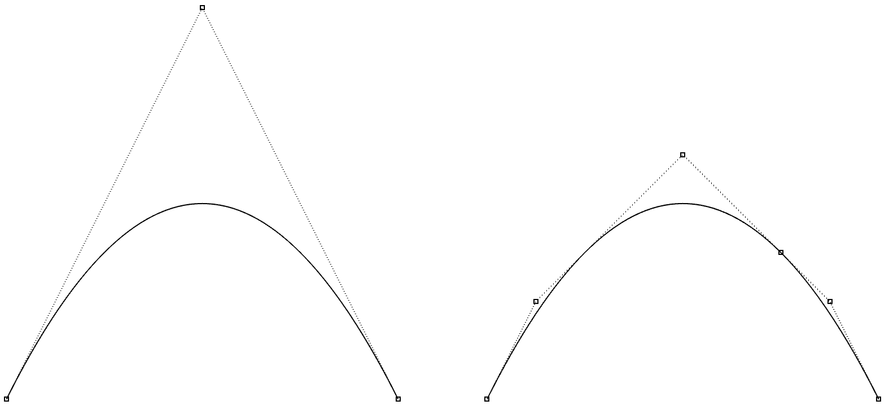
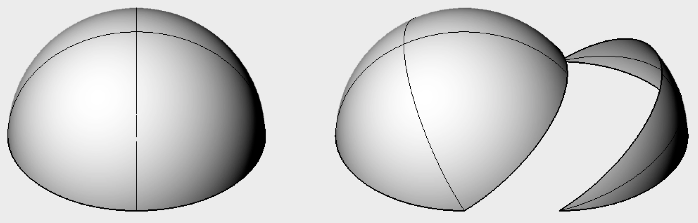

# tinynurbs

## 基本介绍

tinynurbs 是一个轻量级的仅头文件的 C++14 库，提供 NURBS 曲线曲面数据结构。这个 API 非常易用并且代码可读且高效。


### 基本特征

支持几种主要操作：

* 任意阶非有理和有理曲线曲面
* 计算点和任意阶导数
* 在不影响原始形状的情况下进行节点插入和分割
* OBJ 格式 I/O


### 依赖

* 需要 glm 版本不低于 0.9.9 版本，支持 `glm::vec<dim, T>` 类型
* C++14 编译器


### 使用方法

#### 曲线

只需引入头文件，然后可以创建平面曲线（三维点）

```cpp
tinynurbs::Curve<float> crv; // Planar curve using float32
crv.control_points = {glm::vec3(-1, 0, 0), // std::vector of 3D points
                      glm::vec3(0, 1, 0),
                      glm::vec3(1, 0, 0)
                     };
crv.knots = {0, 0, 0, 1, 1, 1}; // std::vector of floats
crv.degree = 2;
```

检查曲面的有效性

```cpp
if (!tinynurbs::curveIsValid(crv)) {
    // check if degree, knots and control points are configured as per
    // #knots == #control points + degree + 1
}
```

计算点和切向

```cpp
glm::vec3 pt = tinynurbs::curvePoint(crv, 0.f);
// Outputs a point [-1, 0]
glm::vec3 tgt = tinynurbs::curveTangent(crv, 0.5f);
// Outputs a vector [1, 0]
```

节点插入

```cpp
crv = tinynurbs::curveKnotInsert(crv, 0.25);
crv = tinynurbs::curveKnotInsert(crv, 0.75, 2);
```




写入 OBJ 文件

```cpp
tinynurbs::curveSaveOBJ("output_curve.obj", crv);
```

这会创建一个如下内容的文件

```
v -1 0 0 1
v -0.75 0.5 0 1
v 0 1.25 0 1
v 0.5 0.75 0 1
v 0.75 0.5 0 1
v 1 0 0 1
cstype bspline
deg 2
curv 0 1 1 2 3 4 5 6
parm u 0 0 0 0.25 0.75 0.75 1 1 1
end
```


#### 曲面

创建有理曲面

```cpp
tinynurbs::RationalSurface<float> srf;
srf.degree_u = 3;
srf.degree_v = 3;
srf.knots_u = {0, 0, 0, 0, 1, 1, 1, 1};
srf.knots_v = {0, 0, 0, 0, 1, 1, 1, 1};

// 2D array of control points using tinynurbs::array2<T> container
// Example from geometrictools.com/Documentation/NURBSCircleSphere.pdf
srf.control_points = {4, 4, 
                      {glm::vec3(0, 0, 1), glm::vec3(0, 0, 1), glm::vec3(0, 0, 1), glm::vec3(0, 0, 1),
                       glm::vec3(2, 0, 1), glm::vec3(2, 4, 1),  glm::vec3(-2, 4, 1),  glm::vec3(-2, 0, 1),
                       glm::vec3(2, 0, -1), glm::vec3(2, 4, -1), glm::vec3(-2, 4, -1), glm::vec3(-2, 0, -1),
                       glm::vec3(0, 0, -1), glm::vec3(0, 0, -1), glm::vec3(0, 0, -1), glm::vec3(0, 0, -1)
                      }
                     };
srf.weights = {4, 4,
               {1,       1.f/3.f, 1.f/3.f, 1,
               1.f/3.f, 1.f/9.f, 1.f/9.f, 1.f/3.f,
               1.f/3.f, 1.f/9.f, 1.f/9.f, 1.f/3.f,
               1,       1.f/3.f, 1.f/3.f, 1
               }
              };
```

曲面切分

```cpp
tinynurbs::RationalSurface<float> left, right;
std::tie(left, right) = tinynurbs::surfaceSplitV(srf, 0.25);
```




写入 OBJ 文件

```cpp
tinynurbs::surfaceSaveOBJ("output_surface.obj", srf);
```

这将会创建如下内容的文件

```
v 0 0 1 1
v 2 0 1 0.333333
v 2 0 -1 0.333333
v 0 0 -1 1
v 0 0 1 0.333333
v 2 4 1 0.111111
v 2 4 -1 0.111111
v 0 0 -1 0.333333
v 0 0 1 0.333333
v -2 4 1 0.111111
v -2 4 -1 0.111111
v 0 0 -1 0.333333
v 0 0 1 1
v -2 0 1 0.333333
v -2 0 -1 0.333333
v 0 0 -1 1
cstype rat bspline
deg 3 3
surf 0 1 0 1 1 2 3 4 5 6 7 8 9 10 11 12 13 14 15 16
parm u 0 0 0 0 1 1 1 1
parm v 0 0 0 0 1 1 1 1
end
```

